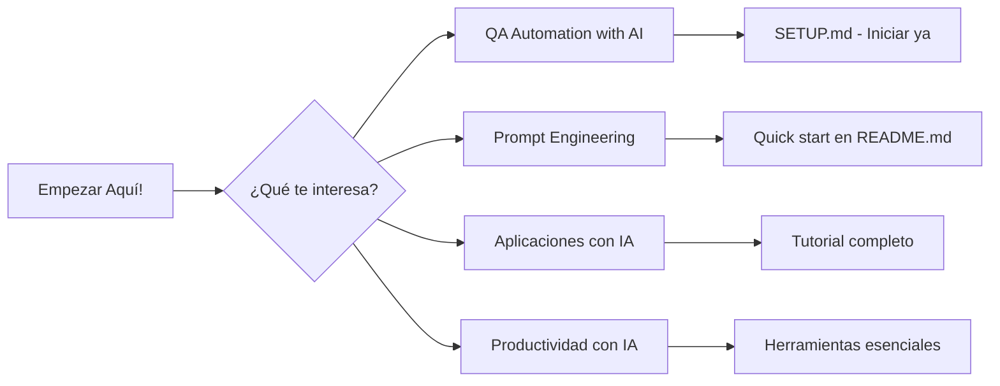

# AI Whisperers - Contenido de Cursos
# Navegación y Mapa del Repositorio

> **¡Bienvenido!** Esta guía rápida te ayuda a encontrar exactamente lo que buscas en nuestros cursos profesionales de desarrollo con IA.

---

## 🎯 Cursos Disponibles

| Estatus | Emblema | Nombre Completo | Páginas | Descripción |
|---------|---------|------------------|---------|-------------|
| **🔥 Producción** | [⭐](cursos/01-produccion/QA-Automation-with-AI/) | QA Automation with AI | 300+ | 12 módulos completos con ejercicios práticos |
| **🏗️ Desarrollo** | [🎓](cursos/02-desarrollo/FPUNA-2026/) | FPUNA 2026 - Ingeniería con IA | 200+ | Programa universitario completo en español |
| **🧪 Beta** | [⚡](cursos/03-beta/Prompt-Engineering-Masterclass/) | Prompt Engineering Masterclass | 180+ | 6 módulos para prompt engineering avanzado |
| **🧪 Beta** | [🚀](cursos/03-beta/Building-AI-Powered-Applications/) | Building AI-Powered Apps | 250+ | Desarrollo full-stack con IA |
| **🧪 Beta** | [💼](cursos/03-beta/AI-Tools-for-Productivity/) | AI Tools for Productivity | 120+ | Herramientas de IA para workflows productivos |

### 📋 Tipos de Estatus
- **`🔥 Producción`** = Listo para estudiantes (contenido verificado)
- **`🏗️ Desarrollo`** = En progreso activo
- **`🧪 Beta`** = Testing y feedback de usuarios

---

## 🗺️ Mapa de Navegación

### **Para Estudiantes**

### **Para Instructores**
- `cursos/01-produccion/QA-Automation-with-AI/README.md` - Curriculum completo
- `cursos/02-desarrollo/FPUNA-2026/instructor/` - Materiales de enseñanza
- `TALLERES-VERANO-2026/` - Contenido de workshops

### **Para Recursos Compartidos**
- `_compartido/configs/` - Configuraciones reutilizables
- `_compartido/ejemplos/` - Ejemplos de código
- `_compartido/setup/` - Scripts de configuración
- `_compartido/templates/` - Plantillas de documentos

---

## 🚀 Accesos Rápidos para lo Más Popular

### **Primeros Pasos Únicos**
- [✅ QA Automation with AI](cursos/01-produccion/QA-Automation-with-AI/)
  - **Mejor para comenzar** - Contenido verificado y completo
  - **Duración estimada**: 40-50 horas
  - **Pre-requisitos**: Básicos de programación

### **Contenido en Español**
- [🎓 FPUNA 2026](cursos/02-desarrollo/FPUNA-2026/)
  - Universidad de Paraguay con dettalle de Ingeniería Aeronáutica
  - Material en español completo
  - Fusión 360 y análisis CFD incluidos

### **Workshops Prácticos**
- [🔥 Talleres de Verano 2026](TALLERES-VERANO-2026/)
  - Sesiones intensivas teórico-prácticas
  - 6 clases estructuradas

---

## 📚 Recursos Adicionales

- 📋 [**Report del Repositorio**](REPOSITORY-ANALYSIS-REPORT.md) - Análisis completo de la organización
- 🔧 [**Scripts Útiles**](scripts/) - Herramientas de automatización
- 📊 [**Estado del Proyecto**](STATUS.md) - Avance actual
- 👥 [**Cómo Contribuir**](CONTRIBUTING.md) - Guía para colaboradores

### Repositorios Relacionados
- [**AI-SDK**](https://github.com/AI-Whisperers/ai-sdk) - SDK interno para prototipos de IA
- [**Prompts**](https://github.com/AI-Whisperers/prompt-engineering) - Librería de prompts reutilizables

---

## 💡 Consejos para Navegar Eficientemente

1. **¿Nuevo aquí?** → Empezá con [QA Automation with AI](cursos/01-produccion/QA-Automation-with-AI/)
2. **¿Prefieres español?** → [FPUNA 2026](cursos/02-desarrollo/FPUNA-2026/)
3. **¿Buscás algo específico?** → Usa la búsqueda (Ctrl+F en este índice)
4. **¿Inpresa de Instructor?** → Explora `cursos/**/instructor/`

---

## 🔄 Últimas Actualizaciones

**2026-01-29:** Completa limpieza y estandarización en español
- Reorganización completa de directorios
- Limpieza de archivos cache innecesarios
- Traducción consistente `courses/` → `cursos/`, `_shared/` → `_compartido/`

---

*¿No encuentras lo que buscas? Verifica [el estado completo](STATUS.md) o proponé un issue.*

---

**🤖 Generado por Sisyphus AI Agent | Repositorio mantenido por AI Whisperers**