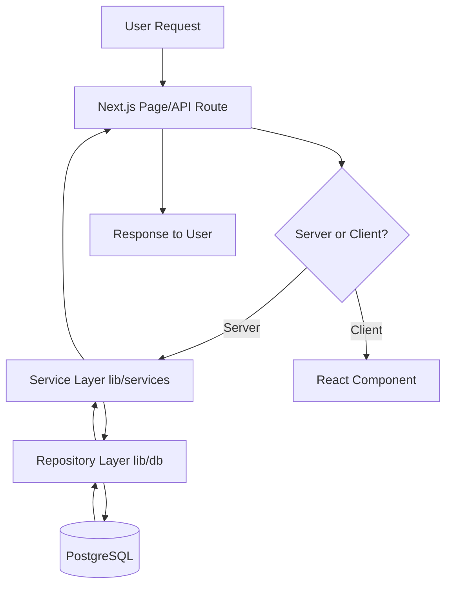

# Core Module 3: Working with Private Repositories
## FPUNA Summer 2026 - Week 3

**Duration**: 1 week (10 hours total)  
**Tool Focus**: OpenCode + GitHub CLI  
**Prerequisites**: Modules 1-2 completed

---

## Module Overview

Most professional development happens in private codebases. This week, you'll learn how to give OpenCode secure access to private repositories, explore unfamiliar codebases with AI assistance, and document existing projects efficiently.

### Learning Objectives

By the end of this week, you will be able to:

1. **Set up** GitHub CLI and authenticate with organizations
2. **Grant** OpenCode secure access to private repositories
3. **Explore** unfamiliar codebases using AI-assisted analysis
4. **Generate** comprehensive documentation for existing projects
5. **Navigate** large codebases efficiently with OpenCode

---

## Why This Matters for Professional Development

### The Reality of Real-World Development

```
Open Source Projects: 5% of your work
Private Codebases:    95% of your work
```

**Most real work happens in private repositories:**
- Company proprietary code
- Client projects under NDA
- Internal tools and services
- Pre-release features

**You need to master working with private repos to:**
- Join existing projects confidently
- Contribute to company codebases
- Work with client repositories
- Collaborate on confidential projects

---

## 3.1 Understanding GitHub Access Control

### Public vs Private Repositories

| Aspect | Public Repo | Private Repo |
|--------|-------------|--------------|
| **Visibility** | Anyone can see | Only authorized users |
| **Cloning** | No authentication needed | Requires authentication |
| **Collaboration** | Open to all | Invite-only |
| **Use Cases** | Open source, portfolios | Company code, client work |
| **AI Access** | Works by default | Requires setup |

### Why Authentication is Required

OpenCode needs permission to:
- Read your private code
- Clone repositories
- Create branches and commits
- Open pull requests
- Access organization resources

---

## 3.2 Setting Up GitHub CLI

GitHub CLI (`gh`) is the bridge between OpenCode and your private repositories.

### Installation

#### Windows
```powershell
# Using winget (Windows Package Manager)
winget install GitHub.cli

# Verify installation
gh --version
# Expected: gh version 2.40.0 or higher
```

#### macOS
```bash
# Using Homebrew
brew install gh

# Verify installation
gh --version
```

#### Linux (Ubuntu/Debian)
```bash
# Add GitHub CLI repository
curl -fsSL https://cli.github.com/packages/githubcli-archive-keyring.gpg | sudo dd of=/usr/share/keyrings/githubcli-archive-keyring.gpg

# Install
sudo apt update
sudo apt install gh

# Verify
gh --version
```

### Post-Installation Check

```bash
# Should show version and available commands
gh --help
```

---

## 3.3 Authenticating with GitHub

### Step-by-Step Authentication

#### Step 1: Start Authentication

```bash
gh auth login
```

#### Step 2: Follow the Interactive Prompts

```
? What account do you want to log into?
  > GitHub.com
    GitHub Enterprise Server

? What is your preferred protocol for Git operations?
  > HTTPS
    SSH

? Authenticate Git with your GitHub credentials?
  > Yes
    No

? How would you like to authenticate GitHub CLI?
  > Login with a web browser
    Paste an authentication token
```

**Recommended choices:**
- Account: **GitHub.com**
- Protocol: **HTTPS** (simpler, works everywhere)
- Authenticate Git: **Yes** (enables full integration)
- Method: **Login with a web browser** (most secure)

#### Step 3: Complete Browser Authentication

1. **Copy the one-time code** shown in terminal (e.g., `A1B2-C3D4`)
2. **Press Enter** to open your browser
3. **Paste the code** on GitHub's device authorization page
4. **Click "Authorize"** to grant access
5. **Return to terminal** to see confirmation

---

### Verifying Authentication

```bash
# Check authentication status
gh auth status

# Expected output:
# github.com
#   ✓ Logged in to github.com as your-username (oauth_token)
#   ✓ Git operations for github.com configured to use https protocol.
#   ✓ Token: gho_************************************
```

If you see the checkmarks (✓), you're successfully authenticated!

---

### Granting Organization Access

If your private repositories are in an organization (like your company or university), you need to grant additional permission.

#### Option 1: Via Web Interface

1. Go to https://github.com/settings/tokens
2. Find the token created by `gh`
3. Scroll to "Organization access"
4. Click **"Grant"** next to your organization
5. Confirm authorization

#### Option 2: Via Command Line

```bash
# Refresh authentication with organization access
gh auth refresh -s read:org -s repo

# Verify organization access
gh repo list YourOrganizationName --limit 5
```

**If successful**, you'll see a list of your organization's repositories.

---

## 3.4 Working with Private Repositories

### Listing Your Repositories

```bash
# List your personal repos
gh repo list --limit 20

# List organization repos
gh repo list FPUNA-CS --limit 20

# Filter by visibility
gh repo list --private --limit 10

# Get detailed information as JSON
gh repo list FPUNA-CS --json name,description,isPrivate,primaryLanguage,pushedAt | head -20
```

### Cloning Private Repositories

```bash
# Clone a specific repository
gh repo clone FPUNA-CS/project-name

# Clone to a custom directory
gh repo clone FPUNA-CS/project-name ~/projects/fpuna-project

# Clone with specific branch
gh repo clone FPUNA-CS/project-name --branch develop
```

### Viewing Repository Information

```bash
# View repository details
gh repo view FPUNA-CS/project-name

# Open repository in browser
gh repo view FPUNA-CS/project-name --web

# View specific branch
gh repo view FPUNA-CS/project-name --branch main
```

### Creating New Repositories

```bash
# Create a new private repository
gh repo create my-new-project --private --clone

# Create in an organization
gh repo create FPUNA-CS/team-project --private --clone

# Create with description and README
gh repo create my-app --private --description "My awesome app" --add-readme
```

---

## 3.5 Configuring OpenCode for Private Repositories

### Connecting OpenCode to GitHub CLI

Once GitHub CLI is authenticated, OpenCode automatically inherits the credentials.

**Test the connection:**

1. **Clone a private repository**:
   ```bash
   gh repo clone FPUNA-CS/sample-project
   cd sample-project
   ```

2. **Start OpenCode**:
   ```bash
   opencode
   ```

3. **Test access**:
   ```
   List all files in this repository
   ```

If OpenCode can read the files, authentication is working!

---

### Troubleshooting Connection Issues

#### Issue 1: OpenCode Can't See Private Repo

**Symptoms**: "Permission denied" or "Repository not found"

**Solution**:
```bash
# Re-authenticate with full permissions
gh auth logout
gh auth login

# Ensure token has correct scopes
gh auth refresh -s repo -s read:org
```

#### Issue 2: Organization Repos Not Visible

**Symptoms**: Can see personal repos but not organization repos

**Solution**:
1. Visit https://github.com/settings/tokens
2. Find your token
3. Grant organization access
4. Or run: `gh auth refresh -s read:org`

#### Issue 3: "Not Authenticated" Error

**Symptoms**: Commands fail with authentication error

**Solution**:
```bash
# Check current status
gh auth status

# If not authenticated, login again
gh auth login

# Verify
gh repo list --limit 5
```

---

## 3.6 AI-Assisted Codebase Exploration

### The Challenge of Unfamiliar Codebases

When joining a new project or company, you face:
- Thousands of files
- Unknown architecture
- Unfamiliar conventions
- Complex dependencies
- Little to no documentation

**Traditional approach**: Spend weeks reading code and asking teammates  
**OpenCode approach**: Get up to speed in hours with AI assistance

---

### The 4-Level Exploration Framework

```
Level 1: Bird's Eye View    (10,000 ft) - What is this project?
Level 2: Architecture Map   (1,000 ft)  - How is it structured?
Level 3: Component Deep-Dive (100 ft)   - How do parts work?
Level 4: Code Details       (10 ft)     - What does this code do?
```

---

### Level 1: Bird's Eye View (15 minutes)

**Goal**: Understand WHAT the project does and WHO uses it

**Prompt Template**:
```
I'm new to this codebase. Provide a high-level overview:

1. **Project Purpose**
   - What problem does this solve?
   - Who are the target users?
   - What are the main features?

2. **Technology Stack**
   - Programming languages
   - Frameworks and libraries
   - Database and storage
   - External APIs/services

3. **Project Maturity**
   - Is this production-ready or in development?
   - Approximate size (files, lines of code)
   - Last updated (active or dormant)?

4. **Quick Start**
   - How to run this locally
   - Key commands (install, build, test, run)

Keep it concise - aim for 2-3 sentences per section.
```

**Example Output**:
```
**Project Purpose**
This is an e-commerce platform for selling artisan products. Target users are small business owners who want to sell online without technical knowledge. Main features include product catalog, shopping cart, payment processing with local providers (Bancard), and order management.

**Technology Stack**
- Frontend: Next.js 14 with TypeScript and Tailwind CSS
- Backend: Next.js API Routes with Prisma ORM
- Database: PostgreSQL 16
- External: Bancard API for payments, SendGrid for emails

**Project Maturity**
Production-ready, currently serving 150+ merchants. ~25,000 lines of code across 180 files. Last updated yesterday (very active development).

**Quick Start**
1. Clone and install: `npm install`
2. Set up database: `npx prisma migrate dev`
3. Run dev server: `npm run dev`
4. Access at http://localhost:3000
```

---

### Level 2: Architecture Map (30 minutes)

**Goal**: Understand HOW the project is structured

**Prompt Template**:
```
Analyze the architecture of this codebase:

1. **Directory Structure**
   - List top-level directories and their purposes
   - Highlight the 3 most important directories
   - Note any unusual or interesting organization

2. **Architecture Pattern**
   - Is it MVC, Clean Architecture, microservices, monolith?
   - How are concerns separated?
   - What design patterns are used?

3. **Data Flow**
   - How does data enter the system?
   - Where is business logic located?
   - How is data persisted?

4. **Key Components**
   - List the 5-7 most important modules/components
   - What does each do?

5. **Visual Diagram**
   - Create a Mermaid diagram showing the main components and their relationships

Format as markdown with clear sections.
```

**Example Output**:
```markdown
## Directory Structure

```
marketplace/
├── app/              # Next.js 14 App Router (pages + API routes)
├── components/       # React components (UI + feature-specific)
├── lib/              # Shared utilities and business logic
├── prisma/           # Database schema and migrations
├── public/           # Static assets
└── tests/            # Test files (unit, integration, e2e)
```

**Most Important**:
1. `app/` - All pages and API endpoints
2. `lib/` - Core business logic and utilities
3. `prisma/` - Database schema (single source of truth)

## Architecture Pattern

**Pattern**: Next.js App Router architecture (modern React with RSC)
- **Server Components**: Default for all pages (better performance)
- **Client Components**: Only when interactivity needed
- **API Routes**: RESTful endpoints in `app/api/`
- **Repository Pattern**: Database access abstracted in `lib/db/repositories/`

## Data Flow



## Key Components

1. **Authentication** (`lib/auth/`) - NextAuth.js integration, session management
2. **Payment Processing** (`lib/payments/`) - Bancard API integration, transaction handling
3. **Product Management** (`app/api/products/`) - CRUD for products, inventory tracking
4. **Order System** (`lib/orders/`) - Order creation, fulfillment workflow
5. **User Management** (`lib/users/`) - User profiles, seller accounts
6. **Email Service** (`lib/email/`) - Transactional emails (orders, notifications)
7. **File Upload** (`lib/upload/`) - Product images, document handling
```

---

### Level 3: Component Deep-Dive (45 minutes per component)

**Goal**: Understand HOW specific components work

**Prompt Template**:
```
I need to understand the [Component Name] component in detail.

1. **Purpose & Responsibility**
   - What is this component's main job?
   - What problems does it solve?

2. **Public API**
   - What functions/methods are exported?
   - What are the parameters and return types?
   - Are there any side effects?

3. **Dependencies**
   - What other modules does this depend on?
   - What external libraries does it use?
   - Are there any circular dependencies?

4. **Data Structures**
   - What types/interfaces are defined?
   - What does the data flow look like?

5. **Error Handling**
   - How are errors handled?
   - What exceptions can be thrown?
   - Is there logging or monitoring?

6. **Testing**
   - Are there existing tests?
   - What's tested and what's missing?
   - What are the critical test scenarios?

Include code examples for the main functions.
```

---

### Level 4: Code Details (As needed)

**Goal**: Understand WHAT specific code does

**Prompt Template**:
```
Explain this code in detail:

[paste code snippet - max 50 lines]

1. **What it does** (high-level summary)
2. **Step-by-step breakdown** (explain each section)
3. **Edge cases** (what could go wrong?)
4. **Potential improvements** (if any)
```

---

## 3.7 Documenting Existing Projects

### Why Documentation Matters

Good documentation:
- Helps new team members onboard
- Reduces repetitive questions
- Serves as a reference for all developers
- Makes maintenance easier

**Problem**: Most projects lack documentation  
**Solution**: Generate it with OpenCode

---

### Documentation Generation Workflow

#### Step 1: Create `README.md`

**Prompt**:
```
Generate a comprehensive README.md for this project.

Include:
1. **Project Title & Description**
2. **Features** (main functionality)
3. **Tech Stack**
4. **Prerequisites** (what needs to be installed)
5. **Installation** (step-by-step setup)
6. **Usage** (how to run it)
7. **Project Structure** (key directories explained)
8. **Configuration** (environment variables, settings)
9. **Testing** (how to run tests)
10. **Contributing** (how to contribute)
11. **License**

Use clear, concise language. Include code blocks for commands.
Format with proper markdown headings and lists.
```

---

#### Step 2: Create `ARCHITECTURE.md`

**Prompt**:
```
Generate an ARCHITECTURE.md document explaining the technical architecture.

Include:
1. **Overview** (high-level architecture)
2. **Design Principles** (patterns and practices used)
3. **Component Diagram** (Mermaid diagram)
4. **Data Flow** (how data moves through the system)
5. **Key Components** (detailed explanation of main parts)
6. **Technology Choices** (why these technologies?)
7. **Security Considerations**
8. **Performance Considerations**
9. **Scalability Plan**

Target audience: experienced developers joining the project.
```

---

#### Step 3: Create `API.md` (for APIs)

**Prompt**:
```
Generate API documentation for all endpoints in this project.

For each endpoint, document:
1. **HTTP Method & Path**
2. **Description** (what it does)
3. **Authentication** (required or not)
4. **Request Parameters** (query, path, body)
5. **Request Example** (with curl or JavaScript)
6. **Response Format** (success response)
7. **Error Responses** (possible errors)
8. **Response Example** (JSON)

Group endpoints by resource (e.g., Users, Products, Orders).
Use OpenAPI/Swagger format if possible.
```

---

#### Step 4: Create `CONTRIBUTING.md`

**Prompt**:
```
Generate a CONTRIBUTING.md guide for new contributors.

Include:
1. **Code of Conduct** (basic expectations)
2. **Development Setup** (detailed setup steps)
3. **Code Style** (conventions from .eslintrc, .prettierrc, etc.)
4. **Commit Messages** (format expectations)
5. **Branch Naming** (convention)
6. **Pull Request Process** (steps to contribute)
7. **Testing Requirements** (what tests are needed)
8. **Code Review Checklist** (what reviewers look for)
9. **Getting Help** (where to ask questions)

Tone: welcoming and helpful for newcomers.
```

---

#### Step 5: Generate Function/Class Documentation

**Prompt**:
```
Add JSDoc comments to all functions in [file path].

For each function:
1. **Description** (what it does)
2. **@param** (each parameter with type and description)
3. **@returns** (return type and description)
4. **@throws** (exceptions that can be thrown)
5. **@example** (usage example)

Follow JSDoc standards. Be concise but complete.
```

---

## 3.8 Practical Workflow: Joining a New Project

### Day 1: Orientation (2-3 hours)

```bash
# 1. Clone the repository
gh repo clone CompanyName/project-name
cd project-name

# 2. Start OpenCode
opencode

# 3. Get the big picture
"I'm new to this codebase. Give me a bird's eye view: What does it do, who uses it, and what's the tech stack?"

# 4. Understand the structure
"Analyze the directory structure and create a visual diagram showing how components relate."

# 5. Set up locally
"What are the exact steps to run this project on my local machine?"

# 6. Create your .opencode file
"Generate a .opencode configuration file for this project based on the codebase analysis."
```

---

### Week 1: Deep Understanding (10-15 hours)

```bash
# Day 2-3: Core components
"Explain the authentication system in detail. Show me the key files and how it works."
"Walk through the database schema. What tables exist and how are they related?"

# Day 4-5: Testing and contribution
"What's the testing setup? How do I run tests and what's currently tested?"
"What's the process for contributing code? Show me the git workflow used here."

# Weekend: Documentation
"Generate a README.md if one doesn't exist, or improve the existing one."
"Create an ARCHITECTURE.md documenting the system design."
```

---

## 3.9 Security Best Practices

### DO's

✅ **DO** use GitHub CLI for authentication (most secure)  
✅ **DO** use HTTPS protocol (works everywhere)  
✅ **DO** keep your token secure (never share it)  
✅ **DO** use `.gitignore` to exclude sensitive files  
✅ **DO** review AI-generated code before committing  
✅ **DO** use environment variables for secrets  
✅ **DO** revoke tokens when you stop using them

### DON'Ts

❌ **DON'T** share your authentication token  
❌ **DON'T** commit `.env` files with secrets  
❌ **DON'T** hardcode API keys or passwords  
❌ **DON'T** copy private code to public forums  
❌ **DON'T** paste sensitive data into AI prompts  
❌ **DON'T** grant unnecessary permissions  
❌ **DON'T** use the same token across multiple machines

---

## Week 3 Practical Exercises

### Exercise 3.1: GitHub CLI Setup & Authentication

**Objective**: Set up and verify GitHub CLI access

**Time**: 30 minutes

**Steps**:

1. **Install GitHub CLI** using the method for your OS
2. **Authenticate**: Run `gh auth login` and complete browser flow
3. **Verify**: Run `gh auth status` and screenshot the output
4. **List repos**: Run `gh repo list --limit 10`
5. **Test clone**: Clone one of your repos with `gh repo clone`

**Deliverable**: Screenshot showing successful authentication and repo list

**Success Criteria**:
- ✅ GitHub CLI installed
- ✅ Successfully authenticated
- ✅ Can list repositories
- ✅ Can clone a repository

---

### Exercise 3.2: Explore an Unfamiliar Codebase

**Objective**: Use OpenCode to understand a codebase you've never seen before

**Time**: 90 minutes

**Scenario**: You've just joined a company and need to understand their main application.

**Steps**:

1. **Choose a codebase** (options):
   - Clone a sample project: [provide sample repos]
   - Use a public repo you're unfamiliar with
   - Ask instructor for a practice repository

2. **Level 1 Analysis** (15 min):
   - Get bird's eye view
   - Document: purpose, tech stack, quick start

3. **Level 2 Analysis** (30 min):
   - Analyze architecture
   - Create a diagram
   - Identify key components

4. **Level 3 Analysis** (30 min):
   - Deep-dive into one component
   - Understand its implementation
   - Document your findings

5. **Create Documentation** (15 min):
   - Generate a README.md
   - Create .opencode file

**Deliverable**: 
- Summary document (2-3 pages)
- README.md
- .opencode file
- Architecture diagram

**Success Criteria**:
- ✅ Can explain what the project does
- ✅ Understands the architecture
- ✅ Created useful documentation
- ✅ Generated .opencode config

---

### Exercise 3.3: Document a Project

**Objective**: Generate comprehensive documentation for an existing project

**Time**: 60 minutes

**Steps**:

1. **Choose a project**:
   - Your own project from Module 2
   - A sample project provided
   - An open-source project

2. **Generate core documentation**:
   - README.md (if missing or incomplete)
   - ARCHITECTURE.md
   - API.md (if it's an API project)

3. **Add code documentation**:
   - Add JSDoc/docstrings to at least 5 functions
   - Ensure all exports are documented

4. **Create developer guide**:
   - CONTRIBUTING.md with setup and workflow

**Deliverable**:
- Complete documentation set
- Pull request with documentation (or commit)

**Success Criteria**:
- ✅ README explains project clearly
- ✅ Architecture is documented
- ✅ Key functions have documentation
- ✅ New developers can onboard with docs

---

### Exercise 3.4: Team Collaboration Simulation

**Objective**: Practice joining a team's private repository

**Time**: 45 minutes

**Scenario**: You're joining a student team project at FPUNA

**Steps**:

1. **Access team repo**:
   - Instructor provides access to shared private repo
   - Verify you can clone it

2. **Orient yourself**:
   - Use OpenCode to understand the project
   - Create your personal notes

3. **Contribute documentation**:
   - Find an undocumented component
   - Add documentation
   - Create a pull request

4. **Review a teammate's work**:
   - Review someone else's PR
   - Provide constructive feedback

**Deliverable**:
- Personal orientation notes
- Documentation PR
- Code review comments

**Success Criteria**:
- ✅ Successfully accessed private repo
- ✅ Understood the project
- ✅ Contributed documentation
- ✅ Participated in code review

---

## Knowledge Check Quiz

1. **What command installs GitHub CLI on Windows?**
   - a) `npm install -g gh`
   - b) `winget install GitHub.cli`
   - c) `pip install gh`
   - d) `apt install gh`

2. **What's the recommended protocol for GitHub operations?**
   - a) SSH
   - b) FTP
   - c) HTTPS
   - d) HTTP

3. **How do you grant organization access to GitHub CLI?**
   - a) `gh org grant`
   - b) `gh auth refresh -s read:org`
   - c) `gh config set org`
   - d) Automatic after login

4. **What's the first level of codebase exploration?**
   - a) Code Details
   - b) Architecture Map
   - c) Bird's Eye View
   - d) Component Deep-Dive

5. **Where should you store sensitive API keys?**
   - a) In the code
   - b) In README.md
   - c) In environment variables
   - d) In git history

**Answer Key**: [1-b, 2-c, 3-b, 4-c, 5-c]

---

## Week 3 Summary

This week, you mastered working with private repositories:

### Key Concepts
- ✅ GitHub CLI authentication and organization access
- ✅ 4-level codebase exploration framework
- ✅ AI-assisted documentation generation
- ✅ Security best practices for private code

### Skills Developed
- ✅ Authenticate and access private repositories
- ✅ Explore unfamiliar codebases systematically
- ✅ Generate comprehensive project documentation
- ✅ Onboard to new projects efficiently

### Practical Applications
- ✅ Can work with company/client private repos
- ✅ Can understand new codebases in hours, not weeks
- ✅ Can create missing documentation
- ✅ Ready for professional team collaboration

---

## Next Steps

**Next Week**: Module 4 - Documentation & Knowledge Management

You'll learn how to:
- Generate and maintain project documentation
- Create knowledge bases for teams
- Document APIs and architectures
- Build internal wikis with AI assistance

---

## Additional Resources

### Official Documentation
- [GitHub CLI Manual](https://cli.github.com/manual/)
- [GitHub CLI Authentication](https://cli.github.com/manual/gh_auth_login)
- [OpenCode Private Repo Guide](https://opencode.dev/docs/private-repos)

### Security Resources
- [GitHub Security Best Practices](https://docs.github.com/en/code-security/getting-started/github-security-features)
- [Managing Personal Access Tokens](https://docs.github.com/en/authentication/keeping-your-account-and-data-secure/managing-your-personal-access-tokens)

### Practice Projects
- [Sample Private Repos for Practice](https://github.com/fpuna-summer-2026)
- [Codebase Exploration Exercises](https://github.com/fpuna-summer-2026/exploration-exercises)

---

**Module Status**: ✅ Week 3 Complete

**Next Module**: [Module 4: Documentation & Knowledge Management](./CORE-MODULE-04-DRAFT.md)
