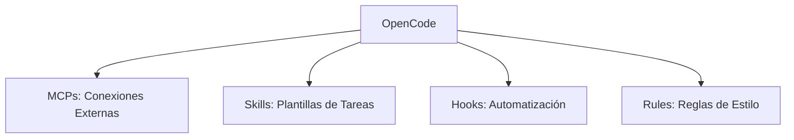

# Módulo 02: Dominio de Configuración

## Objetivo y Duración
**Objetivo**: Configurar OpenCode con superpoderes personalizados (MCPs, Skills, Hooks y Rules) para maximizar la productividad académica.
**Duración**: 2 horas

## Los 4 Pilares
La configuración de OpenCode se basa en cuatro componentes fundamentales que residen en la carpeta `~/.opencode/` (o `C:\Users\Usuario\.opencode\` en Windows):



## Parte 1: MCPs (Model Context Protocol)
Los MCPs son "conectores" que permiten a OpenCode interactuar con herramientas externas como el sistema de archivos, Git o bases de datos.

**Ejemplo: Filesystem MCP**
Permite a la IA leer y escribir archivos en carpetas específicas de tu computadora.
1. **Instalación**: `npm install -g @modelcontextprotocol/server-filesystem`
2. **Configuración** (en `mcp-servers.json`):
```json
{
  "mcpServers": {
    "filesystem": {
      "command": "npx",
      "args": ["-y", "@modelcontextprotocol/server-filesystem", "C:\\Users\\TuNombre\\FPUNA-Proyectos"]
    }
  }
}
```
*Otros MCPs comunes: Git (gestión de repositorios) y GitHub (interacción con la nube).*

## Parte 2: Skills
Los Skills son recetas o plantillas pre-programadas para ejecutar tareas repetitivas de forma instantánea.

**Ejemplo: fpuna-header**
Un skill personalizado para insertar el encabezado oficial de la facultad en tus archivos.
1. **Crear carpeta**: `~/.opencode/skills/fpuna-header/`
2. **Definir `skill.yaml`**:
```yaml
name: fpuna-header
description: Agrega encabezado FPUNA a archivos
inputs:
  - name: nombre
    required: true
template: |
  /** FACULTAD POLITÉCNICA - UNA | Estudiante: {{ nombre }} **/
steps:
  - prompt: "Agrega este encabezado al inicio del archivo: {{ template }}"
```
*Otros skills: generate-readme (documentación) y generate-unit-tests (pruebas unitarias).*

## Parte 3: Hooks
Los Hooks son disparadores que ejecutan acciones automáticas antes o después de ciertos eventos (como generar código o hacer un commit).

**Ejemplo: post-generate**
Formatea automáticamente el código recién generado para que siempre esté limpio.
**Configuración** (en `hooks.yaml`):
```yaml
hooks:
  post-generate:
    - name: format-code
      command: npx prettier --write .
      on_fail: warn
```
*Otros hooks: pre-commit (ejecutar tests antes de guardar) y post-install (actualizar documentación).*

## Parte 4: Rules
Las Rules son instrucciones persistentes que la IA debe seguir estrictamente al generar contenido, asegurando consistencia en todo el proyecto.

**Ejemplo de Regla de Estilo**
**Configuración** (en `rules.yaml`):
```yaml
rules:
  code_style:
    javascript:
      - "Usar nombres de variables en español"
      - "camelCase para funciones"
      - "Incluir comentarios JSDoc en español"
```
*Categorías principales: Estilo de Código, Documentación, Testing, Seguridad y Estándares FPUNA.*

## Verificación Final
- [ ] `mcp-servers.json` configurado y validado.
- [ ] Al menos un Skill instalado y funcional.
- [ ] Archivo `hooks.yaml` creado con al menos una automatización.
- [ ] Archivo `rules.yaml` definiendo el estilo de codificación.
- [ ] Proyecto de prueba generado exitosamente con todas las configuraciones aplicadas.

## Solución de Problemas
1. **MCP not found**: Verifica la instalación global con `npm list -g` y reinicia OpenCode.
2. **Hooks no ejecutan**: Valida la sintaxis en un linter de YAML y revisa los permisos del archivo.
3. **Rules ignoradas**: Sé más específico en la regla o inclúyela directamente en el prompt si es crítica.
4. **Error de JSON**: Usa herramientas como JSONLint para asegurar que no falten comas o llaves.

## Quiz
1. **¿Cuáles son los 4 pilares de configuración?**
   <details><summary>Ver respuesta</summary>MCPs, Skills, Hooks y Rules.</details>

2. **¿Qué herramienta permite a OpenCode leer archivos locales?**
   <details><summary>Ver respuesta</summary>Filesystem MCP.</details>

3. **¿En qué archivo se definen las reglas de estilo de código?**
   <details><summary>Ver respuesta</summary>rules.yaml.</details>

## Siguiente Módulo
[Módulo 03: Ingeniería de Prompts](./03-prompt-engineering.md)
