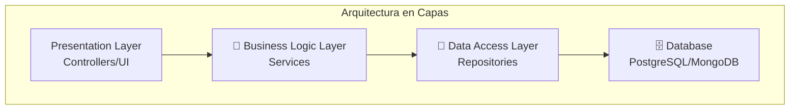

### Tutorial: Arquitectura en Capas (Layered)

#### Concepto: Separación de Responsabilidades
Esta es la arquitectura más común y un excelente punto de partida. Organiza el código en "capas" horizontales, donde cada capa tiene una responsabilidad específica y solo puede comunicarse con la capa directamente debajo de ella.

**Analogía**: Como un edificio con pisos específicos.
- **Piso de Presentación**: La recepción y las oficinas de cara al público (la UI y los Controllers).
- **Piso de Negocios**: Donde los gerentes toman decisiones (la Lógica de Negocio, los Services).
- **Piso de Archivos**: El archivo donde se guardan los documentos (el Acceso a Datos, los Repositories).
- **Sótano**: La bóveda segura (la Base de Datos).

#### Flujo de una Petición
Cuando un usuario hace una petición (ej: crear un nuevo usuario), la información fluye verticalmente a través de las capas:
1.  **Controller**: Recibe la petición HTTP, valida los datos de entrada (¿el email es válido?, ¿la contraseña tiene 8 caracteres?). Si todo está bien, llama al Service.
2.  **Service**: Contiene la lógica de negocio. Verifica reglas complejas (¿este email ya existe?), realiza cálculos, y orquesta las operaciones. Llama al Repository para persistir los datos.
3.  **Repository**: Su única responsabilidad es hablar con la base de datos. Traduce las llamadas del servicio a queries SQL (o NoSQL). No sabe nada de la lógica de negocio.
4.  **Database**: Almacena los datos de forma persistente.

#### Ventajas y Desventajas

| ✅ Ventajas | ❌ Desventajas |
| :--- | :--- |
| **Fácil de entender**: Muy intuitiva para nuevos desarrolladores. | **Monolítica**: Toda la aplicación es una sola unidad. |
| **Separación clara**: Cada capa tiene un propósito bien definido. | **Difícil de escalar**: No puedes escalar solo la capa de datos; debes escalar toda la aplicación. |
| **Testeable**: Puedes probar cada capa de forma aislada. | **Riesgo de acoplamiento**: Es fácil que la lógica de negocio se "filtre" a las otras capas. |
| **Mantenible**: Los cambios suelen estar localizados en una capa. | **Overhead**: Para una app muy simple (un "CRUD"), puede ser excesiva. |
