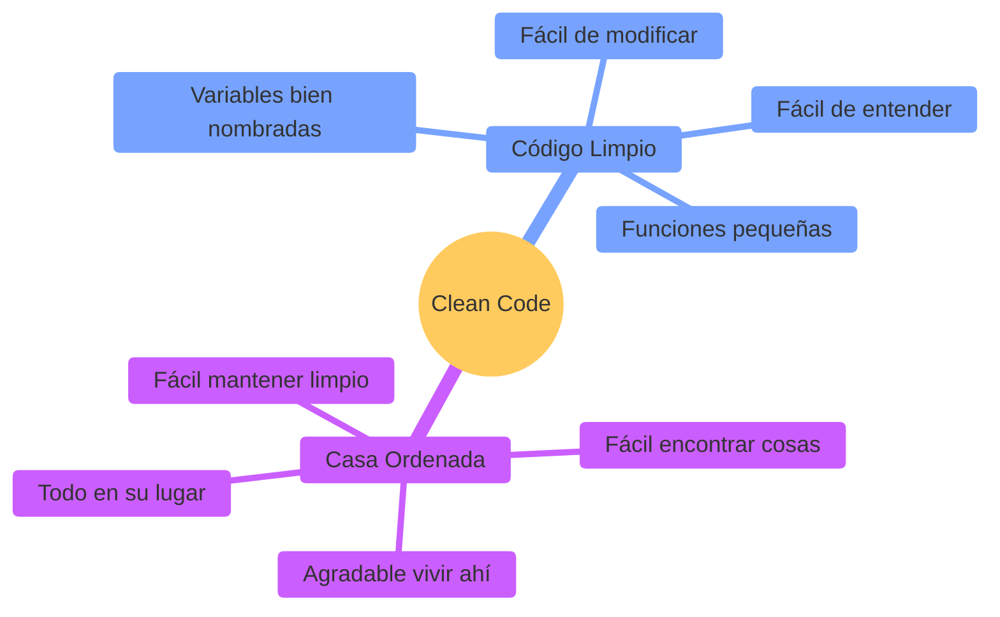
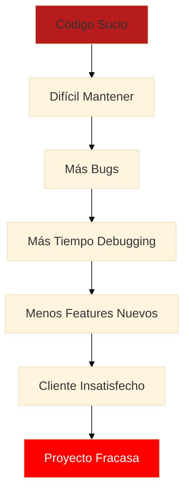
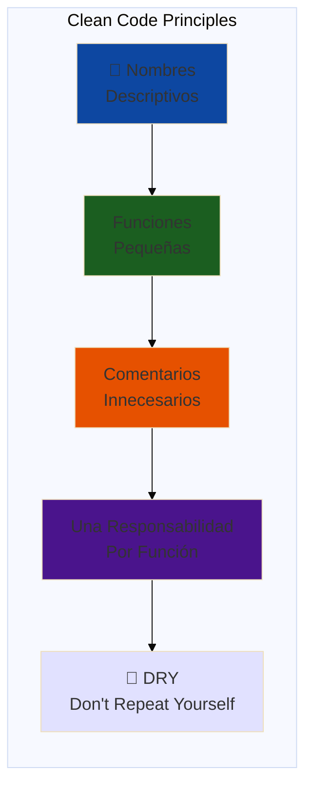
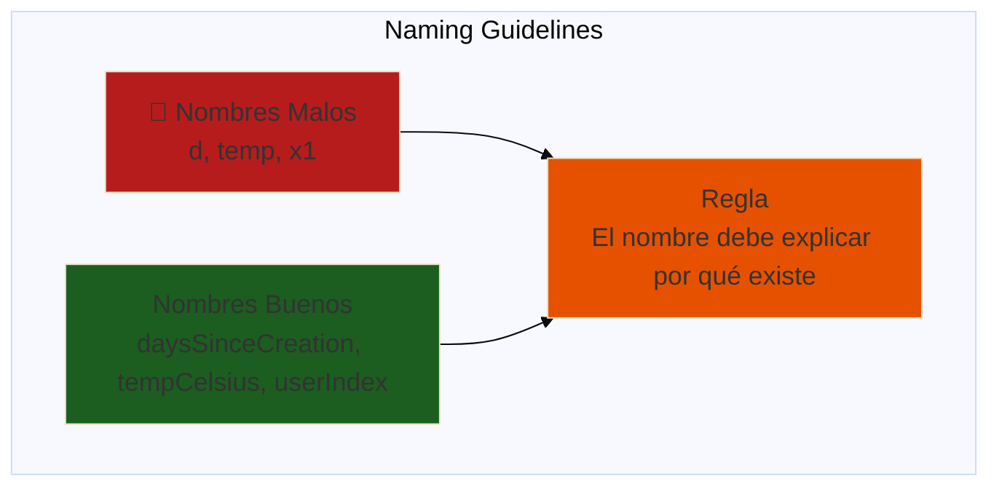
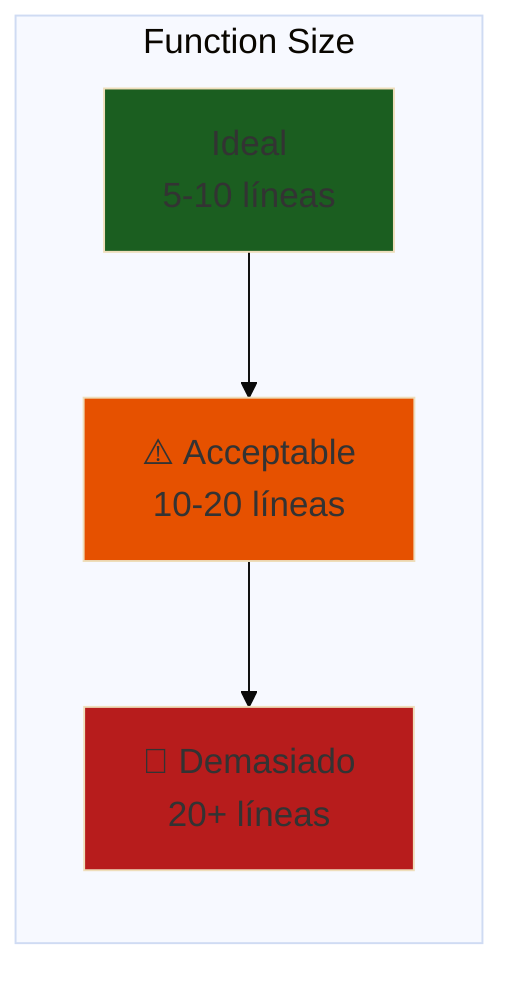
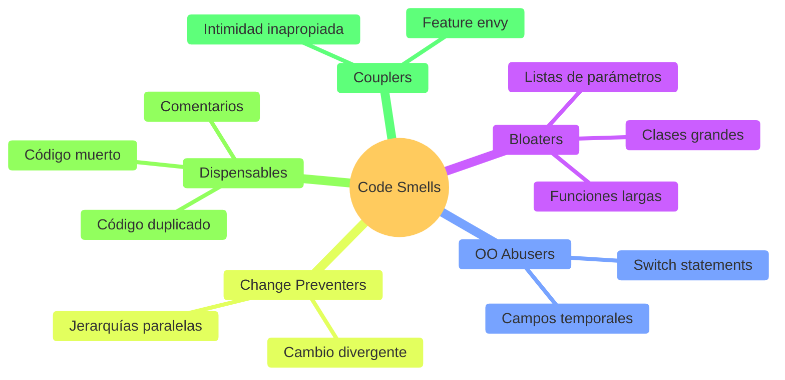
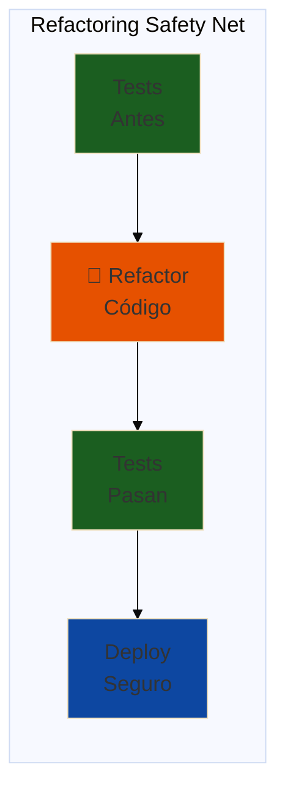
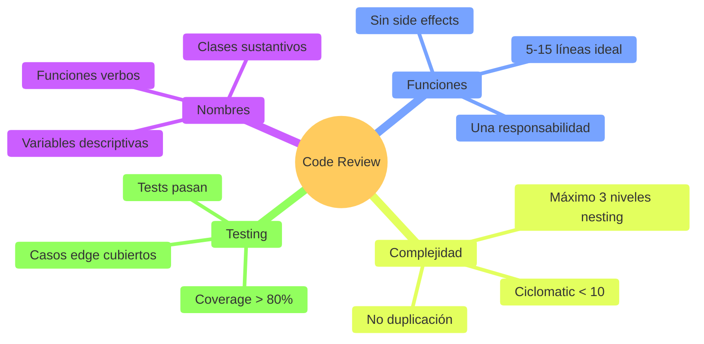

# ✨ Módulo 04: Clean Code & Refactoring

## Escribe Código que Otros Amen Leer

> **Para Desarrolladores**: Este módulo te enseña los principios de código limpio de Robert C. Martin (Uncle Bob) y técnicas profesionales de refactoring. Aprenderás a identificar "code smells" y cómo OpenCode te ayuda a transformar código legacy en código mantenible y elegante.

**⏱️ Duración**: 4 horas  
**👤 Nivel**: Intermedio (con fundamentos de programación)  
**🎯 Objetivo**: Dominar Clean Code principles y refactoring profesional

---

## 🎓 ¿Qué Vas a Lograr?

1. ✅ **Escribir código limpio** - Principios de Uncle Bob
2. ✅ **Identificar code smells** - 25+ patrones de mal código
3. ✅ **Aplicar refactoring** - Técnicas profesionales
4. ✅ **Code review efectivo** - Checklist de calidad
5. ✅ **Usar IA para refactoring** - OpenCode como asistente

---

## 🤔 ¿Qué es Clean Code?

### Analogía: Casa Ordenada vs Casa Desordenada



**Clean Code** = Código que es fácil de leer, entender y modificar. No es "código que funciona", es código que **otros** (o tú en 6 meses) pueden entender sin esfuerzo.

### ¿Por Qué Clean Code en Paraguay?

**Realidad del mercado local**:
- ✅ **Softtek** rechaza código sin code review aprobado
- ✅ **Global Logic** usa SonarQube con gates de calidad
- ✅ **Roshka** aplica refactoring obligatorio en sprints
- ✅ **Aruma** (fintech) - código limpio es requisito regulatorio

**Código sucio** = Technical debt = Proyecto que fracasa 💀

### El Costo del Código Sucio



---

## 📊 Los Principios de Clean Code



---

## 🏢 Parte 1: Principios de Clean Code (60 min)

### Concepto: Naming Matters

**Analogía**: Como letreros claros en las calles de Asunción - te dicen exactamente a dónde vas.



### Ejemplo Real: Sistema de Usuarios FPUNA

#### ❌ Código Sucio

```typescript
// user.service.ts - MAL
export class UserService {
  async cr(d: any) {
    const u = await this.r.f(d.e);
    if (u) throw new Error('exist');
    
    const p = await bcrypt.hash(d.p, 10);
    return this.r.c({...d, p});
  }
  
  async g(id: number) {
    return this.r.f(id);
  }
}
```

**Problemas**:
1. **Nombres crípticos**: `cr`, `d`, `u`, `r`, `f` - ¿Qué significan?
2. **Tipo `any`**: Perdiste type safety
3. **No se entiende qué hace**: Tienes que leer línea por línea

#### ✅ Código Limpio

```typescript
// user.service.ts - BIEN
export class UserService {
  constructor(private userRepository: UserRepository) {}
  
  /**
   * Crea un nuevo usuario con password hasheado
   * @throws ConflictException si el email ya existe
   */
  async createUser(userData: CreateUserDto): Promise<User> {
    const existingUser = await this.userRepository.findByEmail(userData.email);
    if (existingUser) {
      throw new ConflictException('Email ya registrado');
    }
    
    const hashedPassword = await this.hashPassword(userData.password);
    
    return this.userRepository.create({
      ...userData,
      password: hashedPassword,
    });
  }
  
  async findUserById(userId: number): Promise<User | null> {
    return this.userRepository.findById(userId);
  }
  
  private async hashPassword(plainPassword: string): Promise<string> {
    const SALT_ROUNDS = 10;
    return bcrypt.hash(plainPassword, SALT_ROUNDS);
  }
}
```

**Mejoras**:
1. ✅ **Nombres descriptivos**: `createUser`, `existingUser`, `hashedPassword`
2. ✅ **Tipos explícitos**: `CreateUserDto`, `Promise<User>`
3. ✅ **Funciones pequeñas**: `hashPassword` extraída
4. ✅ **Constantes nombradas**: `SALT_ROUNDS` en lugar de magic number `10`

### Reglas de Nomenclatura

#### Variables

```typescript
// ❌ MAL
const d = new Date();
const l = users.length;
const tmp = calcTotal();

// ✅ BIEN
const currentDate = new Date();
const totalUsers = users.length;
const orderTotal = calculateOrderTotal();
```

#### Funciones

```typescript
// ❌ MAL
function proc(data: any) { /* ... */ }
function handle() { /* ... */ }
function doStuff(x, y) { /* ... */ }

// ✅ BIEN
function processPayment(paymentData: PaymentDto): Payment { /* ... */ }
function handleUserRegistration(): void { /* ... */ }
function calculateShippingCost(weight: number, distance: number): number { /* ... */ }
```

#### Clases

```typescript
// ❌ MAL
class Data { /* ... */ }
class Manager { /* ... */ }
class Processor { /* ... */ }

// ✅ BIEN
class UserRepository { /* ... */ }
class EmailNotificationService { /* ... */ }
class OrderPaymentProcessor { /* ... */ }
```

#### Constantes

```typescript
// ❌ MAL
const MAX = 100;
const flag = true;

// ✅ BIEN
const MAX_LOGIN_ATTEMPTS = 5;
const IS_PRODUCTION_ENVIRONMENT = process.env.NODE_ENV === 'production';
const GUARANI_TO_USD_RATE = 0.00014; // 1 Gs = 0.00014 USD
```

### Principio: Funciones Pequeñas

**Regla de oro**: Una función debe hacer **UNA** cosa y hacerla bien.



#### ❌ Función Grande (Hace Muchas Cosas)

```typescript
// order.service.ts - MAL
async processOrder(orderId: number) {
  // 1. Obtener orden
  const order = await this.orderRepo.findById(orderId);
  if (!order) throw new NotFoundException('Orden no encontrada');
  
  // 2. Validar stock
  for (const item of order.items) {
    const product = await this.productRepo.findById(item.productId);
    if (!product) throw new NotFoundException('Producto no existe');
    if (product.stock < item.quantity) {
      throw new BadRequestException(`Stock insuficiente: ${product.nombre}`);
    }
  }
  
  // 3. Calcular total
  let total = 0;
  for (const item of order.items) {
    total += item.price * item.quantity;
  }
  
  // 4. Aplicar descuentos
  if (total > 1000000) { // Más de 1M Gs
    total *= 0.9; // 10% descuento
  }
  
  // 5. Procesar pago
  const paymentResult = await this.paymentGateway.charge({
    amount: total,
    currency: 'PYG',
  });
  
  if (paymentResult.status !== 'approved') {
    throw new BadRequestException('Pago rechazado');
  }
  
  // 6. Reducir stock
  for (const item of order.items) {
    await this.productRepo.reduceStock(item.productId, item.quantity);
  }
  
  // 7. Actualizar orden
  order.status = 'paid';
  order.total = total;
  await this.orderRepo.update(order);
  
  // 8. Enviar email
  const user = await this.userRepo.findById(order.userId);
  await this.emailService.send({
    to: user.email,
    subject: 'Orden confirmada',
    template: 'order-confirmation',
  });
  
  return order;
}
```

**Problemas**: 
- 🚫 80+ líneas
- 🚫 Hace 8 cosas diferentes
- 🚫 Difícil de testear
- 🚫 Imposible de reutilizar partes

#### ✅ Refactorizado en Funciones Pequeñas

```typescript
// order.service.ts - BIEN
async processOrder(orderId: number): Promise<Order> {
  const order = await this.getOrderOrFail(orderId);
  
  await this.validateStock(order);
  
  const totalAmount = this.calculateTotal(order);
  const finalAmount = this.applyDiscounts(totalAmount);
  
  await this.processPayment(finalAmount);
  await this.reduceProductsStock(order);
  
  const updatedOrder = await this.updateOrderStatus(order, finalAmount);
  
  await this.sendConfirmationEmail(updatedOrder);
  
  return updatedOrder;
}

private async getOrderOrFail(orderId: number): Promise<Order> {
  const order = await this.orderRepo.findById(orderId);
  if (!order) {
    throw new NotFoundException('Orden no encontrada');
  }
  return order;
}

private async validateStock(order: Order): Promise<void> {
  for (const item of order.items) {
    const product = await this.productRepo.findById(item.productId);
    
    if (!product) {
      throw new NotFoundException(`Producto ${item.productId} no existe`);
    }
    
    if (product.stock < item.quantity) {
      throw new BadRequestException(
        `Stock insuficiente para ${product.nombre}. ` +
        `Disponible: ${product.stock}, Solicitado: ${item.quantity}`
      );
    }
  }
}

private calculateTotal(order: Order): number {
  return order.items.reduce(
    (sum, item) => sum + item.price * item.quantity,
    0
  );
}

private applyDiscounts(amount: number): number {
  const DISCOUNT_THRESHOLD = 1000000; // 1M Gs
  const DISCOUNT_RATE = 0.1; // 10%
  
  if (amount > DISCOUNT_THRESHOLD) {
    return amount * (1 - DISCOUNT_RATE);
  }
  
  return amount;
}

private async processPayment(amount: number): Promise<void> {
  const result = await this.paymentGateway.charge({
    amount,
    currency: 'PYG',
  });
  
  if (result.status !== 'approved') {
    throw new BadRequestException('Pago rechazado');
  }
}

private async reduceProductsStock(order: Order): Promise<void> {
  const stockReductions = order.items.map(item =>
    this.productRepo.reduceStock(item.productId, item.quantity)
  );
  
  await Promise.all(stockReductions);
}

private async updateOrderStatus(order: Order, total: number): Promise<Order> {
  order.status = 'paid';
  order.total = total;
  order.paidAt = new Date();
  
  return this.orderRepo.update(order);
}

private async sendConfirmationEmail(order: Order): Promise<void> {
  const user = await this.userRepo.findById(order.userId);
  
  await this.emailService.send({
    to: user.email,
    subject: 'Orden confirmada - FPUNA Store',
    template: 'order-confirmation',
    data: { order, user },
  });
}
```

**Ventajas**:
1. ✅ **Cada función hace UNA cosa**
2. ✅ **Fácil de testear**: Puedes testear `calculateTotal()` independientemente
3. ✅ **Reutilizable**: `applyDiscounts()` puede usarse en otros lugares
4. ✅ **Legible**: `processOrder()` lee como un libro
5. ✅ **Mantenible**: Cambiar lógica de descuentos solo afecta una función

### Principio: Evitar Comentarios Innecesarios

**Regla**: El código debe explicarse a sí mismo. Los comentarios mienten (se desactualizan).

#### ❌ Comentarios Innecesarios

```typescript
// Función que crea usuario
async createUser(data: CreateUserDto) {
  // Buscar si el email ya existe
  const user = await this.repo.findByEmail(data.email);
  
  // Si existe, lanzar error
  if (user) {
    throw new Error('Email existe');
  }
  
  // Hashear password
  const hashed = await bcrypt.hash(data.password, 10);
  
  // Crear usuario en DB
  return this.repo.create({...data, password: hashed});
}
```

**Problema**: Los comentarios solo repiten lo que el código ya dice.

#### ✅ Código Auto-Explicativo

```typescript
async createUser(userData: CreateUserDto): Promise<User> {
  await this.ensureEmailIsUnique(userData.email);
  
  const hashedPassword = await this.hashPassword(userData.password);
  
  return this.saveUser({
    ...userData,
    password: hashedPassword,
  });
}

private async ensureEmailIsUnique(email: string): Promise<void> {
  const existingUser = await this.repo.findByEmail(email);
  
  if (existingUser) {
    throw new ConflictException('Email ya registrado');
  }
}
```

**Mejor**: Los nombres de funciones explican la intención.

#### ✅ Comentarios Que SÍ Aportan Valor

```typescript
/**
 * Calcula el costo de envío según peso y distancia.
 * 
 * Fórmula: 
 * - Costo base: 10,000 Gs
 * - + 500 Gs por kg
 * - + 1,000 Gs por cada 10 km
 * 
 * @param weightKg - Peso del paquete en kilogramos
 * @param distanceKm - Distancia de envío en kilómetros
 * @returns Costo total en Guaraníes
 * 
 * @example
 * calculateShippingCost(5, 50) // 22,500 Gs
 */
calculateShippingCost(weightKg: number, distanceKm: number): number {
  const BASE_COST = 10000;
  const COST_PER_KG = 500;
  const COST_PER_10KM = 1000;
  
  const weightCost = weightKg * COST_PER_KG;
  const distanceCost = Math.ceil(distanceKm / 10) * COST_PER_10KM;
  
  return BASE_COST + weightCost + distanceCost;
}

// WARNING: Esta función tiene side effect - modifica el array original
function sortUsersInPlace(users: User[]): void {
  users.sort((a, b) => a.nombre.localeCompare(b.nombre));
}

// TODO: Optimizar con Redis cache
async getPopularProducts(): Promise<Product[]> {
  return this.productRepo.findMostViewed();
}

// HACK: API externa no soporta batch requests, iteramos 1 por 1
// Ticket: FPUNA-1234
async syncProducts(productIds: number[]): Promise<void> {
  for (const id of productIds) {
    await this.externalApi.updateProduct(id);
  }
}
```

**Buenos comentarios**:
1. ✅ **Documentación de API** - Explica contratos
2. ✅ **WARNING** - Alertas importantes
3. ✅ **TODO** - Trabajo pendiente
4. ✅ **HACK** - Soluciones temporales con contexto

---

## 🧹 Parte 2: Code Smells (90 min)

### Concepto: Olores que Indican Problemas

**Analogía**: Como cuando tu casa huele raro - algo está mal aunque no sepas qué exactamente.



### 25+ Code Smells con Ejemplos

#### 1. Nombres Crípticos

```typescript
// ❌ MAL
function calc(a: number, b: number): number {
  return a * b * 0.1;
}

// ✅ BIEN
function calculateCommission(saleAmount: number, commissionRate: number): number {
  const COMMISSION_PERCENTAGE = 0.1;
  return saleAmount * commissionRate * COMMISSION_PERCENTAGE;
}
```

**Refactoring**: Rename Variable/Function

#### 2. Magic Numbers

```typescript
// ❌ MAL
if (user.age > 18) {
  // ...
}

const total = price * 1.1;

// ✅ BIEN
const LEGAL_AGE_PARAGUAY = 18;
if (user.age > LEGAL_AGE_PARAGUAY) {
  // ...
}

const IVA_RATE = 0.1; // 10% IVA en Paraguay
const priceWithTax = price * (1 + IVA_RATE);
```

**Refactoring**: Extract Constant

#### 3. Función Demasiado Larga

```typescript
// ❌ MAL - 100+ líneas
async registerStudent() {
  // Validar datos
  // Verificar prerrequisitos
  // Crear usuario
  // Asignar materias
  // Generar credenciales
  // Enviar emails
  // Logging
  // ...
}

// ✅ BIEN
async registerStudent(data: StudentRegistrationDto): Promise<Student> {
  await this.validateStudentData(data);
  await this.verifyPrerequisites(data.courses);
  
  const user = await this.createUserAccount(data);
  const student = await this.createStudentProfile(user, data);
  
  await this.enrollInCourses(student, data.courses);
  await this.generateCredentials(student);
  
  await this.sendWelcomeEmail(student);
  
  this.logger.log(`Student registered: ${student.id}`);
  
  return student;
}
```

**Refactoring**: Extract Method

#### 4. Demasiados Parámetros

```typescript
// ❌ MAL
function createProduct(
  name: string,
  price: number,
  stock: number,
  category: string,
  brand: string,
  description: string,
  imageUrl: string,
  weight: number,
  dimensions: string
) {
  // ...
}

// ✅ BIEN
interface CreateProductDto {
  name: string;
  price: number;
  stock: number;
  category: string;
  brand: string;
  description: string;
  imageUrl: string;
  specifications: {
    weight: number;
    dimensions: string;
  };
}

function createProduct(productData: CreateProductDto) {
  // ...
}
```

**Refactoring**: Introduce Parameter Object

#### 5. Código Duplicado

```typescript
// ❌ MAL
async sendWelcomeEmail(user: User) {
  const html = `<h1>Bienvenido ${user.nombre}</h1>`;
  await this.mailer.send({
    to: user.email,
    subject: 'Bienvenido a FPUNA',
    html,
  });
}

async sendPasswordResetEmail(user: User, token: string) {
  const html = `<h1>Reset Password ${user.nombre}</h1>`;
  await this.mailer.send({
    to: user.email,
    subject: 'Reset Password',
    html,
  });
}

// ✅ BIEN
private async sendEmail(
  user: User, 
  subject: string, 
  template: string,
  data?: Record<string, any>
): Promise<void> {
  const html = this.templateEngine.render(template, { user, ...data });
  
  await this.mailer.send({
    to: user.email,
    subject,
    html,
  });
}

async sendWelcomeEmail(user: User) {
  return this.sendEmail(user, 'Bienvenido a FPUNA', 'welcome');
}

async sendPasswordResetEmail(user: User, token: string) {
  return this.sendEmail(user, 'Reset Password', 'password-reset', { token });
}
```

**Refactoring**: Extract Method + Template Method Pattern

#### 6. Variable Temporal Innecesaria

```typescript
// ❌ MAL
function calculateDiscount(price: number): number {
  const discount = price * 0.1;
  return discount;
}

// ✅ BIEN
function calculateDiscount(price: number): number {
  const DISCOUNT_RATE = 0.1;
  return price * DISCOUNT_RATE;
}
```

**Refactoring**: Inline Variable

#### 7. Condiciones Complejas

```typescript
// ❌ MAL
if (user.age > 18 && user.country === 'Paraguay' && user.verified && !user.banned) {
  // ...
}

// ✅ BIEN
function canAccessAdultContent(user: User): boolean {
  const isAdult = user.age > LEGAL_AGE_PARAGUAY;
  const isFromParaguay = user.country === 'Paraguay';
  const hasVerifiedAccount = user.verified;
  const isNotBanned = !user.banned;
  
  return isAdult && isFromParaguay && hasVerifiedAccount && isNotBanned;
}

if (canAccessAdultContent(user)) {
  // ...
}
```

**Refactoring**: Extract Method + Introduce Explaining Variable

#### 8. Switch Statement Grande

```typescript
// ❌ MAL
function calculateShipping(type: string, weight: number): number {
  switch (type) {
    case 'standard':
      return weight * 1000;
    case 'express':
      return weight * 2000;
    case 'overnight':
      return weight * 5000;
    case 'international':
      return weight * 10000;
    default:
      throw new Error('Invalid type');
  }
}

// ✅ BIEN (Strategy Pattern)
interface ShippingStrategy {
  calculate(weight: number): number;
}

class StandardShipping implements ShippingStrategy {
  calculate(weight: number): number {
    const RATE_PER_KG = 1000;
    return weight * RATE_PER_KG;
  }
}

class ExpressShipping implements ShippingStrategy {
  calculate(weight: number): number {
    const RATE_PER_KG = 2000;
    return weight * RATE_PER_KG;
  }
}

class ShippingCalculator {
  private strategies = new Map<string, ShippingStrategy>([
    ['standard', new StandardShipping()],
    ['express', new ExpressShipping()],
    ['overnight', new OvernightShipping()],
    ['international', new InternationalShipping()],
  ]);
  
  calculate(type: string, weight: number): number {
    const strategy = this.strategies.get(type);
    
    if (!strategy) {
      throw new Error(`Unknown shipping type: ${type}`);
    }
    
    return strategy.calculate(weight);
  }
}
```

**Refactoring**: Replace Conditional with Polymorphism

#### 9. Clase Demasiado Grande (God Class)

```typescript
// ❌ MAL - Hace TODO
class UserManager {
  createUser() { /* ... */ }
  updateUser() { /* ... */ }
  deleteUser() { /* ... */ }
  sendEmail() { /* ... */ }
  processPayment() { /* ... */ }
  generateReport() { /* ... */ }
  uploadFile() { /* ... */ }
  // ... 50 métodos más
}

// ✅ BIEN - Separar responsabilidades
class UserService {
  createUser() { /* ... */ }
  updateUser() { /* ... */ }
  deleteUser() { /* ... */ }
}

class EmailService {
  sendWelcomeEmail() { /* ... */ }
  sendPasswordReset() { /* ... */ }
}

class PaymentService {
  processPayment() { /* ... */ }
  refundPayment() { /* ... */ }
}

class ReportService {
  generateUserReport() { /* ... */ }
}

class FileUploadService {
  uploadFile() { /* ... */ }
}
```

**Refactoring**: Extract Class + Single Responsibility Principle

#### 10. Comentarios que Explican Código Malo

```typescript
// ❌ MAL
// Obtener usuario y verificar si existe y si no crear uno nuevo
// pero solo si el email es válido y no está baneado
async function proc(e: string) {
  const u = await db.findOne({e});
  if (!u && validate(e) && !isBanned(e)) {
    return db.create({e});
  }
  return u;
}

// ✅ BIEN - Código auto-explicativo
async function findOrCreateUser(email: string): Promise<User> {
  const existingUser = await this.userRepo.findByEmail(email);
  
  if (existingUser) {
    return existingUser;
  }
  
  await this.validateEmailFormat(email);
  await this.ensureEmailNotBanned(email);
  
  return this.createNewUser(email);
}
```

**Refactoring**: Extract Method + Rename Variable

#### 11-25: Más Code Smells

```typescript
// 11. Data Clumps - Datos que siempre van juntos
// ❌ MAL
function createAddress(street: string, city: string, country: string) { }
function updateAddress(id: number, street: string, city: string, country: string) { }

// ✅ BIEN
interface Address {
  street: string;
  city: string;
  country: string;
}

// 12. Middle Man - Clase que solo delega
// ❌ MAL
class PersonFacade {
  getDepartment() {
    return this.person.getDepartment();
  }
}

// ✅ BIEN - Eliminar intermediario
// Usar person.getDepartment() directamente

// 13. Callback Hell
// ❌ MAL
getUserById(id, (user) => {
  getOrders(user.id, (orders) => {
    getOrderItems(orders[0].id, (items) => {
      // Nested too deep
    });
  });
});

// ✅ BIEN - async/await
const user = await getUserById(id);
const orders = await getOrders(user.id);
const items = await getOrderItems(orders[0].id);

// 14. Primitive Obsession
// ❌ MAL
function sendEmail(email: string) {
  // ¿Está validado? No sabemos
}

// ✅ BIEN - Value Object
class Email {
  private readonly value: string;
  
  constructor(email: string) {
    if (!this.isValid(email)) {
      throw new Error('Email inválido');
    }
    this.value = email;
  }
  
  private isValid(email: string): boolean {
    return /^[^\s@]+@[^\s@]+\.[^\s@]+$/.test(email);
  }
  
  toString(): string {
    return this.value;
  }
}

// 15. Shotgun Surgery - Cambio requiere tocar muchos archivos
// ❌ MAL - IVA hardcoded en 50 lugares
const priceWithTax = price * 1.1;

// ✅ BIEN - Centralizar
class TaxCalculator {
  private static readonly IVA_RATE = 0.1;
  
  static calculateWithTax(price: number): number {
    return price * (1 + this.IVA_RATE);
  }
}

// 16. Speculative Generality - Código para el futuro
// ❌ MAL
class AbstractFactoryProviderManagerBean { }

// ✅ BIEN - YAGNI (You Ain't Gonna Need It)
class UserFactory { }

// 17. Lazy Class - Clase que hace muy poco
// ❌ MAL
class Validator {
  validate(email: string) {
    return email.includes('@');
  }
}

// ✅ BIEN - Eliminar clase, hacer función
function isValidEmail(email: string): boolean {
  return email.includes('@');
}

// 18. Feature Envy - Clase usa más otra clase que a sí misma
// ❌ MAL
class OrderPrinter {
  print(order: Order) {
    const total = order.items.reduce((sum, item) => 
      sum + item.price * item.quantity, 0
    );
    // Usa mucho Order, debería estar en Order
  }
}

// ✅ BIEN
class Order {
  calculateTotal(): number {
    return this.items.reduce((sum, item) => 
      sum + item.price * item.quantity, 0
    );
  }
}

// 19. Código Muerto
// ❌ MAL
function oldFunction() {
  // Nadie llama esto
}

// ✅ BIEN - Eliminar

// 20. Null Returns
// ❌ MAL
function findUser(id: number): User | null {
  // Fuerza null checks everywhere
}

// ✅ BIEN - Usar Optional/Maybe o lanzar error
async findUserOrFail(id: number): Promise<User> {
  const user = await this.repo.findById(id);
  if (!user) {
    throw new NotFoundException('Usuario no encontrado');
  }
  return user;
}

// 21. Boolean Parameters
// ❌ MAL
function getUsers(includeInactive: boolean) { }
getUsers(true); // ¿Qué significa true?

// ✅ BIEN
function getAllUsers() { }
function getActiveUsers() { }
function getInactiveUsers() { }

// 22. Output Parameters
// ❌ MAL
function addToCart(cart: Cart, product: Product) {
  cart.items.push(product); // Modifica el parámetro
}

// ✅ BIEN - Retornar nuevo objeto
function addToCart(cart: Cart, product: Product): Cart {
  return {
    ...cart,
    items: [...cart.items, product],
  };
}

// 23. Inconsistent Naming
// ❌ MAL
function getUserById(id: number) { }
function fetchProduct(id: number) { }
function retrieveOrder(id: number) { }

// ✅ BIEN - Consistente
function getUserById(id: number) { }
function getProductById(id: number) { }
function getOrderById(id: number) { }

// 24. Deep Nesting
// ❌ MAL
if (user) {
  if (user.isActive) {
    if (user.hasPermission('write')) {
      if (resource.isAvailable()) {
        // Nested too deep
      }
    }
  }
}

// ✅ BIEN - Early returns
if (!user) return;
if (!user.isActive) return;
if (!user.hasPermission('write')) return;
if (!resource.isAvailable()) return;

// Do the work

// 25. Mutable Global State
// ❌ MAL
let currentUser: User | null = null;

function login(user: User) {
  currentUser = user;
}

// ✅ BIEN - Dependency Injection
class UserService {
  constructor(private currentUserProvider: CurrentUserProvider) {}
  
  getCurrentUser(): User {
    return this.currentUserProvider.get();
  }
}
```

---

## 🔧 Parte 3: Técnicas de Refactoring (60 min)

### Concepto: Renovar Sin Romper

**Analogía**: Como renovar una casa - mejoras el interior sin cambiar la estructura externa.



### Técnica 1: Extract Method

**Cuándo**: Función hace muchas cosas o tiene código duplicado.

```typescript
// ANTES
async processOrder(orderId: number) {
  const order = await this.orderRepo.findById(orderId);
  
  // Validar stock - 20 líneas
  for (const item of order.items) {
    const product = await this.productRepo.findById(item.productId);
    if (product.stock < item.quantity) {
      throw new Error(`Stock insuficiente: ${product.nombre}`);
    }
  }
  
  // Calcular total - 15 líneas
  let total = 0;
  for (const item of order.items) {
    total += item.price * item.quantity;
  }
  if (order.hasDiscount) {
    total *= 0.9;
  }
  
  // Procesar pago - 25 líneas
  const paymentResult = await this.paymentGateway.charge(total);
  // ...
}

// DESPUÉS
async processOrder(orderId: number) {
  const order = await this.getOrderOrFail(orderId);
  
  await this.validateStock(order);
  const total = this.calculateTotal(order);
  await this.processPayment(order, total);
  
  return order;
}
```

### Técnica 2: Introduce Variable

**Cuándo**: Expresión compleja difícil de entender.

```typescript
// ANTES
if (
  order.total > 1000000 &&
  order.customer.loyaltyPoints > 100 &&
  order.createdAt.getMonth() === new Date().getMonth()
) {
  // Apply special discount
}

// DESPUÉS
const isHighValueOrder = order.total > 1000000;
const isLoyalCustomer = order.customer.loyaltyPoints > 100;
const isCurrentMonth = order.createdAt.getMonth() === new Date().getMonth();

const qualifiesForSpecialDiscount = 
  isHighValueOrder && isLoyalCustomer && isCurrentMonth;

if (qualifiesForSpecialDiscount) {
  // Apply special discount
}
```

### Técnica 3: Replace Magic Number with Constant

```typescript
// ANTES
function calculateShipping(weight: number): number {
  return weight * 1500 + 5000;
}

// DESPUÉS
const SHIPPING_BASE_COST = 5000; // Costo base en Gs
const SHIPPING_COST_PER_KG = 1500; // Gs por kilogramo

function calculateShipping(weightKg: number): number {
  return weightKg * SHIPPING_COST_PER_KG + SHIPPING_BASE_COST;
}
```

### Técnica 4: Consolidate Conditional Expression

```typescript
// ANTES
function getDiscount(customer: Customer): number {
  if (customer.age < 18) return 0;
  if (customer.country !== 'Paraguay') return 0;
  if (!customer.isActive) return 0;
  
  return 0.1;
}

// DESPUÉS
function getDiscount(customer: Customer): number {
  if (!isEligibleForDiscount(customer)) {
    return 0;
  }
  
  return 0.1;
}

function isEligibleForDiscount(customer: Customer): boolean {
  const isAdult = customer.age >= 18;
  const isFromParaguay = customer.country === 'Paraguay';
  const isActiveCustomer = customer.isActive;
  
  return isAdult && isFromParaguay && isActiveCustomer;
}
```

### Técnica 5: Replace Nested Conditional with Guard Clauses

```typescript
// ANTES
function calculateTotal(order: Order): number {
  if (order) {
    if (order.items.length > 0) {
      if (order.customer) {
        let total = 0;
        for (const item of order.items) {
          total += item.price;
        }
        return total;
      }
    }
  }
  return 0;
}

// DESPUÉS
function calculateTotal(order: Order): number {
  if (!order) return 0;
  if (order.items.length === 0) return 0;
  if (!order.customer) return 0;
  
  return order.items.reduce((sum, item) => sum + item.price, 0);
}
```

### Técnica 6: Extract Class

```typescript
// ANTES - Clase hace muchas cosas
class User {
  name: string;
  email: string;
  street: string;
  city: string;
  country: string;
  zipCode: string;
  
  getFullAddress(): string {
    return `${this.street}, ${this.city}, ${this.country}`;
  }
}

// DESPUÉS - Separar responsabilidades
class Address {
  constructor(
    public street: string,
    public city: string,
    public country: string,
    public zipCode: string,
  ) {}
  
  getFullAddress(): string {
    return `${this.street}, ${this.city}, ${this.country}`;
  }
}

class User {
  constructor(
    public name: string,
    public email: string,
    public address: Address,
  ) {}
}
```

### Técnica 7: Replace Type Code with Polymorphism

```typescript
// ANTES
class Employee {
  type: 'engineer' | 'salesperson' | 'manager';
  
  calculateBonus(): number {
    switch (this.type) {
      case 'engineer':
        return this.salary * 0.1;
      case 'salesperson':
        return this.salary * 0.2 + this.salesAmount * 0.05;
      case 'manager':
        return this.salary * 0.15 + this.teamPerformance * 1000;
    }
  }
}

// DESPUÉS
abstract class Employee {
  constructor(protected salary: number) {}
  abstract calculateBonus(): number;
}

class Engineer extends Employee {
  calculateBonus(): number {
    const BONUS_RATE = 0.1;
    return this.salary * BONUS_RATE;
  }
}

class Salesperson extends Employee {
  constructor(
    salary: number,
    private salesAmount: number,
  ) {
    super(salary);
  }
  
  calculateBonus(): number {
    const BASE_BONUS_RATE = 0.2;
    const COMMISSION_RATE = 0.05;
    
    return this.salary * BASE_BONUS_RATE + this.salesAmount * COMMISSION_RATE;
  }
}

class Manager extends Employee {
  constructor(
    salary: number,
    private teamPerformance: number,
  ) {
    super(salary);
  }
  
  calculateBonus(): number {
    const BASE_BONUS_RATE = 0.15;
    const PERFORMANCE_BONUS = 1000;
    
    return this.salary * BASE_BONUS_RATE + this.teamPerformance * PERFORMANCE_BONUS;
  }
}
```

### Refactoring con OpenCode

```bash
opencode "Refactoriza este código aplicando Clean Code principles:

[pegar código sucio]

APLICAR:
1. Extract Method - funciones grandes
2. Rename Variables - nombres descriptivos
3. Replace Magic Numbers - constantes nombradas
4. Introduce Parameter Object - muchos parámetros
5. Extract Class - si hace muchas cosas

MANTENER:
- Funcionalidad exacta
- Tests pasando
- TypeScript estricto

OUTPUT:
- Código refactorizado
- Comentar cada cambio
- Explicar por qué cada refactoring
- Todo en español"
```

---

## 🎯 Parte 4: Code Review & Best Practices (30 min)

### Checklist de Code Review



### Checklist Completo

#### 1. Nomenclatura

- [ ] Variables usan camelCase descriptivo
- [ ] Funciones usan verbos (get, create, update, delete)
- [ ] Clases usan PascalCase sustantivos
- [ ] Constantes usan UPPER_SNAKE_CASE
- [ ] Nombres revelan intención sin comentarios
- [ ] No hay abreviaciones confusas

#### 2. Funciones

- [ ] Cada función hace UNA cosa
- [ ] Longitud < 20 líneas
- [ ] Máximo 3 parámetros (o usar objeto)
- [ ] No hay side effects ocultos
- [ ] Niveles de abstracción consistentes
- [ ] Returns explícitos

#### 3. Comentarios

- [ ] Código auto-explicativo (mínimos comentarios)
- [ ] Comentarios explican "por qué", no "qué"
- [ ] Documentación API completa (JSDoc/TSDoc)
- [ ] TODO con ticket y fecha
- [ ] No hay código comentado

#### 4. Estructura

- [ ] No hay código duplicado (DRY)
- [ ] Clases < 200 líneas
- [ ] Archivos < 300 líneas
- [ ] Imports ordenados (stdlib → external → internal)
- [ ] Exports explícitos

#### 5. Complejidad

- [ ] Máximo 3 niveles de nesting
- [ ] Ciclomatic complexity < 10
- [ ] No hay God Classes
- [ ] Condiciones simples (extraer a funciones)

#### 6. Error Handling

- [ ] Errores específicos (no generic Error)
- [ ] No hay try-catch vacíos
- [ ] Logs útiles en catches
- [ ] Validaciones en bordes del sistema

#### 7. Testing

- [ ] Tests unitarios para lógica
- [ ] Coverage > 80% en código nuevo
- [ ] Tests independientes
- [ ] Nombres de test descriptivos

#### 8. Performance

- [ ] No hay queries N+1
- [ ] Loops optimizados
- [ ] No hay operaciones costosas innecesarias
- [ ] Cache cuando es apropiado

#### 9. Seguridad

- [ ] No hay secrets hardcodeados
- [ ] Input validation
- [ ] Output encoding
- [ ] SQL injection prevention (usar ORMs)
- [ ] XSS prevention

#### 10. Git

- [ ] Commits atómicos
- [ ] Mensajes descriptivos
- [ ] No hay merge conflicts
- [ ] Branch actualizado con main

### Automatizar Code Review con OpenCode

```bash
opencode "Realiza code review de este PR siguiendo checklist profesional:

[pegar diff del PR]

CHECKLIST:
1. Nomenclatura
2. Funciones pequeñas
3. Complejidad
4. Testing
5. Seguridad
6. Performance

OUTPUT:
- Lista de issues encontrados (prioridad: crítico/alto/medio/bajo)
- Sugerencias de refactoring
- Código mejorado para los issues críticos
- Comentarios en español"
```

---

## 🎓 Ejercicio Práctico: Refactoring Completo

### Objetivo

Refactorizar código legacy de sistema de inscripciones FPUNA.

### Código Original (Sucio)

```typescript
// enrollment.service.ts - LEGACY CODE
export class EnrollmentService {
  async enroll(sid: number, cid: number) {
    // get student
    const s = await this.db.query('SELECT * FROM students WHERE id = ?', [sid]);
    if (s.length === 0) throw new Error('not found');
    
    // get course
    const c = await this.db.query('SELECT * FROM courses WHERE id = ?', [cid]);
    if (c.length === 0) throw new Error('not found');
    
    // check prereqs
    const p = await this.db.query('SELECT * FROM prerequisites WHERE course_id = ?', [cid]);
    for (let i = 0; i < p.length; i++) {
      const g = await this.db.query(
        'SELECT * FROM grades WHERE student_id = ? AND course_id = ?',
        [sid, p[i].prerequisite_id]
      );
      if (g.length === 0 || g[0].grade < 60) {
        throw new Error('prereq not met');
      }
    }
    
    // check capacity
    const enrolled = await this.db.query(
      'SELECT COUNT(*) as cnt FROM enrollments WHERE course_id = ?',
      [cid]
    );
    if (enrolled[0].cnt >= c[0].capacity) {
      throw new Error('full');
    }
    
    // check schedule conflicts
    const sch = await this.db.query(
      'SELECT * FROM schedules WHERE course_id = ?',
      [cid]
    );
    const mysch = await this.db.query(`
      SELECT s.* FROM schedules s
      JOIN enrollments e ON s.course_id = e.course_id
      WHERE e.student_id = ?
    `, [sid]);
    
    for (let i = 0; i < sch.length; i++) {
      for (let j = 0; j < mysch.length; j++) {
        if (
          sch[i].day === mysch[j].day &&
          ((sch[i].start_time >= mysch[j].start_time && sch[i].start_time < mysch[j].end_time) ||
           (mysch[j].start_time >= sch[i].start_time && mysch[j].start_time < sch[i].end_time))
        ) {
          throw new Error('schedule conflict');
        }
      }
    }
    
    // create enrollment
    await this.db.query(
      'INSERT INTO enrollments (student_id, course_id, enrolled_at) VALUES (?, ?, NOW())',
      [sid, cid]
    );
    
    // send email
    await this.mail.send({
      to: s[0].email,
      subject: 'Enrolled',
      body: 'You are enrolled in ' + c[0].name,
    });
    
    return { success: true };
  }
}
```

### Tu Tarea

Refactorizar aplicando **TODOS** los principios de Clean Code:

1. ✅ Nombres descriptivos
2. ✅ Funciones pequeñas
3. ✅ Extraer métodos
4. ✅ Tipos explícitos
5. ✅ Constantes nombradas
6. ✅ Error handling apropiado
7. ✅ Separar responsabilidades
8. ✅ Eliminar queries raw (usar ORM)

### Prompt para OpenCode

```bash
opencode "Refactoriza completamente este código legacy aplicando Clean Code:

[pegar código original]

REQUISITOS:
1. Reemplazar queries raw con Prisma ORM
2. Nombres descriptivos (no abreviaciones)
3. Extract methods para cada validación
4. Tipos explícitos (TypeScript estricto)
5. Error handling con excepciones específicas
6. Constantes para números mágicos
7. Comentarios solo donde aportan valor
8. Funciones < 15 líneas

ESTRUCTURA TARGET:
- enrollment.service.ts (métodos públicos + privados)
- enrollment.dto.ts (tipos de request/response)
- enrollment.validator.ts (lógica de validación)
- exceptions/ (excepciones específicas)

OUTPUT:
- Código completamente refactorizado
- Comparación antes/después
- Explicación de cada refactoring
- Tests unitarios para métodos públicos
- Todo en español"
```

### Solución Esperada (Fragmento)

```typescript
// enrollment.service.ts - REFACTORED
export class EnrollmentService {
  constructor(
    private readonly studentRepo: StudentRepository,
    private readonly courseRepo: CourseRepository,
    private readonly enrollmentRepo: EnrollmentRepository,
    private readonly prerequisiteValidator: PrerequisiteValidator,
    private readonly scheduleValidator: ScheduleValidator,
    private readonly emailService: EmailService,
  ) {}
  
  async enrollStudentInCourse(
    studentId: number,
    courseId: number
  ): Promise<Enrollment> {
    const student = await this.getStudentOrFail(studentId);
    const course = await this.getCourseOrFail(courseId);
    
    await this.validateEnrollmentRequirements(student, course);
    
    const enrollment = await this.createEnrollment(student.id, course.id);
    
    await this.sendConfirmationEmail(student, course);
    
    return enrollment;
  }
  
  private async getStudentOrFail(studentId: number): Promise<Student> {
    const student = await this.studentRepo.findById(studentId);
    
    if (!student) {
      throw new StudentNotFoundException(studentId);
    }
    
    return student;
  }
  
  private async getCourseOrFail(courseId: number): Promise<Course> {
    const course = await this.courseRepo.findById(courseId);
    
    if (!course) {
      throw new CourseNotFoundException(courseId);
    }
    
    return course;
  }
  
  private async validateEnrollmentRequirements(
    student: Student,
    course: Course
  ): Promise<void> {
    await this.prerequisiteValidator.validate(student, course);
    await this.validateCourseCapacity(course);
    await this.scheduleValidator.validateNoConflicts(student, course);
  }
  
  private async validateCourseCapacity(course: Course): Promise<void> {
    const currentEnrollments = await this.enrollmentRepo.countByCourse(course.id);
    
    if (currentEnrollments >= course.capacity) {
      throw new CourseFullException(course.name, course.capacity);
    }
  }
  
  private async createEnrollment(
    studentId: number,
    courseId: number
  ): Promise<Enrollment> {
    return this.enrollmentRepo.create({
      studentId,
      courseId,
      enrolledAt: new Date(),
      status: EnrollmentStatus.ACTIVE,
    });
  }
  
  private async sendConfirmationEmail(
    student: Student,
    course: Course
  ): Promise<void> {
    await this.emailService.sendEnrollmentConfirmation({
      to: student.email,
      studentName: student.fullName,
      courseName: course.name,
      courseCode: course.code,
    });
  }
}
```

---

## ✅ Checklist de Clean Code

Antes de hacer commit, verifica:

### Nombres
- [ ] Variables y funciones tienen nombres descriptivos
- [ ] No hay abreviaciones confusas
- [ ] Nombres revelan intención sin comentarios
- [ ] Constantes están nombradas en UPPER_CASE

### Funciones
- [ ] Cada función hace UNA cosa
- [ ] Funciones < 20 líneas
- [ ] Máximo 3 parámetros
- [ ] Sin side effects ocultos
- [ ] Niveles de abstracción consistentes

### Código
- [ ] No hay duplicación (DRY)
- [ ] No hay magic numbers
- [ ] Máximo 3 niveles de nesting
- [ ] Condiciones complejas extraídas a funciones
- [ ] Error handling apropiado

### Comentarios
- [ ] Código auto-explicativo
- [ ] Comentarios explican "por qué", no "qué"
- [ ] No hay código comentado
- [ ] TODOs tienen contexto y ticket

### Estructura
- [ ] Clases < 200 líneas
- [ ] Archivos < 300 líneas
- [ ] Responsabilidades claras (SRP)
- [ ] Dependencies inyectadas

---

## 🎓 Mejores Prácticas

### ✅ HACER

1. **Escribir código para humanos** - La máquina lo ejecuta, humanos lo leen
2. **Boy Scout Rule** - Dejar código mejor que lo encontraste
3. **Refactorizar continuamente** - No esperar al "gran refactoring"
4. **Extraer funciones** - Pequeñas y con nombres claros
5. **Eliminar comentarios** - Haciendo código auto-explicativo
6. **YAGNI** - You Ain't Gonna Need It (no código especulativo)
7. **DRY** - Don't Repeat Yourself
8. **KISS** - Keep It Simple, Stupid

### ❌ NO HACER

1. **Optimización prematura** - "Root of all evil" (Donald Knuth)
2. **Código "clever"** - Priorizar claridad sobre astucia
3. **Funciones > 20 líneas** - Extraer métodos
4. **Magic numbers** - Usar constantes nombradas
5. **Comentarios que explican código malo** - Refactorizar el código
6. **God Classes** - Separar responsabilidades
7. **Nombres genéricos** - `data`, `info`, `manager`
8. **Ignorar warnings** - Son señales de problemas

---

## 🎉 Resumen del Módulo

### Lo Que Dominaste

✅ **Clean Code Principles** - Nombres, funciones, comentarios  
✅ **Code Smells** - 25+ patrones identificados  
✅ **Refactoring Techniques** - 7 técnicas profesionales  
✅ **Code Review** - Checklist completo  
✅ **OpenCode Integration** - Refactoring asistido por IA

### Próximo Paso

**Continúa con**: [Módulo 05 - System Design](./05-system-design.md)

---

## 💭 Reflexión

1. **¿Qué code smell encuentras más en tu código?**
2. **¿Cómo Clean Code mejora el trabajo en equipo?**
3. **¿Cuándo es apropiado refactorizar vs reescribir?**

**Comparte en Slack** (#software-dev-clean-code)

---

## 📚 Recursos Adicionales

### Libros Recomendados

- **"Clean Code"** - Robert C. Martin (Uncle Bob) ⭐⭐⭐⭐⭐
- **"Refactoring"** - Martin Fowler ⭐⭐⭐⭐⭐
- **"The Pragmatic Programmer"** - Hunt & Thomas
- **"Code Complete"** - Steve McConnell

### Artículos

- [Clean Code Cheat Sheet](https://www.planetgeek.ch/wp-content/uploads/2014/11/Clean-Code-V2.4.pdf)
- [Refactoring Catalog](https://refactoring.guru/refactoring/catalog)
- [Code Smells](https://refactoring.guru/refactoring/smells)

### Herramientas

- **SonarQube** - Code quality analysis
- **ESLint** - JavaScript/TypeScript linting
- **Prettier** - Code formatting
- **CodeClimate** - Automated code review

### Cursos Paraguay

- **Softtek Code Quality Workshop** - Clean Code práctico
- **Roshka Tech Talks** - Refactoring sessions
- **FPUNA Taller de Código Limpio** - Fundamentos

---

## 📺 Recommended YouTube Resources

**Visualiza estos videos para reforzar conceptos de código limpio**:

### 🔗 Video 1: Clean Code Principles - Robert Martin's Guide
- **Título**: Clean Code: A Handbook of Agile Software Craftsmanship - Core Principles
- **Canal**: Tech Code Academy
- **Duración**: 55 minutos
- **Contenido**: Naming, funciones, comentarios, formatting, error handling, refactoring
- **Link**: https://www.youtube.com/watch?v=TTJF2KYNInE
- **Por qué verlo**: Aprenderás principios atemporales de Robert Martin (Uncle Bob) que definen código profesional

### 🔗 Video 2: Refactoring Techniques & Code Smells
- **Título**: Refactoring Guide - Extract Method, Simplify Names, Reduce Duplication
- **Canal**: Code Refactoring Academy
- **Duración**: 42 minutos
- **Contenido**: Code smells, técnicas de refactoring, herramientas, antes y después
- **Link**: https://www.youtube.com/watch?v=OZdOlfVwZ8I
- **Por qué verlo**: Refactoring no es un acto individual; es una disciplina que prolonga la vida de tu código

### 🔗 Video 3: SOLID Principles in Action
- **Título**: SOLID Design Principles - The 5 Pillars of Clean Architecture
- **Canal**: Enterprise Development Academy
- **Duración**: 50 minutos
- **Contenido**: S-O-L-I-D principles, ejemplos prácticos, cómo detectar violaciones, refactoring a SOLID
- **Link**: https://www.youtube.com/watch?v=aylQKxcHT_w
- **Por qué verlo**: SOLID es la escalera para pasar de código funcional a código verdaderamente profesional y escalable

---

*Módulo creado para FPUNA Verano 2026*  
*Actualizado: Enero 2026*  
*Track: Software Development*
