# 💾 Módulo 03: Desarrollo de Firmware con IA

## Programa Microcontroladores Inteligentes con Arduino y ESP32

> **Para Electrónicos/Mecatrónicos**: Este módulo te enseña a desarrollar firmware para microcontroladores usando Arduino, ESP32, y PlatformIO. Aprenderás a programar sensores, actuadores, protocolos de comunicación, y sistemas IoT con OpenCode como asistente de código.

**⏱️ Duración**: 4 horas  
**👤 Nivel**: Intermedio (requiere C/C++ básico y electrónica digital)  
**🎯 Objetivo**: Dominar desarrollo de firmware embebido con herramientas modernas

---

## 🎓 ¿Qué Vas a Lograr?

1. ✅ **Programar microcontroladores** - Arduino y ESP32 con código profesional
2. ✅ **Interfazar sensores y actuadores** - DHT22, I2C, SPI, motores
3. ✅ **Implementar comunicación** - UART, I2C, SPI, WiFi, MQTT
4. ✅ **Desarrollar con PlatformIO** - IDE moderno para embedded
5. ✅ **Usar IA para firmware** - OpenCode genera y debuggea código embebido

---

## 🤔 ¿Qué es Firmware?

### Analogía: El Cerebro del Dispositivo

```mermaid
%%{init: {'theme':'base', 'themeVariables': {'fontSize':'18px'}}}%%
mindmap
  root((Firmware))
    Cerebro Humano
      Controla músculos (actuadores)
      Procesa sentidos (sensores)
      Toma decisiones (lógica)
      Se comunica (hablar)
    Firmware en MCU
      Controla salidas (GPIO, PWM)
      Lee entradas (ADC, digital)
      Ejecuta algoritmos (control)
      Transmite datos (UART, I2C)
```

**Firmware** = Software que vive dentro del microcontrolador y controla directamente el hardware.

### ¿Por Qué es Crítico en Paraguay?

**Realidad del mercado local**:
- ✅ **Industrias** - PLCs y control de procesos (frigoríficos, molinos)
- ✅ **AgTech** - Monitoreo de cultivos, riego automatizado
- ✅ **Smart Grids** - Medidores inteligentes, gestión de energía
- ✅ **Startups IoT** - Dispositivos conectados para ciudades inteligentes
- ✅ **Automotriz** - ECUs, sistemas de diagnóstico

**Sin firmware bien escrito** = Dispositivos que se cuelgan, consumen mucha batería, o no funcionan en producción 🚫

**Salarios en Paraguay**:
- Programador firmware junior: **₲8-12M/mes**
- Firmware engineer senior: **₲15-25M/mes**
- IoT architect: **₲20-35M/mes**

---

## 📊 El Stack de Desarrollo Embebido

```mermaid
%%{init: {'theme':'base', 'themeVariables': {'fontSize':'18px'}}}%%
graph TB
    subgraph "Hardware"
        A[⚙️ Microcontrolador<br/>ATmega328, ESP32]
        B[Periféricos<br/>GPIO, ADC, UART, I2C]
        C[🔋 Alimentación<br/>3.3V o 5V]
    end
    
    subgraph "Firmware"
        D[📝 Código C/C++<br/>setup, loop]
        E[📚 Bibliotecas<br/>Wire, SPI, WiFi]
        F[Interrupciones<br/>Eventos asíncronos]
    end
    
    subgraph "Desarrollo"
        G[🛠️ Arduino IDE<br/>Fácil, rápido]
        H[🏗️ PlatformIO<br/>Profesional]
        I[OpenCode<br/>Asistente IA]
    end
    
    A --> D
    B --> E
    D --> G
    D --> H
    E --> G
    E --> H
    I --> D
    I --> E
    
    style A fill:#b71c1c
    style B fill:#1b5e20
    style D fill:#0d47a1
    style E fill:#e65100
    style G fill:#4a148c
    style H fill:#E1E1FF
    style I fill:#FFD700
```

**Analogía local**: Como construir una casa - necesitas cimientos (hardware), estructura (firmware), y herramientas (IDE) para hacerlo bien.

---

## 🏢 Parte 1: Fundamentos de Firmware (60 min)

### Concepto: Microcontrolador = Computadora Pequeña

**Microcontrolador (MCU)** = CPU + RAM + Flash + Periféricos en un solo chip.

```mermaid
%%{init: {'theme':'base', 'themeVariables': {'fontSize':'18px'}}}%%
graph LR
    subgraph "Microcontrolador"
        CPU[CPU<br/>8/16/32-bit]
        FLASH[💾 Flash<br/>Código programa]
        RAM[🗂️ RAM<br/>Variables]
        GPIO[📍 GPIO<br/>Pines I/O]
        ADC[ADC<br/>Analógico→Digital]
        UART[📡 UART<br/>Serial]
        I2C[🔗 I2C<br/>Bus 2-wire]
        SPI[SPI<br/>Bus rápido]
        
        CPU --> FLASH
        CPU --> RAM
        CPU --> GPIO
        CPU --> ADC
        CPU --> UART
        CPU --> I2C
        CPU --> SPI
    end
    
    style CPU fill:#FFD700
    style FLASH fill:#1b5e20
    style RAM fill:#b71c1c
    style GPIO fill:#0d47a1
    style ADC fill:#e65100
```

**Comparación común**:

| Característica | Arduino Uno | ESP32 | Raspberry Pi 4 |
|----------------|-------------|-------|----------------|
| **CPU** | 8-bit 16MHz | 32-bit dual-core 240MHz | 64-bit quad-core 1.5GHz |
| **Flash** | 32KB | 4MB | MicroSD (GB) |
| **RAM** | 2KB | 520KB | 4GB |
| **GPIO** | 20 pines | 34 pines | 40 pines |
| **WiFi/BT** | ❌ | ✅ | ✅ |
| **Consumo** | ~50mA | ~80mA (active) | ~600mA |
| **Precio PY** | ₲60,000 | ₲120,000 | ₲800,000 |
| **Uso típico** | Control simple | IoT, WiFi | Linux, ML |

**Regla de oro**: Usa el MCU más simple que cumpla los requisitos (costo, consumo, tamaño).

### Anatomía de un Programa de Firmware

**Arduino básico**:

```cpp
// setup() se ejecuta UNA VEZ al iniciar
void setup() {
  // Configuración inicial de hardware
  pinMode(LED_BUILTIN, OUTPUT);  // Pin 13 como salida
  Serial.begin(9600);            // Comunicación serial a 9600 baud
}

// loop() se ejecuta INFINITAMENTE
void loop() {
  digitalWrite(LED_BUILTIN, HIGH);  // Enciende LED
  delay(1000);                      // Espera 1 segundo
  digitalWrite(LED_BUILTIN, LOW);   // Apaga LED
  delay(1000);                      // Espera 1 segundo
}
```

**Máquina de estados** (mejor práctica):

```cpp
enum State {
  IDLE,
  READING_SENSOR,
  PROCESSING,
  SENDING_DATA,
  ERROR
};

State currentState = IDLE;

void loop() {
  switch(currentState) {
    case IDLE:
      if (shouldReadSensor()) {
        currentState = READING_SENSOR;
      }
      break;
    
    case READING_SENSOR:
      float temp = readTemperature();
      if (temp > 0) {
        currentState = PROCESSING;
      } else {
        currentState = ERROR;
      }
      break;
    
    case PROCESSING:
      processData(temp);
      currentState = SENDING_DATA;
      break;
    
    case SENDING_DATA:
      sendToCloud(temp);
      currentState = IDLE;
      break;
    
    case ERROR:
      handleError();
      currentState = IDLE;
      break;
  }
}
```

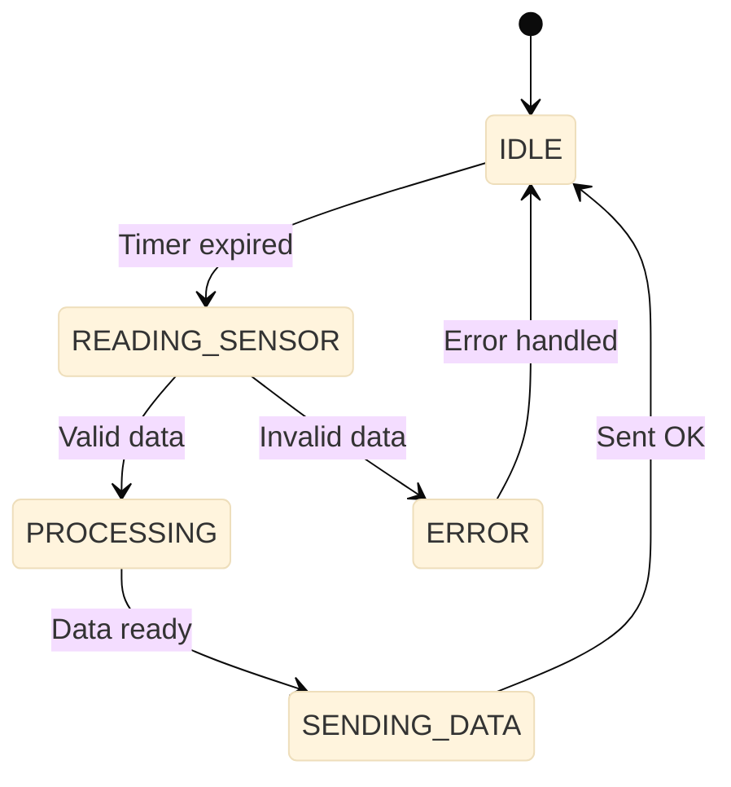

**Ventaja**: Código más robusto, fácil de debuggear, escalable.

### GPIO: Los "Dedos" del Microcontrolador

**GPIO (General Purpose Input/Output)** = Pines programables que pueden leer o escribir señales digitales.

```mermaid
%%{init: {'theme':'base', 'themeVariables': {'fontSize':'18px'}}}%%
graph TD
    subgraph "GPIO como Salida"
        A[digitalWrite(pin, HIGH)] --> B[Pin = 5V/3.3V]
        C[digitalWrite(pin, LOW)] --> D[Pin = 0V GND]
    end
    
    subgraph "GPIO como Entrada"
        E[digitalRead(pin)] --> F{Estado del pin}
        F -->|Conectado a VCC| G[Retorna HIGH]
        F -->|Conectado a GND| H[Retorna LOW]
    end
    
    style B fill:#1b5e20
    style D fill:#b71c1c
    style G fill:#1b5e20
    style H fill:#b71c1c
```

**Ejemplo real: Leer pulsador, controlar relé**

```cpp
const int BUTTON_PIN = 2;  // Pulsador conectado a pin 2 (con pull-up)
const int RELAY_PIN = 8;   // Relé conectado a pin 8

void setup() {
  pinMode(BUTTON_PIN, INPUT_PULLUP);  // Entrada con resistor interno pull-up
  pinMode(RELAY_PIN, OUTPUT);
}

void loop() {
  // Leer pulsador (LOW cuando presionado, pull-up invertido)
  if (digitalRead(BUTTON_PIN) == LOW) {
    digitalWrite(RELAY_PIN, HIGH);  // Activar relé
    delay(50);                      // Debounce simple
  } else {
    digitalWrite(RELAY_PIN, LOW);   // Desactivar relé
  }
}
```

**Circuito típico en Paraguay**:
- Pulsador: **₲500-1,000** (tienda electrónica)
- Relé 5V/10A: **₲15,000-20,000** (controlar bomba de agua, luz)

### ADC: Leer el Mundo Analógico

**ADC (Analog-to-Digital Converter)** = Convierte voltaje analógico (0-5V) a número digital (0-1023).

```mermaid
%%{init: {'theme':'base', 'themeVariables': {'fontSize':'18px'}}}%%
graph LR
    A[🌡️ Sensor Analógico<br/>0-5V variable] --> B[ADC<br/>10-bit]
    B --> C[Valor Digital<br/>0-1023]
    
    D[Ejemplo: 2.5V] --> E[ADC lee]
    E --> F[Valor: 512<br/>2.5V / 5V × 1023]
    
    style A fill:#e65100
    style B fill:#0d47a1
    style C fill:#1b5e20
```

**Resolución ADC**:
- **Arduino Uno**: 10-bit (0-1023) = 5V / 1024 = **4.88mV por step**
- **ESP32**: 12-bit (0-4095) = 3.3V / 4096 = **0.81mV por step** (mejor precisión)

**Ejemplo: Leer sensor de temperatura LM35**

```cpp
const int LM35_PIN = A0;  // Conectado a analog pin A0

void setup() {
  Serial.begin(9600);
  analogReference(DEFAULT);  // Vref = 5V (Arduino Uno)
}

void loop() {
  // Leer ADC
  int adcValue = analogRead(LM35_PIN);  // 0-1023
  
  // Convertir a voltaje
  float voltage = adcValue * (5.0 / 1023.0);  // 0-5V
  
  // LM35: 10mV/°C, entonces V = T × 0.01
  float temperatureC = voltage / 0.01;
  
  Serial.print("ADC: ");
  Serial.print(adcValue);
  Serial.print(" | Voltaje: ");
  Serial.print(voltage);
  Serial.print("V | Temperatura: ");
  Serial.print(temperatureC);
  Serial.println("°C");
  
  delay(1000);  // Leer cada segundo
}
```

**Caso real en Paraguay**: Monitorear temperatura de cámara frigorífica (0-50°C).

### PWM: Control Analógico con Pulsos Digitales

**PWM (Pulse Width Modulation)** = Simular voltaje variable prendiendo/apagando rápido.

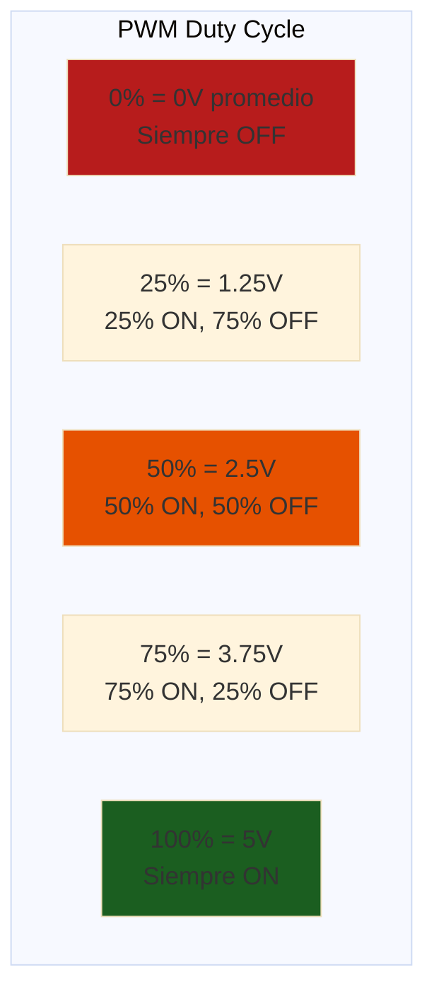

**Aplicaciones**:
- Control de velocidad de motor DC
- Brillo de LED
- Control de servomotor (ángulo)

**Ejemplo: Dimmer de LED**

```cpp
const int LED_PIN = 9;  // Pin con capacidad PWM (~ en Arduino)

void setup() {
  pinMode(LED_PIN, OUTPUT);
}

void loop() {
  // Aumentar brillo gradualmente
  for (int brightness = 0; brightness <= 255; brightness++) {
    analogWrite(LED_PIN, brightness);  // 0-255 = 0%-100%
    delay(10);
  }
  
  // Disminuir brillo
  for (int brightness = 255; brightness >= 0; brightness--) {
    analogWrite(LED_PIN, brightness);
    delay(10);
  }
}
```

**Nota técnica**: `analogWrite()` genera PWM a ~490Hz (Arduino) o configurable en ESP32.

### Interrupciones: El Timbre que Te Avisa

**Interrupción** = Pausa la ejecución del `loop()` cuando ocurre un evento (flanco de señal, timer).

```mermaid
%%{init: {'theme':'base', 'themeVariables': {'fontSize':'18px'}}}%%
sequenceDiagram
    participant Main as 🔁 loop()
    participant ISR as Interrupción
    participant Event as 🔔 Evento Externo
    
    Main->>Main: Ejecutando código normal
    Event->>ISR: Flanco detectado en pin 2
    ISR->>Main: Pausa loop()
    ISR->>ISR: Ejecuta código de ISR (rápido!)
    ISR->>Main: Retorna a loop()
    Main->>Main: Continúa desde donde quedó
```

**Ejemplo: Contador de pulsos con encoder**

```cpp
volatile int pulseCount = 0;  // volatile porque se modifica en ISR

const int ENCODER_PIN = 2;  // Pin de interrupción (2 o 3 en Arduino Uno)

void setup() {
  Serial.begin(9600);
  pinMode(ENCODER_PIN, INPUT_PULLUP);
  
  // Adjuntar interrupción: pin, función, modo
  attachInterrupt(digitalPinToInterrupt(ENCODER_PIN), countPulse, RISING);
}

// Interrupt Service Routine (ISR) - debe ser MUY rápida
void countPulse() {
  pulseCount++;  // Incrementar contador
}

void loop() {
  // Calcular RPM cada segundo
  static unsigned long lastTime = 0;
  if (millis() - lastTime >= 1000) {
    int rpm = pulseCount * 60;  // Si encoder = 1 pulso/rev
    Serial.print("RPM: ");
    Serial.println(rpm);
    
    pulseCount = 0;  // Resetear
    lastTime = millis();
  }
}
```

**Reglas de oro para ISR**:
- ✅ Código MUY corto (microsegundos)
- ✅ Variables compartidas = `volatile`
- ❌ NO usar `delay()`, `Serial.print()`, `millis()`
- ❌ NO hacer operaciones largas

---

## 🛠️ Parte 2: Arduino y PlatformIO (90 min)

### Concepto: Arduino vs PlatformIO

```mermaid
%%{init: {'theme':'base', 'themeVariables': {'fontSize':'18px'}}}%%
graph LR
    subgraph "Arduino IDE"
        A[Fácil para principiantes]
        B[Muchos ejemplos]
        C[IDE básico]
        D[Gestión de libs manual]
    end
    
    subgraph "PlatformIO"
        E[Profesional - VS Code]
        F[Gestión automática de deps]
        G[Múltiples boards]
        H[Debugging avanzado]
    end
    
    style A fill:#1b5e20
    style E fill:#FFD700
    style F fill:#FFD700
    style G fill:#FFD700
    style H fill:#FFD700
```

**Cuándo usar cada uno**:
- **Arduino IDE**: Prototipo rápido, aprender, tutorial simple
- **PlatformIO**: Proyecto serio, múltiples targets, trabajo en equipo

### Instalación de PlatformIO

**Paso a paso**:

1. **Instalar VS Code** (si no lo tienes)
   - Descargar de `code.visualstudio.com`
   - Instalar normalmente

2. **Instalar PlatformIO Extension**
   - Abrir VS Code → Extensions (Ctrl+Shift+X)
   - Buscar: "PlatformIO IDE"
   - Click "Install"
   - Esperar instalación (puede tardar 5-10 min)

3. **Verificar instalación**
   - Ver ícono de PlatformIO en barra lateral (hormiga)
   - Click → PIO Home debería abrir

**Crear primer proyecto**:

```bash
# Desde terminal de VS Code (Ctrl+`)
pio project init --board uno

# O desde GUI:
# PIO Home → New Project
# Name: mi-proyecto-fpuna
# Board: Arduino Uno
# Framework: Arduino
```

**Estructura del proyecto**:
```
mi-proyecto-fpuna/
├── platformio.ini    # Configuración del proyecto
├── src/
│   └── main.cpp      # Tu código aquí
├── lib/              # Bibliotecas propias
├── include/          # Headers (.h)
└── test/             # Tests unitarios
```

### platformio.ini: Configuración Central

```ini
[env:uno]
platform = atmelavr
board = uno
framework = arduino

# Configuraciones adicionales
monitor_speed = 9600           # Baudrate del serial monitor
lib_deps =                      # Bibliotecas automáticas
    adafruit/DHT sensor library@^1.4.4
    Wire                        # I2C (built-in)
    SPI                         # SPI (built-in)

# Múltiples targets en un proyecto
[env:esp32]
platform = espressif32
board = esp32dev
framework = arduino
lib_deps =
    PubSubClient               # MQTT para ESP32
```

**Ventaja**: Cambiar de Arduino Uno a ESP32 = cambiar una línea en archivo.

### Proyecto Completo: Logger de Temperatura con DHT22

**Objetivo**: Leer sensor DHT22, mostrar en serial, guardar en SD card.

#### Paso 1: Configurar Proyecto

```ini
; platformio.ini
[env:uno]
platform = atmelavr
board = uno
framework = arduino
monitor_speed = 9600

lib_deps =
    adafruit/DHT sensor library@^1.4.4
    arduino-libraries/SD@^1.2.4
```

#### Paso 2: Esquemático de Conexiones

```
DHT22:
- Pin 1 (VCC)  → Arduino 5V
- Pin 2 (DATA) → Arduino D2 (con pull-up 4.7kΩ)
- Pin 4 (GND)  → Arduino GND

SD Card Module (SPI):
- VCC  → 5V
- GND  → GND
- MISO → D12
- MOSI → D11
- SCK  → D13
- CS   → D10
```

#### Paso 3: Código Principal

```cpp
// src/main.cpp
#include <Arduino.h>
#include <DHT.h>
#include <SPI.h>
#include <SD.h>

// Configuración DHT22
#define DHT_PIN 2
#define DHT_TYPE DHT22
DHT dht(DHT_PIN, DHT_TYPE);

// Configuración SD
#define SD_CS_PIN 10
File logFile;

// Variables de estado
unsigned long lastReadTime = 0;
const unsigned long READ_INTERVAL = 60000;  // Leer cada 60 segundos

void setup() {
  Serial.begin(9600);
  while (!Serial) { delay(10); }  // Esperar serial (solo USB)
  
  Serial.println("=== Logger de Temperatura FPUNA ===");
  
  // Inicializar DHT22
  dht.begin();
  Serial.println("DHT22 iniciado");
  
  // Inicializar SD
  if (!SD.begin(SD_CS_PIN)) {
    Serial.println("ERROR: SD card no encontrada!");
    while (1) { delay(100); }  // Detenerse si no hay SD
  }
  Serial.println("SD card OK");
  
  // Crear archivo de log
  logFile = SD.open("temp_log.csv", FILE_WRITE);
  if (logFile) {
    logFile.println("Timestamp,Temperature(C),Humidity(%)");
    logFile.close();
    Serial.println("Archivo creado: temp_log.csv");
  }
}

void loop() {
  unsigned long currentTime = millis();
  
  // Leer cada READ_INTERVAL
  if (currentTime - lastReadTime >= READ_INTERVAL) {
    lastReadTime = currentTime;
    
    // Leer sensor
    float humidity = dht.readHumidity();
    float temperature = dht.readTemperature();
    
    // Verificar si la lectura es válida
    if (isnan(humidity) || isnan(temperature)) {
      Serial.println("ERROR: Lectura DHT22 falló");
      return;
    }
    
    // Mostrar en serial
    Serial.print("Temp: ");
    Serial.print(temperature);
    Serial.print("°C | Humedad: ");
    Serial.print(humidity);
    Serial.println("%");
    
    // Guardar en SD
    logFile = SD.open("temp_log.csv", FILE_WRITE);
    if (logFile) {
      logFile.print(currentTime / 1000);  // Timestamp en segundos
      logFile.print(",");
      logFile.print(temperature);
      logFile.print(",");
      logFile.println(humidity);
      logFile.close();
      Serial.println("Guardado en SD ✓");
    } else {
      Serial.println("ERROR: No se pudo abrir archivo");
    }
  }
}
```

#### Paso 4: Compilar y Subir

```bash
# Compilar
pio run

# Subir al Arduino
pio run --target upload

# Abrir monitor serial
pio device monitor
```

**Salida esperada**:
```
=== Logger de Temperatura FPUNA ===
DHT22 iniciado
SD card OK
Archivo creado: temp_log.csv
Temp: 28.5°C | Humedad: 65.2%
Guardado en SD ✓
```

### Librerías Esenciales para Firmware

```mermaid
%%{init: {'theme':'base', 'themeVariables': {'fontSize':'18px'}}}%%
mindmap
  root((Bibliotecas Arduino))
    Sensores
      DHT sensor library - Temp/humedad
      Adafruit BMP280 - Presión
      OneWire + Dallas - DS18B20
      Adafruit Sensor - Interfaz unificada
    Comunicación
      Wire - I2C built-in
      SPI - SPI built-in
      SoftwareSerial - UART adicional
      WiFi - ESP32/ESP8266
    Actuadores
      Servo - Control servomotores
      Stepper - Motores paso a paso
      Adafruit Motor Shield - Driver motores
    Storage
      SD - MicroSD cards
      EEPROM - Memoria no volátil
      SPIFFS - File system ESP32
    Protocolo
      PubSubClient - MQTT
      ArduinoJson - Parse JSON
      HttpClient - HTTP requests
```

**Instalar biblioteca con PlatformIO**:

```bash
# Buscar biblioteca
pio lib search "DHT"

# Ver detalles
pio lib show adafruit/DHT sensor library

# Instalar (o agregar a platformio.ini)
pio lib install "adafruit/DHT sensor library"
```

### Implementación con OpenCode

```bash
opencode "Genera firmware completo para estación meteorológica con Arduino:

HARDWARE:
- Arduino Uno R3
- Sensor DHT22 (temperatura + humedad)
- Sensor BMP280 (presión barométrica)
- Display LCD 16x2 con I2C
- MicroSD module (SPI)
- LED indicador de estado
- Pulsador para forzar lectura

FUNCIONALIDAD:
1. Leer sensores cada 5 minutos
2. Mostrar en LCD temperatura, humedad, presión
3. Guardar en SD card con timestamp
4. LED parpadea al guardar dato
5. Pulsador fuerza lectura inmediata
6. Serial monitor muestra debug info

REQUERIMIENTOS TÉCNICOS:
- Usar PlatformIO
- Máquina de estados clara
- Manejo de errores (sensor falla, SD llena)
- Código comentado en español
- platformio.ini con todas las dependencias
- Esquemático de conexiones en comentarios
- Valores calibrados para Paraguay (nivel del mar ~100-200m)

OUTPUT:
1. src/main.cpp completo
2. platformio.ini
3. Diagrama de conexiones (texto)
4. Documentación de uso
5. Troubleshooting de errores comunes

Todo en español para proyecto FPUNA"
```

---

## 📡 Parte 3: ESP32 y Conectividad (60 min)

### Concepto: ESP32 = Arduino con Superpoderes

**ESP32** = Microcontrolador de 32-bit con WiFi, Bluetooth, dual-core, y más GPIO.

```mermaid
%%{init: {'theme':'base', 'themeVariables': {'fontSize':'18px'}}}%%
graph TD
    subgraph "Ventajas ESP32"
        A[📶 WiFi 802.11 b/g/n<br/>Conectividad integrada]
        B[📱 Bluetooth Classic + BLE<br/>IoT y wearables]
        C[Dual-core 240MHz<br/>Multitarea real]
        D[💾 4MB Flash + 520KB RAM<br/>Más espacio]
        E[🔋 Deep Sleep<br/>10µA en sleep mode]
        F[ADC 12-bit<br/>Mayor precisión]
    end
    
    style A fill:#FFD700
    style B fill:#FFD700
    style C fill:#1b5e20
    style D fill:#0d47a1
    style E fill:#e65100
```

**Casos de uso en Paraguay**:
- ✅ **Sensor de riego inteligente** - WiFi para reportar humedad del suelo
- ✅ **Medidor de energía** - Enviar datos a cloud (ThingSpeak, MQTT)
- ✅ **Control de acceso** - Bluetooth para abrir puertas
- ✅ **Weather station** - WiFi para publicar datos meteorológicos

**Precio en Paraguay**: ₲100,000-150,000 (ESP32 DevKit C)

### WiFi: Conectar ESP32 a Red Local

**Ejemplo básico: Conectar a WiFi**

```cpp
#include <WiFi.h>

// Credenciales WiFi (cambiar por las tuyas)
const char* ssid = "TU_WIFI_SSID";
const char* password = "TU_PASSWORD";

void setup() {
  Serial.begin(115200);
  delay(100);
  
  Serial.println("Conectando a WiFi...");
  WiFi.begin(ssid, password);
  
  // Esperar conexión (con timeout)
  int attempts = 0;
  while (WiFi.status() != WL_CONNECTED && attempts < 20) {
    delay(500);
    Serial.print(".");
    attempts++;
  }
  
  if (WiFi.status() == WL_CONNECTED) {
    Serial.println("\n✓ WiFi conectado!");
    Serial.print("IP address: ");
    Serial.println(WiFi.localIP());
    Serial.print("Signal strength (RSSI): ");
    Serial.print(WiFi.RSSI());
    Serial.println(" dBm");
  } else {
    Serial.println("\n✗ Error: No se pudo conectar a WiFi");
  }
}

void loop() {
  // Verificar conexión cada 10 segundos
  if (WiFi.status() != WL_CONNECTED) {
    Serial.println("WiFi desconectado, reconectando...");
    WiFi.reconnect();
  }
  delay(10000);
}
```

**Salida esperada**:
```
Conectando a WiFi...
..........
✓ WiFi conectado!
IP address: 192.168.1.105
Signal strength (RSSI): -52 dBm
```

### MQTT: Protocolo IoT Ligero

**MQTT** = Message Queue Telemetry Transport - Protocolo pub/sub para IoT.

```mermaid
%%{init: {'theme':'base', 'themeVariables': {'fontSize':'18px'}}}%%
sequenceDiagram
    participant S as 📡 ESP32 Sensor
    participant B as 🔁 Broker MQTT<br/>(test.mosquitto.org)
    participant C as Cliente<br/>(Node-RED, App)
    
    S->>B: CONNECT
    B->>S: CONNACK
    S->>B: PUBLISH topic="fpuna/temp" msg="28.5"
    B->>C: PUBLISH topic="fpuna/temp" msg="28.5"
    C->>B: SUBSCRIBE topic="fpuna/#"
    S->>B: PUBLISH topic="fpuna/humidity" msg="65"
    B->>C: PUBLISH topic="fpuna/humidity" msg="65"
```

**Ejemplo: Publicar temperatura a MQTT**

```cpp
#include <WiFi.h>
#include <PubSubClient.h>
#include <DHT.h>

// WiFi
const char* ssid = "TU_WIFI";
const char* password = "TU_PASSWORD";

// MQTT Broker (test.mosquitto.org es público)
const char* mqtt_server = "test.mosquitto.org";
const int mqtt_port = 1883;
const char* mqtt_topic_temp = "fpuna/lab/temperatura";
const char* mqtt_topic_hum = "fpuna/lab/humedad";

// DHT22
#define DHT_PIN 4
#define DHT_TYPE DHT22
DHT dht(DHT_PIN, DHT_TYPE);

WiFiClient espClient;
PubSubClient mqttClient(espClient);

void setup() {
  Serial.begin(115200);
  
  // Conectar WiFi
  WiFi.begin(ssid, password);
  while (WiFi.status() != WL_CONNECTED) {
    delay(500);
    Serial.print(".");
  }
  Serial.println("\nWiFi OK");
  
  // Configurar MQTT
  mqttClient.setServer(mqtt_server, mqtt_port);
  
  // Iniciar DHT22
  dht.begin();
}

void reconnectMQTT() {
  while (!mqttClient.connected()) {
    Serial.print("Conectando MQTT...");
    String clientId = "ESP32-FPUNA-" + String(random(0xffff), HEX);
    
    if (mqttClient.connect(clientId.c_str())) {
      Serial.println("✓ Conectado");
    } else {
      Serial.print("✗ Falló, rc=");
      Serial.println(mqttClient.state());
      delay(5000);
    }
  }
}

void loop() {
  // Mantener conexión MQTT
  if (!mqttClient.connected()) {
    reconnectMQTT();
  }
  mqttClient.loop();
  
  // Leer y publicar cada 30 segundos
  static unsigned long lastPublish = 0;
  if (millis() - lastPublish >= 30000) {
    lastPublish = millis();
    
    float temp = dht.readTemperature();
    float hum = dht.readHumidity();
    
    if (!isnan(temp) && !isnan(hum)) {
      // Publicar temperatura
      char tempStr[8];
      dtostrf(temp, 4, 1, tempStr);  // Convertir float a string
      mqttClient.publish(mqtt_topic_temp, tempStr);
      
      // Publicar humedad
      char humStr[8];
      dtostrf(hum, 4, 1, humStr);
      mqttClient.publish(mqtt_topic_hum, humStr);
      
      Serial.print("Publicado - Temp: ");
      Serial.print(temp);
      Serial.print("°C, Hum: ");
      Serial.print(hum);
      Serial.println("%");
    }
  }
}
```

**Probar con herramientas**:

```bash
# Desde otra computadora, suscribirse al topic
mosquitto_sub -h test.mosquitto.org -t "fpuna/lab/#" -v

# Deberías ver:
# fpuna/lab/temperatura 28.5
# fpuna/lab/humedad 65.2
```

**platformio.ini para ESP32 + MQTT**:

```ini
[env:esp32]
platform = espressif32
board = esp32dev
framework = arduino
monitor_speed = 115200

lib_deps =
    knolleary/PubSubClient@^2.8
    adafruit/DHT sensor library@^1.4.4
```

### Deep Sleep: Ahorro de Energía

**ESP32 Deep Sleep** = Modo ultra-bajo consumo (10µA) - ideal para baterías.

```cpp
#include <WiFi.h>

#define uS_TO_S_FACTOR 1000000ULL  // Conversión µs a segundos
#define TIME_TO_SLEEP 600           // Dormir 600 segundos (10 minutos)

RTC_DATA_ATTR int bootCount = 0;   // Variable que sobrevive deep sleep

void setup() {
  Serial.begin(115200);
  delay(100);
  
  bootCount++;
  Serial.println("Boot #" + String(bootCount));
  
  // ========== HACER TRABAJO AQUÍ ==========
  // 1. Conectar WiFi
  // 2. Leer sensores
  // 3. Enviar datos por MQTT
  // 4. Desconectar WiFi
  // ========================================
  
  Serial.println("Entrando a deep sleep por " + String(TIME_TO_SLEEP) + " segundos");
  
  // Configurar wakeup por timer
  esp_sleep_enable_timer_wakeup(TIME_TO_SLEEP * uS_TO_S_FACTOR);
  
  // Dormir (consumo ~10µA)
  esp_deep_sleep_start();
}

void loop() {
  // Nunca llega aquí - ESP32 se reinicia al despertar
}
```

**Consumo estimado**:
- **Activo (WiFi ON)**: ~80-160mA
- **Deep Sleep**: ~10µA

**Autonomía con batería**:
```
Batería 18650 típica: 2500mAh

Ciclo: 30s activo cada 10 minutos
- Activo: 30s × 100mA = 0.83mAh (por ciclo)
- Sleep: 9.5min × 0.01mA = 0.0016mAh (por ciclo)
- Total por ciclo: ~0.83mAh

Autonomía: 2500mAh / (0.83mAh × 144 ciclos/día) = ~21 días
```

**Casos de uso en Paraguay**:
- Sensor de nivel de tanque de agua (remoto)
- Estación meteorológica en campo
- Monitor de ganado (GPS + temperatura)

### Proyecto IoT Completo: Sensor Node con ThingSpeak

**Objetivo**: ESP32 lee DHT22, envía a ThingSpeak cada 1 minuto, entra en deep sleep.

```cpp
#include <WiFi.h>
#include <HTTPClient.h>
#include <DHT.h>

// WiFi
const char* ssid = "TU_WIFI";
const char* password = "TU_PASSWORD";

// ThingSpeak (crear cuenta gratis en thingspeak.com)
const char* server = "http://api.thingspeak.com/update";
const char* apiKey = "TU_API_KEY";  // Copiar de ThingSpeak

// DHT22
#define DHT_PIN 4
DHT dht(DHT_PIN, DHT22);

// Deep Sleep
#define TIME_TO_SLEEP 60  // 60 segundos

void setup() {
  Serial.begin(115200);
  
  // Iniciar WiFi
  WiFi.begin(ssid, password);
  int timeout = 0;
  while (WiFi.status() != WL_CONNECTED && timeout < 20) {
    delay(500);
    Serial.print(".");
    timeout++;
  }
  
  if (WiFi.status() != WL_CONNECTED) {
    Serial.println("\nWiFi failed, going to sleep");
    goToSleep();
  }
  
  Serial.println("\nWiFi connected");
  
  // Leer sensor
  dht.begin();
  delay(2000);  // DHT22 necesita tiempo para estabilizar
  
  float temp = dht.readTemperature();
  float hum = dht.readHumidity();
  
  if (isnan(temp) || isnan(hum)) {
    Serial.println("DHT22 read failed");
    goToSleep();
  }
  
  // Enviar a ThingSpeak
  HTTPClient http;
  String url = String(server) + "?api_key=" + apiKey + 
               "&field1=" + String(temp) + 
               "&field2=" + String(hum);
  
  http.begin(url);
  int httpCode = http.GET();
  
  if (httpCode > 0) {
    Serial.println("Data sent: Temp=" + String(temp) + "°C, Hum=" + String(hum) + "%");
  } else {
    Serial.println("HTTP error: " + String(httpCode));
  }
  
  http.end();
  WiFi.disconnect(true);
  
  // Dormir
  goToSleep();
}

void goToSleep() {
  Serial.println("Going to deep sleep for " + String(TIME_TO_SLEEP) + "s");
  esp_sleep_enable_timer_wakeup(TIME_TO_SLEEP * 1000000ULL);
  esp_deep_sleep_start();
}

void loop() {
  // No usado
}
```

**Configurar ThingSpeak**:
1. Ir a `thingspeak.com` → Sign Up (gratis)
2. New Channel → Name: "FPUNA Weather Station"
3. Field 1: "Temperature", Field 2: "Humidity"
4. Save → copiar "Write API Key"
5. Pegar en `apiKey` del código

**Ver datos en tiempo real**:
- Dashboard de ThingSpeak actualiza cada minuto
- Gráficos automáticos de temperatura y humedad
- Exportar CSV para análisis

---

## 🤖 Parte 4: OpenCode para Firmware (30 min)

### Casos de Uso de IA en Firmware

```mermaid
%%{init: {'theme':'base', 'themeVariables': {'fontSize':'18px'}}}%%
mindmap
  root((OpenCode para Firmware))
    Generación de Código
      Driver de sensor I2C
      State machine completa
      Rutinas de calibración
    Debugging
      Analizar dumps seriales
      Encontrar race conditions
      Optimizar uso de RAM
    Protocolos
      Implementar MODBUS RTU
      Parser de comandos AT
      CRC y checksums
    Optimización
      Reducir consumo de batería
      Refactorizar para FLASH
      Timing crítico
```

### Prompt: Generar Driver de Sensor I2C

```bash
opencode "Genera driver completo para sensor BMP280 (I2C) en Arduino:

REQUERIMIENTOS:
- Comunicación I2C (dirección 0x76)
- Leer temperatura y presión barométrica
- Compensación de temperatura según datasheet
- Oversampling configurable
- Calcular altitud basado en presión

INCLUIR:
1. Clase BMP280Driver con métodos:
   - begin() - Inicializar sensor
   - readTemperature() - Leer temp compensada
   - readPressure() - Leer presión compensada (Pa)
   - readAltitude(seaLevelPa) - Calcular altitud
   - checkConnection() - Verificar ID del chip (0x58)

2. Manejo de errores:
   - Sensor no responde
   - Valores fuera de rango
   - Timeout en lecturas

3. Comentarios explicando:
   - Registros usados (según datasheet)
   - Fórmulas de compensación
   - Por qué cada delay es necesario

4. Ejemplo de uso en setup() y loop()

CONTEXTO:
- Para Arduino Uno o ESP32
- Usar Wire.h (I2C built-in)
- Código robusto para producción
- Comentarios en español

DATASHEET: Bosch BMP280 (buscar detalles técnicos necesarios)"
```

### Prompt: Debugging de Firmware

```bash
opencode "Ayúdame a debuggear este problema de firmware:

SÍNTOMA:
ESP32 se reinicia cada ~30 minutos mostrando:
'Guru Meditation Error: Core 0 panic'ed (LoadProhibited)'

CÓDIGO:
[pegar código relevante]

SERIAL LOG:
[pegar últimas 50 líneas antes del crash]

HARDWARE:
- ESP32 DevKit C
- Sensor DHT22 en pin 4
- SD card module en SPI
- Alimentación: USB 5V 1A

ANÁLISIS REQUERIDO:
1. Identificar causa probable del panic
2. ¿Es stack overflow, heap corruption, o watchdog timeout?
3. Línea de código sospechosa
4. Solución propuesta con código corregido
5. Mejoras para prevenir crashes futuros:
   - Watchdog timer configuration
   - Task stack size
   - Heap monitoring

CONTEXTO:
Proyecto estudiantil FPUNA - logger de temperatura 24/7"
```

### Prompt: Implementar Protocolo de Comunicación

```bash
opencode "Implementa protocolo de comandos seriales para Arduino:

ESPECIFICACIÓN:
El Arduino debe responder a comandos por UART (9600 baud):

COMANDOS:
- 'READ TEMP' → Responde: 'TEMP:28.5C'
- 'READ HUM' → Responde: 'HUM:65.2%'
- 'SET INTERVAL <seconds>' → Responde: 'OK' o 'ERROR'
- 'GET INTERVAL' → Responde: 'INTERVAL:60'
- 'RESET' → Reinicia Arduino, responde: 'RESETTING'
- 'STATUS' → Responde: 'UPTIME:12345 READS:234 ERRORS:2'

FORMATO:
- Comandos terminan en \n
- Respuestas siempre terminan en \n
- Comando inválido → 'ERROR:UNKNOWN_COMMAND'

IMPLEMENTACIÓN REQUERIDA:
1. Parser robusto de comandos (manejar mayúsculas/minúsculas)
2. Buffer de entrada con límite (no overflow)
3. Timeout si comando incompleto
4. Variables globales para estado (interval, counters)
5. Funciones para cada comando

INCLUIR:
- Código completo comentado
- Máquina de estados para parsing
- Manejo de casos edge (comando muy largo, caracteres inválidos)
- Ejemplo de cliente Python para testear

CONTEXTO:
Control remoto de estación meteorológica vía serial (RS-232 o USB)"
```

### Prompt: Optimización de Consumo

```bash
opencode "Optimiza este firmware ESP32 para minimizar consumo de batería:

CÓDIGO ACTUAL:
[pegar código]

CONSUMO MEDIDO:
- Activo: 150mA promedio
- Sleep: No implementado
- Autonomía con 2000mAh: ~13 horas

META:
- Autonomía: >7 días con misma batería
- Funcionalidad: Leer sensor cada 10 minutos, enviar MQTT

OPTIMIZACIONES REQUERIDAS:
1. Implementar deep sleep entre lecturas
2. Reducir tiempo de WiFi activo:
   - Conectar solo cuando necesario
   - Enviar datos y desconectar rápido
3. Configurar WiFi con:
   - Static IP (evita DHCP delay)
   - Reducir power mode del WiFi
4. Optimizar código:
   - Evitar delays largos
   - Usar watchdog correctamente
5. Calcular consumo estimado con optimizaciones

GENERAR:
1. Código optimizado completo
2. Análisis de consumo antes/después
3. Cálculo de autonomía esperada
4. Notas sobre trade-offs (latencia vs batería)

CONTEXTO:
Sensor de campo alimentado por batería 18650 + panel solar pequeño (5V 100mA)"
```

### Integración con Workflow de Desarrollo

```mermaid
%%{init: {'theme':'base', 'themeVariables': {'fontSize':'18px'}}}%%
sequenceDiagram
    participant D as Developer
    participant O as OpenCode
    participant P as 🏗️ PlatformIO
    participant H as Hardware
    
    D->>O: "Genera driver para sensor XYZ"
    O->>D: Código base generado
    D->>P: Compilar y flashear
    P->>H: Programa cargado
    H->>D: Error: sensor no responde
    D->>O: "Debug: sensor I2C no responde" [log]
    O->>D: "Falta pull-up en SDA/SCL"
    D->>H: Agregar resistencias 4.7kΩ
    H->>D: ✓ Funcionando
    D->>O: "Optimiza para consumo de batería"
    O->>D: Código con deep sleep
    D->>P: Re-compilar
    P->>H: Nueva versión
    H->>D: ✓ Consumo reducido 90%
```

**Ventaja**: OpenCode actúa como **ingeniero senior de firmware** que conoce best practices, datasheets, y errores comunes.

---

## 🎯 Ejercicio Práctico: Sistema de Riego Inteligente

### Objetivo

Desarrollar firmware completo para controlador de riego automatizado con ESP32.

### Especificaciones Funcionales

**Entradas**:
- Sensor de humedad del suelo (analógico 0-3.3V)
- Sensor de lluvia (digital ON/OFF)
- Pulsador manual para riego forzado

**Salidas**:
- Electroválvula de riego (relé 5V)
- LED indicador de estado (verde/rojo)
- Buzzer para alarmas

**Lógica**:
1. Leer humedad del suelo cada 1 hora
2. Si humedad < 30% → Activar riego por 10 minutos
3. Si está lloviendo → NO regar (override)
4. Pulsador manual → Regar inmediatamente por 5 minutos
5. Enviar datos por MQTT cada lectura
6. Deep sleep entre lecturas (ahorro de batería)

**Dashboard (Node-RED o ThingSpeak)**:
- Gráfico de humedad en tiempo real
- Estado del riego (ON/OFF)
- Botón remoto para riego manual

### Diseño del Sistema

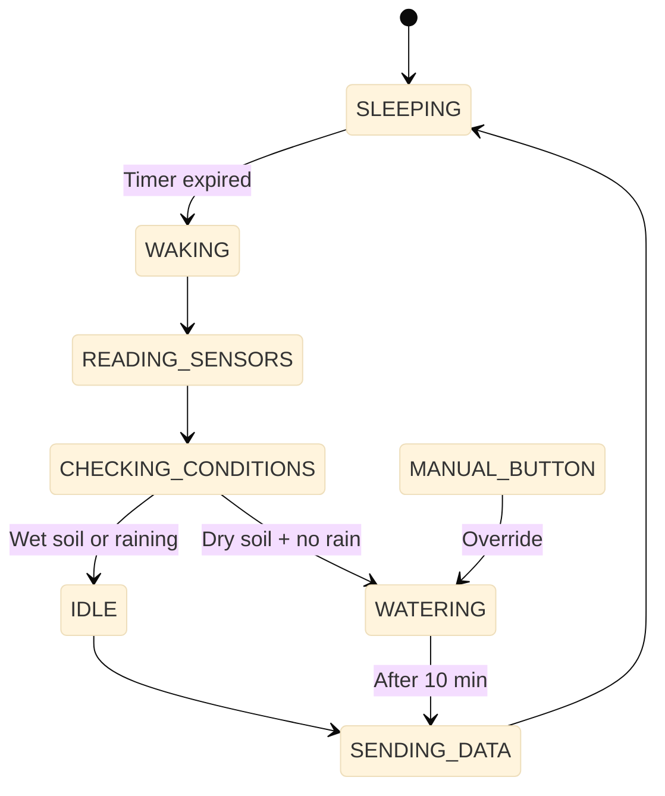

### Implementación Paso a Paso

#### 1. Configuración de Hardware

```
ESP32 Connections:
- GPIO34 (ADC): Sensor humedad suelo (0-3.3V)
- GPIO35 (INPUT): Sensor lluvia (pull-up)
- GPIO32 (INPUT_PULLUP): Pulsador manual
- GPIO25 (OUTPUT): Relé electroválvula
- GPIO26 (OUTPUT): LED verde (ok)
- GPIO27 (OUTPUT): LED rojo (alarma)
- GPIO14 (OUTPUT): Buzzer
```

#### 2. Código con OpenCode

```bash
opencode "Genera firmware completo para sistema de riego inteligente ESP32:

HARDWARE: [copiar specs de arriba]
FUNCIONALIDAD: [copiar lógica]

REQUERIMIENTOS TÉCNICOS:
1. Máquina de estados robusta
2. Configuración WiFi con fallback (AP mode si no conecta)
3. MQTT con QoS 1 (garantizar entrega)
4. NTP para timestamp real
5. Watchdog timer (reset si se cuelga)
6. Logs detallados en Serial (debug)
7. EEPROM para guardar stats:
   - Total de riegos realizados
   - Última lectura de humedad
   - Errores acumulados
8. Calibración de sensor de humedad:
   - 0% = 2.8V (seco)
   - 100% = 1.2V (saturado)

PROTECCIONES:
- No regar más de 30 min seguidos (alarma)
- Si sensor falla 3 veces → modo seguro
- Si WiFi no conecta → seguir operando local

GENERAR:
1. platformio.ini
2. src/main.cpp con estructura modular:
   - config.h (constantes)
   - sensors.cpp (lectura sensores)
   - irrigation.cpp (lógica riego)
   - network.cpp (WiFi + MQTT)
   - storage.cpp (EEPROM)
3. Esquemático de conexiones
4. Manual de instalación y calibración
5. Comandos MQTT para control remoto:
   - fpuna/riego/command/water → {'duration': 300}
   - fpuna/riego/command/status → Responde estado
   - fpuna/riego/command/config → Cambiar umbrales

TODO en español, código production-ready para FPUNA"
```

#### 3. Testing y Validación

**Checklist de pruebas**:
- [ ] Sensor de humedad lee valores correctos (0-100%)
- [ ] Sensor de lluvia detecta agua
- [ ] Pulsador activa riego inmediato
- [ ] Relé activa electroválvula (medir con multímetro)
- [ ] LEDs indican estado correcto
- [ ] WiFi conecta correctamente
- [ ] MQTT publica datos cada hora
- [ ] Deep sleep reduce consumo a <20mA
- [ ] Watchdog resetea si hay hang (simular con while(1))
- [ ] EEPROM persiste datos al reiniciar

**Simulación sin hardware**:
```cpp
// Simular sensores para debugging
#define SIMULATE_SENSORS

#ifdef SIMULATE_SENSORS
  float readSoilMoisture() {
    return random(0, 100);  // Humedad random
  }
  bool isRaining() {
    return random(0, 10) > 7;  // 30% prob de lluvia
  }
#endif
```

---

## 🔧 Troubleshooting de Firmware

### Problemas Comunes y Soluciones

```mermaid
%%{init: {'theme':'base', 'themeVariables': {'fontSize':'18px'}}}%%
graph TD
    subgraph "Errores Frecuentes"
        A[Código compila pero<br/>no sube al MCU]
        B[Serial monitor<br/>muestra basura]
        C[Sensor siempre<br/>lee mismo valor]
        D[ESP32 se resetea<br/>aleatoriamente]
    end
    
    A --> A1[Verificar puerto COM<br/>Drivers CH340/CP2102]
    B --> B1[Baudrate incorrecto<br/>Match con Serial.begin]
    C --> C1[Pin mal configurado<br/>pinMode o conexión]
    D --> D1[Watchdog o<br/>Stack overflow]
    
    style A fill:#b71c1c
    style B fill:#b71c1c
    style C fill:#b71c1c
    style D fill:#b71c1c
```

#### Caso 1: ESP32 No Entra en Modo de Programación

**Síntoma**: `Failed to connect to ESP32: Timed out waiting for packet header`

**Soluciones**:
1. **Bootloader mode manual**:
   - Mantener presionado botón BOOT
   - Presionar y soltar botón RESET
   - Soltar botón BOOT
   - Intentar subir código
   
2. **Verificar drivers**:
   ```bash
   # Windows - Device Manager debe mostrar "Silicon Labs CP210x" o "CH340"
   # Si no: descargar drivers desde:
   # CP2102: silabs.com/developers/usb-to-uart-bridge-vcp-drivers
   # CH340: sparks.gogo.co.nz/ch340.html
   ```

3. **Probar otro cable USB** (muchos cables son solo de carga, no datos)

#### Caso 2: Lectura ADC Ruidosa en ESP32

**Síntoma**: `analogRead()` fluctúa ±100 counts.

**Código de debugging**:
```cpp
void debugADC() {
  const int samples = 100;
  int values[samples];
  
  // Leer N muestras
  for (int i = 0; i < samples; i++) {
    values[i] = analogRead(34);
    delay(10);
  }
  
  // Calcular estadísticas
  int min_val = 4095, max_val = 0;
  long sum = 0;
  for (int i = 0; i < samples; i++) {
    sum += values[i];
    if (values[i] < min_val) min_val = values[i];
    if (values[i] > max_val) max_val = values[i];
  }
  
  int avg = sum / samples;
  int range = max_val - min_val;
  
  Serial.println("ADC Stats:");
  Serial.println("  Average: " + String(avg));
  Serial.println("  Min: " + String(min_val));
  Serial.println("  Max: " + String(max_val));
  Serial.println("  Range: " + String(range));
  
  if (range > 100) {
    Serial.println("⚠️ WARNING: High noise detected!");
  }
}
```

**Soluciones**:
1. **Filtro por software** (promedio móvil):
   ```cpp
   int readADCFiltered(int pin) {
     const int samples = 10;
     long sum = 0;
     for (int i = 0; i < samples; i++) {
       sum += analogRead(pin);
       delay(1);
     }
     return sum / samples;
   }
   ```

2. **Configurar atenuación ADC**:
   ```cpp
   analogSetAttenuation(ADC_11db);  // 0-3.3V (default)
   // ADC_0db: 0-1.1V
   // ADC_2_5db: 0-1.5V
   // ADC_6db: 0-2.2V
   // ADC_11db: 0-3.3V
   ```

3. **Hardware**: Capacitor 100nF entre señal y GND (cerca del ESP32)

#### Caso 3: I2C Device Not Found

**Síntoma**: `Wire.endTransmission()` retorna error (no ACK).

**Scanner I2C**:
```cpp
#include <Wire.h>

void scanI2C() {
  Serial.println("Escaneando bus I2C...");
  byte count = 0;
  
  for (byte addr = 1; addr < 127; addr++) {
    Wire.beginTransmission(addr);
    byte error = Wire.endTransmission();
    
    if (error == 0) {
      Serial.print("Dispositivo encontrado: 0x");
      if (addr < 16) Serial.print("0");
      Serial.println(addr, HEX);
      count++;
    }
  }
  
  Serial.println("Escaneo completo. Dispositivos: " + String(count));
}

void setup() {
  Serial.begin(115200);
  Wire.begin(21, 22);  // SDA, SCL para ESP32
  scanI2C();
}
```

**Checklist de debugging**:
- [ ] Conexiones: SDA, SCL, VCC, GND correctos
- [ ] Pull-up resistors: 4.7kΩ en SDA y SCL a VCC (algunos módulos ya los tienen)
- [ ] Voltaje: Sensor es 3.3V o 5V? ESP32 es 3.3V I/O
- [ ] Dirección: Verificar datasheet (algunos tienen jumpers para cambiar)

---

## ✅ Checklist de Verificación de Firmware

Antes de considerar el firmware "production-ready":

### Funcionalidad
- [ ] Todas las features implementadas según specs
- [ ] Testeado en hardware real (no solo simulación)
- [ ] Casos edge manejados (sensor falla, WiFi cae, etc.)
- [ ] Timeouts implementados (no esperas infinitas)

### Robustez
- [ ] Watchdog timer configurado
- [ ] Manejo de errores en todas las funciones críticas
- [ ] Logs de debug útiles (qué, cuándo, por qué)
- [ ] No hay `delay()` largos que bloqueen (usar `millis()`)
- [ ] Variables volátiles declaradas correctamente

### Eficiencia
- [ ] RAM usage monitoreado (`ESP.getFreeHeap()`)
- [ ] Flash usage <80% del disponible
- [ ] Consumo de corriente medido y optimizado
- [ ] Deep sleep implementado si es a batería

### Comunicación
- [ ] Baudrate correcto y documentado
- [ ] Protocolo definido (formato de mensajes)
- [ ] Errores de comunicación manejados (timeout, retry)
- [ ] WiFi con reconnect automático

### Documentación
- [ ] Comentarios explicando lógica compleja
- [ ] Pinout documentado en comentarios o README
- [ ] Parámetros configurables claramente identificados
- [ ] Versión del firmware en el código (`#define FW_VERSION "1.2.3"`)

### Testing
- [ ] Prueba de stress (24+ horas continuas)
- [ ] Prueba de reset (power cycle, watchdog)
- [ ] Prueba de casos extremos (temperatura, voltaje bajo)

---

## 🎓 Mejores Prácticas de Firmware

### ✅ HACER

1. **Usar máquinas de estados** - No `if` anidados infinitos
2. **Non-blocking code** - `millis()` en vez de `delay()`
3. **Watchdog timer** - Reset automático si se cuelga
4. **Logs estructurados** - `[ERROR]`, `[INFO]`, `[DEBUG]` con timestamps
5. **Constantes con #define** - No magic numbers en código
6. **Modularizar** - Archivos separados para sensors, network, etc.
7. **Versionar firmware** - `#define FW_VERSION "1.0.0"`
8. **Comentar decisiones** - Por qué elegiste cierto delay o algoritmo

### ❌ NO HACER

1. **Blocking delays largos** - `delay(60000)` bloquea todo
2. **String en vez de char[]** - String usa mucha RAM dinámica
3. **Ignorar retornos de error** - Siempre verificar si función falló
4. **Floats innecesarios** - Usar int × 100 si es posible (más rápido)
5. **Serial.print() en ISR** - Interrupciones deben ser RÁPIDAS
6. **Sin watchdog** - MCU se puede colgar en producción
7. **Hardcodear credenciales** - Usar WiFiManager o config file
8. **No testear en hardware** - Simulación no cubre todo

---

## 🎉 Resumen del Módulo

### Lo Que Dominaste

✅ **Fundamentos de firmware** - Microcontroladores, GPIO, ADC, PWM, interrupciones  
✅ **Arduino y PlatformIO** - Desarrollo profesional de firmware embebido  
✅ **ESP32 avanzado** - WiFi, MQTT, deep sleep, IoT  
✅ **Protocolos de comunicación** - UART, I2C, SPI  
✅ **OpenCode para firmware** - Generación, debugging, optimización con IA  
✅ **Proyecto completo** - Sistema de riego inteligente end-to-end

### Próximo Paso

**Continúa con**: [Módulo 04 - Automatización Industrial](./04-automatizacion-industrial.md)

---

## 💭 Reflexión

1. **¿Cómo el firmware cambia el comportamiento del hardware?**
2. **¿Cuándo usar Arduino vs ESP32 en proyectos reales?**
3. **¿Cómo OpenCode acelera el desarrollo de firmware complejo?**

**Comparte en Slack** (#electronica-automatizacion)

---

## 📚 Recursos Adicionales

### Documentación Oficial
- [Arduino Reference](https://www.arduino.cc/reference/en/)
- [ESP32 Documentation](https://docs.espressif.com/projects/esp-idf/en/latest/esp32/)
- [PlatformIO Docs](https://docs.platformio.org/)
- [FreeRTOS (ESP32)](https://www.freertos.org/Documentation/RTOS_book.html)

### Tutoriales y Cursos
- **"ESP32 for Busy People"** - Kolban (eBook gratis)
- **Random Nerd Tutorials** - randomnerdtutorials.com/projects-esp32/
- **DroneBot Workshop** - YouTube channel (proyectos Arduino/ESP32)
- **FPUNA Tutoriales** - Ejemplos de estudiantes anteriores

### Proveedores Locales (Paraguay)
- **Electrónica Japonesa** - Arduino, ESP32, sensores
- **MercadoLibre PY** - Módulos, shields, componentes
- **AliExpress** - Importación directa (4-6 semanas)
  - ESP32 DevKit: USD 8-12
  - Sensores DHT22: USD 4-6
  - Pack 37 sensores: USD 15-20

### Herramientas de Desarrollo
- **VS Code + PlatformIO** - IDE principal
- **Arduino IDE 2.0** - Para prototipos rápidos
- **Fritzing** - Diseño de circuitos y PCB (gratis)
- **Serial Monitor** - PlatformIO, Arduino, o PuTTY

### Librerías Esenciales
- **Sensor libraries**: Adafruit, SparkFun
- **Communication**: PubSubClient (MQTT), ArduinoJson
- **Utils**: TaskScheduler, Bounce2 (debouncing)
- **Display**: Adafruit_SSD1306, LiquidCrystal_I2C

### Comunidades Paraguay
- **FPUNA Electrónica** - Grupo Slack/WhatsApp
- **Arduino Paraguay** - Facebook group
- **Hackerspace Asunción** - Meetups mensuales
- **MakersParaguay** - Comunidad de makers

### Datasheets y App Notes
- **ESP32 Technical Reference** - Espressif
- **ATmega328P Datasheet** - Microchip
- **I2C Specification** - NXP (UM10204)
- **MQTT Protocol Spec** - OASIS standard

### Proyectos de Referencia
- **ESP32-Weather-Station** - GitHub: ThingPulse
- **Arduino-Temperature-Control** - PID control examples
- **IoT-Irrigation-System** - Blynk + ESP32

---

*Módulo creado para FPUNA Verano 2026*  
*Actualizado: Enero 2026*  
*Track: Electrónica y Automatización*
