# 🏭 Módulo 04: Automatización Industrial con IA

## Controla Procesos Industriales con PLCs, SCADA y AI

> **Para Electrónicos/Mecatrónicos**: Este módulo te enseña a programar PLCs, diseñar sistemas SCADA, y optimizar procesos industriales usando IA. Aprenderás automatización real aplicada en frigoríficos, molinos, Itaipu, y la industria paraguaya con OpenCode como asistente de ingeniería.

**⏱️ Duración**: 4 horas  
**👤 Nivel**: Intermedio (requiere electrónica digital y lógica)  
**🎯 Objetivo**: Dominar automatización industrial moderna con herramientas de IA

---

## 🎓 ¿Qué Vas a Lograr?

1. ✅ **Programar PLCs** - Ladder logic, function blocks, secuencias industriales
2. ✅ **Diseñar SCADA** - Monitoreo y control de procesos en tiempo real
3. ✅ **Interfazar sensores industriales** - 4-20mA, PT100, encoders, proximity
4. ✅ **Implementar protocolos** - Modbus RTU/TCP, Profinet, OPC-UA básico
5. ✅ **Usar IA para automatización** - OpenCode genera ladder logic y documenta sistemas

---

## 🤔 ¿Qué es Automatización Industrial?

### Analogía: El Cerebro que Nunca Duerme

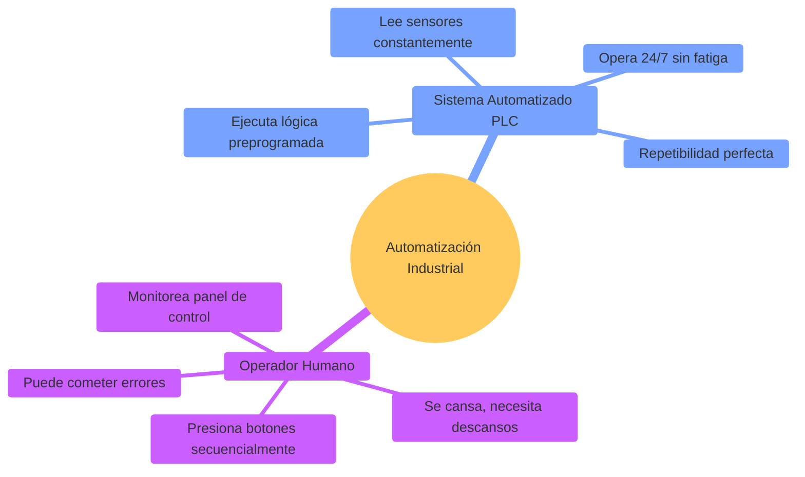

**Automatización Industrial** = Sistemas electrónicos (PLCs, SCADA) que controlan máquinas y procesos sin intervención humana constante.

### ¿Por Qué es Crítico en Paraguay?

**Realidad del mercado local**:
- ✅ **Itaipu Binacional** - Control de turbinas hidroeléctricas, sistemas de protección
- ✅ **Frigoríficos** - Líneas de faena, cámaras frigoríficas, empaque automatizado
- ✅ **Molinos de azúcar** - San Pedro, Guairá - control de evaporadores, centrífugas
- ✅ **Industria yerba mate** - Secadoras, molienda, envasado (CBSé, Pajarito)
- ✅ **Manufactura** - Plásticos, alimentos, bebidas, textiles
- ✅ **Agroindustria** - Silos automatizados, riego industrial, dosificación

**Sin automatización** = Productividad baja, costos altos, calidad inconsistente 🚫

**Salarios en Paraguay**:
- Técnico en automatización: **₲12-18M/mes**
- Ingeniero automation: **₲18-28M/mes**
- Automation architect: **₲25-35M/mes**

---

## 📊 La Pirámide de Automatización Industrial

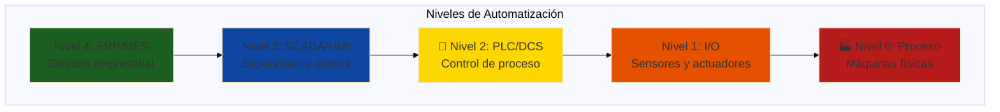

**Nuestro foco**: Niveles 1-3 (Sensores → PLC → SCADA)

---

## 🏢 Parte 1: Fundamentos de Automatización (60 min)

### Concepto: PLC - El Controlador Industrial

**PLC (Programmable Logic Controller)** = Computadora industrial robusta diseñada para control en tiempo real.

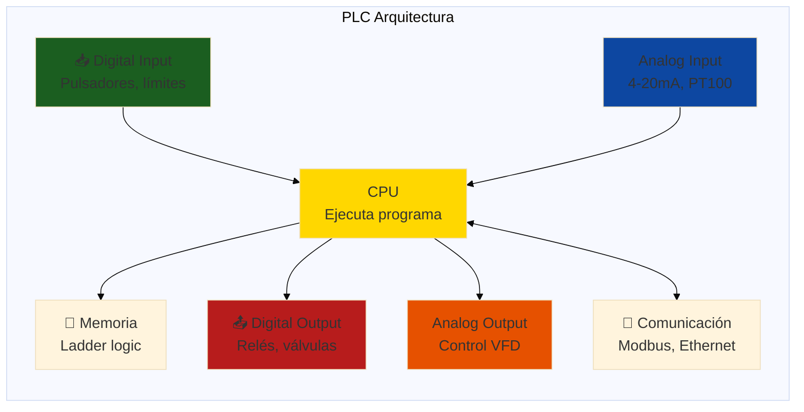

**Comparación: Arduino vs PLC Industrial**

| Característica | Arduino Uno | PLC (ej: Siemens S7-1200) |
|----------------|-------------|---------------------------|
| **Entorno** | Laboratorio, prototipo | Fábrica, ambiente hostil |
| **Temperatura** | 0-70°C | -20 a +60°C |
| **Protección** | Ninguna | IP20 o superior |
| **Entradas 24VDC** | No (adaptador necesario) | Sí, nativo |
| **Certificación** | No | CE, UL, IEC 61131 |
| **Programación** | C/C++ (Arduino IDE) | Ladder, FBD, SCL (TIA Portal) |
| **Costo** | ₲60,000 | ₲2,500,000+ |
| **Vida útil garantizada** | No especificada | 10+ años |
| **Soporte 24/7** | Comunidad | Fabricante + integradores |

**Cuándo usar PLC**: Producción real, certificaciones requeridas, ambiente industrial.  
**Cuándo usar Arduino**: Prototipo, aprendizaje, proyectos de bajo volumen.

### Ciclo de Escaneo del PLC

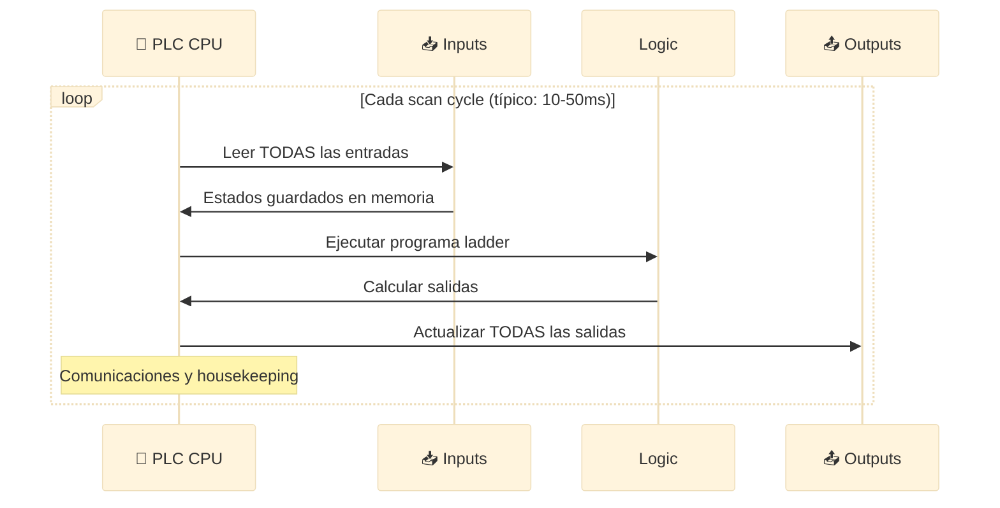

**Tiempo de scan típico**:
- PLC pequeño (100 instrucciones): **5-10ms**
- PLC mediano (1000 instrucciones): **20-50ms**
- PLC grande (10,000 instrucciones): **100-200ms**

**Regla de oro**: Tiempo de scan debe ser < 10% del tiempo de respuesta del proceso.

### Sensores Industriales Comunes

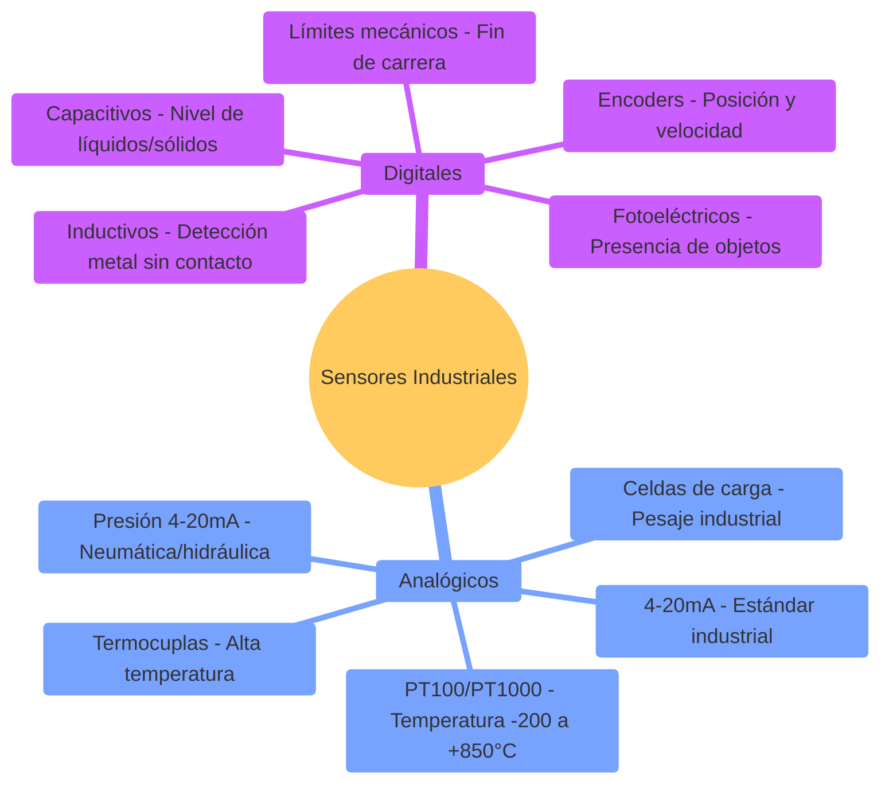

#### Sensor 4-20mA: El Estándar Universal

**¿Por qué 4-20mA y no 0-10V?**

```
Ventajas del 4-20mA:
✅ Inmune a caída de voltaje en cables largos (hasta 1km)
✅ Detección de falla: 0mA = cable roto, <4mA = error
✅ No requiere cable apantallado en ambientes ruidosos
✅ Dos hilos: alimentación + señal en mismo par

Ejemplo real en Paraguay:
Sensor de presión en tanque de agua (100m del PLC)
- Cable: 2×0.5mm² (100m de distancia)
- Resistencia total: ~7Ω (ida + vuelta)
- Caída de voltaje a 20mA: V = I×R = 0.02×7 = 0.14V ← Insignificante!
- La corriente NO cambia, señal perfecta
```

**Conversión a valor de proceso**:
```
Sensor de presión: 4mA = 0 bar, 20mA = 10 bar
Lectura actual: 12mA

Cálculo:
Valor normalizado = (12 - 4) / (20 - 4) = 8/16 = 0.5
Presión = 0 + (10 - 0) × 0.5 = 5 bar ✓
```

### Actuadores Industriales

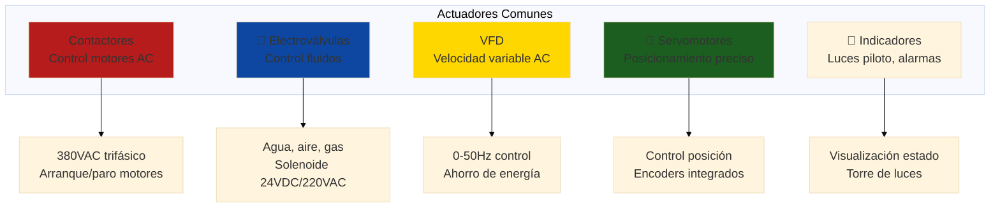

**Ejemplo real: Arranque de motor trifásico con contactor**

```
Motor 5HP 380VAC (típico en industria paraguaya)
Corriente nominal: ~8A

Componentes:
1. Contactor 3-polos 16A (ej: Schneider LC1D09)
2. Relé térmico ajustable 5.5-8A (sobrecarga)
3. Pulsador marcha (NA - normalmente abierto)
4. Pulsador paro (NC - normalmente cerrado)
5. PLC salida 24VDC para bobina del contactor

Lógica ladder (simplificada):
---| Marcha |-----| Paro |-----| Térmico OK |-----( Contactor )---
        |                                              |
        +----------------------------------------------+
         (Enclavamiento - mantiene contactor activado)
```

---

## 💻 Parte 2: Programación de PLCs con Ladder Logic (90 min)

### Concepto: Ladder Diagram - El Lenguaje Universal

**Ladder Logic** = Diagrama de escalera basado en lógica de relés tradicional.

```mermaid
%%{init: {'theme':'base', 'themeVariables': {'fontSize':'18px'}}}%%
graph LR
    subgraph "Elementos Ladder Básicos"
        A[┤├ Contacto NA<br/>Normally Open]
        B[┤/├ Contacto NC<br/>Normally Closed]
        C[( ) Bobina<br/>Output]
        D[TON Timer<br/>On-Delay]
        E[CTU Counter<br/>Up Counter]
    end
    
    style A fill:#1b5e20
    style B fill:#b71c1c
    style C fill:#FFD700
    style D fill:#0d47a1
    style E fill:#e65100
```

### Ejemplo 1: Circuito Marcha/Paro Simple

**Requerimiento**: Motor que arranca con pulsador MARCHA, para con PARO.

```
Ladder Logic:

Rung 1: (Arranque con enclavamiento)
|                                                                  |
|  I0.0      I0.1       Q0.0                          Q0.0        |
|--┤├--------┤/├---------┤├--------------------------( )---------|
|  Marcha    Paro    Enclavamiento                   Motor       |
|                                                                  |

Explicación:
- I0.0 (Marcha): Pulsador NA - cuando se presiona, activa
- I0.1 (Paro): Pulsador NC - cuando se presiona, desactiva
- Q0.0 (Motor): Salida que controla contactor
- Enclavamiento (Q0.0 en serie): Mantiene motor activo después de soltar Marcha
- Paro NC rompe el circuito, apaga motor
```

**Comportamiento**:
1. Presiono MARCHA → I0.0 cierra → Q0.0 activa → Motor arranca
2. Suelto MARCHA → I0.0 abre PERO Q0.0 en paralelo mantiene circuito cerrado
3. Presiono PARO → I0.1 abre → Q0.0 desactiva → Motor para

### Ejemplo 2: Control de Cinta Transportadora con Sensores

**Requerimiento**: Cinta transportadora que arranca si:
- Pulsador MARCHA presionado
- Sensor de presencia detecta material
- Temperatura del motor < 80°C
- Paro de emergencia NO accionado

```
Ladder Logic:

Rung 1: (Condiciones de arranque)
|                                                                  |
|  I0.0      I0.1         I0.2          I0.3        M0.0          |
|--┤├--------┤├-----------┤/├----------┤/├--------( )----------|
|  Marcha   Material   Temp_Alta   E-Stop      Habilitar       |
|                        (AI > 80°C)                               |
|                                                                  |

Rung 2: (Control motor con enclavamiento)
|                                                                  |
|  M0.0      M0.1       Q0.0                          Q0.0        |
|--┤├--------┤├---------┤├--------------------------( )---------|
|  Hab.    Correr    Enclavamiento                Contactor     |
|                                                                  |

Rung 3: (Set/Reset de estado Correr)
|                                                                  |
|  I0.0                                             M0.1          |
|--┤├----------------------------------------------(S)---------|
|  Marcha                                           Set Correr    |
|                                                                  |
|  I0.4                                             M0.1          |
|--┤├----------------------------------------------(R)---------|
|  Paro                                             Reset Correr  |
|                                                                  |

Rung 4: (Monitoreo temperatura - Comparador)
|                                                                  |
|  AI0 (Temp) >= 80°C                                I0.2         |
|--┤GE┤------------------------------------------(S)---------|
|   |80|                                          Temp_Alta       |
|                                                                  |
```

**Variables usadas**:
- **I0.0**: Digital Input - Pulsador Marcha
- **I0.1**: Digital Input - Sensor presencia (fotoeléctrico)
- **I0.2**: Memory bit - Flag temperatura alta
- **I0.3**: Digital Input - Paro de emergencia (NC)
- **I0.4**: Digital Input - Pulsador Paro
- **AI0**: Analog Input - Temperatura motor (PT100)
- **M0.0**: Memory bit - Habilitado para correr
- **M0.1**: Memory bit - Estado Correr
- **Q0.0**: Digital Output - Contactor motor

### Ejemplo 3: Secuencia de Llenado de Tanque

**Proceso real**: Llenado automático de tanque en frigorífico.

**Requerimiento**:
1. Nivel bajo detectado → Abrir válvula de entrada
2. Llenar hasta nivel alto → Cerrar válvula
3. Esperar 10 minutos antes de permitir nuevo ciclo
4. Alarma si nivel no sube en 5 minutos (válvula atascada)

```
Ladder Logic:

Rung 1: (Inicio de llenado por nivel bajo)
|                                                                  |
|  I0.0      M0.0       M0.1                        M0.0          |
|--┤/├-------┤/├--------┤/├------------------------(S)---------|
| Nivel_   Llenando  Retardo                      Set Llenando  |
|  Bajo                                                           |
|                                                                  |

Rung 2: (Detener llenado por nivel alto)
|                                                                  |
|  I0.1                                             M0.0          |
|--┤├----------------------------------------------(R)---------|
| Nivel_                                          Reset Llenando |
|  Alto                                                           |
|                                                                  |

Rung 3: (Activar válvula cuando está llenando)
|                                                                  |
|  M0.0                                             Q0.0          |
|--┤├---------------------------------------------( )---------|
| Llenando                                        Válvula        |
|                                                                  |

Rung 4: (Timer de retardo entre ciclos - 10 min)
|                                                                  |
|  M0.0                         T1                                |
|--┤/├-----------------------┤TON├---T1.Q----(S)---M0.1         |
| Llenando                    PT:600s                Retardo      |
|                                                                  |
|  M0.0                                             T1            |
|--┤├----------------------------------------------(R)---------|
| Llenando                                         Reset Timer   |
|                                                                  |

Rung 5: (Alarma si llenado tarda más de 5 min)
|                                                                  |
|  M0.0                         T2                                |
|--┤├-----------------------┤TON├---T2.Q----(S)---Q0.1         |
| Llenando                    PT:300s               Alarma        |
|                                                                  |
|  I0.1                                             T2            |
|--┤├----------------------------------------------(R)---------|
| Nivel_Alto                                       Reset Timer   |
|                                                                  |
```

**Timers utilizados**:
- **T1**: TON (On-Delay) - 600s (10 minutos) retardo entre ciclos
- **T2**: TON (On-Delay) - 300s (5 minutos) detección de fallo

### Contadores: CTU (Count Up)

**Aplicación**: Contar productos en línea de empaque.

```
Ladder Logic:

Rung 1: (Contador de productos)
|                                                                  |
|  I0.2                         C1                                |
|--┤P├-----------------------┤CTU├---C1.Q----(S)---Q0.2         |
| Sensor      Pulso           PV:100              Lote Completo   |
| Producto    (Rising Edge)                                       |
|                                                                  |

Rung 2: (Reset manual del contador)
|                                                                  |
|  I0.3                                             C1            |
|--┤├----------------------------------------------(R)---------|
| Reset                                           Reset Contador |
|                                                                  |

Explicación:
- I0.2: Sensor detecta cada producto que pasa
- ┤P├: Edge detection - cuenta solo en flanco de subida
- CTU: Count Up - incrementa en cada pulso
- PV:100: Preset Value - cuenta hasta 100
- C1.Q: Output activado cuando C1 >= PV
- Q0.2: Señal de "lote completo" (detiene cinta, activa empaque)
```

### Implementación con OpenCode

```bash
opencode "Genera programa ladder logic completo para control de cinta transportadora:

ESPECIFICACIONES:
Proceso: Cinta transportadora de frigorífico (empaque de carne)

COMPONENTES:
- Motor trifásico 5HP 380VAC (Q0.0)
- Sensor fotoeléctrico de producto (I0.0)
- Encoder para velocidad (AI0 = pulsos/segundo)
- Variador de frecuencia VFD (AO0 = 0-10V → 0-50Hz)
- Pulsador Marcha (I0.1)
- Pulsador Paro (I0.2)
- Paro de emergencia NC (I0.3)
- Indicador verde (Q0.1)
- Indicador rojo (Q0.2)
- Buzzer alarma (Q0.3)

LÓGICA REQUERIDA:
1. Arranque/paro con enclavamiento
2. Velocidad variable según carga:
   - Sin producto: 20 Hz (lento)
   - Con producto: 45 Hz (rápido)
3. Contador de productos (resetear cada 100)
4. Alarma si:
   - Velocidad real < 80% de setpoint por >10s (cinta atascada)
   - No se detecta producto en 2 minutos (línea vacía)
5. Indicadores:
   - Verde: Operando normal
   - Rojo: Alarma o detenido
   - Buzzer: Alarma activa

OUTPUT:
1. Programa ladder completo con rungs numerados
2. Tabla de variables (inputs, outputs, memory, timers, counters)
3. Comentarios explicando cada rung
4. Diagrama de conexiones eléctricas (texto)
5. Secuencia de operación paso a paso
6. Troubleshooting de fallas comunes

FORMATO:
- Sintaxis compatible con OpenPLC o texto estructurado
- Comentarios en español
- Contexto de frigorífico paraguayo (ej: temperaturas ambiente)

Todo production-ready para proyecto FPUNA"
```

---

## 🖥️ Parte 3: Sistemas SCADA y HMI (60 min)

### Concepto: SCADA - La Torre de Control de la Fábrica

**SCADA (Supervisory Control And Data Acquisition)** = Sistema de software que monitorea y controla procesos industriales desde una interfaz gráfica.

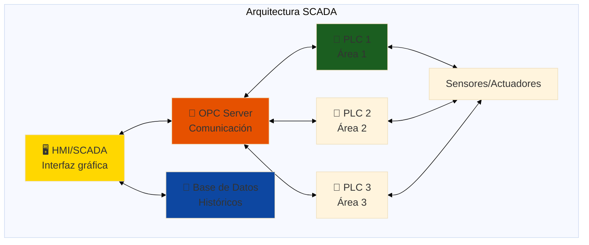

**Funciones principales del SCADA**:
1. **Visualización** - Gráficos animados de proceso en tiempo real
2. **Control** - Setpoints, arranque/paro de equipos
3. **Alarmas** - Notificación de condiciones anormales
4. **Trending** - Gráficos históricos (temperatura, presión, producción)
5. **Reportes** - KPIs, eficiencia, tiempos de paro

### Elementos de una Pantalla HMI

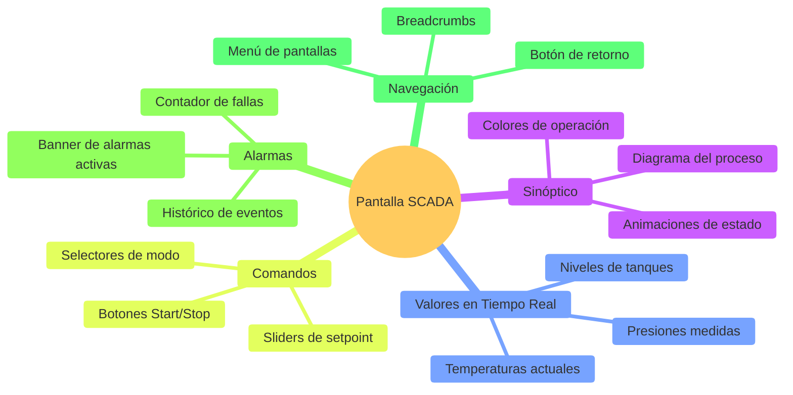

**Ejemplo de pantalla SCADA**: Control de tanque de agua

```
┌─────────────────────────────────────────────────────┐
│  SCADA - Tanque de Agua Procesadora              🟢 │  ← Header con estado
├─────────────────────────────────────────────────────┤
│                                                     │
│    ┌─────────────────┐                             │
│    │ TANQUE TK-101  │    Nivel: ████▓▓▓░░ 72%     │  ← Barra de nivel
│    │                 │                              │
│    │       ██        │    Temp: 28.5°C             │  ← Valor en tiempo real
│    │       ██        │                              │
│    │       ██        │    Presión: 2.3 bar         │
│    │       ██        │                              │
│    │ [═══════]       │    Caudal: 125 L/min        │
│    └────┬──┬─────────┘                             │
│         │  │                                        │
│         V  V                                        │
│     [VÁLVULA]  ◄── Estado: ABIERTA 🟢             │  ← Indicación visual
│                                                     │
│  Comandos:                                         │
│    [▶ LLENAR]  [⏸ PARAR]  [📊 HISTÓRICO]         │  ← Botones de control
│                                                     │
│  Alarmas Activas: 0  ✅                            │  ← Estado de alarmas
├─────────────────────────────────────────────────────┤
│  Última actualización: 15/01/2026 14:32:45         │  ← Timestamp
└─────────────────────────────────────────────────────┘
```

**Colores estándar SCADA** (ISA 101 / ANSI):
- 🟢 **Verde**: Operando normal
- 🟡 **Amarillo**: Advertencia, atención requerida
- 🔴 **Rojo**: Alarma crítica, peligro
- 🔵 **Azul**: Información, estado inactivo
- ⚫ **Gris**: Equipamiento fuera de servicio

### Protocolos Industriales Comunes

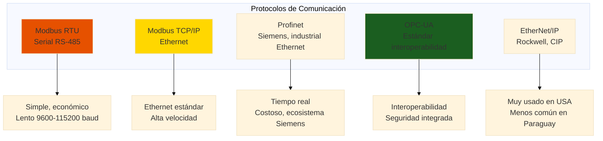

#### Modbus RTU: El Protocolo Universal

**Modbus** = Protocolo maestro-esclavo para leer/escribir registros.

**Estructura de mensaje Modbus RTU**:
```
[Slave ID] [Function Code] [Data] [CRC-16]
   1 byte      1 byte      N bytes  2 bytes

Ejemplo: Leer registro 40001 del esclavo 1
Request:  01 03 00 00 00 01 84 0A
          ↑  ↑  ↑     ↑     ↑
          │  │  │     │     └─ CRC
          │  │  │     └─ Cantidad (1 registro)
          │  │  └─ Dirección inicio (0x0000)
          │  └─ Function Code 03 (Read Holding Registers)
          └─ Slave ID 1

Response: 01 03 02 00 7D 78 45
          ↑  ↑  ↑  ↑     ↑
          │  │  │  │     └─ CRC
          │  │  │  └─ Valor: 0x007D = 125
          │  │  └─ Byte count (2 bytes)
          │  └─ Function Code 03 (echo)
          └─ Slave ID 1 (echo)
```

**Function Codes comunes**:
- **01**: Read Coils (digital outputs)
- **02**: Read Discrete Inputs (digital inputs)
- **03**: Read Holding Registers (variables configurables)
- **04**: Read Input Registers (variables de solo lectura)
- **05**: Write Single Coil
- **06**: Write Single Register
- **15**: Write Multiple Coils
- **16**: Write Multiple Registers

**Configuración típica RS-485**:
- **Baudrate**: 9600, 19200, 38400 (común: 9600)
- **Data bits**: 8
- **Parity**: None, Even (común: None)
- **Stop bits**: 1
- **Flow control**: None

**Alcance**: Hasta 1200m con RS-485 (twisted pair, 120Ω terminación)

### Software SCADA Open-Source

**ScadaBR** (Brasil, usado en Paraguay):
- ✅ Gratis y open-source
- ✅ Basado en web (HTML5)
- ✅ Soporta Modbus, OPC, BACnet
- ✅ Históricos en base de datos
- ❌ Interfaz un poco antigua
- ❌ Documentación limitada en español

**Instalación básica**:
```bash
# Ubuntu/Debian
sudo apt-get install openjdk-11-jdk tomcat9
wget http://www.scadabr.com.br/downloads/scadabr.war
sudo cp scadabr.war /var/lib/tomcat9/webapps/
sudo systemctl restart tomcat9

# Acceder: http://localhost:8080/scadabr
# Usuario: admin / admin
```

**Node-RED** (para IoT/SCADA ligero):
- ✅ Flow-based programming (visual)
- ✅ Gran comunidad y plugins
- ✅ Integración con MQTT, Modbus, databases
- ✅ Dashboard responsive
- ❌ No certificado para aplicaciones críticas

### Implementación con OpenCode

```bash
opencode "Diseña pantalla SCADA completa para línea de embotellado:

PROCESO:
Línea de embotellado de agua mineral (Paraguay)

EQUIPOS:
1. Tanque almacenamiento agua (TK-01)
   - Sensor nivel (4-20mA)
   - Válvula entrada (ON/OFF)
   - Bomba de transferencia (VFD 0-50Hz)
2. Filtro de carbón activado (FT-01)
   - Sensor presión entrada/salida (4-20mA)
   - Indicador saturación filtro (calculado por ΔP)
3. Llenadora (FK-01)
   - 6 boquillas simultáneas
   - Contador de botellas (total y por lote)
   - Velocidad ajustable
4. Etiquetadora (LB-01)
   - Contador de etiquetas aplicadas
   - Sensor alineación
   - Alarma falta de etiquetas

PANTALLA SCADA REQUERIDA:
1. Sinóptico completo del proceso con:
   - Tanque animado (nivel sube/baja)
   - Tuberías con flujo animado
   - Bombas con estado rotando/parado
   - Filtro con indicador de color (verde→amarillo→rojo según saturación)
2. Valores en tiempo real:
   - Nivel tanque (%)
   - Presión filtro (bar)
   - Caudal (L/min)
   - Producción actual (botellas/hora)
   - Eficiencia de línea (%)
3. Comandos:
   - Start/Stop línea completa
   - Modo Auto/Manual
   - Setpoint velocidad (botellas/min)
   - Reset contador de lote
4. Panel de alarmas:
   - Nivel tanque bajo (<10%)
   - Filtro saturado (ΔP >2 bar)
   - Atasco en llenadora (no avanza contador por >30s)
   - Falta de etiquetas
5. Gráficos de tendencia (trending):
   - Producción últimas 8 horas
   - Nivel tanque última hora
   - Presión filtro

OUTPUT:
1. Mockup de pantalla SCADA (texto/ASCII art detallado)
2. Lista de tags Modbus:
   - Dirección, tipo (holding register, coil, etc.)
   - Unidad de ingeniería
   - Escalado (raw → EU)
3. Lógica de alarmas con prioridades
4. Cálculos derivados:
   - OEE (Overall Equipment Effectiveness)
   - Eficiencia de filtro
   - Tiempo estimado para saturación
5. Plan de navegación entre pantallas:
   - Overview general
   - Detalle tanque
   - Detalle llenadora
   - Histórico/reportes

CONTEXTO:
- Operadores con educación secundaria
- Uso 24/7 en planta
- Interfaz debe ser intuitiva y clara
- Colores según ISA 101

TODO en español, production-ready para embotelladora real en Paraguay"
```

---

## 🤖 Parte 4: OpenCode para Automatización (30 min)

### Casos de Uso de IA en Automatización Industrial

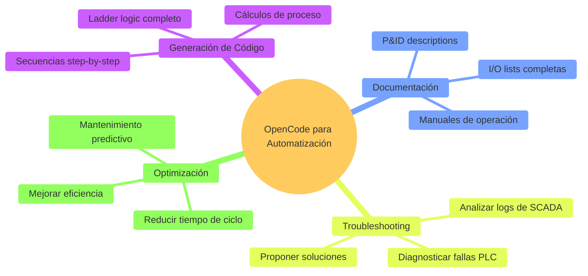

### Prompt: Generar Ladder Logic desde Descripción

```bash
opencode "Genera programa ladder logic para secuencia de arranque de compresor:

PROCESO:
Compresor de aire comprimido en taller industrial

SECUENCIA DE ARRANQUE:
1. Verificar condiciones iniciales:
   - Presión sistema < 8 bar (arrancar si baja de este valor)
   - Temperatura aceite > 15°C (pre-calentador si hace frío)
   - Nivel aceite OK (sensor digital)
   - Filtro aire limpio (ΔP < 0.5 bar)
   - Paro emergencia no accionado
2. Pre-lubricación (si estuvo parado >4 horas):
   - Activar bomba de aceite por 30 segundos
   - Verificar presión aceite > 2 bar antes de continuar
3. Arranque motor:
   - Activar contactor estrella por 5 segundos
   - Cambiar a contactor triángulo
   - Confirmar corriente de motor en rango normal (15-20A)
4. Operación normal:
   - Mantener presión 7-8 bar (hystéresis)
   - Si presión > 8 bar → parar compresor
   - Si presión < 7 bar → arrancar nuevamente
5. Parada de emergencia:
   - Detener motor inmediatamente
   - Abrir válvula de alivio
   - Activar alarma sonora

ALARMAS:
- Temperatura > 90°C → Parada y alarma
- Presión aceite < 1.5 bar durante operación → Parada
- Sobre-corriente motor > 25A → Parada
- Fallo arranque (3 intentos) → Bloquear y alarma

GENERAR:
1. Programa ladder completo con rungs numerados
2. Tabla de variables I/O (sensores, actuadores, memorias)
3. Timers y contadores utilizados
4. Comentarios explicativos en cada rung
5. Diagrama de estados (Mermaid)
6. Secuencia de prueba y puesta en marcha

FORMATO:
Compatible con OpenPLC o formato estructurado
Comentarios en español
Incluir safety interlocks

Contexto: Taller mecánico en Asunción, personal técnico"
```

### Prompt: Documentar Sistema Existente

```bash
opencode "Documenta este sistema SCADA de planta de tratamiento de agua:

SITUACIÓN:
Sistema SCADA operando desde 2018, documentación perdida.
Necesito generar manual completo para nuevos operadores.

DATOS DISPONIBLES:
- Lista de tags Modbus (CSV adjunto): 150 variables
- Capturas de pantalla SCADA (5 pantallas principales)
- Esquemáticos eléctricos (PDF)
- Observaciones del proceso durante una semana

PROCESO (resumido de observaciones):
1. Captación de agua cruda de pozo
2. Aireación y sedimentación
3. Filtración con carbón activado
4. Cloración (cloro gas)
5. Almacenamiento en tanque elevado
6. Distribución a red

GENERAR MANUAL DE OPERACIÓN CON:
1. Descripción del proceso completo:
   - Diagrama P&ID simplificado (texto/Mermaid)
   - Explicación de cada etapa
   - Parámetros normales de operación
2. Guía de operación de SCADA:
   - Explicación de cada pantalla
   - Qué significan los valores mostrados
   - Cómo cambiar setpoints
   - Interpretación de alarmas
3. Procedimientos operativos:
   - Arranque de planta (secuencia paso a paso)
   - Parada normal
   - Parada de emergencia
   - Cambio de modo Auto/Manual
4. Troubleshooting:
   - Top 10 alarmas más comunes
   - Causas probables
   - Acciones correctivas
   - Cuándo llamar a mantenimiento
5. Mantenimiento preventivo:
   - Checklist diario/semanal/mensual
   - Calibración de sensores (frecuencia)
   - Limpieza de filtros
6. Lista completa de tags explicados:
   - Nombre, descripción en lenguaje operativo
   - Unidades
   - Rango normal de operación
   - Alarmas asociadas

FORMATO:
- Markdown con secciones claras
- Lenguaje simple (operadores no ingenieros)
- Tablas para referencia rápida
- Diagramas Mermaid donde aplique
- Anexos con datos técnicos

OBJETIVO:
Operador nuevo debe poder operar planta con este manual en 1 semana de entrenamiento

TODO en español, contexto Paraguay (legislación SENASA agua potable)"
```

### Prompt: Optimización de Proceso con AI

```bash
opencode "Analiza datos históricos de SCADA y propón optimizaciones:

PLANTA:
Molino de azúcar en Guairá, Paraguay

DATOS HISTÓRICOS (3 meses):
[Adjuntar CSV con timestamps, producción, consumo energía, paradas]
Columnas:
- timestamp
- produccion_ton_cana (toneladas/hora)
- consumo_kwh (energía total)
- vapor_presion_bar (caldera)
- clarificado_turbidez_ntu
- evaporador_brix (concentración)
- centrifuga_rpm
- paradas_count (por turno)
- paradas_duracion_min

PROBLEMAS OBSERVADOS:
1. Consumo energético muy variable (50-120 kWh/ton caña)
2. Paradas no planificadas frecuentes (15-20 por semana)
3. Calidad del azúcar inconsistente (cristales muy grandes o muy pequeños)
4. Eficiencia global promedio: 68% (debería ser >85%)

ANÁLISIS REQUERIDO:
1. Identificar patrones en datos:
   - ¿Cuándo ocurren más paradas?
   - ¿Qué variables correlacionan con bajo consumo energético?
   - ¿Setpoints óptimos de evaporadores para eficiencia máxima?
2. Anomalías detectadas:
   - Outliers en consumo
   - Drifts en sensores (señales que cambian gradualmente)
   - Paradas que coinciden con ciertas condiciones
3. Recomendaciones de optimización:
   - Ajustes de setpoints (presión vapor, RPM centrífuga, etc.)
   - Lógica de control predictivo (anticipar problemas)
   - Mantenimiento predictivo (cuándo limpiar evaporadores)
   - Secuencias de arranque/parada optimizadas
4. ROI estimado:
   - Ahorro energético proyectado (₲/mes)
   - Reducción de paradas (horas/mes)
   - Mejora en calidad (% de producto premium)
5. Implementación en PLC/SCADA:
   - Nuevos tags a monitorear
   - Alarmas predictivas (ej: "Limpieza de filtro en 48h")
   - Modificaciones a ladder logic
   - Dashboard de KPIs propuesto

GENERAR:
1. Reporte ejecutivo (2 páginas, para gerencia)
2. Análisis técnico detallado (para ingenieros)
3. Plan de implementación (8 semanas)
4. Métricas de seguimiento (KPIs a monitorear)

CONTEXTO:
- Zafra (temporada) abril-octubre
- Personal técnico capacitado pero necesita guía específica
- Inversión disponible: USD 50,000 para mejoras
- Prioridad: reducir costos operativos

TODO en español, enfocado en acción concreta para planta paraguaya"
```

### Integración con Workflow de Automatización

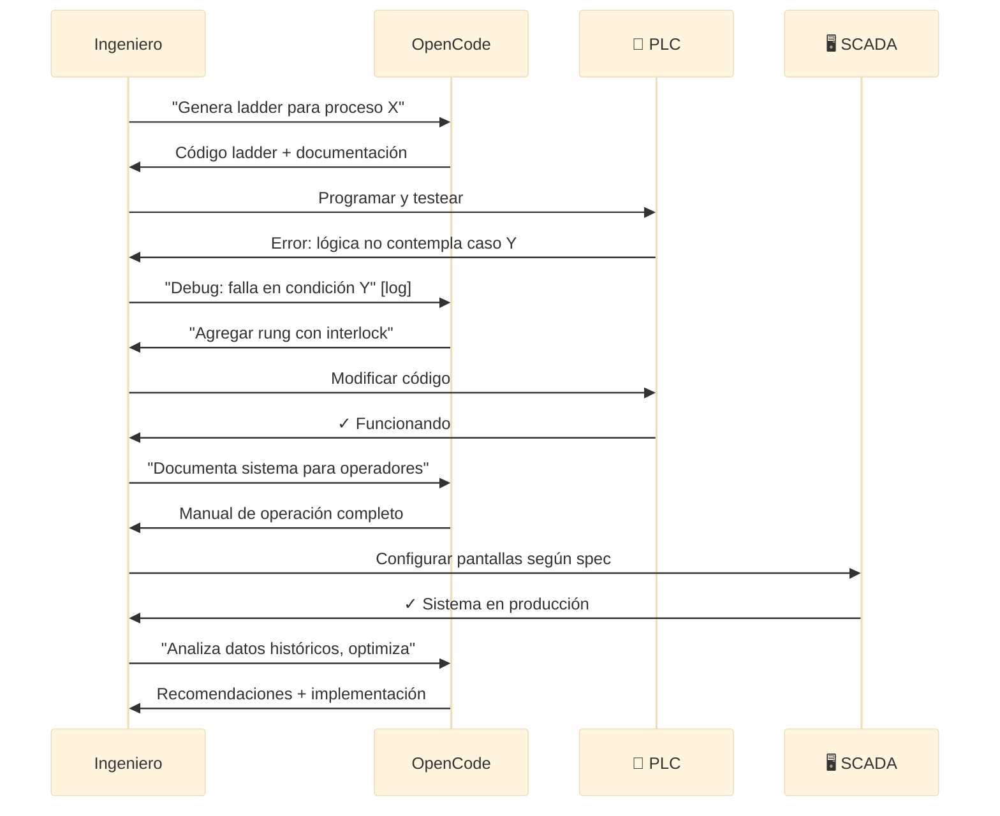

**Ventaja**: OpenCode actúa como **ingeniero senior de automatización** con experiencia en múltiples industrias.

---

## 🎯 Ejercicio Práctico: Sistema de Control de Cámara Frigorífica

### Objetivo

Diseñar sistema completo de control automático de temperatura para cámara frigorífica en frigorífico paraguayo.

### Especificaciones del Sistema

**Proceso**: Cámara de enfriamiento rápido de carne (0 a 4°C)

**Hardware**:
- PLC: OpenPLC en Raspberry Pi (proyecto académico) o Siemens Logo! (industrial)
- Sensor temperatura: PT100 → transmisor 4-20mA (0 a 50°C)
- Compresor 5HP trifásico (ON/OFF via contactor)
- Ventiladores evaporador (ON/OFF)
- Deshielo eléctrico (resistencias)
- Alarma sonora (buzzer)
- Luz indicadora verde/roja

**Requerimientos funcionales**:
1. **Control de temperatura**:
   - Setpoint: 2°C (ajustable 0-10°C desde SCADA)
   - Hystéresis: 1°C
   - Si T > 3°C → ON compresor
   - Si T < 1°C → OFF compresor
2. **Protecciones**:
   - Mínimo 3 minutos entre arranques (proteger compresor)
   - Temperatura < -2°C → Alarma sobre-enfriamiento
   - Temperatura > 8°C → Alarma fallo compresor
   - Compresor no arranca si puerta abierta (sensor magnético)
3. **Ciclo de deshielo**:
   - Cada 6 horas de operación acumulada
   - Parar compresor, activar resistencias
   - Mantener deshielo hasta T_evaporador > 8°C (10 min máximo)
   - Enfriar evaporador antes de reanudar
4. **Registro de datos**:
   - Temperatura cada 1 minuto → guardar en base de datos
   - Eventos: arranque, parada, alarmas, deshielos
   - Cálculo de eficiencia energética

**SCADA/HMI**:
- Pantalla principal con temperatura actual, setpoint, estado
- Gráfico de tendencia últimas 24 horas
- Botón forzar deshielo manual
- Log de alarmas
- Estadísticas: horas de operación, ciclos de deshielo, alarmas totales

### Implementación con OpenCode

```bash
opencode "Genera sistema completo de automatización de cámara frigorífica:

ESPECIFICACIONES: [copiar de arriba]

GENERAR:

1. PROGRAMA PLC (Ladder Logic):
   - Control de temperatura con hystéresis
   - Timer anti-short-cycling (3 min)
   - Secuencia de deshielo automático
   - Manejo de alarmas
   - Contador de horas de operación
   - Comentarios detallados

2. CONFIGURACIÓN SCADA (ScadaBR o Node-RED):
   - Tags Modbus (dirección, tipo, escalado)
   - Pantalla principal (mockup detallado)
   - Alarmas con prioridades
   - Trending de temperatura
   - Comandos de control

3. CÁLCULOS DE INGENIERÍA:
   - Dimensionamiento del compresor (5HP suficiente?)
     - Volumen cámara: 20m³
     - Carga térmica: producto 500kg/día a 35°C → 4°C
     - Aislamiento: poliuretano 100mm
   - Transmisor 4-20mA:
     - Escalado 4mA=0°C, 20mA=50°C
     - Resolución efectiva en PLC (ADC 10-bit)
   - Consumo energético estimado
     - Compresor 5HP × horas/día
     - Costo mensual en ₲ (tarifa ANDE industrial)

4. DOCUMENTACIÓN:
   - Diagrama P&ID del sistema
   - Esquemático eléctrico (conexiones principales)
   - Tabla I/O completa
   - Procedimiento de puesta en marcha
   - Manual de operación para personal de frigorífico
   - Troubleshooting de fallas comunes:
     - Compresor no arranca
     - No enfría suficiente
     - Deshielo no funciona
     - Alarmas falsas

5. PLAN DE PRUEBAS:
   - Checklist de verificación hardware
   - Secuencia de pruebas de software
   - Simulación de fallas
   - Criterios de aceptación

CONTEXTO:
- Frigorífico mediano en Asunción
- Personal técnico básico
- Operación 24/7
- Cumplir normativa SENACSA (temp carnes)

TODO en español, production-ready, con énfasis en seguridad alimentaria"
```

---

## ✅ Checklist de Verificación de Sistema de Automatización

Antes de poner en producción:

### Hardware
- [ ] Todos los sensores calibrados y testeados
- [ ] Actuadores responden correctamente a comandos PLC
- [ ] Cableado según esquemáticos, con etiquetas
- [ ] Tierras y protecciones eléctricas correctas
- [ ] Fuentes de alimentación dimensionadas con margen
- [ ] Paro de emergencia funcional y accesible

### Software PLC
- [ ] Programa ladder sin errores de compilación
- [ ] Lógica probada en todos los casos (normal, alarma, falla)
- [ ] Timers y contadores con valores correctos
- [ ] Interlocks de seguridad implementados
- [ ] Comentarios claros en código

### SCADA/HMI
- [ ] Comunicación PLC ↔ SCADA estable
- [ ] Todas las variables leen valores reales (no ceros)
- [ ] Comandos desde SCADA controlan PLC correctamente
- [ ] Alarmas configuradas con prioridades
- [ ] Históricos guardando datos cada intervalo definido

### Documentación
- [ ] Manuales de operación completos
- [ ] Diagramas actualizados (P&ID, eléctricos, I/O)
- [ ] Procedimientos de emergencia documentados
- [ ] Contactos de soporte técnico

### Capacitación
- [ ] Operadores entrenados en uso de SCADA
- [ ] Técnicos conocen troubleshooting básico
- [ ] Procedimientos de respaldo documentados

---

## 🎉 Resumen del Módulo

### Lo Que Dominaste

✅ **PLCs y ladder logic** - Programación de controladores industriales  
✅ **SCADA/HMI** - Diseño de interfaces de supervisión  
✅ **Sensores industriales** - 4-20mA, PT100, encoders, proximity  
✅ **Actuadores** - Contactores, VFDs, electroválvulas  
✅ **Protocolos** - Modbus RTU/TCP, conceptos de OPC-UA  
✅ **OpenCode para automatización** - Generación de código, documentación, optimización

### Próximo Paso

**Continúa con**: [Módulo 05 - IoT y Visualización de Datos](./05-iot-visualizacion-datos.md)

---

## 💭 Reflexión

1. **¿Cómo cambia la automatización la industria paraguaya?**
2. **¿Qué diferencias hay entre automatizar con Arduino vs PLC industrial?**
3. **¿Cómo puede IA optimizar procesos que llevan décadas operando?**

**Comparte en Slack** (#electronica-automatizacion)

---

## 📚 Recursos Adicionales

### Documentación Oficial
- [IEC 61131-3](https://en.wikipedia.org/wiki/IEC_61131-3) - Estándar de lenguajes PLC
- [Modbus Protocol Spec](https://modbus.org/specs.php) - Especificación oficial
- [ISA-101 HMI Standard](https://www.isa.org/standards-and-publications/isa-standards/isa-standards-committees/isa101) - Diseño de interfaces
- [OpenPLC Documentation](https://autonomylogic.com/) - PLC open-source

### Software Gratuito
- **OpenPLC** - Runtime y editor ladder gratuito
- **ScadaBR** - SCADA open-source (Brasil)
- **Node-RED** - IoT y SCADA ligero
- **Modbus Poll/Slave** - Testing Modbus (trial gratuito)
- **QModMaster** - Cliente Modbus open-source

### Tutoriales y Cursos
- **PLCGurus.NET** - Videos de ladder logic
- **Automation Direct** - Manuales y ejemplos gratuitos
- **Control Engineering** - Artículos técnicos
- **FPUNA** - Apuntes de cátedra Automatización Industrial

### Proveedores Paraguay
- **EPM (Electrónica Paraguay Mayorista)** - Automatización industrial, PLCs, sensores
- **Casa Japón** - Componentes eléctricos, contactores
- **Importadores Siemens Paraguay** - PLCs Siemens, HMIs
- **MercadoLibre PY** - Sensores industriales, módulos Modbus

### Hardware Recomendado para Aprender
**Opción económica** (aprendizaje):
- OpenPLC en Raspberry Pi (~USD 50)
- Sensores 4-20mA simulados con potenciómetros
- Relés módulos para actuadores
- **Total**: ~USD 100

**Opción industrial** (proyecto serio):
- Siemens LOGO! 12/24RC (~USD 200)
- HMI Siemens KTP400 Basic (~USD 300)
- Sensores industriales reales
- **Total**: ~USD 800-1,000

### Comunidades Paraguay
- **Asociación de Ingenieros Electrónicos Paraguay**
- **FPUNA - Grupo Automatización**
- **LinkedIn**: Automation Professionals Paraguay

### Libros Técnicos
- **"Programmable Logic Controllers"** - Frank Petruzella
- **"Industrial Automation Handbook"** - S.R. Paranjape
- **"SCADA Handbook for Electrical Engineers"** - Robert McClanahan
- **"Modbus Messaging on TCP/IP"** - Schneider Electric (gratuito online)

---

*Módulo creado para FPUNA Verano 2026*  
*Actualizado: Enero 2026*  
*Track: Electrónica y Automatización*
