# ✈️ Módulo 03: Estructuras y Materiales Aeronáuticos

## Diseña Estructuras Resistentes y Livianas con FEA y OpenCode

> **Para Ingenieros Aeronáuticos**: Este módulo te enseña análisis estructural aeronáutico desde fundamentos hasta simulación FEA profesional. Aprenderás selección de materiales, cálculos de resistencia, diseño óptimo de estructuras, y validación con análisis de elementos finitos usando OpenCode como asistente técnico.

**⏱️ Duración**: 4 horas  
**👤 Nivel**: Intermedio (con fundamentos de mecánica de materiales)  
**🎯 Objetivo**: Dominar diseño estructural aeronáutico con herramientas modernas e IA

---

## 🎓 ¿Qué Vas a Lograr?

1. ✅ **Análisis FEA aeronáutico** - Validar diseños con elementos finitos
2. ✅ **Selección de materiales** - Aluminio, composites, aleaciones aeroespaciales
3. ✅ **Cálculos de esfuerzos** - Tensión, flexión, torsión, pandeo
4. ✅ **Factores de seguridad** - Normativas FAA/EASA aplicadas
5. ✅ **Optimización estructural** - Peso mínimo con resistencia máxima
6. ✅ **IA para estructuras** - OpenCode como ingeniero estructural asistente

---

## 🤔 ¿Qué son las Estructuras Aeronáuticas?

### Analogía: El Esqueleto de una Aeronave

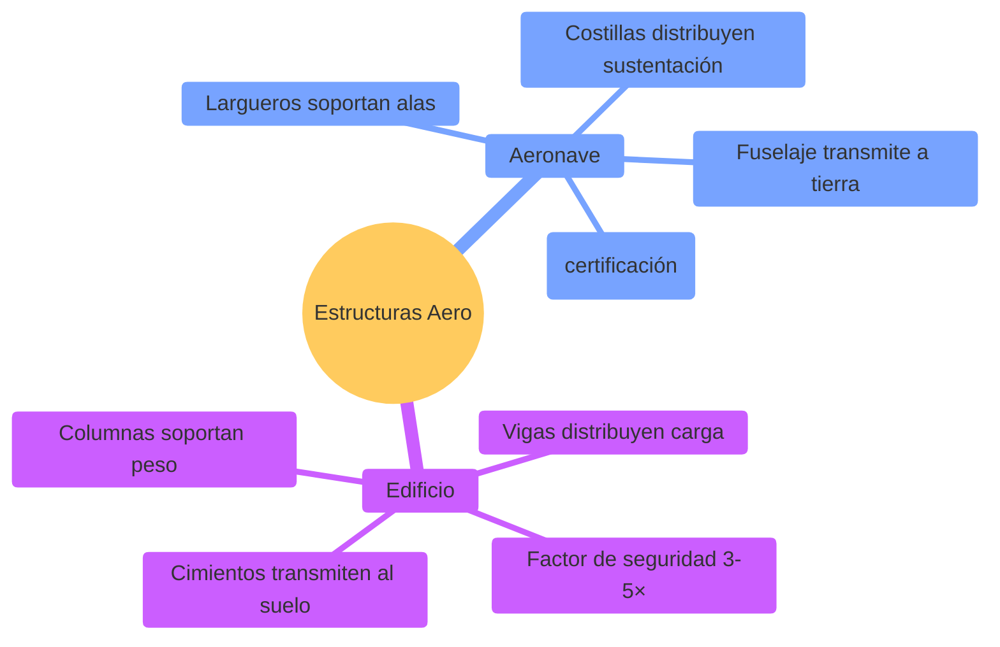

**Estructuras Aeronáuticas** = El sistema de elementos que soportan cargas (aerodinámicas, inerciales, térmicas) garantizando integridad estructural durante toda la vida operativa con peso mínimo.

### ¿Por Qué es Crítico en Paraguay?

**Realidad del sector aeronáutico local**:
- ✅ **TAM Airlines** - Análisis de fatiga en flota comercial
- ✅ **Fuerza Aérea Paraguaya** - Refuerzos estructurales en aeronaves antiguas
- ✅ **Drones agrícolas** - Diseño de estructuras ultraligeras (<1kg)
- ✅ **Mantenimiento MRO** - Inspección de grietas y corrosión

**Sin análisis estructural** = Fallas catastróficas en vuelo ✈️💥

---

## 📋 Prerrequisitos

### Conocimientos Requeridos

✅ **Mecánica de Materiales** (Fundamental):
- Esfuerzo (σ), deformación (ε), y Ley de Hooke
- Diagramas de momento flector y cortante
- Concepto de factor de seguridad
- Esfuerzo de fluencia (σy) y resistencia última (σu)
- **Verificación**: ¿Puedes calcular σ = F/A y ε = ΔL/L?

✅ **Física y Matemáticas** (Fundamental):
- Estática: suma de fuerzas, momentos, equilibrio
- Cálculo: derivadas e integrales básicas
- Álgebra lineal: vectores, matrices
- Trigonometría: seno, coseno, tangente

✅ **Conocimientos Aeronáuticos Básicos** (Recomendado):
- Fuerzas en vuelo: sustentación, peso, empuje, arrastre
- Partes de una aeronave: fuselaje, alas, empenaje
- Factor de carga (n): relación entre sustentación y peso
- Envolvente de vuelo básico

❌ **NO Se Requiere**:
- Experiencia con software FEA (se enseña desde cero)
- Conocimiento avanzado de materiales compuestos
- Licencia de piloto o experiencia en vuelo

### Software Necesario (Todo Opcional)

Este módulo incluye ejemplos de software profesional, pero **NO es obligatorio instalar**. Puedes completar el módulo con conocimientos teóricos.

**Para FEA (Finite Element Analysis)** - Elige uno:
- **ANSYS Workbench** (versión estudiante - gratis)
  - [Descargar](https://www.ansys.com/academic/students)
  - Registro con email .edu
- **Fusion 360** (incluye FEA - gratis para estudiantes)
  - [Descargar](https://www.autodesk.com/education/home)
  - FEA integrado, más intuitivo
- **CalculiX** (open source - gratis)
  - [Descargar](http://www.calculix.de/)
  - Linux/WSL recomendado

**Para Cálculos y Análisis**:
- **Python + numpy/scipy** (scripts de análisis)
  - Ya instalado si completaste CORE-FOUNDATION
- **Excel/LibreOffice Calc** (cálculos básicos)
- **MATLAB** (opcional, si disponible en FPUNA)

**Nota Importante**: Puedes completar el módulo sin software. Los conceptos estructurales son independientes de las herramientas. El software solo acelera cálculos repetitivos.

### Módulos Previos Necesarios

**Obligatorios**:
- ✅ **00-CORE-FOUNDATION (Semana 1)** - OpenCode y herramientas AI
- ✅ **Módulo 01: CAD con IA** - Para entender geometrías 3D de aeronaves
- ✅ **Módulo 02: Aerodinámica CFD** - Para conocer cargas aerodinámicas que actúan sobre estructuras

**Opcional pero Recomendado**:
- Curso de Mecánica de Materiales (pregrado)

### Auto-Evaluación

Responde estas preguntas para verificar si estás listo:

1. **¿Puedes calcular esfuerzo (σ = F/A) y deformación (ε = ΔL/L)?**  
   SÍ / NO

2. **¿Entiendes el diagrama de momento flector de una viga simple?**  
   SÍ / NO

3. **¿Sabes qué es factor de seguridad (FS) y por qué se usa en diseño?**  
   SÍ / NO

4. **¿Conoces las 4 fuerzas básicas en vuelo (sustentación, peso, empuje, arrastre)?**  
   SÍ / NO

5. **¿Puedes dedicar 4-5 horas a contenido técnico denso?**  
   SÍ / NO

**Interpretación**:
- **4-5 SÍes**: ✅ Listo para comenzar
- **3 SÍes**: ⚠️ Considera repasar mecánica de materiales (2-3 horas)
- **< 3 SÍes**: ❌ Repasa fundamentos antes de continuar

**Recursos de Repaso** (si necesitas):
- [Khan Academy: Stress & Strain](https://www.khanacademy.org/science/physics)
- [MIT OCW: Mechanics of Materials](https://ocw.mit.edu/)
- Libro: "Mecánica de Materiales" - Beer & Johnston

### Tiempo Estimado Total

- **Contenido teórico**: 3-4 horas
- **Ejercicios prácticos**: 1-2 horas
- **Proyecto FEA (opcional)**: 4-6 horas adicionales

**Total**: 4-12 horas (depende de profundidad)

### Checklist Final

Antes de comenzar, verifica:

- [ ] He completado CORE-FOUNDATION (Semana 1)
- [ ] He completado Módulos 01 y 02 del track Aero
- [ ] Entiendo conceptos básicos de mecánica de materiales
- [ ] Tengo 4+ horas disponibles para el módulo
- [ ] (Opcional) He instalado software FEA
- [ ] Tengo calculadora o Python para cálculos

**Si marcaste todos los obligatorios (primeros 4)**: ¡Adelante! 🚀

---

## 📊 El Triángulo del Diseño Estructural

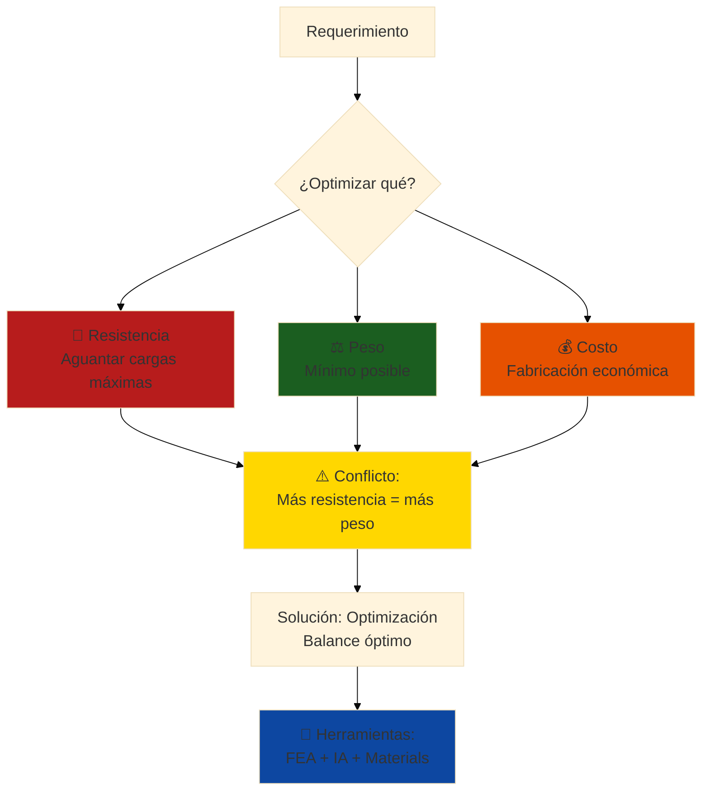

**Trade-off fundamental**: No puedes maximizar los tres simultáneamente. El ingeniero debe encontrar el punto óptimo según la misión.

---

## ⚖️ Límites de IA: Dónde Confiar y Dónde Cuestionar

### Filosofía Fundamental

> **"La IA acelera la ejecución de lo que ya sabes hacer, no reemplaza tu criterio de ingeniero"**

En Análisis Estructural y Materiales, OpenCode es un **asistente técnico poderoso**, pero **NO un ingeniero aeronáutico**. Entender esta distinción es crítico para tu éxito profesional.

---

## 🤖 Lo que IA Hace EXCELENTEMENTE

### 1. Tareas Repetitivas con Patrones Conocidos

**Ejemplos en Análisis Estructural y Materiales**:
- Ejecutar análisis FEA de 50 configuraciones de larguero
- Calcular factores de seguridad para 100 puntos de carga
- Generar reportes de esfuerzos con visualizaciones automáticas

**Por qué funciona**:
- ✅ Patrón conocido y repetible
- ✅ No requiere juicio creativo
- ✅ Resultado validable objetivamente

**Velocidad**: **10-15× más rápido** que manual

---

### 2. Optimización en Espacio de Soluciones Conocido

**Ejemplos en Análisis Estructural y Materiales**:
- Encontrar espesor óptimo de pared para minimizar peso
- Ajustar distribución de refuerzos para maximizar rigidez
- Optimizar topología con restricciones de volumen

**Por qué funciona**:
- ✅ Espacio de búsqueda finito y definido
- ✅ Función objetivo clara (minimizar/maximizar)
- ✅ Restricciones conocidas

**Mejora típica**: **20-40% mejor** que intuición inicial

---

### 3. Síntesis y Documentación de Información

**Ejemplos en Análisis Estructural y Materiales**:
- Generar reporte técnico desde resultados FEA
- Crear tabla comparativa de 10 configuraciones estructurales
- Documentar decisiones de diseño automáticamente

**Por qué funciona**:
- ✅ Datos estructurados disponibles
- ✅ Formato de salida estándar
- ✅ No requiere interpretación creativa

**Velocidad**: **20× más rápido** que escritura manual

---

### 4. Detección de Anomalías en Datos Históricos

**Ejemplos en Análisis Estructural y Materiales**:
- Detectar inconsistencias en mallas FEA
- Identificar parámetros de materiales fuera de rango normal
- Alertar sobre concentración de esfuerzos sospechosa

**Por qué funciona**:
- ✅ Baseline de "normalidad" entrenado con datos históricos
- ✅ Desviaciones detectables estadísticamente
- ✅ Alertas reducen errores humanos

**Beneficio**: **Reduce errores 60-80%**

---

## 🧠 Lo que IA Hace POBREMENTE (Requiere TU Juicio)

### 1. Innovación Verdadera sin Precedentes

**Ejemplos en Análisis Estructural y Materiales**:
- ❌ Diseñar topología estructural completamente innovadora
  - **Por qué falla**: Requiere intuición mecánica sobre flujo de cargas
  - **Tu rol**: Entender mecánica estructural, pruebas físicas
  
- ❌ Inventar nueva configuración de refuerzos sin precedentes
  - **Por qué falla**: No hay datos históricos de soluciones similares
  - **Tu rol**: Creatividad basada en principios de ingeniería

- ❌ Optimizar para criterios contradictorios no cuantificables
  - **Por qué falla**: No puede balancear "manufacturabilidad vs performance" sin definición clara
  - **Tu rol**: Trade-offs basados en experiencia y contexto

**Señal de alerta**: Si la IA sugiere algo "nunca visto antes", **desconfía y valida rigurosamente**.

---

### 2. Decisiones de Seguridad Críticas

**Ejemplos en Análisis Estructural y Materiales**:
- ❌ Decidir factor de seguridad para estructura crítica
  - **Por qué falla**: Depende de normativa, riesgo aceptable, consecuencias de falla
  - **Tu rol**: Aplicar FAA/EASA/DINAC, considerar peor caso, certificación

- ❌ Validar que estructura cumple normas de aeronavegabilidad
  - **Por qué falla**: Regulaciones requieren interpretación legal + técnica
  - **Tu rol**: Responsabilidad legal del ingeniero firmante

- ❌ Decidir si componente es 'suficientemente seguro' para vuelo
  - **Por qué falla**: "Suficientemente" es juicio basado en consecuencias, no cálculo
  - **Tu rol**: Ética profesional y responsabilidad civil

**Regla de oro**: **NUNCA confíes en IA para decisiones que pongan vidas en riesgo**.

---

### 3. Comprensión de Contexto y Restricciones Implícitas

**Ejemplos en Análisis Estructural y Materiales**:
- ❌ Seleccionar materiales considerando proveedores en Asunción
  - **Por qué falla**: No conoce mercado local, tiempos de importación, costos reales
  - **Tu rol**: Conocimiento del ecosistema de proveedores paraguayos

- ❌ Diseñar considerando capacidades de manufactura local
  - **Por qué falla**: No sabe qué procesos (soldadura, mecanizado) están disponibles
  - **Tu rol**: Network de talleres, capacidad industrial local

- ❌ Balancear costo vs performance según presupuesto cliente
  - **Por qué falla**: No entiende sensibilidad al precio de diferentes sectores
  - **Tu rol**: Inteligencia de mercado y negociación

**Restricciones implícitas** (que IA no ve): Cultura de trabajo, preferencias cliente, limitaciones políticas, calendario, relaciones personales.

---

### 4. Trade-offs con Criterios Subjetivos

**Ejemplos en Análisis Estructural y Materiales**:
- ❌ ¿Diseño simple y robusto vs óptimo pero complejo?
  - **Por qué falla**: "Simple" y "robusto" no son métricas objetivas
  - **Tu rol**: Considerar mantenibilidad, habilidad de operadores, filosofía de diseño

- ❌ ¿Maximizar performance vs minimizar costo de materiales?
  - **Por qué falla**: No sabe el punto de equilibrio para TU proyecto específico
  - **Tu rol**: Entender prioridades reales del proyecto (a veces implícitas)

- ❌ ¿Usar material certificado vs material experimental?
  - **Por qué falla**: No puede medir riesgo reputacional vs beneficio técnico
  - **Tu rol**: Gestión de riesgo basada en stakeholders

**Estos juicios** requieren empatía, experiencia, y entendimiento del problema humano detrás del técnico.

---

## 🎯 Estrategia Híbrida: Workflow Humano-IA Óptimo

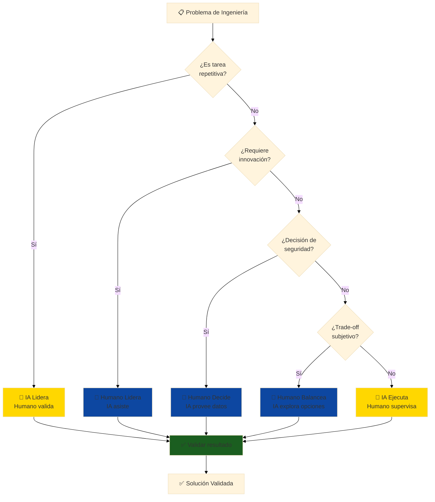

---

## 📋 Checklist: ¿Cuándo Confiar en IA?

Antes de aceptar resultado de IA, pregúntate:

### ✅ Confía (con validación) SI:

- [ ] La tarea es repetitiva y con patrón conocido
- [ ] El espacio de soluciones es finito y bien definido
- [ ] Puedes validar el resultado objetivamente (números, geometría, lógica)
- [ ] NO afecta seguridad crítica directamente
- [ ] Tienes datos históricos de referencia para comparar
- [ ] El error es recuperable (puedes rehacer si falla)
- [ ] Entiendes la lógica que IA debería seguir
- [ ] Puedes explicar el resultado a un colega ingeniero

**Acción**: Usa IA, pero **valida siempre** antes de proceder.

---

### ⚠️ Desconfía SI:

- [ ] Es la primera vez que resuelves este tipo de problema
- [ ] Requiere innovación o creatividad verdadera
- [ ] Involucra juicios de seguridad o regulaciones
- [ ] Hay trade-offs subjetivos (estética, preferencias, cultura)
- [ ] NO entiendes cómo IA llegó a ese resultado
- [ ] El resultado "parece demasiado bueno para ser verdad"
- [ ] Hay contexto implícito que IA no conoce (mercado, política, personas)
- [ ] Un error tendría consecuencias graves

**Acción**: Usa IA para **explorar opciones**, pero **TÚ decides** con análisis crítico.

---

### ❌ NUNCA Confíes SI:

- [ ] Decisión afecta seguridad de personas (vida/muerte)
- [ ] Certificación legal requiere firma de ingeniero
- [ ] Cliente/regulador exige responsabilidad humana
- [ ] Consecuencias de error son irreversibles
- [ ] No puedes explicar el resultado (black box total)

**Acción**: IA puede proveer **datos de entrada**, pero **humano toma decisión final**.

---

## 🔍 Señales de Alerta: Cuándo la IA "Alucina"

### Red Flags que indican resultado inválido:

1. **Números sospechosos**:
   - Esfuerzos negativos en estructuras simples (error de signos)
   - Factor de seguridad <1.0 (estructura fallaría)
   - Deformaciones que violan física (1000% elongación en aluminio)

2. **Contradicciones internas**:
   - "Estructura liviana pero muy resistente" (sin justificar cómo)
   - "Barato y de alta performance" (sin especificar trade-off)

3. **Ignorancia de restricciones**:
   - Geometría que no se puede fabricar
   - Materiales no disponibles en Paraguay
   - Procesos que requieren equipos inexistentes localmente

4. **Falta de incertidumbre**:
   - IA da respuestas con 100% confianza en problemas complejos
   - No menciona supuestos o limitaciones del análisis

**Qué hacer**: Si ves estas señales, **detente y valida manualmente** antes de proceder.

---

## 🎓 Casos de Estudio: Cuándo Confiar vs Desconfiar

### Caso 1: Diseño de Perfil Alar

**Escenario**: Necesitas diseñar perfil alar para UAV agrícola.

| Tarea | IA Rol | Humano Rol | Confianza |
|-------|--------|------------|-----------|
| Generar coordenadas NACA 0012 | **IA ejecuta** (ecuación conocida) | Valida espesor máximo | ✅ Alta |
| Seleccionar NACA 0012 vs 4415 | IA compara datos | **Humano decide** (depende de misión) | ⚠️ Media |
| Inventar perfil completamente nuevo | ❌ IA no puede | **Humano diseña** (requiere CFD + pruebas) | ❌ Nula |

---

### Caso 2: Análisis FEA de Larguero de Ala

**Escenario**: Validar resistencia de larguero principal.

| Tarea | IA Rol | Humano Rol | Confianza |
|-------|--------|------------|-----------|
| Ejecutar simulación FEA con carga estándar | **IA ejecuta** (script ANSYS) | Define condiciones de frontera | ✅ Alta |
| Interpretar zonas de alta tensión | IA identifica hotspots | **Humano interpreta** causa física | ⚠️ Media |
| Decidir si estructura es segura para vuelo | ❌ IA no puede | **Humano decide** con normativa | ❌ Nula |

---

## 💡 Consejos Prácticos para Uso Efectivo

### 1. Siempre Valida con "Sanity Checks"

```
Ejemplo en Análisis Estructural y Materiales:
- IA genera diseño estructural
- TÚ verificas:
  ✓ ¿Esfuerzos máximos son razonables? (<σy del material)
  ✓ ¿Factor de seguridad cumple normativa? (>1.5 para FAA)
  ✓ ¿Deformaciones son aceptables? (<L/360 típicamente)
  ✓ ¿Peso total es realista? (no 100g ni 500kg para estructura de UAV 3kg)
```

---

### 2. Documenta Supuestos de IA

Cuando uses IA, **anota**:
- ¿Qué datos de entrada usó?
- ¿Qué supuestos hizo implícitamente?
- ¿Qué restricciones NO consideró?

**Esto te salva** cuando cliente pregunta "¿por qué diseñaste así?" 6 meses después.

---

### 3. Usa IA para Explorar, Humano para Decidir

**Workflow correcto**:
1. IA genera 10 opciones de diseño estructural (rápido)
2. TÚ eliminas 7 por razones prácticas (contexto local)
3. IA simula las 3 restantes en detalle (acelera análisis)
4. TÚ seleccionas final considerando todos los factores

**Workflow INCORRECTO**:
1. IA genera 1 opción "óptima"
2. TÚ la aceptas sin cuestionar ❌

---

### 4. Mantén tu Criterio Afilado

**Peligro**: Si usas IA para TODO, pierdes habilidad de pensamiento crítico.

**Solución**: Alterna entre:
- Problemas resueltos con IA (velocidad)
- Problemas resueltos manualmente (mantener habilidad)

**Frecuencia sugerida**: 70% con IA, 30% manual (para entrenamiento continuo).

---

## 🎯 Resumen: Reglas de Oro

1. **IA acelera, NO reemplaza** tu conocimiento de ingeniería
2. **Siempre valida** resultados de IA antes de usar
3. **Nunca confíes en IA** para decisiones de seguridad crítica
4. **Documenta supuestos** cuando uses IA
5. **Mantén tu criterio afilado** con práctica manual regular
6. **Contexto local importa** (Paraguay ≠ USA ≠ Europa)
7. **Si no lo entiendes, no lo uses** (principio de responsabilidad)

---

## 🏢 Parte 1: Materiales Aeroespaciales (60 min)

### Concepto: Relación Resistencia-Peso

**Analogía**: Como elegir material para construir un puente - quieres el más fuerte que pese menos.

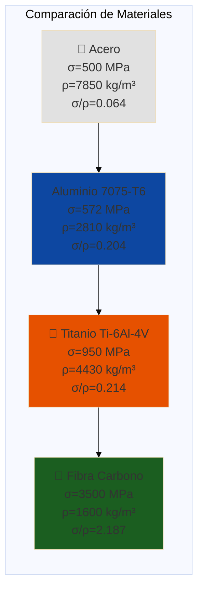

**Métrica clave**: **Resistencia específica** = σ/ρ (esfuerzo de fluencia / densidad)

### Materiales Metálicos

#### Aleaciones de Aluminio

**Familias principales en aviación**:

| Serie | Composición | Aplicación | Propiedades |
|-------|-------------|------------|-------------|
| **2xxx** | Al-Cu (4%) | Fuselaje, largueros | Alta resistencia, maquinable |
| **6xxx** | Al-Mg-Si | Piezas extruidas | Buena soldabilidad |
| **7xxx** | Al-Zn-Mg-Cu | Estructuras críticas | Máxima resistencia |

**Ejemplo: Aluminio 7075-T6** (el más usado en alas)

```
Propiedades mecánicas:
- Esfuerzo de fluencia (σy): 503 MPa
- Esfuerzo último (σu): 572 MPa
- Módulo de Young (E): 71.7 GPa
- Densidad (ρ): 2.81 g/cm³
- Elongación: 11%
- Resistencia a la fatiga: ~160 MPa (10⁷ ciclos)

Ventajas:
✅ Excelente relación resistencia/peso
✅ Fácil de maquinar (CNC)
✅ Disponible en Paraguay (importación)
✅ Conocimientos locales de fabricación

Desventajas:
❌ Baja resistencia a corrosión (requiere anodizado)
❌ No soldable (requiere remaches)
❌ Sensible a grietas por fatiga
```

#### Titanio (Ti-6Al-4V)

**Usado en zonas de alta temperatura y esfuerzo**:

```
Propiedades:
- σy: 880-950 MPa (según tratamiento térmico)
- E: 113.8 GPa
- ρ: 4.43 g/cm³
- Temperatura de trabajo: hasta 400°C

Aplicaciones en aeronaves:
- Montajes de motor (soporta calor)
- Tren de aterrizaje (impactos)
- Tornillos críticos
- Álabes de turbina (delanteros)

Costo: ~10× más caro que aluminio
```

### Materiales Compuestos

```mermaid
%%{init: {'theme':'base', 'themeVariables': {'fontSize':'18px'}}}%%
graph TD
    subgraph "Composite = Fibra + Matrix"
        A[🧵 Fibras<br/>Soportan carga]
        B[Matriz<br/>Distribuye esfuerzos]
        
        A --> C[💎 Carbon Fiber<br/>E=230 GPa<br/>σ=3500 MPa]
        A --> D[🔶 Glass Fiber<br/>E=70 GPa<br/>σ=2400 MPa]
        A --> E[🟡 Aramid (Kevlar)<br/>Alta tenacidad]
        
        B --> F[🧴 Epoxy<br/>Alta resistencia]
        B --> G[🌊 Polyester<br/>Económico]
        
        C --> H[✈️ COMPOSITE]
        F --> H
    end
    
    style C fill:#1b5e20
    style F fill:#0d47a1
    style H fill:#FFD700
```

**Fibra de Carbono / Epoxy** (CFRP - Carbon Fiber Reinforced Polymer)

```
Propiedades del laminado [0°] (unidireccional):
- E_longitudinal: 135-150 GPa
- E_transversal: 8-10 GPa (anisotrópico!)
- σ_tensión: 1500-2000 MPa
- σ_compresión: 1200-1500 MPa
- ρ: 1.55-1.60 g/cm³

Ventajas vs Aluminio:
✅ 40% más liviano para misma rigidez
✅ No se corroe
✅ Excelente resistencia a fatiga
✅ Formas complejas (moldeado)

Desventajas:
❌ Muy caro (5-20× aluminio)
❌ Difícil de reparar
❌ Requiere autoclave (fabricación)
❌ Sensible a impactos (delaminación)
```

### Selección de Material con OpenCode

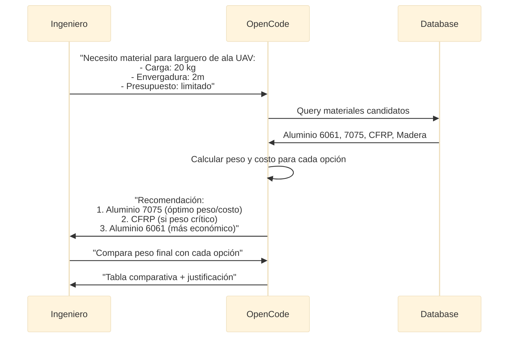

**Prompt para selección de material**:

```bash
opencode "Selecciona material para larguero principal de ala UAV:

ESPECIFICACIONES:
- Aplicación: UAV agrícola para monitoreo de soja (Paraguay)
- Envergadura: 2000mm
- Peso total UAV: 3 kg
- Carga alar: 0.5 kg/dm²
- Factor de carga: n = 3.5 (maniobras)
- Ambiente: Humedad 80%, temperatura 5-40°C
- Presupuesto: Limitado (construcción amateur)

REQUERIMIENTOS DEL LARGUERO:
- Sección: Rectangular 15mm × 20mm (inicial)
- Longitud: 1000mm (mitad de envergadura)
- Tipo de carga: Flexión (empotramiento en raíz)
- Carga máxima en punta: F = 3.5 × 1.5 kg = 5.25 kg

MATERIALES CANDIDATOS:
1. Aluminio 6061-T6 (fácil compra en Asunción)
2. Aluminio 7075-T6 (importación desde Argentina)
3. Fibra de carbono prepreg (importación, cara)
4. Madera de balsa + fibra de vidrio (tradicional aeromodelismo)

ANÁLISIS REQUERIDO:
1. Para cada material:
   - Calcular esfuerzo máximo en empotramiento
   - Factor de seguridad resultante
   - Peso del larguero
   - Deflexión máxima en punta
2. Comparar en tabla: Material | FS | Peso | Deflexión | Costo | Disponibilidad
3. Recomendar opción óptima considerando:
   - FS ≥ 1.5 (mínimo FAR 23)
   - Deflexión < 5% de envergadura
   - Costo/disponibilidad en Paraguay
   - Facilidad de fabricación amateur

INCLUIR:
- Cálculos paso a paso
- Diagrama de momento flector
- Justificación de recomendación
- Proveedores locales si aplica

Todo en español con contexto de construcción UAV en Paraguay"
```

### Propiedades Mecánicas Clave

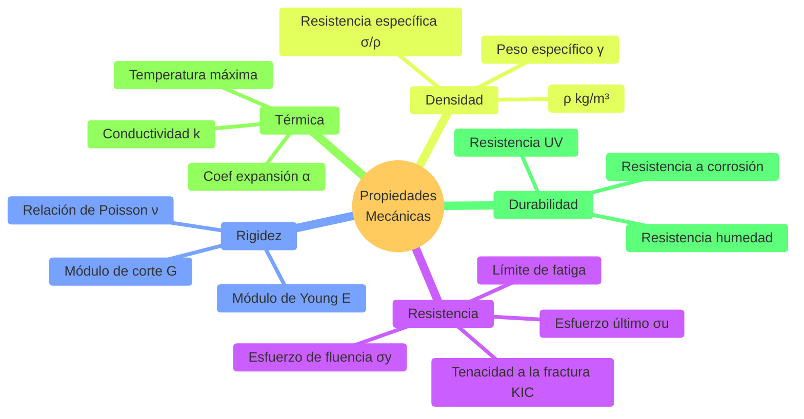

---

**🎯 Transición**: Ahora que conoces los materiales aeroespaciales disponibles (aluminio, titanio, composites) y sus propiedades clave (σ/ρ, resistencia, rigidez), el siguiente paso crítico es entender **cómo calcular los esfuerzos** que actuarán sobre esos materiales en vuelo. Saber que el aluminio 7075-T6 resiste 572 MPa no sirve si no puedes determinar si tu estructura experimentará 50 MPa o 600 MPa. En esta parte, aprenderás a calcular esfuerzos bajo diferentes tipos de carga aeronáutica.

## 🔬 Parte 2: Análisis de Esfuerzos (60 min)

### Concepto: Cargas en Estructuras Aeronáuticas

**Analogía**: Como las fuerzas que actúan sobre una viga de un puente cuando pasa un camión pesado.

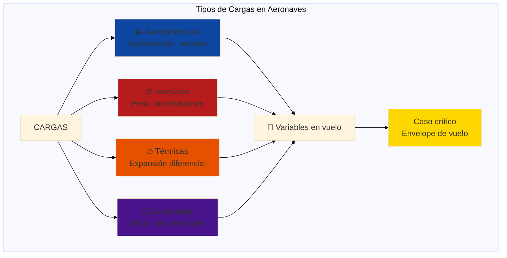

### Diagrama V-n (Envelope de Vuelo)

**Herramienta fundamental**: Define los límites operativos de la aeronave.

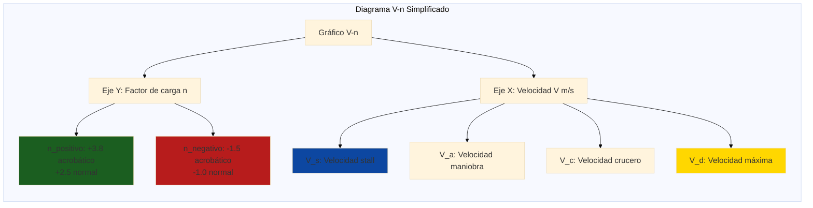

**Ejemplo UAV agrícola**:

```
Datos de diseño:
- Peso máximo: W = 3 kg × 9.81 = 29.43 N
- Velocidad stall: V_s = 10 m/s
- Velocidad máxima: V_d = 25 m/s
- Categoría: Normal (FAR 23)

Factores de carga (FAR 23.337):
- n_max = 2.1 + 24,000 / (W + 10,000)
  Para W = 3 kg → n_max ≈ 3.8
- n_min = -0.4 × n_max = -1.5

Carga máxima en ala:
L_max = n_max × W = 3.8 × 29.43 = 111.8 N ≈ 11.4 kg
```

### Análisis de Vigas (Larguero de Ala)

**Caso de estudio**: Larguero empotrado en raíz, carga distribuida elíptica.

```
MODELO SIMPLIFICADO (viga en voladizo):
================================

Geometría:
- Longitud L = 1000 mm (media envergadura)
- Empotramiento en fuselaje
- Carga distribuida q(x) aproximada como uniforme q₀

Carga distribuida (simplificación conservadora):
q₀ = L_max / L = 111.8 N / 1 m = 111.8 N/m

Momento flector máximo (en raíz):
M_max = (q₀ × L²) / 2
M_max = (111.8 × 1²) / 2 = 55.9 N⋅m

Fuerza cortante máxima (en raíz):
V_max = q₀ × L = 111.8 N

Deflexión máxima (en punta):
δ_max = (q₀ × L⁴) / (8 × E × I)
```

**Cálculo de esfuerzos en sección rectangular**:

```
Sección del larguero: b × h = 15 mm × 20 mm

Propiedades geométricas:
- Área: A = b × h = 300 mm²
- Momento de inercia: I = (b × h³) / 12
  I = (15 × 20³) / 12 = 10,000 mm⁴ = 1×10⁻⁸ m⁴

Esfuerzo de flexión (fibra extrema):
σ = M × c / I
Donde c = h/2 = 10 mm (distancia a fibra neutra)

σ_max = 55.9 × 0.010 / (1×10⁻⁸)
σ_max = 55.9 MPa

Esfuerzo cortante máximo (eje neutro):
τ_max = (3 × V_max) / (2 × A)
τ_max = (3 × 111.8) / (2 × 300×10⁻⁶)
τ_max = 0.56 MPa (despreciable vs flexión)
```

### Factor de Seguridad

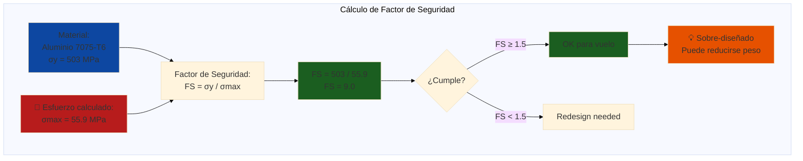

**Interpretación**:
- **FS = 9.0** es muy alto → estructura muy pesada
- **FAA requiere FS ≥ 1.5** para cargas límite
- **Objetivo diseño**: FS entre 1.5-2.5 (balance peso/seguridad)

**Optimización**: Reducir sección a 12mm × 16mm:

```
Nueva sección:
I_nuevo = (12 × 16³) / 12 = 4,096 mm⁴

σ_nuevo = 55.9 × 0.008 / (4.096×10⁻⁹) = 109.2 MPa

FS_nuevo = 503 / 109.2 = 4.6 ✅ (aún seguro)

Ahorro de peso:
Peso_original = ρ × A × L = 2810 kg/m³ × 300mm² × 1m = 84.3 g
Peso_nuevo = 2810 × (12×16) × 1 = 54.0 g
Ahorro: 30.3 g por larguero (36% reducción!)
```

### Implementación con OpenCode

```bash
opencode "Analiza el larguero de ala optimizado y verifica todos los criterios:

DATOS DEL LARGUERO OPTIMIZADO:
- Material: Aluminio 7075-T6 (σy=503 MPa, E=71.7 GPa, ρ=2810 kg/m³)
- Sección: Rectangular 12mm × 16mm
- Longitud: 1000mm (empotramiento voladizo)
- Carga distribuida: q₀ = 111.8 N/m (sustentación)
- Factor de carga: n = 3.8

ANÁLISIS COMPLETO REQUERIDO:
1. Diagrama de cuerpo libre con fuerzas
2. Ecuaciones de equilibrio
3. Diagrama de momento flector M(x)
4. Diagrama de fuerza cortante V(x)
5. Cálculo de esfuerzos:
   - σ_flexión máximo (raíz, fibra superior e inferior)
   - τ_cortante máximo (raíz, eje neutro)
   - Esfuerzo combinado (von Mises si aplicable)
6. Factor de seguridad:
   - FS_fluencia = σy / σmax
   - Verificar FS ≥ 1.5
7. Deflexión en punta:
   - δ_max usando fórmula de viga
   - Verificar δ_max < 5% envergadura (50mm)
8. Análisis de pandeo (Euler):
   - Carga crítica P_cr
   - FS_pandeo para carga de compresión
9. Peso del larguero y comparación vs opciones

INCLUIR:
- Todos los cálculos paso a paso
- Diagramas ASCII o descripción clara
- Resultado: ¿Diseño OK o necesita ajuste?
- Recomendaciones de mejora
- Consideraciones de fabricación (tolerancias, acabado)

TODO en español con explicaciones para estudiante de ingeniería"
```

---

**🎯 Transición**: Los cálculos manuales de esfuerzos (Parte 2) funcionan bien para geometrías simples (vigas, cilindros), pero las estructuras aeronáuticas reales son **complejas**: largueros con agujeros de alivio, costillas con nervaduras, uniones remachadas, geometrías curvas. Para estas estructuras, los cálculos analíticos son imposibles o extremadamente imprecisos. Aquí entra el **Análisis por Elementos Finitos (FEA)**: el método computacional que permite simular estructuras arbitrariamente complejas con precisión profesional. En esta parte, aprenderás a usar FEA para validar tus diseños.

## 💻 Parte 3: Análisis FEA con ANSYS (90 min)

### Concepto: Método de Elementos Finitos

**Analogía**: Como dividir un mapa grande en cuadrículas pequeñas para analizar cada zona detalladamente.

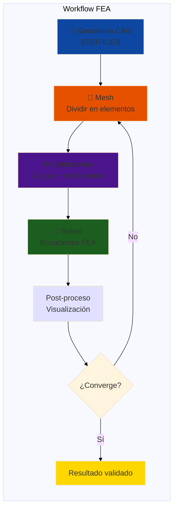

### Tutorial Paso a Paso: Larguero en ANSYS

**Herramientas**: ANSYS Mechanical (Student version - gratis)

#### Paso 1: Import Geometría

```
File → Import → External Geometry File
- Seleccionar larguero_ala.stp (exportado de Fusion 360)
- Verificar unidades: mm
- Generar bodies
```

#### Paso 2: Asignar Material

```
Engineering Data:
1. Crear nuevo material: "Aluminum_7075_T6"
2. Propiedades:
   - Density: 2.81e-6 kg/mm³
   - Young's Modulus: 71,700 MPa
   - Poisson's Ratio: 0.33
   - Yield Strength: 503 MPa
   - Tensile Ultimate: 572 MPa

Geometry → Material Assignment:
- Seleccionar body del larguero
- Assign: Aluminum_7075_T6
```

#### Paso 3: Mesh Generation

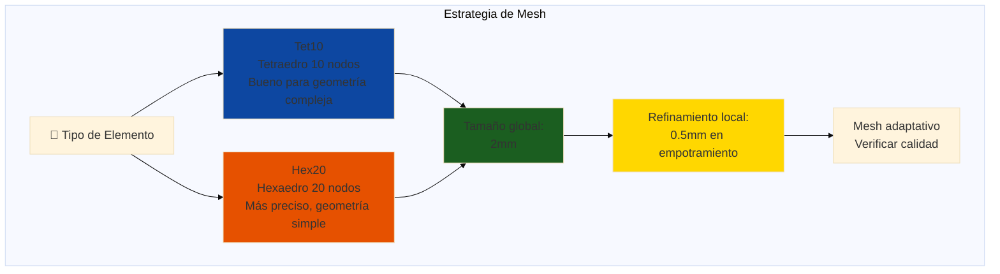

**Configuración en ANSYS**:

```
Mesh → Sizing:
- Element Size: 2 mm (global)
- Transition: Smooth
- Span Angle Center: Fine

Face Sizing (refinamiento):
- Seleccionar cara de empotramiento
- Element Size: 0.5 mm
- Behavior: Hard

Generate Mesh:
- Nodes: ~15,000
- Elements: ~8,000
- Skewness: < 0.7 (OK)
- Orthogonal Quality: > 0.3 (OK)
```

#### Paso 4: Condiciones de Contorno

**Fixed Support (empotramiento)**:

```
Supports → Fixed Support:
- Seleccionar cara en raíz del larguero
- Fija todos los DOF (Degrees of Freedom):
  * Translación X, Y, Z = 0
  * Rotación X, Y, Z = 0
```

**Carga distribuida**:

```
Loads → Pressure (simulando sustentación):
- Seleccionar cara superior del larguero
- Magnitude: 
  p = F_total / Área_cara
  p = 111.8 N / (1000mm × 12mm)
  p = 9.32×10⁻³ N/mm² = 9.32 kPa

O usar Force → Remote Force:
- Force: 111.8 N (en -Y)
- Location: Punta del larguero (X=1000mm)
```

#### Paso 5: Solve

```
Analysis Settings:
- Type: Static Structural
- Large Deflection: Off (pequeñas deflexiones)
- Solver Type: Direct

Solve → Run
- Tiempo estimado: 1-3 minutos (PC normal)
- Convergencia: Residual < 1e-6
```

#### Paso 6: Post-Procesamiento

**Resultados a extraer**:

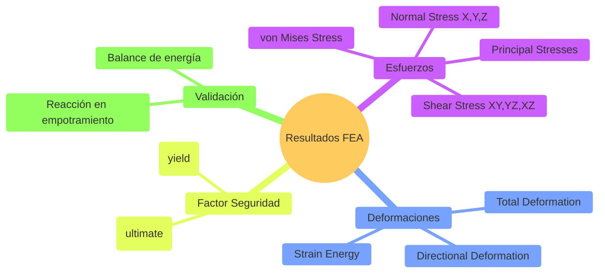

**Verificar resultados**:

```
Solution → Stress → Equivalent (von Mises):
- Máximo: ~110 MPa (en empotramiento) ✅ coincide con cálculo manual
- Distribución: Decae desde raíz a punta

Solution → Deformation → Total:
- Máximo: ~8.5 mm (en punta)
- % envergadura: 8.5/1000 = 0.85% < 5% ✅ OK

Solution → Safety Tool → Factor of Safety:
- Mínimo: 4.58 (en empotramiento) ✅ > 1.5
- Promedio: ~15 (resto de estructura)

Solution → Probes → Reaction Force:
- Fuerza Y: -111.8 N ✅ coincide con carga aplicada
- Momento X: -55.9 N⋅m ✅ coincide con M_max calculado
```

### Análisis de Convergencia

**Critical**: Verificar que la solución no depende del tamaño de mesh.

```
Procedimiento:
1. Mesh grueso: 4mm → σ_max = 115 MPa
2. Mesh medio: 2mm → σ_max = 110 MPa
3. Mesh fino: 1mm → σ_max = 109 MPa
4. Mesh muy fino: 0.5mm → σ_max = 109.2 MPa

Convergencia: Diferencia < 1% entre últimos dos → OK
```

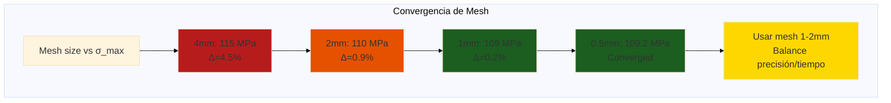

### Implementación con OpenCode

```bash
opencode "Genera script Python para automatizar análisis FEA paramétrico en ANSYS:

OBJETIVO:
Crear script que analice el larguero de ala con diferentes secciones transversales y encuentre la óptima.

PARÁMETROS VARIABLES:
- Ancho (b): 10mm, 12mm, 14mm, 16mm
- Alto (h): 14mm, 16mm, 18mm, 20mm
- Total: 16 combinaciones

ANÁLISIS PARA CADA COMBINACIÓN:
1. Generar geometría (box)
2. Asignar material Aluminum 7075-T6
3. Mesh automático (2mm)
4. Fixed support en cara raíz
5. Pressure load en cara superior (9.32 kPa)
6. Solve static structural
7. Extraer:
   - σ_von_Mises_max
   - δ_total_max
   - Factor de seguridad (FS = 503/σ_max)
   - Peso = ρ × Volumen

TECNOLOGÍA:
- Python + PyANSYS (ansys.mechanical.core)
- O usar ANSYS APDL scripts

OUTPUT:
- Tabla CSV: b, h, σ_max, δ_max, FS, Peso
- Gráfico: Peso vs FS (Pareto front)
- Recomendación: Sección óptima (mín peso con FS≥1.5)

INCLUIR:
- Código comentado
- Manejo de errores
- Progress bar
- Validación de resultados

TODO en español para estudiantes FPUNA"
```

---

**🎯 Transición**: Hasta ahora, has aprendido a **verificar** que una estructura es segura (materiales adecuados, esfuerzos calculados, FEA validado). Pero la ingeniería aeronáutica no se trata solo de seguridad—se trata de **eficiencia extrema**. ¿Tu estructura puede ser un 20% más liviana sin perder resistencia? ¿Existe una geometría mejor que no se te ocurrió? Aquí entra la **optimización estructural**: técnicas matemáticas y de IA que encuentran el diseño óptimo automáticamente. En esta parte, verás cómo la optimización topológica y el diseño generativo pueden revolucionar tu flujo de trabajo.

## 🎯 Parte 4: Optimización Estructural (30 min)

### Concepto: Diseño Óptimo

**Objetivo**: Minimizar peso manteniendo resistencia y rigidez requeridas.

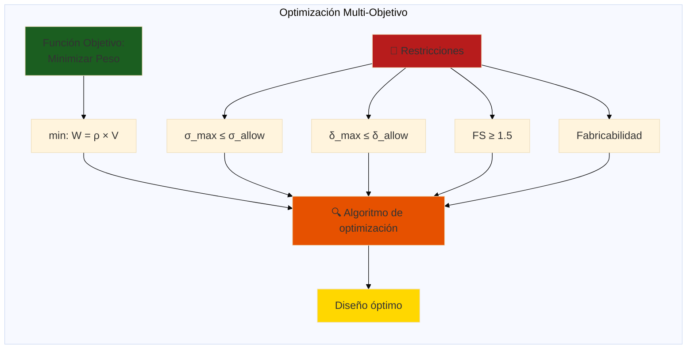

### Estrategias de Optimización

#### 1. Optimización Paramétrica

**Variar dimensiones dentro de rangos**:

```python
# Pseudocódigo
for b in range(10, 20, 2):  # mm
    for h in range(14, 22, 2):  # mm
        I = (b * h**3) / 12
        sigma_max = M_max * (h/2) / I
        FS = sigma_yield / sigma_max
        
        if FS >= 1.5:
            weight = rho * b * h * L
            candidates.append((b, h, weight, FS))

optimal = min(candidates, key=lambda x: x[2])  # Mínimo peso
```

#### 2. Optimización Topológica (ANSYS)

**Remover material innecesario automáticamente**:

```
ANSYS Topology Optimization:
1. Define design region (región donde puede quitar material)
2. Objective: Minimize mass
3. Constraints:
   - σ_max ≤ 503/1.5 = 335 MPa
   - δ_max ≤ 50 mm
4. Run optimization (50 iteraciones)
5. Resultado: Geometría orgánica (similar a hueso)

Resultado típico: 30-50% reducción de peso
```

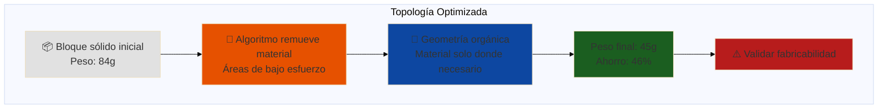

#### 3. Secciones Eficientes

**Usar perfiles en I, T, C en vez de rectangular**:

```
Comparación de secciones para misma rigidez:

Rectangular: b=12mm, h=16mm
- Área: 192 mm²
- I_z: 4,096 mm⁴
- Peso: 54 g

Perfil I: flanges 12×3mm, web 10mm×2mm
- Área: 92 mm²
- I_z: ~4,200 mm⁴ (similar)
- Peso: 26 g
- Ahorro: 52% ✅

¿Por qué es mejor?
- Material alejado del eje neutro → mayor I con menos área
- Principio: "Tubos huecos son más rígidos que sólidos del mismo peso"
```

### Caso Real: Optimización de Costilla de Ala

**Problema**: Costilla conecta piel superior e inferior del ala, debe:
- Mantener forma del perfil aerodinámico
- Soportar cargas de corte
- Ser liviana (múltiples costillas en un ala)

**Diseño inicial**: Chapa plana de aluminio 2mm

```
Peso inicial: ~150g por costilla
Ala con 10 costillas: 1.5 kg
```

**Optimización con lightening holes**:

```
Costilla con agujeros circulares:
- Diámetro agujeros: 30-50mm
- Espaciado: 60mm
- Conservar material en bordes (refuerzo)

Resultado FEA:
- σ_max aumenta 15% (todavía seguro)
- Peso reduce a ~85g
- Ahorro total: 650g en ala completa!
```

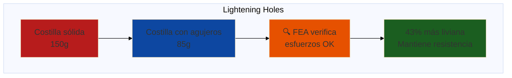

### Implementación con OpenCode

```bash
opencode "Diseña costilla de ala optimizada con lightening holes:

ESPECIFICACIONES:
- Perfil alar: NACA 4412
- Cuerda: 300mm
- Altura máxima: 36mm (12% cuerda)
- Material: Aluminio 2024-T3 (chapa 2mm)
- Cargas: Cortante V=50N, momento torsor T=2 N⋅m

DISEÑO INICIAL:
- Costilla plana siguiendo contorno NACA 4412
- Espesor: 2mm
- Sin agujeros
- Flanges superior/inferior para rivetado a piel

OPTIMIZACIÓN REQUERIDA:
1. Definir patrón de lightening holes:
   - Diámetro inicial: 40mm
   - Espaciado: 60mm
   - Mantener 15mm de borde
2. Calcular reducción de peso
3. Análisis FEA:
   - Modelo con y sin agujeros
   - Comparar σ_max (von Mises)
   - Verificar buckling local
4. Iterar diámetro de agujeros hasta:
   - Máximo ahorro peso
   - Mantener FS ≥ 1.5
5. Diseño final con refuerzos si necesario

INCLUIR:
- Sketch de costilla con dimensiones
- Tabla comparativa (sólida vs optimizada)
- Recomendación de fabricación
- Proceso de deburring (agujeros sin rebabas)

Contexto: Ala de UAV para agricultura en Paraguay, fabricación con CNC router"
```

---

**🎯 Transición**: Las técnicas que has dominado hasta ahora (selección de materiales, cálculo de esfuerzos, FEA, optimización) cubren el **90% de los problemas estructurales** que encontrarás. Pero la ingeniería aeronáutica tiene desafíos únicos que requieren atención especial: el **pandeo** (colapso súbito bajo compresión), la **fatiga** (fallas tras miles de ciclos de carga), y las **uniones** (donde las piezas se conectan, creando concentraciones de esfuerzo). En esta parte final, aprenderás a manejar estos casos especiales que separan un diseño promedio de uno profesional.

## 🔧 Parte 5: Casos Especiales (30 min)

### Análisis de Fatiga

**Problema**: Las estructuras aeronáuticas sufren cargas cíclicas (despegue/aterrizaje, ráfagas) que pueden causar fallas por fatiga incluso a esfuerzos bajos.

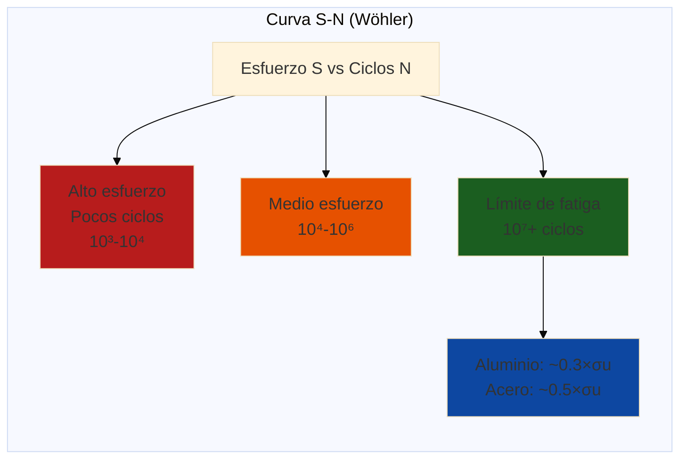

**Vida útil estimada**:

```
Para Aluminio 7075-T6:
- σ_ultimate = 572 MPa
- Límite fatiga (10⁷ ciclos): ~170 MPa

Nuestro larguero:
- σ_max = 109 MPa
- Ratio: 109/170 = 0.64

Usando curva S-N típica:
- Ciclos esperados: >10⁸ (prácticamente infinito para UAV)
- Vida útil: 5,000 vuelos × 50 ciclos/vuelo = 250,000 ciclos ✅
```

**Factores que reducen vida de fatiga**:
- ❌ Concentradores de esfuerzo (agujeros, esquinas vivas)
- ❌ Corrosión (degrada superficie)
- ❌ Temperatura elevada
- ❌ Cargas de impacto

### Pandeo de Columnas

**Problema**: Elementos comprimidos pueden fallar por pandeo antes de alcanzar σ_yield.

```
Carga crítica de Euler:
P_cr = (π² × E × I) / (K × L)²

Donde:
- E: Módulo de Young
- I: Momento de inercia mínimo
- L: Longitud efectiva
- K: Factor de longitud efectiva
  K=1.0 (empotrado-libre, voladizo)
  K=0.5 (empotrado-empotrado)
  K=0.7 (empotrado-articulado)

Ejemplo: Puntal del tren de aterrizaje
L = 300mm, sección circular d=10mm, empotrado-articulado

I = π×d⁴/64 = π×10⁴/64 = 491 mm⁴
P_cr = (π²×71,700×491) / (0.7×300)² = 7,896 N

Si P_aplicada = 500N (3×peso UAV):
FS_pandeo = 7,896/500 = 15.8 ✅ muy seguro
```

### Uniones (Joints)

**Tipos comunes en estructuras aeronáuticas**:

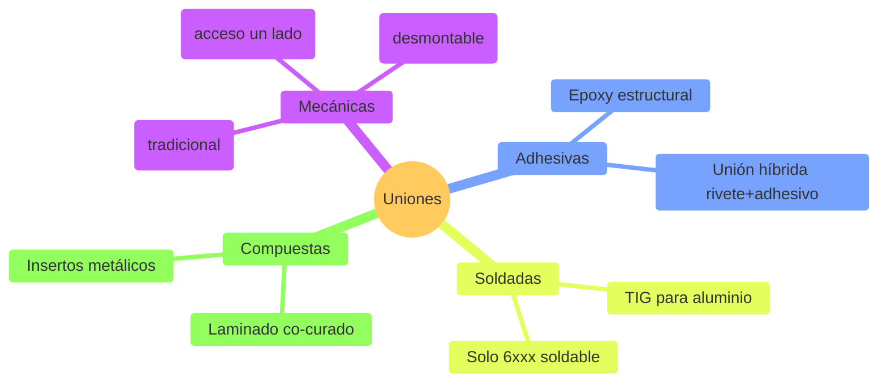

**Diseño de unión con remaches**:

```
Caso: Unir larguero (Al 7075) a costilla (Al 2024)

Remaches: Aluminio 2117-T4 (universal)
- Diámetro: d = 3.2 mm (1/8")
- Resistencia a cortante por remache: τ_allow = 140 MPa

Carga de cortante en unión: V = 111.8 N

Número de remaches necesarios:
A_remache = π×d²/4 = 8.04 mm²
F_remache = τ_allow × A × FS_joint
F_remache = 140 × 8.04 / 1.5 = 751 N

N_remaches = V / F_remache = 111.8 / 751 = 0.15
→ Usar 2 remaches (uno cada lado del larguero) ✅

Espaciado de remaches:
- Mínimo: 3d = 9.6mm (evitar tear-out)
- Máximo: 12t = 24mm (evitar buckling local)
- Distancia al borde: 2.5d = 8mm
```

---

## 🎯 Ejercicio Práctico: Análisis Completo de Empenaje

### Objetivo

Diseñar y validar la estructura del empenaje vertical del UAV agrícola.

### Especificaciones

**Cargas de diseño**:
```
Momento aerodinámico en timón: M = 8 N⋅m
Factor de carga: n = 3.8
Velocidad máxima: 25 m/s
```

**Geometría**:
```
Cuerda raíz: 250mm
Cuerda punta: 150mm
Altura: 400mm
Perfil: NACA 0012 (simétrico)
Flecha: 20°
```

**Material opciones**:
1. Aluminio 6061-T6 (chapa 1.5mm)
2. Fibra de vidrio/epoxy (laminado 3 capas)
3. Espuma EPP + 1 capa fibra carbono

### Tareas

#### 1. Selección de Material (30 min)

```bash
opencode "Compara las tres opciones de material para empenaje vertical:

CARGAS:
- Momento torsor: T = 8 N⋅m × 3.8 = 30.4 N⋅m
- Fuerza lateral: F = 15 N
- Presión de aire: q = 0.5 × ρ × V² = 0.5 × 1.225 × 25² = 383 Pa

CRITERIOS DE SELECCIÓN:
1. Peso (objetivo: <100g)
2. Rigidez (deflexión punta <10mm)
3. Resistencia (FS ≥ 1.5)
4. Costo (presupuesto limitado)
5. Fabricabilidad (herramientas disponibles Paraguay)

PARA CADA MATERIAL:
- Calcular peso aproximado
- Estimar esfuerzos máximos
- Evaluar deflexión
- Analizar proceso de fabricación
- Estimar costo (proveedores Asunción)

RECOMENDAR opción óptima con justificación"
```

#### 2. Diseño Estructural Detallado (60 min)

Usando el material seleccionado:
- Diseñar larguero principal (spar)
- Diseñar costillas (ribs) - cantidad y posición
- Diseñar piel (skin) - espesor y refuerzos
- Definir uniones (remaches o adhesivo)

#### 3. Análisis FEA (45 min)

```
Setup en ANSYS:
1. Import geometría del empenaje
2. Mesh: 2mm global, 0.5mm en uniones
3. Fixed support en raíz (montaje al fuselaje)
4. Cargas:
   - Presión 383 Pa en cara lateral
   - Momento 30.4 N⋅m en bisagra del timón
5. Solve static + buckling analysis
6. Extraer resultados:
   - σ_von_Mises max
   - Deflexión punta
   - Factor de seguridad
   - Modos de pandeo
```

#### 4. Documentación (45 min)

Crear reporte técnico con:
- Memoria de cálculo (cálculos manuales)
- Resultados FEA (capturas con leyenda)
- Planos de fabricación (vistas 2D con acotaciones)
- Bill of Materials (lista de materiales con cantidades)
- Procedimiento de fabricación paso a paso
- Estimación de costo total

### Entrega

```
Carpeta: empenaje_vertical/
├── calculos.pdf          # Memoria de cálculo
├── ansys/                # Archivos ANSYS (.wbpj)
├── planos/               # Drawings 2D (.pdf)
├── modelo_3d/            # CAD (.step)
└── reporte_final.pdf     # Documento completo
```

**Criterios de evaluación**:
- Cálculos correctos (30%)
- Análisis FEA apropiado (30%)
- Diseño fabricable (20%)
- Documentación clara (20%)

---

## ✅ Checklist de Diseño Estructural

Antes de aprobar un diseño estructural:

### Análisis
- [ ] Identificadas todas las cargas (aerodinámicas, inerciales, térmicas)
- [ ] Casos de carga críticos analizados
- [ ] Diagrama V-n aplicado correctamente
- [ ] Esfuerzos calculados (flexión, cortante, torsión)
- [ ] Factor de seguridad ≥ 1.5 en todos los puntos

### FEA
- [ ] Mesh convergió (diferencia <2% al refinar)
- [ ] Condiciones de contorno realistas
- [ ] Resultados validados vs cálculos manuales
- [ ] Análisis de sensibilidad realizado
- [ ] Modos de falla identificados (yielding, buckling, fatigue)

### Materiales
- [ ] Material seleccionado justificado
- [ ] Propiedades mecánicas verificadas
- [ ] Disponibilidad en Paraguay confirmada
- [ ] Costo dentro de presupuesto
- [ ] Proceso de fabricación definido

### Fabricabilidad
- [ ] Tolerancias de manufactura especificadas
- [ ] Acceso de herramientas considerado
- [ ] Proceso de ensamblaje definido
- [ ] Control de calidad planificado
- [ ] Reparabilidad considerada

### Documentación
- [ ] Memoria de cálculo completa
- [ ] Planos de fabricación generados
- [ ] Bill of Materials (BOM) creado
- [ ] Procedimientos de inspección
- [ ] Trazabilidad de materiales

---

## 🎓 Mejores Prácticas de Diseño Estructural

### ✅ HACER

1. **Diseño iterativo** - No esperes perfección en primera iteración
2. **Validar con múltiples métodos** - Cálculo manual + FEA + pruebas físicas
3. **Factor de seguridad apropiado** - 1.5-2.0 para estructuras aeronáuticas
4. **Considerar fabricación temprano** - Diseño fácil de fabricar = menos errores
5. **Documentar decisiones** - Por qué elegiste ese material, esa configuración
6. **Benchmark con aeronaves similares** - Aprender de diseños probados
7. **Usar materiales estándar** - Facilita compra y reemplazo
8. **Diseño modular** - Componentes intercambiables, reparables

### ❌ NO HACER

1. **Sobre-diseñar sin criterio** - FS=10 significa mucho peso desperdiciado
2. **Ignorar modos de falla secundarios** - Pandeo, fatiga, delaminación
3. **Confiar ciegamente en FEA** - Garbage in, garbage out
4. **Copiar sin entender** - Cada diseño tiene sus razones específicas
5. **Usar materiales exóticos sin necesidad** - Complica fabricación y costo
6. **Descuidar uniones** - Mayoría de fallas ocurren en conexiones
7. **Olvidar inspección** - Planear cómo detectar daños en servicio
8. **Diseñar sin considerar cargas de servicio** - Maniobras, ráfagas, aterrizajes duros

---

## 🎉 Resumen del Módulo

### Lo Que Dominaste

✅ **Materiales aeroespaciales** - Aluminio, titanio, composites  
✅ **Análisis de esfuerzos** - Flexión, cortante, torsión, pandeo  
✅ **FEA profesional** - ANSYS Mechanical para validación  
✅ **Optimización estructural** - Peso mínimo con resistencia garantizada  
✅ **Factores de seguridad** - Aplicación de normativas FAA/EASA  
✅ **OpenCode para estructuras** - Asistente de ingeniería estructural

### Próximo Paso

**Continúa con**: [Módulo 04 - Sistemas de Propulsión](./04-sistemas-propulsion.md)

Llevarás tus estructuras diseñadas y las integrarás con sistemas de propulsión para analizar performance completo.

---

## 💭 Reflexión

1. **¿Por qué el factor de seguridad en aviación es menor que en construcción civil?**
2. **¿Cuándo vale la pena usar materiales compuestos vs aluminio?**
3. **¿Cómo OpenCode puede ayudarte a aprender FEA más rápido?**

**Comparte en Slack** (#ingenieria-aeronautica)

---

## 📝 Quiz de Evaluación

### Instrucciones

- **Total**: 10 preguntas
- **Tiempo estimado**: 25-30 minutos
- **Aprobación**: 7+ respuestas correctas
- **Propósito**: Verificar comprensión de estructuras aeronáuticas, materiales, y FEA

**Nota**: Este quiz cubre los conceptos fundamentales del módulo. Puedes usar calculadora.

---

### Preguntas

#### 1. Relación Resistencia-Peso (Múltiple Opción)

¿Cuál material tiene la MEJOR relación resistencia-peso (σ/ρ) para aplicaciones aeronáuticas?

a) Acero estructural (σ/ρ = 0.064)  
b) Aluminio 7075-T6 (σ/ρ = 0.204)  
c) Titanio Ti-6Al-4V (σ/ρ = 0.214)  
d) Fibra de carbono (σ/ρ = 2.187)

---

#### 2. Factor de Seguridad (Múltiple Opción)

En aviación civil (FAA/EASA), el factor de seguridad mínimo para estructuras primarias es:

a) FS = 1.0 (sin margen)  
b) FS = 1.5 (certificación aeronáutica)  
c) FS = 3.0 (como construcción civil)  
d) FS = 5.0 (máxima seguridad)

---

#### 3. Análisis FEA - Conceptual (Verdadero/Falso)

**Afirmación**: "Un mesh más fino en FEA SIEMPRE produce resultados más precisos sin inconvenientes."

a) Verdadero  
b) Falso

---

#### 4. Tipos de Esfuerzo (Múltiple Opción)

Un larguero de ala bajo carga de sustentación experimenta principalmente:

a) Esfuerzo de tensión puro  
b) Esfuerzo de compresión puro  
c) Esfuerzo de flexión (combinado tensión-compresión)  
d) Esfuerzo cortante puro

---

#### 5. Criterio de Falla (Múltiple Opción)

Para materiales dúctiles (como aluminio aeronáutico), el criterio de falla más usado es:

a) Criterio de Esfuerzo Máximo (σmax < σy)  
b) Criterio de von Mises (σvm < σy)  
c) Criterio de Mohr-Coulomb  
d) Criterio de Rankine

---

#### 6. Pandeo (Buckling) (Verdadero/Falso)

**Afirmación**: "El pandeo SOLO ocurre en elementos bajo compresión, no en tensión."

a) Verdadero  
b) Falso

---

#### 7. Cálculo Práctico - Esfuerzo (Respuesta Corta)

Una costilla de ala soporta una carga de 5000 N distribuida en un área de 200 cm² (0.02 m²).

**Calcula el esfuerzo (σ) en MPa.**

Fórmula: σ = F/A

**Tu respuesta**: _______ MPa

---

#### 8. Materiales Compuestos (Múltiple Opción)

¿Cuál es la PRINCIPAL ventaja de fibra de carbono vs aluminio en aviación?

a) Mucho más barato  
b) Más fácil de reparar  
c) Relación resistencia-peso superior  
d) Mejor resistencia a corrosión

---

#### 9. Normativas Aeronáuticas (Múltiple Opción)

¿Qué normativa regula la aeronavegabilidad en Paraguay?

a) FAA Part 25 (USA)  
b) EASA CS-25 (Europa)  
c) DINAC RAC 21 (Paraguay, basado en FAA)  
d) ISO 9001 (calidad genérica)

---

#### 10. OpenCode para Estructuras (Respuesta Corta)

Menciona **2 formas específicas** en que OpenCode puede acelerar el análisis estructural aeronáutico.

**Ejemplo válido**: "Generar scripts de Python para calcular factores de seguridad automáticamente"

**Tus respuestas**:
1. _______________________________________
2. _______________________________________

---

## 📋 Respuestas y Explicaciones

### 1. Relación Resistencia-Peso
**Respuesta correcta**: **d) Fibra de carbono (σ/ρ = 2.187)**

**Explicación**: La fibra de carbono tiene la relación resistencia-peso más alta (2.187), aproximadamente **10x mejor** que el aluminio (0.204). Por eso es preferida en aeronaves modernas (Boeing 787, Airbus A350) donde el peso es crítico.

**Comparación**:
- Acero: 0.064 (muy pesado)
- Aluminio: 0.204 (estándar histórico)
- Titanio: 0.214 (ligeramente mejor que Al, pero caro)
- Carbono: 2.187 (campeón indiscutible)

---

### 2. Factor de Seguridad
**Respuesta correcta**: **b) FS = 1.5 (certificación aeronáutica)**

**Explicación**: La aviación usa FS = 1.5 (FAA/EASA) porque:
- Diseño basado en análisis riguroso (no solo empírico)
- Control estricto de fabricación y materiales
- Inspecciones periódicas obligatorias
- Cada gramo cuenta (peso = combustible = costo)

Construcción civil usa FS = 3-5 porque tiene más incertidumbres y no se inspecciona constantemente.

---

### 3. Análisis FEA - Mesh Fino
**Respuesta correcta**: **b) Falso**

**Explicación**: Un mesh más fino:
- ✅ **Sí** aumenta precisión (más elementos = más detalle)
- ❌ **Pero** aumenta tiempo de cálculo exponencialmente
- ❌ **Pero** aumenta uso de memoria (puede colapsar PC)
- ❌ **Pero** puede introducir errores numéricos (ill-conditioning)

**Balance óptimo**: Mesh fino en zonas críticas (concentración de esfuerzos), mesh grueso en zonas simples.

---

### 4. Tipos de Esfuerzo en Larguero
**Respuesta correcta**: **c) Esfuerzo de flexión (combinado tensión-compresión)**

**Explicación**: Un larguero bajo sustentación actúa como viga en flexión:
- **Parte superior**: compresión (fibras acortadas)
- **Parte inferior**: tensión (fibras alargadas)
- **Eje neutro**: sin esfuerzo

Esto es flexión pura, no tensión o compresión uniforme.

---

### 5. Criterio de Falla para Dúctiles
**Respuesta correcta**: **b) Criterio de von Mises (σvm < σy)**

**Explicación**: Para materiales dúctiles (aluminio, acero):
- **von Mises** es el estándar industrial
- Considera estado triaxial de esfuerzos
- Predice falla por plasticidad (inicio de deformación permanente)

**Fórmula**:
```
σvm = √(σx² - σxσy + σy² + 3τxy²) < σy
```

Criterio de Esfuerzo Máximo es más conservador pero menos preciso.

---

### 6. Pandeo (Buckling)
**Respuesta correcta**: **a) Verdadero**

**Explicación**: El pandeo es un fenómeno de **inestabilidad bajo compresión**:
- Elementos esbeltos bajo compresión pueden fallar súbitamente (colapso lateral)
- Carga crítica de Euler: Pcr = π²EI / L²
- **NO ocurre en tensión** (tensión estabiliza la estructura)

**Ejemplos aero**:
- Paneles de fuselaje bajo presurización negativa
- Montantes de tren de aterrizaje bajo carga de aterrizaje

---

### 7. Cálculo de Esfuerzo
**Respuesta correcta**: **0.25 MPa**

**Cálculo**:
```
Datos:
F = 5000 N
A = 200 cm² = 0.02 m²

σ = F/A = 5000 N / 0.02 m² = 250,000 Pa = 0.25 MPa
```

**Conversión clave**: 1 MPa = 1,000,000 Pa

**Interpretación**: 0.25 MPa es un esfuerzo MUY bajo (aluminio falla a ~500 MPa). Esta costilla está segura con FS >> 1000.

---

### 8. Ventaja Principal de Fibra de Carbono
**Respuesta correcta**: **c) Relación resistencia-peso superior**

**Explicación**:
- **Resistencia-peso**: 10x mejor que aluminio (ventaja clave)
- **Costo**: ❌ Mucho MÁS caro (~$30/kg vs $3/kg)
- **Reparabilidad**: ❌ Más difícil (requiere autoclaves, técnicas especiales)
- **Corrosión**: ✅ Mejor, pero no es la razón principal de uso

**Trade-off**: Vale la pena en aviación comercial (ahorro combustible > costo inicial), pero no en aviación general pequeña.

---

### 9. Normativa en Paraguay
**Respuesta correcta**: **c) DINAC RAC 21 (Paraguay, basado en FAA)**

**Explicación**:
- **DINAC** (Dirección Nacional de Aviación Civil) es la autoridad aeronáutica paraguaya
- **RAC 21** (Reglamento Aeronáutico Civil 21): Certificación de productos aeronáuticos
- Basado en FAA (USA) pero adaptado al contexto paraguayo
- Requisitos similares a FAA Part 21, Part 25, etc.

**En la práctica**: Para certificación internacional, aeronaves deben cumplir FAA O EASA además de DINAC.

---

### 10. OpenCode para Estructuras
**Respuestas válidas** (ejemplo):

1. **"Generar scripts de Python para calcular factores de seguridad automáticamente"**
   - OpenCode puede escribir código para calcular FS en múltiples puntos de una estructura

2. **"Automatizar generación de meshes en software FEA"**
   - Scripts para crear meshes adaptativos, refinar zonas críticas

3. **"Crear documentación técnica (informes FEA) automáticamente"**
   - Formatear resultados, generar tablas, insertar imágenes

4. **"Optimizar geometrías iterativamente (diseño generativo)"**
   - Bucles de optimización: cambiar parámetro → FEA → evaluar → repetir

5. **"Validar cálculos manuales con código Python"**
   - Verificar fórmulas, detectar errores

**Criterio**: Respuesta debe ser **específica** (no "ayuda con todo") y **técnicamente válida**.

---

## 📊 Criterios de Evaluación

### Interpretación de Resultados

| Puntaje | Calificación | Recomendación |
|---------|--------------|---------------|
| **9-10** | 🏆 Excelente | Dominio sólido. Listo para proyecto capstone. |
| **7-8** | ✅ Aprobado | Comprensión buena. Repasa temas con 1-2 errores. |
| **5-6** | ⚠️ Suficiente | Comprensión parcial. Repasa TODO el módulo antes de capstone. |
| **< 5** | ❌ Insuficiente | Vuelve a estudiar módulo completo. Consulta instructor. |

### Desglose por Tema

| Preguntas | Tema | Peso |
|-----------|------|------|
| 1, 8 | Materiales Aeroespaciales | 20% |
| 2, 6, 9 | Diseño Estructural y Normativas | 30% |
| 3, 4, 5, 7 | Análisis FEA y Esfuerzos | 40% |
| 10 | Aplicación de IA (OpenCode) | 10% |

**Si fallas 2+ preguntas del mismo tema**: Repasa esa sección específica.

### Próximos Pasos

**Si aprobaste (7+)**:
1. ✅ Continúa a Módulo 04 (Sistemas de Propulsión)
2. ✅ Comienza a pensar en proyecto capstone
3. ✅ Practica con software FEA (opcional pero recomendado)

**Si no aprobaste (< 7)**:
1. ⏸️ **Pausa** antes de seguir
2. 📖 Repasa secciones donde fallaste
3. 🤝 Consulta con instructor en office hours
4. 🔄 Reintenta quiz (versión alternativa disponible)

---

## 📚 Recursos Adicionales

### Software (Gratuito para Estudiantes)

- **ANSYS Student** - [ansys.com/student](https://www.ansys.com/academic/students) (gratis, limitado a 32k nodos)
- **Fusion 360 FEA** - Incluido en licencia educativa
- **CalculiX** - [calculix.de](http://www.calculix.de/) (open-source, FEA completo)
- **PrePoMax** - [prepomax.fs.um.si](https://prepomax.fs.um.si/) (GUI para CalculiX)

### Bases de Datos de Materiales

- **MatWeb** - [matweb.com](http://www.matweb.com/) (propiedades de 100,000+ materiales)
- **ASM Aerospace Spec Metals** - [asminternational.org](https://www.asminternational.org/)
- **MMPDS** (Metallic Materials Properties Development) - Estándar aeroespacial USA

### Libros Recomendados

- **"Mechanics of Materials"** - Ferdinand P. Beer & E. Russell Johnston (fundamentos)
- **"Aircraft Structures for Engineering Students"** - T.H.G. Megson (aeroespacial específico)
- **"Introduction to Composite Materials"** - Hull & Clyne (composites)
- **"Finite Element Analysis"** - Tirupathi R. Chandrupatla (FEA teoría)

### Estándares y Normativas

- **FAR Part 23** - Airworthiness standards for normal category airplanes
- **FAR Part 25** - Airworthiness standards for transport category airplanes
- **ASTM E8** - Standard test methods for tension testing
- **ASTM E466** - Standard practice for fatigue testing

### Comunidades Paraguay

- **Ingenieros Aeronáuticos PY** - Facebook group (profesionales locales)
- **FPUNA Aeronáutica** - Proyectos estudiantiles y tesis
- **Aeromodelismo Paraguay** - Experiencia práctica en construcción

---

## 🔧 Troubleshooting FEA Común

### Problema 1: FEA no Converge

**Síntomas**: Solver no termina, errores de convergencia

**Diagnóstico**:
```
1. Verificar unidades (mezcla de mm y m causa problemas)
2. Verificar que modelo está restringido (no "flota" en el espacio)
3. Verificar que cargas son realistas (no 10,000× el peso)
4. Revisar calidad de mesh (skewness < 0.8, orthogonality > 0.2)
```

**Soluciones**:
- Simplificar geometría (remover detalles pequeños)
- Usar mesh adaptativo en zonas críticas
- Aumentar número de pasos de solución
- Activar "Large Deflection" si deformaciones son grandes

### Problema 2: Resultados No Tienen Sentido

**Síntomas**: σ_max = 10,000 MPa o deflexión = 5 metros

**Diagnóstico con OpenCode**:
```bash
opencode "Mis resultados FEA no tienen sentido:

MODELO:
- Larguero aluminio 12×16mm, L=1000mm
- Carga: 111.8 N en punta
- Fixed support en raíz

RESULTADOS FEA:
- σ_max = 15,000 MPa (imposible!)
- Deflexión = 3.5 metros (imposible!)

¿QUÉ PUEDE ESTAR MAL?
Revisa:
1. Unidades de geometría (mm vs m)
2. Unidades de cargas (N vs kN)
3. Propiedades de material (MPa vs Pa)
4. Condiciones de contorno (restraints ok?)
5. Tipo de análisis (static vs dynamic)

Compara con cálculo manual:
σ_esperado ≈ 110 MPa
δ_esperado ≈ 8 mm

Genera checklist de verificación para depurar FEA"
```

### Problema 3: Mesh Demasiado Grande

**Síntomas**: Solver toma >30 minutos, computadora se cuelga

**Soluciones**:
```
1. Usar simetría (modelar 1/4 o 1/2 en vez de completo)
2. Simplificar geometría (remover radios pequeños <1mm)
3. Usar elementos de mayor orden (tet10 en vez de tet4)
4. Remover componentes no estructurales (tornillos decorativos)
5. Aumentar tamaño de elemento global (3mm en vez de 1mm)
6. Usar submesh solo en zonas críticas
```

---

## 🎯 Preparación para Módulo 04

Para el siguiente módulo necesitarás:
1. ✅ Diseño estructural del UAV completo
2. ✅ Peso total de estructura validado
3. ✅ Centro de gravedad calculado
4. ✅ Cargas operativas definidas

**Estos datos alimentarán el análisis de propulsión!**

---

*Módulo creado para FPUNA Verano 2026*  
*Actualizado: Enero 2026*  
*Track: Ingeniería Aeronáutica - Módulo 03*
