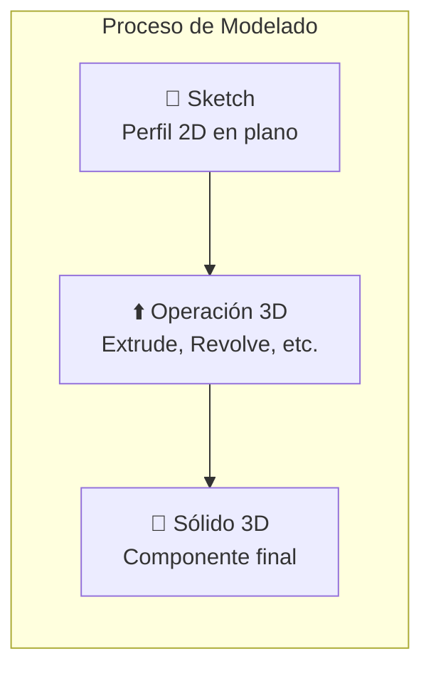

# ✈️ Módulo 01: CAD para Aeronáutica con IA

## Diseña Aeronaves Profesionales con CAD 3D y Asistencia de OpenCode

> **Para Ingenieros Aeronáuticos**: Este módulo te enseña a diseñar componentes aeronáuticos desde el concepto hasta el modelo 3D completo, usando herramientas profesionales como CATIA, Fusion 360, y FreeCAD. Aprenderás modelado paramétrico, ensamblajes complejos, y optimización con OpenCode como asistente técnico.

**⏱️ Duración**: 4 horas  
**👤 Nivel**: Intermedio (con fundamentos de dibujo técnico)  
**🎯 Objetivo**: Dominar diseño CAD aeronáutico con herramientas modernas e IA

---

## ⚖️ Límites de IA: Dónde Confiar y Dónde Cuestionar

> 🔴 **LECTURA OBLIGATORIA**: Antes de continuar, lee la guía central sobre los límites y responsabilidades al usar IA en ingeniería.
> 
> **[Guía Central: Límites de la IA en Ingeniería](../../recursos/LIMITS-OF-AI.md)**

---

## 🤔 ¿Qué es CAD Aeronáutico?

**CAD Aeronáutico** es el "plano digital tridimensional" que define la geometría exacta de cada componente para su fabricación, análisis y certificación. Es el lenguaje universal del diseño de aeronaves.

**Analogía**: Así como un arquitecto necesita planos precisos para construir un rascacielos, un ingeniero aeronáutico necesita un modelo CAD preciso para construir un avión.

### ¿Por Qué es Crítico en Paraguay?
- **Mantenimiento**: TAM Airlines y la Fuerza Aérea necesitan modelos precisos para reparar y modificar aeronaves existentes.
- **Innovación**: El creciente sector de drones agrícolas depende del diseño CAD para crear UAVs eficientes y robustos.
- **Certificación**: La DINAC exige documentación técnica basada en modelos CAD para certificar cualquier modificación o nueva aeronave.

---

## 📋 Prerrequisitos

Este módulo asume que tienes conocimientos básicos de dibujo técnico (vistas ortogonales) y has instalado el software CAD de tu elección (Fusion 360, FreeCAD, o Onshape).

---

## 🏢 Parte 1: Fundamentos de CAD 3D (60 min)

### Concepto: Del Boceto a la Pieza 3D
El modelado 3D es un proceso de dos pasos:
1.  **Sketch (Boceto)**: Se dibuja un perfil 2D en un plano (XY, XZ, YZ).
2.  **Feature (Operación)**: Se aplica una operación a ese boceto para darle volumen.

### Operaciones Fundamentales
- **Extrude (Extrusión)**: Da profundidad a un boceto. Ideal para alas, vigas y planchas.
- **Revolve (Revolución)**: Gira un boceto alrededor de un eje. Perfecto para piezas simétricas como fuselajes, hélices o toberas.
- **Loft**: Crea una transición suave entre dos o más bocetos. Esencial para alas con perfiles variables (taper y twist).
- **Sweep**: Arrastra un perfil a lo largo de una trayectoria. Útil para tuberías, cableado o bordes de ataque complejos.

---

## 🔬 Parte 2: Modelado Práctico en Fusion 360 (90 min)

Ahora aplicarás los conceptos para modelar los componentes clave de un UAV.

### Tutorial 1: Modelado de un Fuselaje
En este tutorial, crearás un fuselaje aerodinámico usando las operaciones `Revolve` y `Shell`.
> **[Ver Tutorial: Modelado de Fuselaje](./tutorials/01_fuselage_modeling.md)**

### Ejemplo 1: Generar un Perfil Alar con IA
Los perfiles NACA se definen por ecuaciones. En lugar de calcular cientos de puntos manualmente, puedes pedirle a la IA que genere un script para hacerlo por ti.
> **[Ver Ejemplo: Prompt para Script de Perfil NACA](./examples/01_naca_profile_prompt.md)**

---

## 🌐 Parte 3: Ensamblajes y Diseño Paramétrico (60 min)

Una aeronave es un conjunto de miles de piezas. La clave es hacer que encajen y se actualicen de manera inteligente.

### Tutorial 2: Ensamblaje de un UAV Completo
Aprenderás a unir el fuselaje, las alas y el empenaje usando `Constraints` (restricciones) y a verificar que no haya colisiones.
> **[Ver Tutorial: Ensamblaje de UAV](./tutorials/02_uav_assembly.md)**

### Diseño Paramétrico
Esta es una de las técnicas más poderosas. En lugar de usar dimensiones fijas (ej: `1200mm`), usas variables (ej: `fuselage_length = 1200`). Si cambias la variable, todo el modelo se actualiza automáticamente. Esto es crucial para la optimización y el análisis de trade-offs.

---

## 💻 Parte 4: Automatización con IA (30 min)

Aquí es donde tu productividad se dispara. Usarás OpenCode para automatizar tareas complejas.
- **Generación de Geometrías**: Crear scripts que dibujan piezas complejas (ver Ejemplo 1).
- **Análisis de Diseño**: Escribir scripts que calculen el peso, volumen y centro de gravedad de tu ensamblaje.
- **Optimización**: Crear bucles que generen docenas de variantes de un diseño y comparen su performance.

---

## 🏋️ Ejercicios Prácticos y Quiz

Al final de cada tutorial y ejemplo encontrarás ejercicios para practicar lo aprendido. El módulo concluye con un quiz para evaluar tu comprensión de los conceptos clave.

---
### Próximo Paso
**Continúa con**: [Módulo 02: Aerodinámica y CFD](../02-aerodynamics-cfd/README.md)

