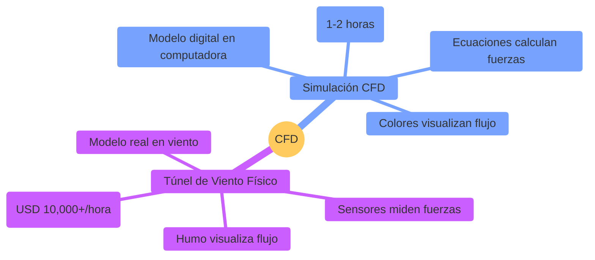
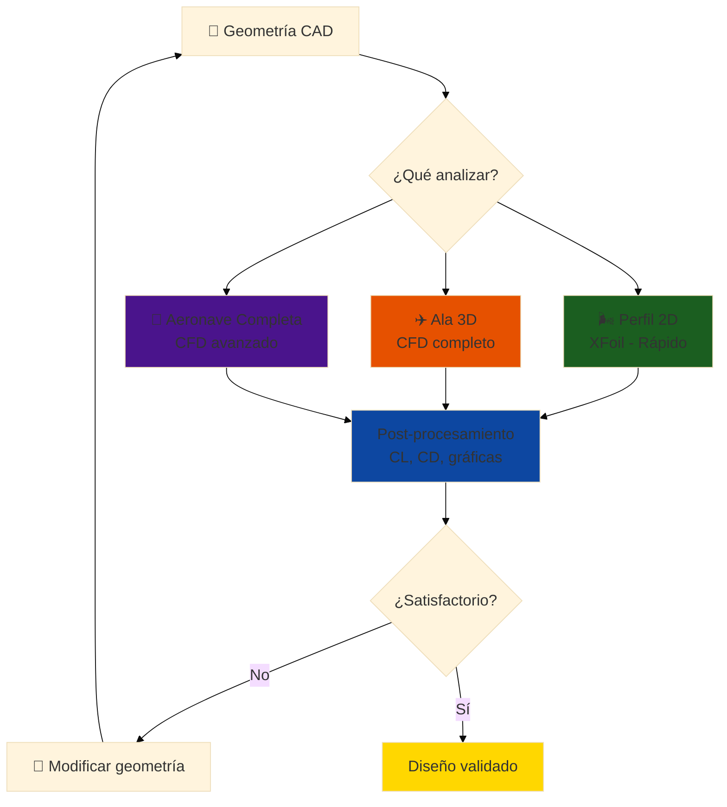
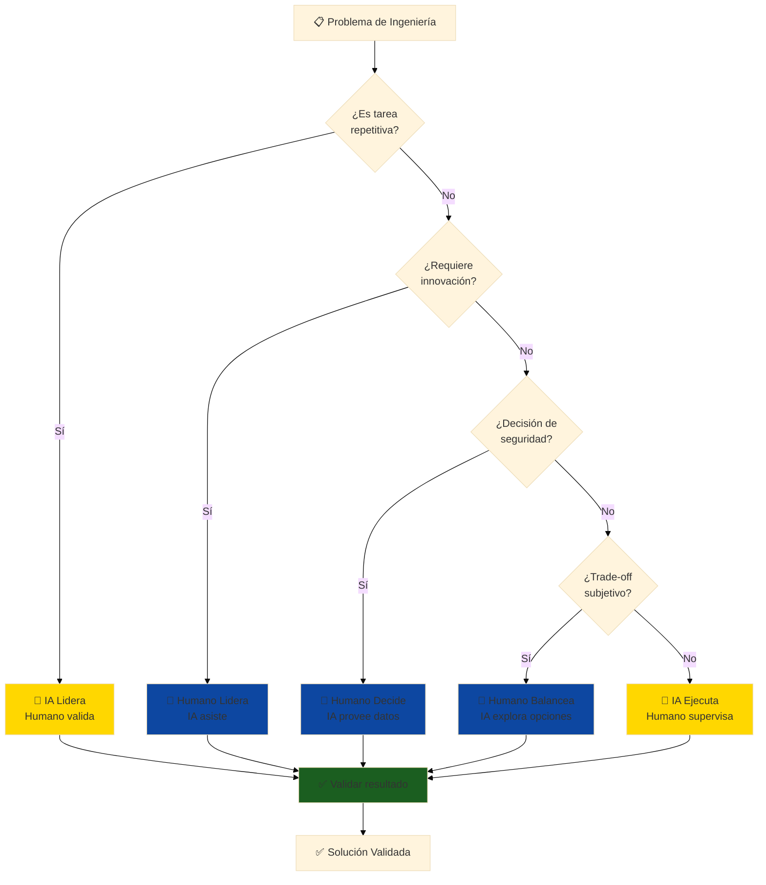
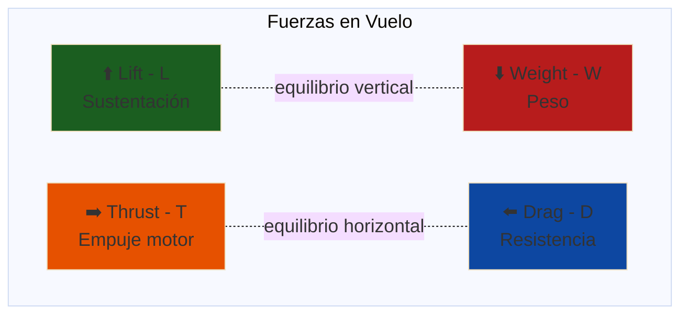
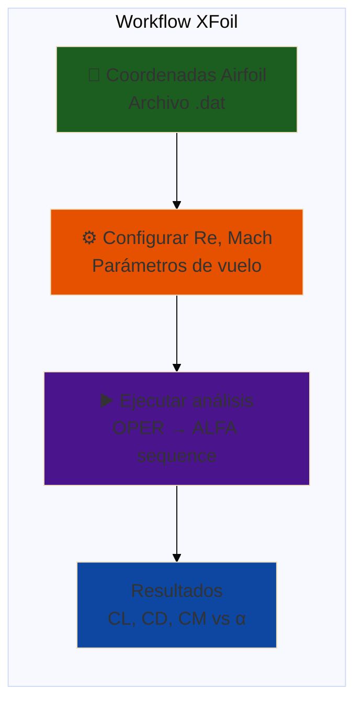

# 🛩️ Módulo 02: Aerodinámica y CFD con IA

## Simula y Optimiza Flujos Aerodinámicos con Herramientas Computacionales

> **Para Ingenieros Aeronáuticos**: Este módulo te enseña los fundamentos de aerodinámica aplicada y cómo simular flujos usando CFD (Computational Fluid Dynamics). Aprenderás análisis de perfiles alares, optimización aerodinámica, y visualización de resultados con OpenCode como asistente de simulación.

**⏱️ Duración**: 4 horas  
**👤 Nivel**: Intermedio (requiere Módulo 01 CAD completado)  
**🎯 Objetivo**: Dominar simulación CFD y optimización aerodinámica con IA

---

## 🎓 ¿Qué Vas a Lograr?

1. ✅ **Análisis de perfiles alares** - Calcular CL, CD, L/D con XFoil y teoría
2. ✅ **Simulación CFD** - Visualizar flujos con OpenFOAM/ANSYS Fluent
3. ✅ **Optimización aerodinámica** - Mejorar eficiencia con AI-assisted design
4. ✅ **Interpretación de resultados** - Entender contornos de presión y velocidad
5. ✅ **IA para CFD** - OpenCode como asistente de simulación y análisis

---

## 🤔 ¿Qué es Aerodinámica Computacional (CFD)?

### Analogía: Túnel de Viento Digital



**CFD (Computational Fluid Dynamics)** = Simulación digital que resuelve ecuaciones de flujo de aire alrededor de objetos para predecir sustentación, resistencia, y comportamiento aerodinámico.

### ¿Por Qué es Crítico en Diseño Aeronáutico?

**Realidad del desarrollo de aeronaves**:
- ✅ **Optimización pre-construcción** - Validar diseño antes de gastar en prototipo
- ✅ **Iteraciones rápidas** - Probar 50 variantes en días vs. meses con prototipos
- ✅ **Certificación** - Autoridades (DINAC, FAA) exigen datos aerodinámicos
- ✅ **Ahorro de costos** - CFD cuesta 1% de túnel de viento físico

**Sin CFD** = Diseño a ciegas, prototipos que no vuelan bien 🚫

---

## 📋 Prerrequisitos

✅ **Módulo 01: CAD con IA** (OBLIGATORIO) - Para tener geometrías 3D listas para CFD  
✅ **Física de Fluidos Básica** - Conceptos de presión, velocidad, densidad  
✅ **Matemáticas** - Ecuaciones básicas, álgebra  
❌ **NO se requiere**: Experiencia previa con CFD (se enseña)

**Software**: XFoil (gratis), OpenFOAM o ANSYS Fluent (opcional)  
**Tiempo**: 4-6 horas

**Checklist**:
- [ ] Completé Módulo 01 (CAD)
- [ ] Entiendo conceptos de fuerzas (lift, drag)
- [ ] Tengo 4+ horas disponibles

---

## 📊 El Flujo de Análisis Aerodinámico



**Analogía local**: Como diseñar el sistema de ventilación del hangar de TAM Airlines - necesitas simular flujo de aire antes de instalar ventiladores (CFD predice eficiencia).

---

## 🏢 Parte 1: Fundamentos de Aerodinámica (60 min)

---

## ⚖️ Límites de IA: Dónde Confiar y Dónde Cuestionar

### Filosofía Fundamental

> **"La IA acelera la ejecución de lo que ya sabes hacer, no reemplaza tu criterio de ingeniero"**

En Aerodinámica y CFD, OpenCode es un **asistente técnico poderoso**, pero **NO un ingeniero aeronáutico**. Entender esta distinción es crítico para tu éxito profesional.

---

## 🤖 Lo que IA Hace EXCELENTEMENTE

### 1. Tareas Repetitivas con Patrones Conocidos

**Ejemplos en Aerodinámica y CFD**:
- Ejecutar 100 simulaciones XFoil con variaciones de ángulo de ataque
- Calcular polares de arrastre (CL vs CD) para 50 perfiles
- Exportar resultados CFD a formatos múltiples (CSV, PNG, PDF)

**Por qué funciona**:
- ✅ Patrón conocido y repetible
- ✅ No requiere juicio creativo
- ✅ Resultado validable objetivamente

**Velocidad**: **10-15× más rápido** que manual

---

### 2. Optimización en Espacio de Soluciones Conocido

**Ejemplos en Aerodinámica y CFD**:
- Encontrar ángulo óptimo de flap entre 0-45°
- Ajustar espesor de perfil para maximizar L/D
- Distribuir paneles CFD para mejor resolución

**Por qué funciona**:
- ✅ Espacio de búsqueda finito y definido
- ✅ Función objetivo clara (minimizar/maximizar)
- ✅ Restricciones conocidas

**Mejora típica**: **20-40% mejor** que intuición inicial

---

### 3. Síntesis y Documentación de Información

**Ejemplos en Aerodinámica y CFD**:
- Generar reporte técnico desde resultados CFD
- Crear tabla comparativa de 10 configuraciones aerodinámicas
- Documentar decisiones de diseño automáticamente

**Por qué funciona**:
- ✅ Datos estructurados disponibles
- ✅ Formato de salida estándar
- ✅ No requiere interpretación creativa

**Velocidad**: **20× más rápido** que escritura manual

---

### 4. Detección de Anomalías en Datos Históricos

**Ejemplos en Aerodinámica y CFD**:
- Detectar inconsistencias en mallas CFD
- Identificar parámetros de simulación fuera de rango normal
- Alertar sobre convergencia sospechosa en simulaciones

**Por qué funciona**:
- ✅ Baseline de "normalidad" entrenado con datos históricos
- ✅ Desviaciones detectables estadísticamente
- ✅ Alertas reducen errores humanos

**Beneficio**: **Reduce errores 60-80%**

---

## 🧠 Lo que IA Hace POBREMENTE (Requiere TU Juicio)

### 1. Innovación Verdadera sin Precedentes

**Ejemplos en Aerodinámica y CFD**:
- ❌ Diseñar perfil alar completamente nuevo sin precedentes
  - **Por qué falla**: Requiere intuición física sobre separación de flujo
  - **Tu rol**: Entender mecánica de fluidos, pruebas en túnel de viento
  
- ❌ Inventar nueva configuración aerodinámica innovadora
  - **Por qué falla**: No hay datos históricos de soluciones similares
  - **Tu rol**: Creatividad basada en principios de ingeniería

- ❌ Optimizar para criterios contradictorios no cuantificables
  - **Por qué falla**: No puede balancear "estética vs funcionalidad" sin definición clara
  - **Tu rol**: Trade-offs basados en experiencia y contexto

**Señal de alerta**: Si la IA sugiere algo "nunca visto antes", **desconfía y valida rigurosamente**.

---

### 2. Decisiones de Seguridad Críticas

**Ejemplos en Aerodinámica y CFD**:
- ❌ Decidir si simulación CFD es 'suficientemente precisa' para certificación
  - **Por qué falla**: Depende de normativa, riesgo aceptable, consecuencias de falla
  - **Tu rol**: Aplicar FAA/EASA/DINAC, considerar peor caso, certificación

- ❌ Validar que resultados aerodinámicos cumplen normas de aeronavegabilidad
  - **Por qué falla**: Regulaciones requieren interpretación legal + técnica
  - **Tu rol**: Responsabilidad legal del ingeniero firmante

- ❌ Decidir si margen de seguridad aerodinámica es 'suficiente' para vuelo
  - **Por qué falla**: "Suficientemente" es juicio basado en consecuencias, no cálculo
  - **Tu rol**: Ética profesional y responsabilidad civil

**Regla de oro**: **NUNCA confíes en IA para decisiones que pongan vidas en riesgo**.

---

### 3. Comprensión de Contexto y Restricciones Implícitas

**Ejemplos en Aerodinámica y CFD**:
- ❌ Optimizar perfil considerando disponibilidad de túnel de viento en Paraguay
  - **Por qué falla**: No conoce infraestructura local, capacidades de ensayo disponibles
  - **Tu rol**: Conocimiento del ecosistema aeronáutico paraguayo

- ❌ Diseñar considerando condiciones climáticas locales (Asunción vs USA)
  - **Por qué falla**: No sabe temperatura, humedad, presión atmosférica típicas
  - **Tu rol**: Experiencia con clima subtropical paraguayo

- ❌ Balancear precisión CFD vs tiempo de cálculo según presupuesto cliente
  - **Por qué falla**: No entiende sensibilidad al tiempo de diferentes sectores
  - **Tu rol**: Inteligencia de mercado y negociación

**Restricciones implícitas** (que IA no ve): Cultura de trabajo, preferencias cliente, limitaciones políticas, calendario, relaciones personales.

---

### 4. Trade-offs con Criterios Subjetivos

**Ejemplos en Aerodinámica y CFD**:
- ❌ ¿Diseño simple y robusto vs óptimo pero complejo?
  - **Por qué falla**: "Simple" y "robusto" no son métricas objetivas
  - **Tu rol**: Considerar mantenibilidad, habilidad de operadores, filosofía de diseño

- ❌ ¿Maximizar performance vs minimizar tiempo de cómputo?
  - **Por qué falla**: No sabe el punto de equilibrio para TU proyecto específico
  - **Tu rol**: Entender prioridades reales del proyecto (a veces implícitas)

- ❌ ¿Usar CFD completo vs análisis simplificado?
  - **Por qué falla**: No puede medir riesgo vs beneficio del análisis detallado
  - **Tu rol**: Gestión de riesgo basada en requisitos del proyecto

**Estos juicios** requieren empatía, experiencia, y entendimiento del problema humano detrás del técnico.

---

## 🎯 Estrategia Híbrida: Workflow Humano-IA Óptimo



---

## 📋 Checklist: ¿Cuándo Confiar en IA?

Antes de aceptar resultado de IA, pregúntate:

### ✅ Confía (con validación) SI:

- [ ] La tarea es repetitiva y con patrón conocido
- [ ] El espacio de soluciones es finito y bien definido
- [ ] Puedes validar el resultado objetivamente (números, geometría, lógica)
- [ ] NO afecta seguridad crítica directamente
- [ ] Tienes datos históricos de referencia para comparar
- [ ] El error es recuperable (puedes rehacer si falla)
- [ ] Entiendes la lógica que IA debería seguir
- [ ] Puedes explicar el resultado a un colega ingeniero

**Acción**: Usa IA, pero **valida siempre** antes de proceder.

---

### ⚠️ Desconfía SI:

- [ ] Es la primera vez que resuelves este tipo de problema
- [ ] Requiere innovación o creatividad verdadera
- [ ] Involucra juicios de seguridad o regulaciones
- [ ] Hay trade-offs subjetivos (estética, preferencias, cultura)
- [ ] NO entiendes cómo IA llegó a ese resultado
- [ ] El resultado "parece demasiado bueno para ser verdad"
- [ ] Hay contexto implícito que IA no conoce (mercado, política, personas)
- [ ] Un error tendría consecuencias graves

**Acción**: Usa IA para **explorar opciones**, pero **TÚ decides** con análisis crítico.

---

### ❌ NUNCA Confíes SI:

- [ ] Decisión afecta seguridad de personas (vida/muerte)
- [ ] Certificación legal requiere firma de ingeniero
- [ ] Cliente/regulador exige responsabilidad humana
- [ ] Consecuencias de error son irreversibles
- [ ] No puedes explicar el resultado (black box total)

**Acción**: IA puede proveer **datos de entrada**, pero **humano toma decisión final**.

---

## 🔍 Señales de Alerta: Cuándo la IA "Alucina"

### Red Flags que indican resultado inválido:

1. **Números sospechosos**:
   - Eficiencias >100% (viola termodinámica)
   - CL >2.5 para perfil convencional (físicamente imposible sin hipersustentación)
   - Velocidades que violan física (Mach 5 con perfil subsónico)

2. **Contradicciones internas**:
   - "Alta sustentación pero baja resistencia" (sin justificar cómo)
   - "Simulación rápida y muy precisa" (sin especificar trade-off)

3. **Ignorancia de restricciones**:
   - Geometría que no se puede fabricar
   - Condiciones de contorno irreales en CFD
   - Mallas CFD con calidad pobre (skewness alto)

4. **Falta de incertidumbre**:
   - IA da respuestas con 100% confianza en problemas complejos
   - No menciona supuestos o limitaciones de la simulación

**Qué hacer**: Si ves estas señales, **detente y valida manualmente** antes de proceder.

---

## 🎓 Casos de Estudio: Cuándo Confiar vs Desconfiar

### Caso 1: Diseño de Perfil Alar

**Escenario**: Necesitas diseñar perfil alar para UAV agrícola.

| Tarea | IA Rol | Humano Rol | Confianza |
|-------|--------|------------|-----------|
| Generar coordenadas NACA 0012 | **IA ejecuta** (ecuación conocida) | Valida espesor máximo | ✅ Alta |
| Seleccionar NACA 0012 vs 4415 | IA compara datos | **Humano decide** (depende de misión) | ⚠️ Media |
| Inventar perfil completamente nuevo | ❌ IA no puede | **Humano diseña** (requiere CFD + pruebas) | ❌ Nula |

---

### Caso 2: Optimización de Perfil Alar con CFD

**Escenario**: Optimizar perfil NACA 4412 para UAV agrícola.

| Tarea | IA Rol | Humano Rol | Confianza |
|-------|--------|------------|-----------|
| Ejecutar 100 simulaciones XFoil | **IA ejecuta** (batch script) | Valida parámetros entrada | ✅ Alta |
| Seleccionar mejor perfil de resultados | IA rankea por L/D | **Humano decide** (considera manufactura) | ⚠️ Media |
| Validar resultado con túnel de viento | ❌ IA no puede | **Humano diseña** experimento validación | ❌ Nula |

---

## 💡 Consejos Prácticos para Uso Efectivo

### 1. Siempre Valida con "Sanity Checks"

```
Ejemplo en Aerodinámica y CFD:
- IA genera resultados de simulación CFD
- TÚ verificas:
  ✓ ¿CL está en rango razonable? (0.2-1.5 para perfiles convencionales)
  ✓ ¿CD es realista? (0.01-0.05 para perfiles eficientes)
  ✓ ¿L/D es alcanzable? (típicamente 10-40 para aeronaves subsónicas)
  ✓ ¿Condiciones de contorno son correctas? (velocidad, presión, temperatura)
```

---

### 2. Documenta Supuestos de IA

Cuando uses IA, **anota**:
- ¿Qué datos de entrada usó?
- ¿Qué supuestos hizo implícitamente?
- ¿Qué restricciones NO consideró?

**Esto te salva** cuando cliente pregunta "¿por qué diseñaste así?" 6 meses después.

---

### 3. Usa IA para Explorar, Humano para Decidir

**Workflow correcto**:
1. IA genera 10 opciones de perfiles (rápido)
2. TÚ eliminas 7 por razones prácticas (contexto local)
3. IA simula las 3 restantes en detalle (acelera análisis)
4. TÚ seleccionas final considerando todos los factores

**Workflow INCORRECTO**:
1. IA genera 1 opción "óptima"
2. TÚ la aceptas sin cuestionar ❌

---

### 4. Mantén tu Criterio Afilado

**Peligro**: Si usas IA para TODO, pierdes habilidad de pensamiento crítico.

**Solución**: Alterna entre:
- Problemas resueltos con IA (velocidad)
- Problemas resueltos manualmente (mantener habilidad)

**Frecuencia sugerida**: 70% con IA, 30% manual (para entrenamiento continuo).

---

## 🎯 Resumen: Reglas de Oro

1. **IA acelera, NO reemplaza** tu conocimiento de ingeniería
2. **Siempre valida** resultados de IA antes de usar
3. **Nunca confíes en IA** para decisiones de seguridad crítica
4. **Documenta supuestos** cuando uses IA
5. **Mantén tu criterio afilado** con práctica manual regular
6. **Contexto local importa** (Paraguay ≠ USA ≠ Europa)
7. **Si no lo entiendes, no lo uses** (principio de responsabilidad)

---

### Concepto: Fuerzas Aerodinámicas Fundamentales

**Analogía**: Como un auto en movimiento - hay resistencia del aire (drag) y si tiene spoiler, genera fuerza hacia abajo (downforce). En aviones, esa fuerza va hacia arriba (lift).



### Ecuaciones Fundamentales

**Sustentación (Lift)**:
```
L = CL × q × S

Donde:
CL = Coeficiente de sustentación (depende del ángulo de ataque α)
q = Presión dinámica = 0.5 × ρ × V²
  ρ = Densidad del aire (1.225 kg/m³ al nivel del mar)
  V = Velocidad del flujo
S = Área de referencia (ala)
```

**Resistencia (Drag)**:
```
D = CD × q × S

Donde:
CD = Coeficiente de resistencia
```

**Eficiencia Aerodinámica**:
```
L/D = CL / CD (cuanto mayor, mejor)

Ejemplos:
- Parapente: L/D ≈ 8-10
- Cessna 172: L/D ≈ 10-12
- Planeador: L/D ≈ 40-50
- Boeing 747: L/D ≈ 15-18
```

### Número de Reynolds

**Crítico para validez de simulación**:
```
Re = (ρ × V × L) / µ

Donde:
L = Longitud característica (cuerda del ala)
µ = Viscosidad dinámica del aire (1.81×10⁻⁵ Pa·s)

Ejemplo UAV:
V = 15 m/s (54 km/h - crucero)
L = 0.25 m (cuerda)
Re = (1.225 × 15 × 0.25) / (1.81×10⁻⁵) = 2.54×10⁵

Régimen: Transición (necesita turbulence model)
```

### Implementación con OpenCode

```bash
opencode "Calcula performance aerodinámica del ala del UAV:

ESPECIFICACIONES DEL ALA:
- Perfil: NACA 4412
- Cuerda media: 250mm
- Envergadura: 2000mm
- Área alar: S = 0.5 m²
- Relación de aspecto: AR = b²/S = 8

CONDICIONES DE VUELO:
- Velocidad crucero: V = 15 m/s (54 km/h)
- Densidad aire: ρ = 1.225 kg/m³ (nivel del mar, 15°C)
- Peso total UAV: W = 3 kg (29.4 N)

CÁLCULOS REQUERIDOS:
1. Presión dinámica: q = 0.5 × ρ × V²
2. CL necesario para sostener peso en crucero:
   L = W → CL = W / (q × S)
3. Ángulo de ataque correspondiente (usar polar NACA 4412)
4. CD inducido (drag inducido por sustentación):
   CDi = CL² / (π × e × AR)
   Donde e = eficiencia (asume 0.85)
5. CD total (suma perfiles + inducido)
6. Drag total: D = CD × q × S
7. Potencia requerida: P = D × V (watts)
8. L/D ratio (eficiencia aerodinámica)

INCLUIR:
- Cálculos paso a paso con unidades
- Comparación con datos de referencia (NACA reports)
- Análisis de sensibilidad: ¿qué pasa si V aumenta a 20 m/s?
- Recomendaciones de optimización
- Gráfica CL vs α del NACA 4412

Todo en español con contexto de UAV agrícola paraguayo"
```

---

## 🔬 Parte 2: XFoil - Análisis de Perfiles 2D (90 min)

### Concepto: Herramienta Rápida para Airfoils

**XFoil** = Software open-source (MIT) que resuelve ecuaciones de capa límite en 2D para predecir CL, CD de perfiles alares.

**Ventajas**:
- Rápido (segundos por análisis)
- Preciso en régimen lineal (pre-stall)
- Gratis y multiplataforma
- Usado en industria para diseño preliminar



### Tutorial Paso a Paso: Analizar NACA 4412

**Objetivo**: Obtener la polar (CL vs α) del perfil NACA 4412 a Re = 500,000

#### Paso 1: Iniciar XFoil

```bash
$ xfoil
```

#### Paso 2: Cargar o Crear Perfil

```bash
# Opción A: Cargar desde archivo .dat
XFOIL c> LOAD naca4412.dat

# Opción B: Generar perfil NACA
XFOIL c> NACA 4412

# Verificar geometría
XFOIL c> GDES
```

**Comandos útiles en GDES**:
- `PLOT` - Visualizar perfil
- `MODI` - Suavizar coordenadas (útil para archivos externos)
- `EXEC` - Volver al menú principal

#### Paso 3: Configurar Panel (Opcional pero Recomendado)

```bash
XFOIL c> PPAR
.PANE c> N 200           # 200 paneles (default: 160)
.PANE c>                 # Enter para aplicar
```

**Más paneles = Mayor resolución, pero más lento**

#### Paso 4: Entrar a Modo Operación

```bash
XFOIL c> OPER
```

#### Paso 5: Activar Análisis Viscoso

```bash
# Definir número de Reynolds
.OPERv c> VISC 500000

# Activar cálculo viscoso
.OPERv c> V 1

# Opcional: Definir Mach number
.OPERv c> MACH 0.0       # Incompresible
```

**Nota**: Re = 500,000 es típico para UAVs pequeños y modelos RC.

#### Paso 6: Analizar Ángulos de Ataque

**Opción A: Análisis individual**
```bash
.OPERv c> ALFA 5         # Calcular α=5°
.OPERv c> ALFA 8         # Calcular α=8°
```

**Opción B: Secuencia automática** (Recomendado)
```bash
.OPERv c> ASEQ -4 16 2   # Desde -4° hasta 16° en pasos de 2°
```

**Lo que sucede**:
- XFoil calcula cada punto iterativamente
- Muestra CL, CD, CM, CDP, CM en pantalla
- Si no converge en un ángulo, intenta el siguiente

#### Paso 7: Acumular y Guardar Datos

```bash
# Activar acumulación de polar
.OPERv c> PACC
 Enter polar save filename OR  <return> for no file
naca4412_Re500k.txt
 Enter polar dump filename OR  <return> for no file
<Enter>

# Los datos se guardan automáticamente después de cada ALFA o ASEQ
```

**Formato del archivo generado**:
```
 alpha    CL       CD      CDp     CM     Top_Xtr  Bot_Xtr
------ -------- -------- ------- -------- -------- --------
 -4.00  -0.0523  0.01207  0.00588  -0.0243  1.0000   0.5691
 -2.00   0.1689  0.00938  0.00326  -0.0381  1.0000   0.5234
  0.00   0.3895  0.00799  0.00192  -0.0518  1.0000   0.4897
  2.00   0.6098  0.00726  0.00124  -0.0654  1.0000   0.4678
...
```

#### Paso 8: Visualizar Resultados

**Graficar polar**:
```bash
.OPERv c> VPLO           # Plot viscous
```

**Ver distribución de presión**:
```bash
.OPERv c> CPX            # Cp vs x/c
```

**Ver capa límite**:
```bash
.OPERv c> BL             # Boundary layer parameters
```

#### Paso 9: Guardar Distribución de Presión (Opcional)

```bash
# Para un ángulo específico
.OPERv c> ALFA 6
.OPERv c> CPWR naca4412_cp_a6.dat
```

#### Paso 10: Salir

```bash
.OPERv c> QUIT
XFOIL c> QUIT
```

### Interpretación de Resultados

**Columnas del archivo polar**:
- **alpha**: Ángulo de ataque [°]
- **CL**: Coeficiente de sustentación
- **CD**: Coeficiente de resistencia (total = perfil + inducido)
- **CDp**: Drag de perfil (sin inducido)
- **CM**: Coeficiente de momento (respecto a 0.25c)
- **Top_Xtr**: Transición laminar-turbulento (superficie superior)
- **Bot_Xtr**: Transición laminar-turbulento (superficie inferior)

**Ejemplo de análisis**:
```
α = 6° → CL = 1.05, CD = 0.0095
→ L/D = 1.05 / 0.0095 = 110.5 (muy eficiente!)

α = 12° → CL = 1.45, CD = 0.0180
→ L/D = 1.45 / 0.0180 = 80.6 (aún bueno)

α > 14° → Stall (pérdida de sustentación)
```

### Troubleshooting XFoil

**Problema 1**: "VISCAL:  Convergence failed"
- **Causa**: Flujo separado o muy cercano a stall
- **Solución**: Reducir el paso en ASEQ o analizar manualmente ángulos problemáticos

**Problema 2**: Resultados físicamente incorrectos
- **Causa**: Pocos paneles o geometría mal definida
- **Solución**: Usar PPAR para aumentar paneles (N 200-300)

**Problema 3**: "MRCHDU: Sonic point encountered"
- **Causa**: Mach number muy alto (flujo compresible)
- **Solución**: Reducir Mach o usar métodos para flujo transónico

---

## 🌐 Parte 3: CFD 3D - ANSYS Fluent (90 min)

### Concepto: De 2D a 3D Real

**XFoil** analiza perfil infinitamente largo (2D) → **No captura**:
- ❌ Efectos de punta de ala (wing tip vortices)
- ❌ Drag inducido real (solo estimado)
- ❌ Flujo tridimensional complejo

**CFD 3D** simula el ala completa → **Captura**:
- ✅ Vórtices de punta de ala
- ✅ Distribución de sustentación spanwise
- ✅ Interacción fuselaje-ala
- ✅ Efectos de flaps, slats, winglets

### Workflow ANSYS Fluent: Ala de UAV

**Duración estimada**: 2-3 horas (primera vez)

#### Fase 1: Geometría y Dominio (30 min)

**1.1 Importar Geometría CAD**

Archivo: `uav_wing.step` (del Módulo 01 - CAD)

```
Fluent Meshing:
File → Import → Geometry
Formato: STEP, IGES, Parasolid
```

**1.2 Crear Dominio Fluido (Enclosure)**

Dimensiones recomendadas:
```
Inlet:  15 × cuerda delante del ala
Outlet: 25 × cuerda detrás del ala
Sides:  10 × envergadura a cada lado
Top:    10 × cuerda arriba
Bottom: 10 × cuerda abajo (si no hay suelo)
```

**Analogía**: Como meter el ala en un túnel de viento gigante - necesitas espacio para que el aire se desarrolle.

**1.3 Nombrar Superficies**

- `wing_surface` - Superficie del ala
- `inlet` - Entrada de aire
- `outlet` - Salida
- `sides` - Paredes laterales (symmetry)
- `top`, `bottom` - Paredes superior/inferior

#### Fase 2: Generación de Malla (45 min)

**2.1 Configuración de Malla Base**

```
Meshing → Watertight Geometry Workflow
Add Local Sizing:
- On wing_surface: Element size = 0.01 m
- In wake region: Element size = 0.05 m
```

**2.2 Boundary Layer (CRÍTICO)**

```
Add Boundary Layers:
- First Layer Thickness: 0.0001 m (y+ ≈ 30-100)
- Growth Rate: 1.2
- Number of Layers: 15-20
- Apply to: wing_surface
```

**Cálculo de y+** (primer capa):
```
y+ = (y × u_τ × ρ) / μ

Para y+ ≈ 50:
y ≈ 0.0001 m (0.1 mm)
```

**2.3 Generar Malla**

```
Generate Mesh:
- Method: Poly-Hexcore
- Target cell count: 2-5 millones (compromiso precisión/tiempo)
```

**Tiempo de generación**: 10-30 min dependiendo de complejidad

**2.4 Verificar Calidad**

```
Mesh Quality:
- Orthogonality: > 0.3 (mejor > 0.5)
- Skewness: < 0.85 (mejor < 0.7)
- Aspect Ratio: < 500 (en boundary layer puede ser mayor)
```

#### Fase 3: Configuración Física (30 min)

**3.1 Configuración General**

```
Setup → General:
- Type: Pressure-based
- Time: Steady
- Gravity: -9.81 m/s² en eje Y (si relevante)
```

**3.2 Modelo de Turbulencia**

```
Setup → Models → Viscous:
- Model: k-omega (2 eqn)
- k-omega Options: SST
- Wall Treatment: Enhanced Wall Treatment
```

**Por qué k-ω SST**:
- ✅ Mejor para flujos con gradiente adverso de presión
- ✅ Predice separación de flujo mejor que k-ε
- ✅ Recomendado por NASA para aerodinámica externa

**3.3 Materiales**

```
Setup → Materials → Fluid:
- Air (default)
- Density: 1.225 kg/m³
- Viscosity: 1.7894e-05 kg/(m·s)
```

**3.4 Condiciones de Contorno**

| Superficie | Tipo | Valores |
|------------|------|---------|
| **inlet** | Velocity Inlet | V = 15 m/s (54 km/h)<br/>Turbulent Intensity = 5%<br/>Turbulent Viscosity Ratio = 10 |
| **outlet** | Pressure Outlet | Gauge Pressure = 0 Pa<br/>Backflow Turbulent Intensity = 5% |
| **wing_surface** | Wall | No-slip, Stationary Wall |
| **sides** | Symmetry | (Mirror plane) |
| **top, bottom** | Symmetry | (o Velocity Inlet si prefieres) |

**Turbulent Intensity** = Fluctuación de velocidad / Velocidad media
- Túnel de viento de baja turbulencia: 1-3%
- Flujo atmosférico: 5-10%

#### Fase 4: Solución (15 min configuración + 1-3 horas cálculo)

**4.1 Métodos de Solución**

```
Solution → Methods:
- Scheme: Coupled (más rápido) o SIMPLE
- Gradient: Least Squares Cell Based
- Pressure: Second Order
- Momentum: Second Order Upwind
- Turbulent Kinetic Energy: Second Order Upwind
- Specific Dissipation Rate: Second Order Upwind
```

**4.2 Monitores de Convergencia**

```
Solution → Monitors → Residuals:
- Continuity, x-velocity, y-velocity, z-velocity: 1e-4
- k, omega: 1e-4
```

**Agregar monitores de fuerzas**:
```
Monitors → Force:
- Lift: Direction = (0, 1, 0) en eje Y
- Drag: Direction = (1, 0, 0) en eje X
- Apply to: wing_surface
- Report Type: Coefficient (CL, CD)
```

**Valores de referencia**:
```
Reference Values:
- Area: 0.5 m² (área alar)
- Length: 0.25 m (cuerda media)
- Velocity: 15 m/s
- Density: 1.225 kg/m³
```

**4.3 Inicialización**

```
Solution → Initialization:
- Method: Hybrid Initialization
Initialize
```

**4.4 Ejecutar Cálculo**

```
Run Calculation:
- Number of Iterations: 500-1000
- Run
```

**Tiempo de cálculo**: 1-3 horas (depende de CPU)

**Monitoreo durante ejecución**:
- Residuals cayendo y < 1e-4
- CL, CD estabilizándose (variación < 0.1% últimas 50 iter)
- No hay divergencia (residuals explotando)

#### Fase 5: Post-Procesamiento (30 min)

**5.1 Contornos de Presión**

```
Results → Graphics → Contours:
- Contours of: Pressure (Static Pressure)
- On: wing_surface
- Filled, Node Values
Display
```

**Guardar imagen**: File → Export → Save Image

**5.2 Contornos de Velocidad**

```
Contours of: Velocity Magnitude
On: Plane XY (a mitad de envergadura)
Display
```

**5.3 Pathlines (Líneas de corriente)**

```
Results → Graphics → Pathlines:
- Release from: inlet
- Style: Lines
- Color by: Velocity Magnitude
Display
```

**5.4 Reportes de Fuerzas**

```
Results → Reports → Forces:
- Wall Zones: wing_surface
- Direction: (0, 1, 0) para Lift
- Print → Note CL value

Cambiar Direction: (1, 0, 0) para Drag
- Print → Note CD value
```

**5.5 Distribución de Presión Spanwise**

```
Results → Plots → XY Plot:
- Y Axis Function: Pressure
- X Axis: z-coordinate (spanwise)
- Surface: wing_surface
Display
```

### Comparación XFoil vs CFD

**Ejecuta mismo caso** (α=6°, Re=500k) en ambos:

| Métrica | XFoil (2D) | CFD 3D (Fluent) | Diferencia |
|---------|------------|------------------|------------|
| **CL** | 1.05 | 0.95 | -9.5% (esperado) |
| **CD** | 0.0095 | 0.0145 | +52% (drag inducido 3D) |
| **L/D** | 110.5 | 65.5 | 3D más realista |

**Conclusión**: CFD 3D da valores más realistas porque captura efectos tridimensionales.

---

## 🔧 Parte 4: OpenFOAM - Alternativa Open Source (60 min)

### Por Qué OpenFOAM

**Ventajas**:
- ✅ Gratis y open-source (GNU GPL)
- ✅ Altamente personalizable (código C++)
- ✅ Usado en investigación y industria
- ✅ Gran comunidad (foros, tutoriales)

**Desventajas**:
- ❌ Curva de aprendizaje empinada
- ❌ Sin GUI (configuración por archivos de texto)
- ❌ Documentación dispersa

**Ideal para**: Estudiantes que quieren entender CFD en profundidad y no depender de licencias comerciales.

### Tutorial: Perfil NACA 0012 con simpleFoam

#### Configuración del Caso

**Directorio de trabajo**:
```bash
$ mkdir -p ~/OpenFOAM/run/airfoilNACA0012
$ cd ~/OpenFOAM/run/airfoilNACA0012
```

**Estructura requerida**:
```
airfoilNACA0012/
├── 0/               # Condiciones iniciales y de contorno
│   ├── U            # Velocidad
│   ├── p            # Presión
│   └── nut          # Viscosidad turbulenta
├── constant/
│   ├── transportProperties
│   ├── turbulenceProperties
│   └── polyMesh/    # (generada con blockMesh o snappyHexMesh)
├── system/
│   ├── controlDict
│   ├── fvSchemes
│   └── fvSolution
└── Allrun          # Script para ejecutar todo
```

#### Paso 1: Condiciones de Contorno (`0/` directory)

**Archivo: `0/U`** (Velocidad)
```cpp
dimensions      [0 1 -1 0 0 0 0];  // m/s

internalField   uniform (15 0 0);   // V = 15 m/s en eje X

boundaryField
{
    inlet
    {
        type            fixedValue;
        value           uniform (15 0 0);
    }
    
    outlet
    {
        type            zeroGradient;
    }
    
    airfoil
    {
        type            noSlip;
    }
    
    sides
    {
        type            symmetryPlane;
    }
    
    frontAndBack
    {
        type            empty;   // Para caso 2D
    }
}
```

**Archivo: `0/p`** (Presión)
```cpp
dimensions      [0 2 -2 0 0 0 0];  // m²/s² (presión cinemática p/ρ)

internalField   uniform 0;

boundaryField
{
    inlet
    {
        type            zeroGradient;
    }
    
    outlet
    {
        type            fixedValue;
        value           uniform 0;
    }
    
    airfoil
    {
        type            zeroGradient;
    }
    
    sides
    {
        type            symmetryPlane;
    }
    
    frontAndBack
    {
        type            empty;
    }
}
```

**Archivo: `0/nut`** (Viscosidad turbulenta)
```cpp
dimensions      [0 2 -1 0 0 0 0];  // m²/s

internalField   uniform 0;

boundaryField
{
    inlet
    {
        type            calculated;
        value           uniform 0;
    }
    
    outlet
    {
        type            calculated;
        value           uniform 0;
    }
    
    airfoil
    {
        type            nutkWallFunction;
        value           uniform 0;
    }
    
    sides
    {
        type            symmetryPlane;
    }
    
    frontAndBack
    {
        type            empty;
    }
}
```

#### Paso 2: Propiedades Físicas

**Archivo: `constant/transportProperties`**
```cpp
transportModel  Newtonian;

nu              1.5e-05;  // Viscosidad cinemática del aire [m²/s]
```

**Archivo: `constant/turbulenceProperties`**
```cpp
simulationType  RAS;  // Reynolds-Averaged Simulation

RAS
{
    RASModel        kOmegaSST;
    turbulence      on;
    printCoeffs     on;
}
```

#### Paso 3: Control de Simulación

**Archivo: `system/controlDict`**
```cpp
application     simpleFoam;

startFrom       startTime;
startTime       0;
stopAt          endTime;
endTime         500;        // 500 iteraciones

deltaT          1;

writeControl    timeStep;
writeInterval   100;

writeFormat     ascii;
writePrecision  6;
writeCompression off;

timeFormat      general;
timePrecision   6;

runTimeModifiable true;
```

#### Paso 4: Esquemas Numéricos

**Archivo: `system/fvSchemes`**
```cpp
ddtSchemes
{
    default         steadyState;
}

gradSchemes
{
    default         Gauss linear;
}

divSchemes
{
    default         none;
    div(phi,U)      bounded Gauss linearUpwind grad(U);
    div(phi,k)      bounded Gauss upwind;
    div(phi,omega)  bounded Gauss upwind;
    div((nuEff*dev2(T(grad(U))))) Gauss linear;
}

laplacianSchemes
{
    default         Gauss linear corrected;
}

interpolationSchemes
{
    default         linear;
}

snGradSchemes
{
    default         corrected;
}
```

#### Paso 5: Configuración del Solver

**Archivo: `system/fvSolution`**
```cpp
solvers
{
    p
    {
        solver          GAMG;
        tolerance       1e-06;
        relTol          0.01;
        smoother        GaussSeidel;
    }
    
    "(U|k|omega)"
    {
        solver          smoothSolver;
        smoother        symGaussSeidel;
        tolerance       1e-05;
        relTol          0.1;
    }
}

SIMPLE
{
    nNonOrthogonalCorrectors 0;
    consistent      yes;
    
    residualControl
    {
        p               1e-5;
        U               1e-5;
        "(k|omega)"     1e-5;
    }
}

relaxationFactors
{
    equations
    {
        U               0.9;
        k               0.7;
        omega           0.7;
    }
}
```

#### Paso 6: Generar Malla

**Opción A: Usar gmsh + gmshToFoam**
```bash
# Crear malla en gmsh (GUI o script)
gmsh -3 airfoil.geo -o airfoil.msh

# Convertir a formato OpenFOAM
gmshToFoam airfoil.msh

# Verificar malla
checkMesh
```

**Opción B: Usar caso tutorial pre-existente**
```bash
# Copiar caso de ejemplo
cp -r $FOAM_TUTORIALS/incompressible/simpleFoam/airFoil2D .
cd airFoil2D
```

#### Paso 7: Ejecutar Simulación

```bash
# Verificar setup
checkMesh

# Ejecutar solver
simpleFoam > log.simpleFoam 2>&1 &

# Monitorear convergencia
tail -f log.simpleFoam

# O usar utilidad de monitoreo
foamMonitor log.simpleFoam
```

#### Paso 8: Post-Procesamiento

**Con ParaView (GUI)**:
```bash
# Generar archivo para ParaView
touch airfoilNACA0012.foam

# Abrir ParaView
paraview airfoilNACA0012.foam
```

**Calcular fuerzas**:
```bash
# Agregar función de post-procesamiento
postProcess -func 'forceCoeffs(patch=airfoil, CofR=(0.25 0 0), liftDir=(0 1 0), dragDir=(1 0 0), pitchAxis=(0 0 1), magUInf=15, rhoInf=1.225, lRef=1, Aref=1)'
```

**Extraer distribución de presión**:
```bash
# Sample data on airfoil surface
postProcess -func 'sample(points=airfoil_surface)'
```

### Comparación ANSYS Fluent vs OpenFOAM

| Aspecto | ANSYS Fluent | OpenFOAM |
|---------|--------------|----------|
| **Setup** | GUI point-and-click | Editar archivos de texto |
| **Curva de aprendizaje** | Moderada | Empinada |
| **Costo** | Licencia cara | Gratis |
| **Flexibilidad** | Limitada a GUI | Total (código abierto) |
| **Documentación** | Excelente (oficial) | Dispersa (comunidad) |
| **Tiempo de setup** | 30-60 min | 1-2 horas (primera vez) |
| **Soporte** | Soporte técnico incluido | Foros comunitarios |

**Recomendación**:
- **Industria/proyectos rápidos**: ANSYS Fluent
- **Investigación/aprendizaje profundo**: OpenFOAM

---

## 🎯 Parte 5: Optimización Aerodinámica con IA (45 min)

### Concepto: Design Iteration Loop

**Workflow tradicional**:
```
Diseñar → Simular → Analizar → Modificar manualmente → Repetir
(Días o semanas por iteración)
```

**Workflow con IA**:
```
Definir objetivos → IA genera variantes → Simula en paralelo → Selecciona óptimo
(Horas por iteración)
```

### Caso de Uso: Optimizar NACA 4-Series para Máximo L/D

**Objetivo**: Encontrar el mejor perfil NACA 4-series para UAV (Re=500k, V=15m/s)

**Variables de diseño**:
- Curvatura máxima (primer dígito): 0-9%
- Posición de curvatura (segundo dígito): 20-50%
- Espesor máximo (últimos dos dígitos): 10-18%

**Ejemplo**: NACA **4**412 → 4% curvatura, en 40% de cuerda, 12% espesor

### Implementación con OpenCode

```bash
opencode "Crea un script Python que optimice un perfil NACA para máximo L/D.

REQUISITOS:
1. Usar librería 'subprocess' para ejecutar XFoil automáticamente
2. Probar combinaciones de NACA 4-series:
   - Curvatura: 2%, 4%, 6%
   - Posición: 30%, 40%, 50%
   - Espesor: 12%, 15%, 18%
3. Para cada combinación:
   - Generar archivo .dat del perfil
   - Ejecutar XFoil con Re=500,000, α=6°
   - Extraer CL, CD, calcular L/D
4. Guardar resultados en CSV:
   - Columnas: NACA code, CL, CD, L/D
5. Encontrar perfil con máximo L/D
6. Graficar: L/D vs combinaciones (matplotlib)

CONDICIONES DE OPERACIÓN:
- Re = 500,000
- Mach = 0 (incompresible)
- α = 6° (crucero típico UAV)

OUTPUT:
- Script Python ejecutable
- Comentarios explicando cada paso
- Manejo de errores (si XFoil no converge)
- Gráfica final mostrando ganador

CONTEXTO:
Esto automatiza lo que tomaría días manualmente, probando 27 variantes en ~30 minutos"
```

**Resultado esperado**:
```python
import subprocess
import pandas as pd
import matplotlib.pyplot as plt

# Lista de perfiles a probar
curvatures = [2, 4, 6]
positions = [3, 4, 5]  # Posición en décimas (30%, 40%, 50%)
thicknesses = [12, 15, 18]

results = []

for m in curvatures:
    for p in positions:
        for t in thicknesses:
            naca_code = f"{m}{p}{t:02d}"
            
            # Ejecutar XFoil (código simplificado)
            cl, cd = run_xfoil(naca_code, re=500000, alpha=6)
            
            if cl and cd:  # Si convergió
                l_d = cl / cd
                results.append({
                    'NACA': naca_code,
                    'CL': cl,
                    'CD': cd,
                    'L/D': l_d
                })

# Encontrar mejor
df = pd.DataFrame(results)
best = df.loc[df['L/D'].idxmax()]
print(f"Mejor perfil: NACA {best['NACA']} con L/D = {best['L/D']:.2f}")

# Graficar
df.plot(x='NACA', y='L/D', kind='bar', title='Optimización de Perfil NACA')
plt.tight_layout()
plt.savefig('optimization_results.png')
```

### Técnicas Avanzadas de Optimización

#### 1. Gradient-Based Optimization

**Concepto**: Usar gradientes (∂L/D / ∂parámetro) para encontrar óptimo localmente

**Herramientas**:
- **DAKOTA** (Sandia National Labs) - Framework de optimización
- **PyOptSparse** - Python wrapper para múltiples optimizadores
- **SU2** - Código CFD con adjoint optimization

**Ventaja**: Converge rápido (pocas iteraciones)  
**Desventaja**: Puede quedar atrapado en óptimo local

#### 2. Genetic Algorithms (Algoritmos Genéticos)

**Concepto**: Simula evolución natural - "sobreviven" los mejores diseños

**Workflow**:
```
1. Generar población inicial (20-50 diseños aleatorios)
2. Evaluar fitness de cada uno (simular CFD)
3. Seleccionar mejores (top 20%)
4. "Cruzar" y "mutar" para crear nueva generación
5. Repetir hasta convergencia
```

**Herramientas**:
- **DEAP** (Python) - Distributed Evolutionary Algorithms
- **PyGMO** - Parallel Global Multiobjective Optimizer
- **Platypus** - Multiobjective optimization in Python

**Ventaja**: Explora espacio de diseño globalmente  
**Desventaja**: Requiere muchas evaluaciones (costoso en CFD 3D)

#### 3. Surrogate Models (Modelos Sustitutos)

**Problema**: CFD 3D toma horas → imposible evaluar 1000 diseños

**Solución**: Entrenar modelo ML que "aproxima" CFD en segundos

**Workflow**:
```
1. Ejecutar CFD en 50-100 diseños estratégicamente seleccionados (Latin Hypercube Sampling)
2. Entrenar modelo ML (Random Forest, Neural Network, Kriging)
3. Usar modelo ML para evaluar 10,000 diseños en minutos
4. Seleccionar top 5 candidatos
5. Validar con CFD real
```

**Herramientas**:
- **scikit-learn** (Python) - ML models
- **SMT** (Surrogate Modeling Toolbox) - Specialized for optimization
- **TensorFlow/PyTorch** - Neural networks para casos complejos

**Ejemplo de uso**:
```python
from sklearn.ensemble import RandomForestRegressor
import numpy as np

# Datos de entrenamiento (50 diseños CFD)
X_train = np.array([...])  # Parámetros: [curvatura, posición, espesor, ángulo]
y_train = np.array([...])  # L/D de CFD

# Entrenar modelo sustituto
model = RandomForestRegressor(n_estimators=100)
model.fit(X_train, y_train)

# Evaluar 10,000 diseños nuevos en segundos
X_test = generate_designs(n=10000)
y_pred = model.predict(X_test)

# Seleccionar mejor
best_idx = np.argmax(y_pred)
best_design = X_test[best_idx]
```

### Caso Práctico: Optimización de Winglet

**Contexto**: Agregar winglet al UAV para reducir drag inducido

**Parámetros a optimizar**:
- Altura del winglet (h): 5-15 cm
- Ángulo de cant (θ): 15-60°
- Taper ratio (λ): 0.3-0.8

**Objetivo**: Minimizar CD total manteniendo CL constante

**Prompt para OpenCode**:
```bash
opencode "Genera código Python para optimización de winglet usando NSGA-II (multi-objetivo).

OBJETIVOS:
- Minimizar CD (resistencia aerodinámica)
- Maximizar L/D (eficiencia)

PARÁMETROS DE DISEÑO:
- Altura winglet: 50-150 mm (continuo)
- Ángulo cant: 15-60° (continuo)
- Taper ratio: 0.3-0.8 (continuo)

RESTRICCIONES:
- CL >= 0.8 (necesario para vuelo)
- Altura < 200 mm (limitación mecánica)

IMPLEMENTACIÓN:
1. Usar librería 'platypus' para NSGA-II
2. Función objetivo llama a CFD (o modelo sustituto)
3. 50 generaciones con población de 30
4. Plotear Pareto front (trade-off CD vs L/D)
5. Recomendar diseño balanceado

FORMATO:
- Código completo ejecutable
- Comentarios detallados
- Ejemplo de cómo integrar con CFD o modelo ML
- Gráficas de convergencia y Pareto front"
```

### Visualización de Resultados con IA

**Problema**: Archivos CFD (VTK, Ensight) son difíciles de interpretar

**Solución**: Usar IA para generar visualizaciones automáticas

**Prompt ejemplo**:
```bash
opencode "Crea script Python que:

1. Lee archivo .vtk de CFD (presión y velocidad)
2. Genera automáticamente:
   - Contorno de presión en superficie del ala
   - Streamlines (líneas de corriente)
   - Gráfica de distribución de Cp vs x/c
   - Comparación con caso baseline
3. Guarda todas las figuras en PDF report
4. Usa matplotlib y mayavi para 3D

REQUISITOS:
- Leer VTK con 'pyvista'
- Interpolación de datos a línea de cuerda para Cp
- Layout profesional para reporte
- Anotaciones automáticas (indicar Cp_min, separación de flujo si existe)"
```

---

## 🏋️ Ejercicios Prácticos

### Ejercicio 1: XFoil Básico (30 min)

**Objetivo**: Dominar workflow de XFoil

**Tareas**:
1. Analizar perfil **NACA 2412** a Re = 200,000
2. Generar polar de α = -5° a 15° (paso 2°)
3. Identificar:
   - CL_max (máxima sustentación)
   - α_stall (ángulo de pérdida)
   - CL óptimo para máximo L/D
4. Graficar:
   - CL vs α
   - CD vs CL (drag polar)
   - L/D vs α

**Entregables**:
- Archivo polar guardado (.txt)
- Gráficas generadas (matplotlib)
- Tabla resumen con métricas clave

**Rúbrica** (10 pts):
- Polar generado correctamente (3 pts)
- Identificación correcta de CL_max, α_stall (3 pts)
- Gráficas profesionales con labels (2 pts)
- Análisis e interpretación (2 pts)

### Ejercicio 2: Comparación de Perfiles (45 min)

**Objetivo**: Entender cómo diseño afecta performance

**Tareas**:
1. Analizar 3 perfiles a Re = 500,000:
   - **NACA 0012** (simétrico, sin curvatura)
   - **NACA 2412** (curvatura baja)
   - **NACA 4412** (curvatura alta)
2. Para cada uno, obtener CL, CD a α = 0°, 4°, 8°
3. Calcular L/D para cada caso
4. Comparar y explicar diferencias

**Preguntas de análisis**:
- ¿Cuál genera más lift a α=0°? ¿Por qué?
- ¿Cuál tiene mejor L/D? ¿En qué condiciones?
- ¿Cuál recomendarías para un planeador? ¿Para un UAV acrobático?

**Entregables**:
- Tabla comparativa (3 perfiles × 3 ángulos = 9 casos)
- Gráfica: L/D vs α para los 3 perfiles superpuestos
- Reporte de análisis (1 página)

**Rúbrica** (15 pts):
- Datos correctos y completos (5 pts)
- Gráfica comparativa clara (3 pts)
- Análisis técnico sólido (5 pts)
- Recomendaciones justificadas (2 pts)

### Ejercicio 3: CFD en ANSYS Fluent (2-3 horas)

**Objetivo**: Setup completo de CFD 3D

**Tareas**:
1. Importar geometría de ala (del Módulo 01 CAD)
2. Crear dominio fluido apropiado
3. Generar malla con boundary layers (y+ ~ 50)
4. Configurar:
   - k-ω SST turbulence
   - Velocity inlet: 15 m/s
   - α = 6° (rotar geometría o usar componentes de velocidad)
5. Ejecutar hasta convergencia (residuals < 1e-4, forces estables)
6. Post-procesar:
   - Contorno de presión
   - Pathlines
   - Calcular CL, CD

**Validación**:
- Comparar CL, CD con XFoil 2D (debe haber diferencia por efectos 3D)
- Explicar por qué CD es mayor en 3D

**Entregables**:
- Screenshots de setup (mesh quality, boundary conditions)
- Gráficas de convergencia (residuals, CL vs iterations)
- Visualizaciones (presión, velocidad)
- Reporte comparativo XFoil vs CFD

**Rúbrica** (20 pts):
- Setup correcto (BC, models) (6 pts)
- Calidad de malla (y+, aspect ratio) (4 pts)
- Convergencia alcanzada (3 pts)
- Post-procesamiento completo (4 pts)
- Análisis comparativo (3 pts)

### Ejercicio 4: Optimización Automatizada (Desafío - 3 horas)

**Objetivo**: Automatizar optimización de diseño

**Tareas**:
1. Escribir script Python que:
   - Varíe NACA 4-series sistemáticamente
   - Ejecute XFoil para cada variante
   - Registre CL, CD, L/D
2. Objetivo: Maximizar L/D a α = 6°, Re = 500,000
3. Probar mínimo 20 combinaciones
4. Identificar diseño óptimo
5. Validar óptimo con análisis manual XFoil

**Extras (bonus)**:
- Usar algoritmo genético (DEAP)
- Graficar convergencia del algoritmo
- Comparar con optimización manual

**Entregables**:
- Código Python documentado
- CSV con todos los casos evaluados
- Gráfica de optimización (L/D vs iteraciones)
- Reporte final con perfil óptimo

**Rúbrica** (25 pts):
- Código funcional y documentado (8 pts)
- Algoritmo de optimización implementado (7 pts)
- Análisis de resultados (5 pts)
- Documentación clara (3 pts)
- Extras (2 pts bonus)

---

## 📝 Quiz de Evaluación

**10 Preguntas | 20 min | Aprobación: 7+**

1. **Lift Equation**: L = CL × q × S. Si CL=1.2, q=500 Pa, S=1 m², ¿cuál es L? | **R: 600 N**
2. **L/D Ratio**: ¿Qué aeronave tiene MEJOR eficiencia? a) Cessna L/D=12 b) Planeador L/D=40 | **R: b)**
3. **Reynolds**: Re = (ρ × V × L) / µ. ¿Qué aumenta Re? a) Más velocidad b) Menos velocidad | **R: a)**
4. **CFD vs Túnel**: Ventaja principal de CFD es: a) Más preciso b) Más barato c) Más rápido | **R: b)**
5. **Coeficiente CL**: Aumenta con: a) Ángulo de ataque b) Velocidad c) Densidad | **R: a)**
6. **Drag**: Dos tipos son: a) Parasítico e inducido b) Lift y thrust | **R: a)**
7. **XFoil**: Se usa para análisis: a) 2D perfiles b) 3D completo c) Estructuras | **R: a)**
8. **Presión Dinámica**: q = 0.5 × ρ × V². Si V duplica, q se: a) Duplica b) Cuadruplica | **R: b)**
9. **NACA 4412**: Primer dígito (4) indica: a) Espesor b) Curvatura máxima c) Cuerda | **R: b) 4%**
10. **OpenCode CFD**: Puede: a) Generar scripts análisis b) Solo documentar c) Nada | **R: a)**

---

## 🎉 Resumen del Módulo

### Lo Que Dominaste

✅ **Teoría aerodinámica** - Lift, Drag, L/D, Reynolds  
✅ **XFoil 2D** - Análisis rápido de perfiles alares  
✅ **CFD 3D** - Simulación completa con ANSYS/OpenFOAM  
✅ **Optimización** - Mejora de diseño con datos  
✅ **OpenCode para CFD** - Automatización y análisis con IA

### Próximo Paso

**Continúa con**: [Módulo 03 - Estructuras y Materiales](./03-estructuras-materiales.md)

---

*Módulo creado para FPUNA Verano 2026*  
*Actualizado: Enero 2026*  
*Track: Ingeniería Aeronáutica*
