# ✈️ Módulo 05: Diseño Integral de Aeronaves

## Del Concepto a la Certificación: Diseño Completo con Metodología Profesional

> **Para Ingenieros Aeronáuticos**: Este módulo integra todo lo aprendido (CAD, aerodinámica, estructuras, propulsión) en un proceso completo de diseño de aeronaves. Aprenderás metodología de diseño conceptual, análisis de trade-offs, certificación básica, y documentación técnica profesional usando OpenCode como asistente de ingeniería integral.

**⏱️ Duración**: 4 horas | **👤 Nivel**: Avanzado | **🎯 Objetivo**: Dominar el proceso completo de diseño de aeronaves.

---
## ⚖️ Límites de IA: Dónde Confiar y Dónde Cuestionar

> 🔴 **LECTURA OBLIGATORIA**: Antes de continuar, lee la guía central sobre los límites y responsabilidades al usar IA en ingeniería.
> 
> **[Guía Central: Límites de la IA en Ingeniería](../../recursos/LIMITS-OF-AI.md)**

---
## 🤔 ¿Qué es el Diseño Integral de Aeronaves?
Es el proceso iterativo que convierte una **necesidad de misión** en una **aeronave completa, optimizada, fabricable y certificable**. Es la disciplina que une todas las demás.

---
## 📋 Prerrequisitos
- ✅ **Completar los Módulos 01 a 04** de este track es obligatorio. Este módulo asume y utiliza todos esos conocimientos.

---
## 📊 Las Fases del Diseño Aeronáutico
El diseño no es un proceso lineal, sino una espiral iterativa.

```mermaid
graph TD
    Start[📋 Requerimientos] --> A[💡 Diseño Conceptual] --> B[📐 Diseño Preliminar]
    B --> C[🔬 Diseño Detallado] --> D[🏗️ Prototipado] --> E[✈️ Testing]
    E --> F{¿Cumple?}
    F -->|No| G[🔄 Iterar] --> B
    F -->|Sí| H[📜 Certificación] --> I[Producción]
```

### Parte 1: Diseño Conceptual (60 min)
La fase más importante, donde se toman las decisiones de mayor impacto.
> #### 📖 Tutorial Práctico
> Aprende a traducir los requisitos del cliente en una configuración de aeronave tangible, a realizar el dimensionamiento inicial y a estimar los pesos.
> **[Ver Tutorial: El Proceso de Diseño Conceptual](./tutorials/01_Conceptual_Design_Workflow.md)**

> #### 🤖 Ejemplo de IA en Acción
> Usa este prompt para que OpenCode genere un diseño conceptual completo para un UAV, incluyendo análisis de misión, sizing y estimación de pesos.
> **[Ver Ejemplo: Prompt de Diseño Conceptual](./examples/01_Conceptual_Design_Prompt.md)**

---
### Parte 2: Diseño Preliminar (60 min)
Aquí se refina el concepto, enfocándose en la estabilidad, el control y las cargas estructurales.
> #### 📖 Tutorial Práctico
> Realiza un análisis de estabilidad estática, dimensiona las superficies de control y calcula las cargas de vuelo críticas usando el diagrama V-n.
> **[Ver Tutorial: El Proceso de Diseño Preliminar](./tutorials/02_Preliminary_Design_Workflow.md)**

> #### 🤖 Ejemplo de IA en Acción
> Pídele a OpenCode que realice un análisis completo de estabilidad y control para tu diseño, incluyendo el cálculo del centro de gravedad y el dimensionamiento de los servos.
> **[Ver Ejemplo: Prompt de Análisis de Estabilidad](./examples/02_Stability_Analysis_Prompt.md)**

---
### Parte 3: Documentación y Certificación (90 min)
Un diseño sin documentación no existe para la autoridad aeronáutica. Esta es la fase que convierte tu prototipo en un producto certificable.
> #### 📖 Guía Práctica
> Entiende el proceso de certificación ante la DINAC en Paraguay y aprende a generar los tres documentos clave: **Aircraft Specification**, **Flight Manual** y **Maintenance Manual**.
> **[Ver Guía: Documentación y Certificación](./tutorials/03_Documentation_And_Certification.md)**

> #### 🤖 Ejemplo de IA en Acción
> Genera un paquete de documentación completo y profesional para tu aeronave con un solo prompt.
> **[Ver Ejemplo: Prompt de Generación de Documentación](./examples/03_Documentation_Generation_Prompt.md)**

---
### Parte 4: Trade-Off Analysis y Optimización (30 min)
El diseño es el arte del compromiso. Aquí aprenderás a visualizar el espacio de diseño para encontrar el punto óptimo que balancee objetivos conflictivos como autonomía, peso y costo.
- **Carpet Plots**: Herramientas gráficas para explorar el espacio de diseño.
- **Frente de Pareto**: Identifica el conjunto de soluciones óptimas donde no puedes mejorar un objetivo sin empeorar otro.
- **Análisis de Sensibilidad**: Determina qué parámetro de diseño tiene el mayor impacto en la performance final.

> #### 🤖 Ejemplo de IA en Acción
> Realiza un análisis de trade-offs completo, explorando docenas de configuraciones para encontrar la recomendación final.
> **[Ver Ejemplo: Prompt de Análisis de Trade-offs](./examples/04_Tradeoff_Analysis_Prompt.md)**

---
## 🎓 ¡Felicitaciones!
Has completado el track de Ingeniería Aeronáutica. Ahora estás listo para integrar todo lo aprendido en el proyecto final.

**Próximo Paso**: [Proyecto Final - Diseño Completo de un UAV](../proyecto-final/README.md)

