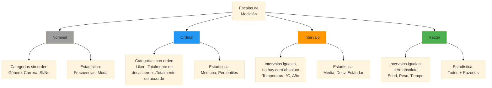
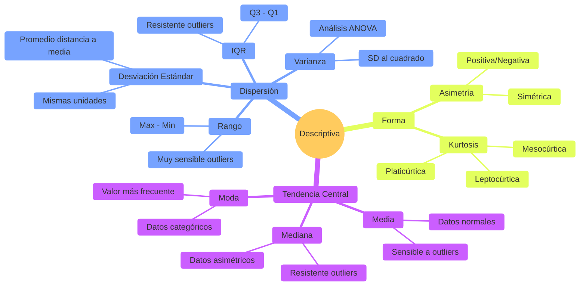
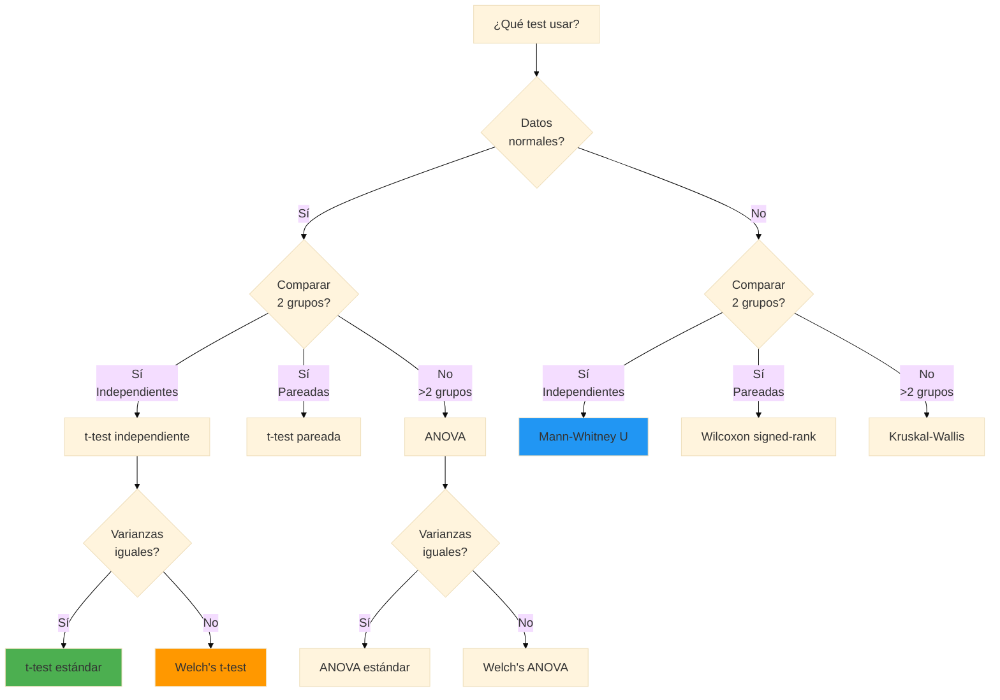
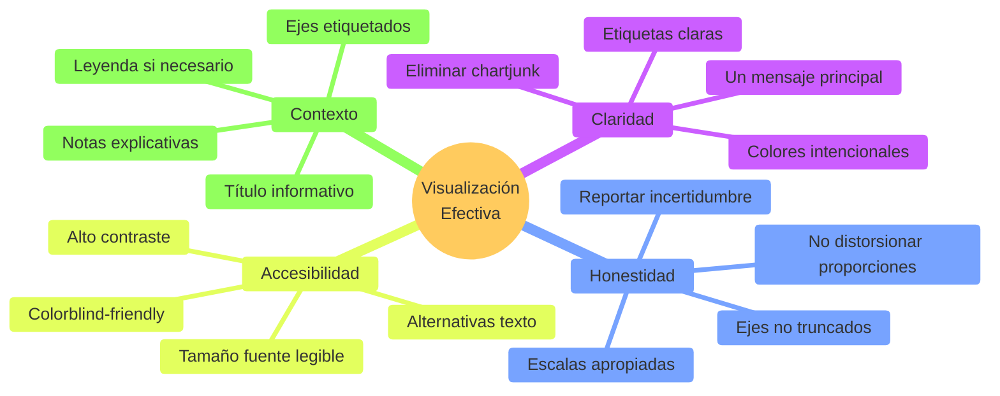
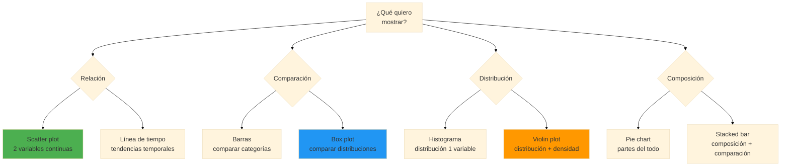
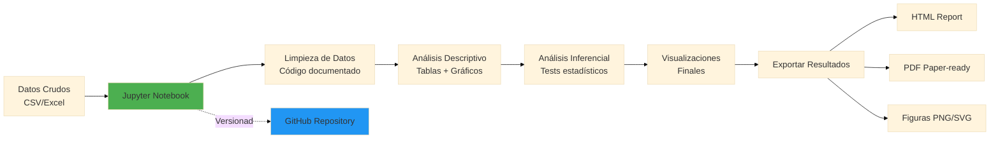
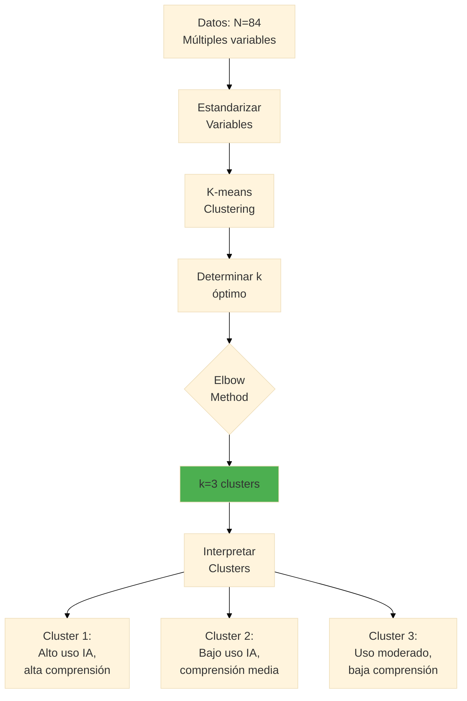

# 📊 Análisis de Datos y Visualización

**Duración:** 4 horas  
**Nivel:** Intermedio-Avanzado  
**Track:** Investigación y Academia

## ¿Qué Vas a Lograr?

Al completar este módulo, vas a poder:

- [ ] Realizar análisis estadísticos descriptivos e inferenciales con Python/R
- [ ] Crear visualizaciones profesionales que comuniquen hallazgos efectivamente
- [ ] Verificar supuestos de tests estadísticos y elegir alternativas apropiadas
- [ ] Implementar análisis de reproducibilidad con Jupyter Notebooks
- [ ] Aplicar machine learning básico para análisis exploratorio de datos
- [ ] Automatizar reportes de análisis con OpenCode

---

## La Analogía del Detective de Datos

Imagina que sos un detective forense analizando evidencia en una escena del crimen. Tenés huellas digitales, fibras de tela, manchas de sangre - pero los datos crudos no te dicen nada por sí solos. Necesitás:

1. **Organizar** la evidencia (limpieza de datos)
2. **Analizar** patrones (estadística descriptiva)
3. **Comparar** con bases de datos (estadística inferencial)
4. **Visualizar** conexiones (gráficos)
5. **Presentar** conclusiones ante un juez (reportes reproducibles)

El análisis de datos de investigación es exactamente igual. OpenCode es tu asistente de laboratorio forense que acelera el procesamiento, pero VOS sos el detective que interpreta los resultados y construye el caso.

---

## Parte 1: Fundamentos de Análisis Estadístico

### 1.1 Niveles de Medición



**Implicación Crítica**: El nivel de medición determina qué estadística puedes usar.

❌ **Error común**: Calcular media de datos Likert (ordinal)  
✅ **Correcto**: Usar mediana o tratar como ordinal en análisis

### 1.2 Estadística Descriptiva



**Ejemplo con Python**:

```python
import pandas as pd
import numpy as np
import matplotlib.pyplot as plt
import seaborn as sns

# Cargar datos de encuesta FPUNA
df = pd.read_csv('datos_comprension_ia.csv')

# Estadística descriptiva
print(df[['edad', 'comprension_pretest', 'comprension_postest']].describe())

"""
Output esperado:
              edad  comprension_pretest  comprension_postest
count     84.000000            84.000000            84.000000
mean      19.238095            45.500000            52.380952
std        1.523456             8.234567             9.876543
min       17.000000            28.000000            32.000000
25%       18.000000            40.000000            46.000000
50%       19.000000            46.000000            53.000000
75%       20.000000            51.000000            59.000000
max       23.000000            60.000000            60.000000
"""

# Histogramas
fig, axes = plt.subplots(1, 2, figsize=(12, 4))
df['comprension_pretest'].hist(ax=axes[0], bins=15, edgecolor='black')
axes[0].set_title('Distribución Pre-test')
axes[0].set_xlabel('Puntuación')
axes[0].set_ylabel('Frecuencia')

df['comprension_postest'].hist(ax=axes[1], bins=15, edgecolor='black')
axes[1].set_title('Distribución Post-test')
axes[1].set_xlabel('Puntuación')

plt.tight_layout()
plt.show()

# Verificar normalidad
from scipy.stats import shapiro
stat_pre, p_pre = shapiro(df['comprension_pretest'])
stat_post, p_post = shapiro(df['comprension_postest'])

print(f"Shapiro-Wilk Pre-test: W={stat_pre:.3f}, p={p_pre:.3f}")
print(f"Shapiro-Wilk Post-test: W={stat_post:.3f}, p={p_post:.3f}")

if p_pre > 0.05 and p_post > 0.05:
    print("✅ Distribuciones normales - usar tests paramétricos")
else:
    print("⚠️ Distribuciones NO normales - considerar tests no paramétricos")
```

### 1.3 Supuestos de Tests Estadísticos



**Checklist de Supuestos**:

✅ **Para t-test**:
- [ ] Normalidad (Shapiro-Wilk p > 0.05 o n > 30 por TLC)
- [ ] Homogeneidad de varianzas (Levene's test p > 0.05)
- [ ] Independencia de observaciones
- [ ] Variable dependiente en escala intervalo/razón

✅ **Para ANOVA**:
- [ ] Normalidad en cada grupo
- [ ] Homogeneidad de varianzas (Levene's test)
- [ ] Independencia de observaciones
- [ ] Variable dependiente continua

### 1.4 Análisis de Datos: Ejemplo Completo

**Pregunta de Investigación**: ¿El uso de ChatGPT afecta la comprensión conceptual de programación?

**Hipótesis**:
- H0: μ_experimental = μ_control (no hay diferencia)
- Ha: μ_experimental ≠ μ_control (hay diferencia)

```python
import pandas as pd
from scipy import stats
import numpy as np

# Cargar datos
df = pd.read_csv('datos_fpuna_ia.csv')

# Separar grupos
grupo_exp = df[df['grupo'] == 'experimental']['comprension_postest']
grupo_ctrl = df[df['grupo'] == 'control']['comprension_postest']

print(f"Grupo Experimental: n={len(grupo_exp)}, M={grupo_exp.mean():.2f}, SD={grupo_exp.std():.2f}")
print(f"Grupo Control: n={len(grupo_ctrl)}, M={grupo_ctrl.mean():.2f}, SD={grupo_ctrl.std():.2f}")

# PASO 1: Verificar supuestos
# 1.1 Normalidad
_, p_exp = stats.shapiro(grupo_exp)
_, p_ctrl = stats.shapiro(grupo_ctrl)
print(f"\nNormalidad Experimental: p={p_exp:.3f}")
print(f"Normalidad Control: p={p_ctrl:.3f}")

# 1.2 Homogeneidad de varianzas
_, p_levene = stats.levene(grupo_exp, grupo_ctrl)
print(f"Levene's test: p={p_levene:.3f}")

# PASO 2: Elegir test apropiado
if p_exp > 0.05 and p_ctrl > 0.05:
    print("\n✅ Datos normales - usar t-test")
    
    if p_levene > 0.05:
        print("✅ Varianzas homogéneas - t-test estándar")
        t_stat, p_value = stats.ttest_ind(grupo_exp, grupo_ctrl)
        test_usado = "t-test independiente"
    else:
        print("⚠️ Varianzas NO homogéneas - Welch's t-test")
        t_stat, p_value = stats.ttest_ind(grupo_exp, grupo_ctrl, equal_var=False)
        test_usado = "Welch's t-test"
else:
    print("\n⚠️ Datos NO normales - usar Mann-Whitney U")
    t_stat, p_value = stats.mannwhitneyu(grupo_exp, grupo_ctrl, alternative='two-sided')
    test_usado = "Mann-Whitney U"

# PASO 3: Calcular effect size (Cohen's d)
pooled_std = np.sqrt(((len(grupo_exp)-1)*grupo_exp.std()**2 + 
                       (len(grupo_ctrl)-1)*grupo_ctrl.std()**2) / 
                      (len(grupo_exp) + len(grupo_ctrl) - 2))
cohens_d = (grupo_exp.mean() - grupo_ctrl.mean()) / pooled_std

# PASO 4: Interpretar resultados
print(f"\n{'='*50}")
print(f"RESULTADOS DEL ANÁLISIS")
print(f"{'='*50}")
print(f"Test usado: {test_usado}")
print(f"Estadístico: {t_stat:.3f}")
print(f"p-value: {p_value:.4f}")
print(f"Cohen's d: {cohens_d:.3f}")

alpha = 0.05
if p_value < alpha:
    print(f"\n✅ RESULTADO SIGNIFICATIVO (p < {alpha})")
    print(f"Rechazamos H0: Hay evidencia de diferencia entre grupos")
    
    if abs(cohens_d) < 0.2:
        efecto = "trivial"
    elif abs(cohens_d) < 0.5:
        efecto = "pequeño"
    elif abs(cohens_d) < 0.8:
        efecto = "mediano"
    else:
        efecto = "grande"
    
    print(f"Tamaño del efecto: {efecto} (d={cohens_d:.2f})")
else:
    print(f"\n❌ NO SIGNIFICATIVO (p >= {alpha})")
    print(f"No rechazamos H0: Insuficiente evidencia de diferencia")

# PASO 5: Reportar en formato APA
diff_means = grupo_exp.mean() - grupo_ctrl.mean()
print(f"\nREPORTE APA:")
print(f"Los estudiantes del grupo experimental (M = {grupo_exp.mean():.2f}, SD = {grupo_exp.std():.2f}) ")
print(f"obtuvieron puntuaciones {'significativamente más altas' if diff_means > 0 and p_value < alpha else 'no significativamente diferentes'} ")
print(f"que el grupo control (M = {grupo_ctrl.mean():.2f}, SD = {grupo_ctrl.std():.2f}), ")
print(f"{test_usado}, t({len(grupo_exp)+len(grupo_ctrl)-2}) = {t_stat:.2f}, p = {p_value:.3f}, d = {cohens_d:.2f}.")
```

---

## Parte 2: Visualización de Datos Profesional

### 2.1 Principios de Visualización Efectiva



### 2.2 Elegir el Gráfico Apropiado



### 2.3 Galería de Visualizaciones con Código

**Box Plot Comparativo**:

```python
import matplotlib.pyplot as plt
import seaborn as sns

# Configurar estilo profesional
sns.set_style("whitegrid")
sns.set_context("notebook", font_scale=1.2)

# Datos
df = pd.read_csv('datos_fpuna_ia.csv')

# Box plot comparativo Pre vs Post por Grupo
fig, ax = plt.subplots(figsize=(10, 6))

# Reshape datos para seaborn
df_melted = pd.melt(df, 
                     id_vars=['grupo'], 
                     value_vars=['comprension_pretest', 'comprension_postest'],
                     var_name='momento', 
                     value_name='puntuacion')

# Crear box plot
sns.boxplot(data=df_melted, x='momento', y='puntuacion', hue='grupo', 
            palette=['#2196F3', '#FF9800'], ax=ax)

# Personalizar
ax.set_xlabel('Momento de Evaluación', fontsize=12, fontweight='bold')
ax.set_ylabel('Puntuación de Comprensión Conceptual', fontsize=12, fontweight='bold')
ax.set_title('Comprensión Conceptual: Pre-test vs Post-test por Grupo\nEstudio FPUNA 2026', 
             fontsize=14, fontweight='bold', pad=20)
ax.set_xticklabels(['Pre-test', 'Post-test'])
ax.legend(title='Grupo', labels=['Control', 'Experimental'])
ax.set_ylim(0, 65)

# Agregar línea de referencia
ax.axhline(y=30, color='red', linestyle='--', alpha=0.5, label='Umbral aprobación')

plt.tight_layout()
plt.savefig('comparacion_grupos_boxplot.png', dpi=300, bbox_inches='tight')
plt.show()
```

**Scatter Plot con Línea de Regresión**:

```python
# Relación entre horas de uso IA y comprensión
fig, ax = plt.subplots(figsize=(10, 6))

# Scatter plot
sns.scatterplot(data=df[df['grupo']=='experimental'], 
                x='horas_uso_ia', 
                y='comprension_postest',
                s=100, alpha=0.6, color='#2196F3')

# Línea de regresión
sns.regplot(data=df[df['grupo']=='experimental'],
            x='horas_uso_ia',
            y='comprension_postest',
            scatter=False, color='#FF5722', 
            line_kws={'linewidth': 2})

# Calcular correlación
from scipy.stats import pearsonr
r, p = pearsonr(df[df['grupo']=='experimental']['horas_uso_ia'], 
                df[df['grupo']=='experimental']['comprension_postest'])

# Personalizar
ax.set_xlabel('Horas de Uso de ChatGPT por Semana', fontsize=12, fontweight='bold')
ax.set_ylabel('Puntuación Post-test', fontsize=12, fontweight='bold')
ax.set_title(f'Relación Uso de IA y Comprensión Conceptual\nr = {r:.2f}, p = {p:.3f}', 
             fontsize=14, fontweight='bold', pad=20)

# Agregar nota
ax.text(0.05, 0.95, f'n = {len(df[df["grupo"]=="experimental"])} estudiantes\nGrupo Experimental',
        transform=ax.transAxes, fontsize=10, verticalalignment='top',
        bbox=dict(boxstyle='round', facecolor='wheat', alpha=0.3))

plt.tight_layout()
plt.savefig('correlacion_uso_ia_comprension.png', dpi=300, bbox_inches='tight')
plt.show()
```

**Violin Plot con Puntos Individuales**:

```python
fig, ax = plt.subplots(figsize=(10, 6))

# Violin plot
sns.violinplot(data=df, x='grupo', y='comprension_postest', 
               palette=['#2196F3', '#FF9800'], inner=None, ax=ax)

# Agregar puntos individuales
sns.stripplot(data=df, x='grupo', y='comprension_postest',
              color='black', alpha=0.3, size=4, ax=ax)

# Personalizar
ax.set_xlabel('Grupo', fontsize=12, fontweight='bold')
ax.set_ylabel('Puntuación Post-test', fontsize=12, fontweight='bold')
ax.set_title('Distribución de Comprensión Conceptual por Grupo\nViolin Plot con Observaciones Individuales',
             fontsize=14, fontweight='bold', pad=20)
ax.set_xticklabels(['Control\n(n=42)', 'Experimental\n(n=42)'])

plt.tight_layout()
plt.savefig('distribucion_violin_plot.png', dpi=300, bbox_inches='tight')
plt.show()
```

### 2.4 Visualización de Resultados Estadísticos

**Barras de Error con Intervalos de Confianza**:

```python
from scipy import stats

# Calcular medias y IC 95%
def mean_confidence_interval(data, confidence=0.95):
    n = len(data)
    m = np.mean(data)
    se = stats.sem(data)
    h = se * stats.t.ppf((1 + confidence) / 2., n-1)
    return m, h

# Calcular para cada grupo y momento
resultados = []
for grupo in ['control', 'experimental']:
    for momento in ['comprension_pretest', 'comprension_postest']:
        data = df[df['grupo']==grupo][momento]
        m, ci = mean_confidence_interval(data)
        resultados.append({
            'grupo': grupo,
            'momento': momento.replace('comprension_', ''),
            'media': m,
            'ci': ci
        })

df_summary = pd.DataFrame(resultados)

# Graficar
fig, ax = plt.subplots(figsize=(10, 6))

x = np.arange(2)  # Pre y Post
width = 0.35

# Barras
pre_ctrl = df_summary[(df_summary['grupo']=='control') & (df_summary['momento']=='pretest')]['media'].values[0]
post_ctrl = df_summary[(df_summary['grupo']=='control') & (df_summary['momento']=='postest')]['media'].values[0]
pre_exp = df_summary[(df_summary['grupo']=='experimental') & (df_summary['momento']=='pretest')]['media'].values[0]
post_exp = df_summary[(df_summary['grupo']=='experimental') & (df_summary['momento']=='postest')]['media'].values[0]

# Errores
pre_ctrl_err = df_summary[(df_summary['grupo']=='control') & (df_summary['momento']=='pretest')]['ci'].values[0]
post_ctrl_err = df_summary[(df_summary['grupo']=='control') & (df_summary['momento']=='postest')]['ci'].values[0]
pre_exp_err = df_summary[(df_summary['grupo']=='experimental') & (df_summary['momento']=='pretest')]['ci'].values[0]
post_exp_err = df_summary[(df_summary['grupo']=='experimental') & (df_summary['momento']=='postest')]['ci'].values[0]

rects1 = ax.bar(x - width/2, [pre_ctrl, post_ctrl], width, 
                yerr=[pre_ctrl_err, post_ctrl_err],
                label='Control', color='#2196F3', 
                capsize=5, error_kw={'linewidth': 2})

rects2 = ax.bar(x + width/2, [pre_exp, post_exp], width,
                yerr=[pre_exp_err, post_exp_err],
                label='Experimental', color='#FF9800',
                capsize=5, error_kw={'linewidth': 2})

# Personalizar
ax.set_ylabel('Puntuación Media (IC 95%)', fontsize=12, fontweight='bold')
ax.set_title('Comparación Pre-test vs Post-test por Grupo\nBarras de Error = Intervalo de Confianza 95%',
             fontsize=14, fontweight='bold', pad=20)
ax.set_xticks(x)
ax.set_xticklabels(['Pre-test', 'Post-test'])
ax.legend(title='Grupo', fontsize=11)
ax.set_ylim(0, 65)

# Agregar valores encima de barras
def autolabel(rects, errors):
    for i, rect in enumerate(rects):
        height = rect.get_height()
        ax.annotate(f'{height:.1f}±{errors[i]:.1f}',
                    xy=(rect.get_x() + rect.get_width() / 2, height),
                    xytext=(0, 3),
                    textcoords="offset points",
                    ha='center', va='bottom',
                    fontsize=9, fontweight='bold')

autolabel(rects1, [pre_ctrl_err, post_ctrl_err])
autolabel(rects2, [pre_exp_err, post_exp_err])

plt.tight_layout()
plt.savefig('comparacion_barras_ic.png', dpi=300, bbox_inches='tight')
plt.show()
```

---

## Parte 3: Reproducibilidad y Reportes Automatizados

### 3.1 Jupyter Notebooks para Análisis Reproducible



**Estructura de Notebook Profesional**:

```markdown
# Análisis de Datos - Efecto de IA en Comprensión Conceptual
# Estudio FPUNA 2026

## 1. Setup y Librerías

```python
import pandas as pd
import numpy as np
import matplotlib.pyplot as plt
import seaborn as sns
from scipy import stats
import warnings
warnings.filterwarnings('ignore')

# Configuración de visualización
sns.set_style("whitegrid")
plt.rcParams['figure.dpi'] = 100
plt.rcParams['savefig.dpi'] = 300

# Semilla para reproducibilidad
np.random.seed(42)

print("✅ Librerías cargadas")
print(f"Pandas version: {pd.__version__}")
print(f"NumPy version: {np.__version__}")
```

## 2. Carga y Exploración de Datos

```python
# Cargar datos
df = pd.read_csv('datos_fpuna_ia.csv')

# Verificar dimensiones
print(f"Dimensiones: {df.shape[0]} filas × {df.shape[1]} columnas")

# Primeras filas
display(df.head())

# Información de columnas
df.info()

# Verificar valores faltantes
print("\nValores faltantes por columna:")
print(df.isnull().sum())
```

## 3. Limpieza de Datos

```python
# Eliminar duplicados
df = df.drop_duplicates()
print(f"Duplicados eliminados. Dimensiones: {df.shape}")

# Manejar valores faltantes
# (Estrategia específica basada en análisis)
df = df.dropna(subset=['comprension_pretest', 'comprension_postest'])
print(f"Casos completos: {df.shape[0]}")

# Verificar tipos de datos
print("\nTipos de datos:")
print(df.dtypes)
```

## 4. Análisis Descriptivo

[Código de análisis descriptivo aquí]

## 5. Verificación de Supuestos

[Tests de normalidad, homogeneidad varianzas]

## 6. Análisis Inferencial

[Tests estadísticos]

## 7. Visualizaciones Finales

[Gráficos publication-ready]

## 8. Conclusiones

**Hallazgos principales:**
1. [Hallazgo 1]
2. [Hallazgo 2]
3. [Hallazgo 3]

**Limitaciones:**
- [Limitación 1]
- [Limitación 2]
```

### 3.2 Automatización con OpenCode

```bash
opencode "Genera análisis estadístico completo para mis datos:

DATOS:
@attach datos_fpuna_ia.csv

CONTEXTO:
- Diseño: Cuasi-experimental, 2 grupos (control vs experimental)
- N = 84 (42 por grupo)
- Variables:
  - IV: grupo (control/experimental)
  - DV: comprension_postest (0-60 escala continua)
  - Covariable: comprension_pretest

ANÁLISIS REQUERIDOS:
1. Estadística descriptiva por grupo (M, SD, Min, Max)
2. Verificar supuestos:
   - Normalidad (Shapiro-Wilk)
   - Homogeneidad varianzas (Levene)
3. Test principal:
   - ANCOVA con pretest como covariable
   - Si supuestos no se cumplen, alternativa no paramétrica
4. Effect size (Cohen's d o eta-squared)
5. Post-hoc si > 2 grupos

VISUALIZACIONES:
- Box plot comparativo
- Scatter plot con línea de regresión (pretest vs postest)
- Histogramas de distribución

OUTPUT:
- Jupyter Notebook completo (.ipynb)
- Código comentado en español
- Interpretación de resultados en markdown
- Figuras guardadas en /figuras/
- Reporte APA de resultados"
```

---

## Parte 4: Machine Learning para Análisis Exploratorio

### 4.1 Clustering para Identificar Grupos



**Código Python**:

```python
from sklearn.cluster import KMeans
from sklearn.preprocessing import StandardScaler
import matplotlib.pyplot as plt

# Seleccionar variables para clustering
vars_clustering = ['horas_uso_ia', 'comprension_postest', 
                   'motivacion', 'conocimiento_previo']
X = df[vars_clustering].dropna()

# Estandarizar
scaler = StandardScaler()
X_scaled = scaler.fit_transform(X)

# Elbow method para determinar k óptimo
inertias = []
K_range = range(2, 10)
for k in K_range:
    kmeans = KMeans(n_clusters=k, random_state=42)
    kmeans.fit(X_scaled)
    inertias.append(kmeans.inertia_)

# Graficar elbow
plt.figure(figsize=(8, 5))
plt.plot(K_range, inertias, marker='o', linewidth=2, markersize=8)
plt.xlabel('Número de Clusters (k)', fontsize=12)
plt.ylabel('Inertia (Within-Cluster Sum of Squares)', fontsize=12)
plt.title('Elbow Method para K-means', fontsize=14, fontweight='bold')
plt.grid(True, alpha=0.3)
plt.tight_layout()
plt.show()

# Aplicar k-means con k=3
kmeans = KMeans(n_clusters=3, random_state=42)
df['cluster'] = kmeans.fit_predict(X_scaled)

# Describir clusters
print("CARACTERÍSTICAS DE CADA CLUSTER:\n")
print(df.groupby('cluster')[vars_clustering].mean())

# Visualizar clusters
fig, ax = plt.subplots(figsize=(10, 6))
scatter = ax.scatter(df['horas_uso_ia'], df['comprension_postest'], 
                     c=df['cluster'], cmap='viridis', 
                     s=100, alpha=0.6, edgecolors='black')
ax.set_xlabel('Horas de Uso de IA', fontsize=12, fontweight='bold')
ax.set_ylabel('Comprensión Post-test', fontsize=12, fontweight='bold')
ax.set_title('K-means Clustering: Perfiles de Estudiantes', 
             fontsize=14, fontweight='bold')
plt.colorbar(scatter, label='Cluster')
plt.tight_layout()
plt.show()
```

### 4.2 Análisis de Componentes Principales (PCA)

**Cuándo usar**: Reducir dimensionalidad cuando tienes muchas variables correlacionadas.

```python
from sklearn.decomposition import PCA

# Variables para PCA (todas numéricas)
vars_pca = df.select_dtypes(include=[np.number]).columns.tolist()
X = df[vars_pca].dropna()

# Estandarizar
X_scaled = scaler.fit_transform(X)

# Aplicar PCA
pca = PCA()
X_pca = pca.fit_transform(X_scaled)

# Varianza explicada
var_explicada = pca.explained_variance_ratio_

# Scree plot
plt.figure(figsize=(10, 5))
plt.bar(range(1, len(var_explicada)+1), var_explicada, alpha=0.7)
plt.step(range(1, len(var_explicada)+1), 
         np.cumsum(var_explicada), where='mid', 
         label='Varianza Acumulada', color='red', linewidth=2)
plt.xlabel('Componente Principal', fontsize=12)
plt.ylabel('Proporción de Varianza Explicada', fontsize=12)
plt.title('Scree Plot - PCA', fontsize=14, fontweight='bold')
plt.legend()
plt.grid(True, alpha=0.3)
plt.tight_layout()
plt.show()

print(f"Primeros 3 componentes explican {np.sum(var_explicada[:3]):.1%} de varianza")
```

---

## Ejercicios Prácticos

### Ejercicio 1: Análisis Exploratorio Completo (60 min)

**Dataset**: `datos_estudiantes_fpuna.csv` (simulado, 100 estudiantes)

**Variables**:
- `edad`: 17-25 años
- `genero`: M/F
- `carrera`: Informática/Electrónica/Civil
- `promedio_previo`: 1.0-5.0
- `horas_estudio_semanal`: 0-40
- `uso_ia`: Sí/No
- `nota_final`: 1.0-5.0

**Tareas**:
1. Cargar y limpiar datos
2. Estadística descriptiva por carrera
3. Visualizar distribución de `nota_final` con histograma
4. Box plot de `nota_final` por `uso_ia`
5. Scatter plot `horas_estudio` vs `nota_final` coloreado por `uso_ia`
6. Calcular correlación de Pearson entre variables numéricas

**Entregable**:
- Jupyter Notebook (.ipynb)
- Al menos 4 visualizaciones profesionales
- Interpretación de cada análisis

---

### Ejercicio 2: Comparación de Grupos (90 min)

**Pregunta de Investigación**: ¿Los estudiantes que usan IA obtienen mejores notas?

**Tareas**:
1. Formular H0 y Ha
2. Verificar supuestos:
   - Normalidad (Shapiro-Wilk)
   - Homogeneidad varianzas (Levene)
3. Elegir test apropiado (t-test o Mann-Whitney)
4. Ejecutar test
5. Calcular effect size (Cohen's d)
6. Crear visualización (box plot o violin plot)
7. Reportar resultados en formato APA

**Entregable**:
- Script Python comentado
- Reporte de resultados (500 palabras)
- Figura publication-ready

---

### Ejercicio 3: Regresión Múltiple (120 min)

**Objetivo**: Predecir `nota_final` basado en múltiples predictores.

**Modelo**:
```
nota_final ~ horas_estudio + promedio_previo + uso_ia + carrera
```

**Tareas**:
1. Preparar datos (dummy coding para categóricas)
2. Ajustar modelo de regresión lineal múltiple
3. Interpretar coeficientes
4. Verificar supuestos de regresión:
   - Linealidad
   - Normalidad de residuos
   - Homocedasticidad
   - No multicolinealidad (VIF)
5. Calcular R² ajustado
6. Visualizar residuos

**Usar OpenCode para**:
- Generar código de regresión
- Interpretar coeficientes
- Verificar supuestos

**Entregable**:
- Jupyter Notebook completo
- Tabla de coeficientes con interpretación
- Gráficos de diagnóstico de residuos

---

## Checklist de Análisis de Datos Riguroso

### ✅ Preparación de Datos

- [ ] Datos cargados y explorados (dimensiones, tipos, primeras filas)
- [ ] Valores faltantes identificados y manejados apropiadamente
- [ ] Duplicados eliminados
- [ ] Outliers identificados y decisión documentada (mantener/eliminar)
- [ ] Variables categóricas codificadas correctamente
- [ ] Datos estandarizados si es necesario

### ✅ Análisis Descriptivo

- [ ] Estadística descriptiva completa (M, SD, Min, Max, Mediana, IQR)
- [ ] Distribuciones visualizadas (histogramas, box plots)
- [ ] Correlaciones exploradas entre variables
- [ ] Tablas de frecuencia para categóricas

### ✅ Verificación de Supuestos

- [ ] Normalidad verificada (Shapiro-Wilk, Q-Q plots)
- [ ] Homogeneidad de varianzas verificada (Levene's test)
- [ ] Independencia de observaciones confirmada (diseño)
- [ ] Linealidad verificada (para regresión)
- [ ] No multicolinealidad (VIF < 10 para regresión)

### ✅ Análisis Inferencial

- [ ] Hipótesis nula y alterna formuladas a priori
- [ ] Test estadístico apropiado elegido y justificado
- [ ] Nivel α establecido (típicamente 0.05)
- [ ] Test ejecutado correctamente
- [ ] p-value reportado con precisión
- [ ] Effect size calculado e interpretado
- [ ] Intervalos de confianza reportados cuando apropiado

### ✅ Visualización

- [ ] Gráficos apropiados para tipo de datos y pregunta
- [ ] Ejes etiquetados claramente
- [ ] Títulos informativos
- [ ] Leyendas cuando necesario
- [ ] Colores intencionales y accesibles
- [ ] Calidad publication-ready (alta resolución)

### ✅ Reproducibilidad

- [ ] Código documentado con comentarios
- [ ] Semilla aleatoria establecida (random seed)
- [ ] Versiones de librerías reportadas
- [ ] Datos crudos preservados (no sobreescribir)
- [ ] Análisis en notebook o script versionado (GitHub)

---

## Recursos Esenciales

### Software y Librerías

| Herramienta | Propósito | Instalación |
|-------------|-----------|-------------|
| **Python** | Lenguaje | `python.org` |
| **Anaconda** | Distribución Python + Jupyter | `anaconda.com` |
| **pandas** | Manipulación datos | `pip install pandas` |
| **numpy** | Computación numérica | `pip install numpy` |
| **scipy** | Estadística | `pip install scipy` |
| **matplotlib** | Visualización base | `pip install matplotlib` |
| **seaborn** | Visualización estadística | `pip install seaborn` |
| **scikit-learn** | Machine learning | `pip install scikit-learn` |
| **statsmodels** | Modelos estadísticos | `pip install statsmodels` |

### Recursos de Aprendizaje

**Libros**:
- VanderPlas, J. (2016). *Python Data Science Handbook*. O'Reilly. [Gratis online]
- McKinney, W. (2017). *Python for Data Analysis* (2nd ed.). O'Reilly.
- Bruce, P., & Bruce, A. (2017). *Practical Statistics for Data Scientists*. O'Reilly.

**Cursos Online**:
- Kaggle Learn: Data Visualization (kaggle.com/learn)
- DataCamp: Statistical Thinking in Python
- Coursera: Applied Data Science with Python (University of Michigan)

**Cheat Sheets**:
- Pandas: datacamp.com/cheat-sheet/pandas-cheat-sheet-for-data-science-in-python
- Matplotlib: matplotlib.org/cheatsheets
- Seaborn: seaborn.pydata.org/tutorial.html

---

## Contexto Paraguay: Análisis de Datos en FPUNA

### Software Disponible

**Laboratorios FPUNA**:
- ✅ Python (Anaconda) instalado en laboratorios de computación
- ✅ R + RStudio en algunos laboratorios
- ✅ SPSS (licencia institucional limitada)

**Para tu computadora**:
- Anaconda Individual Edition (gratis)
- Google Colab (gratis, cloud-based Jupyter)

### Soporte Estadístico

**Unidad de Estadística FPUNA**:
- Asesoría gratuita para estudiantes de tesis/investigación
- Talleres de análisis de datos (verificar cronograma)
- Email: estadistica@fpuna.edu.py

---

## Próximos Pasos

Una vez que domines análisis de datos:

1. **Módulo 4: Redacción Académica** → Escribir sección de Resultados
2. **Módulo 5: Presentación y Publicación** → Comunicar hallazgos

---

## Reflexión Final

**Análisis de datos NO es solo "correr tests" - es ARTE y CIENCIA.**

Un análisis riguroso:

✅ Responde la pregunta de investigación HONESTAMENTE  
✅ Respeta los supuestos estadísticos  
✅ Visualiza datos de forma CLARA y HONESTA  
✅ Es REPRODUCIBLE por otros investigadores  
✅ Reconoce LIMITACIONES transparentemente

**La IA no interpreta tus datos - VOS los interpretas.**

Usa OpenCode para:
- Generar código estadístico rápidamente
- Crear visualizaciones profesionales
- Verificar supuestos automáticamente
- Automatizar reportes

Pero SIEMPRE vos sos el responsable de:
- Elegir tests apropiados
- Interpretar significancia práctica (no solo estadística)
- Detectar patrones significativos
- Comunicar limitaciones

**Tu trabajo: Pensar críticamente, interpretar con contexto, comunicar honestamente.**  
**Trabajo de la IA: Calcular rápido, graficar eficientemente, automatizar tareas repetitivas.**

---

**¿Preguntas?** Consulta con tu instructor o en Slack #research-academia-2026

**Próximo módulo:** [04 - Redacción Académica con IA](./04-redaccion-academica.md)
