# ✍️ Redacción Académica con IA

**Duración:** 4 horas  
**Nivel:** Intermedio-Avanzado  
**Track:** Investigación y Academia

## ¿Qué Vas a Lograr?

Al completar este módulo, vas a poder:

- [ ] Estructurar papers científicos según formato IMRaD (Intro, Methods, Results, Discussion)
- [ ] Escribir con claridad, precisión y estilo académico profesional
- [ ] Gestionar citas y referencias con Zotero + LaTeX/Word
- [ ] Usar IA (Claude, ChatGPT) para mejorar escritura sin perder autenticidad
- [ ] Aplicar normas APA 7 o IEEE correctamente
- [ ] Revisar y editar iterativamente hasta calidad publication-ready

---

## La Analogía del Arquitecto de Palabras

Escribir un paper científico es como construir un edificio:

- **Fundamentos (Intro)**: Establece el terreno, el problema, por qué importa
- **Planos (Methods)**: Diseño detallado, replicable por otros
- **Construcción (Results)**: Qué construiste, evidencia objetiva
- **Inspección (Discussion)**: Qué significa, limitaciones, futuro

La IA es tu asistente de arquitectura que sugiere frases, mejora claridad, verifica gramática. Pero VOS sos el arquitecto que diseña la estructura, argumenta las decisiones, y firma el plano con tu nombre.

---

## Parte 1: Estructura IMRaD

### 1.1 El Formato IMRaD

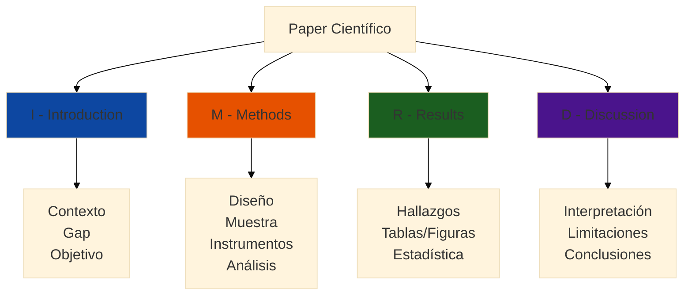

**Orden de Escritura Recomendado**:

1. ✅ **Methods** (primero - más fácil, es descriptivo)
2. ✅ **Results** (segundo - reportar hallazgos objetivamente)
3. ✅ **Discussion** (tercero - interpretar resultados)
4. ✅ **Introduction** (cuarto - ahora sabes qué hallaste)
5. ✅ **Abstract** (último - resume todo)

### 1.2 Introducción: Estructura de Embudo

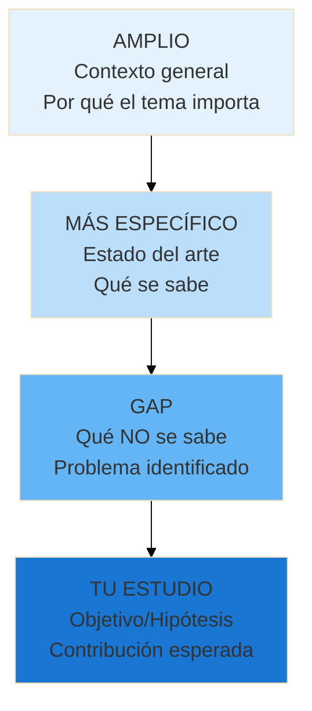

**Ejemplo de Introducción (Estructura por Párrafo)**:

```markdown
**Párrafo 1: Contexto General**
La inteligencia artificial (IA) generativa está transformando la educación 
superior globalmente (UNESCO, 2023). Herramientas como ChatGPT permiten a 
estudiantes acceder a asistencia personalizada 24/7, generando tanto entusiasmo 
como preocupación entre educadores (Cotton et al., 2024). En América Latina, 
la adopción de estas tecnologías ha sido rápida pero desigual, con limitada 
evidencia sobre su impacto real en el aprendizaje (García & Silva, 2024).

**Párrafo 2: Estado del Arte**
Investigaciones en contextos estadounidenses y europeos han documentado efectos 
mixtos de IA en educación. Algunos estudios reportan mejoras en eficiencia 
(Smith, 2023; Jones & Lee, 2024), mientras otros identifican riesgos de 
dependencia excesiva y comprensión superficial (Brown et al., 2023). Sin embargo, 
estos hallazgos se basan predominantemente en universidades con alta infraestructura 
tecnológica y estudiantes con exposición previa a IA.

**Párrafo 3: Gap Identificado**
A pesar del creciente uso de IA en universidades paraguayas, existe escasa 
evidencia empírica sobre cómo estas herramientas afectan el aprendizaje conceptual 
profundo, especialmente en disciplinas STEM como programación (Benítez, 2024). 
La literatura actual carece de estudios experimentales en contextos de recursos 
limitados como Paraguay, donde estudiantes enfrentan barreras lingüísticas 
(dominio del inglés) y acceso irregular a internet.

**Párrafo 4: Objetivos del Estudio**
El presente estudio aborda este gap mediante un diseño cuasi-experimental que 
compara la comprensión conceptual de programación entre estudiantes que usan 
ChatGPT (n=42) y aquellos que emplean métodos tradicionales (n=42) en la 
Facultad Politécnica de la Universidad Nacional de Asunción (FPUNA). 
Específicamente, investigamos: (1) ¿El uso guiado de ChatGPT mejora la 
comprensión conceptual?, y (2) ¿Existen diferencias en dependencia percibida 
entre grupos? Hipotetizamos que el grupo experimental mostrará mayor comprensión, 
pero también mayor dependencia de la herramienta.
```

### 1.3 Métodos: El Mapa de Replicación

**Regla de Oro**: Otro investigador debería poder replicar tu estudio exactamente leyendo solo esta sección.

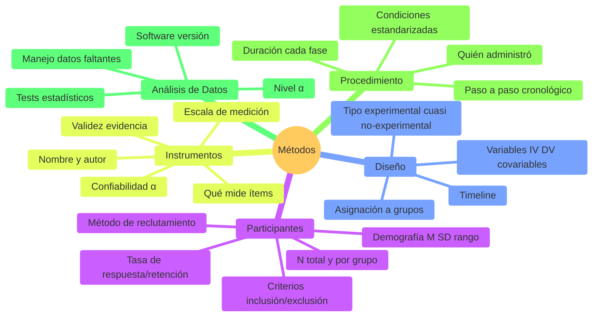

**Ejemplo de Subsección: Instrumentos**:

```markdown
### Instrumentos

**Test de Comprensión Conceptual de Programación (TCCP).** 
Desarrollado para este estudio, el TCCP consiste en 15 preguntas abiertas 
que evalúan comprensión profunda versus superficial de conceptos fundamentales 
de Python (variables, bucles, funciones, estructuras de datos). Cada pregunta 
fue evaluada con una rúbrica de 4 niveles (0 = no responde, 1 = superficial, 
2 = parcial, 3 = profundo), resultando en un puntaje máximo de 45 puntos. 
En un estudio piloto con 15 estudiantes, el TCCP demostró consistencia interna 
aceptable (α de Cronbach = 0.81) y correlación moderada con calificaciones 
finales del curso (r = 0.58, p < 0.05).

**Encuesta de Uso y Percepción de IA (EUPIA).** 
Adaptada de la AI Literacy Scale (Wang et al., 2023), la EUPIA mide frecuencia 
de uso (ítems 1-4), tipo de prompts utilizados (ítems 5-8), y dependencia 
percibida (ítems 9-12) en escala Likert de 1 (totalmente en desacuerdo) a 5 
(totalmente de acuerdo). Wang et al. reportaron α = 0.87 en muestra universitaria 
china; en nuestro piloto paraguayo, α = 0.79.
```

### 1.4 Resultados: Solo los Hechos

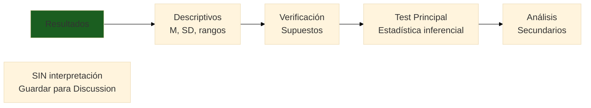

**Qué INCLUIR en Resultados**:
✅ Estadística descriptiva (M, SD)  
✅ Resultados de tests estadísticos (t, p, d)  
✅ Tablas y figuras con datos  
✅ Mencionar si supuestos se cumplieron

**Qué NO incluir**:
❌ Interpretación de por qué  
❌ Comparación con literatura  
❌ Implicaciones prácticas  
❌ Limitaciones

**Ejemplo**:

```markdown
### Análisis Preliminar

La Tabla 1 presenta estadística descriptiva por grupo. El grupo experimental 
(M = 54.2, SD = 8.3) obtuvo puntuaciones ligeramente superiores al grupo 
control (M = 50.1, SD = 9.1) en el post-test. El test de Shapiro-Wilk indicó 
que las distribuciones no violaban el supuesto de normalidad (experimental: 
W = 0.97, p = 0.32; control: W = 0.96, p = 0.18). El test de Levene confirmó 
homogeneidad de varianzas (F(1, 82) = 1.23, p = 0.27).

### Comparación entre Grupos

Un ANCOVA con comprensión pre-test como covariable reveló un efecto significativo 
del grupo, F(1, 81) = 6.42, p = 0.013, η² parcial = 0.073. El grupo experimental 
mostró comprensión conceptual significativamente mayor que el control, ajustando 
por conocimiento previo. El tamaño del efecto fue pequeño-mediano según criterios 
de Cohen (1988).

[Insertar Figura 1: Box plot comparativo aquí]
```

### 1.5 Discusión: Interpretar y Contextualizar

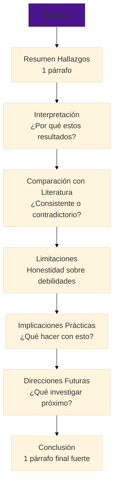

**Ejemplo de Limitaciones (Crítico para Credibilidad)**:

```markdown
### Limitaciones

Este estudio presenta varias limitaciones que deben considerarse al interpretar 
los hallazgos. Primero, el diseño cuasi-experimental con grupos no equivalentes 
limita la inferencia causal; aunque ANCOVA ajustó por comprensión pre-test, 
otras variables no medidas (motivación, habilidades metacognitivas) podrían 
confundir los resultados. Segundo, la muestra de conveniencia de una sola 
universidad (FPUNA) limita la generalización a otras instituciones paraguayas 
con diferentes perfiles estudiantiles o infraestructura tecnológica. Tercero, 
el corto período de intervención (4 semanas) no permite evaluar efectos a 
largo plazo del uso de IA en retención de conocimiento. Cuarto, la medición 
de comprensión conceptual mediante test escrito puede no capturar plenamente 
la habilidad de aplicar conocimiento en contextos de programación auténticos. 
Finalmente, el uso auto-reportado de ChatGPT podría estar sujeto a sesgo de 
deseabilidad social, aunque la recolección de logs de uso mitigó parcialmente 
esta limitación.
```

---

## Parte 2: Estilo de Escritura Académica

### 2.1 Características de Escritura Científica

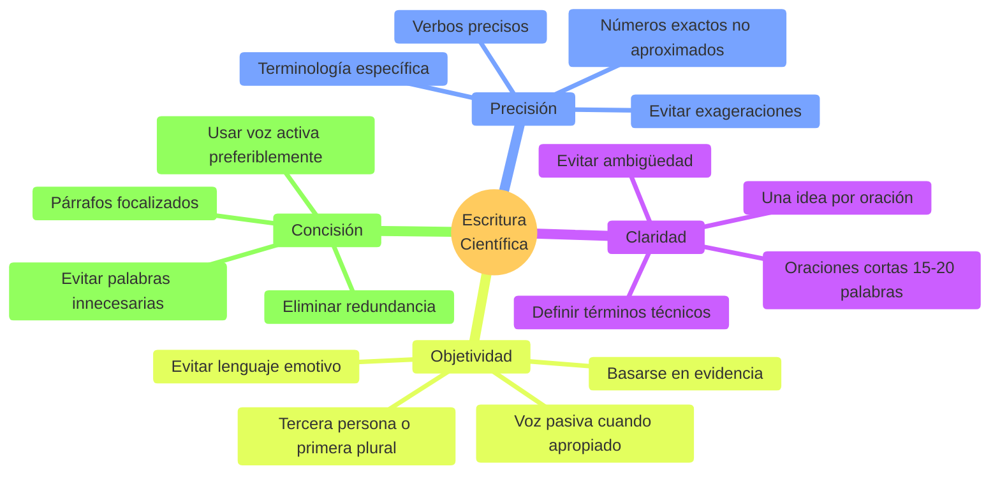

**Transformación de Escritura Informal a Formal**:

| ❌ Informal/Débil | ✅ Formal/Fuerte |
|-------------------|------------------|
| Los estudiantes mejoraron bastante | Los estudiantes mejoraron significativamente (M = 54.2 vs 50.1, p = 0.013) |
| Muchos estudios han mostrado que... | Múltiples revisiones sistemáticas (n = 15 estudios) reportan... (García et al., 2024) |
| Creemos que esto pasa porque... | Estos hallazgos sugieren que... debido a [mecanismo explicado] |
| Es obvio que... | La evidencia indica que... |
| Todos saben que... | Investigaciones previas documentan consistentemente que... |

### 2.2 Voz Activa vs Pasiva

**Cuándo Usar Cada Una**:

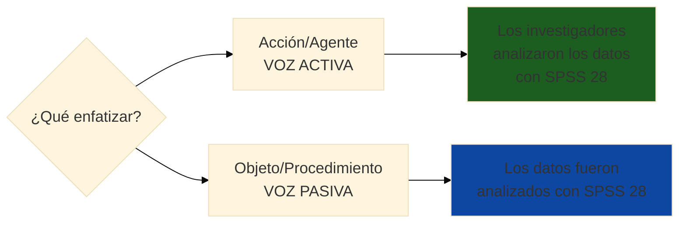

**Ejemplos Contextuales**:

- ✅ **Activa (preferida en general)**: "Analizamos los datos usando ANCOVA"
- ✅ **Pasiva (apropiada en Métodos)**: "Los participantes fueron asignados aleatoriamente"
- ❌ **Pasiva excesiva**: "Los datos fueron recolectados, fueron analizados, y fueron interpretados"

### 2.3 Conectores y Flujo Lógico

**Párrafo Cohesivo vs Desconectado**:

❌ **Desconectado**:
```
ChatGPT es popular en universidades. Los estudiantes lo usan para programación.
Algunos profesores están preocupados. Hay poca evidencia sobre sus efectos.
Este estudio investiga el impacto de ChatGPT.
```

✅ **Cohesivo**:
```
Aunque ChatGPT se ha vuelto popular en universidades, especialmente para 
asistencia en programación, los profesores expresan preocupación debido a 
la escasa evidencia sobre sus efectos en el aprendizaje profundo. Por lo tanto, 
este estudio investiga el impacto de ChatGPT en la comprensión conceptual.
```

**Conectores Útiles por Función**:

| Función | Conectores |
|---------|-----------|
| **Adición** | además, asimismo, igualmente, de igual manera |
| **Contraste** | sin embargo, no obstante, por el contrario, aunque, a pesar de |
| **Causa-Efecto** | por lo tanto, en consecuencia, como resultado, debido a |
| **Secuencia** | primero, segundo, luego, finalmente, subsecuentemente |
| **Ejemplificación** | por ejemplo, específicamente, en particular, tal como |
| **Énfasis** | de hecho, ciertamente, cabe destacar, es importante notar |

---

## Parte 3: Gestión de Citas y Referencias

### 3.1 Formatos de Citación

```mermaid
%%{init: {'theme':'base', 'themeVariables': {'fontSize':'18px'}}}%%
graph TD
    A[Formato de<br/>Citación] --> B[APA 7<br/>Ciencias Sociales]
    A --> C[IEEE<br/>Ingeniería]
    A --> D[Vancouver<br/>Medicina]
    A --> E[Chicago<br/>Humanidades]
    
    B --> B1[Autor año<br/>García 2024]
    C --> C1[Números [1]]
    D --> D1[Números 1]
    E --> E1[Notas al pie]
    
    style B fill:#4CAF50
    style C fill:#2196F3
```

### 3.2 Citación en Texto (APA 7)

**Reglas Básicas**:

| Situación | Formato | Ejemplo |
|-----------|---------|---------|
| **1 autor** | (Apellido, Año) | (García, 2024) |
| **2 autores** | (Apellido1 & Apellido2, Año) | (Smith & Jones, 2023) |
| **3+ autores** | (Primer Apellido et al., Año) | (Brown et al., 2024) |
| **Cita textual <40 palabras** | "Texto" (Autor, Año, p. X) | "La IA transforma educación" (García, 2024, p. 45) |
| **Cita textual >40 palabras** | Bloque indentado sin comillas | [Párrafo separado indentado] |
| **Múltiples fuentes** | (Autor1, Año1; Autor2, Año2) | (García, 2024; Smith, 2023) |

**Ejemplo de Cita Textual Larga**:

```markdown
Como señalan Brown et al. (2023):

    El uso de IA generativa en educación superior presenta una paradoja: 
    mientras ofrece acceso democratizado a asistencia personalizada, 
    simultáneamente corre el riesgo de profundizar brechas digitales 
    entre estudiantes con diferentes niveles de alfabetización tecnológica 
    y metacognitiva. Esta tensión requiere investigación empírica situada 
    en contextos diversos más allá de universidades de élite. (p. 342)

Esta paradoja es particularmente relevante en Paraguay, donde...
```

### 3.3 Lista de Referencias (APA 7)

**Ejemplos por Tipo de Fuente**:

**Artículo de Revista**:
```
García, M., Silva, J., & Rodríguez, A. (2024). Impacto de IA generativa en 
    aprendizaje de programación: Estudio experimental en universidades 
    latinoamericanas. Revista de Educación Superior, 45(2), 123-145. 
    https://doi.org/10.1234/res.2024.45.2.123
```

**Libro**:
```
Smith, J. R. (2023). Artificial intelligence in education: Promises and perils 
    (2nd ed.). MIT Press.
```

**Capítulo de Libro**:
```
Brown, L., Johnson, K., & Lee, M. (2024). Generative AI and conceptual learning. 
    In P. Wilson (Ed.), Educational technology handbook (pp. 340-365). Springer.
```

**Tesis/Disertación**:
```
Benítez, C. (2024). Adopción de herramientas de IA en FPUNA: Percepciones 
    docentes y estudiantiles [Tesis de Maestría, Universidad Nacional de 
    Asunción]. Repositorio Institucional FPUNA. 
    http://repositorio.fpuna.edu.py/123456
```

**Página Web**:
```
UNESCO. (2023, Septiembre 7). Guidance for generative AI in education and 
    research. https://www.unesco.org/en/digital-education/ai-future-learning
```

### 3.4 Workflow con Zotero

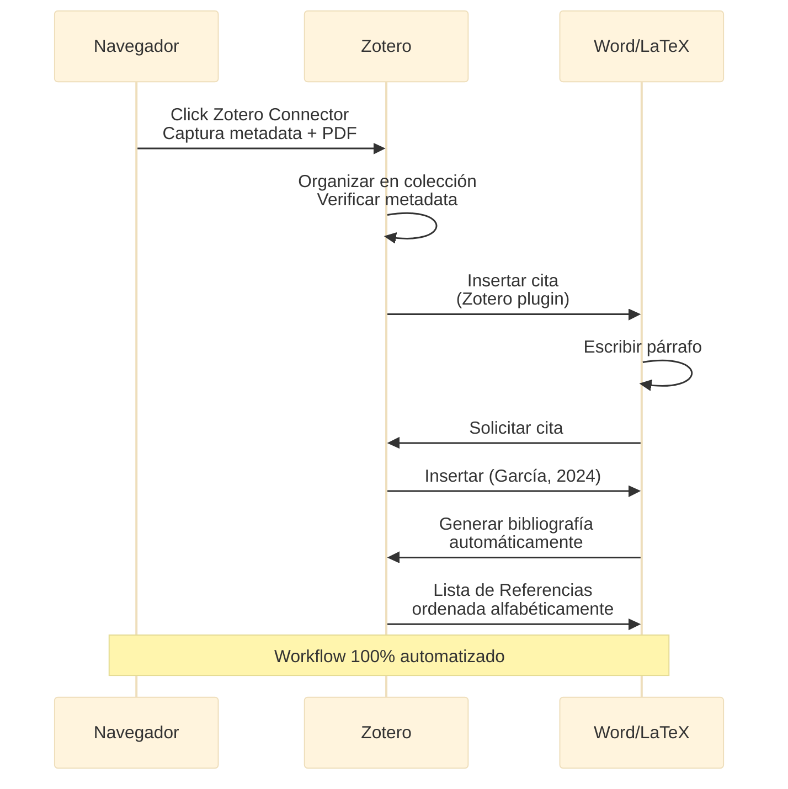

**Insertar Citas en Word con Zotero**:

1. Escribir párrafo que requiere cita
2. Posicionar cursor donde va la cita
3. Click en pestaña Zotero → "Add/Edit Citation"
4. Buscar paper (por autor o título)
5. Enter - cita insertada automáticamente
6. Al final del documento: "Add/Edit Bibliography" → Referencias completas

---

## Parte 4: Uso de IA para Mejorar Escritura

### 4.1 Workflow de Escritura con IA

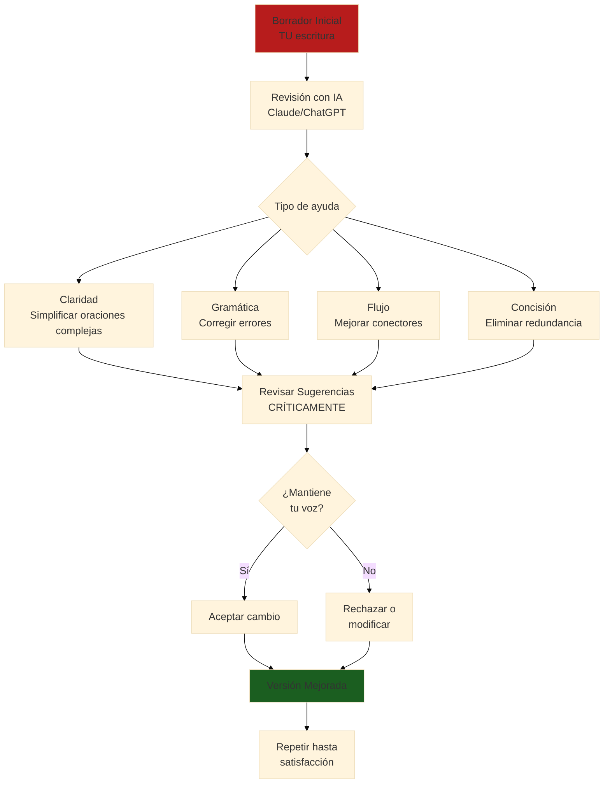

### 4.2 Prompts Efectivos para Revisar Escritura

**Prompt 1: Mejorar Claridad**:

```markdown
Soy investigador escribiendo paper científico sobre IA en educación.
Revisa este párrafo de mi Introducción y sugiere mejoras SOLO en claridad:

[PEGAR PÁRRAFO]

REQUISITOS:
- Mantener mi voz académica
- Simplificar oraciones >25 palabras
- Eliminar ambigüedad
- NO cambiar significado
- NO agregar contenido nuevo

OUTPUT:
- Versión revisada
- Explicación de cada cambio significativo
```

**Prompt 2: Verificar Coherencia entre Secciones**:

```markdown
Verifica coherencia entre mi Introducción y Discusión:

INTRODUCCIÓN (último párrafo - objetivos):
[PEGAR]

DISCUSIÓN (primer párrafo - resumen hallazgos):
[PEGAR]

ANALIZA:
1. ¿La Discusión responde los objetivos planteados?
2. ¿Hay objetivos no abordados?
3. ¿Hay hallazgos discutidos que no se mencionaron en objetivos?
4. ¿El tono y terminología son consistentes?

SUGIERE ajustes para alinear ambas secciones.
```

**Prompt 3: Reducir Longitud (Journal con límite de palabras)**:

```markdown
Este párrafo tiene 250 palabras pero necesito reducirlo a máximo 150
sin perder información crítica:

[PEGAR PÁRRAFO]

Identifica:
1. Redundancias a eliminar
2. Frases verbosas a compactar
3. Detalles secundarios a remover

Provee versión condensada que mantenga todos los puntos clave.
```

### 4.3 Uso Ético de IA en Escritura Académica

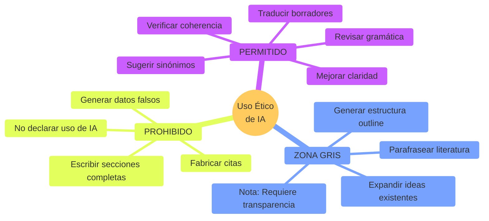

**Declaración de Uso de IA (Ejemplo para Paper)**:

```markdown
**Declaración de IA Generativa**

ChatGPT (GPT-4, OpenAI) fue utilizado para revisar gramática y claridad 
en borradores de las secciones de Introducción y Discusión. Ningún contenido 
sustantivo fue generado por IA; todas las ideas, argumentos, análisis e 
interpretaciones son originales de los autores. El uso de IA se limitó a 
asistencia de edición similar a software de corrección gramatical avanzado.
```

---

## Parte 5: Herramientas Digitales para Escritura

### 5.1 LaTeX vs Word

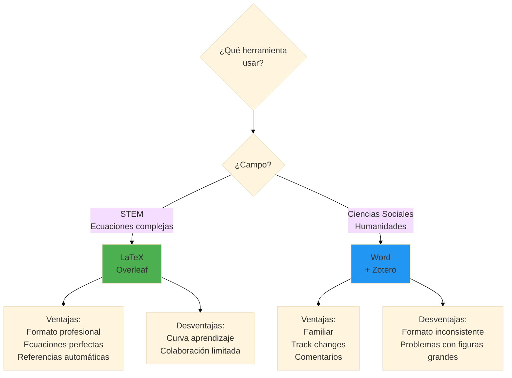

### 5.2 Overleaf para Papers Científicos

**Template APA 7 en Overleaf**:

```latex
\documentclass[man,12pt]{apa7}

\usepackage[spanish]{babel}
\usepackage[utf8]{inputenc}
\usepackage{csquotes}
\usepackage{graphicx}

\title{Impacto del Uso de ChatGPT en la Comprensión Conceptual de Programación: 
       Estudio Cuasi-Experimental en FPUNA}
\shorttitle{IA y Comprensión Conceptual}
\author{Juan Pérez\textsuperscript{1}, María González\textsuperscript{1}}
\affiliation{
  \textsuperscript{1}Facultad Politécnica, Universidad Nacional de Asunción
}
\authornote{
  Correspondencia: juan.perez@fpuna.edu.py
}

\abstract{
El presente estudio investiga el impacto del uso guiado de ChatGPT en la 
comprensión conceptual de programación mediante un diseño cuasi-experimental 
con 84 estudiantes de primer año de Ingeniería Informática en FPUNA. Los 
participantes fueron asignados a grupo experimental (n=42, uso de ChatGPT) 
o control (n=42, métodos tradicionales) durante 4 semanas. Un ANCOVA reveló 
que el grupo experimental obtuvo puntuaciones significativamente superiores 
en comprensión conceptual (M=54.2, SD=8.3) comparado con el control (M=50.1, 
SD=9.1), F(1,81)=6.42, p=0.013, η²=0.073. Se discuten implicaciones para 
integración responsable de IA en educación superior paraguaya.
}

\keywords{inteligencia artificial, ChatGPT, comprensión conceptual, programación, 
          educación superior, Paraguay}

\begin{document}
\maketitle

\section{Introducción}
La inteligencia artificial (IA) generativa está transformando...

% [Resto del paper]

\printbibliography

\end{document}
```

**Compilar y Descargar PDF**:
1. Crear proyecto en Overleaf.com
2. Pegar código LaTeX
3. Click "Recompile" → PDF generado automáticamente
4. Download PDF para someter a journal

### 5.3 Grammarly y Herramientas de Corrección

**Workflow de Revisión en Capas**:

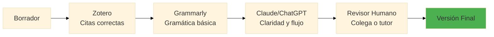

---

## Ejercicios Prácticos

### Ejercicio 1: Escribir Introducción Completa (90 min)

**Tema**: [Tu tema de investigación real o simulado]

**Estructura Requerida**:
1. Párrafo 1: Contexto general (100-150 palabras)
2. Párrafo 2: Estado del arte (150-200 palabras, mínimo 5 citas)
3. Párrafo 3: Gap identificado (100-150 palabras)
4. Párrafo 4: Objetivos e hipótesis (100-150 palabras)

**Requisitos**:
- Total: 500-650 palabras
- Al menos 8 referencias
- Formato APA 7 correcto
- Flujo lógico con conectores

**Usar OpenCode para**:
- Buscar literatura relevante
- Sugerir estructura de párrafos
- Revisar claridad final

**Entregable**:
- Introducción completa en Word/LaTeX
- Lista de referencias
- Versión antes y después de revisión con IA

---

### Ejercicio 2: Transformar Resultados en Tablas/Figuras (60 min)

**Datos**: Usar resultados del Ejercicio de Módulo 3 (análisis estadístico)

**Tareas**:
1. Crear Tabla 1: Estadística descriptiva por grupo
2. Crear Figura 1: Box plot comparativo
3. Escribir párrafo de resultados que:
   - Hace referencia a Tabla 1 y Figura 1
   - Reporta test estadístico en formato APA
   - NO interpreta (solo reporta hechos)

**Formato de Tabla (APA 7)**:

```
Tabla 1
Estadística Descriptiva de Comprensión Conceptual por Grupo

Grupo           n    M      SD    Mín   Máx   Rango
--------------------------------------------------
Control        42   50.1   9.1   32    60    28
Experimental   42   54.2   8.3   36    60    24
--------------------------------------------------

Nota. M = Media, SD = Desviación Estándar. Puntuaciones 
máximas = 60. Comprensión medida con Test de Comprensión 
Conceptual de Programación (TCCP).
```

---

### Ejercicio 3: Peer Review Simulado (90 min)

**Intercambiar borradores con compañero**.

**Revisar usando esta rúbrica**:

| Criterio | Puntos | Comentarios |
|----------|--------|-------------|
| **Estructura IMRaD clara** | _/10 | |
| **Introducción: Gap bien identificado** | _/10 | |
| **Métodos: Replicable** | _/10 | |
| **Resultados: Solo hechos, no interpretación** | _/10 | |
| **Discusión: Limitaciones honestas** | _/10 | |
| **Referencias: Formato APA correcto** | _/10 | |
| **Claridad de escritura** | _/10 | |
| **Flujo lógico** | _/10 | |
| **Figuras/Tablas: Profesionales** | _/10 | |
| **Originalidad y contribución** | _/10 | |
| **TOTAL** | _/100 | |

**Proveer**:
- Comentarios específicos en cada sección
- Al menos 3 fortalezas
- Al menos 3 áreas de mejora
- Recomendación: Aceptar / Revisar Minor / Revisar Major / Rechazar

---

## Checklist de Paper Publication-Ready

### ✅ Contenido

- [ ] Título: Conciso (<15 palabras), descriptivo, incluye variables clave
- [ ] Abstract: 150-250 palabras, estructura IMRaD comprimida
- [ ] Keywords: 4-6 términos relevantes para indexación
- [ ] Introducción: Gap claro, objetivos/hipótesis explícitos
- [ ] Métodos: Suficientemente detallados para replicar
- [ ] Resultados: Reportan hallazgos objetivamente sin interpretación
- [ ] Discusión: Interpreta, compara con literatura, reconoce limitaciones
- [ ] Conclusión: Fuerte, concisa, no introduce info nueva

### ✅ Referencias

- [ ] Todas las citas en texto tienen referencia completa
- [ ] Todas las referencias fueron citadas en texto
- [ ] Formato consistente (APA 7 o IEEE)
- [ ] Referencias ordenadas alfabéticamente (APA) o numéricamente (IEEE)
- [ ] DOIs incluidos cuando disponibles
- [ ] URLs activos verificados

### ✅ Formato

- [ ] Márgenes: 2.54 cm (1 pulgada) todos los lados
- [ ] Fuente: Times New Roman 12pt (APA) o equivalente
- [ ] Interlineado: Doble espacio (APA) o según journal
- [ ] Páginas numeradas
- [ ] Encabezado con título corto (running head)
- [ ] Tablas y figuras numeradas consecutivamente
- [ ] Leyendas de figuras descriptivas

### ✅ Figuras y Tablas

- [ ] Cada figura/tabla tiene número y título
- [ ] Referenciadas en texto antes de aparecer
- [ ] Legibles en blanco y negro (si journal lo requiere)
- [ ] Alta resolución (mínimo 300 DPI para figuras)
- [ ] Tablas en formato editable (no imagen)
- [ ] Notas explicativas incluidas si necesario

### ✅ Ética y Transparencia

- [ ] Aprobación de comité de ética mencionada
- [ ] Conflictos de interés declarados
- [ ] Financiamiento reconocido
- [ ] Uso de IA declarado (si aplica)
- [ ] Datos disponibles o justificación de restricción
- [ ] Consentimiento informado obtenido

---

## Recursos Esenciales

### Software de Escritura

| Herramienta | Propósito | Costo | URL |
|-------------|-----------|-------|-----|
| **Overleaf** | LaTeX online, colaborativo | Gratis básico | overleaf.com |
| **Zotero** | Gestión referencias | Gratis | zotero.org |
| **Grammarly** | Corrección gramática (inglés) | Freemium | grammarly.com |
| **Hemingway Editor** | Simplificar escritura | Gratis web | hemingwayapp.com |
| **Google Docs** | Escritura colaborativa | Gratis | docs.google.com |

### Guías de Estilo

**APA 7**:
- Manual oficial: apastyle.apa.org
- Tutorial: owl.purdue.edu/owl/research_and_citation/apa_style/
- Generador de citas: zbib.org

**IEEE**:
- Author tools: ieeeauthorcenter.ieee.org
- Citation guide: ieee.org/publications/rights/

### Templates LaTeX

**Overleaf Gallery**:
- APA 7: overleaf.com/latex/templates/apa7-style-manuscript-template/
- IEEE: overleaf.com/latex/templates/ieee-journal-paper-template/
- Tesis FPUNA: [Contactar biblioteca para template oficial]

---

## Contexto Paraguay: Publicación Académica

### Revistas Paraguayas que Aceptan Papers

**Multidisciplinarias**:
- **Revista FPUNA** (indexada en Latindex)
  - Requisitos: APA 7, revisión por pares
  - Tiempos: 4-6 meses revisión
  - OA: Sí, sin costo publicación

**Especializadas**:
- **Memorias del Instituto de Investigaciones en Ciencias de la Salud**
- **Población y Desarrollo** (UNA)
- **Revista Paraguaya de Reumatología**

**Acceso Abierto Latinoamericano**:
- **SciELO Paraguay**: scielo.org.py
- **Redalyc**: redalyc.org

### Soporte de Escritura en FPUNA

**Biblioteca Central**:
- Talleres de redacción científica (semestrales)
- Asistencia con Zotero/Mendeley
- Revisión de formato de referencias

**Instituto de Investigaciones**:
- Asesoría en escritura de proyectos/papers
- Email: investigacion@fpuna.edu.py

---

## Próximos Pasos

Una vez que domines redacción académica:

**Módulo 5: Presentación y Publicación** → Someter tu paper, presentar en conferencias

---

## Reflexión Final

**Escribir NO es talento innato - es HABILIDAD que se desarrolla con práctica.**

Cada draft es mejor que el anterior. La IA puede acelerar la revisión, pero VOS sos el autor que:

✅ Piensa las ideas originales  
✅ Interpreta los resultados con contexto  
✅ Argumenta la contribución  
✅ Se responsabiliza del contenido

**La IA es tu editor asistente, NO tu co-autor.**

---

**¿Preguntas?** Consulta con tu instructor o en Slack #research-academia-2026

**Próximo módulo:** [05 - Presentación y Publicación](./05-presentacion-publicacion.md)
