# ⚙️ Operaciones Hoteleras con IA

**Duración:** 4 horas
**Nivel:** Intermedio
**Track:** Hospitalidad y Turismo

---

## ¿Qué Vas a Lograr?

Al completar este módulo, vas a poder:

- [ ] Automatizar procesos operativos del hotel usando IA
- [ ] Optimizar la gestión de housekeeping y mantenimiento
- [ ] Crear sistemas de gestión de inventario inteligentes
- [ ] Diseñar flujos de trabajo automatizados para el personal
- [ ] Implementar mantenimiento predictivo y gestión de calidad

---

## La Analogía del Director de Orquesta

Un hotel es como una orquesta: hay decenas de músicos (departamentos) que deben tocar en perfecta sincronía para crear una experiencia armoniosa para el huésped. El director de orquesta (gerente de operaciones) no toca ningún instrumento, pero sin él, sería caos.

La IA es como darle al director la capacidad de escuchar cada instrumento individualmente, anticipar cuándo uno va a desafinar, y ajustar la partitura en tiempo real. El resultado: una sinfonía perfecta donde el huésped ni siquiera nota el trabajo detrás de escena.

---

## Parte 1: Fundamentos de Operaciones Hoteleras

### 1.1 Los Departamentos Operativos

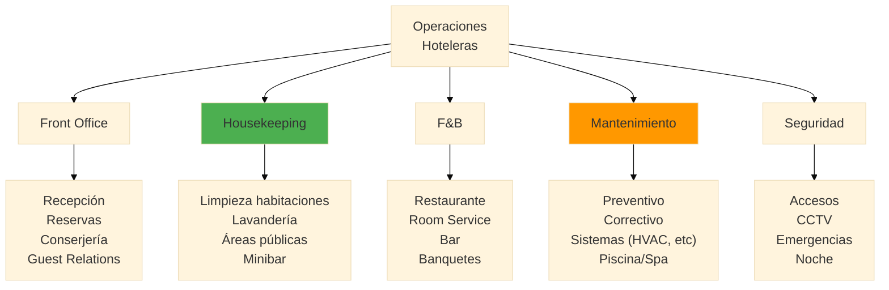

### 1.2 KPIs Operativos Clave

| Departamento | KPI | Target Típico | Fórmula |
|--------------|-----|---------------|---------|
| **Housekeeping** | Tiempo limpieza/hab | 25-30 min | Tiempo total / Habitaciones |
| **Housekeeping** | Habitaciones/persona/turno | 14-16 | Total hab / Personal turno |
| **Front Office** | Tiempo check-in | <5 min | Promedio tiempo proceso |
| **Front Office** | Quejas/100 huéspedes | <2 | (Quejas / Huéspedes) × 100 |
| **F&B** | Tiempo room service | <30 min | Orden → Entrega |
| **Mantenimiento** | Tiempo respuesta | <1 hora | Reporte → Técnico en sitio |
| **Mantenimiento** | % preventivo vs correctivo | 70/30 | Preventivo / Total órdenes |

### 1.3 El Flujo del Día Operativo

```mermaid
%%{init: {'theme':'base', 'themeVariables': {'fontSize':'18px'}}}%%
gantt
    title Día Operativo - Hotel 100 habitaciones
    dateFormat HH:mm
    axisFormat %H:%M

    section Housekeeping
    Briefing equipo           :06:00, 30m
    Limpieza checkout (40 hab):06:30, 5h
    Limpieza stay-over (35 hab):09:00, 4h
    Inspección supervisora    :13:00, 2h
    Turndown service          :18:00, 2h

    section Front Office
    Turno mañana inicio       :07:00, 8h
    Pico check-out            :10:00, 2h
    Turno tarde inicio        :15:00, 8h
    Pico check-in             :15:00, 4h
    Turno noche inicio        :23:00, 8h

    section F&B
    Mise en place desayuno    :05:00, 1h30m
    Servicio desayuno         :06:30, 4h
    Preparación almuerzo      :11:00, 1h
    Servicio almuerzo         :12:00, 3h
    Preparación cena          :18:00, 1h
    Servicio cena             :19:00, 4h

    section Mantenimiento
    Ronda inspección          :06:00, 2h
    Órdenes trabajo           :08:00, 8h
    Mantenimiento piscina     :06:00, 1h
    Revisión sistemas         :22:00, 2h
```

---

## Parte 2: Housekeeping Inteligente

### 2.1 Sistema de Asignación con IA

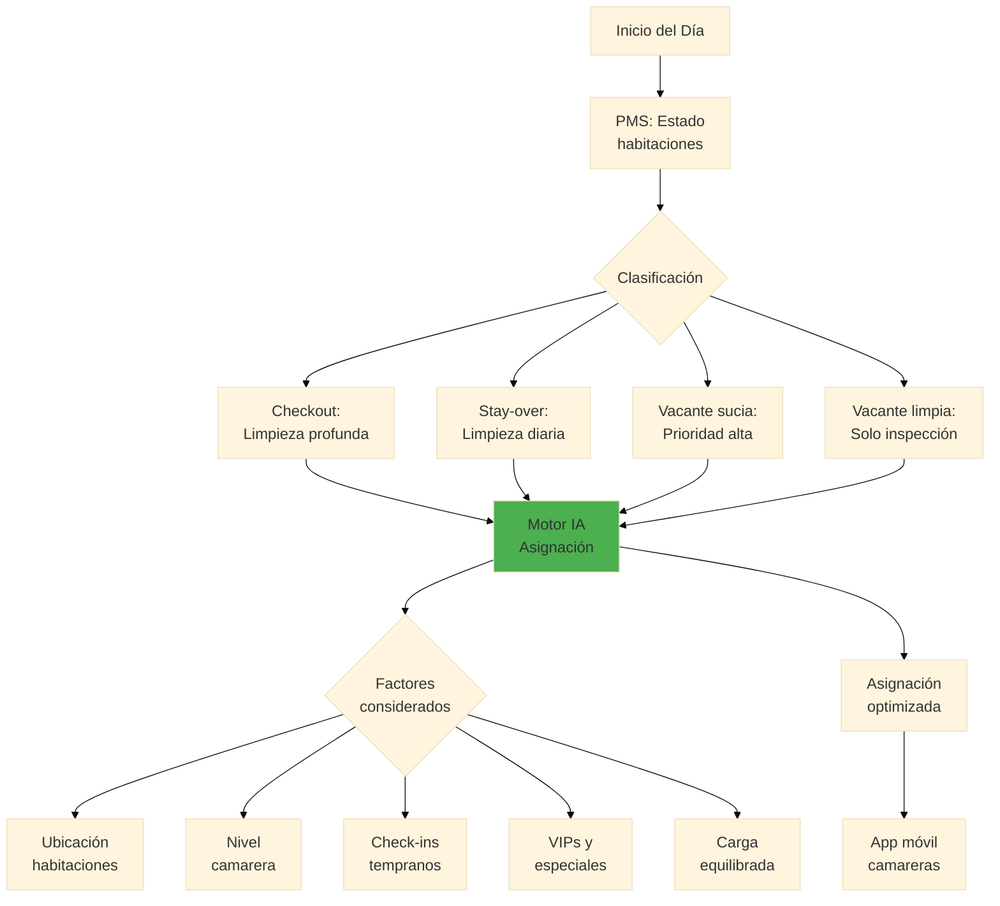

### 2.2 Prompt para Asignación Diaria

```markdown
**Datos del día:**
- Total habitaciones: 100
- Checkouts hoy: 45
- Stay-overs: 40
- Vacantes limpias: 15
- Personal disponible: 6 camareras

**Camareras y capacidades:**
| Nombre | Nivel | Velocidad | Pisos asignados |
|--------|-------|-----------|-----------------|
| Ana | Senior | 18 hab/día | Cualquiera |
| Bea | Senior | 17 hab/día | Cualquiera |
| Carmen | Regular | 15 hab/día | 1-3 |
| Diana | Regular | 14 hab/día | 1-3 |
| Elena | Junior | 12 hab/día | 1-2 |
| Fátima | Junior | 11 hab/día | 1-2 |

**Restricciones:**
- VIP en 501 (Suite): Checkout, check-in a las 14:00
- Early check-in confirmado: 302, 405 (a las 13:00)
- Habitación 210: Huésped pidió no molestar hasta las 14:00
- Habitación 315: Reparación de A/C programada a las 10:00

**Genera asignación optimizada que:**
1. Priorice habitaciones con early check-in
2. Balancee carga de trabajo equitativamente
3. Minimice desplazamiento entre pisos
4. Asigne VIP a camarera senior
5. Considere restricciones de horario
6. Incluya tiempos estimados
```

**Asignación generada:**

```
📋 ASIGNACIÓN HOUSEKEEPING - [FECHA]

PRIORIDAD 1 - COMPLETAR ANTES 13:00:
━━━━━━━━━━━━━━━━━━━━━━━━━━━━━━━━━━━━
🔴 302 (Early C/I 13:00) → ANA - Est. 10:00
🔴 405 (Early C/I 13:00) → BEA - Est. 10:30
🔴 501 Suite VIP (C/I 14:00) → ANA - Est. 11:30

ASIGNACIONES POR CAMARERA:
━━━━━━━━━━━━━━━━━━━━━━━━━━━━━━━━━━━━

👤 ANA (Senior) - Piso 5 + Prioridades - 17 hab
   Inicio: 06:30 | Fin estimado: 14:30
   ├── 501 Suite VIP ⭐ (checkout) - 11:30-12:30
   ├── 302 Early C/I 🔴 - 10:00-10:30
   ├── 502, 503, 504 (checkout)
   ├── 505, 506, 507, 508 (stay-over)
   └── 509, 510, 511, 512, 513, 514, 515

👤 BEA (Senior) - Piso 4 - 16 hab
   Inicio: 06:30 | Fin estimado: 14:00
   ├── 405 Early C/I 🔴 - 10:00-10:30
   ├── 401, 402, 403, 404 (checkout)
   └── 406-415 (mix checkout/stay-over)

👤 CARMEN (Regular) - Piso 3 - 15 hab
   Inicio: 06:30 | Fin estimado: 14:30
   ├── 315 ⚠️ Esperar reparación A/C (después 11:00)
   ├── 301-314 (asignar según estado)
   └── Nota: Reorganizar si 315 se demora

👤 DIANA (Regular) - Piso 2 - 14 hab
   Inicio: 06:30 | Fin estimado: 14:00
   ├── 210 ⏰ No molestar hasta 14:00
   ├── 201-209 (am)
   └── 211-214 (am), 210 (después 14:00)

👤 ELENA (Junior) - Piso 1A (101-112) - 12 hab
   Inicio: 06:30 | Fin estimado: 13:30

👤 FÁTIMA (Junior) - Piso 1B (113-123) - 11 hab
   Inicio: 06:30 | Fin estimado: 13:00

TOTAL: 85 habitaciones asignadas (45 CO + 40 SO)

NOTAS:
• Supervisora inspección: 13:00-15:00
• Comunicar inmediatamente cuando 302, 405, 501 listas
• Backup plan si alguien falta: Carmen cubre piso 4
```

### 2.3 Checklist Digital con IA

**Prompt para generar checklist:**

```markdown
Genera un checklist de limpieza de habitación estándar de hotel
4 estrellas, incluyendo:
1. Secciones por área (dormitorio, baño, etc.)
2. Ítems específicos con verificación
3. Puntos de calidad críticos marcados
4. Tiempo estimado por sección
5. Formato para uso en tablet/móvil
```

**Checklist generado:**

```markdown
# CHECKLIST HABITACIÓN ESTÁNDAR
**Habitación:** _____ | **Camarera:** _____ | **Hora inicio:** _____

## 🛏️ DORMITORIO (12 min)
- [ ] Abrir cortinas, ventilar habitación
- [ ] Retirar y clasificar ropa de cama
- [ ] Verificar colchón (manchas, daños)
- [ ] Colocar sábanas limpias (esquinas hospital)
- [ ] Colocar fundas almohadas
- [ ] ⭐ Edredón sin arrugas, centrado
- [ ] Almohadas decorativas posicionadas
- [ ] Revisar bajo la cama (objetos olvidados)
- [ ] Limpiar mesitas de noche
- [ ] Verificar lámparas funcionan
- [ ] Limpiar teléfono con desinfectante
- [ ] Verificar control remoto (funciona, pilas)
- [ ] Limpiar TV y superficies
- [ ] Aspirar/limpiar piso completo
- [ ] ⭐ Verificar aire acondicionado funciona

## 🚿 BAÑO (10 min)
- [ ] Retirar toallas usadas
- [ ] Limpiar inodoro (interior y exterior)
- [ ] ⭐ Desinfectar manijas y superficies de contacto
- [ ] Limpiar lavabo y grifería (sin manchas agua)
- [ ] Limpiar espejo (sin marcas)
- [ ] Limpiar ducha/bañera
- [ ] ⭐ Verificar desagües (sin obstrucciones)
- [ ] Colocar toallas limpias (doblado estándar)
- [ ] Reponer amenities (champú, jabón, etc.)
- [ ] Reponer papel higiénico (+ extra)
- [ ] Limpiar piso
- [ ] ⭐ Verificar sin olores
- [ ] Verificar secador de pelo funciona

## 📦 AMENITIES Y EXTRAS (3 min)
- [ ] Reponer agua embotellada (2)
- [ ] Verificar minibar (reportar consumo)
- [ ] Colocar carta room service actualizada
- [ ] Verificar menú almohadas/amenities
- [ ] Colocar chocolates/detalle si aplica
- [ ] Carpeta de servicios completa
- [ ] WiFi card visible

## 🚪 ENTRADA Y CLOSET (3 min)
- [ ] Limpiar puerta (interior y picaporte)
- [ ] Verificar cerradura electrónica
- [ ] Revisar closet (perchas: mínimo 8)
- [ ] Verificar caja fuerte funciona
- [ ] Verificar plancha y tabla disponibles
- [ ] Bolsas lavandería disponibles
- [ ] Pantuflas en bolsa

## ✅ VERIFICACIÓN FINAL (2 min)
- [ ] ⭐ Temperatura ambiente 22-24°C
- [ ] ⭐ Sin olores extraños
- [ ] ⭐ Iluminación correcta toda la habitación
- [ ] Cortinas cerradas correctamente
- [ ] Nada fuera de lugar
- [ ] Habitación huele a limpio

**Hora fin:** _____ | **Tiempo total:** _____ min
**Estado:** [ ] Lista | [ ] Requiere supervisión | [ ] Mantenimiento

**Observaciones:**
_________________________________________________
```

### 2.4 Predicción de Carga de Trabajo

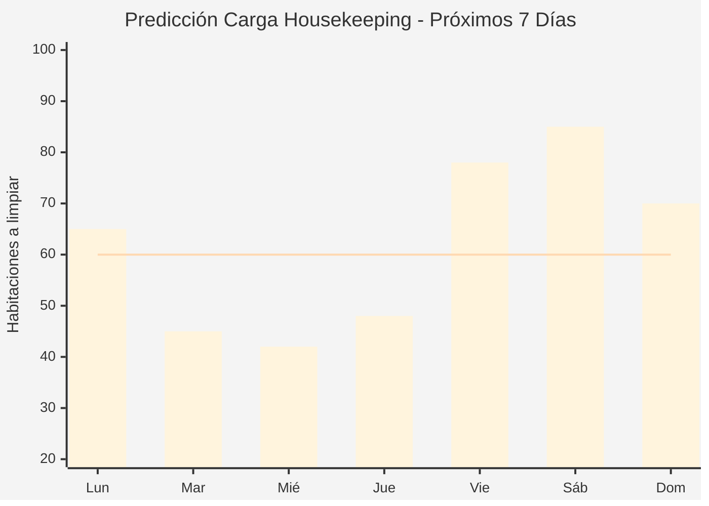

**Prompt para predicción:**

```markdown
**Datos:**
- Ocupación proyectada próximos 7 días: 75%, 55%, 52%, 60%, 90%, 95%, 80%
- Check-ins proyectados: 20, 12, 8, 15, 35, 25, 10
- Check-outs proyectados: 15, 25, 10, 8, 18, 30, 30

**Genera:**
1. Carga de trabajo por día (habitaciones a limpiar)
2. Personal recomendado por día
3. Alertas de días críticos
4. Recomendaciones de planificación
```

---

## Parte 3: Mantenimiento Predictivo

### 3.1 De Correctivo a Predictivo

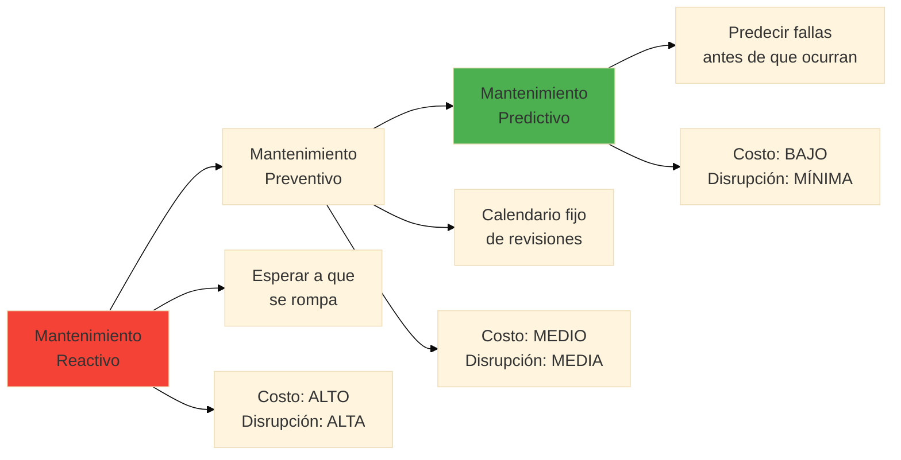

### 3.2 Datos para Predicción

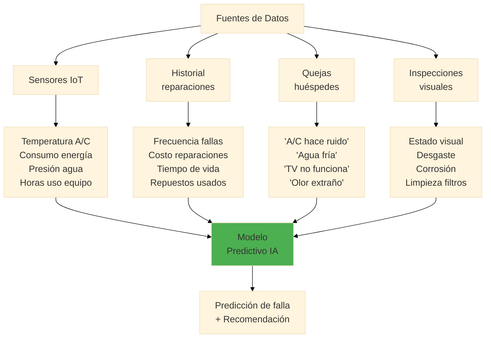

### 3.3 Prompt para Análisis de Mantenimiento

```markdown
**Datos del equipo:**
- Equipo: Aire acondicionado habitación 305
- Marca/Modelo: LG Multi Split 12000 BTU
- Instalación: Marzo 2020
- Horas de uso estimadas: 15,000
- Último mantenimiento preventivo: Hace 8 meses

**Historial de incidentes:**
- Dic 2024: "Hace ruido fuerte" - Limpieza filtros
- Mar 2025: "No enfría bien" - Recarga gas
- Jul 2025: "Gotea agua" - Limpieza drenaje
- Oct 2025: "Hace ruido" - Pendiente

**Consumo eléctrico (vs. promedio):**
- Últimos 30 días: +15% sobre normal

**Quejas recientes:**
- Huésped 10/oct: "El aire hace un ruido molesto de noche"
- Huésped 18/oct: "Tarda mucho en enfriar"

**Genera análisis que incluya:**
1. Diagnóstico probable del problema actual
2. Riesgo de falla en próximos 30 días (1-10)
3. Acciones recomendadas inmediatas
4. Acciones preventivas a mediano plazo
5. Estimación de costo: reparar ahora vs. esperar falla
6. Recomendación: reparar o reemplazar
```

**Análisis generado:**

```
🔧 ANÁLISIS DE MANTENIMIENTO - A/C HAB 305

DIAGNÓSTICO PROBABLE:
━━━━━━━━━━━━━━━━━━━━━
El patrón de síntomas (ruido + consumo elevado + tiempo de
enfriamiento largo) sugiere:

1. PRIMARIO: Desgaste de compresor
   - Causa: 15,000 horas de uso (vida útil típica: 20,000-30,000)
   - El consumo +15% indica que trabaja más para enfriar igual
   - El ruido probablemente es el compresor esforzándose

2. SECUNDARIO: Posible fuga de gas refrigerante
   - Ya tuvo recarga en Mar 2025
   - Si necesita otra recarga, hay fuga a sellar

RIESGO DE FALLA: 7/10 🟠
━━━━━━━━━━━━━━━━━━━━━━━
Alta probabilidad de falla completa en próximos 30-60 días,
especialmente si hay ola de calor que aumente demanda.

ACCIONES RECOMENDADAS:
━━━━━━━━━━━━━━━━━━━━━━
INMEDIATO (esta semana):
☐ Inspección técnica completa (2 horas, $50)
☐ Verificar nivel de gas y posibles fugas
☐ Limpiar unidad interior y exterior
☐ Medir amperaje del compresor

CORTO PLAZO (30 días):
☐ Si compresor está en límites, programar reemplazo
☐ Sacar habitación de venta durante reparación mayor

ANÁLISIS DE COSTOS:
━━━━━━━━━━━━━━━━━━
Escenario A - Reparar ahora (preventivo):
├── Diagnóstico + limpieza profunda: $150
├── Recarga gas si necesario: $100
├── Reparación compresor (si viable): $300
└── TOTAL: $450-550
    Tiempo fuera de servicio: 4-6 horas

Escenario B - Esperar falla (reactivo):
├── Falla en temporada alta: $$$
├── Reemplazo urgente compresor: $500
├── Instalación de emergencia: $150 extra
├── Pérdida de ingresos (3 noches mínimo): $300
└── TOTAL: $950 + pérdida reputación
    Tiempo fuera de servicio: 2-4 días

Escenario C - Reemplazo equipo:
├── Unidad nueva LG similar: $800
├── Instalación: $150
└── TOTAL: $950
    Beneficio: 5+ años sin problemas, eficiencia +20%

RECOMENDACIÓN: ⭐
━━━━━━━━━━━━━━━━
Dado que el equipo tiene 5+ años y síntomas de desgaste avanzado,
REEMPLAZAR es la mejor opción económica a mediano plazo.

Plan sugerido:
1. Esta semana: Inspección para confirmar diagnóstico
2. Si confirma desgaste compresor: Programar reemplazo
3. Fecha reemplazo: Día de baja ocupación (lunes o martes)
4. Durante reemplazo: Ofrecer upgrade a huésped si está ocupada
```

### 3.4 Dashboard de Mantenimiento

```markdown
**Prompt para crear dashboard:**

Diseña un dashboard diario de mantenimiento para hotel de 100 habitaciones.

**Debe mostrar:**
1. Órdenes de trabajo abiertas (por prioridad)
2. Equipos con alertas de mantenimiento preventivo
3. Habitaciones fuera de servicio
4. Métricas del día anterior
5. Calendario de mantenimientos programados (próximos 7 días)
```

**Dashboard ejemplo:**

```
╔══════════════════════════════════════════════════════════════╗
║           DASHBOARD MANTENIMIENTO - 20 OCTUBRE 2026          ║
╠══════════════════════════════════════════════════════════════╣

📊 RESUMEN DEL DÍA
━━━━━━━━━━━━━━━━━━━━━━━━━━━━━━━━━━━━━━━━━━━━━━━━━━━━━━━━━━━━━━
Órdenes abiertas: 8    |  Cerradas ayer: 12   |  Nuevas hoy: 3
Tiempo respuesta prom: 45 min  |  Target: <60 min ✅

🚨 ÓRDENES URGENTES (resolver hoy)
━━━━━━━━━━━━━━━━━━━━━━━━━━━━━━━━━━━━━━━━━━━━━━━━━━━━━━━━━━━━━━
#1042 | Hab 412 | A/C no enfría     | Desde: 08:30 | 🔴 URGENTE
#1043 | Hab 208 | Fuga agua baño    | Desde: 09:15 | 🔴 URGENTE
#1044 | Lobby   | Ascensor 2 lento  | Desde: 07:00 | 🟠 ALTO

📋 ÓRDENES EN PROGRESO
━━━━━━━━━━━━━━━━━━━━━━━━━━━━━━━━━━━━━━━━━━━━━━━━━━━━━━━━━━━━━━
#1038 | Hab 305 | Inspección A/C    | Técnico: Juan | Est: 11:00
#1040 | Piscina | Bomba hace ruido  | Técnico: Pedro| Est: 12:00

🔧 MANTENIMIENTO PREVENTIVO VENCIDO
━━━━━━━━━━━━━━━━━━━━━━━━━━━━━━━━━━━━━━━━━━━━━━━━━━━━━━━━━━━━━━
⚠️ Filtros A/C piso 3 - Vencido hace 5 días
⚠️ Caldera principal - Vence mañana
⚠️ Grupo electrógeno - Vence en 3 días

🚫 HABITACIONES FUERA DE SERVICIO: 2
━━━━━━━━━━━━━━━━━━━━━━━━━━━━━━━━━━━━━━━━━━━━━━━━━━━━━━━━━━━━━━
Hab 108 | Renovación baño    | Retorno: 25/10
Hab 503 | Daño por agua      | Retorno: 22/10

📅 PROGRAMADOS PRÓXIMOS 7 DÍAS
━━━━━━━━━━━━━━━━━━━━━━━━━━━━━━━━━━━━━━━━━━━━━━━━━━━━━━━━━━━━━━
21/10 | Inspección caldera (8:00-10:00)
22/10 | Mantenimiento ascensores (6:00-8:00)
23/10 | Limpieza ductos A/C piso 5 (9:00-12:00)
25/10 | Inspección extintores (todo el día)

╚══════════════════════════════════════════════════════════════╝
```

---

## Parte 4: Gestión de Inventarios y Compras

### 4.1 Inventarios Críticos en Hotelería

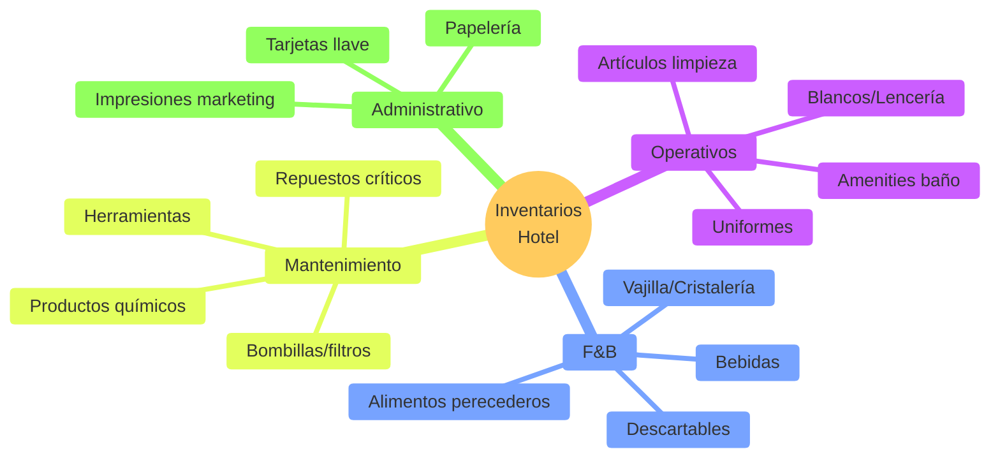

### 4.2 Sistema de Reposición Automática

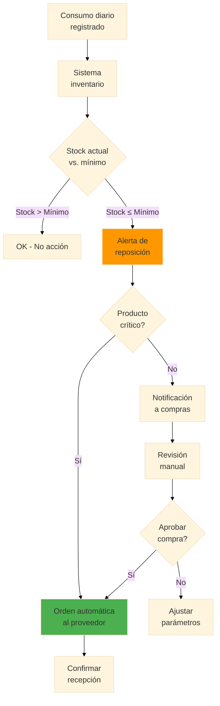

### 4.3 Prompt para Optimización de Inventario

```markdown
**Producto:** Champú individual 30ml
**Consumo promedio:** 85 unidades/día
**Stock actual:** 420 unidades
**Stock mínimo configurado:** 500 unidades
**Tiempo de entrega proveedor:** 5 días hábiles
**Precio unitario:** $0.35
**Precio por caja (100 u):** $30 ($0.30/u)

**Historial de consumo últimos 30 días:**
- Semana 1: 595 (85/día)
- Semana 2: 630 (90/día) - ocupación alta
- Semana 3: 560 (80/día)
- Semana 4: 595 (85/día)

**Próximos 14 días:**
- Ocupación proyectada: 92% (vs. 75% promedio)
- Evento: Congreso médico (500 asistentes)

**Genera:**
1. Proyección de consumo próximos 14 días
2. Fecha en que llegaríamos a stock 0
3. Cantidad recomendada a pedir
4. Fecha límite para hacer el pedido
5. Recomendación: pedir por unidad o por caja
6. Oportunidades de ahorro identificadas
```

**Análisis generado:**

```
📦 ANÁLISIS DE INVENTARIO - CHAMPÚ 30ML

PROYECCIÓN DE CONSUMO:
━━━━━━━━━━━━━━━━━━━━━━
Ocupación proyectada: 92%
Factor de ajuste: 92/75 = 1.23x consumo normal

Consumo proyectado: 85 × 1.23 = 105 unidades/día
Consumo 14 días: 105 × 14 = 1,470 unidades

ANÁLISIS DE STOCK:
━━━━━━━━━━━━━━━━━━━━━━
Stock actual: 420 unidades
Días de stock a ritmo proyectado: 420 / 105 = 4 días

⚠️ ALERTA: Stock se agota en 4 DÍAS
   Fecha crítica: 24 de octubre

RECOMENDACIÓN DE COMPRA:
━━━━━━━━━━━━━━━━━━━━━━━━
Necesidad próximos 14 días: 1,470 unidades
Stock actual: 420
Déficit: 1,050 unidades
Buffer de seguridad (7 días): 735 unidades

CANTIDAD A PEDIR: 1,800 unidades (18 cajas)

FECHA LÍMITE PEDIDO:
━━━━━━━━━━━━━━━━━━━━━━
Tiempo entrega: 5 días hábiles
Stock se agota: 24 de octubre
Fecha límite pedido: 17 DE OCTUBRE (HOY)

🚨 ACCIÓN URGENTE REQUERIDA

ANÁLISIS DE COSTOS:
━━━━━━━━━━━━━━━━━━━━━━━
Opción A - Comprar por unidad:
1,800 × $0.35 = $630

Opción B - Comprar por caja (recomendado):
18 cajas × $30 = $540

AHORRO: $90 (14%)

RECOMENDACIÓN ADICIONAL:
━━━━━━━━━━━━━━━━━━━━━━━━━━
Considerando que hay un congreso médico, también revisar:
- Jabón individual (mismo patrón de consumo)
- Papel higiénico
- Toallas

Subir stock mínimo de 500 a 700 durante temporada alta.
```

### 4.4 Control de Blancos (Lencería)

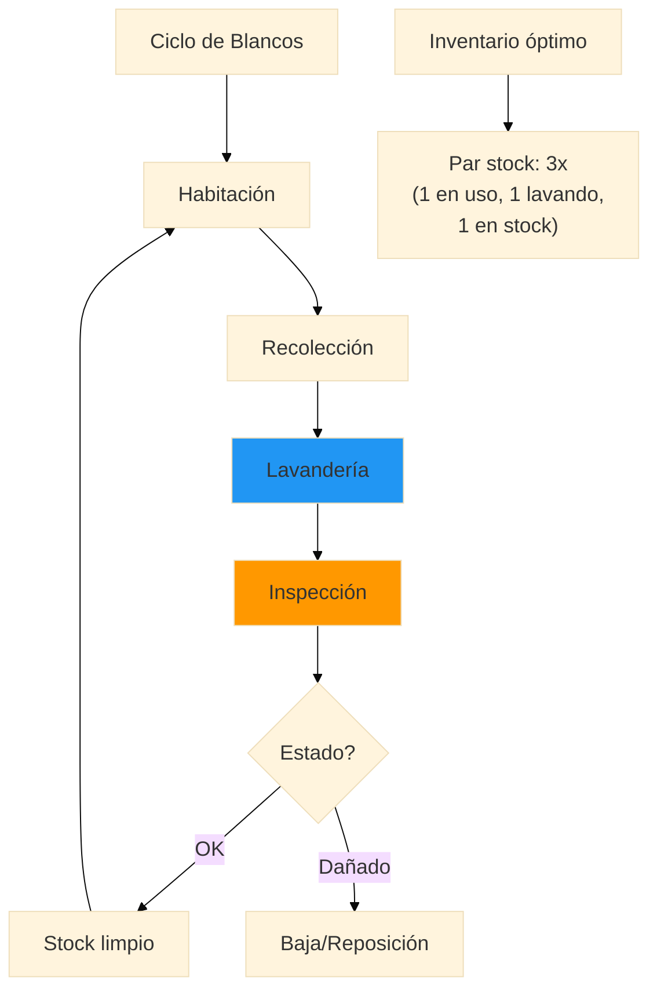

---

## Parte 5: Automatización de Procesos

### 5.1 Flujos de Trabajo Automatizados

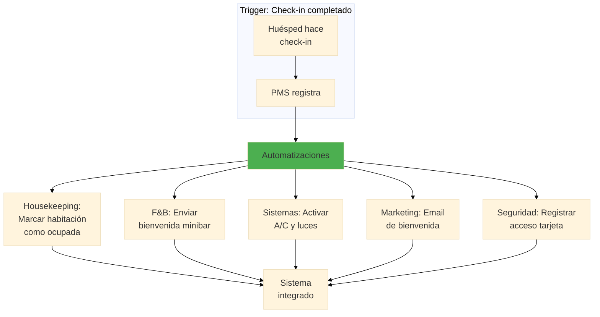

### 5.2 Prompt para Crear Workflow

```markdown
**Proceso a automatizar:** Solicitud de room service

**Situación actual:**
1. Huésped llama a recepción
2. Recepcionista toma pedido en papel
3. Recepcionista llama a cocina
4. Cocina prepara y avisa cuando está listo
5. Mozo recoge y entrega
6. Huésped firma voucher
7. Voucher se lleva a recepción para cargar a cuenta

**Problemas identificados:**
- Errores en transcripción de pedidos
- Tiempos de entrega largos (+40 min)
- Pedidos perdidos
- Cargos olvidados

**Diseña workflow automatizado que:**
1. Permita al huésped pedir desde su móvil/tablet
2. Elimine intermediarios innecesarios
3. Reduzca tiempo de entrega a <30 min
4. Asegure cargo automático a la cuenta
5. Permita tracking del pedido
6. Genere datos para análisis
```

**Workflow automatizado:**

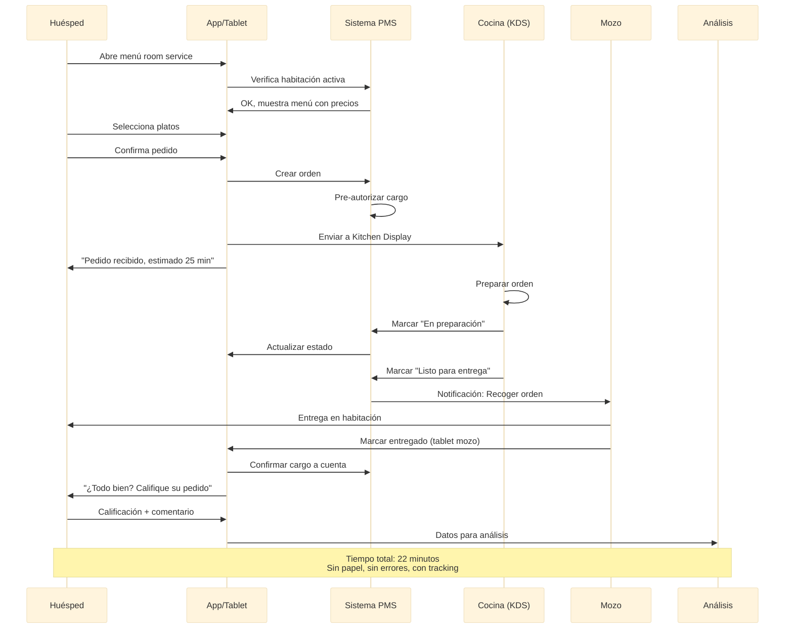

### 5.3 Turnos y Personal

**Prompt para optimización de turnos:**

```markdown
**Contexto:**
Hotel 100 habitaciones, recepción 24/7

**Demanda por horario (promedio de interacciones):**
- 00:00-06:00: 5 interacciones/hora (muy bajo)
- 06:00-10:00: 25 interacciones/hora (check-outs)
- 10:00-14:00: 15 interacciones/hora (medio)
- 14:00-18:00: 30 interacciones/hora (check-ins)
- 18:00-22:00: 20 interacciones/hora (medio-alto)
- 22:00-00:00: 10 interacciones/hora (bajo)

**Capacidad por recepcionista:** 15 interacciones/hora cómodamente

**Personal disponible:**
- 6 recepcionistas full-time
- 2 part-time (disponibles 18:00-22:00)

**Restricciones:**
- Mínimo 1 persona siempre
- Máximo 8 horas continuas
- Descanso de 30 min cada 4 horas

**Genera:**
1. Distribución óptima de turnos
2. Personal requerido por franja horaria
3. Identificar gaps o excesos
4. Recomendaciones de mejora
```

---

## Ejercicios Prácticos

### Ejercicio 1: Plan de Asignación Housekeeping

**Datos:**
- 80 habitaciones
- Hoy: 35 checkouts, 30 stay-overs, 15 vacantes
- Personal: 5 camareras (3 senior, 2 junior)
- VIP en Suite 501 con check-in a las 13:00
- Habitación 305 con "No molestar" hasta 14:00

**Tareas:**
1. Crea la asignación completa para cada camarera
2. Calcula carga de trabajo por persona
3. Identifica las habitaciones prioritarias
4. Establece horarios de entrega para VIP y early check-ins

---

### Ejercicio 2: Análisis de Mantenimiento

**Equipo:** Ascensor principal
**Datos:**
- Instalación: 2018
- Último mantenimiento: hace 4 meses
- Incidentes recientes: 3 paradas no programadas en 30 días
- Quejas: "Lento", "Hace ruidos extraños"

**Tareas:**
1. Genera diagnóstico probable
2. Evalúa riesgo de falla (1-10)
3. Recomienda acciones inmediatas
4. Calcula costo de reparar vs. reemplazar
5. Propón plan de contingencia durante reparación

---

### Ejercicio 3: Optimización de Inventario

**Producto:** Toallas de baño
**Stock actual:** 180
**Consumo diario:** 60 (asumiendo 1 por huésped + rotación)
**Par stock ideal:** 3x consumo diario
**Vida útil promedio:** 100 lavados
**Costo reposición:** $8 por toalla

**Tareas:**
1. ¿Está el stock en nivel adecuado?
2. Calcula cuántas toallas necesitás dar de baja por mes
3. Presupuesta reposición anual
4. Propón sistema de control para marcar toallas dañadas

---

### Ejercicio 4: Diseño de Workflow

**Proceso:** Gestión de objetos olvidados

**Situación actual:**
1. Camarera encuentra objeto
2. Lo lleva a recepción
3. Recepción lo guarda en caja
4. Si huésped llama, buscan en la caja
5. Frecuentemente se pierde o no se encuentra

**Tareas:**
1. Diseña un workflow digitalizado
2. Define qué información registrar
3. Establece política de retención (cuánto tiempo guardar)
4. Diseña proceso de contacto proactivo al huésped
5. Crea el formulario de registro

---

### Ejercicio 5: Dashboard Operativo

**Objetivo:** Diseña un dashboard para el Gerente de Operaciones.

**Debe incluir:**
1. Estado de habitaciones en tiempo real
2. Órdenes de mantenimiento abiertas
3. Ocupación del día y próximos 3 días
4. Alertas críticas
5. KPIs del día anterior

**Entregable:** Mockup del dashboard con datos de ejemplo.

---

## Preguntas de Evaluación

**1. ¿Cuántas habitaciones debería limpiar una camarera de hotel en un turno de 8 horas?**
- a) 8-10
- b) 14-16
- c) 20-25
- d) 30+

**2. El "par stock" ideal para blancos (sábanas, toallas) en un hotel es:**
- a) 1x (solo lo que está en uso)
- b) 2x (en uso + un cambio)
- c) 3x (en uso + lavando + stock)
- d) 5x (por seguridad)

**3. ¿Qué tipo de mantenimiento es más costo-efectivo a largo plazo?**
- a) Reactivo (esperar a que falle)
- b) Preventivo (calendario fijo)
- c) Predictivo (basado en datos)
- d) Ninguno, mejor reemplazar

**4. El tiempo máximo aceptable de respuesta para una orden de mantenimiento urgente es:**
- a) 15 minutos
- b) 1 hora
- c) 4 horas
- d) 24 horas

**5. ¿Qué porcentaje de mantenimiento debería ser preventivo vs. correctivo?**
- a) 30% preventivo / 70% correctivo
- b) 50% / 50%
- c) 70% preventivo / 30% correctivo
- d) 90% preventivo / 10% correctivo

**6. En gestión de turnos hoteleros, el "peak" de check-outs típicamente ocurre:**
- a) 6:00-8:00
- b) 10:00-12:00
- c) 14:00-16:00
- d) 18:00-20:00

**7. Un sistema de reposición automática de inventario necesita conocer:**
- a) Solo el stock actual
- b) Stock actual + stock mínimo + tiempo de entrega
- c) Solo el precio del producto
- d) Solo el proveedor

**8. ¿Cuál NO es un KPI típico de housekeeping?**
- a) Tiempo de limpieza por habitación
- b) Habitaciones por camarera por turno
- c) RevPAR
- d) Quejas de limpieza por 100 huéspedes

**9. En un workflow automatizado de room service, el primer paso después de que el huésped confirma el pedido debería ser:**
- a) Preparar la comida
- b) Verificar que la habitación esté activa y pre-autorizar cargo
- c) Enviar al mozo
- d) Imprimir la comanda

**10. El tiempo objetivo de entrega para room service en un hotel 4 estrellas es:**
- a) 15 minutos
- b) 30 minutos
- c) 45 minutos
- d) 1 hora

---

## Respuestas

1. **b) 14-16** - Es el estándar de la industria para habitaciones estándar, permitiendo limpieza de calidad en turnos de 8 horas.

2. **c) 3x (en uso + lavando + stock)** - Garantiza disponibilidad continua considerando el ciclo de lavado.

3. **c) Predictivo (basado en datos)** - Aunque requiere inversión inicial, reduce costos de emergencias y extiende vida útil de equipos.

4. **b) 1 hora** - Para urgencias que afectan la experiencia del huésped, el técnico debe estar en sitio en máximo 1 hora.

5. **c) 70% preventivo / 30% correctivo** - El objetivo es prevenir la mayoría de fallas; el 30% correctivo son imprevistos inevitables.

6. **b) 10:00-12:00** - La mayoría de hoteles tienen check-out a las 11:00-12:00, concentrando la actividad en esas horas.

7. **b) Stock actual + stock mínimo + tiempo de entrega** - Estos tres datos permiten calcular cuándo y cuánto pedir.

8. **c) RevPAR** - Es una métrica de revenue management, no de operaciones de housekeeping.

9. **b) Verificar que la habitación esté activa y pre-autorizar cargo** - Previene errores de facturación y fraudes.

10. **b) 30 minutos** - Es el estándar de la industria para hoteles de servicio completo. Menos de 30 indica excelencia.

---

## Recursos Adicionales

### Software de Operaciones Hoteleras

| Sistema | Función | Costo |
|---------|---------|-------|
| **Opera PMS** | Gestión completa | Enterprise |
| **Cloudbeds** | PMS cloud | Medio |
| **Flexkeeping** | Housekeeping | Bajo-Medio |
| **Quore** | Operaciones | Medio |
| **Optii** | Housekeeping IA | Medio |
| **Hotelkit** | Comunicación equipo | Bajo |

### Estándares de Calidad

- **Forbes Travel Guide** - Estándares de servicio
- **AAA Diamond Rating** - Criterios de calificación
- **ISO 9001** - Gestión de calidad
- **Green Key** - Sostenibilidad hotelera

### Lecturas Recomendadas

1. "Hotel Operations Management" - Hayes, Ninemeier
2. "Housekeeping Management" - Tucker, Schneider
3. "Hospitality Facilities Management" - Stipanuk

---

## Proyecto Final del Track

Después de completar los 4 módulos, estás listo para el **Proyecto Final del Track de Hospitalidad y Turismo**. Consulta la carpeta `proyecto-final/` para las instrucciones completas y la rúbrica de evaluación.

---

*Módulo 4 de 4 | Track: Hospitalidad y Turismo | FPUNA 2026*
