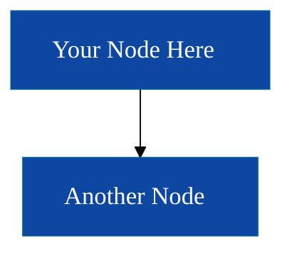
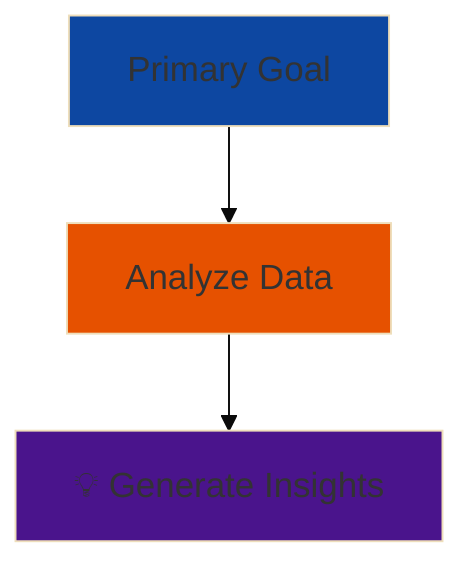
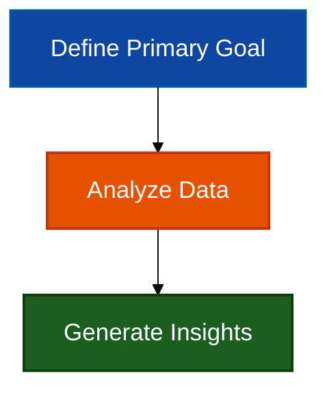

# Diagram Style Guide - FPUNA 2026

**Version:** 1.0  
**Date:** January 2026  
**Status:** Official Standard - ALL diagrams must comply

---

## 🎯 Purpose

This guide ensures all Mermaid diagrams in the course are:
- **Accessible**: WCAG AAA compliant (7:1 contrast minimum)
- **Readable**: Clear text, appropriate sizing
- **Consistent**: Uniform color semantics across all modules
- **Professional**: Clean, uncluttered designs

---

## 🎨 Color Palette (WCAG AAA Compliant)

### Primary Colors (Use These)

| Color Name | Hex Code | Use Case | Contrast Ratio |
|------------|----------|----------|----------------|
| **Primary Blue** | `#0d47a1` | Information, main flow, primary concepts | 10.4:1 ✅ |
| **Success Green** | `#1b5e20` | Positive outcomes, correct paths, best practices | 9.7:1 ✅ |
| **Warning Orange** | `#e65100` | Caution, intermediate states, attention needed | 7.1:1 ✅ |
| **Error Red** | `#b71c1c` | Errors, warnings, incorrect paths | 8.9:1 ✅ |
| **Accent Purple** | `#4a148c` | Special cases, advanced topics, highlights | 11.2:1 ✅ |
| **Neutral Gray** | `#424242` | Neutral states, backgrounds | 11.9:1 ✅ |

### Text Colors

| Background Color | Text Color | Purpose |
|------------------|------------|---------|
| Dark colors (above) | `#ffffff` (white) | Maximum contrast on dark backgrounds |
| White/Light | Dark colors (above) | Maximum contrast on light backgrounds |

### Semantic Color Mapping (CONSISTENT ACROSS ALL DIAGRAMS)

| Concept | Color | Rationale |
|---------|-------|-----------|
| **Correct/Good/Success** | Success Green (`#1b5e20`) | Universal positive signal |
| **Incorrect/Bad/Error** | Error Red (`#b71c1c`) | Universal negative signal |
| **Warning/Caution** | Warning Orange (`#e65100`) | Attention required |
| **Information/Neutral** | Primary Blue (`#0d47a1`) | Default state |
| **Advanced/Special** | Accent Purple (`#4a148c`) | Indicates higher complexity |
| **Generic/Placeholder** | Neutral Gray (`#424242`) | Non-semantic elements |

---

## 📏 Typography Standards

### Font Size

**ALL diagrams MUST include:**

```mermaid
%%{init: {'theme':'base', 'themeVariables': {'fontSize':'18px'}}}%%
```

### Text Guidelines

| Rule | Standard | Example |
|------|----------|---------|
| **Max lines per box** | 2 lines | ✅ "User Service<br>Authentication & Profiles" |
| **Max words per line** | 8 words | ✅ "Generate comprehensive test coverage report" |
| **No emoji in boxes** | Text only | ❌ "🎯 Primary Goal"<br>✅ "Primary Goal" |
| **Label clarity** | Descriptive, concise | ✅ "Database Layer"<br>❌ "DB Stuff" |

### Why No Emoji?

- ❌ Render differently across platforms (Windows/Mac/Linux)
- ❌ Screen readers can't interpret properly
- ❌ Fail on older systems (show as □)
- ❌ WCAG accessibility violations
- ✅ Use emoji in markdown headers ONLY, not diagram boxes

---

## 🏗️ Diagram Complexity

### Node Limits

| Diagram Type | Max Nodes | Rationale |
|--------------|-----------|-----------|
| **Flowchart** | 7 nodes | Miller's Law (5±2 chunks) |
| **Graph** | 7 nodes | Visual clarity |
| **Mindmap** | 12 nodes (3 per branch) | Hierarchical structure allows more |
| **Sequence** | 5 actors | Readability in sequence flow |

**If you need more:** Break into multiple diagrams or use subgraphs.

### Arrow Limits

- **Max 10 arrows** per diagram
- Use subgraphs to group related nodes
- Prefer clear linear flow over complex webs

---

## 📐 Standard Mermaid Configurations

### Base Template (Copy This)



### Manual Styling (When Needed)


---

## 🔄 Migration Guide

### Replacing Old Colors

| Old Color (Light Pastel) | New Color (WCAG AAA) | Find/Replace |
|---------------------------|----------------------|--------------|
| `#E1F5FF` (baby blue) | `#0d47a1` (primary blue) | Global replace |
| `#FFF4E1` (cream) | `#e65100` (warning orange) | Global replace |
| `#FFE1F5` (baby pink) | `#4a148c` (accent purple) | Global replace |
| `#E1FFE1` (mint green) | `#1b5e20` (success green) | Global replace |
| `#FFE1E1` (light pink) | `#b71c1c` (error red) | Global replace |
| `#FFB6C1` (light pink 2) | `#b71c1c` (error red) | Global replace |
| `#90EE90` (light green) | `#1b5e20` (success green) | Global replace |

### Removing Emoji

**Pattern to find:** Any emoji in node labels

```regex
\["[^\]]*[🎯📊🌐💼💾🗄️⚡🔌📐🔬📄☕🔄📋🎓🚀💡🏗️]\s*([^"]+)"\]
```

**Replace with:** Text-only labels

### Adding fontSize

**Find:** `^```mermaid$`  
**Replace with:**
```
```mermaid
%%{init: {'theme':'base', 'themeVariables': {'fontSize':'18px'}}}%%
```

---

## ✅ Checklist Before Committing Diagrams

- [ ] All colors have 7:1 contrast ratio minimum
- [ ] `fontSize: 18px` configured
- [ ] No emoji in diagram boxes
- [ ] Max 2 lines per node
- [ ] Max 7 nodes (or subgraphed appropriately)
- [ ] Semantic colors used consistently
- [ ] Tested on mobile (320px width)
- [ ] Tested on projector (1920x1080)

---

## 🎓 Examples: Before & After

### ❌ BEFORE (Non-Compliant)



**Problems:**
- Emoji in boxes (accessibility fail)
- Light pastels (contrast fail)
- No fontSize specified

### ✅ AFTER (Compliant)



**Improvements:**
- ✅ Text-only labels
- ✅ WCAG AAA compliant colors
- ✅ 18px fontSize
- ✅ Clear semantic meaning

---

## 📚 Resources

- **WCAG Contrast Checker:** https://webaim.org/resources/contrastchecker/
- **Mermaid Documentation:** https://mermaid.js.org/
- **Color Blindness Simulator:** https://www.color-blindness.com/coblis-color-blindness-simulator/

---

## 🔄 Version History

| Version | Date | Changes |
|---------|------|---------|
| 1.0 | January 2026 | Initial release - WCAG AAA standards established |

---

*This is a living document. Suggest improvements via pull request.*
