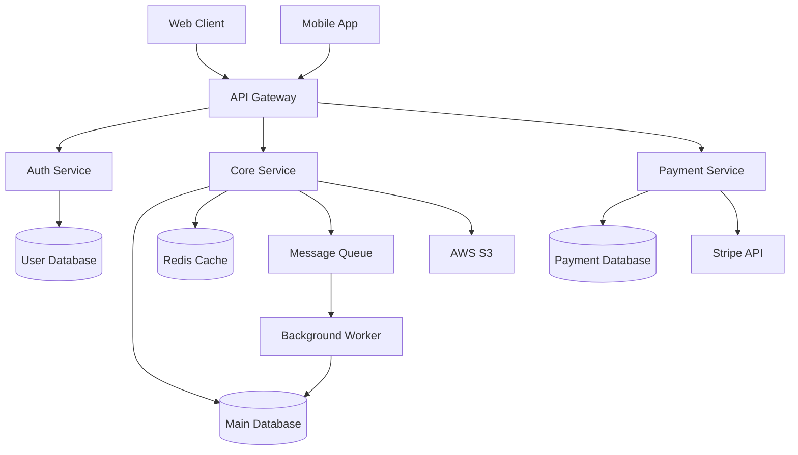
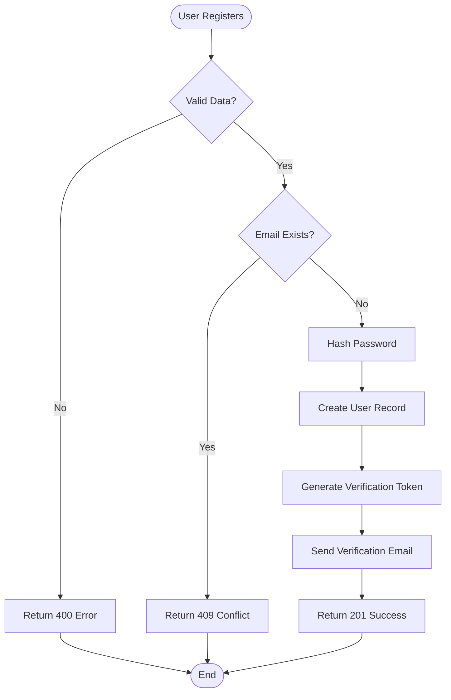
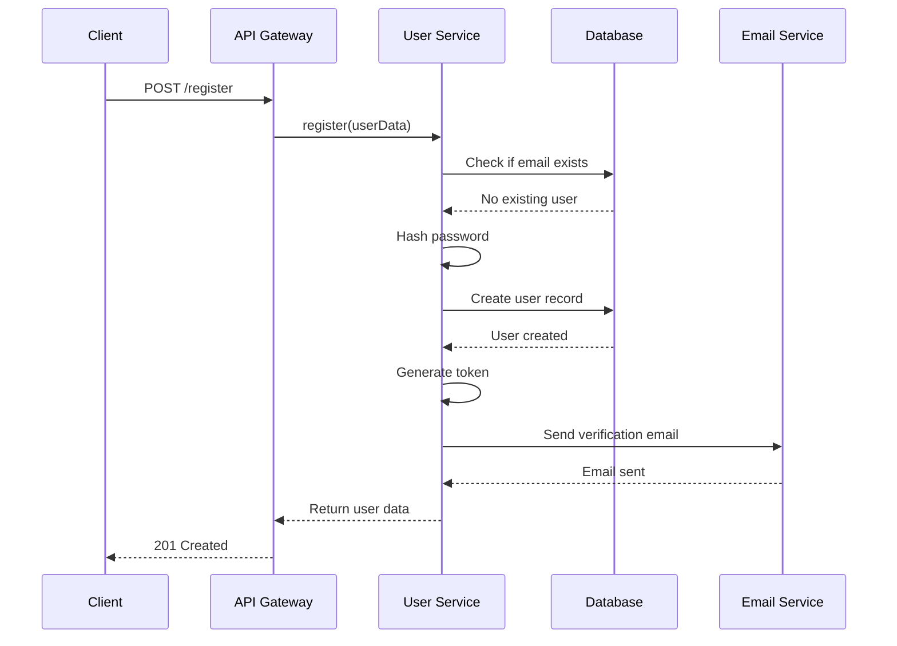
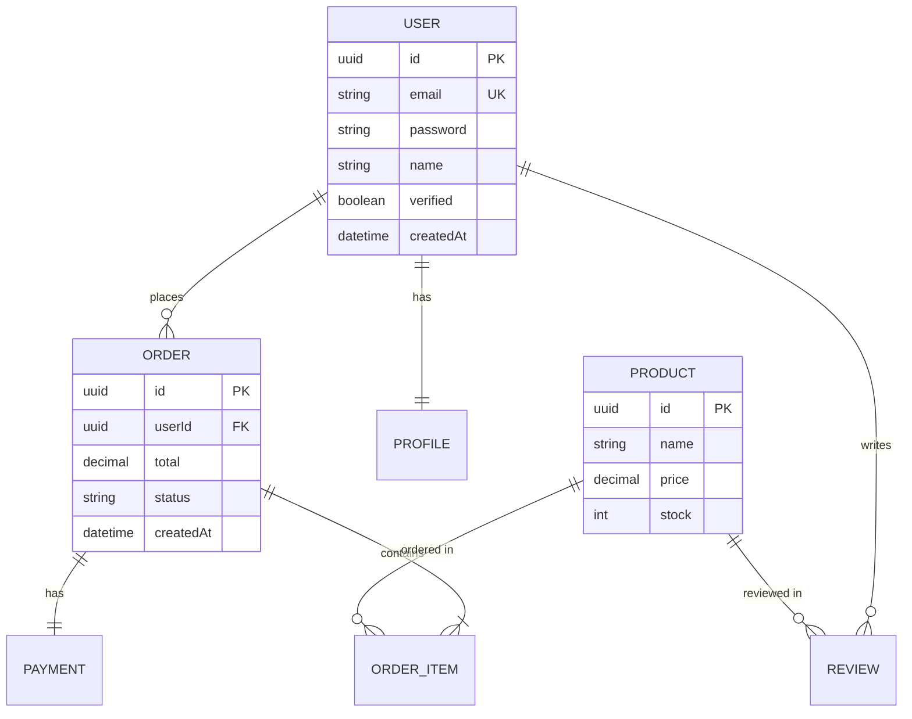

# Module 04: AI-Powered Documentation Generation
## Slide Deck

---

## Slide 1: Title Slide

# Module 04
## AI-Powered Documentation Generation

**Duration:** 5 hours
**Focus:** Automated documentation creation and quality review

---

## Slide 2: Module Overview

### What You'll Learn
- Generate architecture documentation with AI
- Create comprehensive API references
- Produce setup guides and tutorials
- Review and improve AI-generated documentation

### Why It Matters
- Documentation is critical for testing
- Manual documentation is time-consuming
- AI can generate 80-90% of docs automatically
- More time for actual testing

---

## Slide 3: The Documentation Problem

### Without Good Documentation
❌ New team members struggle to onboard
❌ Code is difficult to understand
❌ Testing is harder (unclear requirements)
❌ Integration is challenging
❌ Knowledge is lost when people leave
❌ Time wasted re-discovering how things work

### Documentation Reality
- Most developers hate writing docs
- Documentation gets outdated quickly
- Manual docs take days or weeks
- Often incomplete or inconsistent

---

## Slide 4: AI Documentation Solution

### With AI-Generated Documentation
✅ Consistent, comprehensive documentation
✅ Generated in hours instead of days
✅ Multiple documentation types automatically
✅ Easy to update when code changes
✅ Standardized format and structure
✅ More time for testing and development

### The Numbers
- **80-90% reduction** in documentation time
- **300-400% increase** in documentation coverage
- **50% faster** onboarding for new developers

---

## Slide 5: Documentation Types

| Type | Purpose | Audience | Time to Generate |
|------|---------|----------|------------------|
| **Architecture** | System overview | All engineers | 30-60 min |
| **API Reference** | Endpoint details | Backend/QA | 45 min |
| **Setup Guide** | Environment setup | New developers | 30-45 min |
| **Test Docs** | Test strategy | QA team | 30 min |

**Total for complete suite:** 2-3 hours (vs 1-2 weeks manually)

---

## Slide 6: Why QA Engineers Need Documentation

### 1. Understanding Code
- Documentation helps you understand what to test
- Reveals business logic and edge cases
- Shows system architecture and data flow

### 2. Test Planning
- Specifications provide test scenarios
- API docs reveal all endpoints to test
- Architecture shows integration points

### 3. Bug Reporting
- Better documentation = better bug descriptions
- Reference proper terminology
- Include correct endpoint/component names

---

## Slide 7: Why QA Engineers Need Documentation (cont.)

### 4. Team Communication
- Documentation bridges QA and dev teams
- Common vocabulary and understanding
- Shared source of truth

### 5. Test Documentation
- Document your test strategies
- Explain test coverage
- Share testing best practices

### 6. Onboarding
- Help new QA team members faster
- Self-service learning
- Consistent training material

---

## Slide 8: The Documentation Workflow

```
┌─────────────────────────────────────┐
│   1. Analyze Codebase               │
│      Understand structure           │
└──────────────┬──────────────────────┘
               ↓
┌─────────────────────────────────────┐
│   2. Identify Documentation Needs   │
│      What types? Who's the audience?│
└──────────────┬──────────────────────┘
               ↓
┌─────────────────────────────────────┐
│   3. Create Targeted Prompt         │
│      Specific instructions          │
└──────────────┬──────────────────────┘
               ↓
┌─────────────────────────────────────┐
│   4. Generate Initial Docs          │
│      AI creates first draft         │
└──────────────┬──────────────────────┘
               ↓
┌─────────────────────────────────────┐
│   5. Review for Accuracy            │
│      Verify against code            │
└──────────────┬──────────────────────┘
               ↓
┌─────────────────────────────────────┐
│   6. Refine and Improve             │
│      Iterative enhancement          │
└──────────────┬──────────────────────┘
               ↓
┌─────────────────────────────────────┐
│   7. Verify Examples Work           │
│      Test all code samples          │
└──────────────┬──────────────────────┘
               ↓
┌─────────────────────────────────────┐
│   8. Production-Ready Documentation │
│      Ship it! ✅                    │
└─────────────────────────────────────┘
```

---

## Slide 9: Part 1 - Architecture Documentation

### What Is Architecture Documentation?

**Purpose:** Provide high-level understanding of system structure

**Includes:**
- System overview and business goals
- Architecture diagrams (components, data flow)
- Component details (purpose, tech, dependencies)
- Data models and relationships
- Security architecture
- Deployment architecture

**Audience:** All engineers, stakeholders, new team members

---

## Slide 10: Architecture Documentation Structure

```markdown
# Architecture Documentation

## 1. System Overview
- Purpose and business goals
- Key features
- Target users

## 2. Architecture Diagram
- Component diagram (Mermaid)
- Data flow diagram
- External services

## 3. Component Details
For each component:
- Purpose
- Technologies used
- Key files
- Dependencies
- API surface

## 4. Data Models
- Main entities with fields
- Relationships (ERD)
- Database schema

## 5. Data Flow
- Request lifecycle
- Event processing
- Background jobs

## 6. Security Architecture
- Authentication method
- Authorization model
- Data protection

## 7. Deployment Architecture
- Infrastructure
- Environments
- CI/CD pipeline
```

---

## Slide 11: Architecture Documentation Prompt

```
Analyze this codebase and generate architecture documentation.

Create ARCHITECTURE.md with:

## 1. System Overview
- Purpose and business goals
- Key features
- Target users

## 2. Architecture Diagram
- Use Mermaid syntax
- Show all components
- Show data flow
- Include external services

## 3. Component Details
For each component:
- Purpose
- Technologies used
- Key files
- Dependencies
- API surface

## 4. Data Models
- Main entities with fields
- Relationships (ERD diagram)
- Database schema

## 5. Data Flow
- Request lifecycle
- Event processing
- Background jobs

## 6. Security Architecture
- Authentication method
- Authorization model
- Data protection

## 7. Deployment Architecture
- Infrastructure
- Environments
- CI/CD pipeline

Format as Markdown with Mermaid diagrams.
```

---

## Slide 12: Example Architecture Diagram



**Components:**
- Frontend clients (Web, Mobile)
- API Gateway (routing, auth)
- Microservices (Auth, Core, Payment)
- Data stores (PostgreSQL, Redis)
- External services (Stripe, S3)

---

## Slide 13: Component Details Example

```markdown
## API Gateway

**Purpose:** Route requests, handle authentication, rate limiting

**Technologies:**
- Express.js 4.18
- helmet (security headers)
- express-rate-limit
- JWT authentication

**Key Files:**
- `src/api/gateway.js` - Main gateway logic
- `src/api/routes/` - Route definitions
- `src/api/middleware/` - Auth, rate limiting

**Dependencies:**
- Auth Service (user validation)
- Core Service (business logic)
- Payment Service (transactions)

**API Surface:**
- REST API on port 3000
- WebSocket on port 3001
- Health check endpoint: `/health`
```

---

## Slide 14: Data Model Example

```markdown
## User Entity

| Field | Type | Required | Description |
|-------|------|----------|-------------|
| id | UUID | Yes | Primary key |
| email | String | Yes | Unique email |
| password | String | Yes | Hashed password (bcrypt) |
| name | String | Yes | Full name |
| verified | Boolean | No | Email verified (default: false) |
| createdAt | DateTime | Yes | Account creation timestamp |
| updatedAt | DateTime | Yes | Last update timestamp |

**Relationships:**
- One-to-Many: User → Orders
- One-to-Many: User → Reviews
- One-to-One: User → UserProfile

**Indexes:**
- Unique index on email
- Index on createdAt for sorting
```

---

## Slide 15: Part 2 - API Reference Documentation

### What Is API Reference Documentation?

**Purpose:** Document all API endpoints in detail

**Includes:**
- Endpoint URL and HTTP method
- Description of what it does
- Authentication requirements
- Request parameters (path, query, body)
- Response schemas (success and errors)
- Working examples (curl, code)
- Rate limits, pagination, notes

**Audience:** Backend developers, QA engineers, API consumers

---

## Slide 16: API Reference Structure

```markdown
## [METHOD] [Path]

**Description:** What this endpoint does

**Authentication:** Required/Optional/None

**Request:**
- Headers (Content-Type, Authorization, etc.)
- Path parameters (e.g., :id)
- Query parameters (e.g., ?page=1)
- Body schema with types

**Response:**
- Success (200/201 with schema)
- Client errors (400/401/403/404)
- Server errors (500)

**Example:**
```bash
curl -X METHOD URL \
  -H "Authorization: Bearer token" \
  -d '{"key": "value"}'
```

**Notes:** Rate limits, pagination, etc.
```

---

## Slide 17: API Documentation Prompt

```
Generate API reference documentation for all endpoints.

For each endpoint include:

## [METHOD] [Path]

**Description:** What this endpoint does

**Authentication:** Required/Optional/None

**Request:**
- Headers
- Path parameters
- Query parameters
- Body schema with types

**Response:**
- Success (200/201)
- Client errors (400/401/403/404)
- Server errors (500)

**Example:**
```bash
curl -X METHOD URL \
  -H "Authorization: Bearer token" \
  -d '{"key": "value"}'
```

**Notes:** Rate limits, pagination, etc.

Generate for all public endpoints found in the codebase.
```

---

## Slide 18: Example API Documentation

```markdown
## POST /api/users/register

**Description:** Register a new user account

**Authentication:** None (public endpoint)

**Request:**

Headers:
- Content-Type: application/json

Body:
```json
{
  "email": "string (required, valid email)",
  "password": "string (required, min 8 characters)",
  "name": "string (required)"
}
```

**Response:**

Success (201):
```json
{
  "id": "uuid",
  "email": "string",
  "name": "string"
}
```

Errors:
- 400: Invalid request (missing fields, invalid email)
- 409: Email already registered

**Example:**
```bash
curl -X POST http://localhost:3000/api/users/register \
  -H "Content-Type: application/json" \
  -d '{
    "email": "john@example.com",
    "password": "securepass123",
    "name": "John Doe"
  }'
```

**Notes:**
- Password is hashed using bcrypt
- Verification email is sent automatically
- Rate limited to 5 requests per hour per IP
```

---

## Slide 19: OpenAPI/Swagger Generation

### What Is OpenAPI?

**OpenAPI Specification (OAS):** Standard format for REST API documentation

**Benefits:**
- Machine-readable API specification
- Auto-generate interactive API docs (Swagger UI)
- Generate client SDKs automatically
- API testing and validation tools

### Generation Prompt

```
Generate OpenAPI 3.0 specification for this API.

Include:
- All endpoints with methods
- Request/response schemas
- Authentication schemes
- Example values
- Error responses

Output as YAML file.
```

---

## Slide 20: OpenAPI Example

```yaml
openapi: 3.0.0
info:
  title: User Service API
  version: 1.0.0
  description: User authentication and management

paths:
  /api/users/register:
    post:
      summary: Register new user
      tags:
        - Users
      requestBody:
        required: true
        content:
          application/json:
            schema:
              type: object
              required:
                - email
                - password
                - name
              properties:
                email:
                  type: string
                  format: email
                password:
                  type: string
                  minLength: 8
                name:
                  type: string
      responses:
        '201':
          description: User created
          content:
            application/json:
              schema:
                $ref: '#/components/schemas/User'
        '400':
          description: Invalid request
        '409':
          description: Email already exists

components:
  schemas:
    User:
      type: object
      properties:
        id:
          type: string
          format: uuid
        email:
          type: string
        name:
          type: string
```

---

## Slide 21: Part 3 - Setup Guides

### What Is a Setup Guide?

**Purpose:** Help new developers get project running quickly

**Includes:**
- Prerequisites (software, versions, accounts)
- Quick start (fastest path to running app)
- Development setup (step-by-step)
- Environment variables
- Common tasks (run tests, build, deploy)
- Troubleshooting

**Audience:** New developers, QA engineers setting up test environments

**Key Principle:** Copy-paste friendly! All commands should work as-is.

---

## Slide 22: Setup Guide Structure

```markdown
# Setup Guide

## Prerequisites
- Required software with versions
- Accounts needed
- Hardware requirements

## Quick Start (5 minutes)
- Fastest path to running the app
- Use Docker if available

## Development Setup
1. Clone repository
2. Install dependencies
3. Configure environment
4. Set up database
5. Run migrations
6. Start development server
7. Verify it works

## Environment Variables
| Variable | Description | Example | Required |
|----------|-------------|---------|----------|

## Common Tasks
- Run tests
- Build for production
- Deploy
- Debug

## Troubleshooting
- Common issues and solutions
```

---

## Slide 23: Setup Guide Prompt

```
Create a comprehensive setup guide for new developers.

Include:

## Prerequisites
- Required software with versions
- Accounts needed
- Hardware requirements

## Quick Start (5 minutes)
- Fastest path to running the app
- Use Docker if available

## Development Setup
1. Clone repository
2. Install dependencies
3. Configure environment
4. Set up database
5. Run migrations
6. Start development server
7. Verify it works

## Environment Variables
| Variable | Description | Example | Required |
|----------|-------------|---------|----------|

## Common Tasks
- Run tests
- Build for production
- Deploy
- Debug

## Troubleshooting
- Common issues and solutions

Make it copy-paste friendly with all commands.
```

---

## Slide 24: Setup Guide Example

```markdown
# Setup Guide

## Prerequisites

- **Node.js:** 18.x or higher
- **PostgreSQL:** 14.x or higher
- **Redis:** 6.x or higher (optional, for caching)
- **Git:** Latest version

## Quick Start (Docker)

```bash
# Clone repository
git clone https://github.com/company/project.git
cd project

# Start with Docker Compose
docker-compose up

# Application available at http://localhost:3000
```

## Development Setup

### 1. Clone Repository
```bash
git clone https://github.com/company/project.git
cd project
```

### 2. Install Dependencies
```bash
npm install
```

### 3. Configure Environment
```bash
cp .env.example .env
# Edit .env with your settings
```

### 4. Set Up Database
```bash
# Create database
createdb myapp_dev

# Run migrations
npm run migrate
```

### 5. Start Development Server
```bash
npm run dev
```

### 6. Verify It Works
Open http://localhost:3000 - you should see the app!

Run health check:
```bash
curl http://localhost:3000/health
```

## Environment Variables

| Variable | Description | Example | Required |
|----------|-------------|---------|----------|
| DATABASE_URL | PostgreSQL connection | postgresql://localhost/myapp | Yes |
| JWT_SECRET | Secret for JWT tokens | random-secret-key | Yes |
| REDIS_URL | Redis connection | redis://localhost:6379 | No |
| PORT | Server port | 3000 | No |

## Common Tasks

### Run Tests
```bash
npm test              # All tests
npm run test:unit     # Unit tests only
npm run test:e2e      # E2E tests only
```

### Build for Production
```bash
npm run build
npm start
```

## Troubleshooting

### Port Already In Use
**Error:** `EADDRINUSE: address already in use :::3000`

**Solution:**
```bash
# Find process using port 3000
lsof -i :3000

# Kill the process
kill -9 <PID>
```

### Database Connection Failed
**Error:** `connection to server at "localhost" failed`

**Solution:**
- Ensure PostgreSQL is running: `pg_ctl status`
- Check DATABASE_URL in .env
- Verify database exists: `psql -l`
```

---

## Slide 25: Part 4 - Test Documentation

### What Is Test Documentation?

**Purpose:** Document testing strategy and practices

**Includes:**
- Test strategy and philosophy
- Test structure and organization
- How to run tests
- How to write new tests
- Test utilities and helpers
- CI integration
- Best practices

**Audience:** QA team, developers writing tests

---

## Slide 26: Test Documentation Structure

```markdown
# Test Documentation

## Test Strategy
- Testing philosophy
- Test pyramid approach
- Coverage goals

## Test Structure
- Directory organization
- Naming conventions
- File patterns

## Running Tests
- All tests
- By type (unit, integration, e2e)
- With coverage
- In watch mode

## Writing Tests
- Required patterns
- Assertion style
- Mocking approach
- Test data management

## Test Utilities
- Available helpers
- Fixtures
- Factories

## CI Integration
- When tests run
- Required checks
- Failure handling

## Best Practices
- Do's and Don'ts
- Common pitfalls
```

---

## Slide 27: Test Documentation Prompt

```
Generate test documentation for this project.

Create TEST-DOCUMENTATION.md with:

## Test Strategy
- Testing philosophy
- Test pyramid approach
- Coverage goals

## Test Structure
- Directory organization
- Naming conventions
- File patterns

## Running Tests
### All Tests
```bash
[command]
```

### By Type
- Unit: [command]
- Integration: [command]
- E2E: [command]

### With Coverage
```bash
[command]
```

## Writing Tests
- Required patterns
- Assertion style
- Mocking approach
- Test data management

## Test Utilities
- Available helpers
- Fixtures
- Factories

## CI Integration
- When tests run
- Required checks
- Failure handling

## Best Practices
- Do's and Don'ts
- Common pitfalls
```

---

## Slide 28: Test Documentation Example

```markdown
# Test Documentation

## Test Strategy

We follow the test pyramid approach:
- **Unit Tests (70%):** Fast, isolated, test individual functions
- **Integration Tests (20%):** Test component interactions
- **E2E Tests (10%):** Test complete user flows

**Coverage Goals:**
- Overall: 80% minimum
- Critical paths: 95% minimum
- New code: 90% minimum

## Test Structure

```
tests/
├── unit/           # Unit tests
│   ├── services/
│   ├── utils/
│   └── models/
├── integration/    # Integration tests
│   ├── api/
│   └── database/
└── e2e/            # End-to-end tests
    └── scenarios/
```

**Naming Convention:**
- Unit: `[filename].test.js`
- Integration: `[feature].integration.test.js`
- E2E: `[scenario].e2e.test.js`

## Running Tests

```bash
# All tests
npm test

# Watch mode
npm run test:watch

# Unit tests only
npm run test:unit

# Integration tests
npm run test:integration

# E2E tests
npm run test:e2e

# With coverage
npm run test:coverage
```

## Writing Tests

### Pattern
```javascript
describe('ComponentName', () => {
  describe('methodName', () => {
    it('should do something when condition', async () => {
      // Arrange
      const input = { ... };

      // Act
      const result = await method(input);

      // Assert
      expect(result).toEqual(expected);
    });
  });
});
```

### Assertion Style
- Use Jest matchers: `expect(x).toBe(y)`
- Prefer specific matchers: `toEqual`, `toContain`, `toHaveProperty`
- Use `async/await` for asynchronous tests

### Mocking
```javascript
// Mock external dependencies
jest.mock('../emailService');

// Mock specific functions
const sendEmail = jest.fn();
sendEmail.mockResolvedValue({ success: true });
```

## Best Practices

**DO:**
- ✅ Follow AAA pattern (Arrange, Act, Assert)
- ✅ Test one thing per test
- ✅ Use descriptive test names
- ✅ Clean up after tests (teardown)
- ✅ Mock external dependencies

**DON'T:**
- ❌ Test implementation details
- ❌ Depend on test execution order
- ❌ Use real database in unit tests
- ❌ Ignore flaky tests
- ❌ Skip error case testing
```

---

## Slide 29: Part 5 - Mermaid Diagrams

### Why Use Mermaid?

**Mermaid:** Text-based diagram generation

**Benefits:**
- Write diagrams as code
- Version control friendly
- Renders in Markdown (GitHub, GitLab, etc.)
- Easy to update
- No image files to manage

**Types:**
- Flowcharts
- Sequence diagrams
- Class diagrams
- Entity relationship diagrams
- State diagrams

---

## Slide 30: Mermaid Flowchart Example



**Code:**
```
flowchart TD
    Start([User Registers]) --> Validate{Valid Data?}
    Validate -->|No| Error[Return 400 Error]
    Validate -->|Yes| CheckEmail{Email Exists?}
    CheckEmail -->|Yes| Conflict[Return 409 Conflict]
    CheckEmail -->|No| Hash[Hash Password]
    Hash --> Create[Create User Record]
    Create --> Token[Generate Verification Token]
    Token --> Email[Send Verification Email]
    Email --> Success[Return 201 Success]
```

---

## Slide 31: Mermaid Sequence Diagram Example



**Shows:** Communication flow between components

---

## Slide 32: Mermaid Entity Relationship Diagram



**Shows:** Database relationships

---

## Slide 33: Generating Mermaid Diagrams with AI

### Prompt Template

```
Generate a [TYPE] Mermaid diagram for [COMPONENT/FLOW].

[TYPE] options:
- flowchart (process flow)
- sequenceDiagram (component interaction)
- erDiagram (database relationships)
- classDiagram (class structure)

Include:
- All relevant [components/entities/steps]
- Clear labels
- Relationships/flow direction
- Use proper Mermaid syntax

Code it will analyze:
[paste relevant code]
```

### Example

```
Generate a sequence diagram showing the user login flow.

Include:
- Client request
- API Gateway
- Auth Service
- Database
- Token generation
- Response flow

Show both success and error cases.
```

---

## Slide 34: Part 6 - Documentation Quality Review

### The Review Process

**Why Review?**
- AI can generate incorrect information
- Code may be misunderstood
- Examples might not work
- Diagrams might have syntax errors
- Structure might not match your needs

**Review = Critical Step**

Don't publish without review!

---

## Slide 35: Quality Review Checklist

### The 8-Point Check

- [ ] **Accuracy:** Does it match the code?
- [ ] **Completeness:** Are all components covered?
- [ ] **Clarity:** Can a newcomer understand it?
- [ ] **Examples:** Are there working examples?
- [ ] **Up-to-date:** Does it reflect current state?
- [ ] **Formatting:** Is Markdown valid?
- [ ] **Diagrams:** Do Mermaid diagrams render?
- [ ] **Links:** Do internal links work?

**Rule:** If you find issues, fix them or regenerate.

---

## Slide 36: Review Prompt

```
Review this documentation for quality:

[paste documentation]

Check for:
1. Accuracy against actual code
2. Missing sections or details
3. Unclear explanations
4. Missing examples
5. Outdated information
6. Broken formatting
7. Incorrect terminology
8. Mermaid syntax errors

For each issue:
- Location (section/line)
- Problem description
- Suggested fix

Be thorough and critical.
```

---

## Slide 37: Common Documentation Issues

### Issue 1: Inaccurate Information
**Problem:** Documentation says API returns JSON but it returns XML
**Fix:** Verify actual behavior, update docs

### Issue 2: Missing Details
**Problem:** "Configure environment variables" without listing them
**Fix:** Add complete table of all variables

### Issue 3: Non-Working Examples
**Problem:** Code examples have syntax errors or don't run
**Fix:** Test every example, fix errors

### Issue 4: Broken Diagrams
**Problem:** Mermaid syntax errors prevent rendering
**Fix:** Validate syntax with Mermaid Live Editor

### Issue 5: Outdated Content
**Problem:** References old version of framework
**Fix:** Update to current versions

---

## Slide 38: Iterative Improvement

### The Refinement Loop

```
Generate Initial Docs
    ↓
Review Against Checklist
    ↓
Identify Issues
    ↓
Prompt AI to Fix Issues
    ↓
Review Fixes
    ↓
Repeat Until Quality Met
    ↓
Production Ready! ✅
```

**Pro Tip:** It's faster to fix specific issues than regenerate entirely

---

## Slide 39: Testing Documentation

### How to Test Documentation

**1. Setup Guides:**
- Follow every step yourself
- Have someone else follow it
- Document any issues
- Add troubleshooting section

**2. API Documentation:**
- Test every curl example
- Verify request/response schemas
- Check error codes
- Test with Postman/Insomnia

**3. Code Examples:**
- Copy-paste and run
- Verify output matches
- Test edge cases

**4. Diagrams:**
- View in Mermaid Live Editor
- Check rendering in GitHub
- Verify accuracy

---

## Slide 40: Best Practices Summary

### Documentation Generation Best Practices

**DO:**
✅ Use specific, detailed prompts
✅ Generate one documentation type at a time
✅ Review and verify everything
✅ Test all examples
✅ Use Mermaid for diagrams
✅ Include troubleshooting sections
✅ Update docs when code changes

**DON'T:**
❌ Publish without review
❌ Trust AI 100% without verification
❌ Use vague prompts
❌ Skip testing examples
❌ Forget to update docs
❌ Ignore diagram syntax errors

---

## Slide 41: Time Savings

### Before AI (Manual Documentation)

**Architecture Docs:** 1-2 days
**API Reference (20 endpoints):** 2-3 days
**Setup Guide:** 0.5-1 day
**Test Documentation:** 0.5-1 day

**Total:** 4-7 days of work

### With AI

**Architecture Docs:** 30-60 min (+ 30 min review)
**API Reference (20 endpoints):** 45 min (+ 30 min review)
**Setup Guide:** 30 min (+ 15 min review)
**Test Documentation:** 30 min (+ 15 min review)

**Total:** 3-4 hours

**Savings:** 90%+ reduction in time

---

## Slide 42: Real-World Example

### Case Study: E-commerce API

**Project:** REST API with 47 endpoints, 12 services, 3 databases

**Manual Documentation (Previous Year):**
- 2 weeks to document
- Incomplete (only 30 endpoints)
- Outdated quickly
- Onboarding: 5 days

**AI-Generated Documentation:**
- 4 hours to generate and review
- Complete (all 47 endpoints)
- Easy to update
- Onboarding: 1 day

**Result:** 80% time savings, 57% more coverage, 80% faster onboarding

---

## Slide 43: Tools and Resources

### Essential Tools

**1. Mermaid Live Editor**
- https://mermaid.live/
- Test diagram syntax
- Preview rendering

**2. Swagger Editor**
- https://editor.swagger.io/
- Validate OpenAPI specs
- Preview API docs

**3. Markdown Validators**
- markdownlint
- VSCode extensions

**4. AI Tools**
- Claude (best for documentation)
- GitHub Copilot
- ChatGPT

---

## Slide 44: Documentation Templates

### Starter Templates

We provide templates for:
- Architecture documentation
- API reference
- Setup guide
- Test documentation
- Contributing guide
- Troubleshooting guide
- OpenAPI specification

**Location:** `/templates/documentation/`

**Usage:** Use as starting point for prompts or manual documentation

---

## Slide 45: Module Exercises Preview

### What You'll Do

**Exercise 1: Architecture Docs (60 min)**
- Generate ARCHITECTURE.md
- Create Mermaid diagrams
- Document components

**Exercise 2: API Reference (45 min)**
- Document all endpoints
- Add examples
- Test accuracy

**Exercise 3: Setup Guide (45 min)**
- Create SETUP.md
- Test yourself
- Get peer review

**Exercise 4: Quality Review (30 min)**
- Review all docs
- Fix issues
- Document improvements

---

## Slide 46: Lab Preview

### Hands-On Lab (1.5 hours)

**Project:** Complete documentation suite for sample project

**Tasks:**
1. Analyze sample codebase
2. Generate architecture documentation
3. Create API reference for all endpoints
4. Write setup guide
5. Create test documentation
6. Generate Mermaid diagrams
7. Review and improve quality
8. Package for delivery

**Deliverable:** Professional documentation package

---

## Slide 47: Success Metrics

### You'll Know You've Mastered This When:

✅ You can generate architecture docs in 30 minutes
✅ Your API documentation is accurate and complete
✅ Setup guides work when followed by others
✅ Mermaid diagrams render correctly
✅ You can review and improve AI-generated docs efficiently
✅ Documentation is production-ready quality
✅ You're confident creating docs for any project

---

## Slide 48: Common Pitfalls to Avoid

### Pitfall 1: Not Testing Examples
**Problem:** Examples in docs don't actually work
**Solution:** Test every code example, curl command, setup step

### Pitfall 2: Generic Prompts
**Problem:** "Document this code" produces generic output
**Solution:** Specific prompts with structure and requirements

### Pitfall 3: Skipping Review
**Problem:** Publishing AI output without verification
**Solution:** Always review for accuracy, completeness, clarity

### Pitfall 4: One-Shot Documentation
**Problem:** Expecting perfect docs in one prompt
**Solution:** Use iterative refinement

---

## Slide 49: Next Steps After Module 04

### Immediate Application
1. Document your current project
2. Generate architecture diagrams
3. Create API references
4. Write setup guides

### Prepare for Module 05
**Creating Test Plans with AI**
- Use your documentation to inform test planning
- Systematic test scenario generation
- Test coverage analysis

### Build Your Skills
- Practice on open-source projects
- Build prompt library
- Share with team

---

## Slide 50: Key Takeaways

### Remember These Points

1. **AI saves 80-90% documentation time**
2. **Always review and verify AI output**
3. **Use specific, structured prompts**
4. **Test all examples before publishing**
5. **Mermaid diagrams are powerful and easy**
6. **Documentation helps you test better**
7. **Iterative improvement beats one-shot generation**
8. **Good docs = better onboarding, testing, collaboration**

---

## Slide 51: Questions?

### Need Help?

**During Module:**
- Ask questions anytime
- Use office hours
- Slack: #qa-course-module-4

**Resources:**
- Slide deck (reference)
- Code examples
- Templates
- External links

**Ready to Practice?**
→ Start with exercises! 🚀

---

## Slide 52: Summary Slide

# Module 04: AI-Powered Documentation Generation

### What We Covered
✅ Architecture documentation
✅ API reference documentation
✅ Setup guides
✅ Test documentation
✅ Mermaid diagrams
✅ Quality review

### Next Up
→ Exercises (3 hours)
→ Hands-on Lab (1.5 hours)
→ Quiz (15 minutes)

**Let's generate some documentation!** 📚

---

*End of Slide Deck*
*Total Slides: 52*
*Estimated Presentation Time: 60-75 minutes*
