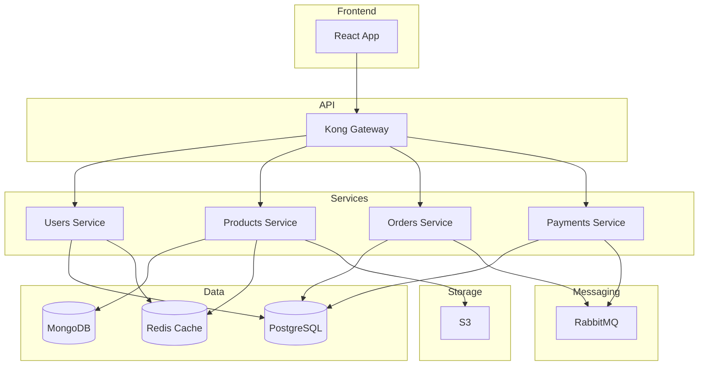

# Módulo 07: Documentación Automatizada con IA
## Duración: 2 horas

---

## Objetivos de Aprendizaje

Al finalizar este módulo, podrás:
- Generar documentación de código automáticamente con IA
- Crear READMEs profesionales y completos
- Documentar APIs de forma clara y consistente
- Mantener documentación sincronizada con el código

---

## 1. La Importancia de la Documentación

### 1.1 El Problema Clásico

```
"El código se explica solo"
    - Desarrollador hace 6 meses

"¿Qué hace esto?"
    - El mismo desarrollador hoy
```

### 1.2 Tipos de Documentación

| Tipo | Audiencia | Propósito |
|------|-----------|-----------|
| Docstrings | Desarrolladores | Explicar funciones/clases |
| README | Usuarios/Devs | Introducir el proyecto |
| API Docs | Integradores | Usar la API |
| Tutoriales | Nuevos usuarios | Aprender paso a paso |
| Arquitectura | Equipo técnico | Entender el sistema |

---

## 2. Documentación de Código con IA

### 2.1 Generando Docstrings

**Prompt básico:**
```
Genera docstrings para esta función siguiendo el estilo Google/NumPy:

def calculate_compound_interest(principal, rate, time, n=12):
    return principal * (1 + rate/n) ** (n * time)
```

**Resultado esperado:**
```python
def calculate_compound_interest(principal, rate, time, n=12):
    """
    Calcula el interés compuesto para una inversión.

    Args:
        principal (float): El monto inicial de la inversión.
        rate (float): La tasa de interés anual (decimal, ej: 0.05 para 5%).
        time (float): El período de tiempo en años.
        n (int, optional): Número de veces que el interés se
            capitaliza por año. Por defecto es 12 (mensual).

    Returns:
        float: El monto final después del período de inversión.

    Examples:
        >>> calculate_compound_interest(1000, 0.05, 2)
        1104.94
        >>> calculate_compound_interest(1000, 0.05, 2, n=1)
        1102.50

    Raises:
        ValueError: Si principal, rate o time son negativos.
    """
    return principal * (1 + rate/n) ** (n * time)
```

### 2.2 Estilos de Docstrings

**Google Style:**
```python
def function(arg1, arg2):
    """Descripción breve.

    Descripción más larga si es necesaria.

    Args:
        arg1: Descripción del primer argumento.
        arg2: Descripción del segundo argumento.

    Returns:
        Descripción de lo que retorna.

    Raises:
        ValueError: Cuándo se lanza este error.
    """
```

**NumPy Style:**
```python
def function(arg1, arg2):
    """
    Descripción breve.

    Descripción más larga si es necesaria.

    Parameters
    ----------
    arg1 : tipo
        Descripción del primer argumento.
    arg2 : tipo
        Descripción del segundo argumento.

    Returns
    -------
    tipo
        Descripción de lo que retorna.

    Raises
    ------
    ValueError
        Cuándo se lanza este error.
    """
```

### 2.3 Documentando Clases Completas

**Prompt:**
```
Documenta esta clase Python con docstrings completos para la clase
y todos sus métodos. Usa estilo Google:

class UserManager:
    def __init__(self, db_connection):
        self.db = db_connection
        self.cache = {}

    def get_user(self, user_id):
        if user_id in self.cache:
            return self.cache[user_id]
        user = self.db.query(f"SELECT * FROM users WHERE id = {user_id}")
        self.cache[user_id] = user
        return user

    def create_user(self, name, email):
        user = self.db.execute(
            "INSERT INTO users (name, email) VALUES (?, ?)",
            (name, email)
        )
        return user

    def delete_user(self, user_id):
        if user_id in self.cache:
            del self.cache[user_id]
        self.db.execute("DELETE FROM users WHERE id = ?", (user_id,))
```

---

## 3. Generación de READMEs

### 3.1 Estructura de un Buen README

```markdown
# Nombre del Proyecto

Descripción breve y concisa.

## 🚀 Características

- Característica 1
- Característica 2
- Característica 3

## 📋 Requisitos

- Python 3.8+
- PostgreSQL 12+

## 🔧 Instalación

```bash
pip install mi-proyecto
```

## 💻 Uso

```python
from mi_proyecto import algo
algo.hacer()
```

## 📖 Documentación

[Link a docs completas]

## 🤝 Contribuir

[Guía de contribución]

## 📄 Licencia

MIT
```

### 3.2 Prompt para README

```
Genera un README.md profesional para este proyecto Python:

Nombre: TaskFlow
Descripción: CLI para gestionar tareas con integración a calendarios
Tecnologías: Python, Click, SQLite, Google Calendar API
Características principales:
- Crear/editar/eliminar tareas
- Sincronizar con Google Calendar
- Recordatorios por email
- Exportar a CSV/JSON

Incluye: badges, instalación, ejemplos de uso, contribución.
```

### 3.3 Badges Útiles

```markdown


```

---

## 4. Documentación de APIs

### 4.1 OpenAPI/Swagger con IA

**Prompt:**
```
Genera documentación OpenAPI 3.0 para este endpoint Flask:

@app.route('/api/users', methods=['GET'])
def list_users():
    page = request.args.get('page', 1, type=int)
    per_page = request.args.get('per_page', 10, type=int)
    status = request.args.get('status', 'active')

    users = User.query.filter_by(status=status)\
        .paginate(page=page, per_page=per_page)

    return jsonify({
        'users': [u.to_dict() for u in users.items],
        'total': users.total,
        'pages': users.pages,
        'current_page': page
    })
```

**Resultado:**
```yaml
openapi: 3.0.0
paths:
  /api/users:
    get:
      summary: Lista usuarios paginados
      description: Retorna una lista paginada de usuarios filtrados por estado.
      parameters:
        - name: page
          in: query
          description: Número de página
          required: false
          schema:
            type: integer
            default: 1
            minimum: 1
        - name: per_page
          in: query
          description: Elementos por página
          required: false
          schema:
            type: integer
            default: 10
            minimum: 1
            maximum: 100
        - name: status
          in: query
          description: Filtrar por estado del usuario
          required: false
          schema:
            type: string
            enum: [active, inactive, pending]
            default: active
      responses:
        '200':
          description: Lista de usuarios exitosa
          content:
            application/json:
              schema:
                type: object
                properties:
                  users:
                    type: array
                    items:
                      $ref: '#/components/schemas/User'
                  total:
                    type: integer
                    description: Total de usuarios
                  pages:
                    type: integer
                    description: Total de páginas
                  current_page:
                    type: integer
                    description: Página actual
```

### 4.2 Documentación de Endpoints REST

**Template:**
```markdown
## Endpoint: Crear Usuario

### Request

`POST /api/users`

**Headers:**
| Header | Valor | Requerido |
|--------|-------|-----------|
| Authorization | Bearer {token} | Sí |
| Content-Type | application/json | Sí |

**Body:**
```json
{
    "name": "string (requerido)",
    "email": "string (requerido, válido)",
    "role": "string (opcional, default: 'user')"
}
```

### Response

**200 OK:**
```json
{
    "id": 1,
    "name": "Juan",
    "email": "juan@example.com",
    "role": "user",
    "created_at": "2024-01-15T10:30:00Z"
}
```

**400 Bad Request:**
```json
{
    "error": "validation_error",
    "details": {
        "email": "Email inválido"
    }
}
```
```

---

## 5. Comentarios de Código Efectivos

### 5.1 Cuándo Comentar

**Comentar:**
- Decisiones de diseño no obvias
- Workarounds temporales
- Algoritmos complejos
- Referencias a documentación externa

**No comentar:**
- Lo que el código ya dice claramente
- Código autoexplicativo
- Cambios de versión (usar git)

### 5.2 Prompt para Comentarios

```
Agrega comentarios explicativos a este código. Solo donde sea
necesario para entender la lógica, no comentes lo obvio:

def optimize_route(points, max_distance=100):
    if len(points) < 2:
        return points

    graph = {}
    for i, p1 in enumerate(points):
        graph[i] = []
        for j, p2 in enumerate(points):
            if i != j:
                dist = ((p1[0]-p2[0])**2 + (p1[1]-p2[1])**2)**0.5
                if dist <= max_distance:
                    graph[i].append((j, dist))

    visited = {0}
    route = [0]
    current = 0

    while len(visited) < len(points):
        neighbors = [(n, d) for n, d in graph[current] if n not in visited]
        if not neighbors:
            break
        next_node = min(neighbors, key=lambda x: x[1])[0]
        visited.add(next_node)
        route.append(next_node)
        current = next_node

    return [points[i] for i in route]
```

---

## 6. Documentación de Arquitectura

### 6.1 Diagramas con Mermaid

**Prompt:**
```
Genera un diagrama Mermaid para esta arquitectura:

Sistema de e-commerce con:
- Frontend React
- API Gateway (Kong)
- Microservicios: Users, Products, Orders, Payments
- Base de datos: PostgreSQL para users/orders, MongoDB para products
- Cache: Redis
- Cola de mensajes: RabbitMQ
- Storage: S3
```

**Resultado:**


### 6.2 Documentación de Decisiones (ADR)

**Prompt:**
```
Genera un Architecture Decision Record (ADR) para esta decisión:

Contexto: Necesitamos elegir una base de datos para nuestro
sistema de logs que recibe 10,000 eventos por segundo.

Decisión: Usar Elasticsearch en lugar de PostgreSQL.

Consideraciones: volumen, velocidad de escritura, búsquedas,
retención de datos, costo operativo.
```

---

## 7. Mantenimiento de Documentación

### 7.1 Sincronización Código-Docs

**Problema:** La documentación queda desactualizada.

**Solución:** Documentación como código.

```yaml
# .github/workflows/docs.yml
name: Update Docs
on:
  push:
    branches: [main]
    paths:
      - 'src/**'
      - 'docs/**'

jobs:
  docs:
    runs-on: ubuntu-latest
    steps:
      - uses: actions/checkout@v2
      - name: Generate API docs
        run: |
          pip install pdoc
          pdoc --html src/
      - name: Deploy to GitHub Pages
        uses: peaceiris/actions-gh-pages@v3
```

### 7.2 Validación de Documentación

```python
# Script para verificar docstrings
import ast
import sys

def check_docstrings(filename):
    with open(filename) as f:
        tree = ast.parse(f.read())

    missing = []
    for node in ast.walk(tree):
        if isinstance(node, (ast.FunctionDef, ast.ClassDef)):
            if not ast.get_docstring(node):
                missing.append(f"{filename}:{node.lineno} - {node.name}")

    return missing

# Uso: python check_docs.py src/*.py
```

---

## 8. Mejores Prácticas

### 8.1 Checklist de Documentación

**Para funciones/métodos:**
- [ ] Descripción de qué hace
- [ ] Parámetros documentados
- [ ] Tipo de retorno
- [ ] Excepciones posibles
- [ ] Ejemplo de uso (si es complejo)

**Para proyectos:**
- [ ] README completo
- [ ] Guía de instalación
- [ ] Ejemplos de uso
- [ ] API reference
- [ ] Guía de contribución
- [ ] Changelog

### 8.2 Automatización Recomendada

```python
# pyproject.toml
[tool.pydocstyle]
convention = "google"
add-ignore = ["D100", "D104"]

# Pre-commit hook
# .pre-commit-config.yaml
repos:
  - repo: https://github.com/pycqa/pydocstyle
    rev: 6.1.1
    hooks:
      - id: pydocstyle
        args: ["--convention=google"]
```

---

## Resumen

- **Docstrings** automáticos ahorran tiempo
- **READMEs** profesionales mejoran adopción
- **API docs** claros facilitan integración
- **Diagramas** visualizan arquitectura
- **Automatización** mantiene docs actualizados

---

## Recursos

- [Google Python Style Guide](https://google.github.io/styleguide/pyguide.html)
- [NumPy Docstring Guide](https://numpydoc.readthedocs.io/)
- [OpenAPI Specification](https://swagger.io/specification/)
- [Mermaid Documentation](https://mermaid.js.org/)
- [pdoc](https://pdoc.dev/) - Generador de documentación Python

---

*Siguiente: Módulo 08 - Proyecto Integrador*
