# ⚙️ Módulo 02: Dominio de Configuración

## Personaliza tu Asistente de IA Como un Profesional

> **Para Todos**: Este módulo te enseña a configurar tu asistente de IA para que trabaje exactamente como TÚ necesitas. Es como entrenar a un empleado nuevo para que conozca tus preferencias y tu forma de trabajar.

**⏱️ Duración**: 2 horas  
**👤 Nivel**: Principiante (con Módulo 01 completado)  
**🎯 Objetivo**: Configurar OpenCode con superpoderes personalizados

---

## 🎓 ¿Qué Vas a Lograr?

Al terminar este módulo, tendrás:

1. ✅ **MCPs configurados** - Conexiones con otras herramientas (Git, archivos, etc.)
2. ✅ **Skills instalados** - Recetas pre-hechas para tareas comunes
3. ✅ **Hooks funcionando** - Automatización de tareas repetitivas
4. ✅ **Rules aplicadas** - Tu asistente seguirá tus reglas automáticamente
5. ✅ **OpenCode personalizado** - Adaptado a TUS necesidades específicas

---

## 🤔 Concepto Central: Los 4 Pilares de Configuración

### Analogía: Configurar una Cafetería

Imagina que abres una cafetería y necesitas configurarla:

```mermaid
mindmap
  root((Tu Cafetería))
    Conexiones (MCPs)
      Proveedor de café
      Banco para pagos
      Servicio de delivery
    Recetas (Skills)
      Cappuccino
      Latte
      Americano
    Reglas (Rules)
      Siempre calentar taza
      Usar leche fresca
      Decorar espuma
    Automatización (Hooks)
      Prender máquina a las 6am
      Limpiar al cerrar
      Hacer inventario
```

**En OpenCode es lo mismo**:

| Cafetería | OpenCode | ¿Qué hace? |
|-----------|----------|------------|
| 🔌 Conexiones con proveedores | **MCPs** | Conectar con GitHub, archivos, bases de datos |
| 📋 Recetas de bebidas | **Skills** | Plantillas para crear proyectos, tests, docs |
| 📜 Reglas del negocio | **Rules** | Cómo debe comportarse el código generado |
| ⚡ Automatización | **Hooks** | Acciones automáticas antes/después de algo |

---

## 📋 Arquitectura de Configuración

```mermaid
graph TB
    subgraph "Tu Computadora"
        Home[🏠 Carpeta Personal] --> OpenCodeDir[📁 .opencode/]
        
        OpenCodeDir --> Config[⚙️ config.json]
        OpenCodeDir --> MCP[🔌 mcp-servers.json]
        OpenCodeDir --> Skills[📦 skills/]
        OpenCodeDir --> Hooks[⚡ hooks.yaml]
        OpenCodeDir --> Rules[📜 rules.yaml]
        
        Config -.Configuración general.-> OC[🤖 OpenCode]
        MCP -.Conexiones externas.-> OC
        Skills -.Plantillas.-> OC
        Hooks -.Automatización.-> OC
        Rules -.Comportamiento.-> OC
    end
    
    style OpenCodeDir fill:#e1f5ff
    style OC fill:#90EE90
```

### ¿Dónde Está Todo?

**Windows**: `C:\Users\TuNombre\.opencode\`  
**Mac/Linux**: `~/.opencode/`

**Archivos importantes**:
```
.opencode/
├── config.json           # Configuración general
├── mcp-servers.json      # Conexiones (MCPs)
├── hooks.yaml            # Automatización
├── rules.yaml            # Reglas de código
└── skills/               # Carpeta de skills
    ├── fpuna-header/
    ├── generate-readme/
    └── ...
```

---

## 🔌 Parte 1: MCPs - Conectar con el Mundo Exterior (45 min)

### ¿Qué es un MCP?

**MCP** = **Model Context Protocol** (Protocolo de Contexto del Modelo)

**Analogía Simple**: Un MCP es como un "traductor" que permite a OpenCode hablar con otras aplicaciones.

```mermaid
sequenceDiagram
    participant U as 👤 Tú
    participant OC as 🤖 OpenCode
    participant MCP as 🔌 MCP
    participant Tool as 🛠️ Herramienta<br/>(Git, archivos, etc.)
    
    U->>OC: "Muéstrame mis commits de Git"
    OC->>MCP: Necesito info de Git
    MCP->>Tool: [Habla en lenguaje de Git]
    Tool->>MCP: [Responde]
    MCP->>OC: [Traduce respuesta]
    OC->>U: "Aquí están tus commits..."
```

### MCPs Esenciales para Estudiantes FPUNA

#### 1. Filesystem MCP (Leer y Escribir Archivos)

**¿Qué hace?**: Permite a OpenCode leer y crear archivos en tu computadora.

**¿Por qué lo necesitas?**: Para que OpenCode pueda crear proyectos automáticamente.

##### Instalación Paso a Paso

```mermaid
flowchart TD
    Start[🎯 Instalar Filesystem MCP] --> Open[Abrir PowerShell/Terminal]
    Open --> Install[Escribir comando npm install]
    Install --> Wait[Esperar 1-2 minutos]
    Wait --> Config[Crear archivo de configuración]
    Config --> Test[Probar que funciona]
    Test --> Success[✅ ¡Listo para usar!]
    
    style Start fill:#e1f5ff
    style Success fill:#90EE90
```

**Paso 1**: Abrir PowerShell o Terminal

**Paso 2**: Instalar el MCP

```bash
npm install -g @modelcontextprotocol/server-filesystem
```

**Espera a que termine** (verás algo como: `added 15 packages in 1m`)

**Paso 3**: Configurar

1. Ve a tu carpeta `.opencode`:
   - Windows: `cd C:\Users\TuNombre\.opencode`
   - Mac: `cd ~/.opencode`

2. Crea/edita el archivo `mcp-servers.json`:

```bash
# En Windows (PowerShell)
notepad mcp-servers.json

# En Mac
nano mcp-servers.json
```

3. **Copia y pega esto** (reemplaza `TuNombre` con tu usuario):

```json
{
  "mcpServers": {
    "filesystem": {
      "command": "npx",
      "args": [
        "-y",
        "@modelcontextprotocol/server-filesystem",
        "C:\\Users\\TuNombre\\FPUNA-Proyectos"
      ]
    }
  }
}
```

**En Mac, usa esta ruta**:
```json
"/Users/TuNombre/FPUNA-Proyectos"
```

4. **Guardar**:
   - Notepad: Archivo → Guardar
   - Nano: `Control + O`, Enter, `Control + X`

**Paso 4**: Probar

```bash
opencode "Lista todos los archivos en mi carpeta FPUNA-Proyectos"
```

**Si funciona**, verás la lista de archivos. ¡Felicitaciones! 🎉

#### 2. Git MCP (Control de Versiones)

**¿Qué hace?**: Permite a OpenCode usar Git por ti (commits, status, etc.)

**¿Por qué lo necesitas?**: Para no tener que escribir comandos de Git manualmente.

##### Instalación

```bash
npm install -g @modelcontextprotocol/server-git
```

##### Configuración

Edita tu `mcp-servers.json` para agregar Git:

```json
{
  "mcpServers": {
    "filesystem": {
      "command": "npx",
      "args": ["-y", "@modelcontextprotocol/server-filesystem", "C:\\Users\\TuNombre\\FPUNA-Proyectos"]
    },
    "git": {
      "command": "npx",
      "args": ["-y", "@modelcontextprotocol/server-git"]
    }
  }
}
```

##### Uso Práctico

```bash
# Ver status de Git
opencode "Muéstrame el estado de Git"

# Ver últimos commits
opencode "Muéstrame los últimos 5 commits con sus mensajes"

# Hacer commit
opencode "Crea un commit con mensaje 'Agregué calculadora' para todos los cambios"
```

#### 3. GitHub MCP (Repositorios en la Nube)

**¿Qué hace?**: Conecta OpenCode con tu cuenta de GitHub.

**¿Por qué lo necesitas?**: Para crear repos, issues, pull requests sin salir de terminal.

##### Prerequisito: Token de GitHub

```mermaid
journey
    title Obtener Token de GitHub
    section Ir a GitHub
      Abrir github.com: 5: Tú
      Iniciar sesión: 5: Tú
    section Configurar
      Settings > Developer Settings: 4: Tú
      Personal Access Tokens: 4: Tú
      Generate New Token: 3: Tú
    section Usar
      Copiar token: 5: Tú
      Guardar en computadora: 4: Tú
```

**Pasos detallados**:

1. Ve a: `https://github.com/settings/tokens`
2. Click en "Generate new token (classic)"
3. Dale un nombre: `FPUNA-OpenCode`
4. Selecciona permisos:
   - ✅ `repo` (todos los sub-checks)
   - ✅ `workflow`
5. Click "Generate token"
6. **COPIA EL TOKEN** (solo lo verás una vez)
   - Se verá así: `ghp_xxxxxxxxxxxxxxxxxxxx`

##### Guardar Token en tu Computadora

**Windows (PowerShell)**:
```powershell
[Environment]::SetEnvironmentVariable("GITHUB_TOKEN", "ghp_TU_TOKEN_AQUI", "User")
```

**Mac (Terminal)**:
```bash
echo 'export GITHUB_TOKEN="ghp_TU_TOKEN_AQUI"' >> ~/.zshrc
source ~/.zshrc
```

##### Configurar GitHub MCP

Instalar:
```bash
npm install -g @modelcontextprotocol/server-github
```

Actualizar `mcp-servers.json`:
```json
{
  "mcpServers": {
    "filesystem": { ... },
    "git": { ... },
    "github": {
      "command": "npx",
      "args": ["-y", "@modelcontextprotocol/server-github"],
      "env": {
        "GITHUB_TOKEN": "${GITHUB_TOKEN}"
      }
    }
  }
}
```

##### Uso

```bash
# Crear repositorio
opencode "Crea un repositorio llamado 'mi-proyecto-fpuna' en mi GitHub"

# Ver issues
opencode "Muéstrame los issues abiertos de mi repo"

# Crear issue
opencode "Crea un issue titulado 'Agregar tests' en mi-proyecto-fpuna"
```

---

## 📦 Parte 2: Skills - Recetas Pre-hechas (30 min)

### ¿Qué es un Skill?

**Skill** = Una "receta" o "plantilla" que automatiza una tarea común.

```mermaid
graph LR
    A[🤔 Tarea que repites<br/>muchas veces] --> B[📦 Crear un Skill]
    B --> C[⚡ Ejecutar con 1 comando]
    C --> D[✅ Tarea completada<br/>automáticamente]
    
    style A fill:#ffe1e1
    style D fill:#90EE90
```

### Analogía: Recetas de Cocina

| Sin Skill | Con Skill |
|-----------|-----------|
| Cada vez cocinas, buscas ingredientes, mides, etc. | Tienes la receta escrita, solo la sigues |
| OpenCode pregunta cada detalle | Le dices "usa el skill X" y sabe qué hacer |
| Toma 10 minutos explicar qué quieres | Toma 10 segundos ejecutar el skill |

### Skills Útiles para FPUNA

#### Skill 1: Generar README

**¿Qué hace?**: Crea un archivo README.md profesional para tu proyecto.

**Instalar**:
```bash
opencode skill install generate-readme
```

**Usar**:
```bash
cd mi-proyecto
opencode skill use generate-readme
```

**OpenCode preguntará**:
- Nombre del proyecto
- Descripción
- Cómo instalarlo
- Cómo usarlo

**Y creará un README completo automáticamente.**

#### Skill 2: Crear Tests

**¿Qué hace?**: Genera tests automáticamente para tu código.

**Instalar**:
```bash
opencode skill install generate-unit-tests
```

**Usar**:
```bash
opencode skill use generate-unit-tests --file=calculadora.js
```

**Resultado**: Archivo `calculadora.test.js` con tests completos.

#### Skill 3: Setup de Proyecto Node.js

**¿Qué hace?**: Crea un proyecto Node.js completo con estructura profesional.

**Instalar**:
```bash
opencode skill install init-nodejs-project
```

**Usar**:
```bash
opencode skill use init-nodejs-project --name=mi-app-fpuna
```

**Crea**:
```
mi-app-fpuna/
├── package.json
├── README.md
├── .gitignore
├── src/
│   └── index.js
└── tests/
    └── index.test.js
```

### Crear Tu Propio Skill para FPUNA

**Caso de uso**: Todos tus archivos deben tener un encabezado con tu nombre y carnet.

#### Paso 1: Crear Carpeta del Skill

```bash
cd ~/.opencode/skills
mkdir fpuna-header
cd fpuna-header
```

#### Paso 2: Crear Archivo de Configuración

Crea `skill.yaml`:

```yaml
name: fpuna-header
description: Agrega encabezado FPUNA a archivos de código
version: 1.0.0
author: Estudiante FPUNA

inputs:
  - name: nombre
    description: Tu nombre completo
    required: true
  
  - name: carnet
    description: Tu número de carnet
    required: true
  
  - name: carrera
    description: Tu carrera
    required: true

template: |
  /**
   * ╔═══════════════════════════════════════════════════════════╗
   * ║   FACULTAD POLITÉCNICA - UNIVERSIDAD NACIONAL ASUNCIÓN   ║
   * ║   Curso: AI-Augmented Development - Verano 2026          ║
   * ╠═══════════════════════════════════════════════════════════╣
   * ║   Estudiante: {{ nombre }}                                ║
   * ║   Carnet: {{ carnet }}                                    ║
   * ║   Carrera: {{ carrera }}                                  ║
   * ║   Fecha: {{ fecha_actual }}                               ║
   * ╚═══════════════════════════════════════════════════════════╝
   */

steps:
  - prompt: |
      Agrega el siguiente encabezado al inicio de TODOS los archivos 
      .js, .py, .java, .cpp en el directorio actual:
      
      {{ template }}
      
      Reemplaza:
      - {{ nombre }} con: {{ inputs.nombre }}
      - {{ carnet }} con: {{ inputs.carnet }}
      - {{ carrera }} con: {{ inputs.carrera }}
      - {{ fecha_actual }} con la fecha de hoy
```

#### Paso 3: Usar Tu Skill

```bash
opencode skill use fpuna-header \
  --nombre="María González" \
  --carnet="2024001" \
  --carrera="Ingeniería Informática"
```

**Resultado**: Todos tus archivos de código tendrán el encabezado FPUNA.

---

## ⚡ Parte 3: Hooks - Automatización Mágica (25 min)

### ¿Qué son los Hooks?

**Hook** = Una acción que se ejecuta **automáticamente** cuando algo sucede.

```mermaid
sequenceDiagram
    participant U as 👤 Tú
    participant OC as 🤖 OpenCode
    participant Hook as ⚡ Hook
    participant Action as 🔧 Acción
    
    U->>OC: "Genera código"
    OC->>U: Código creado
    Note over OC,Hook: Hook detecta: "código generado"
    Hook->>Action: Ejecutar formateo
    Action->>Hook: ✅ Código formateado
    Hook->>U: ¡Listo y formateado!
```

### Analogía: Alarmas y Rutinas

| Vida Real | OpenCode con Hooks |
|-----------|-------------------|
| Alarma de las 6am → Preparar café | Después de generar código → Formatear |
| Salir de casa → Cerrar con llave | Antes de commit → Ejecutar tests |
| Llegar a casa → Encender luces | Después de instalar paquete → Actualizar docs |

### Hooks Comunes para Estudiantes

#### Configurar Hooks

Crear archivo `~/.opencode/hooks.yaml`:

```yaml
hooks:
  # Después de generar código
  post-generate:
    - name: format-code
      description: Formatear código con Prettier
      command: npx prettier --write .
      on_fail: warn
    
    - name: add-fpuna-header
      description: Agregar encabezado FPUNA
      command: opencode skill use fpuna-header --nombre="Tu Nombre" --carnet="Tu Carnet" --carrera="Tu Carrera"
      on_fail: warn

  # Antes de hacer commit
  pre-commit:
    - name: run-tests
      description: Ejecutar tests antes de commit
      command: npm test
      on_fail: abort  # Bloquear commit si fallan tests
    
    - name: lint-code
      description: Verificar estilo de código
      command: npm run lint
      on_fail: warn

  # Después de instalar paquetes
  post-install:
    - name: update-readme
      description: Actualizar lista de dependencias en README
      command: opencode "Actualiza la sección de dependencias en README.md"
      on_fail: warn
```

### Opciones de `on_fail`

```mermaid
flowchart TD
    Hook[⚡ Hook ejecuta acción] --> Check{¿Acción<br/>falló?}
    Check -->|No| Success[✅ Continuar normal]
    Check -->|Sí| OnFail{Opción on_fail}
    
    OnFail -->|abort| Stop[❌ DETENER TODO<br/>Mostrar error]
    OnFail -->|warn| Warn[⚠️ Mostrar advertencia<br/>Continuar]
    OnFail -->|ignore| Ignore[🤐 Ignorar error<br/>Continuar]
    
    style Success fill:#90EE90
    style Stop fill:#FFB6C1
    style Warn fill:#FFF4B6
    style Ignore fill:#E1E1E1
```

- **`abort`**: Detener TODO si falla (usa para tests críticos)
- **`warn`**: Mostrar advertencia pero continuar (usa para formateo)
- **`ignore`**: Ignorar completamente (rara vez uses esto)

### Ejemplo Práctico: Workflow Automático

**Escenario**: Creas un proyecto para FPUNA

```mermaid
flowchart LR
    A[Generar código] --> B[⚡ Hook: Formatear]
    B --> C[⚡ Hook: Agregar<br/>encabezado FPUNA]
    C --> D[Hacer commit]
    D --> E[⚡ Hook: Ejecutar tests]
    E --> F{Tests<br/>pasaron?}
    F -->|Sí| G[✅ Commit exitoso]
    F -->|No| H[❌ Commit bloqueado]
    
    style G fill:#90EE90
    style H fill:#FFB6C1
```

**Sin hooks**: Harías cada paso manualmente (6 comandos).  
**Con hooks**: Todo automático (1 comando).

---

## 📜 Parte 4: Rules - Tu Asistente Sigue Tus Reglas (20 min)

### ¿Qué son las Rules?

**Rules** = Reglas que OpenCode **siempre** sigue al generar código.

```mermaid
mindmap
  root((Rules))
    Estilo de Código
      Nombres en español
      camelCase para variables
      Comentarios en español
    Documentación
      Siempre JSDoc
      README obligatorio
      Incluir ejemplos
    Testing
      Tests para funciones públicas
      Casos edge incluidos
    Proyecto FPUNA
      Encabezado en archivos
      Número de carnet
      Complejidad máxima 10
```

### Analogía: Reglas de una Empresa

Imagina trabajar en una empresa con reglas claras:

| Sin Rules | Con Rules |
|-----------|-----------|
| Cada desarrollador escribe diferente | Todos siguen el mismo estilo |
| Tienes que recordar las reglas | La IA las aplica automáticamente |
| Código inconsistente | Código uniforme y profesional |

### Configurar Rules para FPUNA

Crear `~/.opencode/rules.yaml`:

```yaml
rules:
  # ═══════════════════════════════════════════════
  # ESTILO DE CÓDIGO
  # ═══════════════════════════════════════════════
  code_style:
    javascript:
      - "Usar nombres de variables en español cuando sea apropiado"
      - "camelCase para variables y funciones"
      - "PascalCase para clases y componentes"
      - "Preferir const sobre let"
      - "Usar arrow functions para callbacks"
      - "Máximo 50 líneas por función"
      - "Incluir comentarios explicativos en español"
    
    python:
      - "Seguir PEP 8 estrictamente"
      - "Nombres de variables en español cuando sea claro"
      - "Type hints en todas las funciones"
      - "Docstrings en español con formato Google"
      - "Máximo 80 caracteres por línea"
    
    java:
      - "Seguir convenciones de Java estándar"
      - "Comentarios Javadoc en español"
      - "Nombres de paquetes en minúsculas"
      - "Constantes en MAYÚSCULAS_CON_GUIONES"

  # ═══════════════════════════════════════════════
  # DOCUMENTACIÓN
  # ═══════════════════════════════════════════════
  documentation:
    - "TODAS las funciones públicas deben tener documentación"
    - "Comentarios escritos en español"
    - "Incluir @param, @returns, @throws en JSDoc"
    - "README.md obligatorio en cada proyecto"
    - "Incluir nombre del estudiante y carnet en encabezados"
    - "Explicar el 'por qué', no solo el 'qué'"
    - "Ejemplos de uso en la documentación"

  # ═══════════════════════════════════════════════
  # TESTING
  # ═══════════════════════════════════════════════
  testing:
    - "Generar tests para TODAS las funciones públicas"
    - "Usar Jest para JavaScript/TypeScript"
    - "Usar pytest para Python"
    - "Usar JUnit para Java"
    - "Incluir casos edge y escenarios de error"
    - "Nombres de tests descriptivos en español"
    - "Organizar tests con describe/it (Jest) o def test_ (pytest)"
    - "Cobertura mínima 80%"

  # ═══════════════════════════════════════════════
  # MANEJO DE ERRORES
  # ═══════════════════════════════════════════════
  error_handling:
    - "Validar TODOS los inputs de funciones públicas"
    - "Nunca usar try-catch vacíos"
    - "Mensajes de error descriptivos en español"
    - "Logs útiles para debugging"
    - "Fallar rápido con errores claros"

  # ═══════════════════════════════════════════════
  # PROYECTO FPUNA
  # ═══════════════════════════════════════════════
  fpuna_standards:
    - "Incluir encabezado FPUNA en TODOS los archivos de código"
    - "Seguir estándares de código del curso"
    - "Complejidad ciclomática máxima: 10"
    - "No usar magic numbers - usar constantes con nombres"
    - "Código en inglés, comentarios en español"
    - "Git commits en español con mensajes descriptivos"

  # ═══════════════════════════════════════════════
  # SEGURIDAD
  # ═══════════════════════════════════════════════
  security:
    - "NUNCA hardcodear contraseñas o API keys"
    - "Validar y sanitizar TODOS los inputs de usuario"
    - "Usar variables de entorno para configuración sensible"
    - "No guardar información sensible en Git"
```

### Cómo Funcionan las Rules

```mermaid
flowchart TD
    A[Tú pides algo a OpenCode] --> B[OpenCode lee tus Rules]
    B --> C[OpenCode genera código]
    C --> D{¿Cumple<br/>las Rules?}
    D -->|No| E[OpenCode ajusta<br/>automáticamente]
    E --> D
    D -->|Sí| F[✅ Te muestra<br/>el código]
    
    style F fill:#90EE90
```

### Ejemplo: Ver Rules en Acción

**Sin Rules**:
```bash
opencode "Crea una función que sume dos números"
```

**Podría generar**:
```javascript
function sum(x, y) {
  return x + y;
}
```

**Con Rules configuradas**, genera:
```javascript
/**
 * ╔═══════════════════════════════════════════════════════════╗
 * ║   FACULTAD POLITÉCNICA - UNIVERSIDAD NACIONAL ASUNCIÓN   ║
 * ║   Estudiante: María González                              ║
 * ║   Carnet: 2024001                                         ║
 * ╚═══════════════════════════════════════════════════════════╝
 */

/**
 * Suma dos números y retorna el resultado
 * 
 * @param {number} primerNumero - El primer número a sumar
 * @param {number} segundoNumero - El segundo número a sumar
 * @returns {number} La suma de ambos números
 * @throws {TypeError} Si alguno de los parámetros no es un número
 * @example
 * sumar(5, 3); // Retorna 8
 * sumar(-2, 7); // Retorna 5
 */
const sumar = (primerNumero, segundoNumero) => {
  // Validar que ambos parámetros sean números
  if (typeof primerNumero !== 'number' || typeof segundoNumero !== 'number') {
    throw new TypeError('Ambos parámetros deben ser números válidos');
  }
  
  // Validar que no sean NaN
  if (isNaN(primerNumero) || isNaN(segundoNumero)) {
    throw new TypeError('Los parámetros no pueden ser NaN');
  }
  
  return primerNumero + segundoNumero;
};

module.exports = { sumar };
```

**¡Mira la diferencia!** Todo automático:
- ✅ Encabezado FPUNA
- ✅ JSDoc completo en español
- ✅ Validación de inputs
- ✅ Ejemplos de uso
- ✅ Manejo de errores
- ✅ Arrow function
- ✅ Nombres descriptivos en español

---

## 🎯 Parte 5: Integración Completa (10 min)

### Todo Junto: Tu Setup Profesional

```mermaid
graph TB
    subgraph "Tu OpenCode Configurado"
        User[👤 Tú das comandos]
        
        User --> OC[🤖 OpenCode]
        
        OC --> MCPs[🔌 MCPs]
        OC --> Skills[📦 Skills]
        OC --> Rules[📜 Rules]
        OC --> Hooks[⚡ Hooks]
        
        MCPs --> FS[📁 Filesystem]
        MCPs --> Git[🔧 Git]
        MCPs --> GH[🐙 GitHub]
        
        Skills --> README[📄 Generate README]
        Skills --> Tests[🧪 Generate Tests]
        Skills --> FPUNA[🎓 FPUNA Header]
        
        Rules --> Style[✍️ Code Style]
        Rules --> Docs[📚 Documentation]
        Rules --> Security[🔒 Security]
        
        Hooks --> Format[💅 Auto Format]
        Hooks --> TestRun[✅ Auto Test]
        Hooks --> Deploy[🚀 Auto Deploy]
    end
    
    style OC fill:#90EE90
```

### Archivo de Configuración Completo para Estudiante FPUNA

#### Paso 1: MCP Configuration

`~/.opencode/mcp-servers.json`:
```json
{
  "mcpServers": {
    "filesystem": {
      "command": "npx",
      "args": [
        "-y",
        "@modelcontextprotocol/server-filesystem",
        "C:\\Users\\TuNombre\\FPUNA-Proyectos"
      ]
    },
    "git": {
      "command": "npx",
      "args": ["-y", "@modelcontextprotocol/server-git"]
    },
    "github": {
      "command": "npx",
      "args": ["-y", "@modelcontextprotocol/server-github"],
      "env": {
        "GITHUB_TOKEN": "${GITHUB_TOKEN}"
      }
    }
  }
}
```

#### Paso 2: Hooks Configuration

`~/.opencode/hooks.yaml`:
```yaml
hooks:
  post-generate:
    - name: format-code
      command: npx prettier --write .
      on_fail: warn
    
    - name: add-header
      command: opencode skill use fpuna-header
      on_fail: warn

  pre-commit:
    - name: run-tests
      command: npm test
      on_fail: warn
    
    - name: lint
      command: npm run lint
      on_fail: warn
```

#### Paso 3: Rules Configuration

`~/.opencode/rules.yaml` (usa el ejemplo completo de arriba)

### Probar Setup Completo

```mermaid
journey
    title Workflow Completo de Desarrollo
    section Crear Proyecto
      Pedir a OpenCode crear proyecto: 5: Tú
      OpenCode crea estructura: 5: OpenCode
      Hook: Formatear código: 5: Automático
      Hook: Agregar encabezado FPUNA: 5: Automático
    section Desarrollar
      Pedir funciones: 4: Tú
      OpenCode genera con Rules: 5: OpenCode
      Código ya formateado y documentado: 5: Automático
    section Commit
      Hacer git add y commit: 4: Tú
      Hook: Ejecutar tests: 4: Automático
      Hook: Verificar lint: 4: Automático
      Commit exitoso: 5: Sistema
```

**Comando de prueba completo**:

```bash
# 1. Crear carpeta de proyecto
mkdir test-config-completo
cd test-config-completo
npm init -y

# 2. Pedir a OpenCode que cree una aplicación
opencode "Crea una clase Calculadora con:
- Métodos: sumar, restar, multiplicar, dividir
- Validación completa de inputs
- Tests con Jest
- README en español con ejemplos
- Manejo de errores apropiado"

# 3. Observar la magia:
# - OpenCode crea archivos ✅
# - Hook formatea código automáticamente ✅
# - Rules aplicadas (JSDoc, validación, etc.) ✅
# - Encabezado FPUNA agregado ✅

# 4. Verificar que funciona
npm test

# 5. Hacer commit
git init
git add .
git commit -m "Proyecto inicial con OpenCode configurado"

# - Hook ejecuta tests antes de commit ✅
# - Si tests pasan, commit se completa ✅
```

---

## ✅ Verificación Final

```mermaid
flowchart TD
    Start[🎯 Verificación<br/>de Configuración] --> C1{MCPs<br/>instalados?}
    
    C1 -->|✅| C2{Skills<br/>instalados?}
    C1 -->|❌| F1[Reinstalar MCPs]
    F1 --> C1
    
    C2 -->|✅| C3{Hooks<br/>configurados?}
    C2 -->|❌| F2[Instalar Skills]
    F2 --> C2
    
    C3 -->|✅| C4{Rules<br/>aplicadas?}
    C3 -->|❌| F3[Crear hooks.yaml]
    F3 --> C3
    
    C4 -->|✅| C5{Proyecto de prueba<br/>funciona?}
    C4 -->|❌| F4[Crear rules.yaml]
    F4 --> C4
    
    C5 -->|✅| Success[🎉 ¡CONFIGURACIÓN<br/>COMPLETA!]
    C5 -->|❌| F5[Revisar errores<br/>en logs]
    F5 --> C5
    
    style Success fill:#90EE90
    style F1 fill:#FFB6C1
    style F2 fill:#FFB6C1
    style F3 fill:#FFB6C1
    style F4 fill:#FFB6C1
    style F5 fill:#FFB6C1
```

### Checklist de Verificación

Marca cada uno:

#### MCPs
- [ ] ✅ Filesystem MCP instalado
- [ ] ✅ Git MCP instalado
- [ ] ✅ GitHub MCP instalado (opcional)
- [ ] ✅ `mcp-servers.json` configurado correctamente
- [ ] ✅ OpenCode puede leer/escribir archivos

#### Skills
- [ ] ✅ Al menos 3 skills instalados
- [ ] ✅ Skill `fpuna-header` creado y funcional
- [ ] ✅ Puedo ejecutar skills con `opencode skill use`

#### Hooks
- [ ] ✅ `hooks.yaml` creado
- [ ] ✅ Hook `post-generate` configurado
- [ ] ✅ Hook `pre-commit` configurado
- [ ] ✅ Hooks se ejecutan automáticamente

#### Rules
- [ ] ✅ `rules.yaml` creado
- [ ] ✅ Rules de estilo configuradas
- [ ] ✅ Rules de documentación configuradas
- [ ] ✅ Rules FPUNA configuradas
- [ ] ✅ OpenCode aplica rules automáticamente

#### Integración
- [ ] ✅ Creé proyecto de prueba exitosamente
- [ ] ✅ Código generado tiene encabezado FPUNA
- [ ] ✅ Código está bien documentado
- [ ] ✅ Tests se ejecutan correctamente
- [ ] ✅ Git commit funciona con hooks

---

## 🆘 Solución de Problemas

### Problema 1: "MCP not found"

**Síntomas**: OpenCode dice que no encuentra un MCP.

**Solución**:
```bash
# 1. Verificar instalación
npm list -g @modelcontextprotocol/server-filesystem

# 2. Si no está instalado
npm install -g @modelcontextprotocol/server-filesystem

# 3. Verificar sintaxis de JSON
# Usa https://jsonlint.com para validar tu mcp-servers.json

# 4. Reiniciar OpenCode
opencode restart
```

### Problema 2: "Hooks not executing"

**Solución**:
```bash
# 1. Verificar sintaxis YAML
# Usa https://www.yamllint.com

# 2. Ver logs de hooks
cat ~/.opencode/logs/hooks.log

# 3. Verificar permisos de ejecución (Mac/Linux)
chmod +x ~/.opencode/hooks.yaml

# 4. Ejecutar hook manualmente para debug
npx prettier --write .
```

### Problema 3: "Rules not being followed"

**Importante**: Las Rules son **sugerencias**, no garantías al 100%.

**Solución**:
1. Hacer las rules más específicas
2. Incluir ejemplos en las rules
3. Repetir la regla en el prompt si es crítica

**Ejemplo**:
```bash
# En lugar de solo confiar en rules
opencode "Crea función de suma"

# Ser específico en el prompt
opencode "Crea función de suma siguiendo EXACTAMENTE las reglas FPUNA:
- Encabezado con mi nombre
- JSDoc completo en español  
- Validación de inputs
- Ejemplos de uso"
```

### Problema 4: "GitHub token inválido"

**Solución**:
```bash
# 1. Generar nuevo token en GitHub
# https://github.com/settings/tokens

# 2. Actualizar variable de entorno
# Windows:
[Environment]::SetEnvironmentVariable("GITHUB_TOKEN", "ghp_NUEVO_TOKEN", "User")

# Mac:
echo 'export GITHUB_TOKEN="ghp_NUEVO_TOKEN"' >> ~/.zshrc
source ~/.zshrc

# 3. Reiniciar terminal
# 4. Verificar
echo $env:GITHUB_TOKEN  # Windows
echo $GITHUB_TOKEN       # Mac
```

---

## 📚 Recursos Adicionales

### Documentación Completa

Para profundizar:

- 📖 [Guía Completa de MCPs](../../COMPARTIDO/mcp-configuration/README.md)
- 📖 [Encontrar Más MCPs](../../COMPARTIDO/mcp-configuration/finding-mcps.md)
- 📖 [Configurar MCPs Avanzados](../../COMPARTIDO/mcp-configuration/advanced-config.md)
- 📖 [Sistema de Skills](../../COMPARTIDO/skills-system/README.md)
- 📖 [Crear Skills Personalizados](../../COMPARTIDO/skills-system/creating-skills.md)
- 📖 [Hooks y Rules](../../COMPARTIDO/hooks-rules/README.md)
- 📖 [Ejemplos de Configuración](../../COMPARTIDO/components/configuration-examples.md)

### Videos y Tutoriales

- 🎥 Configurar MCPs paso a paso
- 🎥 Crear tu primer Skill
- 🎥 Hooks para automatización
- 🎥 Rules para código consistente

### Soporte

**¿Necesitas ayuda?**

- 💬 **Slack**: #fpuna-core-foundation
- 📧 **Email**: soporte-core@fpuna.edu.py
- 🕐 **Horario de consulta**: Lunes-Viernes 14:00-16:00
- 👥 **Asistentes**: Disponibles durante clase

---

## 🎯 Próximos Pasos

```mermaid
journey
    title Tu Progreso en el Curso
    section Completado
      Módulo 01 Instalación: 5: Completado
      Módulo 02 Configuración: 5: Completado
    section Siguiente
      Módulo 03 Prompt Engineering: 3: Por hacer
      Módulo 04 Context Engineering: 3: Por hacer
    section Futuro
      Módulo 05 Live Project: 3: Por hacer
      Módulo 06 Workflow Patterns: 3: Por hacer
```

**Ahora que dominaste la configuración**:

1. 📝 **Practica**: Crea un proyecto personal con tu configuración
2. 📖 **Continúa**: [Módulo 03 - Ingeniería de Prompts](./03-prompt-engineering.md)
3. 🤝 **Comparte**: Muestra tu configuración a compañeros
4. ❓ **Pregunta**: Si algo no quedó claro, ¡usa Slack!

### Ejercicio Recomendado

**Antes del Módulo 03**, practica esto:

```bash
# Crear un proyecto que use TODA tu configuración
opencode "Crea un proyecto llamado 'conversor-guaranies' que:
- Convierta USD, EUR, BRL a Guaraníes
- Tenga funciones para cada conversión
- Incluya tests completos
- Tenga README en español
- Use tipos de cambio actuales (aproximados)
- Valide inputs correctamente"

# Observa cómo todo funciona automáticamente:
# - Código formateado ✅
# - Encabezado FPUNA ✅
# - Documentación completa ✅
# - Tests incluidos ✅
```

---

## 🎉 ¡Felicitaciones!

Has completado el Módulo 02. Ahora tu OpenCode está configurado como un **profesional**.

### Lo Que Lograste

✅ **MCPs instalados** - Tu IA puede hablar con otras herramientas  
✅ **Skills configurados** - Tienes recetas listas para usar  
✅ **Hooks funcionando** - Automatización mágica  
✅ **Rules aplicadas** - Código consistente automáticamente  
✅ **Setup profesional** - Listo para proyectos reales

### El Poder que Ahora Tienes

```mermaid
graph LR
    A[Antes: Trabajo Manual] --> B[Después: Superpoderes]
    
    B --> C[⚡ Automatización]
    B --> D[📦 Plantillas Listas]
    B --> E[🔌 Conexiones Externas]
    B --> F[📜 Reglas Automáticas]
    
    C --> G[🚀 10x Más Rápido]
    D --> G
    E --> G
    F --> G
    
    style A fill:#ffe1e1
    style G fill:#90EE90
```

**No estás usando IA como el resto.** Tienes un setup **profesional y personalizado** que pocos conocen.

---

## 💭 Reflexión

Antes de continuar, piensa:

1. **¿Qué configuración te pareció más útil?**
2. **¿Qué automatizarías en tus proyectos?**
3. **¿Qué reglas agregarías para tu carrera específica?**

**Comparte en Slack** - ayuda a otros y aprende de sus configuraciones.

---

**⏭️ Siguiente**: [Módulo 03 - Ingeniería de Prompts](./03-prompt-engineering.md)

---

*Módulo creado para FPUNA Verano 2026*  
*Actualizado: Enero 2026*  
*Versión: 2.0 - Configuración profesional accesible para todos*
