# 🔄 Módulo 06: Patrones de Workflow

## Trabaja Como un Profesional con IA

> **Para Todos**: Este módulo te enseña los "patrones" - formas probadas de trabajar que usan los profesionales. Es como aprender las mejores recetas de cocina después de conocer los ingredientes.

**⏱️ Duración**: 1 hora  
**👤 Nivel**: Intermedio (con Módulos 01-05 completados)  
**🎯 Objetivo**: Dominar workflows profesionales con IA

---

## 🎓 ¿Qué Vas a Lograr?

1. ✅ **Patrones profesionales** - Formas probadas de trabajar
2. ✅ **Workflows específicos** - Para features, bugs, refactoring
3. ✅ **Antipatrones** - Qué NO hacer (errores comunes)
4. ✅ **Best practices** - Cómo ser eficiente y productivo

---

## 🤔 ¿Qué es un "Workflow Pattern"?

### Analogía: Recetas de Cocina

```mermaid
mindmap
  root((Patrones de<br/>Workflow))
    Como Recetas
      Pasos probados
      Orden específico
      Resultados predecibles
    Sin Patrón
      Improvisar cada vez
      Olvidar pasos
      Resultados inconsistentes
    Con Patrón
      Seguir receta
      Proceso claro
      Éxito garantizado
```



**Workflow Pattern** = Una "receta" probada para una tarea de desarrollo específica.

---

## 🚀 Parte 1: Workflow Básico (15 min)

### Patrón Universal: Feature Development

```mermaid
flowchart TD
    Start[💡 Nueva Feature] --> Plan[📋 Planificar]
    Plan --> Context[📝 Actualizar Contexto]
    Context --> Generate[🎨 Generar Código]
    Generate --> Test[🧪 Probar]
    Test --> Works{¿Funciona?}
    Works -->|No| Debug[🔧 Debug]
    Debug --> Generate
    Works -->|Sí| Refine[✨ Refinar]
    Refine --> Doc[📚 Documentar]
    Doc --> Commit[💾 Commit]
    Commit --> Done[✅ Completo]
    
    style Done fill:#90EE90
```



### Ejemplo Práctico

```bash
# 1. PLANIFICAR (2 min)
echo "Feature: Notificaciones por email" > FEATURE.md

# 2. CONTEXTO (2 min)
cat >> CLAUDE.md << EOF
## Nueva Feature: Notificaciones
- Email cuando libro vencido
- SendGrid API
- Templates en español
EOF

# 3. GENERAR (5 min)
claude "Implementa sistema de notificaciones según FEATURE.md"

# 4. PROBAR (3 min)
npm test
node test-email.js

# 5. REFINAR (2 min)
claude "Mejora manejo de errores en envío de emails"

# 6. DOCUMENTAR (2 min)
claude "Actualiza README con feature de notificaciones"

# 7. COMMIT (1 min)
git add .
git commit -m "feat: add email notifications"
git push
```

---

## 🎯 Parte 2: Patrones Avanzados (25 min)

### Patrón 1: Test-Driven Development (TDD)

**Concepto**: Tests PRIMERO, código DESPUÉS.

```mermaid
sequenceDiagram
    participant D as 👨‍💻 Developer
    participant AI as 🤖 OpenCode
    participant T as 🧪 Tests
    
    D->>AI: Genera tests para calcularDescuento()
    AI->>T: Tests creados
    T->>D: ❌ Tests fallan (no hay código)
    
    D->>AI: Implementa función que pase estos tests
    AI->>D: Código generado
    D->>T: Ejecuta tests
    T->>D: ✅ Todos pasan
```



**Ejemplo**:

```bash
# Paso 1: Tests primero
claude "Genera tests para función calcularDescuento(precio, porcentaje):
- Casos normales: 100 con 10% = 90
- Edge cases: 0%, 100%, negativos
- Validaciones: null, undefined, strings"

# Paso 2: Implementar
claude "Implementa calcularDescuento() que pase ESTOS tests:
[pega tests generados]"

# Paso 3: Verificar
npm test  # ✅ Deben pasar todos
```

### Patrón 2: Refinamiento Iterativo

**Concepto**: Mejora incremental en lugar de perfección inmediata.

```mermaid
graph LR
    V1[V1: Básico] --> V2[V2: + Validación]
    V2 --> V3[V3: + Tests]
    V3 --> V4[V4: + Optimización]
    V4 --> V5[V5: + Docs]
    
    style V1 fill:#FFE1E1
    style V5 fill:#90EE90
```



**Ejemplo**:

```bash
# Iteración 1: Funcionalidad básica
claude "Función básica para buscar estudiantes por nombre"

# Iteración 2: Mejoras
claude "Mejora búsqueda: case-insensitive, nombre parcial"

# Iteración 3: Validación
claude "Agrega validación de inputs y errores"

# Iteración 4: Performance
claude "Optimiza para >10,000 estudiantes"

# Iteración 5: Calidad
claude "Agrega tests y documentación JSDoc"
```

### Patrón 3: Code Review con IA

```bash
# 1. Generar código inicial
claude "Crea clase GestorInventario con CRUD"

# 2. Pedir review
claude "Revisa este código y sugiere mejoras en:
- Performance
- Seguridad
- Legibilidad
- Manejo de errores

[pega código]

Formato:
✅ BIEN: [lista]
⚠️ MEJORAR: [lista específica]"

# 3. Aplicar mejoras
claude "Aplica estas mejoras: [sugerencias específicas]"

# 4. Verificar
npm test && npm run lint
```

### Patrón 4: Debugging Sistemático

```mermaid
flowchart TD
    A[🐛 Bug Detectado] --> B[📝 Reproducir]
    B --> C[🔍 Aislar Problema]
    C --> D[🤖 Analizar con IA]
    D --> E[🔧 Probar Solución]
    E --> F{¿Resuelto?}
    F -->|No| D
    F -->|Sí| G[🛡️ Prevenir Recurrencia]
    G --> H[✅ Completo]
    
    style H fill:#90EE90
```



**Template de Prompt**:

```bash
claude "ANÁLISIS DE BUG

ERROR:
TypeError: Cannot read property 'nombre' of undefined
at obtenerNombreEstudiante (estudiantes.js:45)

CÓDIGO:
[pega código relevante]

CONTEXTO:
- Falla cuando se busca por carnet inexistente
- Base de datos tiene 500 estudiantes
- Solo pasa con carnets que no existen

NECESITO:
1. Causa raíz del error
2. Por qué solo ciertos carnets
3. Solución con código corregido
4. Tests para prevenir recurrencia"
```

---

## ❌ Parte 3: Antipatrones (Errores Comunes) (10 min)

### Antipatrón 1: Copiar Sin Entender

```mermaid
graph TD
    A[❌ MALO] --> B[Pedir código]
    B --> C[Copiar sin leer]
    C --> D[Pegar y ejecutar]
    D --> E[No sé qué hace]
    
    F[✅ BUENO] --> G[Pedir código + explicación]
    G --> H[Leer y entender]
    H --> I[Hacer preguntas]
    I --> J[LUEGO usar]
    
    style E fill:#FFB6C1
    style J fill:#90EE90
```



### Antipatrón 2: Prompts Vagos Repetidos

| ❌ Malo | ✅ Bueno |
|---------|----------|
| `claude "Crea una app"` | `claude "[Prompt detallado]"` |
| `claude "Crea una app"` | `claude "Mejora agregando: [específico]"` |
| `claude "Crea una app"` | (Iteración inteligente) |
| 😫 Frustración | 🎉 Resultado |

### Antipatrón 3: Sin Probar

```bash
# ❌ MALO
claude "Genera todo el proyecto completo"
# Asumir que funciona
# Entregar sin probar
# 💥 Desastre

# ✅ BUENO
claude "Genera componente X"
npm test  # Probar X
claude "Genera componente Y"
npm test  # Probar Y
# Construcción incremental
```

### Antipatrón 4: Sobre-dependencia

| Señal de Alerta | Solución |
|-----------------|----------|
| Preguntas a IA en lugar de docs | Leer documentación primero |
| No intentar resolver solo | Intentar 10 min antes de IA |
| Perdiste habilidad sin IA | Practicar código sin IA semanalmente |

---

## 🔧 Parte 4: Workflows Específicos (10 min)

### Workflow: Nuevo Feature

```bash
# 1. Branch
git checkout -b feature/notificaciones

# 2. Contexto
# Actualizar CLAUDE.md con descripción

# 3. TDD
claude "Tests para sistema de notificaciones"
npm test  # ❌ Deben fallar (no hay implementación)

# 4. Implementar
claude "Implementa notificaciones que pasen tests"
npm test  # ✅ Deben pasar

# 5. Integrar
npm run lint
npm run build

# 6. Documentar
claude "Actualiza README.md con nueva feature"

# 7. Commit y PR
git add .
git commit -m "feat: add notification system"
git push origin feature/notificaciones
gh pr create --title "Add Notifications" --body "..."
```

### Workflow: Bug Fix

```bash
# 1. Reproducir bug
# Escribir steps exactos

# 2. Test que falle
claude "Test que reproduzca este bug: [descripción]"
npm test  # ❌ Debe fallar

# 3. Fix
claude "Corrige bug que causa este test falle: [test + código]"
npm test  # ✅ Debe pasar

# 4. Regression test
npm test  # ✅ Todo debe pasar

# 5. Commit
git commit -m "fix: resolve [bug description]"
```

### Workflow: Refactoring

```bash
# 1. Tests de seguridad
claude "Tests completos para [componente]"
npm test  # ✅ Baseline

# 2. Refactor
claude "Refactoriza aplicando:
- Single Responsibility
- Funciones pequeñas
- Eliminar duplicación
[código]"

# 3. Verificar
npm test  # ✅ Deben seguir pasando

# 4. Compare
# Performance antes vs después

# 5. Commit
git commit -m "refactor: improve [componente]"
```

---

## 📊 Checklist: Workflow Profesional

### Antes de Empezar
- [ ] ¿Tengo requisitos claros?
- [ ] ¿Actualicé archivos de contexto?
- [ ] ¿Tengo tests existentes funcionando?

### Durante Desarrollo
- [ ] ¿Escribí tests primero (TDD)?
- [ ] ¿Probé cada cambio incrementalmente?
- [ ] ¿Revisé código generado?
- [ ] ¿Entiendo lo que hace el código?

### Antes de Commit
- [ ] ¿Todos los tests pasan?
- [ ] ¿Lint sin errores?
- [ ] ¿Documentación actualizada?
- [ ] ¿Mensaje de commit descriptivo?

### Después de Completar
- [ ] ¿Actualicé CLAUDE.md?
- [ ] ¿Agregué tests para edge cases?
- [ ] ¿Hice code review (auto o con IA)?

---

## 🎓 Mejores Prácticas

### ✅ HACER

```mermaid
mindmap
  root((Best<br/>Practices))
    Commits
      Pequeños y frecuentes
      Mensajes descriptivos
      Un cambio por commit
    Testing
      Probar constantemente
      TDD cuando posible
      Coverage >80%
    Documentación
      Decisiones importantes
      Contexto actualizado
      README claro
    Code Review
      Revisar código generado
      Entender antes de usar
      Aplicar mejoras
```



### ❌ NO HACER

1. Commits gigantes
2. Asumir que funciona sin probar
3. Ignorar warnings de linter
4. Copiar sin entender
5. Contexto obsoleto
6. Regenerar todo en lugar de iterar

---

## 🎉 ¡Completaste Core Foundation!

```mermaid
journey
    title Tu Progreso en FPUNA Verano 2026
    section Semana 1
      Módulo 01 Instalación: 5: Completado
      Módulo 02 Configuración: 5: Completado
      Módulo 03 Prompts: 5: Completado
      Módulo 04 Contexto: 5: Completado
      Módulo 05 Proyecto Live: 5: Completado
      Módulo 06 Workflows: 5: Completado
    section Semana 2
      Track Especializado: 3: Siguiente
```



### Lo Que Dominaste

1. ✅ **Instalación** - OpenCode + Oh My OpenCode
2. ✅ **Configuración** - MCPs, Skills, Hooks, Rules
3. ✅ **Prompts** - Comunicación efectiva con IA
4. ✅ **Contexto** - Memoria del proyecto
5. ✅ **Práctica** - Proyecto completo en vivo
6. ✅ **Workflow** - Patrones profesionales

### Estás Listo Para

🚀 **Semana 2**: Elige tu track especializado según tu carrera
🚀 **Proyectos Reales**: Aplica lo aprendido
🚀 **Desarrollo Profesional**: Trabaja como experto aumentado por IA

---

## 🎯 Próximos Pasos

1. **Practica**: Aplica estos workflows en un proyecto personal
2. **Semana 2**: Elige tu track:
   - Software Development
   - Electronics & Automation
   - Aeronautical Engineering
   - Marketing & Communication
   - Research & Academia
   - Hospitality & Tourism
   - QA Automation
   - Web Development

3. **Continúa aprendiendo**: Los mejores desarrolladores nunca dejan de mejorar

---

## 💭 Reflexión Final

Antes de continuar:

1. **¿Qué patrón usarás más?**
2. **¿Qué antipatrón debes evitar?**
3. **¿Cómo aplicarás esto en tu trabajo?**

**Comparte en Slack** (#fpuna-workflows) - ayuda a otros con tus insights.

---

*Módulo creado para FPUNA Verano 2026*  
*Actualizado: Enero 2026*  
*¡Éxito en tu camino como desarrollador aumentado por IA!* 🚀
