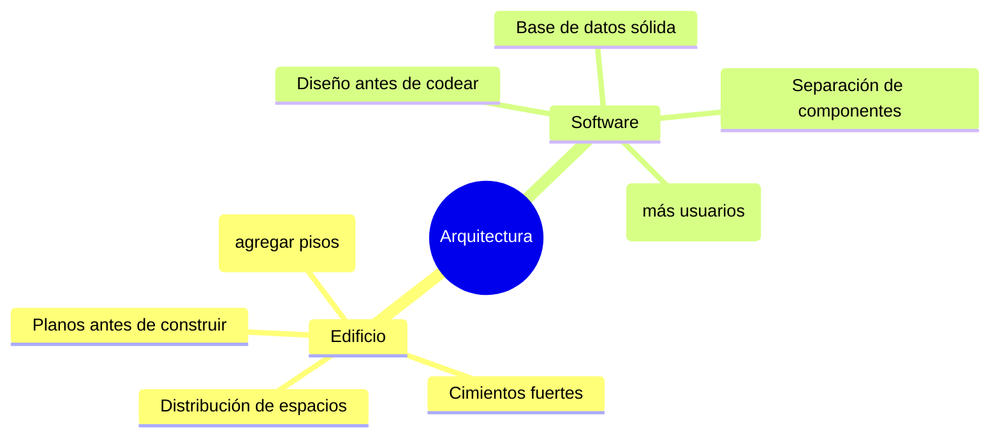
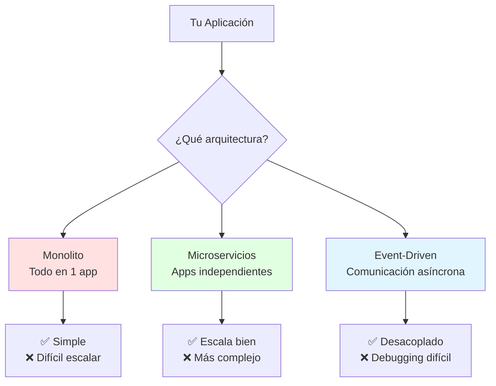
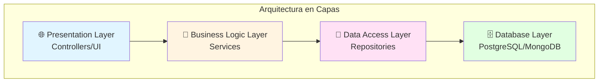
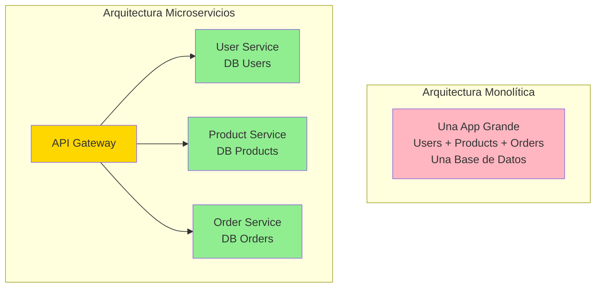
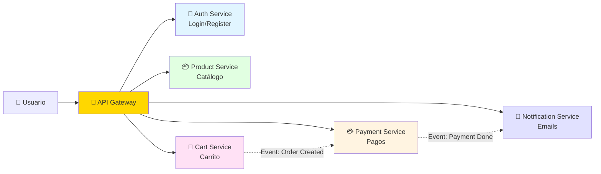
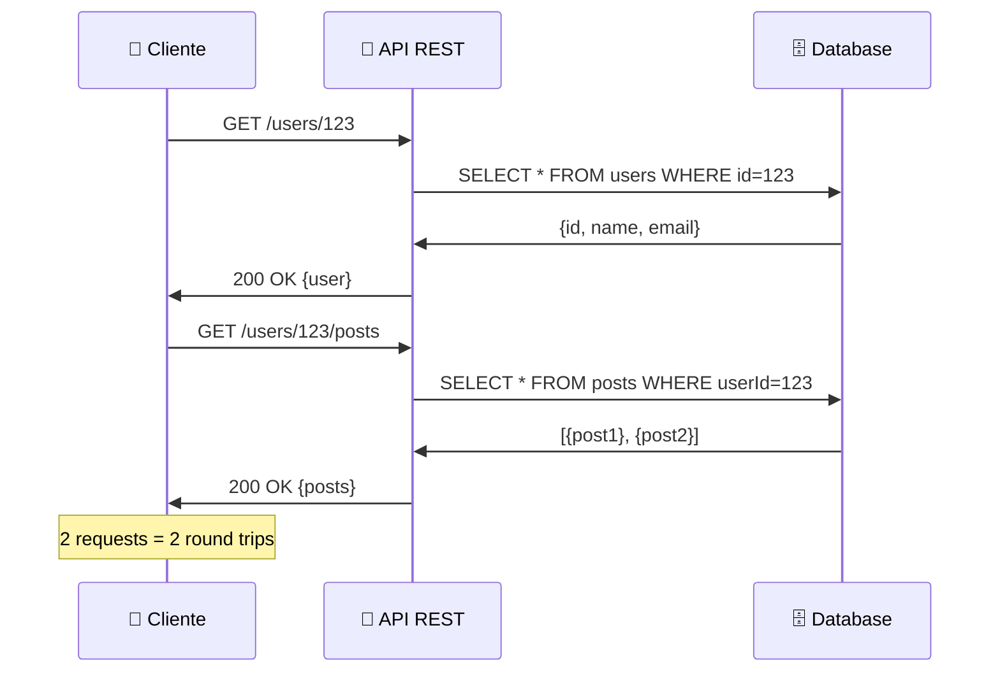
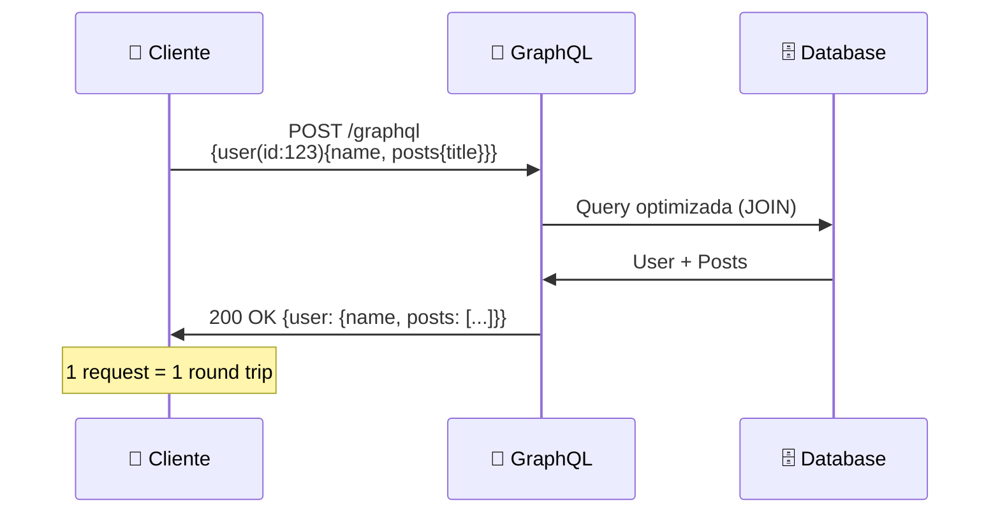
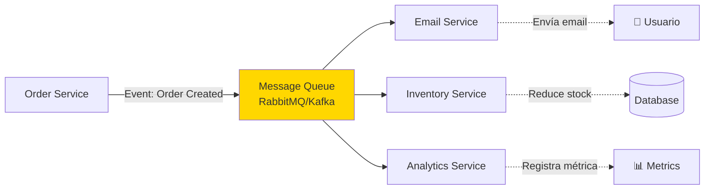
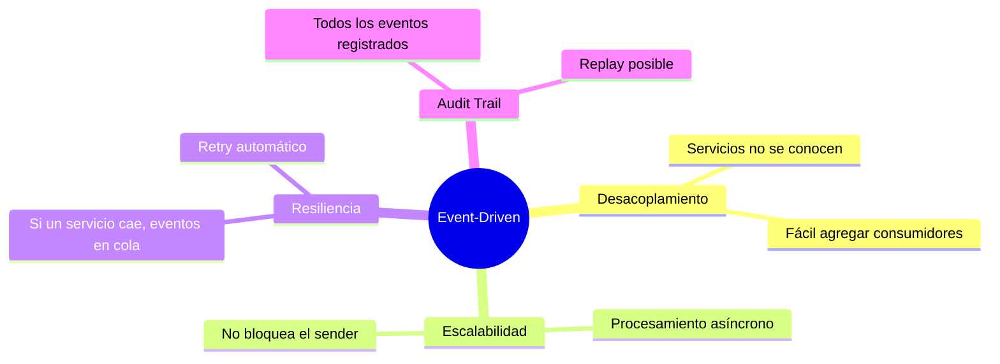
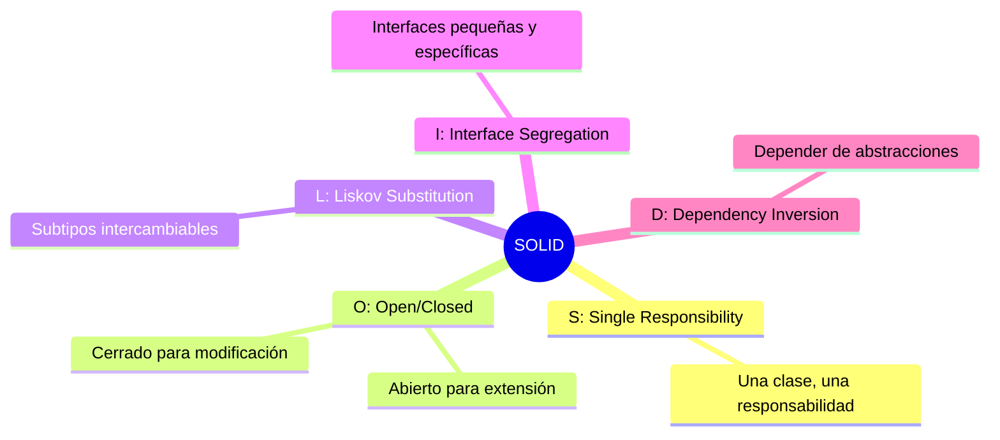

# 🏗️ Módulo 01: Arquitectura de Software

## Diseña Sistemas que Escalan

> **Para Desarrolladores**: Este módulo te enseña a diseñar la "estructura" de sistemas de software - como un arquitecto diseña edificios. Aprenderás cuándo usar qué arquitectura y cómo OpenCode te ayuda a implementarlas rápidamente.

**⏱️ Duración**: 4 horas  
**👤 Nivel**: Intermedio (con fundamentos de programación)  
**🎯 Objetivo**: Dominar patrones de arquitectura de software moderna

---

## 🎓 ¿Qué Vas a Lograr?

1. ✅ **Comprender arquitecturas** - Capas, microservicios, event-driven
2. ✅ **Diseñar APIs** - REST y GraphQL bien estructuradas
3. ✅ **Tomar decisiones** - Cuándo usar qué arquitectura
4. ✅ **Implementar con IA** - Generar arquitecturas con OpenCode
5. ✅ **Pensar a escala** - Sistemas que crecen sin romperse

---

## 🤔 ¿Qué es Arquitectura de Software?

### Analogía: Construir un Edificio



**Arquitectura** = El "plano" que define cómo se organizan y conectan las partes de un sistema.

---

## 📊 Los 3 Estilos Principales



---

## 🏢 Parte 1: Arquitectura en Capas (Layered) (60 min)

### Concepto: Separación de Responsabilidades

**Analogía**: Como un edificio con pisos específicos.



### Ejemplo: Sistema de Usuarios

**Flujo completo**:
```
Usuario → Controller → Service → Repository → Database
  ↓          ↓           ↓            ↓           ↓
Request   Valida     Lógica      Query SQL   Guarda
```

### Implementación con OpenCode

```bash
claude "Genera arquitectura en capas para módulo de usuarios:

CAPAS:
1. CONTROLLER (user.controller.ts)
   - POST /users (crear usuario)
   - GET /users/:id (obtener usuario)
   - PUT /users/:id (actualizar)
   - DELETE /users/:id (eliminar)

2. SERVICE (user.service.ts)
   - Validación de email único
   - Hash de contraseña (bcrypt)
   - Lógica de negocio

3. REPOSITORY (user.repository.ts)
   - Queries a base de datos
   - CRUD operations

4. ENTITY (user.entity.ts)
   - id, nombre, email, password, createdAt

TECNOLOGÍAS:
- TypeScript + NestJS
- Decorators (@Controller, @Injectable)
- Validación con class-validator
- TypeORM para DB

INCLUIR:
- Manejo de errores
- DTOs para request/response
- Comentarios en español"
```

### Ventajas y Desventajas

| ✅ Ventajas | ❌ Desventajas |
|-------------|----------------|
| Fácil de entender | Puede ser "over-engineered" para apps simples |
| Separación clara | Cambios pueden afectar múltiples capas |
| Testeable | Puede crear dependencias circulares |
| Mantenible | Performance overhead en capas |

---

## 🔬 Parte 2: Microservicios (60 min)

### Concepto: Apps Independientes



### Cuándo Usar Cada Una

| Característica | Monolito | Microservicios |
|----------------|----------|----------------|
| **Equipo** | 1-5 personas | 5+ personas |
| **Proyecto** | MVP, Startup | Producto maduro |
| **Dominio** | Simple | Complejo |
| **Deploy** | Una vez | Por servicio |
| **Escalamiento** | Todo junto | Independiente |
| **Complejidad** | Baja | Alta |

### Ejemplo Real: E-Commerce



### Implementación con OpenCode

```bash
claude "Genera estructura de microservicio 'Product Service':

TECNOLOGÍAS:
- NestJS + TypeScript
- PostgreSQL (Prisma ORM)
- Redis (cache)
- RabbitMQ (eventos)

ESTRUCTURA:
src/
├── products/
│   ├── product.controller.ts    # API endpoints
│   ├── product.service.ts       # Lógica
│   ├── product.repository.ts    # DB
│   └── dto/                     # Request/Response
├── events/
│   ├── product.producer.ts      # Emitir eventos
│   └── product.consumer.ts      # Escuchar eventos
└── config/
    ├── database.config.ts
    └── rabbitmq.config.ts

API ENDPOINTS:
- GET /products (listar con paginación)
- GET /products/:id (detalle)
- POST /products (crear - admin only)
- PUT /products/:id (actualizar)
- DELETE /products/:id (soft delete)

EVENTOS EMITIDOS:
- product.created
- product.updated
- product.deleted
- product.stock.changed

VALIDACIONES:
- Precio > 0
- Stock >= 0
- Nombre único
- Categoría válida

TODO con TypeScript estricto y comentarios en español"
```

---

## 🎯 Parte 3: API Design (REST vs GraphQL) (60 min)

### REST: Multiple Endpoints



### GraphQL: Single Endpoint



### Cuándo Usar Cada Una

| Escenario | Usa REST | Usa GraphQL |
|-----------|----------|-------------|
| API pública simple | ✅ | ❌ |
| Cliente móvil (bandwidth limitado) | ❌ | ✅ |
| Necesitas caching | ✅ | ⚠️ |
| Múltiples clientes con necesidades diferentes | ❌ | ✅ |
| Equipo pequeño | ✅ | ❌ |
| Relaciones complejas | ❌ | ✅ |

### Implementar con OpenCode

```bash
# REST API
claude "Genera REST API para 'Orders' con NestJS:
- POST /orders (crear orden)
- GET /orders (listar con filtros: status, date range)
- GET /orders/:id (detalle completo)
- PUT /orders/:id/status (actualizar estado)
- Paginación estándar (page, limit)
- Swagger documentation
- Rate limiting (100 req/min)"

# GraphQL API
claude "Genera GraphQL schema y resolvers para 'Orders':
schema.graphql:
- type Order { id, items, total, status, user }
- Query: orders(filter, pagination)
- Mutation: createOrder, updateOrderStatus
Resolvers con DataLoader para N+1 problem
Comentarios en español"
```

---

## ⚡ Parte 4: Event-Driven Architecture (60 min)

### Concepto: Comunicación Asíncrona



### Ventajas



### Implementación con OpenCode

```bash
claude "Genera event-driven system para 'Order Processing':

PRODUCER (Order Service):
```typescript
// order.service.ts
async createOrder(dto: CreateOrderDto) {
  // 1. Crear orden en DB
  const order = await this.repo.create(dto);
  
  // 2. Emitir evento
  await this.eventBus.emit('order.created', {
    orderId: order.id,
    userId: order.userId,
    total: order.total,
    items: order.items
  });
  
  return order;
}
```

CONSUMERS:
1. Email Service - Envía confirmación
2. Inventory Service - Reduce stock
3. Payment Service - Procesa pago
4. Analytics Service - Registra métrica

TECNOLOGÍA:
- RabbitMQ o Kafka
- Event pattern con NestJS
- Retry logic (3 intentos)
- Dead letter queue para fallos

Incluir manejo de errores robusto y logs en español"
```

---

## 🎯 Ejercicio Práctico: E-Commerce Architecture

### Objetivo

Diseñar arquitectura completa para e-commerce escalable usando OpenCode.

### Requisitos

**Servicios Mínimos**:
1. **Auth Service** - Login, register, JWT
2. **Product Service** - Catálogo, búsqueda
3. **Cart Service** - Carrito de compras
4. **Order Service** - Procesamiento de órdenes
5. **Payment Service** - Integración con pasarela
6. **Notification Service** - Emails/SMS

**Comunicación**:
- Sincrónica: API Gateway → Servicios (REST)
- Asincrónica: Entre servicios (Events)

### Pasos

```bash
# 1. Generar diagrama de arquitectura
claude "Genera diagrama Mermaid para arquitectura microservicios e-commerce con:
- 6 servicios mencionados
- API Gateway
- Message Queue
- Bases de datos independientes
- Comunicación sincrónica y asíncrona
En formato Mermaid, comentado en español"

# 2. Generar estructura de proyecto
claude "Genera estructura completa de carpetas para microservicios:
/ecommerce-microservices/
  /api-gateway/
  /auth-service/
  /product-service/
  ... (otros servicios)
  /shared/ (DTOs compartidos)
  docker-compose.yml
  
Incluir package.json, tsconfig, Dockerfile en cada servicio"

# 3. Implementar servicio de ejemplo
claude "Implementa completamente Product Service con:
- NestJS + TypeScript
- Prisma + PostgreSQL
- Redis para cache
- RabbitMQ para eventos
- Tests unitarios con Jest
- Swagger docs
Código completo con comentarios en español"
```

---

## 📚 Principios de Arquitectura (SOLID)

### Los 5 Principios



### Aplicar con OpenCode

```bash
claude "Refactoriza este código aplicando SOLID:

[pega código que viola SOLID]

Identifica violaciones y refactoriza:
1. Single Responsibility - separar clases
2. Open/Closed - usar interfaces
3. Liskov - verificar herencia
4. Interface Segregation - dividir interfaces grandes
5. Dependency Inversion - inyección de dependencias

Explicar cada cambio en español"
```

---

## ✅ Checklist de Decisiones Arquitectónicas

Antes de elegir arquitectura, responde:

### Equipo y Organización
- [ ] ¿Cuántos developers? (<5 = Monolito, 5+ = Microservicios)
- [ ] ¿Experiencia con arquitecturas complejas?
- [ ] ¿Capacidad DevOps para gestionar múltiples servicios?

### Requisitos del Sistema
- [ ] ¿Necesidad de escalar componentes independientemente?
- [ ] ¿Dominio complejo que se beneficia de separación?
- [ ] ¿Múltiples equipos trabajarán en el mismo sistema?

### Restricciones Técnicas
- [ ] ¿Presupuesto para infraestructura de microservicios?
- [ ] ¿Necesitas despliegues independientes?
- [ ] ¿Tolerancia a eventual consistency?

**Regla de oro**: Empieza simple (monolito modular), migra a microservicios cuando **realmente** lo necesites.

---

## 🎓 Mejores Prácticas

### ✅ HACER

1. **Empezar simple** - Monolito modular antes de microservicios
2. **Documentar decisiones** - ADRs (Architecture Decision Records)
3. **Definir contratos** - APIs bien documentadas (Swagger)
4. **Pensar en fallas** - Circuit breakers, timeouts, retries
5. **Monitorear todo** - Logs, métricas, tracing distribuido

### ❌ NO HACER

1. **Microservicios prematuros** - Añaden complejidad innecesaria
2. **Base de datos compartida** - Acoplamiento en microservicios
3. **Sincronía excesiva** - Usar eventos cuando sea apropiado
4. **Ignorar latencia** - Network calls son costosos
5. **Sin versionado** - APIs cambian, versiónalas

---

## 🎉 Resumen del Módulo

### Lo Que Dominaste

✅ **Arquitectura en capas** - Separación de responsabilidades  
✅ **Microservicios** - Cuándo y cómo usarlos  
✅ **API Design** - REST vs GraphQL  
✅ **Event-Driven** - Comunicación asíncrona  
✅ **SOLID** - Principios de diseño  
✅ **OpenCode** - Generar arquitecturas con IA

### Próximo Paso

**Continúa con**: [Módulo 02 - Patrones de Diseño](./02-design-patterns.md)

---

## 💭 Reflexión

1. **¿Qué arquitectura usarías para tu proyecto de FPUNA?**
2. **¿Cuándo elegirías microservicios vs monolito?**
3. **¿Cómo OpenCode acelera el diseño arquitectónico?**

**Comparte en Slack** (#software-dev-architecture)

---

*Módulo creado para FPUNA Verano 2026*  
*Actualizado: Enero 2026*  
*Track: Software Development*
