# 🧪 Módulo 03: Testing & Test-Driven Development

## Construye Software Confiable con Pruebas Automatizadas

> **Para Desarrolladores**: Este módulo te enseña a escribir pruebas automatizadas profesionales y aplicar Test-Driven Development (TDD). Aprenderás a garantizar la calidad del código desde el primer día y cómo OpenCode acelera la creación de test suites completas.

**⏱️ Duración**: 4 horas  
**👤 Nivel**: Intermedio (con fundamentos de programación)  
**🎯 Objetivo**: Dominar testing profesional y TDD con herramientas modernas

---

## 🎓 ¿Qué Vas a Lograr?

1. ✅ **Escribir tests profesionales** - Unit, integration, E2E
2. ✅ **Aplicar TDD** - Red-Green-Refactor workflow
3. ✅ **Usar mocks y stubs** - Aislar componentes efectivamente
4. ✅ **Medir coverage** - Estrategias de cobertura inteligente
5. ✅ **Generar tests con IA** - OpenCode para test automation

---

## 🤔 ¿Qué es Testing?

### Analogía: Control de Calidad en una Fábrica

```mermaid
mindmap
  root((Testing))
    Fábrica
      Inspector revisa cada producto
      Detecta defectos antes de vender
      Garantiza estándar de calidad
      Ahorra costos de devolución
    Software
      Tests verifican cada función
      Detectan bugs antes de deploy
      Garantizan código confiable
      Ahorran tiempo de debugging
```

**Testing** = El proceso sistemático de verificar que tu código funciona como esperado, detectando errores antes de que lleguen a producción.

### ¿Por Qué Testing en Paraguay?

**Realidad del mercado local**:
- ✅ **Softtek** requiere 80%+ coverage para todos los proyectos
- ✅ **Global Logic** aplica TDD obligatorio en equipos ágiles
- ✅ **Aruma** (fintech) - testing crítico para compliance
- ✅ **Roshka** usa CI/CD con test gates automáticos

**Sin testing** = No pasas las entrevistas técnicas 🚫

---

## 📊 Los 3 Niveles de Testing

```mermaid
graph TD
    Start[Tu Aplicación] --> Q{¿Qué probar?}
    
    Q --> A[Unit Tests<br/>Funciones individuales]
    Q --> B[Integration Tests<br/>Módulos conectados]
    Q --> C[E2E Tests<br/>Flujo completo]
    
    A --> A1[✅ Rápidos<br/>✅ Muchos<br/>❌ No detectan bugs integración]
    B --> B1[✅ Detectan problemas conexión<br/>⚠️ Más lentos<br/>❌ Setup complejo]
    C --> C1[✅ Simulan usuario real<br/>❌ Lentos<br/>❌ Frágiles]
    
    style A fill:#E1FFE1
    style B fill:#FFF4E1
    style C fill:#FFE1E1
```

### Pirámide de Testing

```mermaid
graph TD
    subgraph "Testing Pyramid"
        A[🔺 E2E Tests<br/>10% - Lentos pero valiosos]
        B[🔶 Integration Tests<br/>30% - Balance perfecto]
        C[🟢 Unit Tests<br/>60% - Rápidos y muchos]
        
        A --> B
        B --> C
    end
    
    style A fill:#FFE1E1
    style B fill:#FFF4E1
    style C fill:#E1FFE1
```

**Regla de oro**: Más unit tests, menos E2E tests. Los unit tests son rápidos, confiables y baratos.

---

## 🏢 Parte 1: Testing Fundamentals (60 min)

### Concepto: Unit Testing

**Analogía**: Como probar cada ingrediente antes de cocinar un plato.

```mermaid
graph LR
    subgraph "Unit Test Workflow"
        A[📝 Arrange<br/>Preparar datos]
        B[⚡ Act<br/>Ejecutar función]
        C[✅ Assert<br/>Verificar resultado]
        
        A --> B
        B --> C
    end
    
    style A fill:#E1F5FF
    style B fill:#FFF4E1
    style C fill:#E1FFE1
```

### Ejemplo Real: Sistema de Usuarios FPUNA

**Función a testear**:
```typescript
// user.service.ts
export class UserService {
  async createUser(data: CreateUserDto): Promise<User> {
    // Validar email único
    const exists = await this.repo.findByEmail(data.email);
    if (exists) {
      throw new Error('Email ya registrado');
    }
    
    // Hash password
    const hashedPassword = await bcrypt.hash(data.password, 10);
    
    // Crear usuario
    return this.repo.create({
      ...data,
      password: hashedPassword,
    });
  }
}
```

**Unit Test con Jest**:
```typescript
// user.service.spec.ts
describe('UserService', () => {
  let service: UserService;
  let mockRepo: jest.Mocked<UserRepository>;
  
  beforeEach(() => {
    mockRepo = {
      findByEmail: jest.fn(),
      create: jest.fn(),
    } as any;
    
    service = new UserService(mockRepo);
  });
  
  describe('createUser', () => {
    it('debería crear usuario con password hasheado', async () => {
      // Arrange
      const userData = {
        email: 'juan@fpuna.edu.py',
        password: 'Password123!',
        nombre: 'Juan Pérez',
      };
      
      mockRepo.findByEmail.mockResolvedValue(null);
      mockRepo.create.mockResolvedValue({
        id: 1,
        ...userData,
        password: 'hashed_password',
      });
      
      // Act
      const result = await service.createUser(userData);
      
      // Assert
      expect(result.email).toBe('juan@fpuna.edu.py');
      expect(result.password).not.toBe('Password123!'); // No es plain text
      expect(mockRepo.create).toHaveBeenCalledTimes(1);
    });
    
    it('debería lanzar error si email ya existe', async () => {
      // Arrange
      const userData = {
        email: 'existente@fpuna.edu.py',
        password: 'Password123!',
        nombre: 'María González',
      };
      
      mockRepo.findByEmail.mockResolvedValue({
        id: 1,
        email: 'existente@fpuna.edu.py',
      } as User);
      
      // Act & Assert
      await expect(service.createUser(userData))
        .rejects
        .toThrow('Email ya registrado');
    });
  });
});
```

### Implementación con OpenCode

```bash
opencode "Genera unit tests para UserService con Jest:

CLASE A TESTEAR:
```typescript
export class UserService {
  constructor(private repo: UserRepository) {}
  
  async createUser(data: CreateUserDto): Promise<User> {
    const exists = await this.repo.findByEmail(data.email);
    if (exists) throw new Error('Email ya registrado');
    
    const hashedPassword = await bcrypt.hash(data.password, 10);
    return this.repo.create({ ...data, password: hashedPassword });
  }
  
  async findById(id: number): Promise<User | null> {
    return this.repo.findById(id);
  }
  
  async updateUser(id: number, data: UpdateUserDto): Promise<User> {
    const user = await this.findById(id);
    if (!user) throw new Error('Usuario no encontrado');
    return this.repo.update(id, data);
  }
  
  async deleteUser(id: number): Promise<void> {
    await this.repo.delete(id);
  }
}
```

REQUISITOS:
- Mocking del repository con jest.fn()
- Cubrir todos los métodos
- Test cases positivos y negativos
- Arrange-Act-Assert pattern
- Comentarios en español
- TypeScript estricto

CASOS A CUBRIR:
1. createUser - éxito
2. createUser - email duplicado
3. findById - usuario existe
4. findById - usuario no existe
5. updateUser - éxito
6. updateUser - usuario no encontrado
7. deleteUser - verificar llamada al repo

TODO con Jest + TypeScript"
```

### Integration Testing

**Concepto**: Probar cómo funcionan los componentes juntos.

```mermaid
sequenceDiagram
    participant T as 🧪 Test
    participant C as 🎮 Controller
    participant S as 💼 Service
    participant D as 🗄️ Test Database
    
    T->>C: POST /users {datos}
    C->>S: createUser(datos)
    S->>D: INSERT INTO users
    D->>S: User creado
    S->>C: User object
    C->>T: 201 Created {user}
    
    Note over T: Verifica DB real
```

**Ejemplo con Supertest + Test Containers**:
```typescript
// user.controller.integration.spec.ts
import { Test } from '@nestjs/testing';
import * as request from 'supertest';
import { PostgreSqlContainer } from '@testcontainers/postgresql';

describe('UserController (Integration)', () => {
  let app: INestApplication;
  let container: PostgreSqlContainer;
  
  beforeAll(async () => {
    // Levantar base de datos real para tests
    container = await new PostgreSqlContainer().start();
    
    const moduleRef = await Test.createTestingModule({
      imports: [AppModule],
    })
      .overrideProvider('DATABASE_URL')
      .useValue(container.getConnectionUrl())
      .compile();
    
    app = moduleRef.createNestApplication();
    await app.init();
  });
  
  afterAll(async () => {
    await app.close();
    await container.stop();
  });
  
  describe('POST /users', () => {
    it('debería crear usuario y guardar en DB', async () => {
      const userData = {
        email: 'test@fpuna.edu.py',
        password: 'Password123!',
        nombre: 'Test User',
      };
      
      const response = await request(app.getHttpServer())
        .post('/users')
        .send(userData)
        .expect(201);
      
      expect(response.body).toMatchObject({
        id: expect.any(Number),
        email: userData.email,
        nombre: userData.nombre,
      });
      expect(response.body.password).toBeUndefined(); // No devolver password
      
      // Verificar que se guardó en DB
      const getResponse = await request(app.getHttpServer())
        .get(`/users/${response.body.id}`)
        .expect(200);
      
      expect(getResponse.body.email).toBe(userData.email);
    });
  });
});
```

### E2E Testing

**Concepto**: Simular usuario real navegando la app.

```mermaid
graph LR
    subgraph "E2E Test Flow"
        A[🌐 Abrir navegador]
        B[🔐 Login]
        C[📝 Crear usuario]
        D[✅ Verificar UI]
        E[🗑️ Eliminar usuario]
        
        A --> B
        B --> C
        C --> D
        D --> E
    end
    
    style A fill:#E1F5FF
    style B fill:#FFE1F5
    style C fill:#FFF4E1
    style D fill:#E1FFE1
    style E fill:#E1E1FF
```

**Ejemplo con Playwright**:
```typescript
// user-management.e2e.spec.ts
import { test, expect } from '@playwright/test';

test.describe('Gestión de Usuarios FPUNA', () => {
  test.beforeEach(async ({ page }) => {
    // Navegar a la app
    await page.goto('http://localhost:3000');
    
    // Login como admin
    await page.fill('[data-testid="email"]', 'admin@fpuna.edu.py');
    await page.fill('[data-testid="password"]', 'Admin123!');
    await page.click('[data-testid="login-button"]');
    
    // Esperar dashboard
    await expect(page.locator('h1')).toContainText('Dashboard');
  });
  
  test('admin puede crear nuevo usuario', async ({ page }) => {
    // Ir a sección usuarios
    await page.click('[data-testid="users-menu"]');
    await page.click('[data-testid="add-user-button"]');
    
    // Llenar formulario
    await page.fill('[name="nombre"]', 'Carlos Benítez');
    await page.fill('[name="email"]', 'carlos@fpuna.edu.py');
    await page.fill('[name="password"]', 'Password123!');
    await page.selectOption('[name="role"]', 'student');
    
    // Submit
    await page.click('[data-testid="submit-button"]');
    
    // Verificar mensaje de éxito
    await expect(page.locator('.toast-success'))
      .toContainText('Usuario creado exitosamente');
    
    // Verificar aparece en lista
    await expect(page.locator('table'))
      .toContainText('Carlos Benítez');
  });
});
```

---

## 🔬 Parte 2: Test-Driven Development (90 min)

### Concepto: Escribir el Test Primero

**Analogía**: Como escribir el examen antes de estudiar - sabes exactamente qué aprender.

```mermaid
graph LR
    subgraph "TDD Cycle - Red-Green-Refactor"
        A[🔴 RED<br/>Escribir test que falla]
        B[🟢 GREEN<br/>Escribir código mínimo]
        C[🔵 REFACTOR<br/>Mejorar código]
        
        A --> B
        B --> C
        C --> A
    end
    
    style A fill:#FFE1E1
    style B fill:#E1FFE1
    style C fill:#E1F5FF
```

### Ventajas de TDD

```mermaid
mindmap
  root((TDD Benefits))
    Código Limpio
      Diseño modular desde inicio
      Interfaces claras
      Bajo acoplamiento
    Documentación
      Tests son ejemplos vivos
      Casos de uso claros
    Confianza
      Refactoring seguro
      No rompe funcionalidad
    Bug Prevention
      Detecta errores temprano
      Menos debugging
```

### Ejemplo Práctico: Calculator TDD

**Paso 1: RED - Test que falla**
```typescript
// calculator.spec.ts
describe('Calculator', () => {
  it('debería sumar dos números', () => {
    const calc = new Calculator();
    expect(calc.add(2, 3)).toBe(5);
  });
});
```

**Ejecutar**: ❌ `ReferenceError: Calculator is not defined`

**Paso 2: GREEN - Código mínimo**
```typescript
// calculator.ts
export class Calculator {
  add(a: number, b: number): number {
    return a + b; // Implementación mínima
  }
}
```

**Ejecutar**: ✅ `Test passed`

**Paso 3: REFACTOR - Mejorar**
```typescript
// calculator.ts
export class Calculator {
  /**
   * Suma dos números
   * @param a - Primer número
   * @param b - Segundo número
   * @returns La suma de a y b
   */
  add(a: number, b: number): number {
    if (!Number.isFinite(a) || !Number.isFinite(b)) {
      throw new Error('Ambos argumentos deben ser números válidos');
    }
    return a + b;
  }
}

// calculator.spec.ts - Agregar más casos
describe('Calculator', () => {
  let calc: Calculator;
  
  beforeEach(() => {
    calc = new Calculator();
  });
  
  describe('add', () => {
    it('debería sumar dos números positivos', () => {
      expect(calc.add(2, 3)).toBe(5);
    });
    
    it('debería sumar números negativos', () => {
      expect(calc.add(-2, -3)).toBe(-5);
    });
    
    it('debería manejar cero', () => {
      expect(calc.add(5, 0)).toBe(5);
    });
    
    it('debería lanzar error con valores inválidos', () => {
      expect(() => calc.add(NaN, 5)).toThrow();
      expect(() => calc.add(5, Infinity)).toThrow();
    });
  });
});
```

### TDD en el Mundo Real: API de Productos

**Requerimiento**: Crear endpoint para agregar productos al catálogo FPUNA Store.

**Paso 1: RED - Escribir test de integración**
```typescript
// product.controller.integration.spec.ts
describe('POST /products', () => {
  it('debería crear producto con datos válidos', async () => {
    const productData = {
      nombre: 'Notebook FPUNA',
      precio: 3500000, // Gs. 3,500,000
      stock: 10,
      categoria: 'electrónica',
    };
    
    const response = await request(app.getHttpServer())
      .post('/products')
      .send(productData)
      .expect(201);
    
    expect(response.body).toMatchObject({
      id: expect.any(Number),
      ...productData,
      createdAt: expect.any(String),
    });
  });
  
  it('debería rechazar producto sin nombre', async () => {
    const invalidData = {
      precio: 100000,
      stock: 5,
    };
    
    const response = await request(app.getHttpServer())
      .post('/products')
      .send(invalidData)
      .expect(400);
    
    expect(response.body.message).toContain('nombre es requerido');
  });
  
  it('debería rechazar precio negativo', async () => {
    const invalidData = {
      nombre: 'Test',
      precio: -100,
      stock: 5,
    };
    
    await request(app.getHttpServer())
      .post('/products')
      .send(invalidData)
      .expect(400);
  });
});
```

**Ejecutar**: ❌ Todos fallan (no existe el endpoint)

**Paso 2: GREEN - Implementar**
```typescript
// product.dto.ts
import { IsString, IsNumber, Min, IsEnum } from 'class-validator';

export class CreateProductDto {
  @IsString()
  nombre: string;
  
  @IsNumber()
  @Min(0, { message: 'Precio debe ser positivo' })
  precio: number;
  
  @IsNumber()
  @Min(0, { message: 'Stock debe ser positivo' })
  stock: number;
  
  @IsEnum(['electrónica', 'libros', 'ropa', 'otros'])
  categoria: string;
}

// product.controller.ts
@Controller('products')
export class ProductController {
  constructor(private productService: ProductService) {}
  
  @Post()
  async create(@Body() dto: CreateProductDto) {
    return this.productService.create(dto);
  }
}

// product.service.ts
@Injectable()
export class ProductService {
  constructor(private repo: ProductRepository) {}
  
  async create(dto: CreateProductDto): Promise<Product> {
    return this.repo.create(dto);
  }
}
```

**Ejecutar**: ✅ Tests pasan

**Paso 3: REFACTOR - Agregar validaciones y optimizar**
```typescript
// product.service.ts
@Injectable()
export class ProductService {
  constructor(
    private repo: ProductRepository,
    private cache: CacheService,
  ) {}
  
  async create(dto: CreateProductDto): Promise<Product> {
    // Validar nombre único
    const exists = await this.repo.findByNombre(dto.nombre);
    if (exists) {
      throw new ConflictException('Producto con ese nombre ya existe');
    }
    
    // Crear producto
    const product = await this.repo.create(dto);
    
    // Invalidar cache de productos
    await this.cache.invalidate('products:all');
    
    return product;
  }
}

// Agregar más tests
it('debería rechazar nombre duplicado', async () => {
  // Crear primer producto
  await request(app.getHttpServer())
    .post('/products')
    .send({ nombre: 'Notebook', precio: 100000, stock: 5 });
  
  // Intentar crear duplicado
  const response = await request(app.getHttpServer())
    .post('/products')
    .send({ nombre: 'Notebook', precio: 200000, stock: 10 })
    .expect(409);
  
  expect(response.body.message).toContain('ya existe');
});
```

### Implementación con OpenCode

```bash
opencode "Genera implementación TDD para 'OrderService' siguiendo Red-Green-Refactor:

REQUISITOS:
1. Método: createOrder(userId: number, items: OrderItem[])
2. Validaciones:
   - Usuario debe existir
   - Items no puede estar vacío
   - Cada item debe tener stock disponible
   - Calcular total automáticamente
3. Operaciones:
   - Crear orden
   - Reducir stock de productos
   - Emitir evento 'order.created'

ESTRUCTURA:
1. RED: Escribir 5+ tests que fallan (incluyendo casos edge)
2. GREEN: Implementar código mínimo que pase
3. REFACTOR: Optimizar + agregar manejo errores

TECNOLOGÍAS:
- NestJS + TypeScript
- Jest para testing
- Test doubles (mocks) para dependencies

OUTPUT:
- order.service.spec.ts (tests completos)
- order.service.ts (implementación)
- Comentarios explicando cada fase TDD
- Todo en español"
```

---

## 🎭 Parte 3: Mocking & Stubbing (60 min)

### Concepto: Test Doubles

**Analogía**: Como actores dobles en películas - parecen reales pero son controlados.

```mermaid
graph TD
    subgraph "Test Doubles"
        A[🎭 Dummy<br/>Objeto placeholder]
        B[🤖 Stub<br/>Respuestas predefinidas]
        C[🎬 Mock<br/>Verificar interacciones]
        D[🕵️ Spy<br/>Observar llamadas]
        E[🏭 Fake<br/>Implementación simple]
    end
    
    style A fill:#E1E1FF
    style B fill:#E1FFE1
    style C fill:#FFF4E1
    style D fill:#FFE1F5
    style E fill:#E1F5FF
```

### Cuándo Usar Cada Uno

| Tipo | Cuándo Usar | Ejemplo |
|------|-------------|---------|
| **Dummy** | Objeto no se usa, solo para llenar parámetros | `new UserService(dummyLogger)` |
| **Stub** | Proveer respuestas específicas | `mockRepo.findById.mockResolvedValue(user)` |
| **Mock** | Verificar que se llamen métodos | `expect(emailService.send).toHaveBeenCalled()` |
| **Spy** | Observar sin reemplazar | `jest.spyOn(service, 'method')` |
| **Fake** | Implementación simplificada que funciona | In-memory database |

### Ejemplo: Mocking Dependencies

**Sistema a testear**:
```typescript
// order.service.ts
export class OrderService {
  constructor(
    private userService: UserService,
    private productService: ProductService,
    private emailService: EmailService,
    private eventBus: EventBus,
  ) {}
  
  async createOrder(userId: number, items: OrderItem[]): Promise<Order> {
    // 1. Verificar usuario existe
    const user = await this.userService.findById(userId);
    if (!user) throw new NotFoundException('Usuario no encontrado');
    
    // 2. Verificar stock de productos
    for (const item of items) {
      const product = await this.productService.findById(item.productId);
      if (!product) {
        throw new NotFoundException(`Producto ${item.productId} no existe`);
      }
      if (product.stock < item.quantity) {
        throw new BadRequestException(`Stock insuficiente: ${product.nombre}`);
      }
    }
    
    // 3. Crear orden
    const order = await this.orderRepo.create({
      userId,
      items,
      total: this.calculateTotal(items),
    });
    
    // 4. Reducir stock
    for (const item of items) {
      await this.productService.reduceStock(item.productId, item.quantity);
    }
    
    // 5. Enviar email confirmación
    await this.emailService.send({
      to: user.email,
      subject: 'Orden confirmada',
      template: 'order-confirmation',
      data: { order },
    });
    
    // 6. Emitir evento
    await this.eventBus.emit('order.created', order);
    
    return order;
  }
  
  private calculateTotal(items: OrderItem[]): number {
    return items.reduce((sum, item) => sum + item.price * item.quantity, 0);
  }
}
```

**Tests con Mocks**:
```typescript
// order.service.spec.ts
describe('OrderService', () => {
  let service: OrderService;
  let mockUserService: jest.Mocked<UserService>;
  let mockProductService: jest.Mocked<ProductService>;
  let mockEmailService: jest.Mocked<EmailService>;
  let mockEventBus: jest.Mocked<EventBus>;
  let mockOrderRepo: jest.Mocked<OrderRepository>;
  
  beforeEach(() => {
    // Crear mocks
    mockUserService = {
      findById: jest.fn(),
    } as any;
    
    mockProductService = {
      findById: jest.fn(),
      reduceStock: jest.fn(),
    } as any;
    
    mockEmailService = {
      send: jest.fn(),
    } as any;
    
    mockEventBus = {
      emit: jest.fn(),
    } as any;
    
    mockOrderRepo = {
      create: jest.fn(),
    } as any;
    
    service = new OrderService(
      mockUserService,
      mockProductService,
      mockEmailService,
      mockEventBus,
      mockOrderRepo,
    );
  });
  
  describe('createOrder', () => {
    const validUser = {
      id: 1,
      email: 'juan@fpuna.edu.py',
      nombre: 'Juan',
    };
    
    const validProduct = {
      id: 1,
      nombre: 'Notebook',
      precio: 3500000,
      stock: 10,
    };
    
    const orderItems: OrderItem[] = [
      { productId: 1, quantity: 2, price: 3500000 },
    ];
    
    it('debería crear orden exitosamente', async () => {
      // Arrange - Configurar mocks
      mockUserService.findById.mockResolvedValue(validUser);
      mockProductService.findById.mockResolvedValue(validProduct);
      mockProductService.reduceStock.mockResolvedValue(undefined);
      mockEmailService.send.mockResolvedValue(undefined);
      mockEventBus.emit.mockResolvedValue(undefined);
      
      mockOrderRepo.create.mockResolvedValue({
        id: 1,
        userId: 1,
        items: orderItems,
        total: 7000000,
        createdAt: new Date(),
      });
      
      // Act
      const result = await service.createOrder(1, orderItems);
      
      // Assert - Verificar resultado
      expect(result.total).toBe(7000000);
      expect(result.items).toEqual(orderItems);
      
      // Assert - Verificar interacciones (MOCKS)
      expect(mockUserService.findById).toHaveBeenCalledWith(1);
      expect(mockProductService.findById).toHaveBeenCalledWith(1);
      expect(mockProductService.reduceStock).toHaveBeenCalledWith(1, 2);
      expect(mockEmailService.send).toHaveBeenCalledWith(
        expect.objectContaining({
          to: 'juan@fpuna.edu.py',
          subject: 'Orden confirmada',
        }),
      );
      expect(mockEventBus.emit).toHaveBeenCalledWith(
        'order.created',
        expect.any(Object),
      );
    });
    
    it('debería fallar si usuario no existe', async () => {
      // Arrange
      mockUserService.findById.mockResolvedValue(null);
      
      // Act & Assert
      await expect(service.createOrder(999, orderItems))
        .rejects
        .toThrow('Usuario no encontrado');
      
      // Verificar que NO se llamaron otros servicios
      expect(mockProductService.findById).not.toHaveBeenCalled();
      expect(mockEmailService.send).not.toHaveBeenCalled();
    });
    
    it('debería fallar si stock insuficiente', async () => {
      // Arrange
      mockUserService.findById.mockResolvedValue(validUser);
      mockProductService.findById.mockResolvedValue({
        ...validProduct,
        stock: 1, // Solo 1 en stock, pedimos 2
      });
      
      // Act & Assert
      await expect(service.createOrder(1, orderItems))
        .rejects
        .toThrow('Stock insuficiente');
      
      // Verificar que NO se creó la orden
      expect(mockOrderRepo.create).not.toHaveBeenCalled();
    });
  });
});
```

### Spies vs Mocks

**Spy**: Observa método real
```typescript
it('debería calcular total correctamente', () => {
  const service = new OrderService(/* dependencies */);
  
  // Espiar método privado (si está expuesto para testing)
  const calculateSpy = jest.spyOn(service as any, 'calculateTotal');
  
  const items = [
    { productId: 1, quantity: 2, price: 100000 },
    { productId: 2, quantity: 1, price: 50000 },
  ];
  
  // Act
  service.createOrder(1, items);
  
  // Assert
  expect(calculateSpy).toHaveBeenCalledWith(items);
  expect(calculateSpy).toHaveReturnedWith(250000);
});
```

**Mock**: Reemplaza completamente
```typescript
it('debería enviar email con plantilla correcta', async () => {
  // Mock completo - no ejecuta código real
  mockEmailService.send.mockImplementation(async (params) => {
    console.log('Email mock enviado:', params.to);
    return undefined;
  });
  
  await service.createOrder(1, validItems);
  
  expect(mockEmailService.send).toHaveBeenCalledWith(
    expect.objectContaining({
      template: 'order-confirmation',
    }),
  );
});
```

### Implementación con OpenCode

```bash
opencode "Genera tests con mocking para 'PaymentService':

CLASE A TESTEAR:
```typescript
export class PaymentService {
  constructor(
    private orderService: OrderService,
    private paymentGateway: PaymentGateway, // API externa
    private emailService: EmailService,
    private notificationService: NotificationService,
  ) {}
  
  async processPayment(orderId: number, method: PaymentMethod): Promise<Payment> {
    // 1. Obtener orden
    const order = await this.orderService.findById(orderId);
    
    // 2. Procesar con gateway externo
    const result = await this.paymentGateway.charge({
      amount: order.total,
      method,
    });
    
    // 3. Guardar registro
    const payment = await this.paymentRepo.create({
      orderId,
      amount: order.total,
      status: result.status,
      transactionId: result.transactionId,
    });
    
    // 4. Enviar notificaciones
    if (result.status === 'approved') {
      await this.emailService.send(/* ... */);
      await this.notificationService.sendSMS(/* ... */);
    }
    
    return payment;
  }
}
```

TESTS REQUERIDOS:
1. Pago exitoso - verificar todas las interacciones
2. Pago rechazado - verificar NO envía notificaciones
3. Orden no encontrada - error handling
4. Gateway falla - manejo de errores externos

USAR:
- jest.fn() para mocks
- mockResolvedValue / mockRejectedValue
- expect().toHaveBeenCalledWith()
- Mocking de API externa (PaymentGateway)

OUTPUT:
- payment.service.spec.ts completo
- Comentarios explicando cada mock
- Casos edge incluidos
- Todo en español"
```

---

## 📊 Parte 4: Coverage & Best Practices (30 min)

### Concepto: Test Coverage

```mermaid
graph LR
    subgraph "Coverage Metrics"
        A[📄 Lines<br/>% líneas ejecutadas]
        B[🌿 Branches<br/>% if/else cubiertos]
        C[⚡ Functions<br/>% funciones llamadas]
        D[📝 Statements<br/>% statements ejecutados]
    end
    
    style A fill:#E1FFE1
    style B fill:#FFF4E1
    style C fill:#FFE1F5
    style D fill:#E1F5FF
```

### ¿Cuánto Coverage Necesitas?

```mermaid
mindmap
  root((Coverage))
    Industry Standards
      80%+ para producción
      90%+ para fintech
      100% para critical paths
    FPUNA Requirements
      70% mínimo para aprobar
      85%+ para distinción
    Reality Check
      No perseguir 100%
      Calidad > cantidad
      Casos edge son clave
```

### Generar Coverage Report

```bash
# Jest
npm test -- --coverage

# Pytest
pytest --cov=src --cov-report=html

# Output
----------------|---------|----------|---------|---------|-------------------
File            | % Stmts | % Branch | % Funcs | % Lines | Uncovered Line #s
----------------|---------|----------|---------|---------|-------------------
All files       |   85.71 |    78.57 |   90.91 |   85.71 |
 user.service.ts|   87.50 |    80.00 |   100   |   87.50 | 45-47
 order.service.ts|  82.35 |    75.00 |   85.71 |   82.35 | 78,92,105
----------------|---------|----------|---------|---------|-------------------
```

### Configurar Coverage en Jest

```typescript
// jest.config.ts
export default {
  coverageThreshold: {
    global: {
      branches: 80,
      functions: 80,
      lines: 80,
      statements: 80,
    },
  },
  collectCoverageFrom: [
    'src/**/*.ts',
    '!src/**/*.spec.ts',
    '!src/**/*.dto.ts',
    '!src/**/*.entity.ts',
    '!src/main.ts',
  ],
  coverageReporters: ['text', 'html', 'lcov'],
};
```

### Best Practices de Testing

#### ✅ HACER

```typescript
// ✅ Tests descriptivos
describe('UserService', () => {
  describe('createUser', () => {
    it('debería crear usuario con email único', async () => {
      // Claro qué se testea
    });
  });
});

// ✅ Arrange-Act-Assert
it('test', async () => {
  // Arrange - Setup
  const data = { /* ... */ };
  mockRepo.findById.mockResolvedValue(null);
  
  // Act - Ejecutar
  const result = await service.createUser(data);
  
  // Assert - Verificar
  expect(result.email).toBe(data.email);
});

// ✅ Test independientes
beforeEach(() => {
  // Limpiar estado
  jest.clearAllMocks();
});

// ✅ Casos edge
it('debería manejar array vacío', () => {
  expect(service.process([])).toEqual([]);
});

it('debería manejar null', () => {
  expect(() => service.process(null)).toThrow();
});
```

#### ❌ NO HACER

```typescript
// ❌ Tests acoplados
let sharedUser;
it('crear usuario', async () => {
  sharedUser = await service.create({ /* ... */ });
});
it('actualizar usuario', async () => {
  await service.update(sharedUser.id, { /* ... */ }); // Depende del anterior
});

// ❌ Tests que testean implementación
it('debería llamar bcrypt.hash', async () => {
  // No testees cómo, testea qué
  expect(bcrypt.hash).toHaveBeenCalled();
});

// ❌ Multiple asserts sin contexto
it('test usuario', async () => {
  expect(user.id).toBeDefined();
  expect(user.email).toBe('test@fpuna.edu.py');
  expect(user.createdAt).toBeDefined();
  expect(user.role).toBe('student');
  // Dividir en múltiples tests con nombres descriptivos
});

// ❌ Tests frágiles
it('debería tener estos campos exactos', () => {
  expect(user).toEqual({
    id: 1,
    email: 'test@fpuna.edu.py',
    nombre: 'Test',
    createdAt: new Date('2026-01-15'), // Se rompe mañana
  });
});
```

### Estrategias de Coverage


**Prioridades**:
1. **Critical paths** (autenticación, pagos) → 100%
2. **Business logic** (servicios) → 90%+
3. **Controllers** (endpoints) → 80%+
4. **Utilities** (helpers) → 85%+
5. **DTOs/Entities** → Skip (no hay lógica)

---

## 🎯 Ejercicio Práctico: Test Suite Completa

### Objetivo

Crear test suite profesional para módulo de "Inscripciones FPUNA" usando TDD.

### Requisitos del Sistema

**User Stories**:
1. Como estudiante, quiero inscribirme a materias
2. Como estudiante, necesito que se valide que tengo prerrequisitos aprobados
3. Como admin, quiero que se respete el cupo máximo de la materia
4. Como estudiante, no puedo inscribirme a materias con horarios solapados

### Paso 1: Escribir Tests (RED)

```typescript
// enrollment.service.spec.ts
describe('EnrollmentService', () => {
  describe('enrollStudent', () => {
    it('debería inscribir estudiante con prerrequisitos cumplidos', async () => {
      // TODO: Implementar
    });
    
    it('debería rechazar inscripción sin prerrequisitos', async () => {
      // TODO: Implementar
    });
    
    it('debería rechazar inscripción si materia está llena', async () => {
      // TODO: Implementar
    });
    
    it('debería rechazar inscripción con horarios solapados', async () => {
      // TODO: Implementar
    });
    
    it('debería permitir inscripción si ya aprobó prerrequisito', async () => {
      // TODO: Implementar
    });
  });
});
```

### Paso 2: Implementación Guiada con OpenCode

```bash
opencode "Implementa EnrollmentService siguiendo TDD para sistema FPUNA:

USER STORIES:
1. Estudiante se inscribe a materia
2. Validar prerrequisitos aprobados
3. Verificar cupo disponible
4. Detectar horarios solapados

TESTS YA ESCRITOS (RED):
[pegar tests del paso 1]

TU TAREA:
1. Implementar EnrollmentService que pase TODOS los tests
2. Usar mocks para dependencies:
   - StudentRepository
   - CourseRepository
   - PrerequisiteService
   - ScheduleService
3. Validaciones:
   - Estudiante existe
   - Materia existe y tiene cupo
   - Prerrequisitos cumplidos
   - No hay conflicto de horarios

TECNOLOGÍAS:
- NestJS + TypeScript
- Jest para testing
- class-validator para DTOs

OUTPUT:
- enrollment.service.ts (implementación completa)
- enrollment.service.spec.ts (tests completos con mocks)
- enrollment.dto.ts (DTOs validados)
- Todo comentado en español"
```

### Paso 3: Verificar Coverage

```bash
npm test -- --coverage enrollment.service

# Target: 90%+ coverage
```

---

## 🎓 Integración con OpenCode

### Patrones Comunes

#### Generar Test Suite Completa

```bash
opencode "Genera test suite completa para este servicio:

[pegar código del servicio]

REQUISITOS:
- Unit tests con Jest
- Mocking de todas las dependencies
- Casos positivos y negativos
- Casos edge (null, undefined, empty array)
- Coverage target: 90%+
- Arrange-Act-Assert pattern
- Comentarios en español

INCLUIR:
- beforeEach setup
- Tests descriptivos
- Validaciones de mocks
- Error handling"
```

#### Mejorar Tests Existentes

```bash
opencode "Mejora estos tests agregando casos edge y mejor coverage:

[pegar tests actuales]

AGREGAR:
- Casos edge que faltan
- Validaciones más estrictas
- Mocks faltantes
- Comentarios explicativos
- Refactoring de duplicación"
```

#### Generar Tests E2E

```bash
opencode "Genera tests E2E con Playwright para flujo de inscripción FPUNA:

FLUJO:
1. Login como estudiante
2. Navegar a catálogo de materias
3. Seleccionar materia
4. Verificar prerrequisitos
5. Inscribirse
6. Verificar confirmación

VALIDACIONES:
- UI muestra mensaje de éxito
- Materia aparece en 'Mis Materias'
- Email de confirmación enviado
- Database actualizada

TODO con Playwright + TypeScript"
```

---

## 🔧 Troubleshooting

### Problemas Comunes

#### Mock No Funciona

```typescript
// ❌ Problema
const mock = jest.fn();
// Olvidaste configurar qué devuelve

// ✅ Solución
const mock = jest.fn().mockResolvedValue(expectedValue);
```

#### Tests Intermitentes

```typescript
// ❌ Problema - Orden de ejecución importa
let sharedState;
it('test 1', () => { sharedState = 'foo'; });
it('test 2', () => { expect(sharedState).toBe('foo'); }); // Falla si orden cambia

// ✅ Solución - Tests independientes
beforeEach(() => {
  sharedState = 'initial';
});
```

#### Coverage Bajo en Branches

```typescript
// ❌ Problema - Solo testas happy path
it('debería procesar', () => {
  expect(service.process(validData)).toBeDefined();
});

// ✅ Solución - Testear todos los branches
it('debería procesar datos válidos', () => {
  expect(service.process(validData)).toBeDefined();
});

it('debería fallar con datos inválidos', () => {
  expect(() => service.process(null)).toThrow();
});

it('debería manejar array vacío', () => {
  expect(service.process([])).toEqual([]);
});
```

---

## ✅ Checklist de Testing Profesional

Antes de considerar tus tests "completos":

### Unit Tests
- [ ] Cada función pública tiene al menos 1 test
- [ ] Casos positivos cubiertos
- [ ] Casos negativos cubiertos (errores esperados)
- [ ] Casos edge (null, undefined, empty, límites)
- [ ] Mocks configurados correctamente
- [ ] Tests independientes (no comparten estado)
- [ ] Nombres descriptivos (describe el comportamiento)

### Integration Tests
- [ ] Endpoints principales testeados
- [ ] Base de datos real o test containers
- [ ] Validaciones de request/response
- [ ] Error handling verificado
- [ ] Status codes correctos

### Coverage
- [ ] Coverage > 80% (mínimo)
- [ ] Critical paths 100%
- [ ] Branches principales cubiertos
- [ ] No hay código muerto

### Best Practices
- [ ] Arrange-Act-Assert pattern
- [ ] beforeEach limpia estado
- [ ] Tests rápidos (< 5 segundos total)
- [ ] Sin dependencias externas (APIs reales)
- [ ] Comentarios claros en tests complejos

---

## 🎓 Mejores Prácticas

### ✅ HACER

1. **Escribir tests primero (TDD)** cuando sea posible
2. **Test independientes** - Cada test puede correr solo
3. **Nombres descriptivos** - Explicar qué se testea
4. **Arrange-Act-Assert** - Estructura clara
5. **Mock dependencies** - Aislar el código bajo test
6. **Casos edge** - Testear límites y errores
7. **Coverage inteligente** - Priorizar critical paths
8. **Tests rápidos** - Suite completa en < 30 segundos

### ❌ NO HACER

1. **Tests acoplados** - Dependientes del orden
2. **Testear implementación** - Testear comportamiento
3. **Múltiples asserts sin contexto** - Dividir en tests separados
4. **Ignorar casos edge** - Ahí están los bugs
5. **100% coverage ciego** - Calidad > cantidad
6. **Tests lentos** - Optimizar o mover a integration
7. **Mocks incorrectos** - Validar que se configuran bien
8. **Skip tests** - Si está roto, arreglarlo

---

## 🎉 Resumen del Módulo

### Lo Que Dominaste

✅ **Testing Fundamentals** - Unit, integration, E2E  
✅ **Test-Driven Development** - Red-Green-Refactor  
✅ **Mocking & Stubbing** - Aislar dependencies  
✅ **Coverage Strategies** - Medir y priorizar  
✅ **Best Practices** - Tests profesionales  
✅ **OpenCode Integration** - Generar tests con IA

### Próximo Paso

**Continúa con**: [Módulo 04 - Clean Code & Refactoring](./04-clean-code.md)

---

## 💭 Reflexión

1. **¿Cómo TDD cambia tu forma de programar?**
2. **¿Qué nivel de coverage es apropiado para tu proyecto?**
3. **¿Cómo OpenCode acelera la creación de tests?**

**Comparte en Slack** (#software-dev-testing)

---

## 📚 Recursos Adicionales

### Documentación Oficial
- [Jest Documentation](https://jestjs.io/docs/getting-started)
- [Pytest Documentation](https://docs.pytest.org/)
- [Playwright Testing](https://playwright.dev/)
- [Testing Library](https://testing-library.com/)

### Libros Recomendados
- **"Test-Driven Development"** - Kent Beck
- **"Working Effectively with Legacy Code"** - Michael Feathers
- **"The Art of Unit Testing"** - Roy Osherove

### Cursos Paraguay
- **Softtek Testing Academy** - Testing profesional
- **Global Logic QA Track** - Automation testing
- **FPUNA Taller de Testing** - Fundamentos

### Tools
- **Jest** - JavaScript testing
- **Pytest** - Python testing
- **Playwright** - E2E testing
- **Supertest** - API testing
- **Test Containers** - Integration testing

---

*Módulo creado para FPUNA Verano 2026*  
*Actualizado: Enero 2026*  
*Track: Software Development*