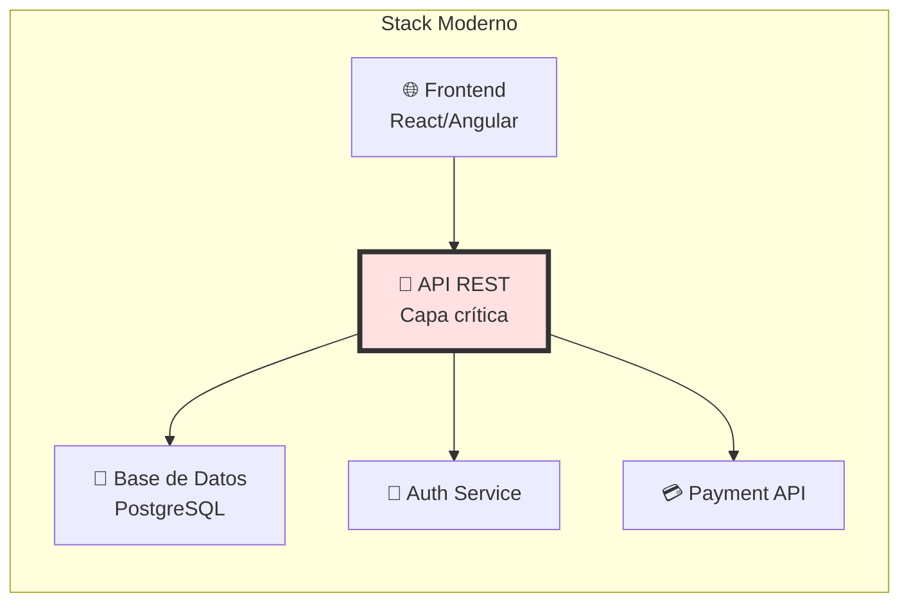
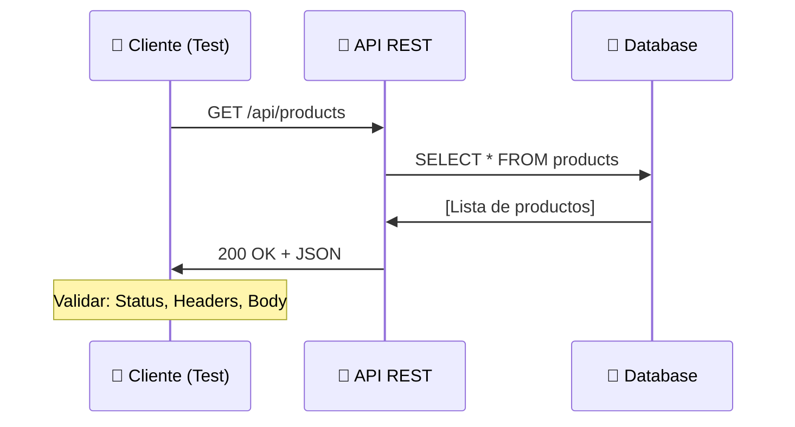
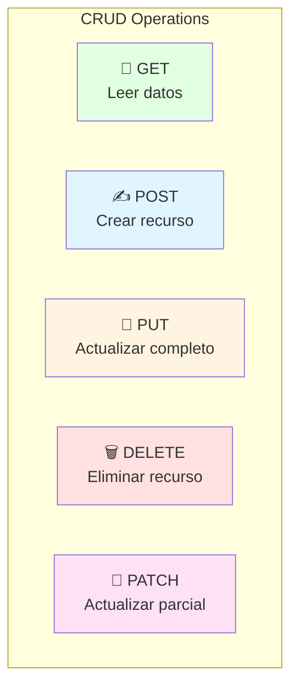
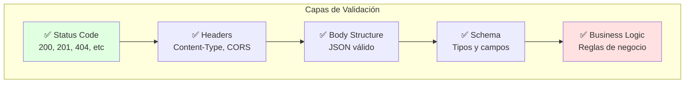
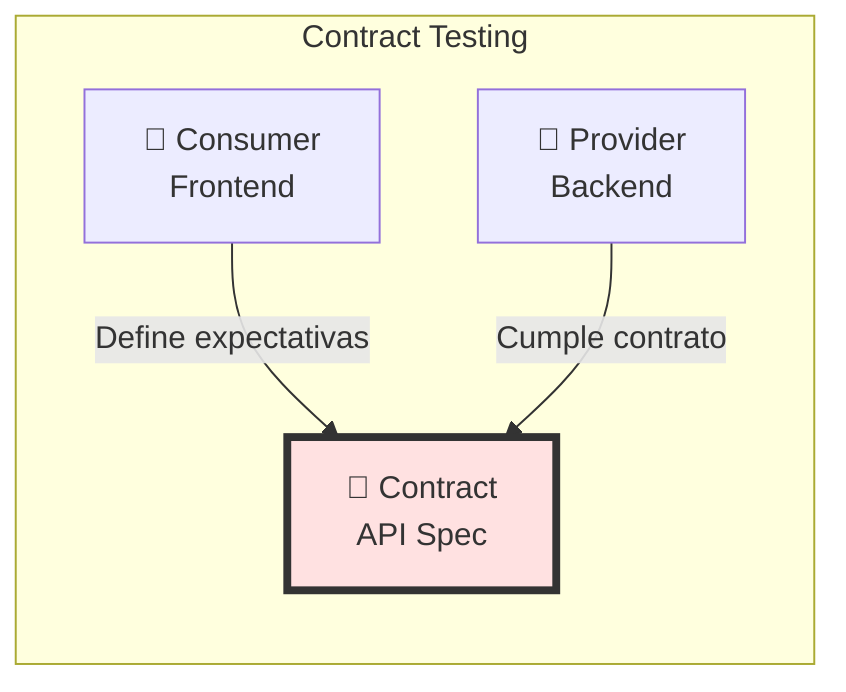
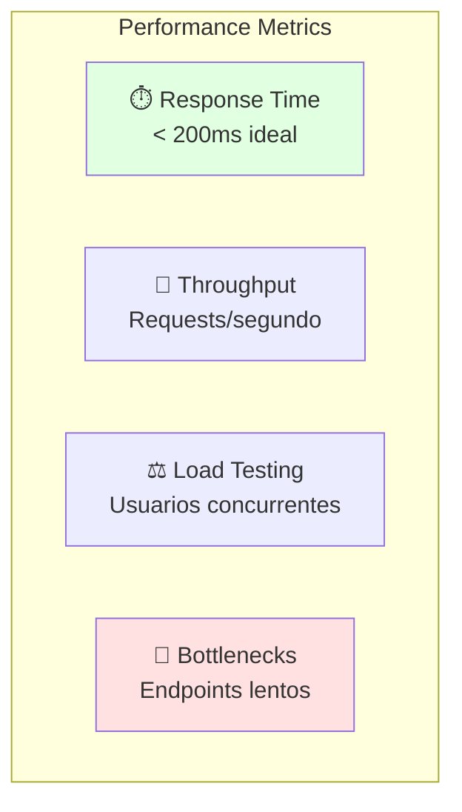
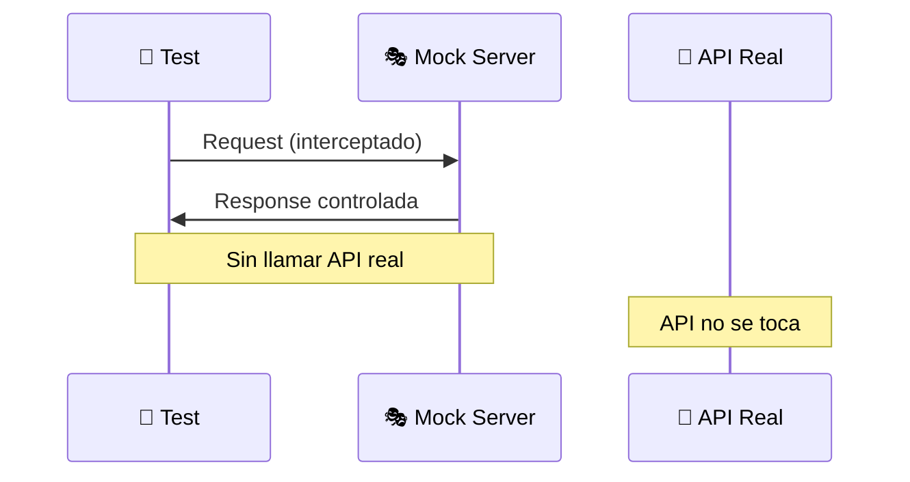

# 🔌 Módulo 02: Testing de APIs con Playwright
## FPUNA 2026 - Track QA Automation

**Duración**: 4 horas  
**Modalidad**: Teórico-práctico (30% teoría, 70% práctica)  
**Prerrequisitos**: Módulo 01 completado

---

## Objetivos de Aprendizaje

Al finalizar este módulo, serás capaz de:

1. ✅ **Usar Playwright API Testing Context** - APIRequestContext para pruebas de API
2. ✅ **Validar schemas JSON con Zod** - Type-safe schema validation
3. ✅ **Implementar contract testing** - Verificar contratos entre servicios
4. ✅ **Testear performance** - Medir tiempos de respuesta y carga
5. ✅ **Mockear dependencias externas** - Aislar tests de servicios externos
6. ✅ **Crear suites reutilizables** - Frameworks de testing escalables

---

## 🤔 ¿Por Qué Testing de APIs?

### La Realidad del Desarrollo Moderno

> **Para QAs**: El 70% de las aplicaciones modernas son arquitecturas de microservicios donde las APIs son el corazón del sistema. Si no testeas las APIs, no estás testeando la aplicación real.

**Analogía**: Imagina una fábrica de muebles (Industrias Pindó en Paraguay).
- **Testing UI solo** = Inspeccionar solo el barniz final
- **Testing API** = Verificar cada pieza, cada conexión, cada ensamblaje



**La API es el punto crítico** - Si falla, toda la app falla.

### Mercado Paraguay: Por Qué Importa

| Empresa | Stack API | Por Qué Testean APIs |
|---------|-----------|----------------------|
| **Aruma** (Fintech) | REST + GraphQL | Compliance bancario exige 95%+ coverage |
| **Softtek** | Microservicios | Proyectos internacionales requieren CI/CD robusto |
| **Global Logic** | REST APIs | Clientes USA no toleran bugs en producción |
| **Roshka** | NestJS + REST | Agilidad = deploy 3x por día con tests |

**Salario QA con API testing**: ₲10M-18M/mes  
**Salario QA solo UI**: ₲6M-10M/mes

---

## 📊 Parte 1: Fundamentos de API Testing (60 min)

### Concepto: ¿Qué es una API REST?

**Analogía**: Como el sistema de pedidos en un restaurante.
- **Cliente** (Frontend) → **Mozo** (API) → **Cocina** (Backend)
- El mozo lleva pedidos (requests) y trae platos (responses)



### HTTP Methods Básicos



| Método | Propósito | Ejemplo FPUNA |
|--------|-----------|---------------|
| **GET** | Obtener datos | `GET /api/students` - Listar estudiantes |
| **POST** | Crear recurso | `POST /api/students` - Registrar nuevo estudiante |
| **PUT** | Actualizar completo | `PUT /api/students/123` - Actualizar todos los datos |
| **DELETE** | Eliminar | `DELETE /api/students/123` - Dar de baja |
| **PATCH** | Actualizar parcial | `PATCH /api/students/123` - Solo actualizar email |

### Playwright API Testing Context

Playwright no es solo para UI - tiene un módulo poderoso para APIs.

**Instalación**:
```bash
npm install @playwright/test
```

**Ejemplo 1: GET Request Simple**
```typescript
// tests/api/products.spec.ts
import { test, expect } from '@playwright/test';

test.describe('API de Productos FPUNA Store', () => {
  let request: APIRequestContext;

  test.beforeAll(async ({ playwright }) => {
    // Crear contexto de API
    request = await playwright.request.newContext({
      baseURL: 'https://api.fpuna-store.edu.py',
      extraHTTPHeaders: {
        'Accept': 'application/json',
        'Content-Type': 'application/json',
      },
    });
  });

  test.afterAll(async () => {
    await request.dispose();
  });

  test('GET /api/products - debería listar productos', async () => {
    // Act
    const response = await request.get('/api/products');

    // Assert - Status code
    expect(response.status()).toBe(200);

    // Assert - Headers
    expect(response.headers()['content-type']).toContain('application/json');

    // Assert - Body
    const products = await response.json();
    expect(Array.isArray(products)).toBe(true);
    expect(products.length).toBeGreaterThan(0);

    // Assert - Estructura del primer producto
    const firstProduct = products[0];
    expect(firstProduct).toHaveProperty('id');
    expect(firstProduct).toHaveProperty('nombre');
    expect(firstProduct).toHaveProperty('precio');
    expect(firstProduct.precio).toBeGreaterThan(0);
  });

  test('GET /api/products/:id - debería obtener producto específico', async () => {
    const response = await request.get('/api/products/1');

    expect(response.status()).toBe(200);

    const product = await response.json();
    expect(product.id).toBe(1);
    expect(product.nombre).toBeDefined();
    expect(product.descripcion).toBeDefined();
    expect(product.stock).toBeGreaterThanOrEqual(0);
  });

  test('GET /api/products/999 - debería retornar 404 para ID inexistente', async () => {
    const response = await request.get('/api/products/999');

    expect(response.status()).toBe(404);

    const error = await response.json();
    expect(error.message).toContain('no encontrado');
  });
});
```

**Ejemplo 2: POST Request con Autenticación**
```typescript
// tests/api/students.spec.ts
import { test, expect } from '@playwright/test';

test.describe('API de Estudiantes FPUNA', () => {
  let request: APIRequestContext;
  let authToken: string;

  test.beforeAll(async ({ playwright }) => {
    // 1. Login para obtener token
    const authContext = await playwright.request.newContext({
      baseURL: 'https://api.fpuna.edu.py',
    });

    const loginResponse = await authContext.post('/api/auth/login', {
      data: {
        email: 'admin@fpuna.edu.py',
        password: process.env.ADMIN_PASSWORD,
      },
    });

    const authData = await loginResponse.json();
    authToken = authData.token;

    // 2. Crear contexto con token
    request = await playwright.request.newContext({
      baseURL: 'https://api.fpuna.edu.py',
      extraHTTPHeaders: {
        'Authorization': `Bearer ${authToken}`,
        'Content-Type': 'application/json',
      },
    });

    await authContext.dispose();
  });

  test.afterAll(async () => {
    await request.dispose();
  });

  test('POST /api/students - debería crear estudiante', async () => {
    // Arrange
    const newStudent = {
      nombre: 'María González',
      email: 'maria.gonzalez@fpuna.edu.py',
      carrera: 'Ingeniería Informática',
      cedula: '4123456',
    };

    // Act
    const response = await request.post('/api/students', {
      data: newStudent,
    });

    // Assert - Status
    expect(response.status()).toBe(201); // Created

    // Assert - Body
    const student = await response.json();
    expect(student.id).toBeDefined();
    expect(student.nombre).toBe(newStudent.nombre);
    expect(student.email).toBe(newStudent.email);
    expect(student.createdAt).toBeDefined();

    // Assert - Headers
    expect(response.headers()['location']).toContain(`/api/students/${student.id}`);
  });

  test('POST /api/students - debería rechazar email duplicado', async () => {
    const duplicateStudent = {
      nombre: 'Juan Pérez',
      email: 'maria.gonzalez@fpuna.edu.py', // Email ya existe
      carrera: 'Ingeniería Civil',
      cedula: '4654321',
    };

    const response = await request.post('/api/students', {
      data: duplicateStudent,
    });

    // Assert - Conflict
    expect(response.status()).toBe(409);

    const error = await response.json();
    expect(error.message).toContain('email ya registrado');
  });
});
```

**Ejemplo 3: PUT y DELETE**
```typescript
test.describe('CRUD Completo de Productos', () => {
  let createdProductId: number;

  test('PUT /api/products/:id - debería actualizar producto', async () => {
    // Arrange - Primero crear un producto
    const createResponse = await request.post('/api/products', {
      data: {
        nombre: 'Notebook HP',
        precio: 3500000,
        stock: 10,
      },
    });
    const product = await createResponse.json();
    createdProductId = product.id;

    // Act - Actualizar
    const updateResponse = await request.put(`/api/products/${createdProductId}`, {
      data: {
        nombre: 'Notebook HP Pavilion 15',
        precio: 3800000,
        stock: 8,
      },
    });

    // Assert
    expect(updateResponse.status()).toBe(200);
    const updatedProduct = await updateResponse.json();
    expect(updatedProduct.nombre).toBe('Notebook HP Pavilion 15');
    expect(updatedProduct.precio).toBe(3800000);
  });

  test('DELETE /api/products/:id - debería eliminar producto', async () => {
    const response = await request.delete(`/api/products/${createdProductId}`);

    // Assert - No Content
    expect(response.status()).toBe(204);

    // Verificar que ya no existe
    const getResponse = await request.get(`/api/products/${createdProductId}`);
    expect(getResponse.status()).toBe(404);
  });
});
```

### Validación de Responses



**Patrones Comunes**:
```typescript
// ✅ Bueno: Validación completa
test('validar response completo', async () => {
  const response = await request.get('/api/orders/123');

  // 1. Status code
  expect(response.status()).toBe(200);

  // 2. Headers
  const headers = response.headers();
  expect(headers['content-type']).toContain('application/json');
  expect(headers['cache-control']).toBeDefined();

  // 3. Body structure
  const order = await response.json();
  expect(order).toBeDefined();
  expect(typeof order).toBe('object');

  // 4. Required fields
  expect(order.id).toBe(123);
  expect(order.total).toBeGreaterThan(0);
  expect(order.items).toBeInstanceOf(Array);

  // 5. Business logic
  const calculatedTotal = order.items.reduce(
    (sum: number, item: any) => sum + item.precio * item.cantidad,
    0
  );
  expect(order.total).toBe(calculatedTotal);
});

// ❌ Malo: Solo valida status
test('validación incompleta', async () => {
  const response = await request.get('/api/orders/123');
  expect(response.status()).toBe(200); // No suficiente
});
```

---

## 🔐 Parte 2: Schema Validation con Zod (60 min)

### Concepto: Type-Safe Validation

**Problema**: JavaScript/TypeScript no valida en runtime.
```typescript
// ❌ Esto compila pero falla en runtime
interface Product {
  id: number;
  nombre: string;
}

const product: Product = await response.json(); // Confiamos ciegamente
console.log(product.nombre.toUpperCase()); // Crash si nombre es null
```

**Solución**: Zod valida + typea en runtime.

**Instalación**:
```bash
npm install zod
```

### Ejemplo: Schemas con Zod

```typescript
// schemas/product.schema.ts
import { z } from 'zod';

// Schema de producto
export const ProductSchema = z.object({
  id: z.number().positive(),
  nombre: z.string().min(3).max(100),
  descripcion: z.string().optional(),
  precio: z.number().positive().min(1000), // Mínimo ₲1,000
  stock: z.number().int().min(0),
  categoria: z.enum(['electrónica', 'libros', 'ropa', 'otros']),
  createdAt: z.string().datetime(),
  updatedAt: z.string().datetime(),
});

// Schema para array
export const ProductListSchema = z.array(ProductSchema);

// Schema para respuesta paginada
export const PaginatedProductsSchema = z.object({
  data: z.array(ProductSchema),
  pagination: z.object({
    page: z.number().positive(),
    pageSize: z.number().positive(),
    total: z.number().int().min(0),
    totalPages: z.number().int().min(0),
  }),
});

// Type inference automático
export type Product = z.infer<typeof ProductSchema>;
export type PaginatedProducts = z.infer<typeof PaginatedProductsSchema>;
```

### Tests con Schema Validation

```typescript
// tests/api/products-validated.spec.ts
import { test, expect } from '@playwright/test';
import { ProductSchema, ProductListSchema } from '../schemas/product.schema';

test.describe('API Productos con Validación de Schema', () => {
  test('GET /api/products - validar schema de lista', async ({ request }) => {
    const response = await request.get('https://api.fpuna-store.edu.py/api/products');

    expect(response.status()).toBe(200);

    const data = await response.json();

    // Validar con Zod
    const validation = ProductListSchema.safeParse(data);

    // Assert - Schema válido
    expect(validation.success).toBe(true);

    if (validation.success) {
      // Type-safe access
      const products = validation.data;
      expect(products.length).toBeGreaterThan(0);

      // Validaciones adicionales
      products.forEach((product) => {
        expect(product.precio).toBeGreaterThan(0);
        expect(product.stock).toBeGreaterThanOrEqual(0);
      });
    }
  });

  test('POST /api/products - validar schema de respuesta', async ({ request }) => {
    const newProduct = {
      nombre: 'Mouse Logitech',
      descripcion: 'Mouse inalámbrico',
      precio: 150000,
      stock: 25,
      categoria: 'electrónica',
    };

    const response = await request.post('https://api.fpuna-store.edu.py/api/products', {
      data: newProduct,
    });

    expect(response.status()).toBe(201);

    const data = await response.json();

    // Validar schema
    const validation = ProductSchema.safeParse(data);

    if (!validation.success) {
      console.error('Errores de validación:', validation.error.format());
    }

    expect(validation.success).toBe(true);
  });

  test('GET /api/products con datos inválidos - capturar errores', async ({ request }) => {
    // Mockear respuesta con datos inválidos para testing
    const invalidData = {
      id: -1, // ID negativo (inválido)
      nombre: 'AB', // Muy corto (< 3 chars)
      precio: -100, // Precio negativo
      stock: 5.5, // Stock decimal (debe ser entero)
      categoria: 'invalida', // Categoría no permitida
    };

    // En un test real, esto vendría de la API
    const validation = ProductSchema.safeParse(invalidData);

    expect(validation.success).toBe(false);

    if (!validation.success) {
      const errors = validation.error.format();
      expect(errors.id?._errors).toContain('Number must be greater than 0');
      expect(errors.nombre?._errors).toContain('String must contain at least 3 character(s)');
      expect(errors.categoria?._errors).toBeDefined();
    }
  });
});
```

### Schema Evolution

```typescript
// schemas/student.schema.v1.ts
export const StudentSchemaV1 = z.object({
  id: z.number(),
  nombre: z.string(),
  email: z.string().email(),
});

// schemas/student.schema.v2.ts (con nuevos campos)
export const StudentSchemaV2 = z.object({
  id: z.number(),
  nombre: z.string(),
  email: z.string().email(),
  telefono: z.string().optional(), // Nuevo campo opcional
  carrera: z.string(), // Nuevo campo requerido
  fechaIngreso: z.string().datetime().optional(),
});

// Test de compatibilidad entre versiones
test('API debe ser retrocompatible', async ({ request }) => {
  const response = await request.get('/api/students/123');
  const data = await response.json();

  // Debe validar contra V1 (backward compatible)
  const v1Valid = StudentSchemaV1.safeParse(data);
  expect(v1Valid.success).toBe(true);

  // Y contra V2
  const v2Valid = StudentSchemaV2.safeParse(data);
  expect(v2Valid.success).toBe(true);
});
```

---

## 🤝 Parte 3: Contract Testing (45 min)

### Concepto: Consumer-Driven Contracts

**Analogía**: Como un contrato legal entre dos empresas.
- **Consumer** (Frontend/Microservicio A): "Necesito que el API tenga estos campos"
- **Provider** (Backend/Microservicio B): "Me comprometo a proveer esos campos"



### OpenAPI/Swagger Integration

```typescript
// tests/api/contract.spec.ts
import { test, expect } from '@playwright/test';
import SwaggerParser from '@apidevtools/swagger-parser';

test.describe('Contract Testing con OpenAPI', () => {
  let apiSpec: any;

  test.beforeAll(async () => {
    // Cargar especificación OpenAPI
    apiSpec = await SwaggerParser.validate('./specs/fpuna-api.yaml');
  });

  test('API debe cumplir con especificación de GET /products', async ({ request }) => {
    // Obtener definición del endpoint
    const endpoint = apiSpec.paths['/api/products'].get;

    // Hacer request
    const response = await request.get('https://api.fpuna-store.edu.py/api/products');

    // Validar status codes esperados
    const expectedStatuses = Object.keys(endpoint.responses);
    expect(expectedStatuses).toContain(response.status().toString());

    // Validar schema de respuesta 200
    if (response.status() === 200) {
      const data = await response.json();
      const schema = endpoint.responses['200'].content['application/json'].schema;

      // Aquí integrarías un validador OpenAPI
      // expect(data).toMatchSchema(schema);
    }
  });
});
```

### Contract Testing Pattern

```typescript
// contracts/product.contract.ts
export const ProductContract = {
  endpoint: '/api/products',
  methods: {
    GET: {
      request: {
        query: { page: 'number?', limit: 'number?' },
      },
      response: {
        status: 200,
        body: {
          type: 'array',
          items: {
            id: 'number',
            nombre: 'string',
            precio: 'number',
          },
        },
      },
    },
    POST: {
      request: {
        body: {
          nombre: 'string',
          precio: 'number',
          stock: 'number',
        },
      },
      response: {
        status: 201,
        body: {
          id: 'number',
          nombre: 'string',
          precio: 'number',
          createdAt: 'string',
        },
      },
    },
  },
};

// Test que valida el contrato
test('POST /api/products cumple contrato', async ({ request }) => {
  const contract = ProductContract.methods.POST;

  const response = await request.post('/api/products', {
    data: {
      nombre: 'Test Product',
      precio: 100000,
      stock: 10,
    },
  });

  // Validar status del contrato
  expect(response.status()).toBe(contract.response.status);

  // Validar estructura del body
  const body = await response.json();
  expect(typeof body.id).toBe('number');
  expect(typeof body.nombre).toBe('string');
  expect(typeof body.createdAt).toBe('string');
});
```

---

## ⚡ Parte 4: Performance Testing (45 min)

### Concepto: Response Time Assertions



### Medir Tiempos de Respuesta

```typescript
// tests/api/performance.spec.ts
import { test, expect } from '@playwright/test';

test.describe('Performance Testing - API FPUNA', () => {
  test('GET /api/products debe responder en < 500ms', async ({ request }) => {
    const startTime = Date.now();

    const response = await request.get('https://api.fpuna-store.edu.py/api/products');

    const endTime = Date.now();
    const responseTime = endTime - startTime;

    // Assert - Performance
    expect(response.status()).toBe(200);
    expect(responseTime).toBeLessThan(500); // < 500ms

    console.log(`⏱️ Response time: ${responseTime}ms`);
  });

  test('POST /api/products - medir tiempo de creación', async ({ request }) => {
    const startTime = performance.now();

    const response = await request.post('https://api.fpuna-store.edu.py/api/products', {
      data: {
        nombre: 'Performance Test Product',
        precio: 100000,
        stock: 5,
      },
    });

    const endTime = performance.now();
    const responseTime = endTime - startTime;

    expect(response.status()).toBe(201);
    expect(responseTime).toBeLessThan(1000); // Escritura permite más tiempo

    console.log(`⏱️ POST response time: ${responseTime.toFixed(2)}ms`);
  });
});
```

### Load Testing con Concurrent Requests

```typescript
test('Concurrent requests - medir throughput', async ({ request }) => {
  const numRequests = 50;
  const startTime = Date.now();

  // Lanzar 50 requests en paralelo
  const promises = Array.from({ length: numRequests }, () =>
    request.get('https://api.fpuna-store.edu.py/api/products')
  );

  const responses = await Promise.all(promises);

  const endTime = Date.now();
  const totalTime = endTime - startTime;

  // Validar todas exitosas
  responses.forEach((response) => {
    expect(response.status()).toBe(200);
  });

  // Calcular throughput
  const requestsPerSecond = (numRequests / totalTime) * 1000;

  console.log(`🚀 Throughput: ${requestsPerSecond.toFixed(2)} req/s`);
  console.log(`⏱️ Total time: ${totalTime}ms`);

  // Assert - Debe manejar carga
  expect(totalTime).toBeLessThan(5000); // < 5 segundos para 50 requests
});
```

---

## 🎭 Parte 5: API Mocking (30 min)

### Concepto: Aislar Tests



### Route Mocking en Playwright

```typescript
// tests/api/mocked.spec.ts
import { test, expect } from '@playwright/test';

test.describe('API Mocking', () => {
  test('Mockear respuesta de productos', async ({ page, context }) => {
    // Interceptar requests
    await context.route('**/api/products', (route) => {
      // Respuesta mockeada
      route.fulfill({
        status: 200,
        contentType: 'application/json',
        body: JSON.stringify([
          { id: 1, nombre: 'Producto Mock 1', precio: 100000 },
          { id: 2, nombre: 'Producto Mock 2', precio: 200000 },
        ]),
      });
    });

    // Tu test ahora usa datos controlados
    await page.goto('https://fpuna-store.edu.py');
    await expect(page.locator('.product')).toHaveCount(2);
  });

  test('Mockear error 500 para testing de manejo de errores', async ({ page, context }) => {
    await context.route('**/api/products', (route) => {
      route.fulfill({
        status: 500,
        contentType: 'application/json',
        body: JSON.stringify({ message: 'Internal Server Error' }),
      });
    });

    await page.goto('https://fpuna-store.edu.py');
    
    // Validar que la UI muestra mensaje de error
    await expect(page.locator('.error-message')).toBeVisible();
  });
});
```

---

## 🎯 Ejercicio Práctico: API de E-commerce FPUNA

### Objetivo
Crear suite completa de tests para API REST de un sistema de órdenes.

### Endpoints a Testear

| Método | Endpoint | Descripción |
|--------|----------|-------------|
| GET | `/api/orders` | Listar órdenes |
| GET | `/api/orders/:id` | Detalle de orden |
| POST | `/api/orders` | Crear orden |
| PUT | `/api/orders/:id` | Actualizar estado |
| DELETE | `/api/orders/:id` | Cancelar orden |

### Tareas

**Usar OpenCode para generar**:
```bash
opencode "Genera suite completa de tests de API para sistema de órdenes FPUNA:

ENDPOINTS:
- GET /api/orders (lista con paginación)
- GET /api/orders/:id (detalle)
- POST /api/orders (crear con items)
- PUT /api/orders/:id (actualizar estado: pending → processing → shipped → delivered)
- DELETE /api/orders/:id (cancelar solo si pending)

SCHEMA (Zod):
- Order: id, userId, items[], total, status, createdAt
- OrderItem: productId, quantity, price

VALIDACIONES:
- Status codes correctos (200, 201, 404, 400, 409)
- Schema validation con Zod
- Business logic (total calculado correctamente)
- Performance (< 500ms para GET, < 1s para POST)
- Error handling (campos faltantes, ID inválido)

TESTS REQUERIDOS:
1. GET lista - validar paginación y schema
2. GET detalle - existente y no existente
3. POST crear - éxito y validaciones
4. PUT actualizar - estados válidos e inválidos
5. DELETE cancelar - solo si pending
6. Performance - concurrent requests

TODO en TypeScript con Playwright + Zod. Comentarios en español."
```

---

## ✅ Mejores Prácticas de API Testing

### ✅ HACER

```typescript
// ✅ Usar fixtures para datos de test
test.beforeEach(async ({ request }) => {
  // Setup: Crear datos de test
  await request.post('/api/test/setup');
});

test.afterEach(async ({ request }) => {
  // Cleanup: Limpiar datos
  await request.post('/api/test/cleanup');
});

// ✅ Validar schemas
const validation = ProductSchema.safeParse(data);
expect(validation.success).toBe(true);

// ✅ Medir performance
const start = performance.now();
await request.get('/api/products');
const time = performance.now() - start;
expect(time).toBeLessThan(500);

// ✅ Tests independientes
test('crear producto', async ({ request }) => {
  // No depende de otros tests
});
```

### ❌ NO HACER

```typescript
// ❌ No hardcodear IDs
await request.get('/api/products/123'); // Puede no existir

// ✅ Mejor: Crear y usar ID
const created = await request.post('/api/products', { data: testData });
const product = await created.json();
await request.get(`/api/products/${product.id}`);

// ❌ No ignorar errores
const response = await request.get('/api/products');
await response.json(); // Puede fallar si status !== 200

// ✅ Validar primero
expect(response.status()).toBe(200);
const data = await response.json();

// ❌ No confiar en orden de tests
let sharedProductId; // State compartido es malo
test('crear', async () => { sharedProductId = 123; });
test('actualizar', async () => { /* usa sharedProductId */ });
```

---

## 🔧 Troubleshooting Común

| Problema | Causa | Solución |
|----------|-------|----------|
| `ECONNREFUSED` | API no está corriendo | Verificar que backend esté levantado |
| `401 Unauthorized` | Token expirado/inválido | Renovar token en `beforeAll` |
| `Schema validation fails` | API cambió estructura | Actualizar schema o verificar versión API |
| `Timeout` | Request muy lento | Aumentar timeout o revisar performance |

---

## 🎓 Resumen del Módulo

### Lo Que Dominaste

✅ **Playwright API Testing** - APIRequestContext para HTTP requests  
✅ **Schema Validation** - Type-safe con Zod  
✅ **Contract Testing** - Verificar contratos entre servicios  
✅ **Performance Testing** - Medir y optimizar tiempos  
✅ **API Mocking** - Aislar tests de dependencias  
✅ **Best Practices** - Tests profesionales y escalables

### Próximo Paso

**Continúa con**: [Módulo 03 - Arquitectura de Tests](./03-test-architecture.md)

---

## 📚 Recursos Adicionales

- 📚 [Playwright API Testing Docs](https://playwright.dev/docs/api-testing)
- 📚 [Zod Documentation](https://zod.dev)
- 📚 [OpenAPI Specification](https://swagger.io/specification/)
- 🎥 [API Testing Tutorial (YouTube)](https://youtube.com/playwright-api-testing)

---

*Módulo 02 - API Testing con Playwright - FPUNA 2026*  
*Actualizado: Enero 2026*  
*Track: QA Automation*
