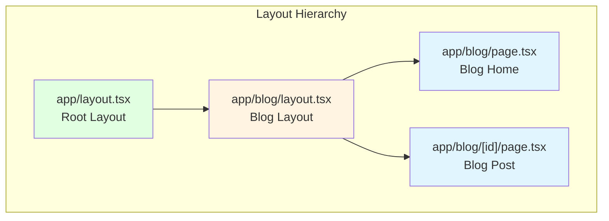

# 🚀 Módulo 01: Next.js 14 Foundations

## Construye Aplicaciones Web Modernas con React

> **Para Desarrolladores Web**: Este módulo te enseña Next.js 14 desde cero, el framework React más usado en la industria. Aprenderás App Router, Server Components, routing dinámico, data fetching moderno, y cómo OpenCode acelera el desarrollo de aplicaciones full-stack.

**⏱️ Duración**: 4 horas  
**👤 Nivel**: Principiante-Intermedio  
**🎯 Objetivo**: Dominar Next.js 14 y crear aplicaciones web profesionales

---

## 🎓 ¿Qué Vas a Lograr?

1. ✅ **Crear apps Next.js 14** - App Router y arquitectura moderna
2. ✅ **Entender componentes** - Server vs Client Components
3. ✅ **Implementar routing** - File-based routing y navegación
4. ✅ **Fetch de datos** - SSR, SSG, ISR, y streaming
5. ✅ **Optimizar SEO** - Metadata y performance
6. ✅ **Deploy en Vercel** - Producción en minutos

---

## 🤔 ¿Qué es Next.js?

### Analogía: Framework Todo-en-Uno

```mermaid
mindmap
  root((Next.js))
    Restaurant Todo Incluido
      No necesitas comprar ingredientes separados
      Chef profesional incluido
      Recetas optimizadas
      Servicio completo
    Next.js Framework
      No necesitas configurar routing
      React + SSR incluido
      Optimizaciones automáticas
      Backend + Frontend integrados
```



**Next.js** = Framework de React que incluye todo lo necesario para aplicaciones web modernas: routing, rendering, data fetching, optimizaciones, y backend.

### ¿Por Qué Next.js en Paraguay?

**Realidad del mercado local**:
- ✅ **Softtek** - Stack principal para proyectos web enterprise
- ✅ **Global Logic** - 40+ proyectos USA usando Next.js
- ✅ **Aruma** - Fintech con Next.js 14 + TypeScript
- ✅ **Roshka** - 80% de proyectos web nuevos con Next.js
- ✅ **Startups** - Stack #1 más adoptado en 2025-2026

**Salarios**:
- Junior (0-2 años): ₲7M-12M/mes
- Mid-Level (2-4 años): ₲12M-18M/mes
- Senior (4+ años): ₲20M-30M/mes

**Sin Next.js** = Pierdes 60% de oportunidades web 🚫

---

## 📊 Next.js vs Alternativas

```mermaid
graph TD
    subgraph "Comparación de Frameworks"
        A[Create React App<br/>❌ Setup manual<br/>❌ No SSR<br/>❌ No routing built-in]
        B[Gatsby<br/>✅ SSG excelente<br/>❌ Build lento<br/>❌ No SSR]
        C[Next.js<br/>✅ SSR + SSG + ISR<br/>✅ Routing automático<br/>✅ Backend integrado<br/>✅ Performance óptima]
        D[Remix<br/>✅ Buen routing<br/>⚠️ Menos ecosistema<br/>⚠️ Menos adopción]
    end
    
    style C fill:#E1FFE1
    style B fill:#FFF4E1
    style A fill:#FFE1E1
    style D fill:#E1F5FF
```



### ¿Por Qué Next.js Gana?

| Feature | CRA | Gatsby | Next.js | Remix |
|---------|-----|--------|---------|-------|
| **SSR (Server-Side Rendering)** | ❌ | ❌ | ✅ | ✅ |
| **SSG (Static Site Generation)** | ❌ | ✅ | ✅ | ⚠️ |
| **ISR (Incremental Static Regeneration)** | ❌ | ❌ | ✅ | ❌ |
| **API Routes (Backend)** | ❌ | ❌ | ✅ | ✅ |
| **Image Optimization** | ❌ | ✅ | ✅ | ❌ |
| **File-based Routing** | ❌ | ✅ | ✅ | ✅ |
| **App Router (Server Components)** | ❌ | ❌ | ✅ | ❌ |
| **Vercel Deployment (1-click)** | ⚠️ | ✅ | ✅ | ⚠️ |
| **Adopción Industria** | 📉 | 📊 | 📈 | 📊 |

**Resultado**: Next.js domina en versatilidad, performance, y adopción empresarial.

---

## 🏗️ Parte 1: Next.js 14 Básico (60 min)

### Concepto: App Router

**Analogía**: Sistema de carpetas = URLs automáticas.

```mermaid
graph LR
    subgraph "App Router - File System = URLs"
        A[📁 app/<br/>page.tsx]
        B[🌐 localhost:3000/]
        
        C[📁 app/about/<br/>page.tsx]
        D[🌐 localhost:3000/about]
        
        E[📁 app/blog/[id]/<br/>page.tsx]
        F[🌐 localhost:3000/blog/123]
        
        A --> B
        C --> D
        E --> F
    end
    
    style A fill:#E1F5FF
    style C fill:#E1FFE1
    style E fill:#FFF4E1
```

**App Router** = Cada carpeta en `/app` se convierte automáticamente en una ruta URL. No más configuración manual de routing.

### Crear Tu Primera App Next.js

#### Instalación con OpenCode

```bash
# Crear proyecto Next.js con TypeScript + Tailwind
npx create-next-app@latest fpuna-blog --typescript --tailwind --app --eslint

# Navegar al proyecto
cd fpuna-blog

# Instalar dependencies (si no lo hizo automáticamente)
npm install

# Correr desarrollo
npm run dev
```

**Opciones explicadas**:
- `--typescript`: TypeScript activado
- `--tailwind`: Tailwind CSS configurado
- `--app`: Usar App Router (nuevo paradigma)
- `--eslint`: Linter para calidad de código

#### Estructura del Proyecto

```
fpuna-blog/
├── app/                    # ← App Router (rutas principales)
│   ├── layout.tsx          # Layout raíz (wrapper global)
│   ├── page.tsx            # Página principal (/)
│   └── globals.css         # Estilos globales
├── public/                 # Archivos estáticos (images, etc)
├── next.config.js          # Configuración Next.js
├── tailwind.config.ts      # Configuración Tailwind
├── tsconfig.json           # Configuración TypeScript
└── package.json            # Dependencies
```

### Server Components vs Client Components

**Concepto crítico**: Next.js 14 introduce Server Components (por defecto).

```mermaid
graph TD
    subgraph "Server Components vs Client Components"
        A[🖥️ Server Components<br/>Default en Next.js 14]
        B[💻 Client Components<br/>Necesitan 'use client']
        
        A --> A1[✅ Acceso directo a DB]
        A --> A2[✅ Seguridad alta]
        A --> A3[✅ Bundle JS pequeño]
        A --> A4[❌ No hooks: useState, useEffect]
        
        B --> B1[✅ Interactividad]
        B --> B2[✅ Hooks de React]
        B --> B3[✅ Event handlers]
        B --> B4[❌ No acceso directo a DB]
    end
    
    style A fill:#E1FFE1
    style B fill:#FFE1F5
```



#### Ejemplo: Server Component (Default)

```typescript
// app/page.tsx (Server Component por defecto)
import { db } from '@/lib/db';

// ✅ ESTO FUNCIONA - Server Component puede usar async
export default async function HomePage() {
  // Fetch directo a base de datos (NO necesitas API route)
  const posts = await db.post.findMany({
    orderBy: { createdAt: 'desc' },
    take: 10,
  });
  
  return (
    <main className="container mx-auto px-4 py-8">
      <h1 className="text-4xl font-bold mb-8">Blog FPUNA</h1>
      
      <div className="grid gap-6">
        {posts.map((post) => (
          <article key={post.id} className="border p-6 rounded-lg">
            <h2 className="text-2xl font-semibold">{post.title}</h2>
            <p className="text-gray-600 mt-2">{post.excerpt}</p>
            <a href={`/blog/${post.id}`} className="text-blue-600 mt-4 inline-block">
              Leer más →
            </a>
          </article>
        ))}
      </div>
    </main>
  );
}
```

**¿Por qué Server Component?**
- ✅ No necesita interactividad (solo mostrar datos)
- ✅ Acceso directo a DB (más rápido)
- ✅ SEO excelente (HTML pre-renderizado)
- ✅ Menos JavaScript al cliente

#### Ejemplo: Client Component

```typescript
// components/LikeButton.tsx (Client Component)
'use client'; // ← Esta directiva convierte en Client Component

import { useState } from 'react';

export default function LikeButton({ postId }: { postId: number }) {
  // ✅ useState SOLO funciona en Client Components
  const [likes, setLikes] = useState(0);
  const [isLiked, setIsLiked] = useState(false);
  
  const handleLike = async () => {
    // Event handler - necesita Client Component
    setIsLiked(!isLiked);
    setLikes(isLiked ? likes - 1 : likes + 1);
    
    // Llamar a API route para persistir
    await fetch(`/api/posts/${postId}/like`, {
      method: 'POST',
    });
  };
  
  return (
    <button
      onClick={handleLike}
      className={`px-4 py-2 rounded ${
        isLiked ? 'bg-blue-600 text-white' : 'bg-gray-200'
      }`}
    >
      ❤️ {likes} Likes
    </button>
  );
}
```

**¿Por qué Client Component?**
- ✅ Necesita `useState` (interactividad)
- ✅ Tiene event handlers (`onClick`)
- ✅ Actualiza UI dinámicamente

#### Composición: Server + Client Components

```typescript
// app/blog/[id]/page.tsx (Server Component)
import { db } from '@/lib/db';
import LikeButton from '@/components/LikeButton'; // Client Component

export default async function BlogPost({ params }: { params: { id: string } }) {
  // Server Component - Fetch de datos
  const post = await db.post.findUnique({
    where: { id: parseInt(params.id) },
  });
  
  if (!post) return <div>Post no encontrado</div>;
  
  return (
    <article className="container mx-auto px-4 py-8">
      <h1 className="text-4xl font-bold">{post.title}</h1>
      <p className="text-gray-600 mt-2">{post.date}</p>
      
      <div className="prose mt-8">{post.content}</div>
      
      {/* Client Component embebido en Server Component */}
      <LikeButton postId={post.id} />
    </article>
  );
}
```

**Regla de oro**: Usa Server Components por defecto, solo agrega `'use client'` cuando necesites interactividad.

### Implementación con OpenCode

```bash
opencode "Crea página principal de blog FPUNA con Next.js 14:

REQUISITOS:
1. Server Component que muestre lista de posts
2. Client Component para botón 'Me gusta'
3. Estilos con Tailwind CSS
4. TypeScript estricto

ESTRUCTURA:
- app/page.tsx (Server Component con fetch de posts)
- components/LikeButton.tsx (Client Component con useState)
- app/layout.tsx (Layout global con header)

DATOS DE EJEMPLO:
- 5 posts sobre tecnología en FPUNA
- Cada post: título, excerpt, fecha, autor
- Diseño responsive (mobile-first)

OUTPUT:
- Código completo
- Comentarios explicando Server vs Client Components
- Todo en español"
```

---

## 🛣️ Parte 2: Routing & Navegación (60 min)

### Concepto: File-based Routing

**Analogía**: Carpetas = URLs, sin configuración.

```mermaid
graph TD
    subgraph "File-based Routing Examples"
        A[app/page.tsx] --> A1[🌐 /]
        
        B[app/about/page.tsx] --> B1[🌐 /about]
        
        C[app/blog/page.tsx] --> C1[🌐 /blog]
        
        D["app/blog/[id]/page.tsx"] --> D1["🌐 /blog/:id<br/>(dynamic)"]
        
        E["app/blog/[category]/[slug]/page.tsx"] --> E1["🌐 /blog/:category/:slug<br/>(nested dynamic)"]
    end
    
    style A fill:#E1FFE1
    style D fill:#FFF4E1
    style E fill:#FFE1F5
```



### Rutas Dinámicas

**Concepto**: `[nombre]` = parámetro dinámico.

#### Ruta Dinámica Simple

```typescript
// app/blog/[id]/page.tsx
interface PageProps {
  params: {
    id: string; // ← Automáticamente viene de la URL
  };
}

export default async function BlogPost({ params }: PageProps) {
  const { id } = params;
  
  // Fetch post específico
  const post = await db.post.findUnique({
    where: { id: parseInt(id) },
  });
  
  return (
    <article>
      <h1>{post.title}</h1>
      <p>{post.content}</p>
    </article>
  );
}
```

**URLs que matchean**:
- `/blog/1` → `params.id = "1"`
- `/blog/123` → `params.id = "123"`
- `/blog/nextjs-tutorial` → `params.id = "nextjs-tutorial"`

#### Rutas Anidadas Dinámicas

```typescript
// app/blog/[category]/[slug]/page.tsx
interface PageProps {
  params: {
    category: string;
    slug: string;
  };
}

export default async function CategoryPost({ params }: PageProps) {
  const { category, slug } = params;
  
  const post = await db.post.findFirst({
    where: {
      category: category,
      slug: slug,
    },
  });
  
  return (
    <article>
      <div className="text-sm text-gray-600">
        Categoría: {category}
      </div>
      <h1>{post.title}</h1>
      <p>{post.content}</p>
    </article>
  );
}
```

**URLs que matchean**:
- `/blog/tecnologia/nextjs-14` → `category: "tecnologia"`, `slug: "nextjs-14"`
- `/blog/educacion/fpuna-2026` → `category: "educacion"`, `slug: "fpuna-2026"`

### Navegación: Link Component

**Concepto**: `<Link>` optimiza navegación (prefetch automático).

```typescript
// components/PostCard.tsx
import Link from 'next/link';

interface Post {
  id: number;
  title: string;
  excerpt: string;
}

export default function PostCard({ post }: { post: Post }) {
  return (
    <article className="border p-6 rounded-lg">
      <h2 className="text-2xl font-semibold">{post.title}</h2>
      <p className="text-gray-600 mt-2">{post.excerpt}</p>
      
      {/* ✅ Link optimizado - prefetch automático */}
      <Link 
        href={`/blog/${post.id}`}
        className="text-blue-600 mt-4 inline-block hover:underline"
      >
        Leer más →
      </Link>
    </article>
  );
}
```

**Ventajas de `<Link>`**:
- ✅ Prefetch automático (pre-carga páginas)
- ✅ Navegación client-side (sin full page reload)
- ✅ Scroll to top automático
- ✅ Mejor performance que `<a>`

### Navegación Programática

```typescript
// components/SearchForm.tsx
'use client';

import { useRouter } from 'next/navigation';
import { useState } from 'react';

export default function SearchForm() {
  const router = useRouter();
  const [query, setQuery] = useState('');
  
  const handleSearch = (e: React.FormEvent) => {
    e.preventDefault();
    
    // Navegación programática
    router.push(`/search?q=${query}`);
  };
  
  return (
    <form onSubmit={handleSearch}>
      <input
        type="text"
        value={query}
        onChange={(e) => setQuery(e.target.value)}
        placeholder="Buscar posts..."
        className="px-4 py-2 border rounded"
      />
      <button type="submit" className="ml-2 px-4 py-2 bg-blue-600 text-white rounded">
        Buscar
      </button>
    </form>
  );
}
```

### Layouts Anidados

**Concepto**: `layout.tsx` = wrapper compartido para rutas.



#### Root Layout (Obligatorio)

```typescript
// app/layout.tsx
import type { Metadata } from 'next';
import './globals.css';

export const metadata: Metadata = {
  title: 'Blog FPUNA',
  description: 'Blog oficial de la Facultad Politécnica',
};

export default function RootLayout({
  children,
}: {
  children: React.ReactNode;
}) {
  return (
    <html lang="es">
      <body>
        {/* Header global */}
        <header className="border-b">
          <nav className="container mx-auto px-4 py-4">
            <a href="/" className="text-2xl font-bold">FPUNA Blog</a>
          </nav>
        </header>
        
        {/* Contenido de páginas */}
        {children}
        
        {/* Footer global */}
        <footer className="border-t mt-16">
          <div className="container mx-auto px-4 py-8">
            <p>© 2026 FPUNA - Todos los derechos reservados</p>
          </div>
        </footer>
      </body>
    </html>
  );
}
```

#### Nested Layout

```typescript
// app/blog/layout.tsx
export default function BlogLayout({
  children,
}: {
  children: React.ReactNode;
}) {
  return (
    <div className="container mx-auto px-4 py-8">
      <div className="grid grid-cols-12 gap-8">
        {/* Sidebar (solo en /blog/*) */}
        <aside className="col-span-3">
          <h3 className="font-bold mb-4">Categorías</h3>
          <ul className="space-y-2">
            <li><a href="/blog/tecnologia">Tecnología</a></li>
            <li><a href="/blog/educacion">Educación</a></li>
            <li><a href="/blog/investigacion">Investigación</a></li>
          </ul>
        </aside>
        
        {/* Contenido principal */}
        <main className="col-span-9">
          {children}
        </main>
      </div>
    </div>
  );
}
```

**Resultado**: Todas las páginas bajo `/blog/*` tienen el sidebar automáticamente.

### Implementación con OpenCode

```bash
opencode "Crea estructura de routing completa para blog FPUNA:

REQUISITOS:
1. Root layout con header/footer
2. Blog layout con sidebar de categorías
3. Rutas dinámicas para posts
4. Navegación con Link optimizado
5. Breadcrumbs dinámicos

ESTRUCTURA:
app/
├── layout.tsx (root)
├── page.tsx (home)
├── blog/
│   ├── layout.tsx (blog wrapper)
│   ├── page.tsx (lista posts)
│   ├── [id]/
│   │   └── page.tsx (post individual)
│   └── [category]/
│       └── [slug]/
│           └── page.tsx (post por categoría)

FEATURES:
- TypeScript strict
- Tailwind CSS responsive
- Metadata SEO
- Comentarios en español

OUTPUT: Código completo funcional"
```

---

## 📡 Parte 3: Data Fetching Estrategias (60 min)

### Concepto: Rendering Modes

```mermaid
graph TD
    subgraph "Next.js Rendering Strategies"
        A[SSR<br/>Server-Side Rendering]
        B[SSG<br/>Static Site Generation]
        C[ISR<br/>Incremental Static Regeneration]
        D[CSR<br/>Client-Side Rendering]
        
        A --> A1[✅ Datos siempre frescos<br/>✅ SEO excelente<br/>❌ Más lento]
        B --> B1[✅ Súper rápido<br/>✅ SEO excelente<br/>❌ Datos estáticos]
        C --> C1[✅ Balance perfecto<br/>✅ Revalidación automática<br/>✅ Best of both worlds]
        D --> D1[✅ Interactivo<br/>❌ SEO malo<br/>❌ Loading states]
    end
    
    style C fill:#E1FFE1
    style A fill:#FFF4E1
    style B fill:#E1F5FF
    style D fill:#FFE1E1
```



### SSR (Server-Side Rendering) - Default

**Concepto**: Cada request renderiza en servidor (datos siempre frescos).

```typescript
// app/dashboard/page.tsx (SSR por defecto)
export default async function Dashboard() {
  // Fetch en cada request
  const stats = await fetch('https://api.fpuna.edu.py/stats', {
    cache: 'no-store', // ← Fuerza SSR (sin cache)
  }).then((res) => res.json());
  
  return (
    <div>
      <h1>Dashboard en Tiempo Real</h1>
      <p>Usuarios activos: {stats.activeUsers}</p>
      <p>Posts hoy: {stats.postsToday}</p>
      <p className="text-xs">Actualizado: {new Date().toLocaleString()}</p>
    </div>
  );
}
```

**Cuándo usar SSR**:
- ✅ Datos cambian frecuentemente
- ✅ Personalización por usuario
- ✅ SEO crítico + datos dinámicos

### SSG (Static Site Generation)

**Concepto**: Pre-renderiza en build time (HTML estático).

```typescript
// app/about/page.tsx (SSG)
export default async function About() {
  // Fetch en build time (se cachea para siempre)
  const teamMembers = await fetch('https://api.fpuna.edu.py/team', {
    cache: 'force-cache', // ← SSG (default)
  }).then((res) => res.json());
  
  return (
    <div>
      <h1>Sobre FPUNA</h1>
      <ul>
        {teamMembers.map((member: any) => (
          <li key={member.id}>{member.name} - {member.role}</li>
        ))}
      </ul>
    </div>
  );
}
```

**Cuándo usar SSG**:
- ✅ Datos no cambian frecuentemente
- ✅ Performance crítica
- ✅ Páginas estáticas (landing, about)

### ISR (Incremental Static Regeneration) - Recomendado

**Concepto**: SSG + revalidación periódica (mejor de ambos mundos).

```typescript
// app/blog/page.tsx (ISR)
export default async function BlogHome() {
  // Regenera cada 60 segundos
  const posts = await fetch('https://api.fpuna.edu.py/posts', {
    next: { revalidate: 60 }, // ← ISR (revalidar cada 60 segundos)
  }).then((res) => res.json());
  
  return (
    <div>
      <h1>Últimos Posts</h1>
      {posts.map((post: any) => (
        <article key={post.id}>
          <h2>{post.title}</h2>
          <p>{post.excerpt}</p>
        </article>
      ))}
    </div>
  );
}
```

**Ventajas ISR**:
- ✅ Velocidad de SSG (cached HTML)
- ✅ Datos actualizados (revalidación automática)
- ✅ Menos carga en servidor
- ✅ SEO excelente

**Cuándo usar ISR**:
- ✅ Blogs, noticias, e-commerce
- ✅ Datos cambian ocasionalmente
- ✅ Tráfico alto (ISR escala mejor)

### Data Fetching Directo en Server Components

```typescript
// app/products/[id]/page.tsx
import { db } from '@/lib/db'; // Prisma ORM

export default async function ProductPage({ params }: { params: { id: string } }) {
  // ✅ Acceso directo a DB (sin API route)
  const product = await db.product.findUnique({
    where: { id: parseInt(params.id) },
    include: {
      reviews: {
        orderBy: { createdAt: 'desc' },
        take: 5,
      },
    },
  });
  
  if (!product) {
    return <div>Producto no encontrado</div>;
  }
  
  return (
    <div>
      <h1>{product.name}</h1>
      <p>₲{product.price.toLocaleString()}</p>
      
      <h2 className="mt-8">Reseñas</h2>
      {product.reviews.map((review) => (
        <div key={review.id}>
          <p>⭐ {review.rating}/5</p>
          <p>{review.comment}</p>
        </div>
      ))}
    </div>
  );
}
```

**Ventajas**:
- ✅ No necesitas crear API routes
- ✅ Type-safe con Prisma
- ✅ Menos código (menos archivos)
- ✅ Performance mejor (sin HTTP overhead)

### Streaming con Suspense

**Concepto**: Mostrar partes de página mientras otras cargan.

```typescript
// app/dashboard/page.tsx
import { Suspense } from 'react';
import RecentOrders from '@/components/RecentOrders';
import Analytics from '@/components/Analytics';

export default function Dashboard() {
  return (
    <div>
      <h1>Dashboard</h1>
      
      {/* Suspense permite streaming */}
      <Suspense fallback={<div>Cargando órdenes...</div>}>
        <RecentOrders />
      </Suspense>
      
      <Suspense fallback={<div>Cargando analytics...</div>}>
        <Analytics />
      </Suspense>
    </div>
  );
}
```

```typescript
// components/RecentOrders.tsx (Server Component)
export default async function RecentOrders() {
  // Este fetch no bloquea el resto de la página
  const orders = await db.order.findMany({
    take: 10,
    orderBy: { createdAt: 'desc' },
  });
  
  return (
    <div>
      <h2>Órdenes Recientes</h2>
      <ul>
        {orders.map((order) => (
          <li key={order.id}>#{order.id} - ₲{order.total}</li>
        ))}
      </ul>
    </div>
  );
}
```

**Ventajas Streaming**:
- ✅ TTFB (Time to First Byte) más rápido
- ✅ UI progresiva (no espera todo)
- ✅ Mejor UX en conexiones lentas

### Implementación con OpenCode

```bash
opencode "Crea sistema de posts con ISR para blog FPUNA:

REQUISITOS:
1. Lista de posts con ISR (revalidar cada 60s)
2. Post individual con SSG
3. Dashboard con SSR (no-cache)
4. Streaming con Suspense para comentarios

ESTRUCTURA:
app/
├── blog/
│   ├── page.tsx (ISR - lista posts)
│   └── [id]/
│       └── page.tsx (SSG - post individual)
├── dashboard/
│   └── page.tsx (SSR - stats en tiempo real)
└── components/
    └── Comments.tsx (Server Component con streaming)

FEATURES:
- TypeScript + Prisma
- Cache strategies correctas
- Loading states con Suspense
- Comentarios en español

OUTPUT: Implementación completa con data fetching optimizado"
```

---

## ⚡ Parte 4: Optimización & Metadata (30 min)

### Metadata API (SEO)

**Concepto**: Configurar SEO desde cada página.

```typescript
// app/blog/[id]/page.tsx
import type { Metadata } from 'next';
import { db } from '@/lib/db';

// ✅ Metadata dinámica (SEO por post)
export async function generateMetadata({ params }: { params: { id: string } }): Promise<Metadata> {
  const post = await db.post.findUnique({
    where: { id: parseInt(params.id) },
  });
  
  if (!post) {
    return {
      title: 'Post no encontrado',
    };
  }
  
  return {
    title: `${post.title} | Blog FPUNA`,
    description: post.excerpt,
    openGraph: {
      title: post.title,
      description: post.excerpt,
      images: [post.coverImage],
      type: 'article',
      publishedTime: post.createdAt.toISOString(),
      authors: [post.author],
    },
    twitter: {
      card: 'summary_large_image',
      title: post.title,
      description: post.excerpt,
      images: [post.coverImage],
    },
  };
}

export default async function BlogPost({ params }: { params: { id: string } }) {
  const post = await db.post.findUnique({
    where: { id: parseInt(params.id) },
  });
  
  return (
    <article>
      <h1>{post.title}</h1>
      <p>{post.content}</p>
    </article>
  );
}
```

**Resultado**:
- ✅ SEO dinámico por página
- ✅ Open Graph (Facebook, LinkedIn)
- ✅ Twitter Cards
- ✅ Mejor ranking en Google

### Image Optimization

```typescript
// components/PostCard.tsx
import Image from 'next/image';

export default function PostCard({ post }: { post: Post }) {
  return (
    <article>
      {/* ✅ Next.js optimiza automáticamente */}
      <Image
        src={post.coverImage}
        alt={post.title}
        width={800}
        height={400}
        className="rounded-lg"
        priority={post.featured} // Precarga si es featured
      />
      
      <h2>{post.title}</h2>
      <p>{post.excerpt}</p>
    </article>
  );
}
```

**Optimizaciones automáticas**:
- ✅ Lazy loading (solo carga cuando visible)
- ✅ Formatos modernos (WebP, AVIF)
- ✅ Resize automático
- ✅ Blur placeholder

### Loading States

```typescript
// app/blog/loading.tsx
export default function Loading() {
  return (
    <div className="container mx-auto px-4 py-8">
      <div className="animate-pulse">
        <div className="h-8 bg-gray-200 rounded w-1/3 mb-4"></div>
        <div className="h-4 bg-gray-200 rounded w-full mb-2"></div>
        <div className="h-4 bg-gray-200 rounded w-full mb-2"></div>
        <div className="h-4 bg-gray-200 rounded w-2/3"></div>
      </div>
    </div>
  );
}
```

**Resultado**: UI skeleton mientras carga (mejor UX).

---

## 🎯 Ejercicio Práctico: Blog Completo FPUNA

### Objetivo

Crear blog full-stack con Next.js 14, TypeScript, Tailwind CSS, y Prisma.

### Requisitos

**Features**:
1. Homepage con lista de posts (ISR, revalidar cada 60s)
2. Post individual con SEO dinámico
3. Categorías con routing dinámico
4. Búsqueda client-side (Client Component)
5. Dashboard con stats en tiempo real (SSR)
6. Loading states y error handling

**Tech Stack**:
- Next.js 14 (App Router)
- TypeScript
- Tailwind CSS
- Prisma + PostgreSQL (o SQLite local)

### Implementación Guiada con OpenCode

```bash
opencode "Crea blog completo FPUNA con Next.js 14:

REQUISITOS FUNCIONALES:
1. Homepage:
   - Lista de posts con paginación
   - ISR con revalidación cada 60s
   - Grid responsive (1 col mobile, 3 cols desktop)
   - Mostrar: título, excerpt, cover image, fecha, autor

2. Post Individual:
   - Ruta dinámica /blog/[id]
   - SEO metadata dinámico (Open Graph + Twitter Cards)
   - Server Component con fetch a Prisma
   - Mostrar: título, cover image, contenido, fecha, autor
   - Sección de posts relacionados

3. Categorías:
   - Ruta /blog/[category]
   - Filtrar posts por categoría
   - Breadcrumbs dinámicos

4. Búsqueda:
   - Client Component con useState
   - Búsqueda en tiempo real (filter posts)
   - Mostrar resultados con highlight

5. Dashboard:
   - SSR (no-cache)
   - Stats: total posts, total views, posts hoy
   - Últimas 5 órdenes
   - Streaming con Suspense

TECH STACK:
- Next.js 14 (App Router)
- TypeScript strict
- Tailwind CSS (mobile-first)
- Prisma ORM
- PostgreSQL (o SQLite para desarrollo)

ESTRUCTURA:
app/
├── layout.tsx (root layout con header/footer)
├── page.tsx (homepage con posts)
├── blog/
│   ├── layout.tsx (sidebar categorías)
│   ├── page.tsx (lista posts)
│   ├── [id]/
│   │   ├── page.tsx (post individual)
│   │   └── loading.tsx (skeleton)
│   └── [category]/
│       └── page.tsx (posts por categoría)
├── dashboard/
│   └── page.tsx (stats SSR)
├── search/
│   └── page.tsx (búsqueda con searchParams)
components/
├── PostCard.tsx (card de post)
├── SearchBar.tsx (Client Component)
├── CategoryNav.tsx (navegación categorías)
lib/
├── db.ts (Prisma client)
prisma/
└── schema.prisma (modelo de datos)

PRISMA SCHEMA:
model Post {
  id          Int      @id @default(autoincrement())
  title       String
  slug        String   @unique
  excerpt     String
  content     String
  coverImage  String
  category    String
  author      String
  views       Int      @default(0)
  createdAt   DateTime @default(now())
  updatedAt   DateTime @updatedAt
}

DATA SEED:
- 10 posts de ejemplo sobre tecnología en FPUNA
- 3 categorías: tecnología, educación, investigación
- Datos en español

OUTPUT:
- Código completo funcional
- README con instrucciones setup
- Seed script para datos de ejemplo
- Comentarios en español explicando conceptos clave
- TypeScript strict sin any"
```

### Verificación

```bash
# Instalar dependencies
npm install

# Setup Prisma + seed data
npx prisma generate
npx prisma db push
npx prisma db seed

# Correr desarrollo
npm run dev

# Abrir http://localhost:3000
```

**Checklist**:
- [ ] Homepage carga lista de posts
- [ ] Click en post abre página individual
- [ ] SEO metadata visible en inspector
- [ ] Búsqueda filtra posts en tiempo real
- [ ] Dashboard muestra stats actualizados
- [ ] Responsive en mobile y desktop
- [ ] No errores en consola

---

## ✅ Checklist de Next.js Foundations

### Conceptos Fundamentales
- [ ] Entiendo diferencia entre App Router y Pages Router
- [ ] Sé cuándo usar Server vs Client Components
- [ ] Puedo crear rutas dinámicas con `[param]`
- [ ] Entiendo SSR, SSG, e ISR
- [ ] Sé usar `<Link>` para navegación optimizada

### Implementación
- [ ] Creé proyecto Next.js con TypeScript
- [ ] Implementé layouts anidados (root + nested)
- [ ] Usé fetch con cache strategies correctas
- [ ] Agregué metadata SEO dinámico
- [ ] Implementé loading states con Suspense

### Best Practices
- [ ] Server Components por defecto (solo `'use client'` cuando necesito)
- [ ] ISR para datos que cambian ocasionalmente
- [ ] `<Image>` para optimización automática
- [ ] TypeScript strict (no `any`)
- [ ] Mobile-first con Tailwind CSS

---

## 🎓 Mejores Prácticas

### ✅ HACER

1. **Server Components por defecto** - Solo `'use client'` cuando necesitas interactividad
2. **ISR para blogs/e-commerce** - Balance perfecto entre velocidad y freshness
3. **Metadata SEO en cada página** - `generateMetadata()` para SEO dinámico
4. **Loading states** - `loading.tsx` y Suspense para mejor UX
5. **TypeScript strict** - Catch errores antes de runtime
6. **Tailwind mobile-first** - `sm:` para desktop, default para mobile
7. **`<Link prefetch>`** - Navegación instantánea
8. **Error boundaries** - `error.tsx` para graceful degradation

### ❌ NO HACER

1. **`'use client'` everywhere** - Pierde beneficios de Server Components
2. **`cache: 'no-store'` por defecto** - SSR es más lento, usa ISR
3. **Fetch en Client Components** - Duplica requests, usa Server Components
4. **Inline styles** - Usa Tailwind (consistencia + performance)
5. **`<a>` para navegación interna** - Siempre `<Link>`
6. **Ignorar metadata** - SEO crítico para visibilidad
7. **console.log en producción** - Usa herramientas de observabilidad
8. **Any en TypeScript** - Pierde type safety

---

## 🎉 Resumen del Módulo

### Lo Que Dominaste

✅ **Next.js 14 Fundamentos** - App Router, file-based routing, layouts  
✅ **Server vs Client Components** - Cuándo usar cada uno  
✅ **Routing Dinámico** - `[params]` y rutas anidadas  
✅ **Data Fetching Moderno** - SSR, SSG, ISR, streaming  
✅ **SEO & Performance** - Metadata, Image optimization  
✅ **OpenCode Integration** - Generar componentes y páginas con IA

### Próximo Paso

**Continúa con**: [Módulo 02 - Full-Stack Development](./02-fullstack-development.md)

---

## 💭 Reflexión

1. **¿Cuándo usarías Server Components vs Client Components en tu proyecto?**
2. **¿Qué estrategia de rendering (SSR/SSG/ISR) es mejor para un e-commerce?**
3. **¿Cómo OpenCode acelera el desarrollo de páginas Next.js?**

**Comparte en Slack** (#web-dev-nextjs)

---

## 📚 Recursos Adicionales

### Documentación Oficial
- [Next.js 14 Documentation](https://nextjs.org/docs)
- [App Router Guide](https://nextjs.org/docs/app)
- [Data Fetching Patterns](https://nextjs.org/docs/app/building-your-application/data-fetching)
- [Metadata API](https://nextjs.org/docs/app/api-reference/functions/generate-metadata)

### Tutoriales Recomendados
- **Next.js Learn** - Tutorial interactivo oficial
- **Vercel Templates** - Starter templates
- **Lee Robinson (Vercel VP)** - YouTube channel

### Comunidad Paraguay
- **Slack**: #next-js-py
- **Meetups**: JavaScript Paraguay (mensual)
- **GitHub**: Awesome Next.js Paraguay

### Deploy
- **Vercel** - 1-click deployment (FREE tier)
- **Netlify** - Alternativa a Vercel
- **Railway** - Deploy full-stack apps

---

*Módulo creado para FPUNA Verano 2026*  
*Actualizado: Enero 2026*  
*Track: Web Development*
