# 🎨 Módulo 04: UI/UX & Styling Profesional

## Crea Interfaces Modernas que los Usuarios Aman

> **Para Desarrolladores Web**: Este módulo te enseña a crear interfaces profesionales, accesibles y hermosas usando Tailwind CSS, shadcn/ui, y principios de diseño moderno. Aprenderás a construir experiencias visuales que compiten con las mejores apps del mercado, con el contexto cultural de Paraguay.

**⏱️ Duración**: 4 horas  
**👤 Nivel**: Intermedio (con fundamentos de HTML/CSS)  
**🎯 Objetivo**: Dominar UI/UX moderno con Tailwind CSS, componentes reutilizables, y animaciones profesionales

---

## 🎓 ¿Qué Vas a Lograr?

1. ✅ **Tailwind CSS Mastery** - Utility-first CSS patterns avanzados
2. ✅ **Component Libraries** - shadcn/ui para componentes profesionales
3. ✅ **Responsive Design** - Mobile-first con breakpoints estratégicos
4. ✅ **Dark Mode** - Implementación profesional de temas
5. ✅ **Animations** - Framer Motion para interacciones fluidas
6. ✅ **Accessibility** - ARIA, semántica, y WCAG compliance
7. ✅ **Generar UI con IA** - OpenCode para componentes instantáneos

---

## 🤔 ¿Por Qué UI/UX Importa?

### La Realidad del Mercado Paraguay

```mermaid
mindmap
  root((UI/UX en PY))
    Empresas Locales
      Banco Atlas - rediseño 2025
      Personal Py - app móvil
      Tigo - portal cliente
      Softtek - proyectos cliente
    Demanda
      +65% solicitan UI skills
      Salario ₲2M-5M más con UI
      Portfolio visual = más entrevistas
    Stack Popular
      Tailwind CSS dominante
      shadcn/ui trending
      Framer Motion standard
```

**Sin UI skills** = Limitado a backend 🚫  
**Con UI skills** = Full-stack completo 🚀

### Comparación: Antes vs Después UI/UX

```mermaid
graph LR
    subgraph "Sin UI/UX Skills"
        A1[❌ Diseño genérico]
        A2[❌ No responsive]
        A3[❌ Accesibilidad pobre]
        A4[❌ Sin animaciones]
    end
    
    subgraph "Con UI/UX Skills"
        B1[✅ Diseño profesional]
        B2[✅ Mobile-first]
        B3[✅ WCAG compliant]
        B4[✅ Interacciones fluidas]
    end
    
    A1 -.upgrade.-> B1
    A2 -.upgrade.-> B2
    A3 -.upgrade.-> B3
    A4 -.upgrade.-> B4
    
    style A1 fill:#FFE1E1
    style A2 fill:#FFE1E1
    style A3 fill:#FFE1E1
    style A4 fill:#FFE1E1
    style B1 fill:#E1FFE1
    style B2 fill:#E1FFE1
    style B3 fill:#E1FFE1
    style B4 fill:#E1FFE1
```

---

## 🏢 Parte 1: Tailwind CSS Mastery (60 min)

### Concepto: Utility-First CSS

**Analogía**: Como LEGO - bloques pequeños que combinas para crear estructuras complejas.

```mermaid
graph TD
    subgraph "Traditional CSS"
        A[📝 Escribir clase custom]
        B[🎨 Definir estilos]
        C[🔗 Aplicar al HTML]
        D[🐛 Debugging selectores]
        
        A --> B
        B --> C
        C --> D
    end
    
    subgraph "Tailwind CSS"
        E[🎯 Usar utility classes]
        F[✅ Listo]
        
        E --> F
    end
    
    style A fill:#FFE1E1
    style B fill:#FFE1E1
    style C fill:#FFE1E1
    style D fill:#FFE1E1
    style E fill:#E1FFE1
    style F fill:#E1FFE1
```

### Ejemplo Real: Card de Producto FPUNA Store

**Objetivo**: Crear card de producto profesional para e-commerce local.

```tsx
// Antes: CSS tradicional (50+ líneas CSS)
<div className="product-card">
  
  <div className="product-content">
    <h3 className="product-title">Notebook HP</h3>
    <p className="product-price">₲3.500.000</p>
    <button className="add-to-cart-button">Agregar</button>
  </div>
</div>

/* styles.css - 50+ líneas */
.product-card {
  background: white;
  border-radius: 12px;
  box-shadow: 0 4px 6px rgba(0,0,0,0.1);
  overflow: hidden;
  transition: transform 0.2s;
}
.product-card:hover {
  transform: translateY(-4px);
}
/* ... más CSS ... */
```

```tsx
// Después: Tailwind CSS (0 líneas CSS custom)
<div className="bg-white rounded-xl shadow-lg overflow-hidden hover:shadow-2xl hover:-translate-y-1 transition-all duration-200 group">
  <div className="relative aspect-square overflow-hidden">
    
    <div className="absolute top-2 right-2 bg-red-500 text-white px-3 py-1 rounded-full text-sm font-semibold">
      -15%
    </div>
  </div>
  
  <div className="p-6 space-y-3">
    <h3 className="text-xl font-bold text-gray-900 line-clamp-2">
      Notebook HP Pavilion 15 - Intel i7, 16GB RAM
    </h3>
    
    <div className="flex items-center gap-2">
      <span className="text-sm text-gray-500 line-through">₲4.100.000</span>
      <span className="text-2xl font-bold text-blue-600">₲3.500.000</span>
    </div>
    
    <div className="flex items-center gap-1">
      {[...Array(5)].map((_, i) => (
        <svg key={i} className="w-5 h-5 text-yellow-400 fill-current" viewBox="0 0 20 20">
          <path d="M10 15l-5.878 3.09 1.123-6.545L.489 6.91l6.572-.955L10 0l2.939 5.955 6.572.955-4.756 4.635 1.123 6.545z"/>
        </svg>
      ))}
      <span className="text-sm text-gray-600 ml-2">(127 reseñas)</span>
    </div>
    
    <button className="w-full bg-gradient-to-r from-blue-600 to-blue-700 hover:from-blue-700 hover:to-blue-800 text-white font-semibold py-3 px-6 rounded-lg transition-all duration-200 transform hover:scale-105 active:scale-95 shadow-md hover:shadow-xl">
      Agregar al Carrito
    </button>
  </div>
</div>
```

**Ventajas Tailwind**:
- ✅ **0 context switching** - Todo en el componente
- ✅ **No naming** - Sin pensar en nombres de clases
- ✅ **Tree-shaking** - Solo CSS usado en producción (~10KB)
- ✅ **Responsive** - Breakpoints inline (`md:`, `lg:`)
- ✅ **Dark mode** - Built-in (`dark:`)

### Tailwind Configuration Avanzada

```typescript
// tailwind.config.ts - Personalización FPUNA
import type { Config } from 'tailwindcss';

const config: Config = {
  darkMode: 'class', // Dark mode manual
  content: [
    './src/**/*.{js,ts,jsx,tsx,mdx}',
  ],
  theme: {
    extend: {
      colors: {
        // Colores de marca FPUNA
        fpuna: {
          50: '#e6f0ff',
          100: '#b3d1ff',
          500: '#0066cc', // Azul institucional
          600: '#0052a3',
          700: '#003d7a',
          900: '#001a33',
        },
        // Colores de banderas Paraguay
        py: {
          red: '#D52B1E',
          white: '#FFFFFF',
          blue: '#0038A8',
        },
      },
      fontFamily: {
        sans: ['Inter', 'system-ui', 'sans-serif'],
        display: ['Poppins', 'sans-serif'],
      },
      spacing: {
        '128': '32rem',
        '144': '36rem',
      },
      animation: {
        'fade-in': 'fadeIn 0.3s ease-in',
        'slide-up': 'slideUp 0.4s ease-out',
        'scale-in': 'scaleIn 0.2s ease-out',
      },
      keyframes: {
        fadeIn: {
          '0%': { opacity: '0' },
          '100%': { opacity: '1' },
        },
        slideUp: {
          '0%': { transform: 'translateY(20px)', opacity: '0' },
          '100%': { transform: 'translateY(0)', opacity: '1' },
        },
        scaleIn: {
          '0%': { transform: 'scale(0.95)', opacity: '0' },
          '100%': { transform: 'scale(1)', opacity: '1' },
        },
      },
    },
  },
  plugins: [
    require('@tailwindcss/forms'),
    require('@tailwindcss/typography'),
    require('@tailwindcss/container-queries'),
  ],
};

export default config;
```

### Responsive Design con Tailwind

```mermaid
graph LR
    subgraph "Breakpoints"
        A[📱 Default<br/>< 640px]
        B[📱 sm<br/>640px+]
        C[📱 md<br/>768px+]
        D[💻 lg<br/>1024px+]
        E[🖥️ xl<br/>1280px+]
        F[🖥️ 2xl<br/>1536px+]
        
        A --> B --> C --> D --> E --> F
    end
    
    style A fill:#FFE1F5
    style B fill:#E1FFE1
    style C fill:#E1F5FF
    style D fill:#FFF4E1
    style E fill:#FFE1E1
    style F fill:#E1E1FF
```

**Ejemplo: Layout Responsive FPUNA Dashboard**

```tsx
// Dashboard con grid responsive
<div className="min-h-screen bg-gray-50 dark:bg-gray-900">
  {/* Header - Stack mobile, horizontal desktop */}
  <header className="bg-white dark:bg-gray-800 shadow-sm">
    <div className="container mx-auto px-4 py-4 flex flex-col md:flex-row md:items-center md:justify-between gap-4">
      <div className="flex items-center gap-3">
        
        <h1 className="text-xl md:text-2xl font-bold text-gray-900 dark:text-white">
          Portal FPUNA
        </h1>
      </div>
      
      <nav className="flex gap-2 overflow-x-auto md:gap-4">
        <a href="#" className="px-4 py-2 text-sm md:text-base whitespace-nowrap rounded-lg bg-fpuna-500 text-white">
          Dashboard
        </a>
        <a href="#" className="px-4 py-2 text-sm md:text-base whitespace-nowrap rounded-lg hover:bg-gray-100 dark:hover:bg-gray-700">
          Materias
        </a>
        <a href="#" className="px-4 py-2 text-sm md:text-base whitespace-nowrap rounded-lg hover:bg-gray-100 dark:hover:bg-gray-700">
          Notas
        </a>
      </nav>
    </div>
  </header>
  
  {/* Main Content - 1 col mobile, 2 col tablet, 3 col desktop */}
  <main className="container mx-auto px-4 py-8">
    <div className="grid grid-cols-1 md:grid-cols-2 lg:grid-cols-3 gap-6">
      {/* Card que se adapta */}
      {stats.map(stat => (
        <div 
          key={stat.id}
          className="bg-white dark:bg-gray-800 p-6 rounded-xl shadow-lg hover:shadow-2xl transition-shadow"
        >
          <div className="flex items-center justify-between">
            <div>
              <p className="text-sm text-gray-600 dark:text-gray-400">
                {stat.label}
              </p>
              <p className="text-3xl font-bold text-gray-900 dark:text-white mt-2">
                {stat.value}
              </p>
            </div>
            <div className={`p-3 rounded-full ${stat.color}`}>
              <stat.icon className="w-6 h-6" />
            </div>
          </div>
        </div>
      ))}
    </div>
    
    {/* Tabla responsive - scroll mobile, completa desktop */}
    <div className="mt-8 bg-white dark:bg-gray-800 rounded-xl shadow-lg overflow-hidden">
      <div className="overflow-x-auto">
        <table className="w-full text-left">
          <thead className="bg-gray-50 dark:bg-gray-700">
            <tr>
              <th className="px-6 py-4 text-sm font-semibold text-gray-900 dark:text-white">
                Materia
              </th>
              <th className="px-6 py-4 text-sm font-semibold text-gray-900 dark:text-white hidden md:table-cell">
                Profesor
              </th>
              <th className="px-6 py-4 text-sm font-semibold text-gray-900 dark:text-white">
                Nota
              </th>
              <th className="px-6 py-4 text-sm font-semibold text-gray-900 dark:text-white hidden lg:table-cell">
                Créditos
              </th>
            </tr>
          </thead>
          <tbody className="divide-y divide-gray-200 dark:divide-gray-700">
            {/* Filas de tabla */}
          </tbody>
        </table>
      </div>
    </div>
  </main>
</div>
```

### Dark Mode Implementation


**Implementación Completa**

```tsx
// hooks/useTheme.ts
import { useEffect, useState } from 'react';

export function useTheme() {
  const [theme, setTheme] = useState<'light' | 'dark'>('light');
  
  useEffect(() => {
    // Leer preferencia guardada o del sistema
    const saved = localStorage.getItem('theme') as 'light' | 'dark' | null;
    const systemPreference = window.matchMedia('(prefers-color-scheme: dark)').matches 
      ? 'dark' 
      : 'light';
    
    const initialTheme = saved || systemPreference;
    setTheme(initialTheme);
    document.documentElement.classList.toggle('dark', initialTheme === 'dark');
  }, []);
  
  const toggleTheme = () => {
    const newTheme = theme === 'light' ? 'dark' : 'light';
    setTheme(newTheme);
    localStorage.setItem('theme', newTheme);
    document.documentElement.classList.toggle('dark', newTheme === 'dark');
  };
  
  return { theme, toggleTheme };
}

// components/ThemeToggle.tsx
import { Moon, Sun } from 'lucide-react';
import { useTheme } from '@/hooks/useTheme';

export function ThemeToggle() {
  const { theme, toggleTheme } = useTheme();
  
  return (
    <button
      onClick={toggleTheme}
      className="relative p-2 rounded-lg bg-gray-200 dark:bg-gray-700 hover:bg-gray-300 dark:hover:bg-gray-600 transition-colors"
      aria-label="Toggle theme"
    >
      <Sun className="w-5 h-5 text-yellow-500 dark:hidden" />
      <Moon className="w-5 h-5 text-blue-400 hidden dark:block" />
    </button>
  );
}

// Uso en componentes - clases con dark:
<div className="bg-white dark:bg-gray-800 text-gray-900 dark:text-white">
  <h1 className="text-blue-600 dark:text-blue-400">
    Funciona en ambos temas
  </h1>
</div>
```

---

## 🧩 Parte 2: Component Libraries - shadcn/ui (50 min)

### Concepto: Component Library

**Analogía**: Como un kit de herramientas profesional - cada herramienta (componente) es de calidad y funciona perfectamente junta.

```mermaid
graph TD
    subgraph "Sin shadcn/ui"
        A1[⏱️ 2 horas crear Button]
        A2[⏱️ 4 horas crear Dialog]
        A3[⏱️ 3 horas crear Form]
        A4[⏱️ Total: 9 horas]
        
        A1 --> A4
        A2 --> A4
        A3 --> A4
    end
    
    subgraph "Con shadcn/ui"
        B1[⚡ 30 seg instalar Button]
        B2[⚡ 30 seg instalar Dialog]
        B3[⚡ 30 seg instalar Form]
        B4[⚡ Total: 90 segundos]
        
        B1 --> B4
        B2 --> B4
        B3 --> B4
    end
    
    style A4 fill:#FFE1E1
    style B4 fill:#E1FFE1
```

### Instalación shadcn/ui

```bash
# 1. Instalar shadcn/ui CLI
npx shadcn-ui@latest init

# Configuración interactiva
✔ Would you like to use TypeScript? … yes
✔ Which style would you like to use? › Default
✔ Which color would you like to use as base color? › Slate
✔ Where is your global CSS file? … src/app/globals.css
✔ Would you like to use CSS variables for colors? … yes
✔ Where is your tailwind.config.js located? … tailwind.config.ts
✔ Configure the import alias for components: … @/components
✔ Configure the import alias for utils: … @/lib/utils

# 2. Agregar componentes (solo los que necesitas)
npx shadcn-ui@latest add button
npx shadcn-ui@latest add dialog
npx shadcn-ui@latest add form
npx shadcn-ui@latest add card
npx shadcn-ui@latest add toast
```

### Ejemplo Real: Formulario de Inscripción FPUNA

```tsx
// components/EnrollmentForm.tsx
"use client";

import { zodResolver } from "@hookform/resolvers/zod";
import { useForm } from "react-hook-form";
import * as z from "zod";
import { Button } from "@/components/ui/button";
import {
  Form,
  FormControl,
  FormDescription,
  FormField,
  FormItem,
  FormLabel,
  FormMessage,
} from "@/components/ui/form";
import { Input } from "@/components/ui/input";
import {
  Select,
  SelectContent,
  SelectItem,
  SelectTrigger,
  SelectValue,
} from "@/components/ui/select";
import { toast } from "@/components/ui/use-toast";

// Schema de validación con Zod
const enrollmentSchema = z.object({
  studentId: z.string().min(5, "ID debe tener al menos 5 caracteres"),
  courseId: z.string().min(1, "Selecciona una materia"),
  semester: z.enum(["1-2026", "2-2026"], {
    required_error: "Selecciona un semestre",
  }),
  email: z.string().email("Email inválido").endsWith("@fpuna.edu.py", "Usa email institucional"),
});

type EnrollmentFormValues = z.infer<typeof enrollmentSchema>;

export function EnrollmentForm() {
  const form = useForm<EnrollmentFormValues>({
    resolver: zodResolver(enrollmentSchema),
    defaultValues: {
      studentId: "",
      courseId: "",
      email: "",
    },
  });

  async function onSubmit(values: EnrollmentFormValues) {
    try {
      const response = await fetch("/api/enrollments", {
        method: "POST",
        headers: { "Content-Type": "application/json" },
        body: JSON.stringify(values),
      });

      if (!response.ok) throw new Error("Error al inscribir");

      toast({
        title: "✅ Inscripción exitosa",
        description: "Te inscribiste correctamente a la materia",
      });
      
      form.reset();
    } catch (error) {
      toast({
        variant: "destructive",
        title: "❌ Error",
        description: "No se pudo completar la inscripción",
      });
    }
  }

  return (
    <Form {...form}>
      <form onSubmit={form.handleSubmit(onSubmit)} className="space-y-6">
        <FormField
          control={form.control}
          name="studentId"
          render={({ field }) => (
            <FormItem>
              <FormLabel>ID de Estudiante</FormLabel>
              <FormControl>
                <Input placeholder="12345" {...field} />
              </FormControl>
              <FormDescription>
                Tu número de registro FPUNA
              </FormDescription>
              <FormMessage />
            </FormItem>
          )}
        />

        <FormField
          control={form.control}
          name="courseId"
          render={({ field }) => (
            <FormItem>
              <FormLabel>Materia</FormLabel>
              <Select onValueChange={field.onChange} defaultValue={field.value}>
                <FormControl>
                  <SelectTrigger>
                    <SelectValue placeholder="Selecciona una materia" />
                  </SelectTrigger>
                </FormControl>
                <SelectContent>
                  <SelectItem value="CS101">Introducción a la Programación</SelectItem>
                  <SelectItem value="CS201">Estructuras de Datos</SelectItem>
                  <SelectItem value="CS301">Algoritmos Avanzados</SelectItem>
                  <SelectItem value="CS401">Desarrollo Web</SelectItem>
                </SelectContent>
              </Select>
              <FormMessage />
            </FormItem>
          )}
        />

        <FormField
          control={form.control}
          name="semester"
          render={({ field }) => (
            <FormItem>
              <FormLabel>Semestre</FormLabel>
              <Select onValueChange={field.onChange} defaultValue={field.value}>
                <FormControl>
                  <SelectTrigger>
                    <SelectValue placeholder="Selecciona semestre" />
                  </SelectTrigger>
                </FormControl>
                <SelectContent>
                  <SelectItem value="1-2026">1er Semestre 2026</SelectItem>
                  <SelectItem value="2-2026">2do Semestre 2026</SelectItem>
                </SelectContent>
              </Select>
              <FormMessage />
            </FormItem>
          )}
        />

        <FormField
          control={form.control}
          name="email"
          render={({ field }) => (
            <FormItem>
              <FormLabel>Email Institucional</FormLabel>
              <FormControl>
                <Input 
                  type="email" 
                  placeholder="juan.perez@fpuna.edu.py" 
                  {...field} 
                />
              </FormControl>
              <FormMessage />
            </FormItem>
          )}
        />

        <Button 
          type="submit" 
          className="w-full"
          disabled={form.formState.isSubmitting}
        >
          {form.formState.isSubmitting ? "Inscribiendo..." : "Inscribirme"}
        </Button>
      </form>
    </Form>
  );
}
```

### Componentes Más Usados

```mermaid
graph TD
    subgraph "shadcn/ui Components"
        A[🔘 Button]
        B[📝 Form + Input]
        C[💬 Dialog/Modal]
        D[🃏 Card]
        E[🔔 Toast]
        F[📋 Table]
        G[🎯 Select/Dropdown]
        H[🎚️ Slider]
    end
    
    style A fill:#E1FFE1
    style B fill:#E1F5FF
    style C fill:#FFF4E1
    style D fill:#FFE1F5
    style E fill:#E1E1FF
    style F fill:#FFE1E1
    style G fill:#E1FFE1
    style H fill:#FFF4E1
```

### Dialog/Modal Example

```tsx
// components/DeleteConfirmDialog.tsx
import {
  AlertDialog,
  AlertDialogAction,
  AlertDialogCancel,
  AlertDialogContent,
  AlertDialogDescription,
  AlertDialogFooter,
  AlertDialogHeader,
  AlertDialogTitle,
  AlertDialogTrigger,
} from "@/components/ui/alert-dialog";
import { Button } from "@/components/ui/button";
import { Trash2 } from "lucide-react";

export function DeleteConfirmDialog({ 
  itemName, 
  onConfirm 
}: { 
  itemName: string; 
  onConfirm: () => void;
}) {
  return (
    <AlertDialog>
      <AlertDialogTrigger asChild>
        <Button variant="destructive" size="sm">
          <Trash2 className="w-4 h-4 mr-2" />
          Eliminar
        </Button>
      </AlertDialogTrigger>
      <AlertDialogContent>
        <AlertDialogHeader>
          <AlertDialogTitle>¿Estás seguro?</AlertDialogTitle>
          <AlertDialogDescription>
            Esta acción no se puede deshacer. Se eliminará permanentemente{" "}
            <span className="font-semibold">{itemName}</span> del sistema.
          </AlertDialogDescription>
        </AlertDialogHeader>
        <AlertDialogFooter>
          <AlertDialogCancel>Cancelar</AlertDialogCancel>
          <AlertDialogAction onClick={onConfirm} className="bg-red-600 hover:bg-red-700">
            Sí, eliminar
          </AlertDialogAction>
        </AlertDialogFooter>
      </AlertDialogContent>
    </AlertDialog>
  );
}
```

---

## 🎬 Parte 3: Animations & Interactions (50 min)

### Concepto: Micro-Interactions

**Analogía**: Como el sonido de un clic en tu teclado - feedback que hace la experiencia satisfactoria.

```mermaid
graph LR
    subgraph "Sin Animaciones"
        A1[Click] --> A2[Cambio instantáneo]
        A2 --> A3[😐 Abrupto]
    end
    
    subgraph "Con Animaciones"
        B1[Click] --> B2[Transición suave]
        B2 --> B3[😊 Satisfactorio]
    end
    
    style A3 fill:#FFE1E1
    style B3 fill:#E1FFE1
```

### Animaciones CSS con Tailwind

```tsx
// Hover effects
<button className="transform hover:scale-105 active:scale-95 transition-transform">
  Click me
</button>

// Fade in
<div className="animate-fade-in">
  Aparece gradualmente
</div>

// Slide up
<div className="animate-slide-up">
  Se desliza desde abajo
</div>

// Loading spinner
<div className="animate-spin rounded-full h-8 w-8 border-b-2 border-blue-600" />

// Pulse effect
<div className="animate-pulse bg-gray-200 h-4 w-full rounded" />
```

### Framer Motion - Animaciones Avanzadas

```bash
npm install framer-motion
```

**Ejemplo: Card con animación al hacer hover**

```tsx
"use client";

import { motion } from "framer-motion";
import { Calendar, User, Tag } from "lucide-react";

export function CourseCard({ course }) {
  return (
    <motion.div
      initial={{ opacity: 0, y: 20 }}
      animate={{ opacity: 1, y: 0 }}
      transition={{ duration: 0.3 }}
      whileHover={{ 
        scale: 1.02,
        boxShadow: "0 20px 25px -5px rgba(0, 0, 0, 0.1)",
      }}
      className="bg-white dark:bg-gray-800 rounded-xl overflow-hidden shadow-lg cursor-pointer"
    >
      {/* Imagen con overlay en hover */}
      <div className="relative h-48 overflow-hidden group">
        <motion.img
          src={course.image}
          alt={course.title}
          className="w-full h-full object-cover"
          whileHover={{ scale: 1.1 }}
          transition={{ duration: 0.3 }}
        />
        
        <motion.div
          initial={{ opacity: 0 }}
          whileHover={{ opacity: 1 }}
          className="absolute inset-0 bg-gradient-to-t from-black/60 to-transparent flex items-end p-4"
        >
          <p className="text-white text-sm font-medium">{course.instructor}</p>
        </motion.div>
      </div>

      {/* Contenido */}
      <div className="p-6 space-y-4">
        <h3 className="text-xl font-bold text-gray-900 dark:text-white line-clamp-2">
          {course.title}
        </h3>

        <div className="flex items-center gap-4 text-sm text-gray-600 dark:text-gray-400">
          <div className="flex items-center gap-1">
            <Calendar className="w-4 h-4" />
            <span>{course.semester}</span>
          </div>
          <div className="flex items-center gap-1">
            <User className="w-4 h-4" />
            <span>{course.enrolled} inscriptos</span>
          </div>
          <div className="flex items-center gap-1">
            <Tag className="w-4 h-4" />
            <span>{course.credits} créditos</span>
          </div>
        </div>

        <motion.button
          whileHover={{ scale: 1.05 }}
          whileTap={{ scale: 0.95 }}
          className="w-full bg-fpuna-500 hover:bg-fpuna-600 text-white font-semibold py-3 rounded-lg transition-colors"
        >
          Ver Detalles
        </motion.button>
      </div>
    </motion.div>
  );
}
```

### Animación de Lista (Stagger)

```tsx
"use client";

import { motion } from "framer-motion";

const containerVariants = {
  hidden: { opacity: 0 },
  visible: {
    opacity: 1,
    transition: {
      staggerChildren: 0.1, // Delay entre cada item
    },
  },
};

const itemVariants = {
  hidden: { opacity: 0, x: -20 },
  visible: { 
    opacity: 1, 
    x: 0,
    transition: { duration: 0.3 },
  },
};

export function StudentList({ students }) {
  return (
    <motion.ul
      variants={containerVariants}
      initial="hidden"
      animate="visible"
      className="space-y-3"
    >
      {students.map((student) => (
        <motion.li
          key={student.id}
          variants={itemVariants}
          className="bg-white dark:bg-gray-800 p-4 rounded-lg shadow hover:shadow-lg transition-shadow"
        >
          <div className="flex items-center gap-4">
            
            <div>
              <p className="font-semibold text-gray-900 dark:text-white">
                {student.name}
              </p>
              <p className="text-sm text-gray-600 dark:text-gray-400">
                {student.email}
              </p>
            </div>
          </div>
        </motion.li>
      ))}
    </motion.ul>
  );
}
```

### Loading States Animados

```tsx
"use client";

import { motion } from "framer-motion";

export function SkeletonCard() {
  return (
    <div className="bg-white dark:bg-gray-800 rounded-xl overflow-hidden shadow-lg">
      <div className="h-48 bg-gray-200 dark:bg-gray-700 animate-pulse" />
      
      <div className="p-6 space-y-4">
        <motion.div
          animate={{ opacity: [0.5, 1, 0.5] }}
          transition={{ repeat: Infinity, duration: 1.5 }}
          className="h-6 bg-gray-200 dark:bg-gray-700 rounded w-3/4"
        />
        
        <motion.div
          animate={{ opacity: [0.5, 1, 0.5] }}
          transition={{ repeat: Infinity, duration: 1.5, delay: 0.2 }}
          className="h-4 bg-gray-200 dark:bg-gray-700 rounded w-full"
        />
        
        <motion.div
          animate={{ opacity: [0.5, 1, 0.5] }}
          transition={{ repeat: Infinity, duration: 1.5, delay: 0.4 }}
          className="h-10 bg-gray-200 dark:bg-gray-700 rounded"
        />
      </div>
    </div>
  );
}
```

---

## ♿ Parte 4: Accessibility (40 min)

### Concepto: A11y (Accessibility)

**Analogía**: Como rampas en edificios - permiten que TODOS puedan usar tu app.

```mermaid
mindmap
  root((Accessibility))
    Usuarios con Discapacidad
      Visual - screen readers
      Motora - teclado only
      Auditiva - captions
      Cognitiva - simple UI
    Beneficios
      +15% más usuarios
      Mejora SEO
      Legal compliance
      Mejor UX para todos
    WCAG Standards
      Nivel A - básico
      Nivel AA - recomendado
      Nivel AAA - ideal
```

### Principios WCAG

```mermaid
graph TD
    subgraph "WCAG Principles (POUR)"
        A[👁️ Perceivable<br/>Pueden percibir contenido]
        B[🎮 Operable<br/>Pueden usar interfaz]
        C[🧠 Understandable<br/>Pueden entender]
        D[💪 Robust<br/>Compatible con AT]
        
        A --> B
        B --> C
        C --> D
    end
    
    style A fill:#E1FFE1
    style B fill:#E1F5FF
    style C fill:#FFF4E1
    style D fill:#FFE1F5
```

### Semantic HTML

```tsx
// ❌ Malo - div-soup sin semántica
<div className="header">
  <div className="nav">
    <div onClick={() => navigate('/')}>Home</div>
    <div onClick={() => navigate('/about')}>About</div>
  </div>
</div>
<div className="main">
  <div className="post">
    <div className="title">Título</div>
    <div className="content">Contenido...</div>
  </div>
</div>

// ✅ Bueno - HTML semántico
<header>
  <nav>
    <a href="/">Home</a>
    <a href="/about">About</a>
  </nav>
</header>
<main>
  <article>
    <h1>Título</h1>
    <p>Contenido...</p>
  </article>
</main>
```

### ARIA Attributes

```tsx
// Button con estado loading
<button
  aria-label="Inscribirse a la materia"
  aria-busy={isLoading}
  disabled={isLoading}
  className="btn-primary"
>
  {isLoading ? (
    <>
      <span className="animate-spin mr-2">⏳</span>
      <span aria-live="polite">Inscribiendo...</span>
    </>
  ) : (
    "Inscribirme"
  )}
</button>

// Modal con focus trap
<dialog
  role="dialog"
  aria-labelledby="modal-title"
  aria-describedby="modal-description"
  aria-modal="true"
  open={isOpen}
>
  <h2 id="modal-title">Confirmar Inscripción</h2>
  <p id="modal-description">
    ¿Deseas inscribirte a esta materia?
  </p>
  <div role="group" aria-label="Acciones">
    <button onClick={onCancel}>Cancelar</button>
    <button onClick={onConfirm}>Confirmar</button>
  </div>
</dialog>

// Form con labels asociados
<div>
  <label htmlFor="student-name">Nombre Completo</label>
  <input
    id="student-name"
    type="text"
    aria-required="true"
    aria-invalid={errors.name ? "true" : "false"}
    aria-describedby={errors.name ? "name-error" : undefined}
  />
  {errors.name && (
    <span id="name-error" role="alert" className="text-red-600">
      {errors.name.message}
    </span>
  )}
</div>
```

### Keyboard Navigation

```tsx
"use client";

import { useState, useRef, useEffect } from "react";

export function AccessibleDropdown({ options }) {
  const [isOpen, setIsOpen] = useState(false);
  const [focusedIndex, setFocusedIndex] = useState(0);
  const buttonRef = useRef<HTMLButtonElement>(null);
  const menuRef = useRef<HTMLDivElement>(null);

  // Cerrar con Escape
  useEffect(() => {
    function handleKeyDown(e: KeyboardEvent) {
      if (e.key === "Escape" && isOpen) {
        setIsOpen(false);
        buttonRef.current?.focus();
      }
    }

    document.addEventListener("keydown", handleKeyDown);
    return () => document.removeEventListener("keydown", handleKeyDown);
  }, [isOpen]);

  function handleKeyDown(e: React.KeyboardEvent) {
    if (!isOpen) {
      if (e.key === "ArrowDown" || e.key === "Enter") {
        e.preventDefault();
        setIsOpen(true);
        setFocusedIndex(0);
      }
      return;
    }

    switch (e.key) {
      case "ArrowDown":
        e.preventDefault();
        setFocusedIndex((prev) => (prev + 1) % options.length);
        break;
      case "ArrowUp":
        e.preventDefault();
        setFocusedIndex((prev) => (prev - 1 + options.length) % options.length);
        break;
      case "Enter":
        e.preventDefault();
        handleSelect(options[focusedIndex]);
        break;
    }
  }

  function handleSelect(option: string) {
    console.log("Selected:", option);
    setIsOpen(false);
    buttonRef.current?.focus();
  }

  return (
    <div className="relative">
      <button
        ref={buttonRef}
        onClick={() => setIsOpen(!isOpen)}
        onKeyDown={handleKeyDown}
        aria-haspopup="listbox"
        aria-expanded={isOpen}
        className="px-4 py-2 bg-white border rounded-lg focus:ring-2 focus:ring-blue-500 focus:outline-none"
      >
        Selecciona una opción
      </button>

      {isOpen && (
        <div
          ref={menuRef}
          role="listbox"
          className="absolute mt-2 w-full bg-white border rounded-lg shadow-lg"
        >
          {options.map((option, index) => (
            <div
              key={option}
              role="option"
              aria-selected={index === focusedIndex}
              onClick={() => handleSelect(option)}
              className={`px-4 py-2 cursor-pointer ${
                index === focusedIndex
                  ? "bg-blue-500 text-white"
                  : "hover:bg-gray-100"
              }`}
            >
              {option}
            </div>
          ))}
        </div>
      )}
    </div>
  );
}
```

### Color Contrast

```tsx
// ❌ Malo - contrast ratio < 4.5:1
<p className="text-gray-400 bg-white">
  Difícil de leer
</p>

// ✅ Bueno - contrast ratio > 4.5:1
<p className="text-gray-900 bg-white dark:text-gray-100 dark:bg-gray-900">
  Fácil de leer en ambos temas
</p>

// Herramientas para verificar:
// - https://webaim.org/resources/contrastchecker/
// - Chrome DevTools - Lighthouse accessibility audit
```

---

## 🎯 Ejercicio Práctico: Portal FPUNA

### Objetivo

Diseñar y construir el portal estudiantil de FPUNA con:
- ✅ Tailwind CSS responsive
- ✅ shadcn/ui components
- ✅ Dark mode
- ✅ Animaciones Framer Motion
- ✅ Accessibility compliant

### Wireframe

```mermaid
graph TD
    subgraph "Portal FPUNA Layout"
        A[🎓 Header<br/>Logo + Nav + Theme Toggle]
        B[📊 Dashboard Cards<br/>Grid 3 cols]
        C[📝 Materias Table<br/>Responsive]
        D[👤 Profile Sidebar<br/>Hidden mobile]
        
        A --> B
        B --> C
        A --> D
    end
    
    style A fill:#E1F5FF
    style B fill:#E1FFE1
    style C fill:#FFF4E1
    style D fill:#FFE1F5
```

### Implementación con OpenCode

```bash
opencode "Crea portal estudiantil FPUNA con estas specs:

LAYOUT:
1. Header sticky con:
   - Logo FPUNA (azul #0066cc)
   - Nav: Dashboard, Materias, Notas, Perfil
   - Theme toggle (light/dark)
   - User menu dropdown

2. Dashboard (3 cards):
   - Materias Inscritas (número + icono)
   - Promedio General (número grande)
   - Próxima Clase (texto + hora)

3. Tabla de Materias:
   - Columnas: Materia, Profesor, Horario, Sala, Acciones
   - Responsive: scroll horizontal en mobile
   - Hover effects
   - Action buttons con icons

4. Sidebar Perfil (desktop only):
   - Avatar circular
   - Nombre y carrera
   - Quick stats
   - Collapse en mobile

TECNOLOGÍAS:
- Next.js 14 + TypeScript
- Tailwind CSS (colores FPUNA custom)
- shadcn/ui (Button, Card, Table, Dialog)
- Framer Motion (animaciones suaves)
- lucide-react (iconos)

REQUIREMENTS:
- Mobile-first responsive
- Dark mode completo
- WCAG AA compliant
- Loading states con skeletons
- Smooth transitions
- Keyboard navigation

CULTURAL CONTEXT:
- Colores institucionales FPUNA
- Guaraníes en comentarios (opcional)
- Timezone America/Asuncion
- Formato fechas DD/MM/YYYY

OUTPUT:
- app/dashboard/page.tsx (página completa)
- components/dashboard/ (componentes)
- tailwind.config.ts (colores custom)
- Todo comentado en español"
```

---

## 🎓 Diseño Paraguayo - Contexto Cultural

### Marcas Locales para Inspiración

```mermaid
mindmap
  root((Design PY))
    Colores Bandera
      Rojo #D52B1E
      Blanco #FFFFFF
      Azul #0038A8
    Empresas Tech
      Tigo - Azul vibrante
      Personal - Violeta
      Banco Atlas - Verde/Azul
      Visión Banco - Naranja
    Instituciones
      FPUNA - Azul institucional
      UNA - Rojo/Azul
      CONACYT - Verde/Azul
```

### Paleta FPUNA

```typescript
// tailwind.config.ts - Colores institucionales
export default {
  theme: {
    extend: {
      colors: {
        fpuna: {
          50: '#e6f0ff',
          100: '#b3d1ff',
          200: '#80b3ff',
          300: '#4d94ff',
          400: '#1a75ff',
          500: '#0066cc', // Principal
          600: '#0052a3',
          700: '#003d7a',
          800: '#002952',
          900: '#001a33',
        },
        paraguay: {
          red: '#D52B1E',
          white: '#FFFFFF',
          blue: '#0038A8',
        },
      },
    },
  },
};
```

---

## ✅ Checklist UI/UX Profesional

Antes de considerar tu UI "completo":

### Responsive Design
- [ ] Mobile-first approach
- [ ] Breakpoints: sm, md, lg, xl, 2xl
- [ ] Touch targets > 44px
- [ ] Scroll horizontal evitado
- [ ] Imágenes responsive (aspect-ratio)

### Tailwind Best Practices
- [ ] Custom config con colores de marca
- [ ] Componentes reutilizables
- [ ] No clases duplicadas (usar @apply si necesario)
- [ ] Purge CSS configurado
- [ ] Production bundle < 15KB

### shadcn/ui
- [ ] Componentes instalados solo los necesarios
- [ ] Estilos personalizados en globals.css
- [ ] Forms con validación Zod
- [ ] Toast notifications configuradas

### Animations
- [ ] Transitions suaves (duration-200, duration-300)
- [ ] Loading states con skeletons
- [ ] Hover effects sutiles
- [ ] No animaciones excesivas (performance)

### Dark Mode
- [ ] Implementado con class strategy
- [ ] Toggle funcional
- [ ] Persiste en localStorage
- [ ] Todos los componentes soportan dark:

### Accessibility
- [ ] HTML semántico (header, nav, main, article)
- [ ] Labels en todos los inputs
- [ ] ARIA attributes donde necesario
- [ ] Keyboard navigation funciona
- [ ] Color contrast > 4.5:1
- [ ] Focus visible en elementos interactivos
- [ ] Screen reader tested

---

## 🎓 Mejores Prácticas

### ✅ HACER

1. **Mobile-first** - Diseñar para móvil primero
2. **Utility-first** - Usar Tailwind directamente
3. **Component reuse** - DRY con shadcn/ui
4. **Semantic HTML** - Usar tags correctos
5. **Accessibility** - ARIA y keyboard nav
6. **Performance** - Lazy load imágenes
7. **Animations sutiles** - No distraer
8. **Dark mode** - Soportar ambos temas

### ❌ NO HACER

1. **CSS inline** - Usar Tailwind classes
2. **Divs everywhere** - Usar HTML semántico
3. **Animaciones excesivas** - Pueden marear
4. **Ignorar a11y** - Es obligatorio
5. **Responsive afterthought** - Mobile-first siempre
6. **Reinventar la rueda** - Usar shadcn/ui
7. **Colores sin contraste** - Verificar WCAG
8. **Olvidar loading states** - Siempre mostrar feedback

---

## 🎉 Resumen del Módulo

### Lo Que Dominaste

✅ **Tailwind CSS** - Utility-first patterns avanzados  
✅ **shadcn/ui** - Component library profesional  
✅ **Responsive Design** - Mobile-first con breakpoints  
✅ **Dark Mode** - Implementación completa  
✅ **Animations** - Framer Motion para UX fluida  
✅ **Accessibility** - WCAG AA compliance  
✅ **OpenCode Integration** - Generar UI con IA

### Próximo Paso

**Continúa con**: [Módulo 05 - Deployment & AI Acceleration](./05-deployment-ai.md)

---

## 💭 Reflexión

1. **¿Cómo UI/UX impacta la percepción de tu app?**
2. **¿Qué animaciones agregan valor vs cuáles distraen?**
3. **¿Cómo OpenCode acelera la creación de componentes?**

**Comparte en Slack** (#web-dev-ui-ux)

---

## 📚 Recursos Adicionales

### Documentación Oficial
- [Tailwind CSS Documentation](https://tailwindcss.com/docs)
- [shadcn/ui Documentation](https://ui.shadcn.com/)
- [Framer Motion](https://www.framer.com/motion/)
- [WCAG Guidelines](https://www.w3.org/WAI/WCAG21/quickref/)

### Herramientas de Diseño
- **Figma** - Diseño de interfaces
- **v0.dev** - Generar UI con IA (Vercel)
- **Tailwind UI** - Componentes premium
- **Hero Icons** - Iconos optimizados

### Inspiración
- **dribbble.com** - Diseños de referencia
- **awwwards.com** - Mejores sitios web
- **tailwindcss.com/showcase** - Ejemplos reales

### Accesibilidad
- **WebAIM Contrast Checker** - Verificar contraste
- **axe DevTools** - Auditoría accessibility
- **NVDA / JAWS** - Screen readers para testing

### Animaciones
- **Framer Motion Examples** - Ejemplos de código
- **CSS Tricks** - Tutorials de animaciones
- **Animate.css** - Librería de animaciones CSS

---

*Módulo creado para FPUNA Verano 2026*  
*Actualizado: Enero 2026*  
*Track: Web Development*
