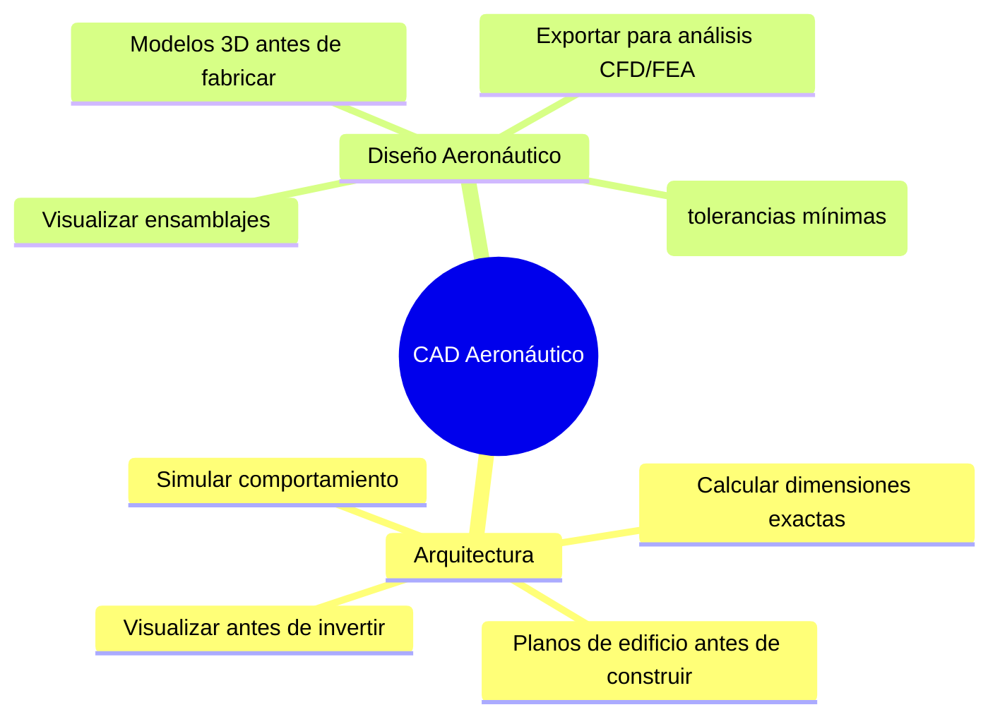
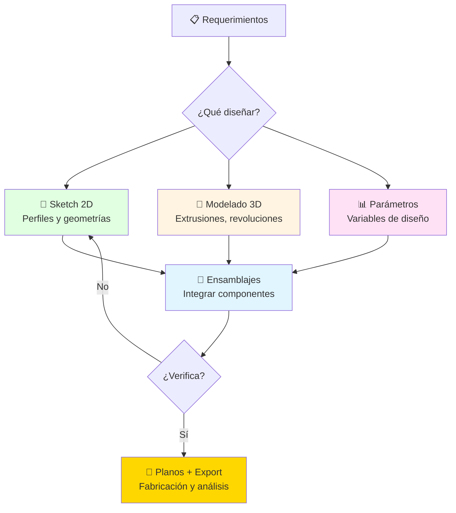
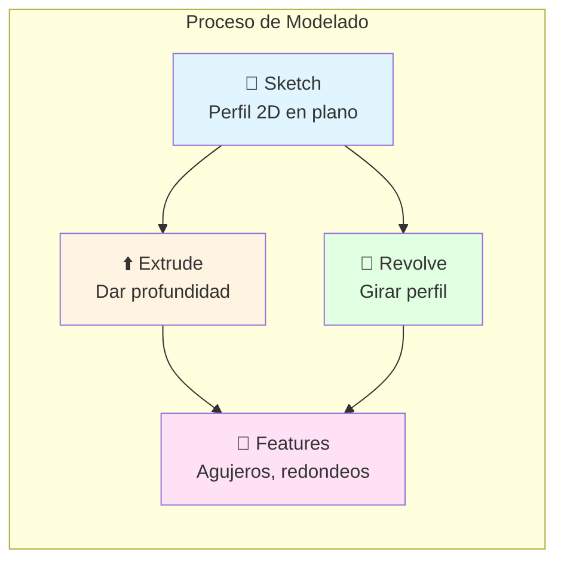
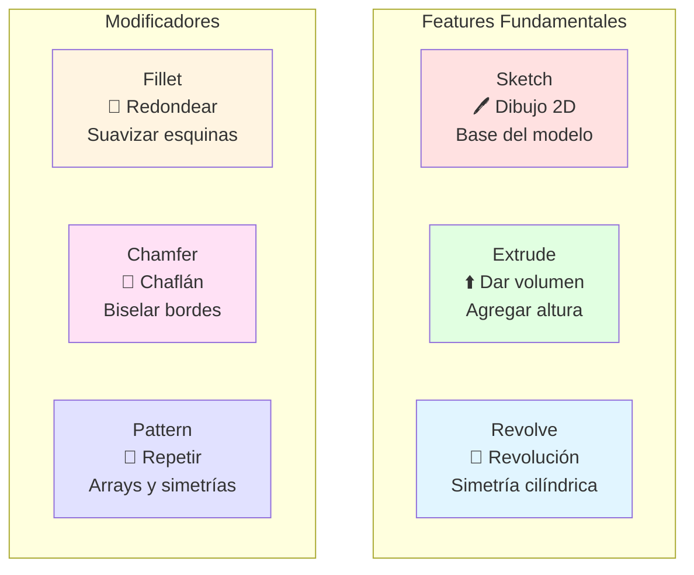
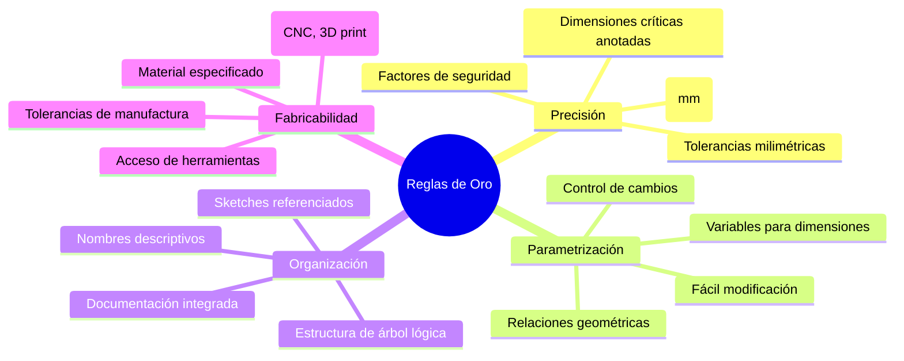
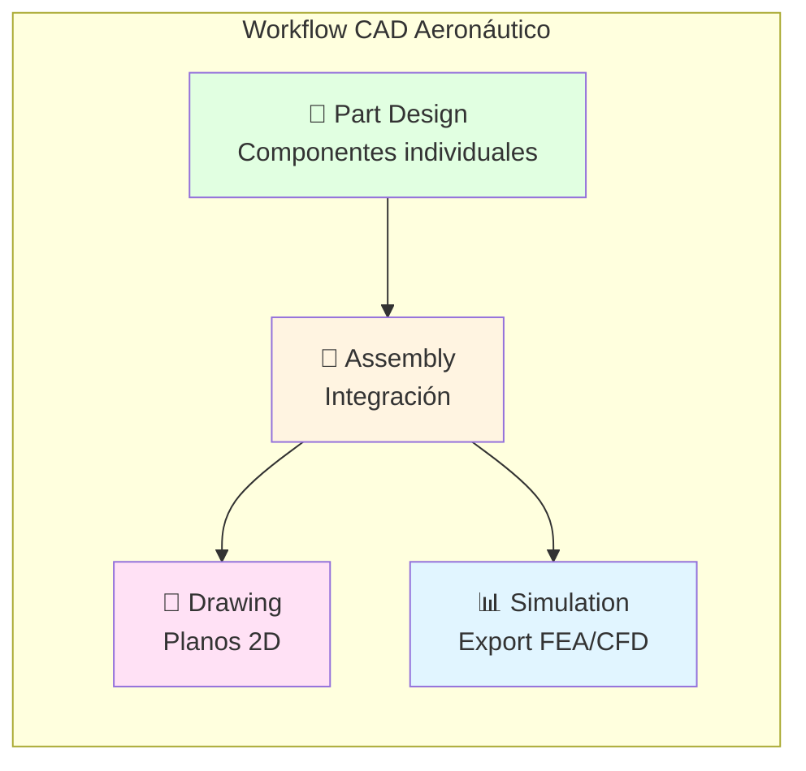
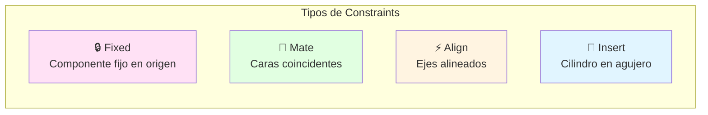
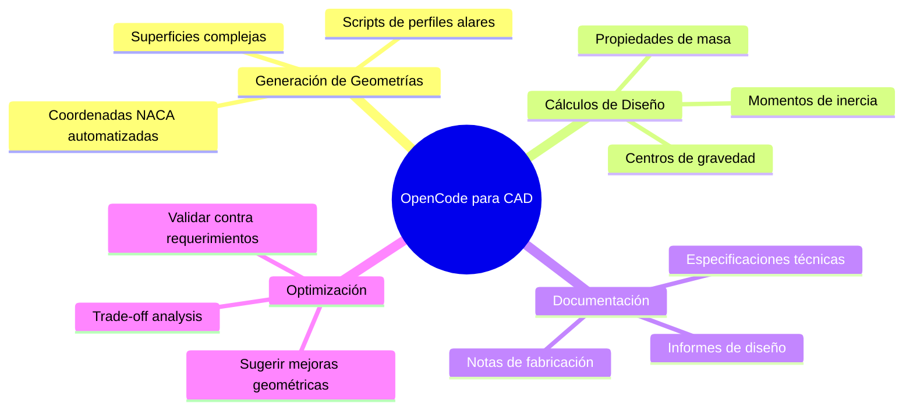
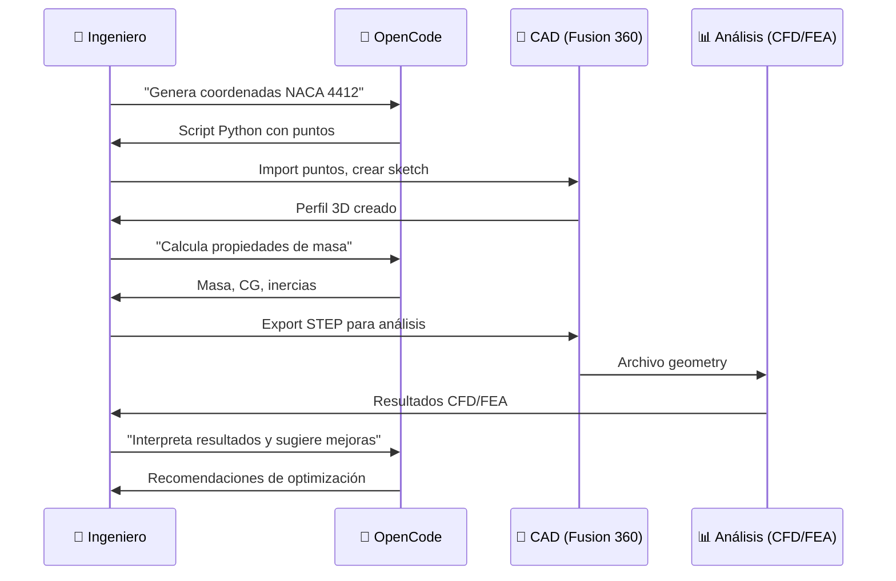
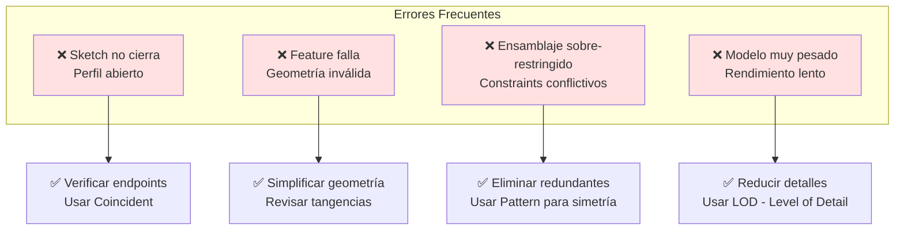

# ✈️ Módulo 01: CAD para Aeronáutica con IA

## Diseña Aeronaves Profesionales con CAD 3D y Asistencia de OpenCode

> **Para Ingenieros Aeronáuticos**: Este módulo te enseña a diseñar componentes aeronáuticos desde el concepto hasta el modelo 3D completo, usando herramientas profesionales como CATIA, Fusion 360, y FreeCAD. Aprenderás modelado paramétrico, ensamblajes complejos, y optimización con OpenCode como asistente técnico.

**⏱️ Duración**: 4 horas  
**👤 Nivel**: Intermedio (con fundamentos de dibujo técnico)  
**🎯 Objetivo**: Dominar diseño CAD aeronáutico con herramientas modernas e IA

---

## 🎓 ¿Qué Vas a Lograr?

1. ✅ **Modelado 3D aeronáutico** - Fuselajes, alas, y componentes profesionales
2. ✅ **Diseño paramétrico** - Geometrías controladas por ecuaciones y variables
3. ✅ **Ensamblajes complejos** - Integrar múltiples piezas con restricciones
4. ✅ **Planos técnicos** - Generar documentación de fabricación automática
5. ✅ **IA para diseño** - OpenCode como asistente de ingeniería aeronáutica

---

## 🤔 ¿Qué es CAD Aeronáutico?

### Analogía: Arquitectura Digital de Aviones



**CAD Aeronáutico** = El "plano digital tridimensional" que define geometría exacta de componentes para fabricación, análisis, y certificación.

### ¿Por Qué es Crítico en Paraguay?

**Realidad del sector aeronáutico local**:
- ✅ **TAM Airlines** - Mantenimiento y modificaciones de aeronaves
- ✅ **Fuerza Aérea Paraguaya** - Diseño de adaptaciones y equipos
- ✅ **Drones agrícolas** - Diseño de UAVs para agro (soja, maíz)
- ✅ **Startups aeroespaciales** - Innovación en drones y sistemas

**Sin CAD profesional** = Diseños imprecisos que no pasan certificación ✈️🚫

---

## 📋 Prerrequisitos

### Conocimientos Requeridos

✅ **Dibujo Técnico Básico** (Fundamental):
- Vistas ortogonales: planta, alzado, perfil
- Acotación y dimensionamiento
- Escalas y tolerancias básicas
- Lectura de planos 2D
- **Verificación**: ¿Puedes interpretar vistas ortogonales de una pieza simple?

✅ **Visualización Espacial 3D** (Fundamental):
- Capacidad de imaginar objetos 3D desde vistas 2D
- Entender rotaciones y orientaciones espaciales
- Coordenadas cartesianas (X, Y, Z)
- **Práctica**: Imaginar cómo se ve un cubo desde diferentes ángulos

✅ **Matemáticas Básicas** (Recomendado):
- Geometría: círculos, ángulos, tangencias
- Trigonometría básica (seno, coseno para ángulos)
- Conversión de unidades (mm ↔ cm ↔ m)

✅ **Computación Básica** (Fundamental):
- Manejo de archivos (guardar, abrir, exportar)
- Navegación de interfaces gráficas
- Instalación de software

❌ **NO Se Requiere**:
- Experiencia previa con software CAD (se enseña desde cero)
- Conocimiento avanzado de geometría descriptiva
- Programación (aunque ayuda para scripts)

### Software Necesario (OBLIGATORIO)

Este módulo requiere instalar **al menos uno** de estos programas CAD:

**Opción 1: Fusion 360** (Recomendado):
- **Costo**: GRATIS para estudiantes (3 años)
- **Requisitos PC**: Windows 10+, 8GB RAM, GPU dedicada (recomendado)
- **Instalación**:
  1. Crear cuenta en [Autodesk Education](https://www.autodesk.com/education/home)
  2. Verificar email con dominio .edu (FPUNA)
  3. Descargar e instalar Fusion 360
  4. Tiempo: ~30 min (descarga 2GB)
- **Por qué**: Industria estándar, integra CAD+CAM+FEA, intuitivo

**Opción 2: FreeCAD** (Open Source):
- **Costo**: GRATIS (open-source)
- **Requisitos PC**: Windows/Linux/Mac, 4GB RAM
- **Instalación**: [freecadweb.org](https://freecadweb.org) → descargar → instalar (10 min)
- **Por qué**: Sin restricciones, funciona en PCs antiguas
- **Advertencia**: Menos intuitivo, curva de aprendizaje más empinada

**Opción 3: OnShape** (CAD en la Nube):
- **Costo**: GRATIS para estudiantes
- **Requisitos PC**: Solo navegador + internet
- **Instalación**: [onshape.com/education](https://onshape.com/education) → crear cuenta
- **Por qué**: No requiere instalación, funciona en cualquier PC
- **Advertencia**: Requiere internet constante

**Para este módulo, usaremos Fusion 360** en los ejemplos, pero los conceptos aplican a cualquier CAD.

### Módulos Previos Necesarios

**Obligatorios**:
- ✅ **00-CORE-FOUNDATION (Semana 1)** - OpenCode y herramientas AI configuradas

**NO requiere módulos técnicos previos** (este ES el primer módulo técnico del track Aero).

**Conexión con módulos siguientes**:
```
CAD (Mod 01) → Crea geometrías 3D
                    ↓
Aerodinámica (Mod 02) → Analiza esas geometrías con CFD
                    ↓
Estructuras (Mod 03) → Valida resistencia con FEA
```

### Auto-Evaluación

Responde estas preguntas para verificar si estás listo:

1. **¿Puedes imaginar cómo se ve un objeto 3D desde diferentes ángulos?**  
   SÍ / NO

2. **¿Entiendes qué es una vista en planta, alzado y perfil?**  
   SÍ / NO

3. **¿Tienes acceso a una PC con 8GB+ RAM (o puedes usar OnShape en la nube)?**  
   SÍ / NO

4. **¿Puedes dedicar 30 min ANTES del módulo para instalar Fusion 360?**  
   SÍ / NO

5. **¿Tienes 4-5 horas para aprender CAD con práctica intensiva?**  
   SÍ / NO

**Interpretación**:
- **4-5 SÍes**: ✅ Listo para comenzar
- **3 SÍes**: ⚠️ Verifica que al menos tengas software instalado (#3 o #4)
- **< 3 SÍes**: ❌ Repasa dibujo técnico básico (Khan Academy tiene videos)

**Recursos de Repaso** (si necesitas):
- [Khan Academy: Geometry](https://www.khanacademy.org/math/geometry)
- [YouTube: Technical Drawing Basics](https://www.youtube.com/results?search_query=technical+drawing+basics)
- Libro: "Dibujo Técnico" - Giesecke (disponible en biblioteca FPUNA)

### Tiempo Estimado Total

- **Instalación software**: 30-60 min (ANTES del módulo)
- **Contenido teórico**: 1.5-2 horas
- **Práctica guiada**: 2-3 horas
- **Proyecto personal**: 4-6 horas adicionales (opcional)

**Total**: 4-12 horas (depende de práctica)

### Checklist Final

Antes de comenzar, verifica:

- [ ] He completado CORE-FOUNDATION (Semana 1)
- [ ] Tengo Fusion 360, FreeCAD, u OnShape instalado/configurado
- [ ] He abierto el software al menos una vez (verifica que funciona)
- [ ] Entiendo conceptos básicos de dibujo técnico
- [ ] Tengo 4+ horas disponibles para el módulo
- [ ] (Opcional) He visto algún tutorial de introducción a CAD en YouTube

**Si marcaste los primeros 5**: ¡Adelante! 🚀

**Si no tienes software instalado**: ⚠️ DETENTE - instala primero (30-60 min). El módulo asume que ya tienes el software funcionando.

---

## 📊 El Flujo de Diseño CAD Aeronáutico



**Analogía local**: Como diseñar el hangar de mantenimiento del Aeropuerto Silvio Pettirossi - necesitas planos precisos antes de construir estructuras metálicas.

---

## 🏢 Parte 1: Fundamentos de CAD 3D (60 min)

### Concepto: Del Boceto a la Pieza 3D

**Analogía**: Como esculpir una pieza - empiezas con arcilla (sketch) y vas formando volúmenes (features).



### Operaciones Básicas de CAD



### Ejemplo Real: Perfil Alar NACA 0012

**Requerimiento**: Modelar un perfil alar simétrico NACA 0012 para análisis CFD.

**Diseño conceptual**:
```
NACA 0012:
- 0 = simétrico (sin curvatura)
- 12 = espesor máximo 12% de la cuerda
- Cuerda (c) = 1000mm
- Espesor máximo = 120mm a 30% de c
```

**Pasos de modelado**:
```
1. Crear nuevo part → Sketch en plano XY
2. Usar ecuación NACA:
   y = (t/0.2) × c × [0.2969√(x/c) - 0.1260(x/c) - 0.3516(x/c)² + 0.2843(x/c)³ - 0.1015(x/c)⁴]
   Donde t = 0.12 (espesor)
3. Simetría respecto al eje X
4. Extrude 2000mm (envergadura del ala)
5. Export como STEP para CFD
```

**Cálculos necesarios**:
1. **Coordenadas del perfil**: Tabla de 100 puntos (x,y)
2. **Área de sección**: A ≈ 0.092 c² = 92,000 mm²
3. **Centro de presión**: Aproximadamente 25% de c desde borde de ataque
4. **Relación aspecto**: AR = envergadura² / área_alar

### Implementación con OpenCode

```bash
opencode "Genera script Python para calcular coordenadas de perfil NACA 0012:

ESPECIFICACIONES:
- Perfil: NACA 0012 (simétrico, 12% espesor)
- Cuerda: 1000mm
- Número de puntos: 100 (distribuidos coseno para mayor densidad en bordes)
- Ecuación NACA estándar
- Output: CSV con columnas (x, y_superior, y_inferior)

INCLUIR EN EL SCRIPT:
1. Función naca_airfoil(naca_code, chord, n_points)
2. Distribución de puntos con espaciado coseno
3. Cálculo de coordenadas superiores e inferiores
4. Export a CSV listo para importar en CAD
5. Plot matplotlib para verificar forma
6. Comentarios explicando cada paso

VALIDACIONES:
- Verificar que espesor máximo sea 12% en x/c ≈ 0.3
- Borde de ataque cerrado (tolerancia < 0.01mm)
- Borde de salida con espesor finito
- Curva suave sin discontinuidades

Output en español con contexto de diseño aeronáutico paraguayo"
```

### Reglas de Diseño CAD Aeronáutico



### Sistemas de Coordenadas en Aeronáutica

**Convención estándar**:
```
X-axis: Longitudinal (nariz → cola)
Y-axis: Lateral (ala izquierda → ala derecha)
Z-axis: Vertical (arriba)

Origen: Típicamente en nariz o CG (centro de gravedad)
```

**En CAD**:
- Usar planos de referencia alineados con ejes principales
- Simetría en plano XZ (bilateral)
- Planos de sección transversal perpendiculares a X

---

**🎯 Transición**: Ahora que dominas los conceptos fundamentales de CAD (sketch, extrude, revolve, constraints), es momento de aplicarlos en **software profesional real** usado por la industria aeronáutica. En la Parte 1 aprendiste QUÉ operaciones existen; en esta parte aprenderás CÓMO ejecutarlas en Fusion 360 y CATIA, las herramientas que usarás en tu carrera profesional. Modelarás componentes aeronáuticos reales: perfiles NACA, fuselajes, y alas completas.

## 🔬 Parte 2: CATIA/Fusion 360 - Modelado Aeronáutico (90 min)

### Concepto: Herramientas Profesionales de Diseño

**CATIA** = El "estándar de oro" en aeroespacial (Airbus, Boeing)  
**Fusion 360** = Alternativa accesible y potente (gratuita para estudiantes)



### Tutorial Paso a Paso: Fuselaje de UAV

**Objetivo**: Diseñar fuselaje de UAV agrícola para monitoreo de cultivos en Paraguay.

#### Paso 1: Requerimientos de Diseño

**Especificaciones funcionales**:
```
Longitud total: 1200mm
Diámetro máximo: 200mm
Carga útil: Cámara 500g en bahía central
Material: Fibra de carbono (espesor 3mm)
Peso objetivo: < 800g
```

**Forma aerodinámica**:
- Nariz cónica (reducir drag)
- Sección central cilíndrica (bahía de carga)
- Cola ahusada (estabilidad)

#### Paso 2: Modelado del Fuselaje en Fusion 360

**2.1. Crear Perfil Lateral**

```
Sketch en plano XZ:
1. Línea de referencia (eje longitudinal)
2. Curva de la nariz (spline)
   - Punto inicial: (0, 0)
   - Radio máximo: (300, 100) [300mm desde nariz, radio 100mm]
3. Sección cilíndrica:
   - Longitud: 600mm (bahía de carga)
   - Radio constante: 100mm
4. Sección de cola (ahusada):
   - Longitud: 300mm
   - Radio final: 40mm (montaje motor)
5. Cerrar perfil
```

**2.2. Crear Volumen (Revolve)**

```
Revolve:
- Seleccionar perfil
- Eje de revolución: línea de referencia
- Ángulo: 360°
- Operación: New Body
```

**2.3. Crear Cavidad Interior (Shell)**

```
Shell:
- Seleccionar caras nariz y cola
- Espesor: 3mm
- Dirección: Interior
- Resultado: Fuselaje hueco
```

**2.4. Bahía de Carga (Corte)**

```
Sketch en plano XY (vista superior):
1. Rectángulo: 200mm × 150mm
   Centrado en sección cilíndrica
2. Redondear esquinas: r=10mm

Extrude Cut:
- Profundidad: atravesar fuselaje (Through All)
- Crear tapa desmontable (sketch separado)
```

#### Paso 3: Componentes Adicionales

**3.1. Montajes de Ala**

```
Sketch en superficie fuselaje:
- 2 círculos (diámetro 50mm) a 400mm desde nariz
- Separación vertical: 20mm
- Extrude Boss: 10mm (hacia afuera)
- Hole: diámetro 8mm para tornillos M8
```

**3.2. Montaje de Motor**

```
En cola (radio 40mm):
- Sketch: Patrón circular de 4 agujeros
  Diámetro tornillos: 3mm
  Circle diameter: 30mm
- Extrude Cut: 5mm profundidad
```

#### Paso 4: Análisis y Validación

**Propiedades de masa (Fusion 360)**:
```
Tools → Inspect → Properties
Material: Carbon Fiber Composite (ρ = 1600 kg/m³)

Resultados esperados:
- Masa: ~750g ✓
- Volumen interior: ~4 litros
- Centro de gravedad: x ≈ 500mm
```

**Export para análisis**:
```
File → Export:
- STEP (.stp) → Para FEA estructural
- STL (.stl) → Para impresión 3D de moldes
- IGES (.igs) → Para CFD
```

### Diseño Paramétrico Avanzado

**Ventaja**: Cambiar dimensiones globalmente con variables.

**Ejemplo en Fusion 360**:
```
Modify → Change Parameters:

Nombre          Valor     Unidad   Expresión
------------------------------------------
fuselage_length  1200     mm       -
max_diameter     200      mm       -
nose_length      300      mm       fuselage_length * 0.25
payload_length   600      mm       fuselage_length * 0.5
tail_length      300      mm       fuselage_length * 0.25
wall_thickness   3        mm       -

Usar parámetros en sketches:
- En vez de "1200mm" → usar "fuselage_length"
- Modificar UNA variable actualiza TODO el modelo
```

### Implementación con OpenCode

```bash
opencode "Genera guía detallada para diseñar ala de UAV en Fusion 360:

ESPECIFICACIONES DEL ALA:
- Perfil alar: NACA 4412 (sustentación positiva)
- Envergadura: 2000mm
- Cuerda en raíz: 300mm
- Cuerda en punta: 200mm (taper ratio 0.67)
- Diedro: 3° (estabilidad lateral)
- Torsión (washout): -2° en punta (stall progresivo)

PASOS DETALLADOS:
1. Crear sketch del perfil NACA 4412:
   - Importar coordenadas desde CSV
   - Escalar a cuerda raíz (300mm)
   - Cerrar borde de salida
2. Loft entre perfiles raíz y punta:
   - Perfil raíz: NACA 4412 @ 300mm cuerda
   - Perfil punta: NACA 4412 @ 200mm cuerda, rotado -2°
   - Guía: línea con diedro 3°
3. Crear larguero estructural (spar):
   - Posición: 25% de cuerda
   - Sección: rectangular 10mm × 20mm
   - Material: Fibra de carbono
4. Costillas (ribs):
   - Cantidad: 10 (espaciadas 200mm)
   - Espesor: 2mm
   - Patrón: Along path (spar)
5. Puntos de montaje fuselaje:
   - Insertos metálicos M6
   - Posición: 300mm desde centro (cada lado)

INCLUIR:
- Capturas de pantalla descritas
- Parámetros para diseño paramétrico
- Cálculos de peso estructural
- Export para CFD (superficies externas)
- Notas de fabricación (moldes, laminado)

Todo en español con contexto de UAV agrícola paraguayo"
```

---

**🎯 Transición**: Has modelado piezas individuales (perfiles alares, fuselajes, costillas), pero una aeronave NO es una sola pieza—es un **ensamblaje** de cientos o miles de componentes que deben encajar perfectamente. Un ala está compuesta de larguero + costillas + revestimiento + herrajes, y todos deben alinearse con tolerancias milimétricas. En esta parte, aprenderás a integrar múltiples piezas en ensamblajes complejos usando mates/constraints, la habilidad esencial para proyectos aeronáuticos reales.

## 🌐 Parte 3: Ensamblajes y Constraints (60 min)

### Concepto: Integrar Múltiples Piezas

**Ensamblaje** = Reunir componentes individuales con relaciones espaciales definidas.



### Tutorial: Ensamblar UAV Completo

**Componentes**:
1. Fuselaje (diseñado anteriormente)
2. Alas (derecha e izquierda)
3. Empenaje horizontal (estabilizador)
4. Empenaje vertical (timón)
5. Motor + hélice
6. Tren de aterrizaje

**Secuencia de ensamblaje**:

```
Assembly → Nuevo ensamblaje:

1. Insertar fuselaje:
   - Constraint: Fixed (origen en nariz)
   
2. Insertar ala derecha:
   - Mate: Superficie montaje ala → superficie fuselaje
   - Align: Larguero ala → eje longitudinal fuselaje
   - Offset: +20mm vertical (diedro 3°)
   
3. Insertar ala izquierda:
   - Mirror: Simetría respecto plano XZ
   
4. Empenaje horizontal:
   - Mate: Superficie montaje → cola fuselaje
   - Align: Eje empenaje → eje longitudinal
   - Distance: 1000mm desde nariz
   
5. Empenaje vertical:
   - Mate: Centro empenaje → eje longitudinal
   - Align: Eje vertical → eje Z
   
6. Motor:
   - Insert: Eje motor → agujero patrón circular cola
   - Rotate: Alinear tornillos con agujeros

7. Hélice:
   - Coaxial: Eje hélice → eje motor
   - Offset: 50mm desde motor (clearance)
```

### Análisis de Interferencias

**Verificar colisiones**:
```
Fusion 360:
Inspect → Interference:
- Seleccionar todos los componentes
- Compute
- Resultado esperado: 0 interferencias

Si hay interferencias:
- Ajustar offsets
- Redimensionar componentes
- Verificar tolerancias
```

### Centro de Gravedad del Ensamblaje

**Crítico para estabilidad de vuelo**:
```
Inspect → Center of Mass:

Objetivo: CG entre 25%-30% de cuerda media aerodinámica

Si CG está mal ubicado:
- Reubicar batería (componente más pesado)
- Agregar lastre en nariz/cola
- Rediseñar distribución de componentes
```

### Implementación con OpenCode

```bash
opencode "Analiza distribución de pesos de UAV y calcula CG óptimo:

COMPONENTES Y MASAS:
1. Fuselaje fibra carbono: 750g
2. Alas (par): 600g
3. Empenajes: 150g
4. Motor eléctrico: 250g
5. Hélice: 50g
6. Batería LiPo 4S 5000mAh: 550g
7. Cámara + gimbal: 500g
8. Electrónica (FC, ESC, RX): 200g
9. Servos (4×): 160g

POSICIONES (desde nariz):
- Fuselaje: CG propio en 500mm
- Alas: 400mm
- Empenajes: 950mm
- Motor: 1150mm
- Batería: ??? (calcular posición óptima)
- Cámara: 450mm

OBJETIVO:
Calcular posición de batería para que CG total esté en 30% de cuerda media.
Cuerda media aerodinámica (MAC) = 250mm
Posición 30% MAC: 400mm desde nariz

INCLUIR:
1. Tabla de componentes con (masa, posición, momento)
2. Cálculo de CG actual sin batería
3. Cálculo de posición óptima de batería
4. Verificación con batería ubicada
5. Margen de ajuste (si batería se descarga)
6. Diagrama visual de distribución
7. Recomendaciones de ajuste

Todo en español con contexto de diseño aeronáutico"
```

---

**🎯 Transición**: Dominas CAD manualmente—puedes modelar piezas, crear ensamblajes, generar planos. Pero en proyectos aeronáuticos reales, te enfrentarás a tareas **repetitivas y tediosas**: crear 50 variantes de un perfil alar, documentar cada pieza, generar reportes de masa. Aquí es donde **OpenCode se convierte en tu superpoder**: puede automatizar tareas que te tomarían días en minutos, generar código CAD automáticamente, y hasta optimizar diseños iterativamente. En esta parte final, aprenderás a acelerar tu flujo de trabajo CAD 10× con IA.

## 💻 Parte 4: OpenCode para Diseño CAD (30 min)

### Casos de Uso de IA en Diseño Aeronáutico



### Prompt Engineering para CAD Aeronáutico

#### Generación de Scripts CAD

```bash
opencode "Genera script Python para Fusion 360 API que cree perfil NACA paramétrico:

FUNCIONALIDAD:
- Input: Código NACA (ej: "2412"), cuerda, num_puntos
- Output: Sketch en Fusion 360 con spline del perfil

CÓDIGO ESPERADO:
1. Importar Fusion 360 API
2. Función calculate_naca_coordinates(naca, chord, n_points)
3. Crear sketch en plano XY
4. Dibujar spline con puntos calculados
5. Cerrar perfil (conectar trailing edge)

VALIDACIONES:
- Verificar código NACA válido (4 dígitos)
- Cuerda > 0
- Puntos ≥ 50 (resolución mínima)

INCLUIR:
- Comentarios explicativos
- Manejo de errores
- Ejemplo de uso
- Documentación de parámetros

Output en español para estudiantes FPUNA"
```

#### Análisis de Diseño

```bash
opencode "Analiza diseño de larguero de ala y verifica factor de seguridad:

DISEÑO ACTUAL:
- Material: Fibra de carbono (E=70 GPa, σ_yield=600 MPa, ρ=1600 kg/m³)
- Sección: Rectangular 15mm × 25mm
- Longitud: 1000mm (mitad de envergadura)
- Empotrado en fuselaje, carga distribuida en punta

CARGAS:
- Peso del ala: 300g distribuido
- Carga aerodinámica máxima: L = 2× peso total UAV = 6 kg
- Distribución: Elíptica (máximo en raíz)
- Factor de carga: n = 3.5 (maniobras)

ANÁLISIS REQUERIDO:
1. Diagrama de cuerpo libre
2. Diagrama de momento flector
3. Esfuerzo máximo (flexión)
   σ = M × c / I
   Donde:
   M = momento máximo
   c = distancia a fibra extrema
   I = momento de inercia de sección
4. Factor de seguridad: FS = σ_yield / σ_max
5. Deflexión máxima en punta
6. Crítica de Euler (pandeo)

OBJETIVO:
FS ≥ 1.5 (típico en aviación)

INCLUIR:
- Cálculos paso a paso
- Resultado: ¿Diseño OK o necesita refuerzo?
- Sugerencias de mejora si FS < 1.5
- Comparación con sección en I (más eficiente)

Todo en español con estándares aeronáuticos"
```

#### Documentación Técnica Automatizada

```bash
opencode "Genera ficha técnica completa del UAV diseñado:

COMPONENTES DEL UAV:
[describir fuselaje, alas, empenajes, motor]

GENERAR DOCUMENTO:
1. Especificaciones Generales:
   - Dimensiones principales (LOA, envergadura, altura)
   - Pesos (vacío, máximo despegue, útil)
   - Velocidades (crucero, máxima, stall)
   - Autonomía y alcance
2. Configuración Aerodinámica:
   - Perfiles alares (raíz, punta)
   - Área alar, relación de aspecto
   - Cargas alares
   - Coeficientes aerodinámicos estimados
3. Propulsión:
   - Motor (marca, modelo, KV)
   - Hélice (diámetro × paso)
   - Batería (tipo, capacidad, C-rating)
   - Empuje estático y performance
4. Estructura:
   - Materiales principales
   - Factores de seguridad
   - Métodos de construcción
5. Sistemas:
   - Control (FC, servos)
   - Cámara y payload
   - Telemetría
6. Performance Estimado:
   - Velocidades de vuelo
   - Autonomía (minutos)
   - Alcance (km)
   - Techo operacional
7. Diagramas:
   - Vista 3 vistas (planta, perfil, frontal)
   - Distribución de componentes
   - Centro de gravedad

FORMATO:
- Documento PDF-ready Markdown
- Tablas bien formateadas
- Unidades consistentes (SI + conversiones)
- Referencias a cálculos detallados

Contexto: Presentación a DINAC para certificación experimental"
```

### Integración con Workflow de Diseño



**Ventaja**: OpenCode actúa como **ingeniero senior** que revisa diseños y sugiere optimizaciones basadas en principios aeronáuticos.

---

## 🎯 Ejercicio Práctico: Diseño de Empenaje Vertical

### Objetivo

Diseñar empenaje vertical (timón de dirección) para el UAV agrícola.

### Especificaciones

**Requerimientos funcionales**:
- Área del timón: 0.15 m² (15% del área alar)
- Perfil: NACA 0012 (simétrico)
- Cuerda en raíz: 250mm
- Cuerda en punta: 150mm
- Altura: 400mm
- Flecha (sweep): 20° (estabilidad direccional)

**Material**: Espuma EPP + fibra de vidrio (peso <100g)

### Diseño Paso a Paso

#### 1. Crear Perfil NACA 0012

```
Sketch en plano XZ:
1. Importar coordenadas NACA 0012 (usar script OpenCode)
2. Escalar a cuerda raíz = 250mm
3. Cerrar borde de salida
```

#### 2. Crear Geometría con Taper y Sweep

```
Loft:
- Perfil raíz: NACA 0012 @ 250mm en origen
- Perfil punta: NACA 0012 @ 150mm
  Posición: (altura = 400mm, offset X = 400×tan(20°) = 146mm)
- Guía: Línea recta conectando bordes de ataque
```

#### 3. Agregar Bisagra de Control

```
Sketch en superficie timón:
- Línea @ 70% de cuerda (línea de bisagra)
- Split body: Separar superficie de control móvil

Componentes resultantes:
1. Estabilizador fijo (30% cuerda)
2. Timón móvil (70% cuerda, rango ±30°)
```

#### 4. Implementar con OpenCode

```bash
opencode "Diseña sistema de actuación para timón de dirección del UAV:

ESPECIFICACIONES:
- Superficie de control: 70% del empenaje vertical
- Deflexión requerida: ±30°
- Carga aerodinámica máxima: 5 N @ 60 km/h
- Velocidad de actuación: 60°/seg (0.5 seg para full deflection)

COMPONENTES A SELECCIONAR:
1. Servo:
   - Torque mínimo requerido (calcular con brazo de palanca)
   - Velocidad adecuada
   - Voltaje: 6V (BEC del ESC)
   - Ejemplos: TowerPro MG90S, Futaba S3003
2. Linkage:
   - Brazo servo: 20mm
   - Varilla pushrod: Diámetro y material
   - Horn del timón: Posición y brazo
3. Bisagra:
   - Tipo: Mylar tape o bisagra CA (cianoacrilato)
   - Posición: 70% de cuerda
   - Cantidad de puntos: 3 (distribuidos en altura)

CÁLCULOS:
1. Momento aerodinámico en timón:
   M = q × S × c × Cm
   Donde:
   q = presión dinámica = 0.5 × ρ × V²
   S = área del timón
   c = cuerda media
   Cm = coeficiente de momento (≈ 0.3 para ±30°)
2. Torque requerido en servo (con factor seguridad 2×)
3. Deflexión angular vs posición servo (geometría linkage)

INCLUIR:
- Diagrama del mecanismo
- Tabla de componentes con proveedores Paraguay
- Cálculos de verificación
- Instrucciones de instalación
- Ajustes y pruebas en tierra

Todo en español con contexto de construcción amateur"
```

---

## 🔧 Troubleshooting de Diseño CAD

### Problemas Comunes y Soluciones



#### Caso 1: Loft Falla Entre Perfiles

**Síntoma**: Al hacer loft entre perfil raíz y punta, Fusion 360 da error "Failed to compute".

**Diagnóstico con OpenCode**:
```bash
opencode "El loft entre mi perfil alar raíz y punta falla en Fusion 360:

DETALLES:
- Perfil raíz: NACA 4412 @ 300mm cuerda (100 puntos)
- Perfil punta: NACA 4412 @ 200mm cuerda, rotado -2° (100 puntos)
- Distancia: 1000mm
- Error: "Failed to compute loft"

POSIBLES CAUSAS:
1. Número de puntos diferente
2. Orden de puntos invertido
3. Puntos de inicio no alineados
4. Twist excesivo
5. Guía de loft faltante

SOLICITO:
1. Diagnóstico del problema más probable
2. Cómo verificar cada causa en Fusion 360
3. Solución paso a paso
4. Alternativas si loft no funciona:
   - Usar sweep en vez de loft
   - Dividir en secciones múltiples
   - Simplificar perfiles

Contexto: Diseño de ala para UAV, necesito exportar a CFD"
```

**Solución típica**:
```
Causa probable: Puntos de inicio desalineados

Fix:
1. Edit sketch perfil punta
2. Seleccionar punto inicial (borde de ataque)
3. Verify → Sketch Point Priority
4. Re-loft con ambos perfiles starting en mismo punto relativo
5. Agregar rail guide (línea de borde de ataque) para controlar twist

Alternativa:
Usar Ruled Surface en vez de Loft (más predecible)
```

#### Caso 2: Ensamblaje No Se Mueve Correctamente

**Síntoma**: Al simular movimiento de superficies de control, el servo y linkage no siguen correctamente.

**Checklist de depuración**:
- [ ] ¿Joint correctamente definido entre servo horn y varilla?
- [ ] ¿Bisagra del timón tiene revolute joint?
- [ ] ¿Hay límites angulares configurados (±30°)?
- [ ] ¿Contact sets evitan interpenetraciones?
- [ ] ¿Todos los componentes están grounded excepto móviles?

**Solución con OpenCode**:
```bash
opencode "Configura joints y motion study para sistema de control en Fusion 360:

COMPONENTES:
1. Fuselaje (fixed)
2. Timón (movible, bisagra @ 70% cuerda)
3. Servo (fixed en fuselaje)
4. Servo horn (gira con servo)
5. Pushrod (conecta servo horn a timón horn)
6. Timón horn (fijo en timón)

OBJETIVO:
Simular que al rotar servo ±60°, el timón deflecte ±30°

JOINTS NECESARIOS:
1. Timón-Fuselaje: Revolute (eje de bisagra)
2. Servo horn-Servo: Revolute (eje servo)
3. Pushrod-Servo horn: Spherical (rótula)
4. Pushrod-Timón horn: Spherical (rótula)

MOTION STUDY:
- Tipo: Joint-based
- Driver: Revolute joint servo horn
- Input: Rotación -60° a +60° en 2 seg
- Output: Ángulo timón vs tiempo

INCLUIR:
- Setup de cada joint con capturas
- Cómo ejecutar motion study
- Cómo graficar resultados
- Verificar que linkage no se atasca (binding)
- Export animación para presentación

Contexto: Validar mecanismo antes de construir prototipo"
```

---

## ✅ Checklist de Verificación de Diseño CAD

Antes de exportar para análisis o fabricación:

### Geometría del Modelo
- [ ] Todos los sketches están completamente definidos (negro, no azul)
- [ ] No hay features con errores (⚠️ amarillo)
- [ ] Superficies cerradas (no hay gaps)
- [ ] Dimensiones críticas verificadas con measure tool
- [ ] Espesor de paredes ≥ mínimo fabricable (ej: 2mm para impresión 3D)

### Parámetros y Variables
- [ ] Variables nombradas descriptivamente
- [ ] Relaciones paramétricas funcionan al cambiar valores
- [ ] Unidades consistentes (todo en mm)
- [ ] Tolerancias anotadas donde crítico

### Ensamblajes
- [ ] Todos los componentes tienen constraints apropiados
- [ ] Cero interferencias (Inspect → Interference)
- [ ] Centro de gravedad en posición correcta
- [ ] Componentes móviles se mueven sin atascos
- [ ] Bill of materials generado y revisado

### Fabricabilidad
- [ ] Acceso de herramientas considerado (taladros, fresas)
- [ ] Radios mínimos respetados (ej: fresa Ø3mm → r≥1.5mm)
- [ ] Material especificado
- [ ] Proceso de fabricación definido (CNC, 3D print, laminado)

### Documentación
- [ ] Modelo nombrado descriptivamente
- [ ] Notas de diseño en model (Design Notes)
- [ ] Planos 2D generados si necesario
- [ ] Files exportados (STEP, STL, IGES)

---

## 🎓 Mejores Prácticas CAD Aeronáutico

### ✅ HACER

1. **Diseño paramétrico desde inicio** - Variables para dimensiones principales
2. **Usar planos de referencia** - Estructura lógica de sketches
3. **Nombres descriptivos** - "wing_root_airfoil" no "sketch12"
4. **Documentar decisiones** - Por qué elegiste ese perfil, ese material
5. **Diseño modular** - Componentes intercambiables, reutilizables
6. **Simetría inteligente** - Mirror para alas, empenajes (ahorra tiempo)
7. **Export múltiples formatos** - STEP (universal), STL (impresión), IGES (CFD)
8. **Versionado** - Save as con números de versión (UAV_v1.0, v1.1...)

### ❌ NO HACER

1. **Sobre-detallar** - No modelar tornillos M3 en modelo completo (usar simplificados)
2. **Ignorar fabricabilidad** - Diseñar geometrías imposibles de fabricar
3. **Sketchs complejos** - Dividir en sketches simples referenciados
4. **Features no paramétricas** - Usar dimensiones fijas sin variables
5. **Diseño sin referencias** - Basarse en estándares aeronáuticos (NACA, etc.)
6. **No validar** - Siempre hacer mass properties, interference check
7. **Unidades mezcladas** - Consistencia: todo en mm o todo en inches

---

## 🎉 Resumen del Módulo

### Lo Que Dominaste

✅ **CAD 3D aeronáutico** - Modelado de componentes complejos  
✅ **Diseño paramétrico** - Control total con variables  
✅ **Ensamblajes** - Integración de sistemas completos  
✅ **Perfiles NACA** - Generación y aplicación de airfoils  
✅ **Análisis básico** - Propiedades de masa, CG, interferencias  
✅ **OpenCode para CAD** - Asistente de ingeniería con IA

### Próximo Paso

**Continúa con**: [Módulo 02 - Aerodinámica y CFD](./02-aerodinamica-cfd.md)

Llevarás tus diseños CAD a simulación aerodinámica para optimizar performance.

---

## 💭 Reflexión

1. **¿Cómo el diseño paramétrico acelera iteraciones de diseño?**
2. **¿Qué diferencia hay entre CAD para aeronáutica vs. CAD mecánico general?**
3. **¿Cómo OpenCode puede ayudarte a aprender CATIA más rápido?**

**Comparte en Slack** (#ingenieria-aeronautica)

---

## 📝 Quiz de Evaluación

### Instrucciones

- **Total**: 10 preguntas
- **Tiempo estimado**: 20-25 minutos
- **Aprobación**: 7+ respuestas correctas
- **Propósito**: Verificar comprensión de CAD, modelado 3D, y diseño aeronáutico

**Nota**: Quiz conceptual - no requiere software abierto.

---

### Preguntas

#### 1. Operaciones CAD Básicas (Múltiple Opción)

¿Cuál operación CAD usarías para crear un fuselaje cilíndrico a partir de un círculo 2D?

a) Extrude  
b) Revolve  
c) Loft  
d) Sweep

---

#### 2. Diseño Paramétrico (Verdadero/Falso)

**Afirmación**: "En diseño paramétrico, cambiar una variable (ej: longitud del ala) actualiza automáticamente todas las geometrías dependientes."

a) Verdadero  
b) Falso

---

#### 3. Planos de Referencia (Múltiple Opción)

En CAD 3D, los planos de referencia principales son:

a) XY, XZ, YZ  
b) Planta, Alzado, Perfil  
c) Top, Front, Right  
d) Todas las anteriores son correctas (diferentes nombres para lo mismo)

---

#### 4. Restricciones de Sketch (Múltiple Opción)

¿Cuál restricción usarías para garantizar que dos líneas en un sketch permanezcan perpendiculares?

a) Coincident (coincidente)  
b) Parallel (paralela)  
c) Perpendicular  
d) Tangent (tangente)

---

#### 5. Ensamblajes (Múltiple Opción)

En un ensamblaje de un ala con fuselaje, ¿cuál mate/constraint es más apropiado para unirlos?

a) Fixed (fijo) - no permite movimiento  
b) Revolute (revolución) - permite rotación en un eje  
c) Planar (planar) - superficies coplanares  
d) Cylindrical (cilíndrico) - rotación + deslizamiento

---

#### 6. Tolerancias (Verdadero/Falso)

**Afirmación**: "En fabricación aeronáutica, las tolerancias son generalmente MÁS ESTRICTAS que en fabricación automotriz."

a) Verdadero  
b) Falso

---

#### 7. Modelado de Perfil Alar (Respuesta Corta)

Un perfil alar NACA 2412 significa:
- Primer dígito (2): _______ máxima = ___ % de la cuerda
- Segundo dígito (4): Posición = ___ % de la cuerda
- Últimos dos dígitos (12): _______ máximo = ___ % de la cuerda

Completa los espacios:
1. Primer dígito: **Curvatura / Camber / Flecha** (elige una)
2. Último par: **Espesor / Grosor / Thickness** (elige una)

---

#### 8. Exportación CAD (Múltiple Opción)

Para exportar un modelo CAD a software de análisis CFD (como ANSYS Fluent), el formato más común es:

a) .dwg (AutoCAD)  
b) .stl (malla de triángulos)  
c) .step (geometría precisa)  
d) .pdf (planos 2D)

---

#### 9. Features vs Bodies (Múltiple Opción)

¿Cuál afirmación es CORRECTA sobre features (operaciones) en CAD?

a) Features son irreversibles una vez creados  
b) Features se ejecutan en orden secuencial (feature tree)  
c) Features solo pueden ser extrusiones  
d) Features no afectan dimensiones paramétricas

---

#### 10. OpenCode para CAD (Respuesta Corta)

Menciona **2 tareas específicas** en las que OpenCode puede ayudar en diseño CAD aeronáutico.

**Ejemplo válido**: "Generar scripts de Fusion 360 API para crear perfiles NACA automáticamente"

**Tus respuestas**:
1. _______________________________________
2. _______________________________________

---

## 📋 Respuestas y Explicaciones

### 1. Operaciones CAD para Fuselaje
**Respuesta correcta**: **b) Revolve**

**Explicación**:
- **Revolve**: Gira un perfil 2D alrededor de un eje → perfecto para fuselajes cilíndricos
- **Extrude**: Empuja un perfil 2D linealmente → para alas, vigas
- **Loft**: Interpola entre múltiples perfiles → para formas complejas (nose cone)
- **Sweep**: Sigue un perfil a lo largo de una trayectoria → para tubos curvos

**Ejemplo fuselaje**:
```
1. Sketch: Círculo de radio 600mm en plano YZ
2. Revolve: Girar 360° alrededor del eje Z
3. Resultado: Cilindro (fuselaje básico)
```

---

### 2. Diseño Paramétrico
**Respuesta correcta**: **a) Verdadero**

**Explicación**:
El diseño paramétrico es la característica clave de CAD moderno:

**Ejemplo**:
```
Variable: ala_longitud = 3000 mm

Geometrías dependientes:
- Envergadura = 2 × ala_longitud = 6000 mm
- Costillas separadas cada 300 mm → cantidad = ala_longitud / 300 = 10 costillas
- Larguero longitud = ala_longitud - 100 mm (margen) = 2900 mm

Cambio: ala_longitud = 3500 mm
→ TODO se actualiza automáticamente:
  - Envergadura = 7000 mm
  - Costillas = 12
  - Larguero = 3400 mm
```

**Ventaja**: Diseño iterativo rápido. Puedes probar 10 variantes en minutos.

---

### 3. Planos de Referencia
**Respuesta correcta**: **d) Todas las anteriores son correctas (diferentes nombres para lo mismo)**

**Explicación**:

| Matemático | Dibujo Técnico | CAD (inglés) | Descripción |
|------------|----------------|--------------|-------------|
| XY | Planta | Top | Vista desde arriba |
| XZ | Alzado | Front | Vista frontal |
| YZ | Perfil | Right | Vista lateral derecha |

**Son el mismo concepto** con diferente nomenclatura según contexto.

**En Fusion 360**: Los planos se llaman "Top", "Front", "Right"  
**En dibujo técnico tradicional**: Planta, Alzado, Perfil

---

### 4. Restricciones de Sketch
**Respuesta correcta**: **c) Perpendicular**

**Explicación**:

**Restricciones comunes en CAD**:
- **Perpendicular**: Fuerza ángulo de 90° entre dos líneas
- **Parallel**: Líneas siempre paralelas
- **Coincident**: Puntos unidos (no pueden separarse)
- **Tangent**: Curva es tangente a línea (sin esquinas)

**Ejemplo práctico**:
```
Diseño de costilla de ala:
- Línea vertical (larguer  o) ⊥ Línea horizontal (borde ataque)
- Restricción Perpendicular garantiza 90° siempre
- Si cambias ángulo de ataque, el ángulo interno se mantiene
```

---

### 5. Ensamblajes - Mate Ala-Fuselaje
**Respuesta correcta**: **a) Fixed (fijo) - no permite movimiento**

**Explicación**:

En aeronáutica, ala y fuselaje están **fijamente unidos** (no articulados):
- **Fixed Mate**: Superficie del ala coincide con superficie del fuselaje, sin movimiento relativo
- **Revolute**: Para alerones, flaps (que SÍ giran)
- **Planar**: Útil para paneles deslizantes
- **Cylindrical**: Para ejes que rotan (tren de aterrizaje retráctil)

**Excepción**: En drones plegables, las alas pueden tener un mate Revolute para plegarse.

---

### 6. Tolerancias Aeronáuticas
**Respuesta correcta**: **a) Verdadero**

**Explicación**:

**Aeronáutica**:
- Tolerancias típicas: ±0.1 mm (piezas críticas)
- Razón: Seguridad de vuelo, certificación estricta (FAA/EASA)
- Ejemplo: Pasador de bisagra de alerón debe ajustar perfectamente

**Automotriz**:
- Tolerancias típicas: ±0.5 mm (carrocería)
- Razón: Seguridad importante pero menos crítica que vuelo

**Excepción**: Piezas estructurales aeroespaciales (cohetes) tienen tolerancias aún más estrictas: ±0.01 mm.

---

### 7. Modelado de Perfil NACA 2412
**Respuesta correcta**:

**NACA 2412**:
- **Primer dígito (2)**: **Curvatura/Camber** máxima = **2% de la cuerda**
- **Segundo dígito (4)**: Posición de curvatura máxima = **40% de la cuerda** (desde borde de ataque)
- **Últimos dos dígitos (12)**: **Espesor** máximo = **12% de la cuerda**

**Interpretación**:
```
Si cuerda = 1000 mm:
- Curvatura máxima: 20 mm (2%) a 400 mm (40%) del borde de ataque
- Espesor máximo: 120 mm (12%) aproximadamente a 300 mm del borde
```

**NACA 0012** (simétrico): Primer dígito = 0 → sin curvatura (simétrico).

---

### 8. Exportación CAD para CFD
**Respuesta correcta**: **c) .step (geometría precisa)**

**Explicación**:

| Formato | Tipo | Uso en CFD | Precisión |
|---------|------|------------|-----------|
| **.step** | Geometría NURBS | ✅ IDEAL | Exacta (curvas precisas) |
| **.stl** | Malla de triángulos | ⚠️ Posible | Aproximada (facetada) |
| **.dwg** | 2D/3D AutoCAD | ❌ No recomendado | Variable |
| **.pdf** | Documento | ❌ No (solo visualización) | N/A |

**Por qué .step es mejor**:
- ANSYS puede importar geometría exacta (no aproximada)
- Permite generar mesh de mejor calidad
- Interoperabilidad entre diferentes software

**Nota**: .stl funciona para impresión 3D, pero en CFD la facetización puede causar problemas en análisis de flujo.

---

### 9. Features (Operaciones CAD)
**Respuesta correcta**: **b) Features se ejecutan en orden secuencial (feature tree)**

**Explicación**:

**Feature Tree** (árbol de operaciones):
```
Part1
├── Sketch1
├── Extrude1 ← depende de Sketch1
├── Fillet1 ← depende de Extrude1
├── Pattern1 ← depende de Fillet1
└── Hole1 ← depende de Pattern1
```

**Características clave**:
- **Orden importa**: No puedes hacer Fillet antes de Extrude
- **Reversibles**: Puedes borrar/editar features (no son permanentes)
- **Tipos variados**: Extrude, revolve, fillet, etc. (no solo extrusiones)
- **Afectan parámetros**: Features usan dimensiones paramétricas

**Ejemplo práctico**:
Si borras Extrude1, todos los features posteriores (Fillet1, Pattern1, Hole1) se rompen porque dependen de él.

---

### 10. OpenCode para CAD Aeronáutico
**Respuestas válidas** (ejemplos):

1. **"Generar scripts de Fusion 360 API para crear perfiles NACA automáticamente"**
   - Python script que calcula coordenadas NACA y crea sketch

2. **"Automatizar generación de planos técnicos (dimensiones, vistas) desde modelo 3D"**
   - Script para crear vistas ortogonales con acotación automática

3. **"Optimizar parámetros de diseño iterativamente (ej: espesor ala mínimo)"**
   - Bucle que prueba diferentes espesores, exporta a FEA, evalúa factor de seguridad

4. **"Documentar decisiones de diseño en Markdown automáticamente"**
   - Generar reporte: "Ala de 3m elegida porque cumple ratio sustentación/peso > 4"

5. **"Convertir entre formatos CAD (STEP, IGES, STL) con scripts batch"**
   - Procesar 50 piezas automáticamente para exportación

**Criterio**: Respuesta debe ser **específica** (no "ayuda con diseño") y **técnicamente relevante** a CAD.

---

## 📊 Criterios de Evaluación

### Interpretación de Resultados

| Puntaje | Calificación | Recomendación |
|---------|--------------|---------------|
| **9-10** | 🏆 Excelente | Dominio sólido de CAD. Listo para Módulo 02. |
| **7-8** | ✅ Aprobado | Comprensión buena. Practica en Fusion 360 antes de continuar. |
| **5-6** | ⚠️ Suficiente | Comprensión parcial. Repasa conceptos y practica modelado. |
| **< 5** | ❌ Insuficiente | Vuelve a estudiar módulo. Consulta instructor. |

### Desglose por Tema

| Preguntas | Tema | Peso |
|-----------|------|------|
| 1, 4, 9 | Operaciones CAD Básicas | 30% |
| 2, 6 | Diseño Paramétrico y Tolerancias | 20% |
| 3, 5, 8 | Ensamblajes y Exportación | 30% |
| 7 | Aplicación Aeronáutica (NACA) | 10% |
| 10 | Aplicación de IA (OpenCode) | 10% |

**Si fallas 2+ preguntas del mismo tema**: Repasa esa sección específica.

### Próximos Pasos

**Si aprobaste (7+)**:
1. ✅ Continúa a Módulo 02 (Aerodinámica & CFD)
2. ✅ Practica modelando piezas adicionales en Fusion 360
3. ✅ Explora tutoriales de perfiles NACA en YouTube

**Si no aprobaste (< 7)**:
1. ⏸️ **Pausa** antes de seguir
2. 📖 Repasa conceptos CAD básicos
3. 💻 Practica en Fusion 360: crea 3-5 piezas simples
4. 🤝 Consulta con instructor en office hours
5. 🔄 Reintenta quiz

---

## 📚 Recursos Adicionales

### Software (Gratuito para Estudiantes)

- **Fusion 360** - [Autodesk Education](https://autodesk.com/education) (gratis 3 años)
- **FreeCAD** - [freecadweb.org](https://freecadweb.org) (open-source, gratis)
- **OnShape** - [onshape.com/education](https://onshape.com/education) (CAD en la nube)

### Tutoriales

- **Fusion 360 para Aeronáutica** - YouTube: "Learn Everything About Design"
- **Airfoil Tools** - [airfoiltools.com](http://airfoiltools.com/) (database NACA)
- **CATIA V5 Basics** - Coursera (si tienes acceso a licencia CATIA)

### Libros Recomendados

- **"Aircraft Design: A Conceptual Approach"** - Daniel P. Raymer (biblia del diseño)
- **"Fundamentals of Aerodynamics"** - John D. Anderson (teoría aerodinámica)
- **"CAD/CAM: Principles and Applications"** - P. N. Rao (fundamentos CAD)

### Bases de Datos

- **Airfoil Database** - UIUC Airfoil Coordinates (perfiles validados)
- **NASA Technical Reports** - Datos de pruebas en túnel de viento
- **NACA Reports** - Documentos históricos de perfiles

### Comunidades Paraguay

- **Aeromodelismo Paraguay** - Facebook group (experiencia práctica)
- **FPUNA Aeronáutica** - Estudiantes y profesores (proyectos colaborativos)
- **RC Paraguay** - Drones y aeromodelismo (builders locales)

---

*Módulo creado para FPUNA Verano 2026*  
*Actualizado: Enero 2026*  
*Track: Ingeniería Aeronáutica*
