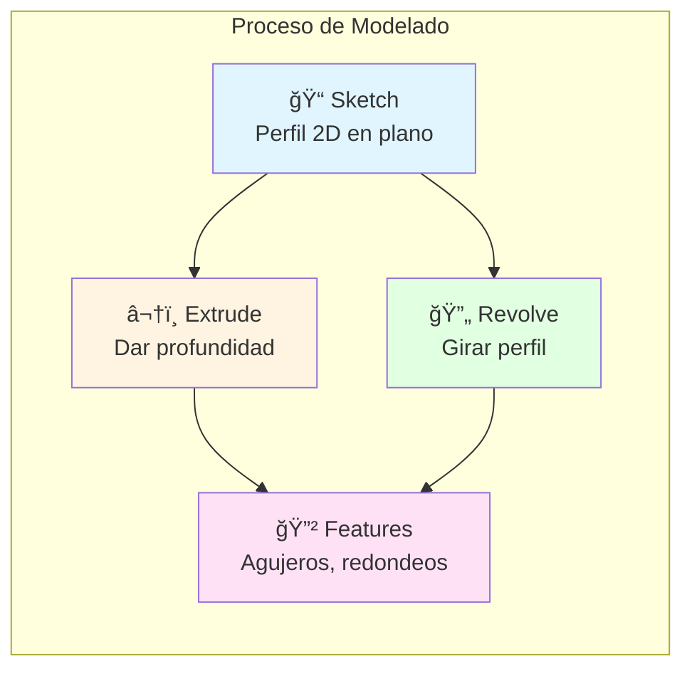
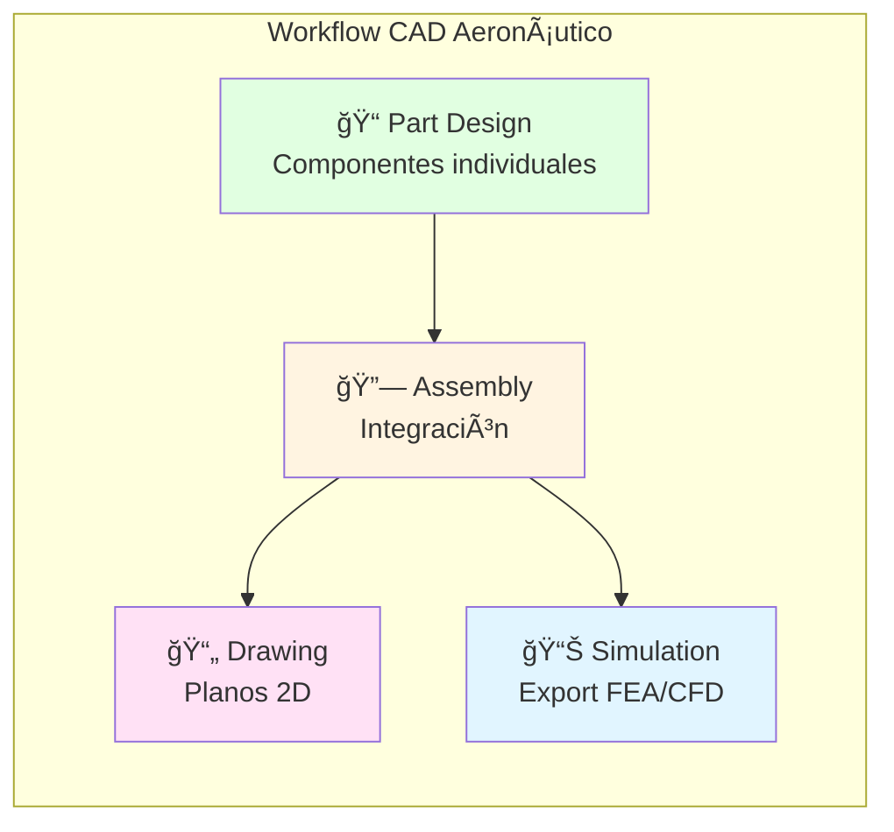
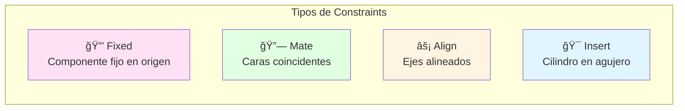

# ✈️ Módulo 01: CAD para Aeronáutica con IA

## Diseña Aeronaves Profesionales con CAD 3D y Asistencia de OpenCode

> **Para Ingenieros Aeronáuticos**: Este módulo te enseña a diseñar componentes aeronáuticos desde el concepto hasta el modelo 3D completo, usando herramientas profesionales como CATIA, Fusion 360, y FreeCAD. Aprenderás modelado paramétrico, ensamblajes complejos, y optimización con OpenCode como asistente técnico.

**⏱️ Duración**: 4 horas  
**👤 Nivel**: Intermedio (con fundamentos de dibujo técnico)  
**🎯 Objetivo**: Dominar diseño CAD aeronáutico con herramientas modernas e IA

---

## 🎓 ¿Qué Vas a Lograr?

1. ✅ **Modelado 3D aeronáutico** - Fuselajes, alas, y componentes profesionales
2. ✅ **Diseño paramétrico** - Geometrías controladas por ecuaciones y variables
3. ✅ **Ensamblajes complejos** - Integrar múltiples piezas con restricciones
4. ✅ **Planos técnicos** - Generar documentación de fabricación automática
5. ✅ **IA para diseño** - OpenCode como asistente de ingeniería aeronáutica

---

## 🤔 ¿Qué es CAD Aeronáutico?

### Analogía: Arquitectura Digital de Aviones

```mermaid
mindmap
  root((CAD Aeronáutico))
    Arquitectura
      Planos de edificio antes de construir
      Calcular dimensiones exactas
      Visualizar antes de invertir
      Simular comportamiento
    Diseño Aeronáutico
      Modelos 3D antes de fabricar
      Geometrías precisas (tolerancias mínimas)
      Visualizar ensamblajes
      Exportar para análisis CFD/FEA
```



**CAD Aeronáutico** = El "plano digital tridimensional" que define geometría exacta de componentes para fabricación, análisis, y certificación.

### ¿Por Qué es Crítico en Paraguay?

**Realidad del sector aeronáutico local**:
- ✅ **TAM Airlines** - Mantenimiento y modificaciones de aeronaves
- ✅ **Fuerza Aérea Paraguaya** - Diseño de adaptaciones y equipos
- ✅ **Drones agrícolas** - Diseño de UAVs para agro (soja, maíz)
- ✅ **Startups aeroespaciales** - Innovación en drones y sistemas

**Sin CAD profesional** = Diseños imprecisos que no pasan certificación ✈️🚫

---

## 📊 El Flujo de Diseño CAD Aeronáutico


**Analogía local**: Como diseñar el hangar de mantenimiento del Aeropuerto Silvio Pettirossi - necesitas planos precisos antes de construir estructuras metálicas.

---

## 🏢 Parte 1: Fundamentos de CAD 3D (60 min)

### Concepto: Del Boceto a la Pieza 3D

**Analogía**: Como esculpir una pieza - empiezas con arcilla (sketch) y vas formando volúmenes (features).



### Operaciones Básicas de CAD

```mermaid
graph TD
    subgraph "Features Fundamentales"
        R[Sketch<br/>ğŸ–Šï¸ Dibujo 2D<br/>Base del modelo]
        C[Extrude<br/>â¬†ï¸ Dar volumen<br/>Agregar altura]
        L[Revolve<br/>🔄 Revolución<br/>Simetría cilíndrica]
    end
    
    subgraph "Modificadores"
        D[Fillet<br/>🔵 Redondear<br/>Suavizar esquinas]
        T[Chamfer<br/>📠Chaflán<br/>Biselar bordes]
        IC[Pattern<br/>🔠Repetir<br/>Arrays y simetrías]
    end
    
    style R fill:#FFE1E1
    style C fill:#E1FFE1
    style L fill:#E1F5FF
    style D fill:#FFF4E1
    style T fill:#FFE1F5
    style IC fill:#E1E1FF
```



### Ejemplo Real: Perfil Alar NACA 0012

**Requerimiento**: Modelar un perfil alar simétrico NACA 0012 para análisis CFD.

**Diseño conceptual**:
```
NACA 0012:
- 0 = simétrico (sin curvatura)
- 12 = espesor máximo 12% de la cuerda
- Cuerda (c) = 1000mm
- Espesor máximo = 120mm a 30% de c
```

**Pasos de modelado**:
```
1. Crear nuevo part → Sketch en plano XY
2. Usar ecuación NACA:
   y = (t/0.2) × c × [0.2969√(x/c) - 0.1260(x/c) - 0.3516(x/c)² + 0.2843(x/c)³ - 0.1015(x/c)⁴]
   Donde t = 0.12 (espesor)
3. Simetría respecto al eje X
4. Extrude 2000mm (envergadura del ala)
5. Export como STEP para CFD
```

**Cálculos necesarios**:
1. **Coordenadas del perfil**: Tabla de 100 puntos (x,y)
2. **Área de sección**: A ≈ 0.092 c² = 92,000 mm²
3. **Centro de presión**: Aproximadamente 25% de c desde borde de ataque
4. **Relación aspecto**: AR = envergadura² / área_alar

### Implementación con OpenCode

```bash
opencode "Genera script Python para calcular coordenadas de perfil NACA 0012:

ESPECIFICACIONES:
- Perfil: NACA 0012 (simétrico, 12% espesor)
- Cuerda: 1000mm
- Número de puntos: 100 (distribuidos coseno para mayor densidad en bordes)
- Ecuación NACA estándar
- Output: CSV con columnas (x, y_superior, y_inferior)

INCLUIR EN EL SCRIPT:
1. Función naca_airfoil(naca_code, chord, n_points)
2. Distribución de puntos con espaciado coseno
3. Cálculo de coordenadas superiores e inferiores
4. Export a CSV listo para importar en CAD
5. Plot matplotlib para verificar forma
6. Comentarios explicando cada paso

VALIDACIONES:
- Verificar que espesor máximo sea 12% en x/c ≈ 0.3
- Borde de ataque cerrado (tolerancia < 0.01mm)
- Borde de salida con espesor finito
- Curva suave sin discontinuidades

Output en español con contexto de diseño aeronáutico paraguayo"
```

### Reglas de Diseño CAD Aeronáutico

```mermaid
mindmap
  root((Reglas de Oro))
    Precisión
      Tolerancias milimétricas
      Unidades consistentes (mm)
      Dimensiones críticas anotadas
      Factores de seguridad
    Parametrización
      Variables para dimensiones
      Relaciones geométricas
      Fácil modificación
      Control de cambios
    Organización
      Nombres descriptivos
      Estructura de árbol lógica
      Sketches referenciados
      Documentación integrada
    Fabricabilidad
      Considerar procesos (CNC, 3D print)
      Acceso de herramientas
      Tolerancias de manufactura
      Material especificado
```



### Sistemas de Coordenadas en Aeronáutica

**Convención estándar**:
```
X-axis: Longitudinal (nariz → cola)
Y-axis: Lateral (ala izquierda → ala derecha)
Z-axis: Vertical (arriba)

Origen: Típicamente en nariz o CG (centro de gravedad)
```

**En CAD**:
- Usar planos de referencia alineados con ejes principales
- Simetría en plano XZ (bilateral)
- Planos de sección transversal perpendiculares a X

---

## 🔬 Parte 2: CATIA/Fusion 360 - Modelado Aeronáutico (90 min)

### Concepto: Herramientas Profesionales de Diseño

**CATIA** = El "estándar de oro" en aeroespacial (Airbus, Boeing)  
**Fusion 360** = Alternativa accesible y potente (gratuita para estudiantes)



### Tutorial Paso a Paso: Fuselaje de UAV

**Objetivo**: Diseñar fuselaje de UAV agrícola para monitoreo de cultivos en Paraguay.

#### Paso 1: Requerimientos de Diseño

**Especificaciones funcionales**:
```
Longitud total: 1200mm
Diámetro máximo: 200mm
Carga útil: Cámara 500g en bahía central
Material: Fibra de carbono (espesor 3mm)
Peso objetivo: < 800g
```

**Forma aerodinámica**:
- Nariz cónica (reducir drag)
- Sección central cilíndrica (bahía de carga)
- Cola ahusada (estabilidad)

#### Paso 2: Modelado del Fuselaje en Fusion 360

**2.1. Crear Perfil Lateral**

```
Sketch en plano XZ:
1. Línea de referencia (eje longitudinal)
2. Curva de la nariz (spline)
   - Punto inicial: (0, 0)
   - Radio máximo: (300, 100) [300mm desde nariz, radio 100mm]
3. Sección cilíndrica:
   - Longitud: 600mm (bahía de carga)
   - Radio constante: 100mm
4. Sección de cola (ahusada):
   - Longitud: 300mm
   - Radio final: 40mm (montaje motor)
5. Cerrar perfil
```

**2.2. Crear Volumen (Revolve)**

```
Revolve:
- Seleccionar perfil
- Eje de revolución: línea de referencia
- Ángulo: 360°
- Operación: New Body
```

**2.3. Crear Cavidad Interior (Shell)**

```
Shell:
- Seleccionar caras nariz y cola
- Espesor: 3mm
- Dirección: Interior
- Resultado: Fuselaje hueco
```

**2.4. Bahía de Carga (Corte)**

```
Sketch en plano XY (vista superior):
1. Rectángulo: 200mm × 150mm
   Centrado en sección cilíndrica
2. Redondear esquinas: r=10mm

Extrude Cut:
- Profundidad: atravesar fuselaje (Through All)
- Crear tapa desmontable (sketch separado)
```

#### Paso 3: Componentes Adicionales

**3.1. Montajes de Ala**

```
Sketch en superficie fuselaje:
- 2 círculos (diámetro 50mm) a 400mm desde nariz
- Separación vertical: 20mm
- Extrude Boss: 10mm (hacia afuera)
- Hole: diámetro 8mm para tornillos M8
```

**3.2. Montaje de Motor**

```
En cola (radio 40mm):
- Sketch: Patrón circular de 4 agujeros
  Diámetro tornillos: 3mm
  Circle diameter: 30mm
- Extrude Cut: 5mm profundidad
```

#### Paso 4: Análisis y Validación

**Propiedades de masa (Fusion 360)**:
```
Tools → Inspect → Properties
Material: Carbon Fiber Composite (ρ = 1600 kg/m³)

Resultados esperados:
- Masa: ~750g ✓
- Volumen interior: ~4 litros
- Centro de gravedad: x ≈ 500mm
```

**Export para análisis**:
```
File → Export:
- STEP (.stp) → Para FEA estructural
- STL (.stl) → Para impresión 3D de moldes
- IGES (.igs) → Para CFD
```

### Diseño Paramétrico Avanzado

**Ventaja**: Cambiar dimensiones globalmente con variables.

**Ejemplo en Fusion 360**:
```
Modify → Change Parameters:

Nombre          Valor     Unidad   Expresión
------------------------------------------
fuselage_length  1200     mm       -
max_diameter     200      mm       -
nose_length      300      mm       fuselage_length * 0.25
payload_length   600      mm       fuselage_length * 0.5
tail_length      300      mm       fuselage_length * 0.25
wall_thickness   3        mm       -

Usar parámetros en sketches:
- En vez de "1200mm" → usar "fuselage_length"
- Modificar UNA variable actualiza TODO el modelo
```

### Implementación con OpenCode

```bash
opencode "Genera guía detallada para diseñar ala de UAV en Fusion 360:

ESPECIFICACIONES DEL ALA:
- Perfil alar: NACA 4412 (sustentación positiva)
- Envergadura: 2000mm
- Cuerda en raíz: 300mm
- Cuerda en punta: 200mm (taper ratio 0.67)
- Diedro: 3° (estabilidad lateral)
- Torsión (washout): -2° en punta (stall progresivo)

PASOS DETALLADOS:
1. Crear sketch del perfil NACA 4412:
   - Importar coordenadas desde CSV
   - Escalar a cuerda raíz (300mm)
   - Cerrar borde de salida
2. Loft entre perfiles raíz y punta:
   - Perfil raíz: NACA 4412 @ 300mm cuerda
   - Perfil punta: NACA 4412 @ 200mm cuerda, rotado -2°
   - Guía: línea con diedro 3°
3. Crear larguero estructural (spar):
   - Posición: 25% de cuerda
   - Sección: rectangular 10mm × 20mm
   - Material: Fibra de carbono
4. Costillas (ribs):
   - Cantidad: 10 (espaciadas 200mm)
   - Espesor: 2mm
   - Patrón: Along path (spar)
5. Puntos de montaje fuselaje:
   - Insertos metálicos M6
   - Posición: 300mm desde centro (cada lado)

INCLUIR:
- Capturas de pantalla descritas
- Parámetros para diseño paramétrico
- Cálculos de peso estructural
- Export para CFD (superficies externas)
- Notas de fabricación (moldes, laminado)

Todo en español con contexto de UAV agrícola paraguayo"
```

---

## 🌐 Parte 3: Ensamblajes y Constraints (60 min)

### Concepto: Integrar Múltiples Piezas

**Ensamblaje** = Reunir componentes individuales con relaciones espaciales definidas.



### Tutorial: Ensamblar UAV Completo

**Componentes**:
1. Fuselaje (diseñado anteriormente)
2. Alas (derecha e izquierda)
3. Empenaje horizontal (estabilizador)
4. Empenaje vertical (timón)
5. Motor + hélice
6. Tren de aterrizaje

**Secuencia de ensamblaje**:

```
Assembly → Nuevo ensamblaje:

1. Insertar fuselaje:
   - Constraint: Fixed (origen en nariz)
   
2. Insertar ala derecha:
   - Mate: Superficie montaje ala → superficie fuselaje
   - Align: Larguero ala → eje longitudinal fuselaje
   - Offset: +20mm vertical (diedro 3°)
   
3. Insertar ala izquierda:
   - Mirror: Simetría respecto plano XZ
   
4. Empenaje horizontal:
   - Mate: Superficie montaje → cola fuselaje
   - Align: Eje empenaje → eje longitudinal
   - Distance: 1000mm desde nariz
   
5. Empenaje vertical:
   - Mate: Centro empenaje → eje longitudinal
   - Align: Eje vertical → eje Z
   
6. Motor:
   - Insert: Eje motor → agujero patrón circular cola
   - Rotate: Alinear tornillos con agujeros

7. Hélice:
   - Coaxial: Eje hélice → eje motor
   - Offset: 50mm desde motor (clearance)
```

### Análisis de Interferencias

**Verificar colisiones**:
```
Fusion 360:
Inspect → Interference:
- Seleccionar todos los componentes
- Compute
- Resultado esperado: 0 interferencias

Si hay interferencias:
- Ajustar offsets
- Redimensionar componentes
- Verificar tolerancias
```

### Centro de Gravedad del Ensamblaje

**Crítico para estabilidad de vuelo**:
```
Inspect → Center of Mass:

Objetivo: CG entre 25%-30% de cuerda media aerodinámica

Si CG está mal ubicado:
- Reubicar batería (componente más pesado)
- Agregar lastre en nariz/cola
- Rediseñar distribución de componentes
```

### Implementación con OpenCode

```bash
opencode "Analiza distribución de pesos de UAV y calcula CG óptimo:

COMPONENTES Y MASAS:
1. Fuselaje fibra carbono: 750g
2. Alas (par): 600g
3. Empenajes: 150g
4. Motor eléctrico: 250g
5. Hélice: 50g
6. Batería LiPo 4S 5000mAh: 550g
7. Cámara + gimbal: 500g
8. Electrónica (FC, ESC, RX): 200g
9. Servos (4×): 160g

POSICIONES (desde nariz):
- Fuselaje: CG propio en 500mm
- Alas: 400mm
- Empenajes: 950mm
- Motor: 1150mm
- Batería: ??? (calcular posición óptima)
- Cámara: 450mm

OBJETIVO:
Calcular posición de batería para que CG total esté en 30% de cuerda media.
Cuerda media aerodinámica (MAC) = 250mm
Posición 30% MAC: 400mm desde nariz

INCLUIR:
1. Tabla de componentes con (masa, posición, momento)
2. Cálculo de CG actual sin batería
3. Cálculo de posición óptima de batería
4. Verificación con batería ubicada
5. Margen de ajuste (si batería se descarga)
6. Diagrama visual de distribución
7. Recomendaciones de ajuste

Todo en español con contexto de diseño aeronáutico"
```

---

## 💻 Parte 4: OpenCode para Diseño CAD (30 min)

### Casos de Uso de IA en Diseño Aeronáutico

```mermaid
mindmap
  root((OpenCode para CAD))
    Generación de Geometrías
      Scripts de perfiles alares
      Coordenadas NACA automatizadas
      Superficies complejas
    Cálculos de Diseño
      Propiedades de masa
      Centros de gravedad
      Momentos de inercia
    Documentación
      Especificaciones técnicas
      Notas de fabricación
      Informes de diseño
    Optimización
      Sugerir mejoras geométricas
      Trade-off analysis
      Validar contra requerimientos
```



### Prompt Engineering para CAD Aeronáutico

#### Generación de Scripts CAD

```bash
opencode "Genera script Python para Fusion 360 API que cree perfil NACA paramétrico:

FUNCIONALIDAD:
- Input: Código NACA (ej: "2412"), cuerda, num_puntos
- Output: Sketch en Fusion 360 con spline del perfil

CÓDIGO ESPERADO:
1. Importar Fusion 360 API
2. Función calculate_naca_coordinates(naca, chord, n_points)
3. Crear sketch en plano XY
4. Dibujar spline con puntos calculados
5. Cerrar perfil (conectar trailing edge)

VALIDACIONES:
- Verificar código NACA válido (4 dígitos)
- Cuerda > 0
- Puntos ≥ 50 (resolución mínima)

INCLUIR:
- Comentarios explicativos
- Manejo de errores
- Ejemplo de uso
- Documentación de parámetros

Output en español para estudiantes FPUNA"
```

#### Análisis de Diseño

```bash
opencode "Analiza diseño de larguero de ala y verifica factor de seguridad:

DISEÑO ACTUAL:
- Material: Fibra de carbono (E=70 GPa, σ_yield=600 MPa, ρ=1600 kg/m³)
- Sección: Rectangular 15mm × 25mm
- Longitud: 1000mm (mitad de envergadura)
- Empotrado en fuselaje, carga distribuida en punta

CARGAS:
- Peso del ala: 300g distribuido
- Carga aerodinámica máxima: L = 2× peso total UAV = 6 kg
- Distribución: Elíptica (máximo en raíz)
- Factor de carga: n = 3.5 (maniobras)

ANÁLISIS REQUERIDO:
1. Diagrama de cuerpo libre
2. Diagrama de momento flector
3. Esfuerzo máximo (flexión)
   σ = M × c / I
   Donde:
   M = momento máximo
   c = distancia a fibra extrema
   I = momento de inercia de sección
4. Factor de seguridad: FS = σ_yield / σ_max
5. Deflexión máxima en punta
6. Crítica de Euler (pandeo)

OBJETIVO:
FS ≥ 1.5 (típico en aviación)

INCLUIR:
- Cálculos paso a paso
- Resultado: ¿Diseño OK o necesita refuerzo?
- Sugerencias de mejora si FS < 1.5
- Comparación con sección en I (más eficiente)

Todo en español con estándares aeronáuticos"
```

#### Documentación Técnica Automatizada

```bash
opencode "Genera ficha técnica completa del UAV diseñado:

COMPONENTES DEL UAV:
[describir fuselaje, alas, empenajes, motor]

GENERAR DOCUMENTO:
1. Especificaciones Generales:
   - Dimensiones principales (LOA, envergadura, altura)
   - Pesos (vacío, máximo despegue, útil)
   - Velocidades (crucero, máxima, stall)
   - Autonomía y alcance
2. Configuración Aerodinámica:
   - Perfiles alares (raíz, punta)
   - Área alar, relación de aspecto
   - Cargas alares
   - Coeficientes aerodinámicos estimados
3. Propulsión:
   - Motor (marca, modelo, KV)
   - Hélice (diámetro × paso)
   - Batería (tipo, capacidad, C-rating)
   - Empuje estático y performance
4. Estructura:
   - Materiales principales
   - Factores de seguridad
   - Métodos de construcción
5. Sistemas:
   - Control (FC, servos)
   - Cámara y payload
   - Telemetría
6. Performance Estimado:
   - Velocidades de vuelo
   - Autonomía (minutos)
   - Alcance (km)
   - Techo operacional
7. Diagramas:
   - Vista 3 vistas (planta, perfil, frontal)
   - Distribución de componentes
   - Centro de gravedad

FORMATO:
- Documento PDF-ready Markdown
- Tablas bien formateadas
- Unidades consistentes (SI + conversiones)
- Referencias a cálculos detallados

Contexto: Presentación a DINAC para certificación experimental"
```

### Integración con Workflow de Diseño

```mermaid
sequenceDiagram
    participant E as 👤 Ingeniero
    participant O as 🤖 OpenCode
    participant C as 📠CAD (Fusion 360)
    participant A as 📊 Análisis (CFD/FEA)
    
    E->>O: "Genera coordenadas NACA 4412"
    O->>E: Script Python con puntos
    E->>C: Import puntos, crear sketch
    C->>E: Perfil 3D creado
    E->>O: "Calcula propiedades de masa"
    O->>E: Masa, CG, inercias
    E->>C: Export STEP para análisis
    C->>A: Archivo geometry
    A->>E: Resultados CFD/FEA
    E->>O: "Interpreta resultados y sugiere mejoras"
    O->>E: Recomendaciones de optimización
```



**Ventaja**: OpenCode actúa como **ingeniero senior** que revisa diseños y sugiere optimizaciones basadas en principios aeronáuticos.

---

## 🎯 Ejercicio Práctico: Diseño de Empenaje Vertical

### Objetivo

Diseñar empenaje vertical (timón de dirección) para el UAV agrícola.

### Especificaciones

**Requerimientos funcionales**:
- Área del timón: 0.15 m² (15% del área alar)
- Perfil: NACA 0012 (simétrico)
- Cuerda en raíz: 250mm
- Cuerda en punta: 150mm
- Altura: 400mm
- Flecha (sweep): 20° (estabilidad direccional)

**Material**: Espuma EPP + fibra de vidrio (peso <100g)

### Diseño Paso a Paso

#### 1. Crear Perfil NACA 0012

```
Sketch en plano XZ:
1. Importar coordenadas NACA 0012 (usar script OpenCode)
2. Escalar a cuerda raíz = 250mm
3. Cerrar borde de salida
```

#### 2. Crear Geometría con Taper y Sweep

```
Loft:
- Perfil raíz: NACA 0012 @ 250mm en origen
- Perfil punta: NACA 0012 @ 150mm
  Posición: (altura = 400mm, offset X = 400×tan(20°) = 146mm)
- Guía: Línea recta conectando bordes de ataque
```

#### 3. Agregar Bisagra de Control

```
Sketch en superficie timón:
- Línea @ 70% de cuerda (línea de bisagra)
- Split body: Separar superficie de control móvil

Componentes resultantes:
1. Estabilizador fijo (30% cuerda)
2. Timón móvil (70% cuerda, rango ±30°)
```

#### 4. Implementar con OpenCode

```bash
opencode "Diseña sistema de actuación para timón de dirección del UAV:

ESPECIFICACIONES:
- Superficie de control: 70% del empenaje vertical
- Deflexión requerida: ±30°
- Carga aerodinámica máxima: 5 N @ 60 km/h
- Velocidad de actuación: 60°/seg (0.5 seg para full deflection)

COMPONENTES A SELECCIONAR:
1. Servo:
   - Torque mínimo requerido (calcular con brazo de palanca)
   - Velocidad adecuada
   - Voltaje: 6V (BEC del ESC)
   - Ejemplos: TowerPro MG90S, Futaba S3003
2. Linkage:
   - Brazo servo: 20mm
   - Varilla pushrod: Diámetro y material
   - Horn del timón: Posición y brazo
3. Bisagra:
   - Tipo: Mylar tape o bisagra CA (cianoacrilato)
   - Posición: 70% de cuerda
   - Cantidad de puntos: 3 (distribuidos en altura)

CÁLCULOS:
1. Momento aerodinámico en timón:
   M = q × S × c × Cm
   Donde:
   q = presión dinámica = 0.5 × ρ × V²
   S = área del timón
   c = cuerda media
   Cm = coeficiente de momento (≈ 0.3 para ±30°)
2. Torque requerido en servo (con factor seguridad 2×)
3. Deflexión angular vs posición servo (geometría linkage)

INCLUIR:
- Diagrama del mecanismo
- Tabla de componentes con proveedores Paraguay
- Cálculos de verificación
- Instrucciones de instalación
- Ajustes y pruebas en tierra

Todo en español con contexto de construcción amateur"
```

---

## 🔧 Troubleshooting de Diseño CAD

### Problemas Comunes y Soluciones

```mermaid
graph TD
    subgraph "Errores Frecuentes"
        A[⌠Sketch no cierra<br/>Perfil abierto]
        B[⌠Feature falla<br/>Geometría inválida]
        C[⌠Ensamblaje sobre-restringido<br/>Constraints conflictivos]
        D[⌠Modelo muy pesado<br/>Rendimiento lento]
    end
    
    A --> A1[✅ Verificar endpoints<br/>Usar Coincident]
    B --> B1[✅ Simplificar geometría<br/>Revisar tangencias]
    C --> C1[✅ Eliminar redundantes<br/>Usar Pattern para simetría]
    D --> D1[✅ Reducir detalles<br/>Usar LOD - Level of Detail]
    
    style A fill:#FFE1E1
    style B fill:#FFE1E1
    style C fill:#FFE1E1
    style D fill:#FFE1E1
```



#### Caso 1: Loft Falla Entre Perfiles

**Síntoma**: Al hacer loft entre perfil raíz y punta, Fusion 360 da error "Failed to compute".

**Diagnóstico con OpenCode**:
```bash
opencode "El loft entre mi perfil alar raíz y punta falla en Fusion 360:

DETALLES:
- Perfil raíz: NACA 4412 @ 300mm cuerda (100 puntos)
- Perfil punta: NACA 4412 @ 200mm cuerda, rotado -2° (100 puntos)
- Distancia: 1000mm
- Error: "Failed to compute loft"

POSIBLES CAUSAS:
1. Número de puntos diferente
2. Orden de puntos invertido
3. Puntos de inicio no alineados
4. Twist excesivo
5. Guía de loft faltante

SOLICITO:
1. Diagnóstico del problema más probable
2. Cómo verificar cada causa en Fusion 360
3. Solución paso a paso
4. Alternativas si loft no funciona:
   - Usar sweep en vez de loft
   - Dividir en secciones múltiples
   - Simplificar perfiles

Contexto: Diseño de ala para UAV, necesito exportar a CFD"
```

**Solución típica**:
```
Causa probable: Puntos de inicio desalineados

Fix:
1. Edit sketch perfil punta
2. Seleccionar punto inicial (borde de ataque)
3. Verify → Sketch Point Priority
4. Re-loft con ambos perfiles starting en mismo punto relativo
5. Agregar rail guide (línea de borde de ataque) para controlar twist

Alternativa:
Usar Ruled Surface en vez de Loft (más predecible)
```

#### Caso 2: Ensamblaje No Se Mueve Correctamente

**Síntoma**: Al simular movimiento de superficies de control, el servo y linkage no siguen correctamente.

**Checklist de depuración**:
- [ ] ¿Joint correctamente definido entre servo horn y varilla?
- [ ] ¿Bisagra del timón tiene revolute joint?
- [ ] ¿Hay límites angulares configurados (±30°)?
- [ ] ¿Contact sets evitan interpenetraciones?
- [ ] ¿Todos los componentes están grounded excepto móviles?

**Solución con OpenCode**:
```bash
opencode "Configura joints y motion study para sistema de control en Fusion 360:

COMPONENTES:
1. Fuselaje (fixed)
2. Timón (movible, bisagra @ 70% cuerda)
3. Servo (fixed en fuselaje)
4. Servo horn (gira con servo)
5. Pushrod (conecta servo horn a timón horn)
6. Timón horn (fijo en timón)

OBJETIVO:
Simular que al rotar servo ±60°, el timón deflecte ±30°

JOINTS NECESARIOS:
1. Timón-Fuselaje: Revolute (eje de bisagra)
2. Servo horn-Servo: Revolute (eje servo)
3. Pushrod-Servo horn: Spherical (rótula)
4. Pushrod-Timón horn: Spherical (rótula)

MOTION STUDY:
- Tipo: Joint-based
- Driver: Revolute joint servo horn
- Input: Rotación -60° a +60° en 2 seg
- Output: Ángulo timón vs tiempo

INCLUIR:
- Setup de cada joint con capturas
- Cómo ejecutar motion study
- Cómo graficar resultados
- Verificar que linkage no se atasca (binding)
- Export animación para presentación

Contexto: Validar mecanismo antes de construir prototipo"
```

---

## ✅ Checklist de Verificación de Diseño CAD

Antes de exportar para análisis o fabricación:

### Geometría del Modelo
- [ ] Todos los sketches están completamente definidos (negro, no azul)
- [ ] No hay features con errores (⚠️ amarillo)
- [ ] Superficies cerradas (no hay gaps)
- [ ] Dimensiones críticas verificadas con measure tool
- [ ] Espesor de paredes ≥ mínimo fabricable (ej: 2mm para impresión 3D)

### Parámetros y Variables
- [ ] Variables nombradas descriptivamente
- [ ] Relaciones paramétricas funcionan al cambiar valores
- [ ] Unidades consistentes (todo en mm)
- [ ] Tolerancias anotadas donde crítico

### Ensamblajes
- [ ] Todos los componentes tienen constraints apropiados
- [ ] Cero interferencias (Inspect → Interference)
- [ ] Centro de gravedad en posición correcta
- [ ] Componentes móviles se mueven sin atascos
- [ ] Bill of materials generado y revisado

### Fabricabilidad
- [ ] Acceso de herramientas considerado (taladros, fresas)
- [ ] Radios mínimos respetados (ej: fresa Ø3mm → r≥1.5mm)
- [ ] Material especificado
- [ ] Proceso de fabricación definido (CNC, 3D print, laminado)

### Documentación
- [ ] Modelo nombrado descriptivamente
- [ ] Notas de diseño en model (Design Notes)
- [ ] Planos 2D generados si necesario
- [ ] Files exportados (STEP, STL, IGES)

---

## 🎓 Mejores Prácticas CAD Aeronáutico

### ✅ HACER

1. **Diseño paramétrico desde inicio** - Variables para dimensiones principales
2. **Usar planos de referencia** - Estructura lógica de sketches
3. **Nombres descriptivos** - "wing_root_airfoil" no "sketch12"
4. **Documentar decisiones** - Por qué elegiste ese perfil, ese material
5. **Diseño modular** - Componentes intercambiables, reutilizables
6. **Simetría inteligente** - Mirror para alas, empenajes (ahorra tiempo)
7. **Export múltiples formatos** - STEP (universal), STL (impresión), IGES (CFD)
8. **Versionado** - Save as con números de versión (UAV_v1.0, v1.1...)

### ❌ NO HACER

1. **Sobre-detallar** - No modelar tornillos M3 en modelo completo (usar simplificados)
2. **Ignorar fabricabilidad** - Diseñar geometrías imposibles de fabricar
3. **Sketchs complejos** - Dividir en sketches simples referenciados
4. **Features no paramétricas** - Usar dimensiones fijas sin variables
5. **Diseño sin referencias** - Basarse en estándares aeronáuticos (NACA, etc.)
6. **No validar** - Siempre hacer mass properties, interference check
7. **Unidades mezcladas** - Consistencia: todo en mm o todo en inches

---

## 🎉 Resumen del Módulo

### Lo Que Dominaste

✅ **CAD 3D aeronáutico** - Modelado de componentes complejos  
✅ **Diseño paramétrico** - Control total con variables  
✅ **Ensamblajes** - Integración de sistemas completos  
✅ **Perfiles NACA** - Generación y aplicación de airfoils  
✅ **Análisis básico** - Propiedades de masa, CG, interferencias  
✅ **OpenCode para CAD** - Asistente de ingeniería con IA

### Próximo Paso

**Continúa con**: [Módulo 02 - Aerodinámica y CFD](./02-aerodinamica-cfd.md)

Llevarás tus diseños CAD a simulación aerodinámica para optimizar performance.

---

## 💭 Reflexión

1. **¿Cómo el diseño paramétrico acelera iteraciones de diseño?**
2. **¿Qué diferencia hay entre CAD para aeronáutica vs. CAD mecánico general?**
3. **¿Cómo OpenCode puede ayudarte a aprender CATIA más rápido?**

**Comparte en Slack** (#ingenieria-aeronautica)

---

## 📚 Recursos Adicionales

### Software (Gratuito para Estudiantes)

- **Fusion 360** - [Autodesk Education](https://autodesk.com/education) (gratis 3 años)
- **FreeCAD** - [freecadweb.org](https://freecadweb.org) (open-source, gratis)
- **OnShape** - [onshape.com/education](https://onshape.com/education) (CAD en la nube)

### Tutoriales

- **Fusion 360 para Aeronáutica** - YouTube: "Learn Everything About Design"
- **Airfoil Tools** - [airfoiltools.com](http://airfoiltools.com/) (database NACA)
- **CATIA V5 Basics** - Coursera (si tienes acceso a licencia CATIA)

### Libros Recomendados

- **"Aircraft Design: A Conceptual Approach"** - Daniel P. Raymer (biblia del diseño)
- **"Fundamentals of Aerodynamics"** - John D. Anderson (teoría aerodinámica)
- **"CAD/CAM: Principles and Applications"** - P. N. Rao (fundamentos CAD)

### Bases de Datos

- **Airfoil Database** - UIUC Airfoil Coordinates (perfiles validados)
- **NASA Technical Reports** - Datos de pruebas en túnel de viento
- **NACA Reports** - Documentos históricos de perfiles

### Comunidades Paraguay

- **Aeromodelismo Paraguay** - Facebook group (experiencia práctica)
- **FPUNA Aeronáutica** - Estudiantes y profesores (proyectos colaborativos)
- **RC Paraguay** - Drones y aeromodelismo (builders locales)

---

*Módulo creado para FPUNA Verano 2026*  
*Actualizado: Enero 2026*  
*Track: Ingeniería Aeronáutica*
