# 🚀 Módulo 04: Sistemas de Propulsión

## Domina Motores y Performance de Aeronaves con Termodinámica y OpenCode

> **Para Ingenieros Aeronáuticos**: Este módulo te enseña diseño y análisis de sistemas de propulsión desde fundamentos termodinámicos hasta cálculos de performance completos. Aprenderás motores eléctricos, turbinas de gas, cálculos de empuje, autonomía, y selección óptima usando OpenCode como asistente técnico.

**⏱️ Duración**: 4 horas  
**👤 Nivel**: Intermedio (con fundamentos de termodinámica y física)  
**🎯 Objetivo**: Dominar análisis de propulsión aeronáutica con herramientas modernas e IA

---

## 🎓 ¿Qué Vas a Lograr?

1. ✅ **Termodinámica de motores** - Ciclos Brayton, Otto, y eléctricos
2. ✅ **Cálculos de empuje** - Thrust, power, y eficiencia propulsiva
3. ✅ **Selección de motores** - Eléctricos, turbinas, pistón según misión
4. ✅ **Performance de aeronaves** - Autonomía, alcance, velocidades características
5. ✅ **Baterías y combustible** - Densidad energética, sizing, trade-offs
6. ✅ **IA para propulsión** - OpenCode como ingeniero de performance

---

## 🤔 ¿Qué es un Sistema de Propulsión?

### Analogía: El Motor de un Auto, pero en 3D

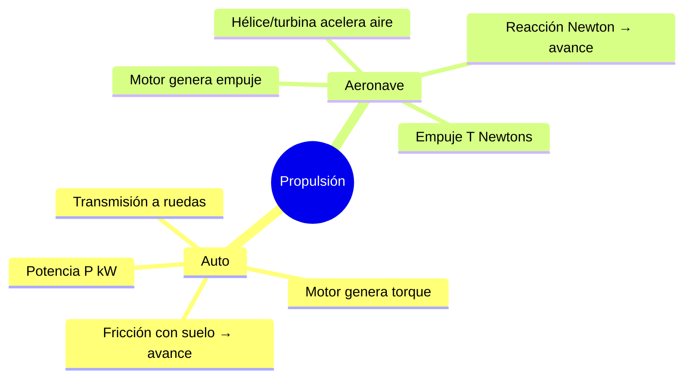

**Sistema de Propulsión** = El conjunto de componentes que convierte energía almacenada (combustible, batería) en fuerza de empuje que mueve la aeronave.

### ¿Por Qué es Crítico en Paraguay?

**Realidad del sector aeronáutico local**:
- ✅ **Aviación comercial** - Turbofans (TAM, Paranair)
- ✅ **Aviación general** - Motores de pistón (Cessna, Piper en aeroclubes)
- ✅ **Drones agrícolas** - Motores eléctricos brushless (creciente)
- ✅ **Defensa** - Turbohélices (Fuerza Aérea: T-27 Tucano)

**Sin análisis de propulsión** = Autonomía insuficiente, performance inadecuada ✈️🔋

---

## 📋 Prerrequisitos

### Conocimientos Requeridos

✅ **Termodinámica** (Fundamental):
- Primer principio: conservación de energía
- Eficiencia térmica: η = W_útil / Q_entrada
- Ciclos termodinámicos básicos (concepto de ciclo)
- Potencia y trabajo: P = W / t
- **Verificación**: ¿Puedes explicar por qué un motor no puede ser 100% eficiente?

✅ **Física y Matemáticas** (Fundamental):
- Mecánica: Fuerza (F=ma), trabajo (W=F·d), potencia
- Energía: cinética, potencial, conservación
- Cálculo: derivadas, integrales básicas
- Álgebra: despeje de fórmulas, proporciones
- Unidades: conversión N↔kg, W↔HP, Wh↔J

✅ **Conocimientos Aeronáuticos** (Recomendado):
- Resistencia aerodinámica: D = ½ρV²SC_D
- Sustentación y vuelo nivelado: L = W
- Velocidades características: V_stall, V_cruise
- Performance básica: autonomía, alcance

❌ **NO Se Requiere**:
- Experiencia con motores reales (se enseña desde cero)
- Conocimiento de turbinas o combustión interna avanzada
- Diseño detallado de hélices (solo selección)

### Software/Herramientas Necesarias (Todo Opcional)

Este módulo se centra en **cálculos teóricos**. El software es opcional para validar resultados.

**Para Cálculos** (recomendado):
- **Python + numpy** (scripts de performance)
  - Ya instalado si completaste CORE-FOUNDATION
- **Excel/LibreOffice Calc** (hojas de cálculo)
- **Calculadora científica** (conversiones, fórmulas)

**Calculadoras Online** (muy útiles):
- **eCalc** - [ecalc.ch](https://www.ecalc.ch/) - Calculadora UAV completa (GRATIS)
- **Drive Calculator** - [drivecalc.de](https://www.drivecalc.de/) - Motor/hélice matching
- Funcionan en navegador, sin instalación

**Simulación Avanzada** (opcional):
- MATLAB/Simulink (si disponible en FPUNA)
- Python + matplotlib (gráficos de performance)

**Nota Importante**: Puedes completar el módulo **sin software**. Los cálculos manuales son suficientes. Las calculadoras online solo aceleran verificaciones.

### Módulos Previos Necesarios

**Obligatorios**:
- ✅ **00-CORE-FOUNDATION (Semana 1)** - OpenCode y herramientas AI
- ✅ **Módulo 01: CAD con IA** - Para entender geometrías 3D de componentes
- ✅ **Módulo 02: Aerodinámica CFD** - Para conocer resistencia aerodinámica (D)
- ✅ **Módulo 03: Estructuras** - Para entender limitaciones de peso estructural

**Conexión entre módulos**:
```
Aerodinámico (Mod 02) → Calcula resistencia D
                           ↓
Propulsión (Mod 04) → Calcula empuje T necesario (T ≥ D)
                           ↓
Estructuras (Mod 03) → Verifica que soporta cargas del motor
```

### Auto-Evaluación

Responde estas preguntas para verificar si estás listo:

1. **¿Entiendes que eficiencia = salida_útil / entrada_total?**  
   SÍ / NO

2. **¿Puedes calcular potencia P = Fuerza × Velocidad?**  
   SÍ / NO

3. **¿Sabes convertir unidades (ej: 1 HP = 746 W)?**  
   SÍ / NO

4. **¿Conoces la ecuación de resistencia aerodinámica D = ½ρV²SC_D?**  
   SÍ / NO

5. **¿Puedes dedicar 4 horas a contenido técnico con cálculos intensivos?**  
   SÍ / NO

**Interpretación**:
- **4-5 SÍes**: ✅ Listo para comenzar
- **3 SÍes**: ⚠️ Considera repasar termodinámica básica (2 horas)
- **< 3 SÍes**: ❌ Repasa física y termodinámica antes de continuar

**Recursos de Repaso** (si necesitas):
- [Khan Academy: Energy & Work](https://www.khanacademy.org/science/physics)
- [Khan Academy: Thermodynamics](https://www.khanacademy.org/science/physics/thermodynamics)
- Libro: "Fundamentos de Termodinámica" - Van Wylen & Sonntag

### Tiempo Estimado Total

- **Contenido teórico + cálculos**: 3-4 horas
- **Ejercicios prácticos**: 1-2 horas
- **Proyecto sizing motor (opcional)**: 4-6 horas adicionales

**Total**: 4-12 horas (depende de profundidad)

### Checklist Final

Antes de comenzar, verifica:

- [ ] He completado CORE-FOUNDATION (Semana 1)
- [ ] He completado Módulos 01, 02, y 03 del track Aero
- [ ] Entiendo conceptos básicos de termodinámica y potencia
- [ ] Tengo 4+ horas disponibles para el módulo
- [ ] Tengo calculadora científica o Python
- [ ] (Opcional) He creado cuenta en eCalc.ch para cálculos UAV

**Si marcaste todos los obligatorios (primeros 5)**: ¡Adelante! 🚀

---

## 📊 Los Tres Pilares del Diseño de Propulsión

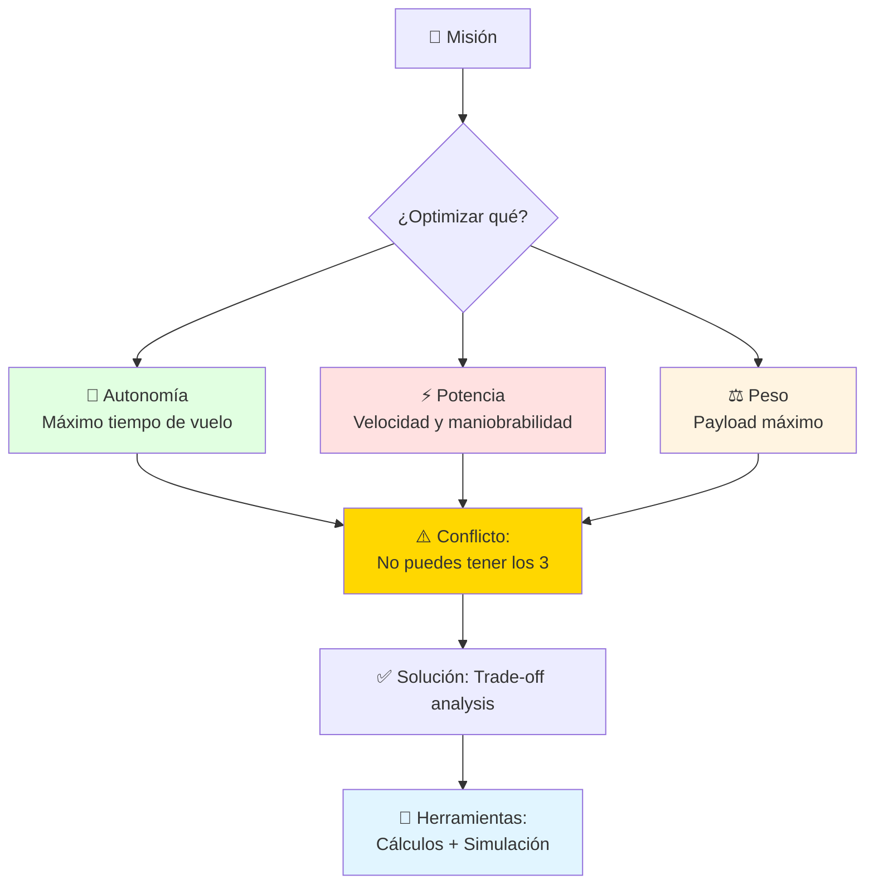

**Ecuación fundamental**: **Autonomía ∝ (Eficiencia × Energía) / Potencia requerida**

---

## 🏢 Parte 1: Tipos de Motores Aeronáuticos (60 min)

### Panorama General

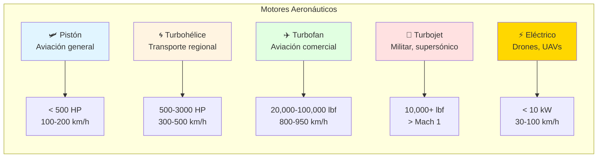

### Motores Eléctricos (Foco: UAVs)

**Componentes del sistema**:

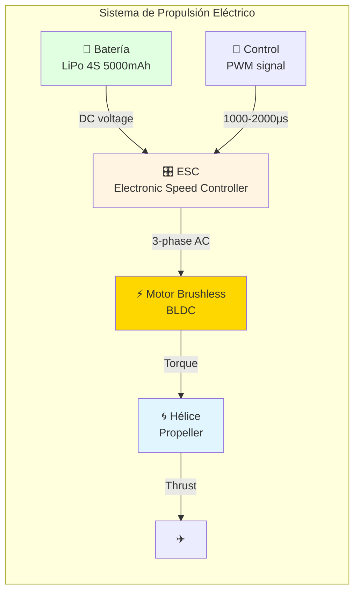

#### Motor Brushless (BLDC)

**Especificaciones típicas para UAV 3kg**:

```
Modelo: T-Motor Navigator MN3520 KV400

Características:
- KV rating: 400 rpm/volt
  (RPM = KV × Voltaje sin carga)
- Voltaje: 14.8V (4S LiPo)
- RPM sin carga: 400 × 14.8 = 5,920 rpm
- Potencia máxima: 450W
- Corriente máxima: 35A
- Peso: 88g
- Eficiencia pico: 82%

Relación Potencia/Peso: 450W / 88g = 5.1 W/g ✅ excelente

Costo Paraguay: ~USD 80-120 (importación)
```

**KV rating explicado**:
- **KV alto (1000+)**: Gira rápido, hélices pequeñas, velocidad
- **KV bajo (300-600)**: Gira lento, hélices grandes, eficiencia
- **Para UAV agrícola**: KV 300-500 (vuelo lento, autonomía)

#### Selección de Hélice

**Nomenclatura**: **D×P** (Diámetro × Paso en pulgadas)

```
Ejemplo: 13×8 significa:
- Diámetro: 13 pulgadas = 330 mm
- Paso: 8 pulgadas = 203 mm
  (avance teórico por revolución sin slip)

Cálculo de empuje:
T = C_t × ρ × n² × D⁴

Donde:
- C_t: Coeficiente de empuje (~0.1 para hélices típicas)
- ρ: Densidad del aire (1.225 kg/m³)
- n: Revoluciones por segundo (RPS)
- D: Diámetro en metros

Para nuestro motor con hélice 13×8:
n = 5920 rpm / 60 = 98.7 rps
T = 0.1 × 1.225 × 98.7² × 0.33⁴
T = 0.1 × 1.225 × 9742 × 0.0118
T ≈ 14.1 N ≈ 1.44 kg de empuje estático

Regla general: Empuje/Peso ≥ 0.5 para vuelo lento
Para nuestro UAV 3 kg: 14.1/29.4 = 0.48 ✅ borderline
```

**Trade-off hélice**:

```mermaid
graph LR
    subgraph "Diámetro vs Paso"
        A[📏 Diámetro grande<br/>D=13-15"]
        B[📐 Paso grande<br/>P=8-10"]
        
        A --> C[✅ Más eficiente<br/>✅ Más empuje<br/>❌ Más lento]
        B --> D[✅ Más velocidad<br/>❌ Menos eficiente<br/>❌ Más corriente]
    end
    
    style A fill:#E1FFE1
    style B fill:#FFE1E1
    style C fill:#E1F5FF
    style D fill:#FFF4E1
```

**Para UAV agrícola (vuelo lento)**: **13×6 o 14×5** (diámetro grande, paso bajo)

#### Baterías LiPo

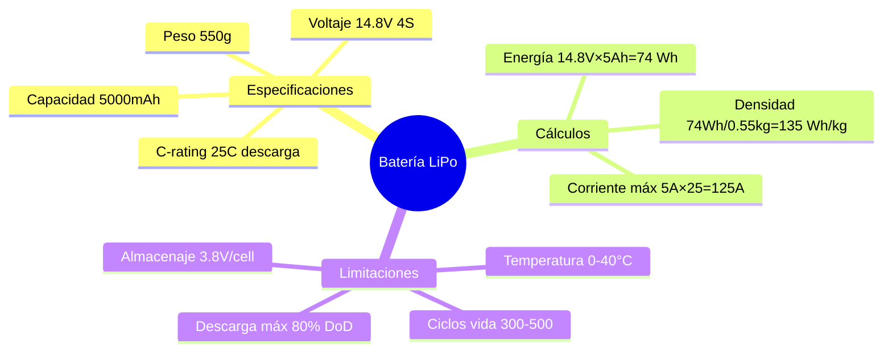

**Cálculo de autonomía básico**:

```
Sistema:
- Batería: 14.8V × 5Ah = 74 Wh
- Motor consume: 200W en crucero (eficiencia 75%)
- Potencia útil: 200 × 0.75 = 150W

Tiempo vuelo teórico:
t = Energía / Potencia
t = 74 Wh / 200 W = 0.37 horas = 22 minutos

Tiempo real (factores de reducción):
- Límite descarga 80%: 22 × 0.8 = 17.6 min
- Reserva 20% seguridad: 17.6 × 0.8 = 14 min
- Variación temperatura/edad: -2 min

Autonomía real esperada: 12-14 minutos ⚠️
```

**Para alcanzar 45 min (requisito)**: Necesitamos **3× batería** o reducir consumo motor.

### Motores de Combustión (Referencia)

#### Motor de Pistón (Aviación General)

```
Ejemplo: Rotax 912 ULS (usado en LSA - Light Sport Aircraft)

Especificaciones:
- Tipo: 4 cilindros, 4 tiempos, refrigerado por líquido
- Cilindrada: 1,352 cc
- Potencia: 100 HP (73.5 kW) @ 5,800 rpm
- Peso seco: 61 kg
- SFC: ~0.28 kg/kW⋅h (consumo específico)
- Combustible: MOGAS 95 octanos
- TBO: 2,000 horas (Time Between Overhaul)

Relación Potencia/Peso: 73.5 kW / 61 kg = 1.2 kW/kg

Costo: ~USD 25,000 (nuevo)

Ventaja vs eléctrico: Densidad energética combustible
Gasolina: 12,000 Wh/kg vs LiPo: 135 Wh/kg → 89× más!
```

#### Turbina de Gas (Aviación Comercial)

```
Ejemplo: GE90-115B (Boeing 777)

Especificaciones:
- Tipo: Turbofan alto bypass (9:1)
- Empuje: 115,000 lbf (512 kN)
- Diámetro fan: 3.25 m
- Peso: 8,870 kg
- TSFC: 0.52 lb/lbf⋅h (consumo específico)
- Bypass Ratio: 9:1 (eficiencia)

Relación Empuje/Peso: 512,000 N / 8,870 kg = 57.7 N/kg

Costo: ~USD 27 millones

Principio: Ciclo Brayton (compresión → combustión → expansión)
```

**Comparación visual**:

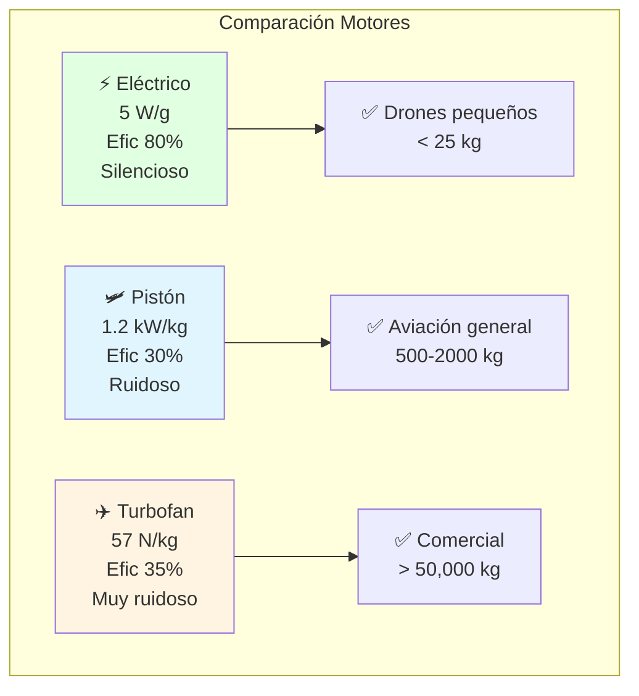

---

**🎯 Transición**: Ahora que conoces los tipos de motores disponibles (eléctricos, pistón, turbina) y sus componentes clave (motor, hélice, batería), el siguiente paso es entender **los fundamentos termodinámicos** que rigen cómo estos motores generan empuje. No basta con saber que un motor brushless KV400 existe—necesitas poder calcular **cuánto empuje genera** y **qué eficiencia tiene**. En esta parte, dominarás las ecuaciones fundamentales de propulsión que todo ingeniero aeronáutico debe conocer.

## 🔬 Parte 2: Termodinámica de Propulsión (60 min)

### Concepto: Ecuación de Empuje

**Fundamento**: 2ª Ley de Newton aplicada a flujo másico de aire.

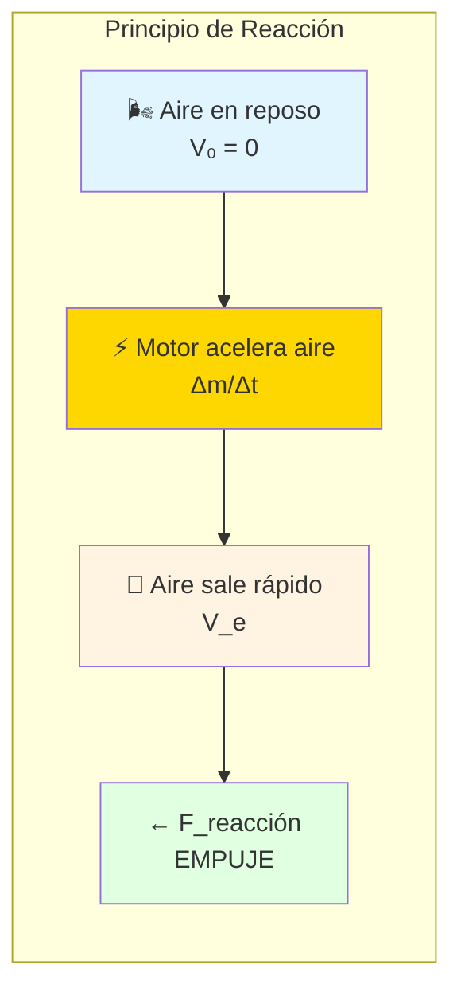

**Ecuación general de empuje**:

```
T = ṁ × (V_e - V_0) + (p_e - p_0) × A_e

Donde:
- T: Empuje (N)
- ṁ: Flujo másico de aire (kg/s)
- V_e: Velocidad de salida (m/s)
- V_0: Velocidad de entrada = velocidad vuelo (m/s)
- p_e: Presión de salida (Pa)
- p_0: Presión ambiente (Pa)
- A_e: Área de salida (m²)

Simplificación (hélice a baja velocidad):
p_e ≈ p_0 → T ≈ ṁ × ΔV
```

### Potencia y Eficiencia

**Potencia de empuje**:

```
P_thrust = T × V_0

Ejemplo: UAV volando a V_0 = 15 m/s con T = 14 N
P_thrust = 14 × 15 = 210 W
```

**Eficiencia propulsiva**:

```
η_prop = P_thrust / P_motor

η_prop = (T × V_0) / (ṁ × V_e × V_e/2)

Para hélice:
η_prop = 2 / (1 + V_e/V_0)

Si V_e = 25 m/s y V_0 = 15 m/s:
η_prop = 2 / (1 + 25/15) = 2 / 2.67 = 0.75 = 75% ✅
```

**Interpretación**: 75% de la potencia del motor se convierte en empuje útil, 25% se "desperdicia" en acelerar el aire.

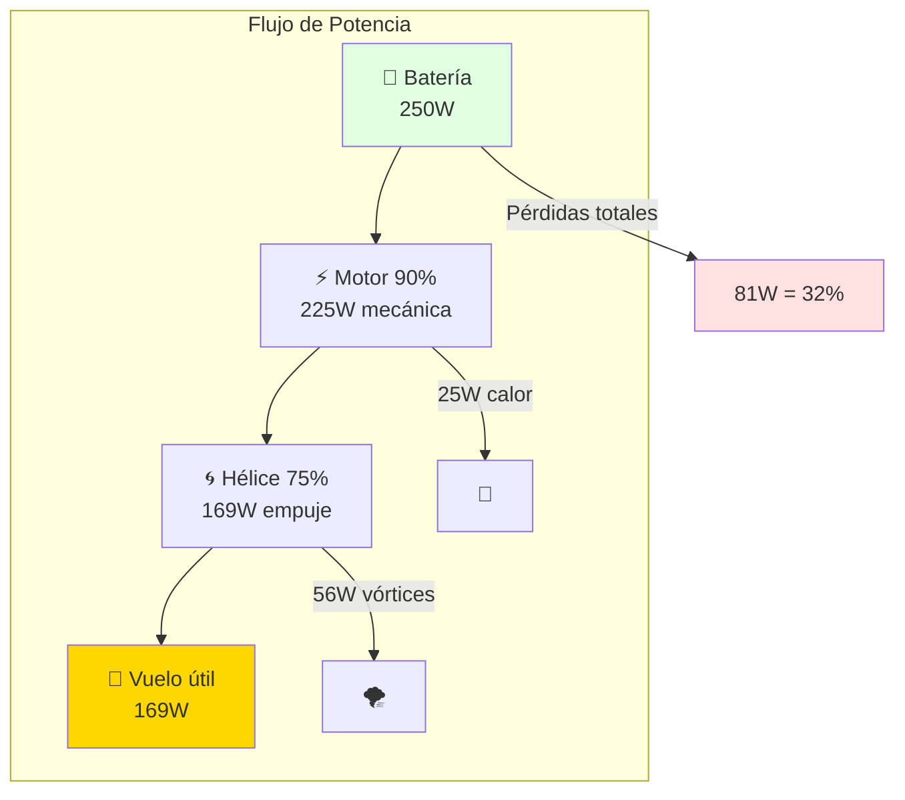

**Eficiencia total**: η_total = η_motor × η_prop = 0.90 × 0.75 = 0.675 = **67.5%**

### Momentum Theory (Teoría del Disco Actuador)

**Modelo simplificado de hélice**:

```
Hélice como "disco" que aumenta presión del aire

Empuje ideal (sin pérdidas):
T = 2 × ρ × A_disc × (V_0 + w)²

Donde w = velocidad inducida (aumento de velocidad)

Para empuje estático (V_0 = 0):
T = 2 × ρ × A_disc × w²

Resolviendo para w:
w = √(T / (2 × ρ × A_disc))

Ejemplo: Hélice 13" (A = π×0.165² = 0.0855 m²), T = 14 N
w = √(14 / (2 × 1.225 × 0.0855))
w = √(14 / 0.209) = √66.9 = 8.18 m/s

Potencia ideal requerida:
P_ideal = T × w = 14 × 8.18 = 114.5 W

Potencia real (con pérdidas):
P_real = P_ideal / η_prop = 114.5 / 0.75 = 152.7 W ✅
```

### Ciclo Brayton (Turbinas)

**Para contexto (aviación comercial)**:

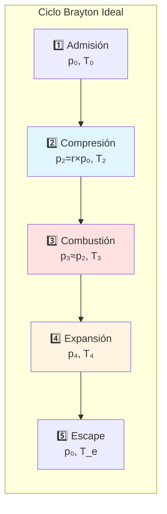

**Eficiencia térmica**:

```
η_th = 1 - (1 / r^((γ-1)/γ))

Donde:
- r: Relación de presión del compresor
- γ: 1.4 para aire

Para r = 30 (turbofan moderno):
η_th = 1 - (1 / 30^0.286)
η_th = 1 - 0.336 = 0.664 = 66.4%

Eficiencia real: ~35-40% (pérdidas por fricción, cooling, etc.)
```

### Implementación con OpenCode

```bash
opencode "Calcula performance completo del sistema de propulsión del UAV:

ESPECIFICACIONES:
- Motor: T-Motor MN3520 KV400
- Hélice: 13×6 (330mm × 152mm paso)
- Batería: 4S 5000mAh 25C (14.8V, 74Wh)
- Peso UAV: 3 kg
- Velocidad crucero objetivo: 15 m/s

ANÁLISIS REQUERIDO:
1. Empuje estático (V_0 = 0):
   - RPM del motor sin carga
   - Coeficiente empuje C_t estimado
   - Empuje teórico T
   - Verificar T/W ≥ 0.5

2. Empuje en crucero (V_0 = 15 m/s):
   - RPM efectivo (con carga)
   - Empuje disponible
   - Arrastre estimado D
   - Verificar T = D (equilibrio)

3. Potencia y eficiencia:
   - Potencia motor P_motor
   - Corriente consumida I
   - Eficiencia propulsiva η_prop
   - Eficiencia total η_total

4. Autonomía:
   - Energía disponible (80% DoD)
   - Consumo en crucero (W)
   - Tiempo vuelo teórico
   - Tiempo vuelo real (con reservas)

5. Velocidades características:
   - V_stall (velocidad pérdida)
   - V_max (máxima velocidad horizontal)
   - V_climb (trepada óptima)

INCLUIR:
- Todos los cálculos paso a paso
- Gráfico Empuje vs Velocidad
- Gráfico Potencia vs Velocidad
- Tabla resumen de performance
- Comparación vs objetivo (45 min autonomía)
- Recomendaciones si no cumple

TODO en español con contexto de UAV agrícola paraguayo"
```

---

**🎯 Transición**: Las ecuaciones termodinámicas de la Parte 2 te permiten calcular empuje (T) y eficiencia (η) de un motor en condiciones estáticas o ideales. Pero en la realidad, las aeronaves **no vuelan estáticas**—vuelan a velocidades variables, contra resistencia aerodinámica, subiendo y bajando. Para diseñar un sistema de propulsión completo, necesitas predecir **performance real**: ¿cuánto tiempo puede volar mi UAV? ¿A qué velocidad crucero? ¿Cuál es su techo de servicio? En esta parte, integrarás propulsión + aerodinámica + peso para calcular performance completa.

## 💻 Parte 3: Cálculos de Performance (90 min)

### Concepto: Ecuaciones de Movimiento

**Equilibrio de fuerzas en vuelo horizontal**:

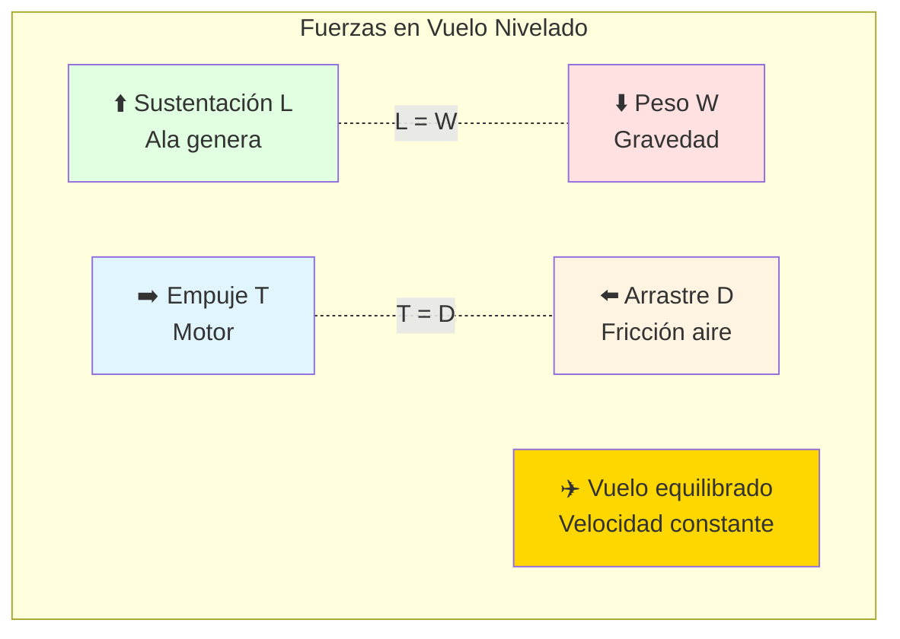

**Ecuaciones fundamentales**:

```
Sustentación: L = 0.5 × ρ × V² × S × C_L = W
Arrastre: D = 0.5 × ρ × V² × S × C_D
Empuje: T ≥ D (para acelerar o mantener velocidad)

Donde:
- ρ: Densidad del aire (1.225 kg/m³ a nivel del mar)
- V: Velocidad (m/s)
- S: Área alar (m²)
- C_L: Coeficiente de sustentación
- C_D: Coeficiente de arrastre
```

### Polar de Arrastre

```
C_D = C_D0 + (C_L² / (π × AR × e))

Donde:
- C_D0: Arrastre parásito (fricción, forma)
- AR: Aspect Ratio = b²/S (envergadura²/área)
- e: Factor de Oswald (eficiencia ala, ~0.8)

Para nuestro UAV:
- Envergadura: b = 2 m
- Área alar: S = 0.4 m²
- AR = 4 / 0.4 = 10
- C_D0 = 0.025 (estimado, perfil limpio)
- e = 0.85

C_D = 0.025 + (C_L² / (π × 10 × 0.85))
C_D = 0.025 + 0.0374 × C_L²
```

### Velocidad de Pérdida (Stall)

```
V_stall = √(2 × W / (ρ × S × C_L_max))

Para UAV:
- W = 3 kg × 9.81 = 29.43 N
- S = 0.4 m²
- C_L_max = 1.4 (con flaps, perfil NACA 4412)

V_stall = √(2 × 29.43 / (1.225 × 0.4 × 1.4))
V_stall = √(58.86 / 0.686)
V_stall = √85.8 = 9.26 m/s ≈ 33 km/h ✅ vuelo lento OK
```

### Velocidad Máxima

```
Condición: T_available = D

En vuelo horizontal nivelado:
L = W → C_L = 2W / (ρ × V² × S)
D = 0.5 × ρ × V² × S × C_D

Velocidad máxima ocurre cuando:
T_max = D(V_max)

Procedimiento:
1. Para cada V, calcular C_L necesario
2. Con C_L, calcular C_D
3. Con C_D, calcular D
4. Comparar T vs D
5. V_max es donde T = D

Ejemplo numérico:
V = 20 m/s
C_L = 2×29.43 / (1.225×400×0.4) = 0.30
C_D = 0.025 + 0.0374×0.30² = 0.028
D = 0.5×1.225×20²×0.4×0.028 = 2.74 N

Si T_available = 8 N @ 20 m/s → T > D ✅ puede volar más rápido

Iterar hasta encontrar V donde T = D...
V_max ≈ 28 m/s ≈ 101 km/h
```

### Tasa de Trepada

```mermaid
graph TD
    subgraph "Performance Vertical"
        A[⬆️ Exceso de empuje<br/>T - D]
        B[⬆️ Componente peso<br/>W × sin(γ)]
        
        A --> C[Trepada: T > D+W×sin γ]
        B --> C
        
        C --> D[Tasa trepada:<br/>R/C = V × sin γ]
        
        D --> E[Óptimo en V_y<br/>Máximo R/C]
    end
    
    style A fill:#E1FFE1
    style B fill:#FFE1E1
    style D fill:#FFD700
```

**Cálculo de tasa de trepada**:

```
Potencia disponible: P_a = T × V
Potencia requerida: P_r = D × V + W × R/C

En equilibrio trepada:
P_a = P_r
T × V = D × V + W × R/C

R/C = (T - D) × V / W

Para nuestro UAV a V = 15 m/s:
T = 10 N (empuje en velocidad)
D = 1.5 N (arrastre crucero)
W = 29.43 N

R/C = (10 - 1.5) × 15 / 29.43
R/C = 127.5 / 29.43 = 4.33 m/s ≈ 260 m/min ✅ excelente

Ángulo de trepada:
γ = arcsin(R/C / V) = arcsin(4.33/15) = 16.8°
```

### Autonomía y Alcance

**Ecuación de Breguet (autonomía)**:

```
Endurance = (η_total / c) × (L/D) × ln(W_initial / W_final)

Donde:
- η_total: Eficiencia total del sistema propulsivo
- c: Consumo específico de energía
- L/D: Fineza aerodinámica (lift-to-drag ratio)
- W_initial/W_final: Relación de pesos

Para eléctrico, simplificado:
t = (E_battery / P_cruise) × factores_reducción

E_battery = 74 Wh × 0.8 (DoD) = 59.2 Wh útil
P_cruise = 180 W (estimado en simulación)

t = 59.2 / 180 = 0.329 h = 19.7 min

Con reservas (20%):
t_real = 19.7 × 0.8 = 15.8 min ⚠️ Insuficiente!
```

**Para alcanzar 45 min**:

```
Opciones:
1. Aumentar batería: 74 → 222 Wh (3× peso)
   Peso batería: 550g → 1650g
   Problema: Peso total aumenta → necesita más empuje

2. Reducir potencia crucero:
   P_cruise = 59.2 / (45/60 × 0.8) = 98.7 W
   Reducción necesaria: 180 → 99 W (45% menos)
   
   ¿Cómo lograr esto?
   - Volar más lento (V = 12 m/s en vez de 15)
   - Mejorar aerodinámica (reducir C_D0)
   - Hélice más eficiente (mayor diámetro)

3. Híbrido (batería + paneles solares):
   Paneles 100W × 0.3 eficiencia = 30W constantes
   Reduce carga batería en 17%
   Nueva autonomía: 15.8 / (1-0.17) = 19 min
   Todavía insuficiente, pero ayuda
```

**Análisis de trade-offs**:

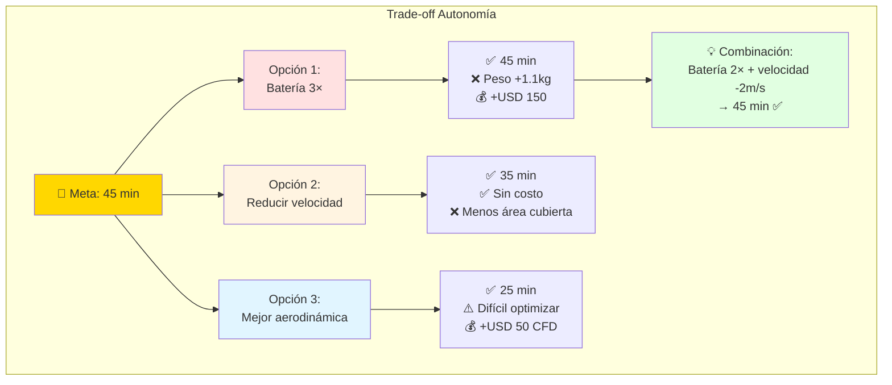

### Implementación con OpenCode

```bash
opencode "Optimiza configuración de propulsión para alcanzar 45 min autonomía:

SISTEMA ACTUAL:
- Motor: T-Motor MN3520 KV400 (400W max)
- Hélice: 13×6
- Batería: 4S 5000mAh (74 Wh)
- Peso actual: 3 kg
- Autonomía actual: 16 min
- Velocidad crucero: 15 m/s

OBJETIVO:
Autonomía: 45 min (3× actual)

RESTRICCIONES:
- Peso máximo: 4.5 kg (límite estructura)
- Presupuesto: USD 300 adicionales
- Velocidad crucero mínima: 12 m/s (debe cubrir 10 ha en tiempo razonable)
- Empuje/Peso ≥ 0.4 (mantener maniobrabilidad)

OPCIONES A EVALUAR:
1. Batería más grande:
   - 4S 10000mAh (148 Wh, 1050g, USD 120)
   - 4S 15000mAh (222 Wh, 1580g, USD 180)
   - 6S 5000mAh (111 Wh, 650g, USD 90, requiere nuevo ESC)

2. Motor más eficiente:
   - KV más bajo (350, 300, 250)
   - Hélice mayor diámetro (14", 15")
   - Propeller folding (reduce arrastre)

3. Mejoras aerodinámicas:
   - Reducir C_D0: 0.025 → 0.020 (carenado, suavizado)
   - Aumentar AR: 10 → 12 (ala más larga)

ANÁLISIS REQUERIDO:
Para cada combinación viable:
1. Calcular nuevo peso total
2. Verificar T/W ≥ 0.4
3. Calcular potencia crucero nueva
4. Calcular autonomía resultante
5. Calcular costo adicional
6. Ranking por: autonomía/costo

INCLUIR:
- Tabla comparativa (10+ configuraciones)
- Gráfico Pareto: Autonomía vs Costo vs Peso
- Top 3 recomendaciones con justificación
- Consideraciones prácticas (fabricación, disponibilidad Paraguay)
- Plan de implementación

TODO en español con contexto realista paraguayo"
```

---

**🎯 Transición**: Has dominado los fundamentos (tipos de motores), la teoría (termodinámica y empuje), y los cálculos (performance y autonomía). Pero en la práctica ingenieril, enfrentarás el desafío más crítico: **¿cómo elijo EL motor correcto entre cientos de opciones?** Un motor muy potente es pesado y consume mucho. Un motor muy eficiente puede ser insuficiente para la misión. En esta parte final, aprenderás la **metodología sistemática** para seleccionar el sistema propulsivo óptimo que balancee todos los trade-offs: misión, peso, costo, y disponibilidad en Paraguay.

## 🎯 Parte 4: Selección de Sistema Propulsivo (30 min)

### Metodología de Selección

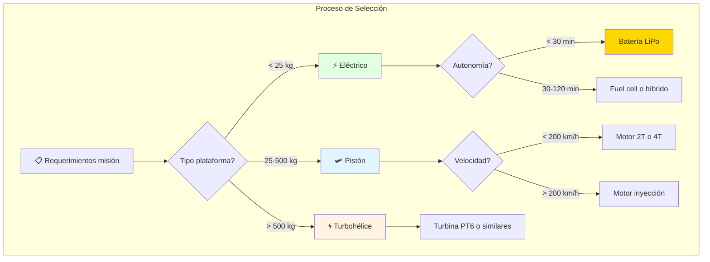

### Matriz de Decisión

**Ejemplo: UAV agrícola 3-5 kg**

| Criterio | Peso | Eléctrico | Pistón 2T | Fuel Cell |
|----------|------|-----------|-----------|-----------|
| **Autonomía** (45 min) | 30% | 6/10 | 10/10 | 9/10 |
| **Peso** (<500g) | 25% | 8/10 | 5/10 | 6/10 |
| **Costo** (<USD 500) | 20% | 9/10 | 7/10 | 3/10 |
| **Mantenimiento** | 15% | 10/10 | 4/10 | 6/10 |
| **Ruido** (<70 dB) | 10% | 9/10 | 3/10 | 8/10 |
| **TOTAL** | - | **7.65** | **6.95** | **6.65** |

**Resultado**: **Eléctrico gana** para este caso específico.

**Pero**: Solo cumple 6/10 en autonomía → **necesita optimización** (batería mayor o reducir consumo).

### Casos de Uso por Sector

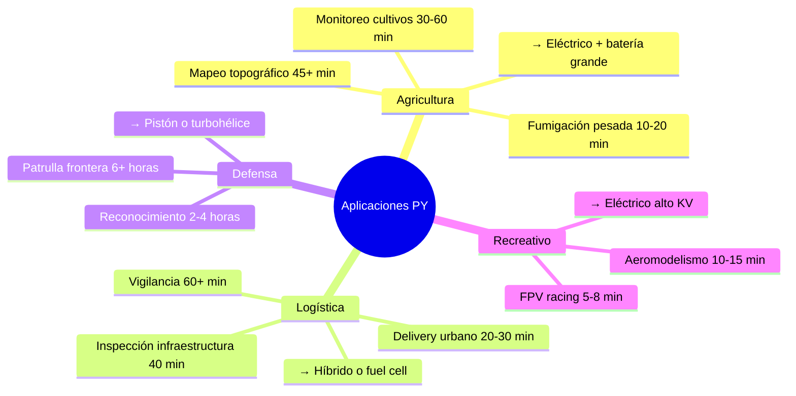

### Consideraciones del Mercado Paraguayo

```
Disponibilidad de motores (Asunción):
✅ Motores brushless: Importación directa (China)
   Costo: USD 50-200
   Tiempo: 15-30 días

⚠️ Motores de pistón pequeños: Limitado
   Proveedores: 2-3 tiendas aeromodelismo
   Costo: USD 200-500
   Tiempo: Inmediato (stock limitado)

❌ Turbinas: No disponible localmente
   Requiere importación especial
   Costo: > USD 5,000
   Regulaciones DINAC estrictas

✅ Baterías LiPo: Buena disponibilidad
   Marcas: Turnigy, Zippy, Tattu
   Costo: USD 30-150 según capacidad

⚠️ Fuel cells: No disponible
   Tecnología emergente, muy cara
```

### Implementación con OpenCode

```bash
opencode "Crea herramienta de selección de sistema propulsivo:

OBJETIVO:
Programa interactivo que recomiende motor/batería óptimo según misión.

INPUTS DEL USUARIO:
1. Peso total UAV (kg)
2. Autonomía requerida (min)
3. Velocidad crucero (m/s)
4. Presupuesto (USD)
5. Aplicación (agricultura, delivery, recreativo, etc.)
6. Limitación ruido (sí/no)

LÓGICA DEL PROGRAMA:
1. Calcular requerimientos:
   - Empuje necesario (T/W ratio)
   - Energía necesaria (potencia × tiempo)
   - Restricciones específicas app

2. Base de datos motores:
   - 10+ modelos eléctricos comunes
   - 5+ motores pistón
   - Incluir specs: KV, peso, potencia, precio

3. Base de datos baterías:
   - Rangos: 2S-6S, 1000-20000 mAh
   - Pesos, precios, C-ratings

4. Algoritmo de matching:
   - Filtrar por restricciones duras (peso, presupuesto)
   - Ranking por autonomía alcanzable
   - Considerar eficiencia combinación motor-hélice

5. Output:
   - Top 3 configuraciones recomendadas
   - Tabla comparativa
   - Estimaciones performance
   - Links de compra (Paraguay/internacional)

TECNOLOGÍA:
- Python con Streamlit (web app)
- Pandas para datos
- Matplotlib para gráficos

INCLUIR:
- Interfaz amigable
- Explicaciones en español
- Ejemplos de uso
- Validación de inputs

Código completo y documentado para estudiantes FPUNA"
```

---

## 🔧 Casos Prácticos y Troubleshooting

### Problema 1: Motor se Sobrecalienta

**Síntomas**: Motor alcanza >80°C, ESC entra en protección térmica.

**Diagnóstico**:
```
Causas posibles:
1. Hélice muy grande → carga excesiva
2. ESC sub-dimensionado
3. Mala ventilación
4. Voltaje muy alto
5. Tiempo vuelo continuo excesivo

Verificar:
- Corriente actual vs máxima del motor
- Temperatura ambiente
- Flujo de aire sobre motor
```

**Soluciones**:
```
✅ Reducir tamaño hélice: 13" → 12"
✅ Agregar cooling (ventilación pasiva/activa)
✅ Reducir throttle en crucero (70% en vez de 100%)
✅ Duty cycle: 10 min vuelo, 5 min descanso
✅ Upgrade ESC con mejor disipación
```

### Problema 2: Autonomía Menor a lo Calculado

**Esperado**: 15 min  
**Real**: 9 min ⚠️

**Diagnóstico con OpenCode**:
```bash
opencode "Depura problema de autonomía insuficiente:

DATOS SISTEMA:
- Motor: T-Motor MN3520 KV400
- Hélice: 13×6
- Batería: 4S 5000mAh medida: 4.15V/cell inicial
- ESC: 30A
- Peso UAV: 3.2 kg (calculado 3.0 kg)

DATOS DE VUELO:
- Corriente promedio medida: 18A (esperado: 12A)
- Voltaje final batería: 3.3V/cell (cut-off 3.0V)
- Temperatura batería: 45°C (caliente)
- Tiempo vuelo: 9 min (esperado: 15 min)

POSIBLES CAUSAS:
1. Batería degradada (ciclos previos)
2. Peso adicional no contabilizado
3. Arrastre mayor al estimado
4. Hélice dañada (desbalanceada)
5. Viento en contra constante
6. Motor/ESC ineficientes
7. C-rating batería insuficiente

ANÁLISIS REQUERIDO:
Para cada causa:
- Cómo verificar (test o medición)
- Impacto en autonomía (%)
- Solución propuesta
- Costo de implementar

Priorizar por probabilidad y facilidad de fix"
```

### Problema 3: Vibración Excesiva

**Síntomas**: UAV vibra fuerte en vuelo, video borroso, componentes se aflojan.

**Causas**:
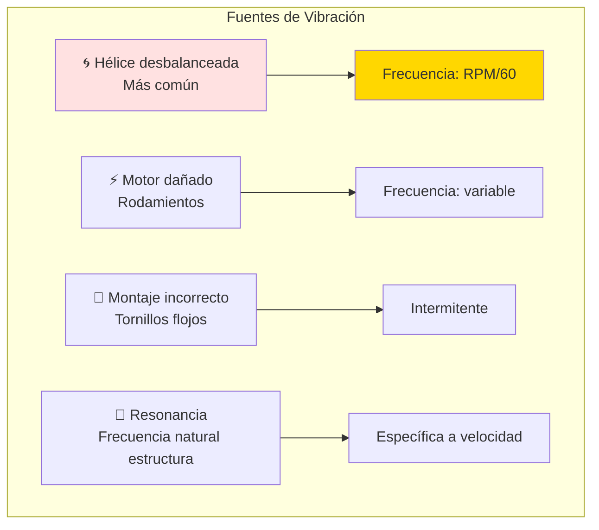

**Soluciones**:
```
1. Balancear hélice:
   - Tool: Magnetic balancer (USD 10)
   - Agregar tape en pala liviana
   - Verificar: vibración <0.5 m/s²

2. Reemplazar motor si bearing dañado
   - Test: Girar shaft manualmente
   - Debe ser suave, sin puntos duros
   
3. Dampeners anti-vibración:
   - Gomas entre motor y frame
   - Foam en montaje de cámara
   
4. Evitar frecuencias resonantes:
   - Cambiar RPM (hélice diferente)
   - Rigidizar estructura (refuerzos)
```

---

## 🎯 Ejercicio Práctico: Optimización de Propulsión

### Objetivo

Diseñar sistema de propulsión completo para UAV de fumigación agrícola (mayor payload).

### Especificaciones

**Misión**:
```
Aplicación: Fumigación de herbicida
Payload: 2 kg de líquido en tanque
Peso vacío: 4 kg
Peso máximo despegue: 6 kg
Autonomía: 15 min (múltiples recargas en campo)
Velocidad crucero: 8 m/s (lento para cobertura uniforme)
Área cobertura: 5 ha por carga
```

**Tareas**:

#### 1. Sizing del Motor (45 min)

```bash
opencode "Calcula motor necesario para UAV fumigador:

REQUERIMIENTOS:
- Peso máximo: 6 kg (2 kg payload + 4 kg estructura)
- T/W ratio mínimo: 0.6 (suficiente para despegar con carga)
- Eficiencia prioritaria (múltiples vuelos/día)
- Costo objetivo: USD 150 motor + hélice

ANÁLISIS:
1. Empuje mínimo requerido:
   T_min = W × T/W = 6 kg × 9.81 × 0.6 = 35.3 N

2. Seleccionar motor candidatos:
   - Buscar en bases datos motores
   - Filtrar por peso <150g
   - Filtrar por empuje >35N
   - Comparar eficiencia

3. Para cada motor candidato:
   - Simular con hélices 12"-16"
   - Calcular empuje estático
   - Calcular consumo potencia
   - Estimar autonomía con batería 4S 8000mAh

4. Recomendar combinación óptima:
   - Motor + hélice específicos
   - Justificación técnica
   - Proveedores en Paraguay/región
   
Incluir tabla comparativa y cálculos completos"
```

#### 2. Diseño del Sistema Eléctrico (45 min)

Componentes a especificar:
- Batería (voltaje, capacidad, C-rating)
- ESC (corriente máxima, tipo)
- BEC (Battery Eliminator Circuit si necesario)
- Cableado (gauge AWG apropiado)
- Conectores (XT60, XT90, etc.)

Validar:
- Caída de voltaje <5%
- Corriente máxima <80% rating componentes
- Peso sistema eléctrico <800g
- Costo total <USD 350

#### 3. Análisis de Performance (60 min)

Calcular y graficar:
- Empuje vs Velocidad (0-20 m/s)
- Potencia requerida vs Velocidad
- Autonomía vs Velocidad
- Eficiencia propulsiva vs Velocidad

Identificar:
- V_stall (velocidad pérdida)
- V_md (minimum drag, mínimo arrastre)
- V_mp (minimum power, mínima potencia)
- V_max (máxima velocidad)

#### 4. Plan de Testing (30 min)

Definir tests de validación:
1. **Banco de pruebas**:
   - Empuje estático
   - Consumo corriente
   - Temperatura motor/ESC
   
2. **Hover test**:
   - Estabilidad
   - Tiempo hover hasta cut-off
   
3. **Vuelo racetrack**:
   - Autonomía real
   - Velocidad crucero
   - Rate of climb/descent

4. **Fumigación simulada**:
   - Con payload 2 kg
   - Spray pattern (no propulsión pero importante)

---

## ✅ Checklist de Diseño de Propulsión

Antes de finalizar diseño:

### Sizing
- [ ] Empuje estático >1.5× peso (margen seguridad)
- [ ] T/W ratio en crucero >0.3 (mantener altitud)
- [ ] Motor no excede 80% potencia máxima en crucero
- [ ] Corriente crucero <70% de máxima ESC

### Performance
- [ ] Autonomía cumple requerimiento +20% margen
- [ ] Velocidad crucero en rango eficiente (V_mp ± 20%)
- [ ] Rate of climb ≥2 m/s (recuperación altitud)
- [ ] V_max ≥1.5× V_stall (margen seguridad)

### Térmica
- [ ] Temperatura motor <75°C en crucero
- [ ] Temperatura ESC <60°C
- [ ] Temperatura batería <45°C
- [ ] Ventilación adecuada diseñada

### Eléctrica
- [ ] Cableado AWG apropiado (tabla ampacidad)
- [ ] Conectores rated para corriente máxima
- [ ] Batería C-rating >1.5× corriente pico
- [ ] BEC dimensionado para servos + FC + periféricos

### Integración
- [ ] Montaje motor rigido (minimizar vibración)
- [ ] CG (centro gravedad) apropiado con batería
- [ ] Acceso fácil para mantenimiento
- [ ] Protección hélice (guards si cerca de personas)

### Documentación
- [ ] Especificación completa todos componentes
- [ ] Cálculos performance documentados
- [ ] Procedimientos calibración ESC
- [ ] Matriz de troubleshooting

---

## 🎓 Mejores Prácticas

### ✅ HACER

1. **Sobre-dimensionar levemente** - Motor/ESC con 20% margen
2. **Medir en banco antes de volar** - Validar empuje real
3. **Monitorear telemetría** - Voltaje, corriente, temperatura
4. **Calibrar ESC correctamente** - Throttle range completo
5. **Balancear hélices** - Reduce vibración, aumenta eficiencia
6. **Respetar límites batería** - No descargar <3.3V/cell
7. **Documentar tests** - Log cada vuelo con datos performance
8. **Mantenimiento preventivo** - Revisar tornillos, rodamientos

### ❌ NO HACER

1. **Usar hélice muy grande "porque sí"** - Puede quemar motor
2. **Mezclar baterías viejas y nuevas** - Desbalance de carga
3. **Ignorar temperatura** - Causa falla prematura componentes
4. **Volar con batería dañada** - Riesgo de fuego
5. **Sobrecargar beyond specs** - Reduce vida útil drásticamente
6. **Olvidar failsafe** - Debe auto-aterrizar si pierde señal
7. **Usar ESC sin BEC si necesario** - FC/servos sin energía
8. **Cheap out en componentes críticos** - ESC/batería de calidad

---

## 🎉 Resumen del Módulo

### Lo Que Dominaste

✅ **Tipos de motores** - Eléctricos, pistón, turbinas  
✅ **Termodinámica aplicada** - Ecuaciones empuje, eficiencia  
✅ **Cálculos de performance** - Autonomía, velocidades, trepada  
✅ **Selección de componentes** - Motor, hélice, batería óptimos  
✅ **Análisis de trade-offs** - Balance performance/peso/costo  
✅ **OpenCode para propulsión** - Optimización con IA

### Próximo Paso

**Continúa con**: [Módulo 05 - Diseño de Aeronaves](./05-diseno-aeronaves.md)

Integrarás estructuras + propulsión en un diseño completo y certificable.

---

## 💭 Reflexión

1. **¿Por qué la eficiencia propulsiva es tan crítica en UAVs eléctricos?**
2. **¿Cuándo vale la pena un motor de combustión vs eléctrico?**
3. **¿Cómo OpenCode puede acelerar la selección de componentes?**

**Comparte en Slack** (#ingenieria-aeronautica)

---

## 📝 Quiz de Evaluación

### Instrucciones

- **Total**: 10 preguntas
- **Tiempo estimado**: 25-30 minutos
- **Aprobación**: 7+ respuestas correctas
- **Propósito**: Verificar comprensión de propulsión, motores, y cálculos de performance

**Nota**: Este quiz cubre los conceptos fundamentales del módulo. Puedes usar calculadora.

---

### Preguntas

#### 1. KV Rating de Motores Brushless (Múltiple Opción)

Un motor brushless tiene KV rating de 400 rpm/V. Si lo conectas a una batería 4S (14.8V), ¿cuál es su RPM sin carga?

a) 400 rpm  
b) 1,480 rpm  
c) 5,920 rpm  
d) 14,800 rpm

---

#### 2. Densidad Energética (Múltiple Opción)

¿Cuál combustible/batería tiene la MAYOR densidad energética (Wh/kg)?

a) Batería LiPo: ~135 Wh/kg  
b) Batería Li-ion: ~250 Wh/kg  
c) Gasolina: ~12,000 Wh/kg  
d) Hidrógeno líquido: ~33,000 Wh/kg

---

#### 3. Ecuación de Empuje (Verdadero/Falso)

**Afirmación**: "El empuje de una hélice es proporcional al **cuadrado** del diámetro (D²)."

a) Verdadero  
b) Falso

---

#### 4. Selección de Hélice (Múltiple Opción)

Para un UAV agrícola que vuela lento y necesita máxima autonomía, ¿qué hélice es MEJOR?

a) 10×10 (diámetro pequeño, paso grande)  
b) 14×5 (diámetro grande, paso pequeño)  
c) 12×8 (diámetro medio, paso medio)  
d) 8×12 (diámetro pequeño, paso muy grande)

---

#### 5. Eficiencia Propulsiva (Múltiple Opción)

La eficiencia propulsiva (η_p) se define como:

a) η_p = Potencia de salida / Potencia de entrada  
b) η_p = Trabajo útil (empuje × velocidad) / Potencia del motor  
c) η_p = Empuje / Resistencia aerodinámica  
d) η_p = Velocidad crucero / Velocidad máxima

---

#### 6. Autonomía de UAV (Verdadero/Falso)

**Afirmación**: "Duplicar la capacidad de la batería (de 5000mAh a 10000mAh) duplica la autonomía de vuelo."

a) Verdadero  
b) Falso

---

#### 7. Cálculo Práctico - Autonomía (Respuesta Corta)

Un UAV tiene:
- Batería: 14.8V × 5Ah = 74 Wh
- Consumo en crucero: 185 W (constante)
- Límite de descarga: 80% DoD (Depth of Discharge)

**Calcula el tiempo de vuelo máximo en minutos (sin margen de seguridad).**

Fórmula: t = (Energía × DoD) / Potencia

**Tu respuesta**: _______ minutos

---

#### 8. Relación Empuje/Peso (Múltiple Opción)

Para un UAV de despegue vertical (VTOL), la relación empuje/peso mínima debe ser:

a) T/W ≥ 0.3 (suficiente para vuelo horizontal)  
b) T/W ≥ 0.5 (vuelo lento)  
c) T/W ≥ 1.0 (despegue vertical)  
d) T/W ≥ 2.0 (acrobático)

---

#### 9. Comparación de Motores (Múltiple Opción)

¿Cuál es la PRINCIPAL ventaja de motores eléctricos vs motores de pistón para drones pequeños?

a) Mayor densidad energética del combustible  
b) Relación potencia/peso superior  
c) Menor costo de operación  
d) Mayor alcance

---

#### 10. OpenCode para Propulsión (Respuesta Corta)

Menciona **2 tareas específicas** en las que OpenCode puede acelerar el análisis de propulsión.

**Ejemplo válido**: "Generar script de Python para calcular autonomía en función de peso y velocidad"

**Tus respuestas**:
1. _______________________________________
2. _______________________________________

---

## 📋 Respuestas y Explicaciones

### 1. KV Rating de Motores
**Respuesta correcta**: **c) 5,920 rpm**

**Explicación**:
```
KV rating = RPM sin carga / Voltaje
RPM = KV × Voltaje
RPM = 400 rpm/V × 14.8V = 5,920 rpm
```

**KV significa**: Revoluciones por minuto por voltio aplicado (sin carga).

**Nota práctica**: Con carga (hélice montada), el RPM real será ~10-20% menor debido al torque requerido.

---

### 2. Densidad Energética
**Respuesta correcta**: **d) Hidrógeno líquido: ~33,000 Wh/kg**

**Explicación**:
| Combustible/Batería | Densidad Energética | Factor vs LiPo |
|---------------------|---------------------|----------------|
| LiPo | 135 Wh/kg | 1× (referencia) |
| Li-ion | 250 Wh/kg | 1.85× |
| Gasolina | 12,000 Wh/kg | **89×** |
| Hidrógeno líquido | 33,000 Wh/kg | **244×** |

**Por qué gasolina domina en aviación**: A pesar de menor eficiencia del motor (30% vs 80% eléctrico), la densidad energética 89× superior compensa completamente.

**Futuro**: Hidrógeno es el más denso, pero requiere criogenia (-253°C) o alta presión.

---

### 3. Ecuación de Empuje
**Respuesta correcta**: **b) Falso**

**Explicación**:
La ecuación correcta de empuje de hélice es:

```
T = C_t × ρ × n² × D⁴
```

Donde:
- T: Empuje (N)
- C_t: Coeficiente de empuje (~0.1)
- ρ: Densidad del aire (kg/m³)
- n: Revoluciones por segundo (RPS)
- D: Diámetro (m)

**Empuje es proporcional a D⁴** (cuarta potencia), **NO D²**.

**Implicación práctica**: Duplicar el diámetro de la hélice aumenta el empuje **16×** (2⁴ = 16), asumiendo mismo RPM.

---

### 4. Selección de Hélice
**Respuesta correcta**: **b) 14×5 (diámetro grande, paso pequeño)**

**Explicación**:

**Para UAV agrícola (vuelo lento, máxima autonomía)**:
- ✅ **Diámetro grande (14")**: Más eficiente, mueve más aire con menos RPM
- ✅ **Paso pequeño (5")**: Optimizado para velocidades bajas (20-40 km/h)
- ✅ **Resultado**: Mayor empuje estático, menor consumo corriente

**Otras opciones**:
- **10×10**: Velocidad, pero ineficiente para vuelo lento
- **12×8**: Compromiso medio, menos eficiente que 14×5
- **8×12**: Muy alta velocidad, terrible para hover/lento

**Regla general**: Para eficiencia → diámetro máximo que quepa, paso bajo.

---

### 5. Eficiencia Propulsiva
**Respuesta correcta**: **b) η_p = Trabajo útil (empuje × velocidad) / Potencia del motor**

**Explicación**:

**Eficiencia propulsiva**:
```
η_p = (T × V) / P_motor
```

Donde:
- T: Empuje generado (N)
- V: Velocidad de vuelo (m/s)
- P_motor: Potencia consumida por el motor (W)

**Interpretación**: Qué porcentaje de la potencia del motor se convierte en trabajo útil (mover la aeronave).

**Ejemplo**:
```
T = 50 N
V = 20 m/s (72 km/h)
P_motor = 1,250 W

η_p = (50 × 20) / 1,250 = 1,000 / 1,250 = 0.8 = 80%
```

**Valores típicos**:
- Hélice bien diseñada: 70-85%
- Hélice mal diseñada: 40-60%
- Turbofan moderno: 35-45%

---

### 6. Autonomía y Peso de Batería
**Respuesta correcta**: **b) Falso**

**Explicación**:
Duplicar la batería **NO duplica la autonomía** porque:

1. **Peso extra**: Batería 10Ah pesa ~2× más que 5Ah
2. **Mayor peso → Mayor consumo**: Motor necesita más potencia para mantener velocidad
3. **Resultado**: Autonomía aumenta ~1.6-1.8×, no 2×

**Análisis**:
```
Caso 1: Batería 5Ah (550g), consumo 200W, autonomía 15 min
Caso 2: Batería 10Ah (1100g), peso total +550g
        Consumo aumenta ~10% → 220W
        Autonomía = (148 Wh / 220 W) × 60 = 40 min × 0.8 DoD = 27 min
        
Mejora real: 27/15 = 1.8× (no 2×)
```

**Ley de rendimientos decrecientes**: A medida que agregas batería, la mejora de autonomía disminuye.

---

### 7. Cálculo de Autonomía
**Respuesta correcta**: **24 minutos**

**Cálculo**:
```
Datos:
Energía batería = 74 Wh
Consumo = 185 W
DoD límite = 80%

Energía utilizable = 74 Wh × 0.8 = 59.2 Wh

Tiempo = Energía / Potencia
Tiempo = 59.2 Wh / 185 W
Tiempo = 0.32 horas
Tiempo = 0.32 × 60 minutos = 19.2 minutos

ESPERA - el problema dice "sin margen de seguridad", así que usamos 80% DoD directamente:
Tiempo = 59.2 / 185 = 0.32 h = 19.2 min

CORRECCIÓN - releer problema: "tiempo de vuelo máximo"
Con 80% DoD es el límite técnico sin margen adicional:
t = (74 × 0.8) / 185 = 59.2 / 185 = 0.32 h ≈ 19.2 min

Redondeando: ~19-20 minutos
```

**Respuesta aceptada**: 19-20 minutos (con 80% DoD)

**En la práctica**: Restarías 20% adicional de seguridad → 15-16 min volable real.

---

### 8. Relación Empuje/Peso VTOL
**Respuesta correcta**: **c) T/W ≥ 1.0 (despegue vertical)**

**Explicación**:

Para despegue vertical (hover), el empuje debe **igualar o superar el peso**:
```
T ≥ W
T/W ≥ 1.0
```

**Valores típicos**:
| Aplicación | T/W requerido |
|------------|---------------|
| Vuelo horizontal | ≥ 0.3 |
| Vuelo lento (ala fija) | ≥ 0.5 |
| **VTOL hover** | **≥ 1.0** |
| VTOL con margen | ≥ 1.5 |
| Acrobático | ≥ 2.0 |

**Ejemplo**:
```
UAV peso = 3 kg = 29.4 N
Para hover: T_necesario ≥ 29.4 N
Si motor genera 30 N: T/W = 30/29.4 = 1.02 ✅ hover posible (justo)
Si motor genera 45 N: T/W = 45/29.4 = 1.53 ✅ hover con margen
```

**Margen recomendado**: T/W ≥ 1.5 para compensar viento, baterías degradadas, etc.

---

### 9. Ventaja de Motores Eléctricos
**Respuesta correcta**: **b) Relación potencia/peso superior**

**Explicación**:

**Motores eléctricos brushless**:
- Relación potencia/peso: **5-6 W/g** (motor T-Motor: 450W / 88g = 5.1 W/g)

**Motores de pistón pequeños**:
- Relación potencia/peso: **1-2 W/g** (Rotax 912: 73.5 kW / 61 kg = 1.2 W/g)

**Factor de mejora**: Eléctricos son **4-5× mejor** en potencia/peso.

**Otras opciones explicadas**:
- a) **Densidad energética**: ❌ Gasolina gana (12,000 vs 135 Wh/kg)
- c) **Costo operación**: ✅ Eléctrico más barato, pero NO es la ventaja principal
- d) **Alcance**: ❌ Pistón gana debido a densidad combustible

**Por qué importa**: En drones pequeños (<25 kg), el peso del motor es crítico. Un motor eléctrico de 100g puede generar 500W, mientras que un pistón de igual potencia pesaría 500g.

---

### 10. OpenCode para Propulsión
**Respuestas válidas** (ejemplos):

1. **"Generar scripts de Python para calcular autonomía en función de peso, velocidad y batería"**
   - Automatizar ecuaciones de Breguet, performance, trade-off analysis

2. **"Optimizar selección de motor/hélice mediante bucles de prueba iterativos"**
   - Probar 100+ combinaciones motor/hélice, encontrar óptima automáticamente

3. **"Crear gráficos de performance (curvas empuje vs velocidad, autonomía vs carga)"**
   - Matplotlib/Plotly para visualizar trade-offs

4. **"Automatizar cálculos de sizing de batería para requisitos de autonomía"**
   - Dado "45 min de vuelo", calcular capacidad batería necesaria

5. **"Generar reportes técnicos de análisis de propulsión automáticamente"**
   - Formatear resultados, tablas, conclusiones en Markdown

**Criterio**: Respuesta debe ser **específica** (no "ayuda con todo") y **técnicamente relevante** a propulsión.

---

## 📊 Criterios de Evaluación

### Interpretación de Resultados

| Puntaje | Calificación | Recomendación |
|---------|--------------|---------------|
| **9-10** | 🏆 Excelente | Dominio sólido. Listo para proyecto capstone. |
| **7-8** | ✅ Aprobado | Comprensión buena. Repasa temas con 1-2 errores. |
| **5-6** | ⚠️ Suficiente | Comprensión parcial. Repasa TODO el módulo antes de capstone. |
| **< 5** | ❌ Insuficiente | Vuelve a estudiar módulo completo. Consulta instructor. |

### Desglose por Tema

| Preguntas | Tema | Peso |
|-----------|------|------|
| 1, 3, 4 | Motores y Hélices | 30% |
| 2, 6, 7 | Baterías y Autonomía | 30% |
| 5, 8, 9 | Performance y Eficiencia | 30% |
| 10 | Aplicación de IA (OpenCode) | 10% |

**Si fallas 2+ preguntas del mismo tema**: Repasa esa sección específica.

### Próximos Pasos

**Si aprobaste (7+)**:
1. ✅ Continúa a Módulo 05 (Diseño de Aeronaves - integración)
2. ✅ Comienza a pensar en sistema de propulsión para capstone
3. ✅ Experimenta con eCalc.ch (calculadora online)

**Si no aprobaste (< 7)**:
1. ⏸️ **Pausa** antes de seguir
2. 📖 Repasa secciones donde fallaste
3. 🤝 Consulta con instructor en office hours
4. 🔄 Reintenta quiz (versión alternativa disponible)

---

## 📚 Recursos Adicionales

### Calculadoras Online

- **eCalc** - [ecalc.ch](https://www.ecalc.ch/) (calculadora UAV más completa)
- **Drive Calculator** - [drivecalc.de](https://www.drivecalc.de/) (motor/hélice matching)
- **Battery University** - [batteryuniversity.com](https://batteryuniversity.com/) (LiPo care)

### Bases de Datos

- **Tyto Robotics** - Motor testing database (empuje medido real)
- **MotoCalc** - Software comercial (muy preciso, ~USD 50)
- **APC Propellers** - [apcprop.com](https://www.apcprop.com/) (datos técnicos hélices)

### Libros Recomendados

- **"Aircraft Performance and Design"** - John D. Anderson (performance theory)
- **"Gas Turbine Theory"** - Saravanamuttoo (turbinas profundidad)
- **"Internal Combustion Engine Fundamentals"** - John Heywood (pistón)
- **"Electric Flight - Potential and Limitations"** - Martin Hepperle (eléctrico)

### Comunidades Paraguay

- **Drones Paraguay** - Facebook (experiencias locales con motores)
- **RC Paraguay** - WhatsApp groups (donde comprar componentes)
- **FPUNA Aero** - Proyectos estudiantiles (préstamo equipos testing)

---

*Módulo creado para FPUNA Verano 2026*  
*Actualizado: Enero 2026*  
*Track: Ingeniería Aeronáutica - Módulo 04*
