# ✈️ Módulo 05: Diseño Integral de Aeronaves

## Del Concepto a la Certificación: Diseño Completo con Metodología Profesional

> **Para Ingenieros Aeronáuticos**: Este módulo integra todo lo aprendido (CAD, aerodinámica, estructuras, propulsión) en un proceso completo de diseño de aeronaves. Aprenderás metodología de diseño conceptual, análisis de trade-offs, certificación básica, y documentación técnica profesional usando OpenCode como asistente de ingeniería integral.

**⏱️ Duración**: 4 horas  
**👤 Nivel**: Avanzado (requiere módulos 01-04 completados)  
**🎯 Objetivo**: Dominar el proceso completo de diseño de aeronaves

---

## 🎓 ¿Qué Vas a Lograr?

1. ✅ **Diseño conceptual** - De requerimientos a configuración óptima
2. ✅ **Análisis de trade-offs** - Balance peso/performance/costo
3. ✅ **Integración de sistemas** - Estructuras + propulsión + aviónica
4. ✅ **Estimación de pesos** - Método histórico y analítico
5. ✅ **Certificación básica** - Requerimientos FAA/EASA/DINAC
6. ✅ **IA para diseño integral** - OpenCode como Chief Engineer asistente

---

## 🤔 ¿Qué es el Diseño de Aeronaves?

### Analogía: Arquitectura de un Edificio Completo

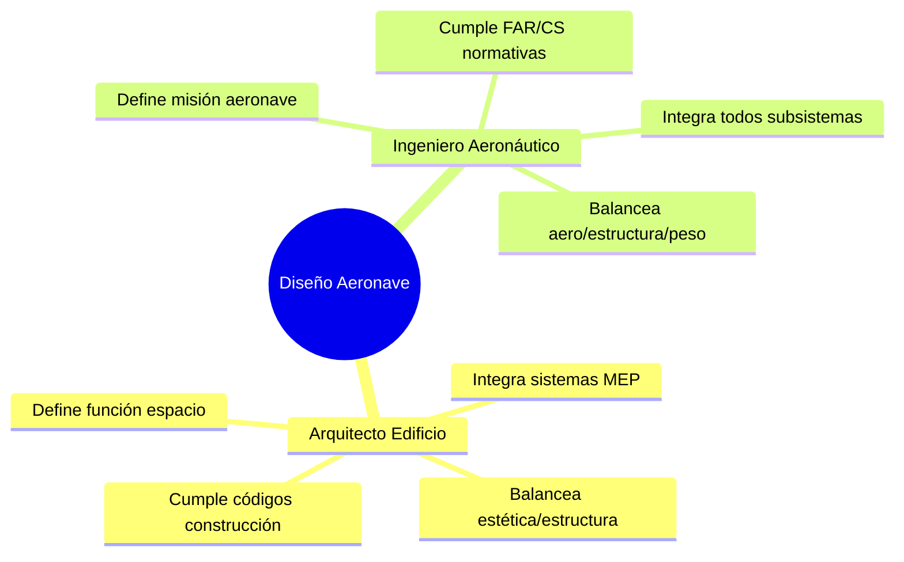

**Diseño de Aeronaves** = El proceso iterativo de tomar requerimientos de misión y convertirlos en una aeronave completa, optimizada, fabricable y certificable.

### ¿Por Qué es Crítico en Paraguay?

**Oportunidades del sector**:
- ✅ **Startups UAV** - Diseño de drones especializados (agro, topografía)
- ✅ **Modificaciones aeronaves** - STCs (Supplemental Type Certificate) para aviación general
- ✅ **Ingeniería de soporte** - Análisis para operadores locales (TAM, privados)
- ✅ **Consultoría técnica** - Evaluaciones de performance, life extension

**Sin proceso formal de diseño** = Aeronaves inseguras, ineficientes, no certificables ✈️⚠️

---

## 📋 Prerrequisitos

### Conocimientos Requeridos

✅ **Todos los Módulos Previos del Track Aero** (OBLIGATORIO):
- ✅ Módulo 01: CAD con IA (geometrías 3D)
- ✅ Módulo 02: Aerodinámica CFD (resistencia, sustentación)
- ✅ Módulo 03: Estructuras & Materiales (FEA, factores seguridad)
- ✅ Módulo 04: Sistemas de Propulsión (empuje, autonomía)
- **Verificación**: ¿Completaste los 4 módulos previos?
- **Si NO**: ⚠️ Este módulo INTEGRA todos los anteriores - completa primero

✅ **Metodología de Diseño Básica** (Recomendado):
- Proceso iterativo de diseño
- Análisis de requerimientos
- Trade-off analysis conceptual
- **Si NO conoces**: Se explica en el módulo, pero será más denso

✅ **Cálculos de Ingeniería** (Fundamental):
- Ecuaciones básicas (resistencia, empuje, peso)
- Análisis dimensional
- Regla de tres y proporciones
- **Verificación**: ¿Puedes calcular ratio L/D si L=500N y D=50N?

❌ **NO Se Requiere**:
- Experiencia real diseñando aeronaves
- Conocimiento profundo de certificación (se introduce básicamente)
- Software de diseño avanzado (usamos conceptos, no herramientas específicas)

### Software Necesario

**Desde módulos previos ya tienes**:
- ✅ CAD (Fusion 360 o FreeCAD)
- ✅ OpenCode configurado
- ✅ Python (opcional para cálculos)

**NUEVO (opcional)**:
- Calculadora científica o Excel/LibreOffice (para estimaciones de peso)
- No se requiere software adicional especializado

### Tiempo Estimado

- **Contenido teórico**: 2-3 horas
- **Ejercicios integración**: 1-2 horas
- **Proyecto capstone** (si aplica): 20-30 horas adicionales

**Total módulo**: 4-6 horas

### Checklist Final

- [ ] Completé Módulos 01, 02, 03, 04 del track Aero
- [ ] Entiendo conceptos de CAD, CFD, FEA, y propulsión
- [ ] Tengo 4+ horas disponibles
- [ ] Estoy listo para integrar conocimientos en diseño completo

**Si marcaste todos**: ¡Adelante! 🚀  
**Si NO completaste módulos previos**: ⚠️ Completa primero - este módulo asume esos conocimientos.

---

## 📊 Las Fases del Diseño Aeronáutico

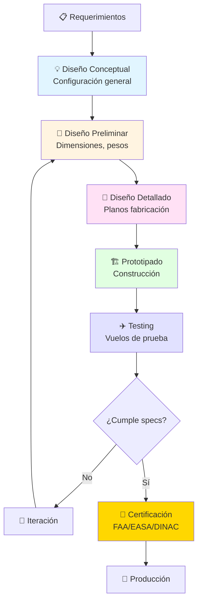

**Dato clave**: Solo 10-20% del tiempo en "diseño", 80-90% en testing, certificación, y producción.

---

## 🏢 Parte 1: Diseño Conceptual (60 min)

### Paso 1: Definir Misión y Requerimientos

**Método QFD (Quality Function Deployment)**:

```mermaid
graph LR
    subgraph "De Voz del Cliente a Specs Técnicas"
        A[🗣️ Cliente dice:<br/>"Necesito monitorear<br/>cultivos fácilmente"]
        
        A --> B[📝 Requerimientos<br/>funcionales]
        
        B --> C[📊 Especificaciones<br/>técnicas medibles]
        
        C --> D[🎯 Targets de diseño]
    end
    
    style A fill:#E1F5FF
    style B fill:#FFF4E1
    style C fill:#FFE1F5
    style D fill:#E1FFE1
```

**Ejemplo: UAV Agrícola Paraguay**

```
VOZ DEL CLIENTE:
"Necesito un drone que:
- Cubra 100 hectáreas de soja por día
- Sea fácil de operar (sin piloto experto)
- No sea muy caro (presupuesto limitado)
- Pueda llevar cámara multiespectral
- Funcione en clima paraguayo (calor, humedad)"

TRADUCCIÓN A REQUERIMIENTOS:
1. Área cobertura: 100 ha/día
   → Velocidad × autonomía × ancho sensado
   → 15 m/s × 45 min × 50m = 20.25 ha/vuelo
   → Necesita 5 vuelos/día (factible)

2. Facilidad operación:
   → Despegue/aterrizaje automático (GPS)
   → Estación base simple (tablet)
   → Sin necesidad licencia piloto UAV <25kg

3. Costo objetivo: <USD 5,000 completo
   → Airframe: USD 1,500
   → Electrónica/sensores: USD 2,000
   → Cámara multiespectral: USD 1,500

4. Payload: Cámara 500g + gimbal 200g = 700g

5. Ambiente:
   → Temperatura: 5-45°C
   → Humedad: hasta 90%
   → Altitud operación: 0-500 msnm (Paraguay es plano)
   → Viento: hasta 8 m/s (nivel 4 Beaufort)
```

### Paso 2: Configuración General

**Opciones de configuración**:

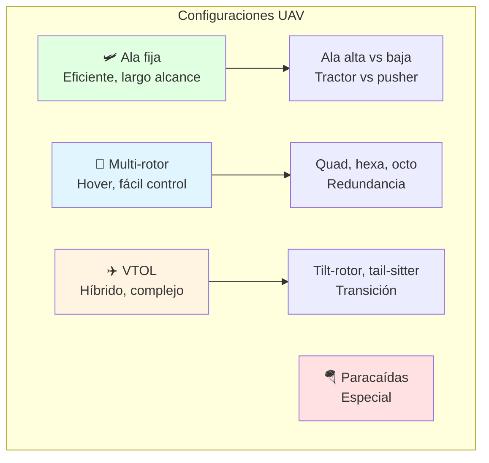

**Matriz de decisión**:

| Criterio | Peso | Ala Fija | Quad | VTOL |
|----------|------|----------|------|------|
| **Autonomía** (45 min) | 30% | 10/10 | 4/10 | 7/10 |
| **Área cobertura** | 25% | 10/10 | 3/10 | 8/10 |
| **Facilidad pilotaje** | 20% | 5/10 | 9/10 | 6/10 |
| **Costo** (<USD 5k) | 15% | 9/10 | 7/10 | 4/10 |
| **Robustez viento** | 10% | 8/10 | 4/10 | 7/10 |
| **TOTAL** | - | **8.45** | **5.45** | **6.75** |

**Resultado**: **Ala fija** gana para esta misión específica.

**Decisiones de configuración**:
```
✅ Ala alta: Protege hélice/cámara en aterrizaje
✅ Motor pusher (atrás): Hélice no interfiere cámara frontal
✅ Empenaje en V (V-tail): Reduce peso vs T-tail
✅ Tren triciclo fijo: Simple, robusto para campos
✅ Fuselaje tipo pod: Acceso fácil a electrónica
```

### Paso 3: Sizing Inicial (Dimensionamiento)

**Método histórico + estadístico**:

```
PASO 1: Estimar peso vacío

Para UAVs similares (ala fija, eléctrico):
W_empty / W_total ≈ 0.55-0.65 (típico)

Nuestros datos:
W_total objetivo: 3.5 kg
W_payload: 0.7 kg
W_batería: 0.8 kg (4S 6000mAh para 45 min)

W_empty = W_total - W_payload - W_batería
W_empty = 3.5 - 0.7 - 0.8 = 2.0 kg

Verificar ratio: 2.0/3.5 = 0.57 ✅ dentro del rango

PASO 2: Estimar área alar

Carga alar típica UAVs: 15-25 kg/m²

Para vuelo lento (agricultura):
W/S = 18 kg/m² (conservador)

S = W_total / (W/S)
S = 3.5 kg / 18 kg/m² = 0.194 m² ≈ 0.20 m²

PASO 3: Calcular envergadura

Aspect Ratio objetivo: AR = 8-10 (buen compromiso)
AR = 9 (selección)

AR = b² / S
b = √(AR × S) = √(9 × 0.20) = 1.34 m

Redondeamos: b = 1.40 m (fabricación)

PASO 4: Cuerda media

c_mean = S / b = 0.20 / 1.40 = 0.143 m = 143 mm

PASO 5: Estimar longitud fuselaje

Típico: L_fuselage ≈ 0.6-0.8 × b
L_fuselage = 0.7 × 1.40 = 0.98 m ≈ 1.00 m
```

**Resumen sizing inicial**:
```
Dimensiones principales:
- Envergadura: 1.40 m
- Cuerda media: 143 mm
- Área alar: 0.20 m²
- Longitud: 1.00 m
- Peso total: 3.5 kg
- Aspect Ratio: 9.8
```

### Paso 4: Estimación de Pesos (Class I)

**Método de fracciones**:

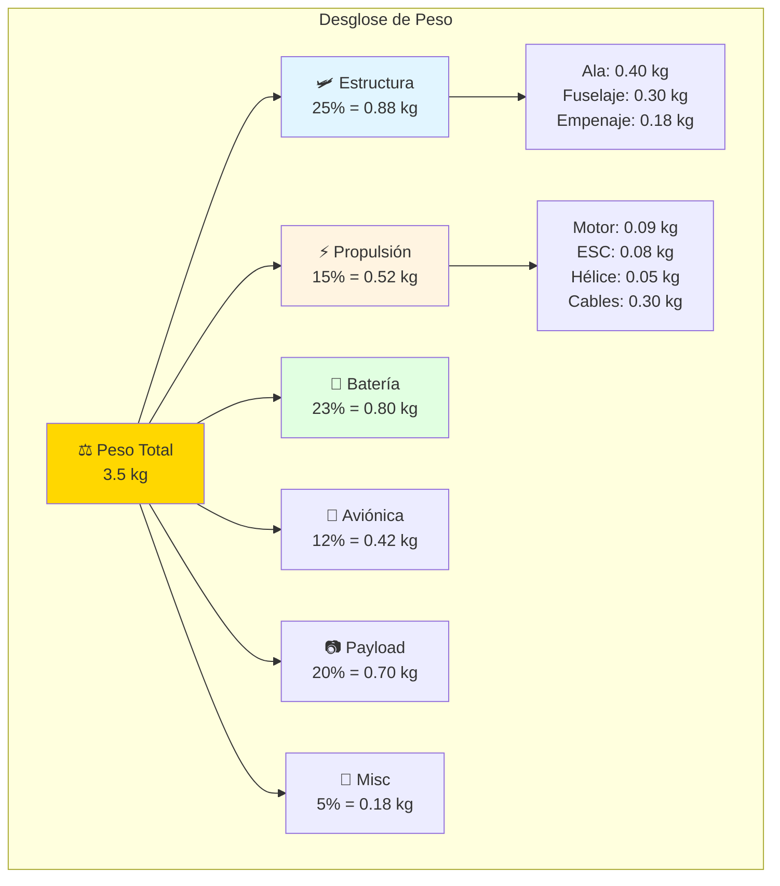

**Detalle estructura**:

```
ALA (0.40 kg):
- Larguero (spar): 0.12 kg
  Aluminio 7075, sección 10×15mm, L=1400mm
- Costillas (ribs) x6: 0.08 kg
  Balsa 2mm, lightening holes
- Piel (skin): 0.15 kg
  Laminado fibra vidrio 2 capas
- Herrajes montaje: 0.05 kg

FUSELAJE (0.30 kg):
- Frame principal: 0.10 kg
  Plywood 3mm, F1-F6 formers
- Piel: 0.12 kg
  EPP foam + 1 capa fibra vidrio
- Capó motor: 0.05 kg
- Tren aterrizaje: 0.03 kg

EMPENAJE (0.18 kg):
- Estabilizador horizontal: 0.08 kg
- Estabilizador vertical + timón: 0.07 kg
- Servos × 3: 0.03 kg (9g servos)
```

### Implementación con OpenCode

```bash
opencode "Genera diseño conceptual completo para UAV especificado:

MISIÓN:
Monitoreo agrícola de soja en Paraguay
- Área objetivo: 100 ha/día (5 vuelos de 20 ha c/u)
- Autonomía: 45 min por vuelo
- Payload: Cámara multiespectral 500g
- Ambiente: 5-45°C, humedad 90%, viento 8 m/s
- Presupuesto: <USD 5,000 total

PROCESO DE DISEÑO:
1. Análisis de misión:
   - Velocidad óptima para cobertura
   - Altura de vuelo (FOV cámara)
   - Pattern de vuelo (parallel swaths)

2. Configuración:
   - Evaluar 3+ configuraciones
   - Matriz de decisión ponderada
   - Seleccionar óptima con justificación

3. Sizing:
   - Método histórico (datos UAVs similares)
   - Calcular W/S (carga alar)
   - Determinar S (área), b (envergadura)
   - AR (aspect ratio) óptimo

4. Estimación pesos Class I:
   - Estructura (wing, fuselage, empennage)
   - Propulsión (motor, ESC, batería)
   - Aviónica (FC, GPS, RC)
   - Payload
   - Verificar que suma = W_total

5. Geometría 3 vistas:
   - Dimensiones principales anotadas
   - Ubicación CG estimado
   - Descripción ASCII-art o SVG

6. Análisis preliminar performance:
   - V_stall, V_cruise, V_max
   - Autonomía (verificar 45 min alcanzable)
   - Rate of climb
   - Takeoff/landing distance

7. Identificar riesgos:
   - Técnicos (peso excesivo, autonomía corta)
   - Programáticos (costo, schedule)
   - Mitigaciones propuestas

INCLUIR:
- Reporte completo formato ingenieril
- Cálculos detallados con referencias
- Trade-off analysis documentado
- Comparación con aeronaves similares existentes
- Roadmap para diseño preliminar (siguiente fase)

TODO en español con contexto Paraguay (materiales disponibles, clima, regulaciones DINAC)"
```

---

## 🔬 Parte 2: Diseño Preliminar (60 min)

### Análisis de Estabilidad y Control

**Centro de Gravedad (CG)**:

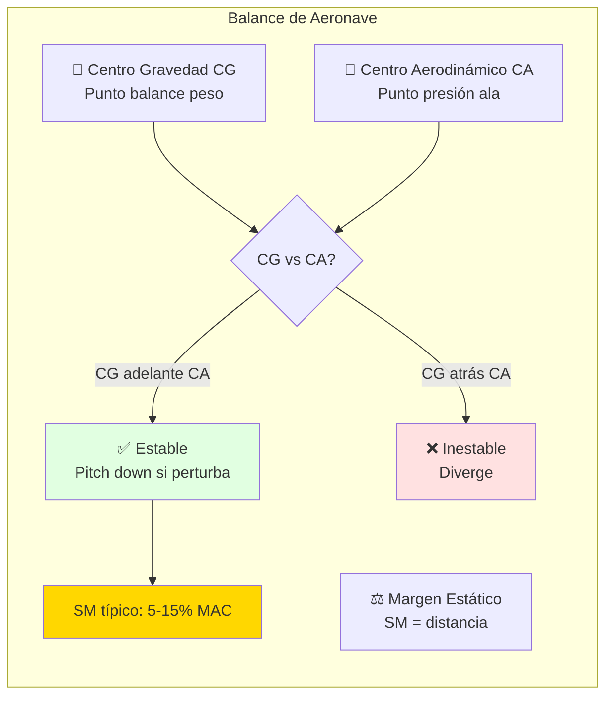

**Cálculo de CG**:

```
MÉTODO: Suma de momentos

Componentes principales (distancia desde nariz):

Componente         Peso(g)  X(mm)  Momento(g⋅mm)
----------------------------------------------------
Motor + ESC         170      50      8,500
Batería 4S 6000     800      280    224,000
Fuselaje            300      450    135,000
Ala (@ 25% MAC)     400      480    192,000
Empenaje            180      920    165,600
Payload (cámara)    700      350    245,000
Aviónica (FC,GPS)   420      400    168,000
Misc (cables,etc)   180      500     90,000
----------------------------------------------------
TOTAL             3,150             1,228,100

CG_x = ΣMomentos / ΣPesos
CG_x = 1,228,100 / 3,150 = 389.9 mm desde nariz

MAC (Mean Aerodynamic Chord) = 143 mm
Posición MAC: 480 - 143/4 = 444 mm (borde ataque @ 25% MAC)

CG relativo a MAC:
CG_% = (CG_x - LE_MAC) / MAC × 100
CG_% = (390 - 444) / 143 × 100 = -37.8% MAC

⚠️ CG está ADELANTE del borde ataque!
Necesita reubicar batería más atrás.

CORRECCIÓN:
Mover batería de X=280mm a X=420mm

Nuevo momento batería: 800 × 420 = 336,000
Nuevo total momentos: 1,228,100 - 224,000 + 336,000 = 1,340,100
Nuevo CG_x = 1,340,100 / 3,150 = 425.4 mm

CG_% = (425.4 - 444) / 143 × 100 = -13% MAC ✅ OK

Margen estático típico: 5-15% MAC
```

**Gráfico de CG vs peso**:

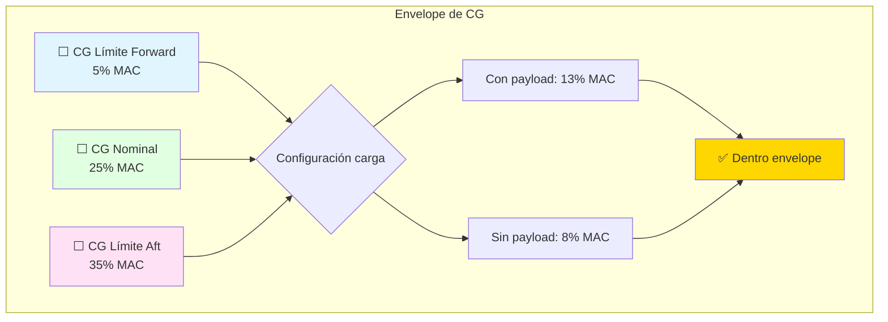

### Análisis de Estabilidad Estática

**Longitudinal**:

```
Coeficiente de momento de pitch:
C_m = C_m0 + C_m_α × α

Para estabilidad estática: dC_m/dα < 0

Contribuciones:
1. Ala: C_m_α_wing ≈ -0.05/rad (cambering)
2. Fuselaje: C_m_α_fuse ≈ +0.02/rad (desestabilizante)
3. Empenaje horizontal: C_m_α_tail = -V_H × C_L_α_tail

Donde V_H = volumen coeficiente horizontal tail:
V_H = (L_t × S_t) / (c_mean × S_wing)

Para nuestro UAV:
L_t = 600 mm (distancia CG a tail)
S_t = 0.04 m² (área tail)
c_mean = 143 mm
S_wing = 0.20 m²

V_H = (0.6 × 0.04) / (0.143 × 0.20) = 0.839

Típico V_H para GA: 0.5-0.9 ✅ OK

Estabilidad total:
C_m_α = C_m_α_wing + C_m_α_fuse + C_m_α_tail
C_m_α = -0.05 + 0.02 - 0.839 × 5.73 × (180/π)
C_m_α ≈ -0.05 + 0.02 - 0.84
C_m_α = -0.87 /rad ✅ Negativo = estable
```

**Lateral-Direccional**:

```
Estabilidad direccional (weathercock):
C_n_β = (V_V × C_L_α_vertical) × cos(α)

V_V = volumen coeficiente vertical tail:
V_V = (L_t × S_v) / (b × S_wing)

S_v = 0.025 m² (área vertical tail)
b = 1.40 m

V_V = (0.6 × 0.025) / (1.40 × 0.20) = 0.054

Típico V_V: 0.02-0.06 ✅ OK

Para estabilidad: C_n_β > 0 (positivo)
Con contribución fuselaje y V-tail, esperamos ~0.002/deg ✅
```

### Sizing de Superficies de Control

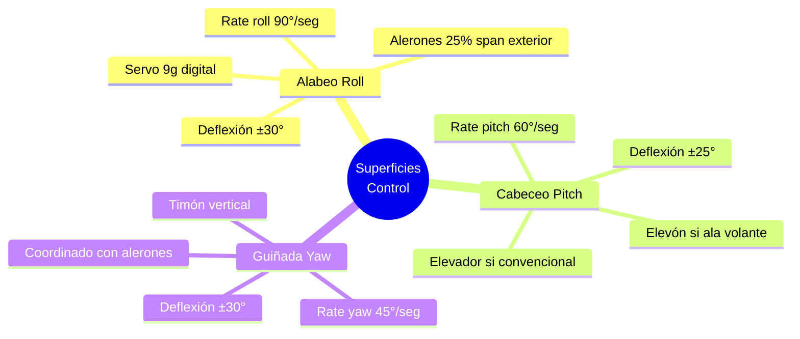

**Cálculo superficie de control**:

```
ALERÓN (aileron):
Área típica: 10-15% del área alar posterior
S_aileron = 0.12 × (0.20/2) = 0.012 m² por lado

Span: 25% de semi-envergadura
Span_aileron = 0.25 × 0.70 = 0.175 m

Cuerda_aileron = S_aileron / Span_aileron
Cuerda_aileron = 0.012 / 0.175 = 0.069 m = 69 mm

Típicamente 25-30% de cuerda local

ELEVADOR (elevator):
Área: 30-40% del estabilizador horizontal
S_elevator = 0.35 × 0.04 = 0.014 m²

TIMÓN (rudder):
Área: 30-40% del estabilizador vertical
S_rudder = 0.35 × 0.025 = 0.009 m²
```

### Análisis de Cargas (Loads)

**Envelope de vuelo**:

```
Diagrama V-n (simplificado para UAV):

Categoría: Normal (similar FAR 23)
n_max_positivo = +3.8
n_max_negativo = -1.5

Velocidades:
V_s (stall): 10 m/s
V_a (maniobra): 18 m/s
V_c (crucero): 20 m/s
V_d (dive): 28 m/s

Caso crítico (máxima carga en ala):
L_max = n_max × W = 3.8 × 3.5 kg × 9.81 = 130.5 N

Distribución sustentación (elíptica ideal):
L(y) = (4×L_max) / (π×b) × √(1 - (2y/b)²)

Carga en raíz:
L_root = L_max / (π×b/8) = 130.5 / (π×1.4/8) = 237 N/m

Momento flector raíz:
M_root = (L_max × b) / (3π) 
M_root = (130.5 × 1.4) / (3π) = 19.4 N⋅m

Verificar con análisis estructural Módulo 03! ✅
```

### Implementación con OpenCode

```bash
opencode "Realiza análisis completo de estabilidad y control:

GEOMETRÍA UAV:
- Envergadura: 1.40 m
- Área alar: 0.20 m²
- MAC: 143 mm
- AR: 9.8
- Tail arm: L_t = 600 mm
- H-tail área: 0.04 m²
- V-tail área: 0.025 m²

PESOS Y CG:
[Usar tabla de componentes anterior]
CG target: 25% MAC

ANÁLISIS REQUERIDO:
1. Cálculo CG:
   - Tabla de pesos y brazos
   - CG en vacío y con payload
   - Envelope de CG (límites)
   - Proponer ubicación batería

2. Coeficientes de volumen:
   - V_H (horizontal tail volume)
   - V_V (vertical tail volume)
   - Comparar con aeronaves similares
   - ¿Son adecuados?

3. Estabilidad estática:
   - Longitudinal: C_m_α
   - Lateral: C_l_β
   - Direccional: C_n_β
   - Verificar todos negativos/positivos según corresponde

4. Autoridad de control:
   - Sizing de alerones, elevador, timón
   - Deflexiones requeridas
   - Selección de servos (torque)
   - Linkages y horns

5. Análisis de maniobras:
   - Roll rate para barrel roll
   - Pitch rate para loop
   - Estabilidad en spin (recovery)

6. Casos de carga críticos:
   - Diagrama V-n simplificado
   - Distribución sustentación en ala
   - Momentos flectores y torsores
   - Comparar con análisis estructural

INCLUIR:
- Todos cálculos detallados
- Diagramas ilustrativos
- Recomendaciones de ajuste si fuera de rango
- Comparación con requisitos de misión

TODO en español para proyecto FPUNA"
```

---

## 💻 Parte 3: Documentación y Certificación (90 min)

### Concepto: Certificación Aeronáutica

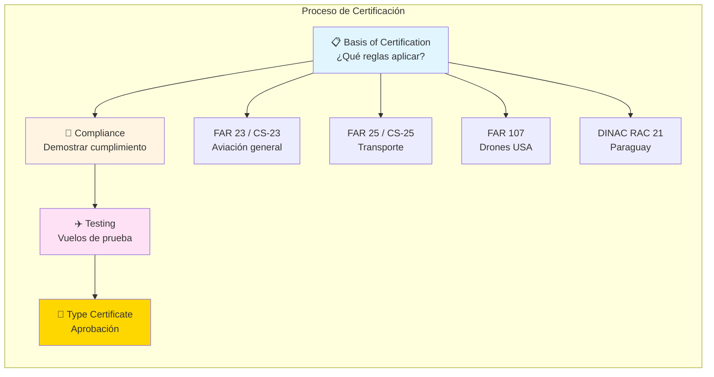

### Requerimientos para UAVs en Paraguay

**DINAC (Dirección Nacional de Aeronáutica Civil)**:

```
CATEGORÍAS DRONES (RPAS):

Categoría 1: <2 kg
- Registro: Sí
- Licencia piloto: No
- Restricciones: Altura <120m, VLOS, zonas autorizadas

Categoría 2: 2-25 kg (NUESTRO CASO)
- Registro: Sí (matricula PA-XXX)
- Licencia piloto: Sí (RPAS basic)
- Seguro: Responsabilidad civil (USD 10,000+)
- Restricciones: Altura <120m, EVLOS con observer, plan vuelo

Categoría 3: >25 kg
- Certificación completa (como aeronave tripulada)
- Muy regulado

PROCESO REGISTRO (Cat 2):
1. Solicitud en DINAC con:
   - Especificaciones técnicas (peso, dimensiones, performance)
   - Manual de operación
   - Seguro RC vigente
   - Certificado de aeronavegabilidad (si kit comercial)
   
2. Inspección física (posible)

3. Emisión matrícula (30-60 días)

4. Licencia piloto RPAS:
   - Curso teórico 40 horas
   - Examen escrito
   - 20 horas vuelo (simulador + real)
   - Examen práctico
```

**Documentación Técnica Mínima**:

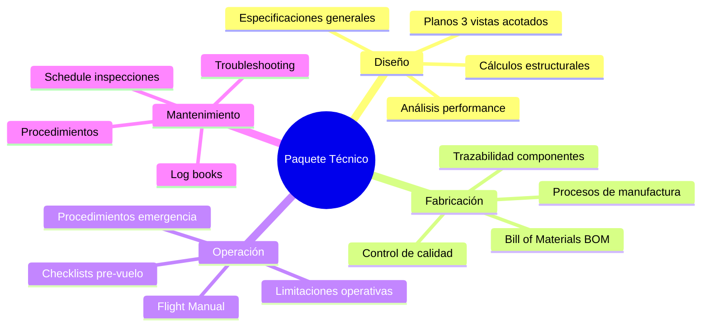

### Documentos Principales

#### 1. Aircraft Specification (Especificación de Aeronave)

```
ESPECIFICACIÓN GENERAL UAV AGRÍCOLA MODELO: AGRODRONE-01
==============================================================

SECCIÓN 1: GENERALIDADES
1.1 Tipo: Aeronave no tripulada (RPAS), ala fija
1.2 Categoría DINAC: Categoría 2 (2-25 kg)
1.3 Uso previsto: Monitoreo agrícola, fotografía aérea
1.4 Certificación: Experimental, uso comercial

SECCIÓN 2: DIMENSIONES PRINCIPALES
2.1 Envergadura: 1.40 m
2.2 Longitud total: 1.00 m
2.3 Altura total: 0.25 m
2.4 Área alar: 0.20 m²

SECCIÓN 3: PESOS
3.1 Peso vacío: 2.45 kg
3.2 Peso máximo despegue: 3.50 kg
3.3 Carga útil (payload): 0.70 kg
3.4 Centro de gravedad: 25% MAC ± 5%

SECCIÓN 4: PERFORMANCE
4.1 Velocidad pérdida (V_s): 10 m/s (36 km/h)
4.2 Velocidad crucero (V_c): 15 m/s (54 km/h)
4.3 Velocidad máxima (V_max): 28 m/s (101 km/h)
4.4 Autonomía: 45 minutos
4.5 Alcance: 40 km
4.6 Techo operativo: 500 m AGL
4.7 Tasa trepada: 4 m/s

SECCIÓN 5: PROPULSIÓN
5.1 Tipo motor: Eléctrico brushless BLDC
5.2 Modelo: T-Motor MN3520 KV400
5.3 Potencia máxima: 450W
5.4 Hélice: 13×6 (330mm diámetro)
5.5 Batería: LiPo 4S 6000mAh 25C (14.8V nominal)
5.6 ESC: 40A con BEC 5V/3A

SECCIÓN 6: ESTRUCTURA
6.1 Ala: Larguero aluminio 7075-T6, costillas balsa, piel fibra vidrio
6.2 Fuselaje: Frame plywood, skin EPP foam + fibra vidrio
6.3 Empenaje: Construcción similar ala
6.4 Tren aterrizaje: Triciclo fijo, ruedas espuma

SECCIÓN 7: SISTEMAS
7.1 Control: Flight Controller Pixhawk 4, GPS dual
7.2 RC: 2.4 GHz, alcance 5 km
7.3 Telemetría: 433 MHz, bidireccional
7.4 Payload: Cámara multiespectral Micasense RedEdge-MX

SECCIÓN 8: LIMITACIONES OPERATIVAS
8.1 Velocidad viento máxima: 8 m/s (29 km/h)
8.2 Temperatura: 5°C a 45°C
8.3 Lluvia: No operar
8.4 Alcance VLOS: 500 m horizontal
8.5 Altura máxima: 120 m AGL (DINAC)

SECCIÓN 9: CERTIFICACIÓN
9.1 Base de certificación: DINAC RAC 21 Subparte C
9.2 Desviaciones: Ninguna
9.3 Fecha emisión: [Completar durante certificación]
9.4 Ingeniero responsable: [Nombre del estudiante], CIP [número de matrícula CIP]
```

#### 2. Flight Manual (Manual de Vuelo)

```
MANUAL DE VUELO AGRODRONE-01
================================

SECCIÓN 1: GENERALIDADES
1.1 Introducción
1.2 Descripción general del sistema
1.3 Especificaciones técnicas (referencia)
1.4 Certificaciones y aprobaciones

SECCIÓN 2: LIMITACIONES
2.1 Limitaciones de aeronavegabilidad
    - Peso máximo despegue: 3.5 kg
    - CG range: 20-30% MAC
    - Velocidades: V_s=10, V_ne=28 m/s
    - Factores carga: +3.8g / -1.5g
2.2 Limitaciones de potencia planta
    - Voltaje batería mín: 13.2V (3.3V/cell)
    - Corriente máx continua: 30A
    - Temperatura motor máx: 80°C
2.3 Limitaciones operativas
    - Viento máximo: 8 m/s
    - Visibilidad mínima: 1 km
    - Altura máxima: 120 m AGL

SECCIÓN 3: PROCEDIMIENTOS NORMALES
3.1 Pre-vuelo inspection checklist
3.2 Startup y calibración
3.3 Despegue (automático/manual)
3.4 Crucero y navegación
3.5 Aterrizaje (automático/manual)
3.6 Shutdown y post-vuelo

SECCIÓN 4: PROCEDIMIENTOS DE EMERGENCIA
4.1 Pérdida de link RC
4.2 Batería baja
4.3 Falla motor
4.4 Pérdida GPS
4.5 Viento excesivo
4.6 Colisión en vuelo

SECCIÓN 5: PERFORMANCE
5.1 Tablas y gráficos performance
5.2 Autonomía vs velocidad vs viento
5.3 Takeoff/landing distance
5.4 Rate of climb

SECCIÓN 6: WEIGHT & BALANCE
6.1 Tabla de pesos
6.2 Envelope de CG
6.3 Loading examples

SECCIÓN 7: DESCRIPCIÓN DE SISTEMAS
7.1 Airframe
7.2 Propulsion
7.3 Flight controls
7.4 Avionics
7.5 Payload

SECCIÓN 8: HANDLING Y STORAGE
8.1 Manejo de batería LiPo
8.2 Transporte
8.3 Almacenamiento largo plazo
```

#### 3. Maintenance Manual (Manual de Mantenimiento)

```
PROGRAMA DE MANTENIMIENTO AGRODRONE-01
==========================================

INSPECCIONES PRE-VUELO (CADA VUELO):
□ Visual exterior (grietas, daños)
□ Fijación de alas y empenaje
□ Hélice (fisuras, desbalance)
□ Tornillería (apriete)
□ Batería (voltaje, temperatura, hinchazón)
□ Cableado (conexiones, chafing)
□ Superficies de control (libre movimiento)
□ GPS (fix, HDOP <2)
□ RC (alcance, latencia)

INSPECCIÓN 10 HORAS:
□ Lubricar bisagras superficies control
□ Verificar torque motor (actual vs esperado)
□ Limpiar sensores (cámara, pitot)
□ Verificar calibración brújula/acelerómetro

INSPECCIÓN 25 HORAS:
□ Inspección detallada estructura (lupa, dye penetrant)
□ Verificar apriete todos tornillos con torque wrench
□ Test vibración motor (FFT analysis)
□ Verificar tracking hélice
□ Rebalancear si necesario

INSPECCIÓN 50 HORAS O ANUAL:
□ Reemplazo componentes desgaste:
  - Rodamientos motor
  - Hélice (fatiga)
  - Batería (si >300 ciclos o 80% capacity)
□ Análisis estructural no destructivo (NDT)
□ Refinishing (pintura, protección UV)
□ Actualización firmware si disponible

COMPONENTES CON VIDA LIMITADA:
- Batería LiPo: 300-500 ciclos o 2 años
- Hélice: 100 horas o daño visible
- Servos: 500 horas o 50,000 ciclos
- Elastómeros (O-rings, dampeners): 1 año

LOG BOOKS:
- Airframe log: Tiempo vuelo total, inspecciones, modificaciones
- Engine log: Tiempo operación, temperatura max, corrientes
- Propeller log: Modelo, tiempo, daños
- Component log: Reemplazos, vida remanente
```

### Implementación con OpenCode

```bash
opencode "Genera paquete completo de documentación para certificación:

UAV: AGRODRONE-01 (datos de diseño preliminar)

DOCUMENTOS A GENERAR:
1. Aircraft Specification (10 páginas):
   - Template IEEE o SAE format
   - Secciones: General, Dimensions, Weights, Performance, Systems, Limits
   - Professional layout (no fancy, estilo técnico)

2. Flight Manual (30 páginas):
   - Basado en FAA AC 61-21 format
   - Checklists en tablas
   - Ilustraciones de sistemas (diagramas)
   - V-speeds card (tarjeta referencia)

3. Maintenance Manual (20 páginas):
   - Formato ATA 100 simplificado
   - Inspection intervals claros
   - Torque specifications
   - Troubleshooting flowcharts

4. Weight & Balance Report:
   - Tabla de componentes
   - CG calculation forms
   - Loading graphs
   - Examples (diferentes configuraciones)

5. Structural Substantiation Report:
   - Resumen análisis FEA Módulo 03
   - Load cases aplicados
   - Margins of safety
   - Compliance statement (FAR/CS requirements)

6. Flight Test Plan:
   - 10+ test flights programados
   - Cada uno con objetivos específicos
   - Data recording requirements
   - Go/no-go criteria

FORMATO OUTPUT:
- Markdown con estructuras claras
- Tablas en formato GitHub
- Diagramas Mermaid donde aplicable
- Listo para export a PDF (pandoc)

CONTEXTO:
- Certificación DINAC Categoría 2
- Uso comercial agricultura
- Ingeniero responsable debe firmar

TODO en español para uso Paraguay"
```

---

## 🎯 Parte 4: Trade-Off Analysis y Optimización (30 min)

### Concepto: Carpet Plots

**Herramienta gráfica para explorar design space**:

```
Ejemplo: Peso vs Autonomía vs Velocidad

Eje X: Velocidad crucero (10-25 m/s)
Eje Y: Peso total (2.5-4.5 kg)
Contours: Autonomía (líneas de igual autonomía)

Permite visualizar:
- ¿Si aumento peso 1 kg, cuánto pierdo autonomía?
- ¿Cuál es la velocidad óptima para máxima autonomía?
- ¿Existe configuración que cumple TODOS los requisitos?
```

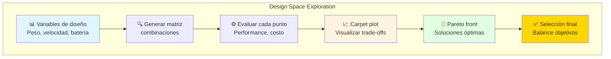

### Caso Práctico: Optimización Multi-Objetivo

**Objetivos conflictivos**:
1. Maximizar autonomía (45+ min)
2. Minimizar peso (portabilidad)
3. Minimizar costo (<USD 5,000)

**Variables de diseño**:
- Área alar (0.15-0.30 m²)
- Capacidad batería (4000-10000 mAh)
- Velocidad crucero (12-20 m/s)

```
MATRIZ DE EVALUACIÓN (ejemplo parcial):

Config  S(m²)  Bat(mAh)  V(m/s)  W(kg)  t(min)  Cost($)  Score
----------------------------------------------------------------
A       0.20   6000      15      3.5    45      4800     0.92
B       0.25   8000      15      4.2    62      5400     0.88
C       0.20   4000      12      2.9    28      3900     0.65
D       0.18   6000      18      3.3    38      4600     0.78
E       0.22   7000      15      3.8    52      5100     0.95 ← ÓPTIMO
...

Scoring function:
Score = w1×(t/t_target) + w2×(1-W/W_max) + w3×(1-Cost/Cost_max)
Pesos: w1=0.5, w2=0.3, w3=0.2

Resultado: Configuración E es óptima
- Autonomía: 52 min (115% del objetivo)
- Peso: 3.8 kg (razonable)
- Costo: USD 5,100 (2% sobre presupuesto, negociable)
```

**Frente de Pareto**:

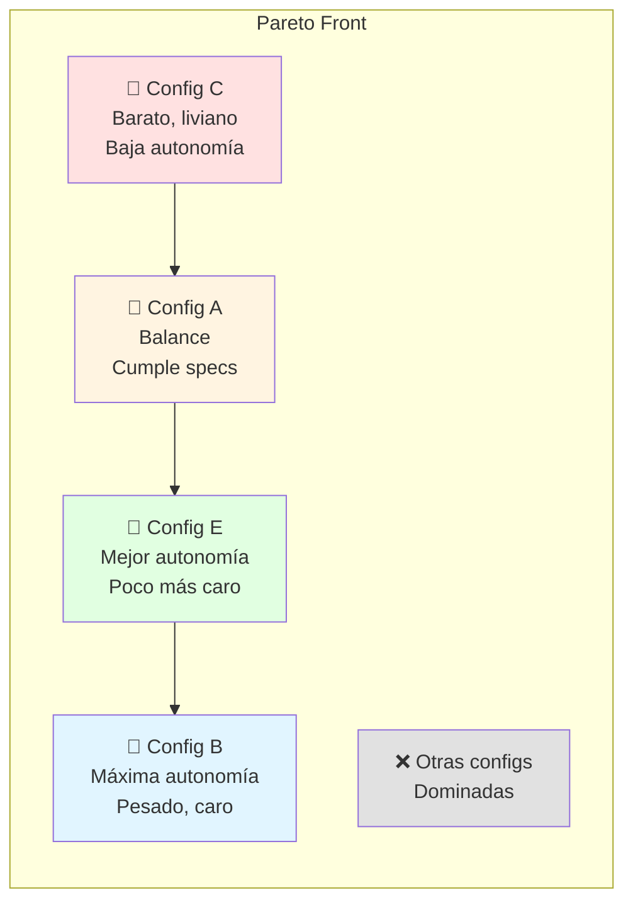

### Sensitivity Analysis

**¿Qué pasa si...?**

```
PREGUNTA: ¿Cómo afecta el peso de la batería a la autonomía?

Baseline: Batería 800g, autonomía 45 min

Análisis:
+100g batería → +9 min autonomía (pero +100g peso total)
+200g batería → +16 min autonomía (pero +200g peso total)
+300g batería → +21 min autonomía (diminishing returns!)

¿Por qué disminuye el beneficio?
- Más peso → más arrastre → más potencia necesaria
- Relación no lineal

Conclusión: Óptimo alrededor +150g batería (54 min, peso 3.65 kg)
```

**Tornado diagram** (análisis sensibilidad):

```
Factor                  Impacto en Autonomía (%)
====================================================
Capacidad batería       ██████████████ +40%
Velocidad crucero       ██████████ +30%
Peso estructura         ██████ +15%
Eficiencia hélice       ████ +10%
C_D0 (arrastre)         ███ +5%
```

### Implementación con OpenCode

```bash
opencode "Realiza trade-off analysis completo para optimizar diseño:

DISEÑO BASE:
- Envergadura: 1.40 m
- Peso: 3.5 kg
- Batería: 4S 6000mAh
- Velocidad crucero: 15 m/s
- Autonomía actual: 45 min
- Costo: USD 4,800

OBJETIVOS:
1. Autonomía ≥ 50 min (prioritario)
2. Peso ≤ 4.0 kg (límite estructura)
3. Costo ≤ USD 5,500 (límite presupuesto)

VARIABLES EXPLORAR:
1. Envergadura: 1.2-1.6 m (impacta eficiencia, peso)
2. Área alar: 0.15-0.30 m² (impacta carga alar, V_stall)
3. Batería: 4000-10000 mAh (impacta autonomía, peso, costo)
4. Velocidad crucero: 12-18 m/s (impacta potencia, cobertura)
5. Perfil alar: NACA 4412 vs 2412 vs 6412 (impacta L/D)

ANÁLISIS REQUERIDO:
1. Design of Experiments (DoE):
   - Factorial completo o Latin Hypercube
   - 50-100 configuraciones
   
2. Para cada configuración:
   - Calcular peso total (estructura escala con S^0.75)
   - Calcular arrastre y potencia requerida
   - Calcular autonomía con batería especificada
   - Estimar costo (scaling factors para materiales)
   
3. Carpet plots:
   - Autonomía vs Peso vs Batería
   - Autonomía vs Velocidad vs Área alar
   - Costo vs Autonomía vs Peso
   
4. Pareto front:
   - Identificar configuraciones no-dominadas
   - Ranking por scoring function
   
5. Sensitivity analysis:
   - Tornado diagram
   - ¿Qué variable tiene mayor impacto?
   - ¿Dónde invertir esfuerzo de optimización?
   
6. Recomendación final:
   - Top 3 configuraciones
   - Pros/cons de cada una
   - Justificación de selección

INCLUIR:
- Código Python/MATLAB para análisis
- Gráficos high-quality (matplotlib/seaborn)
- Tabla resumen configuraciones Pareto
- Conclusiones y siguiente steps

TODO en español con enfoque ingenieril paraguayo"
```

---

## 🔧 Troubleshooting de Diseño

### Problema 1: CG Muy Adelante

**Síntomas**: Aeronave "pesada de nariz", difícil levantar en despegue, alto drag.

**Soluciones**:
```
✅ Mover batería hacia atrás
✅ Agregar peso en cola (lastre) - último recurso
✅ Alargar nariz (mover motor adelante) si es pusher
✅ Re-ubicar payload más atrás
✅ Verificar que ala esté en posición correcta (no muy atrás)
```

### Problema 2: Autonomía Insuficiente

**Target**: 45 min  
**Actual**: 28 min ⚠️

**Diagnóstico sistemático**:
```
1. Verificar consumo potencia:
   - Medir corriente promedio en vuelo real
   - Comparar vs cálculos
   - ¿Motor trabajando eficientemente? (no sobrecarga)

2. Verificar peso real:
   - Pesar cada componente
   - Comparar vs estimaciones
   - ¿Peso adicional no contabilizado?

3. Verificar aerodinámica:
   - ¿Ala lisa, sin protuberancias?
   - ¿Transiciones suaves?
   - ¿Encastre de ala al fuselaje sellado?

4. Verificar batería:
   - Capacidad real (puede degradarse)
   - Internal resistance (RI alto = pérdidas)
   - Temperatura en vuelo (si >45°C, pérdidas)

5. Soluciones:
   ✅ Batería más grande (trade-off peso)
   ✅ Volar más lento (cuadrática con V)
   ✅ Mejorar aerodinámica (reducir C_D0)
   ✅ Hélice más eficiente (mayor diámetro)
   ✅ Motor más eficiente (menor KV para hélice grande)
```

### Problema 3: Inestabilidad en Vuelo

**Síntomas**: Oscilaciones, difícil mantener línea recta, "nervioso".

**Posibles causas**:
```
1. CG muy atrás → Inestabilidad longitudinal
   Fix: Mover batería adelante

2. Tail muy pequeño → Autoridad insuficiente
   Fix: Aumentar área empenaje (V_H, V_V)

3. Ala con mucho dihedral/anhedral
   Fix: Ajustar ángulo diedro (typical 2-4°)

4. Superficies de control invertidas
   Fix: Reversar servos en TX/FC

5. Gains FC muy altos → Over-correction
   Fix: Tuning PID (reducir P-gain)

6. Flexión estructura → Aeroelasticidad
   Fix: Rigidizar ala (carbono en borde ataque)
```

---

## ✅ Checklist Final de Diseño

Antes de proceder a fabricación:

### Diseño Conceptual
- [ ] Requerimientos misión documentados y validados
- [ ] Configuración seleccionada con justificación
- [ ] Trade studies principales realizados
- [ ] Comparación con aeronaves similares exitosas

### Diseño Preliminar
- [ ] Sizing completado (W, S, b, AR)
- [ ] Pesos estimados (todos los componentes)
- [ ] CG calculado y dentro de envelope
- [ ] Estabilidad estática verificada (C_m_α < 0)
- [ ] Superficies de control dimensionadas
- [ ] Performance estimado cumple requisitos

### Análisis
- [ ] Estructural: FS ≥ 1.5 en todos los puntos críticos
- [ ] Aerodinámica: L/D competitivo, V_stall aceptable
- [ ] Propulsión: Autonomía alcanzable con batería seleccionada
- [ ] Térmica: Componentes no exceden límites temperatura

### Documentación
- [ ] Aircraft Specification completa
- [ ] Flight Manual draft
- [ ] Maintenance plan definido
- [ ] Bill of Materials (BOM) con costos
- [ ] Planos 3 vistas con dimensiones principales

### Fabricabilidad
- [ ] Materiales disponibles localmente o importables
- [ ] Procesos de manufactura definidos
- [ ] Herramientas necesarias identificadas
- [ ] Tiempo de construcción estimado (horas)
- [ ] Presupuesto de fabricación confirmado

### Certificación
- [ ] Basis of certification identificada (DINAC Cat 2)
- [ ] Compliance matrix iniciada
- [ ] Limitaciones operativas definidas
- [ ] Plan de flight testing preliminar

---

## 🎓 Mejores Prácticas de Diseño

### ✅ HACER

1. **Iterar temprano y seguido** - Diseño nunca es lineal
2. **Validar con datos históricos** - Benchmark con aeronaves similares
3. **Considerar fabricación desde día 1** - Diseño debe ser construible
4. **Documentar decisiones** - Por qué elegiste esa config, ese peso
5. **Peer review** - Otro ingeniero revisa tus cálculos
6. **Margen de seguridad apropiado** - No sobre-diseñar, pero tampoco optimista
7. **Testing incremental** - Probar subsistemas antes de integrar
8. **Aprender de fallas** - Post-mortem si algo sale mal

### ❌ NO HACER

1. **Asumir sin verificar** - "Debe ser suficiente" = riesgo
2. **Optimizar prematuramente** - Primero que funcione, después optimizar
3. **Ignorar peso** - Cada gramo cuenta en aeronaves pequeñas
4. **Copiar ciegamente** - Entender por qué ese diseño funciona
5. **Descuidar CG** - Principal causa de crashes en homebuilt
6. **Sobre-complicar** - KISS: Keep It Simple, Stupid
7. **Omitir testing** - "Debería volar" ≠ vuela
8. **No tener backup plan** - Si diseño no funciona, ¿Plan B?

---

## 🎉 Resumen del Módulo

### Lo Que Dominaste

✅ **Diseño conceptual** - De misión a configuración  
✅ **Sizing y pesos** - Método analítico y estadístico  
✅ **Estabilidad y control** - CG, V_H, V_V, análisis estático  
✅ **Trade-off analysis** - Optimización multi-objetivo  
✅ **Documentación técnica** - Specs, manuals, certificación  
✅ **OpenCode para diseño integral** - IA como Chief Engineer

### Proyecto Capstone

**Ahora estás listo para**: [Proyecto Capstone - Diseño Completo UAV](./capstone/README.md)

Integrarás TODOS los módulos (CAD, Aerodinámica, Estructuras, Propulsión, Diseño) en un UAV completo y funcional.

---

## 💭 Reflexión

1. **¿Por qué el diseño aeronáutico es tan iterativo?**
2. **¿Cuál es el mayor trade-off en tu diseño?**
3. **¿Cómo OpenCode puede acelerar el ciclo de diseño?**

**Comparte en Slack** (#ingenieria-aeronautica)

---

## 📝 Quiz de Evaluación

### Instrucciones
**Total**: 10 preguntas | **Tiempo**: 25 min | **Aprobación**: 7+

### Preguntas

**1. Fases de Diseño (Múltiple Opción)**  
¿En qué fase del diseño se define la configuración aerodinámica básica (ala alta/baja, cantidad motores)?

a) Diseño preliminar | b) Diseño conceptual | c) Diseño detallado | d) Certificación

**2. Ecuación de Breguet (Verdadero/Falso)**  
"La ecuación de Breguet relaciona alcance con eficiencia aerodinámica (L/D), eficiencia propulsiva, y peso."

a) Verdadero | b) Falso

**3. Trade-off Weight-Performance (Múltiple Opción)**  
Si aumentas el espesor del ala para mayor resistencia estructural, ¿qué efecto NEGATIVO ocurre?

a) Mejor sustentación | b) Mayor peso y resistencia aerodinámica | c) Menor costo | d) Mayor alcance

**4. Estimación de Pesos (Múltiple Opción)**  
¿Qué método se usa en fase conceptual para estimar peso vacío de una aeronave?

a) Pesarla directamente | b) Métodos históricos/estadísticos | c) FEA completo | d) No se puede estimar

**5. Certificación (Respuesta Corta)**  
¿Qué organismo regula la certificación de aeronaves en Paraguay?

Opciones: FAA, EASA, DINAC, ANAC

**6. Configuración Aeronave (Múltiple Opción)**  
Para un UAV de larga autonomía (8+ horas), ¿qué configuración alar es MÁS eficiente?

a) Ala delta | b) Ala alta aspect ratio | c) Ala baja swept | d) Sin alas (multirotor)

**7. Factor de Carga (Verdadero/Falso)**  
"El factor de carga (n) es la relación entre sustentación y peso, y afecta el diseño estructural."

a) Verdadero | b) Falso

**8. Integración Sistemas (Múltiple Opción)**  
¿Qué subsistemas debes integrar en un diseño completo?

a) Solo estructura y motor | b) Estructura, propulsión, aviónica, control | c) Solo CAD 3D | d) Solo software

**9. Diagrama V-n (Múltiple Opción)**  
¿Para qué sirve el diagrama V-n (velocidad-factor de carga)?

a) Definir envolvente de vuelo segura | b) Calcular consumo combustible | c) Diseñar hélices | d) Estimar costo

**10. OpenCode para Diseño Integral (Respuesta Corta)**  
Menciona 2 formas en que OpenCode acelera diseño integral de aeronaves.

---

## 📋 Respuestas

**1. b)** - Diseño conceptual define configuración básica de requerimientos.

**2. a) Verdadero** - Breguet: R = (V/c) × (L/D) × ln(W0/W1)

**3. b)** - Mayor espesor → más peso y más resistencia (drag), reduciendo performance.

**4. b)** - Métodos estadísticos basados en aeronaves similares (ej: Raymer, Roskam).

**5. DINAC** - Dirección Nacional de Aviación Civil (Paraguay).

**6. b)** - Ala alta aspect ratio maximiza L/D (eficiencia aerodinámica).

**7. a) Verdadero** - n = L/W. En maniobras n > 1, estructura debe soportar.

**8. b)** - Diseño integral requiere todos subsistemas integrados.

**9. a)** - V-n define límites operacionales seguros (velocidad vs factor carga).

**10. Ejemplos**:
- "Automatizar cálculos de peso y balance iterativamente"
- "Generar reportes de análisis trade-off con gráficos"
- "Crear documentación técnica completa automáticamente"

---

## 📚 Recursos Adicionales

### Software de Diseño

- **OpenVSP** - [openvsp.org](http://openvsp.org/) (NASA, diseño conceptual, gratis)
- **XFLR5** - Análisis performance completo (gratis)
- **AVL** (MIT) - Vortex Lattice Method (gratis, potente)
- **MachUp** - Diseño y análisis (open-source)

### Libros Clásicos

- **"Aircraft Design: A Conceptual Approach"** - Daniel P. Raymer (LA BIBLIA)
- **"Airplane Design"** (8 volumes) - Jan Roskam (muy detallado)
- **"Fundamentals of Aircraft and Airship Design"** - Nicolai & Carichner (AIAA)
- **"Design of Unmanned Aerial Systems"** - Mohammad H. Sadraey (UAV específico)

### Cursos Online

- **edX**: "Introduction to Aerospace Engineering: Astronautics and Human Spaceflight" (MIT)
- **Coursera**: "Introduction to Aeronautical Engineering" (TU Delft)
- **YouTube**: "Aerospace Engineering" playlist - Real Engineering

### Comunidades Paraguay

- **FPUNA Aeronáutica** - Proyectos de tesis, recursos
- **Constructores homebuilt PY** - Facebook (experiencias construcción)
- **DINAC** - Consultas sobre certificación

### Estándares

- **FAR Part 23** - Airworthiness standards for normal category airplanes
- **ASTM F3201** - Standard for design/construction of small UAS (USA)
- **DINAC RAC 21** - Certificación aeronaves Paraguay

---

## 🎯 Preparación para Capstone

Para el proyecto final necesitarás:
1. ✅ Diseño conceptual aprobado (este módulo)
2. ✅ CAD 3D completo (Módulo 01)
3. ✅ Análisis CFD del ala (Módulo 02)
4. ✅ Análisis FEA estructural (Módulo 03)
5. ✅ Sistema de propulsión validado (Módulo 04)
6. ✅ Documentación técnica (este módulo)

**¡Estás listo para diseñar tu aeronave completa!** 🚀

---

*Módulo creado para FPUNA Verano 2026*  
*Actualizado: Enero 2026*  
*Track: Ingeniería Aeronáutica - Módulo 05 (Final)*

**🎓 FELICITACIONES - Has completado el Track de Ingeniería Aeronáutica!**

**Siguiente paso**: [Proyecto Capstone - Diseño UAV Completo](./capstone/README.md)
