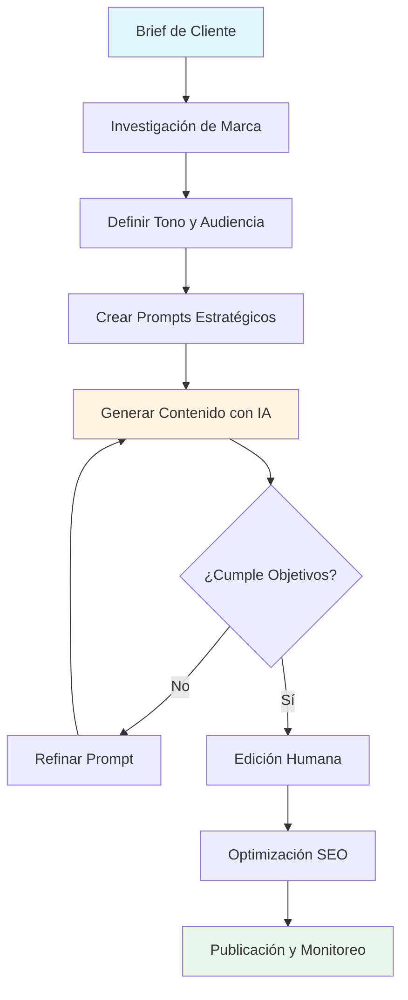
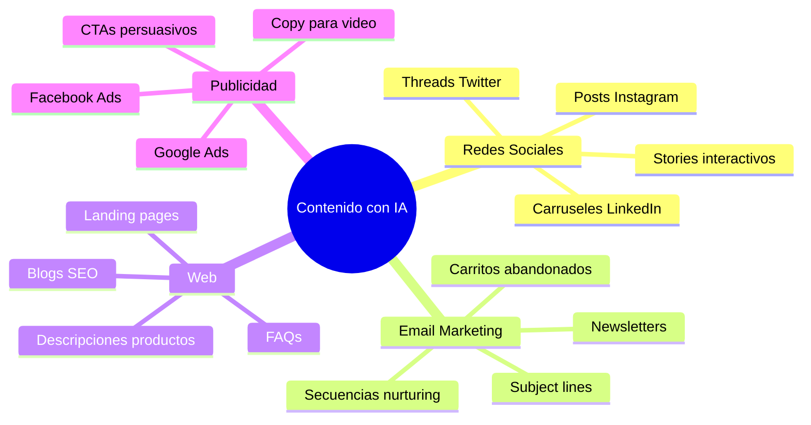
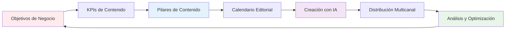
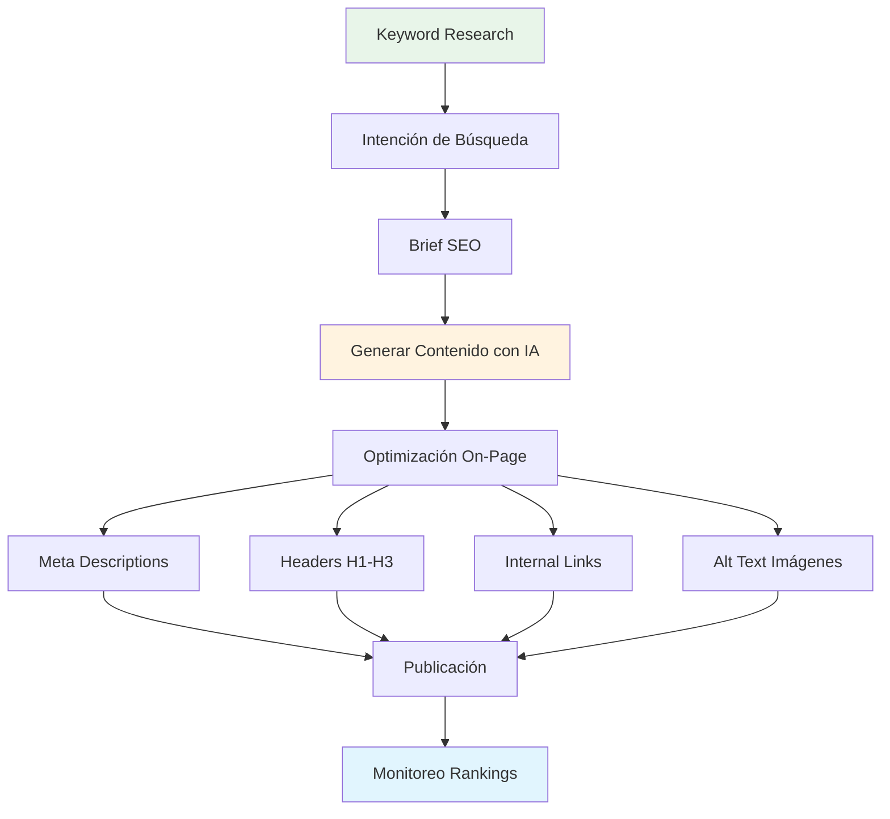
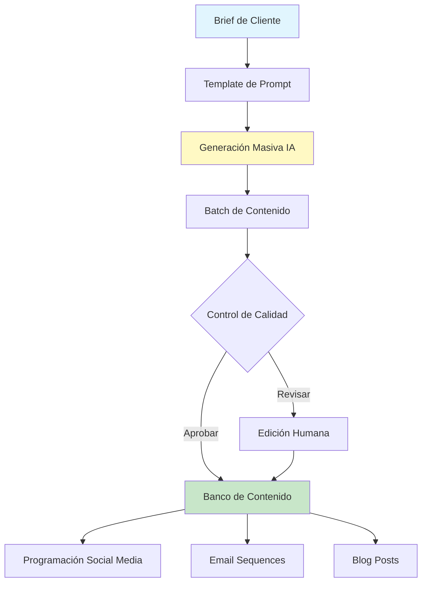
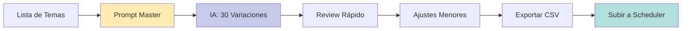
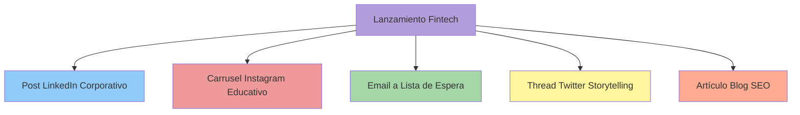

# 📝 Módulo 01: Creación de Contenido con IA

**Duración:** 4 horas  
**Nivel:** Principiante - Intermedio  
**Track:** Marketing y Comunicación

---

## 🎯 ¿Qué Vas a Lograr?

Al finalizar este módulo, serás capaz de:

- [ ] Crear contenido publicitario profesional usando ChatGPT y herramientas de IA
- [ ] Generar copies persuasivos para redes sociales, emails y landing pages
- [ ] Optimizar contenido para SEO y mejorar el posicionamiento orgánico
- [ ] Desarrollar estrategias de contenido para marcas paraguayas
- [ ] Automatizar la creación de calendarios editoriales y briefs creativos

---

## 🧠 Analogía: La IA como tu Equipo Creativo 24/7

Imagina que tienes un equipo de redactores publicitarios que trabaja las 24 horas, nunca se cansa, y puede escribir en cualquier tono o estilo que necesites. Así funciona la IA para contenido:

- **ChatGPT** es como tu copywriter senior que entiende tu marca
- **OpenCode** es tu asistente creativo que genera múltiples versiones
- **Prompts bien diseñados** son las instrucciones claras que das a tu equipo

En Paraguay, agencias como **Tabú** o **Factoría Creativa** están incorporando IA para acelerar su producción de contenido, pero la estrategia y la creatividad humana siguen siendo esenciales.

---

## 📊 Flujo de Trabajo de Creación con IA



---

## 🎨 Parte 1: Fundamentos de Copywriting con IA (60 minutos)

### 1.1 ¿Por Qué la IA Revoluciona el Marketing de Contenidos?

En Paraguay, el marketing digital está creciendo explosivamente:
- **+180% crecimiento** de inversión en ads digitales (2022-2025)
- Marcas como **Tigo**, **Personal** y **Visión Banco** usan contenido constantemente
- Agencias buscan copywriters que dominen IA (salario: ₲8-15M/mes)

**Desafío tradicional:** Un copywriter puede escribir 5-10 piezas de contenido al día.  
**Con IA:** Puedes generar 50-100 variaciones, enfocándote en estrategia y edición.

### 1.2 Tipos de Contenido que Puedes Crear con IA



### 1.3 Anatomía de un Prompt Efectivo

**Formula CLEAR para Prompts:**
- **C**ontexto: ¿Quién es la marca? ¿Qué vende?
- **L**ongitud: ¿Cuántas palabras/caracteres?
- **E**stilo: Tono (casual, profesional, divertido)
- **A**udiencia: ¿A quién le hablas?
- **R**esultado: ¿Qué acción quieres que tomen?

**Ejemplo Malo:**
```
Escribe un post de Instagram para una tienda.
```

**Ejemplo Excelente:**
```
Eres un copywriter especializado en retail fashion en Paraguay. 
Crea 3 posts de Instagram (150-180 caracteres c/u) para la tienda 
"Moda Asunción" que vende ropa casual para mujeres de 25-40 años. 
Tono: amigable y aspiracional. Incluye emojis y llamado a la acción 
para visitar la tienda en Villa Morra. Temporada: verano paraguayo.
```

### 1.4 OpenCode para Copywriting

**Prompt para OpenCode:**
```
@code-reviewer

Necesito crear un sistema de generación de contenido para mi cliente 
[MARCA]. Analiza su sitio web [URL], extrae el tono de marca, valores 
y estilo de comunicación. Luego genera:

1. Un brand voice guide (150 palabras)
2. 10 templates de prompts para diferentes tipos de contenido
3. Una matriz de contenido mensual (4 semanas)

Marca: Tigo Paraguay
Objetivo: Aumentar engagement en Instagram
Audiencia: Millennials y Gen Z paraguayos
```

---

## 💼 Parte 2: Estrategias de Contenido para Marcas (90 minutos)

### 2.1 Framework de Contenido Estratégico



### 2.2 Caso Real: Campaña para E-commerce Paraguayo

**Cliente:** "Tienda Nube Paraguay" (plataforma e-commerce local)  
**Desafío:** Lanzar nueva categoría de productos tech  
**Timeline:** 4 semanas  

**Pilares de Contenido:**
1. **Educación:** ¿Cómo elegir el mejor smartphone?
2. **Inspiración:** Historias de emprendedores paraguayos
3. **Promoción:** Ofertas y descuentos exclusivos
4. **Comunidad:** UGC (contenido de usuarios)

**Calendario con IA:**

| Semana | Lunes | Miércoles | Viernes |
|--------|-------|-----------|---------|
| 1 | Blog: "Top 5 Smartphones Paraguay 2026" | Carousel IG: Comparativa precios | Video: Unboxing cliente real |
| 2 | Email: Guía de compra tech | Thread Twitter: Mitos sobre garantías | Stories: Encuesta preferencias |
| 3 | Blog: "Financiamiento tech en PY" | Post LinkedIn: Emprendedor del mes | Reels: Tips uso smartphones |
| 4 | Email: Ofertas flash | Post IG: Testimonios clientes | Video: Agradecimiento comunidad |

### 2.3 Prompts Avanzados para Diferentes Formatos

#### A) Post de Instagram con Storytelling

```
Eres un storyteller experto en marketing emocional. Crea un post 
para Instagram (200 caracteres) que cuente la historia de María, 
una emprendedora de Fernando de la Mora que usa Tienda Nube para 
vender artesanías paraguayas online. 

Estructura:
- Hook emocional (primera línea)
- Desafío que enfrentó
- Transformación con el producto
- CTA inspirador

Tono: cercano, inspirador, auténtico
Incluye: 3-4 emojis, 3 hashtags paraguayos
```

#### B) Email de Bienvenida para SaaS

```
Escribe un email de bienvenida para nuevos usuarios de [SOFTWARE]. 
Objetivos:
1. Agradecer por registrarse
2. Explicar próximos pasos (3 acciones claras)
3. Humanizar la marca
4. Incluir recurso útil (ebook o tutorial)

Subject line: Crear 5 opciones (máx. 50 caracteres)
Preview text: 40 caracteres
Cuerpo: 150-200 palabras
PS: Incluir incentivo para primer uso

Tono: profesional pero amigable, como un consultor de confianza
```

#### C) Landing Page Persuasiva

```
Crea el copy para una landing page de [PRODUCTO/SERVICIO]. 
Usa el framework AIDA:

Attention: Headline impactante (10 palabras máx)
Interest: Subheadline con beneficio principal
Desire: 3 bullet points de valor único
Action: CTA persuasivo (botón)

Agrega:
- Sección "Cómo Funciona" (3 pasos)
- Testimonios (estructura para 2 testimonios)
- FAQ (5 preguntas frecuentes)
- Garantía o argumento anti-objeción

Producto: [DESCRIBIR]
Audiencia: [DEFINIR]
Diferenciador: [KEY SELLING POINT]
```

### 2.4 SEO y Contenido con IA



**Prompt para Blog SEO:**
```
Necesito un artículo de blog optimizado para SEO.

Keyword principal: "marketing digital Paraguay"
Keywords secundarias: agencias marketing Asunción, publicidad digital PY
Intención: Informacional + Comercial

Estructura:
- Title tag (60 caracteres, incluir keyword)
- Meta description (155 caracteres, persuasivo)
- H1: Título principal
- Intro: 100 palabras (incluir keyword en primeras 50)
- 5 H2 con contenido (200-300 palabras c/u)
- Conclusión con CTA

Tono: educativo, experto pero accesible
Extensión: 1,500-2,000 palabras
Incluir: estadísticas Paraguay, ejemplos locales, llamados a la acción
```

---

## 🚀 Parte 3: Automatización y Escalabilidad (60 minutos)

### 3.1 Sistema de Producción de Contenido



### 3.2 Crear un Brand Voice Document con IA

**Paso 1:** Recopilar material de marca
- Website actual
- Posts de redes sociales (últimos 3 meses)
- Emails enviados
- Material impreso

**Paso 2:** Prompt para OpenCode

```
Analiza el siguiente contenido de [MARCA] y crea un Brand Voice Guide:

[PEGAR CONTENIDO]

Extrae:
1. Tono de comunicación (3-5 adjetivos)
2. Palabras/frases que usa frecuentemente
3. Palabras que NUNCA usa
4. Estructura de sus mensajes
5. Nivel de formalidad (1-10)
6. Uso de emojis y recursos visuales
7. Personalidad de marca (arquetipos)

Luego genera:
- Un párrafo ejemplo "correcto" del brand voice
- Un párrafo ejemplo "incorrecto" 
- 10 do's and don'ts específicos
```

### 3.3 Templates Reutilizables

**Template: Post de Lanzamiento de Producto**

```
[MARCA] presenta: [PRODUCTO] 🎉

[GANCHO EMOCIONAL]

¿Para quién es?
✅ [BENEFICIO AUDIENCIA 1]
✅ [BENEFICIO AUDIENCIA 2]
✅ [BENEFICIO AUDIENCIA 3]

[DIFERENCIADOR ÚNICO]

Disponible [DÓNDE/CUÁNDO] 📍

[CTA] 👉 [LINK/ACCIÓN]

#[Hashtag1] #[Hashtag2] #[Hashtag3]
```

**Prompt para Llenar Template:**
```
Usa el siguiente template para crear un post de lanzamiento:

[PEGAR TEMPLATE]

Variables:
- Marca: Pilsen Paraguay
- Producto: Nueva cerveza artesanal sabor tereré
- Audiencia: Jóvenes 21-35, orgullosos de cultura PY
- Diferenciador: Primera cerveza con sabor paraguayo auténtico
- Disponible: Supermercados y bares de Asunción desde marzo
- CTA: "Probá el sabor de Paraguay"
- Hashtags: #PilsenPy #SaborParaguayo #CervezaTereré
```

### 3.4 Batch Processing: 30 Posts en 30 Minutos



**Prompt Master:**
```
Genera 30 posts de Instagram para [MARCA] siguiendo esta estructura:

Temas (3 posts por tema):
1. Tips de uso del producto
2. Testimonios de clientes
3. Behind the scenes
4. Educación sobre la industria
5. Contenido inspiracional
6. Promociones y ofertas
7. Contenido de comunidad
8. Preguntas y respuestas
9. Memes y humor
10. Valores de marca

Cada post debe:
- Tener 150-200 caracteres
- Incluir 2-3 emojis relevantes
- Terminar con CTA claro
- Incluir 3 hashtags (mezclar populares y nicho)
- Variar en estructura para no ser repetitivo

Formato de salida: Tabla markdown con columnas:
| # | Tema | Copy | Hashtags | Mejor día para publicar |
```

---

## 🎓 Parte 4: Ejercicios Prácticos y Evaluación (30 minutos)

### Ejercicio 1: Campaña Completa para Marca Local

**Briefing:**
- **Cliente:** "Café Literario" (cafetería cultural en Asunción)
- **Objetivo:** Aumentar ventas de eventos privados (cumpleaños, reuniones)
- **Audiencia:** Profesionales 28-45 años, amantes de la cultura
- **Presupuesto:** ₲5M para publicidad digital
- **Timeline:** 6 semanas

**Tu Tarea:**
Usando IA, crea:
1. 3 posts de Instagram (uno por semana de las primeras 3 semanas)
2. 1 email de prospecting para empresas
3. 1 descripción para Google My Business (150 palabras)
4. 5 variaciones de copy para Facebook Ads

**Entregable:** Documento con todos los copies + explicación de tu estrategia

### Ejercicio 2: A/B Testing de Copy

Genera 2 versiones de un anuncio de Facebook para:
- **Producto:** App de delivery de comida (competidor de PedidosYa)
- **Oferta:** Primer pedido con 50% descuento
- **Objetivo:** Conversión (instalación de app)

**Versión A:** Enfoque en ahorro de dinero  
**Versión B:** Enfoque en comodidad y tiempo

Usa esta estructura:
- Headline (5 palabras)
- Primary text (100 caracteres)
- CTA button text

### Ejercicio 3: Contenido Multicanal

Para el lanzamiento de "Banco Digital Paraguay" (fintech local), crea:



Cada pieza debe:
- Mantener coherencia de mensaje
- Adaptar tono al canal
- Tener objetivo específico
- Incluir CTA apropiado

---

## ✅ Checklist de Dominio del Módulo

Verifica que puedes hacer lo siguiente sin ayuda:

**Fundamentos:**
- [ ] Escribir prompts claros con el método CLEAR
- [ ] Identificar el tono de marca de cualquier empresa
- [ ] Generar 10+ variaciones de un copy en menos de 5 minutos
- [ ] Adaptar contenido entre diferentes canales (IG → Email → Blog)

**Estrategia:**
- [ ] Crear un calendario editorial de 4 semanas
- [ ] Definir pilares de contenido para una marca
- [ ] Optimizar contenido para SEO con keywords
- [ ] Diseñar un brand voice guide desde cero

**Automatización:**
- [ ] Generar 30+ posts en una sesión
- [ ] Crear templates reutilizables
- [ ] Hacer batch processing de contenido
- [ ] Integrar IA en flujo de trabajo actual

**Aplicación Práctica:**
- [ ] Completar brief de cliente a contenido final en <60 min
- [ ] Crear campaña multicanal coherente
- [ ] A/B test de copies con hipótesis clara
- [ ] Presentar trabajo a cliente con justificación estratégica

---

## 📚 Recursos Recomendados

### Herramientas IA para Copywriting

**Gratuitas:**
- **ChatGPT Free:** Generación de texto, brainstorming
- **Claude (Anthropic):** Contenido largo, análisis de tono
- **Gemini (Google):** Investigación, datos actualizados
- **OpenCode:** Automatización de flujos creativos

**De Pago (con trial):**
- **Jasper AI:** Templates especializados marketing ($49/mes)
- **Copy.ai:** Enfoque en ads y conversión ($36/mes)
- **Writesonic:** SEO y blog posts ($19/mes)

### Recursos Educativos

**Blogs:**
- **HubSpot Blog (español):** Guías de copywriting
- **Neil Patel Blog:** SEO y content marketing
- **Copy Hackers:** Técnicas persuasión avanzadas

**Libros:**
- "Everybody Writes" - Ann Handley
- "Made to Stick" - Chip & Dan Heath
- "Influence" - Robert Cialdini (psicología persuasión)

**Comunidades Paraguay:**
- Grupo Facebook: "Marketing Digital Paraguay"
- LinkedIn: "Profesionales de Marketing PY"
- Meetup: "Asunción Digital Marketers"

### Datos y Estadísticas Paraguay

**Fuentes confiables:**
- **CAPAPE:** Cámara Paraguaya de Agencias de Publicidad
- **CONATEL:** Datos de penetración internet y móviles
- **Banco Central del Paraguay:** Indicadores económicos
- **IAB Paraguay:** Reportes de inversión publicitaria digital

---

## 🎯 Proyecto Final: Portfolio de Contenido

Crea un **Content Portfolio** con 3 casos de estudio:

### Caso 1: Retail Fashion
- Cliente ficticio o real (con permiso)
- 1 mes de contenido para Instagram (20 posts)
- 4 emails para secuencia de bienvenida
- 1 landing page completa

### Caso 2: B2B SaaS
- Empresa de software/tecnología
- 3 artículos de blog SEO (1,000+ palabras c/u)
- 10 posts LinkedIn corporativo
- 1 white paper o ebook (estructura y outline)

### Caso 3: Campaña Social/ONG
- Causa social relevante en Paraguay
- Campaña de awareness (5 piezas)
- Storytelling emotivo
- Call to action para donaciones/voluntariado

**Formato de entrega:**
- Google Doc o Notion
- Incluir: brief, estrategia, todos los copies, métricas objetivo
- Explicar decisiones creativas
- Mostrar proceso de IA (prompts usados)

---

## 💡 Tips de Expertos Paraguayos

### Giselle Acuña - Content Manager en Tigo Paraguay
> "La IA nos ayuda a escalar, pero la chispa creativa y el conocimiento de nuestra cultura paraguaya son insustituibles. Siempre reviso que el contenido tenga 'ese toque' local que conecta."

### Rodrigo Benítez - Fundador de Factoría Creativa
> "Entrenamos a nuestros copywriters en IA, pero lo que valoramos es su capacidad de hacer las preguntas correctas. Un buen prompt nace de entender profundamente al cliente y su mercado."

### María José Cardozo - Freelance Copywriter
> "Pasé de ganar ₲4M/mes a ₲12M/mes cuando incorporé IA. No porque reemplace mi trabajo, sino porque puedo atender más clientes y entregar más rápido sin sacrificar calidad."

---

## 🔥 Desafío Extra: Growth Hacking con IA

**Objetivo:** Viralizar contenido orgánico para marca paraguaya

**Estrategia:**
1. Identificar trending topics en Paraguay (Google Trends, Twitter)
2. Generar 20 variaciones de contenido con IA
3. Publicar en horarios óptimos (análisis de analytics)
4. Usar hashtags estratégicos + geolocalización
5. Engagement activo en comentarios (respuestas con IA)

**Métrica de éxito:** Alcance >50K personas, engagement >5%

**Deadline:** 7 días

---

## 🚀 Próximos Pasos

Ahora que dominas la creación de contenido con IA, estás listo para:

1. **Módulo 02:** Marketing Basado en Datos (aprende a medir el impacto de tu contenido)
2. **Módulo 03:** Automatización de Redes Sociales (escala tu producción)
3. **Módulo 04:** Herramientas de Diseño con IA (complementa texto con visual)

**Acción inmediata:**
- Elige una marca paraguaya que te guste
- Crea 10 posts de Instagram en los próximos 30 minutos
- Publica en tu portfolio personal o LinkedIn

---

## 📞 Contacto y Consultas

**Instructor:** [Nombre]  
**Email:** [email]  
**Grupo WhatsApp:** [link]  
**Horario consultas:** Lunes y Miércoles 18:00-19:00

**Feedback del módulo:** [Google Form]

---

## 🌟 Casos de Éxito - Alumni FPUNA

### Laura Gómez - Class 2025
"Conseguí mi primer cliente freelance (₲8M contrato) en la segunda semana del curso. Usé los templates de prompts para crear toda una estrategia de contenido y el cliente quedó impresionado."

### Matías Vera - Class 2024
"Ahora trabajo en una agencia de Asunción como Junior Copywriter. En la entrevista, mostré mi portfolio de IA y eso me diferenció de 40+ candidatos. Salario inicial: ₲7.5M/mes."

### Sofía Duarte - Class 2025
"Lancé mi propio servicio de 'Content as a Service' para pymes. Con IA puedo manejar 5 clientes simultáneos. Facturación mensual: ₲15M."

---

**¡Manos a la obra! La revolución del contenido con IA ya está aquí, y Paraguay necesita creadores como vos. 🚀**

---

*Última actualización: Enero 2026*  
*Módulo creado por: FPUNA - Marketing y Comunicación Digital*
