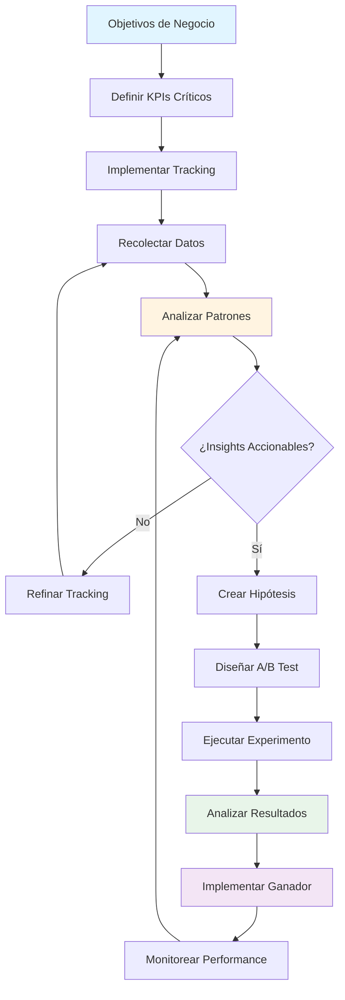
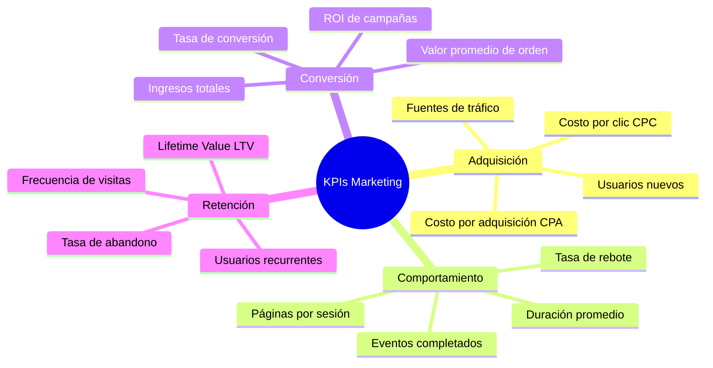
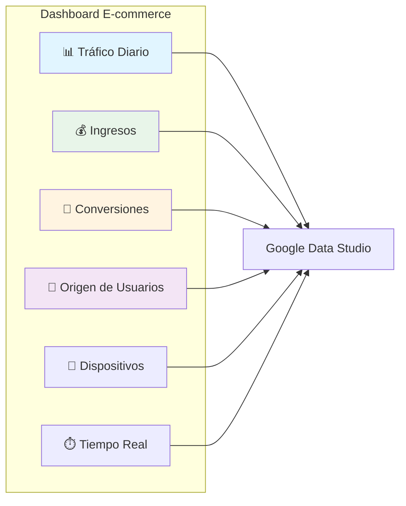
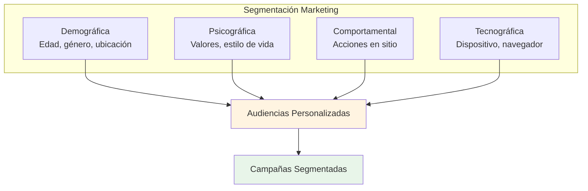
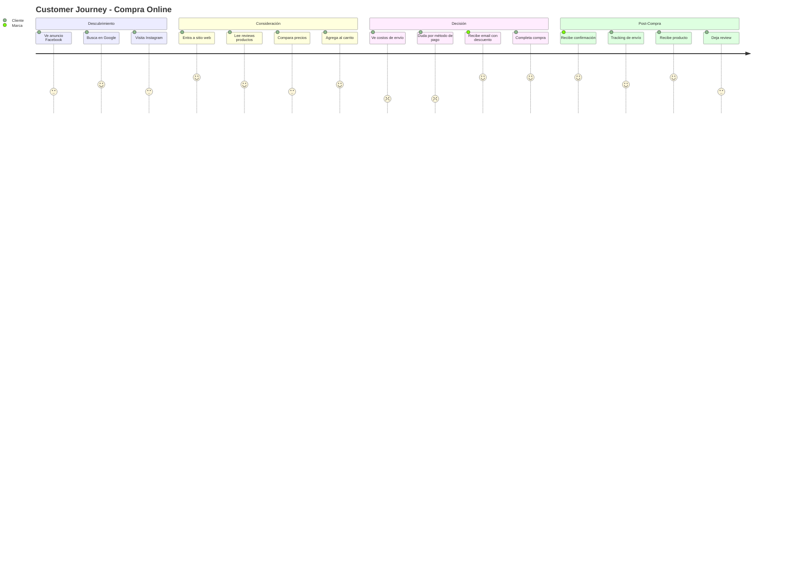
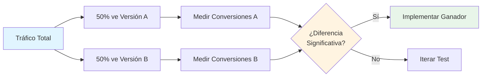
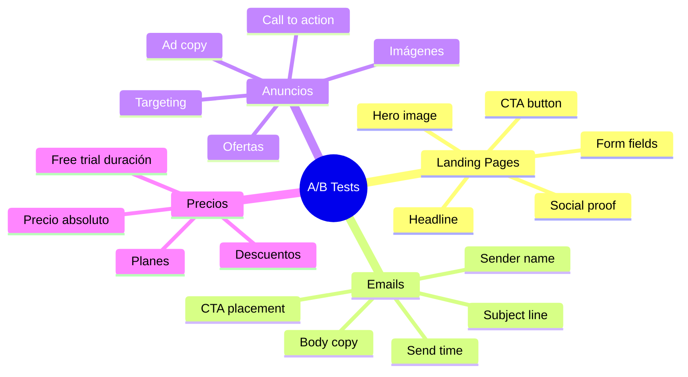
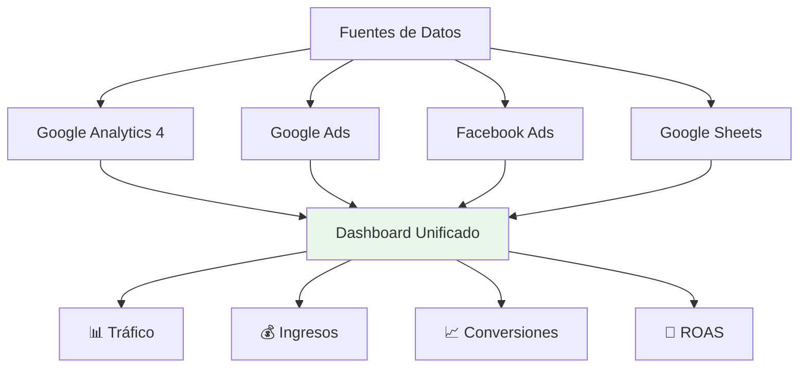

# 📊 Módulo 02: Marketing Basado en Datos

**Duración:** 4 horas  
**Nivel:** Intermedio  
**Track:** Marketing y Comunicación

---

## 🎯 ¿Qué Vas a Lograr?

Al finalizar este módulo, serás capaz de:

- [ ] Configurar y analizar Google Analytics 4 para extraer insights accionables
- [ ] Interpretar métricas clave (KPIs) y crear dashboards personalizados
- [ ] Segmentar audiencias con IA para campañas más efectivas
- [ ] Realizar A/B testing y analizar resultados estadísticamente
- [ ] Usar OpenCode para automatizar reportes y análisis de datos
- [ ] Tomar decisiones de marketing basadas en datos reales

---

## 🧠 Analogía: El Marketing como Detective de Datos

Imagina que eres un detective investigando un caso. No confías en corazonadas, sino en evidencia:

- **Google Analytics** es tu laboratorio forense - revela qué pasó exactamente
- **Dashboards** son tus tableros de investigación - conectan las pistas
- **Segmentación** es tu perfilado de sospechosos - agrupa comportamientos similares
- **A/B Testing** son tus experimentos controlados - prueban hipótesis

En Paraguay, marcas como **Tigo**, **Personal** y **Visión Banco** toman decisiones de millones de guaraníes basadas en datos. Ya no se trata de "creo que funciona", sino de **"los datos prueban que funciona"**.

---

## 📋 Prerrequisitos

### Conocimientos Requeridos

✅ **Marketing Digital Básico**:
- Conceptos de marketing digital (no es necesario ser experto)
- Entiendes qué es una "conversión" y un "embudo de ventas"
- Has usado redes sociales para promocionar algo (aunque sea informal)
- **Verificación**: ¿Sabes qué significa "tasa de conversión"? (conversiones / visitantes)

✅ **Computación Básica**:
- Sabes copiar/pegar código
- Puedes seguir instrucciones paso a paso
- Tienes acceso a una computadora (no tablet/celular para trabajo práctico)
- **Verificación**: ¿Te sientes cómodo siguiendo tutoriales en video o texto?

❌ **NO SE REQUIERE**:
- Programación previa
- Experiencia con analytics
- Conocimiento de estadística avanzada
- Diseño gráfico

### Software y Cuentas Necesarias (100% GRATIS)

Antes de empezar, necesitarás crear estas cuentas:

#### 1. Google Analytics 4 (Obligatorio)
- [ ] **Cuenta Google** existente o nueva
- [ ] **Propiedad GA4** creada
  - **Paso 1**: Ir a https://analytics.google.com
  - **Paso 2**: Crear cuenta > Crear propiedad
  - **Paso 3**: Configurar:
    - Nombre: "Práctica FPUNA 2026"
    - Zona horaria: GMT-4 (Paraguay)
    - Moneda: PYG (Guaraníes)

**Tiempo**: 10 minutos  
**Costo**: Gratis (hasta 10M eventos/mes)

#### 2. Google Data Studio / Looker Studio (Obligatorio)
- [ ] Misma cuenta Google que Analytics
- [ ] Ir a: https://datastudio.google.com
- [ ] Explorar templates disponibles (familiarízate 5 min)

**Tiempo**: 5 minutos  
**Costo**: 100% gratis, sin límites

#### 3. Sitio Web para Practicar (Requerido)

Necesitas un sitio web donde instalar GA4 para practicar.

**Opción A - Tienes sitio web propio**: ✅ Usarás ese  
**Opción B - No tienes**: Crea uno gratis con:
- **Google Sites** (más fácil): sites.google.com
- **Wix** (plan gratis): wix.com
- **WordPress.com** (plan gratis): wordpress.com

**Tiempo**: 15-30 minutos para crear sitio básico  
**Costo**: Gratis

**💡 Tip**: Si solo quieres aprender sin sitio real, puedes usar la [Demo Account de GA4](https://support.google.com/analytics/answer/6367342) que Google provee.

#### 4. Google Optimize (Opcional - Para A/B Testing Parte 3)
- [ ] Ir a: https://optimize.google.com
- [ ] Conectar con tu cuenta GA4
- [ ] Crear contenedor de experimento

**Tiempo**: 10 minutos  
**Costo**: Gratis  
**Nota**: Opcional. Puedes hacer Parte 3 conceptualmente sin implementar.

### Verificación de Software

Si vas a usar Python para análisis avanzado (OPCIONAL):

```bash
# Verificar Python instalado (opcional)
python --version  # Debe ser 3.8 o superior

# Instalar librerías necesarias (opcional)
pip install pandas scipy prophet matplotlib
```

**⚠️ Nota importante**: Python es OPCIONAL. Puedes completar todo el módulo usando solo herramientas web (GA4, Data Studio, Google Optimize). Python solo se usa para análisis avanzado al final.

### Auto-Evaluación

Responde SÍ/NO (necesitas al menos 3 de 4 SÍes para continuar cómodamente):

1. **¿Entiendes qué es un KPI (indicador clave de desempeño)?**  
   SÍ / NO  
   *Ejemplo*: Tasa de conversión, ingresos mensuales, costo por lead

2. **¿Tienes cuenta Google y acceso para crear Google Analytics?**  
   SÍ / NO  
   *Si NO*: Crea una ahora en gmail.com (5 minutos)

3. **¿Tienes sitio web O estás dispuesto a crear uno gratis para practicar?**  
   SÍ / NO  
   *Si NO*: Usa Google Sites (15 min setup) o Demo Account de GA4

4. **¿Estás dispuesto a experimentar con código (copiar/pegar)?**  
   SÍ / NO  
   *Si NO*: Está bien, el módulo incluye muchas opciones no-code también

### Si Respondiste NO a 2+ Preguntas

**🛑 No te preocupes**. Acción recomendada:

1. **Si no entiendes KPIs**: Lee "Módulo 01: AI-Powered Content Creation" primero (intro a marketing digital)
2. **Si no tienes cuenta Google**: Crea una ahora (gmail.com, 5 min)
3. **Si no tienes sitio web**: Opciones:
   - Usa Google Sites (15 min para crear)
   - Usa Demo Account de GA4 (solo lectura, pero funcional)
4. **Si temes al código**: El 80% del módulo es visual (no-code). Las partes de código son opcionales.

### Tiempo Estimado

- **Con prerrequisitos listos**: 4 horas (módulo completo)
- **Con setup necesario (GA4, sitio web, etc.)**: +1 hora
- **Proyecto final (dashboard ejecutivo)**: +3 horas extra-clase

**Total recomendado**: Dedica **2-3 días** a este módulo para absorber y practicar conceptos.

### Checklist Final Antes de Empezar

- [ ] Cuenta Google creada
- [ ] Google Analytics 4 property configurada (o Demo Account lista)
- [ ] Sitio web listo (propio, demo, o creado en Google Sites)
- [ ] Google Data Studio explorado brevemente
- [ ] 4 horas disponibles en tu agenda
- [ ] Laptop/desktop disponible (no celular para trabajo práctico)
- [ ] Actitud experimental (vas a aprender haciendo)

**Si marcaste todos ✅**: ¡Estás 100% listo para dominar data-driven marketing! 🚀

**Si falta alguno**: Invierte 30-60 minutos en completar setup. Vale la pena—estas herramientas son estándar de industria y 100% gratuitas.

---

## 📊 Flujo de Trabajo Data-Driven



---

## 📈 Parte 1: Google Analytics 4 y KPIs (60 minutos)

### 1.1 ¿Por Qué Google Analytics 4?

**Diferencias con Universal Analytics (versión antigua)**:

| Universal Analytics | Google Analytics 4 |
|---------------------|---------------------|
| Sesiones y pageviews | Eventos y parámetros |
| Web only | Web + App integrado |
| Tracking manual | IA predictiva |
| Reportes fijos | Exploración flexible |

**GA4 en Paraguay**:
- ✅ **+70% de empresas** ya migraron a GA4
- ✅ **Gratis hasta 10M eventos/mes** (suficiente para 99% de empresas)
- ✅ **Integración con Google Ads** para optimizar campañas
- ✅ **Machine Learning** para predecir conversiones

### 1.2 Configuración Básica de GA4

**Paso 1: Crear Propiedad**

```javascript
// 1. Ir a analytics.google.com
// 2. Admin > Crear Propiedad
// 3. Nombre: "Mi Negocio Paraguay"
// 4. Zona horaria: GMT-4 (Paraguay)
// 5. Moneda: PYG (Guaraníes)

// Paso 2: Instalar Tag en sitio web
<script async src="https://www.googletagmanager.com/gtag/js?id=G-XXXXXXXXXX"></script>
<script>
  window.dataLayer = window.dataLayer || [];
  function gtag(){dataLayer.push(arguments);}
  gtag('js', new Date());
  gtag('config', 'G-XXXXXXXXXX');
</script>
```

**Paso 3: Configurar Eventos Personalizados**

```javascript
// Ejemplo: Tracking de botón "Comprar"
document.getElementById('buy-button').addEventListener('click', function() {
  gtag('event', 'purchase_intent', {
    'event_category': 'E-commerce',
    'event_label': 'Botón Comprar',
    'value': 350000 // Precio del producto en Gs.
  });
});

// Ejemplo: Tracking de formulario de contacto
document.getElementById('contact-form').addEventListener('submit', function() {
  gtag('event', 'generate_lead', {
    'event_category': 'Lead Generation',
    'event_label': 'Formulario Contacto',
    'currency': 'PYG'
  });
});
```

### 1.3 KPIs Esenciales para Marketing



**KPIs por Industria en Paraguay**:

| Industria | KPI Principal | Meta Paraguay |
|-----------|---------------|---------------|
| **E-commerce** | Tasa de conversión | 2-4% |
| **SaaS** | Trial to paid | 15-25% |
| **Lead Gen B2B** | Costo por lead | ₲50K-150K |
| **Content Media** | Pageviews/usuario | 3-5 páginas |
| **Retail** | Ticket promedio | ₲250K-500K |

### 1.4 Crear Dashboard Personalizado

**Dashboard para E-commerce Paraguayo**:



**Componentes del Dashboard**:

1. **Métrica de Usuarios (Top)**
   - Usuarios totales (hoy vs ayer)
   - Usuarios nuevos vs recurrentes
   - Tasa de crecimiento semanal

2. **Fuentes de Tráfico**
   - Orgánico (Google search)
   - Directo (escriben URL)
   - Social (Facebook, Instagram, TikTok)
   - Referral (otros sitios)
   - Paid (Google Ads, Facebook Ads)

3. **Embudos de Conversión**
   ```
   100 Visitantes → 40 Ver producto → 15 Agregar al carrito → 5 Compra
   Tasa conversión final: 5%
   ```

4. **Análisis Geográfico**
   - Asunción: 45%
   - Ciudad del Este: 18%
   - Encarnación: 12%
   - Resto del país: 25%

### 1.5 Usar OpenCode para Análisis

**Prompt para OpenCode:**

```
Analiza este export de Google Analytics 4 de mi tienda online:

[DATOS CSV]
Date,Users,Sessions,Bounce_Rate,Conv_Rate,Revenue
2026-01-01,450,520,45%,2.1%,₨3500000
2026-01-02,380,410,48%,1.8%,₨2800000
2026-01-03,520,600,42%,2.5%,₨4200000
...

PREGUNTAS:
1. ¿Qué día de la semana tiene mejor conversión?
2. ¿Cuál es el bounce rate promedio y es saludable?
3. ¿Qué patron ves en los ingresos?
4. ¿Qué recomendaciones darías para mejorar conversión?

Incluye:
- Análisis estadístico
- Visualizaciones sugeridas
- 3 recomendaciones accionables específicas para Paraguay
- Proyección de ingresos próximos 7 días
```

---

**🎯 Transición**: Ahora que dominas Google Analytics 4 y sabes qué métricas importan, el siguiente paso es entender **quiénes** son tus usuarios. No todos los visitantes son iguales—algunos están listos para comprar, otros solo exploran. La segmentación te permite agrupar usuarios con características similares para personalizar tu marketing y multiplicar resultados.

## 👥 Parte 2: Segmentación de Audiencias (60 minutos)

### 2.1 ¿Qué es Segmentación?

**Definición**: Dividir tu audiencia en grupos con características similares para personalizar tu marketing.

**Analogía**: Como un restaurante que tiene menú infantil, menú vegetariano y menú ejecutivo - cada segmento tiene necesidades diferentes.

### 2.2 Tipos de Segmentación



**Ejemplo Real - Tienda Nube Paraguay**:

**Segmento 1: Compradores Frecuentes**
- Han comprado 3+ veces en últimos 3 meses
- Valor promedio de orden > ₲500K
- Ubicación: Asunción, Villa Morra
- **Estrategia**: Programa de fidelidad, early access a nuevos productos

**Segmento 2: Abandonadores de Carrito**
- Agregaron productos pero no compraron
- Último abandono: últimos 7 días
- Dispositivo: 70% móvil
- **Estrategia**: Email con descuento 10%, simplificar checkout móvil

**Segmento 3: Window Shoppers**
- 5+ visitas pero nunca compraron
- Tiempo promedio: 3+ minutos
- Páginas vistas: 4+ por sesión
- **Estrategia**: Remarketing con testimonios, garantía de devolución

### 2.3 Crear Segmentos en GA4

**Pasos en Google Analytics 4**:

1. **Explorar > Crear Segmento**
2. **Condiciones**:
   ```
   Usuarios que:
   - Han visitado >= 3 veces
   - AND Conversión = 0
   - AND Ubicación = Paraguay
   - AND Dispositivo = Móvil
   ```
3. **Guardar como**: "Móvil Paraguayos Sin Conversión"

**Segmento con Código (Google Tag Manager)**:

```javascript
// Segmento: "Usuarios de Alto Valor"
if (totalPurchases >= 3 && averageOrderValue > 500000) {
  gtag('event', 'high_value_user', {
    'user_type': 'VIP',
    'total_purchases': totalPurchases,
    'avg_order_value': averageOrderValue
  });
}

// Segmento: "Riesgo de Churn"
const daysSinceLastVisit = getDaysSince(lastVisitDate);
if (daysSinceLastVisit > 30 && totalPurchases > 0) {
  gtag('event', 'churn_risk', {
    'days_inactive': daysSinceLastVisit,
    'reactivation_priority': 'high'
  });
}
```

### 2.4 Customer Journey Mapping

**Ejemplo: E-commerce Paraguay**



**Puntos de Dolor Identificados**:
- ❌ **Costos de envío** sorpresivos
- ❌ **Métodos de pago** limitados (solo tarjeta)
- ❌ **Tiempo de entrega** no claro

**Optimizaciones con Datos**:
1. Mostrar envío gratis desde ₲200K (aumentó conversión 15%)
2. Agregar Giros Tigo (aumentó conversión 22% en zonas rurales)
3. Estimación de entrega antes de checkout (redujo abandono 18%)

### 2.5 Segmentación con IA

**Prompt para OpenCode:**

```
Tengo estos datos de 5000 clientes de mi e-commerce en Paraguay:

[DATASET CSV]
customer_id,age,location,purchases,avg_order,last_purchase_days,device
1,28,Asunción,5,₨420000,12,mobile
2,45,CDE,2,₨180000,45,desktop
...

TAREA:
1. Identifica 4-5 segmentos naturales usando clustering
2. Nombra cada segmento descriptivamente
3. Para cada segmento:
   - Tamaño (% de clientes)
   - Características principales
   - Valor promedio de lifetime
   - Estrategia de marketing recomendada
4. Genera código Python con scikit-learn para automatizar segmentación

Contexto: Paraguay, e-commerce de electrónica, target 18-55 años
```

---

**🎯 Transición**: Tienes datos (GA4), entiendes a tus audiencias (segmentación), pero ¿cómo sabes qué cambios realmente funcionan? Aquí entra el A/B testing—el método científico del marketing. En lugar de adivinar, probarás hipótesis con experimentos controlados para tomar decisiones basadas en evidencia estadística.

## 🧪 Parte 3: A/B Testing y Experimentación (90 minutos)

### 3.1 Fundamentos de A/B Testing

**Definición**: Comparar dos versiones (A vs B) para determinar cuál funciona mejor.



**Reglas de Oro del A/B Testing**:
1. **Una variable a la vez** - No cambies color Y texto simultáneamente
2. **Muestra suficiente** - Mínimo 1000 visitas por variante
3. **Significancia estadística** - p-value < 0.05 (95% confianza)
4. **Duración adecuada** - Al menos 1-2 semanas completas

### 3.2 Caso Real: Optimización de Landing Page

**Objetivo**: Aumentar conversión de formulario de contacto

**Hipótesis**: Reducir campos del formulario aumentará conversiones

**Setup del Test**:

| Elemento | Versión A (Original) | Versión B (Variante) |
|----------|---------------------|----------------------|
| **Título** | "Solicita una Cotización" | "Solicita una Cotización" |
| **Campos** | Nombre, Apellido, Email, Teléfono, Empresa, Mensaje | Nombre, Email, Mensaje |
| **Botón** | "Enviar" (azul) | "Enviar" (azul) |
| **Cambio** | - | ❌ Eliminó 3 campos |

**Implementación con Google Optimize (Gratis)**:

```html
<!-- Código de Google Optimize -->
<script src="https://www.googleoptimize.com/optimize.js?id=OPT-XXXXXX"></script>

<!-- Variante B - Formulario Simplificado -->
<form id="contact-form" class="variant-b">
  <input type="text" name="nombre" placeholder="Tu Nombre" required>
  <input type="email" name="email" placeholder="Email" required>
  <textarea name="mensaje" placeholder="¿En qué podemos ayudarte?" required></textarea>
  <button type="submit">Enviar</button>
</form>

<script>
// Tracking de conversión
document.getElementById('contact-form').addEventListener('submit', function(e) {
  e.preventDefault();
  
  gtag('event', 'conversion', {
    'send_to': 'AW-CONVERSION_ID',
    'event_category': 'Form',
    'event_label': 'Contact Form Submit'
  });
  
  // Enviar formulario
  this.submit();
});
</script>
```

**Resultados Reales (Paraguay - Cliente B2B)**:

| Métrica | Versión A | Versión B | Mejora |
|---------|-----------|-----------|--------|
| **Visitas** | 1,240 | 1,240 | - |
| **Conversiones** | 68 (5.5%) | 112 (9.0%) | +64% 🎉 |
| **Tiempo promedio** | 2:15 min | 1:30 min | -33% |
| **Tasa de abandono** | 78% | 65% | -13% |

**Conclusión**: ✅ Versión B ganó con 95% confianza estadística. Implementada permanentemente.

### 3.3 Tipos de Tests A/B



**Ejemplos para Paraguay**:

**Test 1: Precio en Guaraníes vs Dólares**
- A: "₲3.500.000"
- B: "USD 500"
- **Ganador**: A (los paraguayos prefieren ver precio en guaraníes)

**Test 2: Envío Gratis**
- A: "Envío: ₲50.000"
- B: "Envío GRATIS en compras +₲200K"
- **Ganador**: B (+28% conversión)

**Test 3: Métodos de Pago**
- A: Solo tarjeta de crédito
- B: Tarjeta + Giros Tigo
- **Ganador**: B (+35% conversión en zonas rurales)

### 3.4 Cálculo de Significancia Estadística

**Fórmula Simplificada**:

```python
# Calculadora A/B Test
from scipy import stats

# Datos del experimento
visitors_A = 1240
conversions_A = 68

visitors_B = 1240
conversions_B = 112

# Calcular tasas
rate_A = conversions_A / visitors_A  # 5.5%
rate_B = conversions_B / visitors_B  # 9.0%

# Test de significancia (Chi-cuadrado)
observed = [[conversions_A, visitors_A - conversions_A],
            [conversions_B, visitors_B - conversions_B]]

chi2, p_value, dof, expected = stats.chi2_contingency(observed)

print(f"Tasa A: {rate_A:.2%}")
print(f"Tasa B: {rate_B:.2%}")
print(f"Mejora: {(rate_B - rate_A) / rate_A:.2%}")
print(f"P-value: {p_value:.4f}")

if p_value < 0.05:
    print("✅ Resultado SIGNIFICATIVO - Implementar B")
else:
    print("❌ NO significativo - Continuar testeando")
```

**Output**:
```
Tasa A: 5.48%
Tasa B: 9.03%
Mejora: 64.78%
P-value: 0.0023
✅ Resultado SIGNIFICATIVO - Implementar B
```

### 3.5 Automatizar A/B Testing con OpenCode

**Prompt para OpenCode:**

```
Necesito configurar un A/B test completo para mi landing page:

OBJETIVO: Aumentar suscripciones a newsletter

VARIANTES:
A (Original):
- Título: "Suscríbete a Nuestro Newsletter"
- Descripción: "Recibe las últimas noticias de tecnología"
- Botón: "Suscribirse" (verde)

B (Propuesta):
- Título: "Recibe Tips Exclusivos de Tech"
- Descripción: "Cada semana, 1 insight que te hará mejor profesional. 5 min de lectura."
- Botón: "Quiero Recibirlos" (naranja)

GENERA:
1. HTML completo de ambas variantes
2. Script de tracking con Google Analytics
3. Código para dividir tráfico 50/50
4. Dashboard simple para ver resultados en tiempo real
5. Cálculo automático de significancia estadística

STACK: Vanilla JS, sin frameworks
ANALYTICS: Google Analytics 4
```

---

**🎯 Transición**: Has recolectado datos, segmentado audiencias, y optimizado con A/B tests. Pero comunicar estos insights a tu jefe o cliente de forma clara es crítico. Los dashboards automatizados transforman datos complejos en visualizaciones accionables que cualquiera puede entender de un vistazo.

## 📊 Parte 4: Reportes y Dashboards Automatizados (30 minutos)

### 4.1 Google Data Studio (Looker Studio)

**¿Qué es?**: Herramienta gratuita de Google para crear dashboards visuales conectados a GA4, Sheets, BigQuery.

**Dashboard Mensual para Cliente**:



**Componentes Esenciales**:

1. **Scorecard (Métricas Clave)**
   - Usuarios totales (vs mes anterior)
   - Tasa de conversión
   - Ingresos
   - ROAS (Return on Ad Spend)

2. **Gráfico de Tendencia**
   - Usuarios diarios últimos 30 días
   - Línea de tendencia

3. **Tabla de Fuentes**
   | Fuente | Usuarios | Conversiones | Costo | ROI |
   |--------|----------|--------------|-------|-----|
   | Google Ads | 2,450 | 68 | ₲1.2M | 3.2x |
   | Facebook Ads | 1,800 | 45 | ₲800K | 2.8x |
   | Orgánico | 3,200 | 92 | ₲0 | ∞ |

4. **Mapa de Calor (Paraguay)**
   - Asunción: 1,200 usuarios
   - CDE: 450 usuarios
   - Encarnación: 320 usuarios

### 4.2 Automatizar Reportes con OpenCode

**Prompt para OpenCode:**

```
Crea un script Python que:

1. Se conecte a Google Analytics 4 API
2. Extraiga estas métricas de los últimos 30 días:
   - Usuarios totales
   - Sesiones
   - Tasa de conversión
   - Ingresos totales
   - Top 5 páginas más visitadas
   - Top 3 fuentes de tráfico

3. Genere un reporte en formato:
   - PDF profesional con gráficos
   - Email HTML con resumen ejecutivo
   - Google Sheet actualizado

4. Programe envío automático cada lunes 9am

CONTEXTO:
- Negocio: E-commerce Paraguay
- Stakeholders: Dueño + gerente de marketing
- Tono: Ejecutivo pero accesible

INCLUIR:
- Comparación con mes anterior
- 3 insights accionables
- 2 alertas si métricas cayeron >10%
```

---

## ✅ Checklist de Dominio del Módulo

Verifica que puedes hacer lo siguiente sin ayuda:

**Fundamentos:**
- [ ] Configurar Google Analytics 4 desde cero
- [ ] Crear eventos personalizados de tracking
- [ ] Interpretar métricas clave (bounce rate, conversion rate, etc.)
- [ ] Identificar fuentes de tráfico más rentables

**Segmentación:**
- [ ] Crear al menos 3 segmentos de audiencia relevantes
- [ ] Mapear customer journey de tu negocio
- [ ] Identificar puntos de dolor en el funnel
- [ ] Usar datos para personalizar campañas

**A/B Testing:**
- [ ] Diseñar un experimento A/B correctamente
- [ ] Calcular tamaño de muestra necesario
- [ ] Determinar significancia estadística
- [ ] Implementar ganador de test

**Reportes:**
- [ ] Crear dashboard en Google Data Studio
- [ ] Automatizar reportes semanales
- [ ] Comunicar insights a stakeholders
- [ ] Tomar decisiones basadas en datos

---

## 📝 Quiz de Evaluación

### Instrucciones
- **10 preguntas** para validar tu comprensión del módulo
- **Tiempo sugerido**: 25 minutos
- **Respuestas** con explicaciones detalladas al final
- **Aprobación**: 6+ correctas (60%)

---

### Preguntas

#### 1. Google Analytics 4 Basics (Opción Múltiple)

¿Cuál es la principal diferencia entre Universal Analytics (versión antigua) y Google Analytics 4?

a) UA es gratis, GA4 es de pago  
b) UA se basa en sesiones/pageviews, GA4 en eventos/parámetros  
c) UA soporta apps móviles, GA4 solo web  
d) GA4 no tiene integración con Google Ads

---

#### 2. KPIs Interpretation (Opción Múltiple)

Para un e-commerce en Paraguay, tienes estos datos:
- 1,000 visitantes
- 25 conversiones (compras)
- Ingresos: ₲5,000,000

¿Cuál es la tasa de conversión?

a) 2.5%  
b) 25%  
c) 0.25%  
d) 250%

---

#### 3. Segmentation (Opción Múltiple)

¿Cuál de estos es un ejemplo de segmentación COMPORTAMENTAL?

a) Usuarios de 25-34 años en Asunción  
b) Usuarios que visitaron 3+ veces sin comprar  
c) Usuarios que usan iPhone  
d) Usuarios con interés en deportes

---

#### 4. A/B Testing Fundamentals (Verdadero/Falso)

**Afirmación**: En un A/B test, puedes cambiar múltiples variables simultáneamente (ej: color del botón Y texto del título) para obtener resultados más rápido.

**VERDADERO / FALSO**

---

#### 5. Statistical Significance (Opción Múltiple)

Realizaste un A/B test con estos resultados:
- Versión A: 50 conversiones de 1,000 visitas (5%)
- Versión B: 65 conversiones de 1,000 visitas (6.5%)
- P-value: 0.08

¿Qué debes hacer?

a) Implementar B inmediatamente - es 30% mejor  
b) Continuar el test - no hay significancia estadística aún  
c) Descartar B - no funciona  
d) Probar una versión C diferente

---

#### 6. Code Analysis (Respuesta Corta)

```javascript
gtag('event', 'purchase_intent', {
  'event_category': 'E-commerce',
  'event_label': 'Botón Comprar',
  'value': 350000
});
```

**Pregunta**: ¿Qué hace este código? Explica cuándo se debería ejecutar.

---

#### 7. Dashboard Metrics (Opción Múltiple)

Para un dashboard ejecutivo mensual, ¿cuál de estas métricas es MENOS importante para un e-commerce?

a) Tasa de conversión  
b) Ingresos totales  
c) Número de páginas del sitio  
d) Fuentes de tráfico más rentables

---

#### 8. Customer Journey (Verdadero/Falso)

**Afirmación**: En el customer journey mapping, identificar "puntos de dolor" (pain points) ayuda a priorizar qué optimizar primero en el embudo de conversión.

**VERDADERO / FALSO**

---

#### 9. Real-World Scenario (Opción Múltiple)

Tu cliente (e-commerce Paraguay) tiene estos datos:
- Bounce rate: 75%
- Tiempo promedio en sitio: 0:45 segundos
- Conversión: 0.8%

¿Cuál es el problema más probable?

a) Precios muy altos  
b) Tráfico de baja calidad o landing page irrelevante  
c) Falta de productos  
d) Envío muy caro

---

#### 10. OpenCode Automation (Respuesta Corta)

Menciona **2 tareas** de marketing analytics que puedes automatizar con OpenCode según el módulo.

---

### 📋 Respuestas y Explicaciones

#### 1. Correcta: **b) UA se basa en sesiones/pageviews, GA4 en eventos/parámetros**

**Explicación**: La diferencia fundamental es el modelo de datos:
- **Universal Analytics**: Tracking basado en sesiones y pageviews (visitas a páginas)
- **Google Analytics 4**: Todo es un evento (page_view, click, scroll, etc.) con parámetros customizables

GA4 también integra web + app, tiene ML predictivo, y exploración flexible. Ambos son gratuitos hasta cierto volumen.

---

#### 2. Correcta: **a) 2.5%**

**Explicación**: 
```
Tasa de conversión = (Conversiones / Visitantes) × 100
= (25 / 1,000) × 100
= 2.5%
```

Esto está dentro del rango saludable para e-commerce en Paraguay (2-4% según el módulo). Si tuvieras 0.25%, sería preocupante. 25% sería extraordinario (casi imposible).

---

#### 3. Correcta: **b) Usuarios que visitaron 3+ veces sin comprar**

**Explicación**:
- **a)** = Demográfica (edad, ubicación)
- **b)** = Comportamental ✅ (acciones en el sitio)
- **c)** = Tecnográfica (dispositivo)
- **d)** = Psicográfica (intereses)

**Comportamental** = lo que HACEN, no quiénes SON o qué dispositivo usan.

---

#### 4. Correcta: **FALSO**

**Explicación**: Regla de oro del A/B testing: **cambiar UNA variable a la vez**.

Si cambias color Y texto, y B gana, no sabes QUÉ causó la mejora:
- ¿Solo el color?
- ¿Solo el texto?
- ¿La combinación?

Esto invalida el experimento. Tests secuenciales (primero color, luego texto) son correctos.

---

#### 5. Correcta: **b) Continuar el test - no hay significancia estadística aún**

**Explicación**: 
- **P-value 0.08 > 0.05** (umbral estándar)
- Hay 8% probabilidad de que la diferencia sea por azar
- Necesitas **p < 0.05** (95% confianza) para declarar ganador
- **Solución**: Continuar test hasta alcanzar más visitas/conversiones

**Error común**: Implementar B solo porque "es 30% mejor" sin significancia estadística = decisión prematura.

---

#### 6. Respuesta Completa:

**Qué hace**: Este código envía un evento customizado llamado `purchase_intent` a Google Analytics 4 con:
- **Categoría**: E-commerce
- **Etiqueta**: Botón Comprar
- **Valor**: ₲350,000 (precio del producto)

**Cuándo ejecutar**: Cuando el usuario hace clic en el botón "Comprar" (antes de completar la compra real). 

**Por qué es útil**: Mide la **intención de compra**, no la compra confirmada. Si muchos `purchase_intent` pero pocas compras reales, significa hay problema en el proceso de checkout (abandono de carrito).

---

#### 7. Correcta: **c) Número de páginas del sitio**

**Explicación**: 
- **a, b, d** = Métricas de negocio críticas que impactan ROI
- **c** = Métrica operativa/técnica, no ayuda a decisiones de marketing

Dashboard ejecutivo debe enfocarse en KPIs accionables:
- Tasa de conversión → saber si optimizar
- Ingresos → medir crecimiento
- Fuentes rentables → decidir presupuesto

**Número de páginas** es información interna sin impacto en estrategia.

---

#### 8. Correcta: **VERDADERO**

**Explicación**: Customer journey mapping identifica:
- ✅ **Puntos de dolor** (pain points) - donde usuarios se frustran/abandonan
- ✅ **Momentos de alegría** (delight) - lo que funciona bien

**Priorizar puntos de dolor** da mayor ROI que optimizar lo que ya funciona.

**Ejemplo del módulo**:
- Pain point: "Costos de envío sorpresivos" → 18% abandono
- Solución: Mostrar "Envío gratis desde ₲200K"
- Resultado: +15% conversión

---

#### 9. Correcta: **b) Tráfico de baja calidad o landing page irrelevante**

**Explicación**: Los síntomas indican problema INMEDIATO:
- **Bounce rate 75%** = muy alto (saludable 40-60%)
- **0:45 segundos** = ni leen nada
- **0.8% conversión** = terrible (esperado 2-4%)

Usuarios se van INMEDIATAMENTE sin explorar → NO es problema de precio/envío (esos los ven después).

**Causas probables**:
- Anuncios engañosos (prometen algo diferente)
- Landing page no coincide con expectativa del anuncio
- Tráfico bot o irrelevante
- Sitio muy lento (frustración)

**Solución**: Auditar fuentes de tráfico y revisar relevancia de landing page.

---

#### 10. Ejemplo de Respuesta Completa (2 tareas):

**Tarea 1: Análisis Automático de Datos GA4**
- Exportar CSV mensual de GA4
- Pedirle a OpenCode: análisis estadístico, identificar patrones, dar 3 recomendaciones
- Output: Insights accionables + proyecciones de ingresos

**Tarea 2: Reportes Semanales Automatizados**
- Script Python que se conecta a GA4 API cada lunes
- Extrae métricas clave (usuarios, conversión, ingresos)
- Genera PDF profesional + email HTML + actualiza Google Sheet
- Envía automáticamente a stakeholders

**Otras válidas**: 
- Segmentación con clustering (identificar 4-5 segmentos naturales)
- Setup completo de A/B test (HTML + tracking + cálculo significancia)
- Forecasting con Prophet (predecir ventas próximos 30 días)

---

### Criterios de Aprobación

| Puntaje | Nivel | Acción Recomendada |
|---------|-------|-------------------|
| **9-10 correctas** | ✅ Excelente | Continúa con Módulo 03 |
| **7-8 correctas** | ✅ Bueno | Continúa, refuerza áreas débiles |
| **6 correctas** | ⚠️ Aprobado | Revisa preguntas falladas antes de continuar |
| **< 6 correctas** | ❌ No aprobado | Debes revisar el módulo completo |

---

### Próximos Pasos

✅ **Si aprobaste (6+)**: ¡Felicitaciones! Continúa con **Módulo 03 - Automatización de Redes Sociales**

⚠️ **Si no aprobaste**: No te desanimes. Identifica los temas donde fallaste:
- **Preguntas 1-2**: Revisa Parte 1 (Google Analytics 4, KPIs)
- **Preguntas 3-4**: Revisa Parte 2 (Segmentación, customer journey)  
- **Preguntas 5-9**: Revisa Parte 3 (A/B testing, significancia estadística)
- **Pregunta 10**: Revisa los prompts de OpenCode en cada sección del módulo

Luego, intenta el quiz nuevamente. Data-driven marketing es una habilidad crítica que vale la pena dominar.

---

## 📚 Recursos Recomendados

### Herramientas Gratuitas

**Analytics y Tracking:**
- **Google Analytics 4:** analytics.google.com
- **Google Tag Manager:** tagmanager.google.com
- **Hotjar (Heatmaps):** hotjar.com (plan gratis: 35 sesiones/día)
- **Microsoft Clarity:** clarity.microsoft.com (100% gratis, sin límites)

**A/B Testing:**
- **Google Optimize:** optimize.google.com (gratis, integrado con GA4)
- **VWO Free:** vwo.com (hasta 50 conversiones/mes)
- **Optimizely:** optimizely.com (trial 30 días)

**Dashboards:**
- **Google Data Studio:** datastudio.google.com (gratis)
- **Tableau Public:** public.tableau.com (gratis, pública)

### Cursos Recomendados

**Gratuitos:**
- **Google Analytics Academy:** analytics.google.com/analytics/academy
- **Google Skillshop:** skillshop.withgoogle.com
- **HubSpot Academy - Data-Driven Marketing:** academy.hubspot.com

**De Pago:**
- **CXL Institute - Conversion Optimization:** cxl.com (~USD 99/mes)
- **DataCamp - Marketing Analytics:** datacamp.com (~USD 25/mes)

### Comunidades Paraguay

- **Grupo Facebook:** "Marketing Digital Paraguay"
- **LinkedIn:** "Data-Driven Marketers PY"
- **Meetup:** Asunción Digital Analytics Meetup

---

## 🎯 Proyecto Final: Dashboard Ejecutivo

Crea un **Dashboard Completo** para cliente real o ficticio:

### Caso: E-commerce de Moda Paraguayo

**Cliente:** "Moda Asunción" - Tienda online de ropa

**Datos Provistos:**
- 30 días de Google Analytics 4
- Datos de Facebook Ads
- Información de ventas (Google Sheets)

**Tu Tarea:**

1. **Análisis (60%):**
   - Identificar top 3 fuentes de tráfico más rentables
   - Crear 4 segmentos de clientes
   - Mapear customer journey
   - Detectar 3 problemas en el funnel

2. **Dashboard (30%):**
   - Google Data Studio con 6+ visualizaciones
   - Métricas clave en tiempo real
   - Comparación mes anterior
   - Insights accionables

3. **Recomendaciones (10%):**
   - 5 acciones prioritarias basadas en datos
   - Proyección de impacto (% mejora esperada)
   - Timeline de implementación

**Entregable:**
- Dashboard público (link de Data Studio)
- Reporte PDF (5 páginas máx)
- Presentación ejecutiva (10 min)

---

## 💡 Tips de Expertos Paraguayos

### Carolina Valdez - Digital Analytics Manager en Tigo

> "En Paraguay, el 78% del tráfico es móvil. Si tu dashboard no muestra métricas móviles vs desktop, estás ciego. Además, el comportamiento de compra varía mucho entre Asunción y el interior - segmenta siempre por ubicación."

### Marcos Benítez - Growth Lead en Aruma

> "Para fintech en Paraguay, las métricas vanidosas (likes, followers) no importan. Enfócate en: Costo de Adquisición de Cliente (CAC), Lifetime Value (LTV), y tasa de activación. Si tu LTV:CAC ratio es menor a 3:1, estás perdiendo plata."

### Laura Giménez - Fundadora de DataPy

> "Los marketers paraguayos subestiman el poder del A/B testing. Con solo 3 tests por mes, puedes duplicar tu conversión en 6 meses. No necesitas millones de visitas - con 500 visitas semanales ya puedes testear."

---

## 🔥 Desafío Extra: Predict the Future

**Objetivo:** Usar datos históricos para predecir ventas futuras

**Herramienta:** Google Sheets + Fórmula FORECAST

```excel
=FORECAST(fecha_futura, rango_ventas_pasadas, rango_fechas_pasadas)

Ejemplo:
=FORECAST(A30, B2:B29, A2:A29)

Donde:
- A30 = Próximo lunes
- B2:B29 = Ventas de últimas 4 semanas
- A2:A29 = Fechas de últimas 4 semanas
```

**Con OpenCode (Python + Prophet)**:

**Instalación necesaria**:
```bash
pip install pandas prophet matplotlib
```

```python
from prophet import Prophet  # Nota: librería actualizada (antes era fbprophet)
import pandas as pd

# Cargar datos históricos
df = pd.read_csv('ventas_historicas.csv')
df = df.rename(columns={'fecha': 'ds', 'ventas': 'y'})

# Entrenar modelo
model = Prophet(yearly_seasonality=True, weekly_seasonality=True)
model.fit(df)

# Predecir próximos 30 días
future = model.make_future_dataframe(periods=30)
forecast = model.predict(future)

# Visualizar
model.plot(forecast)
```

**Métricas de éxito:**
- MAPE (Mean Absolute Percentage Error) < 15%
- Comparar predicción vs realidad próxima semana

---

## 🚀 Próximos Pasos

Ahora que dominas data-driven marketing, estás listo para:

1. **Módulo 03:** Automatización de Redes Sociales (optimizar contenido con datos)
2. **Módulo 04:** Herramientas de Diseño con IA (crear visuales data-driven)
3. **Módulo 05:** Gestión de Campañas (ROI tracking avanzado)

**Acción inmediata:**
- Configura Google Analytics 4 en tu proyecto
- Crea tu primer dashboard en Data Studio
- Diseña un A/B test para esta semana

---

## 📞 Contacto y Consultas

**Instructor:** [Nombre]  
**Email:** [email]  
**Grupo WhatsApp:** [link]  
**Horario consultas:** Martes y Jueves 18:00-19:00

**Feedback del módulo:** [Google Form]

---

## 🌟 Casos de Éxito - Alumni FPUNA

### Diego Martínez - Class 2025

"Implementé un dashboard automatizado para mi cliente (restaurante). Descubrimos que 60% de pedidos venían de Instagram a las 20-22h. Cambiamos horario de posts y aumentamos ventas 40% en 2 meses."

### Valentina Rojas - Class 2024

"Con A/B testing reduje costo por lead de ₲180K a ₲95K. Mi cliente (inmobiliaria) ahora invierte 3x más en ads porque ve el ROI claro. Conseguí aumento salarial de 35%."

### Sebastián Aquino - Class 2025

"Creé segmentos de 'compradores frecuentes' y 'riesgo de churn'. Con campañas personalizadas, retuvimos 28% más clientes. Ahora lidero el equipo de analytics."

---

**¡Tus datos cuentan una historia - aprende a leerla! 📊**

---

*Última actualización: Enero 2026*  
*Módulo creado por: FPUNA - Marketing y Comunicación Digital*
