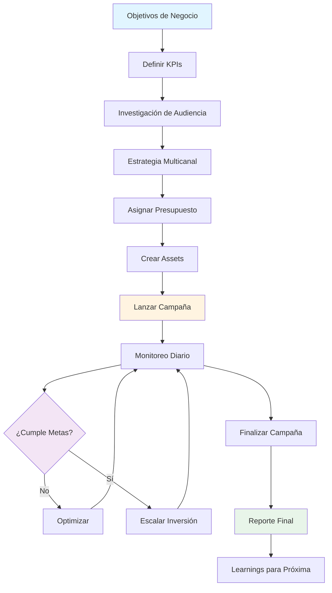
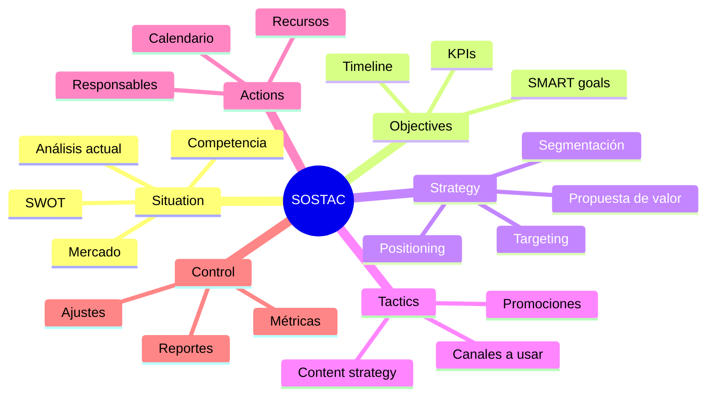
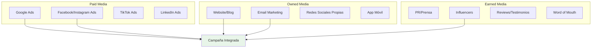
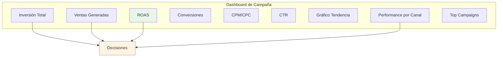

# 🚀 Módulo 05: Gestión de Campañas de Marketing

**Duración:** 4 horas  
**Nivel:** Avanzado  
**Track:** Marketing y Comunicación

---

## 🎯 ¿Qué Vas a Lograr?

Al finalizar este módulo, serás capaz de:

- [ ] Planificar campañas multicanal integradas (Paid + Organic + Email)
- [ ] Definir presupuestos y distribuir inversión óptimamente
- [ ] Trackear ROI (Return on Investment) y ROAS (Return on Ad Spend)
- [ ] Optimizar campañas en tiempo real con datos
- [ ] Usar OpenCode para automatizar reportes y proyecciones
- [ ] Presentar resultados a stakeholders efectivamente

---

## 🧠 Analogía: La Campaña como una Orquesta

Imagina que diriges una orquesta sinfónica:

- **Estrategia de campaña** = Partitura musical (guía a todos)
- **Canales de marketing** = Instrumentos (cada uno con su rol)
- **Presupuesto** = Ensayos y recursos (cuánto invertir en cada sección)
- **Analytics** = Director escuchando (ajusta en tiempo real)
- **OpenCode** = Asistente del director (automatiza coordinación)

En Paraguay, campañas profesionales de marcas como **Tigo**, **Personal** y **Banco Atlas** coordinan 5-10 canales simultáneamente con presupuestos de ₲50M-500M/mes. Este módulo te enseña a hacerlo a cualquier escala.

---

## 📊 Flujo Completo de Campaña



---

## 📋 Parte 1: Planificación Estratégica (60 minutos)

### 1.1 Framework SOSTAC

**Modelo profesional para planear campañas:**



### 1.2 Definir Objetivos SMART

**Ejemplo Malo:**
> "Queremos más ventas"

**Ejemplo Excelente:**
> "Aumentar ventas online en 25% (de ₲20M/mes a ₲25M/mes) en los próximos 3 meses mediante campaña de Facebook Ads + Email Marketing dirigida a mujeres 25-40 años en Asunción."

**Desglose SMART:**
- **S**pecific: Ventas online
- **M**easurable: 25% de incremento
- **A**chievable: De ₲20M a ₲25M (realista)
- **R**elevant: Impacta revenue directamente
- **T**ime-bound: 3 meses

### 1.3 Investigación de Audiencia

**Framework de Buyer Persona:**

```
PERSONA: "Marta - La Profesional Ocupada"

DEMOGRAFÍA:
- Edad: 32 años
- Ubicación: Asunción, Villa Morra
- Ingreso: ₲8M-12M/mes
- Educación: Universitaria completa
- Ocupación: Gerente de Marketing en empresa multinacional

PSICOGRAFÍA:
- Valores: Eficiencia, calidad, status
- Intereses: Fitness, viajes, gastronomía
- Comportamiento compra: Investiga online, compra en tienda física
- Medios consume: Instagram, LinkedIn, podcasts

PAIN POINTS:
- Poco tiempo para ir a tiendas físicas
- Desconfía de calidad en e-commerce local
- Busca marcas que entiendan su estilo de vida

SOLUCIÓN QUE BUSCA:
- E-commerce confiable con devoluciones fáciles
- Atención personalizada
- Entrega rápida (<24h)

MENSAJE QUE RESUENA:
"Compra en 5 minutos, recibe hoy. Tu estilo, sin complicaciones."
```

**Herramientas para Investigar:**

| Herramienta | Qué Te Dice | Gratis/Pago |
|-------------|-------------|-------------|
| **Google Analytics** | Demografía actual de visitantes | Gratis |
| **Facebook Audience Insights** | Intereses de audiencia en FB | Gratis |
| **Encuestas** (Google Forms) | Directo de clientes | Gratis |
| **SparkToro** | Qué consume tu audiencia | $50/mes |

### 1.4 Selección de Canales

**Matriz de Canales:**



**Canales por Objetivo:**

| Objetivo | Canales Recomendados | Por Qué |
|----------|----------------------|---------|
| **Awareness** | Facebook Ads, TikTok, Influencers | Alcance masivo |
| **Consideration** | Google Ads, Content Marketing, Email | Educación |
| **Conversion** | Google Shopping, Retargeting, Email | Intención de compra |
| **Retention** | Email, SMS, Loyalty Program | Relación directa |

**Para Paraguay:**
- ✅ **Facebook/Instagram Ads** - 85% penetración
- ✅ **Google Ads** - Alta intención de compra
- ✅ **WhatsApp Business** - Comunicación directa
- ❌ **Pinterest** - Bajo uso en Paraguay
- ❌ **Snapchat** - Audiencia limitada

### 1.5 Caso de Estudio: E-commerce de Moda

**Objetivo:**
Lanzar nueva colección de verano y generar ₲15M en ventas en 30 días.

**Audiencia:**
Mujeres 25-40 años, Asunción y alrededores, NSE B/C+

**Canales Seleccionados:**

```
1. Facebook/Instagram Ads (70% budget)
   - Awareness: Video de colección
   - Consideration: Carrusel con productos
   - Conversion: Retargeting con descuento

2. Email Marketing (10% budget)
   - Secuencia de lanzamiento (5 emails)
   - Segmentado por interacción

3. Influencers (15% budget)
   - 3 micro-influencers locales (10K-50K followers)
   - Posts + Stories

4. Google Ads (5% budget)
   - Shopping Ads para búsquedas de marca
```

**Timeline:**

```
SEMANA 1-2 (PRE-LANZAMIENTO):
- Teaser en redes orgánicas
- Email "coming soon" a base existente
- Influencers: Unboxing anticipado

SEMANA 3 (LANZAMIENTO):
- Activar todas las campañas de Ads
- Email de lanzamiento oficial
- Influencers: Posts principales
- Landing page activa

SEMANA 4 (OPTIMIZACIÓN):
- Analizar performance
- Pausar ads de bajo ROI
- Incrementar presupuesto en winners
- Email de recordatorio (última oportunidad)
```

---

## 💰 Parte 2: Presupuesto y Proyecciones (60 minutos)

### 2.1 Definir Presupuesto Total

**Regla General (Industry Standard):**

```
Presupuesto Marketing = 5-15% de Revenue Proyectado

Si vendes ₲100M/año:
- Mínimo: ₲5M/año (₲416K/mes)
- Ideal: ₲10M/año (₲833K/mes)
- Agresivo: ₲15M/año (₲1.25M/mes)
```

**Para Startups/Nuevos:**
- Primeros 6 meses: 20-30% de capital inicial
- Después: Ajustar según CAC (Costo de Adquisición de Cliente)

### 2.2 Distribución por Canal

**Framework 70-20-10:**

```
70% - Canales Probados (lo que ya sabes que funciona)
20% - Canales en Crecimiento (prometedores pero nuevos)
10% - Experimentación (innovación, riesgos)
```

**Ejemplo - E-commerce con ₲5M/mes:**

| Canal | % | Monto | Razón |
|-------|---|-------|-------|
| **Facebook Ads** | 40% | ₲2M | Históricamente mejor ROAS |
| **Google Ads** | 20% | ₲1M | Alto intent de compra |
| **Email Marketing** | 10% | ₲500K | Herramienta + diseño |
| **Influencers** | 15% | ₲750K | Awareness + credibilidad |
| **Content Marketing** | 10% | ₲500K | SEO a largo plazo |
| **TikTok Ads** | 5% | ₲250K | Experimentación (audiencia joven) |

### 2.3 Calcular ROI y ROAS

**Fórmulas Esenciales:**

**ROI (Return on Investment):**
```
ROI = (Ingresos - Costo) / Costo × 100

Ejemplo:
- Invertiste: ₲2M en Facebook Ads
- Generaste: ₲8M en ventas

ROI = (₲8M - ₲2M) / ₲2M × 100 = 300%

Significa: Por cada ₲1 invertido, ganaste ₲3
```

**ROAS (Return on Ad Spend):**
```
ROAS = Ingresos / Gasto en Ads

Mismo ejemplo:
ROAS = ₲8M / ₲2M = 4.0

Significa: Por cada ₲1 en ads, generaste ₲4 en ventas
```

**Metas por Industria (Paraguay):**

| Industria | ROAS Mínimo | ROAS Bueno | ROAS Excelente |
|-----------|-------------|------------|----------------|
| **E-commerce** | 2.5 | 4.0 | 6.0+ |
| **SaaS B2B** | 3.0 | 5.0 | 8.0+ |
| **Servicios** | 3.0 | 5.0 | 7.0+ |
| **Retail** | 2.0 | 3.5 | 5.0+ |

### 2.4 Proyecciones Financieras

**Template de Proyección Mensual:**

```
MES 1 (Lanzamiento):
- Inversión: ₲5M
- Ventas proyectadas: ₲12M
- ROI esperado: 140%
- Learnings: Identificar mejores audiencias

MES 2 (Optimización):
- Inversión: ₲4M (reducir underperformers)
- Ventas proyectadas: ₲15M
- ROI esperado: 275%
- Acción: Duplicar presupuesto en winners

MES 3 (Escalamiento):
- Inversión: ₲6M
- Ventas proyectadas: ₲22M
- ROI esperado: 267%
- Acción: Expandir a nuevas audiencias

TOTAL TRIMESTRE:
- Inversión total: ₲15M
- Ventas totales: ₲49M
- ROI promedio: 227%
- CAC (Costo por Cliente): ₲125K
- LTV (Lifetime Value): ₲450K
- LTV:CAC ratio: 3.6 (saludable)
```

### 2.5 Optimización de Presupuesto con IA

**Prompt para OpenCode:**

```
Tengo una campaña multicanal corriendo con estos datos:

INVERSIÓN Y RESULTADOS (Últimos 30 días):
| Canal | Invertido | Ventas | Conversiones | ROAS |
|-------|-----------|--------|--------------|------|
| Facebook Ads | ₲2,000,000 | ₲8,500,000 | 142 | 4.25 |
| Google Ads | ₲1,200,000 | ₲4,200,000 | 68 | 3.50 |
| Instagram Ads | ₲800,000 | ₲2,400,000 | 38 | 3.00 |
| TikTok Ads | ₲500,000 | ₲900,000 | 15 | 1.80 |
| Email Marketing | ₲300,000 | ₲1,800,000 | 45 | 6.00 |

PRESUPUESTO PRÓXIMO MES: ₲5,000,000

TAREA:
1. Analizar performance de cada canal
2. Recomendar distribución óptima de presupuesto
3. Identificar qué canales:
   - Escalar (aumentar inversión)
   - Mantener
   - Reducir
   - Pausar
4. Proyectar ROAS esperado con nueva distribución
5. Sugerir 3 optimizaciones específicas por canal

OBJETIVO: Maximizar ROAS total manteniendo o superando ₲18M en ventas

Genera tabla con distribución recomendada + justificación
```

---

## 📈 Parte 3: Ejecución y Monitoreo (90 minutos)

### 3.1 Crear Dashboard de Campaña

**Herramienta: Google Data Studio (Looker Studio)**

**Componentes Esenciales:**



**Métricas por Sección:**

**1. Overview (Top)**
```
+------------------+------------------+------------------+
| Inversión Total  | Ventas Generadas |      ROAS        |
|   ₲4,500,000     |   ₲18,200,000    |      4.04        |
|   ↑ 12% vs ayer  |   ↑ 18% vs ayer  |   ↑ 0.3 vs ayer  |
+------------------+------------------+------------------+
```

**2. Performance por Canal**
```
Facebook Ads:
- Invertido: ₲2M
- Ventas: ₲8.5M
- ROAS: 4.25 ⭐
- Status: ESCALAR

Google Ads:
- Invertido: ₲1.2M
- Ventas: ₲4.2M
- ROAS: 3.50 ✅
- Status: MANTENER

TikTok Ads:
- Invertido: ₲500K
- Ventas: ₲900K
- ROAS: 1.80 ⚠️
- Status: OPTIMIZAR O PAUSAR
```

**3. Gráfico de Tendencia (Últimos 7 días)**
```
Eje Y: Ventas Diarias
Eje X: Fecha

Línea 1: Ventas reales
Línea 2: Proyección
Línea 3: Meta
```

**4. Top Performing Ads**
```
| Ad Name | Impresiones | Clicks | Conversiones | Costo | ROAS |
|---------|-------------|--------|--------------|-------|------|
| Video Colección Verano | 450K | 12K | 85 | ₲850K | 5.2 |
| Carrusel Productos | 320K | 8.5K | 58 | ₲620K | 4.8 |
| Testimonios Clientes | 180K | 5.2K | 34 | ₲380K | 4.1 |
```

### 3.2 Monitoreo Diario

**Checklist Diario (15 minutos):**

```
☐ Revisar dashboard principal
☐ Verificar ROAS de cada canal (¿está sobre meta?)
☐ Identificar ads con CTR <1% (pausar o ajustar)
☐ Revisar comentarios en ads (responder negativos)
☐ Verificar presupuesto diario (¿se está gastando correctamente?)
☐ Chequear conversiones (¿hay drop inesperado?)
☐ Revisar alertas de Google Analytics
```

**Red Flags (Actuar Inmediatamente):**

| Problema | Qué Hacer |
|----------|-----------|
| **ROAS cae >20% vs ayer** | Revisar qué cambió, pausar underperformers |
| **CTR <0.5%** | Cambiar creative (imagen/video) |
| **CPC sube >30%** | Revisar audiencia, puede estar saturada |
| **Conversiones 0 en 24h** | Verificar pixel de tracking, landing page |

### 3.3 Optimización Semanal

**Reunión de Optimización (Viernes 30 min):**

**1. Análisis de Performance**
```
¿Qué funcionó?
- Facebook Carrusel tuvo ROAS 5.2 (best performer)
- Email a clientes recurrentes: 8% CTR

¿Qué NO funcionó?
- TikTok Ads: ROAS 1.8 (bajo meta)
- Google Display: CTR 0.3%
```

**2. Decisiones**
```
ESCALAR:
- Facebook Carrusel: +50% presupuesto (de ₲200K/día a ₲300K/día)
- Email Marketing: Enviar 2da secuencia

PAUSAR:
- Google Display (bajo performance)
- TikTok Ad #3 (ROAS <2)

TESTEAR:
- Nuevo creative con testimonios reales
- Audiencia Lookalike de compradores
```

**3. Tests A/B Próxima Semana**
```
Test 1: Headlines
- A: "Envío Gratis en Toda Paraguay"
- B: "Recibe Mañana - Envío Express"

Test 2: CTA
- A: "Comprar Ahora"
- B: "Ver Oferta"

Test 3: Imagen
- A: Producto solo
- B: Persona usando producto
```

### 3.4 Gestión de Crisis

**Escenarios Comunes:**

**Crisis 1: Comentarios Negativos en Ad**

```
Problema:
Ad de Facebook con 50 comentarios negativos: "Producto llegó dañado", "No responden mensajes"

Acción:
1. Pausar ad inmediatamente (evitar más daño)
2. Responder TODOS los comentarios en <1h:
   "Lamentamos esto. Envíanos DM con tu número de orden para resolverlo prioritariamente."
3. Investigar: ¿Es problema real o competencia?
4. Crear nuevo ad sin comentarios
5. Mejorar proceso de QC si problema es real
```

**Crisis 2: Budget Se Agota Antes de Fin de Mes**

```
Problema:
Presupuesto mensual ₲5M se gastó en 20 días (quedan 10 días)

Acción:
1. Pausar canales con ROAS <3
2. Reducir presupuesto diario 40% en todos los demás
3. Priorizar email marketing (más barato)
4. Analizar: ¿Aumentar budget? ¿Esperar próximo mes?
5. Prevención: Setup límites diarios automáticos
```

**Crisis 3: Conversiones Caen a Cero**

```
Problema:
Ayer tuvimos 15 conversiones, hoy 0 (mismo tráfico)

Diagnóstico:
1. ¿Pixel de Facebook funciona? (Facebook Events Manager)
2. ¿Landing page está caída? (Uptime monitor)
3. ¿Formulario funciona? (Testear manualmente)
4. ¿Cambió algo en el sitio? (Git history)

Solución:
- Identificar qué rompió tracking
- Arreglar inmediatamente
- Mientras tanto: Pausar ads (no gastes sin tracking)
```

### 3.5 Automatización con OpenCode

**Prompt para OpenCode:**

```
Necesito automatizar monitoreo y alertas de campaña:

INTEGRACIONES:
- Google Ads API
- Facebook Ads API
- Google Analytics 4
- Google Sheets (para log)

ALERTAS AUTOMÁTICAS (vía Email + Slack):
1. Si ROAS de cualquier campaña cae <2.5 → Alerta ALTA
2. Si presupuesto diario se gasta en <12h → Alerta MEDIA
3. Si conversiones = 0 por >4h → Alerta CRÍTICA
4. Si CTR cae <0.5% en ad con >1000 impresiones → Alerta BAJA

REPORTES AUTOMÁTICOS:
- Diario (8am): Resumen de ayer (email)
- Semanal (Lunes 9am): Análisis completo (PDF)
- Mensual (Día 1): Reporte ejecutivo (Slides)

OPTIMIZACIONES AUTOMÁTICAS:
- Pausar ad si ROAS <1.5 después de ₲100K gastados
- Escalar presupuesto +20% si ROAS >5 (max ₲500K/día)
- Rotar creative cada 7 días para evitar fatiga

GENERA:
1. Script Python completo
2. Setup instructions
3. Dashboard en Streamlit para ver status
4. Documentación de alertas
```

---

## 📊 Parte 4: Reporte y Presentación de Resultados (30 minutos)

### 4.1 Estructura de Reporte Final

**Template de Reporte Post-Campaña:**

```markdown
# REPORTE DE CAMPAÑA: [Nombre]
**Período:** [Fecha inicio] - [Fecha fin]
**Presentado a:** [Stakeholder]
**Fecha:** [Hoy]

---

## 1. RESUMEN EJECUTIVO (1 slide)

**Objetivo:**
Aumentar ventas en 25% mediante campaña digital multicanal

**Resultado:**
✅ Incremento de 32% en ventas (superó meta)
✅ ROAS promedio: 4.1 (sobre meta de 3.5)
✅ 487 nuevos clientes adquiridos

**Inversión vs Retorno:**
- Invertido: ₲15,000,000
- Generado: ₲61,500,000
- ROI: 310%

---

## 2. PERFORMANCE POR CANAL

| Canal | Inversión | Ventas | ROAS | % del Total |
|-------|-----------|--------|------|-------------|
| Facebook Ads | ₲6.5M | ₲28.2M | 4.3 | 46% |
| Google Ads | ₲3.8M | ₲15.1M | 4.0 | 25% |
| Email Marketing | ₲1.2M | ₲8.9M | 7.4 | 14% |
| Influencers | ₲2.5M | ₲6.8M | 2.7 | 11% |
| TikTok Ads | ₲1.0M | ₲2.5M | 2.5 | 4% |

**Insights:**
- Email tuvo mejor ROAS (7.4) pero volumen limitado
- Facebook generó casi la mitad de ventas totales
- TikTok bajo performance (audiencia no adecuada)

---

## 3. OPTIMIZACIONES REALIZADAS

**Semana 1-2:**
- Pausamos Google Display (ROAS 1.2)
- Escalamos Facebook Carrusel (+100% budget)

**Semana 3-4:**
- Agregamos audiencia Lookalike de compradores
- Implementamos retargeting de carritos abandonados

**Impacto:**
- ROAS mejoró de 3.5 a 4.1
- Costo por adquisición bajó 18%

---

## 4. LEARNINGS CLAVE

✅ **Qué Funcionó:**
- Video UGC (contenido de usuarios) tuvo 3x más engagement
- Envío gratis en compras >₲200K aumentó ticket promedio 35%
- Testimonios reales generaron más confianza que stock photos

❌ **Qué NO Funcionó:**
- TikTok ads: Audiencia muy joven para nuestro producto
- Anuncios genéricos: Mensajes personalizados convirtieron 2.5x mejor
- Horarios noche: Mejor performance 12-14h y 19-21h

---

## 5. RECOMENDACIONES PARA PRÓXIMA CAMPAÑA

1. **Aumentar presupuesto Email Marketing** (mejor ROAS)
2. **Eliminar TikTok** y redirigir presupuesto a Facebook
3. **Crear más contenido UGC** (testimonios reales)
4. **Implementar programa de referidos** (adquisición orgánica)
5. **Testear Google Shopping** (alto intent de compra)

---

## 6. PROYECCIÓN PRÓXIMO TRIMESTRE

Con aprendizajes aplicados:
- Inversión: ₲18M (+20%)
- Ventas proyectadas: ₲81M (+32%)
- ROAS esperado: 4.5
- Meta: 600 nuevos clientes
```

### 4.2 Presentación Visual

**Tips para Slides:**

```
SLIDE 1: Portada
- Título grande
- Logo
- Fecha

SLIDE 2: Objetivos vs Resultados
- Gráfico de barras comparando meta vs real
- Verde si superó, rojo si no alcanzó

SLIDE 3: Performance por Canal
- Gráfico de torta (% de ventas por canal)
- Top 3 con ROAS destacado

SLIDE 4: Timeline de Optimizaciones
- Eje temporal mostrando qué se hizo cuándo
- Impacto de cada cambio

SLIDE 5: Learnings (Do's & Don'ts)
- 2 columnas: ✅ y ❌
- Bullets concisos

SLIDE 6: Recomendaciones
- 3-5 acciones concretas
- Impacto estimado de cada una

SLIDE 7: Q&A
- Contacto para preguntas
```

### 4.3 Automatizar Reportes con OpenCode

**Prompt para OpenCode:**

```
Genera un reporte automatizado de campaña:

FUENTES DE DATOS:
- Google Sheets: "Campaign_Data" con columnas:
  [Fecha, Canal, Invertido, Ventas, Conversiones, ROAS]

ESTRUCTURA DEL REPORTE:
1. Resumen Ejecutivo
   - Total invertido, total ventas, ROI, ROAS promedio
   - Comparación vs meta
2. Performance por Canal
   - Tabla + gráfico de barras
3. Tendencia Temporal
   - Gráfico de línea: Ventas diarias
4. Top Performing Ads
   - Top 5 con mejores métricas
5. Recomendaciones
   - Basadas en datos (qué escalar, pausar)

FORMATO OUTPUT:
- PDF profesional con branding
- Gráficos con Matplotlib/Plotly
- Logo y colores de marca

AUTOMATIZACIÓN:
- Generar automáticamente cada Lunes
- Enviar por email a stakeholders
- Guardar en Google Drive

Genera script Python completo con:
1. Lectura de Google Sheets
2. Análisis de datos
3. Generación de visualizaciones
4. Creación de PDF
5. Envío automatizado
```

---

## ✅ Checklist de Dominio del Módulo

Verifica que puedes hacer lo siguiente sin ayuda:

**Planificación:**
- [ ] Definir objetivos SMART para campaña
- [ ] Crear buyer personas detalladas
- [ ] Seleccionar canales adecuados
- [ ] Diseñar timeline de 4 semanas

**Presupuesto:**
- [ ] Calcular presupuesto basado en revenue
- [ ] Distribuir presupuesto óptimamente
- [ ] Calcular ROI y ROAS correctamente
- [ ] Proyectar resultados financieros

**Ejecución:**
- [ ] Crear dashboard de monitoreo
- [ ] Realizar optimizaciones semanales
- [ ] Gestionar crisis de campaña
- [ ] Automatizar alertas y reportes

**Reporte:**
- [ ] Generar reporte post-campaña completo
- [ ] Presentar resultados efectivamente
- [ ] Extraer learnings accionables
- [ ] Proyectar próximas campañas

---

## 📚 Recursos Recomendados

### Herramientas Esenciales

**Planificación:**
- **Notion/Trello:** Gestión de proyectos
- **Google Sheets:** Tracking de presupuesto
- **Miro:** Brainstorming visual

**Ejecución:**
- **Facebook Ads Manager:** facebook.com/adsmanager
- **Google Ads:** ads.google.com
- **Mailchimp/SendGrid:** Email marketing

**Analytics:**
- **Google Analytics 4:** analytics.google.com
- **Google Data Studio:** datastudio.google.com
- **Hotjar:** hotjar.com (heatmaps)

### Cursos Recomendados

**Gratuitos:**
- **Google Skillshop:** skillshop.withgoogle.com
- **Facebook Blueprint:** facebook.com/blueprint
- **HubSpot Academy:** academy.hubspot.com

**De Pago:**
- **CXL Institute - Growth Marketing:** cxl.com (~USD 99/mes)
- **Reforge - Growth Series:** reforge.com (~USD 2K)

---

## 🎯 Proyecto Capstone: Campaña Completa

Diseña y ejecuta una **Campaña de Marketing Multicanal** completa:

### Brief

**Cliente:** Tienda de tecnología local (e-commerce)  
**Producto:** Laptops y accesorios  
**Objetivo:** Vender ₲50M en 60 días  
**Presupuesto:** ₲10M  

### Entregables (100%)

1. **Plan Estratégico (30%):**
   - Objetivos SMART
   - Buyer personas (2 mínimo)
   - Canales seleccionados + justificación
   - Timeline detallado

2. **Distribución de Presupuesto (20%):**
   - Tabla por canal
   - Proyección de ROAS
   - Plan de contingencia si no funciona

3. **Assets Creativos (20%):**
   - 3 ads de Facebook (imagen/video)
   - 2 emails
   - 1 landing page (wireframe)
   - Brand kit aplicado

4. **Dashboard de Monitoreo (15%):**
   - Google Data Studio o Excel avanzado
   - Métricas clave
   - Gráficos de tendencia

5. **Reporte Final (15%):**
   - Simulación de resultados
   - Análisis de performance
   - Learnings y recomendaciones
   - Presentación (10 slides)

**Evaluación:**
- Estrategia sólida: 40%
- Ejecución detallada: 30%
- Creatividad: 20%
- Presentación profesional: 10%

---

## 💡 Tips de Expertos Paraguayos

### Fernando Silva - CMO en Visión Banco

> "En Paraguay, la confianza es TODO. No basta con anuncios bonitos - incluye testimonios reales de paraguayos. Nuestras campañas con casos de éxito locales convierten 3x más que las genéricas."

### Gabriela Vega - Growth Manager en Aruma

> "Mi regla: Si un canal tiene ROAS <2 después de ₲300K invertidos, lo pauso sin dudar. No te enamores de canales. Deja que los datos decidan. Hemos triplicado ROAS general aplicando esto."

### Diego Mendoza - Founder de AgenciaDigitalPY

> "Para presentar a clientes paraguayos, traduce todo a guaraníes. Un ROAS de 4.0 no les dice nada. Pero '₲4 de vuelta por cada ₲1 invertido' lo entienden. Habla su idioma, literal y financiero."

---

## 🚀 Próximos Pasos

**¡Felicitaciones!** Completaste el Track de Marketing y Comunicación.

**Has dominado:**
✅ Creación de contenido con IA  
✅ Marketing basado en datos  
✅ Automatización de redes sociales  
✅ Diseño con herramientas AI  
✅ Gestión de campañas completas  

**Opciones de Especialización:**
1. **Growth Marketing Avanzado** (analytics profundo, experimentación)
2. **Performance Marketing** (paid ads a escala)
3. **Content Marketing & SEO** (orgánico a largo plazo)
4. **Marketing Automation** (funnels complejos, CRM)

**Acción inmediata:**
- Completa proyecto capstone
- Comparte en LinkedIn tu certificación
- Aplica a posiciones de marketing digital (₲8M-15M/mes)

---

## 📞 Contacto y Consultas

**Instructor:** [Nombre]  
**Email:** [email]  
**Grupo WhatsApp:** [link]  
**Horario consultas:** Martes y Jueves 18:00-19:00

**Feedback del track completo:** [Google Form]

---

## 🌟 Casos de Éxito - Alumni FPUNA

### Sofía Paredes - Class 2025

"Apliqué todo el framework en mi primer cliente real. Campaña de ₲3M generó ₲14.5M en ventas (ROAS 4.8). Me contrataron full-time como Marketing Manager con salario de ₲12M/mes. El curso se pagó solo."

### Javier Ruiz - Class 2024

"Usé las plantillas de reporte para presentar resultados a mi jefe. Quedó tan impresionado que aprobó +50% de presupuesto para próximo trimestre. Ahora lidero el equipo de performance marketing."

### Carolina Duarte - Class 2025

"La automatización con OpenCode me ahorró 15h/semana. Pasé de manejar 1 cliente a 4 sin contratar ayuda. Mis ingresos pasaron de ₲8M/mes a ₲22M/mes en 5 meses."

---

**¡Tu estrategia + ejecución impecable + IA = Campañas que generan resultados reales! 🚀**

---

*Última actualización: Enero 2026*  
*Módulo creado por: FPUNA - Marketing y Comunicación Digital*
