# 🎤 Presentación y Publicación de Investigación

**Duración:** 4 horas  
**Nivel:** Avanzado  
**Track:** Investigación y Academia

## ¿Qué Vas a Lograr?

Al completar este módulo, vas a poder:

- [ ] Diseñar presentaciones científicas efectivas para conferencias académicas
- [ ] Presentar hallazgos con confianza ante audiencias especializadas
- [ ] Navegar el proceso de peer review y responder a revisores constructivamente
- [ ] Seleccionar journals apropiados y someter papers profesionalmente
- [ ] Usar OpenCode para crear slides, posters, y materiales de presentación
- [ ] Construir presencia académica digital (ORCID, ResearchGate, Google Scholar)

---

## La Analogía del Showroom Científico

Imagina que pasaste meses construyendo un auto innovador en tu garaje (tu investigación). Ahora necesitás:

1. **Showroom atractivo** (presentación en conferencia) - Mostrar características clave en 15 minutos
2. **Catálogo técnico** (paper publicado) - Especificaciones completas para expertos
3. **Reseñas de críticos** (peer review) - Evaluación por ingenieros especializados
4. **Presencia en ferias** (conferencias, redes académicas) - Networking y visibilidad

OpenCode es tu diseñador gráfico que crea slides profesionales y automatiza formatos, pero VOS sos el ingeniero que explica cómo funciona el auto y por qué importa.

---

## Parte 1: Presentaciones Científicas Efectivas

### 1.1 Tipos de Presentaciones Académicas

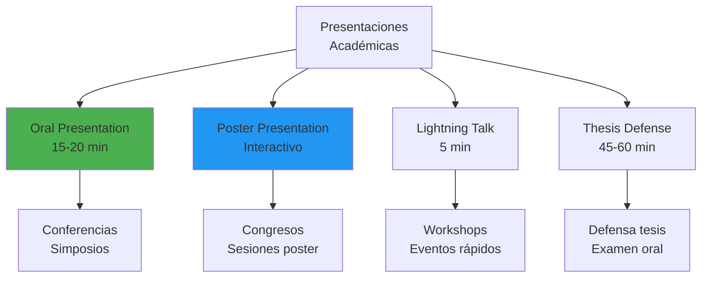

### 1.2 Estructura de Presentación Oral (15 minutos)

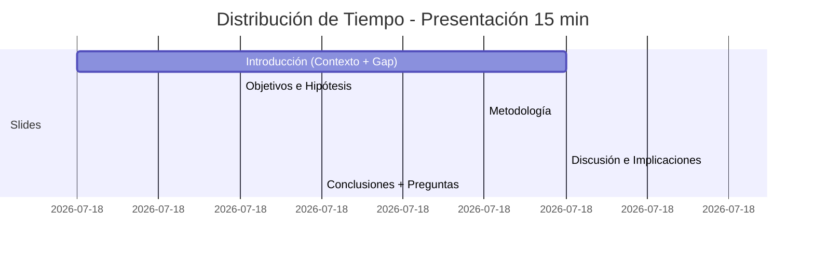

**Regla 1-2-3**:
- **1 mensaje principal** por slide
- **2 minutos máximo** por slide
- **3 puntos clave** en listas

### 1.3 Diseño de Slides Profesionales

**Principios de Diseño**:

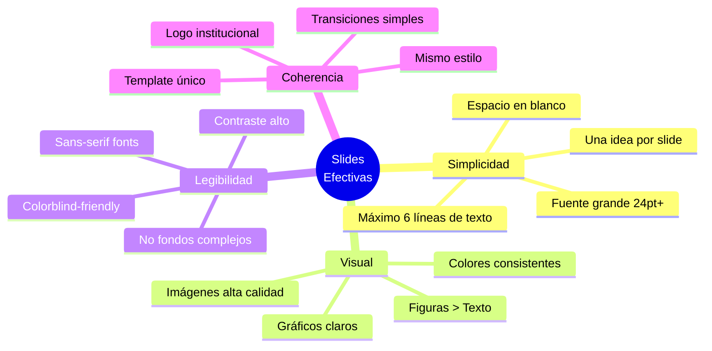

**Ejemplo: Slide de Título**

❌ **MAL DISEÑO**:
```
Slide abarrotado con:
- Título largo de 25 palabras
- 5 autores con afiliaciones completas
- Logo FPUNA pixelado
- Fondo con patrón distractivo
- Texto en Comic Sans 14pt
```

✅ **BUEN DISEÑO**:
```
┌─────────────────────────────────────────┐
│                                         │
│  IMPACTO DE IA EN COMPRENSIÓN          │
│  CONCEPTUAL DE PROGRAMACIÓN            │
│                                         │
│  Juan Pérez & María González           │
│  FPUNA - 2026                          │
│                                         │
│  [Logo FPUNA vectorial]                │
│                                         │
└─────────────────────────────────────────┘

Fondo: Blanco o gris muy claro
Texto: Azul oscuro (#1A237E)
Fuente: Roboto 36pt título, 24pt autores
```

### 1.4 Tipos de Slides y Contenido

**Slide de Introducción**:

```markdown
# PROBLEMA

🌍 85% de universidades usan ChatGPT
❓ Impacto en aprendizaje profundo NO claro
📍 Cero estudios experimentales en Paraguay

[Imagen: Estudiante usando ChatGPT en laptop]
```

**Slide de Metodología**:

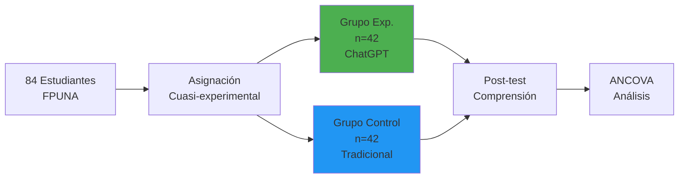

**Slide de Resultados Clave**:

```markdown
# HALLAZGO PRINCIPAL

Grupo Experimental: **M = 54.2** (SD = 8.3)
Grupo Control:      **M = 50.1** (SD = 9.1)

**p = 0.013** ✅ SIGNIFICATIVO
Cohen's d = **0.51** (efecto mediano)

[Gráfico: Box plot comparativo grande y claro]
```

**Slide de Take-Home Message**:

```markdown
# CONCLUSIONES

✅ ChatGPT MEJORA comprensión conceptual (+8%)

⚠️ Requiere USO GUIADO (no libre)

🔮 Futuro: Estudios longitudinales
```

### 1.5 Generación de Slides con OpenCode

```bash
opencode "Genera presentación PowerPoint para conferencia académica:

PAPER:
@attach paper_completo.pdf

REQUISITOS PRESENTACIÓN:
- Duración: 15 minutos
- Audiencia: Investigadores en educación + IA
- Conferencia: Congreso Latinoamericano de Tecnología Educativa 2026

ESTRUCTURA:
1. Título (1 slide)
2. Introducción - Contexto + Gap (2 slides)
3. Objetivos e Hipótesis (1 slide)
4. Metodología (2 slides: Diseño + Instrumentos)
5. Resultados (3 slides: Descriptivos, Comparación grupos, Análisis secundario)
6. Discusión (2 slides: Interpretación + Limitaciones)
7. Conclusiones (1 slide)
8. Referencias (1 slide)
9. Agradecimientos (1 slide)
Total: 14 slides

DISEÑO:
- Template: Profesional académico
- Colores: Azul FPUNA (#1A237E) + Naranja (#FF6F00)
- Fuente: Roboto, mínimo 24pt
- Máximo 6 líneas de texto por slide
- Incluir figuras del paper (box plot, scatter plot)
- Logo FPUNA en footer

OUTPUT:
- Archivo .pptx editable
- Notas del presentador con tiempos sugeridos
- Script de presentación en español (1500 palabras)
- Tips para Q&A"
```

---

## Parte 2: Presentación Oral Efectiva

### 2.1 Técnicas de Presentación

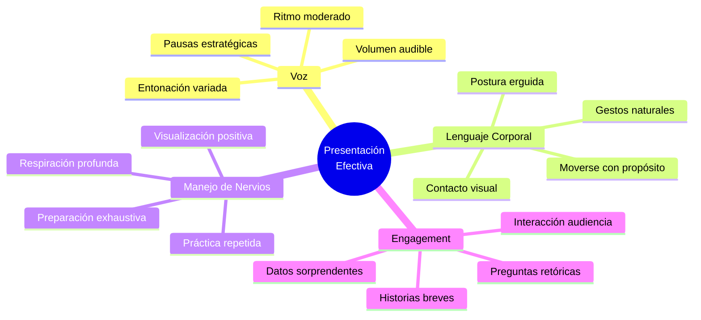

### 2.2 Estructura de Script de Presentación

**Ejemplo: Primeros 3 minutos**

```markdown
[SLIDE 1: TÍTULO]
"Buenos días. Mi nombre es Juan Pérez de la Facultad Politécnica de la 
Universidad Nacional de Asunción. Hoy voy a presentarles nuestro estudio 
sobre el impacto de ChatGPT en el aprendizaje de programación."

[PAUSA 2 segundos - establecer contacto visual]

[SLIDE 2: CONTEXTO]
"En los últimos dos años, hemos visto una adopción masiva de herramientas de 
IA generativa en universidades. [Señalar gráfico] 85% de instituciones reportan 
que sus estudiantes usan ChatGPT regularmente. Esto genera dos reacciones opuestas: 
algunos educadores están entusiasmados por el potencial de asistencia personalizada, 
mientras otros temen que los estudiantes solo copien respuestas sin entender."

[PAUSA - permitir absorber información]

[SLIDE 3: GAP]
"Sin embargo, [enfatizar] la evidencia empírica es escasa. La mayoría de estudios 
son encuestas de percepción, no experimentos controlados. Y [señalar mapa] CERO 
estudios experimentales se han realizado en Paraguay o América Latina con 
infraestructura limitada."

[TRANSICIÓN]

[SLIDE 4: OBJETIVOS]
"Por lo tanto, nuestro estudio pregunta: ¿El uso GUIADO de ChatGPT realmente 
mejora la comprensión conceptual profunda de programación? Comparamos 84 
estudiantes en dos grupos durante 4 semanas..."
```

### 2.3 Manejo de Preguntas Difíciles

```mermaid
flowchart TD
    A[Pregunta del<br/>Público] --> B{¿Entiendo<br/>la pregunta?}
    
    B -->|No| C[Clarificar:<br/>"¿Podría reformular?"<br/>"¿Se refiere a...?"]
    B -->|Sí| D{¿Tengo<br/>respuesta?}
    
    D -->|Sí| E[Responder<br/>concisamente]
    D -->|No| F[Honestidad:<br/>"Buena pregunta,<br/>no lo investigamos"]
    
    E --> G[Agregar valor:<br/>Conexión con literatura<br/>o implicación]
    F --> H[Futuro:<br/>"Sería interesante<br/>para próximo estudio"]
    
    C --> B
    
    style E fill:#4CAF50
    style F fill:#FF9800
```

**Frases Útiles para Q&A**:

| Situación | Frase |
|-----------|-------|
| **No entiendo pregunta** | "Gracias por la pregunta. ¿Podría clarificar si se refiere a...?" |
| **No sé la respuesta** | "Excelente punto. Honestamente, no medimos esa variable, pero sería una extensión valiosa." |
| **Crítica metodológica** | "Reconocemos esa limitación. En la sección de Limitaciones discutimos que... Decidimos [justificación]." |
| **Resultados contradictorios** | "Interesante observación. Nuestros hallazgos difieren de [Estudio X]. Posibles explicaciones incluyen..." |
| **Pregunta fuera de alcance** | "Esa pregunta va más allá de nuestro enfoque actual, pero conecta con [tema relacionado]..." |

---

## Parte 3: Poster Académico

### 3.1 Diseño de Poster Científico

**Dimensiones Estándar**: 90 cm (ancho) × 120 cm (alto)

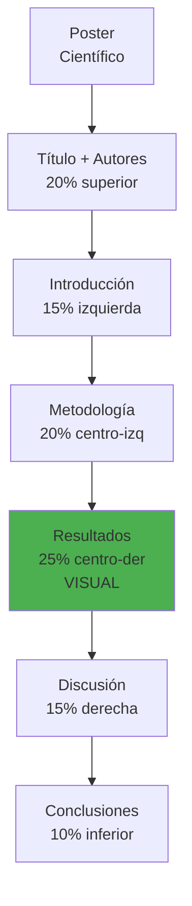

**Elementos Clave**:

✅ **Título**: Visible desde 3 metros (fuente 72pt+)  
✅ **Secciones**: Claramente delimitadas con fondos/bordes  
✅ **Figuras grandes**: 40-50% del espacio total  
✅ **Texto mínimo**: Bullet points, NO párrafos largos  
✅ **QR code**: Link a paper completo o datos  
✅ **Contacto**: Email y ORCID visibles

❌ **Evitar**:
- Texto pequeño (<18pt)
- Párrafos densos
- Más de 500 palabras totales
- Fondos oscuros (difícil leer)
- Figuras pixeladas

### 3.2 Template de Poster con OpenCode

```bash
opencode "Diseña poster científico para congreso:

PAPER:
@attach paper_fpuna_ia.pdf

ESPECIFICACIONES:
- Dimensiones: 90 cm × 120 cm (vertical)
- Formato: PowerPoint editable
- Resolución: 300 DPI mínimo

SECCIONES:
1. TÍTULO (top, 15% altura)
   - Título del estudio
   - Autores + afiliación FPUNA
   - Logo FPUNA (derecha)

2. INTRODUCCIÓN (columna izquierda, 20%)
   - Contexto en 100 palabras
   - Gap en 50 palabras
   - Objetivos (2 bullet points)

3. METODOLOGÍA (columna izquierda, 25%)
   - Diseño (diagrama de flujo)
   - N participantes
   - Instrumentos (tabla compacta)
   - Análisis estadístico

4. RESULTADOS (columna centro-derecha, 30% - MÁS GRANDE)
   - Figura 1: Box plot comparativo (GRANDE)
   - Tabla 1: Estadística descriptiva
   - Hallazgo clave en texto destacado (40pt)

5. DISCUSIÓN (columna derecha, 15%)
   - Interpretación (3 bullet points)
   - Limitaciones (2 bullet points)

6. CONCLUSIONES (bottom, 10%)
   - 2 conclusiones principales (destacadas)
   - QR code a paper completo

DISEÑO:
- Colores: Azul FPUNA + blanco + gris claro
- Fuente: Arial/Helvetica, mínimo 24pt texto, 72pt título
- Fondos sutiles para secciones
- Espaciado generoso
- Figuras alta calidad (vectorial preferido)

OUTPUT:
- Archivo .pptx (editable)
- Versión PDF (print-ready)
- Guía de impresión (papel/material recomendado)"
```

### 3.3 Presentación de Poster (Sesión Interactiva)

**Elevator Pitch (60 segundos)**:

```markdown
"Hola, soy Juan Pérez de FPUNA en Paraguay. Nuestro estudio investigó si 
ChatGPT realmente ayuda a estudiantes a entender programación a nivel profundo, 
no solo copiar código.

[Señalar metodología] Comparamos 84 estudiantes: grupo experimental usó ChatGPT 
con guía pedagógica, control usó métodos tradicionales.

[Señalar resultados] Encontramos [énfasis] mejora significativa de 8% en 
comprensión conceptual, pero solo cuando el uso fue GUIADO por instructor.

[Señalar conclusiones] Implicación clave: IA puede ser herramienta poderosa, 
pero requiere integración pedagógica cuidadosa, no adopción indiscriminada.

¿Alguna pregunta específica sobre metodología o resultados?"
```

---

## Parte 4: Proceso de Publicación en Journals

### 4.1 Selección de Journal Apropiado

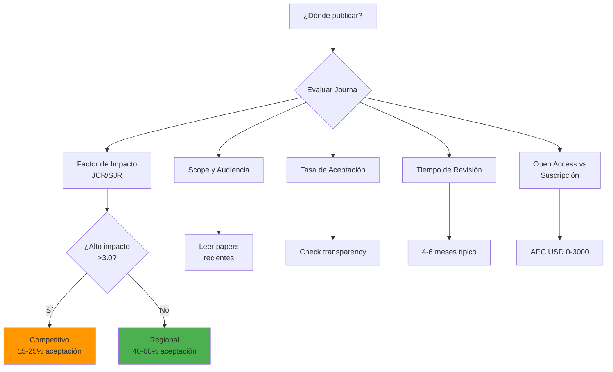

**Criterios de Evaluación**:

| Factor | Peso | Qué Considerar |
|--------|------|----------------|
| **Scope match** | 40% | ¿Tu tema encaja perfectamente? Lee 5 papers recientes |
| **Indexación** | 25% | Scopus, Web of Science, SciELO, Latindex |
| **Tiempo** | 15% | ¿Necesitas publicar rápido (tesis) o puedes esperar? |
| **Costo** | 10% | Open Access: USD 0-3000 APC |
| **Prestigio** | 10% | Factor de impacto, reputación en tu campo |

**Journals Apropiados para Investigación FPUNA**:

| Journal | Scope | Factor Impacto | APC | Tiempo |
|---------|-------|----------------|-----|--------|
| **Computers & Education** | EdTech, IA | 11.2 (alto) | USD 3,900 | 6-9 meses |
| **Education and Information Technologies** | Tecnología educativa | 5.1 (medio) | USD 2,990 | 4-6 meses |
| **Revista Iberoamericana de Tecnologías del Aprendizaje** | EdTech LATAM | 2.3 | Gratis | 3-5 meses |
| **Revista FPUNA** | Multidisciplinar PY | No indexado JCR | Gratis | 4-6 meses |

### 4.2 Proceso de Submission

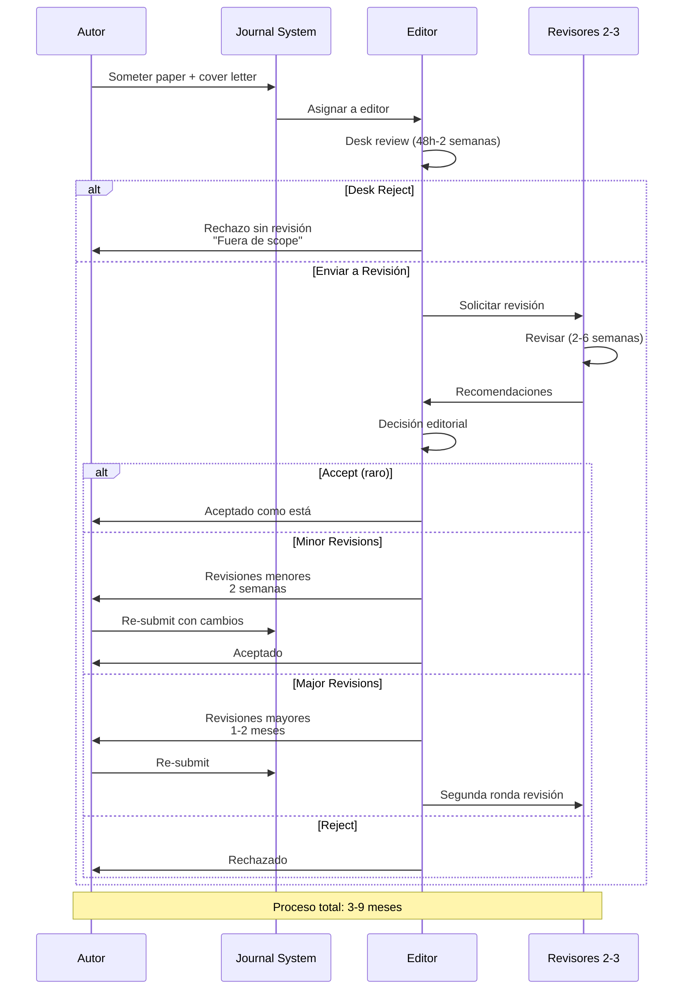

### 4.3 Cover Letter Efectiva

**Estructura**:

```markdown
[MEMBRETE FPUNA]

Fecha: 15 de enero de 2026

Dr. José Martínez
Editor-in-Chief
Education and Information Technologies
Springer

Estimado Dr. Martínez:

**PÁRRAFO 1: PRESENTACIÓN**
Por la presente, someto a consideración el manuscrito titulado "Impacto del 
Uso de ChatGPT en la Comprensión Conceptual de Programación: Estudio 
Cuasi-Experimental en FPUNA" para posible publicación en Education and 
Information Technologies.

**PÁRRAFO 2: RELEVANCIA Y CONTRIBUCIÓN**
Este estudio aborda el gap crítico de evidencia empírica sobre efectos de 
IA generativa en aprendizaje profundo, particularmente en contextos de 
recursos limitados como América Latina. Mediante diseño cuasi-experimental 
con 84 estudiantes, demostramos que uso GUIADO de ChatGPT mejora 
significativamente comprensión conceptual (d=0.51, p=0.013), pero uso 
indiscriminado no. Estos hallazgos tienen implicaciones directas para 
políticas de integración de IA en educación superior global.

**PÁRRAFO 3: FIT CON JOURNAL**
Este manuscrito encaja perfectamente con el scope de Education and Information 
Technologies, particularmente con la sección "AI in Education". Papers 
recientes en su journal (e.g., Wang et al., 2024; Silva & Brown, 2023) han 
explorado IA en educación, pero ninguno en contexto paraguayo ni con diseño 
experimental controlado.

**PÁRRAFO 4: ORIGINALIDAD**
Confirmo que este trabajo es original, no ha sido publicado previamente, y 
no está siendo considerado por otra revista. Todos los autores han aprobado 
el manuscrito y están de acuerdo con esta submission.

**PÁRRAFO 5: CONFLICTOS Y ÉTICA**
No existen conflictos de interés. El estudio fue aprobado por el Comité de 
Ética de FPUNA (Ref: CE-2026-045).

Gracias por considerar nuestro manuscrito. Quedo atento a sus comentarios.

Atentamente,

Juan Pérez, MSc
Facultad Politécnica
Universidad Nacional de Asunción
juan.perez@fpuna.edu.py
ORCID: 0000-0002-1234-5678
```

### 4.4 Responder a Revisores

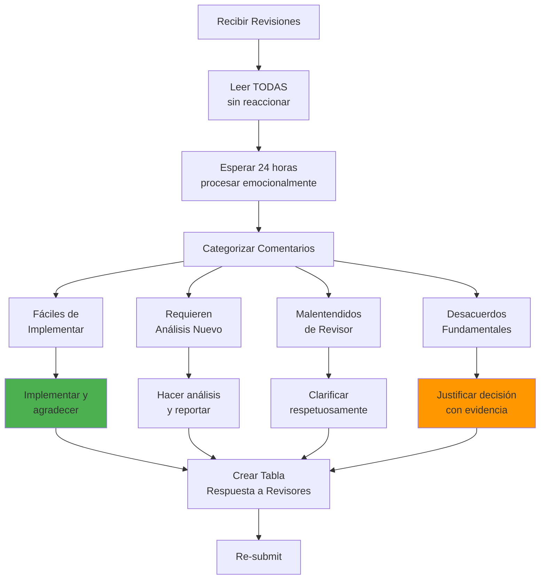

**Formato de Respuesta a Revisores**:

```markdown
RESPUESTA A REVISORES
Manuscrito: EDIT-D-26-00123
"Impacto del Uso de ChatGPT en la Comprensión Conceptual de Programación"

Estimados Revisores y Editor:

Agradecemos profundamente los comentarios constructivos que han mejorado 
significativamente nuestro manuscrito. A continuación, respondemos punto por 
punto a cada sugerencia.

---

**REVISOR 1**

**Comentario 1.1:** "La muestra de 84 participantes parece pequeña. ¿Se 
realizó cálculo de poder estadístico a priori?"

**RESPUESTA:** Agradecemos esta observación. Efectivamente realizamos cálculo 
de poder a priori usando G*Power 3.1. Con effect size esperado d=0.5 (basado 
en meta-análisis de Wang et al., 2023), α=0.05, y poder=0.80, el tamaño 
muestral requerido era n=64 por grupo (total N=128). Nuestra muestra final 
de N=84 (n=42 por grupo) tiene poder estadístico de 0.71, ligeramente por 
debajo de ideal pero aceptable según Cohen (1988).

**ACCIÓN:** Agregamos sección de "Power Analysis" en Métodos (página 8, 
líneas 234-241) explicando estos cálculos.

---

**Comentario 1.2:** "Los autores concluyen que 'ChatGPT mejora comprensión', 
pero el diseño cuasi-experimental limita inferencia causal."

**RESPUESTA:** Punto excelente y importante. Hemos sido imprecisos en lenguaje 
causal. Modificamos todas las afirmaciones para reflejar limitaciones del 
diseño cuasi-experimental.

**ACCIÓN:**
- Cambios en Abstract: "mejora" → "se asocia con mayor"
- Cambios en Conclusiones: causales → correlacionales
- Expandimos sección de Limitaciones (página 18, líneas 542-558) discutiendo 
  amenazas a validez interna por falta de asignación aleatoria

---

[Continuar con todos los comentarios...]

---

**CAMBIOS PRINCIPALES EN MANUSCRITO:**

1. Agregada sección de Power Analysis (Métodos, p.8)
2. Moderado lenguaje causal en Abstract, Resultados, y Conclusiones
3. Expandida sección de Limitaciones (300 → 450 palabras)
4. Agregada Figura 2: Q-Q plots de normalidad (Appendix)
5. Corregidos errores tipográficos señalados por Revisor 2

Nuevamente, gracias por su tiempo y expertise. Confiamos que estas revisiones 
han fortalecido sustancialmente el manuscrito.

Atentamente,
Juan Pérez y co-autores
```

---

## Parte 5: Presencia Académica Digital

### 5.1 ORCID: Identificador de Investigador

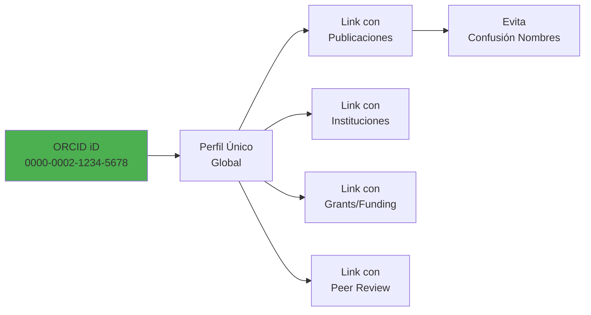

**Crear ORCID (5 minutos)**:

1. Ir a orcid.org/register
2. Completar info básica (nombre, email, afiliación)
3. Obtener ID único (0000-0002-XXXX-XXXX)
4. Agregar publicaciones manualmente o via import
5. Configurar privacidad (público vs privado)
6. **Incluir ORCID en**:
   - Firma de email
   - Papers (primera página)
   - CV
   - Perfiles académicos

### 5.2 Google Scholar Profile

**Ventajas**:
- Tracking automático de citas
- h-index calculado
- Alertas de nuevas citas
- Perfil público

**Configurar Google Scholar**:

1. Ir a scholar.google.com → "My Profile"
2. Verificar email institucional (fpuna.edu.py)
3. Agregar publicaciones:
   - Búsqueda automática (puede tener errores)
   - Agregar manualmente papers no detectados
4. Completar perfil:
   - Foto profesional
   - Áreas de interés (keywords)
   - Afiliación institucional
5. Configurar privacidad: Público
6. Activar alertas de citas

**Mantener Actualizado**:
- Verificar mensualmente nuevas citas
- Corregir atribuciones incorrectas
- Agregar pre-prints (arXiv, SSRN)

### 5.3 ResearchGate y Academia.edu

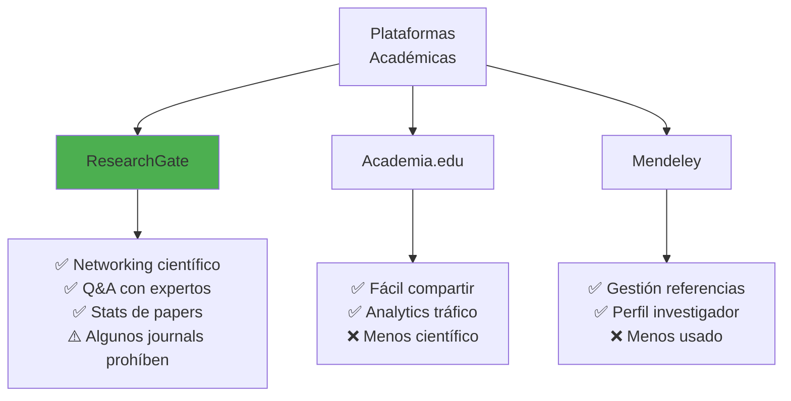

**Estrategia Recomendada para FPUNA**:

1. **Prioridad 1**: ORCID + Google Scholar (obligatorio)
2. **Prioridad 2**: ResearchGate (networking)
3. **Opcional**: Academia.edu (visibilidad general)

**IMPORTANTE**: Verificar política de journals sobre sharing pre-prints/post-prints antes de subir PDFs.

### 5.4 Automatizar Perfil con OpenCode

```bash
opencode "Ayúdame a crear perfil académico profesional:

INFORMACIÓN PERSONAL:
- Nombre: Juan Pérez
- Afiliación: Facultad Politécnica, Universidad Nacional de Asunción
- Email: juan.perez@fpuna.edu.py
- ORCID: 0000-0002-1234-5678

PUBLICACIONES:
@attach lista_publicaciones.bib (archivo BibTeX de Zotero)

ÁREAS DE INTERÉS:
- Inteligencia Artificial en Educación
- Tecnología Educativa
- Aprendizaje de Programación
- Educational Data Mining

GENERAR:
1. **Bio académica** (150 palabras, tercera persona, inglés y español)
   - Background educativo
   - Áreas de investigación
   - Logros destacados
   - Objetivo investigativo

2. **Lista de publicaciones** formateada para:
   - Google Scholar (import)
   - ResearchGate (manual paste)
   - CV académico

3. **Keywords** para perfil (10 keywords en inglés)

4. **Template email firma** con links a:
   - ORCID
   - Google Scholar
   - ResearchGate
   - GitHub (si aplica)

OUTPUT en markdown, listo para copy-paste"
```

---

## Ejercicios Prácticos

### Ejercicio 1: Diseñar Presentación 15 min (90 min)

**Objetivo**: Crear slides para presentar tu investigación en congreso.

**Tareas**:
1. Usar paper del Módulo 4
2. Crear 12-15 slides siguiendo estructura:
   - Título
   - Introducción (contexto + gap)
   - Objetivos
   - Metodología
   - Resultados (3 slides)
   - Discusión
   - Conclusiones
   - Referencias
3. Diseño profesional (template consistente, fuente grande, figuras claras)
4. Escribir script de presentación (1500 palabras)
5. Practicar y medir tiempo (debe ser 13-15 minutos)

**Usar OpenCode para**:
- Generar estructura inicial de slides
- Optimizar texto (máximo 6 líneas por slide)
- Sugerir visualizaciones

**Entregable**:
- Archivo .pptx
- Script de presentación
- Video de práctica (opcional, auto-grabación 5 min)

---

### Ejercicio 2: Simular Proceso de Revision (120 min)

**Parte A: Peer Review (60 min)**

Intercambiar papers con compañero. Actuar como revisor de journal.

**Proveer**:
- Recomendación general (Accept/Minor/Major/Reject)
- 5-10 comentarios específicos organizados por:
  - Fortalezas (2-3)
  - Debilidades mayores (2-3)
  - Debilidades menores (3-5)
- Comentarios confidenciales para editor (100 palabras)

**Parte B: Responder a Revisores (60 min)**

Recibir reviews de tu paper. Crear documento "Response to Reviewers":
- Tabla con comentario → respuesta → acción
- Respetuoso pero firme cuando apropiado
- Indicar cambios en manuscrito (página, líneas)

---

### Ejercicio 3: Crear Presencia Digital (60 min)

**Tareas**:
1. Crear ORCID iD (5 min)
2. Configurar Google Scholar profile (15 min)
   - Agregar al menos 3 publicaciones (pueden ser simuladas)
   - Verificar email institucional
3. Crear cuenta ResearchGate (10 min)
4. Escribir bio académica 150 palabras (20 min)
5. Diseñar firma de email profesional con links (10 min)

**Entregable**:
- Screenshot de ORCID profile
- Link a Google Scholar profile público
- Bio académica (español + inglés)
- Template de email firma

---

## Checklist de Preparación para Conferencia

### ✅ 1 Mes Antes

- [ ] Abstract aceptado, confirmación recibida
- [ ] Registro en conferencia pagado
- [ ] Vuelos y hotel reservados (si presencial)
- [ ] Borrador de slides iniciado

### ✅ 2 Semanas Antes

- [ ] Slides 80% completos
- [ ] Script de presentación escrito
- [ ] Practicado 1 vez completo
- [ ] Feedback de colega obtenido

### ✅ 1 Semana Antes

- [ ] Slides 100% finalizados
- [ ] Practicado 3+ veces, tiempo ajustado (13-15 min)
- [ ] Preparado para Q&A (anticipar 5 preguntas)
- [ ] Verificado formato de presentación (16:9 vs 4:3, compatibilidad)
- [ ] Backup de slides (USB + email + nube)

### ✅ Día de Presentación

- [ ] Llegar 15 minutos antes a sala
- [ ] Verificar laptop conecta a proyector
- [ ] Micrófono funciona (si hay)
- [ ] Clicker/control remoto funciona
- [ ] Agua disponible
- [ ] Respirar profundo, visualizar éxito

---

## Checklist de Submission a Journal

### ✅ Preparación Manuscrito

- [ ] Formato según journal guidelines (márgenes, fuente, spacing)
- [ ] Longitud dentro de límite (word count)
- [ ] Figuras y tablas en formato correcto (resolution, numbering)
- [ ] Referencias en estilo correcto (APA, IEEE, etc.)
- [ ] Todos los co-autores aprobaron versión final
- [ ] Declaraciones completas (ethics, funding, conflicts)

### ✅ Documentos Adicionales

- [ ] Cover letter escrita
- [ ] Suggested reviewers (3-5 nombres, emails, afiliaciones)
- [ ] Opposed reviewers (si hay conflictos)
- [ ] Graphical abstract (si journal requiere)
- [ ] Highlights (3-5 bullet points de 85 caracteres c/u)
- [ ] Supplementary materials preparados

### ✅ Submission Online

- [ ] Cuenta creada en journal submission system
- [ ] ORCID de todos los autores agregado
- [ ] Manuscrito uploaddeado (formato requerido: .docx o LaTeX)
- [ ] Figuras uploadeadas separadamente (si requerido)
- [ ] Cover letter uploadeada
- [ ] Declarations completadas (ethics, funding, etc.)
- [ ] Suggested/Opposed reviewers ingresados
- [ ] Revisión final de PDF generado por sistema
- [ ] SUBMIT clicked

### ✅ Post-Submission

- [ ] Email de confirmación recibido (con manuscript number)
- [ ] Tracking number guardado (EDIT-D-26-XXXXX)
- [ ] Calendario: seguimiento en 2 semanas si no hay respuesta
- [ ] Informar a co-autores que fue sometido

---

## Recursos Esenciales

### Herramientas de Presentación

| Herramienta | Propósito | Costo | URL |
|-------------|-----------|-------|-----|
| **PowerPoint** | Slides estándar | Pago (Office) | microsoft.com |
| **Google Slides** | Slides colaborativas | Gratis | slides.google.com |
| **Canva** | Diseño visual fácil | Freemium | canva.com |
| **Prezi** | Presentaciones dinámicas | Freemium | prezi.com |
| **Beamer (LaTeX)** | Slides académicos | Gratis | overleaf.com |

### Conferencias Relevantes (Paraguay/Región)

**Internacionales**:
- **LACLO** (Congreso Latinoamericano de Objetos y Tecnologías de Aprendizaje)
- **TISE** (Conferencia Internacional de Informática Educativa, Chile)
- **AIED** (Artificial Intelligence in Education)

**Nacionales**:
- **Congreso Paraguayo de Ciencias de la Computación** (CPCC)
- **Jornadas de Investigación FPUNA**
- **Simposio de Investigación UNA**

### Journals Open Access (Sin APC)

**Multidisciplinarios**:
- **Revista FPUNA** (Paraguay)
- **SciELO** journals (varios países LATAM)

**Especializados**:
- **Education in the Knowledge Society** (España, Scopus)
- **RELIEVE** (Revista Electrónica de Investigación Educativa, Scopus)

---

## Contexto Paraguay: Oportunidades de Publicación

### CONACYT: Apoyo a Publicación

**Programa de Publicaciones Científicas**:
- Financiamiento parcial de APCs (hasta USD 1,500)
- Requisito: Investigador PRONII activo
- Solicitud: conacyt.gov.py

### Revista FPUNA

**Proceso**:
1. Someter via OJS: revista.fpuna.edu.py
2. Revisión por pares (2 revisores)
3. Tiempo: 4-6 meses
4. Publicación: 2 números/año (Junio, Diciembre)
5. Indexación: Latindex, Dialnet

**Sin costo, idioma español aceptado**.

---

## Reflexión Final

**Publicar y presentar NO son tareas separadas de investigar - SON PARTE INTEGRAL.**

La mejor investigación sin comunicación efectiva = árbol cayendo en bosque vacío.

✅ Presentaciones efectivas amplifican tu impacto  
✅ Publicaciones validan tu contribución  
✅ Networking en conferencias abre colaboraciones  
✅ Presencia digital te hace visible globalmente

**La IA puede diseñar slides y formatear papers, pero VOS sos el científico que:**

- Responde preguntas del público con expertise
- Defiende metodología ante revisores
- Conecta hallazgos con literatura
- Inspira a próxima generación de investigadores

---

**¡FELICITACIONES por completar el Track de Investigación y Academia!**

Ahora tenés las herramientas para:
1. ✅ Revisar literatura sistemáticamente
2. ✅ Diseñar metodología rigurosa
3. ✅ Analizar datos profesionalmente
4. ✅ Escribir papers publication-ready
5. ✅ Presentar y publicar con confianza

**Próximo paso**: Aplicar todo esto en TU investigación real. El mundo académico te espera.

---

**¿Preguntas?** Consulta con tu instructor o en Slack #research-academia-2026

**¿Listo para investigar?** Adelante, científico. 🚀
