# 💰 Gestión de Ingresos con IA (Revenue Management)

**Duración:** 4 horas
**Nivel:** Intermedio-Avanzado
**Track:** Hospitalidad y Turismo

---

## ¿Qué Vas a Lograr?

Al completar este módulo, vas a poder:

- [ ] Aplicar principios de revenue management usando herramientas de IA
- [ ] Crear modelos de forecasting de demanda con Claude/OpenCode
- [ ] Implementar estrategias de pricing dinámico basadas en datos
- [ ] Diseñar técnicas de upselling y cross-selling automatizadas
- [ ] Analizar la competencia y posicionar precios estratégicamente

---

## La Analogía del Piloto de Avión

Imagina que sos el piloto de un avión: tu objetivo es llenar todos los asientos al mejor precio posible. Pero hay un problema—una vez que el avión despega, los asientos vacíos no se pueden vender después.

Un hotel funciona igual: una habitación vacía el 15 de marzo es inventario perdido para siempre. No podés "guardarla" para venderla en abril.

El revenue management es el arte y la ciencia de vender **la habitación correcta, al cliente correcto, al precio correcto, en el momento correcto**. La IA es tu copiloto que puede procesar miles de datos en segundos para ayudarte a tomar mejores decisiones.

---

## Parte 1: Fundamentos del Revenue Management

### 1.1 Los Pilares del Revenue Management

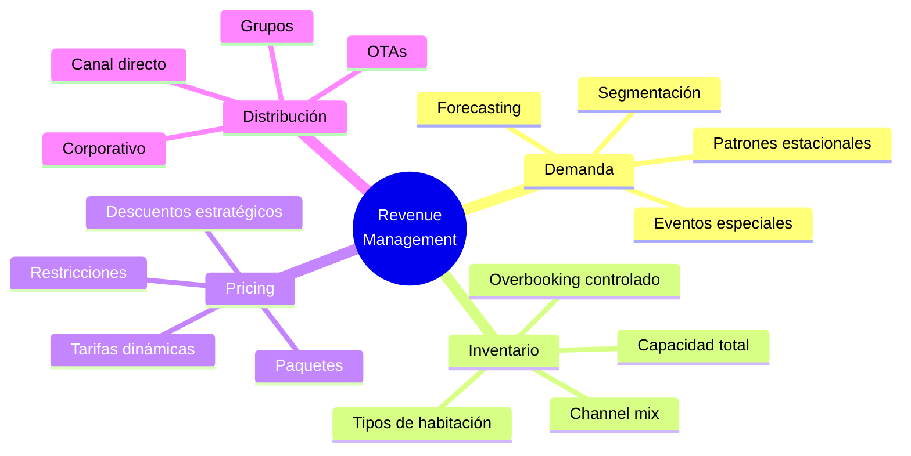

### 1.2 Métricas Clave

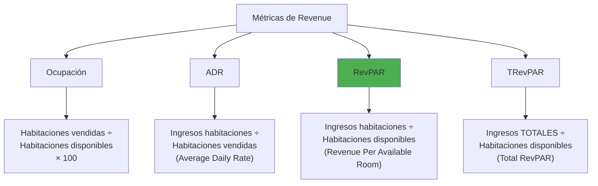

**Fórmulas esenciales:**

| Métrica | Fórmula | Ejemplo |
|---------|---------|---------|
| **Ocupación** | (Habitaciones vendidas / Total habitaciones) × 100 | 80/100 = 80% |
| **ADR** | Ingresos habitaciones / Habitaciones vendidas | $8,000 / 80 = $100 |
| **RevPAR** | Ingresos habitaciones / Total habitaciones | $8,000 / 100 = $80 |
| **RevPAR** (alternativo) | Ocupación × ADR | 80% × $100 = $80 |

**¿Por qué RevPAR es la métrica rey?**

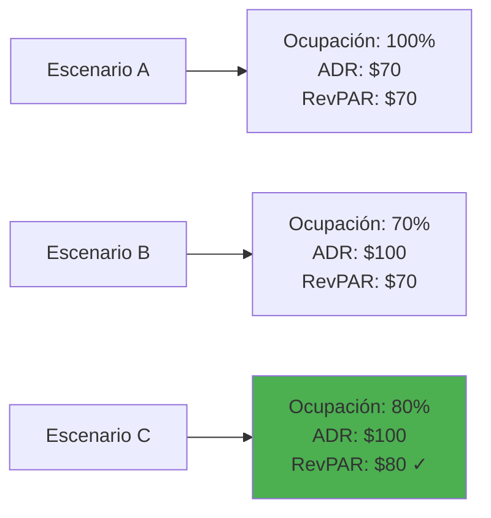

El escenario C es mejor: misma ocupación alta + mejor tarifa = más ingresos totales.

### 1.3 La Curva de Demanda Hotelera

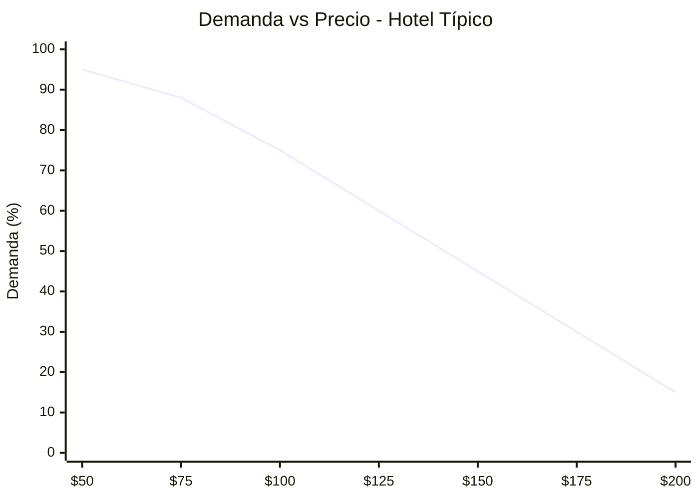

**Elasticidad de precio por segmento:**

| Segmento | Elasticidad | Comportamiento |
|----------|-------------|----------------|
| Ocio/Turista | Alta | Muy sensible al precio |
| Negocios | Baja | Menos sensible, valora conveniencia |
| Grupos | Media | Negocia volumen por descuento |
| Corporativo | Baja | Tarifas negociadas fijas |
| OTAs | Alta | Compara constantemente |

### 1.4 Calendario de Demanda Paraguay

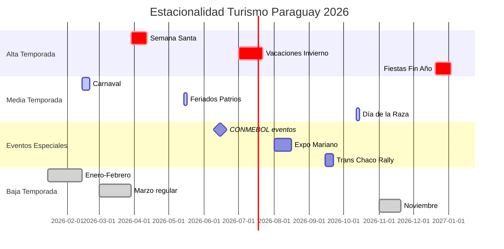

**Estrategia por temporada:**

| Temporada | Estrategia Precio | Estrategia Ocupación |
|-----------|------------------|---------------------|
| **Alta** | Maximizar ADR, mínimo 2 noches | Aceptar solo tarifas altas |
| **Media** | Balancear ADR/Ocupación | Promociones moderadas |
| **Baja** | Proteger ocupación mínima | Paquetes, corporativo, grupos |

---

## Parte 2: Forecasting de Demanda con IA

### 2.1 Datos para el Forecasting

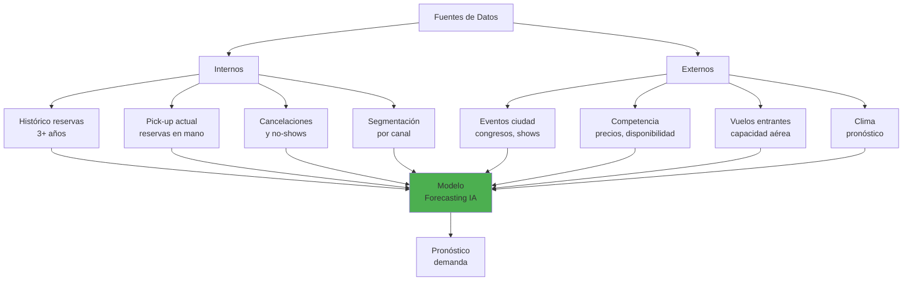

### 2.2 Prompt para Forecasting con Claude

```markdown
**Datos proporcionados:**
- Hotel: 100 habitaciones en Asunción
- Fecha a pronosticar: Semana del 12-18 de octubre 2026
- Histórico mismo período 2023: 65% ocupación
- Histórico mismo período 2024: 72% ocupación
- Histórico mismo período 2025: 78% ocupación
- Evento especial: Día de la Raza (12 oct) - feriado largo
- Competencia: Hotel principal subió tarifas 15%
- Pick-up actual (a 30 días): 35 habitaciones confirmadas
- Cancelaciones históricas período: 8%

**Genera:**
1. Pronóstico de ocupación para cada día de la semana
2. Rango de confianza (optimista/pesimista)
3. Factores de riesgo identificados
4. Recomendación de estrategia de pricing
5. Acciones sugeridas para los próximos 30 días
```

**Respuesta esperada de la IA:**

| Día | Pronóstico | Rango | Notas |
|-----|-----------|-------|-------|
| Lun 12 (feriado) | 92% | 88-96% | Día de la Raza, alta demanda |
| Mar 13 | 85% | 80-90% | Extensión feriado |
| Mié 14 | 70% | 65-78% | Normalización |
| Jue 15 | 68% | 62-75% | Día laboral normal |
| Vie 16 | 82% | 78-88% | Inicio fin de semana |
| Sáb 17 | 88% | 84-92% | Turismo interno |
| Dom 18 | 75% | 70-82% | Check-outs |
| **Promedio** | **80%** | **75-86%** | |

**Factores de riesgo:**
- ⚠️ Clima: pronóstico de lluvia jueves-viernes podría reducir turismo
- ⚠️ Competencia: si baja precios, podríamos perder reservas
- ✅ Oportunidad: evento CONMEBOL el sábado aumenta demanda

**Recomendación de pricing:**

| Día | Tarifa Sugerida | vs. Tarifa Base | Justificación |
|-----|----------------|-----------------|---------------|
| Lun 12 | $140 | +40% | Demanda alta, inventario limitado |
| Mar 13 | $125 | +25% | Demanda alta residual |
| Mié 14 | $95 | -5% | Estimular ocupación |
| Jue 15 | $90 | -10% | Día más débil |
| Vie 16 | $120 | +20% | Fin de semana |
| Sáb 17 | $135 | +35% | Pico de demanda |
| Dom 18 | $100 | Base | Normalización |

### 2.3 Modelo de Pick-up

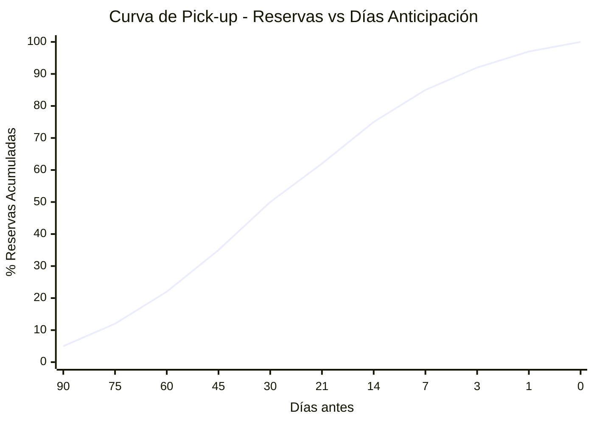

**Interpretación:**
- A **30 días**: deberías tener ~50% de las reservas finales
- A **7 días**: deberías tener ~85% de las reservas finales
- **Último día**: walk-ins y reservas de última hora (~3%)

**Prompt para analizar pick-up:**

```markdown
**Contexto:**
- Fecha objetivo: 15 de noviembre (sábado)
- Días faltantes: 21
- Reservas actuales: 45 habitaciones (de 100)
- Pick-up histórico a 21 días: típicamente tenemos 62% de reservas finales
- Ocupación objetivo: 85%

**Preguntas:**
1. ¿Estamos adelantados o atrasados vs histórico?
2. Si mantenemos el ritmo actual, ¿qué ocupación alcanzaremos?
3. ¿Qué acciones recomiendas si estamos atrasados?
4. ¿Cuál debería ser nuestra estrategia de pricing?
```

**Análisis esperado:**

```
📊 ANÁLISIS DE PICK-UP

Estado actual: 45% ocupación a 21 días
Histórico esperado: 62% a 21 días
Diferencia: -17 puntos porcentuales ⚠️

Proyección si mantenemos ritmo:
- Pick-up histórico final: 45% / 62% = 72.6% del patrón normal
- Ocupación proyectada final: 100% × 72.6% = 73%
- vs Objetivo 85%: DÉFICIT DE 12 PUNTOS

🚨 ALERTA: Necesitamos acelerar reservas

ACCIONES RECOMENDADAS:
1. INMEDIATO: Reducir tarifa pública 10% en OTAs
2. ESTA SEMANA: Campaña email a base de datos corporativos
3. PRÓXIMOS 7 DÍAS: Promoción "Early Bird" en redes sociales
4. MONITOREAR: Revisar pick-up diariamente hasta alcanzar 70% a 14 días
```

---

## Parte 3: Dynamic Pricing con IA

### 3.1 Factores del Pricing Dinámico

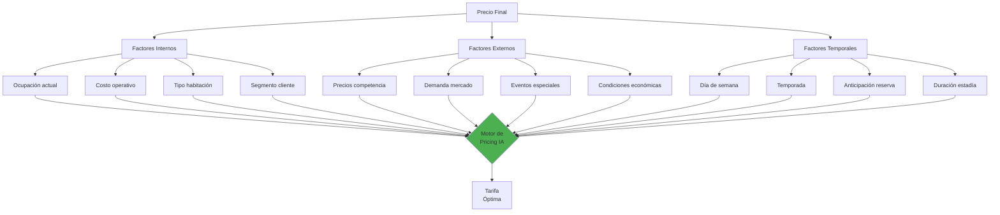

### 3.2 Matriz de Pricing por Segmento

```markdown
**Prompt para crear matriz de precios:**

Crea una matriz de precios para un hotel de 100 habitaciones en Asunción
con las siguientes características:

**Tipos de habitación:**
- Standard (50 hab): Costo base $60
- Superior (35 hab): Costo base $80
- Suite (12 hab): Costo base $120
- Suite Presidencial (3 hab): Costo base $250

**Segmentos de cliente:**
- Rack (precio público sin descuento)
- OTA (Booking, Expedia - comisión 18%)
- Corporativo (empresas con contrato)
- Grupos (+10 habitaciones)
- Fidelidad (huéspedes repetidos)

**Temporadas:**
- Alta (Semana Santa, Julio, Dic-Ene)
- Media (Fines de semana, feriados)
- Baja (Lunes-Jueves temporada baja)

Genera la matriz completa con precios sugeridos que:
1. Mantengan paridad de tarifas visible (OTA = Directo)
2. Ofrezcan valor agregado para reserva directa (no precio menor)
3. Maximicen RevPAR en temporada alta
4. Protejan ocupación en temporada baja
5. Consideren la comisión de OTAs en el pricing
```

**Matriz generada:**

| Habitación | Temporada | Rack | OTA | Corporativo | Grupos | Fidelidad |
|------------|-----------|------|-----|-------------|--------|-----------|
| **Standard** | Alta | $150 | $150 | $120 (-20%) | $110 (-27%) | $135 + desayuno |
| **Standard** | Media | $110 | $110 | $95 (-14%) | $85 (-23%) | $100 + upgrade |
| **Standard** | Baja | $80 | $80 | $70 (-12%) | $65 (-19%) | $75 + late c/o |
| **Superior** | Alta | $200 | $200 | $170 (-15%) | $155 (-22%) | $180 + spa |
| **Superior** | Media | $150 | $150 | $130 (-13%) | $120 (-20%) | $140 + desayuno |
| **Superior** | Baja | $110 | $110 | $95 (-14%) | $90 (-18%) | $100 + upgrade |
| **Suite** | Alta | $320 | $320 | $280 (-12%) | $260 (-19%) | $300 + cena |
| **Suite** | Media | $250 | $250 | $220 (-12%) | $200 (-20%) | $230 + spa |
| **Suite** | Baja | $180 | $180 | $160 (-11%) | $150 (-17%) | $165 + amenities |

### 3.3 Reglas de Pricing Automatizado

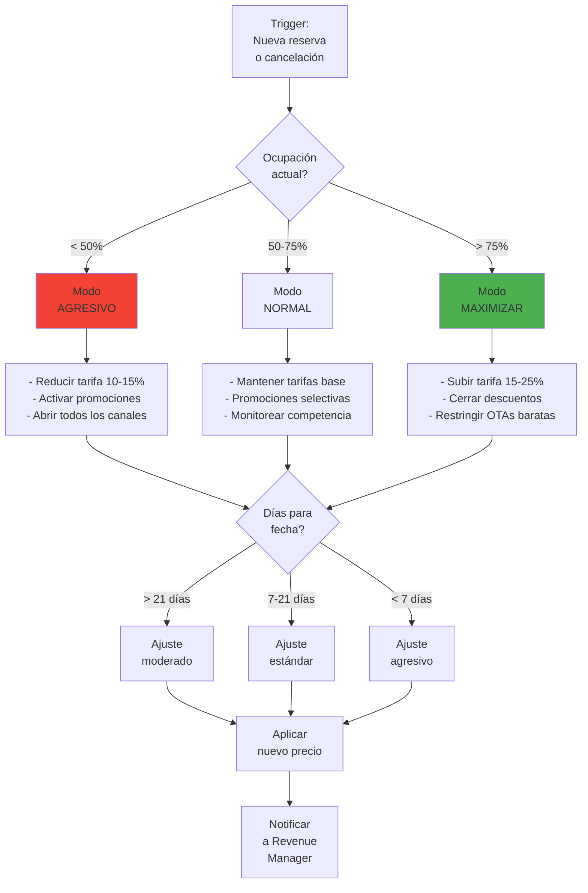

**Prompt para decisión de pricing:**

```markdown
**Situación actual:**
- Fecha: 20 de octubre 2026 (sábado)
- Días faltantes: 14
- Ocupación actual: 62%
- Ocupación histórica a 14 días: 75%
- Competidor principal: $140/noche (nosotros: $130)
- Evento: Concierto internacional en estadio (capacidad 40,000)

**Genera decisión de pricing que incluya:**
1. Diagnóstico de la situación
2. Recomendación de ajuste de tarifa
3. Acciones complementarias
4. Riesgos a monitorear
```

---

## Parte 4: Upselling y Cross-selling con IA

### 4.1 Oportunidades de Revenue Adicional

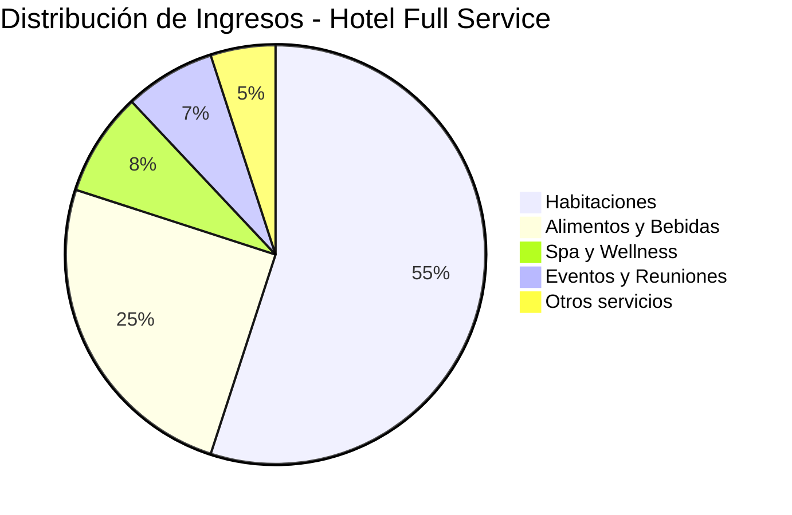

**El upselling puede aumentar el ADR 15-25% sin aumentar ocupación.**

### 4.2 Matriz de Upselling por Momento

| Momento | Oportunidad | Ejemplo | Conversión típica |
|---------|-------------|---------|-------------------|
| **Reserva** | Upgrade habitación | Standard → Superior | 8-12% |
| **Pre-llegada** | Servicios adicionales | Transfer, early c/i | 15-20% |
| **Check-in** | Upgrade inmediato | Ver habitación disponible | 20-30% |
| **Estadía** | Experiencias | Spa, cena especial | 10-15% |
| **Check-out** | Próxima reserva | Descuento retorno | 5-8% |

### 4.3 Prompts para Upselling Personalizado

**Upselling en pre-llegada:**

```markdown
**Perfil del huésped:**
- Nombre: Roberto Martínez
- Origen: Buenos Aires
- Reserva: Standard, 2 noches, viernes-domingo
- Motivo: "Escapada fin de semana" (campo de booking)
- Historial: Primera vez en el hotel
- Precio pagado: $100/noche

**Disponibilidad:**
- Superior con balcón: 3 disponibles, precio normal $150
- Suite con jacuzzi: 1 disponible, precio normal $250

**Genera email de upselling que:**
1. Sea personalizado y no parezca masivo
2. Presente el upgrade como oportunidad especial
3. Ofrezca precio con descuento atractivo
4. Incluya beneficios específicos del upgrade
5. Tenga llamada a la acción clara
6. No sea agresivo ni presione
```

**Email generado:**

> **Asunto:** Roberto, una sorpresa para su escapada 🌟
>
> Hola Roberto,
>
> Ya casi llega el fin de semana y su habitación en Hotel Guaraní está lista. Pero antes de su llegada, quería contarle sobre una oportunidad especial.
>
> Nos quedó disponible una **habitación Superior con balcón privado** y vista a la ciudad—perfecta para disfrutar el atardecer con un trago en mano. Normalmente es $150/noche, pero para su estadía se la puedo ofrecer a **$125/noche** (solo $25 más de lo que ya pagó).
>
> **Lo que incluye el upgrade:**
> - 🏙️ Balcón privado con vista panorámica
> - ☕ Máquina Nespresso en la habitación
> - 🛁 Bañera más amplia + amenities premium
> - 🍾 Botella de vino de bienvenida cortesía
>
> Si le interesa, solo responda este email con "Sí, quiero el upgrade" y lo dejamos listo.
>
> ¡Nos vemos el viernes!
>
> Ana - Reservas
> Hotel Guaraní

**Upselling en check-in (script para recepción):**

```markdown
**Contexto:**
El huésped Roberto Martínez llega al check-in.
Tiene reservada una Standard.
Hay una Suite con jacuzzi disponible esta noche.

**Genera script de upselling para recepcionista que:**
1. Sea natural, como conversación
2. Presente el upgrade como "disponibilidad del día"
3. Mencione el precio del upgrade (no el precio total)
4. Permita que el huésped decline sin presión
5. Máximo 30 segundos de pitch
```

**Script generado:**

> "Bienvenido señor Martínez, es un gusto tenerlo con nosotros. Su habitación Standard está lista, pero le cuento: justo hoy nos quedó disponible una Suite con jacuzzi privado—es espectacular para una escapada de fin de semana. Si le interesa, el upgrade es de solo $75 adicionales por las dos noches. ¿Le gustaría verla antes de decidir, o prefiere ir directamente a su Standard?"

### 4.4 Cross-selling de Servicios

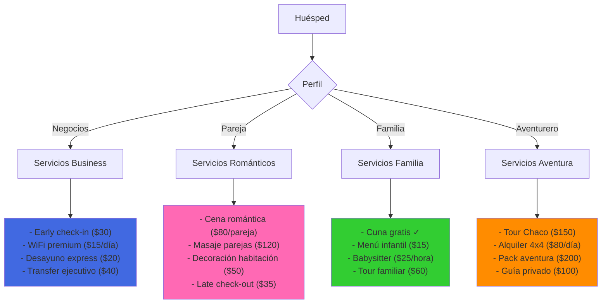

**Prompt para recomendaciones automatizadas:**

```markdown
**Huésped:** María González
**Perfil detectado:** Viaje de negocios
**Reserva:** Martes a Jueves, 3 noches
**Empresa:** Empresa de tecnología (campo corporativo)
**Historial:** 2 estadías previas, siempre pidió early check-in

**Genera 3 recomendaciones de cross-sell ordenadas por relevancia:**
- Considerar historial de compra
- Considerar perfil de negocio
- Considerar duración de estadía
```

---

## Parte 5: Análisis Competitivo con IA

### 5.1 Monitoreo de Competencia

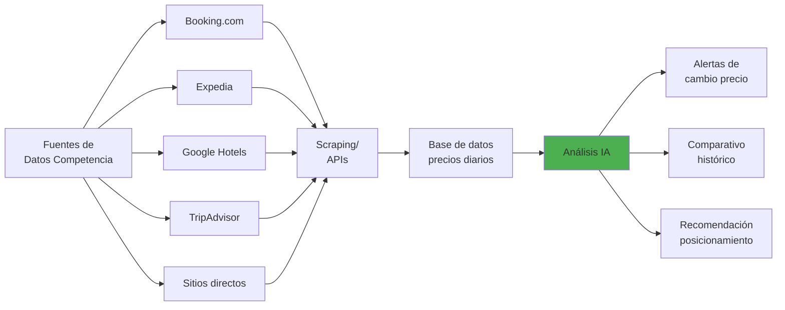

### 5.2 Prompt para Análisis Competitivo

```markdown
**Mi hotel:**
- Hotel Guaraní, 4 estrellas, centro Asunción
- 100 habitaciones
- Tarifa actual Standard: $110

**Competidores directos:**

| Hotel | Estrellas | Habitaciones | Tarifa Standard | Ocupación est. |
|-------|-----------|--------------|-----------------|----------------|
| Sheraton | 5 | 180 | $180 | 75% |
| Dazzler | 4 | 120 | $125 | 70% |
| Palmaroga | 4 | 80 | $100 | 80% |
| Ibis | 3 | 150 | $65 | 85% |

**Fecha análisis:** Fin de semana del 25-26 octubre

**Genera:**
1. Posicionamiento actual de mi hotel en el mercado
2. Análisis de precio vs. valor percibido
3. Oportunidades identificadas
4. Amenazas a considerar
5. Recomendación de ajuste de tarifa
6. Estrategia de diferenciación
```

**Análisis generado:**

```
📊 ANÁLISIS COMPETITIVO - HOTEL GUARANÍ

POSICIONAMIENTO ACTUAL:
- Ubicación en precio: 3° de 5 (segmento medio-alto)
- Percepción: "Buena relación calidad-precio"
- Gap vs Sheraton: -$70 (39% menor)
- Gap vs Dazzler: -$15 (12% menor)
- Gap vs Palmaroga: +$10 (10% mayor)
- Gap vs Ibis: +$45 (69% mayor)

ANÁLISIS PRECIO/VALOR:

            Precio Alto
                 |
    Sheraton ●   |
                 |
    Dazzler ●    |   ⭐ Oportunidad
                 |   (subir precio con
    GUARANÍ ●----+---- valor agregado)
                 |
    Palmaroga ●  |
                 |
    Ibis ●       |
                 |
            Precio Bajo
    ←—————————————————————————→
    Valor Bajo        Valor Alto

OPORTUNIDADES:
✅ Palmaroga tiene mayor ocupación con menor precio - hay demanda
✅ Gap grande con Dazzler permite subir tarifa $10-15
✅ Ibis captura budget travelers - no competir en precio

AMENAZAS:
⚠️ Si Dazzler baja a $110, perdemos diferenciación
⚠️ Sheraton puede hacer promociones agresivas en baja temporada
⚠️ Nuevos apart-hotels tipo Airbnb creciendo en centro

RECOMENDACIÓN:
Subir tarifa a $120 (+9%) con estas acciones:
1. Agregar valor: desayuno incluido (costo real $8)
2. Diferenciador: "WiFi más rápido del centro" (invertir en upgrade)
3. Comunicar: "A pasos del microcentro, mejor ubicación"

ROI proyectado:
- Aumento tarifa: +$10/noche
- Si perdemos 5% ocupación: (95 × $120) - (100 × $110) = $11,400 - $11,000 = +$400/día
- Si mantenemos ocupación: +$1,000/día
```

---

## Ejercicios Prácticos

### Ejercicio 1: Forecasting Manual

**Objetivo:** Crear un pronóstico de demanda para una semana específica.

**Datos proporcionados:**

```
Hotel: 80 habitaciones
Fecha objetivo: Semana del 15-21 de junio 2026
Contexto: Clasificatorias CONMEBOL (partido Paraguay en Asunción el 17 de junio)

Histórico junio (últimos 3 años):
- 2023: 58% ocupación promedio semanal
- 2024: 62% ocupación promedio semanal
- 2025: 67% ocupación promedio semanal

Pick-up actual (a 45 días):
- Lunes 15: 12 habitaciones
- Martes 16: 15 habitaciones
- Miércoles 17 (partido): 45 habitaciones
- Jueves 18: 20 habitaciones
- Viernes 19: 18 habitaciones
- Sábado 20: 25 habitaciones
- Domingo 21: 10 habitaciones
```

**Tareas:**
1. Proyecta la ocupación final para cada día
2. Identifica el día con mayor oportunidad de revenue
3. Recomienda tarifas para cada día
4. Calcula el RevPAR proyectado de la semana

---

### Ejercicio 2: Decisión de Pricing

**Situación:**
Es 1 de diciembre. Tenés estas reservas para Nochebuena (24 de diciembre):

```
Habitaciones totales: 100
Reservas actuales: 75
Tarifa actual: $200/noche (vs. $100 tarifa normal)
Competidor A: $220/noche, sold out
Competidor B: $180/noche, 10 habitaciones disponibles
```

**Preguntas:**
1. ¿Subís, bajás o mantenés el precio? Justificá.
2. ¿Qué estrategia usás para las 25 habitaciones restantes?
3. ¿Aceptarías una reserva de grupo de 20 habitaciones a $150/noche? ¿Por qué?
4. ¿Qué canales priorizarías para vender las restantes?

---

### Ejercicio 3: Plan de Upselling

**Contexto:** Diseñá un programa de upselling para tu hotel.

**Tareas:**
1. Define 5 oportunidades de upselling (con precios)
2. Define 5 oportunidades de cross-selling (con precios)
3. Crea el script de upselling para check-in
4. Crea el email de pre-llegada con ofertas
5. Define cómo medirías el éxito del programa

---

### Ejercicio 4: Análisis Competitivo Real

**Tarea:**
1. Elegí 4 hoteles reales en Asunción (o tu ciudad)
2. Buscá sus tarifas en Booking.com para el próximo fin de semana
3. Completá una matriz comparativa
4. Identificá oportunidades y amenazas
5. Recomendá posicionamiento para un hotel hipotético

---

### Ejercicio 5: Simulación de Revenue Management

**Escenario:**
Sos el Revenue Manager del Hotel Guaraní. Durante una semana, recibís estas situaciones. Decidí qué hacer en cada una:

**Día 1:**
Una empresa quiere reservar 30 habitaciones para un congreso en 60 días. Piden 25% de descuento sobre tarifa rack ($150). Tu ocupación proyectada para esa fecha es 65%.

**Día 2:**
Un huésped VIP (embajador de país vecino) necesita la Suite Presidencial que ya está reservada. El huésped actual pagó $400. El embajador pagaría $600.

**Día 3:**
Booking.com te ofrece participar en una "oferta flash" con 30% de descuento. Tendrás alta visibilidad por 48 horas. Tu ocupación para el mes es 55%.

**Día 4:**
Tu competidor principal bajó tarifas 20% para todo el mes. Tu ocupación es estable en 70%.

**Día 5:**
Un walk-in pide la última habitación disponible para esta noche. Tu tarifa es $180. Ofrece pagar $120 en efectivo.

---

## Preguntas de Evaluación

**1. RevPAR significa:**
- a) Revenue Per Available Room
- b) Rate Per Average Room
- c) Revenue Per Assigned Room
- d) Rate Per Available Rate

**2. ¿Cuál es la fórmula correcta de RevPAR?**
- a) Ocupación ÷ ADR
- b) ADR × Habitaciones totales
- c) Ocupación × ADR
- d) Ingresos totales ÷ Ocupación

**3. Si un hotel tiene 80% de ocupación y ADR de $100, ¿cuál es el RevPAR?**
- a) $180
- b) $80
- c) $125
- d) $100

**4. ¿Cuál segmento de huéspedes es típicamente MENOS sensible al precio?**
- a) Turistas de ocio
- b) Viajeros de negocios
- c) Grupos de estudiantes
- d) Buscadores de ofertas en OTAs

**5. En revenue management, una habitación no vendida hoy:**
- a) Se puede vender mañana al doble
- b) Es inventario perdido para siempre
- c) Se descuenta del inventario total
- d) Se transfiere al mes siguiente

**6. ¿Qué porcentaje de reservas debería tener un hotel típicamente a 30 días de la fecha?**
- a) 25%
- b) 50%
- c) 75%
- d) 90%

**7. El mejor momento para hacer upselling de upgrade de habitación es:**
- a) Durante la reserva inicial
- b) En el email de pre-llegada
- c) En el check-in
- d) Todos son buenos, pero check-in tiene mayor conversión

**8. Si tu competidor baja precios 20% y tu ocupación es estable, deberías:**
- a) Bajar inmediatamente para igualar
- b) Monitorear el impacto antes de actuar
- c) Subir precios para diferenciarte
- d) Cerrar ventas hasta que suban

**9. ¿Qué factor NO afecta típicamente el pricing dinámico?**
- a) Día de la semana
- b) Clima
- c) Color de la habitación
- d) Eventos en la ciudad

**10. TRevPAR se diferencia de RevPAR porque:**
- a) Incluye todos los ingresos, no solo habitaciones
- b) Es por habitación ocupada, no disponible
- c) No considera la ocupación
- d) Es una métrica mensual, no diaria

---

## Respuestas

1. **a) Revenue Per Available Room** - Es la métrica que indica los ingresos por habitación disponible, combinando ocupación y tarifa.

2. **c) Ocupación × ADR** - También se puede calcular como Ingresos de habitaciones / Total habitaciones disponibles.

3. **b) $80** - RevPAR = 80% × $100 = $80

4. **b) Viajeros de negocios** - Su empresa paga, valoran conveniencia y ubicación sobre precio.

5. **b) Es inventario perdido para siempre** - A diferencia de productos físicos, las habitaciones de hotel son "perecederas".

6. **b) 50%** - La curva de pick-up típica muestra que a 30 días se tiene aproximadamente la mitad de las reservas finales.

7. **d) Todos son buenos, pero check-in tiene mayor conversión** - En check-in el huésped puede ver la habitación y la decisión es inmediata, logrando 20-30% de conversión vs 8-12% en reserva.

8. **b) Monitorear el impacto antes de actuar** - Reaccionar inmediatamente puede iniciar una guerra de precios. Hay que evaluar si realmente está afectando tu demanda.

9. **c) Color de la habitación** - Día de semana, clima y eventos afectan demanda. El color de la habitación no tiene impacto en pricing.

10. **a) Incluye todos los ingresos, no solo habitaciones** - TRevPAR (Total RevPAR) considera F&B, spa, parking, etc., dando una visión más completa del revenue por habitación.

---

## Recursos Adicionales

### Herramientas de Revenue Management

| Herramienta | Uso | Costo |
|-------------|-----|-------|
| **IDeaS** | RMS enterprise | Alto (grandes cadenas) |
| **Duetto** | Cloud RMS | Medio-Alto |
| **RateGain** | Rate shopping | Medio |
| **OTA Insight** | Inteligencia de mercado | Medio |
| **Lighthouse** | BI hotelero | Freemium |
| **STR** | Benchmarking industria | Pago |

### KPIs a Monitorear Diariamente

```
□ Ocupación (hoy, mañana, próximos 7 días)
□ ADR vs. presupuesto
□ RevPAR vs. competencia
□ Pick-up vs. histórico
□ Cancelaciones del día
□ Precios competencia
```

### Lecturas Recomendadas

1. "Revenue Management for the Hospitality Industry" - Hayes & Miller
2. "Hotel Pricing in a Social World" - Kelly McGuire
3. "The Cornell School of Hotel Administration Handbook"

---

## Próximo Módulo

En el **Módulo 3: Marketing Digital para Turismo**, aprenderás:
- Estrategias de marketing digital específicas para turismo
- Creación de contenido con IA para destinos
- Gestión de redes sociales automatizada
- SEO para hoteles y destinos turísticos

---

*Módulo 2 de 4 | Track: Hospitalidad y Turismo | FPUNA 2026*
