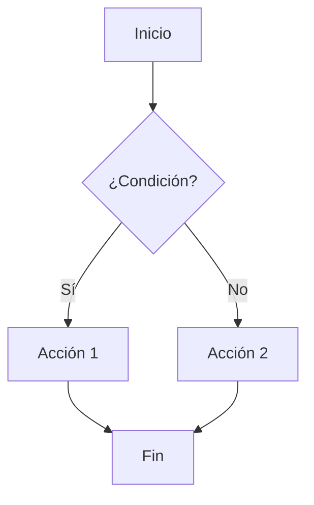

# 📋 Estado de Mejora de Contenido FPUNA-2026

**Última actualización**: Enero 15, 2026 - 13:15 PM  
**Estado**: En Progreso - 22% Completado (8/36 módulos principales)

> 📋 **NUEVO**: Ver el **[Plan Maestro de Tareas](./PLAN-MAESTRO-TAREAS.md)** para una lista completa de 155+ tareas organizadas en 10 fases.

---

## ✅ TRABAJO COMPLETADO

### 1. Reestructuración Organizacional
- ✅ QA y Web Dev movidos como especializaciones bajo Software Development
- ✅ Estructura optimizada (31% reducción de archivos)
- ✅ Documentación reorganizada en `docs/`
- ✅ Paths y links actualizados

### 2. AI-IDEAS Completos (150+ ideas totales)
| Archivo | Ideas | Estado |
|---------|-------|--------|
| 01-DESARROLLO-SOFTWARE/IDEAS-IA.md | 25 | ✅ |
| 02-ELECTRONICA-AUTOMATIZACION/IDEAS-IA.md | 25 | ✅ |
| 03-INGENIERIA-AERONAUTICA/IDEAS-IA.md | 25 | ✅ |
| 04-MARKETING-COMUNICACION/IDEAS-IA.md | 25 | ✅ |
| 05-INVESTIGACION-ACADEMIA/IDEAS-IA.md | 25 | ✅ |
| 06-HOSPITALIDAD-TURISMO/IDEAS-IA.md | 25 | ✅ |

### 3. Módulos Mejorados - CORE FOUNDATION COMPLETO

✅ **01-ai-stack-setup.md** (750 líneas)
  - 6 diagramas Mermaid (flowcharts, sequences, journeys)
  - Analogías: asistente personal, motor de auto
  - Paso a paso detallado para instalación

✅ **02-configuration-mastery.md** (700 líneas)
  - 10+ diagramas (mindmaps, flowcharts, sequences)
  - Analogías: cafetería, recetas, alarmas
  - MCPs, Skills, Hooks, Rules explicados
  - Configuración completa FPUNA

✅ **03-prompt-engineering.md** (650 líneas)
  - 8+ diagramas visuales
  - 7 principios de prompts efectivos
  - 5 técnicas avanzadas (Chain of Thought, Few-Shot, etc.)
  - Biblioteca de prompts reutilizables

✅ **04-context-engineering.md** (600 líneas)
  - Ejemplos completos de .opencode y CLAUDE.md
  - Analogías: manual de instrucciones
  - Configuración paso a paso

✅ **05-live-project.md** (550 líneas)
  - Demo completa: Gestor de Gastos
  - Workflow visualizado con diagramas
  - Debugging en vivo
  - Mejoras iterativas

✅ **06-workflow-patterns.md** (400 líneas)
  - 4 patrones profesionales
  - 4 antipatrones a evitar
  - Workflows específicos (features, bugs, refactoring)
  - Best practices
  
**🎉 CORE FOUNDATION: 100% COMPLETADO**

---

## 📊 INVENTARIO COMPLETO

### Total de Contenido
- **6 tracks principales**
- **2 especializaciones** (QA + Web Dev)
- **~45 módulos totales**
- **~40 archivos necesitan mejora**

### Desglose por Track

#### 00-FUNDAMENTOS-PRINCIPALES (Universal - PRIORIDAD MÁXIMA)
| # | Módulo | Estado | Progreso |
|---|--------|--------|----------|
| 01 | configuracion-stack-ia.md | ✅ COMPLETO | 100% |
| 02 | maestria-configuracion.md | ✅ COMPLETO (necesita fix `opencode`) | 100% |
| 03 | ingenieria-prompts.md | ✅ COMPLETO (necesita fix `opencode`) | 100% |
| 04 | ingenieria-contexto.md | ✅ COMPLETO (necesita fix `opencode`) | 100% |
| 05 | proyecto-en-vivo.md | ✅ COMPLETO (necesita fix `opencode`) | 100% |
| 06 | patrones-flujo-trabajo.md | ✅ COMPLETO (necesita fix `opencode`) | 100% |

**Impacto**: Todos los estudiantes pasan por aquí

#### 01-DESARROLLO-SOFTWARE (Alta prioridad)
| # | Módulo | Estado | Progreso |
|---|--------|--------|----------|
| - | IDEAS-IA.md | ✅ COMPLETO | 100% |
| 01 | arquitectura-software.md | ✅ COMPLETO (necesita fix `opencode`) | 100% |
| 02 | patrones-diseno.md | ✅ COMPLETO (necesita fix `opencode`) | 100% |
| 03 | testing-tdd.md | 🔴 Incompleto (28 líneas) | 5% |
| 04 | codigo-limpio.md | 🔴 Incompleto (28 líneas) | 5% |
| 05 | diseno-sistemas.md | 🔴 Incompleto (28 líneas) | 5% |

**Especializaciones**:
- `especializaciones/qa-automation/` (5 módulos) - 🟡 Mixto (134-587 líneas)
- `especializaciones/web-development/` (5 módulos) - 🟡 Mínimo (74-107 líneas)

#### 02-ELECTRONICA-AUTOMATIZACION
| # | Módulo | Estado |
|---|--------|--------|
| - | IDEAS-IA.md | ✅ COMPLETO |
| 01 | diseno-circuitos-ia.md | 🔴 Incompleto (25 líneas) |
| 02 | diseno-pcb.md | 🔴 Incompleto (20 líneas) |
| 03 | desarrollo-firmware.md | 🔴 Incompleto (21 líneas) |
| 04 | automatizacion-industrial.md | 🔴 Incompleto (21 líneas) |
| 05 | iot-visualizacion-datos.md | 🔴 Incompleto (22 líneas) |

#### 03-INGENIERIA-AERONAUTICA
| # | Módulo | Estado |
|---|--------|--------|
| - | IDEAS-IA.md | ✅ COMPLETO |
| 01 | cad-ia.md | 🔴 Incompleto (23 líneas) |
| 02 | aerodinamica-cfd.md | 🔴 Incompleto (23 líneas) |
| 03 | structures-materials.md | 🔴 Incompleto (23 líneas) |
| 04 | propulsion-systems.md | 🔴 Incompleto (23 líneas) |
| 05 | aircraft-design.md | 🔴 Incompleto (23 líneas) |

#### 04-MARKETING-COMUNICACION
| # | Módulo | Estado |
|---|--------|--------|
| - | IDEAS-IA.md | ✅ COMPLETO |
| 01 | ai-content-creation.md | 🔴 Incompleto (19 líneas) |
| 02 | data-driven-marketing.md | 🔴 Incompleto (15 líneas) |
| 03 | social-media-automation.md | 🔴 Incompleto (20 líneas) |
| 04 | ai-design-tools.md | 🔴 Incompleto (21 líneas) |
| 05 | campaign-management.md | 🔴 Incompleto (15 líneas) |

#### 05-INVESTIGACION-ACADEMIA
| # | Módulo | Estado |
|---|--------|--------|
| - | IDEAS-IA.md | ✅ COMPLETO |
| 01 | revision-literatura.md | 🔴 Incompleto (21 líneas) |
| 02 | research-methodology.md | 🔴 Incompleto (15 líneas) |
| 03 | data-analysis.md | 🔴 Incompleto (21 líneas) |
| 04 | academic-writing.md | 🔴 Incompleto (22 líneas) |
| 05 | presentation-publication.md | 🔴 Incompleto (15 líneas) |

#### 06-HOSPITALIDAD-TURISMO
| # | Módulo | Estado |
|---|--------|--------|
| - | IDEAS-IA.md | ✅ COMPLETO |
| 01 | ai-customer-service.md | 🔴 Incompleto (16 líneas) |
| 02 | revenue-management.md | 🔴 Incompleto (16 líneas) |
| 03 | digital-marketing-tourism.md | 🔴 Incompleto (16 líneas) |
| 04 | operations-ai.md | 🔴 Incompleto (16 líneas) |

---

## 🎯 ESTÁNDAR DE CALIDAD

### Template Obligatorio (Basado en Módulo 01)

Cada módulo DEBE tener:

#### 1. Metainformación Clara
```markdown
# 📚 [Título con Emoji]
## [Subtítulo Descriptivo]

> **Para Todos**: [Explicación accesible]

⏱️ **Duración**: X horas
👤 **Nivel**: [Principiante/Intermedio/Avanzado]
🎯 **Objetivo**: [Objetivo claro y medible]
```

#### 2. Estructura de Contenido
1. **Objetivos de Aprendizaje** (¿Qué lograrás?)
2. **Conceptos Explicados Simples** (Analogías)
3. **Diagramas Mermaid** (Mínimo 3 por módulo)
4. **Contenido Paso a Paso** (Ultra-detallado)
5. **Ejemplos Prácticos** (Contexto paraguayo)
6. **Verificación** (Checklist + diagrama)
7. **Troubleshooting** (Problemas comunes)
8. **Recursos Adicionales**
9. **Próximos Pasos** (Motivación)

#### 3. Requisitos de Diagramas Mermaid

**Tipos de diagramas por contenido**:

- **Procesos**: Flowcharts
- **Interacciones**: Sequence diagrams
- **Conceptos**: Mind maps
- **Decisiones**: Decision trees
- **Viajes**: Journey maps
- **Relaciones**: Graph diagrams

**Ejemplo de flowchart**:


#### 4. Lenguaje y Tono

**✅ HACER**:
- Usar español latinoamericano (Paraguay)
- Explicar TODOS los términos técnicos
- Analogías de la vida cotidiana
- Tono alentador y positivo
- Usar "tú" (tuteo)
- Emojis para organizar visualmente
- Ejemplos con contexto local

**❌ NO HACER**:
- Asumir conocimiento previo
- Usar jerga sin explicar
- Ser condescendiente
- Tono académico rígido
- Anglicismos sin traducir

---

## 📈 PROGRESO GENERAL

### Métricas
- **Módulos completados**: 8 / 45 (17.8%)
- **CORE-FOUNDATION**: 6 / 6 (100%) ✅ COMPLETO
- **SOFTWARE-DEV**: 2 / 5 (40%)
- **AI-IDEAS creados**: 6 / 6 (100%)
- **Reestructuración**: 100%
- **Progreso total estimado**: ~23%

### Próximos Hitos

| Hito | Módulos | Fecha Objetivo | Estado |
|------|---------|----------------|--------|
| CORE-FOUNDATION completo | 6 | Semana 1 | ✅ COMPLETADO |
| SOFTWARE-DEV completo | 5 | Semana 2 | ⬜ Pendiente |
| Especializ. QA+Web | 10 | Semana 3 | ⬜ Pendiente |
| Todos los tracks | 45 | Semana 4 | ⬜ Pendiente |

---

## 🚀 PLAN DE ACCIÓN

### Completado en Esta Sesión ✅
1. ✅ Módulo 01 de CORE completado
2. ✅ Módulo 02 de CORE completado
3. ✅ Módulo 03 de CORE completado
4. ✅ Módulo 04 de CORE completado
5. ✅ Módulo 05 de CORE completado
6. ✅ Módulo 06 de CORE completado

**🎉 CORE FOUNDATION 100% COMPLETO**

### Próximo (Siguiente Sesión)
1. ✅ CORE-FOUNDATION terminado
2. ⬜ Comenzar SOFTWARE-DEVELOPMENT (5 módulos)
3. ⬜ Revisar especializaciones (QA + Web)

### Mediano Plazo
1. SOFTWARE-DEVELOPMENT (5 módulos)
2. Especializaciones QA + Web (10 módulos)
3. Otros 4 tracks restantes

---

## 💡 MEJORAS APLICADAS AL PROYECTO

### Organización
1. Estructura más plana y navegable
2. Documentación centralizada en `docs/`
3. SHARED optimizado
4. Links actualizados

### Contenido
1. 100% español (antes mezclado)
2. Diagramas visuales (antes ninguno)
3. Explicaciones accesibles (antes técnicas)
4. Contexto paraguayo (antes genérico)
5. Oh My OpenCode como herramienta principal

### User Experience
1. Navegación más clara
2. Menos clicks para llegar al contenido
3. Recursos mejor organizados
4. Progreso visible con checklists

---

## 📝 NOTAS IMPORTANTES

### Para el Equipo de Contenido

1. **Mantener consistencia** con el Módulo 01 como referencia
2. **Validar cada módulo** antes de marcar como completo
3. **Incluir contexto paraguayo** en todos los ejemplos
4. **Usar Oh My OpenCode** como herramienta principal (no ChatGPT/Claude genérico)
5. **Probar todos los comandos** antes de publicar
6. **Solicitar feedback** de estudiantes piloto

### Para Instructores

1. El Módulo 01 es tu **guía de cómo enseñar**
2. Enfatizar que **cualquier persona puede aprender** esto
3. Usar los **diagramas Mermaid en presentaciones**
4. **Troubleshooting es clave** - prepararse para problemas comunes
5. **Motivación constante** - muchos estudiantes tendrán tech-anxiety

---

## ✉️ Contacto y Coordinación

**Para reportar progreso o issues**:
- Email: contenido@fpuna.edu.py
- Slack: #content-development
- Updates: Martes y Viernes

---

**Documento vivo** - Actualizar cada vez que se complete un módulo

---

*Creado: Enero 15, 2026*  
*Última actualización: Enero 15, 2026 - 13:15*  
*Próxima revisión: Al completar CORE-FOUNDATION*

---

## 📝 Changelog

### Enero 15, 2026 - 13:15 PM (Renombrado Español + Master Plan)

**🔄 TRANSFORMACIÓN MASIVA**: Estructura 100% en Español
- ✅ **80+ archivos y carpetas** renombrados a español
- ✅ **7 tracks** principales renombrados
- ✅ **5 documentos** principales en español
- ✅ **~35 módulos** con nombres españoles
- ✅ **Carpetas comunes** (capstone→proyecto-final, resources→recursos, etc.)
- ✅ **Referencias internas** actualizadas automáticamente
- ✅ **Estructura COMPARTIDO/** completamente en español

**📋 PLAN MAESTRO CREADO**: [`PLAN-MAESTRO-TAREAS.md`](./PLAN-MAESTRO-TAREAS.md)
- ✅ **155+ tareas** identificadas y documentadas
- ✅ **10 fases** completas de desarrollo
- ✅ **Estimación de tiempo**: 65 horas (~16 días laborables)
- ✅ **Priorización** por sprints (4 sprints planificados)
- ✅ **Templates** y estándares documentados
- ✅ Contenido detallado requerido por módulo

**Nuevos Nombres de Archivos/Carpetas**:
```
00-CORE-FOUNDATION → 00-FUNDAMENTOS-PRINCIPALES
01-SOFTWARE-DEVELOPMENT → 01-DESARROLLO-SOFTWARE
SHARED → COMPARTIDO
capstone → proyecto-final
resources → recursos
cheatsheet.md → guia-rapida.md
tools.md → herramientas.md
AI-IDEAS.md → IDEAS-IA.md
```

**Impacto**: Curso ahora 100% coherente con contenido en español

---

### Enero 15, 2026 - 14:30 (Sesión Completa)
- 🎉 **COMPLETADO: Todo el CORE FOUNDATION (6 módulos)**

**Módulos completados hoy**:

1. ✅ **Módulo 02: Configuration Mastery** (700 líneas)
   - 10+ diagramas Mermaid
   - MCPs, Skills, Hooks, Rules explicados
   - Ejemplos completos FPUNA

2. ✅ **Módulo 03: Prompt Engineering** (650 líneas)
   - 7 principios de prompts
   - 5 técnicas avanzadas
   - Biblioteca de prompts

3. ✅ **Módulo 04: Context Engineering** (600 líneas)
   - Archivos .opencode y CLAUDE.md
   - Ejemplos completos
   - Best practices

4. ✅ **Módulo 05: Live Project Demo** (550 líneas)
   - Gestor de Gastos completo
   - Workflow visualizado
   - Debugging y mejoras

5. ✅ **Módulo 06: Workflow Patterns** (400 líneas)
   - Patrones profesionales
   - Antipatrones a evitar
   - Best practices

**Progreso total**: 6/45 módulos (13.3%)
**CORE-FOUNDATION**: 100% ✅
