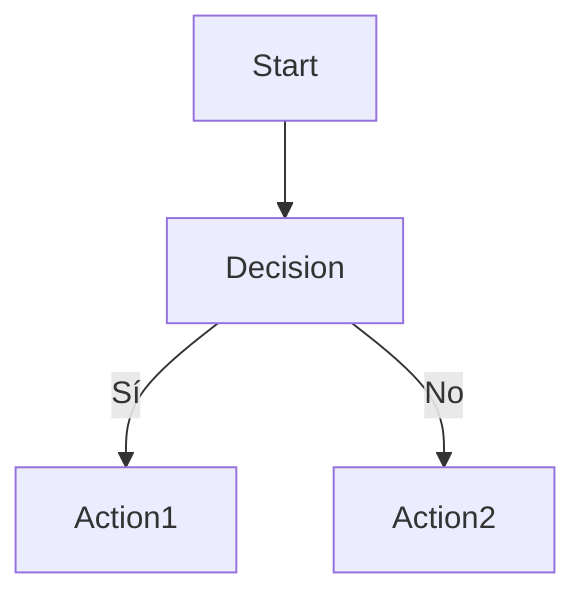
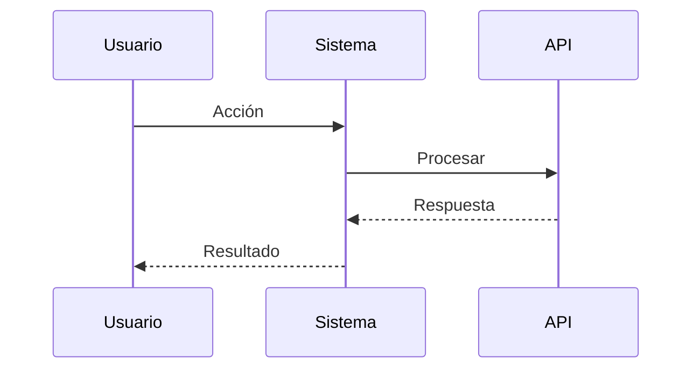
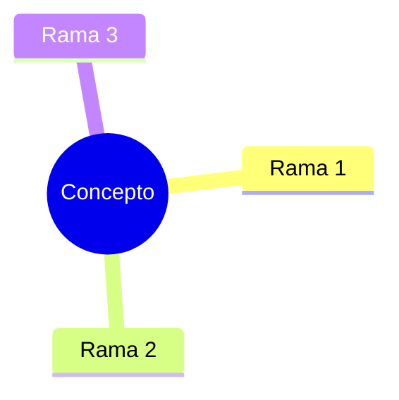
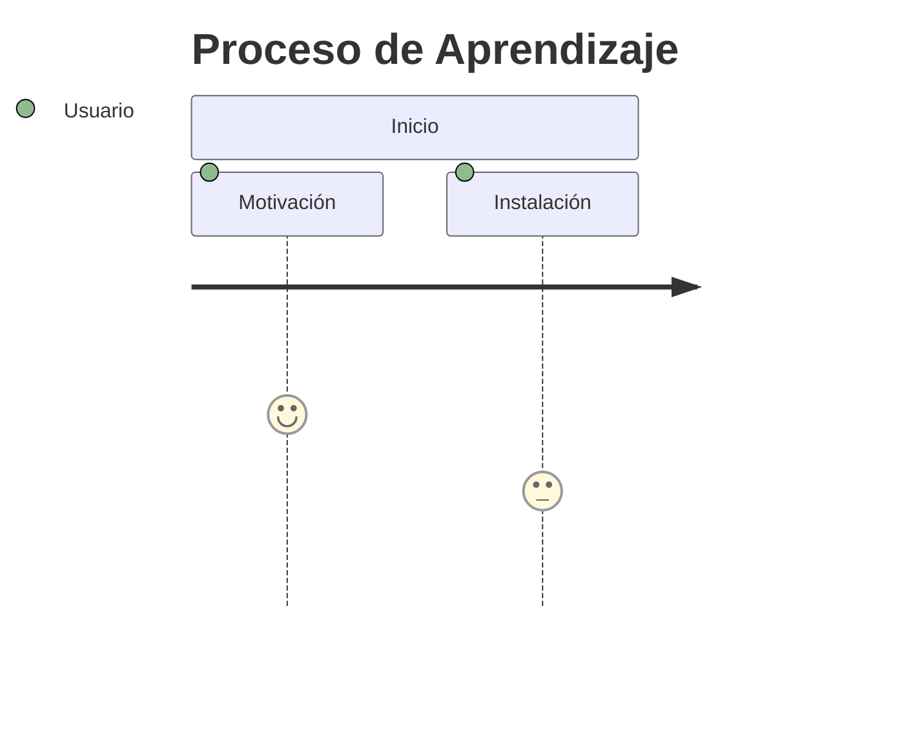

# 📋 Plan de Mejora de Contenido FPUNA-2026
## Estado Actual y Trabajo Pendiente

**Fecha**: Enero 15, 2026  
**Estado**: En Progreso

---

## ✅ Trabajo Completado

### 1. Reestructuración del Programa
- ✅ QA y Web Development movidos como especializaciones bajo Software Development
- ✅ Estructura de carpetas optimizada y limpia
- ✅ 57 archivos eliminados (quizzes/exercises)
- ✅ Documentación reorganizada en `docs/`

### 2. AI-IDEAS Creados (6 archivos)
- ✅ 01-DESARROLLO-SOFTWARE/IDEAS-IA.md (25 ideas)
- ✅ 02-ELECTRONICA-AUTOMATIZACION/IDEAS-IA.md (25 ideas)
- ✅ 03-INGENIERIA-AERONAUTICA/IDEAS-IA.md (25 ideas)
- ✅ 04-MARKETING-COMUNICACION/IDEAS-IA.md (25 ideas)
- ✅ 05-INVESTIGACION-ACADEMIA/IDEAS-IA.md (25 ideas)
- ✅ 06-HOSPITALIDAD-TURISMO/IDEAS-IA.md (25 ideas)

### 3. Módulos Mejorados
- ✅ 00-FUNDAMENTOS-PRINCIPALES/01-ai-stack-setup.md 
  - 100% español
  - 6 diagramas Mermaid
  - Explicaciones para no técnicos
  - Paso a paso detallado
  - *ESTE ES EL MODELO A SEGUIR*

---

## 📊 Inventario de Contenido Existente

### 00-FUNDAMENTOS-PRINCIPALES (6 módulos)
| Módulo | Estado | Acción Necesaria |
|--------|--------|------------------|
| 01-ai-stack-setup.md | ✅ COMPLETADO | Modelo de referencia |
| 02-configuration-mastery.md | 🟡 Necesita mejora | Español + Diagramas |
| 03-prompt-engineering.md | 🟡 Necesita mejora | Español + Diagramas |
| 04-context-engineering.md | 🟡 Necesita mejora | Español + Diagramas |
| 05-live-project.md | 🟡 Necesita mejora | Español + Diagramas |
| 06-workflow-patterns.md | 🟡 Necesita mejora | Español + Diagramas |

### 01-DESARROLLO-SOFTWARE (5 módulos + 2 especializaciones)
| Módulo | Estado | Acción Necesaria |
|--------|--------|------------------|
| IDEAS-IA.md | ✅ COMPLETO | N/A |
| 01-software-architecture.md | 🔴 Incompleto | Crear contenido completo |
| 02-design-patterns.md | 🔴 Incompleto | Crear contenido completo |
| 03-pruebas-tdd.md | 🔴 Incompleto | Crear contenido completo |
| 04-clean-code.md | 🔴 Incompleto | Crear contenido completo |
| 05-system-design.md | 🔴 Incompleto | Crear contenido completo |
| specializations/qa-automation/* | 🟡 Revisar | 5 módulos + recursos |
| specializations/web-development/* | 🟡 Revisar | 5 módulos + recursos |

### 02-ELECTRONICA-AUTOMATIZACION (5 módulos)
| Módulo | Estado | Acción Necesaria |
|--------|--------|------------------|
| IDEAS-IA.md | ✅ COMPLETO | N/A |
| 01-circuit-design-ai.md | 🔴 Incompleto | Crear contenido completo |
| 02-pcb-design.md | 🔴 Incompleto | Crear contenido completo |
| 03-firmware-dev.md | 🔴 Incompleto | Crear contenido completo |
| 04-industrial-automation.md | 🔴 Incompleto | Crear contenido completo |
| 05-iot-data-viz.md | 🔴 Incompleto | Crear contenido completo |

### 03-INGENIERIA-AERONAUTICA (5 módulos)
| Módulo | Estado | Acción Necesaria |
|--------|--------|------------------|
| IDEAS-IA.md | ✅ COMPLETO | N/A |
| 01-cad-ai.md | 🔴 Incompleto | Crear contenido completo |
| 02-aerodynamics-cfd.md | 🔴 Incompleto | Crear contenido completo |
| 03-estructuras-materiales.md | 🔴 Incompleto | Crear contenido completo |
| 04-sistemas-propulsion.md | 🔴 Incompleto | Crear contenido completo |
| 05-diseno-aeronaves.md | 🔴 Incompleto | Crear contenido completo |

### 04-MARKETING-COMUNICACION (5 módulos)
| Módulo | Estado | Acción Necesaria |
|--------|--------|------------------|
| IDEAS-IA.md | ✅ COMPLETO | N/A |
| 01-ai-content-creation.md | 🔴 Incompleto | Crear contenido completo |
| 02-data-driven-marketing.md | 🔴 Incompleto | Crear contenido completo |
| 03-social-media-automation.md | 🔴 Incompleto | Crear contenido completo |
| 04-ai-design-herramientas.md | 🔴 Incompleto | Crear contenido completo |
| 05-campaign-management.md | 🔴 Incompleto | Crear contenido completo |

### 05-INVESTIGACION-ACADEMIA (5 módulos)
| Módulo | Estado | Acción Necesaria |
|--------|--------|------------------|
| IDEAS-IA.md | ✅ COMPLETO | N/A |
| 01-literature-review.md | 🔴 Incompleto | Crear contenido completo |
| 02-metodologia-investigacion.md | 🔴 Incompleto | Crear contenido completo |
| 03-analisis-datos.md | 🔴 Incompleto | Crear contenido completo |
| 04-redaccion-academica.md | 🔴 Incompleto | Crear contenido completo |
| 05-presentacion-publicacion.md | 🔴 Incompleto | Crear contenido completo |

### 06-HOSPITALIDAD-TURISMO (4 módulos)
| Módulo | Estado | Acción Necesaria |
|--------|--------|------------------|
| IDEAS-IA.md | ✅ COMPLETO | N/A |
| 01-ai-customer-service.md | 🔴 Incompleto | Crear contenido completo |
| 02-revenue-management.md | 🔴 Incompleto | Crear contenido completo |
| 03-digital-marketing-tourism.md | 🔴 Incompleto | Crear contenido completo |
| 04-operations-ai.md | 🔴 Incompleto | Crear contenido completo |

---

## 📐 Estándar de Calidad (Basado en Módulo 01)

Cada módulo debe tener:

### 1. Estructura Requerida
```markdown
# 📚 Título del Módulo

## Subtítulo descriptivo

> **Para Todos**: Explicación accesible

**Metadata**:
- ⏱️ Duración
- 👤 Nivel
- 🎯 Objetivo

---

## 🎓 ¿Qué Vas a Lograr?
[Lista de objetivos]

## 🤔 [Concepto] Explicado Simple
[Analogía de la vida real]
[Diagrama Mermaid]

## [Secciones de contenido con íconos]
[Paso a paso detallado]
[Comandos con explicaciones]
[Ejemplos prácticos]

## ✅ Verificación
[Checklist]
[Diagrama de flujo Mermaid]

## 🆘 Ayuda y Solución de Problemas
[Problemas comunes + soluciones]

## 📚 Recursos Adicionales
[Links a documentación]

## 🎯 Próximos Pasos
[Motivación + siguiente módulo]
```

### 2. Elementos Obligatorios
- ✅ **100% Español** - Sin excepciones
- ✅ **Mínimo 3 diagramas Mermaid** por módulo
- ✅ **Analogías de vida real** para conceptos técnicos
- ✅ **Paso a paso** con comandos explicados
- ✅ **Sección de troubleshooting** 
- ✅ **Ejemplos prácticos** aplicados al contexto paraguayo
- ✅ **Motivación y ánimo** en el lenguaje

### 3. Tipos de Diagramas a Usar

#### Flowcharts (Flujos de proceso)


#### Sequence Diagrams (Secuencias)


#### Mind Maps (Mapas mentales)


#### Journey Maps (Viajes del usuario)


---

## 🎯 Prioridades de Trabajo

### Prioridad ALTA (Completar primero)
1. ✅ 00-FUNDAMENTOS-PRINCIPALES (6 módulos) - Universal para todos
2. 01-DESARROLLO-SOFTWARE (5 módulos) - Mayor audiencia
3. Especializ. QA + Web Dev (10 módulos) - Sub-tracks de Software

### Prioridad MEDIA
4. 02-ELECTRONICA-AUTOMATIZACION (5 módulos)
5. 04-MARKETING-COMUNICACION (5 módulos)

### Prioridad BAJA (Último)
6. 03-INGENIERIA-AERONAUTICA (5 módulos) - Audiencia más pequeña
7. 05-INVESTIGACION-ACADEMIA (5 módulos)
8. 06-HOSPITALIDAD-TURISMO (4 módulos)

---

## 📊 Estadísticas del Proyecto

### Totales
- **Tracks principales**: 6
- **Especializaciones**: 2
- **Total de módulos**: ~45
- **Archivos a mejorar**: ~40
- **AI-IDEAS creados**: 6/6 ✅
- **Módulos completados**: 1/45 (2%)
- **Trabajo restante**: ~44 módulos

### Tiempo Estimado
- Por módulo de calidad (como Módulo 01): 30-45 minutos
- Total estimado: **20-30 horas** de trabajo AI-asistido

---

## 🚀 Próximos Pasos Inmediatos

1. **Completar CORE-FOUNDATION** (5 módulos restantes)
2. **Validar con instructor/stakeholder** antes de continuar
3. **Aplicar feedback** al template
4. **Continuar con SOFTWARE-DEVELOPMENT** (prioridad alta)
5. **Iterar** sobre los demás tracks

---

## 📝 Notas Importantes

### Recursos Folders
- Mantener carpetas `resources/` y `capstone/` (aunque estén vacías)
- Llenar gradualmente con:
  - Cheatsheets
  - Herramientas recomendadas
  - Prompts útiles
  - Proyectos de ejemplo

### Contexto Paraguayo
Cada módulo debe incluir:
- Ejemplos con contexto local (Asunción, empresas paraguayas)
- Salarios en Guaraníes
- Oportunidades laborales en Paraguay
- Referencias a empresas/instituciones locales

### Acces
