# 📚 Módulo 01: Instalación del Stack de IA

## Tu Asistente Personal de Inteligencia Artificial

> **Para Todos**: Este módulo está diseñado para que CUALQUIER persona pueda completarlo, sin importar su edad o experiencia técnica. Si puedes usar WhatsApp, puedes hacer esto.

**⏱️ Duración**: 2 horas  
**👤 Nivel**: Principiante absoluto  
**🎯 Objetivo**: Tener tu propio asistente de IA funcionando en tu computadora

---

## 🎓 ¿Qué Vas a Lograr?

Al terminar este módulo, tendrás:

1. ✅ **OpenCode instalado** - Tu asistente de IA personal
2. ✅ **Oh My OpenCode funcionando** - Superpoderes adicionales para tu asistente
3. ✅ **Tu primer proyecto con IA** - Algo tangible que creaste CON ayuda de IA
4. ✅ **Confianza para usar IA** - Sin miedo a la tecnología

---

## 🤔 ¿Qué es Todo Esto? (Explicado Simple)

### Analogía: Como Tener un Asistente Personal

Imagina que contratas a un asistente muy inteligente que:
- **Escribe por ti** cuando se lo pides
- **Resuelve problemas** que le planteas
- **Aprende rápido** lo que necesitas
- **Nunca se cansa** y está disponible 24/7
- **No juzga** si haces preguntas "tontas"

Eso es **OpenCode** - pero en lugar de ser una persona, es un programa de computadora.

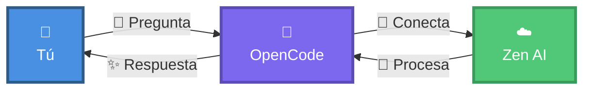

### ¿Y Oh My OpenCode?

Si OpenCode es tu asistente, **Oh My OpenCode** es como darle superpoderes:
- 🎯 **Especialización**: Puede ser experto en diferentes áreas
- ⚡ **Más rápido**: Hace tareas comunes automáticamente  
- 📦 **Plantillas**: Tiene recetas pre-hechas para tareas frecuentes
- 🔧 **Herramientas extra**: Conexiones con otras aplicaciones

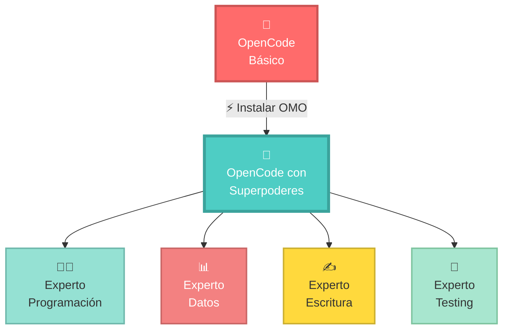

---

## 📋 Antes de Empezar: Lista de Verificación

### ¿Qué Necesitas?

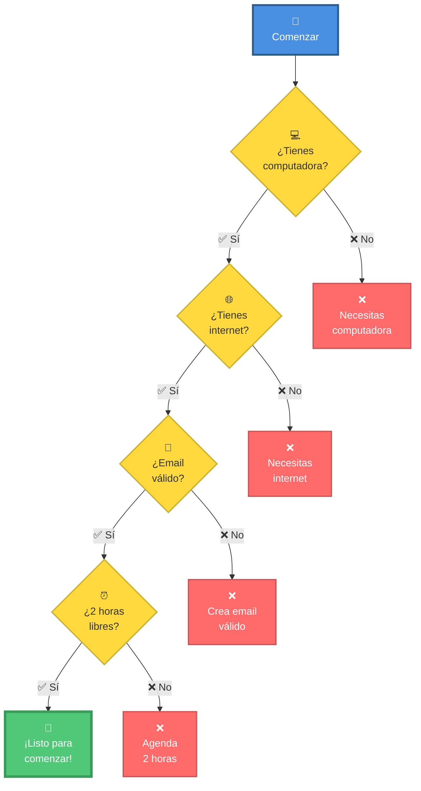

**Checklist Rápida**:
- [ ] Computadora con Windows, Mac o Linux
- [ ] Conexión a internet estable
- [ ] Email personal activo
- [ ] 2 horas sin interrupciones
- [ ] Actitud abierta para aprender

---

## 🚀 Parte 1: Instalando Node.js (El Motor)

### ¿Qué es Node.js?

**Analogía Simple**: Si OpenCode es un auto, Node.js es el motor que lo hace funcionar.

**No necesitas entender cómo funciona** - solo instalarlo. Es como usar tu celular: no necesitas saber cómo funciona por dentro para usarlo.

### Paso 1: Descargar Node.js

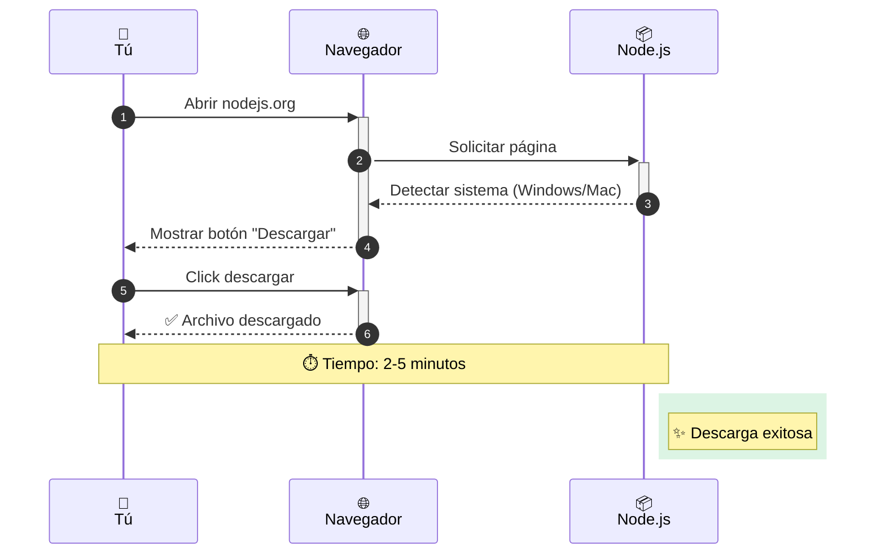

**Instrucciones Paso a Paso**:

1. **Abre tu navegador** (Chrome, Firefox, Edge - el que uses)
2. **Escribe en la barra de direcciones**: `nodejs.org`
3. **Verás un botón verde grande** que dice algo como:
   - Windows: "Download for Windows (x64)"
   - Mac: "Download for macOS"
4. **Dale click al botón verde**
5. **Espera a que descargue** (archivo de ~50MB)

### Paso 2: Instalar Node.js

**Una vez descargado**:

#### 🪟 En Windows:
1. Ve a tu carpeta "Descargas"
2. Busca el archivo `node-v18...msi`
3. **Doble click** en él
4. Click "Siguiente" en todas las pantallas
5. **IMPORTANTE**: Deja todas las opciones marcadas por defecto
6. Click "Instalar"
7. Espera 2-3 minutos
8. Click "Finalizar"

#### 🍎 En Mac:
1. Ve a tu carpeta "Descargas"
2. Busca el archivo `node-v18...pkg`
3. **Doble click** en él
4. Click "Continuar" en todas las pantallas
5. Introduce tu contraseña de Mac cuando te lo pida
6. Click "Instalar"
7. Espera 2-3 minutos
8. Click "Cerrar"

### Paso 3: Verificar que Funciona

**Ahora vamos a verificar que todo está bien**:

#### 🪟 Windows - Abrir PowerShell:
1. Presiona la tecla **Windows** (⊞)
2. Escribe: `powershell`
3. Verás una ventana azul - esa es PowerShell
4. **No tengas miedo** - es solo una forma de hablar con tu computadora

#### 🍎 Mac - Abrir Terminal:
1. Presiona **Cmd + Espacio**
2. Escribe: `terminal`
3. Presiona Enter
4. Verás una ventana blanca o negra - esa es Terminal

**Ahora escribe esto** (copia y pega si quieres):

```bash
node --version
```

**Presiona Enter**

**¿Qué deberías ver?**
```
v18.19.0
```
(El número puede variar, pero debe empezar con v18 o superior)

**Si ves un número**: ✅ ¡Perfecto! Node.js está instalado

**Si dice "comando no encontrado"**: 
1. Cierra PowerShell/Terminal
2. Ábrelo de nuevo
3. Intenta otra vez
4. Si sigue sin funcionar, pide ayuda al instructor

---

## 🎨 Parte 2: Instalando OpenCode (Tu Asistente de IA)

### ¿Qué es OpenCode?

**Explicación para tu abuela**: 
- Es como tener a ChatGPT, pero en tu computadora
- En lugar de abrir una página web, escribes comandos
- Es MÁS poderoso porque puede crear archivos, leer tu código, y mucho más

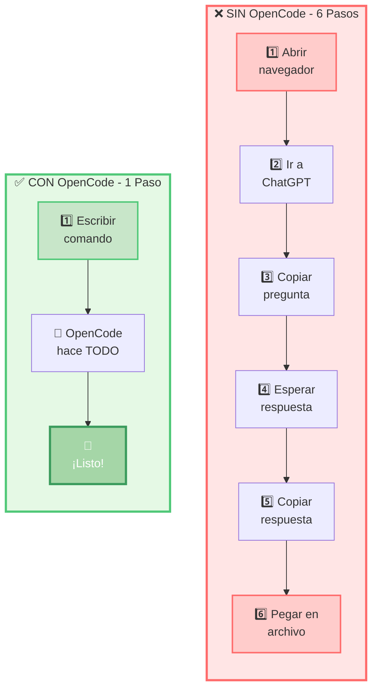

### Paso 1: Instalar OpenCode

> **Nota**: OpenCode es GRATUITO y funciona con tu cuenta de claude.ai. NO necesitas API keys ni tarjeta de crédito.

**En la misma PowerShell/Terminal que abriste antes**, escribe:

```bash
npm install -g opencode
```

**¿Qué significa esto?**
- `npm` = Programa que instala cosas (viene con Node.js)
- `install` = Instalar
- `-g` = Global (en toda tu computadora)
- `opencode` = La herramienta GRATUITA de OpenCode

**Presiona Enter y espera**

Verás muchas líneas de texto pasando rápido - **esto es normal**. Es como cuando instalas una app en tu celular.

**Tiempo de espera**: 2-5 minutos (depende de tu internet)

**Cuando termine**, deberías ver algo como:
```
+ opencode@x.x.x
added 50 packages in 2m
```

### Paso 2: Configurar OpenCode con Zen

**Analogía**: OpenCode necesita conectarse a un modelo de IA. Usaremos **Zen**, que es completamente GRATUITO.

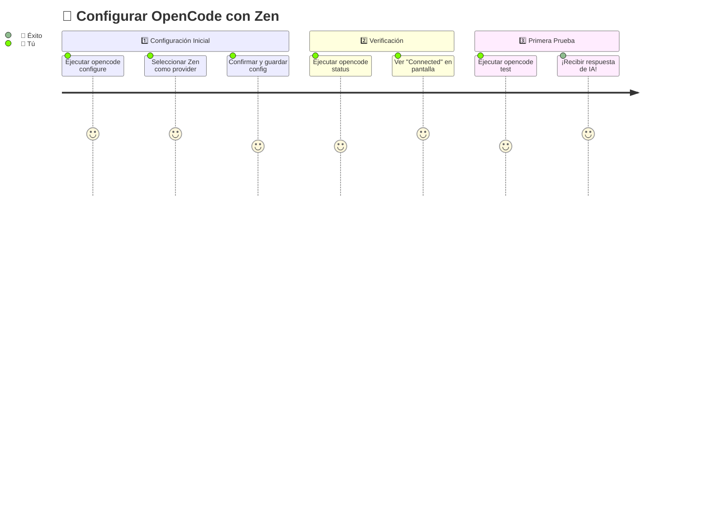

**Pasos Detallados**:

1. **Abre tu PowerShell/Terminal**

2. **Configura OpenCode con Zen**:
   ```bash
   opencode configure --provider zen
   ```

3. **Sigue las instrucciones** en pantalla:
   - Confirma que quieres usar Zen
   - Acepta la configuración por defecto

4. **Verifica la configuración**:
   ```bash
   opencode config show
   ```
   
5. **Prueba que funciona**:
   ```bash
   opencode test
   ```
   - Si ves "✓ Connected to AI model", estás listo

### Paso 3: Verificar la Conexión (Simple y GRATIS)

**Este paso confirma que OpenCode está correctamente configurado.**

#### Para TODOS (Windows/Mac/Linux):

**En tu PowerShell/Terminal**, escribe:

```bash
opencode status
```

**¿Qué deberías ver?**

```
✓ OpenCode v1.x.x
✓ Provider: Zen
✓ Status: Connected
✓ Ready to use
```

**Si ves errores**:

1. Verifica la configuración:
   ```bash
   opencode config show
   ```

2. Reconfigura si es necesario:
   ```bash
   opencode configure --provider zen
   ```

**IMPORTANTE**: 
- ✅ NO necesitas API keys
- ✅ NO necesitas tarjeta de crédito
- ✅ Completamente GRATIS con Zen

### Paso 4: Primera Prueba de OpenCode

**¡Momento de la verdad!** Vamos a probar tu asistente de IA.

> **Nota**: OpenCode está configurado con Zen y puedes usarlo GRATIS desde la terminal.

Escribe esto:

```bash
opencode "Hola, ¿puedes confirmar que estás funcionando? Responde en español."
```

**Si todo está bien**, verás una respuesta como:

```
¡Hola! Sí, estoy funcionando perfectamente. Estoy listo para ayudarte 
con lo que necesites. ¿En qué puedo asistirte hoy?
```

**Si ves un error**:
- "Connection failed" → Ejecuta `opencode configure --provider zen` de nuevo
- "Command not found" → Cierra y abre la terminal de nuevo
- Otro error → Pide ayuda al instructor

**🎉 ¡FELICITACIONES! ¡Tu asistente de IA está funcionando GRATIS!**

---

## 🚀 Parte 3: Instalando Oh My OpenCode (Superpoderes)

### ¿Por Qué Instalar Oh My OpenCode?

**OpenCode básico** es genial, pero **Oh My OpenCode** le agrega:

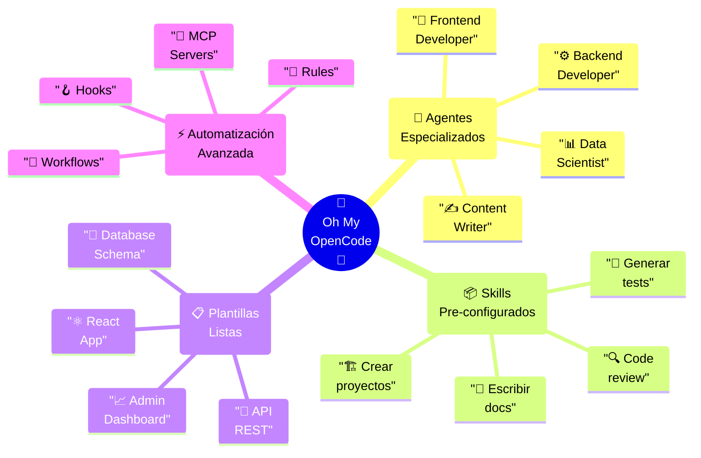

### Instalación Simple

En PowerShell/Terminal, escribe:

```bash
npm install -g oh-my-opencode
```

**Espera 2-3 minutos**

**Verificar instalación**:
```bash
omo --version
```

Deberías ver algo como: `1.5.0`

### Configuración Inicial

```bash
omo init
```

Este comando:
1. Crea carpetas de configuración
2. Descarga agentes básicos
3. Configura plantillas
4. ¡Te deja listo para usar!

**Espera 1-2 minutos mientras configura todo**

---

## 🎯 Parte 4: Tu Primer Proyecto con IA

### Vamos a Crear Algo Real

**Proyecto**: Una calculadora simple que suma, resta, multiplica y divide.

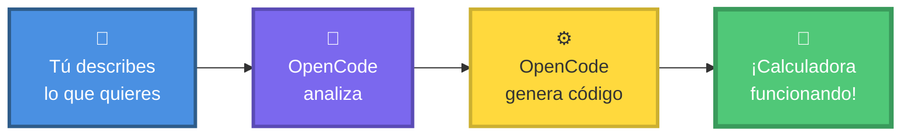

### Paso 1: Crear Carpeta del Proyecto

```bash
# Ir a tu carpeta de documentos
cd ~\Documents

# Crear carpeta para proyectos FPUNA
mkdir FPUNA-Proyectos

# Entrar a la carpeta
cd FPUNA-Proyectos

# Crear carpeta para este proyecto
mkdir mi-calculadora
cd mi-calculadora
```

### Paso 2: Pedirle a OpenCode que Cree la Calculadora

**Copia y pega este comando** (o escríbelo):

```bash
opencode chat "Crea una calculadora simple en JavaScript que:
- Tenga funciones para sumar, restar, multiplicar y dividir
- Valide que los números sean correctos
- Tenga un archivo README.md en español explicando cómo usarla
- Incluya ejemplos de uso
- Sea fácil de entender para principiantes"
```

**¡Observa la magia!** OpenCode creará:
1. `calculadora.js` - El código de la calculadora
2. `README.md` - Instrucciones en español
3. Ejemplos de cómo usar cada función

### Paso 3: Ver lo que Creó

```bash
# Ver los archivos creados
dir  # En Windows
ls   # En Mac/Linux
```

**Abrir en VS Code** (si lo tienes instalado):
```bash
code .
```

### Paso 4: Probar la Calculadora

OpenCode habrá creado algo como esto:

```javascript
// calculadora.js
function sumar(a, b) {
    return a + b;
}

function restar(a, b) {
    return a - b;
}

// ... más funciones
```

**Para probarla**, crea un archivo `prueba.js`:

```bash
opencode chat "Crea un archivo prueba.js que use la calculadora con ejemplos"
```

**Ejecutar**:
```bash
node prueba.js
```

**¡Deberías ver los resultados de las operaciones!**

---

## ✅ Verificación Final: ¿Todo Funciona?

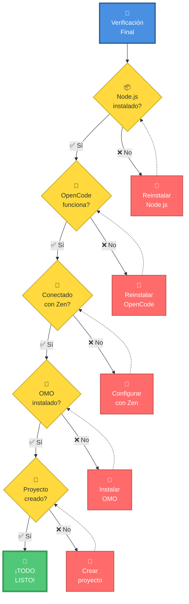

### Checklist Final

Marca cada uno conforme lo verificas:

- [ ] ✅ `node --version` muestra v18+
- [ ] ✅ `npm --version` muestra v9+
- [ ] ✅ `opencode status` muestra "Connected"
- [ ] ✅ `opencode "hola"` responde correctamente
- [ ] ✅ `omo --version` muestra versión
- [ ] ✅ Tengo mi carpeta FPUNA-Proyectos
- [ ] ✅ Creé mi primer proyecto con OpenCode
- [ ] ✅ Entiendo cómo pedirle cosas a OpenCode
- [ ] ✅ Me siento confiado/a para continuar

---

## 🆘 Ayuda y Solución de Problemas

### Problemas Comunes

#### 1. "comando no encontrado: opencode"

**Causa**: PowerShell/Terminal no encuentra OpenCode

**Solución**:
1. Cierra PowerShell/Terminal COMPLETAMENTE
2. Ábrelo de nuevo
3. Intenta nuevamente
4. Si persiste, reinstala con: `npm install -g opencode`

#### 2. "Connection failed" o "No se puede conectar"

**Causa**: OpenCode no está configurado correctamente con Zen

**Solución**:
1. Ejecuta: `opencode configure --provider zen`
2. Confirma la configuración
3. Verifica con: `opencode status`
4. Intenta el comando de nuevo

#### 3. "La IA no responde en español"

**Solución**: Siempre especifica en tu prompt:
```bash
opencode chat "Tu pregunta aquí. RESPONDE EN ESPAÑOL."
```

#### 4. "No entiendo los comandos de terminal"

**¡Tranquilo/a!** Es normal. Aquí un resumen:

```mermaid
graph TB
    subgraph Navegacion["📂 Navegación"]
        A["cd"] -->|"Cambiar<br/>carpeta"| B["📁 Mover entre<br/>directorios"]
    end
    
    subgraph Visualizar["👁️ Visualizar"]
        C["ls/dir"] -->|"Listar<br/>archivos"| D["📋 Ver contenido<br/>carpeta"]
    end
    
    subgraph Crear["➕ Crear"]
        E["mkdir"] -->|"Nueva<br/>carpeta"| F["📁 Crear<br/>directorio"]
    end
    
    subgraph Ejecutar["▶️ Ejecutar"]
        G["node"] -->|"Correr<br/>código"| H["🚀 Ejecutar<br/>programa"]
    end
    
    style Navegacion fill:#E3F2FD,stroke:#2196F3,stroke-width:2px
    style Visualizar fill:#F3E5F5,stroke:#9C27B0,stroke-width:2px
    style Crear fill:#E8F5E9,stroke:#4CAF50,stroke-width:2px
    style Ejecutar fill:#FFF3E0,stroke:#FF9800,stroke-width:2px
    
    style A fill:#4A90E2,stroke:#2E5C8A,stroke-width:2px,color:#fff
    style C fill:#7B68EE,stroke:#5A4BB5,stroke-width:2px,color:#fff
    style E fill:#50C878,stroke:#3A9B5C,stroke-width:2px,color:#fff
    style G fill:#FFD93D,stroke:#CCB031,stroke-width:2px,color:#333
```

**Comandos básicos**:
- `cd nombre-carpeta` = Entrar a una carpeta
- `cd ..` = Volver atrás
- `ls` (Mac) o `dir` (Windows) = Ver qué hay en la carpeta
- `mkdir nombre` = Crear carpeta nueva
- `opencode "pregunta"` = Preguntarle a tu IA

---

## 📚 Recursos Adicionales

### Documentación Completa

Para profundizar más:

- 📖 [Guía Detallada de OpenCode](../../COMPARTIDO/opencode-installation/guide.md)
- 📖 [Instalación en Windows](../../COMPARTIDO/opencode-installation/windows.md)
- 📖 [Instalación en Mac](../../COMPARTIDO/opencode-installation/mac.md)
- 📖 [Instalación en Linux](../../COMPARTIDO/opencode-installation/linux.md)
- 📖 [Solución de Problemas](../../COMPARTIDO/opencode-installation/troubleshooting.md)
- 📖 [Preguntas Frecuentes](../../COMPARTIDO/opencode-installation/FAQ.md)

### Soporte FPUNA

**¿Necesitas ayuda?**

- **💬 Slack**: #fpuna-core-foundation
- **📧 Email**: soporte-core@fpuna.edu.py
- **🕐 Horario de consulta**: Lunes-Viernes 14:00-16:00
- **👥 Asistentes en clase**: Disponibles durante todas las sesiones

### Videos Tutoriales (si están disponibles)

- 🎥 Instalación en Windows (paso a paso)
- 🎥 Instalación en Mac (paso a paso)
- 🎥 Primeros pasos con OpenCode
- 🎥 Solución de problemas comunes

---

## 📝 Quiz de Evaluación

### Instrucciones
- **Total**: 10 preguntas
- **Tiempo estimado**: 15-20 minutos
- **Aprobación**: 7/10 o más
- **Tipo**: Opción múltiple, verdadero/falso, respuesta corta

---

### Preguntas

**1. ¿Cuál es el orden CORRECTO para instalar el stack de IA?**
a) Oh My OpenCode → Node.js → OpenCode → Autenticación  
b) Node.js → OpenCode → Autenticación (opencode login) → Oh My OpenCode  
c) Autenticación → OpenCode → Node.js → Oh My OpenCode  
d) OpenCode → Oh My OpenCode → Node.js → Autenticación  

**2. ¿Qué es OpenCode?**
a) Un navegador web  
b) Un asistente de IA que ayuda con código y tareas  
c) Una red social  
d) Un sistema operativo  

**3. Verdadero o Falso: Oh My OpenCode (OMO) funciona SIN necesidad de instalar OpenCode primero.**

**4. ¿Cómo se configura OpenCode con Zen?**
a) Con una API key de pago  
b) Usando el comando `opencode configure --provider zen`  
c) Se configura automáticamente  
d) Necesitas una licencia enterprise  

**5. ¿Cuál comando verifica si Node.js está instalado correctamente?**
a) `npm --version`  
b) `node check`  
c) `node --version`  
d) `opencode verify`  

**6. Describe en 2-3 oraciones qué "superpoderes" le da Oh My OpenCode a OpenCode básico.**

**7. ¿Cuál de estos NO es un requisito para instalar el stack de IA?**
a) Tener computadora con Windows/Mac/Linux  
b) Tener conexión a internet  
c) Tener título universitario  
d) Tener email válido  

**8. Verdadero o Falso: Si OpenCode no responde, el PRIMER paso de troubleshooting es verificar la configuración con `opencode status`.**

**9. ¿Cuál es la diferencia entre OpenCode y Zen?**
a) Son exactamente lo mismo  
b) OpenCode es la aplicación en tu computadora, Zen es el modelo de IA que usa  
c) Zen es más viejo  
d) OpenCode solo funciona en Windows  

**10. Menciona 2 formas en las que podrías usar OpenCode en tu vida diaria/carrera (respuesta abierta).**

---

### Respuestas

**1. b) Node.js → OpenCode → Autenticación (opencode login) → Oh My OpenCode**

Este es el orden lógico de instalación: primero necesitas Node.js (base), luego instalas OpenCode, lo configuras con Zen usando `opencode configure --provider zen`, y finalmente agregas Oh My OpenCode para superpoderes.

---

**2. b) Un asistente de IA que ayuda con código y tareas**

OpenCode es tu asistente personal de inteligencia artificial que puede ayudarte con código, explicaciones, tareas repetitivas, y mucho más. No es un navegador, red social, ni sistema operativo.

---

**3. Falso**

Oh My OpenCode es una EXTENSIÓN de OpenCode. Necesitas tener OpenCode instalado PRIMERO, y luego agregas OMO para darle funcionalidades adicionales (skills, hooks, MCPs).

---

**4. b) Usando el comando `opencode configure --provider zen`**

OpenCode se configura con Zen usando el comando `opencode configure --provider zen`. Es completamente GRATUITO y NO necesitas API keys de pago ni tarjeta de crédito.

---

**5. c) `node --version`**

El comando `node --version` (o `node -v`) muestra la versión de Node.js instalada. Si responde con algo como "v18.x.x", está instalado correctamente.

---

**6. Respuesta Modelo:**

"Oh My OpenCode le da a OpenCode capacidades de especialización (Skills), conexiones con otras aplicaciones (MCPs), automatización de tareas (Hooks), y plantillas pre-hechas para tareas comunes. Es como convertir un asistente genérico en un experto personalizado para tu trabajo específico."

**Criterios de evaluación:**
- Menciona Skills/especialización (0.5 puntos)
- Menciona MCPs/conexiones (0.5 puntos)
- Menciona Hooks/automatización o plantillas (0.5 puntos)

**Puntaje**: 1.5/1.5 si incluye al menos 2 de los 3 elementos

---

**7. c) Tener título universitario**

NO necesitas título universitario para instalar o usar IA. Solo necesitas: computadora, internet, email válido, y 2 horas de tiempo. El conocimiento técnico no es requisito.

---

**8. Verdadero**

Según la sección de troubleshooting, si OpenCode no responde, el PRIMER paso es verificar tu configuración ejecutando `opencode status` para ver si está conectado correctamente a Zen. Es el problema más común.

---

**9. b) OpenCode es la aplicación en tu computadora, Zen es el modelo de IA que usa**

OpenCode es la interfaz (CLI) que instalas localmente. Zen es el modelo de inteligencia artificial que hace el "pensamiento pesado". OpenCode se conecta a Zen para procesar tus solicitudes.

---

**10. Respuesta Modelo (ejemplos válidos):**

- "Escribir reportes para mi trabajo y crear análisis de datos para proyectos universitarios"
- "Aprender programación para mi carrera y automatizar tareas repetitivas"
- "Crear contenido de marketing y diseñar campañas publicitarias"
- "Ayudarme con investigación académica y escribir papers"
- "Resolver problemas de código y aprender nuevas tecnologías"

**Criterios de evaluación:**
- Menciona 2 usos distintos (1 punto)
- Son realistas y relacionados a su contexto (1 punto)

**Puntaje**: 2/2 si menciona 2 usos válidos y específicos

---

### Criterios de Evaluación

| Rango | Calificación | Interpretación |
|-------|--------------|----------------|
| 9-10 | Excelente | Instalación dominada, listo para Módulo 02 |
| 7-8 | Bueno | Comprensión sólida, puede continuar |
| 5-6 | Suficiente | Revisar conceptos de OMO y autenticación |
| 0-4 | Insuficiente | Repetir instalación y leer módulo completo |

**Notas sobre puntuación**:
- Preguntas 6 y 10 son abiertas: valen 1.5 y 2 puntos respectivamente
- Las demás valen 1 punto cada una
- Total ajustado: 10 puntos exactos

---

## 🎯 Próximos Pasos

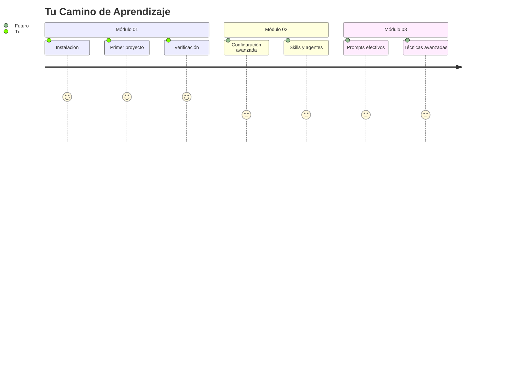

**Ahora que terminaste este módulo**:

1. 📝 **Practica más**: Pídele a OpenCode que cree otros proyectos simples
2. 📖 **Continúa con**: [Módulo 02 - Dominio de Configuración](./02-configuration-mastery.md)
3. 🤝 **Comparte**: Ayuda a un compañero/a que esté atascado/a
4. ❓ **Pregunta**: Si algo no te quedó claro, ¡pregunta en Slack!

---

## 📊 Resumen Visual

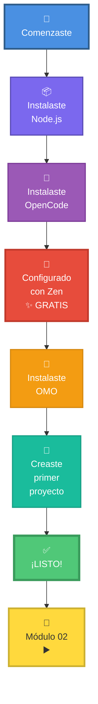

---

## 🎉 ¡Felicitaciones!

Has completado el módulo más importante del curso. Ahora tienes:

✅ **Tu propio asistente de IA funcionando**  
✅ **Las herramientas instaladas**  
✅ **Experiencia creando tu primer proyecto**  
✅ **Confianza para continuar aprendiendo**

### Lo Que Significa Esto

No importa tu carrera (Ingeniería, Marketing, Hotelería, etc.), ahora tienes una herramienta que puede:
- Escribir código por ti
- Explicarte conceptos difíciles
- Ayudarte con tareas repetitivas
- Ser tu tutor personal 24/7

**Esto es solo el comienzo.** En los siguientes módulos aprenderás a usar esta herramienta como un profesional.

---

## 💭 Reflexión Final

Antes de continuar, tómate un momento para pensar:

1. **¿Qué fue lo más difícil?** (Para mejorar la guía)
2. **¿Qué te sorprendió?** 
3. **¿Cómo usarías esto en tu vida diaria?**

**Comparte tus respuestas en Slack** - ayudará a otros estudiantes y a los instructores a mejorar el curso.

---

**⏭️ Siguiente**: [Módulo 02 - Dominio de Configuración](./02-configuration-mastery.md)

---

*Módulo creado para FPUNA Verano 2026*  
*Actualizado: Enero 2026*  
*Versión: 2.0 - Explicación accesible para todos*
