# ⚙️ Módulo 02: Dominio de Configuración

## Personaliza tu Asistente de IA Como un Profesional

> **Para Todos**: Este módulo te enseña a configurar tu asistente de IA para que trabaje exactamente como TÚ necesitas. Es como entrenar a un empleado nuevo para que conozca tus preferencias y tu forma de trabajar.

**⏱️ Duración**: 2 horas  
**👤 Nivel**: Principiante (con Módulo 01 completado)  
**🎯 Objetivo**: Configurar OpenCode con superpoderes personalizados

---

## 🎓 ¿Qué Vas a Lograr?

Al terminar este módulo, tendrás:

1. ✅ **MCPs configurados** - Conexiones con otras herramientas (Git, archivos, etc.)
2. ✅ **Skills instalados** - Recetas pre-hechas para tareas comunes
3. ✅ **Hooks funcionando** - Automatización de tareas repetitivas
4. ✅ **Rules aplicadas** - Tu asistente seguirá tus reglas automáticamente
5. ✅ **OpenCode personalizado** - Adaptado a TUS necesidades específicas

---

## 📋 Prerrequisitos

### Conocimientos Requeridos

✅ **Módulo 01 Completado** (OBLIGATORIO)
- OpenCode instalado y funcionando
- Oh My OpenCode instalado
- API Key configurada

✅ **Habilidades Básicas**
- Abrir y editar archivos de texto
- Navegar carpetas en tu computadora
- Copiar y pegar texto

❌ **NO Se Requiere**
- Programación avanzada
- Conocimiento de YAML/JSON
- Experiencia previa con configuración

### Software Necesario

Ya lo tienes del Módulo 01:
- ✅ OpenCode CLI funcionando
- ✅ Oh My OpenCode instalado
- ✅ Editor de texto (VS Code, Notepad++, o similar)

### Auto-Evaluación

Responde SÍ/NO:
1. ¿Completaste el Módulo 01 satisfactoriamente?
2. ¿Puedes ejecutar `opencode --version` sin errores?
3. ¿Sabes cómo abrir y editar archivos de texto?
4. ¿Tienes 2 horas dedicadas sin interrupciones?

**Si respondiste SÍ a todo**: ¡Estás listo! Continúa.  
**Si algún NO**: Completa Módulo 01 primero.

### Checklist Final

- [ ] Módulo 01 completado
- [ ] OpenCode funciona (`opencode --version` responde)
- [ ] Editor de texto instalado
- [ ] Tengo 2 horas disponibles

---

## 🤔 Concepto Central: Los 4 Pilares de Configuración

### Analogía: Configurar una Cafetería

Imagina que abres una cafetería y necesitas configurarla:

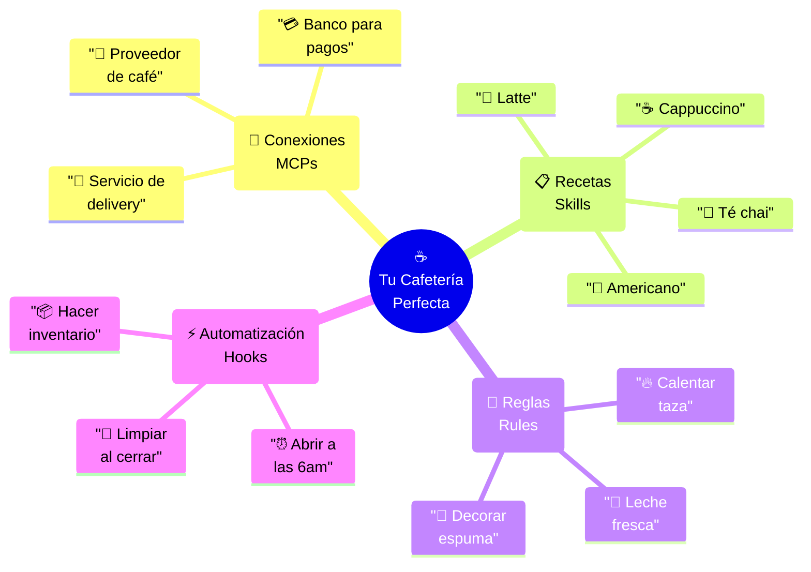

**En OpenCode es lo mismo**:

| Cafetería | OpenCode | ¿Qué hace? |
|-----------|----------|------------|
| 🔌 Conexiones con proveedores | **MCPs** | Conectar con GitHub, archivos, bases de datos |
| 📋 Recetas de bebidas | **Skills** | Plantillas para crear proyectos, tests, docs |
| 📜 Reglas del negocio | **Rules** | Cómo debe comportarse el código generado |
| ⚡ Automatización | **Hooks** | Acciones automáticas antes/después de algo |

---

## 📋 Arquitectura de Configuración

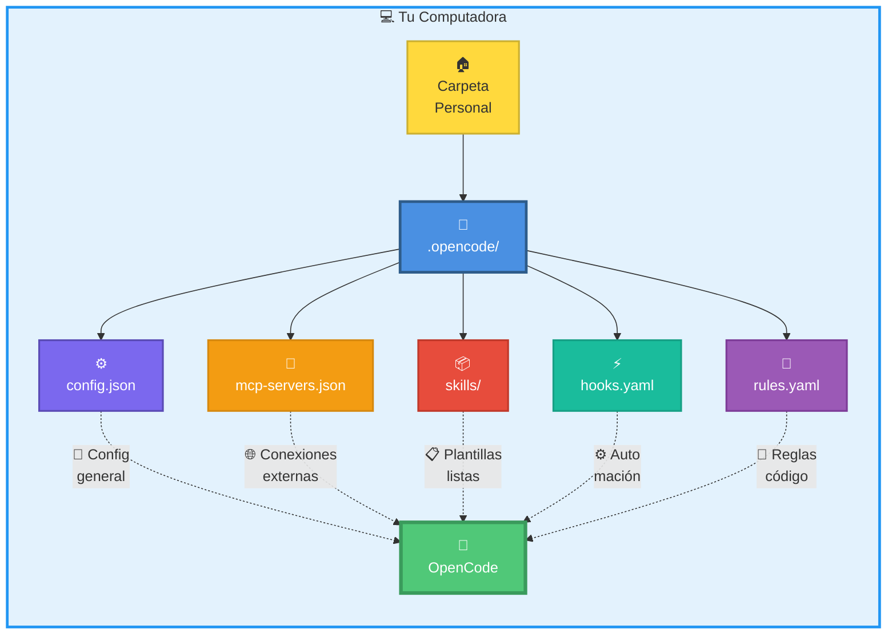

### ¿Dónde Está Todo?

**Windows**: `C:\Users\TuNombre\.opencode\`  
**Mac/Linux**: `~/.opencode/`

**Archivos importantes**:
```
.opencode/
├── config.json           # Configuración general
├── mcp-servers.json      # Conexiones (MCPs)
├── hooks.yaml            # Automatización
├── rules.yaml            # Reglas de código
└── skills/               # Carpeta de skills
    ├── fpuna-header/
    ├── generate-readme/
    └── ...
```

---

## 🔌 Parte 1: MCPs - Conectar con el Mundo Exterior (45 min)

### ¿Qué es un MCP?

**MCP** = **Model Context Protocol** (Protocolo de Contexto del Modelo)

**Analogía Simple**: Un MCP es como un "traductor" que permite a OpenCode hablar con otras aplicaciones.

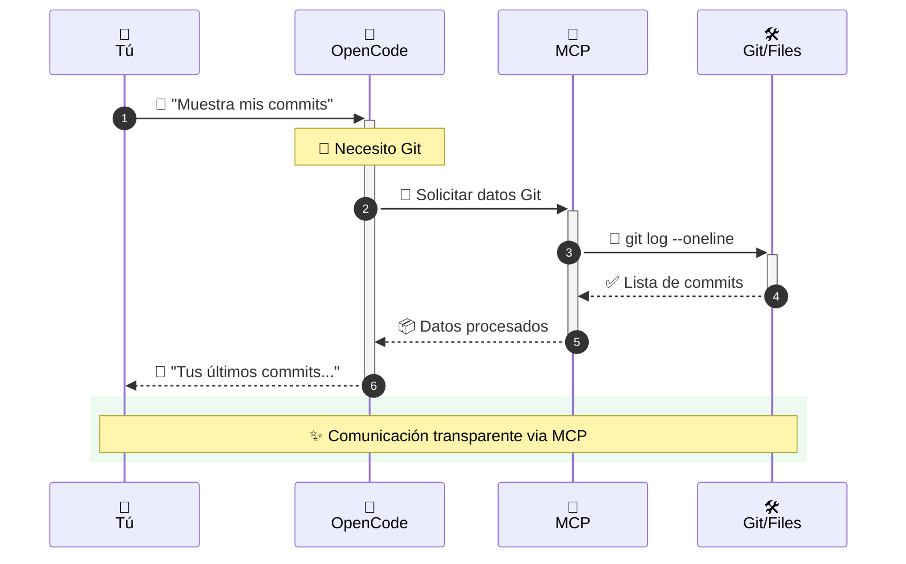

### MCPs Esenciales para Estudiantes FPUNA

#### 1. Filesystem MCP (Leer y Escribir Archivos)

**¿Qué hace?**: Permite a OpenCode leer y crear archivos en tu computadora.

**¿Por qué lo necesitas?**: Para que OpenCode pueda crear proyectos automáticamente.

##### Instalación Paso a Paso

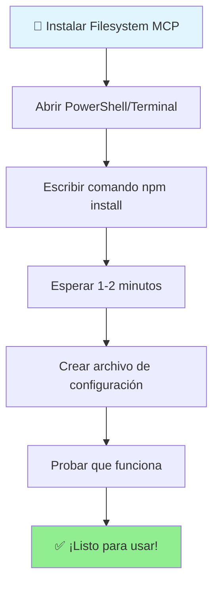

**Paso 1**: Abrir PowerShell o Terminal

**Paso 2**: Instalar el MCP

```bash
npm install -g @modelcontextprotocol/server-filesystem
```

**Espera a que termine** (verás algo como: `added 15 packages in 1m`)

**Paso 3**: Configurar

1. Ve a tu carpeta `.opencode`:
   - Windows: `cd C:\Users\TuNombre\.opencode`
   - Mac: `cd ~/.opencode`

2. Crea/edita el archivo `mcp-servers.json`:

```bash
# En Windows (PowerShell)
notepad mcp-servers.json

# En Mac
nano mcp-servers.json
```

3. **Copia y pega esto** (reemplaza `TuNombre` con tu usuario):

```json
{
  "mcpServers": {
    "filesystem": {
      "command": "npx",
      "args": [
        "-y",
        "@modelcontextprotocol/server-filesystem",
        "C:\\Users\\TuNombre\\FPUNA-Proyectos"
      ]
    }
  }
}
```

**En Mac, usa esta ruta**:
```json
"/Users/TuNombre/FPUNA-Proyectos"
```

4. **Guardar**:
   - Notepad: Archivo → Guardar
   - Nano: `Control + O`, Enter, `Control + X`

**Paso 4**: Probar

```bash
opencode "Lista todos los archivos en mi carpeta FPUNA-Proyectos"
```

**Si funciona**, verás la lista de archivos. ¡Felicitaciones! 🎉

#### 2. Git MCP (Control de Versiones)

**¿Qué hace?**: Permite a OpenCode usar Git por ti (commits, status, etc.)

**¿Por qué lo necesitas?**: Para no tener que escribir comandos de Git manualmente.

##### Instalación

```bash
npm install -g @modelcontextprotocol/server-git
```

##### Configuración

Edita tu `mcp-servers.json` para agregar Git:

```json
{
  "mcpServers": {
    "filesystem": {
      "command": "npx",
      "args": ["-y", "@modelcontextprotocol/server-filesystem", "C:\\Users\\TuNombre\\FPUNA-Proyectos"]
    },
    "git": {
      "command": "npx",
      "args": ["-y", "@modelcontextprotocol/server-git"]
    }
  }
}
```

##### Uso Práctico

```bash
# Ver status de Git
opencode "Muéstrame el estado de Git"

# Ver últimos commits
opencode "Muéstrame los últimos 5 commits con sus mensajes"

# Hacer commit
opencode "Crea un commit con mensaje 'Agregué calculadora' para todos los cambios"
```

#### 3. GitHub MCP (Repositorios en la Nube)

**¿Qué hace?**: Conecta OpenCode con tu cuenta de GitHub.

**¿Por qué lo necesitas?**: Para crear repos, issues, pull requests sin salir de terminal.

##### Prerequisito: Token de GitHub

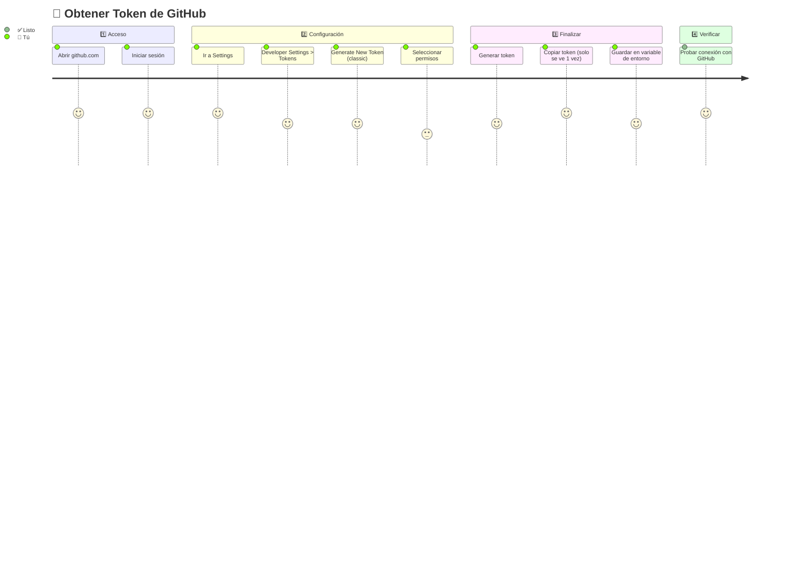

**Pasos detallados**:

1. Ve a: `https://github.com/settings/tokens`
2. Click en "Generate new token (classic)"
3. Dale un nombre: `FPUNA-OpenCode`
4. Selecciona permisos:
   - ✅ `repo` (todos los sub-checks)
   - ✅ `workflow`
5. Click "Generate token"
6. **COPIA EL TOKEN** (solo lo verás una vez)
   - Se verá así: `ghp_xxxxxxxxxxxxxxxxxxxx`

##### Guardar Token en tu Computadora

**Windows (PowerShell)**:
```powershell
[Environment]::SetEnvironmentVariable("GITHUB_TOKEN", "ghp_TU_TOKEN_AQUI", "User")
```

**Mac (Terminal)**:
```bash
echo 'export GITHUB_TOKEN="ghp_TU_TOKEN_AQUI"' >> ~/.zshrc
source ~/.zshrc
```

##### Configurar GitHub MCP

Instalar:
```bash
npm install -g @modelcontextprotocol/server-github
```

Actualizar `mcp-servers.json`:
```json
{
  "mcpServers": {
    "filesystem": { ... },
    "git": { ... },
    "github": {
      "command": "npx",
      "args": ["-y", "@modelcontextprotocol/server-github"],
      "env": {
        "GITHUB_TOKEN": "${GITHUB_TOKEN}"
      }
    }
  }
}
```

##### Uso

```bash
# Crear repositorio
opencode "Crea un repositorio llamado 'mi-proyecto-fpuna' en mi GitHub"

# Ver issues
opencode "Muéstrame los issues abiertos de mi repo"

# Crear issue
opencode "Crea un issue titulado 'Agregar tests' en mi-proyecto-fpuna"
```

---

## 📦 Parte 2: Skills - Recetas Pre-hechas (30 min)

### ¿Qué es un Skill?

**Skill** = Una "receta" o "plantilla" que automatiza una tarea común.

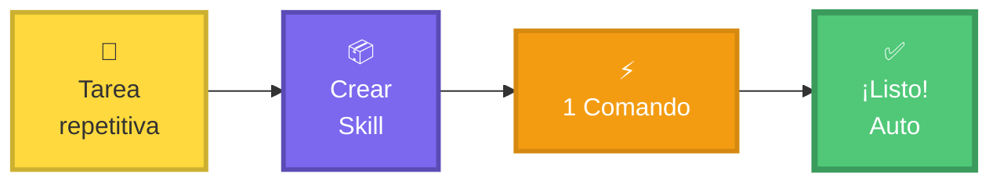

### Analogía: Recetas de Cocina

| Sin Skill | Con Skill |
|-----------|-----------|
| Cada vez cocinas, buscas ingredientes, mides, etc. | Tienes la receta escrita, solo la sigues |
| OpenCode pregunta cada detalle | Le dices "usa el skill X" y sabe qué hacer |
| Toma 10 minutos explicar qué quieres | Toma 10 segundos ejecutar el skill |

### Skills Útiles para FPUNA

#### Skill 1: Generar README

**¿Qué hace?**: Crea un archivo README.md profesional para tu proyecto.

**Instalar**:
```bash
opencode skill install generate-readme
```

**Usar**:
```bash
cd mi-proyecto
opencode skill use generate-readme
```

**OpenCode preguntará**:
- Nombre del proyecto
- Descripción
- Cómo instalarlo
- Cómo usarlo

**Y creará un README completo automáticamente.**

#### Skill 2: Crear Tests

**¿Qué hace?**: Genera tests automáticamente para tu código.

**Instalar**:
```bash
opencode skill install generate-unit-tests
```

**Usar**:
```bash
opencode skill use generate-unit-tests --file=calculadora.js
```

**Resultado**: Archivo `calculadora.test.js` con tests completos.

#### Skill 3: Setup de Proyecto Node.js

**¿Qué hace?**: Crea un proyecto Node.js completo con estructura profesional.

**Instalar**:
```bash
opencode skill install init-nodejs-project
```

**Usar**:
```bash
opencode skill use init-nodejs-project --name=mi-app-fpuna
```

**Crea**:
```
mi-app-fpuna/
├── package.json
├── README.md
├── .gitignore
├── src/
│   └── index.js
└── tests/
    └── index.test.js
```

### Crear Tu Propio Skill para FPUNA

**Caso de uso**: Todos tus archivos deben tener un encabezado con tu nombre y carnet.

#### Paso 1: Crear Carpeta del Skill

```bash
cd ~/.opencode/skills
mkdir fpuna-header
cd fpuna-header
```

#### Paso 2: Crear Archivo de Configuración

Crea `skill.yaml`:

```yaml
name: fpuna-header
description: Agrega encabezado FPUNA a archivos de código
version: 1.0.0
author: Estudiante FPUNA

inputs:
  - name: nombre
    description: Tu nombre completo
    required: true
  
  - name: carnet
    description: Tu número de carnet
    required: true
  
  - name: carrera
    description: Tu carrera
    required: true

template: |
  /**
   * ╔═══════════════════════════════════════════════════════════╗
   * ║   FACULTAD POLITÉCNICA - UNIVERSIDAD NACIONAL ASUNCIÓN   ║
   * ║   Curso: AI-Augmented Development - Verano 2026          ║
   * ╠═══════════════════════════════════════════════════════════╣
   * ║   Estudiante: {{ nombre }}                                ║
   * ║   Carnet: {{ carnet }}                                    ║
   * ║   Carrera: {{ carrera }}                                  ║
   * ║   Fecha: {{ fecha_actual }}                               ║
   * ╚═══════════════════════════════════════════════════════════╝
   */

steps:
  - prompt: |
      Agrega el siguiente encabezado al inicio de TODOS los archivos 
      .js, .py, .java, .cpp en el directorio actual:
      
      {{ template }}
      
      Reemplaza:
      - {{ nombre }} con: {{ inputs.nombre }}
      - {{ carnet }} con: {{ inputs.carnet }}
      - {{ carrera }} con: {{ inputs.carrera }}
      - {{ fecha_actual }} con la fecha de hoy
```

#### Paso 3: Usar Tu Skill

```bash
opencode skill use fpuna-header \
  --nombre="María González" \
  --carnet="2024001" \
  --carrera="Ingeniería Informática"
```

**Resultado**: Todos tus archivos de código tendrán el encabezado FPUNA.

---

## ⚡ Parte 3: Hooks - Automatización Mágica (25 min)

### ¿Qué son los Hooks?

**Hook** = Una acción que se ejecuta **automáticamente** cuando algo sucede.

```mermaid
sequenceDiagram
    autonumber
    participant U as 👤<br/>Tú
    participant OC as 🤖<br/>OpenCode
    participant Hook as ⚡<br/>Hook
    participant Action as 🔧<br/>Acción
    
    U->>+OC: 💬 "Genera código"
    OC->>OC: 🔨 Crear código
    OC-->>U: ✅ Código creado
    
    rect rgb(255, 217, 61, 0.1)
        Note over Hook: 👀 Detecta evento
        Hook->>+Action: ▶️ Ejecutar formateo
        Action->>Action: 🎨 Formatear código
        Action-->>-Hook: ✅ Completado
    end
    
    Hook-->>-U: 🎉 ¡Listo y formateado!
    
    Note over U,Action: ✨ Todo automático - sin intervención manual
```

### Analogía: Alarmas y Rutinas

| Vida Real | OpenCode con Hooks |
|-----------|-------------------|
| Alarma de las 6am → Preparar café | Después de generar código → Formatear |
| Salir de casa → Cerrar con llave | Antes de commit → Ejecutar tests |
| Llegar a casa → Encender luces | Después de instalar paquete → Actualizar docs |

### Hooks Comunes para Estudiantes

#### Configurar Hooks

Crear archivo `~/.opencode/hooks.yaml`:

```yaml
hooks:
  # Después de generar código
  post-generate:
    - name: format-code
      description: Formatear código con Prettier
      command: npx prettier --write .
      on_fail: warn
    
    - name: add-fpuna-header
      description: Agregar encabezado FPUNA
      command: opencode skill use fpuna-header --nombre="Tu Nombre" --carnet="Tu Carnet" --carrera="Tu Carrera"
      on_fail: warn

  # Antes de hacer commit
  pre-commit:
    - name: run-tests
      description: Ejecutar tests antes de commit
      command: npm test
      on_fail: abort  # Bloquear commit si fallan tests
    
    - name: lint-code
      description: Verificar estilo de código
      command: npm run lint
      on_fail: warn

  # Después de instalar paquetes
  post-install:
    - name: update-readme
      description: Actualizar lista de dependencias en README
      command: opencode "Actualiza la sección de dependencias en README.md"
      on_fail: warn
```

### Opciones de `on_fail`

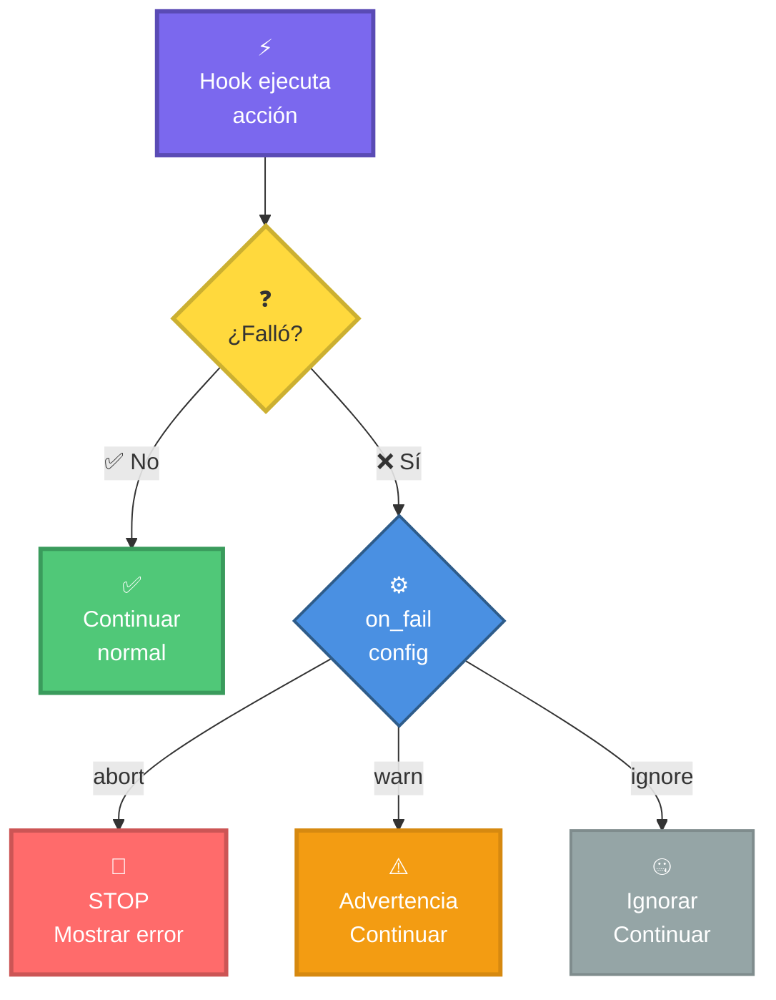

- **`abort`**: Detener TODO si falla (usa para tests críticos)
- **`warn`**: Mostrar advertencia pero continuar (usa para formateo)
- **`ignore`**: Ignorar completamente (rara vez uses esto)

### Ejemplo Práctico: Workflow Automático

**Escenario**: Creas un proyecto para FPUNA

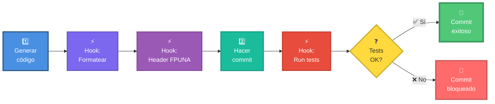

**Sin hooks**: Harías cada paso manualmente (6 comandos).  
**Con hooks**: Todo automático (1 comando).

---

## 📜 Parte 4: Rules - Tu Asistente Sigue Tus Reglas (20 min)

### ¿Qué son las Rules?

**Rules** = Reglas que OpenCode **siempre** sigue al generar código.

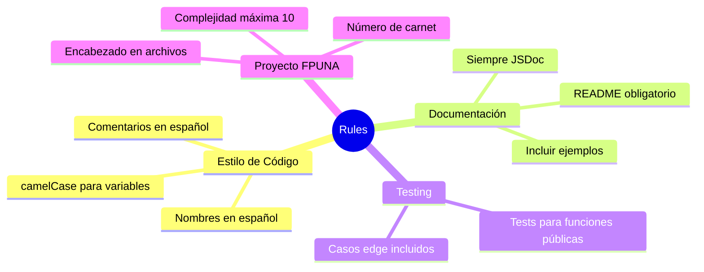

### Analogía: Reglas de una Empresa

Imagina trabajar en una empresa con reglas claras:

| Sin Rules | Con Rules |
|-----------|-----------|
| Cada desarrollador escribe diferente | Todos siguen el mismo estilo |
| Tienes que recordar las reglas | La IA las aplica automáticamente |
| Código inconsistente | Código uniforme y profesional |

### Configurar Rules para FPUNA

Crear `~/.opencode/rules.yaml`:

```yaml
rules:
  # ═══════════════════════════════════════════════
  # ESTILO DE CÓDIGO
  # ═══════════════════════════════════════════════
  code_style:
    javascript:
      - "Usar nombres de variables en español cuando sea apropiado"
      - "camelCase para variables y funciones"
      - "PascalCase para clases y componentes"
      - "Preferir const sobre let"
      - "Usar arrow functions para callbacks"
      - "Máximo 50 líneas por función"
      - "Incluir comentarios explicativos en español"
    
    python:
      - "Seguir PEP 8 estrictamente"
      - "Nombres de variables en español cuando sea claro"
      - "Type hints en todas las funciones"
      - "Docstrings en español con formato Google"
      - "Máximo 80 caracteres por línea"
    
    java:
      - "Seguir convenciones de Java estándar"
      - "Comentarios Javadoc en español"
      - "Nombres de paquetes en minúsculas"
      - "Constantes en MAYÚSCULAS_CON_GUIONES"

  # ═══════════════════════════════════════════════
  # DOCUMENTACIÓN
  # ═══════════════════════════════════════════════
  documentation:
    - "TODAS las funciones públicas deben tener documentación"
    - "Comentarios escritos en español"
    - "Incluir @param, @returns, @throws en JSDoc"
    - "README.md obligatorio en cada proyecto"
    - "Incluir nombre del estudiante y carnet en encabezados"
    - "Explicar el 'por qué', no solo el 'qué'"
    - "Ejemplos de uso en la documentación"

  # ═══════════════════════════════════════════════
  # TESTING
  # ═══════════════════════════════════════════════
  testing:
    - "Generar tests para TODAS las funciones públicas"
    - "Usar Jest para JavaScript/TypeScript"
    - "Usar pytest para Python"
    - "Usar JUnit para Java"
    - "Incluir casos edge y escenarios de error"
    - "Nombres de tests descriptivos en español"
    - "Organizar tests con describe/it (Jest) o def test_ (pytest)"
    - "Cobertura mínima 80%"

  # ═══════════════════════════════════════════════
  # MANEJO DE ERRORES
  # ═══════════════════════════════════════════════
  error_handling:
    - "Validar TODOS los inputs de funciones públicas"
    - "Nunca usar try-catch vacíos"
    - "Mensajes de error descriptivos en español"
    - "Logs útiles para debugging"
    - "Fallar rápido con errores claros"

  # ═══════════════════════════════════════════════
  # PROYECTO FPUNA
  # ═══════════════════════════════════════════════
  fpuna_standards:
    - "Incluir encabezado FPUNA en TODOS los archivos de código"
    - "Seguir estándares de código del curso"
    - "Complejidad ciclomática máxima: 10"
    - "No usar magic numbers - usar constantes con nombres"
    - "Código en inglés, comentarios en español"
    - "Git commits en español con mensajes descriptivos"

  # ═══════════════════════════════════════════════
  # SEGURIDAD
  # ═══════════════════════════════════════════════
  security:
    - "NUNCA hardcodear contraseñas o API keys"
    - "Validar y sanitizar TODOS los inputs de usuario"
    - "Usar variables de entorno para configuración sensible"
    - "No guardar información sensible en Git"
```

### Cómo Funcionan las Rules

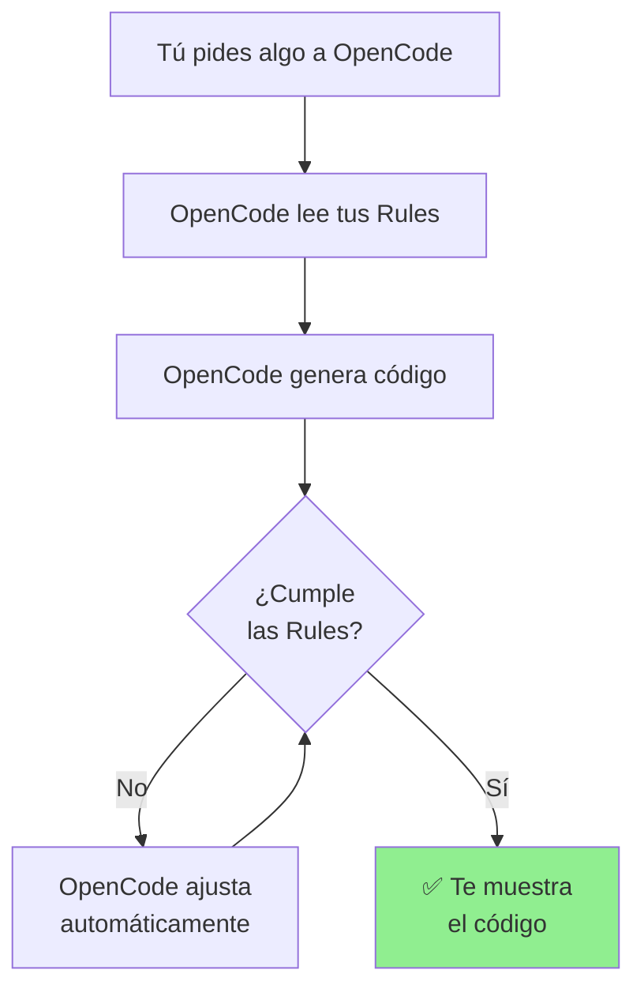

### Ejemplo: Ver Rules en Acción

**Sin Rules**:
```bash
opencode "Crea una función que sume dos números"
```

**Podría generar**:
```javascript
function sum(x, y) {
  return x + y;
}
```

**Con Rules configuradas**, genera:
```javascript
/**
 * ╔═══════════════════════════════════════════════════════════╗
 * ║   FACULTAD POLITÉCNICA - UNIVERSIDAD NACIONAL ASUNCIÓN   ║
 * ║   Estudiante: María González                              ║
 * ║   Carnet: 2024001                                         ║
 * ╚═══════════════════════════════════════════════════════════╝
 */

/**
 * Suma dos números y retorna el resultado
 * 
 * @param {number} primerNumero - El primer número a sumar
 * @param {number} segundoNumero - El segundo número a sumar
 * @returns {number} La suma de ambos números
 * @throws {TypeError} Si alguno de los parámetros no es un número
 * @example
 * sumar(5, 3); // Retorna 8
 * sumar(-2, 7); // Retorna 5
 */
const sumar = (primerNumero, segundoNumero) => {
  // Validar que ambos parámetros sean números
  if (typeof primerNumero !== 'number' || typeof segundoNumero !== 'number') {
    throw new TypeError('Ambos parámetros deben ser números válidos');
  }
  
  // Validar que no sean NaN
  if (isNaN(primerNumero) || isNaN(segundoNumero)) {
    throw new TypeError('Los parámetros no pueden ser NaN');
  }
  
  return primerNumero + segundoNumero;
};

module.exports = { sumar };
```

**¡Mira la diferencia!** Todo automático:
- ✅ Encabezado FPUNA
- ✅ JSDoc completo en español
- ✅ Validación de inputs
- ✅ Ejemplos de uso
- ✅ Manejo de errores
- ✅ Arrow function
- ✅ Nombres descriptivos en español

---

## 🎯 Parte 5: Integración Completa (10 min)

### Todo Junto: Tu Setup Profesional

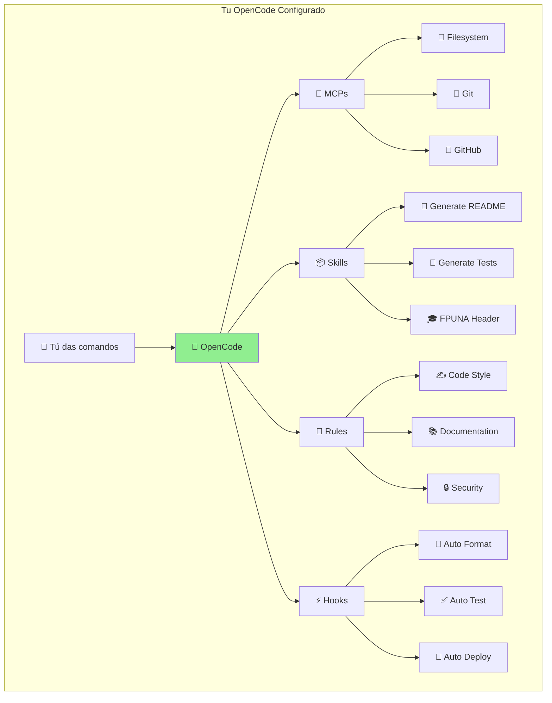

### Archivo de Configuración Completo para Estudiante FPUNA

#### Paso 1: MCP Configuration

`~/.opencode/mcp-servers.json`:
```json
{
  "mcpServers": {
    "filesystem": {
      "command": "npx",
      "args": [
        "-y",
        "@modelcontextprotocol/server-filesystem",
        "C:\\Users\\TuNombre\\FPUNA-Proyectos"
      ]
    },
    "git": {
      "command": "npx",
      "args": ["-y", "@modelcontextprotocol/server-git"]
    },
    "github": {
      "command": "npx",
      "args": ["-y", "@modelcontextprotocol/server-github"],
      "env": {
        "GITHUB_TOKEN": "${GITHUB_TOKEN}"
      }
    }
  }
}
```

#### Paso 2: Hooks Configuration

`~/.opencode/hooks.yaml`:
```yaml
hooks:
  post-generate:
    - name: format-code
      command: npx prettier --write .
      on_fail: warn
    
    - name: add-header
      command: opencode skill use fpuna-header
      on_fail: warn

  pre-commit:
    - name: run-tests
      command: npm test
      on_fail: warn
    
    - name: lint
      command: npm run lint
      on_fail: warn
```

#### Paso 3: Rules Configuration

`~/.opencode/rules.yaml` (usa el ejemplo completo de arriba)

### Probar Setup Completo

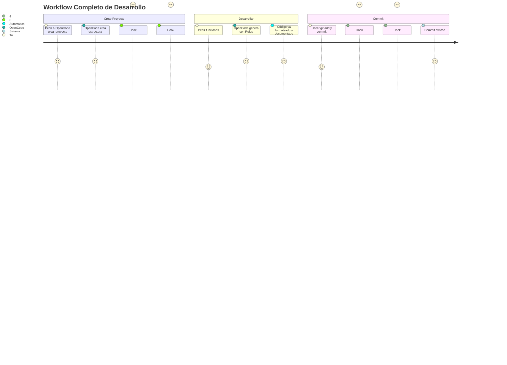

**Comando de prueba completo**:

```bash
# 1. Crear carpeta de proyecto
mkdir test-config-completo
cd test-config-completo
npm init -y

# 2. Pedir a OpenCode que cree una aplicación
opencode "Crea una clase Calculadora con:
- Métodos: sumar, restar, multiplicar, dividir
- Validación completa de inputs
- Tests con Jest
- README en español con ejemplos
- Manejo de errores apropiado"

# 3. Observar la magia:
# - OpenCode crea archivos ✅
# - Hook formatea código automáticamente ✅
# - Rules aplicadas (JSDoc, validación, etc.) ✅
# - Encabezado FPUNA agregado ✅

# 4. Verificar que funciona
npm test

# 5. Hacer commit
git init
git add .
git commit -m "Proyecto inicial con OpenCode configurado"

# - Hook ejecuta tests antes de commit ✅
# - Si tests pasan, commit se completa ✅
```

---

## ✅ Verificación Final

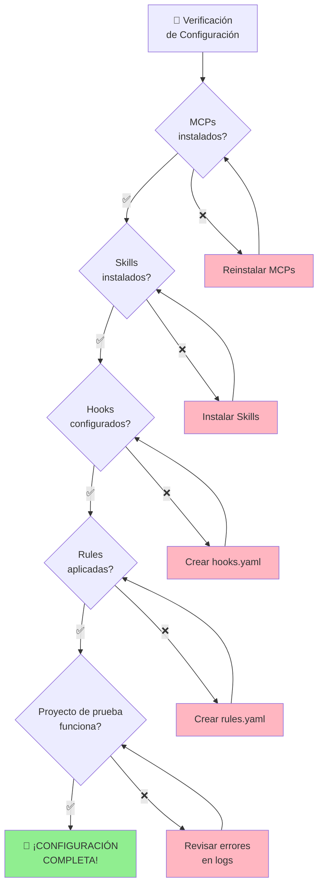

### Checklist de Verificación

Marca cada uno:

#### MCPs
- [ ] ✅ Filesystem MCP instalado
- [ ] ✅ Git MCP instalado
- [ ] ✅ GitHub MCP instalado (opcional)
- [ ] ✅ `mcp-servers.json` configurado correctamente
- [ ] ✅ OpenCode puede leer/escribir archivos

#### Skills
- [ ] ✅ Al menos 3 skills instalados
- [ ] ✅ Skill `fpuna-header` creado y funcional
- [ ] ✅ Puedo ejecutar skills con `opencode skill use`

#### Hooks
- [ ] ✅ `hooks.yaml` creado
- [ ] ✅ Hook `post-generate` configurado
- [ ] ✅ Hook `pre-commit` configurado
- [ ] ✅ Hooks se ejecutan automáticamente

#### Rules
- [ ] ✅ `rules.yaml` creado
- [ ] ✅ Rules de estilo configuradas
- [ ] ✅ Rules de documentación configuradas
- [ ] ✅ Rules FPUNA configuradas
- [ ] ✅ OpenCode aplica rules automáticamente

#### Integración
- [ ] ✅ Creé proyecto de prueba exitosamente
- [ ] ✅ Código generado tiene encabezado FPUNA
- [ ] ✅ Código está bien documentado
- [ ] ✅ Tests se ejecutan correctamente
- [ ] ✅ Git commit funciona con hooks

---

## 🆘 Solución de Problemas

### Problema 1: "MCP not found"

**Síntomas**: OpenCode dice que no encuentra un MCP.

**Solución**:
```bash
# 1. Verificar instalación
npm list -g @modelcontextprotocol/server-filesystem

# 2. Si no está instalado
npm install -g @modelcontextprotocol/server-filesystem

# 3. Verificar sintaxis de JSON
# Usa https://jsonlint.com para validar tu mcp-servers.json

# 4. Reiniciar OpenCode
opencode restart
```

### Problema 2: "Hooks not executing"

**Solución**:
```bash
# 1. Verificar sintaxis YAML
# Usa https://www.yamllint.com

# 2. Ver logs de hooks
cat ~/.opencode/logs/hooks.log

# 3. Verificar permisos de ejecución (Mac/Linux)
chmod +x ~/.opencode/hooks.yaml

# 4. Ejecutar hook manualmente para debug
npx prettier --write .
```

### Problema 3: "Rules not being followed"

**Importante**: Las Rules son **sugerencias**, no garantías al 100%.

**Solución**:
1. Hacer las rules más específicas
2. Incluir ejemplos en las rules
3. Repetir la regla en el prompt si es crítica

**Ejemplo**:
```bash
# En lugar de solo confiar en rules
opencode "Crea función de suma"

# Ser específico en el prompt
opencode "Crea función de suma siguiendo EXACTAMENTE las reglas FPUNA:
- Encabezado con mi nombre
- JSDoc completo en español  
- Validación de inputs
- Ejemplos de uso"
```

### Problema 4: "GitHub token inválido"

**Solución**:
```bash
# 1. Generar nuevo token en GitHub
# https://github.com/settings/tokens

# 2. Actualizar variable de entorno
# Windows:
[Environment]::SetEnvironmentVariable("GITHUB_TOKEN", "ghp_NUEVO_TOKEN", "User")

# Mac:
echo 'export GITHUB_TOKEN="ghp_NUEVO_TOKEN"' >> ~/.zshrc
source ~/.zshrc

# 3. Reiniciar terminal
# 4. Verificar
echo $env:GITHUB_TOKEN  # Windows
echo $GITHUB_TOKEN       # Mac
```

---

## 📚 Recursos Adicionales

### Documentación Completa

Para profundizar:

- 📖 [Guía Completa de MCPs](../../COMPARTIDO/mcp-configuration/README.md)
- 📖 [Encontrar Más MCPs](../../COMPARTIDO/mcp-configuration/finding-mcps.md)
- 📖 [Configurar MCPs Avanzados](../../COMPARTIDO/mcp-configuration/advanced-config.md)
- 📖 [Sistema de Skills](../../COMPARTIDO/skills-system/README.md)
- 📖 [Crear Skills Personalizados](../../COMPARTIDO/skills-system/creating-skills.md)
- 📖 [Hooks y Rules](../../COMPARTIDO/hooks-rules/README.md)
- 📖 [Ejemplos de Configuración](../../COMPARTIDO/components/configuration-examples.md)

### Videos y Tutoriales

- 🎥 Configurar MCPs paso a paso
- 🎥 Crear tu primer Skill
- 🎥 Hooks para automatización
- 🎥 Rules para código consistente

### Soporte

**¿Necesitas ayuda?**

- 💬 **Slack**: #fpuna-core-foundation
- 📧 **Email**: soporte-core@fpuna.edu.py
- 🕐 **Horario de consulta**: Lunes-Viernes 14:00-16:00
- 👥 **Asistentes**: Disponibles durante clase

---

## 📝 Quiz de Evaluación

### Instrucciones
- **Total**: 10 preguntas
- **Tiempo estimado**: 20 minutos
- **Aprobación**: 7/10 o más
- **Tipo**: Opción múltiple, verdadero/falso, respuesta corta

---

### Preguntas

**1. ¿Cuáles son los 4 pilares de configuración de OpenCode?**
a) Instalación, Configuración, Uso, Desinstalación  
b) MCPs, Skills, Hooks, Rules  
c) GitHub, GitLab, Bitbucket, Azure  
d) Node, Python, Ruby, Go  

**2. ¿Qué son los MCPs (Model Context Protocol)?**
a) Errores de programación  
b) Conexiones que permiten a OpenCode hablar con otras herramientas (Git, archivos, etc.)  
c) Lenguajes de programación  
d) Comandos de terminal  

**3. Verdadero o Falso: Los Skills son plantillas pre-hechas para tareas comunes.**

**4. ¿Dónde se guardan las configuraciones de OpenCode?**
a) En `C:\Windows\System32\`  
b) En la carpeta `~/.opencode/`  
c) En Google Drive  
d) En la nube de Anthropic  

**5. ¿Qué hace un Hook de tipo "PreToolUse"?**
a) Se ejecuta ANTES de que la IA use una herramienta  
b) Se ejecuta DESPUÉS de usar una herramienta  
c) Instala herramientas nuevas  
d) Elimina archivos  

**6. Explica en 2-3 oraciones la diferencia entre un Skill y un MCP.**

**7. ¿Cuál archivo contiene las reglas automáticas de comportamiento?**
a) `config.json`  
b) `mcp-servers.json`  
c) `rules.yaml`  
d) `package.json`  

**8. Verdadero o Falso: Las Rules pueden aplicarse solo a archivos específicos usando patrones como "**/*.py".**

**9. Si tu MCP de Git no funciona, ¿cuál es el PRIMER lugar donde verificar?**
a) Reinstalar Windows  
b) Verificar el archivo `mcp-servers.json` y que Git esté instalado  
c) Llamar a soporte técnico de Microsoft  
d) Borrar todo y empezar de nuevo  

**10. Menciona 2 ejemplos de tareas que podrías automatizar usando Hooks (respuesta abierta).**

---

### Respuestas

**1. b) MCPs, Skills, Hooks, Rules**

Los 4 pilares de configuración son: MCPs (conexiones externas), Skills (plantillas), Hooks (automatización), y Rules (reglas de comportamiento). Es la base del diagrama de la "cafetería".

---

**2. b) Conexiones que permiten a OpenCode hablar con otras herramientas (Git, archivos, etc.)**

MCPs (Model Context Protocol) son como "enchufes" que conectan OpenCode con otras aplicaciones: Git para código, sistemas de archivos, bases de datos, etc. Permiten que la IA interactúe con el mundo exterior.

---

**3. Verdadero**

Skills son exactamente eso: plantillas o "recetas" pre-hechas para tareas comunes (crear APIs, tests, documentación, etc.). Se instalan en `~/.opencode/skills/` y se invocan con comandos slash.

---

**4. b) En la carpeta `~/.opencode/`**

Todas las configuraciones de OpenCode viven en `~/.opencode/` (en Windows: `C:\Users\TuUsuario\.opencode\`). Ahí están `config.json`, `mcp-servers.json`, `skills/`, `hooks.yaml`, y `rules.yaml`.

---

**5. a) Se ejecuta ANTES de que la IA use una herramienta**

Un Hook de tipo "PreToolUse" es un evento que se dispara ANTES de que OpenCode ejecute una herramienta. Por ejemplo, puede verificar permisos antes de editar archivos sensibles.

---

**6. Respuesta Modelo:**

"Un Skill es una plantilla pre-hecha para generar código o proyectos completos (como recetas). Un MCP es una conexión que permite a OpenCode interactuar con herramientas externas (como Git o bases de datos). Skills generan contenido, MCPs habilitan conexiones."

**Criterios**:
- Diferencia Skills = plantillas/generación (0.5 puntos)
- Diferencia MCPs = conexiones/interacción (0.5 puntos)
- Claridad en la explicación (0.5 puntos)

**Puntaje**: 1.5/1.5

---

**7. c) `rules.yaml`**

El archivo `rules.yaml` contiene las reglas automáticas de comportamiento que OpenCode aplica según el contexto (tipo de archivo, ubicación, etc.).

---

**8. Verdadero**

Las Rules pueden usar patrones glob como `**/*.py` (todos los archivos Python), `src/**/*.ts` (TypeScript en src), etc. Esto permite aplicar reglas solo a archivos específicos.

---

**9. b) Verificar el archivo `mcp-servers.json` y que Git esté instalado**

Cuando un MCP no funciona, primero verifica: (1) que el MCP esté correctamente configurado en `mcp-servers.json`, (2) que la herramienta externa (Git) esté instalada y accesible desde terminal. Luego reinicia OpenCode.

---

**10. Respuesta Modelo (ejemplos válidos):**

- "Agregar automáticamente encabezados con copyright a nuevos archivos y formatear código antes de commits"
- "Ejecutar tests automáticamente después de crear funciones nuevas y generar documentación"
- "Validar que no haya secretos en el código antes de guardar y mantener un log de cambios"

**Criterios**:
- Menciona 2 automatizaciones distintas (1 punto)
- Son realistas y útiles (1 punto)

**Puntaje**: 2/2

---

### Criterios de Evaluación

| Rango | Calificación | Interpretación |
|-------|--------------|----------------|
| 9-10 | Excelente | Configuración dominada, listo para workflows avanzados |
| 7-8 | Bueno | Comprensión sólida de los 4 pilares |
| 5-6 | Suficiente | Revisar MCPs y Hooks |
| 0-4 | Insuficiente | Repasar todo el módulo con ejercicios prácticos |

**Notas**: Preguntas 6 y 10 valen 1.5 y 2 puntos respectivamente. Total: 10 puntos exactos.

---

## 🎯 Próximos Pasos

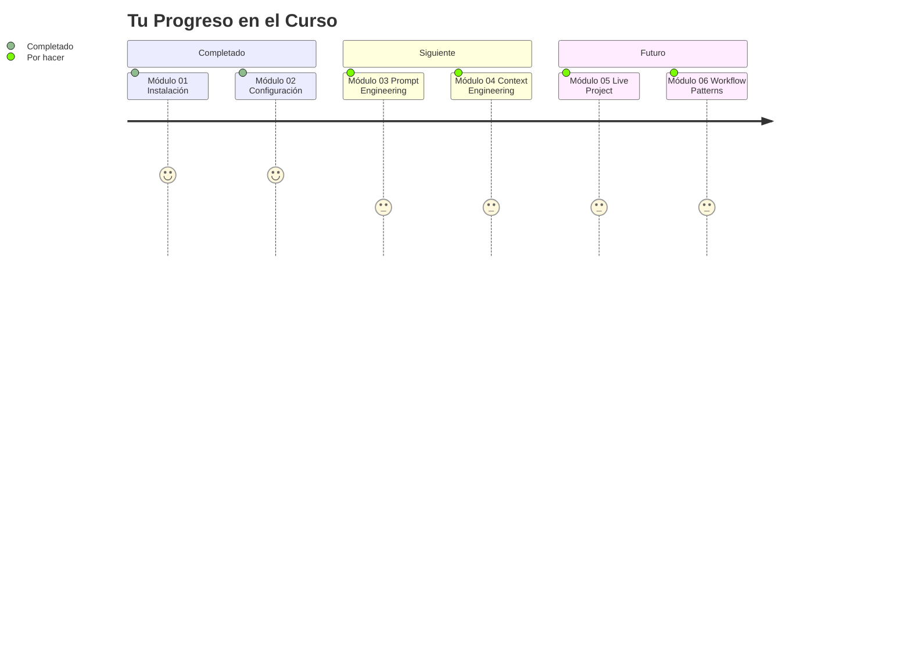

**Ahora que dominaste la configuración**:

1. 📝 **Practica**: Crea un proyecto personal con tu configuración
2. 📖 **Continúa**: [Módulo 03 - Ingeniería de Prompts](./03-prompt-engineering.md)
3. 🤝 **Comparte**: Muestra tu configuración a compañeros
4. ❓ **Pregunta**: Si algo no quedó claro, ¡usa Slack!

### Ejercicio Recomendado

**Antes del Módulo 03**, practica esto:

```bash
# Crear un proyecto que use TODA tu configuración
opencode "Crea un proyecto llamado 'conversor-guaranies' que:
- Convierta USD, EUR, BRL a Guaraníes
- Tenga funciones para cada conversión
- Incluya tests completos
- Tenga README en español
- Use tipos de cambio actuales (aproximados)
- Valide inputs correctamente"

# Observa cómo todo funciona automáticamente:
# - Código formateado ✅
# - Encabezado FPUNA ✅
# - Documentación completa ✅
# - Tests incluidos ✅
```

---

## 🎉 ¡Felicitaciones!

Has completado el Módulo 02. Ahora tu OpenCode está configurado como un **profesional**.

### Lo Que Lograste

✅ **MCPs instalados** - Tu IA puede hablar con otras herramientas  
✅ **Skills configurados** - Tienes recetas listas para usar  
✅ **Hooks funcionando** - Automatización mágica  
✅ **Rules aplicadas** - Código consistente automáticamente  
✅ **Setup profesional** - Listo para proyectos reales

### El Poder que Ahora Tienes

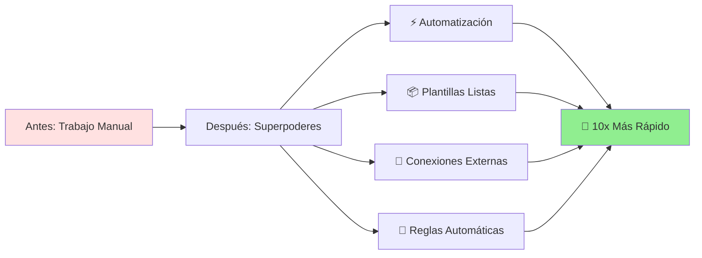

**No estás usando IA como el resto.** Tienes un setup **profesional y personalizado** que pocos conocen.

---

## 💭 Reflexión

Antes de continuar, piensa:

1. **¿Qué configuración te pareció más útil?**
2. **¿Qué automatizarías en tus proyectos?**
3. **¿Qué reglas agregarías para tu carrera específica?**

**Comparte en Slack** - ayuda a otros y aprende de sus configuraciones.

---

**⏭️ Siguiente**: [Módulo 03 - Ingeniería de Prompts](./03-prompt-engineering.md)

---

*Módulo creado para FPUNA Verano 2026*  
*Actualizado: Enero 2026*  
*Versión: 2.0 - Configuración profesional accesible para todos*
