# 💬 Módulo 03: Ingeniería de Prompts

## El Arte de Hablar con tu Asistente de IA

> **Para Todos**: Este módulo te enseña a "hablar" con OpenCode de forma que entienda EXACTAMENTE lo que necesitas. Es como aprender a dar instrucciones claras a un empleado muy capaz - mientras mejor te expreses, mejores resultados obtendrás.

**⏱️ Duración**: 1.5 horas  
**👤 Nivel**: Principiante (con Módulos 01 y 02 completados)  
**🎯 Objetivo**: Dominar el arte de escribir prompts efectivos

---

## 🎓 ¿Qué Vas a Lograr?

Al terminar este módulo, tendrás:

1. ✅ **Anatomía de prompts** - Entender qué hace que un prompt sea efectivo
2. ✅ **Técnicas avanzadas** - Chain of Thought, Few-Shot, Role Prompting
3. ✅ **Biblioteca personal** - 10+ prompts reutilizables listos para usar
4. ✅ **Debugging de prompts** - Saber cómo mejorar prompts que no funcionan
5. ✅ **Confianza** - Comunicarte con IA como un profesional

---

## 📋 Prerrequisitos

### Conocimientos Requeridos

✅ **Módulos Anteriores Completados** (OBLIGATORIO)
- Módulo 01: OpenCode instalado
- Módulo 02: Configuración básica (MCPs, Skills)

✅ **Experiencia Básica**
- Haber usado OpenCode al menos 5-10 veces
- Haber creado al menos 1 proyecto con OpenCode

❌ **NO Se Requiere**
- Programación avanzada
- Conocimiento de lingüística
- Experiencia previa con IA

### Checklist de Preparación

- [ ] Módulos 01 y 02 completados
- [ ] He usado OpenCode varias veces
- [ ] Tengo ejemplos de prompts que funcionaron/no funcionaron
- [ ] Tengo 1.5 horas dedicadas

**Si todo ✅**: ¡Adelante!  
**Si falta algo**: Completa módulos anteriores y practica un poco más.

---

## 🤔 ¿Qué es Ingeniería de Prompts?

### Analogía: Dar Instrucciones

Imagina que contratas a alguien muy inteligente pero que no conoce tu contexto:

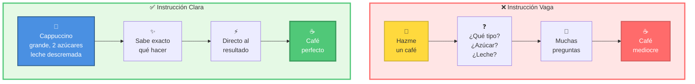

**Prompt Engineering** = Aprender a dar instrucciones claras a OpenCode

---

## 📊 Los Niveles de Claridad

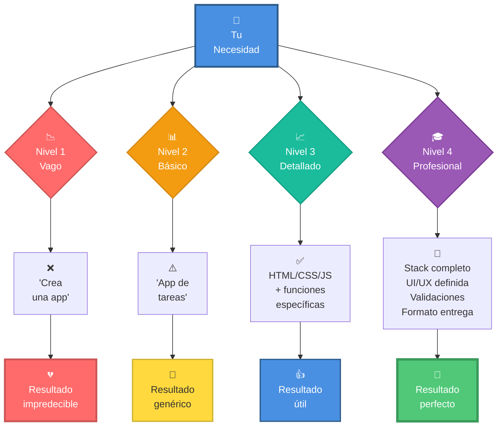

---

## 🧩 Parte 1: Anatomía de un Prompt Perfecto (20 min)

### Los 5 Componentes Esenciales

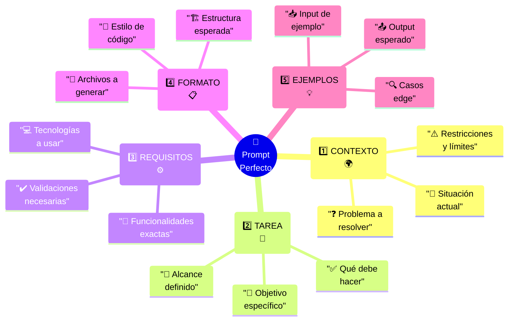

### Plantilla Universal

```bash
opencode "[CONTEXTO] + [TAREA] + [REQUISITOS] + [FORMATO] + [RESTRICCIONES]"
```

### Ejemplo Completo: De Malo a Excelente

#### ❌ Nivel 1: Terrible (No uses esto)

```bash
opencode "Crea una app"
```

**Problemas**:
- No sabe qué tipo de app
- No sabe con qué tecnologías
- No sabe qué debe hacer
- Resultado: Algo genérico que probablemente no sirva

#### ⚠️ Nivel 2: Malo (Mejora un poco)

```bash
opencode "Crea una app de tareas"
```

**Problemas**:
- Sabe el tipo pero no las funcionalidades
- No sabe el stack tecnológico
- No sabe requisitos específicos
- Resultado: Algo básico pero incompleto

#### ✅ Nivel 3: Bueno (Empieza a ser útil)

```bash
opencode "Crea una aplicación web de lista de tareas con HTML, CSS y JavaScript. 
Debe permitir agregar tareas, marcarlas como completadas y eliminarlas."
```

**Mejor porque**:
- Define tecnologías
- Lista funcionalidades básicas
- Resultado: Algo funcional pero sin refinamiento

#### 🌟 Nivel 4: Excelente (Profesional)

```bash
opencode "Crea una aplicación web de gestión de tareas para estudiantes de FPUNA.

═══════════════════════════════════════════════════════════
CONTEXTO:
═══════════════════════════════════════════════════════════
- Los estudiantes necesitan organizar sus trabajos del curso
- Debe ser simple, rápida y funcionar sin internet (después de cargar)
- Uso en computadoras de laboratorios (sin instalar nada)

═══════════════════════════════════════════════════════════
TECNOLOGÍAS REQUERIDAS:
═══════════════════════════════════════════════════════════
- HTML5 semántico
- CSS3 con Flexbox/Grid (NO frameworks)
- JavaScript vanilla (sin jQuery, React, etc.)
- LocalStorage para persistencia de datos

═══════════════════════════════════════════════════════════
FUNCIONALIDADES:
═══════════════════════════════════════════════════════════
1. Agregar tarea:
   - Título (máx 50 caracteres)
   - Descripción (máx 200 caracteres)
   - Fecha de entrega
   - Prioridad (Alta/Media/Baja)

2. Visualizar tareas:
   - Lista ordenada por fecha de entrega
   - Colores por prioridad (Rojo/Amarillo/Verde)
   - Contador de tareas pendientes

3. Marcar como completada:
   - Checkbox visual
   - Tachado del texto
   - Mover al final de la lista

4. Eliminar tarea:
   - Botón de eliminar con confirmación
   - Animación al eliminar

5. Filtros:
   - Todas / Pendientes / Completadas
   - Por prioridad

═══════════════════════════════════════════════════════════
REQUISITOS DE INTERFAZ:
═══════════════════════════════════════════════════════════
- Responsive (funciona en móvil y desktop)
- Colores institucionales FPUNA (azul #003D7A, blanco)
- Fuente legible (mínimo 14px)
- Feedback visual en todas las acciones
- Animaciones suaves (300ms)
- Estados hover en botones

═══════════════════════════════════════════════════════════
VALIDACIONES:
═══════════════════════════════════════════════════════════
- No permitir tareas sin título
- No permitir fechas pasadas
- Mostrar mensajes de error claros en español
- Confirmar antes de eliminar

═══════════════════════════════════════════════════════════
ESTRUCTURA DE ARCHIVOS:
═══════════════════════════════════════════════════════════
- index.html (estructura)
- styles.css (estilos organizados por secciones)
- app.js (lógica con comentarios explicativos)
- README.md (instrucciones de uso en español)

═══════════════════════════════════════════════════════════
CÓDIGO:
═══════════════════════════════════════════════════════════
- Comentarios en español explicando lógica compleja
- Nombres de variables descriptivos en español
- Funciones pequeñas y enfocadas (máx 30 líneas)
- Incluir encabezado FPUNA en archivos JS

═══════════════════════════════════════════════════════════
ENTREGABLES:
═══════════════════════════════════════════════════════════
1. Todos los archivos mencionados
2. README con:
   - Descripción del proyecto
   - Cómo abrir (doble click en index.html)
   - Cómo usar cada funcionalidad
   - Screenshots (describe dónde tomarlos)"
```

**Resultado**: Código profesional, exactamente lo que necesitas.

---

## 🎯 Parte 2: Los 7 Principios del Prompt Perfecto (30 min)

### Principio 1: Especificidad Mata Ambigüedad

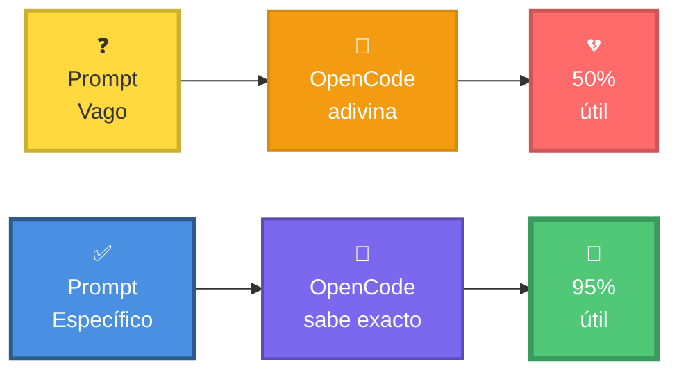

**Ejemplos**:

❌ **Vago**: "Valida un email"

✅ **Específico**:
```bash
"Crea función validateEmail(email) que:
- Valide formato usando regex estricto (user@domain.com)
- Retorne objeto {valid: boolean, reason: string}
- Razones de invalidez en español: 'falta @', 'dominio inválido', etc.
- Casos a validar:
  * email@ejemplo.com ✅
  * email.con.puntos@ejemplo.com.py ✅
  * email@ejemplo ❌
  * @ejemplo.com ❌
  * email@ejemplo..com ❌
- Incluir tests con Jest (10+ casos)"
```

### Principio 2: Contexto es Rey

**Analogía**: Es como explicar un chiste - sin contexto, no se entiende.

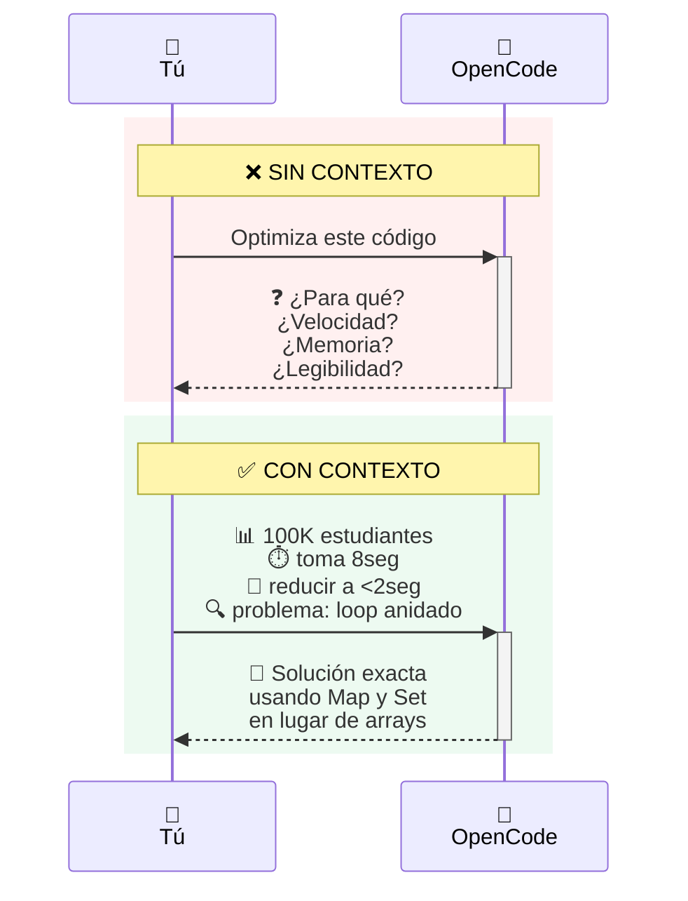

**Ejemplo**:

❌ **Sin contexto**: "Mejora esta función"

✅ **Con contexto**:
```bash
"Esta función calcula promedios de 50,000 estudiantes y toma 5 segundos.
Los usuarios se quejan de lentitud.

CONTEXTO TÉCNICO:
- Datos en array de objetos
- Se ejecuta cada vez que el usuario cambia filtros
- El navegador se congela durante la ejecución

RESTRICCIONES:
- No puedo cambiar estructura de datos (viene de API)
- No puedo usar Web Workers (política de empresa)
- Debe mantener precisión de decimales

OBJETIVO:
Reducir tiempo a <500ms sin perder funcionalidad.

Código actual:
[pega código]"
```

### Principio 3: Ejemplos Valen Más que Palabras

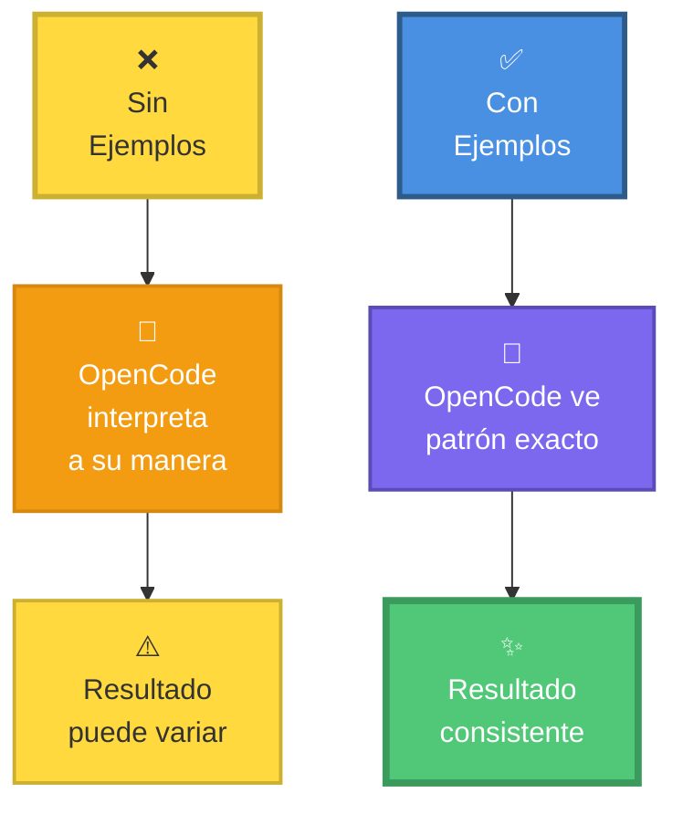

**Ejemplo**:

❌ **Sin ejemplos**: "Transforma estos datos"

✅ **Con ejemplos**:
```bash
"Transforma array de estudiantes a objeto indexado por carnet.

EJEMPLO DE TRANSFORMACIÓN:

Input:
[
  {carnet: '2024001', nombre: 'Juan Pérez', nota: 85},
  {carnet: '2024002', nombre: 'María López', nota: 92}
]

Output ESPERADO:
{
  '2024001': {
    nombre: 'Juan Pérez',
    nota: 85,
    estado: 'aprobado'  // aprobado si nota >= 60
  },
  '2024002': {
    nombre: 'María López',
    nota: 92,
    estado: 'aprobado'
  }
}

Aplica misma lógica a este array:
[pega tus datos reales]"
```

### Principio 4: Restricciones Claras = Código Limpio

```mermaid
mindmap
  root(("🔒<br/>Restricciones<br/>Importantes"))
    ("⚙️ Técnicas")
      "🚫 Sin librerías<br/>externas"
      "📏 Máximo X<br/>líneas"
      "📊 Complejidad<br/>O(n log n)"
    ("🎨 Estilo")
      "🌐 Nombres en<br/>español"
      "💬 Comentarios<br/>obligatorios"
      "📝 JSDoc<br/>completo"
    ("🔧 Funcionales")
      "🔐 Sin modificar<br/>entrada"
      "🔀 Thread<br/>safe"
      "⚠️ Manejo de<br/>errores"
    ("💼 Negocio")
      "🌍 Solo datos<br/>públicos"
      "⚖️ Cumplir<br/>regulaciones"
      "⚡ Performance<br/><1s"
```

**Ejemplo**:

```bash
"Crea función de búsqueda binaria con ESTAS RESTRICCIONES ESTRICTAS:

TÉCNICAS:
- Máximo 40 líneas de código
- Complejidad O(log n) garantizada
- Sin usar librerías (solo JavaScript nativo)
- Sin modificar array original

ESTILO:
- Nombres de variables en español descriptivo
- Comentarios explicando algoritmo
- JSDoc completo

FUNCIONALIDAD:
- Manejar array vacío → retornar null
- Manejar valor no encontrado → retornar null
- Manejar valores duplicados → retornar primer índice
- Array debe estar ordenado (validar esto primero)

VALIDACIÓN:
- Lanzar Error si array no está ordenado
- Lanzar TypeError si no es array

PRUEBAS:
- Incluir tests para todos los casos mencionados"
```

### Principio 5: Formato de Salida Específico

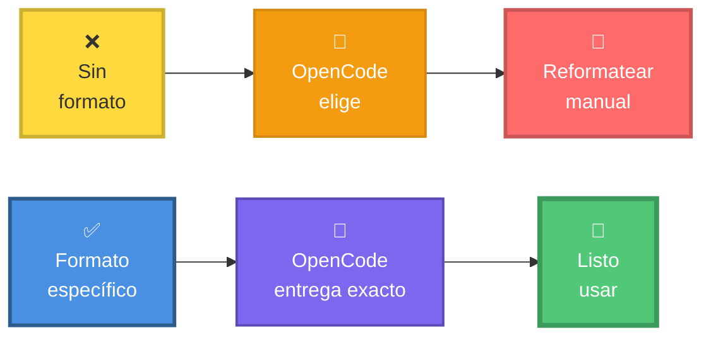

**Ejemplo**:

```bash
"Genera reporte de ventas mensuales siguiendo EXACTAMENTE este formato:

╔════════════════════════════════════════════════════════╗
║           REPORTE DE VENTAS - [MES] [AÑO]             ║
╠════════════════════════════════════════════════════════╣
║  Total Vendido: ₲ [monto con separadores de miles]    ║
║  Productos Vendidos: [cantidad]                        ║
║  Mejor Producto: [nombre] (₲[monto])                   ║
║  Peor Producto: [nombre] (₲[monto])                    ║
╠════════════════════════════════════════════════════════╣
║  DETALLE POR PRODUCTO                                  ║
╠════════════════════════════════════════════════════════╣
║  1. [Producto]: ₲[monto] ([cantidad] unidades)         ║
║  2. [Producto]: ₲[monto] ([cantidad] unidades)         ║
║  ...                                                   ║
╚════════════════════════════════════════════════════════╝

IMPORTANTE:
- Usar guaraníes (₲) para montos
- Separadores de miles con puntos (ej: ₲1.500.000)
- Ordenar productos de mayor a menor venta
- Formato de tabla con caracteres especiales exactos
- Mes en español (Enero, Febrero, etc.)

Datos a procesar:
[pega datos]"
```

### Principio 6: División de Tareas Complejas

**Analogía**: Como comer un elefante - un bocado a la vez.

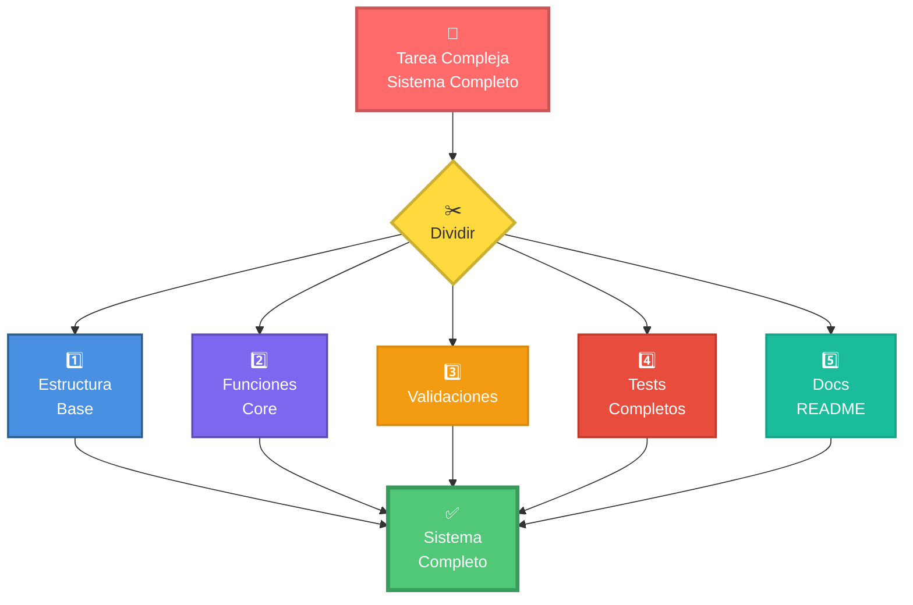

**Ejemplo - Mal enfoque**:

```bash
# ❌ Un prompt gigante pidiendo TODO a la vez
opencode "Crea un sistema completo de gestión de estudiantes con backend API REST, 
frontend React, base de datos, autenticación, tests, documentación..."
# Resultado: Overwhelmed, código incompleto o genérico
```

**Ejemplo - Buen enfoque**:

```bash
# ✅ Paso 1: Base
opencode "Crea modelo de datos para Student con:
- id, nombre, carnet, carrera, email
- Validación de cada campo
- Método toJSON()"

# ✅ Paso 2: API
opencode "Crea API REST con Express para el modelo Student anterior.
Endpoints básicos: GET, POST, PUT, DELETE"

# ✅ Paso 3: Validaciones
opencode "Agrega validación con Joi a todos los endpoints.
Errores en español con códigos HTTP correctos"

# ✅ Paso 4: Tests
opencode "Genera tests con Supertest para todos los endpoints.
Coverage mínimo 85%"

# ✅ Paso 5: Docs
opencode "Genera documentación Swagger para la API"
```

### Principio 7: Iteración y Refinamiento

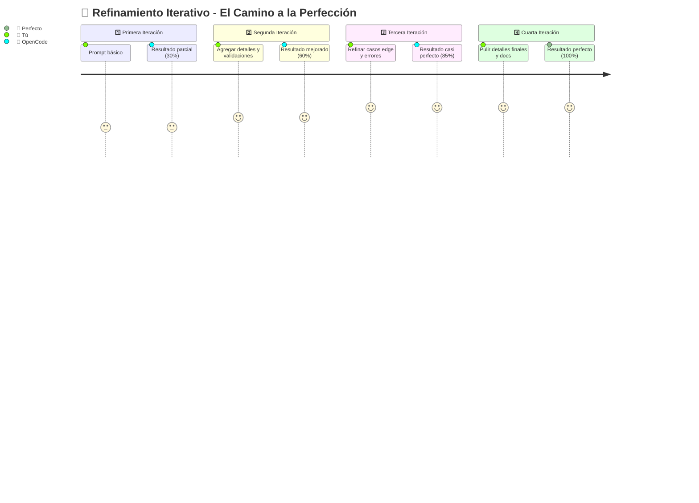

**Ejemplo práctico**:

```bash
# Iteración 1: Básico
opencode "Crea calculadora simple con suma, resta, multiplicar, dividir"
# Resultado: Funciones básicas

# Iteración 2: Mejorar
opencode "Mejora la calculadora anterior agregando:
- Validación de inputs (no permitir dividir por cero)
- Manejo de errores con mensajes en español
- Función para calcular porcentaje"
# Resultado: Más robusto

# Iteración 3: UI
opencode "Crea interfaz HTML/CSS para la calculadora.
Diseño: calculadora científica moderna con botones grandes"
# Resultado: Con interfaz

# Iteración 4: Features avanzadas
opencode "Agrega a la calculadora:
- Historial de operaciones (últimas 10)
- Memoria (M+, M-, MR, MC)
- Teclado numérico funcional"
# Resultado: Calculadora completa

# Iteración 5: Polish
opencode "Mejora la calculadora:
- Animaciones suaves en botones
- Tema oscuro/claro toggle
- Responsive para móvil
- Tests completos"
# Resultado: Profesional y pulido
```

---

## 🚀 Parte 3: Técnicas Avanzadas de Prompting (25 min)

### Técnica 1: Chain of Thought (Cadena de Pensamiento)

**¿Qué es?**: Pedir a la IA que explique su razonamiento paso a paso.

**Cuándo usar**: Problemas lógicos, cálculos, decisiones complejas.

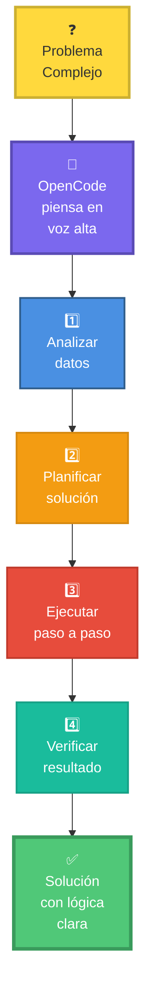

**Ejemplo**:

```bash
opencode "Calcula el precio final de un producto con estas reglas:

DATOS:
- Precio base: ₲100,000
- Descuento por estudiante: 15%
- Descuento adicional si compra 3+: 10% extra
- IVA: 10% (se aplica después de descuentos)

IMPORTANTE: Explica PASO A PASO cómo llegas al resultado.

Formato requerido:
═══════════════════════════════════════
CÁLCULO DETALLADO
═══════════════════════════════════════
1. Precio base: ₲[valor]
   Razón: [explicación]

2. Aplicar descuento estudiante (15%):
   Cálculo: [valor] × 0.15 = ₲[descuento]
   Subtotal: [valor] - [descuento] = ₲[resultado]
   
3. Aplicar descuento por volumen (10%):
   Cálculo: [explicación]
   Subtotal: ₲[resultado]
   
4. Aplicar IVA (10%):
   Cálculo: [valor] × 0.10 = ₲[impuesto]
   
5. PRECIO FINAL: ₲[valor]
═══════════════════════════════════════

Luego genera la función calculateFinalPrice(basePrice, isStudent, quantity) 
que implemente exactamente esta lógica con comentarios explicando cada paso."
```

**Beneficio**: Entiendes la lógica, puedes verificarla, y aprendes en el proceso.

### Técnica 2: Few-Shot Learning (Aprendizaje con Ejemplos)

**¿Qué es?**: Mostrar 2-3 ejemplos del patrón que quieres que siga.

**Cuándo usar**: Cuando necesitas un formato o estilo muy específico.

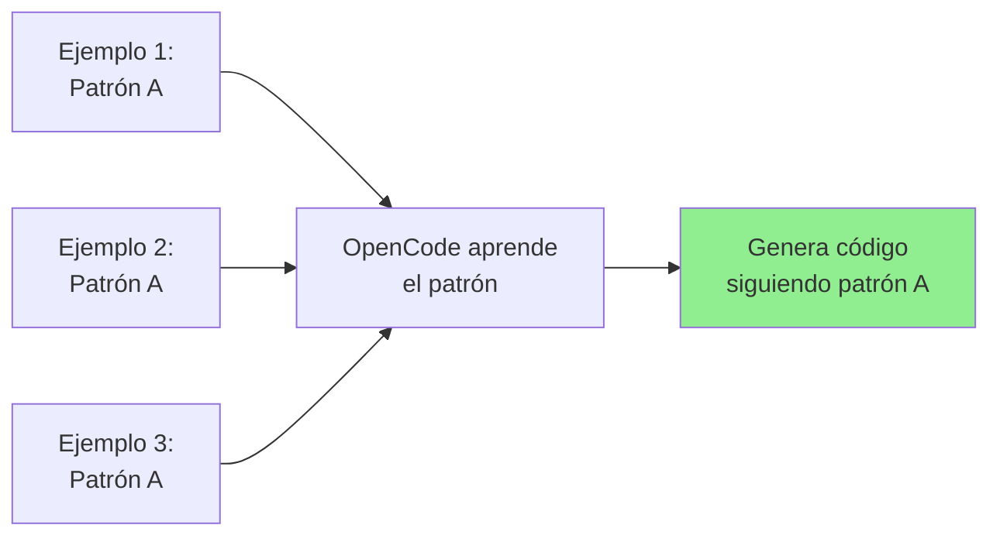

**Ejemplo**:

```bash
opencode "Genera funciones CRUD siguiendo EXACTAMENTE este patrón:

╔═══════════════════════════════════════════════════════════╗
║ EJEMPLO 1: CREATE                                         ║
╚═══════════════════════════════════════════════════════════╝

/**
 * Crea un nuevo estudiante en el sistema
 * @param {Object} studentData - Datos del estudiante
 * @param {string} studentData.nombre - Nombre completo
 * @param {string} studentData.carnet - Número de carnet único
 * @returns {Promise<Object>} Estudiante creado con ID asignado
 * @throws {ValidationError} Si los datos son inválidos
 * @example
 * const estudiante = await createStudent({
 *   nombre: 'Juan Pérez',
 *   carnet: '2024001'
 * });
 */
const createStudent = async (studentData) => {
  // Validar datos de entrada
  if (!studentData.nombre || !studentData.carnet) {
    throw new ValidationError('Nombre y carnet son requeridos');
  }
  
  // Verificar que carnet sea único
  const existing = await findByCarnet(studentData.carnet);
  if (existing) {
    throw new ValidationError('Carnet ya existe en el sistema');
  }
  
  // Crear estudiante
  const student = {
    id: generateId(),
    ...studentData,
    createdAt: new Date()
  };
  
  // Guardar en base de datos
  await db.students.insert(student);
  
  return student;
};

╔═══════════════════════════════════════════════════════════╗
║ EJEMPLO 2: READ                                           ║
╚═══════════════════════════════════════════════════════════╝

/**
 * Obtiene un estudiante por su ID
 * @param {string} id - ID del estudiante
 * @returns {Promise<Object|null>} Estudiante encontrado o null
 * @throws {DatabaseError} Si hay error en la base de datos
 * @example
 * const estudiante = await getStudentById('abc123');
 * if (estudiante) {
 *   console.log(estudiante.nombre);
 * }
 */
const getStudentById = async (id) => {
  // Validar ID
  if (!id) {
    throw new ValidationError('ID es requerido');
  }
  
  try {
    // Buscar en base de datos
    const student = await db.students.findOne({ id });
    return student;
  } catch (error) {
    throw new DatabaseError('Error al buscar estudiante', error);
  }
};

╔═══════════════════════════════════════════════════════════╗
║ AHORA TÚ:                                                 ║
╚═══════════════════════════════════════════════════════════╝

Siguiendo el MISMO PATRÓN exacto (estructura JSDoc, validaciones, 
manejo de errores, comentarios), genera:

1. updateStudent(id, updates) - Actualizar estudiante
2. deleteStudent(id) - Eliminar estudiante
3. listStudents(filters) - Listar con filtros opcionales

IMPORTANTE: Mantén el mismo nivel de detalle, comentarios en español,
y estructura de código."
```

### Técnica 3: Role Prompting (Asignación de Rol)

**¿Qué es?**: Hacer que OpenCode "actúe como" un experto específico.

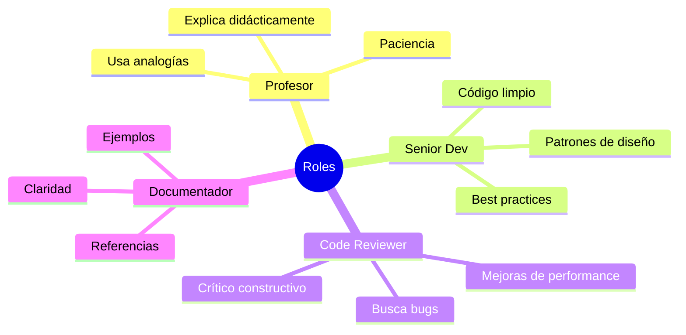

**Ejemplo**:

```bash
opencode "Actúa como un profesor de programación de FPUNA con 15 años de experiencia 
enseñando a estudiantes de primer año.

Un estudiante te muestra este código y pregunta: '¿Por qué no funciona?'

[pega código con error]

Responde como profesor:

1. DIAGNÓSTICO:
   - Identifica el error EXACTO
   - Explica POR QUÉ ocurre (conceptos fundamentales)
   
2. EXPLICACIÓN DIDÁCTICA:
   - Usa una analogía de la vida real
   - Evita jerga técnica o explícala
   - Sé paciente y alentador
   
3. SOLUCIÓN PASO A PASO:
   - Muestra cómo corregirlo
   - Explica cada cambio
   
4. PREVENCIÓN:
   - Cómo evitar este error en el futuro
   - Herramientas/técnicas que ayudan
   
5. EJERCICIO:
   - Propón un ejercicio similar para practicar
   
Tono: Amigable, alentador, educativo. Usa 'vos' (estilo paraguayo)."
```

### Técnica 4: Constrained Generation (Generación Restringida)

**¿Qué es?**: Limitar explícitamente las opciones de respuesta.

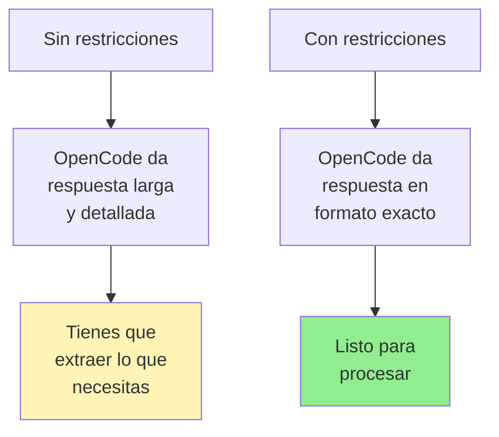

**Ejemplo**:

```bash
opencode "Evalúa este código y responde SOLO con una de estas opciones:

╔═══════════════════════════════════════════════════════════╗
║ OPCIONES PERMITIDAS (elige UNA):                         ║
╠═══════════════════════════════════════════════════════════╣
║ A) EXCELENTE - Código perfecto, sin mejoras necesarias   ║
║ B) BUENO - Funcional con mejoras menores sugeridas       ║
║ C) REGULAR - Funciona pero necesita refactoring          ║
║ D) MALO - Problemas significativos que corregir          ║
║ E) CRÍTICO - No funciona o tiene errores graves          ║
╚═══════════════════════════════════════════════════════════╝

Código a evaluar:
[pega código]

FORMATO DE RESPUESTA (NO te desvíes):

CALIFICACIÓN: [Letra y descripción]

RAZÓN PRINCIPAL: [1 oración concisa]

TOP 3 PROBLEMAS:
1. [Problema específico]
2. [Problema específico]
3. [Problema específico]

ACCIÓN INMEDIATA: [Qué hacer primero]"
```

### Técnica 5: Incremental Building (Construcción Incremental)

**Concepto**: Construir en capas, validando cada capa antes de continuar.

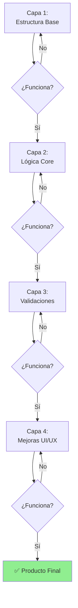

**Ejemplo**:

```bash
# Capa 1: Estructura
opencode "Crea estructura base de clase User con:
- Constructor (nombre, email, edad)
- Método toString()
- Método toJSON()
SOLO la estructura, sin validaciones aún."

# Verificar que funciona
node test.js  # OK ✅

# Capa 2: Validaciones
opencode "Agrega validaciones a la clase User:
- Email debe tener formato válido
- Edad entre 18 y 120
- Nombre no vacío, máx 100 caracteres
Lanzar errores descriptivos si fallan."

# Verificar
node test.js  # OK ✅

# Capa 3: Métodos avanzados
opencode "Agrega a User:
- updateEmail(newEmail) con validación
- celebrateBirthday() que incrementa edad
- isAdult() que retorna boolean"

# Verificar
node test.js  # OK ✅

# Capa 4: Persistencia
opencode "Agrega métodos para guardar/cargar desde JSON:
- save(filename) guarda en archivo
- static load(filename) carga desde archivo"

# Producto final
node test.js  # OK ✅ - Clase completa y funcional
```

---

## 📚 Parte 4: Biblioteca de Prompts Reutilizables (15 min)

### Crear Tu Biblioteca Personal

```bash
# Crear archivo
mkdir -p ~/FPUNA-Recursos
cd ~/FPUNA-Recursos
touch prompts-library.md
```

### Plantillas para Copiar y Usar

#### 1. Crear Función con Tests

```markdown
## Plantilla: Función con Tests

Crea función [NOMBRE]([PARÁMETROS]) que:

FUNCIONALIDAD:
- [Descripción de qué hace]
- [Casos especiales a manejar]

VALIDACIÓN:
- [Qué inputs validar]
- [Qué errores lanzar]

DOCUMENTACIÓN:
- JSDoc completo en español
- Ejemplos de uso en @example

TESTS:
- Jest o framework similar
- Casos normales, edge cases, errores
- Coverage mínimo 85%

CÓDIGO:
- Nombres descriptivos en español
- Comentarios explicando lógica compleja
- Máximo 40 líneas por función
```

#### 2. Refactoring a Clean Code

```markdown
## Plantilla: Refactoring

Refactoriza este código aplicando principios clean code:

PRINCIPIOS A APLICAR:
- DRY (Don't Repeat Yourself)
- Funciones pequeñas y enfocadas (máx 30 líneas)
- Nombres descriptivos
- Un nivel de abstracción por función
- Evitar bucles anidados profundos

MEJORAS REQUERIDAS:
- Extraer lógica compleja a funciones helper
- Renombrar variables/funciones descriptivamente
- Agregar manejo de errores
- Agregar comentarios donde sea necesario
- Eliminar código muerto

MANTENER:
- Funcionalidad exacta
- Performance similar o mejor

CÓDIGO ORIGINAL:
[pega tu código]
```

#### 3. Generar Documentación

```markdown
## Plantilla: Documentación Completa

Genera documentación profesional para este proyecto:

1. README.md con:
   ╔══════════════════════════════════════╗
   ║ • Título y descripción               ║
   ║ • Badges (build, version, license)   ║
   ║ • Screenshots/GIFs                   ║
   ║ • Características principales        ║
   ║ • Instalación paso a paso            ║
   ║ • Uso con ejemplos de código         ║
   ║ • API Reference                      ║
   ║ • FAQ                                ║
   ║ • Contribuir                         ║
   ║ • Licencia                           ║
   ║ • Contacto                           ║
   ╚══════════════════════════════════════╝

2. API.md con documentación detallada de funciones

3. CHANGELOG.md con versión actual

4. CONTRIBUTING.md con guías de contribución

TODO EN ESPAÑOL, formato Markdown profesional.

Información del proyecto:
- Nombre: [nombre]
- Descripción: [descripción]
- Tecnologías: [lista]
```

#### 4. Debugging Sistemático

```markdown
## Plantilla: Debug

Este código produce el siguiente error:

ERROR:
[pega el error completo]

CÓDIGO:
[pega el código]

CONTEXTO:
- Ocurre cuando: [situación]
- Entrada que causa error: [ejemplo]
- Comportamiento esperado: [qué debería pasar]

ANÁLISIS REQUERIDO:
1. Identificar causa raíz del error
2. Explicar POR QUÉ ocurre (conceptos)
3. Proponer solución con código corregido
4. Sugerir cómo prevenir errores similares
5. Agregar tests que validen la corrección

Formato de respuesta con secciones claras.
```

#### 5. Optimización de Performance

```markdown
## Plantilla: Optimización

Este código tiene problemas de performance:

SITUACIÓN ACTUAL:
- Procesa: [cantidad] registros
- Tiempo actual: [X] segundos
- Uso de memoria: [Y] MB
- Problema específico: [cuello de botella]

OBJETIVO:
- Tiempo deseado: <[Z] segundos
- Mantener funcionalidad exacta

RESTRICCIONES:
- [Lista de cosas que no puedes cambiar]

CÓDIGO:
[pega código]

OPTIMIZA Y EXPLICA:
1. Qué optimizaste y por qué
2. Complejidad antes y después (Big O)
3. Trade-offs si los hay
4. Cómo medir la mejora
```

---

## 🔧 Parte 5: Debugging de Prompts (10 min)

### Cuando el Resultado No es el Esperado

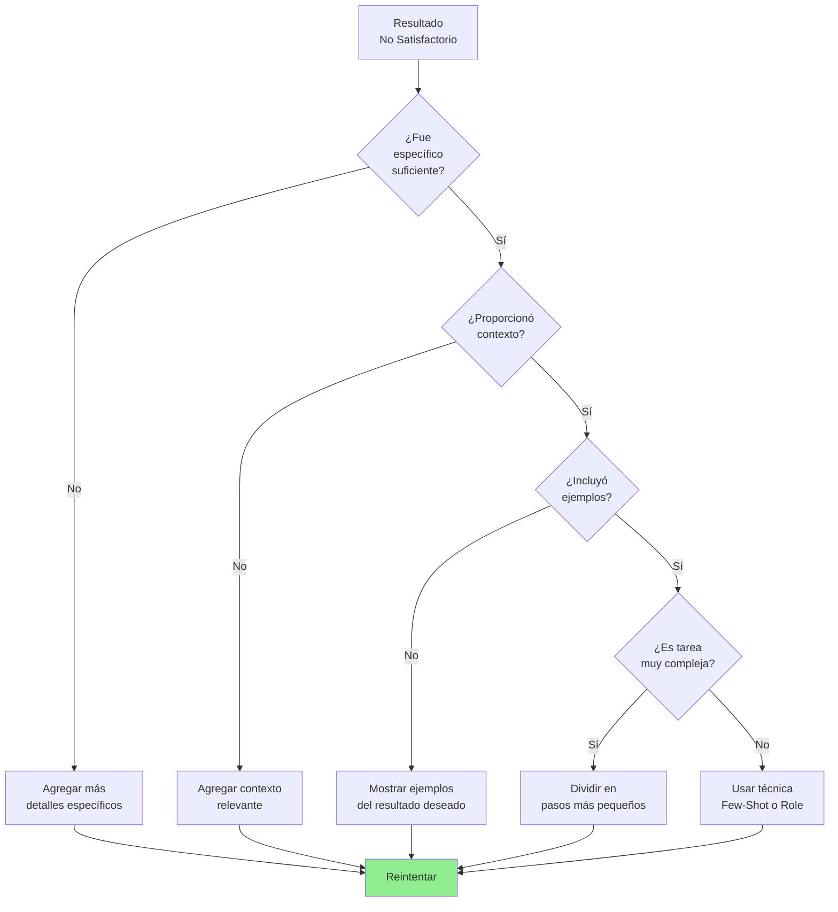

### Checklist de Debugging

Cuando un prompt no funciona, verifica:

- [ ] **¿Fui específico sobre QUÉ quiero?**
- [ ] **¿Expliqué POR QUÉ lo necesito (contexto)?**
- [ ] **¿Mostré ejemplos del resultado deseado?**
- [ ] **¿Especifiqué el formato de salida?**
- [ ] **¿Establecí restricciones claras?**
- [ ] **¿La tarea es demasiado compleja para un solo prompt?**
- [ ] **¿Usé lenguaje claro y sin ambigüedades?**

### Técnica: Comparar Antes/Después

**Prompt que no funcionó**:
```bash
opencode "Optimiza esta función"
```

**Análisis**: ¿Qué falta?
- ❌ No dice QUÉ optimizar (¿velocidad? ¿memoria? ¿legibilidad?)
- ❌ No da contexto (¿qué problema actual tiene?)
- ❌ No especifica objetivo medible

**Prompt mejorado**:
```bash
opencode "Esta función procesa 50,000 productos y toma 8 segundos.
Los usuarios se quejan de lentitud al filtrar.

OBJETIVO: Reducir a <1 segundo

ANÁLISIS ACTUAL:
- El cuello de botella es el triple bucle anidado
- Se recalcula en cada filtro (debería cachear)

OPTIMIZA para velocidad manteniendo funcionalidad.

Código:
[pega código]"
```

---

## ✅ Checklist de Prompt Perfecto

Antes de enviar un prompt, verifica:

### Contenido
- [ ] **Contexto**: Expliqué la situación y por qué lo necesito
- [ ] **Tarea**: Describí claramente QUÉ debe hacer
- [ ] **Requisitos**: Listé funcionalidades y tecnologías específicas
- [ ] **Restricciones**: Aclaré límites y "no hacer"
- [ ] **Formato**: Especifiqué cómo quiero el resultado

### Calidad
- [ ] **Específico**: No hay ambigüedades
- [ ] **Completo**: Incluí toda la info necesaria
- [ ] **Ejemplos**: Mostré input/output esperado
- [ ] **Medible**: Resultados verificables
- [ ] **Realista**: No pido imposibles

### Formato
- [ ] **Estructurado**: Secciones claras
- [ ] **Legible**: Fácil de entender
- [ ] **Formateado**: Uso saltos de línea y separadores

---

## 🎯 Ejercicio Práctico

### Desafío: Mejorar Este Prompt

**Prompt Original (malo)**:
```bash
opencode "Crea una app de gestión"
```

**Tu tarea**: Reescríbelo aplicando TODO lo aprendido.

**Solución esperada** debe incluir:
1. Contexto claro
2. Especificaciones técnicas
3. Funcionalidades detalladas
4. Requisitos de UI/UX
5. Validaciones
6. Formato de entrega
7. Ejemplos si aplica

**Tip**: Usa la plantilla de Prompt Perfecto del inicio del módulo.

---

## 📊 Resumen Visual

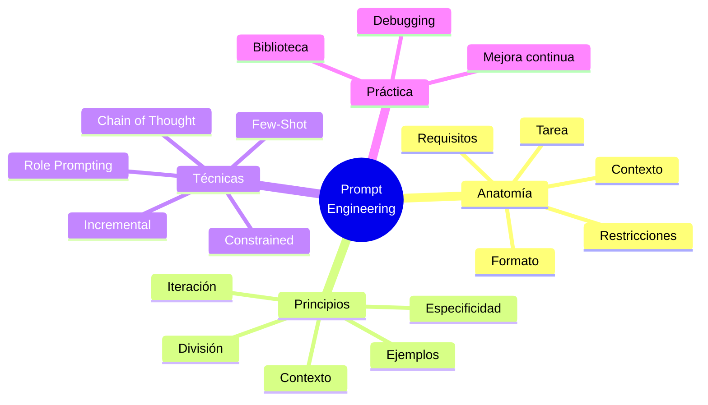

---

## 🎉 ¡Felicitaciones!

Has completado el Módulo 03. Ahora dominas el arte de comunicarte con OpenCode.

### Lo Que Lograste

✅ **Anatomía de prompts** - Entiendes los componentes esenciales  
✅ **7 Principios** - Aplicas las mejores prácticas  
✅ **5 Técnicas avanzadas** - Chain of Thought, Few-Shot, Role, etc.  
✅ **Biblioteca personal** - Tienes prompts reutilizables listos  
✅ **Debugging** - Sabes mejorar prompts que no funcionan

### El Poder que Ahora Tienes

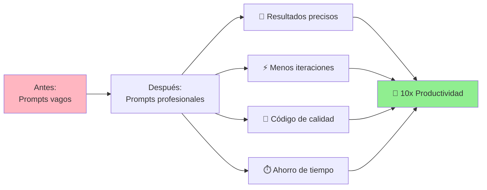

---

## 💭 Reflexión Final

Antes de continuar:

1. **¿Qué técnica te pareció más útil?**
2. **¿Qué prompts agregarías a tu biblioteca?**
3. **¿Cómo aplicarás esto en tus proyectos de FPUNA?**

**Comparte en Slack** (#fpuna-prompts) - ayuda a otros y aprende de sus prompts.

---

## 📝 Quiz de Evaluación

### Instrucciones
- **Total**: 10 preguntas
- **Tiempo estimado**: 20 minutos
- **Aprobación**: 7/10 o más

---

### Preguntas

**1. ¿Cuáles son los 3 componentes esenciales de un prompt efectivo?**
a) Título, Descripción, Conclusión  
b) Rol, Tarea, Contexto  
c) Inicio, Medio, Fin  
d) Pregunta, Respuesta, Feedback  

**2. ¿Qué técnica es "Chain of Thought" (CoT)?**
a) Pedir múltiples respuestas y elegir la mejor  
b) Pedir a la IA que explique su razonamiento paso a paso  
c) Usar ejemplos antes de la tarea  
d) Darle un rol específico a la IA  

**3. Verdadero o Falso: En Few-Shot prompting, proporcionas ejemplos ANTES de pedir la tarea.**

**4. ¿Cuál de estos es el prompt MÁS específico y efectivo?**
a) "Crea una función"  
b) "Hazme código"  
c) "Crea una función JavaScript llamada calcularIVA que reciba un monto, aplique 10% de IVA, retorne el total, y valide que el monto sea positivo"  
d) "Código para calcular algo"  

**5. ¿Cuál de los 7 principios se enfoca en ser CONCRETO en lugar de abstracto?**
a) Principio de Especificidad  
b) Principio de Contexto  
c) Principio de Iteración  
d) Principio de Formato  

**6. Explica en 2-3 oraciones qué es "Self-Consistency" y cuándo usarla.**

**7. Si un prompt no funciona bien, ¿cuál es el PRIMER paso del debugging?**
a) Empezar de cero con un prompt completamente diferente  
b) Culpar a la IA de ser mala  
c) Revisar si el prompt tiene los 3 componentes esenciales (Rol, Tarea, Contexto)  
d) Pedir ayuda inmediatamente  

**8. Verdadero o Falso: El "Role Prompting" consiste en darle una identidad específica a la IA (ej: "Eres un profesor de matemáticas").**

**9. ¿Qué técnica usarías para un problema complejo con múltiples soluciones posibles?**
a) Few-Shot Learning  
b) Tree of Thoughts (ToT)  
c) Simple prompting  
d) Role Prompting  

**10. Escribe un prompt efectivo para pedirle a OpenCode que cree una función que convierta Guaraníes a Dólares (incluye los 3 componentes esenciales).**

---

### Respuestas

**1. b) Rol, Tarea, Contexto**

Los 3 componentes esenciales son: ROL (quién es la IA), TAREA (qué debe hacer), y CONTEXTO (información relevante para hacerlo bien). Esto aparece en el diagrama de anatomía de prompts.

---

**2. b) Pedir a la IA que explique su razonamiento paso a paso**

Chain of Thought (CoT) es pedirle a la IA que "piense en voz alta" y muestre su razonamiento paso a paso antes de dar la respuesta final. Esto mejora resultados en tareas complejas.

---

**3. Verdadero**

Few-Shot Learning consiste en dar ejemplos (shots) ANTES de pedir la tarea. Por ejemplo, mostrar 2-3 ejemplos de entrada/salida antes de pedir que procese un nuevo caso.

---

**4. c) "Crea una función JavaScript llamada calcularIVA que reciba un monto, aplique 10% de IVA, retorne el total, y valide que el monto sea positivo"**

Este prompt es específico: lenguaje (JavaScript), nombre (calcularIVA), parámetros (monto), lógica (10%), retorno (total), y validación (positivo). Los otros son vagos.

---

**5. a) Principio de Especificidad**

El Principio de Especificidad dice: "Sé específico, no abstracto." En lugar de "Hazme una función", especifica lenguaje, nombre, parámetros, lógica, y validaciones.

---

**6. Respuesta Modelo:**

"Self-Consistency genera múltiples respuestas para el mismo prompt y elige la más común o mejor. Se usa cuando necesitas alta confiabilidad en tareas complejas donde una sola respuesta podría ser incorrecta. Es como pedir varias opiniones antes de decidir."

**Criterios**:
- Explica generación múltiple (0.5)
- Menciona elección/consenso (0.5)
- Indica cuándo usarla (0.5)

**Puntaje**: 1.5/1.5

---

**7. c) Revisar si el prompt tiene los 3 componentes esenciales (Rol, Tarea, Contexto)**

Según la sección de debugging, el PRIMER paso es verificar anatomía básica: ¿Tiene Rol? ¿Tarea clara? ¿Contexto suficiente? Esto resuelve el 80% de prompts malos.

---

**8. Verdadero**

Role Prompting es exactamente eso: darle un rol/identidad específica ("Eres un experto en X", "Actúa como Y"). Esto influye en el tono, profundidad, y enfoque de las respuestas.

---

**9. b) Tree of Thoughts (ToT)**

Tree of Thoughts explora múltiples caminos de solución, evalúa cada rama, y elige el mejor. Es ideal para problemas complejos con varias soluciones posibles (como diseño de arquitectura).

---

**10. Respuesta Modelo:**

"**ROL**: Eres un experto en JavaScript y finanzas.  
**TAREA**: Crea una función llamada convertirGuaraniesToDolares que reciba un monto en Guaraníes y retorne el equivalente en Dólares usando tasa de cambio de 7,200 Gs por USD.  
**CONTEXTO**: La función debe validar que el monto sea positivo, redondear a 2 decimales, y manejar errores si el input es inválido. Incluye comentarios explicativos."

**Criterios**:
- Incluye ROL claro (0.7)
- Incluye TAREA específica (0.7)
- Incluye CONTEXTO relevante (0.6)

**Puntaje**: 2/2 si incluye los 3 componentes de forma clara

---

### Criterios de Evaluación

| Rango | Calificación |
|-------|--------------|
| 9-10 | Excelente - Dominio de prompt engineering |
| 7-8 | Bueno - Listo para módulo 04 |
| 5-6 | Suficiente - Revisar técnicas avanzadas |
| 0-4 | Insuficiente - Repasar conceptos básicos |

**Notas**: Preguntas 6 y 10 valen 1.5 y 2 puntos. Total: 10 puntos.

---

## 🎯 Próximos Pasos

**Práctica recomendada**:
1. Crea tu archivo `prompts-library.md`
2. Agrega los 5 templates de este módulo
3. Prueba cada uno con un caso real
4. Comparte tus mejores prompts con la clase

**Continúa con**: [Módulo 04 - Ingeniería de Contexto](./04-context-engineering.md)

---

*Módulo creado para FPUNA Verano 2026*  
*Actualizado: Enero 2026*  
*Versión: 2.0 - Comunicación efectiva con IA para todos*
