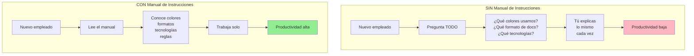
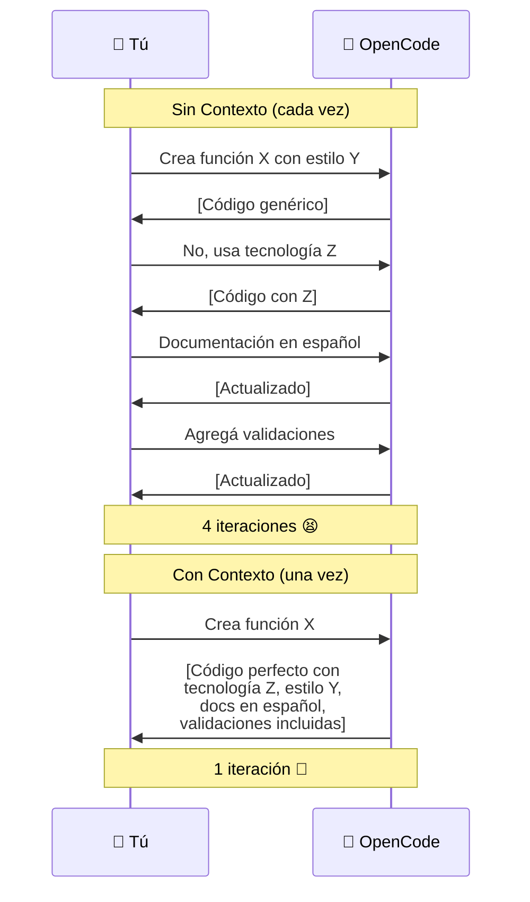
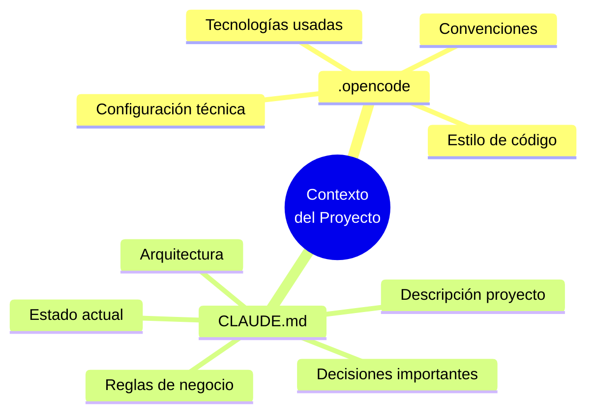
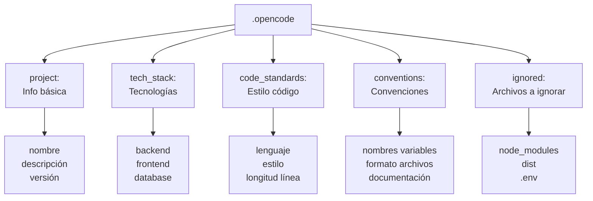
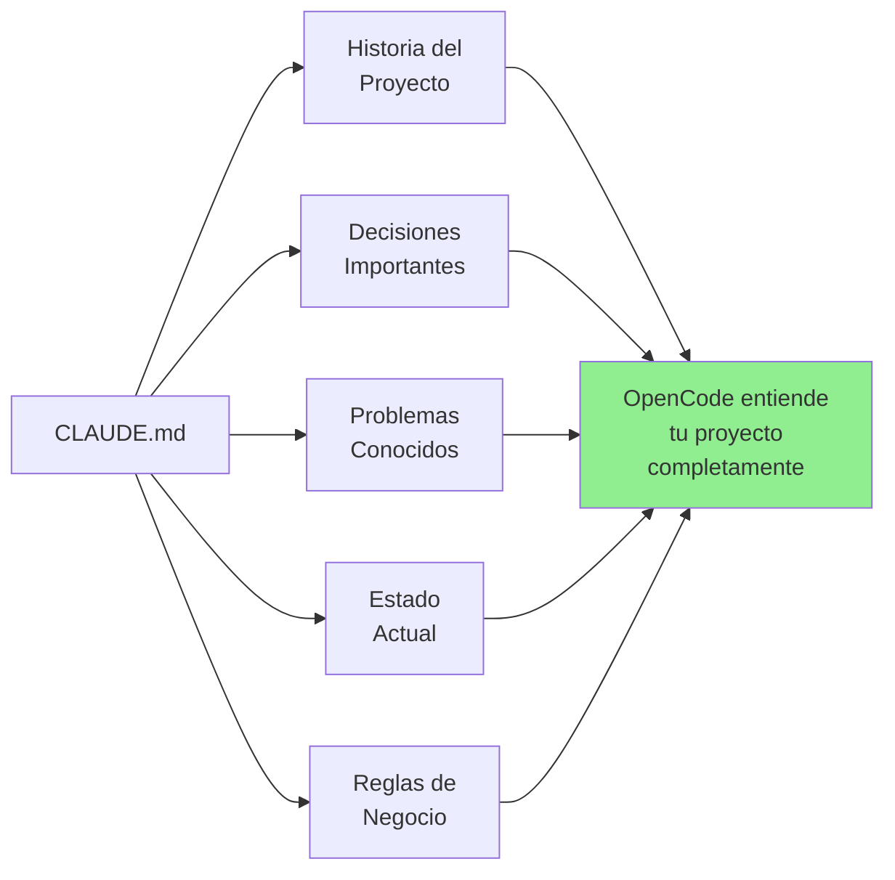
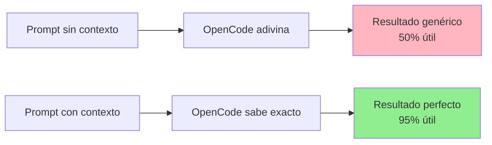
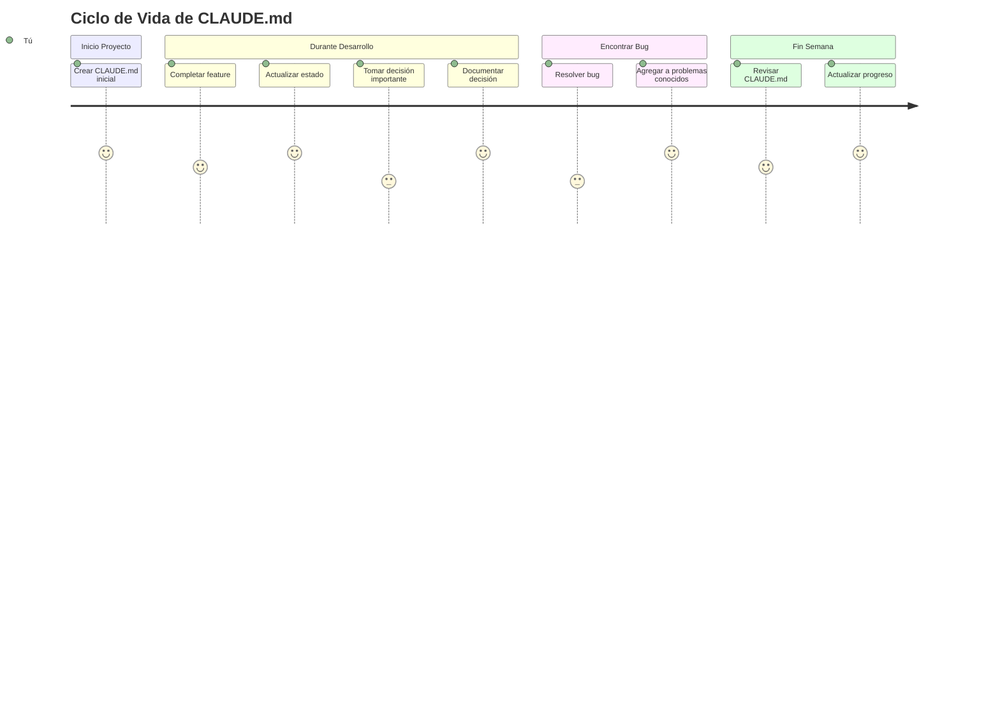
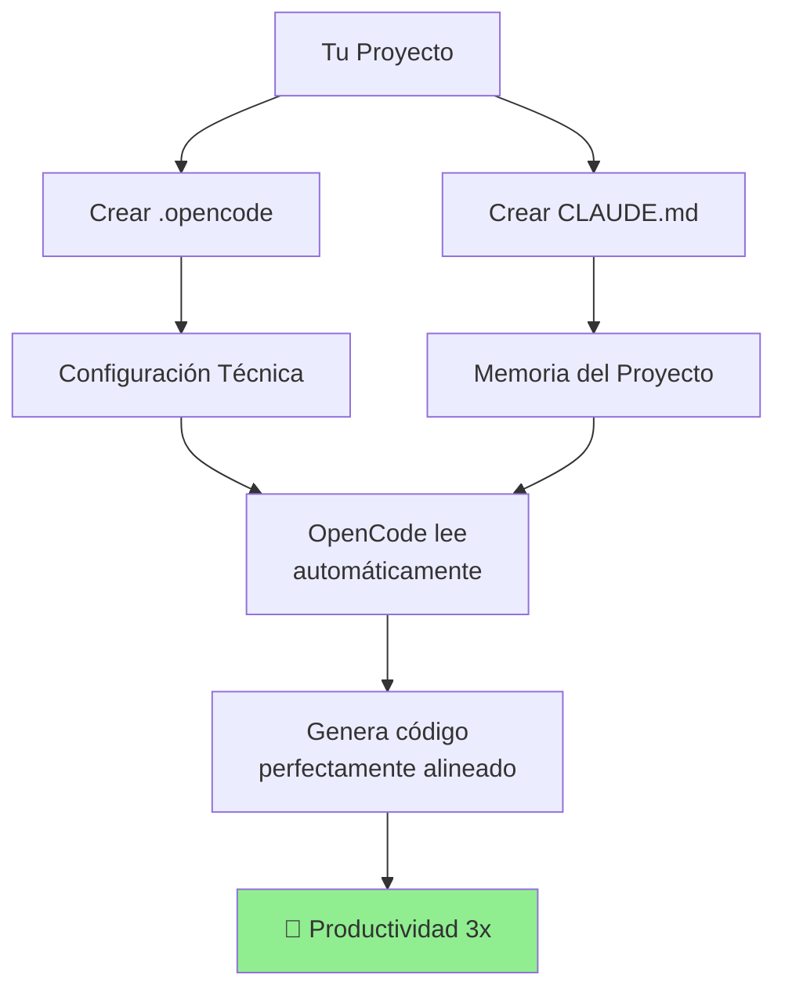
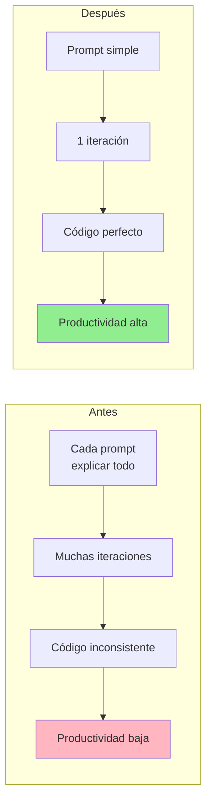

# 🧠 Módulo 04: Ingeniería de Contexto

## Enseña a tu IA Sobre TU Proyecto

> **Para Todos**: Este módulo te enseña a crear una "memoria" para OpenCode sobre tu proyecto. Es como darle un manual de instrucciones que le dice: "Así es MI proyecto, estas son MIS reglas, esto es lo que estoy haciendo". Una vez configurado, OpenCode generará código perfectamente alineado con tu proyecto automáticamente.

**⏱️ Duración**: 1 hora  
**👤 Nivel**: Intermedio (con Módulos 01-03 completados)  
**🎯 Objetivo**: Crear contexto efectivo para proyectos específicos

---

## 🎓 ¿Qué Vas a Lograr?

Al terminar este módulo, tendrás:

1. ✅ **Archivos de contexto** - `.opencode` y `CLAUDE.md` configurados
2. ✅ **Memoria del proyecto** - OpenCode recordará decisiones y reglas
3. ✅ **Código consistente** - Automáticamente sigue tu estilo
4. ✅ **Menos repetición** - No explicar lo mismo cada vez
5. ✅ **Productividad 3x** - OpenCode entiende tu proyecto sin preguntar

---

## 📋 Prerrequisitos

### Conocimientos Requeridos

✅ **Módulos 01-03 Completados** (OBLIGATORIO)
- Módulo 01: OpenCode instalado
- Módulo 02: Configuración (MCPs, Skills, Hooks, Rules)
- Módulo 03: Ingeniería de prompts

✅ **Experiencia Requerida**
- Haber trabajado en al menos 1 proyecto con OpenCode
- Entender la diferencia entre configuración global (.opencode/) y proyecto-específica

❌ **NO Se Requiere**
- Arquitectura de software avanzada
- Conocimiento profundo de Markdown

### Software Necesario

- ✅ OpenCode funcionando
- ✅ Editor de texto (VS Code, Notepad++, nano)
- ✅ Proyecto existente O preparado para crear uno nuevo

### Auto-Evaluación

- [ ] Completé Módulos 01-03
- [ ] Entiendo qué son Skills y MCPs
- [ ] He usado OpenCode al menos 5 veces
- [ ] Tengo un proyecto para practicar
- [ ] Tengo 1 hora disponible

**Si todo ✅**: ¡Adelante!

---

## 🤔 ¿Qué es Ingeniería de Contexto?

### Analogía: Manual de Instrucciones

Imagina contratar a alguien nuevo en tu empresa:



**Ingeniería de Contexto** = Crear el "manual de instrucciones" para OpenCode sobre TU proyecto específico.

---

## 📊 El Problema: Contexto Perdido



---

## 🗂️ Los 2 Archivos Clave



---

## 📝 Parte 1: Archivo `.opencode` (20 min)

### ¿Qué es `.opencode`?

**Definición**: Archivo de configuración que vive en la raíz de tu proyecto y le dice a OpenCode las preferencias técnicas.

### Ubicación en tu Proyecto

```
mi-proyecto-fpuna/
├── .opencode           👈 Aquí
├── .gitignore
├── package.json
├── README.md
├── src/
│   ├── index.js
│   └── ...
└── tests/
```

### Anatomía del Archivo



### Ejemplo Básico

```yaml
# .opencode

project:
  name: Calculadora FPUNA
  description: Calculadora simple para el curso
  version: 1.0.0

preferences:
  language: es-PY
  framework: vanilla-js
  testing: jest

conventions:
  - Variables y funciones en español
  - Comentarios en español
  - camelCase para variables
  - Incluir JSDoc
```

### Ejemplo Completo para Proyecto FPUNA

```yaml
# .opencode
# Configuración para proyecto final - Ingeniería Informática

╔═══════════════════════════════════════════════════════════╗
║ INFORMACIÓN DEL PROYECTO                                  ║
╚═══════════════════════════════════════════════════════════╝

project:
  name: Sistema de Gestión Biblioteca
  description: Sistema completo de préstamos y gestión de inventario
  institution: FPUNA - Facultad Politécnica
  student:
    nombre: María González
    carnet: "2024001"
    carrera: Ingeniería Informática
    email: maria.gonzalez@fpuna.edu.py
  version: 1.0.0
  year: 2026

╔═══════════════════════════════════════════════════════════╗
║ STACK TECNOLÓGICO                                         ║
╚═══════════════════════════════════════════════════════════╝

tech_stack:
  backend:
    runtime: Node.js v18+
    framework: Express 4.x
    orm: Prisma 5.x
    auth: JWT (jsonwebtoken)
    
  database:
    type: PostgreSQL 14+
    host: localhost
    port: 5432
    
  frontend:
    framework: React 18
    styling: Tailwind CSS
    state: Context API
    
  testing:
    unit: Jest
    integration: Supertest
    e2e: Cypress
    coverage_target: 85%

╔═══════════════════════════════════════════════════════════╗
║ ESTÁNDARES DE CÓDIGO                                      ║
╚═══════════════════════════════════════════════════════════╝

code_standards:
  language: JavaScript (ES6+)
  style_guide: Airbnb JavaScript Style Guide
  max_line_length: 120
  indentation: 2 spaces
  quotes: single
  semicolons: true
  trailing_comma: es5

╔═══════════════════════════════════════════════════════════╗
║ DOCUMENTACIÓN                                             ║
╚═══════════════════════════════════════════════════════════╝

documentation:
  format: JSDoc
  language: Spanish
  required_for:
    - All exported functions
    - All classes
    - Complex algorithms
  include:
    - Parameter descriptions
    - Return values
    - Examples
    - Exceptions thrown

╔═══════════════════════════════════════════════════════════╗
║ CONVENCIONES DE NOMBRES                                   ║
╚═══════════════════════════════════════════════════════════╝

naming_conventions:
  files: kebab-case (ej: user-controller.js)
  folders: kebab-case (ej: auth-middleware)
  variables: camelCase (ej: nombreEstudiante)
  functions: camelCase (ej: calcularMulta)
  classes: PascalCase (ej: BibliotecaController)
  constants: UPPER_SNAKE_CASE (ej: MAX_PRESTAMOS)
  private_methods: _camelCase (ej: _validateInput)
  database_tables: snake_case (ej: prestamos_libros)

╔═══════════════════════════════════════════════════════════╗
║ REGLAS DE CÓDIGO                                          ║
╚═══════════════════════════════════════════════════════════╝

code_rules:
  # Funciones
  - Maximum function length: 50 lines
  - Maximum parameters: 4
  - Maximum cyclomatic complexity: 10
  
  # Variables
  - Use Spanish names when contextually appropriate
  - Always use const/let, never var
  - Initialize variables at declaration
  
  # Comentarios
  - Comments always in Spanish
  - Explain WHY not WHAT
  - Update comments when code changes
  
  # Validación
  - Validate all user inputs
  - Throw descriptive errors in Spanish
  - Never trust client-side validation alone
  
  # Manejo de Errores
  - Always handle Promise rejections
  - Use try-catch for async operations
  - Log errors with context
  - Never expose stack traces to users

╔═══════════════════════════════════════════════════════════╗
║ ESTRUCTURA DEL PROYECTO                                   ║
╚═══════════════════════════════════════════════════════════╝

structure:
  src:
    - models/         # Modelos de datos con Prisma
    - controllers/    # Lógica de negocio
    - routes/         # Definición de endpoints
    - middleware/     # Autenticación, validación
    - services/       # Servicios externos
    - utils/          # Funciones auxiliares
    - config/         # Configuración
  tests:
    - unit/           # Tests unitarios
    - integration/    # Tests de integración
    - e2e/            # Tests end-to-end
  docs:              # Documentación adicional

╔═══════════════════════════════════════════════════════════╗
║ ARCHIVOS IGNORADOS                                        ║
╚═══════════════════════════════════════════════════════════╝

ignored:
  - node_modules/
  - dist/
  - build/
  - coverage/
  - .env
  - .env.local
  - .DS_Store
  - *.log
  - .vscode/
  - .idea/

╔═══════════════════════════════════════════════════════════╗
║ CONTEXTO AUTOMÁTICO                                       ║
╚═══════════════════════════════════════════════════════════╝

context_files:
  # OpenCode leerá estos archivos automáticamente
  - README.md
  - CLAUDE.md
  - ARCHITECTURE.md
  - package.json
  - prisma/schema.prisma
```

### Crear tu Primer `.opencode`

```bash
# En la raíz de tu proyecto
cd ~/FPUNA-Proyectos/mi-proyecto
touch .opencode

# Abrir con editor
notepad .opencode    # Windows
nano .opencode       # Mac/Linux
code .opencode       # VS Code
```

**Copia y adapta** el ejemplo completo de arriba con TUS datos.

---

## 📖 Parte 2: Archivo `CLAUDE.md` (25 min)

### ¿Qué es `CLAUDE.md`?

**Definición**: Es la "memoria del proyecto" - un archivo que OpenCode lee para entender el contexto completo: qué estás haciendo, por qué, qué problemas tienes, qué decisiones tomaste.



### Ubicación

```
mi-proyecto-fpuna/
├── CLAUDE.md          👈 Aquí (raíz del proyecto)
├── .opencode
├── README.md
└── src/
```

### Estructura Completa

```markdown
# 📚 Contexto del Proyecto - [Nombre del Proyecto]

> Última actualización: [Fecha]
> Estudiante: [Tu nombre]
> Carnet: [Tu carnet]

╔═══════════════════════════════════════════════════════════╗
║ SECCIÓN 1: DESCRIPCIÓN GENERAL                            ║
╚═══════════════════════════════════════════════════════════╝

## ¿Qué es este proyecto?

[Descripción en 2-3 párrafos de qué hace el sistema]

## Objetivos

1. [Objetivo 1]
2. [Objetivo 2]
3. [Objetivo 3]

## Usuarios

- **Estudiantes**: Pueden buscar y solicitar libros
- **Bibliotecarios**: Gestionan préstamos y devoluciones
- **Administradores**: Configuran sistema y ven reportes

╔═══════════════════════════════════════════════════════════╗
║ SECCIÓN 2: ARQUITECTURA                                   ║
╚═══════════════════════════════════════════════════════════╝

## Estructura de Carpetas

```
src/
├── models/
│   ├── Libro.js           # Modelo de libro
│   ├── Estudiante.js      # Modelo de estudiante
│   └── Prestamo.js        # Modelo de préstamo
├── controllers/
│   ├── libroController.js
│   ├── estudianteController.js
│   └── prestamoController.js
├── routes/
│   ├── libros.js
│   ├── estudiantes.js
│   └── prestamos.js
└── middleware/
    ├── auth.js            # Autenticación JWT
    └── validacion.js      # Validación de inputs
```

## Flujo de Datos

```
Usuario → Routes → Middleware → Controller → Model → Database
                                                  ↓
Usuario ← View ← Controller ← Model ← Database Result
```

╔═══════════════════════════════════════════════════════════╗
║ SECCIÓN 3: MODELOS DE DATOS                               ║
╚═══════════════════════════════════════════════════════════╝

### Modelo: Libro

```javascript
{
  id: UUID,                    // Generado automáticamente
  titulo: String,              // Máx 200 caracteres
  autor: String,               // Máx 100 caracteres
  isbn: String,                // Único, 13 dígitos
  categoria: Enum,             // [Ficción, Técnico, Historia, etc.]
  editorial: String,
  anioPublicacion: Number,     // Entre 1900 y año actual
  cantidad: Number,            // Total de ejemplares
  disponibles: Number,         // Ejemplares disponibles
  ubicacion: String,           // Ej: "Estante A3, Fila 2"
  createdAt: Timestamp,
  updatedAt: Timestamp
}
```

### Modelo: Estudiante

```javascript
{
  id: UUID,
  nombre: String,              // Nombre completo
  carnet: String,              // Único, formato "2024001"
  carrera: String,
  email: String,               // Validar formato
  telefono: String,
  fechaNacimiento: Date,
  direccion: String,
  activo: Boolean,             // Para deshabilitar temporalmente
  prestamosActivos: Number,    // Contador
  multasPendientes: Number,    // En guaraníes
  createdAt: Timestamp
}
```

### Modelo: Prestamo

```javascript
{
  id: UUID,
  libroId: UUID,               // FK a Libro
  estudianteId: UUID,          // FK a Estudiante
  fechaPrestamo: Date,         // Fecha actual al crear
  fechaDevolucionEsperada: Date,  // +14 días desde préstamo
  fechaDevolucionReal: Date,   // null si no devuelto
  devuelto: Boolean,           // false por defecto
  multa: Number,               // ₲ en guaraníes
  renovaciones: Number,        // Máximo 2
  notas: String,               // Observaciones opcionales
  createdAt: Timestamp,
  updatedAt: Timestamp
}
```

╔═══════════════════════════════════════════════════════════╗
║ SECCIÓN 4: REGLAS DE NEGOCIO                              ║
╚═══════════════════════════════════════════════════════════╝

## Reglas de Préstamos

1. **Límite de Préstamos**
   - Estudiante puede tener máximo 3 libros prestados simultáneamente
   - No puede pedir nuevo si tiene multas pendientes

2. **Duración**
   - Préstamo dura 14 días calendario
   - Puede renovarse hasta 2 veces (si nadie más lo solicita)
   - Cada renovación extiende 14 días más

3. **Multas**
   - ₲ 1,000 por día de retraso
   - No se consideran fines de semana (por ahora - ver Problemas Conocidos)
   - Multa máxima por libro: ₲ 50,000
   - Estudiante debe pagar antes de nuevo préstamo

4. **Disponibilidad**
   - Solo se prestan libros con disponibles > 0
   - Al prestar: disponibles--
   - Al devolver: disponibles++

5. **Validaciones**
   - Verificar que libro existe y está disponible
   - Verificar que estudiante no tiene 3 préstamos
   - Verificar que estudiante no tiene multas pendientes
   - Verificar que ISBN es válido (13 dígitos)

╔═══════════════════════════════════════════════════════════╗
║ SECCIÓN 5: ESTADO ACTUAL                                  ║
╚═══════════════════════════════════════════════════════════╝

## Completado ✅

- [x] Modelos de datos con Prisma
- [x] CRUD completo de Libros
- [x] CRUD completo de Estudiantes
- [x] Autenticación JWT
- [x] Validación de inputs con Joi
- [x] Tests unitarios de modelos (coverage 90%)

## En Progreso 🚧

- [ ] Sistema de préstamos (70% completo)
  - ✅ Crear préstamo
  - ✅ Listar préstamos
  - 🚧 Devolver libro (falta calcular multa)
  - ❌ Renovar préstamo
  
- [ ] Cálculo de multas (50% completo)
  - ✅ Lógica básica (₲1,000/día)
  - ❌ Excluir fines de semana
  - ❌ Excluir feriados

## Pendiente ⏳

- [ ] Sistema de reportes
  - [ ] Libros más prestados
  - [ ] Estudiantes con más préstamos
  - [ ] Multas generadas por mes
  
- [ ] Notificaciones
  - [ ] Email 2 días antes de vencer
  - [ ] Email cuando hay multa
  
- [ ] Dashboard administrativo
  - [ ] Estadísticas generales
  - [ ] Gráficos de uso

╔═══════════════════════════════════════════════════════════╗
║ SECCIÓN 6: PROBLEMAS CONOCIDOS                            ║
╚═══════════════════════════════════════════════════════════╝

## 🐛 Bugs

1. **Cálculo de multas y fines de semana**
   - Problema: Las multas se calculan incluyendo sábados y domingos
   - Impacto: Estudiantes pagan más de lo que deberían
   - Prioridad: Alta
   - Plan: Usar librería `date-fns` para calcular solo días hábiles

2. **Validación de ISBN**
   - Problema: La regex actual no valida correctamente el checksum
   - Impacto: Podrían ingresarse ISBNs inválidos
   - Prioridad: Media
   - Plan: Implementar algoritmo de validación ISBN-13

## ⚠️ Limitaciones Actuales

1. **Búsqueda no soporta acentos**
   - Buscar "informática" no encuentra "informatica"
   - Necesitamos normalizar búsquedas

2. **No hay soft delete**
   - Al eliminar registros, se pierden permanentemente
   - Deberíamos usar `deletedAt` en lugar de DELETE

╔═══════════════════════════════════════════════════════════╗
║ SECCIÓN 7: DECISIONES DE DISEÑO                           ║
╚═══════════════════════════════════════════════════════════╝

## ¿Por qué Prisma y no Sequelize?

**Decisión**: Usar Prisma como ORM

**Razones**:
- Migraciones automáticas más confiables
- Mejor TypeScript support (aunque usamos JS)
- Prisma Studio para visualizar datos
- Documentación más clara

## ¿Por qué PostgreSQL y no MongoDB?

**Decisión**: Base de datos relacional (PostgreSQL)

**Razones**:
- Datos altamente relacionados (Libros ← Préstamos → Estudiantes)
- Necesitamos transacciones ACID (ej: prestar libro)
- Mejor para reportes y agregaciones
- Más experiencia del equipo

## ¿Por qué JWT y no sesiones?

**Decisión**: Autenticación con JSON Web Tokens

**Razones**:
- Stateless (escalable)
- Funciona bien con API REST
- Fácil para futuro móvil
- No requiere Redis u otro almacenamiento de sesiones

╔═══════════════════════════════════════════════════════════╗
║ SECCIÓN 8: COMANDOS ÚTILES                                ║
╚═══════════════════════════════════════════════════════════╝

```bash
# Desarrollo
npm run dev              # Iniciar servidor en modo desarrollo
npm run dev:watch        # Con auto-restart

# Base de Datos
npm run db:migrate       # Aplicar migraciones
npm run db:seed          # Poblar con datos de prueba
npm run db:reset         # Resetear completamente
npm run db:studio        # Abrir Prisma Studio

# Testing
npm test                 # Ejecutar todos los tests
npm run test:watch       # Tests en modo watch
npm run test:coverage    # Con reporte de coverage
npm run test:unit        # Solo tests unitarios
npm run test:integration # Solo tests de integración

# Linting y Formateo
npm run lint             # Verificar código
npm run lint:fix         # Auto-corregir
npm run format           # Formatear con Prettier

# Build y Deploy
npm run build            # Build para producción
npm start                # Iniciar en producción
```

╔═══════════════════════════════════════════════════════════╗
║ SECCIÓN 9: NOTAS PARA OPENCODE                            ║
╚═══════════════════════════════════════════════════════════╝

## Al Generar Código, Siempre:

✅ Validar TODOS los inputs antes de procesar
✅ Usar mensajes de error descriptivos en español
✅ Incluir ejemplos de uso en JSDoc
✅ Manejar casos edge (null, undefined, arrays vacíos)
✅ Agregar tests para la funcionalidad
✅ Seguir la estructura de carpetas existente
✅ Usar mismas convenciones de nombres
✅ Comentarios en español explicando lógica compleja
✅ Preferir funciones pequeñas y enfocadas
✅ Usar async/await en lugar de callbacks

❌ No crear nuevas carpetas sin consultar
❌ No usar var, solo const/let
❌ No exponer información sensible en errores
❌ No hardcodear valores (usar constantes)
❌ No confiar en validación del cliente solo

## Patrones Preferidos

```javascript
// ✅ BUENO: Async/await con try-catch
const obtenerLibro = async (id) => {
  try {
    const libro = await prisma.libro.findUnique({ where: { id } });
    if (!libro) {
      throw new NotFoundError('Libro no encontrado');
    }
    return libro;
  } catch (error) {
    logger.error('Error al obtener libro:', error);
    throw error;
  }
};

// ❌ MALO: Callbacks
const obtenerLibro = (id, callback) => {
  prisma.libro.findUnique({ where: { id } }, (err, libro) => {
    if (err) callback(err);
    callback(null, libro);
  });
};
```

## Formato de Respuestas API

```javascript
// ✅ Formato estándar de respuesta exitosa
{
  success: true,
  data: { /* resultado */ },
  message: "Operación exitosa" // español
}

// ✅ Formato estándar de error
{
  success: false,
  error: {
    code: "LIBRO_NO_ENCONTRADO",
    message: "El libro solicitado no existe en el sistema",
    details: { libroId: "abc123" }
  }
}
```

╔═══════════════════════════════════════════════════════════╗
║ SECCIÓN 10: RECURSOS                                      ║
╚═══════════════════════════════════════════════════════════╝

## Documentación Externa

- [Prisma Docs](https://www.prisma.io/docs)
- [Express.js Guide](https://expressjs.com/es/guide/routing.html)
- [Jest Documentation](https://jestjs.io/documentacion/getting-started)

## Estándares de Código

- [Airbnb JavaScript Style Guide](https://github.com/airbnb/javascript)
- [JavaScript Best Practices](https://www.w3schools.com/js/js_best_practices.asp)

---

**Última actualización**: 15 de Enero, 2026
**Próxima revisión**: Después de completar sistema de préstamos
```

---

## 🎯 Parte 3: Usar Contexto Efectivamente (10 min)

### El Poder del Contexto



### Comparación Práctica

#### Sin Contexto (Malo)

```bash
opencode "Agrega función para prestar un libro"
```

**OpenCode NO sabe**:
- ❌ Qué base de datos usas
- ❌ Estructura de tus modelos
- ❌ Reglas de negocio (máx 3 libros, 14 días, multas)
- ❌ Estilo de código que sigues
- ❌ Qué validaciones necesitas

**Resultado**: Código genérico que tendrás que modificar mucho.

#### Con Contexto (Excelente)

Con `.opencode` y `CLAUDE.md` configurados:

```bash
opencode "Agrega función prestarLibro() siguiendo las reglas del proyecto"
```

**OpenCode SABE** (automáticamente):
- ✅ Usas Prisma con PostgreSQL
- ✅ Estructura exacta de tus modelos
- ✅ Reglas: máx 3 libros, 14 días, multa ₲1,000/día
- ✅ Debe validar inputs, usar JSDoc en español, manejar errores
- ✅ Retornar en formato estándar que definiste

**Resultado**: Código perfecto que solo necesitas revisar.

---

## ✨ Parte 4: Mejores Prácticas (5 min)

### Mantén CLAUDE.md Actualizado



### ✅ Buenas Prácticas

1. **Actualiza después de cambios importantes**
   ```markdown
   ## Última Actualización: 15 Enero 2026
   - Completado sistema de préstamos
   - Agregada validación de multas
   - Corregido bug de fechas
   ```

2. **Documenta el "POR QUÉ"**
   ```markdown
   ## ¿Por qué no usamos MongoDB?
   Aunque MongoDB es popular, nuestros datos son altamente
   relacionados (Libros ← Préstamos → Estudiantes) y necesitamos
   transacciones ACID al prestar libros (decrementar disponibles
   y crear préstamo debe ser atómico).
   ```

3. **Lista problemas conocidos**
   ```markdown
   ## 🐛 Bug Conocido: Búsqueda con Acentos
   Buscar "informática" no encuentra "informatica".
   Workaround temporal: Normalizar búsqueda a lowercase sin acentos.
   Fix permanente: Usar PostgreSQL text search con unaccent extension.
   ```

4. **Comandos útiles siempre visibles**
   ```markdown
   ## Comandos Frecuentes
   npm run dev:reset    # Resetea DB y levanta servidor
   npm run test:watch   # Tests en watch mode
   npm run db:seed:test # Pobla DB con datos de prueba
   ```

### ❌ Errores Comunes

1. **Información obsoleta**
   - ❌ Documento dice "usamos MySQL" pero ahora es PostgreSQL
   - ✅ Actualizar al cambiar tecnologías

2. **Demasiado vago**
   - ❌ "Usamos una base de datos"
   - ✅ "Usamos PostgreSQL 14.5 con Prisma 5.x"

3. **Código en lugar de descripción**
   - ❌ Pegar todo tu código en CLAUDE.md
   - ✅ Describir estructura, modelos, y decisiones

---

## 🎯 Ejercicio Práctico

### Crea Contexto para TU Proyecto

1. **Elige un proyecto** (real o hipotético):
   - App de notas
   - Calculadora de impuestos
   - Gestor de tareas
   - Tu proyecto de FPUNA

2. **Crea `.opencode`** con:
   - Información básica
   - Tecnologías que usarás
   - Convenciones de código
   - Reglas específicas

3. **Crea `CLAUDE.md`** con:
   - Descripción del proyecto
   - Modelos de datos principales
   - 3-5 reglas de negocio
   - Estado actual

4. **Pruébalo**:
   ```bash
   cd tu-proyecto
   opencode "Crea función para [algo relacionado a tu proyecto]"
   ```
   
   Observa cómo OpenCode usa el contexto automáticamente.

---

## 📊 Resumen Visual



---

## 🎉 ¡Felicitaciones!

Has completado el Módulo 04. Ahora OpenCode tiene "memoria" de tu proyecto.

### Lo Que Lograste

✅ **`.opencode` configurado** - Preferencias técnicas definidas  
✅ **`CLAUDE.md` creado** - Memoria completa del proyecto  
✅ **Contexto automático** - OpenCode entiende TU proyecto  
✅ **Menos repetición** - No explicar lo mismo cada vez  
✅ **Código consistente** - Sigue tus convenciones automáticamente

### El Antes y Después



---

## 💭 Reflexión

Antes de continuar:

1. **¿Cómo usarías esto en tus proyectos de FPUNA?**
2. **¿Qué información es MÁS importante documentar?**
3. **¿Cada cuánto actualizarías `CLAUDE.md`?**

**Comparte en Slack** (#fpuna-context) - ayuda a otros con tus archivos de contexto.

---

## 📝 Quiz de Evaluación

### Instrucciones
- **Total**: 10 preguntas
- **Tiempo estimado**: 20 minutos
- **Aprobación**: 7/10 o más

---

### Preguntas

**1. ¿Cuál es la diferencia principal entre `.opencode` y `CLAUDE.md`?**
a) Son exactamente lo mismo  
b) `.opencode` son preferencias técnicas del proyecto, `CLAUDE.md` es contexto completo del proyecto  
c) `.opencode` es para Python, `CLAUDE.md` para JavaScript  
d) No hay diferencia, puedes usar cualquiera  

**2. ¿Dónde se coloca el archivo `CLAUDE.md`?**
a) En `~/.opencode/` (configuración global)  
b) En la raíz del proyecto específico  
c) En cualquier lugar  
d) En `C:\Windows\System32\`  

**3. Verdadero o Falso: El archivo `CLAUDE.md` debe actualizarse cada vez que tomas decisiones importantes en el proyecto.**

**4. ¿Cuál sección NO es típicamente parte de `CLAUDE.md`?**
a) Descripción del proyecto  
b) Stack tecnológico  
c) Código completo de todos los archivos  
d) Convenciones de código  

**5. ¿Qué formato usa el archivo `.opencode` para configuración?**
a) YAML  
b) JSON  
c) XML  
d) Plain text  

**6. Explica en 2-3 oraciones por qué tener archivos de contexto mejora la productividad.**

**7. ¿Cuál de estos debería estar en `CLAUDE.md`?**
a) Contraseñas y API keys  
b) Decisiones arquitectónicas y patrones de diseño usados  
c) Números de tarjeta de crédito  
d) Información personal sensible  

**8. Verdadero o Falso: Una vez creado `CLAUDE.md`, nunca debes modificarlo.**

**9. Si tu proyecto usa React con TypeScript y Tailwind, ¿dónde documentarías esta información?**
a) En el código fuente solamente  
b) En `CLAUDE.md` bajo "Stack Tecnológico"  
c) No es necesario documentar  
d) En un archivo Word separado  

**10. Crea un ejemplo mínimo de `CLAUDE.md` para un proyecto de calculadora web (incluye al menos 3 secciones).**

---

### Respuestas

**1. b) `.opencode` son preferencias técnicas del proyecto, `CLAUDE.md` es contexto completo del proyecto**

`.opencode` contiene configuración técnica (formato, linter, etc.). `CLAUDE.md` contiene el contexto completo: qué hace el proyecto, arquitectura, decisiones, convenciones, historia, etc.

---

**2. b) En la raíz del proyecto específico**

`CLAUDE.md` va en la raíz de CADA proyecto que quieras darle contexto. OpenCode lo lee automáticamente cuando trabajas en ese directorio.

---

**3. Verdadero**

`CLAUDE.md` debe mantenerse actualizado. Cada vez que tomas decisiones importantes (cambio de arquitectura, nueva tecnología, patrón adoptado), actualiza el archivo para que OpenCode siempre tenga el contexto correcto.

---

**4. c) Código completo de todos los archivos**

`CLAUDE.md` NO debe tener código completo de todos los archivos (eso es redundante). Debe tener: descripción, stack, arquitectura, convenciones, decisiones, y ejemplos breves si es necesario.

---

**5. b) JSON**

El archivo `.opencode` usa formato JSON para configuración técnica del proyecto (formato, testing, linting, etc.).

---

**6. Respuesta Modelo:**

"Los archivos de contexto permiten a OpenCode 'recordar' tu proyecto sin necesidad de explicar todo cada vez. Esto reduce iteraciones, genera código consistente automáticamente, y ahorra tiempo al no tener que repetir decisiones arquitectónicas en cada prompt."

**Criterios**:
- Menciona "memoria" o "no repetir" (0.5)
- Menciona consistencia/calidad (0.5)
- Menciona ahorro de tiempo (0.5)

**Puntaje**: 1.5/1.5

---

**7. b) Decisiones arquitectónicas y patrones de diseño usados**

`CLAUDE.md` debe tener información técnica del proyecto (arquitectura, patrones, stack, convenciones). NUNCA información sensible como contraseñas, API keys, o datos personales.

---

**8. Falso**

`CLAUDE.md` es un documento VIVO que debe actualizarse constantemente. A medida que el proyecto evoluciona (nuevas decisiones, cambios de arquitectura, lecciones aprendidas), actualiza el contexto.

---

**9. b) En `CLAUDE.md` bajo "Stack Tecnológico"**

La información del stack (React, TypeScript, Tailwind) debe estar documentada en `CLAUDE.md` bajo la sección "Stack Tecnológico" o "Tecnologías Usadas" para que OpenCode sepa exactamente qué herramientas usar.

---

**10. Respuesta Modelo:**

```markdown
# Calculadora Web

## Descripción
Calculadora simple que realiza operaciones básicas (suma, resta, multiplicación, división).

## Stack Tecnológico
- HTML5
- CSS3 (sin frameworks)
- JavaScript vanilla (sin librerías)

## Arquitectura
- Frontend estático
- Lógica en `calculator.js`
- Estilos en `styles.css`
- Una sola página HTML

## Convenciones
- Nombres de funciones en camelCase
- Validar división por cero
- UI responsive para móviles
```

**Criterios**:
- Incluye al menos 3 secciones (1 punto)
- Contenido es relevante y específico (1 punto)

**Puntaje**: 2/2

---

### Criterios de Evaluación

| Rango | Calificación |
|-------|--------------|
| 9-10 | Excelente - Dominio de contexto |
| 7-8 | Bueno - Listo para módulo 05 |
| 5-6 | Suficiente - Revisar `.opencode` vs `CLAUDE.md` |
| 0-4 | Insuficiente - Repasar todo el módulo |

**Notas**: Preguntas 6 y 10 valen 1.5 y 2 puntos. Total: 10 puntos exactos.

---

## 🎯 Próximos Pasos

**Tarea práctica**:
1. Toma uno de tus proyectos (o crea uno nuevo)
2. Crea ambos archivos: `.opencode` y `CLAUDE.md`
3. Pide a OpenCode que genere código
4. Observa la diferencia

**Continúa con**: [Módulo 05 - Proyecto en Vivo](./05-live-project.md)

---

*Módulo creado para FPUNA Verano 2026*  
*Actualizado: Enero 2026*  
*Versión: 2.0 - Contexto inteligente para proyectos*
