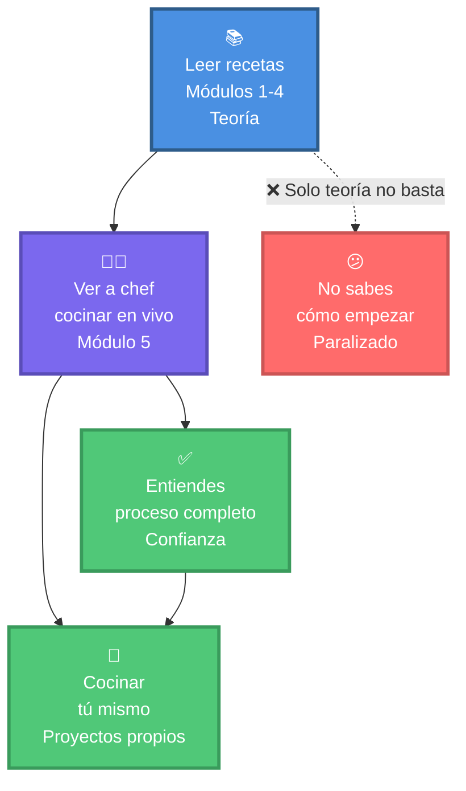
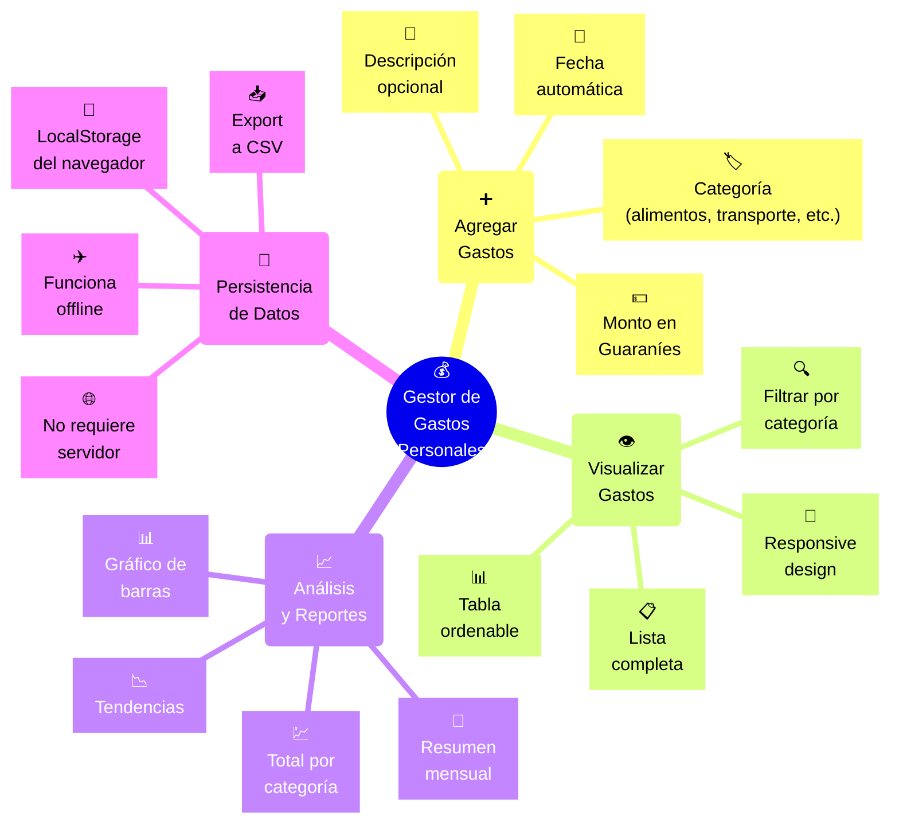
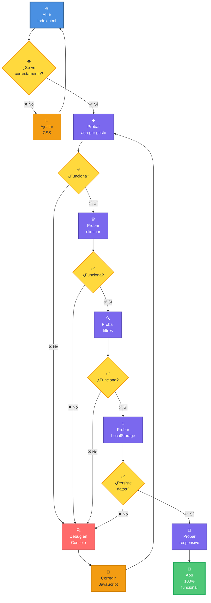
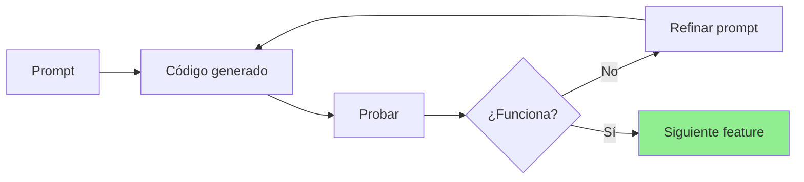
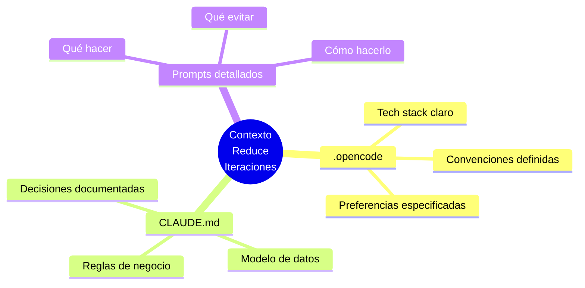
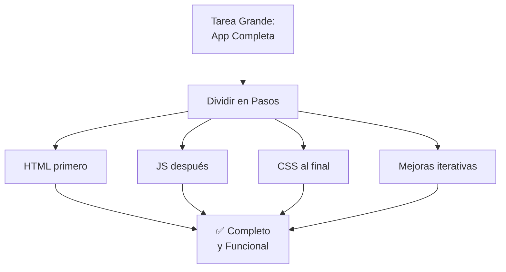

# 🎬 Módulo 05: Proyecto en Vivo (Demo 1-Shot)

## De Idea a App Funcional en 90 Minutos

> **Para Todos**: Este es el módulo MÁS emocionante - verás al instructor crear una aplicación completa DESDE CERO usando OpenCode, aplicando TODO lo que aprendiste. No es teoría - es ver la magia suceder en tiempo real. Es como ver a un chef cocinar un plato complejo paso a paso.

**⏱️ Duración**: 1.5 horas  
**👤 Nivel**: Todos (observación activa)  
**🎯 Objetivo**: Ver workflow completo de desarrollo con IA en acción

---

## 🎓 ¿Qué Vas a Ver?

En esta sesión, el instructor creará:

1. ✅ **App completa y funcional** - De cero a producción
2. ✅ **Aplicación de conceptos** - Módulos 01-04 en práctica
3. ✅ **Workflow real** - Cómo trabaja un profesional con IA
4. ✅ **Debugging en vivo** - Cómo resolver problemas cuando surgen
5. ✅ **Best practices** - Qué hacer (y qué NO hacer)

---

## 📋 Prerrequisitos

### Conocimientos Requeridos

✅ **Módulos 01-04 COMPLETADOS** (CRÍTICO)
- Módulo 01: OpenCode instalado
- Módulo 02: MCPs, Skills, Hooks configurados
- Módulo 03: Ingeniería de prompts
- Módulo 04: Ingeniería de contexto (CLAUDE.md)

✅ **Preparación Mental**
- Mentalidad de observación activa (tomar notas)
- Preguntas preparadas para Q&A
- Disposición a ver código en tiempo real

❌ **NO Se Requiere**
- Experiencia previa en desarrollo
- Saber programar antes del demo
- Entender todo el código al instante

### Durante el Demo

**Qué Traer**:
- 📓 Cuaderno o laptop para notas
- ❓ Lista de preguntas preparadas
- 👀 Atención completa (sin distracciones)

### Auto-Evaluación

- [ ] Completé Módulos 01-04
- [ ] Entiendo conceptos de prompts y contexto
- [ ] Tengo 1.5 horas sin interrupciones
- [ ] Estoy listo para observar activamente

**Si todo ✅**: ¡Disfruta el demo!

---

## 🤔 ¿Por Qué Este Módulo es Importante?

### Analogía: Aprender a Cocinar



**Una cosa es leer sobre desarrollo con IA, otra es VERLO en acción.**

---

## 🎯 El Proyecto: Gestor de Gastos Personales

### ¿Qué Vamos a Construir?

Una aplicación web para que estudiantes de FPUNA gestionen sus gastos mensuales.



### Features Completas

| Categoría | Features |
|-----------|----------|
| **Gestión** | Agregar, editar, eliminar gastos |
| **Filtros** | Por categoría, por rango de fechas |
| **Visualización** | Tabla responsive, gráfico simple |
| **Cálculos** | Total general, total por categoría |
| **Experiencia** | Validación de inputs, feedback visual, dark mode |
| **Persistencia** | LocalStorage, export a CSV |

---

## 📊 Workflow Completo

```mermaid
flowchart TD
    Start["💡<br/>Idea:<br/>App de Gastos<br/>Personales"] --> Plan["📋<br/>Planificación<br/>⏱️ 5 min"]
    Plan --> Setup["⚙️<br/>Setup Proyecto<br/>⏱️ 5 min"]
    Setup --> Context["📝<br/>Archivos de<br/>Contexto<br/>⏱️ 5 min"]
    Context --> Gen1["🎨<br/>Generar HTML<br/>Estructura<br/>⏱️ 10 min"]
    Gen1 --> Gen2["⚙️<br/>Generar JS<br/>Lógica<br/>⏱️ 15 min"]
    Gen2 --> Gen3["💅<br/>Generar CSS<br/>Estilos<br/>⏱️ 10 min"]
    Gen3 --> Test["🧪<br/>Probar App<br/>Testing<br/>⏱️ 10 min"]
    Test --> Debug{"❓<br/>¿Hay<br/>Bugs?"}
    Debug -->|"✅ No"| Improve["✨<br/>Mejoras<br/>Features extra<br/>⏱️ 15 min"]
    Debug -->|"❌ Sí"| Fix["🔧<br/>Corregir<br/>Debug<br/>⏱️ 10 min"]
    Fix --> Test
    Improve --> Doc["📚<br/>Documentación<br/>README<br/>⏱️ 5 min"]
    Doc --> Final["🎉<br/>App Completa<br/>Lista para usar"]
    
    style Start fill:#4A90E2,stroke:#2E5C8A,stroke-width:3px,color:#fff
    style Plan fill:#7B68EE,stroke:#5A4DB8,stroke-width:2px,color:#fff
    style Setup fill:#7B68EE,stroke:#5A4DB8,stroke-width:2px,color:#fff
    style Context fill:#7B68EE,stroke:#5A4DB8,stroke-width:2px,color:#fff
    style Gen1 fill:#F39C12,stroke:#D68910,stroke-width:2px,color:#333
    style Gen2 fill:#F39C12,stroke:#D68910,stroke-width:2px,color:#333
    style Gen3 fill:#F39C12,stroke:#D68910,stroke-width:2px,color:#333
    style Test fill:#9B59B6,stroke:#7D3C98,stroke-width:2px,color:#fff
    style Debug fill:#FFD93D,stroke:#F39C12,stroke-width:3px,color:#333
    style Fix fill:#FF6B6B,stroke:#CC5555,stroke-width:2px,color:#fff
    style Improve fill:#50C878,stroke:#3A9B5C,stroke-width:2px,color:#fff
    style Doc fill:#4A90E2,stroke:#2E5C8A,stroke-width:2px,color:#fff
    style Final fill:#50C878,stroke:#27AE60,stroke-width:4px,color:#fff
```



---

## 🚀 Parte 1: Setup del Proyecto (5 min)

### Paso a Paso que Verás

```mermaid
sequenceDiagram
    autonumber
    participant I as 👨‍🏫 Instructor
    participant T as 💻 Terminal
    participant VS as 📝 VS Code
    
    rect rgb(230, 249, 230)
    Note over I,T: 📦 Crear Proyecto
    I->>T: mkdir gestor-gastos-fpuna
    I->>T: cd gestor-gastos-fpuna
    I->>T: npm init -y
    Note right of T: ✅ package.json creado<br/>Proyecto Node listo
    end
    
    rect rgb(230, 240, 255)
    Note over I,T: 📁 Estructura de Carpetas
    I->>T: mkdir src tests docs
    I->>T: mkdir src/components src/utils src/styles
    Note right of T: ✅ Carpetas creadas
    end
    
    rect rgb(255, 245, 230)
    Note over I,VS: 🚀 Abrir Editor
    I->>VS: code .
    Note right of VS: ✅ VS Code abierto<br/>Proyecto visible<br/>Listo para código
    end
    
    style I fill:#4A90E2,stroke:#2E5C8A,stroke-width:3px,color:#fff
    style T fill:#7B68EE,stroke:#5A4DB8,stroke-width:3px,color:#fff
    style VS fill:#50C878,stroke:#3A9B5C,stroke-width:3px,color:#fff
```

### Estructura que se Creará

```
gestor-gastos-fpuna/
├── .opencode              # Configuración del proyecto
├── CLAUDE.md              # Memoria del proyecto
├── package.json
├── README.md
├── src/
│   ├── index.html         # Estructura de la página
│   ├── app.js             # Lógica principal
│   ├── components/
│   │   ├── GestorGastos.js   # Clase principal
│   │   └── Gasto.js           # Modelo de datos
│   ├── utils/
│   │   ├── storage.js         # LocalStorage helper
│   │   └── formato.js         # Formateo de montos
│   └── styles/
│       └── main.css           # Estilos
├── tests/
│   └── GestorGastos.test.js
└── docs/
    └── screenshots/
```

---

## 📝 Parte 2: Archivos de Contexto (5 min)

### `.opencode` - Lo que el Instructor Escribirá

```yaml
# .opencode
# Proyecto: Gestor de Gastos - FPUNA Verano 2026

project:
  name: Gestor de Gastos Personal
  description: Aplicación web para tracking de gastos estudiantiles
  institution: FPUNA
  instructor: [Nombre del Profesor]
  demo_date: 2026-01-15

╔═══════════════════════════════════════════════════════════╗
║ STACK TECNOLÓGICO                                         ║
╚═══════════════════════════════════════════════════════════╝

tech_stack:
  frontend: HTML5 + CSS3 + JavaScript ES6+ (Vanilla, sin frameworks)
  storage: LocalStorage API
  charts: Canvas API nativo (sin Chart.js)
  bundler: Ninguno (desarrollo simple)

╔═══════════════════════════════════════════════════════════╗
║ PREFERENCIAS                                              ║
╚═══════════════════════════════════════════════════════════╝

preferences:
  language: es-PY               # Español paraguayo
  currency: Guaraníes (₲)
  date_format: DD/MM/YYYY
  number_format: 1.500.000      # Separador de miles

╔═══════════════════════════════════════════════════════════╗
║ CONVENCIONES DE CÓDIGO                                    ║
╚═══════════════════════════════════════════════════════════╝

conventions:
  naming:
    - Variables y funciones en español cuando sea contextual
    - camelCase para variables (ej: montoTotal)
    - PascalCase para clases (ej: GestorGastos)
  
  documentation:
    - JSDoc en español
    - Comentarios explicativos
    - Ejemplos de uso
  
  code_style:
    - Funciones pequeñas (max 30 líneas)
    - Validación de todos los inputs
    - Mensajes de error descriptivos
    - Feedback visual en todas las acciones

╔═══════════════════════════════════════════════════════════╗
║ CATEGORÍAS DE GASTOS                                      ║
╚═══════════════════════════════════════════════════════════╝

categories:
  - Alimentación
  - Transporte
  - Educación (libros, materiales)
  - Entretenimiento
  - Salud
  - Tecnología
  - Otros
```

### `CLAUDE.md` - Memoria del Proyecto

```markdown
# 💰 Gestor de Gastos Personal - FPUNA

> Demo en vivo del Módulo 05
> Instructor: [Nombre]
> Fecha: 15 Enero 2026

╔═══════════════════════════════════════════════════════════╗
║ DESCRIPCIÓN DEL PROYECTO                                  ║
╚═══════════════════════════════════════════════════════════╝

## Objetivo

Crear una aplicación web simple pero funcional que permita a 
estudiantes de FPUNA registrar y analizar sus gastos mensuales.

## Contexto

Muchos estudiantes de FPUNA trabajan part-time y necesitan gestionar
su dinero cuidadosamente. Esta app les ayuda a:
- Saber en qué gastan su dinero
- Identificar áreas donde pueden ahorrar
- Planificar mejor su presupuesto mensual

╔═══════════════════════════════════════════════════════════╗
║ MODELO DE DATOS                                           ║
╚═══════════════════════════════════════════════════════════╝

## Gasto (Expense)

```javascript
{
  id: String,              // UUID generado automáticamente
  fecha: Date,             // Fecha del gasto
  categoria: String,       // Una de las categorías definidas
  descripcion: String,     // Descripción corta (max 100 caracteres)
  monto: Number,           // En guaraníes, números enteros
  createdAt: Timestamp     // Para ordenar
}
```

╔═══════════════════════════════════════════════════════════╗
║ FUNCIONALIDADES CORE                                      ║
╚═══════════════════════════════════════════════════════════╝

1. **Agregar Gasto**
   - Formulario con validación
   - Monto en guaraníes (solo números)
   - Categoría (select obligatorio)
   - Descripción (textarea opcional)
   - Fecha pre-llenada (hoy) pero editable

2. **Listar Gastos**
   - Tabla responsive
   - Ordenar por fecha (más reciente primero)
   - Mostrar monto formateado (₲1.500.000)
   - Botón eliminar por fila

3. **Filtrar**
   - Por categoría (dropdown)
   - Por rango de fechas (futuro)

4. **Análisis**
   - Total general
   - Total por cada categoría
   - Gráfico de barras simple (Canvas API)
   - Porcentaje por categoría

5. **Persistencia**
   - Guardar en LocalStorage
   - Cargar al abrir la página
   - Export a CSV

╔═══════════════════════════════════════════════════════════╗
║ REGLAS DE VALIDACIÓN                                      ║
╚═══════════════════════════════════════════════════════════╝

- Monto debe ser > 0
- Monto debe ser número válido
- Categoría debe estar seleccionada (no "Seleccione...")
- Descripción es opcional pero max 100 caracteres
- Fecha no puede ser futura

╔═══════════════════════════════════════════════════════════╗
║ UX/UI REQUERIMIENTOS                                      ║
╚═══════════════════════════════════════════════════════════╝

- **Responsive**: Mobile-first, funciona en celular y desktop
- **Accesible**: Labels claros, colores contrastados
- **Feedback**: Mensajes de éxito/error visibles
- **Smooth**: Animaciones sutiles (300ms transitions)
- **Clean**: Diseño minimalista, no sobrecargado

╔═══════════════════════════════════════════════════════════╗
║ COLORES FPUNA                                             ║
╚═══════════════════════════════════════════════════════════╝

Primary: #003D7A   (Azul FPUNA)
Secondary: #FFFFFF (Blanco)
Accent: #FFD700    (Dorado)
Success: #28A745
Error: #DC3545
Warning: #FFC107

╔═══════════════════════════════════════════════════════════╗
║ NOTAS PARA OPENCODE                                       ║
╚═══════════════════════════════════════════════════════════╝

- No usar frameworks (vanilla JS solo)
- No usar jQuery
- Usar APIs modernas del navegador
- Código debe funcionar en Chrome/Firefox/Safari últimas versiones
- Priorizar legibilidad sobre optimización prematura
- Incluir comentarios explicativos
```

---

## 🎨 Parte 3: Generación de Código (40 min)

### 3.1 HTML Structure (10 min)

**Prompt que usará el instructor**:

```bash
opencode "Crea index.html para gestor de gastos con estructura semántica HTML5:

╔═══════════════════════════════════════════════════════════╗
║ HEADER                                                    ║
╚═══════════════════════════════════════════════════════════╝
- Logo FPUNA (placeholder)
- Título: 'Gestor de Gastos Personal'
- Subtítulo: 'Controla tus finanzas - FPUNA 2026'
- Toggle dark mode

╔═══════════════════════════════════════════════════════════╗
║ SECCIÓN: AGREGAR GASTO                                    ║
╚═══════════════════════════════════════════════════════════╝
Form con:
- Input monto (type=number, placeholder='₲ Monto')
- Select categoría (Alimentación, Transporte, etc.)
- Textarea descripción (opcional)
- Input fecha (type=date, valor=hoy)
- Botón 'Agregar Gasto' (primary style)

╔═══════════════════════════════════════════════════════════╗
║ SECCIÓN: FILTROS                                          ║
╚═══════════════════════════════════════════════════════════╝
- Select filtro por categoría ('Todas' + categorías)
- Botón 'Limpiar Filtros'
- Contador: 'Mostrando X gastos'

╔═══════════════════════════════════════════════════════════╗
║ SECCIÓN: LISTA DE GASTOS                                  ║
╚═══════════════════════════════════════════════════════════╝
Table responsive:
- Columnas: Fecha | Categoría | Descripción | Monto | Acción
- tbody id='lista-gastos' (será poblado con JS)
- Mensaje cuando está vacío

╔═══════════════════════════════════════════════════════════╗
║ SECCIÓN: RESUMEN                                          ║
╚═══════════════════════════════════════════════════════════╝
Cards con:
- Total General (grande, destacado)
- Grid de cards: Total por cada categoría
- Mini gráfico de barras (canvas)

╔═══════════════════════════════════════════════════════════╗
║ FOOTER                                                    ║
╚═══════════════════════════════════════════════════════════╝
- 'FPUNA Verano 2026'
- Botones: Export CSV, Limpiar Todos los Datos

IMPORTANTE:
- Usar IDs y clases semánticas
- Incluir meta tags responsive
- Enlazar app.js y main.css
- Accesibilidad (aria-labels)"
```

```mermaid
sequenceDiagram
    autonumber
    participant I as 👨‍🏫 Instructor
    participant OC as 🤖 OpenCode
    participant File as 📄 index.html
    participant Browser as 🌐 Navegador
    
    rect rgb(230, 249, 230)
    Note over I,OC: 📝 Generación de HTML
    I->>OC: Envía prompt detallado<br/>(estructura completa)
    Note right of OC: Lee .opencode<br/>Lee CLAUDE.md<br/>Genera código
    OC->>File: ✅ Crea index.html<br/>semántico completo
    end
    
    rect rgb(230, 240, 255)
    Note over I,Browser: 🔍 Verificación
    I->>Browser: Abre archivo en navegador
    Browser->>I: Muestra estructura visual
    Note right of I: ✅ Revisa:<br/>- Header correcto<br/>- Form presente<br/>- Tabla visible<br/>- Footer OK
    end
    
    rect rgb(255, 245, 230)
    Note over I,OC: ✨ Refinamiento
    I->>OC: "Agrega meta tags Open Graph"
    OC->>File: 📝 Actualiza HTML
    Note right of File: ✅ Meta tags agregados<br/>Listo para compartir
    end
    
    style I fill:#4A90E2,stroke:#2E5C8A,stroke-width:3px,color:#fff
    style OC fill:#7B68EE,stroke:#5A4DB8,stroke-width:3px,color:#fff
    style File fill:#50C878,stroke:#3A9B5C,stroke-width:3px,color:#fff
    style Browser fill:#F39C12,stroke:#D68910,stroke-width:3px,color:#333
```

### 3.2 JavaScript Logic (15 min)

**Prompt completo**:

```bash
opencode "Crea app.js con arquitectura modular:

╔═══════════════════════════════════════════════════════════╗
║ CLASE: Gasto                                              ║
╚═══════════════════════════════════════════════════════════╝
class Gasto {
  constructor(monto, categoria, descripcion, fecha)
  - Generar ID único (crypto.randomUUID())
  - Validar todos los inputs
  - Almacenar createdAt
  
  métodos:
  - toJSON() - Para LocalStorage
  - static fromJSON(obj) - Deserializar
}

╔═══════════════════════════════════════════════════════════╗
║ CLASE: GestorGastos                                       ║
╚═══════════════════════════════════════════════════════════╝
class GestorGastos {
  constructor()
  - Cargar gastos desde LocalStorage
  
  métodos:
  - agregarGasto(gasto) → void
  - eliminarGasto(id) → void
  - obtenerGastos(filtroCategoria?) → Gasto[]
  - calcularTotalGeneral() → number
  - calcularTotalPorCategoria() → Object
  - exportarCSV() → void
  - limpiarTodo() → void
  - _guardarEnStorage() → void (privado)
}

╔═══════════════════════════════════════════════════════════╗
║ UTILIDADES                                                ║
╚═══════════════════════════════════════════════════════════╝
- formatearMonto(numero) → string  // ₲1.500.000
- validarMonto(valor) → boolean
- obtenerFechaHoy() → string  // DD/MM/YYYY
- mostrarMensaje(texto, tipo) → void  // Toast notification

╔═══════════════════════════════════════════════════════════╗
║ EVENT LISTENERS                                           ║
╚═══════════════════════════════════════════════════════════╝
DOMContentLoaded:
  - Inicializar GestorGastos
  - Cargar gastos existentes
  - Renderizar lista y resumen
  
Form submit:
  - Prevenir default
  - Validar inputs
  - Crear gasto
  - Agregar al gestor
  - Renderizar actualizado
  - Limpiar form
  
Botón eliminar:
  - Confirmar con usuario
  - Eliminar del gestor
  - Re-renderizar
  
Select filtro:
  - Obtener gastos filtrados
  - Re-renderizar lista

╔═══════════════════════════════════════════════════════════╗
║ RENDERIZADO                                               ║
╚═══════════════════════════════════════════════════════════╝
- renderizarLista(gastos) → void
  * Poblar tbody con filas
  * Formatear montos
  * Agregar event listeners a botones eliminar
  
- renderizarResumen() → void
  * Actualizar total general
  * Actualizar totales por categoría
  * Actualizar gráfico

- renderizarGrafico(datos) → void
  * Usar Canvas API
  * Barras horizontales simples
  * Colores por categoría

VALIDACIONES:
- Monto: número > 0
- Categoría: no vacía, debe estar en lista
- Descripción: max 100 caracteres
- Fecha: no futura

MANEJO DE ERRORES:
- Try-catch en operaciones LocalStorage
- Mensajes descriptivos en español
- Console.error para debug

TODO con comentarios JSDoc en español"
```

### 3.3 CSS Styling (10 min)

**Prompt**:

```bash
opencode "Crea main.css con diseño mobile-first:

╔═══════════════════════════════════════════════════════════╗
║ VARIABLES CSS                                             ║
╚═══════════════════════════════════════════════════════════╝
:root {
  /* Colores FPUNA */
  --primary: #003D7A;
  --secondary: #FFFFFF;
  --accent: #FFD700;
  --success: #28A745;
  --error: #DC3545;
  
  /* Espaciado */
  --spacing-sm: 8px;
  --spacing-md: 16px;
  --spacing-lg: 24px;
  
  /* Tipografía */
  --font-family: 'Segoe UI', sans-serif;
  --font-size-base: 16px;
  
  /* Transiciones */
  --transition: 0.3s ease;
}

╔═══════════════════════════════════════════════════════════╗
║ RESET Y BASE                                              ║
╚═══════════════════════════════════════════════════════════╝
* { box-sizing, margin, padding }
body { fuente, colores, responsive }

╔═══════════════════════════════════════════════════════════╗
║ COMPONENTES                                               ║
╚═══════════════════════════════════════════════════════════╝
1. Header
   - Sticky top
   - Flexbox para logo y título
   - Gradiente sutil

2. Formulario
   - Grid layout responsive
   - Inputs estilizados
   - Focus states
   - Validation styles

3. Tabla
   - Responsive (scroll horizontal en móvil)
   - Hover en filas
   - Zebra striping
   - Botones de acción

4. Cards de Resumen
   - Grid layout (auto-fit)
   - Sombras sutiles
   - Animación hover

5. Gráfico
   - Canvas responsive
   - Labels claros

6. Botones
   - Primary, secondary, danger
   - Hover, active, disabled states
   - Icons con text

╔═══════════════════════════════════════════════════════════╗
║ RESPONSIVE                                                ║
╚═══════════════════════════════════════════════════════════╝
/* Mobile first */
Base: 320px+

/* Tablet */
@media (min-width: 768px) {
  - Form en 2 columnas
  - Tabla completa visible
}

/* Desktop */
@media (min-width: 1024px) {
  - Layout en 3 columnas
  - Sidebar con resumen
}

╔═══════════════════════════════════════════════════════════╗
║ DARK MODE                                                 ║
╚═══════════════════════════════════════════════════════════╝
[data-theme='dark'] {
  --background: #1a1a1a;
  --text: #e0e0e0;
  /* etc */
}

╔═══════════════════════════════════════════════════════════╗
║ ANIMACIONES                                               ║
╚═══════════════════════════════════════════════════════════╝
- Fade in para nuevos gastos
- Slide out para eliminados
- Smooth scroll
- Loader spinner

TODO bien comentado y organizado por secciones"
```

---

## 🧪 Parte 4: Testing y Debugging (15 min)

### Proceso de Testing en Vivo



### Bugs Comunes que Verás (y Cómo se Resuelven)

| Bug | Síntoma | Solución |
|-----|---------|----------|
| **LocalStorage no persiste** | Datos desaparecen al recargar | Verificar `JSON.stringify/parse` |
| **Formato de monto incorrecto** | Aparece "1500000" en lugar de "₲1.500.000" | Usar `Intl.NumberFormat` |
| **Fecha en formato incorrecto** | Aparece "2026-01-15" en lugar de "15/01/2026" | Formatear con Date methods |
| **Filtro no funciona** | Muestra todos aunque filtro seleccionado | Verificar event listener y lógica |

---

## ✨ Parte 5: Mejoras Iterativas (15 min)

### Mejora 1: Export a CSV

```bash
opencode "Agrega botón 'Exportar a CSV' que:
- Genere archivo CSV con todos los gastos
- Columnas: Fecha, Categoría, Descripción, Monto
- Formato monto: números sin formateo (para Excel)
- Descarga automática con nombre 'gastos-FPUNA-[fecha].csv'"
```

### Mejora 2: Dark Mode Toggle

```bash
opencode "Implementa toggle dark mode que:
- Botón en header (icono sol/luna)
- Cambia CSS variables
- Guarda preferencia en LocalStorage
- Aplica automáticamente al cargar página
- Smooth transition entre temas"
```

### Mejora 3: Gráfico Interactivo

```bash
opencode "Mejora el gráfico para que:
- Muestre tooltip al hover con monto exacto
- Barras tengan animación de crecimiento al cargar
- Colores diferentes por categoría
- Leyenda con porcentajes"
```

---

## 📚 Parte 6: Documentación (5 min)

```bash
opencode "Genera README.md profesional con:

# Gestor de Gastos Personal - FPUNA

## Descripción
[Párrafo explicativo]

## Screenshots

[Placeholder - agregar screenshots reales]

## Características
- ✅ Feature 1
- ✅ Feature 2
...

## Tecnologías
- HTML5
- CSS3 (Variables, Grid, Flexbox)
- JavaScript ES6+ (Classes, LocalStorage, Canvas)

## Instalación
```bash
# Simplemente abrir index.html en navegador
# No requiere servidor ni build
```

## Uso
1. Paso 1
2. Paso 2
...

## Estructura del Proyecto
```
gestor-gastos-fpuna/
├── src/
│   ├── index.html
│   ├── app.js
│   └── styles/
└── docs/
```

## Autor
Demo en vivo - Módulo 05 FPUNA Verano 2026
Instructor: [Nombre]

## Licencia
MIT - Uso educativo
"
```

---

## 🎓 Lecciones Clave del Demo

### 1. Workflow Iterativo



**Lección**: Desarrollo con IA es iterativo - no esperes perfección al primer intento.

### 2. Contexto es Crucial



**Lección**: Buenos archivos de contexto = menos prompts = código más preciso.

### 3. Debugging es Normal

| Momento | Qué Pasó | Qué Aprendimos |
|---------|----------|----------------|
| Min 25 | Bug en LocalStorage | Verificar siempre JSON.parse |
| Min 40 | CSS no responsive | Mobile-first es clave |
| Min 55 | Filtro no funcionaba | Event delegation para elementos dinámicos |

**Lección**: Bugs son parte del proceso - saber debuggear es crucial.

### 4. Divide y Conquistarás



**Lección**: No intentar hacer todo a la vez - paso a paso.

---

## 📝 Ejercicio Práctico: Tu Turno

Ahora que viste el proceso completo, **replícalo tú mismo** con un proyecto similar:

### Opciones de Proyecto

#### Opción 1: Gestor de Tareas (TODO App)
- Agregar tareas con prioridad
- Marcar como completadas
- Filtrar por estado y prioridad
- Estadísticas de productividad

#### Opción 2: Calculadora de Promedio
- Ingresar materias y notas
- Calcular promedio general y por semestre
- Visualizar con gráfico
- Guardar historial

#### Opción 3: Tracker de Hábitos
- Definir hábitos a trackear
- Marcar día completado
- Racha actual
- Calendario visual

#### Opción 4: Agenda de Contactos
- Agregar contactos (nombre, teléfono, email)
- Buscar y filtrar
- Categorías (familia, amigos, trabajo)
- Export a VCard

### Requisitos

- ✅ Aplicar archivos de contexto (`.opencode` y `CLAUDE.md`)
- ✅ Usar prompts detallados (basados en lo que viste)
- ✅ HTML semántico + CSS responsive + JS modular
- ✅ LocalStorage para persistencia
- ✅ Validación de inputs
- ✅ README profesional

### Tiempo

**90 minutos** - Cronometra como lo hizo el instructor.

### Entregable

- Código funcional
- README con screenshots
- Subir a GitHub (opcional pero recomendado)

---

## 🎯 Checklist de Verificación

Después del demo, verifica que entendiste:

### Conceptos
- [ ] Entiendo el workflow completo (idea → código → app)
- [ ] Sé por qué el contexto es importante
- [ ] Comprendo cómo iterar y mejorar código
- [ ] Sé cómo debuggear cuando algo falla

### Habilidades
- [ ] Puedo escribir prompts detallados efectivos
- [ ] Sé estructurar un proyecto desde cero
- [ ] Puedo dividir tareas grandes en pasos
- [ ] Entiendo cómo usar LocalStorage

### Herramientas
- [ ] Sé crear archivos `.opencode` y `CLAUDE.md`
- [ ] Puedo usar DevTools para debugging
- [ ] Entiendo cómo organizar archivos de proyecto

---

## 💭 Preguntas Frecuentes (Q&A)

### P: ¿Por qué no usó React o frameworks?
**R**: Para demostrar que puedes crear apps potentes con vanilla JS. Frameworks vienen después - primero domina los fundamentos.

### P: ¿Cuánto tiempo tomaría sin IA?
**R**: Un desarrollador junior tardaría 6-8 horas. Con IA: 90 minutos.

### P: ¿El código generado es perfecto?
**R**: No. Por eso el instructor tuvo que iterar y corregir. IA acelera pero requiere revisión.

### P: ¿Puedo hacer esto solo después del curso?
**R**: ¡Sí! Ese es el objetivo. Este demo te muestra el proceso para que lo repliques.

---

## 🎉 Resumen del Módulo

### Viste en Acción

✅ **Workflow completo** - Idea a app funcional en 90 min  
✅ **Uso de contexto** - `.opencode` y `CLAUDE.md` en práctica  
✅ **Prompting efectivo** - Prompts detallados = mejores resultados  
✅ **Debugging real** - Cómo resolver problemas cuando surgen  
✅ **Mejoras iterativas** - No todo perfecto al primer intento

### Aprendiste

🚀 **El proceso importa** - No solo el resultado  
🚀 **Divide y conquista** - Paso a paso, no todo junto  
🚀 **Itera y mejora** - Primera versión → refinamiento  
🚀 **Context matters** - Buenos archivos = mejor código  
🚀 **Debug es normal** - Parte del desarrollo, no fracaso

---

## 📝 Quiz de Evaluación

### Instrucciones
- **Total**: 10 preguntas
- **Tiempo estimado**: 15-20 minutos
- **Aprobación**: 7/10 o más
- **Tipo**: Basado en observaciones del demo

---

### Preguntas

**1. ¿Cuál fue el PRIMER paso del instructor antes de escribir código?**
a) Instalar Node.js  
b) Planificar el proyecto y escribir requisitos  
c) Empezar a programar inmediatamente  
d) Crear el repositorio de GitHub  

**2. ¿Para qué sirve el archivo `CLAUDE.md` que el instructor creó?**
a) Para subir a producción  
b) Para darle contexto del proyecto a OpenCode  
c) Para documentación de usuario final  
d) No es necesario, es opcional  

**3. Verdadero o Falso: El instructor obtuvo código perfecto al primer intento sin necesidad de iterar.**

**4. ¿Qué técnica usó el instructor para crear la app?**
a) Generó TODO el código de una vez  
b) Dividió en tareas pequeñas y fue paso a paso  
c) Copió código de StackOverflow  
d) Programó manualmente sin usar IA  

**5. Cuando hubo un error, ¿qué hizo el instructor PRIMERO?**
a) Reiniciar la computadora  
b) Culpar a OpenCode  
c) Revisar DevTools/console para entender el error  
d) Empezar de nuevo desde cero  

**6. Explica en 2-3 oraciones por qué el instructor usó prompts detallados en lugar de vagos.**

**7. ¿Qué tecnologías usó el instructor para el proyecto?**
a) React, TypeScript, MongoDB  
b) HTML, CSS, JavaScript vanilla, LocalStorage  
c) Python, Flask, PostgreSQL  
d) PHP, MySQL, jQuery  

**8. Verdadero o Falso: El instructor dijo que usar vanilla JavaScript en lugar de frameworks es porque los frameworks no sirven.**

**9. ¿Cuánto tiempo le tomaría a un desarrollador junior hacer el mismo proyecto SIN IA según el instructor?**
a) 30 minutos  
b) 1.5 horas (igual que con IA)  
c) 6-8 horas  
d) 3 semanas  

**10. Menciona 2 lecciones clave que aprendiste observando el demo en vivo.**

---

### Respuestas

**1. b) Planificar el proyecto y escribir requisitos**

El instructor PRIMERO planificó: definió qué hace la app, qué features tiene, qué tecnologías usar. Planificación antes de código es clave para no perderse a mitad del proyecto.

---

**2. b) Para darle contexto del proyecto a OpenCode**

`CLAUDE.md` contiene el contexto completo del proyecto: descripción, stack, arquitectura, decisiones. OpenCode lo lee automáticamente y genera código consistente sin necesidad de explicar todo cada vez.

---

**3. Falso**

El instructor tuvo que iterar y corregir varias veces. La IA NO genera código perfecto al primer intento - es normal tener que revisar, ajustar, y mejorar. Eso es parte del desarrollo.

---

**4. b) Dividió en tareas pequeñas y fue paso a paso**

El instructor aplicó "divide y conquista": primero estructura HTML, luego estilos CSS, luego funciones JavaScript una a una, luego LocalStorage, etc. No todo de golpe.

---

**5. c) Revisar DevTools/console para entender el error**

Cuando algo falló, el instructor abrió DevTools, miró la console para ver el error exacto, entendió QUÉ estaba mal, y LUEGO pidió a OpenCode que lo corrigiera con contexto específico.

---

**6. Respuesta Modelo:**

"El instructor usó prompts detallados porque OpenCode necesita contexto específico para generar código correcto. Prompts vagos como 'crea una función' producen resultados genéricos, mientras que prompts con nombre de función, parámetros, lógica, y validaciones producen código exactamente como lo necesitas."

**Criterios**:
- Menciona necesidad de especificidad/contexto (0.5)
- Contrasta vago vs detallado (0.5)
- Explica resultado/beneficio (0.5)

**Puntaje**: 1.5/1.5

---

**7. b) HTML, CSS, JavaScript vanilla, LocalStorage**

El instructor usó tecnologías web fundamentales SIN frameworks: HTML para estructura, CSS para estilos, JavaScript vanilla para lógica, y LocalStorage para persistencia. Simple pero poderoso.

---

**8. Falso**

El instructor explicó que usó vanilla JavaScript para enseñar los FUNDAMENTOS primero. Los frameworks (React, Vue, etc.) son útiles, pero es mejor dominar las bases antes de usarlos. "Frameworks vienen después."

---

**9. c) 6-8 horas**

El instructor mencionó que un desarrollador junior tardaría 6-8 horas en hacer la misma app sin IA. Con OpenCode: 90 minutos. Eso demuestra el poder de IA bien usada (no es magia, pero acelera mucho).

---

**10. Respuesta Modelo (ejemplos válidos):**

- "Aprendí que planificar antes de codear es crítico, y que iterar/corregir es normal, no fracaso"
- "Vi la importancia de dividir proyectos grandes en pasos pequeños y usar DevTools para debugging efectivo"
- "Entendí que los prompts detallados producen mejor código y que el contexto (CLAUDE.md) ahorra tiempo"

**Criterios**:
- Menciona 2 lecciones distintas (1 punto)
- Son lecciones legítimas del demo (1 punto)

**Puntaje**: 2/2

---

### Criterios de Evaluación

| Rango | Calificación |
|-------|--------------|
| 9-10 | Excelente - Captaste el workflow completo |
| 7-8 | Bueno - Entiendes el proceso |
| 5-6 | Suficiente - Revisa grabación del demo |
| 0-4 | Insuficiente - Vuelve a ver el demo con atención |

**Notas**: Preguntas 6 y 10 valen 1.5 y 2 puntos. Total: 10 puntos exactos.

---

## 🎯 Próximos Pasos

1. **Practica**: Crea tu propia app usando el mismo proceso
2. **Documenta**: Toma notas de lo que funciona y qué no
3. **Comparte**: Sube tu proyecto a GitHub
4. **Continúa**: [Módulo 06 - Patrones de Workflow](./06-workflow-patterns.md)

---

*Módulo creado para FPUNA Verano 2026*  
*Actualizado: Enero 2026*  
*Versión: 2.0 - Demo en vivo interactivo y educativo*
