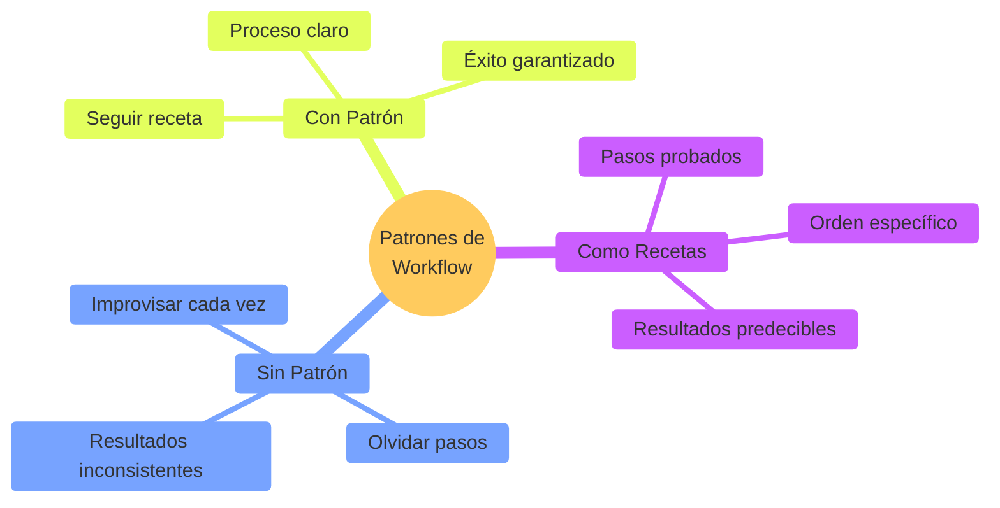
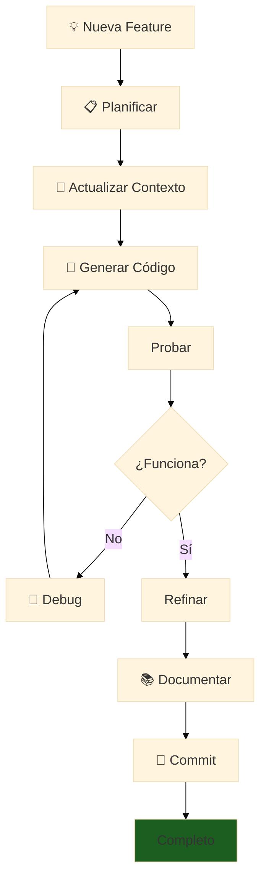
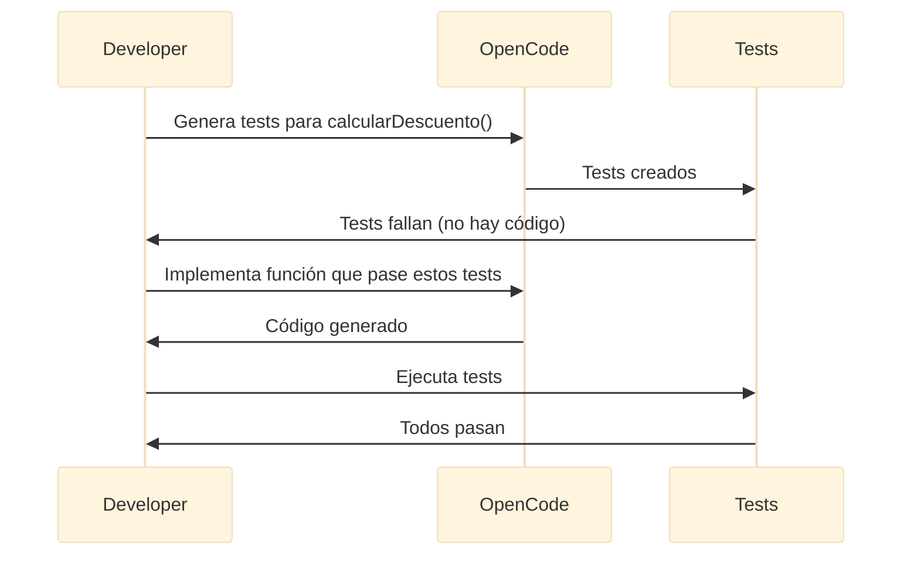
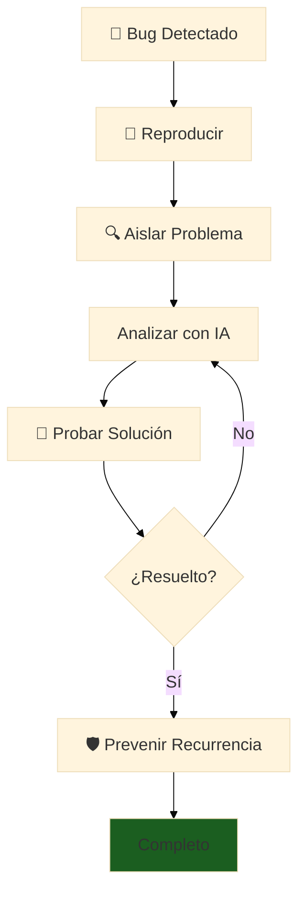
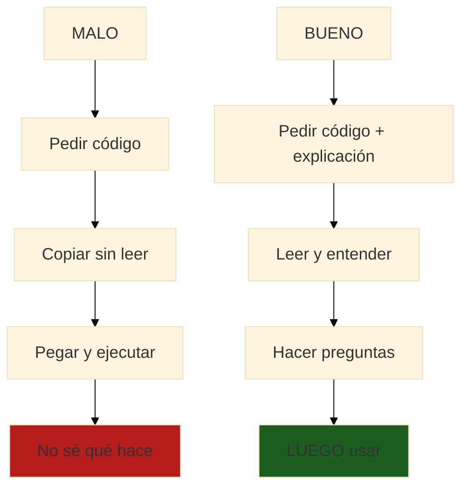
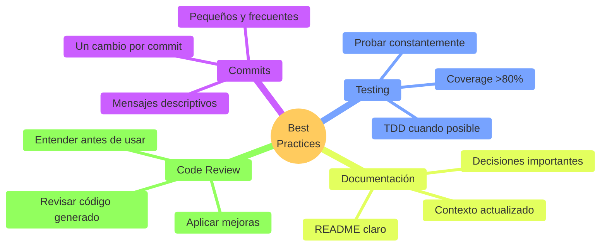
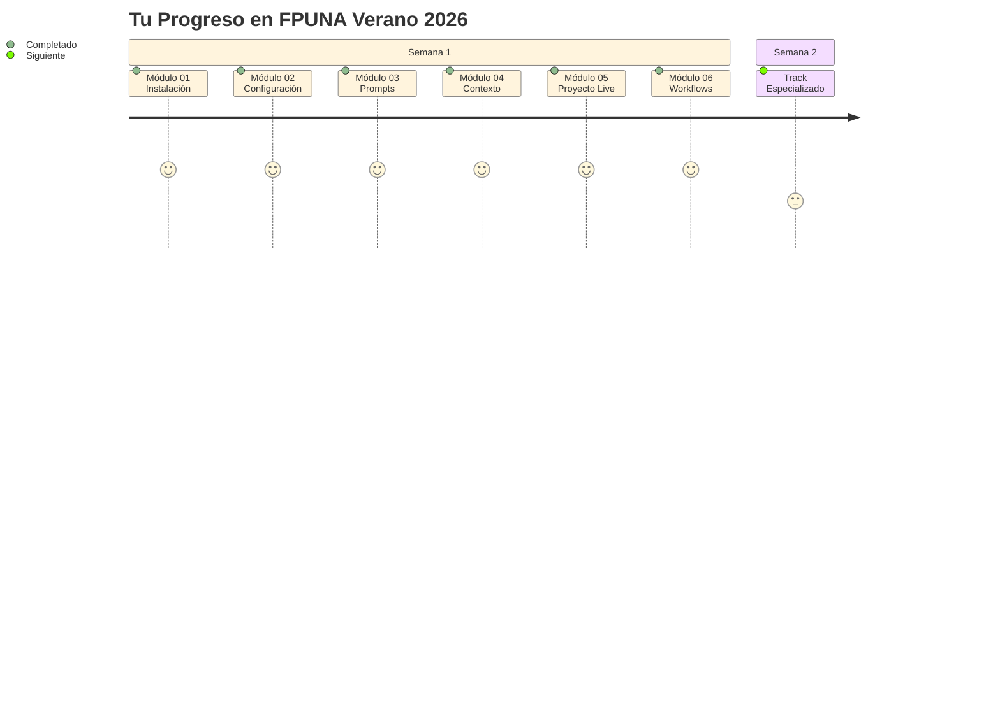

# 🔄 Módulo 06: Patrones de Workflow

## Trabaja Como un Profesional con IA

> **Para Todos**: Este módulo te enseña los "patrones" - formas probadas de trabajar que usan los profesionales. Es como aprender las mejores recetas de cocina después de conocer los ingredientes.

**⏱️ Duración**: 1 hora  
**👤 Nivel**: Intermedio (con Módulos 01-05 completados)  
**🎯 Objetivo**: Dominar workflows profesionales con IA

---

## 🎓 ¿Qué Vas a Lograr?

1. ✅ **Patrones profesionales** - Formas probadas de trabajar
2. ✅ **Workflows específicos** - Para features, bugs, refactoring
3. ✅ **Antipatrones** - Qué NO hacer (errores comunes)
4. ✅ **Best practices** - Cómo ser eficiente y productivo

---

## 🤔 ¿Qué es un "Workflow Pattern"?

### Analogía: Recetas de Cocina



**Workflow Pattern** = Una "receta" probada para una tarea de desarrollo específica.

---

## 📋 Prerrequisitos

✅ **Módulos 01-05 Completados** (OBLIGATORIO)
- Módulo 01: OpenCode instalado
- Módulo 02: Configuración dominada
- Módulo 03: Ingeniería de prompts
- Módulo 04: Ingeniería de contexto
- Módulo 05: Proyecto en vivo visto

✅ **Experiencia Básica**: Haber usado OpenCode al menos 2-3 horas

**Tiempo**: 1 hora

**Checklist**:
- [ ] Completé Módulos 01-05
- [ ] OpenCode funcionando
- [ ] Hice al menos un proyecto pequeño

---

## 🚀 Parte 1: Workflow Básico (15 min)

### Patrón Universal: Feature Development



### Ejemplo Práctico

```bash
# 1. PLANIFICAR (2 min)
echo "Feature: Notificaciones por email" > FEATURE.md

# 2. CONTEXTO (2 min)
cat >> CLAUDE.md << EOF
## Nueva Feature: Notificaciones
- Email cuando libro vencido
- SendGrid API
- Templates en español
EOF

# 3. GENERAR (5 min)
opencode "Implementa sistema de notificaciones según FEATURE.md"

# 4. PROBAR (3 min)
npm test
node test-email.js

# 5. REFINAR (2 min)
opencode "Mejora manejo de errores en envío de emails"

# 6. DOCUMENTAR (2 min)
opencode "Actualiza README con feature de notificaciones"

# 7. COMMIT (1 min)
git add .
git commit -m "feat: add email notifications"
git push
```

---

## 🎯 Parte 2: Patrones Avanzados (25 min)

### Patrón 1: Test-Driven Development (TDD)

**Concepto**: Tests PRIMERO, código DESPUÉS.



**Ejemplo**:

```bash
# Paso 1: Tests primero
opencode "Genera tests para función calcularDescuento(precio, porcentaje):
- Casos normales: 100 con 10% = 90
- Edge cases: 0%, 100%, negativos
- Validaciones: null, undefined, strings"

# Paso 2: Implementar
opencode "Implementa calcularDescuento() que pase ESTOS tests:
[pega tests generados]"

# Paso 3: Verificar
npm test  # ✅ Deben pasar todos
```

### Patrón 2: Refinamiento Iterativo

**Concepto**: Mejora incremental en lugar de perfección inmediata.


**Ejemplo**:

```bash
# Iteración 1: Funcionalidad básica
opencode "Función básica para buscar estudiantes por nombre"

# Iteración 2: Mejoras
opencode "Mejora búsqueda: case-insensitive, nombre parcial"

# Iteración 3: Validación
opencode "Agrega validación de inputs y errores"

# Iteración 4: Performance
opencode "Optimiza para >10,000 estudiantes"

# Iteración 5: Calidad
opencode "Agrega tests y documentación JSDoc"
```

### Patrón 3: Code Review con IA

```bash
# 1. Generar código inicial
opencode "Crea clase GestorInventario con CRUD"

# 2. Pedir review
opencode "Revisa este código y sugiere mejoras en:
- Performance
- Seguridad
- Legibilidad
- Manejo de errores

[pega código]

Formato:
✅ BIEN: [lista]
⚠️ MEJORAR: [lista específica]"

# 3. Aplicar mejoras
opencode "Aplica estas mejoras: [sugerencias específicas]"

# 4. Verificar
npm test && npm run lint
```

### Patrón 4: Debugging Sistemático



**Template de Prompt**:

```bash
opencode "ANÁLISIS DE BUG

ERROR:
TypeError: Cannot read property 'nombre' of undefined
at obtenerNombreEstudiante (estudiantes.js:45)

CÓDIGO:
[pega código relevante]

CONTEXTO:
- Falla cuando se busca por carnet inexistente
- Base de datos tiene 500 estudiantes
- Solo pasa con carnets que no existen

NECESITO:
1. Causa raíz del error
2. Por qué solo ciertos carnets
3. Solución con código corregido
4. Tests para prevenir recurrencia"
```

---

## ❌ Parte 3: Antipatrones (Errores Comunes) (10 min)

### Antipatrón 1: Copiar Sin Entender



### Antipatrón 2: Prompts Vagos Repetidos

| ❌ Malo | ✅ Bueno |
|---------|----------|
| `opencode "Crea una app"` | `opencode "[Prompt detallado]"` |
| `opencode "Crea una app"` | `opencode "Mejora agregando: [específico]"` |
| `opencode "Crea una app"` | (Iteración inteligente) |
| 😫 Frustración | 🎉 Resultado |

### Antipatrón 3: Sin Probar

```bash
# ❌ MALO
opencode "Genera todo el proyecto completo"
# Asumir que funciona
# Entregar sin probar
# 💥 Desastre

# ✅ BUENO
opencode "Genera componente X"
npm test  # Probar X
opencode "Genera componente Y"
npm test  # Probar Y
# Construcción incremental
```

### Antipatrón 4: Sobre-dependencia

| Señal de Alerta | Solución |
|-----------------|----------|
| Preguntas a IA en lugar de docs | Leer documentación primero |
| No intentar resolver solo | Intentar 10 min antes de IA |
| Perdiste habilidad sin IA | Practicar código sin IA semanalmente |

---

## 🔧 Parte 4: Workflows Específicos (10 min)

### Workflow: Nuevo Feature

```bash
# 1. Branch
git checkout -b feature/notificaciones

# 2. Contexto
# Actualizar CLAUDE.md con descripción

# 3. TDD
opencode "Tests para sistema de notificaciones"
npm test  # ❌ Deben fallar (no hay implementación)

# 4. Implementar
opencode "Implementa notificaciones que pasen tests"
npm test  # ✅ Deben pasar

# 5. Integrar
npm run lint
npm run build

# 6. Documentar
opencode "Actualiza README.md con nueva feature"

# 7. Commit y PR
git add .
git commit -m "feat: add notification system"
git push origin feature/notificaciones
gh pr create --title "Add Notifications" --body "..."
```

### Workflow: Bug Fix

```bash
# 1. Reproducir bug
# Escribir steps exactos

# 2. Test que falle
opencode "Test que reproduzca este bug: [descripción]"
npm test  # ❌ Debe fallar

# 3. Fix
opencode "Corrige bug que causa este test falle: [test + código]"
npm test  # ✅ Debe pasar

# 4. Regression test
npm test  # ✅ Todo debe pasar

# 5. Commit
git commit -m "fix: resolve [bug description]"
```

### Workflow: Refactoring

```bash
# 1. Tests de seguridad
opencode "Tests completos para [componente]"
npm test  # ✅ Baseline

# 2. Refactor
opencode "Refactoriza aplicando:
- Single Responsibility
- Funciones pequeñas
- Eliminar duplicación
[código]"

# 3. Verificar
npm test  # ✅ Deben seguir pasando

# 4. Compare
# Performance antes vs después

# 5. Commit
git commit -m "refactor: improve [componente]"
```

---

## 📊 Checklist: Workflow Profesional

### Antes de Empezar
- [ ] ¿Tengo requisitos claros?
- [ ] ¿Actualicé archivos de contexto?
- [ ] ¿Tengo tests existentes funcionando?

### Durante Desarrollo
- [ ] ¿Escribí tests primero (TDD)?
- [ ] ¿Probé cada cambio incrementalmente?
- [ ] ¿Revisé código generado?
- [ ] ¿Entiendo lo que hace el código?

### Antes de Commit
- [ ] ¿Todos los tests pasan?
- [ ] ¿Lint sin errores?
- [ ] ¿Documentación actualizada?
- [ ] ¿Mensaje de commit descriptivo?

### Después de Completar
- [ ] ¿Actualicé CLAUDE.md?
- [ ] ¿Agregué tests para edge cases?
- [ ] ¿Hice code review (auto o con IA)?

---

## 🎓 Mejores Prácticas

### ✅ HACER



### ❌ NO HACER

1. Commits gigantes
2. Asumir que funciona sin probar
3. Ignorar warnings de linter
4. Copiar sin entender
5. Contexto obsoleto
6. Regenerar todo en lugar de iterar

---

## 📝 Quiz de Evaluación

### Instrucciones
- **Total**: 10 preguntas
- **Tiempo estimado**: 20 minutos
- **Aprobación**: 7/10 o más
- **Tipo**: Opción múltiple, verdadero/falso, respuesta corta

---

### Preguntas

**1. ¿Cuál es el orden correcto del workflow básico de desarrollo con IA?**
a) Generar → Planificar → Probar → Documentar  
b) Planificar → Contexto → Generar → Probar → Refinar → Documentar → Commit  
c) Probar → Generar → Commit → Documentar  
d) Contexto → Generar → Commit  

**2. En TDD (Test-Driven Development), ¿qué se hace PRIMERO?**
a) Escribir el código  
b) Escribir los tests  
c) Documentar  
d) Hacer commit  

**3. Verdadero o Falso: El refinamiento iterativo busca perfección inmediata en lugar de mejoras incrementales.**

**4. ¿Cuál de estos es un ANTIPATRÓN?**
a) Escribir tests primero  
b) Commits pequeños y frecuentes  
c) Copiar código sin entender qué hace  
d) Pedir code review a la IA  

**5. ¿Qué debe incluir un prompt para debugging efectivo? (Selecciona 3)**
a) El error exacto con stack trace  
b) Solo decir "no funciona"  
c) El código relevante  
d) El contexto de cuándo ocurre  
e) Un emoji triste  

**6. Describe en 2-3 oraciones qué es un "workflow pattern" y por qué es útil.**

**7. En el patrón de refinamiento iterativo, ¿cuál es el orden recomendado?**
a) Básico → Tests → Validación → Optimización → Docs  
b) Optimización → Básico → Tests → Docs  
c) Tests → Básico → Docs → Optimización  
d) Docs → Básico → Tests → Validación  

**8. Verdadero o Falso: Es mejor hacer commits gigantes al final del día que commits pequeños frecuentes.**

**9. ¿Cuál es el workflow correcto para un bug fix?**
a) Fix directo → Commit → Esperar que funcione  
b) Reproducir → Test que falle → Fix → Test pasa → Regression test → Commit  
c) Commit → Fix → Test  
d) Test → Commit → Fix  

**10. En el checklist de workflow profesional, ¿qué debes verificar ANTES de hacer commit? (Selecciona 3)**
a) Todos los tests pasan  
b) Lint sin errores  
c) Está lloviendo afuera  
d) Documentación actualizada  
e) Tu café está caliente  

---

### Respuestas

**1. b) Planificar → Contexto → Generar → Probar → Refinar → Documentar → Commit**

Este es el workflow universal mostrado en el diagrama de flujo. Siempre empieza con planificación, luego contexto, generación, pruebas, refinamiento, documentación, y finalmente commit.

---

**2. b) Escribir los tests**

En TDD, SIEMPRE escribes los tests PRIMERO. Los tests fallan (porque no hay código), luego implementas el código que hace pasar los tests. Este patrón garantiza cobertura.

---

**3. Falso**

El refinamiento iterativo busca MEJORAS INCREMENTALES, no perfección inmediata. Empiezas con versión básica (V1) y mejoras paso a paso (V2, V3, V4, V5).

---

**4. c) Copiar código sin entender qué hace**

Este es el antipatrón "Copiar Sin Entender". Los otros son BUENAS prácticas: TDD, commits pequeños, y code review con IA son workflows recomendados.

---

**5. a) El error exacto con stack trace, c) El código relevante, d) El contexto de cuándo ocurre**

Un prompt de debugging efectivo necesita: el ERROR completo, el CÓDIGO relevante, y el CONTEXTO de cuándo/por qué ocurre. Decir "no funciona" sin detalles es inútil.

---

**6. Respuesta Modelo:**

"Un workflow pattern es una 'receta probada' para una tarea específica de desarrollo. Es útil porque proporciona pasos probados que llevan a resultados predecibles, evitando improvisación y errores comunes. Es como seguir una receta de cocina en lugar de improvisar."

**Criterios de evaluación:**
- Define como "receta/pasos probados" (0.5 puntos)
- Menciona "resultados predecibles/consistentes" (0.5 puntos)
- Explica utilidad (evitar errores, eficiencia) (0.5 puntos)

**Puntaje**: 1.5/1.5 si incluye los 3 elementos

---

**7. a) Básico → Tests → Validación → Optimización → Docs**

Como muestra el diagrama V1→V5: primero funcionalidad básica, luego tests, validación de inputs, optimización de performance, y finalmente documentación completa.

---

**8. Falso**

Commits pequeños y frecuentes son MEJORES. Commits gigantes son difíciles de revisar, difíciles de revertir si algo falla, y no documentan el progreso incremental.

---

**9. b) Reproducir → Test que falle → Fix → Test pasa → Regression test → Commit**

El workflow sistemático de debugging: primero REPRODUCES el bug, escribes un TEST que FALLE, corriges el código, verificas que el test PASE, ejecutas regression tests (asegurar que no rompiste nada más), y finalmente commit.

---

**10. a) Todos los tests pasan, b) Lint sin errores, d) Documentación actualizada**

Antes de commit siempre verifica: tests pasan ✅, lint limpio ✅, docs actualizados ✅. El clima y tu café no afectan la calidad del código 😄.

---

### Criterios de Evaluación

| Rango | Calificación | Interpretación |
|-------|--------------|----------------|
| 9-10 | Excelente | Dominio completo de workflows |
| 7-8 | Bueno | Comprensión sólida, práctica recomendada |
| 5-6 | Suficiente | Revisar antipatrones y TDD |
| 0-4 | Insuficiente | Repasar todo el módulo |

**Nota sobre pregunta 6**: Vale 1.5 puntos (respuesta abierta). Las demás valen 1 punto cada una, ajustado para total de 10 puntos.

---

## 🎉 ¡Completaste Core Foundation!



### Lo Que Dominaste

1. ✅ **Instalación** - OpenCode + Oh My OpenCode
2. ✅ **Configuración** - MCPs, Skills, Hooks, Rules
3. ✅ **Prompts** - Comunicación efectiva con IA
4. ✅ **Contexto** - Memoria del proyecto
5. ✅ **Práctica** - Proyecto completo en vivo
6. ✅ **Workflow** - Patrones profesionales

### Estás Listo Para

🚀 **Semana 2**: Elige tu track especializado según tu carrera
🚀 **Proyectos Reales**: Aplica lo aprendido
🚀 **Desarrollo Profesional**: Trabaja como experto aumentado por IA

---

## 🎯 Próximos Pasos

1. **Practica**: Aplica estos workflows en un proyecto personal
2. **Semana 2**: Elige tu track:
   - Software Development
   - Electronics & Automation
   - Aeronautical Engineering
   - Marketing & Communication
   - Research & Academia
   - Hospitality & Tourism
   - QA Automation
   - Web Development

3. **Continúa aprendiendo**: Los mejores desarrolladores nunca dejan de mejorar

---

## 💭 Reflexión Final

Antes de continuar:

1. **¿Qué patrón usarás más?**
2. **¿Qué antipatrón debes evitar?**
3. **¿Cómo aplicarás esto en tu trabajo?**

**Comparte en Slack** (#fpuna-workflows) - ayuda a otros con tus insights.

---

*Módulo creado para FPUNA Verano 2026*  
*Actualizado: Enero 2026*  
*¡Éxito en tu camino como desarrollador aumentado por IA!* 🚀
