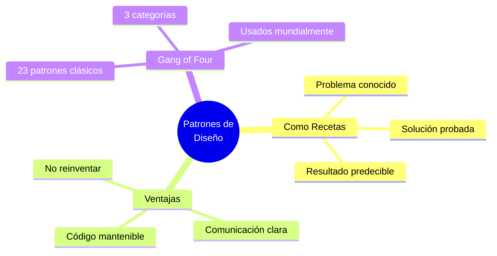
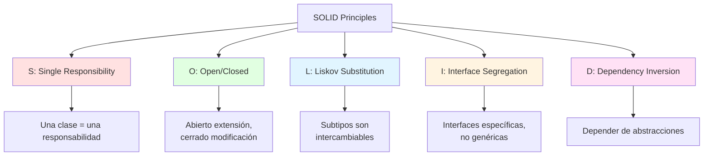
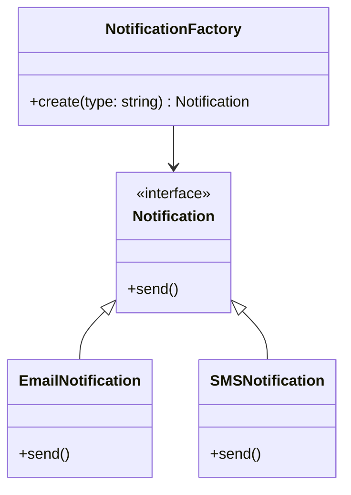
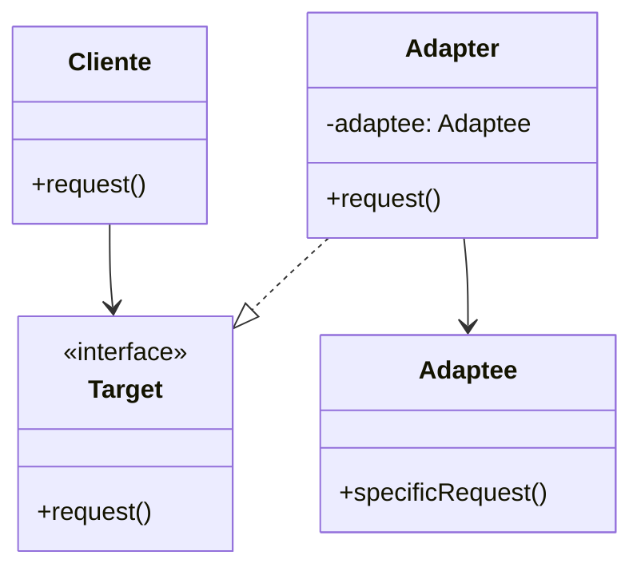
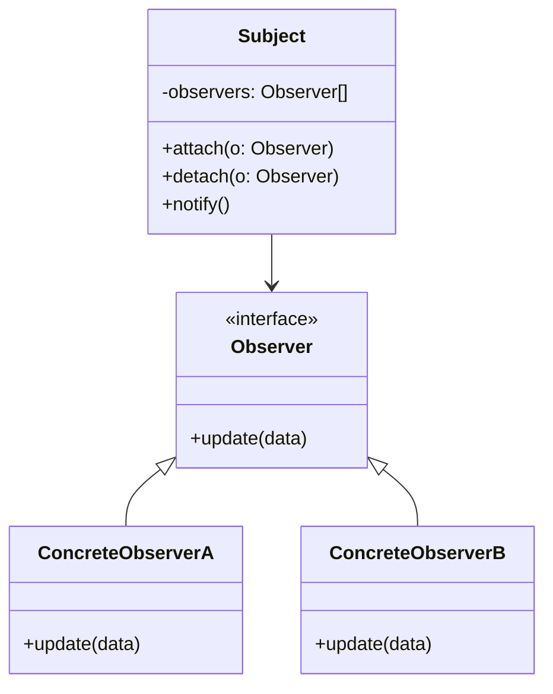
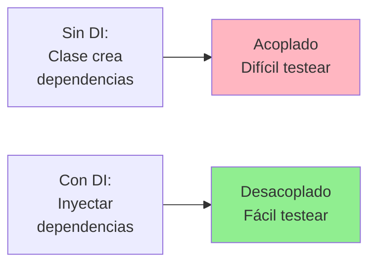

# 🎨 Módulo 02: Patrones de Diseño

## Soluciones Probadas para Problemas Comunes

> **Para Desarrolladores**: Los patrones de diseño son como "recetas de cocina" para problemas frecuentes en programación. No reinventes la rueda - usa soluciones que millones de desarrolladores ya probaron y perfeccionaron.

**⏱️ Duración**: 4 horas  
**👤 Nivel**: Intermedio (con OOP sólido)  
**🎯 Objetivo**: Aplicar patrones de diseño profesionales con ayuda de IA

---

## 🎓 ¿Qué Vas a Lograr?

1. ✅ **SOLID** - Dominar los 5 principios fundamentales
2. ✅ **Creacionales** - Factory, Singleton, Builder
3. ✅ **Estructurales** - Adapter, Decorator, Facade
4. ✅ **Comportamiento** - Observer, Strategy, Command
5. ✅ **Dependency Injection** - Código desacoplado y testeable
6. ✅ **OpenCode** - Generar y aplicar patrones con IA

---

## 🤔 ¿Qué son los Patrones de Diseño?

### Analogía: Recetas de Cocina



**Patrón** = Solución reutilizable a un problema recurrente en un contexto particular.

---

## 🏗️ Parte 1: Principios SOLID (45 min)

### Los 5 Pilares del Buen Diseño



### 1. Single Responsibility Principle (SRP)

**Principio**: Una clase debe tener solo UNA razón para cambiar.

```typescript
// ❌ MALO: Múltiples responsabilidades
class Usuario {
  guardar() { /* DB logic */ }
  enviarEmail() { /* email logic */ }
  generarReporte() { /* report logic */ }
}

// ✅ BUENO: Separar responsabilidades
class Usuario {
  // Solo datos y lógica de usuario
}

class UsuarioRepository {
  guardar(usuario: Usuario) { /* DB */ }
}

class EmailService {
  enviar(to: string, mensaje: string) { /* email */ }
}

class ReporteService {
  generar(usuario: Usuario) { /* report */ }
}
```

**Generar con OpenCode**:
```bash
opencode "Refactoriza esta clase aplicando SRP:
[pega clase con múltiples responsabilidades]

Divide en clases especializadas, cada una con UNA responsabilidad.
Código TypeScript con comentarios en español."
```

### 2. Open/Closed Principle (OCP)

**Principio**: Abierto para extensión, cerrado para modificación.

```typescript
// ❌ MALO: Modificar clase existente
class CalculadorDescuento {
  calcular(tipo: string, monto: number) {
    if (tipo === 'estudiante') return monto * 0.9;
    if (tipo === 'senior') return monto * 0.8;
    // Cada nuevo tipo requiere modificar esta clase
  }
}

// ✅ BUENO: Extender sin modificar
interface EstrategiaDescuento {
  aplicar(monto: number): number;
}

class DescuentoEstudiante implements EstrategiaDescuento {
  aplicar(monto: number) { return monto * 0.9; }
}

class DescuentoSenior implements EstrategiaDescuento {
  aplicar(monto: number) { return monto * 0.8; }
}

// Agregar nuevo tipo = nueva clase, no modificar existentes
```

### 3-5. Otros Principios (Resumen)

| Principio | Qué Significa | Ejemplo |
|-----------|---------------|---------|
| **Liskov** | Subtipos reemplazan tipos base sin romper | `Cuadrado` no debería heredar `Rectángulo` |
| **Interface Segregation** | Muchas interfaces pequeñas > una grande | `Volador`, `Nadador` en lugar de `Animal` |
| **Dependency Inversion** | Depender de abstracciones, no concretos | Inyectar `IDatabase` no `PostgreSQL` |

---

## 🏭 Parte 2: Patrones Creacionales (60 min)

### Factory Pattern

**Problema**: Crear objetos sin exponer lógica de creación.



**Implementación**:

```typescript
// Factory
class NotificationFactory {
  static create(tipo: 'email' | 'sms'): Notification {
    switch (tipo) {
      case 'email':
        return new EmailNotification();
      case 'sms':
        return new SMSNotification();
      default:
        throw new Error('Tipo desconocido');
    }
  }
}

// Uso
const notif = NotificationFactory.create('email');
notif.send('Mensaje');
```

**Generar con OpenCode**:
```bash
opencode "Genera Factory pattern para pagos:
- PaymentFactory
- Interfaces: PaymentMethod
- Implementations: CreditCard, Bitcoin, BankTransfer
- Método: process(amount: number)
TypeScript con validaciones y comentarios español"
```

### Singleton Pattern

**Problema**: Asegurar UNA sola instancia de una clase.

```typescript
class DatabaseConnection {
  private static instance: DatabaseConnection;
  
  // Constructor privado - no se puede instanciar desde afuera
  private constructor() {
    // Inicializar conexión
  }
  
  static getInstance(): DatabaseConnection {
    if (!this.instance) {
      this.instance = new DatabaseConnection();
    }
    return this.instance;
  }
  
  query(sql: string) {
    // Ejecutar query
  }
}

// Uso
const db1 = DatabaseConnection.getInstance();
const db2 = DatabaseConnection.getInstance();
// db1 === db2 (misma instancia)
```

**⚠️ Cuidado**: Singleton puede dificultar testing. Usa Dependency Injection en su lugar cuando sea posible.

### Builder Pattern

**Problema**: Construir objetos complejos paso a paso.

```typescript
class Usuario {
  constructor(
    public nombre: string,
    public email: string,
    public edad?: number,
    public direccion?: string,
    public telefono?: string,
  ) {}
}

// ❌ MALO: Constructor con muchos parámetros
const user = new Usuario('Juan', 'juan@example.com', 25, 'Calle...', '0981...');

// ✅ BUENO: Builder pattern
class UsuarioBuilder {
  private nombre: string;
  private email: string;
  private edad?: number;
  private direccion?: string;
  private telefono?: string;
  
  setNombre(nombre: string) {
    this.nombre = nombre;
    return this; // Permite encadenar
  }
  
  setEmail(email: string) {
    this.email = email;
    return this;
  }
  
  setEdad(edad: number) {
    this.edad = edad;
    return this;
  }
  
  build(): Usuario {
    if (!this.nombre || !this.email) {
      throw new Error('Nombre y email son requeridos');
    }
    return new Usuario(
      this.nombre,
      this.email,
      this.edad,
      this.direccion,
      this.telefono,
    );
  }
}

// Uso elegante
const usuario = new UsuarioBuilder()
  .setNombre('Juan')
  .setEmail('juan@example.com')
  .setEdad(25)
  .build();
```

---

## 🔗 Parte 3: Patrones Estructurales (60 min)

### Adapter Pattern

**Problema**: Hacer que dos interfaces incompatibles trabajen juntas.



**Ejemplo Real**: Integrar API de pago externa

```typescript
// API externa (no podemos modificar)
class StripeAPI {
  makePayment(cardNumber: string, amount: number, currency: string) {
    // Lógica de Stripe
  }
}

// Nuestra interfaz estándar
interface PaymentProcessor {
  process(amount: number, details: PaymentDetails): boolean;
}

// Adapter
class StripeAdapter implements PaymentProcessor {
  private stripe = new StripeAPI();
  
  process(amount: number, details: PaymentDetails): boolean {
    // Adaptar nuestra interfaz a Stripe
    return this.stripe.makePayment(
      details.cardNumber,
      amount,
      'PYG' // Guaraníes
    );
  }
}

// Uso
const processor: PaymentProcessor = new StripeAdapter();
processor.process(150000, { cardNumber: '...' });
```

### Decorator Pattern

**Problema**: Agregar funcionalidad a objetos dinámicamente.

```typescript
// Componente base
interface Coffee {
  cost(): number;
  description(): string;
}

class SimpleCoffee implements Coffee {
  cost() { return 5000; } // ₲5,000
  description() { return 'Café simple'; }
}

// Decoradores
class MilkDecorator implements Coffee {
  constructor(private coffee: Coffee) {}
  
  cost() {
    return this.coffee.cost() + 2000; // +₲2,000
  }
  
  description() {
    return this.coffee.description() + ', con leche';
  }
}

class SugarDecorator implements Coffee {
  constructor(private coffee: Coffee) {}
  
  cost() {
    return this.coffee.cost() + 500;
  }
  
  description() {
    return this.coffee.description() + ', con azúcar';
  }
}

// Uso
let cafe: Coffee = new SimpleCoffee();
cafe = new MilkDecorator(cafe);
cafe = new SugarDecorator(cafe);
console.log(cafe.description()); // "Café simple, con leche, con azúcar"
console.log(cafe.cost()); // 7500
```

### Facade Pattern

**Problema**: Simplificar interfaz compleja con una más simple.

```typescript
// Sistema complejo (muchas clases)
class UserService { /* ... */ }
class EmailService { /* ... */ }
class LoggerService { /* ... */ }
class AuthService { /* ... */ }

// Facade que simplifica
class RegistrationFacade {
  constructor(
    private userService: UserService,
    private emailService: EmailService,
    private logger: LoggerService,
    private auth: AuthService,
  ) {}
  
  // Un método simple que orquesta todo
  async registerUser(data: UserData) {
    this.logger.log('Iniciando registro...');
    
    const user = await this.userService.create(data);
    const token = await this.auth.generateToken(user);
    await this.emailService.sendWelcome(user.email);
    
    this.logger.log('Registro completado');
    return { user, token };
  }
}

// Uso simple
const facade = new RegistrationFacade(/*...*/);
await facade.registerUser({ nombre: 'Juan', email: '...' });
```

---

## 🎯 Parte 4: Patrones de Comportamiento (60 min)

### Observer Pattern

**Problema**: Notificar a múltiples objetos cuando algo cambia.



**Ejemplo**: Sistema de notificaciones

```typescript
// Subject (Observable)
class OrderSubject {
  private observers: Observer[] = [];
  
  attach(observer: Observer) {
    this.observers.push(observer);
  }
  
  notify(order: Order) {
    for (const observer of this.observers) {
      observer.update(order);
    }
  }
  
  createOrder(order: Order) {
    // Crear orden...
    this.notify(order); // Notificar a todos
  }
}

// Observers
class EmailObserver implements Observer {
  update(order: Order) {
    // Enviar email de confirmación
  }
}

class InventoryObserver implements Observer {
  update(order: Order) {
    // Actualizar inventario
  }
}

class AnalyticsObserver implements Observer {
  update(order: Order) {
    // Registrar métrica
  }
}

// Setup
const orderSubject = new OrderSubject();
orderSubject.attach(new EmailObserver());
orderSubject.attach(new InventoryObserver());
orderSubject.attach(new AnalyticsObserver());

// Uso
orderSubject.createOrder(newOrder); // Los 3 observers son notificados
```

### Strategy Pattern

**Problema**: Seleccionar algoritmo en runtime.

```typescript
// Estrategias de envío
interface ShippingStrategy {
  calculate(peso: number, distancia: number): number;
}

class StandardShipping implements ShippingStrategy {
  calculate(peso: number, distancia: number) {
    return peso * 1000 + distancia * 500;
  }
}

class ExpressShipping implements ShippingStrategy {
  calculate(peso: number, distancia: number) {
    return (peso * 1000 + distancia * 500) * 2;
  }
}

class FreeShipping implements ShippingStrategy {
  calculate(peso: number, distancia: number) {
    return 0;
  }
}

// Contexto
class ShippingCalculator {
  constructor(private strategy: ShippingStrategy) {}
  
  setStrategy(strategy: ShippingStrategy) {
    this.strategy = strategy;
  }
  
  calculate(peso: number, distancia: number) {
    return this.strategy.calculate(peso, distancia);
  }
}

// Uso
const calculator = new ShippingCalculator(new StandardShipping());
calculator.calculate(5, 100); // Costo estándar

// Cambiar estrategia dinámicamente
calculator.setStrategy(new ExpressShipping());
calculator.calculate(5, 100); // Costo express
```

---

## 💉 Parte 5: Dependency Injection (45 min)

### Concepto: Invertir el Control



**Ejemplo**:

```typescript
// ❌ SIN Dependency Injection
class UserService {
  private db = new PostgresDatabase(); // Acoplamiento fuerte
  
  async getUser(id: string) {
    return this.db.query(`SELECT * FROM users WHERE id = ${id}`);
  }
}

// ✅ CON Dependency Injection
interface Database {
  query(sql: string): Promise<any>;
}

class UserService {
  // Inyectar dependencia via constructor
  constructor(private db: Database) {}
  
  async getUser(id: string) {
    return this.db.query(`SELECT * FROM users WHERE id = ${id}`);
  }
}

// Producción
const realDb = new PostgresDatabase();
const userService = new UserService(realDb);

// Tests
const mockDb = new MockDatabase();
const userService = new UserService(mockDb); // Fácil de testear
```

### DI con NestJS

```typescript
// Injectable service
@Injectable()
class UserService {
  constructor(
    @InjectRepository(User)
    private userRepo: Repository<User>,
    private emailService: EmailService,
  ) {}
  
  async create(data: CreateUserDto) {
    const user = await this.userRepo.save(data);
    await this.emailService.sendWelcome(user.email);
    return user;
  }
}

// NestJS inyecta automáticamente las dependencias
```

---

## 🎯 Ejercicio: Refactorizar Código Legacy

### Objetivo

Tomar código "malo" y aplicar patrones de diseño con OpenCode.

### Código Inicial (Malo)

```typescript
class OrderProcessor {
  processOrder(order: any) {
    // Validación
    if (!order.items) throw new Error('No items');
    
    // Cálculo
    let total = 0;
    for (const item of order.items) {
      total += item.price * item.quantity;
    }
    
    // Aplicar descuento
    if (order.customerType === 'premium') {
      total *= 0.9;
    } else if (order.customerType === 'student') {
      total *= 0.85;
    }
    
    // Guardar en DB
    const db = new PostgresClient();
    db.query(`INSERT INTO orders VALUES (...)`);
    
    // Enviar email
    const emailClient = new SendGridClient();
    emailClient.send(order.email, 'Order confirmed');
    
    // Log
    console.log('Order processed');
    
    return { orderId: '...', total };
  }
}
```

### Refactorizar con OpenCode

```bash
opencode "Refactoriza este código aplicando patrones de diseño:

[pega código]

APLICAR:
1. SRP - Separar responsabilidades
2. Strategy - Para descuentos
3. Factory - Para notificaciones
4. Dependency Injection - Para DB y email
5. Repository - Para persistencia

Genera:
- OrderService (orquestador)
- DiscountStrategy (interfaz + implementations)
- OrderRepository (DB)
- NotificationService (emails)
- Logger service

TypeScript con NestJS decorators y comentarios español"
```

---

## ✅ Checklist de Patrones

Cuando escribas código, pregúntate:

### Diseño
- [ ] ¿Cada clase tiene UNA sola responsabilidad? (SRP)
- [ ] ¿Puedo extender sin modificar? (OCP)
- [ ] ¿Dependo de abstracciones? (DIP)

### Creación
- [ ] ¿Necesito control sobre creación de objetos? → **Factory**
- [ ] ¿Solo una instancia global? → **Singleton** (o DI)
- [ ] ¿Objeto complejo con muchos parámetros? → **Builder**

### Estructura
- [ ] ¿Interfaces incompatibles? → **Adapter**
- [ ] ¿Agregar funcionalidad dinámicamente? → **Decorator**
- [ ] ¿Simplificar API compleja? → **Facade**

### Comportamiento
- [ ] ¿Notificar a múltiples objetos? → **Observer**
- [ ] ¿Algoritmos intercambiables? → **Strategy**

---

## 🎓 Mejores Prácticas

### ✅ HACER

1. **Empezar simple** - No sobre-ingenierizar
2. **Refactorizar** - Aplicar patrones cuando se necesiten
3. **Testear** - Patrones mejoran testabilidad
4. **Documentar** - Explicar qué patrón y por qué

### ❌ NO HACER

1. **Forzar patrones** - Úsalos cuando resuelven un problema
2. **Todos a la vez** - Aplicar incrementalmente
3. **Ignorar contexto** - Lo que funciona en Java puede no en JavaScript

---

## 🎉 Resumen

### Lo Que Dominaste

✅ **SOLID** - Los 5 principios fundamentales  
✅ **Creacionales** - Factory, Singleton, Builder  
✅ **Estructurales** - Adapter, Decorator, Facade  
✅ **Comportamiento** - Observer, Strategy  
✅ **DI** - Dependency Injection  
✅ **OpenCode** - Generar y refactorizar con patrones

**Continúa con**: [Módulo 03 - Testing & TDD](./03-pruebas-tdd.md)

---

*Módulo creado para FPUNA Verano 2026*  
*Track: Software Development*
