# 🏗️ Módulo 05: Diseño de Sistemas (System Design)

## Diseña Sistemas que Escalan a Millones de Usuarios

> **Para Desarrolladores**: Este módulo te enseña a diseñar sistemas de gran escala que soportan millones de usuarios. Aprenderás los principios fundamentales de escalabilidad, patrones de arquitectura distribuida, y cómo resolver problemas de system design como lo hacen en Facebook, Google y Amazon. OpenCode te ayudará a documentar y generar arquitecturas profesionales.

**⏱️ Duración**: 4 horas  
**👤 Nivel**: Avanzado (requiere módulos 01-04 completados)  
**🎯 Objetivo**: Dominar diseño de sistemas a gran escala y prepararte para entrevistas técnicas

---

## 🎓 ¿Qué Vas a Lograr?

1. ✅ **Entender escalabilidad** - Horizontal vs vertical, trade-offs
2. ✅ **Diseñar arquitecturas** - Load balancers, caches, CDNs, sharding
3. ✅ **Aplicar patrones** - Microservicios, event-driven, CQRS
4. ✅ **Resolver casos reales** - Twitter-like, URL shortener, chat system
5. ✅ **Documentar con IA** - OpenCode para generar arquitecturas y specs

---

## 🤔 ¿Qué es System Design?

### Analogía: Sistema de Transporte de Asunción

```mermaid
mindmap
  root((System Design))
    Ciudad
      Rutas optimizadas
      Semáforos coordinados
      Terminales distribuidas
      Escalable agregar buses
    Sistema
      APIs bien diseñadas
      Load balancing
      Servidores distribuidos
      Escalable agregar nodos
```

**System Design** = El arte de diseñar sistemas de software que funcionan eficientemente bajo alta demanda, crecen sin romperse, y manejan millones de usuarios.

### ¿Por Qué es Crítico en Paraguay?

**Realidad del mercado local**:
- ✅ **Softtek** - System design obligatorio para nivel Senior+ (₲25M+)
- ✅ **Global Logic** - Entrevistas técnicas incluyen system design
- ✅ **Aruma** - Fintech requiere arquitecturas escalables y seguras
- ✅ **Roshka** - Proyectos multinacionales con millones de usuarios
- ✅ **Startups** - Crecimiento rápido requiere diseño escalable

**Sin system design** = No llegas a Senior Engineer 🚫

---

## 📊 Fundamentos de Escalabilidad

```mermaid
graph TD
    Start[Tu App] --> Q{¿Cómo escalar?}
    
    Q --> A[Vertical<br/>Servidor más potente]
    Q --> B[Horizontal<br/>Más servidores]
    
    A --> A1[✅ Simple<br/>❌ Límite físico<br/>❌ Costoso<br/>❌ Single point of failure]
    B --> B1[✅ Infinito<br/>✅ Alta disponibilidad<br/>❌ Más complejo<br/>⚠️ Necesitas LB]
    
    style A fill:#FFE1E1
    style B fill:#E1FFE1
```

### Escalabilidad Vertical vs Horizontal

**Analogía: Expandir Negocio en Paraguay**

| Aspecto | Vertical (Agrandar local) | Horizontal (Sucursales) |
|---------|---------------------------|-------------------------|
| **Costo** | Muy alto al crecer | Incremental |
| **Límite** | Espacio físico | Casi infinito |
| **Riesgo** | Si cierra, pierdes todo | Si cierra uno, otros siguen |
| **Complejidad** | Baja | Alta (coordinación) |

**Ejemplo Real: FPUNA Matrícula Online**

```mermaid
graph LR
    subgraph "Escalabilidad Vertical"
        A[Servidor 8GB RAM] --> B[Servidor 16GB RAM] --> C[Servidor 64GB RAM]
        C --> D[❌ Límite alcanzado]
    end
    
    subgraph "Escalabilidad Horizontal"
        E[Load Balancer] --> F1[Servidor 1<br/>8GB RAM]
        E --> F2[Servidor 2<br/>8GB RAM]
        E --> F3[Servidor 3<br/>8GB RAM]
        E --> F4[Servidor N<br/>✅ Agregar más]
    end
    
    style C fill:#FFE1E1
    style F4 fill:#E1FFE1
```

---

## 🏢 Parte 1: Fundamentos de Escalabilidad (60 min)

### Concepto: Componentes Clave de un Sistema Escalable

```mermaid
graph TB
    subgraph "Sistema Escalable Completo"
        U[👤 Usuario] --> CDN[🌐 CDN<br/>Contenido estático]
        U --> LB[⚖️ Load Balancer]
        
        LB --> S1[🖥️ Server 1]
        LB --> S2[🖥️ Server 2]
        LB --> S3[🖥️ Server 3]
        
        S1 --> Cache[🚀 Cache<br/>Redis]
        S2 --> Cache
        S3 --> Cache
        
        S1 --> DB1[(🗄️ DB Master)]
        S2 --> DB1
        S3 --> DB1
        
        DB1 --> DB2[(📖 DB Replica 1)]
        DB1 --> DB3[(📖 DB Replica 2)]
    end
    
    style CDN fill:#E1F5FF
    style LB fill:#FFD700
    style Cache fill:#E1FFE1
    style DB1 fill:#FFE1F5
```

### 1. Load Balancer: El Distribuidor de Tareas

**Analogía**: Como un recepcionista en banco que dirige a clientes a cajas disponibles.

**Algoritmos de Load Balancing**:

```mermaid
graph LR
    subgraph "Algoritmos LB"
        A[Round Robin<br/>Turno rotativo]
        B[Least Connections<br/>Servidor menos ocupado]
        C[IP Hash<br/>Mismo cliente → mismo server]
        D[Weighted<br/>Servers con capacidad diferente]
    end
    
    style A fill:#E1FFE1
    style B fill:#FFF4E1
    style C fill:#FFE1F5
    style D fill:#E1F5FF
```

**Ejemplo: Sistema de Inscripciones FPUNA**

```typescript
// Configuración Nginx Load Balancer
upstream fpuna_backend {
    # Round Robin (default)
    server server1.fpuna.edu.py:3000;
    server server2.fpuna.edu.py:3000;
    server server3.fpuna.edu.py:3000;
    
    # Least Connections (mejor para requests largos)
    # least_conn;
    
    # IP Hash (sesiones sticky)
    # ip_hash;
    
    # Weighted (server1 es más potente)
    # server server1.fpuna.edu.py:3000 weight=3;
    # server server2.fpuna.edu.py:3000 weight=1;
}

server {
    listen 80;
    server_name fpuna.edu.py;
    
    location / {
        proxy_pass http://fpuna_backend;
        proxy_set_header Host $host;
        proxy_set_header X-Real-IP $remote_addr;
    }
}
```

### 2. Cache: Archivos al Alcance

**Analogía**: Como tener documentos frecuentes en tu escritorio vs buscarlos en bodega.

**Tipos de Cache**:

```mermaid
graph TD
    subgraph "Niveles de Cache"
        A[🌐 CDN Cache<br/>Imágenes, CSS, JS<br/>TTL: días/semanas]
        B[🔥 Application Cache<br/>API responses<br/>TTL: minutos/horas]
        C[💾 Database Cache<br/>Query results<br/>TTL: segundos/minutos]
        D[🗄️ Database<br/>Fuente de verdad]
        
        A --> B
        B --> C
        C --> D
    end
    
    style A fill:#E1F5FF
    style B fill:#E1FFE1
    style C fill:#FFF4E1
    style D fill:#FFE1F5
```

**Estrategias de Caching**:


**Implementación con Redis**:

```typescript
// user.service.ts
export class UserService {
  constructor(
    private repo: UserRepository,
    private cache: RedisService,
  ) {}
  
  async findById(id: number): Promise<User> {
    const cacheKey = `user:${id}`;
    
    // 1. Intentar obtener de cache
    const cached = await this.cache.get(cacheKey);
    if (cached) {
      console.log('Cache HIT');
      return JSON.parse(cached);
    }
    
    // 2. Si no está en cache, consultar DB
    console.log('Cache MISS');
    const user = await this.repo.findById(id);
    
    // 3. Guardar en cache para próximas consultas
    await this.cache.set(
      cacheKey,
      JSON.stringify(user),
      'EX', // Expiración
      300, // 5 minutos
    );
    
    return user;
  }
  
  async updateUser(id: number, data: UpdateUserDto): Promise<User> {
    // Actualizar en DB
    const user = await this.repo.update(id, data);
    
    // Invalidar cache
    await this.cache.del(`user:${id}`);
    
    return user;
  }
}
```

### 3. CDN: Contenido Cerca del Usuario

**Analogía**: Como tener kioscos de Coca-Cola en cada barrio de Asunción vs una fábrica centralizada.

```mermaid
graph TB
    subgraph "CDN Global"
        O[🌍 Origin Server<br/>Paraguay]
        
        CDN1[📍 CDN Sao Paulo<br/>Edge Server]
        CDN2[📍 CDN Miami<br/>Edge Server]
        CDN3[📍 CDN Madrid<br/>Edge Server]
        
        U1[👤 Usuario Brasil] --> CDN1
        U2[👤 Usuario USA] --> CDN2
        U3[👤 Usuario España] --> CDN3
        
        CDN1 -.Sync.-> O
        CDN2 -.Sync.-> O
        CDN3 -.Sync.-> O
    end
    
    style O fill:#FFE1E1
    style CDN1 fill:#E1FFE1
    style CDN2 fill:#E1FFE1
    style CDN3 fill:#E1FFE1
```

**Qué servir desde CDN**:
- ✅ Imágenes, videos
- ✅ CSS, JavaScript
- ✅ Fuentes, iconos
- ✅ Assets estáticos
- ❌ APIs dinámicas
- ❌ Datos personalizados

### 4. Database Sharding: Dividir para Conquistar

**Analogía**: Como dividir biblioteca FPUNA por facultades - Ingeniería en piso 1, Medicina en piso 2.

```mermaid
graph TD
    subgraph "Database Sharding"
        LB[🔀 App Server]
        
        LB --> S1[(🗄️ Shard 1<br/>Users 1-1000)]
        LB --> S2[(🗄️ Shard 2<br/>Users 1001-2000)]
        LB --> S3[(🗄️ Shard 3<br/>Users 2001-3000)]
        LB --> S4[(🗄️ Shard N<br/>Users ...)]
    end
    
    style LB fill:#FFD700
    style S1 fill:#E1FFE1
    style S2 fill:#E1F5FF
    style S3 fill:#FFF4E1
    style S4 fill:#FFE1F5
```

**Estrategias de Sharding**:

| Estrategia | Ventajas | Desventajas | Ejemplo |
|------------|----------|-------------|---------|
| **Range-based** | Simple | Desbalanceado | Users 1-1000 → Shard1 |
| **Hash-based** | Balanceado | Difícil agregar shards | hash(userId) % numShards |
| **Geography-based** | Baja latencia | Complejidad regional | Paraguay → Shard LATAM |
| **Directory-based** | Flexible | Single point of failure | Lookup table |

**Implementación Hash-based**:

```typescript
// database-sharding.service.ts
export class ShardingService {
  private readonly SHARD_COUNT = 4;
  
  private shards = [
    this.createConnection('shard1.fpuna.edu.py'),
    this.createConnection('shard2.fpuna.edu.py'),
    this.createConnection('shard3.fpuna.edu.py'),
    this.createConnection('shard4.fpuna.edu.py'),
  ];
  
  getShardForUser(userId: number): DatabaseConnection {
    // Hash simple: módulo
    const shardIndex = userId % this.SHARD_COUNT;
    return this.shards[shardIndex];
  }
  
  async findUser(userId: number): Promise<User> {
    const shard = this.getShardForUser(userId);
    return shard.query('SELECT * FROM users WHERE id = ?', [userId]);
  }
  
  async createUser(user: CreateUserDto): Promise<User> {
    // Al crear, asignamos ID primero
    const userId = await this.generateUserId();
    const shard = this.getShardForUser(userId);
    
    return shard.query(
      'INSERT INTO users (id, nombre, email) VALUES (?, ?, ?)',
      [userId, user.nombre, user.email],
    );
  }
}
```

**Problema: Joins entre shards**

```mermaid
graph LR
    subgraph "Problema: Query Cross-Shard"
        A[User 523<br/>Shard 1] -.JOIN.-> B[Posts User 523<br/>Shard 3]
        
        C[❌ JOIN ineficiente<br/>Requiere red]
    end
    
    style A fill:#FFE1E1
    style B fill:#FFE1E1
    style C fill:#FFD700
```

**Solución**: Denormalizar o usar servicios separados

---

## ⚡ Parte 2: Componentes y Patrones Avanzados (90 min)

### Concepto: Message Queue - Sistema de Tickets

**Analogía**: Como sistema de turnos en banco - tomas ticket, esperas tu número.

```mermaid
graph LR
    subgraph "Message Queue System"
        P1[📧 Producer 1<br/>Order Service] --> Q[📮 Queue<br/>RabbitMQ/Kafka]
        P2[📧 Producer 2<br/>User Service] --> Q
        
        Q --> C1[👷 Consumer 1<br/>Email Service]
        Q --> C2[👷 Consumer 2<br/>SMS Service]
        Q --> C3[👷 Consumer 3<br/>Analytics]
    end
    
    style Q fill:#FFD700
    style P1 fill:#E1F5FF
    style P2 fill:#E1F5FF
    style C1 fill:#E1FFE1
    style C2 fill:#E1FFE1
    style C3 fill:#E1FFE1
```

**Ventajas**:
- ✅ **Desacoplamiento**: Servicios no se conocen
- ✅ **Escalabilidad**: Agregar consumers sin cambiar producers
- ✅ **Resiliencia**: Si consumer cae, mensajes esperan en cola
- ✅ **Peak handling**: Absorbe picos de tráfico

**Ejemplo Real: Sistema de Inscripciones FPUNA**

```typescript
// enrollment.service.ts (Producer)
export class EnrollmentService {
  constructor(private queue: MessageQueueService) {}
  
  async enrollStudent(studentId: number, courseId: number) {
    // 1. Procesar inscripción
    const enrollment = await this.repo.create({ studentId, courseId });
    
    // 2. Emitir evento a la cola
    await this.queue.publish('enrollment.created', {
      enrollmentId: enrollment.id,
      studentId,
      courseId,
      timestamp: new Date(),
    });
    
    return enrollment;
  }
}

// email.service.ts (Consumer)
export class EmailService {
  constructor(private queue: MessageQueueService) {
    // Suscribirse a eventos
    this.queue.subscribe('enrollment.created', this.handleEnrollment.bind(this));
  }
  
  async handleEnrollment(data: EnrollmentCreatedEvent) {
    const student = await this.studentService.findById(data.studentId);
    const course = await this.courseService.findById(data.courseId);
    
    await this.sendEmail({
      to: student.email,
      subject: 'Inscripción Confirmada - FPUNA',
      template: 'enrollment-confirmation',
      data: { student, course },
    });
  }
}

// sms.service.ts (Consumer)
export class SMSService {
  constructor(private queue: MessageQueueService) {
    this.queue.subscribe('enrollment.created', this.handleEnrollment.bind(this));
  }
  
  async handleEnrollment(data: EnrollmentCreatedEvent) {
    const student = await this.studentService.findById(data.studentId);
    
    await this.sendSMS({
      to: student.phone,
      message: `Tu inscripción ha sido confirmada. ID: ${data.enrollmentId}`,
    });
  }
}
```

### CAP Theorem: El Trilema de Sistemas Distribuidos


**Ejemplo Práctico: Sistema de "Likes" en Red Social**


**Trade-offs**:

| Sistema | Elección | Ejemplo Real | Cuándo Usar |
|---------|----------|--------------|-------------|
| **CP** | Consistency + Partition | Banco (transferencias) | Datos críticos, finanzas |
| **AP** | Availability + Partition | Facebook likes, Twitter | UX importa más que exactitud inmediata |
| **CA** | Consistency + Availability | SQL local | Sin distribución geográfica |

### Rate Limiting: Control de Tráfico

**Analogía**: Como límite de velocidad en Autopista Ñu Guasu - protege el sistema.


**Algoritmos**:

1. **Token Bucket**: 100 tokens/minuto, cada request consume 1 token
2. **Leaky Bucket**: Requests entran a bucket, salen a tasa fija
3. **Fixed Window**: 100 requests por minuto (00:00-00:59)
4. **Sliding Window**: Últimos 60 segundos

**Implementación con Redis**:

```typescript
// rate-limiter.middleware.ts
export class RateLimiterMiddleware implements NestMiddleware {
  constructor(private redis: RedisService) {}
  
  async use(req: Request, res: Response, next: NextFunction) {
    const userId = req.user?.id || req.ip;
    const key = `rate_limit:${userId}`;
    
    // Token Bucket Algorithm
    const limit = 100; // requests
    const window = 60; // segundos
    
    const current = await this.redis.incr(key);
    
    if (current === 1) {
      // Primera request, establecer expiración
      await this.redis.expire(key, window);
    }
    
    if (current > limit) {
      // Límite excedido
      return res.status(429).json({
        error: 'Too Many Requests',
        message: 'Has excedido el límite de 100 requests por minuto',
        retryAfter: window,
      });
    }
    
    // Agregar headers informativos
    res.setHeader('X-RateLimit-Limit', limit.toString());
    res.setHeader('X-RateLimit-Remaining', (limit - current).toString());
    
    next();
  }
}
```

---

## 🎯 Parte 3: Patrones de Arquitectura de Sistemas (60 min)

### Patrón 1: CQRS (Command Query Responsibility Segregation)

**Concepto**: Separar operaciones de lectura (Query) y escritura (Command).

```mermaid
graph TB
    subgraph "CQRS Pattern"
        C[👤 Cliente]
        
        C --> W[✍️ Write API<br/>Commands]
        C --> R[👁️ Read API<br/>Queries]
        
        W --> DB1[(🗄️ Write DB<br/>PostgreSQL<br/>Normalizado)]
        
        DB1 -.Sync.-> DB2[(📖 Read DB 1<br/>MongoDB<br/>Denormalizado)]
        DB1 -.Sync.-> DB3[(📖 Read DB 2<br/>Elasticsearch<br/>Búsqueda)]
    end
    
    style W fill:#FFE1E1
    style R fill:#E1FFE1
    style DB1 fill:#FFF4E1
```

**Ventajas**:
- ✅ Optimizar lecturas y escrituras independientemente
- ✅ Escalar lecturas sin afectar escrituras
- ✅ Múltiples modelos de lectura (SQL, NoSQL, Search)

**Ejemplo: Sistema de E-Commerce**

```typescript
// write-side: commands
export class ProductCommandService {
  constructor(
    private writeDB: PostgresRepository,
    private eventBus: EventBusService,
  ) {}
  
  async createProduct(command: CreateProductCommand): Promise<void> {
    // 1. Validar y guardar en DB de escritura
    const product = await this.writeDB.products.create({
      name: command.name,
      price: command.price,
      stock: command.stock,
    });
    
    // 2. Emitir evento para sincronizar reads
    await this.eventBus.publish('product.created', product);
  }
  
  async updateStock(command: UpdateStockCommand): Promise<void> {
    await this.writeDB.products.update(command.productId, {
      stock: command.newStock,
    });
    
    await this.eventBus.publish('product.stock.updated', {
      productId: command.productId,
      stock: command.newStock,
    });
  }
}

// read-side: queries (optimizadas para lectura)
export class ProductQueryService {
  constructor(
    private readDB: MongoRepository, // Denormalizado
    private searchDB: ElasticsearchService, // Full-text search
  ) {
    // Suscribirse a eventos de escritura
    this.eventBus.subscribe('product.created', this.handleProductCreated.bind(this));
    this.eventBus.subscribe('product.stock.updated', this.handleStockUpdated.bind(this));
  }
  
  async findById(productId: string): Promise<ProductReadModel> {
    // Leer de MongoDB (denormalizado, rápido)
    return this.readDB.products.findOne({ _id: productId });
  }
  
  async search(query: string): Promise<ProductReadModel[]> {
    // Búsqueda full-text con Elasticsearch
    return this.searchDB.search({
      index: 'products',
      body: {
        query: {
          multi_match: {
            query,
            fields: ['name', 'description', 'category'],
          },
        },
      },
    });
  }
  
  private async handleProductCreated(event: ProductCreatedEvent) {
    // Sincronizar a read databases
    await this.readDB.products.insertOne(event.product);
    await this.searchDB.index({
      index: 'products',
      id: event.product.id,
      body: event.product,
    });
  }
  
  private async handleStockUpdated(event: StockUpdatedEvent) {
    await this.readDB.products.updateOne(
      { _id: event.productId },
      { $set: { stock: event.stock } },
    );
  }
}
```

### Patrón 2: Event Sourcing

**Concepto**: Guardar eventos en vez de estado actual.


**Ventajas**:
- ✅ Auditoría completa (quién, cuándo, qué)
- ✅ Time travel (recrear estado en cualquier momento)
- ✅ Event replay (reconstruir datos)

**Ejemplo: Sistema Bancario**

```typescript
// events
interface AccountEvent {
  accountId: string;
  timestamp: Date;
  type: string;
}

interface AccountCreated extends AccountEvent {
  type: 'ACCOUNT_CREATED';
  initialBalance: number;
}

interface MoneyDeposited extends AccountEvent {
  type: 'MONEY_DEPOSITED';
  amount: number;
}

interface MoneyWithdrawn extends AccountEvent {
  type: 'MONEY_WITHDRAWN';
  amount: number;
}

// event-sourced account
export class Account {
  private events: AccountEvent[] = [];
  
  private balance: number = 0;
  private accountId: string;
  
  // Crear cuenta
  create(accountId: string, initialBalance: number) {
    const event: AccountCreated = {
      accountId,
      timestamp: new Date(),
      type: 'ACCOUNT_CREATED',
      initialBalance,
    };
    
    this.applyEvent(event);
    this.events.push(event);
  }
  
  // Depositar
  deposit(amount: number) {
    const event: MoneyDeposited = {
      accountId: this.accountId,
      timestamp: new Date(),
      type: 'MONEY_DEPOSITED',
      amount,
    };
    
    this.applyEvent(event);
    this.events.push(event);
  }
  
  // Retirar
  withdraw(amount: number) {
    if (this.balance < amount) {
      throw new Error('Saldo insuficiente');
    }
    
    const event: MoneyWithdrawn = {
      accountId: this.accountId,
      timestamp: new Date(),
      type: 'MONEY_WITHDRAWN',
      amount,
    };
    
    this.applyEvent(event);
    this.events.push(event);
  }
  
  // Aplicar evento (reconstruir estado)
  private applyEvent(event: AccountEvent) {
    switch (event.type) {
      case 'ACCOUNT_CREATED':
        this.accountId = event.accountId;
        this.balance = (event as AccountCreated).initialBalance;
        break;
      case 'MONEY_DEPOSITED':
        this.balance += (event as MoneyDeposited).amount;
        break;
      case 'MONEY_WITHDRAWN':
        this.balance -= (event as MoneyWithdrawn).amount;
        break;
    }
  }
  
  // Reconstruir estado desde eventos
  static fromEvents(events: AccountEvent[]): Account {
    const account = new Account();
    events.forEach(event => account.applyEvent(event));
    account.events = events;
    return account;
  }
  
  getBalance(): number {
    return this.balance;
  }
  
  getEvents(): AccountEvent[] {
    return this.events;
  }
}

// ejemplo de uso
const account = new Account();
account.create('ACC-001', 1000000); // Gs. 1,000,000
account.deposit(500000); // + Gs. 500,000
account.withdraw(200000); // - Gs. 200,000

console.log(account.getBalance()); // Gs. 1,300,000
console.log(account.getEvents()); // [3 eventos]

// Time travel: ver balance hace 2 eventos
const pastAccount = Account.fromEvents(account.getEvents().slice(0, 2));
console.log(pastAccount.getBalance()); // Gs. 1,500,000
```

---

## 🌐 Parte 4: System Design Interview & Case Studies (30 min)

### Caso 1: Diseñar Twitter-like (Ñande Twitter)

**Requisitos**:
- 10M usuarios activos
- Publicar tweets (280 caracteres)
- Timeline personalizado (tweets de quienes sigues)
- Likes, retweets, replies
- Búsqueda de tweets

**Arquitectura Propuesta**:

```mermaid
graph TB
    subgraph "Twitter-like System"
        U[👤 Usuario] --> CDN[🌐 CDN<br/>Assets estáticos]
        U --> LB[⚖️ Load Balancer]
        
        LB --> API1[API Server 1]
        LB --> API2[API Server 2]
        LB --> API3[API Server N]
        
        API1 --> Cache[🚀 Redis Cache<br/>Timelines]
        
        API1 --> TweetDB[(📝 Tweet Service<br/>Cassandra<br/>Sharded)]
        
        API1 --> UserDB[(👤 User Service<br/>PostgreSQL<br/>Master-Slave)]
        
        API1 --> Q[📮 Message Queue]
        Q --> Worker1[👷 Timeline Worker]
        Q --> Worker2[👷 Notification Worker]
        
        API1 --> Search[🔍 Elasticsearch<br/>Tweet Search]
    end
    
    style LB fill:#FFD700
    style Cache fill:#E1FFE1
    style TweetDB fill:#FFF4E1
```

**Estrategias Clave**:

1. **Tweet Storage**: Cassandra (NoSQL, alto write throughput)
2. **Timeline Generation**: 
   - **Fan-out on write**: Al publicar, escribir en timeline de cada follower (usuarios con pocos followers)
   - **Fan-out on read**: Al leer timeline, consultar tweets de quienes sigues (usuarios con millones de followers)
3. **Cache**: Redis para timelines (TTL 5 minutos)
4. **Search**: Elasticsearch para búsqueda full-text
5. **CDN**: Imágenes, videos

**Estimaciones**:
- 10M usuarios × 50 tweets/día = 500M tweets/día
- 500M tweets / 86400 seg = ~5800 writes/segundo
- Read-heavy: 100:1 ratio (580K reads/segundo)

### Caso 2: Diseñar URL Shortener (Bit.ly Paraguay)

**Requisitos**:
- Convertir URL larga → corta (ej: `fpuna.edu.py/inscripcion/verano/2026` → `fpu.na/x7k2`)
- Redireccionar URL corta → larga
- 100M URLs por año
- Alta disponibilidad
- Analytics (clicks, geolocalización)

**Arquitectura**:

```mermaid
graph TB
    subgraph "URL Shortener"
        U[👤 Usuario] --> LB[⚖️ Load Balancer]
        
        LB --> API[API Servers]
        
        API --> Cache[🚀 Redis<br/>Hot URLs]
        API --> DB[(🗄️ PostgreSQL<br/>URL Mappings)]
        
        API --> MQ[📮 Queue]
        MQ --> Analytics[📊 Analytics Service]
        Analytics --> DWH[(📈 Data Warehouse)]
    end
    
    style Cache fill:#E1FFE1
    style DB fill:#FFF4E1
```

**Desafíos**:

1. **Generar Short Code Único**:

```typescript
// Opción 1: Hash + Collision handling
function generateShortCode(longUrl: string): string {
  const hash = crypto.createHash('md5').update(longUrl).digest('hex');
  return hash.substring(0, 6); // 6 caracteres
}

// Opción 2: Base62 encoding (ID auto-incremental)
function base62Encode(num: number): string {
  const chars = '0123456789abcdefghijklmnopqrstuvwxyzABCDEFGHIJKLMNOPQRSTUVWXYZ';
  let result = '';
  
  while (num > 0) {
    result = chars[num % 62] + result;
    num = Math.floor(num / 62);
  }
  
  return result.padStart(6, '0'); // Mínimo 6 caracteres
}

// ID 1000000 → base62 → "4c92"
// ID 1000001 → base62 → "4c93"
```

2. **Redirección Rápida**:

```typescript
// url-redirect.controller.ts
@Controller()
export class UrlRedirectController {
  constructor(
    private cache: RedisService,
    private db: UrlRepository,
    private analytics: AnalyticsService,
  ) {}
  
  @Get(':shortCode')
  async redirect(
    @Param('shortCode') shortCode: string,
    @Req() req: Request,
    @Res() res: Response,
  ) {
    // 1. Intentar obtener de cache
    let longUrl = await this.cache.get(`url:${shortCode}`);
    
    if (!longUrl) {
      // 2. Si no está en cache, consultar DB
      const urlMapping = await this.db.findByShortCode(shortCode);
      
      if (!urlMapping) {
        return res.status(404).send('URL no encontrada');
      }
      
      longUrl = urlMapping.longUrl;
      
      // 3. Guardar en cache (hot URLs)
      await this.cache.set(`url:${shortCode}`, longUrl, 'EX', 3600);
    }
    
    // 4. Registrar analytics (asíncrono)
    this.analytics.track({
      shortCode,
      ip: req.ip,
      userAgent: req.headers['user-agent'],
      timestamp: new Date(),
    });
    
    // 5. Redirigir (301 = permanente, cacheable por navegadores)
    return res.redirect(301, longUrl);
  }
}
```

3. **Escalabilidad**:
- Cache Redis para URLs populares (80% hits)
- Database sharding por short_code (hash-based)
- CDN para redirecciones

### Caso 3: Diseñar Sistema de Chat (WhatsApp-like)

**Requisitos**:
- Mensajería 1-a-1 y grupos
- Online/offline status
- Entrega garantizada
- Push notifications
- Multimedia (imágenes, videos)

**Arquitectura**:

```mermaid
graph TB
    subgraph "Chat System"
        U1[👤 Usuario 1] -.WebSocket.-> Gateway[🚪 Gateway]
        U2[👤 Usuario 2] -.WebSocket.-> Gateway
        
        Gateway --> Chat[💬 Chat Service]
        
        Chat --> MsgDB[(💾 Message DB<br/>Cassandra<br/>Partitioned by conversationId)]
        
        Chat --> Queue[📮 Queue]
        Queue --> Push[🔔 Push Service]
        Queue --> Storage[☁️ Media Storage<br/>S3]
        
        Chat --> Presence[🟢 Presence Service<br/>Redis<br/>Online status]
    end
    
    style Gateway fill:#FFD700
    style Chat fill:#E1F5FF
    style MsgDB fill:#FFF4E1
```

**Componentes**:

1. **WebSocket Gateway**: Conexión persistente para mensajes en tiempo real
2. **Message Storage**: Cassandra (writes rápidos, particionado por conversación)
3. **Presence Service**: Redis con TTL para online/offline status
4. **Push Notifications**: Para usuarios offline
5. **Media Storage**: S3/CloudFront para imágenes/videos

**Flujo de Mensaje**:

```mermaid
sequenceDiagram
    participant U1 as Usuario 1
    participant WS as WebSocket Gateway
    participant CS as Chat Service
    participant DB as Message DB
    participant U2 as Usuario 2
    
    U1->>WS: Send Message
    WS->>CS: Process Message
    CS->>DB: Store Message (async)
    CS->>WS: Message Stored
    WS->>U1: ✅ Sent (1 checkmark)
    
    WS->>U2: Deliver Message (WebSocket)
    U2->>WS: ACK Received
    WS->>U1: ✅✅ Delivered (2 checkmarks)
    
    U2->>WS: Read Message
    WS->>U1: ✅✅ Read (blue checkmarks)
```

---

## 🎯 Ejercicio Práctico: Diseñar Sistema de Inscripciones FPUNA

### Objetivo

Diseñar arquitectura escalable para sistema de inscripciones que soporte:
- 20,000 estudiantes
- Pico de inscripciones: 5,000 estudiantes en 2 horas
- Consultas de materias disponibles
- Validación de prerrequisitos
- Prevención de cupos duplicados

### Tu Tarea

```bash
opencode "Diseña arquitectura completa para Sistema de Inscripciones FPUNA:

REQUISITOS:
- 20K estudiantes activos
- Pico: 2500 requests/minuto (inscripciones)
- Consultas: 10K requests/minuto (catálogo)
- Validaciones: Prerrequisitos, cupos, horarios

DISEÑAR:
1. Diagrama de arquitectura (Mermaid)
2. Database schema (SQL)
3. Estrategia de caching
4. Rate limiting
5. Queue para procesamiento asíncrono
6. Manejo de concurrencia (cupos limitados)

TECNOLOGÍAS:
- NestJS backend
- PostgreSQL + Redis
- RabbitMQ para eventos
- Docker containers

OUTPUT:
- Diagrama Mermaid de arquitectura completa
- Schema SQL con índices
- Código TypeScript de servicios clave
- Configuración de cache (Redis)
- Todo comentado en español"
```

---

## 🎓 Integración con OpenCode

### Generar Arquitectura de Sistema

```bash
opencode "Genera diagrama de arquitectura para e-commerce Paraguay:

REQUISITOS:
- 50K usuarios concurrentes
- Catálogo: 10K productos
- Checkout flow optimizado
- Integración con pasarelas de pago locales
- Notificaciones por email/SMS

COMPONENTES:
- Load balancer (Nginx)
- API Gateway
- Microservicios: Auth, Products, Cart, Orders, Payment
- Databases: PostgreSQL + MongoDB
- Cache: Redis
- Queue: RabbitMQ
- CDN para assets

DIAGRAMA C4 LEVEL 2:
```mermaid
graph TB
    subgraph "Frontend Layer"
        WEB[Web App<br/>React]
        MOBILE[Mobile App<br/>React Native]
    end
    
    subgraph "API Layer"
        GW[API Gateway<br/>Kong]
    end
    
    subgraph "Microservicios"
        AUTH[Auth Service<br/>Node.js + PostgreSQL]
        PROD[Products Service<br/>Node.js + MongoDB]
        CART[Cart Service<br/>Node.js + Redis]
        ORDER[Orders Service<br/>Node.js + PostgreSQL]
        PAY[Payment Service<br/>Node.js + PostgreSQL]
    end
    
    subgraph "Almacenamiento"
        PG[(PostgreSQL<br/>Auth, Orders, Payment)]
        MONGO[(MongoDB<br/>Products)]
        REDIS[(Redis<br/>Cart, Cache)]
    end
    
    subgraph "Mensajería"
        QUEUE[RabbitMQ<br/>Event Bus]
    end
    
    subgraph "CDN"
        CDN[CloudFlare CDN<br/>Assets estáticos]
    end
    
    WEB --> GW
    MOBILE --> GW
    GW --> AUTH
    GW --> PROD
    GW --> CART
    GW --> ORDER
    GW --> PAY
    
    AUTH --> PG
    PROD --> MONGO
    CART --> REDIS
    ORDER --> PG
    PAY --> PG
    
    ORDER --> QUEUE
    PAY --> QUEUE
    
    WEB --> CDN
    MOBILE --> CDN
```

TECNOLOGÍAS POR SERVICIO:
- **Auth Service**: Node.js + NestJS + PostgreSQL + JWT
- **Products Service**: Node.js + Express + MongoDB + Elasticsearch
- **Cart Service**: Node.js + Express + Redis
- **Orders Service**: Node.js + NestJS + PostgreSQL + TypeORM
- **Payment Service**: Node.js + NestJS + PostgreSQL + Stripe API

ESTRATEGIA DE ESCALAMIENTO:
- **Horizontal Scaling**: Réplicas de cada microservicio con load balancer
- **Database Scaling**: Read replicas para PostgreSQL, sharding para MongoDB
- **Cache Layer**: Redis Cluster para alta disponibilidad
- **CDN**: CloudFlare para assets globales
- **Queue**: RabbitMQ cluster para procesamiento asíncrono"
```

### Documentar Decisiones Arquitectónicas

```bash
opencode "Genera ADR (Architecture Decision Record) para:

DECISIÓN: Usar Cassandra vs PostgreSQL para timeline de red social

CONTEXTO:
- 10M usuarios
- 100M tweets/día
- Timeline read-heavy (100:1)
- Necesidad de alta disponibilidad

EVALUAR:
1. Cassandra (NoSQL)
2. PostgreSQL con sharding
3. MongoDB

INCLUIR:
- Trade-offs de cada opción
- Métricas de performance esperadas
- Costos de infraestructura
- Complejidad operacional
- Recomendación final con justificación

TODO en español, formato ADR estándar"
```

---

## ✅ Checklist de Diseño de Sistemas

Antes de presentar tu diseño:

### Requisitos Funcionales
- [ ] Identificar casos de uso principales
- [ ] Definir APIs necesarias
- [ ] Especificar flujos críticos
- [ ] Validaciones requeridas

### Requisitos No Funcionales
- [ ] Latencia esperada (ms)
- [ ] Throughput (requests/seg)
- [ ] Disponibilidad (99.9%, 99.99%)
- [ ] Consistencia (strong vs eventual)
- [ ] Durabilidad de datos

### Estimaciones
- [ ] Usuarios activos (diarios/mensuales)
- [ ] Requests por segundo (pico y promedio)
- [ ] Storage requerido (GB/TB)
- [ ] Bandwidth (MB/seg)
- [ ] Memory para cache

### Componentes
- [ ] Load balancer configurado
- [ ] Cache strategy definida
- [ ] Database elegida y justificada
- [ ] Message queue si es necesario
- [ ] CDN para contenido estático

### Escalabilidad
- [ ] Horizontal scaling plan
- [ ] Database sharding strategy
- [ ] Stateless services
- [ ] Auto-scaling triggers

### Alta Disponibilidad
- [ ] Multi-region deployment
- [ ] Database replication
- [ ] Failover strategy
- [ ] Backup y recovery plan

### Seguridad
- [ ] Authentication/Authorization
- [ ] Rate limiting
- [ ] DDoS protection
- [ ] Data encryption (at rest y in transit)

---

## 🎓 Mejores Prácticas

### ✅ HACER

1. **Empezar con requisitos claros** - Funcionales y no funcionales
2. **Estimar números** - Users, requests, storage (back-of-envelope)
3. **Identificar cuellos de botella** - Database, network, computation
4. **Trade-offs explícitos** - Consistency vs availability, latency vs throughput
5. **Pensar en fallos** - Qué pasa si X servicio cae
6. **Escalar gradualmente** - No over-engineer desde día 1
7. **Monitorear todo** - Métricas, logs, alertas
8. **Documentar decisiones** - ADRs para decisiones importantes

### ❌ NO HACER

1. **Complejidad prematura** - No microservicios para 100 usuarios
2. **Ignorar CAP theorem** - Entender trade-offs de consistencia
3. **Single point of failure** - Siempre tener redundancia
4. **No estimar** - "Pensamos que funciona" no es suficiente
5. **Ignorar costos** - Solución ultra-escalable puede ser muy cara
6. **No considerar operaciones** - ¿Quién mantiene esto?
7. **Optimización ciega** - Medir antes de optimizar
8. **No comunicar trade-offs** - Explicar el "por qué" de cada decisión

---

## 🎉 Resumen del Módulo

### Lo Que Dominaste

✅ **Escalabilidad** - Horizontal vs vertical, load balancing  
✅ **Componentes Clave** - Cache, CDN, sharding, queues  
✅ **CAP Theorem** - Trade-offs de sistemas distribuidos  
✅ **Patrones Avanzados** - CQRS, Event Sourcing  
✅ **Casos Reales** - Twitter-like, URL shortener, Chat system  
✅ **OpenCode** - Generar arquitecturas y documentación

### Próximo Paso

**Especialízate en**:
- [QA Automation Track](./especializaciones/qa-automation/README.md) - Testing a gran escala
- [Web Development Track](./especializaciones/web-development/README.md) - Full-stack moderno

**Proyecto Capstone**: Diseña e implementa sistema de microservicios completo

---

## 💭 Reflexión

1. **¿Cómo diseñarías el sistema de matrículas de FPUNA para 50,000 estudiantes?**
2. **¿Qué trade-offs aceptarías en un sistema de pagos vs un sistema de likes?**
3. **¿Cómo OpenCode acelera la documentación de arquitecturas?**

**Comparte en Slack** (#software-dev-system-design)

---

## 📚 Recursos Adicionales

### Libros Recomendados
- **"Designing Data-Intensive Applications"** - Martin Kleppmann (MUST READ)
- **"System Design Interview"** - Alex Xu (Vol 1 y 2)
- **"Building Microservices"** - Sam Newman

### Cursos y Prácticas
- **Grokking the System Design Interview** - educative.io
- **System Design Primer** - GitHub (donnemartin)
- **ByteByteGo** - Newsletter con casos reales

### Tools para Diagramas
- **Excalidraw** - Diagramas dibujados a mano
- **Draw.io** - Diagramas profesionales
- **Mermaid** - Diagramas en markdown (como este módulo)
- **C4 Model** - Arquitectura en 4 niveles

### Blogs Técnicos
- **Netflix Tech Blog** - Arquitectura cloud-native
- **Uber Engineering** - Microservicios a escala
- **Meta Engineering** - Sistemas distribuidos masivos

---

*Módulo creado para FPUNA Verano 2026*  
*Actualizado: Enero 2026*  
*Track: Software Development*