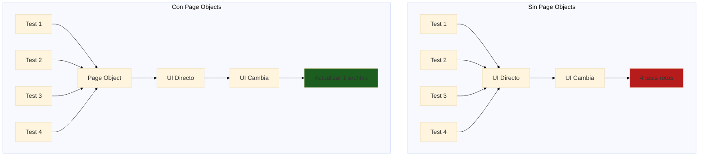
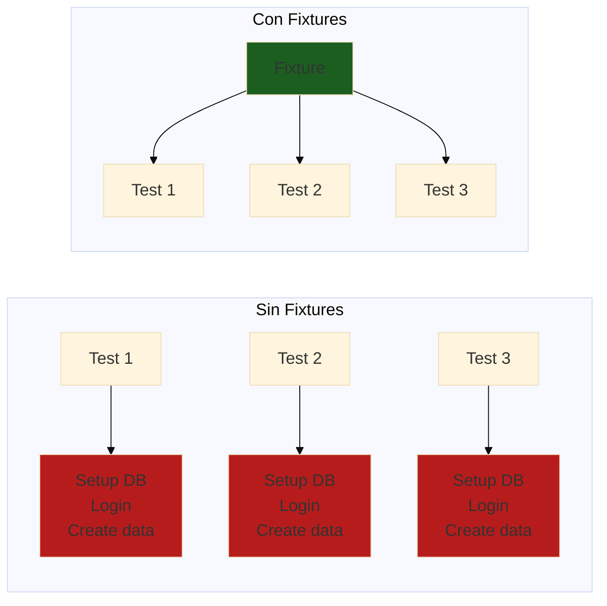

# Module 03: Test Architecture & Organization

## Overview

Building scalable, maintainable test automation frameworks requires solid architectural foundations. This module teaches you how to design and implement professional test architectures using proven patterns like Page Object Model, custom fixtures, and reusable utilities.

**Duration**: 4 hours  
**Level**: Intermediate  
**Prerequisites**: Modules 01 and 02 completed

---

## Learning Objectives

By the end of this module, you will be able to:

1. Implement Page Object Model (POM) pattern for web testing
2. Create custom fixtures and helper functions for reusability
3. Design effective test data management strategies
4. Configure multi-environment test execution
5. Organize test files and directories for scalability
6. Apply SOLID principles to test automation code

---

## Why Test Architecture Matters

### Poor Architecture Problems

```
❌ Duplicated code across tests
❌ Hard to maintain when UI changes
❌ Brittle tests that break easily
❌ Slow test execution
❌ Difficult to onboard new team members
❌ No clear structure or conventions
```

### Good Architecture Benefits

```
✅ DRY (Don't Repeat Yourself) code
✅ Changes in one place affect all tests
✅ Resilient tests that adapt to changes
✅ Fast, parallelizable execution
✅ Easy onboarding with clear patterns
✅ Professional, production-ready codebase
```

### Real-World Impact

| Metric | Poor Architecture | Good Architecture |
|--------|-------------------|-------------------|
| **Test Maintenance Time** | 40% of QA time | 10% of QA time |
| **New Test Creation** | 2-4 hours | 30 minutes |
| **UI Change Impact** | 50+ files to update | 1-2 files to update |
| **Onboarding Time** | 2-3 weeks | 3-5 days |
| **Test Stability** | 60-70% pass rate | 95%+ pass rate |

---

## Module Structure

This module is divided into 5 comprehensive sections:

### [01 - Page Object Model](./content/01-page-object-model.md)
**Duration**: 60 minutes

Learn the industry-standard pattern for organizing UI test code:
- What is Page Object Model and why use it
- Implementing Page Objects in Playwright
- Component Object pattern for reusable UI elements
- Advanced POM patterns (inheritance, composition)
- Real-world examples from e-commerce applications

**Key Concepts**: Encapsulation, separation of concerns, reusability

---

### [02 - Fixtures and Helpers](./content/02-fixtures-helpers.md)
**Duration**: 45 minutes

Master Playwright's fixture system and create powerful test utilities:
- Understanding Playwright fixtures
- Creating custom fixtures for authentication, data, and more
- Test helper functions and utilities
- Fixture composition and dependencies
- Scoping and lifecycle management

**Key Concepts**: DRY principle, test setup/teardown, shared context

---

### [03 - Test Data Management](./content/03-test-data-management.md)
**Duration**: 45 minutes

Design strategies for managing test data effectively:
- Test data generation vs. static fixtures
- Database seeding and cleanup
- Factory pattern for test data
- Faker.js integration for realistic data
- Data isolation between tests

**Key Concepts**: Test independence, data factories, seeding strategies

---

### [04 - Multi-Environment Configuration](./content/04-multi-environment-config.md)
**Duration**: 45 minutes

Configure tests to run across different environments:
- Environment-specific configurations
- Managing credentials and secrets
- Dynamic base URL and API endpoints
- Feature flags and conditional testing
- Local vs. CI vs. production environments

**Key Concepts**: Environment abstraction, configuration management, security

---

### [05 - Test Organization Patterns](./content/05-test-organization-patterns.md)
**Duration**: 45 minutes

Learn how to structure your test project for maximum maintainability:
- Directory structure best practices
- Test file naming conventions
- Grouping and tagging tests
- Test suites and selective execution
- Documentation and README standards

**Key Concepts**: Scalability, convention over configuration, discoverability

---

## What You'll Build

Throughout this module, you'll build a **production-ready test framework** for an e-commerce application with:

### Project Structure
```
e-commerce-tests/
├── tests/
│   ├── auth/
│   │   ├── login.spec.ts
│   │   └── registration.spec.ts
│   ├── products/
│   │   ├── browse.spec.ts
│   │   └── search.spec.ts
│   └── checkout/
│       ├── cart.spec.ts
│       └── payment.spec.ts
├── pages/
│   ├── LoginPage.ts
│   ├── ProductsPage.ts
│   ├── CartPage.ts
│   └── CheckoutPage.ts
├── components/
│   ├── Header.ts
│   ├── ProductCard.ts
│   └── Modal.ts
├── fixtures/
│   ├── auth.ts
│   ├── products.ts
│   └── database.ts
├── helpers/
│   ├── data-factory.ts
│   ├── api-helpers.ts
│   └── utils.ts
├── config/
│   ├── environments.ts
│   └── test-config.ts
├── playwright.config.ts
└── README.md
```

### Features
- ✅ Page Object Model for all pages
- ✅ Component Objects for reusable UI elements
- ✅ Custom fixtures for auth and data
- ✅ Data factories for test data generation
- ✅ Multi-environment support (local, staging, production)
- ✅ Comprehensive test organization
- ✅ TypeScript throughout
- ✅ 100+ tests demonstrating patterns

---

## Prerequisites Check

Before starting, ensure you have:

### Knowledge Prerequisites
- ✅ Completed Module 01 (Playwright Advanced)
- ✅ Completed Module 02 (API Testing)
- ✅ Basic understanding of TypeScript/JavaScript
- ✅ Familiarity with async/await patterns

### Technical Prerequisites
- ✅ Node.js v18+ installed
- ✅ Playwright installed and configured
- ✅ VS Code or similar editor
- ✅ Git for version control

### Verify Your Setup

Run these commands to verify:

```bash
# Check Node.js version
node --version  # Should be v18 or higher

# Check Playwright installation
npx playwright --version

# Create new test project
npm init playwright@latest test-architecture-demo

# Run sample test
cd test-architecture-demo
npx playwright test
```

---

## Learning Approach

This module uses a **build-along methodology**:

1. **Learn**: Read concepts and patterns
2. **See**: Review complete code examples
3. **Build**: Implement the pattern yourself
4. **Practice**: Complete exercises
5. **Reflect**: Answer quiz questions

### Recommended Pace

| Section | Reading | Coding | Total |
|---------|---------|--------|-------|
| Section 01 | 20 min | 40 min | 60 min |
| Section 02 | 15 min | 30 min | 45 min |
| Section 03 | 15 min | 30 min | 45 min |
| Section 04 | 15 min | 30 min | 45 min |
| Section 05 | 15 min | 30 min | 45 min |
| **Total** | **80 min** | **160 min** | **240 min (4h)** |

---

## Key Takeaways

After completing this module, you'll understand:

### Design Patterns
- **Page Object Model**: Industry-standard UI test organization
- **Component Objects**: Reusable UI element abstractions
- **Factory Pattern**: Dynamic test data generation
- **Fixture Pattern**: Shared test context and setup

### Best Practices
- **DRY Principle**: Don't repeat yourself
- **Single Responsibility**: One class, one purpose
- **Separation of Concerns**: Test logic vs. page logic
- **Configuration Management**: Environment-specific settings

### Professional Skills
- **Code Organization**: Scalable directory structures
- **Documentation**: Clear READMEs and code comments
- **Maintainability**: Easy to update and extend
- **Team Collaboration**: Shared conventions and patterns

---

## Real-World Applications

These patterns are used by:

### Companies
- **Google**: Extensive use of Page Objects in Angular testing
- **Microsoft**: Playwright's own test suite uses these patterns
- **Netflix**: Custom fixtures for complex test scenarios
- **Amazon**: Data factories for product testing

### Open Source Projects
- **Playwright documentation examples**: Shows POM pattern
- **Testing Library**: Component-based testing approach
- **Cypress Real-World App**: Full architecture example

### Your Career
- **Required for Senior QA roles**: Architecture knowledge is essential
- **Interview Questions**: Expect questions about POM and patterns
- **Portfolio Projects**: Demonstrate professional test organization
- **Team Leadership**: Guide junior QAs in best practices

---

## Success Metrics

You'll know you've mastered this module when you can:

- [ ] Explain the benefits of Page Object Model to a colleague
- [ ] Implement a Page Object from scratch in under 15 minutes
- [ ] Create custom fixtures for complex test scenarios
- [ ] Design a test data strategy for a new project
- [ ] Configure multi-environment test execution
- [ ] Organize a test project with 50+ test files
- [ ] Review test code and identify architectural issues
- [ ] Refactor brittle tests using these patterns

---

## Additional Resources

### Official Documentation
- [Playwright Best Practices](https://playwright.dev/documentacion/best-practices)
- [Playwright Fixtures Guide](https://playwright.dev/documentacion/test-fixtures)
- [Playwright Page Object Models](https://playwright.dev/documentacion/pom)

### Community Resources
- [Playwright GitHub Discussions](https://github.com/microsoft/playwright/discussions)
- [Awesome Playwright](https://github.com/mxschmitt/awesome-playwright)

### Books & Articles
- "Growing Object-Oriented Software, Guided by Tests" - Freeman & Pryce
- "xUnit Test Patterns" - Gerard Meszaros
- Martin Fowler's articles on testing patterns

---

## Getting Started

Ready to build professional test architectures? Let's begin!

**👉 Start with [Section 01: Page Object Model](./content/01-page-object-model.md)**

---

---

## 🏗️ Section 1: Page Object Model (POM) Deep Dive

### Concepto: Encapsulación de la UI

**Analogía**: Como tener un manual de instrucciones para cada sección de tu casa.



### Ejemplo Real: Sistema de Inscripciones FPUNA

**Sin Page Object** (código duplicado):
```typescript
// login.spec.ts
test('login exitoso', async ({ page }) => {
  await page.goto('https://inscripciones.fpuna.edu.py');
  await page.locator('#email-input').fill('juan@fpuna.edu.py');
  await page.locator('#password-input').fill('Password123!');
  await page.locator('button[type="submit"]').click();
  await expect(page.locator('.dashboard')).toBeVisible();
});

// enrollment.spec.ts
test('inscribirse a materia', async ({ page }) => {
  // ❌ Código duplicado
  await page.goto('https://inscripciones.fpuna.edu.py');
  await page.locator('#email-input').fill('juan@fpuna.edu.py');
  await page.locator('#password-input').fill('Password123!');
  await page.locator('button[type="submit"]').click();
  
  // Lógica de inscripción...
});
```

**Problema**: Si cambia el selector `#email-input` → 20+ archivos a actualizar 😱

**Con Page Object** (reutilizable):
```typescript
// pages/LoginPage.ts
import { Page, Locator } from '@playwright/test';

export class LoginPage {
  readonly page: Page;
  readonly emailInput: Locator;
  readonly passwordInput: Locator;
  readonly submitButton: Locator;
  readonly errorMessage: Locator;

  constructor(page: Page) {
    this.page = page;
    this.emailInput = page.locator('[data-testid="email"]');
    this.passwordInput = page.locator('[data-testid="password"]');
    this.submitButton = page.locator('[data-testid="login-button"]');
    this.errorMessage = page.locator('.error-toast');
  }

  /**
   * Navegar a la página de login
   */
  async goto() {
    await this.page.goto('https://inscripciones.fpuna.edu.py/login');
    await this.page.waitForLoadState('networkidle');
  }

  /**
   * Login con credenciales
   * @param email - Email del usuario
   * @param password - Contraseña
   */
  async login(email: string, password: string) {
    await this.emailInput.fill(email);
    await this.passwordInput.fill(password);
    await this.submitButton.click();
  }

  /**
   * Login como estudiante (datos por defecto)
   */
  async loginAsStudent() {
    await this.login('estudiante@fpuna.edu.py', 'Password123!');
  }

  /**
   * Login como admin
   */
  async loginAsAdmin() {
    await this.login('admin@fpuna.edu.py', 'Admin123!');
  }

  /**
   * Verificar mensaje de error
   */
  async getErrorMessage(): Promise<string> {
    return await this.errorMessage.textContent() || '';
  }

  /**
   * Verificar que estamos en dashboard (login exitoso)
   */
  async expectLoginSuccess() {
    await this.page.waitForURL(/.*dashboard/);
  }
}
```

**Uso en tests**:
```typescript
// login.spec.ts
import { test, expect } from '@playwright/test';
import { LoginPage } from '../pages/LoginPage';

test.describe('Login de Usuario', () => {
  let loginPage: LoginPage;

  test.beforeEach(async ({ page }) => {
    loginPage = new LoginPage(page);
    await loginPage.goto();
  });

  test('login exitoso con credenciales válidas', async () => {
    await loginPage.loginAsStudent();
    await loginPage.expectLoginSuccess();
  });

  test('muestra error con email inválido', async () => {
    await loginPage.login('invalido', 'Password123!');
    const error = await loginPage.getErrorMessage();
    expect(error).toContain('Email inválido');
  });

  test('muestra error con contraseña incorrecta', async () => {
    await loginPage.login('juan@fpuna.edu.py', 'WrongPassword');
    const error = await loginPage.getErrorMessage();
    expect(error).toContain('Contraseña incorrecta');
  });
});
```

✅ **Beneficio**: Si cambia el selector → actualizar **solo LoginPage.ts**

### POM Avanzado: Base Page Pattern

```typescript
// pages/BasePage.ts
import { Page, Locator } from '@playwright/test';

/**
 * Clase base para todos los Page Objects
 * Contiene funcionalidades comunes
 */
export abstract class BasePage {
  readonly page: Page;
  
  constructor(page: Page) {
    this.page = page;
  }

  /**
   * Esperar que un elemento sea visible
   */
  async waitForElement(locator: Locator, timeout = 5000) {
    await locator.waitFor({ state: 'visible', timeout });
  }

  /**
   * Click seguro (espera visible + click)
   */
  async safeClick(locator: Locator) {
    await this.waitForElement(locator);
    await locator.click();
  }

  /**
   * Fill seguro (espera visible + clear + fill)
   */
  async safeFill(locator: Locator, text: string) {
    await this.waitForElement(locator);
    await locator.clear();
    await locator.fill(text);
  }

  /**
   * Capturar screenshot con nombre descriptivo
   */
  async takeScreenshot(name: string) {
    await this.page.screenshot({
      path: `screenshots/${name}-${Date.now()}.png`,
      fullPage: true,
    });
  }

  /**
   * Obtener URL actual
   */
  getCurrentUrl(): string {
    return this.page.url();
  }
}
```

**Extender BasePage**:
```typescript
// pages/EnrollmentPage.ts
import { Page, Locator } from '@playwright/test';
import { BasePage } from './BasePage';

export class EnrollmentPage extends BasePage {
  readonly searchInput: Locator;
  readonly searchButton: Locator;
  readonly courseCards: Locator;
  readonly enrollButton: Locator;

  constructor(page: Page) {
    super(page); // Heredar de BasePage
    this.searchInput = page.locator('[data-testid="course-search"]');
    this.searchButton = page.locator('[data-testid="search-btn"]');
    this.courseCards = page.locator('.course-card');
    this.enrollButton = page.locator('[data-testid="enroll-btn"]');
  }

  async goto() {
    await this.page.goto('/courses');
    await this.page.waitForLoadState('networkidle');
  }

  /**
   * Buscar materia por nombre
   */
  async searchCourse(courseName: string) {
    await this.safeFill(this.searchInput, courseName); // Usa método de BasePage
    await this.safeClick(this.searchButton);
  }

  /**
   * Inscribirse a la primera materia disponible
   */
  async enrollInFirstCourse() {
    const firstCard = this.courseCards.first();
    await this.safeClick(firstCard);
    await this.safeClick(this.enrollButton);
  }

  /**
   * Obtener cantidad de materias mostradas
   */
  async getCourseCount(): Promise<number> {
    return await this.courseCards.count();
  }
}
```

### Component Object Pattern

Para elementos reutilizables (header, modal, cards):

```typescript
// components/HeaderComponent.ts
import { Page, Locator } from '@playwright/test';

export class HeaderComponent {
  readonly page: Page;
  readonly logo: Locator;
  readonly userMenu: Locator;
  readonly logoutButton: Locator;
  readonly notificationBell: Locator;

  constructor(page: Page) {
    this.page = page;
    this.logo = page.locator('[data-testid="logo"]');
    this.userMenu = page.locator('[data-testid="user-menu"]');
    this.logoutButton = page.locator('[data-testid="logout"]');
    this.notificationBell = page.locator('[data-testid="notifications"]');
  }

  /**
   * Logout del sistema
   */
  async logout() {
    await this.userMenu.click();
    await this.logoutButton.click();
  }

  /**
   * Obtener cantidad de notificaciones
   */
  async getNotificationCount(): Promise<number> {
    const badge = this.notificationBell.locator('.badge');
    const text = await badge.textContent();
    return parseInt(text || '0');
  }

  /**
   * Navegar a home via logo
   */
  async goHome() {
    await this.logo.click();
  }
}
```

**Uso en Page Objects**:
```typescript
// pages/DashboardPage.ts
import { Page } from '@playwright/test';
import { BasePage } from './BasePage';
import { HeaderComponent } from '../components/HeaderComponent';

export class DashboardPage extends BasePage {
  readonly header: HeaderComponent;
  
  constructor(page: Page) {
    super(page);
    this.header = new HeaderComponent(page); // Reutilizar componente
  }

  async goto() {
    await this.page.goto('/dashboard');
  }

  /**
   * Logout usando el componente de header
   */
  async logout() {
    await this.header.logout();
  }
}
```

### Generar Page Objects con OpenCode

```bash
opencode "Genera Page Object completo para página de 'Gestión de Calificaciones FPUNA':

URL: https://sistema.fpuna.edu.py/calificaciones

ELEMENTOS VISIBLES:
- Selector de semestre (dropdown)
- Tabla de materias con columnas: Materia, Parcial 1, Parcial 2, Final, Promedio
- Botón 'Descargar PDF'
- Botón 'Exportar Excel'
- Filtro de búsqueda por materia
- Badge de promedio general

ACCIONES REQUERIDAS:
1. seleccionarSemestre(semestre: string)
2. buscarMateria(nombre: string)
3. obtenerCalificacion(materia: string, tipo: 'P1'|'P2'|'Final'): Promise<number>
4. descargarPDF(): Promise<void>
5. exportarExcel(): Promise<void>
6. obtenerPromedioGeneral(): Promise<number>

REQUISITOS:
- Extender BasePage
- TypeScript estricto
- data-testid para todos los selectores
- Comentarios en español
- Métodos async/await
- Manejo de errores (throw si elemento no existe)

OUTPUT: GradesPage.ts completo"
```

---

## 🔧 Section 2: Fixtures y Helpers

### Concepto: Compartir Setup entre Tests



### Custom Fixtures en Playwright

```typescript
// fixtures/authFixture.ts
import { test as base } from '@playwright/test';
import { LoginPage } from '../pages/LoginPage';
import { DashboardPage } from '../pages/DashboardPage';

type AuthFixtures = {
  authenticatedPage: DashboardPage;
  loginAsStudent: () => Promise<void>;
  loginAsAdmin: () => Promise<void>;
};

/**
 * Fixture personalizado para autenticación
 */
export const test = base.extend<AuthFixtures>({
  /**
   * Página ya autenticada como estudiante
   */
  authenticatedPage: async ({ page }, use) => {
    const loginPage = new LoginPage(page);
    await loginPage.goto();
    await loginPage.loginAsStudent();
    
    const dashboardPage = new DashboardPage(page);
    await use(dashboardPage);
    
    // Cleanup: logout después del test
    await dashboardPage.logout();
  },

  /**
   * Helper para login como estudiante
   */
  loginAsStudent: async ({ page }, use) => {
    const login = async () => {
      const loginPage = new LoginPage(page);
      await loginPage.goto();
      await loginPage.loginAsStudent();
    };
    await use(login);
  },

  /**
   * Helper para login como admin
   */
  loginAsAdmin: async ({ page }, use) => {
    const login = async () => {
      const loginPage = new LoginPage(page);
      await loginPage.goto();
      await loginPage.loginAsAdmin();
    };
    await use(login);
  },
});

export { expect } from '@playwright/test';
```

**Uso en tests**:
```typescript
// enrollment.spec.ts
import { test, expect } from '../fixtures/authFixture';
import { EnrollmentPage } from '../pages/EnrollmentPage';

test.describe('Inscripción a Materias', () => {
  test('estudiante puede inscribirse a materia disponible', async ({ authenticatedPage }) => {
    // ✅ Ya está logueado como estudiante!
    const enrollmentPage = new EnrollmentPage(authenticatedPage.page);
    await enrollmentPage.goto();
    
    await enrollmentPage.searchCourse('Cálculo I');
    await enrollmentPage.enrollInFirstCourse();
    
    // Verificaciones...
  });
});
```

### Test Data Fixtures

```typescript
// fixtures/testDataFixture.ts
import { test as base } from '@playwright/test';
import { faker } from '@faker-js/faker';

type TestDataFixtures = {
  studentData: {
    nombre: string;
    apellido: string;
    email: string;
    cedula: string;
  };
  courseData: {
    nombre: string;
    codigo: string;
    creditos: number;
    cupo: number;
  };
};

export const test = base.extend<TestDataFixtures>({
  /**
   * Genera datos de estudiante aleatorios
   */
  studentData: async ({}, use) => {
    const data = {
      nombre: faker.person.firstName(),
      apellido: faker.person.lastName(),
      email: faker.internet.email({ provider: 'fpuna.edu.py' }),
      cedula: faker.number.int({ min: 1000000, max: 9999999 }).toString(),
    };
    await use(data);
  },

  /**
   * Genera datos de materia aleatorios
   */
  courseData: async ({}, use) => {
    const data = {
      nombre: faker.helpers.arrayElement([
        'Cálculo I',
        'Física General',
        'Programación I',
        'Química Básica',
      ]),
      codigo: `MAT-${faker.number.int({ min: 100, max: 999 })}`,
      creditos: faker.helpers.arrayElement([3, 4, 5]),
      cupo: faker.number.int({ min: 20, max: 40 }),
    };
    await use(data);
  },
});
```

### Helper Utilities

```typescript
// helpers/dateHelpers.ts
/**
 * Formatear fecha al formato FPUNA (DD/MM/YYYY)
 */
export function formatFPUNADate(date: Date): string {
  const day = date.getDate().toString().padStart(2, '0');
  const month = (date.getMonth() + 1).toString().padStart(2, '0');
  const year = date.getFullYear();
  return `${day}/${month}/${year}`;
}

/**
 * Obtener semestre actual
 */
export function getCurrentSemester(): string {
  const month = new Date().getMonth() + 1;
  const year = new Date().getFullYear();
  return month <= 6 ? `1/${year}` : `2/${year}`;
}

/**
 * Calcular fecha de examen (15 semanas desde inicio de semestre)
 */
export function calculateExamDate(semesterStart: Date): Date {
  const examDate = new Date(semesterStart);
  examDate.setDate(examDate.getDate() + (15 * 7)); // 15 semanas
  return examDate;
}
```

```typescript
// helpers/gradeHelpers.ts
/**
 * Calcular promedio de calificaciones
 */
export function calculateAverage(grades: number[]): number {
  if (grades.length === 0) return 0;
  const sum = grades.reduce((acc, grade) => acc + grade, 0);
  return Math.round((sum / grades.length) * 10) / 10; // 1 decimal
}

/**
 * Verificar si aprobó la materia (≥60)
 */
export function isPassing(finalGrade: number): boolean {
  return finalGrade >= 60;
}

/**
 * Calcular calificación final (Paraguay: P1=30%, P2=30%, Final=40%)
 */
export function calculateFinalGrade(p1: number, p2: number, finalExam: number): number {
  return Math.round((p1 * 0.3 + p2 * 0.3 + finalExam * 0.4) * 10) / 10;
}
```

**Uso en tests**:
```typescript
// grades.spec.ts
import { test, expect } from '../fixtures/authFixture';
import { calculateFinalGrade, isPassing } from '../helpers/gradeHelpers';

test('calcular calificación final correctamente', async () => {
  const p1 = 75;
  const p2 = 80;
  const finalExam = 85;
  
  const finalGrade = calculateFinalGrade(p1, p2, finalExam);
  
  expect(finalGrade).toBe(80.5); // 75*0.3 + 80*0.3 + 85*0.4
  expect(isPassing(finalGrade)).toBe(true);
});
```

---

## 📊 Section 3: Test Data Management

### Factory Pattern para Test Data

```typescript
// factories/StudentFactory.ts
import { faker } from '@faker-js/faker';

export interface Student {
  id?: number;
  nombre: string;
  apellido: string;
  email: string;
  cedula: string;
  carrera: string;
  semestre: number;
}

export class StudentFactory {
  /**
   * Crear estudiante con datos válidos por defecto
   */
  static create(overrides: Partial<Student> = {}): Student {
    const firstName = faker.person.firstName();
    const lastName = faker.person.lastName();
    
    return {
      nombre: firstName,
      apellido: lastName,
      email: `${firstName.toLowerCase()}.${lastName.toLowerCase()}@fpuna.edu.py`,
      cedula: faker.number.int({ min: 1000000, max: 9999999 }).toString(),
      carrera: faker.helpers.arrayElement([
        'Ingeniería Informática',
        'Ingeniería Electrónica',
        'Ingeniería Civil',
        'Arquitectura',
      ]),
      semestre: faker.number.int({ min: 1, max: 10 }),
      ...overrides, // Sobrescribir campos específicos
    };
  }

  /**
   * Crear múltiples estudiantes
   */
  static createMany(count: number, overrides: Partial<Student> = {}): Student[] {
    return Array.from({ length: count }, () => this.create(overrides));
  }

  /**
   * Crear estudiante de primer semestre
   */
  static createFreshman(overrides: Partial<Student> = {}): Student {
    return this.create({ semestre: 1, ...overrides });
  }

  /**
   * Crear estudiante próximo a graduarse
   */
  static createSenior(overrides: Partial<Student> = {}): Student {
    return this.create({ semestre: 10, ...overrides });
  }
}
```

**Uso**:
```typescript
// student.spec.ts
import { test, expect } from '@playwright/test';
import { StudentFactory } from '../factories/StudentFactory';

test('crear estudiante nuevo', async ({ page }) => {
  const student = StudentFactory.create();
  
  // Llenar formulario con datos generados
  await page.fill('[name="nombre"]', student.nombre);
  await page.fill('[name="email"]', student.email);
  // ...
});

test('crear 100 estudiantes para prueba de carga', async () => {
  const students = StudentFactory.createMany(100, {
    carrera: 'Ingeniería Informática',
  });
  
  // Insertar en DB o crear via API
  // ...
});
```

### Database Seeding

```typescript
// helpers/dbSeeder.ts
import { PrismaClient } from '@prisma/client';
import { StudentFactory } from '../factories/StudentFactory';
import { CourseFactory } from '../factories/CourseFactory';

const prisma = new PrismaClient();

export class DatabaseSeeder {
  /**
   * Seed estudiantes de prueba
   */
  static async seedStudents(count = 10) {
    const students = StudentFactory.createMany(count);
    
    for (const student of students) {
      await prisma.student.create({ data: student });
    }
    
    console.log(`✅ Creados ${count} estudiantes de prueba`);
  }

  /**
   * Seed materias del primer semestre
   */
  static async seedFirstSemesterCourses() {
    const courses = [
      { codigo: 'MAT101', nombre: 'Cálculo I', creditos: 5, cupo: 30 },
      { codigo: 'FIS101', nombre: 'Física I', creditos: 5, cupo: 30 },
      { codigo: 'PRG101', nombre: 'Programación I', creditos: 4, cupo: 25 },
      { codigo: 'QUI101', nombre: 'Química General', creditos: 4, cupo: 25 },
    ];

    for (const course of courses) {
      await prisma.course.create({ data: course });
    }

    console.log(`✅ Creadas ${courses.length} materias`);
  }

  /**
   * Limpiar toda la base de datos de prueba
   */
  static async clean() {
    await prisma.enrollment.deleteMany();
    await prisma.student.deleteMany();
    await prisma.course.deleteMany();
    console.log('🧹 Base de datos limpiada');
  }

  /**
   * Reset completo: limpiar + seed
   */
  static async reset() {
    await this.clean();
    await this.seedStudents();
    await this.seedFirstSemesterCourses();
    console.log('🔄 Base de datos reseteada');
  }
}
```

**Uso en tests**:
```typescript
// enrollment.spec.ts
import { test, expect } from '@playwright/test';
import { DatabaseSeeder } from '../helpers/dbSeeder';

test.beforeAll(async () => {
  await DatabaseSeeder.reset(); // DB limpia antes de la suite
});

test.afterAll(async () => {
  await DatabaseSeeder.clean(); // Limpiar después
});

test('inscribirse a materia disponible', async ({ page }) => {
  // DB ya tiene estudiantes y materias seeded
  // ...
});
```

---

## 🌍 Section 4: Multi-Environment Configuration

### Environment Config Pattern

```typescript
// config/environments.ts
export type Environment = 'local' | 'staging' | 'production';

export interface EnvironmentConfig {
  baseURL: string;
  apiURL: string;
  dbURL: string;
  timeout: number;
  retries: number;
}

const configs: Record<Environment, EnvironmentConfig> = {
  local: {
    baseURL: 'http://localhost:3000',
    apiURL: 'http://localhost:4000/api',
    dbURL: 'postgresql://localhost:5432/fpuna_test',
    timeout: 30000,
    retries: 0,
  },
  staging: {
    baseURL: 'https://staging.fpuna.edu.py',
    apiURL: 'https://api-staging.fpuna.edu.py',
    dbURL: process.env.STAGING_DB_URL!,
    timeout: 60000,
    retries: 2,
  },
  production: {
    baseURL: 'https://sistema.fpuna.edu.py',
    apiURL: 'https://api.fpuna.edu.py',
    dbURL: process.env.PROD_DB_URL!,
    timeout: 60000,
    retries: 3,
  },
};

/**
 * Obtener configuración del ambiente actual
 */
export function getConfig(): EnvironmentConfig {
  const env = (process.env.TEST_ENV || 'local') as Environment;
  return configs[env];
}
```

```typescript
// playwright.config.ts
import { defineConfig } from '@playwright/test';
import { getConfig } from './config/environments';

const config = getConfig();

export default defineConfig({
  testDir: './tests',
  timeout: config.timeout,
  retries: config.retries,
  
  use: {
    baseURL: config.baseURL,
    trace: 'on-first-retry',
    screenshot: 'only-on-failure',
  },

  projects: [
    {
      name: 'chromium',
      use: { browserName: 'chromium' },
    },
  ],
});
```

**Correr en diferentes ambientes**:
```bash
# Local (default)
npx playwright test

# Staging
TEST_ENV=staging npx playwright test

# Production (solo smoke tests)
TEST_ENV=production npx playwright test --grep @smoke
```

---

## 📁 Section 5: Test Organization Patterns

### Recommended Directory Structure

```
qa-automation-framework/
├── tests/
│   ├── e2e/                        # End-to-end tests
│   │   ├── auth/
│   │   │   ├── login.spec.ts
│   │   │   └── registration.spec.ts
│   │   ├── enrollment/
│   │   │   ├── search.spec.ts
│   │   │   ├── enroll.spec.ts
│   │   │   └── unenroll.spec.ts
│   │   └── grades/
│   │       ├── view.spec.ts
│   │       └── export.spec.ts
│   └── api/                        # API tests
│       ├── students.api.spec.ts
│       └── courses.api.spec.ts
│
├── pages/                          # Page Objects
│   ├── BasePage.ts
│   ├── LoginPage.ts
│   ├── DashboardPage.ts
│   ├── EnrollmentPage.ts
│   └── GradesPage.ts
│
├── components/                     # Component Objects
│   ├── HeaderComponent.ts
│   ├── SidebarComponent.ts
│   └── ModalComponent.ts
│
├── fixtures/                       # Custom fixtures
│   ├── authFixture.ts
│   ├── testDataFixture.ts
│   └── apiFixture.ts
│
├── factories/                      # Data factories
│   ├── StudentFactory.ts
│   ├── CourseFactory.ts
│   └── EnrollmentFactory.ts
│
├── helpers/                        # Utility functions
│   ├── dateHelpers.ts
│   ├── gradeHelpers.ts
│   ├── dbSeeder.ts
│   └── apiHelpers.ts
│
├── config/                         # Configuration
│   ├── environments.ts
│   └── testConfig.ts
│
├── playwright.config.ts            # Playwright config
├── package.json
└── README.md
```

### Tagging Tests

```typescript
// enrollment.spec.ts
import { test, expect } from '@playwright/test';

test.describe('Inscripción a Materias', () => {
  test('búsqueda básica @smoke @regression', async ({ page }) => {
    // Test crítico - corre en smoke y regression
  });

  test('filtrar por carrera @regression', async ({ page }) => {
    // Solo regression
  });

  test('inscripción masiva @slow @nightly', async ({ page }) => {
    // Test lento - solo nightly builds
  });
});
```

**Correr por tags**:
```bash
# Solo smoke tests
npx playwright test --grep @smoke

# Todo excepto slow tests
npx playwright test --grep-invert @slow

# Smoke AND regression
npx playwright test --grep "^.*@smoke.*@regression.*$"
```

---

## 🎯 Real-World Example: E-Commerce FPUNA Store

### Complete Implementation

```typescript
// pages/ProductsPage.ts
import { Page, Locator } from '@playwright/test';
import { BasePage } from './BasePage';

export class ProductsPage extends BasePage {
  readonly searchInput: Locator;
  readonly categoryFilter: Locator;
  readonly priceSort: Locator;
  readonly productCards: Locator;
  readonly addToCartButtons: Locator;
  readonly cartBadge: Locator;

  constructor(page: Page) {
    super(page);
    this.searchInput = page.locator('[data-testid="product-search"]');
    this.categoryFilter = page.locator('[data-testid="category-filter"]');
    this.priceSort = page.locator('[data-testid="price-sort"]');
    this.productCards = page.locator('.product-card');
    this.addToCartButtons = page.locator('[data-testid="add-to-cart"]');
    this.cartBadge = page.locator('[data-testid="cart-count"]');
  }

  async goto() {
    await this.page.goto('/products');
  }

  async searchProduct(query: string) {
    await this.safeFill(this.searchInput, query);
    await this.page.keyboard.press('Enter');
  }

  async filterByCategory(category: string) {
    await this.categoryFilter.selectOption(category);
  }

  async sortByPrice(order: 'asc' | 'desc') {
    await this.priceSort.selectOption(order);
  }

  async addFirstProductToCart() {
    await this.addToCartButtons.first().click();
  }

  async getCartItemCount(): Promise<number> {
    const text = await this.cartBadge.textContent();
    return parseInt(text || '0');
  }

  async getProductCount(): Promise<number> {
    return await this.productCards.count();
  }
}
```

```typescript
// products.spec.ts
import { test, expect } from '../fixtures/authFixture';
import { ProductsPage } from '../pages/ProductsPage';

test.describe('FPUNA Store - Gestión de Productos @e2e', () => {
  let productsPage: ProductsPage;

  test.beforeEach(async ({ authenticatedPage }) => {
    productsPage = new ProductsPage(authenticatedPage.page);
    await productsPage.goto();
  });

  test('buscar producto por nombre @smoke', async () => {
    await productsPage.searchProduct('Notebook');
    const count = await productsPage.getProductCount();
    expect(count).toBeGreaterThan(0);
  });

  test('agregar producto al carrito @regression', async () => {
    const initialCount = await productsPage.getCartItemCount();
    await productsPage.addFirstProductToCart();
    const newCount = await productsPage.getCartItemCount();
    expect(newCount).toBe(initialCount + 1);
  });

  test('filtrar por categoría @regression', async () => {
    await productsPage.filterByCategory('Electrónica');
    // Verificar que todos los productos son de electrónica
  });
});
```

---

## Navigation

- [← Back to Track README](../../README.md)
- [→ Start Section 01: Page Object Model](./content/01-page-object-model.md)
- [📝 Module Exercise](./EXERCISE.md)

---

*Module 03 - Test Architecture & Organization*  
*FPUNA Summer 2026 - QA Automation Track*
