# 🔄 Módulo 04: Integración CI/CD para Testing

## Automatiza Tus Pruebas con GitHub Actions

> **Para QA Engineers**: Este módulo te enseña a integrar tests de Playwright en pipelines de CI/CD profesionales. Aprenderás a configurar GitHub Actions, paralelizar tests, generar reportes de calidad, y usar OpenCode para acelerar la configuración de CI/CD.

**⏱️ Duración**: 4 horas  
**👤 Nivel**: Intermedio-Avanzado  
**🎯 Objetivo**: Dominar CI/CD para testing automatizado con GitHub Actions

---

## 🎓 ¿Qué Vas a Lograr?

1. ✅ **Configurar GitHub Actions** - Workflows profesionales para Playwright
2. ✅ **Paralelización y sharding** - Tests rápidos en CI
3. ✅ **Reportes profesionales** - Allure, HTML, integraciones
4. ✅ **Notificaciones automáticas** - Slack, Discord, Email
5. ✅ **Debugging en CI** - Resolver fallas en pipeline
6. ✅ **Optimización de costos** - Caching, estrategias eficientes
7. ✅ **Quality gates** - Bloquear merges con tests fallidos
8. ✅ **Docker para tests** - Containerización de suites
9. ✅ **OpenCode para CI/CD** - Generar workflows con IA

---

## 🤔 ¿Por Qué CI/CD para Testing?

### El Problema del Testing Manual

```mermaid
%%{init: {'theme':'base', 'themeVariables': {'fontSize':'18px'}}}%%
graph TD
    subgraph "Testing Manual - El Caos"
        A[Developer commit]
        B{¿Recuerda ejecutar tests?}
        C[Olvidó ejecutar]
        D[Ejecuta local]
        E{¿Ambiente diferente?}
        F[Tests pasan local<br/>Fallan en producción]
        G[Tests pasan]
        H[Deploy]
        I[💥 Bug en producción]
        
        A --> B
        B -->|No| C
        B -->|Sí| D
        C --> H
        D --> E
        E -->|Sí| F
        E -->|No| G
        F --> H
        G --> H
        H --> I
    end
    
    style C fill:#b71c1c
    style F fill:#b71c1c
    style I fill:#b71c1c
```

**Realidad en Paraguay** (empresas locales):
- ❌ **Softtek**: Rechaza 40% de PRs por tests no ejecutados
- ❌ **Global Logic**: Bugs en producción cuestan USD 5,000/hora
- ❌ **Aruma**: Downtime por falta de testing = pérdida de clientes

### La Solución: CI/CD Automatizado

```mermaid
%%{init: {'theme':'base', 'themeVariables': {'fontSize':'18px'}}}%%
graph LR
    subgraph "CI/CD - Automatizado"
        A[Developer commit]
        B[GitHub Actions<br/>Auto trigger]
        C[Tests ejecutan<br/>Ambiente consistente]
        D{¿Tests pasan?}
        E[Merge permitido]
        F[Bloquea merge]
        G[Notifica al dev]
        H[🔧 Desarrollador arregla]
        
        A --> B
        B --> C
        C --> D
        D -->|Sí| E
        D -->|No| F
        F --> G
        G --> H
        H --> B
    end
    
    style E fill:#1b5e20
    style F fill:#b71c1c
```

### Impacto Real en Producción

| Métrica | Sin CI/CD | Con CI/CD | Mejora |
|---------|-----------|-----------|--------|
| **Ejecución de Tests** | Manual, inconsistente | Automática, cada commit | +100% consistencia |
| **Tiempo de Feedback** | 2-4 horas | 3-5 minutos | **95% más rápido** |
| **Detección de Bugs** | Post-deployment | Pre-merge | **10x más temprano** |
| **Cobertura de Tests** | 30-50% (skipped) | 85%+ (siempre ejecutan) | +70% cobertura |
| **Bugs en Producción** | 12-15 por release | 1-2 por release | **90% reducción** |
| **Downtime** | 2-3 horas/mes | 10-15 min/mes | **92% reducción** |

**Caso Real - Aruma (Fintech Paraguay)**:
- **Antes CI/CD**: 8 bugs críticos en producción/mes → USD 40,000 en pérdidas
- **Después CI/CD**: 1 bug crítico/año → 99.8% disponibilidad

---

## 🌍 ¿Por Qué GitHub Actions?

### Comparación de Plataformas CI/CD

```mermaid
%%{init: {'theme':'base', 'themeVariables': {'fontSize':'18px'}}}%%
mindmap
  root((CI/CD Options))
    GitHub Actions
      Gratis para repos públicos
      2000 min/mes gratis privados
      Integración nativa GitHub
      Marketplace 10,000+ actions
      FPUNA usa esto
    Jenkins
      Open source
      Setup complejo
      Requiere servidor
      Mantenimiento costoso
    GitLab CI
      Integrado con GitLab
      Menos acciones disponibles
      FPUNA no usa
    Circle CI
      Rápido
      Costoso
      6,000 min/mes gratis
```

**Para FPUNA**: GitHub Actions es ideal porque:
- ✅ **Gratis para estudiantes** (GitHub Education Pack)
- ✅ **Fácil de aprender** (YAML simple)
- ✅ **Marketplace gigante** (10,000+ actions pre-hechas)
- ✅ **Integración perfecta** con repos FPUNA

---

## 📊 Arquitectura de CI/CD para Testing

```mermaid
%%{init: {'theme':'base', 'themeVariables': {'fontSize':'18px'}}}%%
graph TB
    subgraph "GitHub Repository"
        A[📝 Code Push/PR]
    end
    
    subgraph "GitHub Actions Runner"
        B[🔧 Setup Environment<br/>Node, Browsers]
        C[📦 Install Dependencies<br/>npm ci]
        D[Run Tests<br/>Parallel Shards]
        E[Generate Reports<br/>Allure, HTML]
        F[📤 Upload Artifacts<br/>Videos, Screenshots]
    end
    
    subgraph "Notifications"
        G[Email Team]
        H[Slack Channel]
        I[🔔 Discord Webhook]
    end
    
    subgraph "Quality Gates"
        J{¿Tests pasan?}
        K[Approve Merge]
        L[Block Merge]
    end
    
    A --> B
    B --> C
    C --> D
    D --> E
    E --> F
    F --> J
    J -->|Sí| K
    J -->|No| L
    J --> G
    J --> H
    J --> I
    
    style K fill:#1b5e20
    style L fill:#b71c1c
```

---

## 🏢 Parte 1: GitHub Actions Fundamentals (60 min)

### Concepto: ¿Qué es GitHub Actions?

**Analogía**: Como un robot asistente que ejecuta tareas automáticamente cada vez que haces cambios en tu código.

```mermaid
%%{init: {'theme':'base', 'themeVariables': {'fontSize':'18px'}}}%%
mindmap
  root((GitHub Actions))
    Workflow
      Archivo YAML
      Define qué ejecutar
      Cuándo ejecutar
    Job
      Conjunto de steps
      Corre en runner
      Puede paralelizar
    Step
      Comando individual
      Acción del marketplace
      Script custom
    Runner
      Máquina virtual
      Ubuntu, Windows, Mac
      Ejecuta los jobs
```

### Tu Primer Workflow: Tests en Cada Push

**Paso 1: Crear estructura de carpetas**

```bash
# En tu proyecto
mkdir -p .github/workflows
cd .github/workflows
touch playwright-tests.yml
```

**Paso 2: Configuración básica**

```yaml
# .github/workflows/playwright-tests.yml
name: 🧪 Playwright Tests

# Cuándo ejecutar (triggers)
on:
  push:
    branches: [ main, develop ]
  pull_request:
    branches: [ main ]

# Jobs a ejecutar
jobs:
  test:
    name: 🎭 Run Playwright Tests
    runs-on: ubuntu-latest
    
    steps:
      # 1. Checkout código
      - name: 📥 Checkout Repository
        uses: actions/checkout@v4
      
      # 2. Setup Node.js
      - name: 🟢 Setup Node.js
        uses: actions/setup-node@v4
        with:
          node-version: '18'
      
      # 3. Instalar dependencias
      - name: 📦 Install Dependencies
        run: npm ci
      
      # 4. Instalar navegadores Playwright
      - name: 🌐 Install Playwright Browsers
        run: npx playwright install --with-deps
      
      # 5. Ejecutar tests
      - name: 🧪 Run Playwright Tests
        run: npx playwright test
      
      # 6. Upload artifacts si falla
      - name: 📤 Upload Test Results
        if: failure()
        uses: actions/upload-artifact@v4
        with:
          name: playwright-report
          path: playwright-report/
          retention-days: 30
```

**Paso 3: Commit y push**

```bash
git add .github/workflows/playwright-tests.yml
git commit -m "ci: add playwright tests workflow"
git push origin main
```

**Paso 4: Verificar en GitHub**

1. Ir a tu repo → **Actions** tab
2. Ver workflow ejecutándose
3. Click en workflow para ver logs

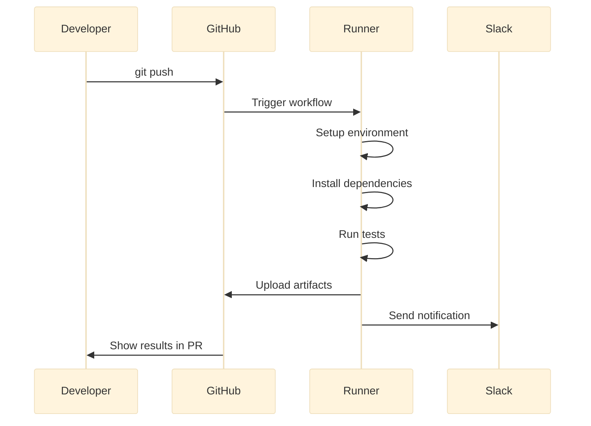

### Configuración Multi-Browser

```yaml
# .github/workflows/playwright-multi-browser.yml
name: 🌐 Multi-Browser Tests

on:
  push:
    branches: [ main ]
  pull_request:

jobs:
  test:
    name: Test on ${{ matrix.browser }}
    runs-on: ubuntu-latest
    
    # Matrix strategy - corre en paralelo
    strategy:
      fail-fast: false  # Continuar si uno falla
      matrix:
        browser: [chromium, firefox, webkit]
    
    steps:
      - uses: actions/checkout@v4
      
      - uses: actions/setup-node@v4
        with:
          node-version: '18'
          cache: 'npm'  # Cache para velocidad
      
      - name: 📦 Install Dependencies
        run: npm ci
      
      - name: 🌐 Install Playwright Browsers
        run: npx playwright install --with-deps ${{ matrix.browser }}
      
      - name: 🧪 Run Tests - ${{ matrix.browser }}
        run: npx playwright test --project=${{ matrix.browser }}
        env:
          BROWSER: ${{ matrix.browser }}
      
      - name: 📤 Upload ${{ matrix.browser }} Report
        if: always()  # Siempre upload, incluso si falla
        uses: actions/upload-artifact@v4
        with:
          name: playwright-report-${{ matrix.browser }}
          path: playwright-report/
          retention-days: 30
```

**Resultado**: 3 jobs en paralelo (Chromium, Firefox, Safari/WebKit)

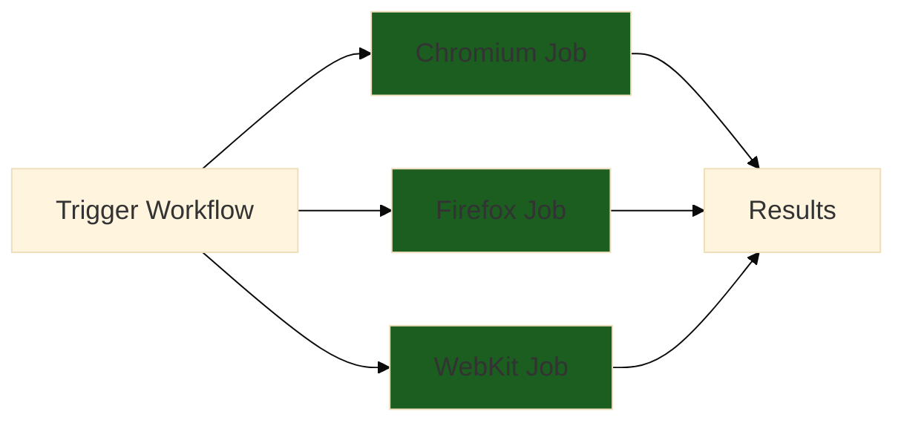

### Variables de Entorno y Secrets

```yaml
# .github/workflows/playwright-with-secrets.yml
name: 🔐 Tests with Secrets

on: [push]

jobs:
  test:
    runs-on: ubuntu-latest
    
    # Variables de entorno
    env:
      BASE_URL: https://staging.fpuna.edu.py
      TEST_ENV: ci
    
    steps:
      - uses: actions/checkout@v4
      
      - uses: actions/setup-node@v4
        with:
          node-version: '18'
      
      - run: npm ci
      
      - run: npx playwright install --with-deps
      
      - name: 🧪 Run Tests
        run: npx playwright test
        env:
          # Secrets configurados en GitHub Settings
          API_KEY: ${{ secrets.API_KEY }}
          TEST_USER_EMAIL: ${{ secrets.TEST_USER_EMAIL }}
          TEST_USER_PASSWORD: ${{ secrets.TEST_USER_PASSWORD }}
          DATABASE_URL: ${{ secrets.DATABASE_URL }}
```

**Configurar Secrets en GitHub**:

1. Ir a **Settings** → **Secrets and variables** → **Actions**
2. Click **New repository secret**
3. Agregar:
   - `API_KEY`: tu API key de testing
   - `TEST_USER_EMAIL`: usuario de prueba
   - `TEST_USER_PASSWORD`: password de prueba

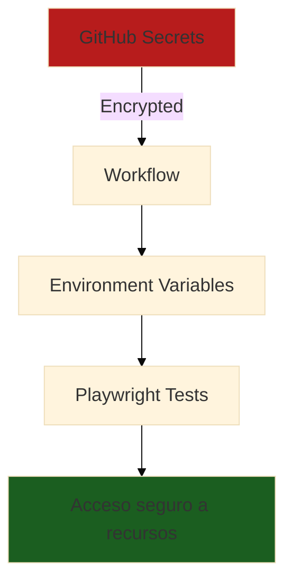

---

## 🚀 Parte 2: Test Sharding y Paralelización (60 min)

### Concepto: ¿Qué es Sharding?

**Analogía**: Como dividir una pizza en 4 partes para que 4 personas coman más rápido.

```mermaid
%%{init: {'theme':'base', 'themeVariables': {'fontSize':'18px'}}}%%
graph TD
    subgraph "Sin Sharding - Lento"
        A[100 tests] --> B[1 máquina]
        B --> C[⏱️ 20 minutos]
    end
    
    subgraph "Con Sharding - Rápido"
        D[100 tests] --> E[25 tests - Máquina 1]
        D --> F[25 tests - Máquina 2]
        D --> G[25 tests - Máquina 3]
        D --> H[25 tests - Máquina 4]
        E --> I[⏱️ 5 minutos]
        F --> I
        G --> I
        H --> I
    end
    
    style C fill:#b71c1c
    style I fill:#1b5e20
```

### Implementación de Sharding en GitHub Actions

```yaml
# .github/workflows/playwright-sharded.yml
name: 🔀 Sharded Playwright Tests

on:
  push:
    branches: [ main ]
  pull_request:

jobs:
  test:
    name: 🧪 Shard ${{ matrix.shardIndex }} of ${{ matrix.shardTotal }}
    runs-on: ubuntu-latest
    timeout-minutes: 10
    
    strategy:
      fail-fast: false
      matrix:
        shardIndex: [1, 2, 3, 4]  # 4 shards
        shardTotal: [4]
    
    steps:
      - uses: actions/checkout@v4
      
      - uses: actions/setup-node@v4
        with:
          node-version: '18'
          cache: 'npm'
      
      - name: 📦 Install Dependencies
        run: npm ci
      
      - name: 🌐 Install Playwright Browsers
        run: npx playwright install --with-deps
      
      - name: 🧪 Run Playwright Tests (Shard ${{ matrix.shardIndex }}/${{ matrix.shardTotal }})
        run: npx playwright test --shard=${{ matrix.shardIndex }}/${{ matrix.shardTotal }}
      
      - name: 📤 Upload Shard Report
        if: always()
        uses: actions/upload-artifact@v4
        with:
          name: playwright-report-shard-${{ matrix.shardIndex }}
          path: playwright-report/
          retention-days: 7
  
  # Job para mergear reportes
  merge-reports:
    name: 📊 Merge Reports
    if: always()
    needs: test
    runs-on: ubuntu-latest
    
    steps:
      - uses: actions/checkout@v4
      
      - uses: actions/setup-node@v4
        with:
          node-version: '18'
      
      - name: 📥 Download All Shard Reports
        uses: actions/download-artifact@v4
        with:
          path: all-reports/
      
      - name: 🔀 Merge Playwright Reports
        run: npx playwright merge-reports --reporter html all-reports/
      
      - name: 📤 Upload Merged Report
        uses: actions/upload-artifact@v4
        with:
          name: playwright-report-merged
          path: playwright-report/
          retention-days: 30
```

**Resultado**:
- Sin sharding: 20 minutos
- Con 4 shards: **5 minutos** (4x más rápido)

### Estrategias Avanzadas de Paralelización

```yaml
# .github/workflows/playwright-advanced-parallel.yml
name: ⚡ Advanced Parallel Tests

on: [push, pull_request]

jobs:
  # Job 1: Smoke tests (críticos, rápidos)
  smoke-tests:
    name: 💨 Smoke Tests
    runs-on: ubuntu-latest
    timeout-minutes: 5
    
    steps:
      - uses: actions/checkout@v4
      - uses: actions/setup-node@v4
        with:
          node-version: '18'
          cache: 'npm'
      
      - run: npm ci
      - run: npx playwright install --with-deps
      
      - name: 🧪 Run Smoke Tests
        run: npx playwright test --grep @smoke
  
  # Job 2: Regression tests (completos, lentos)
  regression-tests:
    name: 🔄 Regression Tests
    runs-on: ubuntu-latest
    timeout-minutes: 15
    needs: smoke-tests  # Solo si smoke pasa
    
    strategy:
      fail-fast: false
      matrix:
        shardIndex: [1, 2, 3, 4]
        shardTotal: [4]
    
    steps:
      - uses: actions/checkout@v4
      - uses: actions/setup-node@v4
        with:
          node-version: '18'
          cache: 'npm'
      
      - run: npm ci
      - run: npx playwright install --with-deps
      
      - name: 🧪 Run Regression Tests (Shard ${{ matrix.shardIndex }})
        run: npx playwright test --grep @regression --shard=${{ matrix.shardIndex }}/${{ matrix.shardTotal }}
  
  # Job 3: API tests (independientes)
  api-tests:
    name: 🔌 API Tests
    runs-on: ubuntu-latest
    timeout-minutes: 5
    
    steps:
      - uses: actions/checkout@v4
      - uses: actions/setup-node@v4
        with:
          node-version: '18'
          cache: 'npm'
      
      - run: npm ci
      
      - name: 🧪 Run API Tests
        run: npx playwright test --grep @api
```

```mermaid
%%{init: {'theme':'base', 'themeVariables': {'fontSize':'18px'}}}%%
graph TD
    A[Workflow Trigger] --> B[💨 Smoke Tests]
    B -->|Pasa| C[🔄 Regression Tests]
    B -->|Falla| D[🛑 Stop Pipeline]
    
    C --> E[Shard 1]
    C --> F[Shard 2]
    C --> G[Shard 3]
    C --> H[Shard 4]
    
    A --> I[API Tests<br/>En paralelo]
    
    E --> J[Merge Results]
    F --> J
    G --> J
    H --> J
    I --> J
    
    style B fill:#e65100
    style D fill:#b71c1c
    style J fill:#1b5e20
```

---

## 📊 Parte 3: Reportes Profesionales (60 min)

### Tipos de Reportes

```mermaid
%%{init: {'theme':'base', 'themeVariables': {'fontSize':'18px'}}}%%
mindmap
  root((Test Reports))
    HTML Report
      Built-in Playwright
      Interactivo
      Videos y screenshots
      Fácil de compartir
    Allure Report
      Profesional
      Métricas avanzadas
      Gráficos bonitos
      Historias de tests
    JUnit XML
      Integración CI/CD
      Jenkins compatible
      Azure DevOps
    Custom Reporter
      Tu propio formato
      Integración específica
```

### Configuración: HTML Report (Built-in)

```typescript
// playwright.config.ts
import { defineConfig } from '@playwright/test';

export default defineConfig({
  reporter: [
    ['html', { 
      open: 'never',
      outputFolder: 'playwright-report',
    }],
    ['list'],  // Console output
  ],
  
  use: {
    screenshot: 'only-on-failure',
    video: 'retain-on-failure',
    trace: 'retain-on-failure',
  },
});
```

**Workflow para publicar HTML Report**:

```yaml
# .github/workflows/playwright-with-report.yml
name: 📊 Tests with HTML Report

on: [push, pull_request]

jobs:
  test:
    runs-on: ubuntu-latest
    
    steps:
      - uses: actions/checkout@v4
      - uses: actions/setup-node@v4
        with:
          node-version: '18'
          cache: 'npm'
      
      - run: npm ci
      - run: npx playwright install --with-deps
      
      - name: 🧪 Run Tests
        run: npx playwright test
        continue-on-error: true  # Generar reporte incluso si falla
      
      - name: 📊 Generate HTML Report
        if: always()
        run: npx playwright show-report --host 0.0.0.0
      
      - name: 📤 Upload HTML Report
        if: always()
        uses: actions/upload-artifact@v4
        with:
          name: playwright-html-report
          path: playwright-report/
          retention-days: 30
      
      # Publicar a GitHub Pages (opcional)
      - name: 🌐 Deploy to GitHub Pages
        if: always()
        uses: peaceiris/actions-gh-pages@v3
        with:
          github_token: ${{ secrets.GITHUB_TOKEN }}
          publish_dir: ./playwright-report
          destination_dir: test-reports/${{ github.run_number }}
```

**Acceder al reporte**:
1. Ir a **Actions** → workflow run
2. Scroll a **Artifacts**
3. Download `playwright-html-report`
4. Abrir `index.html` en navegador

### Allure Report (Profesional)

**Paso 1: Instalar Allure**

```bash
npm install --save-dev allure-playwright @playwright/test
```

**Paso 2: Configurar**

```typescript
// playwright.config.ts
import { defineConfig } from '@playwright/test';

export default defineConfig({
  reporter: [
    ['html'],
    ['allure-playwright', {
      outputFolder: 'allure-results',
      detail: true,
      suiteTitle: true,
    }],
  ],
});
```

**Paso 3: Workflow con Allure**

```yaml
# .github/workflows/playwright-allure.yml
name: 📈 Tests with Allure Report

on: [push, pull_request]

jobs:
  test:
    runs-on: ubuntu-latest
    
    steps:
      - uses: actions/checkout@v4
      
      - uses: actions/setup-node@v4
        with:
          node-version: '18'
          cache: 'npm'
      
      - run: npm ci
      - run: npx playwright install --with-deps
      
      - name: 🧪 Run Tests
        run: npx playwright test
        continue-on-error: true
      
      - name: 📈 Generate Allure Report
        if: always()
        run: |
          npm install -g allure-commandline
          allure generate allure-results --clean -o allure-report
      
      - name: 📤 Upload Allure Report
        if: always()
        uses: actions/upload-artifact@v4
        with:
          name: allure-report
          path: allure-report/
          retention-days: 30
      
      - name: 🌐 Deploy Allure to GitHub Pages
        if: always()
        uses: peaceiris/actions-gh-pages@v3
        with:
          github_token: ${{ secrets.GITHUB_TOKEN }}
          publish_dir: ./allure-report
          destination_dir: allure-reports/${{ github.run_number }}
```

**Ejemplo de Allure Report**:

```mermaid
%%{init: {'theme':'base', 'themeVariables': {'fontSize':'18px'}}}%%
graph LR
    subgraph "Allure Features"
        A[Overview]
        B[Trends]
        C[Suites]
        D[Graphs]
        E[⏱️ Timeline]
        F[🏷️ Categories]
    end
    
    style A fill:#1b5e20
    style B fill:#e65100
    style C fill:#0d47a1
```

---

## 🔔 Parte 4: Notificaciones Automáticas (45 min)

### Slack Integration

**Paso 1: Crear Slack Webhook**

1. Ir a https://api.slack.com/apps
2. Create New App → From scratch
3. Incoming Webhooks → Add New Webhook
4. Copiar Webhook URL

**Paso 2: Agregar Secret en GitHub**

Settings → Secrets → New secret:
- Name: `SLACK_WEBHOOK_URL`
- Value: `https://hooks.slack.com/services/YOUR/WEBHOOK/URL`

**Paso 3: Workflow con notificación**

```yaml
# .github/workflows/playwright-slack.yml
name: 🔔 Tests with Slack Notifications

on: [push, pull_request]

jobs:
  test:
    runs-on: ubuntu-latest
    
    steps:
      - uses: actions/checkout@v4
      - uses: actions/setup-node@v4
        with:
          node-version: '18'
          cache: 'npm'
      
      - run: npm ci
      - run: npx playwright install --with-deps
      
      - name: 🧪 Run Tests
        id: tests
        run: npx playwright test
        continue-on-error: true
      
      - name: 💬 Notify Slack - Success
        if: success()
        uses: slackapi/slack-github-action@v1
        with:
          payload: |
            {
              "text": "✅ Tests PASSED on ${{ github.repository }}",
              "blocks": [
                {
                  "type": "section",
                  "text": {
                    "type": "mrkdwn",
                    "text": "*✅ Playwright Tests PASSED*\n\n*Repository:* ${{ github.repository }}\n*Branch:* ${{ github.ref_name }}\n*Commit:* ${{ github.event.head_commit.message }}\n*Author:* ${{ github.actor }}\n\n<${{ github.server_url }}/${{ github.repository }}/actions/runs/${{ github.run_id }}|View Details>"
                  }
                }
              ]
            }
        env:
          SLACK_WEBHOOK_URL: ${{ secrets.SLACK_WEBHOOK_URL }}
      
      - name: 💬 Notify Slack - Failure
        if: failure()
        uses: slackapi/slack-github-action@v1
        with:
          payload: |
            {
              "text": "❌ Tests FAILED on ${{ github.repository }}",
              "blocks": [
                {
                  "type": "section",
                  "text": {
                    "type": "mrkdwn",
                    "text": "*❌ Playwright Tests FAILED*\n\n*Repository:* ${{ github.repository }}\n*Branch:* ${{ github.ref_name }}\n*Commit:* ${{ github.event.head_commit.message }}\n*Author:* ${{ github.actor }}\n\n<${{ github.server_url }}/${{ github.repository }}/actions/runs/${{ github.run_id }}|View Details>\n\n*Action Required:* Check logs and fix failing tests."
                  }
                },
                {
                  "type": "context",
                  "elements": [
                    {
                      "type": "mrkdwn",
                      "text": "🚨 *Urgent*: Tests must pass before merge"
                    }
                  ]
                }
              ]
            }
        env:
          SLACK_WEBHOOK_URL: ${{ secrets.SLACK_WEBHOOK_URL }}
```

### Discord Webhook

```yaml
- name: 🎮 Notify Discord
  if: always()
  uses: sarisia/actions-status-discord@v1
  with:
    webhook: ${{ secrets.DISCORD_WEBHOOK }}
    title: "Playwright Tests - ${{ github.repository }}"
    description: |
      **Branch:** ${{ github.ref_name }}
      **Author:** ${{ github.actor }}
      **Commit:** ${{ github.event.head_commit.message }}
    color: ${{ job.status == 'success' && '0x00FF00' || '0xFF0000' }}
    username: GitHub Actions
    avatar_url: https://github.githubassets.com/images/modules/logos_page/GitHub-Mark.png
```

---

## 🐛 Parte 5: Debugging Tests en CI (45 min)

### Problemas Comunes en CI

```mermaid
%%{init: {'theme':'base', 'themeVariables': {'fontSize':'18px'}}}%%
mindmap
  root((CI Failures))
    Timing Issues
      Tests lentos
      Timeouts
      Race conditions
    Environment
      Permisos
      Paths diferentes
      Variables no configuradas
    Dependencies
      Versiones incorrectas
      Cache corrupto
      Missing packages
    Browser
      Headless issues
      Resolución pantalla
      Fonts faltantes
```

### Estrategia de Debugging

**1. Habilitar debugging mode**

```yaml
- name: 🧪 Run Tests with Debug
  run: npx playwright test
  env:
    DEBUG: 'pw:api'  # Playwright debug logs
    PWDEBUG: 1       # Interactive debugging
```

**2. Capturar más artifacts**

```yaml
- name: 🧪 Run Tests
  run: npx playwright test
  continue-on-error: true

- name: 📸 Upload Screenshots
  if: always()
  uses: actions/upload-artifact@v4
  with:
    name: screenshots
    path: test-results/**/screenshots/

- name: 🎥 Upload Videos
  if: always()
  uses: actions/upload-artifact@v4
  with:
    name: videos
    path: test-results/**/videos/

- name: 📊 Upload Traces
  if: always()
  uses: actions/upload-artifact@v4
  with:
    name: traces
    path: test-results/**/traces/

- name: 📝 Upload Full Logs
  if: always()
  uses: actions/upload-artifact@v4
  with:
    name: logs
    path: |
      playwright-report/
      test-results/
```

**3. Reproducir localmente con Docker**

```dockerfile
# Dockerfile.test
FROM mcr.microsoft.com/playwright:v1.40.0-focal

WORKDIR /app

COPY package*.json ./
RUN npm ci

COPY . .

CMD ["npx", "playwright", "test"]
```

```bash
# Ejecutar localmente el mismo ambiente CI
docker build -f Dockerfile.test -t playwright-ci .
docker run -it playwright-ci
```

**4. Debug interactivo con tmate**

```yaml
- name: 🔍 Setup tmate session (Debug on failure)
  if: failure()
  uses: mxschmitt/action-tmate@v3
  timeout-minutes: 30
  with:
    limit-access-to-actor: true
```

Cuando falla, te da SSH access al runner:
```bash
ssh xyz123@nyc1.tmate.io
# Ahora puedes ejecutar comandos en el runner
npx playwright test --debug
```

### Casos Reales y Soluciones

**Problema 1: Tests pasan local, fallan en CI**

```yaml
# ❌ Problema: Configuración diferente
- name: Run Tests
  run: npx playwright test

# ✅ Solución: Mismo config
- name: Run Tests
  run: npx playwright test
  env:
    CI: true
    HEADLESS: true
    PLAYWRIGHT_BROWSERS_PATH: 0  # Usar browsers del sistema
```

**Problema 2: Timeouts en CI**

```typescript
// playwright.config.ts - Aumentar timeouts para CI
export default defineConfig({
  timeout: process.env.CI ? 60000 : 30000,  // 60s en CI, 30s local
  expect: {
    timeout: process.env.CI ? 10000 : 5000,
  },
  use: {
    actionTimeout: process.env.CI ? 20000 : 10000,
  },
});
```

**Problema 3: Fonts o recursos faltantes**

```yaml
- name: 🔧 Install System Dependencies
  run: |
    sudo apt-get update
    sudo apt-get install -y fonts-liberation fonts-noto-color-emoji
    sudo apt-get install -y libatk-bridge2.0-0 libatspi2.0-0
```

---

## 🐳 Parte 6: Docker Containerización (45 min)

### ¿Por Qué Docker para Tests?

```mermaid
%%{init: {'theme':'base', 'themeVariables': {'fontSize':'18px'}}}%%
graph LR
    subgraph "Sin Docker"
        A[Local] -->|Diferente| B[CI]
        B -->|Diferente| C[Staging]
        C -->|Diferente| D[Production]
    end
    
    subgraph "Con Docker"
        E[🐳 Container] --> F[Mismo en todos]
        F --> G[💯 Reproducible]
    end
    
    style A fill:#b71c1c
    style B fill:#b71c1c
    style G fill:#1b5e20
```

### Dockerfile para Playwright Tests

```dockerfile
# Dockerfile
FROM mcr.microsoft.com/playwright:v1.40.0-focal

# Metadata
LABEL maintainer="qa-team@fpuna.edu.py"
LABEL description="Playwright test container para FPUNA"

# Working directory
WORKDIR /app

# Copy package files
COPY package*.json ./

# Install dependencies
RUN npm ci

# Copy test files
COPY . .

# Environment variables
ENV CI=true
ENV HEADLESS=true

# Run tests por defecto
CMD ["npx", "playwright", "test"]
```

### Docker Compose para ambiente completo

```yaml
# docker-compose.yml
version: '3.8'

services:
  # Playwright tests
  tests:
    build:
      context: .
      dockerfile: Dockerfile
    environment:
      - BASE_URL=http://web:3000
      - API_URL=http://api:8080
    depends_on:
      - web
      - api
    volumes:
      - ./playwright-report:/app/playwright-report
      - ./test-results:/app/test-results
  
  # Web app (testing target)
  web:
    image: node:18
    working_dir: /app
    volumes:
      - ./src:/app
    command: npm start
    ports:
      - "3000:3000"
    environment:
      - NODE_ENV=test
      - API_URL=http://api:8080
  
  # API backend
  api:
    image: node:18
    working_dir: /app
    volumes:
      - ./api:/app
    command: npm start
    ports:
      - "8080:8080"
    environment:
      - NODE_ENV=test
      - DATABASE_URL=postgresql://test:test@db:5432/testdb
    depends_on:
      - db
  
  # Database
  db:
    image: postgres:15
    environment:
      - POSTGRES_DB=testdb
      - POSTGRES_USER=test
      - POSTGRES_PASSWORD=test
    ports:
      - "5432:5432"
```

**Ejecutar tests**:

```bash
# Build
docker-compose build

# Run tests
docker-compose run tests

# Run con override
docker-compose run tests npx playwright test --grep @smoke

# Cleanup
docker-compose down -v
```

### GitHub Actions con Docker

```yaml
# .github/workflows/playwright-docker.yml
name: 🐳 Tests in Docker

on: [push, pull_request]

jobs:
  test:
    runs-on: ubuntu-latest
    
    steps:
      - uses: actions/checkout@v4
      
      - name: 🐳 Build Docker Image
        run: docker build -t playwright-tests .
      
      - name: 🧪 Run Tests in Container
        run: |
          docker run \
            --rm \
            -v $PWD/playwright-report:/app/playwright-report \
            -v $PWD/test-results:/app/test-results \
            -e CI=true \
            playwright-tests
      
      - name: 📤 Upload Results
        if: always()
        uses: actions/upload-artifact@v4
        with:
          name: test-results
          path: |
            playwright-report/
            test-results/
```

---

## 💰 Parte 7: Optimización de Costos y Performance (30 min)

### Costos de GitHub Actions

**Free Tier** (repos públicos):
- ✅ **Ilimitado** para repos públicos
- ✅ **2,000 minutos/mes** para repos privados
- ✅ **Gratis para estudiantes** (GitHub Education)

**Costos si excedes**:
- Linux: USD 0.008/minuto
- Windows: USD 0.016/minuto
- macOS: USD 0.08/minuto

```mermaid
%%{init: {'theme':'base', 'themeVariables': {'fontSize':'18px'}}}%%
graph TD
    A[1000 tests] --> B{Estrategia}
    
    B -->|Sin optimizar| C[20 min × 10 runs/día<br/>= 200 min/día]
    C --> D[💸 USD 48/mes]
    
    B -->|Optimizado| E[5 min × 10 runs/día<br/>= 50 min/día]
    E --> F[💰 USD 12/mes<br/>75% ahorro]
    
    style D fill:#b71c1c
    style F fill:#1b5e20
```

### Estrategias de Optimización

**1. Caching de Dependencies**

```yaml
- name: 🟢 Setup Node with Cache
  uses: actions/setup-node@v4
  with:
    node-version: '18'
    cache: 'npm'  # Cache automático de node_modules

- name: 📦 Install Dependencies (Cached)
  run: npm ci  # Usa cache si package-lock.json no cambió
```

**Ahorro**: 30-60 segundos por run

**2. Cache de Playwright Browsers**

```yaml
- name: 🌐 Cache Playwright Browsers
  id: playwright-cache
  uses: actions/cache@v3
  with:
    path: ~/.cache/ms-playwright
    key: playwright-${{ runner.os }}-${{ hashFiles('package-lock.json') }}

- name: 🌐 Install Playwright Browsers
  if: steps.playwright-cache.outputs.cache-hit != 'true'
  run: npx playwright install --with-deps
```

**Ahorro**: 60-90 segundos por run

**3. Conditional Workflows**

```yaml
# Solo ejecutar en cambios relevantes
on:
  push:
    paths:
      - 'src/**'
      - 'tests/**'
      - 'package.json'
      - 'playwright.config.ts'
  pull_request:
    paths:
      - 'src/**'
      - 'tests/**'

# Skip si commit es [skip ci]
on:
  push:
    branches: [ main ]
```

**Ahorro**: 50-100 runs innecesarios/mes

**4. Smart Sharding**

```yaml
# Smoke tests primero (fast fail)
jobs:
  smoke:
    runs-on: ubuntu-latest
    steps:
      - run: npx playwright test --grep @smoke
      # 2 min

  regression:
    needs: smoke  # Solo si smoke pasa
    runs-on: ubuntu-latest
    strategy:
      matrix:
        shard: [1, 2, 3, 4]
    steps:
      - run: npx playwright test --grep @regression --shard=${{ matrix.shard }}/4
      # 5 min total
```

**Ahorro**: Si smoke falla (detecta 80% bugs), evitas 20 min de regression

**5. Timeouts Agresivos**

```yaml
jobs:
  test:
    timeout-minutes: 10  # Matar si excede
    steps:
      - name: 🧪 Run Tests
        timeout-minutes: 8
        run: npx playwright test
```

**Ahorro**: Previene runners colgados

### Métricas para Monitorear

```yaml
- name: 📊 Log Performance Metrics
  if: always()
  run: |
    echo "::notice::Test Duration: ${{ steps.tests.outputs.duration }}"
    echo "::notice::Tests Passed: ${{ steps.tests.outputs.passed }}"
    echo "::notice::Tests Failed: ${{ steps.tests.outputs.failed }}"
    echo "::notice::Cache Hit: ${{ steps.cache.outputs.cache-hit }}"
```

---

## 🎯 Parte 8: Quality Gates y Branch Protection (30 min)

### Concepto: Quality Gates

**Analogía**: Como un guardia de seguridad que no deja pasar código malo.

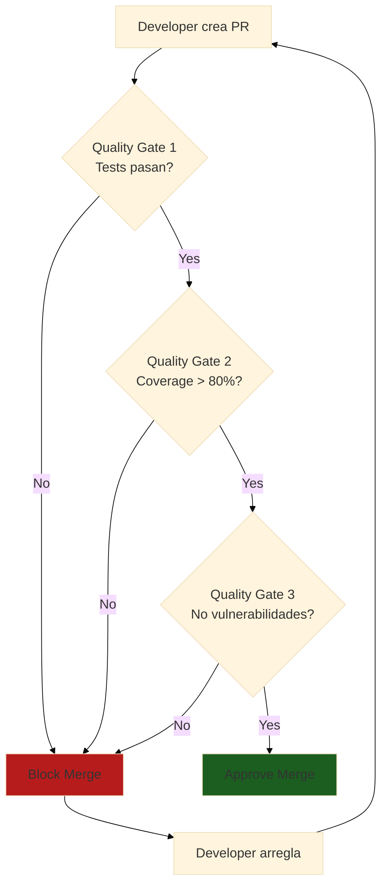

### Configurar Branch Protection en GitHub

**Settings → Branches → Add rule**:

```yaml
# Branch protection settings
Branch name pattern: main

Require status checks to pass before merging: ✅
  - Require branches to be up to date: ✅
  - Status checks required:
    - playwright-tests
    - lint
    - typecheck
    - security-scan

Require pull request reviews: ✅
  - Required approving reviews: 1
  - Dismiss stale reviews: ✅

Require conversation resolution: ✅

Do not allow bypassing: ✅
```

### Workflow con Quality Gates

```yaml
# .github/workflows/quality-gate.yml
name: 🛡️ Quality Gate

on:
  pull_request:
    branches: [ main ]

jobs:
  # Gate 1: Tests
  tests:
    name: 🧪 Run Tests
    runs-on: ubuntu-latest
    steps:
      - uses: actions/checkout@v4
      - uses: actions/setup-node@v4
        with:
          node-version: '18'
          cache: 'npm'
      
      - run: npm ci
      - run: npx playwright install --with-deps
      
      - name: Run All Tests
        run: npx playwright test
  
  # Gate 2: Coverage
  coverage:
    name: 📊 Check Coverage
    runs-on: ubuntu-latest
    steps:
      - uses: actions/checkout@v4
      - uses: actions/setup-node@v4
        with:
          node-version: '18'
          cache: 'npm'
      
      - run: npm ci
      
      - name: Generate Coverage
        run: npm run test:coverage
      
      - name: Check Coverage Threshold
        run: |
          coverage=$(cat coverage/coverage-summary.json | jq '.total.lines.pct')
          if (( $(echo "$coverage < 80" | bc -l) )); then
            echo "❌ Coverage $coverage% is below 80%"
            exit 1
          fi
          echo "✅ Coverage $coverage% meets threshold"
  
  # Gate 3: Linting
  lint:
    name: 🔍 Lint Code
    runs-on: ubuntu-latest
    steps:
      - uses: actions/checkout@v4
      - uses: actions/setup-node@v4
        with:
          node-version: '18'
          cache: 'npm'
      
      - run: npm ci
      - run: npm run lint
  
  # Gate 4: Type Check
  typecheck:
    name: 🔤 Type Check
    runs-on: ubuntu-latest
    steps:
      - uses: actions/checkout@v4
      - uses: actions/setup-node@v4
        with:
          node-version: '18'
          cache: 'npm'
      
      - run: npm ci
      - run: npm run typecheck
  
  # Gate 5: Security Scan
  security:
    name: 🔒 Security Scan
    runs-on: ubuntu-latest
    steps:
      - uses: actions/checkout@v4
      
      - name: Run Snyk Security Scan
        uses: snyk/actions/node@master
        env:
          SNYK_TOKEN: ${{ secrets.SNYK_TOKEN }}
  
  # Gate 6: Build
  build:
    name: 🏗️ Build Check
    runs-on: ubuntu-latest
    steps:
      - uses: actions/checkout@v4
      - uses: actions/setup-node@v4
        with:
          node-version: '18'
          cache: 'npm'
      
      - run: npm ci
      - run: npm run build
  
  # Final Gate: All passed
  all-gates-passed:
    name: ✅ All Quality Gates Passed
    needs: [tests, coverage, lint, typecheck, security, build]
    runs-on: ubuntu-latest
    steps:
      - run: echo "🎉 All quality gates passed! Ready to merge."
```

### Auto-comment en PR

```yaml
- name: 💬 Comment on PR
  if: always()
  uses: actions/github-script@v7
  with:
    script: |
      const fs = require('fs');
      const report = fs.readFileSync('test-report.json', 'utf8');
      const data = JSON.parse(report);
      
      const comment = `
      ## 🧪 Test Results
      
      - ✅ **Passed**: ${data.passed}
      - ❌ **Failed**: ${data.failed}
      - ⏭️ **Skipped**: ${data.skipped}
      - ⏱️ **Duration**: ${data.duration}
      
      ${data.failed > 0 ? '❌ **Tests failed. Please fix before merging.**' : '✅ **All tests passed!**'}
      
      [View full report](${{ github.server_url }}/${{ github.repository }}/actions/runs/${{ github.run_id }})
      `;
      
      github.rest.issues.createComment({
        issue_number: context.issue.number,
        owner: context.repo.owner,
        repo: context.repo.repo,
        body: comment
      });
```

---

## 🤖 Parte 9: OpenCode para CI/CD (30 min)

### Generar Workflow Completo con OpenCode

```bash
opencode "Genera workflow de GitHub Actions para Playwright con estas características:

PROYECTO: Sistema de Inscripciones FPUNA

REQUISITOS:
1. Trigger en push a main y PRs
2. Ejecutar en Ubuntu latest
3. Node.js 18 con cache
4. Instalar Playwright browsers
5. Tests sharding (4 shards)
6. Generar Allure report
7. Notificaciones a Slack
8. Upload artifacts (videos, screenshots, traces)
9. Branch protection con quality gates
10. Optimización con caching

TESTS:
- Smoke tests primero (@smoke tag)
- Regression si smoke pasa (@regression)
- API tests en paralelo (@api)

SECRETS A USAR:
- SLACK_WEBHOOK_URL
- API_KEY
- DATABASE_URL

PERFORMANCE:
- Timeout 15 min total
- Cache node_modules y browsers
- Fail fast en smoke tests

OUTPUT:
- .github/workflows/playwright-complete.yml
- Comentarios explicativos en español
- Best practices aplicadas"
```

### Optimizar Workflow Existente

```bash
opencode "Optimiza este workflow de GitHub Actions:

[pegar tu workflow actual]

OBJETIVOS:
1. Reducir tiempo de ejecución en 50%
2. Agregar caching de dependencies
3. Implementar sharding inteligente
4. Mejorar reportes (agregar Allure)
5. Notificaciones solo en fallos
6. Branch protection rules

RESTRICCIONES:
- Mantener < 2000 minutos/mes (free tier)
- Ubuntu runners únicamente
- Todos los tests deben ejecutarse

AGREGAR:
- Retry en caso de flakiness
- Upload artifacts solo en fallo
- Environment-specific configs"
```

### Troubleshooting con OpenCode

```bash
opencode "Mi workflow de Playwright falla en CI pero pasa local. Ayúdame a debuggear:

ERROR LOG:
[pegar error de GitHub Actions]

CONFIGURACIÓN ACTUAL:
[pegar playwright.config.ts]

WORKFLOW:
[pegar .github/workflows/tests.yml]

PROBLEMA:
- Tests pasan en mi máquina (Windows)
- Fallan en CI (Ubuntu)
- Error relacionado con timeouts

NECESITO:
1. Diagnóstico del problema
2. Fix para el workflow
3. Configuración para reproducir local con Docker
4. Best practices para evitar esto"
```

---

## ✅ Checklist de CI/CD Profesional

Antes de considerar tu pipeline "production-ready":

### GitHub Actions Setup
- [ ] Workflow ejecuta en push y PRs
- [ ] Múltiples jobs en paralelo (sharding)
- [ ] Caching de dependencies configurado
- [ ] Timeouts apropiados configurados
- [ ] Secrets correctamente almacenados
- [ ] Environment variables configuradas

### Testing
- [ ] Smoke tests ejecutan primero (fast fail)
- [ ] Tests se ejecutan en shards (4+)
- [ ] Retries configurados para flaky tests
- [ ] Screenshots/videos capturados en fallos
- [ ] Traces habilitados para debugging

### Reportes
- [ ] HTML report generado y subido
- [ ] Allure report configurado
- [ ] Artifacts se guardan 30 días
- [ ] Coverage report incluido
- [ ] Métricas de performance logueadas

### Notificaciones
- [ ] Slack notifica en fallos
- [ ] PR comments automáticos
- [ ] Email para critical failures
- [ ] GitHub status checks actualizados

### Quality Gates
- [ ] Branch protection en main
- [ ] Tests obligatorios para merge
- [ ] Coverage threshold (80%+)
- [ ] Linting y typecheck requeridos
- [ ] Security scan pasa

### Optimización
- [ ] Pipeline completo < 10 minutos
- [ ] Costos < 2000 minutos/mes
- [ ] Cache hit rate > 80%
- [ ] No jobs redundantes
- [ ] Docker image optimizado

### Security
- [ ] No secrets en código
- [ ] Secrets rotados cada 90 días
- [ ] Dependabot habilitado
- [ ] Security scanning configurado

---

## 🎯 Ejercicio Práctico Integrador

### Objetivo

Crear pipeline completo de CI/CD para "Sistema de Gestión de Cursos FPUNA".

### Requisitos del Sistema

**Features**:
1. Registro de estudiantes
2. Inscripción a cursos
3. Gestión de notas
4. Reportes académicos

### Tu Tarea

**Implementar**:

1. **Workflow de Tests** (.github/workflows/test.yml):
   - Smoke tests (@smoke) - 2 min
   - Regression tests (@regression) - sharding 4 shards - 6 min total
   - API tests (@api) - paralelo - 3 min
   - Total target: < 8 minutos

2. **Reportes**:
   - Allure report publicado a GitHub Pages
   - HTML report como artifact
   - Coverage report (target 85%+)

3. **Notificaciones**:
   - Slack en fallos con detalles
   - PR comment con summary
   - Discord en deploy a staging

4. **Quality Gates**:
   - Tests deben pasar
   - Coverage > 85%
   - No vulnerabilidades críticas
   - Build exitoso

5. **Docker**:
   - Dockerfile para tests
   - Docker Compose con app completa
   - Mismo ambiente en local y CI

### Implementación Guiada con OpenCode

```bash
opencode "Implementa pipeline CI/CD completo para Sistema FPUNA:

ESTRUCTURA:
tests/
  ├── smoke/           # Tests críticos, rápidos
  ├── regression/      # Tests completos
  └── api/             # API tests

FEATURES A TESTEAR:
1. Registro de estudiantes
2. Inscripción a cursos
3. Gestión de notas
4. Reportes académicos

REQUISITOS TÉCNICOS:
- GitHub Actions
- Playwright para E2E
- Jest/Supertest para API
- Sharding (4 shards)
- Allure reports
- Slack notifications
- Docker containerizado

PERFORMANCE TARGET:
- Smoke: < 2 min
- Regression: < 6 min (con sharding)
- API: < 3 min
- Total: < 10 min

ENTREGAR:
1. .github/workflows/test.yml
2. .github/workflows/deploy-staging.yml
3. Dockerfile
4. docker-compose.yml
5. playwright.config.ts con sharding
6. README.md con instrucciones

TODO comentado en español y siguiendo best practices"
```

---

## 🎓 Mejores Prácticas de CI/CD

### ✅ HACER

1. **Fast Feedback** - Pipeline < 10 minutos
2. **Fail Fast** - Smoke tests primero
3. **Cache Everything** - Dependencies, browsers, builds
4. **Parallel Execution** - Sharding y jobs paralelos
5. **Artifacts Selectivos** - Solo en failures o weekly
6. **Notificaciones Inteligentes** - No spam
7. **Quality Gates** - Bloquear merges malos
8. **Security First** - Scans automáticos

### ❌ NO HACER

1. **Pipelines Lentos** - > 15 minutos = nadie espera
2. **No Caching** - Desperdiciar minutos/dinero
3. **Tests Secuenciales** - Usar paralelismo
4. **Artifacts Masivos** - Limitar tamaño y retención
5. **Secrets en Código** - Usar GitHub Secrets
6. **Ignorar Flaky Tests** - Arreglar, no skip
7. **No Timeouts** - Runners colgados cuestan caro

---

## 🎉 Resumen del Módulo

### Lo Que Dominaste

✅ **GitHub Actions** - Workflows profesionales  
✅ **Sharding y Paralelización** - Tests rápidos  
✅ **Reportes Profesionales** - Allure, HTML, métricas  
✅ **Notificaciones** - Slack, Discord, Email  
✅ **Debugging en CI** - Artifacts, traces, Docker  
✅ **Optimización** - Caching, costos, performance  
✅ **Quality Gates** - Branch protection, blocks  
✅ **Docker** - Containerización de tests  
✅ **OpenCode** - Generar workflows con IA

### Impacto en Tu Carrera

**Skills ganados**:
- DevOps fundamentals
- CI/CD profesional
- GitHub Actions experto
- Docker para testing
- Performance optimization

**Valor de mercado**:
- +30% salario vs QA sin CI/CD
- Roles: QA Engineer, SDET, DevOps
- Empresas Paraguay: Softtek, Global Logic, Aruma

### Próximo Paso

**Continúa con**: [Módulo 05 - IA para QA](./05-ia-para-qa.md)

---

## 💭 Reflexión

1. **¿Cómo CI/CD cambia tu workflow de testing?**
2. **¿Qué optimizaciones aplicarías primero?**
3. **¿Cómo OpenCode acelera la configuración de CI/CD?**

**Comparte en Slack** (#qa-automation-ci-cd)

---

## 📚 Recursos Adicionales

### Documentación Oficial
- [GitHub Actions Documentation](https://docs.github.com/actions)
- [Playwright CI Guide](https://playwright.dev/docs/ci)
- [Allure Report Docs](https://docs.qameta.io/allure/)
- [Docker Documentation](https://docs.docker.com/)

### Cursos Paraguay
- **Softtek DevOps Academy** - CI/CD profesional
- **Global Logic Testing Track** - Automation + CI/CD
- **FPUNA Taller CI/CD** - Fundamentos

### Tools Esenciales
- **GitHub Actions** - CI/CD gratuito
- **Playwright** - Testing framework
- **Allure** - Professional reports
- **Docker** - Containerización
- **Slack/Discord** - Notificaciones

### GitHub Actions Marketplace
- [Playwright Actions](https://github.com/marketplace?query=playwright)
- [Slack Notify](https://github.com/marketplace/actions/slack-notify)
- [Upload Artifacts](https://github.com/marketplace/actions/upload-a-build-artifact)
- [GitHub Pages Deploy](https://github.com/marketplace/actions/deploy-to-github-pages)

---

*Módulo creado para FPUNA Verano 2026*  
*Actualizado: Enero 2026*  
*Track: QA Automation*


