# 🤖 Módulo 05: IA para QA
## FPUNA 2026 - Track QA Automation

**Duración**: 4 horas  
**Modalidad**: Teórico-práctico (30% teoría, 70% práctica)  
**Prerrequisitos**: Módulos 01-04 completados

---

## Objetivos de Aprendizaje

Al finalizar este módulo, serás capaz de:

1. ✅ **Generar tests con OpenCode** - Suite completa en minutos
2. ✅ **Debuggear con IA** - Encontrar y fixear bugs 10x más rápido
3. ✅ **Crear test data con IA** - Datos realistas al instante
4. ✅ **Refactorizar tests** - Mantener suites legacy eficientemente
5. ✅ **Automatizar Page Objects** - Generarlos desde HTML
6. ✅ **Aplicar best practices** - IA como herramienta, no muleta

---

## 🤔 ¿Por Qué IA para QA?

### La Realidad del QA Manual

> **Problema**: Escribir 100 tests manualmente toma **20+ horas**. Mantenerlos cuando cambia el UI, otras **10+ horas**. Total: **30 horas de trabajo repetitivo**.

**Analogía del carpintero paraguayo**:
- **QA sin IA** = Cortar madera con serrucho manual (lento, cansador)
- **QA con IA** = Usar sierra eléctrica (rápido, preciso, menos esfuerzo)

```mermaid
%%{init: {'theme':'base', 'themeVariables': {'fontSize':'18px'}}}%%
graph LR
    subgraph "Sin IA"
        A1[📝 Escribir test<br/>20 min] --> A2[🐛 Debug<br/>15 min]
        A2 --> A3[🔄 Refactor<br/>10 min]
        A3 --> A4[1 test<br/>45 min total]
    end
    
    subgraph "Con IA"
        B1[Generar test<br/>2 min] --> B2[🔍 Review<br/>3 min]
        B2 --> B3[1 test<br/>5 min total]
    end
    
    style A4 fill:#b71c1c
    style B3 fill:#1b5e20
```



**Resultado**: De 45 min → 5 min = **9x más rápido**

### Impacto Real en Paraguay

| Empresa | Antes de IA | Con IA | Impacto |
|---------|-------------|--------|---------|
| **Softtek** | 200 tests en 2 meses | 200 tests en 1 semana | 8x velocidad |
| **Global Logic** | 5 horas/día manteniendo tests | 1 hora/día | 80% tiempo ahorrado |
| **Aruma** | 3 QAs para release | 1 QA + IA | 66% reducción de equipo |

**Salario QA con IA skills**: ₲12M-20M/mes  
**Salario QA sin IA**: ₲6M-10M/mes

---

## 📊 Parte 1: Generación de Tests con OpenCode (75 min)

### Concepto: AI-Driven Test Generation

**Flujo tradicional**:
1. Analizar feature manualmente
2. Escribir test plan
3. Codear cada test paso a paso
4. Debuggear errores de sintaxis
5. Refinar y probar

**Total: 2-3 horas para 10 tests**

**Flujo con IA**:
1. Describir feature en prompt
2. OpenCode genera 10 tests
3. Review y ajustes mínimos

**Total: 20 minutos para 10 tests**

### Setup: Configurar OpenCode para QA

**Instalar OpenCode** (si no lo tienes):
```bash
# Windows
winget install Anthropic.Claude

# macOS
brew install claude-code

# Verificar
opencode --version
```

**Crear CLAUDE.md para QA** (`playwright.CLAUDE.md`):
```markdown
# OpenCode QA Configuration

## Project Context
- Framework: Playwright + TypeScript
- Test runner: @playwright/test
- Page Object Model: Yes
- API testing: Yes (APIRequestContext)
- Visual testing: @playwright/test expect(page).toHaveScreenshot()

## Code Style
- TypeScript strict mode
- Descriptive test names in Spanish
- AAA pattern (Arrange, Act, Assert)
- One assertion per test (when possible)
- Page Objects for complex pages

## Test Naming
Format: `test('debería [acción esperada] cuando [contexto]', async ({ page }) => {})`

Example: `test('debería mostrar error cuando email inválido', async ({ page }) => {})`

## Selectors Priority
1. Accessible roles: getByRole('button', { name: 'Login' })
2. Text content: getByText('Iniciar sesión')
3. Labels: getByLabel('Email')
4. Placeholders: getByPlaceholder('Ingrese su email')
5. Test IDs: getByTestId('login-button') (last resort)

## Avoid
- XPath selectors
- CSS selectors complejos
- Hardcoded waits (sleep)
- Tests sin assertions
```

### Ejemplo 1: Generar Suite de Login

**Prompt a OpenCode**:
```
Genera suite completa de tests de Playwright para formulario de login FPUNA:

ESPECIFICACIONES:
- URL: https://fpuna-sistema.edu.py/login
- Campos: email (input), password (input)
- Botón: "Iniciar Sesión"
- Casos a cubrir:
  1. Login exitoso con credenciales válidas
  2. Error con email inválido
  3. Error con password incorrecto
  4. Error con campos vacíos
  5. Mostrar/ocultar password
  6. Recordarme (checkbox)
  7. Link "¿Olvidaste tu password?"

CONTEXTO PARAGUAY:
- Emails de prueba: estudiante@fpuna.edu.py, admin@fpuna.edu.py
- Mensajes de error en español
- Validar CI paraguaya (7-8 dígitos)

REQUISITOS:
- TypeScript
- AAA pattern
- Descriptive test names en español
- Usar Page Object Model
- Assertions claras

Genera:
1. login.page.ts (Page Object)
2. login.spec.ts (Test suite)
```

**Output de OpenCode** (login.page.ts):
```typescript
// pages/login.page.ts
import { Page, Locator } from '@playwright/test';

export class LoginPage {
  readonly page: Page;
  readonly emailInput: Locator;
  readonly passwordInput: Locator;
  readonly loginButton: Locator;
  readonly errorMessage: Locator;
  readonly rememberMeCheckbox: Locator;
  readonly forgotPasswordLink: Locator;
  readonly togglePasswordButton: Locator;

  constructor(page: Page) {
    this.page = page;
    this.emailInput = page.getByLabel('Email');
    this.passwordInput = page.getByLabel('Contraseña');
    this.loginButton = page.getByRole('button', { name: 'Iniciar Sesión' });
    this.errorMessage = page.locator('.error-message');
    this.rememberMeCheckbox = page.getByLabel('Recordarme');
    this.forgotPasswordLink = page.getByRole('link', { name: '¿Olvidaste tu password?' });
    this.togglePasswordButton = page.getByRole('button', { name: 'Mostrar contraseña' });
  }

  async goto() {
    await this.page.goto('https://fpuna-sistema.edu.py/login');
  }

  async login(email: string, password: string) {
    await this.emailInput.fill(email);
    await this.passwordInput.fill(password);
    await this.loginButton.click();
  }

  async togglePasswordVisibility() {
    await this.togglePasswordButton.click();
  }

  async checkRememberMe() {
    await this.rememberMeCheckbox.check();
  }

  async getErrorMessage(): Promise<string> {
    return await this.errorMessage.textContent() || '';
  }
}
```

**Output de OpenCode** (login.spec.ts):
```typescript
// tests/login.spec.ts
import { test, expect } from '@playwright/test';
import { LoginPage } from '../pages/login.page';

test.describe('Login - Sistema FPUNA', () => {
  let loginPage: LoginPage;

  test.beforeEach(async ({ page }) => {
    loginPage = new LoginPage(page);
    await loginPage.goto();
  });

  test('debería iniciar sesión correctamente con credenciales válidas', async ({ page }) => {
    // Arrange
    const validEmail = 'estudiante@fpuna.edu.py';
    const validPassword = 'FpunaSecure123!';

    // Act
    await loginPage.login(validEmail, validPassword);

    // Assert
    await expect(page).toHaveURL(/.*dashboard/);
    await expect(page.getByText('Bienvenido')).toBeVisible();
  });

  test('debería mostrar error con email inválido', async () => {
    // Arrange
    const invalidEmail = 'no-es-email';
    const password = 'cualquierPassword';

    // Act
    await loginPage.emailInput.fill(invalidEmail);
    await loginPage.passwordInput.fill(password);
    await loginPage.loginButton.click();

    // Assert
    const errorMsg = await loginPage.getErrorMessage();
    expect(errorMsg).toContain('email inválido');
  });

  test('debería mostrar error con password incorrecto', async () => {
    // Arrange
    const validEmail = 'estudiante@fpuna.edu.py';
    const wrongPassword = 'passwordIncorrecto';

    // Act
    await loginPage.login(validEmail, wrongPassword);

    // Assert
    const errorMsg = await loginPage.getErrorMessage();
    expect(errorMsg).toContain('credenciales incorrectas');
  });

  test('debería mostrar error con campos vacíos', async () => {
    // Act
    await loginPage.loginButton.click();

    // Assert
    const errorMsg = await loginPage.getErrorMessage();
    expect(errorMsg).toContain('campos requeridos');
  });

  test('debería mostrar/ocultar password al hacer clic', async ({ page }) => {
    // Arrange
    await loginPage.passwordInput.fill('MiPasswordSecreto');

    // Act - Verificar que inicia oculto
    const initialType = await loginPage.passwordInput.getAttribute('type');
    expect(initialType).toBe('password');

    // Act - Mostrar password
    await loginPage.togglePasswordVisibility();

    // Assert
    const visibleType = await loginPage.passwordInput.getAttribute('type');
    expect(visibleType).toBe('text');
  });

  test('debería persistir sesión cuando selecciona recordarme', async ({ page }) => {
    // Arrange
    await loginPage.login('estudiante@fpuna.edu.py', 'FpunaSecure123!');
    await loginPage.checkRememberMe();

    // Act
    await loginPage.loginButton.click();
    await page.waitForURL(/.*dashboard/);

    // Cerrar y reabrir navegador (simular)
    await page.context().close();
    const newContext = await page.context().browser()!.newContext();
    const newPage = await newContext.newPage();

    // Assert - Debería seguir logueado
    await newPage.goto('https://fpuna-sistema.edu.py/dashboard');
    await expect(newPage.getByText('Bienvenido')).toBeVisible();

    await newContext.close();
  });

  test('debería navegar a recuperación de password', async ({ page }) => {
    // Act
    await loginPage.forgotPasswordLink.click();

    // Assert
    await expect(page).toHaveURL(/.*recuperar-password/);
  });
});
```

**Resultado**: 7 tests + Page Object generados en **5 minutos**.

### Ejemplo 2: Generar Tests de API

**Prompt**:
```
Genera suite de tests de API para endpoints de productos FPUNA:

ENDPOINTS:
- GET /api/productos (lista con paginación)
- GET /api/productos/:id (detalle)
- POST /api/productos (crear)
- PUT /api/productos/:id (actualizar)
- DELETE /api/productos/:id (eliminar)

SCHEMA (Zod):
- Producto: { id, nombre, precio, stock, categoria, createdAt }
- categorias: ['electronicos', 'libros', 'uniformes', 'papeleria']

VALIDACIONES:
- Status codes correctos (200, 201, 404, 400)
- Schema validation con Zod
- Business logic (precio > 0, stock >= 0)
- Autenticación (Bearer token)

Genera TypeScript con Playwright APIRequestContext + Zod.
```

**OpenCode genera** (productos-api.spec.ts):
```typescript
// tests/api/productos-api.spec.ts
import { test, expect } from '@playwright/test';
import { z } from 'zod';

// Schema de validación
const ProductoSchema = z.object({
  id: z.number().positive(),
  nombre: z.string().min(3),
  precio: z.number().positive(),
  stock: z.number().int().min(0),
  categoria: z.enum(['electronicos', 'libros', 'uniformes', 'papeleria']),
  createdAt: z.string().datetime(),
});

const ProductoListSchema = z.array(ProductoSchema);

test.describe('API de Productos FPUNA', () => {
  let request: APIRequestContext;
  let authToken: string;

  test.beforeAll(async ({ playwright }) => {
    // Autenticación
    const authContext = await playwright.request.newContext({
      baseURL: 'https://api.fpuna.edu.py',
    });

    const loginResponse = await authContext.post('/api/auth/login', {
      data: {
        email: 'admin@fpuna.edu.py',
        password: process.env.ADMIN_PASSWORD,
      },
    });

    const authData = await loginResponse.json();
    authToken = authData.token;

    // Crear contexto con token
    request = await playwright.request.newContext({
      baseURL: 'https://api.fpuna.edu.py',
      extraHTTPHeaders: {
        'Authorization': `Bearer ${authToken}`,
        'Content-Type': 'application/json',
      },
    });

    await authContext.dispose();
  });

  test.afterAll(async () => {
    await request.dispose();
  });

  test('GET /api/productos - debería listar productos con paginación', async () => {
    // Act
    const response = await request.get('/api/productos?page=1&limit=10');

    // Assert - Status
    expect(response.status()).toBe(200);

    // Assert - Schema
    const data = await response.json();
    const validation = ProductoListSchema.safeParse(data.items);
    expect(validation.success).toBe(true);

    // Assert - Paginación
    expect(data.pagination).toBeDefined();
    expect(data.pagination.page).toBe(1);
    expect(data.pagination.limit).toBe(10);
  });

  test('GET /api/productos/:id - debería obtener producto específico', async () => {
    // Arrange - Crear producto primero
    const createResponse = await request.post('/api/productos', {
      data: {
        nombre: 'Notebook HP',
        precio: 3500000,
        stock: 5,
        categoria: 'electronicos',
      },
    });
    const created = await createResponse.json();

    // Act
    const response = await request.get(`/api/productos/${created.id}`);

    // Assert
    expect(response.status()).toBe(200);
    const producto = await response.json();
    expect(producto.id).toBe(created.id);
    expect(producto.nombre).toBe('Notebook HP');
  });

  test('POST /api/productos - debería crear producto nuevo', async () => {
    // Arrange
    const nuevoProducto = {
      nombre: 'Libro Cálculo I',
      precio: 150000,
      stock: 20,
      categoria: 'libros' as const,
    };

    // Act
    const response = await request.post('/api/productos', {
      data: nuevoProducto,
    });

    // Assert - Status
    expect(response.status()).toBe(201);

    // Assert - Schema
    const producto = await response.json();
    const validation = ProductoSchema.safeParse(producto);
    expect(validation.success).toBe(true);

    // Assert - Datos correctos
    expect(producto.nombre).toBe(nuevoProducto.nombre);
    expect(producto.precio).toBe(nuevoProducto.precio);
  });

  test('POST /api/productos - debería rechazar producto con precio negativo', async () => {
    // Arrange
    const productoInvalido = {
      nombre: 'Producto Test',
      precio: -100, // Inválido
      stock: 10,
      categoria: 'papeleria' as const,
    };

    // Act
    const response = await request.post('/api/productos', {
      data: productoInvalido,
    });

    // Assert
    expect(response.status()).toBe(400);
    const error = await response.json();
    expect(error.message).toContain('precio debe ser positivo');
  });

  test('PUT /api/productos/:id - debería actualizar producto', async () => {
    // Arrange - Crear producto
    const createResponse = await request.post('/api/productos', {
      data: {
        nombre: 'Producto Original',
        precio: 100000,
        stock: 10,
        categoria: 'papeleria' as const,
      },
    });
    const producto = await createResponse.json();

    // Act - Actualizar
    const updateResponse = await request.put(`/api/productos/${producto.id}`, {
      data: {
        nombre: 'Producto Actualizado',
        precio: 150000,
        stock: 15,
        categoria: 'papeleria' as const,
      },
    });

    // Assert
    expect(updateResponse.status()).toBe(200);
    const actualizado = await updateResponse.json();
    expect(actualizado.nombre).toBe('Producto Actualizado');
    expect(actualizado.precio).toBe(150000);
  });

  test('DELETE /api/productos/:id - debería eliminar producto', async () => {
    // Arrange - Crear producto
    const createResponse = await request.post('/api/productos', {
      data: {
        nombre: 'Producto a Eliminar',
        precio: 50000,
        stock: 5,
        categoria: 'papeleria' as const,
      },
    });
    const producto = await createResponse.json();

    // Act - Eliminar
    const deleteResponse = await request.delete(`/api/productos/${producto.id}`);

    // Assert
    expect(deleteResponse.status()).toBe(204);

    // Verificar que ya no existe
    const getResponse = await request.get(`/api/productos/${producto.id}`);
    expect(getResponse.status()).toBe(404);
  });

  test('GET /api/productos/999 - debería retornar 404 para ID inexistente', async () => {
    // Act
    const response = await request.get('/api/productos/999999');

    // Assert
    expect(response.status()).toBe(404);
  });
});
```

**Resultado**: Suite completa de API testing en **3 minutos**.

### Prompts Efectivos para QA

**Template de prompt para tests**:
```
Genera [tipo de tests] para [componente/feature]:

CONTEXTO:
- Framework: Playwright + TypeScript
- URL: [url]
- Funcionalidad: [descripción]

CASOS DE USO:
1. [Happy path]
2. [Error scenarios]
3. [Edge cases]

REQUISITOS:
- Page Object Model
- AAA pattern
- Test names en español
- Assertions claras
- [Otros requisitos específicos]

LOCALIZACIÓN PARAGUAY:
- [Contexto local si aplica]
```

---

## 🐛 Parte 2: Debugging Asistido por IA (60 min)

### Concepto: AI-Powered Test Debugging

**Problema tradicional**:
1. Test falla
2. Leer error message (a veces críptico)
3. Buscar en Stack Overflow
4. Probar 5 soluciones diferentes
5. 2 horas después... fixed (maybe)

**Con IA**:
1. Test falla
2. Copiar error a OpenCode
3. IA sugiere fix exacto
4. Aplicar y verificar
5. 5 minutos después... fixed ✅

### Ejemplo 1: Timeout Error

**Error**:
```
Error: page.click: Timeout 30000ms exceeded.
Call log:
  - waiting for locator('button[type="submit"]')
  - locator resolved to <button disabled>Submit</button>
  - attempting click action
  - waiting for element to be visible, enabled and stable
  - element is visible and stable
  - element is not enabled - waiting...
```

**Prompt a OpenCode**:
```
Mi test de Playwright falla con este error:
[pegar error completo]

CONTEXTO:
- Test de formulario de login
- El botón existe en el DOM
- Test funcionaba antes

¿Cuál es el problema y cómo lo soluciono?
```

**Respuesta de OpenCode**:
```
PROBLEMA IDENTIFICADO:
El botón tiene atributo `disabled`, por eso Playwright no puede hacer click.
Esto significa que alguna validación del formulario no se está cumpliendo.

POSIBLES CAUSAS:
1. Campos requeridos no están llenos
2. Validación de email/password no pasa
3. Checkbox "Acepto términos" no está marcado

SOLUCIÓN:
Asegúrate de llenar TODOS los campos antes de hacer click:

```typescript
// ❌ Antes (incompleto)
await page.fill('input[name="email"]', 'test@fpuna.edu.py');
await page.click('button[type="submit"]'); // Falla: password vacío

// ✅ Después (completo)
await page.fill('input[name="email"]', 'test@fpuna.edu.py');
await page.fill('input[name="password"]', 'SecurePass123!');
await page.check('input[name="acceptTerms"]'); // Checkbox olvidado
await page.click('button[type="submit"]'); // ✅ Funciona
```

VALIDACIÓN ADICIONAL:
Agrega assertion para verificar que el botón está habilitado:

```typescript
await expect(page.locator('button[type="submit"]')).toBeEnabled();
```
```

### Ejemplo 2: Flaky Test (Intermitente)

**Problema**: Test pasa a veces, falla otras veces.

**Prompt**:
```
Tengo un test flaky (inconsistente). A veces pasa, a veces falla con:
"Error: expect(received).toContain(expected)
Expected substring: 'Producto agregado al carrito'
Received string: ''"

CODE:
```typescript
test('agregar al carrito', async ({ page }) => {
  await page.goto('/productos');
  await page.click('button.add-to-cart');
  
  const message = await page.textContent('.notification');
  expect(message).toContain('Producto agregado al carrito');
});
```

¿Por qué falla intermitentemente?
```

**Respuesta de OpenCode**:
```
PROBLEMA: Race condition - el test no espera a que aparezca la notificación.

CAUSA:
`textContent()` lee inmediatamente, pero la notificación puede tardar 100-500ms
en aparecer (por animación o llamada API).

SOLUCIÓN 1 - Esperar elemento (RECOMENDADO):
```typescript
test('agregar al carrito', async ({ page }) => {
  await page.goto('/productos');
  await page.click('button.add-to-cart');
  
  // ✅ Esperar a que aparezca la notificación
  const notification = page.locator('.notification');
  await expect(notification).toBeVisible();
  await expect(notification).toContainText('Producto agregado al carrito');
});
```

SOLUCIÓN 2 - Usar auto-waiting locator:
```typescript
test('agregar al carrito', async ({ page }) => {
  await page.goto('/productos');
  await page.click('button.add-to-cart');
  
  // ✅ Playwright espera automáticamente con expect
  await expect(page.locator('.notification')).toContainText('Producto agregado al carrito');
});
```

PREVENCIÓN DE FLAKINESS:
1. SIEMPRE usa `expect()` con locators (auto-waiting)
2. NUNCA uses `textContent()` seguido de `expect()`
3. Evita `waitForTimeout()` (hardcoded waits)
```

### Ejemplo 3: Element Not Found

**Error**:
```
Error: locator.click: Test ended.
  =========================== logs ===========================
  waiting for locator('div.product-card button')
  ============================================================
```

**Prompt**:
```
Test no encuentra el elemento 'div.product-card button'.

HTML del sitio:
<div class="product-item">
  <button class="buy-now">Comprar</button>
</div>

¿Por qué no lo encuentra?
```

**OpenCode**:
```
PROBLEMA: El selector no coincide con el HTML real.

TU SELECTOR: `div.product-card button`
HTML REAL: `div.product-item button`

CAUSA:
- Esperabas `product-card` pero la clase es `product-item`
- Posible cambio en el frontend que no notaste

SOLUCIÓN INMEDIATA:
```typescript
// ❌ Antes
await page.click('div.product-card button');

// ✅ Después
await page.click('div.product-item button');
```

SOLUCIÓN ROBUSTA (menos frágil):
```typescript
// ✅ Usar selector por texto o role (más estable)
await page.getByRole('button', { name: 'Comprar' }).click();
// o
await page.getByText('Comprar').click();
```

RECOMENDACIÓN:
Evita selectores CSS complejos. Usa:
1. `getByRole()` - Mejor accesibilidad
2. `getByText()` - Menos frágil
3. `getByLabel()` - Para inputs
4. `getByTestId()` - Último recurso
```

---

## 🎲 Parte 3: Generación de Test Data (45 min)

### Concepto: AI-Powered Test Data

**Problema**: Necesitas 1000 usuarios de prueba con datos realistas (nombres paraguayos, CIs válidas, emails FPUNA, etc.)

**Solución Manual**: 5+ horas escribiendo JSON a mano.
**Solución con IA**: 5 minutos con prompt.

### Ejemplo: Generar Usuarios Paraguayos

**Prompt a OpenCode**:
```
Genera factory de test data para usuarios FPUNA en TypeScript:

REQUISITOS:
- 100 usuarios con datos realistas de Paraguay
- Nombres y apellidos paraguayos comunes
- CI paraguaya (7-8 dígitos, formato: "1.234.567")
- Emails @fpuna.edu.py
- Teléfonos formato paraguayo: +595 XXX XXXXXX
- Carreras: Informática, Civil, Electrónica, Industrial, Aeronáutica
- Fechas de nacimiento (18-60 años)
- Género balanceado
- Usar Faker.js si es útil

Exportar como:
1. Función factory
2. Array de 100 usuarios pre-generados
```

**OpenCode genera**:
```typescript
// test-data/user.factory.ts
import { faker } from '@faker-js/faker/locale/es';

// Configurar locale paraguayo
faker.locale = 'es';

export interface Usuario {
  id: number;
  nombre: string;
  apellido: string;
  ci: string;
  email: string;
  telefono: string;
  carrera: string;
  fechaNacimiento: string;
  genero: 'M' | 'F';
  direccion: string;
  ciudad: string;
}

// Datos paraguayos realistas
const NOMBRES_MASCULINOS = [
  'Carlos', 'José', 'Juan', 'Luis', 'Miguel', 'Antonio', 'Fernando', 'Roberto',
  'Pedro', 'Jorge', 'Diego', 'Alejandro', 'Andrés', 'Ricardo', 'Raúl'
];

const NOMBRES_FEMENINOS = [
  'María', 'Ana', 'Carmen', 'Rosa', 'Laura', 'Patricia', 'Isabel', 'Claudia',
  'Mónica', 'Gloria', 'Beatriz', 'Susana', 'Carolina', 'Verónica', 'Natalia'
];

const APELLIDOS = [
  'González', 'Rodríguez', 'López', 'Martínez', 'García', 'Sánchez', 'Ramírez',
  'Benítez', 'Fernández', 'Romero', 'Díaz', 'Torres', 'Vera', 'Cabrera', 'Pereira',
  'Silva', 'Acosta', 'Núñez', 'Cardozo', 'Ortiz'
];

const CARRERAS = [
  'Ingeniería Informática',
  'Ingeniería Civil',
  'Ingeniería Electrónica',
  'Ingeniería Industrial',
  'Ingeniería Aeronáutica',
  'Ingeniería Mecánica',
  'Ingeniería Química'
];

const CIUDADES = [
  'Asunción', 'San Lorenzo', 'Luque', 'Capiatá', 'Lambaré', 'Fernando de la Mora',
  'Limpio', 'Ñemby', 'Villa Elisa', 'Mariano Roque Alonso'
];

// Factory function
export function createUsuario(overrides?: Partial<Usuario>): Usuario {
  const genero = faker.helpers.arrayElement(['M', 'F'] as const);
  const nombre = genero === 'M' 
    ? faker.helpers.arrayElement(NOMBRES_MASCULINOS)
    : faker.helpers.arrayElement(NOMBRES_FEMENINOS);
  const apellido = faker.helpers.arrayElement(APELLIDOS);

  // CI paraguaya (7-8 dígitos)
  const ciNumero = faker.number.int({ min: 1000000, max: 9999999 });
  const ci = ciNumero.toString().replace(/(\d)(?=(\d{3})+(?!\d))/g, '$1.');

  const usuario: Usuario = {
    id: faker.number.int({ min: 1, max: 100000 }),
    nombre,
    apellido,
    ci,
    email: `${nombre.toLowerCase()}.${apellido.toLowerCase()}@fpuna.edu.py`,
    telefono: `+595 ${faker.number.int({ min: 900, max: 999 })} ${faker.number.int({ min: 100000, max: 999999 })}`,
    carrera: faker.helpers.arrayElement(CARRERAS),
    fechaNacimiento: faker.date.birthdate({ min: 18, max: 60, mode: 'age' }).toISOString().split('T')[0],
    genero,
    direccion: `${faker.location.street()} ${faker.number.int({ min: 100, max: 9999 })}`,
    ciudad: faker.helpers.arrayElement(CIUDADES),
  };

  return { ...usuario, ...overrides };
}

// Generar batch de usuarios
export function createUsuarios(count: number): Usuario[] {
  return Array.from({ length: count }, () => createUsuario());
}

// 100 usuarios pre-generados
export const USUARIOS_TEST = createUsuarios(100);

// Helpers para tests
export function getUsuarioByCarrera(carrera: string): Usuario | undefined {
  return USUARIOS_TEST.find(u => u.carrera === carrera);
}

export function getUsuariosByGenero(genero: 'M' | 'F'): Usuario[] {
  return USUARIOS_TEST.filter(u => u.genero === genero);
}

export function getUsuarioRandom(): Usuario {
  return faker.helpers.arrayElement(USUARIOS_TEST);
}
```

**Uso en tests**:
```typescript
// tests/registro.spec.ts
import { test, expect } from '@playwright/test';
import { createUsuario, USUARIOS_TEST, getUsuarioRandom } from '../test-data/user.factory';

test('registrar usuario nuevo', async ({ page }) => {
  // Generar usuario único
  const usuario = createUsuario();

  await page.goto('/registro');
  await page.fill('input[name="nombre"]', usuario.nombre);
  await page.fill('input[name="apellido"]', usuario.apellido);
  await page.fill('input[name="ci"]', usuario.ci);
  await page.fill('input[name="email"]', usuario.email);
  await page.fill('input[name="telefono"]', usuario.telefono);
  await page.selectOption('select[name="carrera"]', usuario.carrera);

  await page.click('button[type="submit"]');

  await expect(page.getByText('Registro exitoso')).toBeVisible();
});

test('validar 100 usuarios batch', async ({ request }) => {
  // Probar con los 100 usuarios pre-generados
  for (const usuario of USUARIOS_TEST) {
    const response = await request.post('/api/validar-usuario', {
      data: usuario,
    });

    expect(response.status()).toBe(200);
  }
});
```

### Ejemplo 2: Productos E-commerce

**Prompt**:
```
Genera factory de productos para tienda FPUNA:

CATEGORÍAS:
- Electrónicos (notebooks, tablets, accesorios)
- Libros (por carrera)
- Uniformes (remeras, buzos FPUNA)
- Papelería (carpetas, útiles)

REQUISITOS:
- Precios en Guaraníes (₲)
- Nombres realistas
- Stock variado (0-100)
- Imágenes placeholder
- Descripciones en español
- 200 productos total
```

**OpenCode genera** (similar al ejemplo anterior, pero con productos).

---

## 🔄 Parte 4: Refactoring y Mantenimiento (45 min)

### Concepto: AI-Assisted Test Maintenance

**Problema**: El frontend cambia, 50 tests se rompen.
**Solución Manual**: 5 horas actualizando selectores uno por uno.
**Solución con IA**: 30 minutos con prompts guiados.

### Ejemplo: Migrar de CSS Selectors a getByRole

**Test legacy**:
```typescript
// ❌ Viejo estilo (frágil)
await page.click('.btn-primary');
await page.fill('#email-input', 'test@fpuna.edu.py');
await page.click('button[type="submit"]');
```

**Prompt a OpenCode**:
```
Refactoriza estos tests de Playwright para usar locators modernos:

REGLAS:
- Reemplazar CSS selectors con getByRole, getByLabel, getByText
- Mantener la lógica de test idéntica
- Agregar comentarios explicando el cambio
- Prioridad: Accessibility > Text > TestId

CODE:
[pegar 50 tests]
```

**OpenCode refactoriza**:
```typescript
// ✅ Nuevo estilo (robusto)
await page.getByRole('button', { name: 'Continuar' }).click();
await page.getByLabel('Email').fill('test@fpuna.edu.py');
await page.getByRole('button', { name: 'Enviar' }).click();
```

### Ejemplo 2: Extraer Page Object de Tests

**Antes** (lógica duplicada en cada test):
```typescript
test('login estudiante', async ({ page }) => {
  await page.goto('https://fpuna.edu.py/login');
  await page.fill('input[name="email"]', 'est@fpuna.edu.py');
  await page.fill('input[name="password"]', 'pass123');
  await page.click('button[type="submit"]');
});

test('login admin', async ({ page }) => {
  await page.goto('https://fpuna.edu.py/login');
  await page.fill('input[name="email"]', 'admin@fpuna.edu.py');
  await page.fill('input[name="password"]', 'admin123');
  await page.click('button[type="submit"]');
});

// ... 20 tests más con lógica duplicada
```

**Prompt**:
```
Refactoriza estos tests para usar Page Object Model:

REQUIREMENTS:
- Extraer lógica común a LoginPage
- Mantener tests más legibles
- Reutilizar métodos
- TypeScript

TESTS:
[pegar tests]
```

**OpenCode genera**:
```typescript
// pages/login.page.ts
export class LoginPage {
  constructor(private page: Page) {}

  async goto() {
    await this.page.goto('https://fpuna.edu.py/login');
  }

  async login(email: string, password: string) {
    await this.page.getByLabel('Email').fill(email);
    await this.page.getByLabel('Contraseña').fill(password);
    await this.page.getByRole('button', { name: 'Iniciar Sesión' }).click();
  }
}

// tests/login.spec.ts (refactorizado)
test('login estudiante', async ({ page }) => {
  const loginPage = new LoginPage(page);
  await loginPage.goto();
  await loginPage.login('est@fpuna.edu.py', 'pass123');
});

test('login admin', async ({ page }) => {
  const loginPage = new LoginPage(page);
  await loginPage.goto();
  await loginPage.login('admin@fpuna.edu.py', 'admin123');
});
```

---

## ✅ Parte 5: Best Practices con IA (30 min)

### Cuándo Usar IA

```
✅ USAR IA PARA:
- Generar tests repetitivos
- Debuggear errores complejos
- Crear test data masivo
- Refactorizar código legacy
- Generar Page Objects
- Escribir documentación
- Sugerir edge cases

❌ NO USAR IA PARA:
- Reemplazar tu criterio de QA
- Aprobar tests sin revisar
- Estrategia de testing (tú defines)
- Validar negocio (requiere contexto)
```

### Prompt Engineering para QA

**Template de prompt efectivo**:
```
TAREA: [Qué quieres lograr]

CONTEXTO:
- Framework: [Playwright/Cypress/etc]
- Tecnología: [React/Vue/etc]
- Funcionalidad: [Descripción]

INPUT:
- [Datos/código de entrada]

OUTPUT ESPERADO:
- [Qué debe generar]

RESTRICCIONES:
- [Requisitos específicos]
```

**Ejemplo**:
```
TAREA: Generar tests E2E para checkout

CONTEXTO:
- Framework: Playwright + TypeScript
- Tecnología: Next.js + Stripe
- Funcionalidad: Proceso de compra completo

INPUT:
- Productos en carrito (3 items)
- Usuario logueado

OUTPUT ESPERADO:
- Suite de 10+ tests cubriendo:
  * Happy path (compra exitosa)
  * Tarjeta rechazada
  * Sin stock
  * Cupón de descuento
  * Múltiples métodos de pago

RESTRICCIONES:
- Page Object Model
- Mockear Stripe API
- Assertions en cada paso
```

### Validar Código Generado por IA

**Checklist**:
```typescript
// ✅ VERIFICAR:
// 1. Tests independientes (no dependen de orden)
test('test 1', async () => { /* setup propio */ });
test('test 2', async () => { /* setup propio */ });

// 2. Assertions claras
expect(result).toBe(expected); // ✅
expect(result).toBeTruthy(); // ❌ vago

// 3. No hardcoded waits
await page.waitForTimeout(5000); // ❌
await expect(page.locator('.element')).toBeVisible(); // ✅

// 4. Cleanup en afterEach
test.afterEach(async ({ page }) => {
  // Limpiar datos de test
});

// 5. Selectores robustos
page.click('.btn'); // ❌ frágil
page.getByRole('button', { name: 'Submit' }).click(); // ✅
```

### Workflow Profesional con IA

```
1. PLANIFICAR (TÚ)
   - Definir casos de prueba
   - Priorizar funcionalidades
   
2. GENERAR (IA)
   - Crear tests base con OpenCode
   - Generar Page Objects
   - Crear test data
   
3. REVISAR (TÚ)
   - Validar lógica de tests
   - Verificar assertions
   - Probar en local
   
4. REFINAR (IA + TÚ)
   - Ajustar edge cases
   - Optimizar selectores
   - Mejorar legibilidad
   
5. MANTENER (IA + TÚ)
   - Actualizar tests rotos
   - Refactorizar cuando necesario
   - Documentar cambios
```

---

## 🎯 Ejercicio Práctico: E-Commerce Test Suite

### Objetivo

Usar IA para generar suite completa de tests para sistema de e-commerce FPUNA.

### Especificaciones

**Aplicación**: https://fpuna-store-demo.edu.py

**Features**:
1. Catálogo de productos (filtros, búsqueda)
2. Carrito de compras
3. Checkout (3 pasos)
4. Gestión de órdenes

**Tu Misión** (con ayuda de IA):
1. Generar 50+ tests UI con OpenCode
2. Crear Page Objects para cada página
3. Generar test data (100 productos, 50 usuarios)
4. Implementar API tests (20+ endpoints)
5. Configurar CI/CD

### Pasos Sugeridos

**1. Generar Page Objects**:
```
Prompt: "Analiza esta URL [fpuna-store-demo.edu.py] y genera Page Objects
para todas las páginas principales usando Playwright + TypeScript"
```

**2. Generar Tests UI**:
```
Prompt: "Genera suite de tests E2E para e-commerce paraguayo:
- 10 tests de catálogo (búsqueda, filtros, paginación)
- 10 tests de carrito (agregar, quitar, actualizar cantidad)
- 15 tests de checkout (3 pasos, validaciones, métodos de pago)
- 10 tests de órdenes (crear, ver historial, cancelar)
- 5 tests de edge cases

Usar Page Objects previamente generados."
```

**3. Generar Test Data**:
```
Prompt: "Crea factories de test data:
- 100 productos (categorías: electrónicos, libros, uniformes)
- 50 usuarios paraguayos (datos realistas)
- 20 tarjetas de crédito de prueba
- 10 cupones de descuento"
```

**4. Debuggear Fallas**:
- Ejecuta tests
- Si fallan, copia error a OpenCode
- Aplica fixes sugeridos

**5. Refactorizar**:
```
Prompt: "Refactoriza estos tests para eliminar duplicación y mejorar
legibilidad. Extrae helpers reutilizables."
```

### Entregable

- ✅ 50+ tests UI pasando
- ✅ 20+ tests API pasando
- ✅ Page Objects para 5+ páginas
- ✅ Test data factories
- ✅ README con instrucciones
- ✅ CI/CD configurado (GitHub Actions)

---

## 📚 Recursos y Prompts Útiles

### Biblioteca de Prompts

**Generar tests desde requirements**:
```
"Convierte estos user stories en tests de Playwright:

USER STORIES:
- Como estudiante, quiero buscar productos por categoría
- Como estudiante, quiero agregar productos al carrito
- Como estudiante, quiero aplicar cupón de descuento

Genera tests con AAA pattern, en español, usando Page Objects."
```

**Debugging de test flaky**:
```
"Mi test falla intermitentemente:

CODE:
[pegar código]

ERROR:
[pegar error]

Identifica race conditions y sugiere fixes usando auto-waiting de Playwright."
```

**Optimizar performance**:
```
"Mi suite de 100 tests tarda 30 minutos. Cómo optimizar?

SETUP ACTUAL:
- Playwright con 1 worker
- Tests secuenciales
- Sin paralelización

Sugiere configuración óptima."
```

**Generar documentación**:
```
"Genera README.md completo para este test framework:

ESTRUCTURA:
[tree de archivos]

Incluir:
- Setup instructions
- Cómo ejecutar tests
- Cómo agregar nuevos tests
- Convenciones del proyecto
- Troubleshooting común"
```

### Herramientas Complementarias

| Herramienta | Propósito | Integración con IA |
|-------------|-----------|-------------------|
| **Playwright Codegen** | Grabar tests | OpenCode puede mejorar el código grabado |
| **Trace Viewer** | Debugging visual | Analiza traces con IA para detectar problemas |
| **Faker.js** | Test data | IA puede generar configuraciones personalizadas |
| **Allure** | Reportes | IA puede generar descripciones de tests |

---

## ✅ Checklist de Competencias

Master este módulo completando:

- [ ] Generar 20+ tests con OpenCode en < 30 min
- [ ] Crear Page Object completo desde HTML
- [ ] Debuggear 5 tests fallidos con ayuda de IA
- [ ] Generar 1000 registros de test data
- [ ] Refactorizar suite legacy a POM
- [ ] Configurar CI/CD para tests generados por IA
- [ ] Escribir prompts efectivos para 10 casos diferentes
- [ ] Validar código de IA profesionalmente

---

## 🎓 Resumen del Módulo

### Lo Que Dominaste

✅ **Test Generation** - Crear suites completas 10x más rápido  
✅ **AI Debugging** - Resolver problemas en minutos, no horas  
✅ **Test Data** - Generar datasets realistas instantáneamente  
✅ **Refactoring** - Modernizar tests legacy eficientemente  
✅ **Best Practices** - Usar IA como herramienta, no muleta  
✅ **Professional Workflow** - Integrar IA en flujo de trabajo QA

### Próximos Pasos

1. **Practica**: Genera tests para proyectos personales
2. **Experimenta**: Prueba diferentes prompts y estilos
3. **Comparte**: Enseña a tu equipo los trucos aprendidos
4. **Itera**: Mejora tus prompts basado en resultados

---

## 📚 Recursos Adicionales

- 📚 [OpenCode Documentation](https://docs.anthropic.com/claude-code)
- 📚 [GitHub Copilot for QA](https://github.com/features/copilot)
- 📚 [Playwright AI Testing](https://playwright.dev)
- 🎥 [AI for QA Engineers (YouTube)](https://youtube.com/ai-qa-automation)
- 💬 [QA + AI Community](https://discord.gg/qa-automation)

---

*Módulo 05 - IA para QA - FPUNA 2026*  
*Actualizado: Enero 2026*  
*Track: QA Automation*
