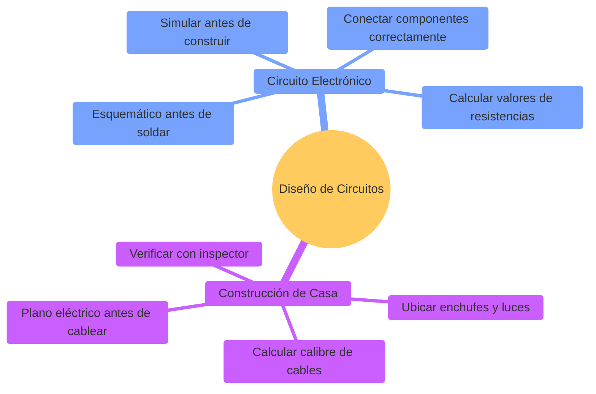
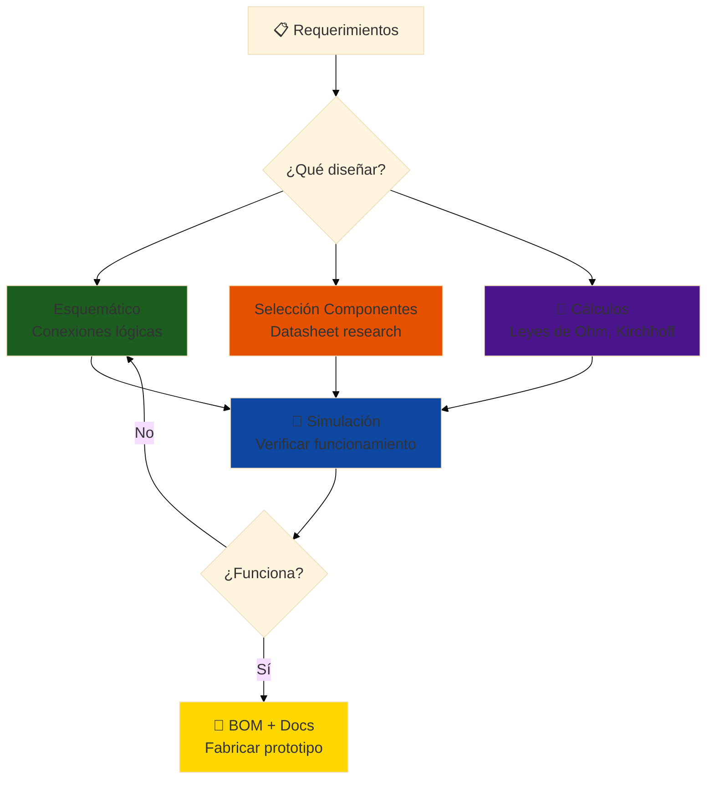
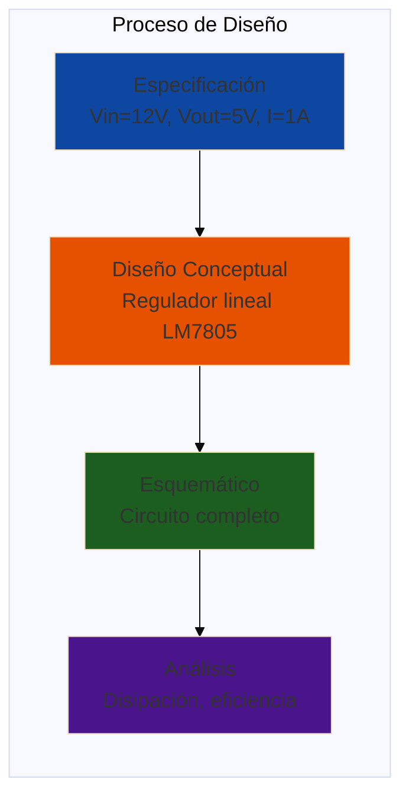
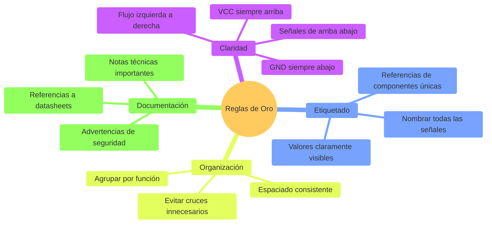
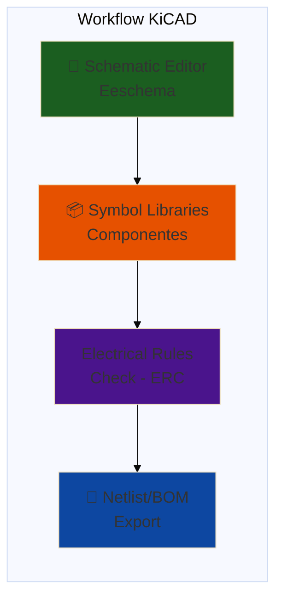
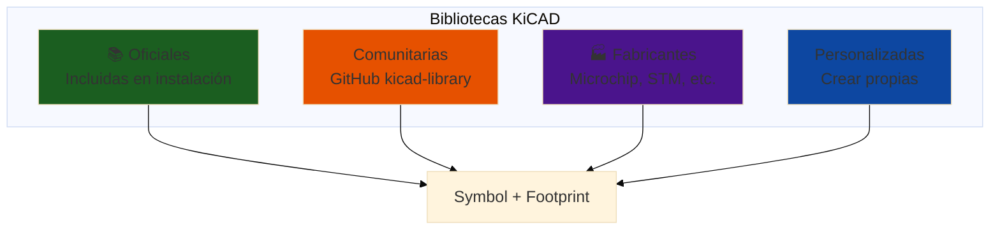
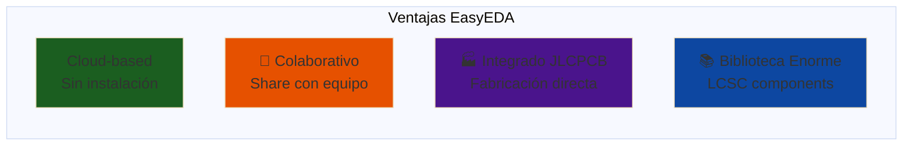
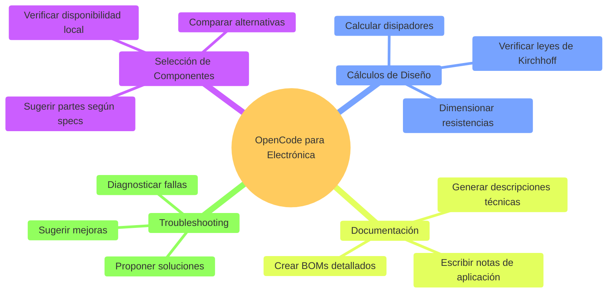
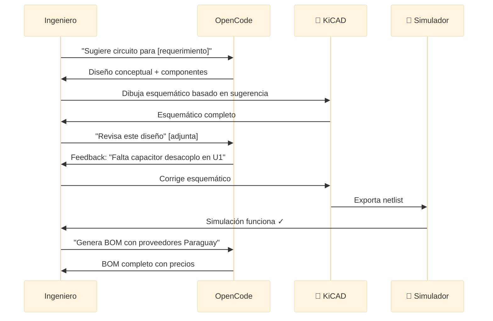
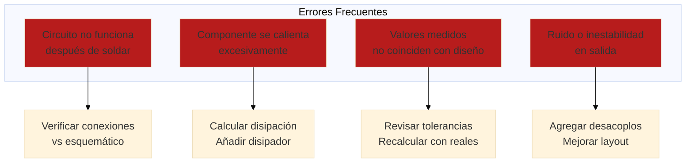

# ⚡ Módulo 01: Diseño de Circuitos con IA

## Diseña Circuitos Electrónicos Profesionales Acelerado con OpenCode

> **Para Electrónicos/Mecatrónicos**: Este módulo te enseña a diseñar circuitos electrónicos desde el esquemático hasta el análisis funcional, usando herramientas profesionales como KiCAD y EasyEDA. Aprenderás a documentar, simular y optimizar tus diseños con OpenCode como asistente técnico.

**⏱️ Duración**: 4 horas  
**👤 Nivel**: Intermedio (con fundamentos de electrónica)  
**🎯 Objetivo**: Dominar el diseño de circuitos esquemáticos con herramientas modernas

---

## 🎓 ¿Qué Vas a Lograr?

1. ✅ **Diseñar esquemáticos** - Circuitos legibles y profesionales en KiCAD
2. ✅ **Seleccionar componentes** - Elegir partes correctas con criterio técnico
3. ✅ **Simular circuitos** - Verificar funcionamiento antes de construir
4. ✅ **Generar BOMs** - Listas de materiales completas y precisas
5. ✅ **Usar IA para diseño** - OpenCode como asistente de ingeniería

---

## 🤔 ¿Qué es Diseño de Circuitos?

### Analogía: Planos de una Casa Eléctrica



**Diseño de circuitos** = El "plano eléctrico" que define cómo se conectan los componentes electrónicos para lograr una función específica.

### ¿Por Qué es Crítico en Paraguay?

**Realidad del mercado local**:
- ✅ **Itaipu Binacional** - Diseño de sistemas de control y protección eléctrica
- ✅ **ANDE** - Subestaciones y sistemas de distribución (220V, 50Hz)
- ✅ **Industrias** - Automatización con PLCs y sensores
- ✅ **Startups** - IoT y dispositivos inteligentes (AgTech, Smart Grids)

**Sin esquemáticos bien diseñados** = Proyectos que no funcionan o fallan en campo 🚫

---

## 📊 El Flujo de Diseño Electrónico



**Analogía local**: Como diseñar el sistema eléctrico de una casa en San Lorenzo - necesitas calcular cargas, elegir cables, y hacer planos antes de conectar nada.

---

## 🏢 Parte 1: Fundamentos de Diseño de Circuitos (60 min)

### Concepto: Del Concepto al Esquemático

**Analogía**: Como escribir una receta antes de cocinar - defines ingredientes y pasos.



### Símbolos Esquemáticos Básicos

```mermaid
%%{init: {'theme':'base', 'themeVariables': {'fontSize':'18px'}}}%%
graph TD
    subgraph "Componentes Pasivos"
        R[Resistencia<br/>🔲─────🔲<br/>Limita corriente]
        C[Capacitor<br/>🔲┤├🔲<br/>Almacena carga]
        L[Inductor<br/>🔲∿∿∿🔲<br/>Almacena energía magnética]
    end
    
    subgraph "Componentes Activos"
        D[Diodo<br/>🔲▷|🔲<br/>Rectifica corriente]
        T[Transistor<br/>NPN/PNP<br/>Amplifica/conmuta]
        IC[IC<br/>□□□<br/>Circuito integrado]
    end
    
    style R fill:#b71c1c
    style C fill:#1b5e20
    style L fill:#0d47a1
    style D fill:#e65100
    style T fill:#4a148c
    style IC fill:#E1E1FF
```

### Ejemplo Real: Fuente de Alimentación Regulada 5V

**Requerimiento**: Convertir 220VAC (red paraguaya) a 5VDC @ 1A para alimentar Arduino.

**Diseño conceptual**:
```
220VAC → Transformador (12VAC) → Rectificador → Filtrado → Regulador 7805 → 5VDC
```

**Esquemático simplificado**:
```
[T1]          [D1-D4]        [C1]         [U1]        [C2]
220V ─┬─ 12V ─┬─ Puente ─┬─ 1000µF ─┬─ LM7805 ─┬─ 100µF ─┬─ 5V OUT
      └───────┘  Rectif.  │         │   IN│OUT  │         │
                           GND       GND     GND GND       GND
```

**Cálculos necesarios**:
1. **Corriente del transformador**: I_transf = 1A × 1.4 (factor seguridad) = 1.4A
2. **Voltaje rectificado**: V_rect = 12VAC × 1.414 = 17VDC (aprox)
3. **Disipación del regulador**: P = (17V - 5V) × 1A = 12W → **Necesita disipador**
4. **Capacitor de entrada**: C1 ≥ 1000µF (filtrar ripple de 50Hz)

### Implementación con OpenCode

```bash
opencode "Diseña fuente de alimentación regulada para proyecto FPUNA:

ESPECIFICACIONES:
- Entrada: 220VAC 50Hz (red paraguaya)
- Salida: 5VDC regulado @ 1A continua
- Ripple máximo: 100mV
- Protección contra cortocircuito

COMPONENTES A INCLUIR:
1. Transformador 220V/12V
2. Puente rectificador 1N4007 (o similar)
3. Regulador lineal LM7805 con disipador
4. Capacitores de filtrado (entrada/salida)
5. LED indicador de salida
6. Fusible de protección en primario

CÁLCULOS REQUERIDOS:
- Disipación térmica del regulador
- Dimensionamiento del disipador (°C/W)
- Capacitancia mínima de filtrado
- Corriente del fusible (1.2× corriente nominal)
- Resistencia del LED (20mA)

OUTPUT:
1. Esquemático en formato texto (conexiones claras)
2. Lista de componentes con valores calculados
3. Notas de diseño y advertencias
4. Especificaciones de disipador térmico
5. Todo comentado en español con contexto paraguayo"
```

### Reglas de Diseño Fundamentales



### Leyes Fundamentales - Recordatorio

**Ley de Ohm**:
```
V = I × R
```
Ejemplo: LED con Vf=2V, If=20mA en fuente de 5V
```
R = (Vsource - Vled) / Iled = (5V - 2V) / 0.02A = 150Ω
Potencia: P = I² × R = (0.02)² × 150 = 0.06W → Usar resistor 1/4W
```

**Divisor de voltaje**:
```
Vout = Vin × R2 / (R1 + R2)
```
Ejemplo: Sensar 12V con ADC de 5V (Arduino)
```
R1 = 10kΩ, R2 = 7.5kΩ
Vout = 12V × 7.5k / (10k + 7.5k) = 5.14V ≈ 5V ✓
```

---

## 🔬 Parte 2: KiCAD - Schematic Capture (90 min)

### Concepto: Herramienta Profesional de Diseño

**KiCAD** = El "AutoCAD de la electrónica" - Software profesional, gratuito y open-source.



### Tutorial Paso a Paso: Circuito de Sensor de Temperatura

**Objetivo**: Diseñar circuito para leer sensor DHT22 con Arduino.

#### Paso 1: Crear Proyecto Nuevo

1. Abrir KiCAD → **File > New Project**
2. Guardar como: `sensor-temperatura-fpuna`
3. Abrir Schematic Editor (Eeschema)

#### Paso 2: Agregar Componentes

**Componentes necesarios**:
| Componente | Símbolo KiCAD | Cantidad | Notas |
|------------|---------------|----------|-------|
| Arduino Uno | MCU_Module:Arduino_Uno_R3 | 1 | Microcontrolador |
| DHT22 | Sensor_Humidity:DHT22 | 1 | Sensor temp/humedad |
| Resistor Pull-up | Device:R | 1 | 4.7kΩ |
| Capacitor Desacoplo | Device:C | 1 | 100nF |
| Conector | Connector:Conn_01x03 | 1 | Alimentación |

**Acciones en KiCAD**:
```
Tecla 'A' → Add Symbol → Buscar 'Arduino_Uno_R3'
Tecla 'A' → Add Symbol → Buscar 'DHT22'
Tecla 'A' → Add Symbol → Buscar 'R' (resistencia)
```

#### Paso 3: Conectar (Wiring)

**Esquema de conexiones**:
```
DHT22:
- Pin 1 (VCC)  → Arduino 5V
- Pin 2 (DATA) → Arduino D2 (con pull-up 4.7kΩ a VCC)
- Pin 3 (NC)   → No conectar
- Pin 4 (GND)  → Arduino GND

Capacitor:
- 100nF entre VCC y GND del DHT22 (cerca del sensor)
```

**En KiCAD**:
```
Tecla 'W' → Wire tool → Conectar pines
Tecla 'L' → Label → Nombrar señales: VCC, GND, DHT_DATA
Tecla 'P' → Power symbol → Agregar +5V y GND
```

#### Paso 4: Configurar Valores y Referencias

```
Doble click en 'R?' → Cambiar a 'R1'
Doble click en valor → Cambiar a '4.7k'
Field Properties → Agregar Footprint: 'Resistor_SMD:R_0805'
```

#### Paso 5: Electrical Rules Check (ERC)

```
Menú: Inspect → Electrical Rules Checker
Click 'Run ERC'

Revisar errores comunes:
⚠️ Pin not connected → Agregar flag 'No Connect' (tecla X)
⚠️ Power pin not driven → Conectar correctamente a fuente
✅ No errors → Listo para siguiente paso
```

#### Paso 6: Generar Bill of Materials (BOM)

```
Menú: Generate Bill of Materials
Template: bom_csv_grouped_by_value
Output: sensor-temperatura-fpuna-bom.csv

Resultado:
| Ref | Qty | Value | Footprint | Datasheet | Proveedor Local |
|-----|-----|-------|-----------|-----------|-----------------|
| R1  | 1   | 4.7k  | R_0805    | Generic   | Electrónica Japonesa |
| C1  | 1   | 100nF | C_0805    | Generic   | Electrónica Japonesa |
| U1  | 1   | DHT22 | DHT22     | Datasheet | MercadoLibre PY |
```

### Gestión de Bibliotecas de Componentes



**Agregar biblioteca personalizada**:
```
Preferences → Manage Symbol Libraries
Add existing library → Browse → Seleccionar .kicad_sym
OK
```

**Componentes comunes en Paraguay**:
- **Microcontroladores**: PIC16F, ATmega328, STM32
- **Reguladores**: LM7805, LM317, AMS1117
- **Sensores**: DHT22, DS18B20, LM35, HC-SR04
- **Drivers**: L298N, ULN2003, IRF540
- **Conectores**: KF301 (borneras), Pin headers

### Implementación con OpenCode

```bash
opencode "Genera paso a paso para crear esquemático en KiCAD de circuito driver de motor DC:

ESPECIFICACIONES:
- Microcontrolador: Arduino Nano (ATmega328P)
- Driver: L298N dual H-bridge
- Motor DC 12V @ 2A
- Encoder óptico para velocidad
- Fuente: 12VDC externa, regulador 5V para lógica
- Interfaz: 3 pines Arduino (EN, IN1, IN2)

INCLUIR EN LA GUÍA:
1. Lista completa de componentes con referencias KiCAD
2. Esquemático organizado por bloques:
   - Bloque alimentación (12V → 5V)
   - Bloque control (Arduino)
   - Bloque potencia (L298N + motor)
   - Bloque encoder
3. Conexiones detalladas paso a paso
4. Valores de componentes calculados:
   - Capacitores de desacoplo (0.1µF, 10µF)
   - Resistencias pull-up encoder (4.7kΩ)
   - Diodos flyback (1N4007)
5. Notas de diseño:
   - Separación GND de potencia y lógica
   - Protecciones contra back-EMF
   - Disipación térmica del L298N
6. Checklist de verificación ERC
7. Plantilla de BOM con proveedores paraguayos

Incluir capturas de pantalla del circuito en KiCad mostrando:
- Vista esquemática completa con componentes etiquetados
- Panel ERC con verificaciones pasadas (marca verde)
- Lista de materiales generada automáticamente
- Anotaciones y notas técnicas en español"
```

---

## 🌐 Parte 3: EasyEDA y Herramientas Online (60 min)

### Concepto: Diseño en la Nube

**EasyEDA** = KiCAD en el navegador - Colaborativo, rápido, integrado con fabricantes PCB.



### Herramientas de Simulación Online

#### Falstad Circuit Simulator

**URL**: `falstad.com/circuit/`

**Uso**: Simulación rápida de circuitos analógicos y digitales en tiempo real.

**Ejemplo: Filtro RC Pasa-Bajos**
```
Especificaciones:
- R = 1kΩ
- C = 100nF
- Frecuencia de corte: fc = 1 / (2π × R × C) = 1.59 kHz

Análisis en Falstad:
1. Arrastra: Resistor, Capacitor, Voltage Source (AC)
2. Conectar en serie: Vin → R → (Vout) → C → GND
3. Scope: Click derecho en Vout → View in Scope
4. Frequency: Cambiar source 100Hz → 10kHz
5. Observar: Atenuación de -3dB en 1.6kHz ✓
```

**Compartir con OpenCode**:
```bash
opencode "Analiza este circuito de Falstad y explica su funcionamiento:

[pegar export de Falstad Circuit Simulator]

ANÁLISIS REQUERIDO:
1. Identificar componentes y valores
2. Calcular frecuencia de corte o punto de operación
3. Explicar forma de onda resultante
4. Proponer modificaciones para:
   - Cambiar fc a 5kHz
   - Reducir ripple en salida
5. Aplicaciones prácticas en Paraguay (ej: filtrado 50Hz de ANDE)"
```

#### Multisim Live (NI)

**URL**: `multisim.com`

**Ventajas**:
- Simulación SPICE profesional
- Instrumentos virtuales (osciloscopio, multímetro)
- Análisis AC, DC, transitorio

**Ejemplo de uso**: Verificar ganancia de amplificador operacional antes de soldar.

### Comparativa de Herramientas

| Característica | KiCAD | EasyEDA | Multisim Live | Falstad |
|----------------|-------|---------|---------------|---------|
| **Costo** | Gratis | Gratis | Gratis (limitado) | Gratis |
| **Instalación** | Desktop | Browser | Browser | Browser |
| **Simulación** | Limitada | Básica | Profesional | Tiempo real |
| **PCB Design** | ✅ Completo | ✅ Completo | ❌ Solo esquema | ❌ No |
| **Colaboración** | Git | ✅ Nativo | ⚠️ Limitado | ❌ No |
| **Fabricación** | Export Gerber | ✅ JLCPCB | ❌ No | ❌ No |
| **Curva aprendizaje** | Media-Alta | Baja | Media | Muy baja |

**Recomendación para FPUNA**:
- **KiCAD**: Proyectos complejos, profesionales, control total
- **EasyEDA**: Prototipos rápidos, colaboración, fabricación integrada
- **Falstad**: Aprender conceptos, verificar cálculos rápidos
- **Multisim**: Simulación avanzada, análisis de frecuencia

### Ejercicio Práctico: Diseño Comparativo

**Tarea**: Diseñar circuito de LED con sensor de luz (LDR) en ambas herramientas.

**Circuito**: LED se enciende cuando oscurece.
```
VCC (5V) → R1 (10kΩ) → LDR → GND
                      └─→ Base Transistor (2N2222)
Colector (2N2222) ← LED + R2 (330Ω) ← VCC
Emisor → GND
```

**En KiCAD**:
1. Crear proyecto `luz-automatica-kicad`
2. Agregar componentes, conectar, ERC
3. Exportar esquemático PDF

**En EasyEDA**:
1. Ir a easyeda.com → New Project
2. Arrastrar componentes desde biblioteca
3. Compartir link público

**Con OpenCode**:
```bash
opencode "Genera documentación técnica comparando ambos diseños:

PROYECTO: Luz automática con LDR

ARCHIVOS:
- KiCAD: [adjuntar .kicad_sch]
- EasyEDA: [pegar link público]

COMPARAR:
1. Facilidad de uso
2. Tiempo de diseño
3. Calidad del output
4. Ventajas/desventajas

INCLUIR:
- Screenshots descritos
- Recomendación de cuál usar según caso de uso
- Próximos pasos para cada herramienta"
```

---

## 💻 Parte 4: OpenCode para Diseño Electrónico (30 min)

### Casos de Uso de IA en Diseño de Circuitos



### Prompt Engineering para Diseño Electrónico

#### Selección de Componentes

```bash
opencode "Sugiere componentes para interfaz de sensores analógicos en proyecto industrial FPUNA:

REQUERIMIENTOS:
- 4 entradas analógicas 0-10V
- Protección contra sobrevoltaje (hasta 24V)
- Filtrado anti-aliasing (fc = 1kHz)
- ADC 12-bit mínimo
- Comunicación I2C con microcontrolador
- Temperatura operación: 0-60°C (clima Paraguay)

CONTEXTO:
- Proveedores: Electrónica Japonesa, Casa Japón (Asunción)
- Presupuesto: moderado (proyecto académico)
- Necesito: ICs, resistencias, capacitores, diodos

OUTPUT ESPERADO:
1. Lista de componentes principales (ADC, op-amps, protección)
2. Valores calculados de pasivos
3. Alternativas disponibles localmente
4. Diagrama de bloques del circuito
5. Estimado de costo en guaraníes (₲)
6. Referencias a datasheets

Todo en español con contexto paraguayo"
```

#### Generación de BOM Inteligente

```bash
opencode "Genera Bill of Materials completo para circuito adjunto:

CIRCUITO: [describir o adjuntar esquemático]

AGREGAR EN BOM:
1. Referencia de componente (R1, C1, U1...)
2. Valor / Part number
3. Footprint (THT o SMD)
4. Cantidad
5. Datasheet link
6. Proveedor local sugerido
7. Precio unitario estimado (₲)
8. Notas de sustitución

PROVEEDORES PARAGUAY:
- Electrónica Japonesa (Asunción)
- Casa Japón
- MercadoLibre PY
- DigiKey (importación)

FORMATO: Tabla Markdown + archivo CSV

Incluir totales y alternativas para componentes críticos"
```

#### Documentación de Diseño

```bash
opencode "Documenta este diseño electrónico para presentación en FPUNA:

PROYECTO: [nombre del circuito]
ESQUEMÁTICO: [adjuntar imagen o descripción]

GENERAR:
1. Descripción general del circuito (2-3 párrafos)
2. Teoría de operación por bloques funcionales
3. Cálculos de diseño principales (mostrar fórmulas)
4. Especificaciones eléctricas:
   - Voltaje de entrada/salida
   - Corriente máxima
   - Potencia disipada
   - Eficiencia (si aplica)
5. Precauciones y advertencias
6. Procedimiento de prueba
7. Troubleshooting común
8. Referencias bibliográficas

ESTILO:
- Lenguaje técnico pero accesible
- Analogías para conceptos complejos
- Referencias a estándares paraguayos (220V ANDE, etc.)
- Formato markdown con diagramas Mermaid

Todo el contenido debe generarse completamente en español."
```

#### Análisis y Troubleshooting

```bash
opencode "Analiza por qué este circuito no funciona:

DISEÑO:
[descripción del esquemático]

SÍNTOMA:
El LED no enciende cuando el LDR se oscurece. Con multímetro mido:
- VCC = 5.0V ✓
- Voltaje en base del transistor = 0.1V (debería ser ~0.7V)
- Voltaje después del LDR = 4.9V (casi VCC)

SOSPECHA:
Divisor de voltaje mal calculado

SOLICITO:
1. Diagnóstico del problema
2. Cálculo correcto de R1 considerando:
   - LDR: 1kΩ (luz) / 100kΩ (oscuro)
   - Transistor: 2N2222 (hFE=100, Vbe=0.7V)
   - LED: If=20mA
3. Valores corregidos de componentes
4. Explicación paso a paso del error
5. Simulación del comportamiento correcto

Contexto: Proyecto de estudiante de Electrónica FPUNA"
```

### Integración con Workflow de Diseño



**Ventaja**: OpenCode actúa como **revisor técnico senior** que valida diseños y sugiere mejoras.

---

## 🎯 Ejercicio Práctico: Circuito de Interfaz de Sensor Industrial

### Objetivo

Diseñar circuito completo para leer sensor de presión 4-20mA industrial con Arduino.

### Especificaciones

**Entrada**: Sensor de presión 4-20mA (estándar industrial)
- 4mA = 0 bar
- 20mA = 10 bar
- Alimentación: 24VDC (fuente externa)

**Salida**: Voltaje 0-5V para ADC de Arduino
- 0V = 4mA (0 bar)
- 5V = 20mA (10 bar)

**Contexto Paraguay**: Medición de presión en tanque de agua de cooperativa en Itauguá.

### Diseño Paso a Paso

#### 1. Conversión Corriente a Voltaje

```
I_sensor (4-20mA) → R_shunt → V_out (0-5V)

Cálculo de R_shunt:
V_out = I_sensor × R_shunt
Para 20mA → 5V: R_shunt = 5V / 0.02A = 250Ω

Verificación con 4mA:
V_min = 0.004A × 250Ω = 1V (NO cero! ⚠️)

Necesitamos offset correction:
V_adjusted = (V_measured - 1V) × (5V / 4V) = V_measured × 1.25 - 1.25V

Implementar con op-amp: amplificador restador
```

#### 2. Circuito con Op-Amp

```
Usar LM358 (dual op-amp, común en Paraguay):

Etapa 1: Conversión I→V con offset
Etapa 2: Escalado y desplazamiento

Componentes:
- R_shunt = 220Ω (E24 standard, más cercano a 250Ω)
- R1, R2 para amplificador (calcular con OpenCode)
- C1 = 100nF desacoplo
- R_protect = 1kΩ en entrada ADC
- C_filter = 10nF filtro anti-aliasing
```

#### 3. Implementar con OpenCode

```bash
opencode "Diseña circuito de acondicionamiento de señal 4-20mA a 0-5V:

ESPECIFICACIONES COMPLETAS:
[copiar de arriba]

GENERAR:
1. Esquemático detallado (texto estructurado)
2. Cálculo de TODOS los componentes con fórmulas
3. Análisis de errores y precisión
4. Lista de componentes (BOM) con:
   - Valores calculados
   - Valores comerciales (series E24/E96)
   - Proveedores Paraguay
   - Precios estimados
5. Procedimiento de calibración
6. Código Arduino para leer y convertir ADC a presión

VALIDACIONES:
- Verificar que 4mA → 0V (±0.1V)
- Verificar que 20mA → 5V (±0.1V)
- Linealidad del circuito

TODO en español con contexto industrial paraguayo"
```

#### 4. Verificación en Simulador

Probar en **Falstad** o **Multisim Live**:
1. Simular fuente de corriente variable 4-20mA
2. Medir salida del circuito
3. Graficar transferencia función (entrada vs salida)
4. Verificar linealidad

---

## 🔧 Troubleshooting de Diseño

### Problemas Comunes y Soluciones



#### Caso 1: Regulador LM7805 se Calienta Mucho

**Síntoma**: LM7805 llega a 80°C y entra en protección térmica.

**Diagnóstico con OpenCode**:
```bash
opencode "El regulador LM7805 de mi fuente se sobrecalienta:

DATOS:
- Entrada: 17VDC (después de rectificar)
- Salida: 5VDC @ 800mA
- Disipador: pequeño de aluminio (sin datos)

CALCULA:
1. Potencia disipada actual
2. Resistencia térmica requerida del disipador
3. ¿Es suficiente el disipador actual?
4. Alternativas:
   - Usar regulador switching (LM2596)
   - Pre-regulador para reducir entrada
   - Disipador más grande

Recomienda solución más económica para Paraguay"
```

**Solución típica**:
```
P_dissipated = (Vin - Vout) × Iout = (17V - 5V) × 0.8A = 9.6W

Temperatura máxima: Tj = 125°C
Temperatura ambiente Paraguay: Ta = 35°C (verano)
Resistencia térmica junction-to-ambient: θja

θja_required = (Tj - Ta) / P = (125°C - 35°C) / 9.6W = 9.4 °C/W

Disipador necesario: θsa = 9.4 - 5 (θjc del TO-220) = 4.4 °C/W

→ Necesita disipador GRANDE o cambiar a switching regulator
```

#### Caso 2: ADC Lee Valores Ruidosos

**Síntoma**: Lecturas del ADC de Arduino fluctúan ±50 counts.

**Checklist de depuración**:
- [ ] ¿Tiene capacitor de desacoplo 100nF en VCC del sensor?
- [ ] ¿Cable de señal está cerca de cables de potencia?
- [ ] ¿Tiene resistencia serie + capacitor en entrada ADC? (filtro RC)
- [ ] ¿GND del sensor está bien conectado a GND Arduino?
- [ ] ¿Usa AREF externo o interno?

**Solución con OpenCode**:
```bash
opencode "Diseña filtro anti-aliasing para entrada ADC de Arduino:

PROBLEMA: Ruido en lecturas de sensor analógico (±50mV fluctuación)

ESPECIFICACIONES:
- Señal útil: DC a 10Hz (sensor lento)
- ADC: 10-bit, 5V ref, impedancia entrada 10kΩ
- Ruido sospechado: 50Hz (ANDE) y switching de fuente

DISEÑAR:
1. Filtro pasa-bajos RC de 1er orden
   - fc = 20Hz (2× señal útil)
   - R < 10kΩ (no cargar ADC)
2. Calcular R y C
3. Atenuación esperada a 50Hz
4. Añadir promediado por software (N muestras)

INCLUIR:
- Diagrama del filtro
- Código Arduino para promediar
- Comparación antes/después

Contexto: Laboratorio FPUNA con ruido de red"
```

---

## ✅ Checklist de Verificación de Diseño

Antes de enviar esquemático a revisión o fabricar prototipo:

### Diseño del Circuito
- [ ] Todos los componentes tienen valores asignados
- [ ] Referencias únicas (R1, R2... sin duplicados)
- [ ] Símbolos conectados correctamente (no pines sueltos)
- [ ] GND común para todas las tierras
- [ ] VCC claramente marcado
- [ ] Polaridad de componentes verificada (electrolíticos, diodos)

### Cálculos y Validaciones
- [ ] Corrientes máximas calculadas
- [ ] Disipación de potencia verificada
- [ ] Componentes dentro de ratings (V, I, P, T)
- [ ] Factores de seguridad aplicados (1.5× mínimo)
- [ ] Simulación realizada (si es posible)

### Electrical Rules Check (ERC)
- [ ] ERC ejecutado sin errores
- [ ] Warnings revisadas y justificadas
- [ ] Pines NC marcados correctamente

### Documentación
- [ ] Título del proyecto claro
- [ ] Notas de diseño importantes
- [ ] Advertencias de seguridad (si aplica voltajes >24V)
- [ ] Referencias a datasheets
- [ ] Versión y fecha del diseño

### Bill of Materials
- [ ] BOM generado y revisado
- [ ] Footprints asignados
- [ ] Disponibilidad local verificada (Paraguay)
- [ ] Costo estimado dentro de presupuesto

---

## 🎓 Mejores Prácticas

### ✅ HACER

1. **Flujo claro** - Señales de izquierda a derecha, VCC arriba, GND abajo
2. **Etiquetar todo** - Señales importantes con nombres descriptivos
3. **Agrupar por función** - Bloques visuales claros (alimentación, control, potencia)
4. **Documentar decisiones** - Notas explicando por qué elegiste ciertos valores
5. **Usar referencias** - Basarse en datasheets y application notes
6. **Diseño modular** - Circuito dividido en subsistemas testeables
7. **Protecciones** - Fusibles, diodos, limitadores de corriente
8. **Testpoints** - Puntos de medición para debugging

### ❌ NO HACER

1. **Esquemas desordenados** - Cruces innecesarios, flujo confuso
2. **Valores sin calcular** - "Poner 10kΩ porque sí" sin justificación
3. **Ignorar datasheets** - Suponer valores máximos sin verificar
4. **Sin protecciones** - Especialmente en circuitos de potencia
5. **Componentes exóticos** - No disponibles en Paraguay o muy caros
6. **Sobre-diseñar** - Usar op-amp de precisión cuando uno genérico funciona
7. **Subestimar calor** - No calcular disipación térmica
8. **Esquemático = PCB** - Diseñar pensando solo en layout, no en claridad

---

## 🎉 Resumen del Módulo

### Lo Que Dominaste

✅ **Fundamentos de diseño** - Del concepto al esquemático  
✅ **KiCAD profesional** - Schematic capture, ERC, BOM  
✅ **Herramientas online** - EasyEDA, simuladores web  
✅ **Selección de componentes** - Criterio técnico y disponibilidad local  
✅ **Cálculos de diseño** - Leyes de Ohm, Kirchhoff, térmica  
✅ **OpenCode para electrónica** - Asistente de ingeniería con IA

### Próximo Paso

**Continúa con**: [Módulo 02 - Diseño de PCB con KiCAD](./02-diseno-pcb.md)

---

## 💭 Reflexión

1. **¿Cómo KiCAD cambia tu workflow de diseño vs papel?**
2. **¿Cuándo usar simulación y cuándo construir directamente?**
3. **¿Cómo OpenCode acelera la documentación técnica?**

**Comparte en Slack** (#electronica-automatizacion)

---

## 📚 Recursos Adicionales

### Documentación Oficial
- [KiCAD 7.x Documentation](https://docs.kicad.org/)
- [EasyEDA Tutorial](https://docs.easyeda.com/)
- [Falstad Circuit Simulator](https://www.falstad.com/circuit/)
- [LTspice (Analog Devices)](https://www.analog.com/ltspice)

### Proveedores Locales (Paraguay)
- **Electrónica Japonesa** - Av. Brasilia, Asunción (componentes generales)
- **Casa Japón** - Centro, Asunción (herramientas, componentes)
- **MercadoLibre PY** - Variedad de sensores, módulos, arduinos
- **DigiKey/Mouser** - Importación (componentes específicos, 2-4 semanas)

### Libros y Guías
- **"The Art of Electronics"** - Horowitz & Hill (biblia de la electrónica)
- **"Practical Electronics for Inventors"** - Paul Scherz
- **"KiCAD Like a Pro"** - Peter Dalmaris (eBook)

### Comunidades Paraguay
- **FPUNA Electrónica** - Grupo de estudiantes y docentes
- **Hackerspace Asunción** - Meetups mensuales, proyectos colaborativos
- **Paraguay Tech** - Comunidad de makers y desarrolladores

### Datasheets Esenciales
Componentes comunes en proyectos FPUNA:
- **LM7805** - Regulador lineal 5V
- **LM358** - Op-amp dual, general purpose
- **2N2222** - Transistor NPN switching
- **1N4007** - Diodo rectificador 1A
- **DHT22** - Sensor temperatura/humedad
- **L298N** - Driver motor DC dual H-bridge

---

*Módulo creado para FPUNA Verano 2026*  
*Actualizado: Enero 2026*  
*Track: Electrónica y Automatización*