# 📊 Módulo 05: IoT y Visualización de Datos con IA

## Conecta Dispositivos al Mundo Digital con Dashboards Inteligentes

> **Para Electrónicos/Mecatrónicos**: Este módulo integra TODO lo aprendido - circuitos, firmware, automatización - y lo conecta al mundo IoT. Aprenderás a enviar datos de sensores a la nube, crear dashboards profesionales, y visualizar información en tiempo real con herramientas de IA.

**⏱️ Duración**: 4 horas  
**👤 Nivel**: Intermedio-Avanzado (módulo de síntesis)  
**🎯 Objetivo**: Dominar ecosistema completo IoT desde sensor hasta visualización

---

## 🎓 ¿Qué Vas a Lograr?

1. ✅ **Arquitectura IoT completa** - De sensor a cloud a dashboard
2. ✅ **Protocolos IoT** - MQTT, HTTP/REST, WebSockets
3. ✅ **Plataformas en la nube** - ThingSpeak, Ubidots, AWS IoT
4. ✅ **Visualización de datos** - Grafana, dashboards dinámicos
5. ✅ **OpenCode para IoT** - Generar código MQTT, configs de dashboard

---

## 🤔 ¿Qué es IoT?

### Analogía: La Red Nerviosa de Dispositivos

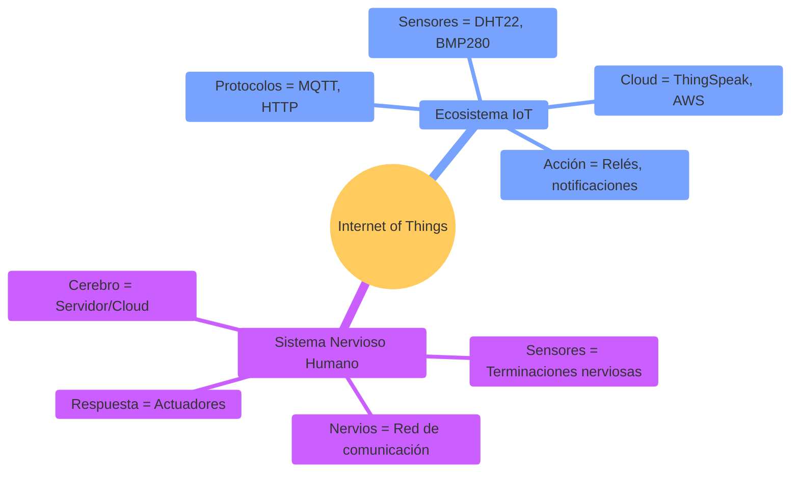

**IoT** = Dispositivos físicos conectados a Internet que recopilan datos, los procesan, y ejecutan acciones de forma inteligente.

### ¿Por Qué es Crítico en Paraguay?

**Realidad del mercado local**:
- ✅ **AgTech** - Monitoreo de cultivos (soja, maíz) en tiempo real
- ✅ **Smart Grids** - ANDE modernizando medición eléctrica
- ✅ **Ganadería inteligente** - Tracking de ganado con GPS/sensores
- ✅ **Industria 4.0** - Fábricas con sensores IIoT (Itaipu, frigoríficos)
- ✅ **Ciudades inteligentes** - Asunción piloto de sensores ambientales

**Sin IoT + Visualización** = Datos ciegos, sin insights, decisiones tardías 🚫

**Salarios en Paraguay**:
- IoT Developer junior: **₲10-15M/mes**
- IoT Architect: **₲18-30M/mes**
- Data Engineer (IoT): **₲20-35M/mes**

---

## 📊 La Arquitectura IoT de 3 Capas

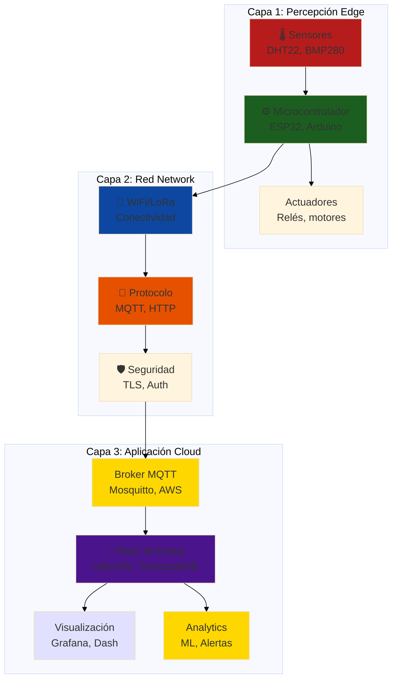

**Analogía local**: Como el sistema de distribución eléctrica de ANDE - generación (sensor), transmisión (red), distribución (cloud), consumo (visualización).

---

## 🏢 Parte 1: Fundamentos de IoT y Protocolos (60 min)

### Concepto: IoT No Es Solo "WiFi + Sensor"

**IoT moderno requiere**:
1. **Conectividad eficiente** - Bajo ancho de banda, alta confiabilidad
2. **Protocolo ligero** - MQTT ideal para MCUs con RAM limitada
3. **Seguridad** - Autenticación, encriptación (TLS)
4. **Escalabilidad** - Soportar miles de dispositivos

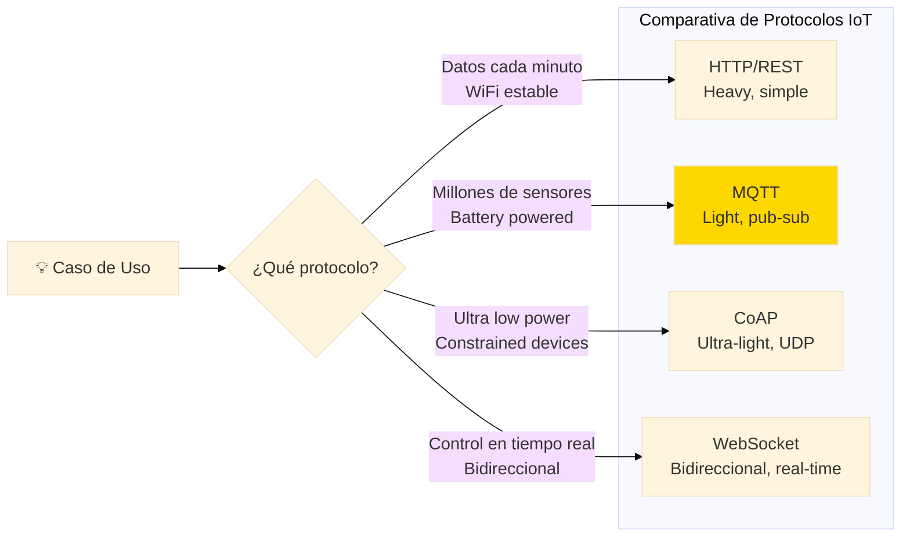

### MQTT: El Protocolo del IoT

**MQTT (Message Queue Telemetry Transport)** = Protocolo pub/sub diseñado para redes inestables y dispositivos limitados.

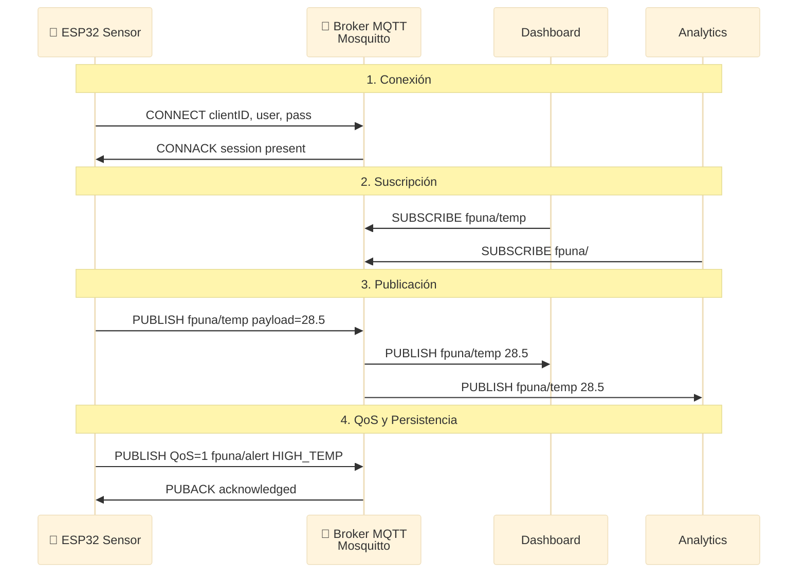

**Componentes MQTT**:

| Componente | Rol | Ejemplo |
|------------|-----|---------|
| **Broker** | Servidor central que recibe y distribuye mensajes | Mosquitto, HiveMQ, AWS IoT |
| **Publisher** | Dispositivo que envía datos (sensor) | ESP32 con DHT22 |
| **Subscriber** | Cliente que recibe datos (dashboard) | Grafana, Node-RED |
| **Topic** | Ruta jerárquica para organizar mensajes | `fpuna/lab1/temp`, `ande/medidor/123/kWh` |

### Topics: La Estructura de Mensajes

**Convención de nombres**:
```
[organización]/[ubicación]/[dispositivo]/[tipo_dato]

Ejemplos Paraguay:
- fpuna/electronica/esp32_01/temperatura
- itaipu/turbina_5/vibracion
- ande/transformador/san_lorenzo/voltaje
- agro/campo_soja/sensor_humedad/valor
```

**Wildcards**:
- `+` = Un nivel: `fpuna/+/temperatura` (todos los labs)
- `#` = Múltiples niveles: `fpuna/#` (todo de fpuna)

### Calidad de Servicio (QoS)

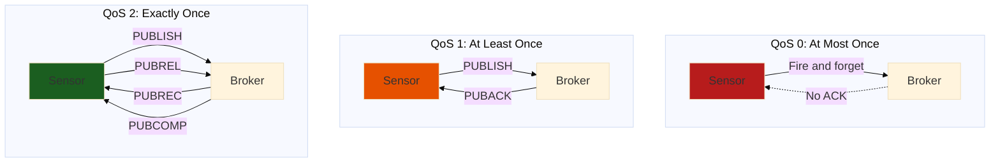

**Cuándo usar cada QoS**:

| QoS | Latencia | Garantía | Caso de Uso |
|-----|----------|----------|-------------|
| **0** | Mínima | Puede perder datos | Telemetría no crítica (temp ambiente) |
| **1** | Media | Al menos 1 entrega (puede duplicar) | Sensores industriales |
| **2** | Alta | Exactamente 1 entrega | Comandos críticos (abrir válvula) |

### HTTP/REST para IoT

**Cuándo usar HTTP en vez de MQTT**:
- Infraestructura existente (firewall-friendly)
- Dispositivos con mucha RAM/CPU
- APIs RESTful bien documentadas (ThingSpeak)

**Ejemplo: Enviar dato a ThingSpeak**:
```cpp
// ESP32 HTTP POST
#include <HTTPClient.h>

HTTPClient http;
String url = "https://api.thingspeak.com/update?api_key=TU_API_KEY";
url += "&field1=" + String(temperatura);
url += "&field2=" + String(humedad);

http.begin(url);
int httpCode = http.GET();  // ThingSpeak usa GET con query params

if (httpCode == 200) {
  Serial.println("Dato enviado OK");
} else {
  Serial.println("Error: " + String(httpCode));
}
```

**Comparación MQTT vs HTTP**:

| Característica | MQTT | HTTP/REST |
|----------------|------|-----------|
| **Overhead** | 2 bytes header | ~400+ bytes header |
| **Conexión** | Persistente | Request/Response |
| **Batería** | Eficiente (keep-alive) | Cada request = handshake |
| **Tiempo real** | Pub/Sub instantáneo | Polling o webhooks |
| **NAT/Firewall** | Requiere puerto abierto | Firewall-friendly |
| **Simplicidad** | Requiere broker | Directo a servidor |

**Recomendación**: 
- **MQTT** si necesitas tiempo real, muchos sensores, o bajo consumo
- **HTTP** si envías datos esporádicos (<1/minuto) y quieres simplicidad

---

## ☁️ Parte 2: Plataformas IoT en la Nube (90 min)

### Concepto: Cloud Platforms = Backend Listo para Usar

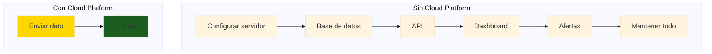

### ThingSpeak: La Más Simple (Ideal para Aprender)

**ThingSpeak** = Plataforma MATLAB-based para IoT, gratis hasta 3M mensajes/año.

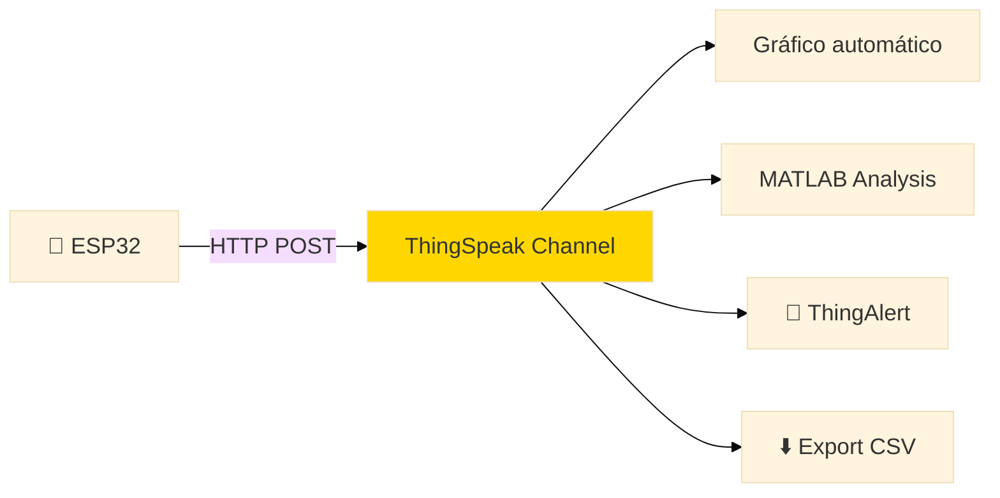

**Ventajas**:
- ✅ Gratis y fácil de empezar
- ✅ Gráficos automáticos
- ✅ API simple (HTTP GET/POST)
- ✅ MATLAB integration (análisis avanzado)
- ✅ Apps móvil disponibles

**Limitaciones**:
- ⚠️ Update rate: 1 dato cada 15 segundos (gratis)
- ⚠️ 3 millones mensajes/año máximo
- ⚠️ 4 channels máximo (gratis)

#### Tutorial: Estación Meteorológica con ThingSpeak

**Paso 1: Crear Channel en ThingSpeak**
1. Ir a `thingspeak.com` → Sign Up (gratis)
2. Channels → New Channel
3. Name: "Estación FPUNA Electrónica"
4. Fields:
   - Field 1: Temperatura (°C)
   - Field 2: Humedad (%)
   - Field 3: Presión (hPa)
   - Field 4: Altitud (m)
5. Save → Copiar **Write API Key**

**Paso 2: Firmware ESP32**

```cpp
#include <WiFi.h>
#include <HTTPClient.h>
#include <DHT.h>
#include <Adafruit_BMP280.h>

// WiFi credentials
const char* ssid = "TU_WIFI";
const char* password = "TU_PASSWORD";

// ThingSpeak
const char* server = "http://api.thingspeak.com/update";
const char* apiKey = "TU_WRITE_API_KEY";  // Copiar de ThingSpeak

// Sensores
#define DHT_PIN 4
#define DHT_TYPE DHT22
DHT dht(DHT_PIN, DHT_TYPE);
Adafruit_BMP280 bmp;

// Timing
unsigned long lastSend = 0;
const unsigned long sendInterval = 20000;  // 20 segundos (ThingSpeak min = 15s)

void setup() {
  Serial.begin(115200);
  
  // Conectar WiFi
  WiFi.begin(ssid, password);
  Serial.print("Conectando WiFi");
  while (WiFi.status() != WL_CONNECTED) {
    delay(500);
    Serial.print(".");
  }
  Serial.println("\nWiFi OK - IP: " + WiFi.localIP().toString());
  
  // Iniciar sensores
  dht.begin();
  if (!bmp.begin(0x76)) {
    Serial.println("ERROR: BMP280 no encontrado");
  }
  
  Serial.println("Sistema listo. Enviando datos a ThingSpeak...");
}

void loop() {
  unsigned long now = millis();
  
  if (now - lastSend >= sendInterval) {
    lastSend = now;
    
    // Leer sensores
    float temp = dht.readTemperature();
    float hum = dht.readHumidity();
    float pressure = bmp.readPressure() / 100.0F;  // Convertir Pa a hPa
    float altitude = bmp.readAltitude(1013.25);     // Presión nivel mar estándar
    
    // Validar lecturas
    if (isnan(temp) || isnan(hum)) {
      Serial.println("Error leyendo DHT22");
      return;
    }
    
    // Construir URL
    String url = String(server) + "?api_key=" + apiKey;
    url += "&field1=" + String(temp, 1);
    url += "&field2=" + String(hum, 1);
    url += "&field3=" + String(pressure, 1);
    url += "&field4=" + String(altitude, 1);
    
    // Enviar datos
    HTTPClient http;
    http.begin(url);
    int httpCode = http.GET();
    
    if (httpCode == 200) {
      Serial.println("✓ Enviado - Temp:" + String(temp) + "°C Hum:" + String(hum) + "%");
    } else {
      Serial.println("✗ Error HTTP: " + String(httpCode));
    }
    http.end();
  }
}
```

**Paso 3: Visualizar en ThingSpeak**

Dashboard automático con:
- Gráficos de línea (temperatura vs tiempo)
- Gauge para humedad actual
- Map si tienes GPS (opcional)

**Paso 4: Alertas con ThingAlert**

Crear alerta si temperatura > 30°C:
1. Apps → ThingHTTP → New
2. Action: Enviar email/SMS
3. Test: MATLAB Analysis para detectar condición
4. React: Activar ThingHTTP si condición verdadera

### Ubidots: Profesional e Industrial

**Ubidots** = Plataforma enterprise-grade, usada en industria y AgTech.

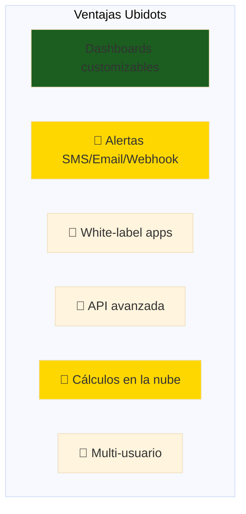

**Casos de uso en Paraguay**:
- ✅ Monitoreo de silos de granos (cooperativas)
- ✅ Tracking de flotas (GPS + fuel consumption)
- ✅ Smart irrigation (AgTech startups)
- ✅ Calidad de aire urbano (Asunción)

#### Ejemplo: MQTT con Ubidots

```cpp
#include <WiFi.h>
#include <PubSubClient.h>

// Ubidots
const char* ubidotsToken = "TU_UBIDOTS_TOKEN";
const char* mqttBroker = "industrial.api.ubidots.com";
const int mqttPort = 1883;

// Device label en Ubidots
const char* deviceLabel = "esp32-fpuna-lab1";

WiFiClient espClient;
PubSubClient mqtt(espClient);

void setup() {
  Serial.begin(115200);
  
  // WiFi
  WiFi.begin(ssid, password);
  while (WiFi.status() != WL_CONNECTED) delay(500);
  
  // MQTT
  mqtt.setServer(mqttBroker, mqttPort);
  reconnectMQTT();
}

void reconnectMQTT() {
  while (!mqtt.connected()) {
    Serial.print("Conectando Ubidots MQTT...");
    if (mqtt.connect("ESP32Client", ubidotsToken, "")) {
      Serial.println("✓ Conectado");
    } else {
      Serial.println("Falló, reintentando...");
      delay(5000);
    }
  }
}

void sendToUbidots(float temp, float hum) {
  if (!mqtt.connected()) reconnectMQTT();
  
  // Topic format: /v1.6/devices/{device-label}
  String topic = "/v1.6/devices/" + String(deviceLabel);
  
  // Payload JSON con múltiples variables
  String payload = "{";
  payload += "\"temperatura\":" + String(temp, 2) + ",";
  payload += "\"humedad\":" + String(hum, 2);
  payload += "}";
  
  mqtt.publish(topic.c_str(), payload.c_str());
  Serial.println("Publicado: " + payload);
}

void loop() {
  mqtt.loop();
  
  // Leer sensores y enviar cada 30s
  static unsigned long lastSend = 0;
  if (millis() - lastSend >= 30000) {
    lastSend = millis();
    
    float temp = dht.readTemperature();
    float hum = dht.readHumidity();
    
    if (!isnan(temp) && !isnan(hum)) {
      sendToUbidots(temp, hum);
    }
  }
}
```

**Dashboard en Ubidots**:
1. Data → Devices → Crear device "esp32-fpuna-lab1"
2. Data → Dashboards → New Dashboard
3. Widgets:
   - Line chart: Temperatura (últimas 24h)
   - Gauge: Humedad actual
   - Indicator: Status (online/offline)
   - Control: Switch para relé remoto

### AWS IoT Core: Enterprise Scale

**AWS IoT Core** = Infraestructura masiva, usado por empresas grandes.

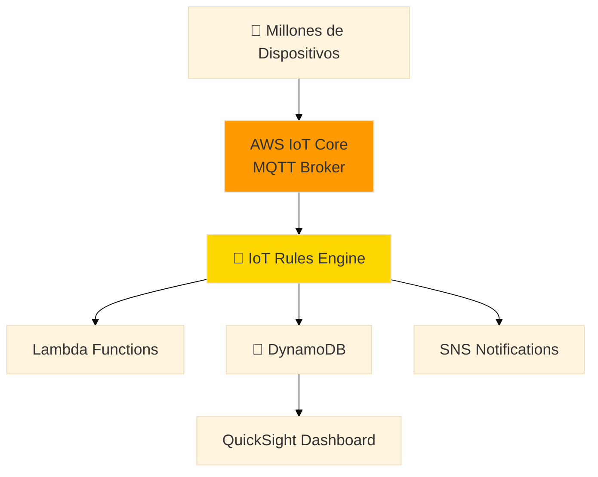

**Cuándo usar AWS IoT**:
- 10,000+ dispositivos
- Integración con AWS (Lambda, S3, etc.)
- Security crítica (certificados X.509)
- Presupuesto para infraestructura

**Costos** (para referencia):
- Gratis: 250,000 mensajes/mes (primer año)
- Luego: USD 1 por millón de mensajes

### Comparación de Plataformas

| Plataforma | Costo | Complejidad | Mejor para | Paraguay Use Case |
|------------|-------|-------------|------------|-------------------|
| **ThingSpeak** | Gratis | Baja | Aprendizaje, prototipos | Proyectos FPUNA |
| **Ubidots** | $9/mes (STEM) | Media | Producción pequeña | Startups AgTech |
| **AWS IoT** | Pay-as-you-go | Alta | Enterprise | Itaipu, ANDE |
| **Blynk** | Freemium | Baja | Apps móvil | Proyectos DIY |
| **Losant** | $49/mes | Media | Industrial IoT | Industrias PY |

---

## 📈 Parte 3: Visualización de Datos con Grafana (60 min)

### Concepto: Grafana = El Dashboard Definitivo

**Grafana** = Open-source platform para visualización de time-series data, usado por Netflix, Uber, Tesla.

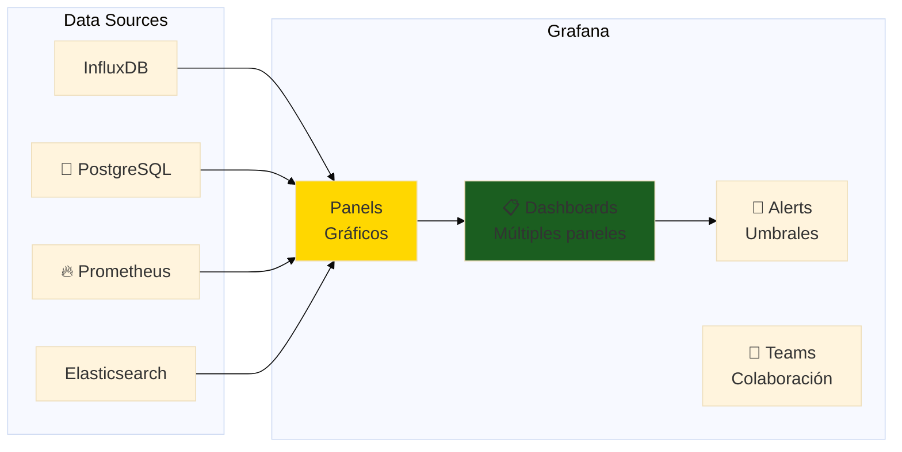

### InfluxDB: Base de Datos para Time-Series

**InfluxDB** = Base de datos optimizada para datos con timestamp (sensores).

**Modelo de datos**:
```
Measurement: temperatura
    Tags (índices): location=lab1, sensor_id=dht22_01
    Fields (datos): value=28.5
    Timestamp: 2026-01-15T10:30:00Z
```

**Ventajas para IoT**:
- ✅ Escritura ultra-rápida (millones puntos/segundo)
- ✅ Compresión automática (reduce storage)
- ✅ Downsampling (agregar datos antiguos)
- ✅ Retention policies (borrar datos viejos)

### Tutorial: Stack Completo (MQTT → InfluxDB → Grafana)

#### Arquitectura del Sistema

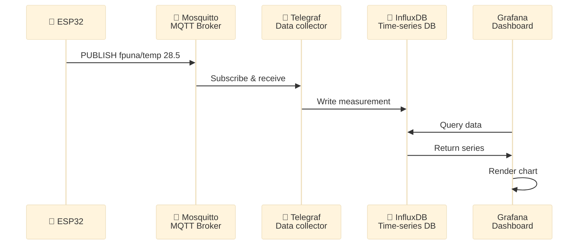

#### Paso 1: Configurar Stack con Docker Compose

**docker-compose.yml**:
```yaml
version: '3.8'

services:
  # Mosquitto MQTT Broker
  mosquitto:
    image: eclipse-mosquitto:2
    ports:
      - "1883:1883"   # MQTT
      - "9001:9001"   # WebSocket
    volumes:
      - ./mosquitto.conf:/mosquitto/config/mosquitto.conf
    restart: always
  
  # InfluxDB Time-Series Database
  influxdb:
    image: influxdb:2.7
    ports:
      - "8086:8086"
    environment:
      - DOCKER_INFLUXDB_INIT_MODE=setup
      - DOCKER_INFLUXDB_INIT_USERNAME=admin
      - DOCKER_INFLUXDB_INIT_PASSWORD=adminpass123
      - DOCKER_INFLUXDB_INIT_ORG=fpuna
      - DOCKER_INFLUXDB_INIT_BUCKET=iot_data
      - DOCKER_INFLUXDB_INIT_ADMIN_TOKEN=mi-token-super-secreto
    volumes:
      - influxdb-data:/var/lib/influxdb2
    restart: always
  
  # Telegraf Data Collector
  telegraf:
    image: telegraf:1.28
    depends_on:
      - influxdb
      - mosquitto
    volumes:
      - ./telegraf.conf:/etc/telegraf/telegraf.conf:ro
    restart: always
  
  # Grafana Dashboard
  grafana:
    image: grafana/grafana:10.2.2
    ports:
      - "3000:3000"
    environment:
      - GF_SECURITY_ADMIN_PASSWORD=admin
    volumes:
      - grafana-data:/var/lib/grafana
    depends_on:
      - influxdb
    restart: always

volumes:
  influxdb-data:
  grafana-data:
```

**telegraf.conf** (excerpt):
```toml
# Input: MQTT Consumer
[[inputs.mqtt_consumer]]
  servers = ["tcp://mosquitto:1883"]
  topics = [
    "fpuna/#"
  ]
  data_format = "value"
  data_type = "float"

# Output: InfluxDB v2
[[outputs.influxdb_v2]]
  urls = ["http://influxdb:8086"]
  token = "mi-token-super-secreto"
  organization = "fpuna"
  bucket = "iot_data"
```

**Iniciar stack**:
```bash
docker-compose up -d
```

#### Paso 2: Código ESP32 Publicando a MQTT

```cpp
#include <WiFi.h>
#include <PubSubClient.h>
#include <DHT.h>

const char* ssid = "TU_WIFI";
const char* password = "TU_PASSWORD";
const char* mqtt_server = "192.168.1.100";  // IP de tu PC con Docker

#define DHT_PIN 4
DHT dht(DHT_PIN, DHT22);

WiFiClient espClient;
PubSubClient mqtt(espClient);

void setup() {
  Serial.begin(115200);
  dht.begin();
  
  WiFi.begin(ssid, password);
  while (WiFi.status() != WL_CONNECTED) delay(500);
  
  mqtt.setServer(mqtt_server, 1883);
  reconnect();
}

void reconnect() {
  while (!mqtt.connected()) {
    if (mqtt.connect("ESP32-FPUNA")) {
      Serial.println("MQTT conectado");
    } else {
      delay(5000);
    }
  }
}

void loop() {
  if (!mqtt.connected()) reconnect();
  mqtt.loop();
  
  static unsigned long lastRead = 0;
  if (millis() - lastRead >= 10000) {  // Cada 10 segundos
    lastRead = millis();
    
    float temp = dht.readTemperature();
    float hum = dht.readHumidity();
    
    if (!isnan(temp) && !isnan(hum)) {
      // Publicar temperatura
      mqtt.publish("fpuna/lab1/temperatura", String(temp).c_str());
      // Publicar humedad
      mqtt.publish("fpuna/lab1/humedad", String(hum).c_str());
      
      Serial.println("Publicado - T:" + String(temp) + " H:" + String(hum));
    }
  }
}
```

#### Paso 3: Crear Dashboard en Grafana

1. **Acceder a Grafana**: `http://localhost:3000` (admin/admin)

2. **Agregar Data Source**:
   - Configuration → Data Sources → Add → InfluxDB
   - Query Language: Flux
   - URL: `http://influxdb:8086`
   - Organization: `fpuna`
   - Token: `mi-token-super-secreto`
   - Default Bucket: `iot_data`
   - Save & Test

3. **Crear Dashboard**:
   - Dashboards → New → New Dashboard → Add visualization

4. **Panel de Temperatura** (Line Chart):
   ```flux
   from(bucket: "iot_data")
     |> range(start: -1h)
     |> filter(fn: (r) => r["topic"] == "fpuna/lab1/temperatura")
     |> aggregateWindow(every: 1m, fn: mean)
   ```
   - Title: "Temperatura Lab 1"
   - Unit: Celsius (°C)
   - Color: Green → Yellow → Red

5. **Panel de Humedad** (Gauge):
   ```flux
   from(bucket: "iot_data")
     |> range(start: -5m)
     |> filter(fn: (r) => r["topic"] == "fpuna/lab1/humedad")
     |> last()
   ```
   - Min: 0, Max: 100
   - Thresholds: 30% (red), 60% (yellow), 80% (green)

6. **Stat Panel** (Valor Actual):
   - Mostrar temperatura actual
   - Sparkline (mini gráfico) de últimos 30 min

### Tipos de Visualizaciones en Grafana

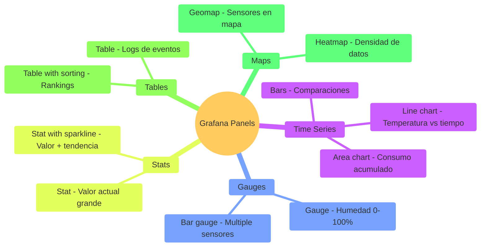

### Alertas en Grafana

**Crear alerta de temperatura alta**:

1. Edit Panel → Alert tab
2. Condition: 
   ```
   WHEN avg() OF query(A, 5m) IS ABOVE 35
   ```
3. Notifications:
   - Email a: admin@fpuna.edu.py
   - Slack channel: #electronica-alerts
   - Webhook: Telegram bot

**Ejemplo de Alert Rule**:
```yaml
- name: Temperatura Alta Lab 1
  condition: avg(temperatura) > 35°C during last 5 minutes
  severity: warning
  actions:
    - send_email
    - send_telegram
  message: "⚠️ Temperatura en Lab 1 excede 35°C: {{ $values.temperatura }}"
```

---

## 🤖 Parte 4: OpenCode para IoT (30 min)

### Casos de Uso de IA en IoT

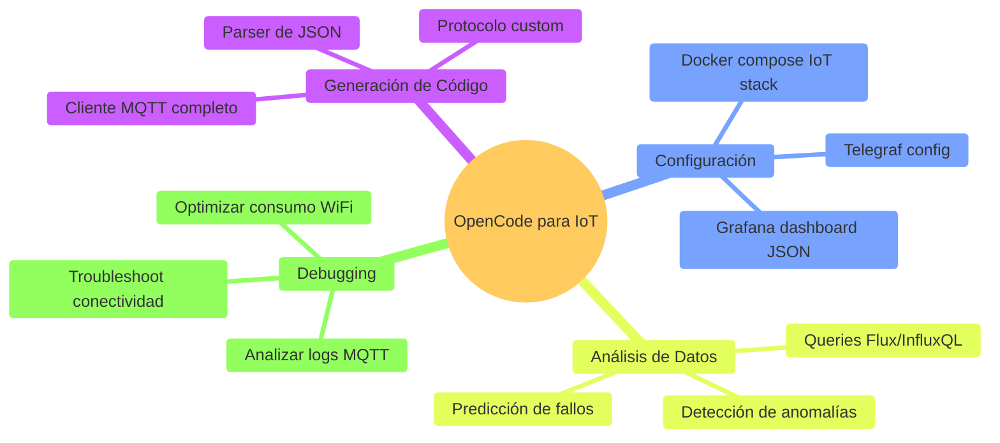

### Prompt: Generar Cliente MQTT Completo

```bash
opencode "Genera cliente MQTT profesional para ESP32 con:

FUNCIONALIDAD:
1. Conectar a broker MQTT con:
   - Reconexión automática
   - Last Will and Testament (LWT)
   - Keep-alive 60s
2. Publicar datos de sensores:
   - DHT22 (temp, humedad)
   - BMP280 (presión, altitud)
   - LDR (luz ambiente 0-100%)
3. Suscribirse a comandos:
   - Topic: 'fpuna/lab1/command'
   - Payloads: 'LED_ON', 'LED_OFF', 'RESET', 'STATUS'
4. Formato de datos:
   - JSON para facilitar parsing
   - Timestamp incluido
   - Device ID único

ESTRUCTURA JSON:
{
  \"device\": \"esp32-lab1-01\",
  \"timestamp\": 1705334400,
  \"sensors\": {
    \"temperature\": 28.5,
    \"humidity\": 65.2,
    \"pressure\": 1013.25,
    \"light\": 75
  }
}

SEGURIDAD:
- Usuario y password MQTT
- Validar payloads de comandos
- Rate limiting (no saturar broker)

MANEJO DE ERRORES:
- WiFi dropped → Reconectar
- Broker no disponible → Almacenar en buffer local
- Sensor falla → Enviar 'null' con flag de error

CÓDIGO:
- Comentarios en español
- Máquina de estados clara
- Debug logs informativos
- Constantes en config.h

Incluir example de uso en setup() y loop()"
```

### Prompt: Configurar Stack IoT con Docker

```bash
opencode "Genera docker-compose.yml completo para stack IoT profesional:

SERVICIOS:
1. Mosquitto MQTT Broker
   - Puerto 1883 (MQTT)
   - Puerto 8883 (MQTT + TLS)
   - WebSocket en 9001
   - Auth con usuarios

2. InfluxDB 2.x
   - Persistencia de datos
   - Retention policy: 30 días raw, 1 año downsampled
   - Org: 'fpuna', Bucket: 'iot_production'

3. Telegraf
   - Input: MQTT consumer (todos topics fpuna/#)
   - Output: InfluxDB
   - Procesamiento: agregar tags (location, device_type)

4. Grafana
   - Pre-configurado con datasource InfluxDB
   - Dashboard de ejemplo importado
   - Alertas configuradas

5. Node-RED (opcional)
   - Flows para automatización
   - Dashboard alternativo

REQUISITOS:
- Volúmenes persistentes
- Network interna para servicios
- Health checks
- Restart policies
- Variables de entorno en .env

INCLUIR:
1. docker-compose.yml
2. mosquitto.conf
3. telegraf.conf
4. .env.example
5. README.md con instrucciones de setup
6. Comandos para iniciar/parar/logs

Todo en español con explicaciones claras"
```

### Prompt: Dashboard Grafana con JSON Model

```bash
opencode "Genera JSON model de Grafana dashboard para estación meteorológica:

DASHBOARD: 'Estación FPUNA - Lab Electrónica'

PANELS (6 total):
1. [Fila 1, Col 1] Temperatura
   - Type: Time series (line)
   - Query: Últimas 24 horas
   - Color: Blue → Yellow → Red (15-40°C)
   - Thresholds: 25°C (ok), 30°C (warning), 35°C (critical)
   
2. [Fila 1, Col 2] Humedad
   - Type: Gauge
   - Current value
   - Min: 0, Max: 100, Unit: %
   - Thresholds: <30% (dry), 30-70% (ok), >70% (humid)

3. [Fila 2, Col 1] Presión Atmosférica
   - Type: Stat with sparkline
   - Últimos 30 minutos
   - Unit: hPa

4. [Fila 2, Col 2] Luz Ambiente
   - Type: Bar gauge
   - 0-100%
   - Orientación: horizontal

5. [Fila 3, Full Width] Comparativa Multi-Sensor
   - Type: Time series
   - Todas las variables normalizadas 0-100%
   - Legends abajo

6. [Fila 4, Full Width] Tabla de Eventos
   - Type: Table
   - Últimos 50 registros
   - Sortable columns
   - Time formatting

VARIABLES:
- \$location: Dropdown (lab1, lab2, campo)
- \$time_range: Time picker (1h, 6h, 24h, 7d)

ANNOTATIONS:
- Alerts triggered
- System restarts

ALERTS:
- Temperatura > 35°C por 5 min
- Humedad < 20% por 10 min

FORMATO:
- JSON válido para Grafana import
- IDs auto-generados
- DataSource: InfluxDB
- Refresh: 10s

Incluir instrucciones de import en comentarios"
```

---

## 🎯 Ejercicio Práctico: Sistema de Monitoreo Agrícola IoT

### Objetivo

Diseñar e implementar sistema completo de monitoreo para campo agrícola (soja/maíz) en Paraguay.

### Especificaciones del Sistema

**Hardware (Edge)**:
- ESP32 con batería + panel solar 5W
- Sensores:
  - DHT22 (temperatura aire + humedad aire)
  - Sensor capacitivo humedad suelo
  - Pluviómetro (sensor lluvia)
  - LDR (luz solar)
- Opcional: GPS para ubicación

**Comunicación**:
- WiFi (si disponible en campo)
- Alternativa: LoRa para largo alcance
- Protocolo: MQTT con QoS 1

**Plataforma Cloud**:
- MQTT Broker: Mosquitto
- Time-series DB: InfluxDB
- Visualización: Grafana
- Alertas: Telegram bot

**Dashboard**:
- Temperatura/Humedad aire (time-series 7 días)
- Humedad suelo (gauge con zonas: seca, óptima, saturada)
- Precipitación acumulada (bar chart diario)
- Mapa con ubicación del sensor
- Alertas: Sequía, exceso lluvia, heladas

### Implementación con OpenCode

```bash
opencode "Genera firmware ESP32 completo para monitoreo agrícola con:

HARDWARE:
- ESP32 con batería 18650 + panel solar 5W
- DHT22 (temp/humedad aire)
- Sensor capacitivo humedad suelo (analógico)
- Pluviómetro (pulsos digitales)
- LDR (luz ambiente)

FUNCIONALIDAD:
1. Deep sleep para ahorro batería (10 minutos entre lecturas)
2. Leer todos los sensores al despertar
3. Conectar WiFi, enviar datos por MQTT, desconectar
4. JSON payload con timestamp, device ID, y valores
5. Gestión de batería (medir voltaje, apagar si <20%)

MQTT:
- Broker: tu-servidor.com:1883
- Topic: agro/campo1/sensores
- QoS: 1 (garantizar entrega)
- Username/password auth

FORMATO JSON:
{
  \"device\": \"campo1-sensor01\",
  \"timestamp\": 1705334400,
  \"battery_percent\": 85,
  \"sensors\": {
    \"temp_aire\": 28.5,
    \"hum_aire\": 65.2,
    \"hum_suelo\": 45.0,
    \"lluvia\": 0,
    \"luz\": 75
  }
}

MANEJO ERRORES:
- WiFi no disponible → Guardar en SPIFFS, enviar después
- Sensor falla → Valor null
- Buffer local max 100 lecturas

CÓDIGO:
- Comentarios en español
- Constantes en config.h
- Funciones modulares
- Debug logs útiles

Incluir cálculo de autonomía de batería esperada"
```

---

## 🔧 Troubleshooting de IoT

### Problemas Comunes y Soluciones

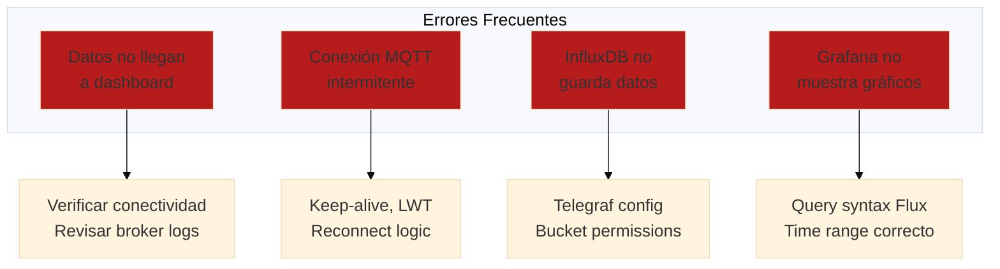

---

## ✅ Checklist de Proyecto IoT Completo

Antes de considerar tu proyecto IoT "production-ready":

### Hardware y Firmware
- [ ] Sensores calibrados con valores reales
- [ ] Manejo de errores de lectura (sensor falla → no crashea)
- [ ] Deep sleep implementado (autonomía >7 días)
- [ ] Watchdog timer configurado
- [ ] OTA updates habilitado (firmware remoto)

### Comunicación
- [ ] Protocolo eficiente (MQTT recomendado)
- [ ] Reconnect automático WiFi + MQTT
- [ ] QoS apropiado según criticidad
- [ ] TLS/SSL en producción (no texto plano)
- [ ] Buffer local si cloud no disponible

### Cloud y Datos
- [ ] Base de datos escalable (InfluxDB, TimescaleDB)
- [ ] Retention policy definida (no llenar disco)
- [ ] Backup automático de datos críticos
- [ ] Downsampling para datos antiguos

### Visualización
- [ ] Dashboard intuitivo (no gráficos confusos)
- [ ] Refresh rate apropiado (10-30s ok, 1s excesivo)
- [ ] Responsive (mobile-friendly)
- [ ] Anotaciones de eventos importantes

### Alertas y Monitoreo
- [ ] Alertas configuradas con umbrales validados
- [ ] Notificaciones no spam (throttling)
- [ ] Escalación de severidad (info → warning → critical)
- [ ] Monitoreo del sistema mismo (uptime, health)

---

## 🎓 Mejores Prácticas de IoT

### ✅ HACER

1. **Diseño fail-safe** - Sistema sigue operando si cloud cae
2. **Keep it simple** - No sobre-diseñar la arquitectura
3. **Seguridad desde día 1** - No "agregarla después"
4. **Testear en condiciones reales** - No solo en lab
5. **Documentar todo** - Futuro-tú te lo agradecerá
6. **Monitorear métricas** - Uptime, latencia, batería
7. **Versionar firmware** - Git tags para cada release

### ❌ NO HACER

1. **Texto plano en producción** - Siempre encriptar (TLS)
2. **Sin manejo de errores** - Cloud cae → app crash
3. **Delays bloqueantes** - `delay(60000)` = bad
4. **Ignorar consumo** - Batería dura 1 día en vez de 1 mes
5. **Dashboard sobrecargado** - 50 gráficos = confusión
6. **Sin backups** - Perder meses de datos = tragedia
7. **Hardcodear IPs** - Usa DNS names
8. **Publicar API keys** - GitHub público = hackeo

---

## 🎉 Resumen del Módulo

### Lo Que Dominaste

✅ **Arquitectura IoT completa** - 3 capas: Edge, Network, Cloud  
✅ **Protocolos IoT** - MQTT profundo, HTTP/REST  
✅ **Plataformas cloud** - ThingSpeak, Ubidots, AWS IoT  
✅ **Time-series databases** - InfluxDB, retention policies  
✅ **Grafana profesional** - Dashboards, alertas, visualización  
✅ **Stack completo** - Docker compose, Telegraf, MQTT  
✅ **OpenCode para IoT** - Generar código MQTT, dashboards, análisis  
✅ **Proyecto real** - Sistema agrícola end-to-end

### Próximo Paso

**¡Felicitaciones!** Completaste el Track de Electrónica y Automatización.

**Ahora puedes**:
1. **Proyecto Capstone** - Integrar TODOS los módulos en proyecto final
2. **Especialización** - Profundizar en sub-áreas (IIoT, Smart Cities)
3. **Certificaciones** - AWS IoT, Azure IoT, Google Cloud IoT

👉 [Ver Proyecto Capstone](./proyecto-final/README.md)

---

## 💭 Reflexión

1. **¿Cómo IoT transforma la industria paraguaya?**
2. **¿Cuál es el balance entre simplicidad y funcionalidad en IoT?**
3. **¿Cómo OpenCode acelera el desarrollo de sistemas IoT complejos?**
4. **¿Qué aplicación IoT desarrollarías para resolver un problema local?**

**Comparte en Slack** (#electronica-automatizacion)

---

## 📚 Recursos Adicionales

### Documentación Oficial

**Protocolos**:
- [MQTT Specification](https://mqtt.org/mqtt-specification/)
- [CoAP RFC 7252](https://datatracker.ietf.org/doc/html/rfc7252)

**Plataformas**:
- [ThingSpeak Documentation](https://www.mathworks.com/help/thingspeak/)
- [Ubidots Learning Center](https://help.ubidots.com/)
- [AWS IoT Core Docs](https://docs.aws.amazon.com/iot/)

**Herramientas**:
- [InfluxDB Docs](https://docs.influxdata.com/influxdb/)
- [Grafana Tutorials](https://grafana.com/tutorials/)
- [Telegraf Plugins](https://docs.influxdata.com/telegraf/latest/plugins/)
- [Node-RED Docs](https://nodered.org/docs/)

### Comunidades Paraguay

- **FPUNA Electrónica** - Grupo Slack/WhatsApp de estudiantes
- **IoT Paraguay** - Facebook group (400+ miembros)
- **Hackerspace Asunción** - Meetups mensuales, proyectos IoT
- **MakersParaguay** - Comunidad de makers y DIY

---

*Módulo creado para FPUNA Verano 2026*  
*Actualizado: Enero 2026*  
*Track: Electrónica y Automatización*  
*Módulo 05 de 05 - Capstone*
