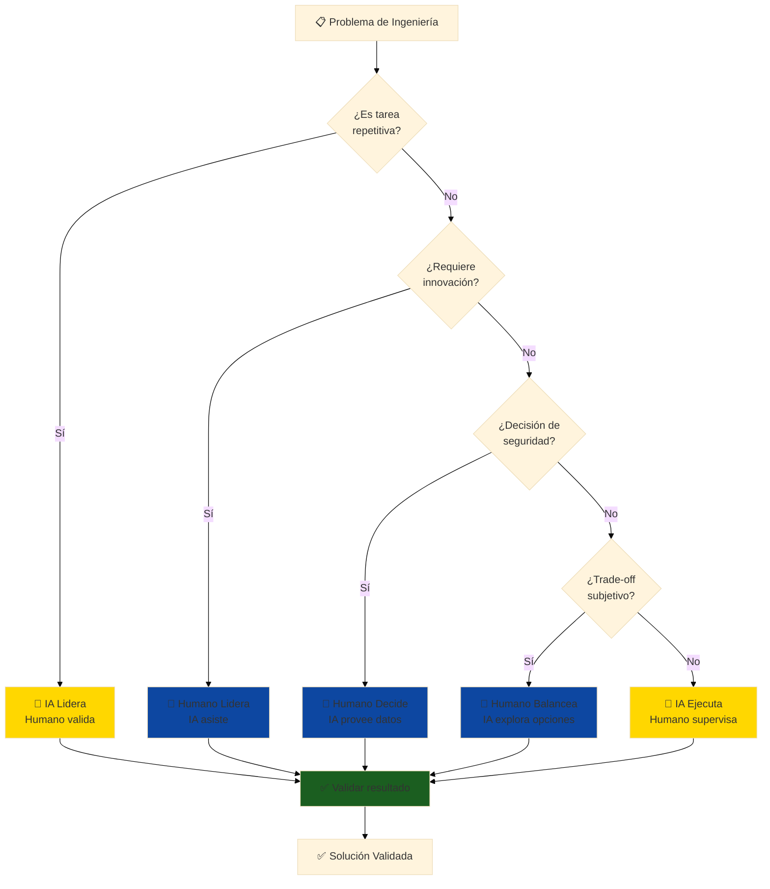

# ⚖️ Límites de IA: Dónde Confiar y Dónde Cuestionar

## 🎯 TEMPLATE - Adaptable a cada módulo

**Instrucciones de uso**:
1. Copiar esta sección completa
2. Reemplazar {MÓDULO}, {EJEMPLOS}, {TAREAS} según el módulo específico
3. Insertar después de la introducción y antes del contenido técnico

---

## ⚖️ Límites de IA: Dónde Confiar y Dónde Cuestionar

### Filosofía Fundamental

> **"La IA acelera la ejecución de lo que ya sabes hacer, no reemplaza tu criterio de ingeniero"**

En {MÓDULO}, OpenCode es un **asistente técnico poderoso**, pero **NO un ingeniero aeronáutico**. Entender esta distinción es crítico para tu éxito profesional.

---

## 🤖 Lo que IA Hace EXCELENTEMENTE

### 1. Tareas Repetitivas con Patrones Conocidos

**Ejemplos en {MÓDULO}**:
- {EJEMPLO_1: ej. "Generar 100 variantes de perfiles NACA"}
- {EJEMPLO_2: ej. "Calcular propiedades másicas de 50 componentes"}
- {EJEMPLO_3: ej. "Exportar modelos a 5 formatos diferentes"}

**Por qué funciona**:
- ✅ Patrón conocido y repetible
- ✅ No requiere juicio creativo
- ✅ Resultado validable objetivamente

**Velocidad**: **10-15× más rápido** que manual

---

### 2. Optimización en Espacio de Soluciones Conocido

**Ejemplos en {MÓDULO}**:
- {EJEMPLO_1: ej. "Encontrar ángulo óptimo de flap entre 0-45°"}
- {EJEMPLO_2: ej. "Ajustar espesor de pared para minimizar peso"}
- {EJEMPLO_3: ej. "Distribuir refuerzos para maximizar rigidez"}

**Por qué funciona**:
- ✅ Espacio de búsqueda finito y definido
- ✅ Función objetivo clara (minimizar/maximizar)
- ✅ Restricciones conocidas

**Mejora típica**: **20-40% mejor** que intuición inicial

---

### 3. Síntesis y Documentación de Información

**Ejemplos en {MÓDULO}**:
- {EJEMPLO_1: ej. "Generar reporte técnico desde modelo CAD"}
- {EJEMPLO_2: ej. "Crear tabla comparativa de 10 configuraciones"}
- {EJEMPLO_3: ej. "Documentar decisiones de diseño automáticamente"}

**Por qué funciona**:
- ✅ Datos estructurados disponibles
- ✅ Formato de salida estándar
- ✅ No requiere interpretación creativa

**Velocidad**: **20× más rápido** que escritura manual

---

### 4. Detección de Anomalías en Datos Históricos

**Ejemplos en {MÓDULO}**:
- {EJEMPLO_1: ej. "Detectar inconsistencias en geometrías"}
- {EJEMPLO_2: ej. "Identificar parámetros fuera de rango normal"}
- {EJEMPLO_3: ej. "Alertar sobre convergencia sospechosa en simulaciones"}

**Por qué funciona**:
- ✅ Baseline de "normalidad" entrenado con datos históricos
- ✅ Desviaciones detectables estadísticamente
- ✅ Alertas reducen errores humanos

**Beneficio**: **Reduce errores 60-80%**

---

## 🧠 Lo que IA Hace POBREMENTE (Requiere TU Juicio)

### 1. Innovación Verdadera sin Precedentes

**Ejemplos en {MÓDULO}**:
- ❌ {EJEMPLO_NEGATIVO_1: ej. "Diseñar vortex generators en raíz de ala"}
  - **Por qué falla**: Requiere intuición física sobre separación de flujo
  - **Tu rol**: Entender mecánica de fluidos, pruebas en túnel de viento
  
- ❌ {EJEMPLO_NEGATIVO_2: ej. "Inventar nueva topología estructural"}
  - **Por qué falla**: No hay datos históricos de soluciones similares
  - **Tu rol**: Creatividad basada en principios de ingeniería

- ❌ {EJEMPLO_NEGATIVO_3: ej. "Optimizar para criterios contradictorios no cuantificables"}
  - **Por qué falla**: No puede balancear "estética vs funcionalidad" sin definición clara
  - **Tu rol**: Trade-offs basados en experiencia y contexto

**Señal de alerta**: Si la IA sugiere algo "nunca visto antes", **desconfía y valida rigurosamente**.

---

### 2. Decisiones de Seguridad Críticas

**Ejemplos en {MÓDULO}**:
- ❌ {EJEMPLO_SEGURIDAD_1: ej. "Seleccionar factor de seguridad estructural"}
  - **Por qué falla**: Depende de normativa, riesgo aceptable, consecuencias de falla
  - **Tu rol**: Aplicar FAA/EASA/DINAC, considerar peor caso, certificación

- ❌ {EJEMPLO_SEGURIDAD_2: ej. "Validar que diseño cumple normas aeronáuticas"}
  - **Por qué falla**: Regulaciones requieren interpretación legal + técnica
  - **Tu rol**: Responsabilidad legal del ingeniero firmante

- ❌ {EJEMPLO_SEGURIDAD_3: ej. "Decidir si componente es 'suficientemente seguro'"}
  - **Por qué falla**: "Suficientemente" es juicio basado en consecuencias, no cálculo
  - **Tu rol**: Ética profesional y responsabilidad civil

**Regla de oro**: **NUNCA confíes en IA para decisiones que pongan vidas en riesgo**.

---

### 3. Comprensión de Contexto y Restricciones Implícitas

**Ejemplos en {MÓDULO}**:
- ❌ {EJEMPLO_CONTEXTO_1: ej. "Diseñar considerando disponibilidad de materiales en Paraguay"}
  - **Por qué falla**: No conoce mercado local, tiempos de importación, costos reales
  - **Tu rol**: Conocimiento del ecosistema productivo paraguayo

- ❌ {EJEMPLO_CONTEXTO_2: ej. "Optimizar para manufactura con capacidades locales"}
  - **Por qué falla**: No sabe qué CNC, impresoras 3D, o procesos están disponibles en Asunción
  - **Tu rol**: Network de proveedores, capacidad de talleres locales

- ❌ {EJEMPLO_CONTEXTO_3: ej. "Balancear costo vs performance según presupuesto cliente"}
  - **Por qué falla**: No entiende sensibilidad al precio de diferentes sectores (agrícola vs defensa)
  - **Tu rol**: Inteligencia de mercado y negociación

**Restricciones implícitas** (que IA no ve): Cultura de trabajo, preferencias cliente, limitaciones políticas, calendario, relaciones personales.

---

### 4. Trade-offs con Criterios Subjetivos

**Ejemplos en {MÓDULO}**:
- ❌ {EJEMPLO_TRADEOFF_1: ej. "¿Diseño simple y robusto vs óptimo pero complejo?"}
  - **Por qué falla**: "Simple" y "robusto" no son métricas objetivas
  - **Tu rol**: Considerar mantenibilidad, habilidad de operadores, filosofía de diseño

- ❌ {EJEMPLO_TRADEOFF_2: ej. "¿Maximizar performance vs minimizar costo?"}
  - **Por qué falla**: No sabe el punto de equilibrio para TU cliente específico
  - **Tu rol**: Entender prioridades reales del proyecto (a veces implícitas)

- ❌ {EJEMPLO_TRADEOFF_3: ej. "¿Usar tecnología probada vs innovar?"}
  - **Por qué falla**: No puede medir riesgo reputacional, tolerancia a fallo del cliente
  - **Tu rol**: Gestión de riesgo basada en stakeholders

**Estos juicios** requieren empatía, experiencia, y entendimiento del problema humano detrás del técnico.

---

## 🎯 Estrategia Híbrida: Workflow Humano-IA Óptimo



---

## 📋 Checklist: ¿Cuándo Confiar en IA?

Antes de aceptar resultado de IA, pregúntate:

### ✅ Confía (con validación) SI:

- [ ] La tarea es repetitiva y con patrón conocido
- [ ] El espacio de soluciones es finito y bien definido
- [ ] Puedes validar el resultado objetivamente (números, geometría, lógica)
- [ ] NO afecta seguridad crítica directamente
- [ ] Tienes datos históricos de referencia para comparar
- [ ] El error es recuperable (puedes rehacer si falla)
- [ ] Entiendes la lógica que IA debería seguir
- [ ] Puedes explicar el resultado a un colega ingeniero

**Acción**: Usa IA, pero **valida siempre** antes de proceder.

---

### ⚠️ Desconfía SI:

- [ ] Es la primera vez que resuelves este tipo de problema
- [ ] Requiere innovación o creatividad verdadera
- [ ] Involucra juicios de seguridad o regulaciones
- [ ] Hay trade-offs subjetivos (estética, preferencias, cultura)
- [ ] NO entiendes cómo IA llegó a ese resultado
- [ ] El resultado "parece demasiado bueno para ser verdad"
- [ ] Hay contexto implícito que IA no conoce (mercado, política, personas)
- [ ] Un error tendría consecuencias graves

**Acción**: Usa IA para **explorar opciones**, pero **TÚ decides** con análisis crítico.

---

### ❌ NUNCA Confíes SI:

- [ ] Decisión afecta seguridad de personas (vida/muerte)
- [ ] Certificación legal requiere firma de ingeniero
- [ ] Cliente/regulador exige responsabilidad humana
- [ ] Consecuencias de error son irreversibles
- [ ] No puedes explicar el resultado (black box total)

**Acción**: IA puede proveer **datos de entrada**, pero **humano toma decisión final**.

---

## 🔍 Señales de Alerta: Cuándo la IA "Alucina"

### Red Flags que indican resultado inválido:

1. **Números sospechosos**:
   - Eficiencias >100% (viola termodinámica)
   - Factores de seguridad <1.0 (estructura fallaría)
   - Velocidades que violan física (Mach 5 con motor eléctrico)

2. **Contradicciones internas**:
   - "Diseño liviano pero muy resistente" (sin justificar cómo)
   - "Barato y de alta calidad" (sin especificar trade-off)

3. **Ignorancia de restricciones**:
   - Geometría que no se puede fabricar
   - Materiales no disponibles en Paraguay
   - Procesos que requieren equipos inexistentes localmente

4. **Falta de incertidumbre**:
   - IA da respuestas con 100% confianza en problemas complejos
   - No menciona supuestos o limitaciones

**Qué hacer**: Si ves estas señales, **detente y valida manualmente** antes de proceder.

---

## 🎓 Casos de Estudio: Cuándo Confiar vs Desconfiar

### Caso 1: Diseño de Perfil Alar

**Escenario**: Necesitas diseñar perfil alar para UAV agrícola.

| Tarea | IA Rol | Humano Rol | Confianza |
|-------|--------|------------|-----------|
| Generar coordenadas NACA 0012 | **IA ejecuta** (ecuación conocida) | Valida espesor máximo | ✅ Alta |
| Seleccionar NACA 0012 vs 4415 | IA compara datos | **Humano decide** (depende de misión) | ⚠️ Media |
| Inventar perfil completamente nuevo | ❌ IA no puede | **Humano diseña** (requiere CFD + pruebas) | ❌ Nula |

---

### Caso 2: {CASO_ESPECÍFICO_MÓDULO}

{DESCRIPCIÓN_CASO}

| Tarea | IA Rol | Humano Rol | Confianza |
|-------|--------|------------|-----------|
| {TAREA_1} | {ROL_IA_1} | {ROL_HUMANO_1} | {CONFIANZA_1} |
| {TAREA_2} | {ROL_IA_2} | {ROL_HUMANO_2} | {CONFIANZA_2} |
| {TAREA_3} | {ROL_IA_3} | {ROL_HUMANO_3} | {CONFIANZA_3} |

---

## 💡 Consejos Prácticos para Uso Efectivo

### 1. Siempre Valida con "Sanity Checks"

```
Ejemplo en {MÓDULO}:
- IA genera diseño estructural
- TÚ verificas:
  ✓ ¿CG está en posición razonable? (30-40% cuerda)
  ✓ ¿Peso total es realista? (no 100g ni 500kg para UAV 3kg)
  ✓ ¿Dimensiones son manufacturables? (espesor >0.5mm)
  ✓ ¿Materiales existen y son accesibles en Paraguay?
```

---

### 2. Documenta Supuestos de IA

Cuando uses IA, **anota**:
- ¿Qué datos de entrada usó?
- ¿Qué supuestos hizo implícitamente?
- ¿Qué restricciones NO consideró?

**Esto te salva** cuando cliente pregunta "¿por qué diseñaste así?" 6 meses después.

---

### 3. Usa IA para Explorar, Humano para Decidir

**Workflow correcto**:
1. IA genera 10 opciones de diseño (rápido)
2. TÚ eliminas 7 por razones prácticas (contexto local)
3. IA simula las 3 restantes en detalle (acelera análisis)
4. TÚ seleccionas final considerando todos los factores

**Workflow INCORRECTO**:
1. IA genera 1 opción "óptima"
2. TÚ la aceptas sin cuestionar ❌

---

### 4. Mantén tu Criterio Afilado

**Peligro**: Si usas IA para TODO, pierdes habilidad de pensamiento crítico.

**Solución**: Alterna entre:
- Problemas resueltos con IA (velocidad)
- Problemas resueltos manualmente (mantener habilidad)

**Frecuencia sugerida**: 70% con IA, 30% manual (para entrenamiento continuo).

---

## 🎯 Resumen: Reglas de Oro

1. **IA acelera, NO reemplaza** tu conocimiento de ingeniería
2. **Siempre valida** resultados de IA antes de usar
3. **Nunca confíes en IA** para decisiones de seguridad crítica
4. **Documenta supuestos** cuando uses IA
5. **Mantén tu criterio afilado** con práctica manual regular
6. **Contexto local importa** (Paraguay ≠ USA ≠ Europa)
7. **Si no lo entiendes, no lo uses** (principio de responsabilidad)

---

**Próxima sección**: {SIGUIENTE_SECCIÓN_DEL_MÓDULO}
