# 📚 Revisión de Literatura con IA

**Duración:** 4 horas  
**Nivel:** Intermedio  
**Track:** Investigación y Academia

## ¿Qué Vas a Lograr?

Al completar este módulo, vas a poder:

- [ ] Diseñar y ejecutar búsquedas sistemáticas de literatura académica usando IA
- [ ] Gestionar referencias bibliográficas con herramientas automatizadas (Zotero/Mendeley)
- [ ] Analizar y sintetizar grandes volúmenes de papers usando Claude y OpenCode
- [ ] Identificar gaps en la literatura y oportunidades de investigación
- [ ] Construir matrices de análisis para revisiones sistemáticas

---

## La Analogía del Detective Académico

Imagina que sos un detective investigando un caso complejo. No podés resolver el caso sin antes revisar todos los archivos policiales previos, entender qué investigaciones ya se hicieron, qué pistas quedaron sin explorar, y dónde están los vacíos en la evidencia.

La revisión de literatura es exactamente eso: investigar qué se sabe, qué no se sabe, y dónde podés hacer tu contribución única. La IA es tu asistente detective que puede leer miles de documentos en minutos y ayudarte a encontrar patrones que tomarían meses descubrir manualmente.

---

## Parte 1: Fundamentos de Revisión Sistemática

### 1.1 Tipos de Revisiones de Literatura

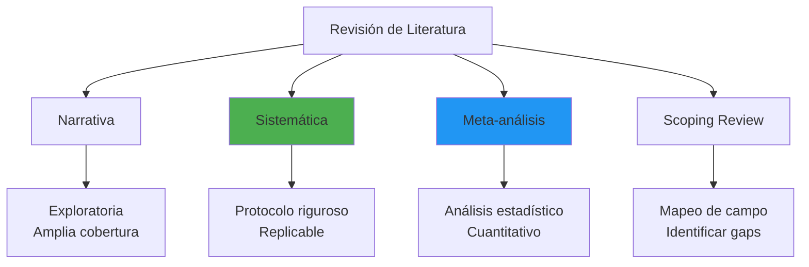

**En Paraguay**: Las revistas como Revista FPUNA, Memorias del Instituto de Investigaciones en Ciencias de la Salud, y otras publicaciones locales requieren revisiones sistemáticas bien documentadas para papers de calidad.

### 1.2 El Proceso PRISMA

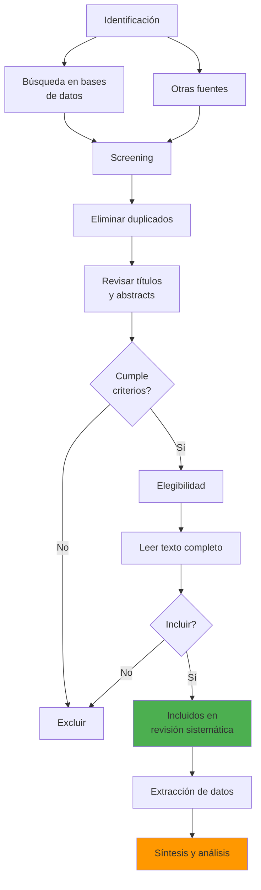

### 1.3 Estrategia de Búsqueda con Operadores Booleanos

```mermaid
graph LR
    A[AND] --> A1[Reduce resultados<br/>Más específico]
    B[OR] --> B1[Aumenta resultados<br/>Más amplio]
    C[NOT] --> C1[Excluye términos<br/>Más refinado]
    
    A1 --> D["artificial intelligence"<br/>AND education]
    B1 --> E["machine learning"<br/>OR deep learning]
    C1 --> F["AI" NOT "artificial<br/>insemination"]
    
    style A fill:#2196F3
    style B fill:#4CAF50
    style C fill:#F44336
```

**Ejemplo de búsqueda estructurada:**

```
("artificial intelligence" OR "machine learning" OR "AI") 
AND 
("higher education" OR "university" OR "academic")
AND
("Latin America" OR "Paraguay" OR "developing countries")
NOT
("medical imaging" OR "healthcare diagnosis")
```

### 1.4 Bases de Datos Académicas para Paraguay

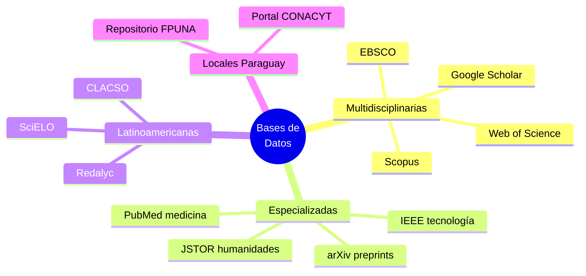

**Acceso en Paraguay:**
- **Google Scholar**: Gratuito, amplio alcance
- **SciELO**: Acceso abierto, enfoque latinoamericano
- **Repositorio FPUNA**: Tesis y trabajos locales
- **Portal CONACYT**: Investigaciones financiadas nacionalmente

### 1.5 Workflow de Búsqueda Sistemática

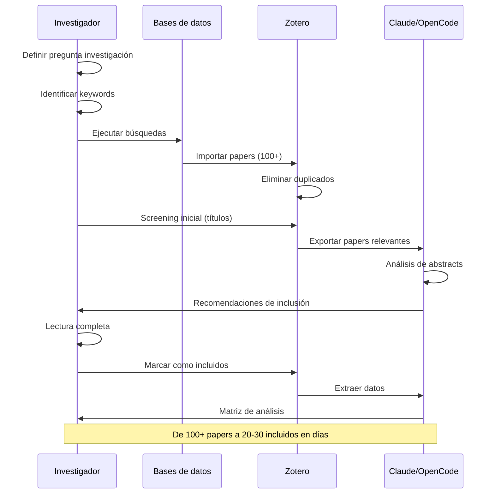

---

## Parte 2: Gestión de Referencias con IA

### 2.1 Comparación de Herramientas

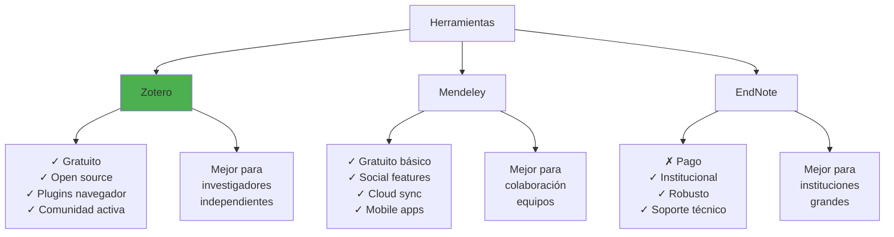

### 2.2 Instalación de Zotero (Paso a Paso)

**1. Descargar e instalar Zotero**
- Ir a: https://www.zotero.org/download
- Descargar versión para Windows/Mac/Linux
- Instalar software desktop

**2. Instalar Connector para navegador**
- Chrome: Chrome Web Store → "Zotero Connector"
- Firefox: Automático al instalar Zotero
- Edge: Edge Add-ons → "Zotero Connector"

**3. Configurar cuenta y sincronización**
- Crear cuenta gratuita en zotero.org
- En Zotero: Edit → Preferences → Sync
- Login con tu cuenta
- Sync automático (300MB gratis)

**4. Instalar plugins esenciales**
- **ZotFile**: Gestión avanzada PDFs
- **Better BibTeX**: Exportación mejorada
- **Zotero DOI Manager**: Búsqueda automática DOIs

### 2.3 Workflow con Zotero + OpenCode

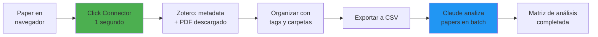

### 2.4 Uso Avanzado: Análisis Batch con OpenCode

**Prompt efectivo para analizar múltiples papers:**

```markdown
Sos un asistente de investigación experto. Analiza estos 10 papers 
y extrae para cada uno:

1. **Pregunta de investigación principal**
2. **Metodología** (diseño, muestra N=?, análisis)
3. **Hallazgos clave** (3 puntos máximo)
4. **Limitaciones reconocidas por autores**
5. **Gaps identificados** (qué NO investigaron)
6. **Relevancia para investigación sobre [TU TEMA]** (Alta/Media/Baja)

Formato: Tabla markdown con una fila por paper.
Se conciso pero preciso.
```

**Ejemplo de ejecución:**

```bash
# En tu terminal con Claude instalado
claude

# Dentro de Claude
@attach paper1.pdf paper2.pdf paper3.pdf paper4.pdf paper5.pdf

[PEGAR PROMPT DE ARRIBA]
```

**Output esperado en 2-3 minutos:**

| Paper | Pregunta | Metodología | Hallazgos | Limitaciones | Gaps | Relevancia |
|-------|----------|-------------|-----------|--------------|------|------------|
| Smith 2023 | ¿Cómo afecta IA a aprendizaje? | Cuasi-experimental, N=120 | Mejora 15% en test | Muestra pequeña, 1 universidad | No estudia largo plazo | Alta |
| García 2024 | ... | ... | ... | ... | ... | Media |

### 2.5 Matriz de Análisis Sistemático

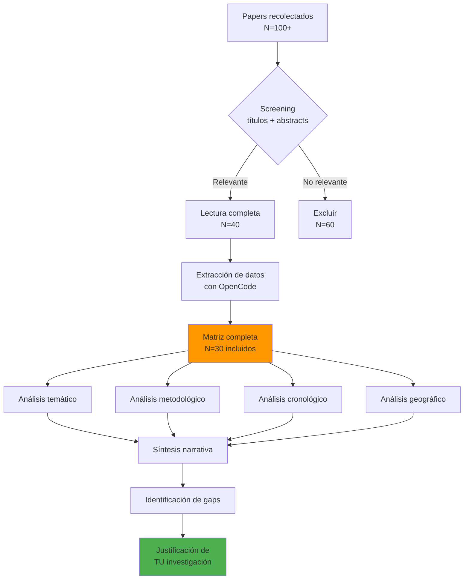

---

## Parte 3: Análisis y Síntesis con IA

### 3.1 Estrategia de Lectura en 3 Niveles

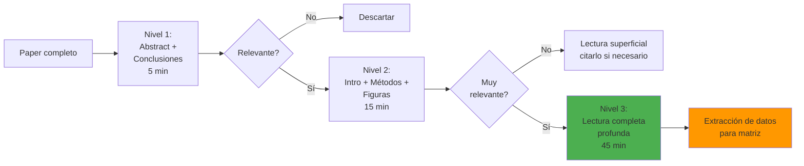

**Prompt para Claude - Nivel 1 (screening rápido):**

```markdown
Sos un asistente de investigación. Lee este abstract y dime en 80 palabras:

1. Tipo de estudio: (Empírico/Teórico/Revisión)
2. Población/contexto: (¿Quiénes? ¿Dónde?)
3. Relevancia para [MI TEMA]: (Alta/Media/Baja/Ninguna)
4. Hallazgo principal en 1 oración

Sé conciso y objetivo.
```

### 3.2 Identificación de Patrones Temáticos

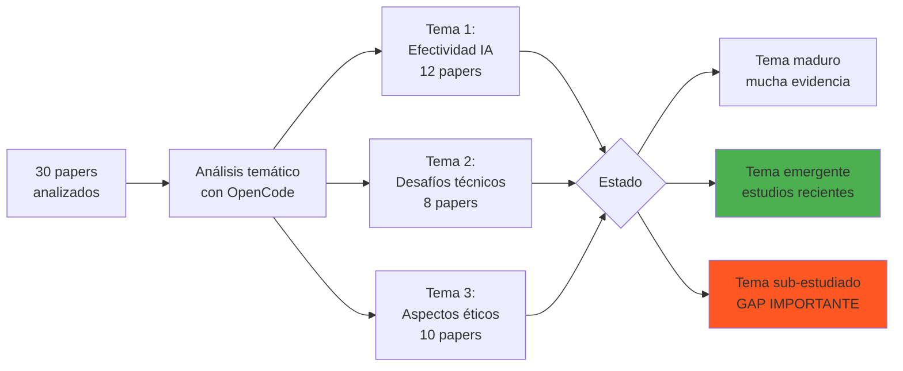

**Prompt para identificar gaps:**

```markdown
He analizado 30 papers sobre IA en educación superior en América Latina.

@attach matriz_literatura.csv

Responde:

1. ¿Qué aspectos han sido SOBRE-estudiados? (menciona y explica)
2. ¿Qué aspectos han sido SUB-estudiados o ignorados? (lista al menos 5)
3. ¿Qué metodologías faltan en la literatura? (cuanti/cuali/mixtas)
4. ¿Qué contextos geográficos no se han explorado suficientemente?
5. ¿Qué poblaciones están sub-representadas? (estudiantes, docentes, admin)

Finalmente, dame 3 recomendaciones específicas y concretas para llenar gaps importantes.
```

### 3.3 Análisis Cronológico de Tendencias

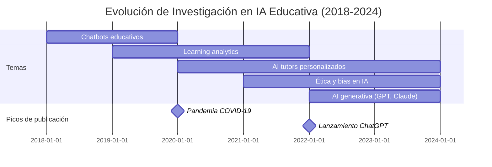

**Interpretación:**
- 2018-2019: Chatbots básicos, primeros experimentos
- 2020-2021: Explosión por pandemia, educación remota
- 2022-2024: IA generativa revoluciona el campo, nuevas preguntas éticas

### 3.4 Síntesis Narrativa vs Meta-análisis

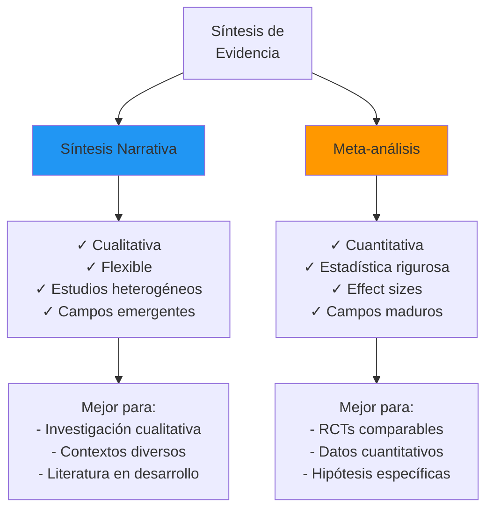

**En Paraguay:** La síntesis narrativa es más común porque:
- Menor cantidad de estudios cuantitativos comparables
- Contextos diversos (urbano/rural, público/privado)
- Investigación cualitativa prevalente en ciencias sociales
- Campos emergentes con poca estandarización metodológica

### 3.5 Construcción de Marco Teórico

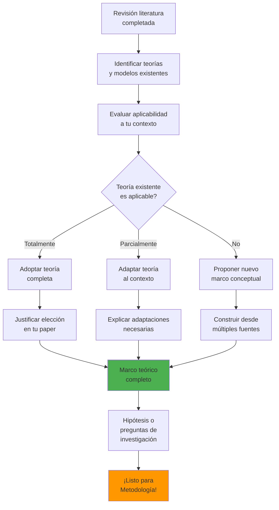

---

## Parte 4: Herramientas Avanzadas y Automatización

### 4.1 Research Rabbit: Mapeo Visual

```mermaid
graph TD
    A[Seed Papers<br/>3-5 clave] --> B[Research Rabbit<br/>Algoritmo ML]
    B --> C[Similar papers<br/>automático]
    B --> D[Red de citaciones<br/>visualizada]
    B --> E[Co-citation analysis]
    
    C --> F[50+ papers<br/>relevantes descubiertos]
    D --> G[Identificar papers<br/>"puente" entre áreas]
    E --> H[Clusters de<br/>investigación]
    
    F --> I[Exportar<br/>a Zotero]
    G --> I
    H --> I
    
    I --> J[Análisis con<br/>OpenCode]
    
    style B fill:#9C27B0
    style I fill:#4CAF50
```

**Cómo usar Research Rabbit (researchrabbit.ai):**

1. **Crear cuenta gratuita**
2. **Nueva colección** con nombre de tu proyecto
3. **Agregar seed papers** (3-5 papers seminales de tu tema)
4. **Explorar sugerencias** de papers similares
5. **Ver red de citas** (quién cita a quién)
6. **Identificar autores clave** en tu área
7. **Exportar a Zotero** en 1 click

**Ventaja clave:** Descubre papers que búsquedas por keywords nunca encuentran.

### 4.2 Connected Papers: Visualización de Literatura

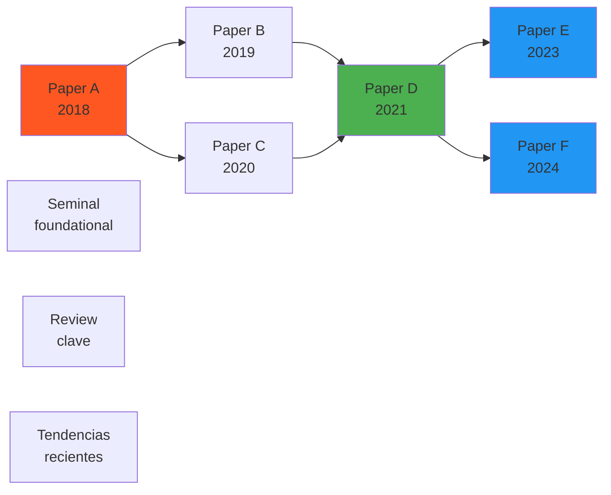

**Uso de Connected Papers (connectedpapers.com):**
- Pega DOI o título de un paper clave
- Ve mapa visual de papers relacionados
- Color indica año (rojo=viejo, azul=nuevo)
- Tamaño indica número de citas
- Identifica "prior works" y "derivative works"
- Exporta a Zotero/BibTeX

### 4.3 Elicit: AI Research Assistant

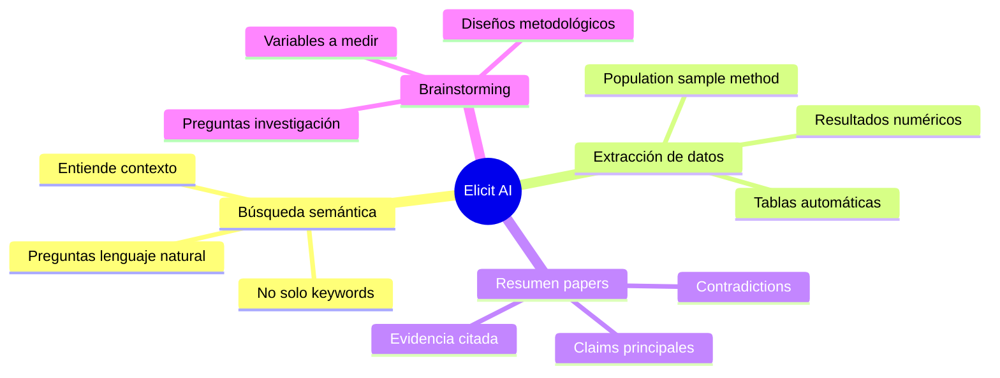

**Prompt efectivo en Elicit:**

```
What are the main challenges of implementing AI in higher education 
in developing countries, specifically related to infrastructure 
limitations and faculty training needs?
```

Elicit busca papers relevantes, extrae claims específicos, y genera tabla comparativa automáticamente.

**Ventajas:**
- Búsqueda semántica (entiende intención)
- Extrae datos cuantitativos de papers
- Identifica metodologías usadas
- Gratis hasta 5000 créditos/mes

### 4.4 Scite: Smart Citations

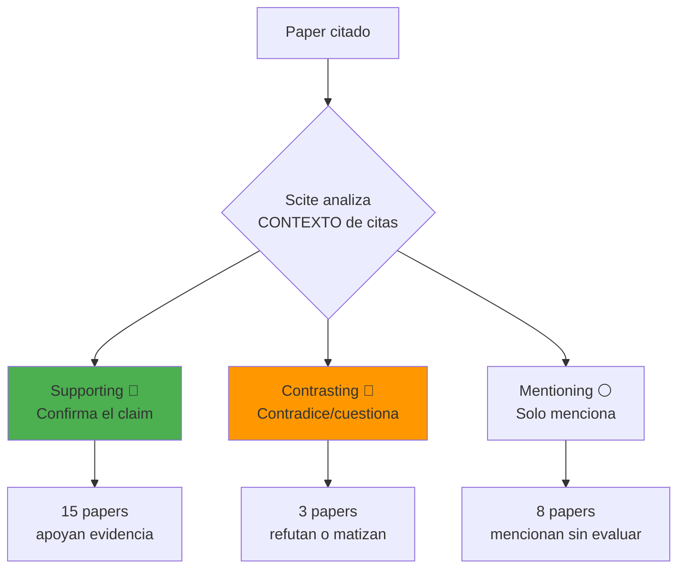

**Por qué Scite es crucial:**
- No todas las citas "apoyan" el paper citado
- Algunos papers son citados para ser refutados
- Scite usa NLP para entender CÓMO se cita
- Ayuda a evaluar calidad real de la evidencia

**Uso:**
- Instalar extensión de navegador
- Ver badge de Scite en Google Scholar
- Ver dashboard de "supporting" vs "contrasting"
- Identificar papers controversiales

### 4.5 Workflow Completo Automatizado

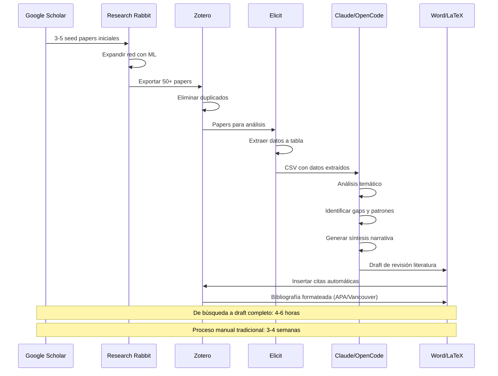

### 4.6 Integración OpenCode: Caso de Uso Real

**Escenario:** Analizar 30 papers sobre IA en educación en una tarde.

**Paso 1: Preparar datos**
```bash
# En Zotero: File > Export > CSV
# Seleccionar campos: Author, Year, Title, Abstract, DOI
# Guardar como: literatura_revision.csv
```

**Paso 2: Análisis con Claude**
```bash
claude

@attach literatura_revision.csv

Analiza estos 30 papers sobre IA en educación superior en América Latina:

1. **Autores principales** (>2 publicaciones) - tabla
2. **Timeline** (distribución por año) - gráfico texto
3. **Metodologías** (cuanti/cuali/mixto) - porcentajes
4. **Países estudiados** (frecuencia)
5. **Temas principales** (agrupados y categorizados)
6. **3 gaps más significativos** que identificás

Formato: Markdown estructurado con tablas y bullet points.
Sé analítico, no solo descriptivo.
```

**Resultado esperado en 5-10 minutos:**

```markdown
## Análisis de 30 Papers sobre IA en Educación Superior - América Latina

### Autores Principales
| Autor | N Papers | Institución | País |
|-------|----------|-------------|------|
| García, M. | 4 | UNAM | México |
| Silva, J. | 3 | PUC Chile | Chile |
| Rodríguez, A. | 2 | UBA | Argentina |

### Timeline de Publicaciones
2018: ▓▓ (2)
2019: ▓▓▓ (3)
2020: ▓▓▓▓▓▓▓ (7)
2021: ▓▓▓▓▓ (5)
2022: ▓▓▓▓▓▓▓▓ (8)
2023: ▓▓▓▓▓ (5)

**Insight**: Pico en 2020-2022 (pandemia + ChatGPT)

### Metodologías
- Cuantitativo: 40% (12 papers) - surveys, experimentos
- Cualitativo: 33% (10 papers) - entrevistas, estudios de caso
- Mixto: 27% (8 papers) - integración métodos

...
```

---

## Ejercicios Prácticos

### Ejercicio 1: Búsqueda Sistemática (45 minutos)

**Objetivo:** Practicar construcción y ejecución de búsquedas estructuradas.

**Tareas:**
1. Define tu tema de investigación (ej: "Adopción de IA en universidades paraguayas")
2. Identifica:
   - 5 keywords principales
   - 5 sinónimos en inglés
   - 3 términos específicos de contexto
3. Construye 3 strings de búsqueda diferentes usando operadores booleanos
4. Ejecuta en:
   - Google Scholar
   - SciELO
   - Repositorio FPUNA (si aplica)
5. Registra número de resultados por cada combinación
6. Analiza cuál string es más efectivo (precisión vs recall)

**Entregable:** 
- Documento Word/Markdown con:
  - Tema y justificación
  - Keywords y sinónimos
  - 3 strings de búsqueda
  - Tabla de resultados
  - Análisis de efectividad

---

### Ejercicio 2: Configurar Zotero + Primer Análisis (60 min)

**Objetivo:** Configurar herramienta de gestión bibliográfica profesional.

**Tareas:**
1. Instalar Zotero + connector de navegador
2. Crear cuenta en zotero.org
3. Configurar sincronización
4. Crear colección "Revisión Literatura - [TU TEMA]"
5. Capturar 15 papers usando connector:
   - Buscar en Google Scholar
   - Click en ícono Zotero en navegador
   - Verificar que PDF se descarga automáticamente
6. Organizar papers con:
   - Tags: metodología, año, país, relevancia
   - Subcarpetas por subtema
7. Exportar colección a CSV
8. Usar Claude para análisis preliminar:

```markdown
@attach papers_coleccion.csv

Analiza estos 15 papers y dime:
1. ¿Qué metodologías predominan?
2. ¿Qué años tienen más publicaciones?
3. ¿Cuáles son los 3 temas más recurrentes?
4. ¿Qué países/regiones están representados?
```

**Entregable:**
- Screenshot de tu biblioteca Zotero organizada
- CSV exportado
- Análisis generado por Claude (markdown)
- Reflexión de 200 palabras sobre el proceso

---

### Ejercicio 3: Matriz de Revisión Sistemática (90 min)

**Objetivo:** Crear matriz de análisis comparativo profesional.

**Tareas:**
1. Selecciona 10 papers más relevantes de tu colección
2. Crea matriz en Excel/Google Sheets con columnas:
   - Autor(es), Año
   - Título
   - País/Región estudiada
   - Metodología (cuanti/cuali/mixto)
   - Diseño (experimental, survey, caso, etc.)
   - Muestra (N, características demográficas)
   - Variables estudiadas
   - Principales hallazgos (3 bullet points)
   - Limitaciones (2 bullet points)
   - Relevancia para tu investigación (1-5 escala)
3. Llena matriz manualmente (lectura profunda de papers)
4. Verifica con Claude:

```markdown
@attach paper1.pdf paper2.pdf

Verifica si mi matriz tiene datos correctos para estos 2 papers.
Completa celdas vacías si encontrás la información en el PDF.
```

**Entregable:**
- Matriz completa en Excel (archivo .xlsx)
- Documento Word con:
  - Reflexión sobre qué aprendiste
  - Patrones que observaste
  - Próximos pasos para tu investigación

---

### Ejercicio 4: Identificación de Gaps (60 min)

**Objetivo:** Analizar literatura para encontrar oportunidades de investigación.

**Tareas:**
1. Usa matriz del Ejercicio 3
2. Exporta a CSV
3. Ejecuta análisis de gaps con Claude:

```markdown
@attach matriz_literatura.csv

Analiza estos 10 papers sistemáticamente y responde:

**Gaps poblacionales:**
- ¿Qué tipos de estudiantes NO se han estudiado?
- ¿Qué tipos de docentes faltan?
- ¿Qué niveles educativos están sub-representados?

**Gaps geográficos:**
- ¿Qué países latinoamericanos no aparecen?
- ¿Zonas rurales vs urbanas?
- ¿Universidades públicas vs privadas?

**Gaps metodológicos:**
- ¿Qué métodos podrían aportar nueva perspectiva?
- ¿Faltan estudios longitudinales?
- ¿Faltan métodos mixtos?

**Gaps teóricos:**
- ¿Qué variables no se han explorado?
- ¿Qué relaciones no se han investigado?
- ¿Qué teorías no se han aplicado?

Finalmente: 3 preguntas de investigación CONCRETAS y VIABLES 
que llenarían gaps importantes.
```

4. Reflexiona críticamente:
   - ¿Cuál de las 3 preguntas es más viable PARA TI?
   - ¿Tendrías acceso a la población necesaria?
   - ¿Tendrías tiempo y recursos?
   - ¿Sería original y relevante para Paraguay?

**Entregable:**
- Análisis de gaps (markdown)
- Justificación de pregunta elegida (500 palabras)
- Plan preliminar de investigación

---

### Ejercicio 5: Síntesis Narrativa (120 min)

**Objetivo:** Escribir sección completa de "Revisión de Literatura" para un paper.

**Tareas:**
1. Usando tus 10-15 papers analizados, escribe 1000-1500 palabras
2. Estructura requerida:
   - **Introducción al tema** (150 palabras)
     - Contexto y relevancia
     - Scope de la revisión
   - **Estado del arte** (700 palabras)
     - Organizado por SUBTEMAS, no por paper
     - Sintetizar hallazgos, identificar consensos y controversias
     - Integrar perspectivas teóricas
   - **Gaps identificados** (200 palabras)
     - Qué NO se ha investigado suficientemente
     - Por qué es importante llenar esos gaps
   - **Justificación de tu investigación** (150 palabras)
     - Cómo tu estudio llena un gap específico
     - Contribución esperada

3. Usa Claude para mejorar:

```markdown
@attach mi_revision_literatura.md

Revisa esta revisión de literatura con ojo crítico:

1. ¿Hay suficiente SÍNTESIS o solo describo papers?
2. ¿La organización TEMÁTICA es clara y lógica?
3. ¿Los GAPS están bien argumentados y justificados?
4. ¿La JUSTIFICACIÓN de mi investigación es convincente?
5. ¿El estilo de escritura es académico y profesional?

Dame 3 mejoras CONCRETAS con ejemplos de cómo reescribir secciones específicas.
```

4. Incorpora feedback y genera versión final

**Entregable:**
- Draft inicial (antes de feedback)
- Feedback detallado de Claude
- Versión final mejorada
- Tabla de referencias en formato APA 7

---

## Checklist de Revisión de Literatura

### ✅ Planificación y Búsqueda

- [ ] Pregunta de investigación definida claramente
- [ ] Keywords principales y sinónimos identificados
- [ ] Strings de búsqueda con operadores booleanos construidos
- [ ] Búsqueda en al menos 3 bases de datos diferentes
- [ ] Literatura en español incluida (SciELO, Redalyc)
- [ ] Repositorios locales revisados (FPUNA, CONACYT si aplica)
- [ ] Estrategia de búsqueda documentada (replicable)
- [ ] Número de papers encontrados registrado

### ✅ Gestión de Referencias

- [ ] Zotero/Mendeley instalado y configurado
- [ ] Cuenta creada y sincronización activada
- [ ] Colecciones organizadas por tema
- [ ] Tags aplicados consistentemente (metodología, país, año)
- [ ] PDFs descargados para todos los papers clave
- [ ] Metadata verificada (autores, año, DOI correctos)
- [ ] Backup configurado (Zotero sync o export periódico)

### ✅ Screening y Selección

- [ ] Criterios de inclusión/exclusión definidos ANTES de screening
- [ ] Duplicados eliminados
- [ ] Screening de títulos y abstracts completado
- [ ] Texto completo leído para papers elegibles
- [ ] Razones de exclusión documentadas
- [ ] N de papers en cada etapa registrado (diagrama PRISMA)

### ✅ Análisis y Extracción

- [ ] Matriz de análisis creada con variables clave
- [ ] Datos extraídos sistemáticamente (no selectivamente)
- [ ] Metodologías identificadas y categorizadas
- [ ] Tendencias temporales y geográficas notadas
- [ ] IA usada para acelerar (Claude/Elicit) sin sacrificar rigor
- [ ] Extracción verificada por segunda lectura

### ✅ Síntesis y Escritura

- [ ] Hallazgos organizados por TEMAS, no por paper individual
- [ ] Síntesis (no solo resumen) de literatura
- [ ] Consensos identificados y explicados
- [ ] Controversias o inconsistencias señaladas
- [ ] Gaps claramente identificados y argumentados
- [ ] Justificación de tu investigación conecta con gaps
- [ ] Citas correctas en formato requerido (APA 7, Vancouver)
- [ ] Bibliografía completa y formateada

### ✅ Control de Calidad

- [ ] Citas verificadas por precisión (Scite si disponible)
- [ ] Papers clave del campo no faltaron
- [ ] Sesgos de búsqueda considerados (¿solo inglés?, ¿solo papers recientes?)
- [ ] Revisión con IA para detectar gaps en tu análisis
- [ ] Feedback de colega o tutor incorporado
- [ ] Editado para claridad, coherencia, y flujo

---

## Recursos Esenciales

### Herramientas Gratuitas

| Herramienta | Propósito | URL | Costo |
|-------------|-----------|-----|-------|
| **Zotero** | Gestión bibliográfica | zotero.org | Gratis |
| **Research Rabbit** | Descubrimiento papers | researchrabbit.ai | Gratis |
| **Connected Papers** | Visualización literatura | connectedpapers.com | Gratis (limitado) |
| **Elicit** | AI research assistant | elicit.org | Freemium |
| **Litmaps** | Mapeo visual | litmaps.com | Freemium |
| **Scite** | Smart citations | scite.ai | Freemium |
| **Semantic Scholar** | Búsqueda académica | semanticscholar.org | Gratis |

### Bases de Datos (Acceso Paraguay)

**Gratuitas y abiertas:**
- **Google Scholar** (scholar.google.com): Más completa, multidisciplinaria
- **SciELO** (scielo.org): América Latina, open access
- **Redalyc** (redalyc.org): Revistas latinoamericanas
- **DOAJ** (doaj.org): Journals open access
- **arXiv** (arxiv.org): Preprints STEM
- **SSRN** (ssrn.com): Ciencias sociales

**Con acceso institucional FPUNA:**
- **Scopus**: Citaciones, métricas
- **Web of Science**: Análisis de impacto
- **IEEE Xplore**: Ingeniería y tecnología
- **PubMed**: Ciencias de la salud
- **JSTOR**: Humanidades

**Locales Paraguay:**
- **Portal CONACYT**: Investigaciones financiadas
- **Repositorio FPUNA**: Tesis y trabajos institucionales

### Guías Metodológicas

**Revisión sistemática:**
- **PRISMA Statement** (prisma-statement.org): Guía para reporting
- **Cochrane Handbook** (training.cochrane.org): Revisiones Cochrane
- **Campbell Collaboration** (campbellcollaboration.org): Ciencias sociales

**Gestión de referencias:**
- Documentación Zotero: zotero.org/support
- Tutoriales video: YouTube "Zotero en español"
- Foro Zotero: forums.zotero.org

**Estándares de citación:**
- **APA 7th** (apastyle.apa.org): Ciencias sociales
- **IEEE** (ieeeauthorcenter.ieee.org): Ingeniería
- **Vancouver** (icmje.org): Medicina
- **Chicago/Turabian**: Historia, humanidades

### Comunidades y Soporte

**Online:**
- r/AskAcademia (Reddit)
- r/GradSchool (Reddit)
- Academia Stack Exchange
- ResearchGate Q&A

**FPUNA:**
- **Biblioteca Central**: Capacitaciones en búsqueda y gestión bibliográfica
- **Instituto de Investigaciones**: Asesoría metodológica
- **CONACYT**: Programas de apoyo a investigadores jóvenes

### Lecturas Recomendadas

**Libros:**
- Booth, A., Sutton, A., & Papaioannou, D. (2016). *Systematic Approaches to a Successful Literature Review* (2nd ed.). SAGE.
- Fink, A. (2019). *Conducting Research Literature Reviews: From the Internet to Paper* (5th ed.). SAGE.
- Hart, C. (2018). *Doing a Literature Review: Releasing the Research Imagination* (2nd ed.). SAGE.

**Papers sobre IA en investigación:**
- Hutson, M. (2021). "AI tools help scholars write better papers." *Science*, 373(6550), 128-129.
- Aydın, Ö., & Karaarslan, E. (2023). "Is ChatGPT Leading Generative AI?" *Academic Platform Journal of Engineering and Smart Systems*, 11(3), 118-134.

---

## Contexto Paraguay: Publicación Académica

### Revistas Científicas Nacionales

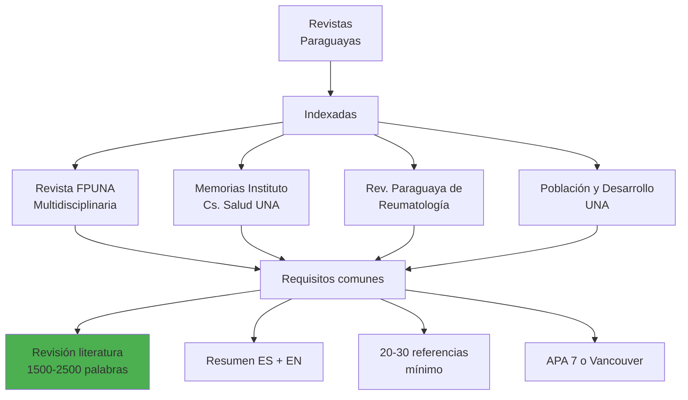

**Requisitos típicos para publicar:**
- Resumen estructurado en español e inglés
- Revisión de literatura sólida (1500-2500 palabras)
- Mínimo 20-30 referencias actualizadas (<5 años 60%)
- Formato de citación: APA 7 (cs. sociales) o Vancouver (medicina)
- Declaración de conflicto de intereses
- Aprobación ética si aplica

### CONACYT y Financiamiento

**Programas relevantes:**

1. **PRONII** (Programa Nacional de Incentivo a Investigadores)
   - Categoriza investigadores por productividad
   - Requiere publicaciones para categorizaciones
   - Incentivo económico mensual

2. **Proyectos CONACYT**
   - Financiamiento para investigación
   - Protocolo requiere revisión literatura rigurosa
   - Presupuesto: hasta $50,000 USD

3. **Becas de Postgrado**
   - Maestrías y doctorados
   - Protocolo de tesis con revisión sistemática
   - Financiamiento parcial o total

**Categorías PRONII:**

| Categoría | Publicaciones requeridas | Incentivo mensual |
|-----------|-------------------------|-------------------|
| Candidato | 1-2 en revistas indexadas | ₲3,000,000 |
| Nivel I | 3-5 papers + impacto | ₲5,000,000 |
| Nivel II | 6-10 papers + internacional | ₲8,000,000 |
| Nivel III | >10 papers + liderazgo | ₲12,000,000 |

### Salarios Investigación en Paraguay

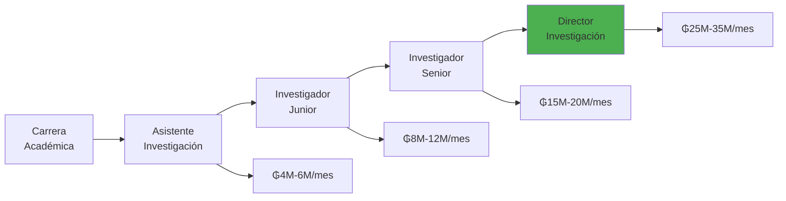

**Factores que aumentan salario:**
- Publicaciones internacionales
- Categoría PRONII
- Doctorado (PhD)
- Proyectos financiados
- Colaboraciones internacionales

---

## Próximos Pasos

Una vez que domines la revisión de literatura:

1. **Módulo 2: Metodología de Investigación** → Diseñar tu estudio
2. **Módulo 3: Análisis de Datos** → Procesar información
3. **Módulo 4: Redacción Académica** → Escribir tu paper
4. **Módulo 5: Presentación y Publicación** → Compartir hallazgos

---

## Reflexión Final: Por Qué Importa

La revisión de literatura NO es solo un "requisito burocrático" - es la FUNDACIÓN de tu investigación.

**Una revisión bien hecha:**

✅ Te ahorra MESES de trabajo al evitar duplicar estudios existentes  
✅ Te conecta con una comunidad académica GLOBAL  
✅ Fortalece la JUSTIFICACIÓN de tu investigación  
✅ Mejora la calidad de tus PREGUNTAS de investigación  
✅ Aumenta drásticamente tus chances de PUBLICACIÓN  
✅ Demuestra que conocés el campo profundamente

**La IA no reemplaza tu pensamiento crítico - lo AMPLIFICA.**

Usala para:
- Leer más rápido (screening de 100 papers en horas)
- Organizar mejor (matrices automáticas)
- Sintetizar con mayor profundidad (identificar patrones)
- Detectar gaps que pasarías por alto

Pero SIEMPRE vos sos el detective que interpreta las pistas, evalúa la evidencia, y resuelve el caso.

**Tu trabajo: Pensar, analizar, cuestionar, innovar.**  
**Trabajo de la IA: Acelerar, organizar, sugerir, asistir.**

---

**¿Preguntas?** Consulta con tu instructor o en el Slack #research-academia-2026

**Próximo módulo:** [02 - Metodología de Investigación](./02-metodologia-investigacion.md)
